# 📚 Comprehensive Notes on English Language Mastery

## A Complete Guide to Figures of Speech, Discourse Markers, Prosody, and Language in Society

---

# 📑 Table of Contents

1. [Lecture 1: Figures of Speech - Part 1](#lecture-1-figures-of-speech---part-1)
   - [Simile](#1-simile)
   - [Metaphor](#2-metaphor)
   - [Personification](#3-personification)
   - [Paradox](#4-paradox)
   - [Oxymoron](#5-oxymoron)
   - [Antithesis](#6-antithesis)
   - [Alliteration](#7-alliteration)

2. [Lecture 2: Figures of Speech - Part 2](#lecture-2-figures-of-speech---part-2)
   - [Alliteration (Advanced)](#1-alliteration-advanced)
   - [Irony](#2-irony)
   - [Pun](#3-pun)
   - [Juxtaposition](#4-juxtaposition)
   - [Synecdoche](#5-synecdoche)
   - [Anaphora](#6-anaphora)
   - [Metonymy](#7-metonymy)
   - [Litotes](#8-litotes)
   - [Hyperbole](#9-hyperbole)
   - [Euphemism](#10-euphemism)

3. [Lecture 3: Discourse Markers in Speech](#lecture-3-discourse-markers-in-speech)
   - [What is Discourse?](#what-is-discourse)
   - [Functions of Discourse Markers](#functions-of-discourse-markers)
   - [Types and Examples](#types-and-examples)

4. [Lecture 4: Rhythm & Pitch in English](#lecture-4-rhythm--pitch-in-english)
   - [Understanding Rhythm](#understanding-rhythm)
   - [Understanding Pitch](#understanding-pitch)
   - [Stress-Timed Rhythm](#stress-timed-rhythm)

5. [Lecture 5: Intonation in English](#lecture-5-intonation-in-english)
   - [Types of Intonation](#types-of-intonation)
   - [Functions of Intonation](#functions-of-intonation)

6. [Lecture 6: Language Use in Indian Society](#lecture-6-language-use-in-indian-society)
   - [Language Families of India](#language-families-of-india)
   - [Indian English Features](#indian-english-features)
   - [Myths and Misconceptions](#myths-and-misconceptions)

---

# Lecture 1: Figures of Speech - Part 1

## 🎯 What Are Figures of Speech?

> **Definition:** Figures of speech are literary devices that present ideas through comparison, creating rhetorical impact without literal interpretation.

### Why Learn Figures of Speech?

| Benefit | Description |
|---------|-------------|
| **Impact** | Takes language performance to the next level |
| **Command** | Demonstrates control over the language |
| **Confidence** | Adds to speaker's confidence |
| **Creativity** | Enables creative use of language |
| **Impression** | Makes communication memorable and impressive |

### How to Learn Figures of Speech?

Learning figures of speech is about **accommodation and absorption**, not simple addition (n+1). The best way to learn them is:
- Pay attention to how others use them
- Notice them in written and spoken language
- Practice using them in your own speech
- Don't memorize lists - absorb them naturally from context

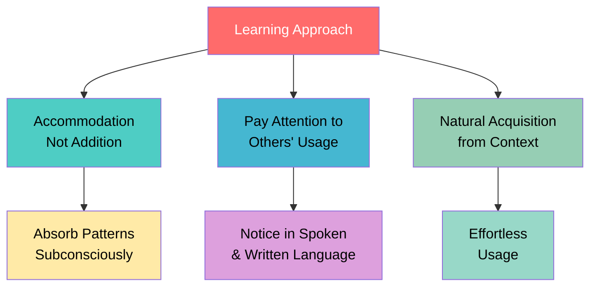

> **Key Insight:** Learning is NOT n+1 (addition). It's accommodation - absorbing new patterns into existing knowledge structures.

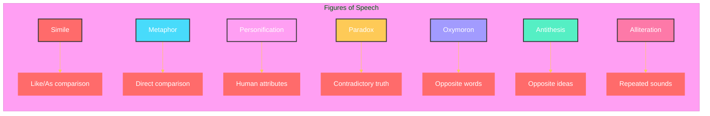
---

## 1. Simile

### What is Simile?

A comparison between two **unlike** things using **"like"** or **"as"** . Similes are so common that we often use them without realizing - "busy as a bee," "brave as a lion," "cool as a cucumber."

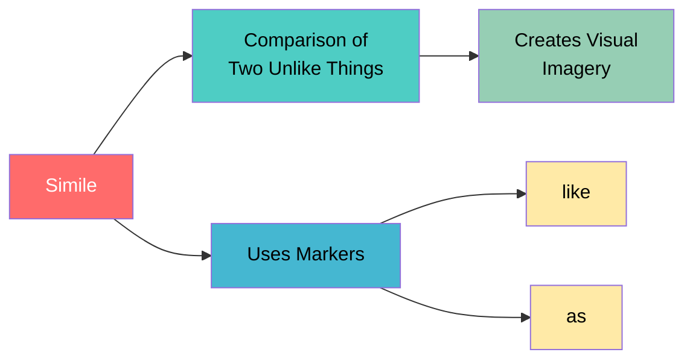

### Why Use Simile?

- Creates vivid mental pictures
- Makes abstract ideas concrete
- Adds poetic quality to language
- Enhances memorability

### Examples

| Example | Comparison | Meaning |
|---------|------------|---------|
| "O my love is like a red, red rose" | Love → Rose | Love is beautiful, passionate, fresh |
| "I wandered lonely as a cloud" | I → Cloud | The speaker was floating aimlessly, detached |
| "He is as modest as a hermit" | Modesty → Hermit | Extremely humble and simple |
| "A face as dull as lead" | Face → Lead | Expressionless, heavy, lifeless |
| "Cheeks like blushing cloud" | Cheeks → Cloud | Rosy, soft, glowing |
| "Eyes as bright as blazing star" | Eyes → Star | Brilliant, intense, captivating |
| "Bold as a hawk, steady as a clock" | Boldness → Hawk<br/>Steadiness → Clock | Fearless and consistent |

> 🎨 **Fun Fact:** The word "simile" comes from Latin "similis" meaning "like" or "similar." Shakespeare used over 500 similes in his works!

---

## 2. Metaphor

### What is Metaphor?

A **direct comparison** where a word or phrase is applied to something it doesn't literally describe, suggesting likeness without using "like" or "as."

**Why**: Creates powerful, compact imagery without using "like" or "as"

**How**: State that one thing IS another thing

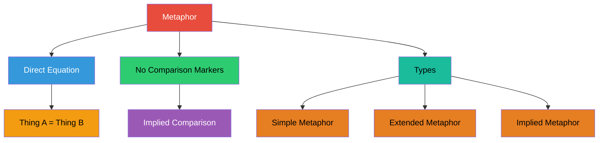

### Simile vs Metaphor

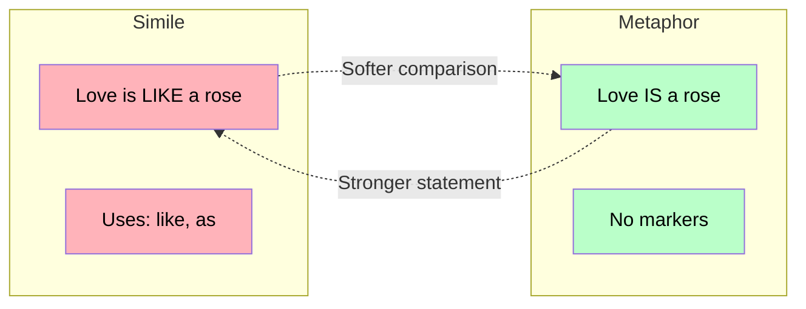

### Examples

| Example | Literal Meaning | Metaphorical Meaning |
|---------|-----------------|---------------------|
| "This is the icing on the cake" | Actual cake decoration | The best part of something already good |
| "Silence is golden" | Metal value | Being quiet has great worth |
| "Life is a roller coaster" | Amusement ride | Life has highs and lows |
| "All the world's a stage. All men and women merely **players**" | Theatre platform | Everyone plays roles in life |

> 🎭 **Fun Fact:** The word "metaphor" itself is a metaphor! It comes from Greek "metapherein" meaning "to carry across" - it carries meaning from one thing to another.

---

## 3. Personification

### What is Personification?

Attributing **human qualities, emotions, or actions** to inanimate objects, ideas, or animals.

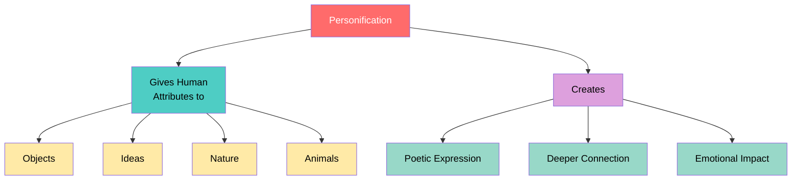

### Why Personification?

- Makes abstract concepts relatable
- Creates emotional connections with readers
- Adds life and movement to descriptions
- Makes writing more engaging and memorable

### Examples

| Example | What's Personified | Human Quality Given |
|---------|-------------------|---------------------|
| "Books are my favorite **companions**" | Books | Friendship, companionship |
| "The stars **winked** at us from the distant black sky" | Stars | Playful winking (human action) |
| "The moon affects her as it does a woman" | Moon | Feminine influence (Hemingway) |
|"The old man always though of her as feminie."|In Ernest Hemingway's "The Old Man and the Sea," the sea itself is personified as feminine - sometimes giving, sometimes withholding, much like a woman.|This technique is called "anthropomorphism."|

> 📚 **Fun Fact:**  Personification is one of the most common devices in advertising - "M&M's melt in your mouth, not in your hands" (giving chocolate human-like behavior).

---

## 4. Paradox

### What is Paradox?

A statement that appears **self-contradictory** but contains a **deeper truth** upon reflection.
**Why**: Makes writing thought-provoking and intellectually engaging

**How**: Present two conflicting ideas that together reveal a truth

**Features of Paradox**:
- True but sounds impossible or conflicting
- Contains two contrasting facts
- Used as thought-provoking elements in literature

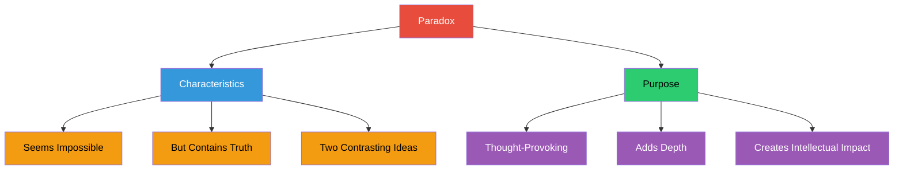

### Paradox vs Oxymoron

| Feature | Paradox | Oxymoron |
|---------|---------|----------|
| **Scope** | Contradictory **ideas** | Contradictory **words** |
| **Length** | Usually full statement | Usually two words |
| **Example** | "Men work together whether they work together or apart" | "Bittersweet" |

### Examples

| Example | Source | Deeper Meaning |
|---------|--------|----------------|
| "Men work together whether they work together or apart" | Robert Frost | Unity exists even in separation |
| "All animals are equal, but some are more equal than others" | George Orwell | Satire on political hypocrisy |
| "I must be cruel to be kind" | Shakespeare (Hamlet) | Short-term pain for long-term good |

> 🤔 **Fun Fact:** The famous "liar paradox" - "This statement is false" - has puzzled philosophers for over 2,000 years! If it's true, it's false; if it's false, it's true. Paradoxes were heavily used by Zen masters to help students achieve enlightenment by breaking conventional thinking.

---

## 5. Oxymoron

### What is Oxymoron?

A figure of speech combining **two contradictory words** placed together for dramatic effect.

**Why**: Expresses conflicting thoughts or complex ideas concisely

**How**: Combine two opposite words

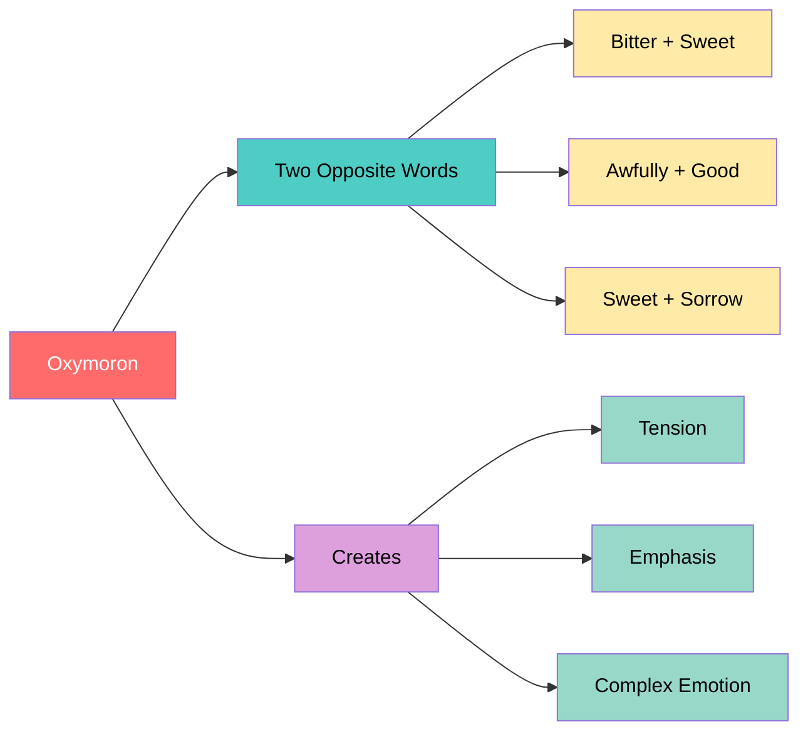

### Examples

| Oxymoron | Analysis |
|----------|----------|
| "Bittersweet experience" | Something both pleasant and painful |
| "Awfully good movie" | Surprisingly good / Very good |
| "Parting is such sweet sorrow" | Sad to leave but sweet to have met (Romeo & Juliet) |
| "O brawling love, O loving hate" | Shakespeare's description of conflicted emotions |

> 📝 **Fun Fact:** The word "oxymoron" itself is an oxymoron! "Oxys" means "sharp" and "moros" means "dull" in Greek - a sharp-dull word!

---

## 6. Antithesis

### What is Antithesis?

Two **opposing ideas** placed in a **parallel grammatical structure** for contrast and rhythm.

**Why**: Creates rhythmic, memorable statements through contrast

**How**: Use opposite ideas in parallel grammatical form

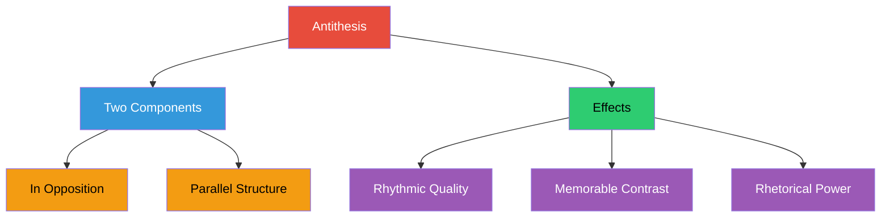

### Key Feature: Parallel Structure

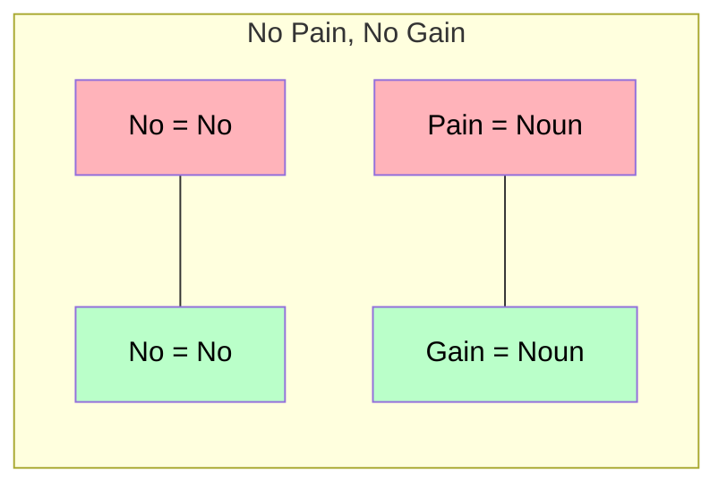

### Examples

| Antithesis | Meaning |
|------------|---------|
| "No pain, no gain" | Effort leads to reward |
| "Man proposes, God disposes" | Human plans vs. divine will |
| "To err is human, to forgive divine" | Human weakness vs. divine quality |

> ⚖️ **Fun Fact:** John F. Kennedy's famous "Ask not what your country can do for you, ask what you can do for your country" is a perfect example of antithesis that changed American political rhetoric forever!  Martin Luther King Jr.'s "I Have a Dream" speech is famous for its use of antithesis - "I have a dream that my four little children will one day live in a nation where they will not be judged by the color of their skin but by the content of their character."

---

## 7. Alliteration

### What is Alliteration?

The **repetition of initial sounds** in adjacent or closely connected words.

**Why**: Creates rhythm, musicality, and makes phrases memorable

**How**: Use same sound at the beginning of multiple words

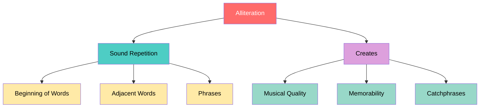

### Examples
- "**B**etty **b**aked **b**uns **b**eside **b**acons"
- "**T**ik**t**ok" → "T" sound repeated
- "**C**oca-**C**ola" → "C" sound repeated
- "**P**ay**P**al" → "P" sound repeated
- "**P**e**pp**a **P**ig" → "P" sound repeated
- "**K**it**K**at" → "K" sound repeated


> 🎵 **Fun Fact:** Many brand names use alliteration because it makes them easier to remember - Dunkin' Donuts, Best Buy, Krispy Kreme, and even Marvel characters like Peter Parker, Bruce Banner, and Reed Richards!

---

# Lecture 2: Figures of Speech - Part 2

## 1. Alliteration (Advanced)

### Types of Alliteration

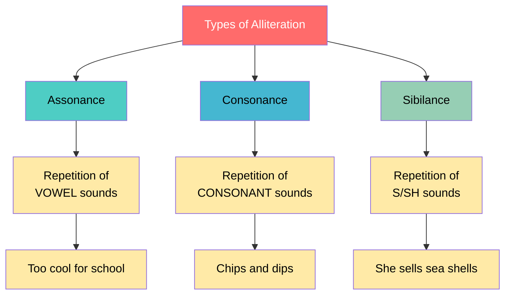

| Type | Definition | Example |
|------|------------|---------|
| **Assonance** | Repetition of vowel sounds | "Too cool for school" (oo sound) |
| **Consonance** | Repetition of consonant sounds | "Chips and dips" (p sound) |
| **Sibilance** | Repetition of s/sh sounds | "She sells sea shells on the sea shore" |

> 🗣️ **Fun Fact:** Tongue twisters like "Peter Piper picked a peck of pickled peppers" are extreme forms of alliteration used by actors and public speakers to improve their diction!

---

## 2. Irony

### What is Irony?

A situation where the **actual outcome** is the **opposite** of what was expected.

**Why**: Creates humorous or sad effects, adds depth to expression

**How**: Present situations where outcomes contradict expectations

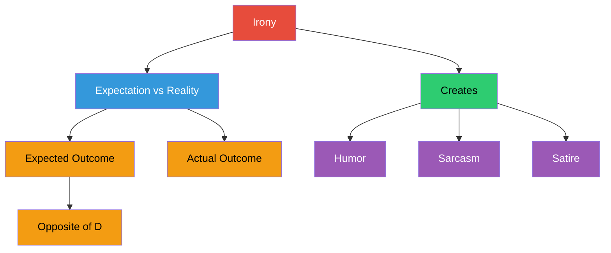

### Examples of Ironic Situations

| Situation | Why It's Ironic |
|-----------|-----------------|
| A nurse who faints at the sight of blood | Expected: comfortable with blood / Reality: fears it |
| Snowball fight cancelled due to heavy snowfall | Expected: snow enables snowball fights / Reality: too much snow cancels it |
| A proofreader's writing contains errors | Expected: error-free / Reality: contains mistakes |
| A policeman scared of guns | Expected: comfortable with weapons / Reality: fears them |
| A lawyer afraid of public speaking | Expected: skilled speaker / Reality: fears speaking |

> 🎭 **Fun Fact:** There are three types of irony: **Verbal irony** (saying the opposite of what you mean), **Situational irony** (outcome opposite to expectation), and **Dramatic irony** (audience knows something characters don't).

---

## 3. Pun

### What is Pun?

A play on words that have **multiple meanings** or **similar sounds** but different meanings. Puns are considered the "lowest form of humor" but also the highest form of wit - they require linguistic intelligence to create and understand!

**Why**: Creates humor, wit, and multiple layers of meaning

**How**: Use words with double meanings in a clever way

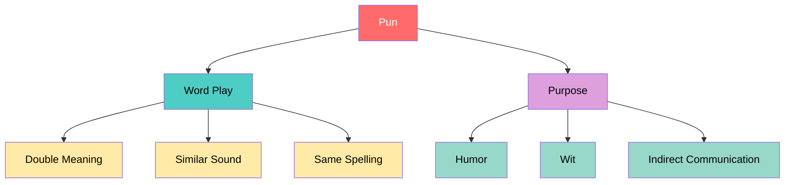

### Example

- "Can **February March**? No, but **April May**"
- "I used to be a baker, but I couldn't make enough dough"
- "Time flies like an arrow; fruit flies like a banana"

| Word | Meaning 1 | Meaning 2 |
|------|-----------|------------|
| March | Month | To walk in formation |
| April | Month | (Part of name) |
| May | Month | Expressing possibility |

> 😄 **Fun Fact:** Shakespeare was a master of puns, using over 3,000 of them in his plays! He even made puns in tragic scenes - like Mercutio's dying words in Romeo and Juliet: "Ask for me tomorrow and you shall find me a grave man." 

---

## 4. Juxtaposition

### What is Juxtaposition?

Placing **two contrasting ideas** side by side to highlight their differences or similarities.

**Why**: Highlights differences or similarities, creates contrast

**How**: Place opposite concepts side by side

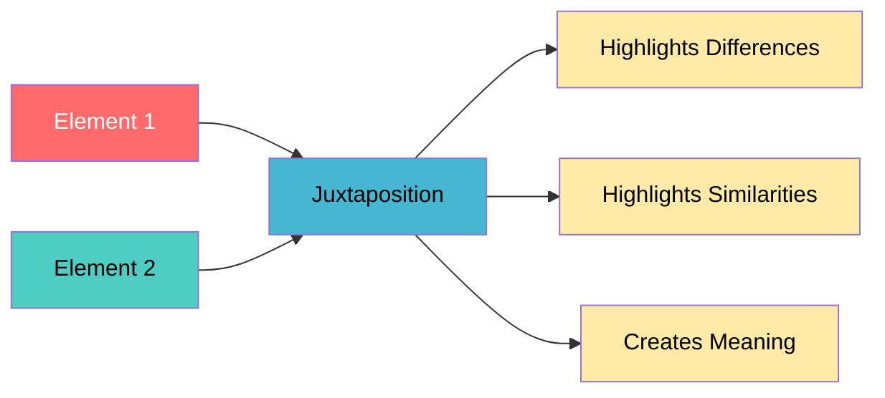

### Examples

| Juxtaposition | Contrast |
|---------------|----------|
| "All is fair in love and war" | Love (peace) vs. War (conflict) |
| "A living dead person" | Living vs. Dead |
|"It was the best of times, it was the worst of times"| |
### Related Concepts

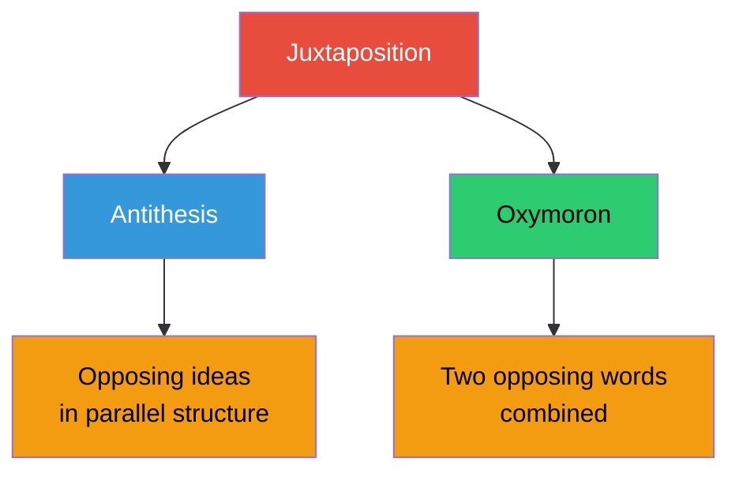
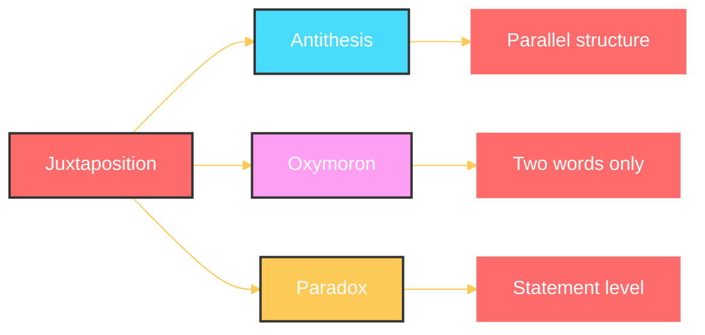
---

## 5. Synecdoche

### What is Synecdoche?

A figure of speech where a **part** represents the **whole** or the **whole** represents a **part**.


**Why**: Creates concise, powerful references

**How**: Use part for whole or whole for part

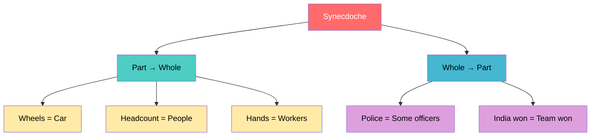

### Examples

| Example | Part/Whole | Meaning |
|---------|------------|---------|
| "He fell asleep on the wheels" | Wheels (part) → Car (whole) | Fell asleep while driving |
| "Can we have a headcount?" | Head (part) → Person (whole) | Count the number of people |
| "The police arrived" | Police (whole) → Some officers (part) | Some police officers came |
|"Lend me your **ears**||Ears represent attention.|

> 🚗 **Fun Fact:** When we say "nice wheels" to compliment a car, we're using synecdoche. Similarly, calling businessmen "suits" or calling manual laborers "hands" are all examples of this figure of speech!

---

## 6. Anaphora

### What is Anaphora?

The **repetition of a word or phrase** at the **beginning** of successive clauses or sentences.

**Why**: Creates rhythm, emphasis, and powerful rhetorical effect

**How**: Repeat the same word/phrase at start of successive clauses

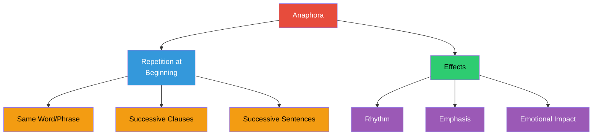

### Examples

| Example | Repeated Word | Context |
|---------|---------------|---------|
| "Stay home, stay safe" | "Stay" | Public health slogan |
| "**And** a woman drew her long black hair... **and** fiddled whisper music... **and** bats with baby faces..." "And" | T.S. Eliot's "The Waste Land" |

### Anaphora vs Alliteration

| Feature | Anaphora | Alliteration |
|---------|----------|--------------|
| What repeats | Whole word/phrase | Single sound |
| Position | Beginning of clauses | Beginning of words |
| Example | "We shall fight... we shall fight..." | "Peter Piper picked..." |
|Level|Lexical Level|Phonetic Level|

> 🎤 **Fun Fact:** Martin Luther King Jr.'s "I Have a Dream" speech is one of the most famous examples of anaphora, repeating "I have a dream" eight times and "Let freedom ring" ten times!

---

## 7. Metonymy

### What is Metonymy?

Using the **name of one thing** to refer to something **closely associated** with it.

**Why**: Creates concise, vivid references

**How**: Use a related term to refer to something else

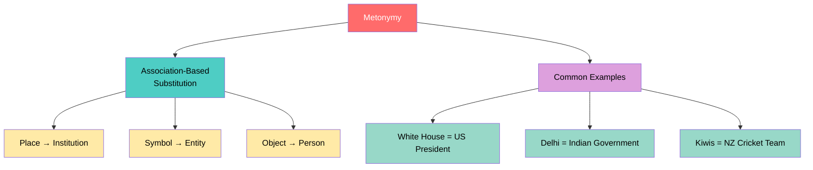

### Examples

| Metonymy | Literal Meaning | Actual Reference |
|----------|-----------------|------------------|
| "The **White House** wished Diwali" | The building wished | The President/Administration |
| "**Delhi** has to decide" | The city decides | The Central Government |
| "The **Kiwis** played well" | The bird played | New Zealand cricket team |
| "**Kangaroos** won" | The animal won | Australian team |

> 🏛️ **Fun Fact:** In journalism, metonymy is extremely common. "The Pentagon" refers to the US Department of Defense, "Wall Street" means the financial industry, and "Hollywood" stands for the American film industry!

---

## 8. Litotes

### What is Litotes?

Using a **negative statement** to express something **positive** (understatement through negation).

**Why**: Creates emphasis through understatement

**How**: Negate the opposite of what you want to say

```mermaid
graph LR
    A[Litotes] --> B[Negative Form]
    B --> C["Not bad = Good"]
    B --> D["Not without truth = True"]
    B --> E["Not unlike = Similar to"]
    
    A --> F[Effect]
    F --> G[Understatement]
    F --> H[Irony]
    F --> I[Modesty]
    
    style A fill:#E74C3C,color:#fff
    style B fill:#3498DB,color:#fff
    style C fill:#F39C12,color:#000
    style D fill:#F39C12,color:#000
    style E fill:#F39C12,color:#000
    style F fill:#2ECC71,color:#000
    style G fill:#9B59B6,color:#fff
    style H fill:#9B59B6,color:#fff
    style I fill:#9B59B6,color:#fff
```

### Examples

| Litotes | Actual Meaning |
|---------|----------------|
| "**Not bad**" | Good |
| "What he said is **not without truth**"  | Has some truth |
| "**Filthy rich**" | Extremely rich |
| "He's no fool" | He's intelligent |

> 🗣️ **Fun Fact:** The British are famous for using litotes in everyday speech. "Not too shabby" means excellent, and "I wouldn't say no" means "Yes, please!"

---

## 9. Hyperbole

### What is Hyperbole?

**Deliberate exaggeration** for emphasis or effect, not meant to be taken literally.

**Why**: Creates emphasis, humor, and impact

**How**: Exaggerate beyond reality

```mermaid
graph TB
    A[Hyperbole] --> B[Exaggeration]
    B --> C[For Emphasis]
    B --> D[Not Literal]
    B --> E[Creates Impact]
    
    A --> F[Examples]
    F --> G["Waiting forever"]
    F --> H["Pin drop silence"]
    F --> I["Cats and dogs"]
    
    style A fill:#FF6B6B,color:#fff
    style B fill:#4ECDC4,color:#000
    style C fill:#FFEAA7,color:#000
    style D fill:#FFEAA7,color:#000
    style E fill:#FFEAA7,color:#000
    style F fill:#DDA0DD,color:#000
    style G fill:#98D8C8,color:#000
    style H fill:#98D8C8,color:#000
    style I fill:#98D8C8,color:#000
```

### Examples

| Hyperbole | Literal Meaning |
|-----------|-----------------|
| "I have been waiting **forever** for him to say yes" | Waiting a very long time |
| "You speak so sweet, I'll get a **cavity**" | Your speech is very sweet/flattering |
| "It's raining **cats and dogs**" | It's raining heavily |
| "I'm so hungry I could **eat a horse**" | I'm extremely hungry |

> 😂 **Fun Fact:** The phrase "raining cats and dogs" might come from old English streets where heavy rain would wash dead animals through the streets. Thankfully, it's now just a colorful exaggeration! Hyperbole is the basis of many comedy routines - Jerry Seinfeld often uses hyperbole: "I'm not comfortable with people who know where their meat comes from!"

---

## 10. Euphemism

### What is Euphemism?

Using **mild or indirect words** to express something **unpleasant, taboo, or embarrassing**.


**Why**: Makes uncomfortable topics more acceptable

**How**: Substitute harsh terms with gentler ones

```mermaid
graph TB
    A[Euphemism] --> B[Replaces]
    B --> C[Taboo Topics]
    B --> D[Embarrassing Things]
    B --> E[Harsh Realities]
    
    A --> F[Common Areas]
    F --> G[Death]
    F --> H[Employment]
    F --> I[Body/Health]
    F --> J[Crime]
    
    style A fill:#E74C3C,color:#fff
    style B fill:#3498DB,color:#fff
    style C fill:#F39C12,color:#000
    style D fill:#F39C12,color:#000
    style E fill:#F39C12,color:#000
    style F fill:#2ECC71,color:#000
    style G fill:#9B59B6,color:#fff
    style H fill:#9B59B6,color:#fff
    style I fill:#9B59B6,color:#fff
    style J fill:#9B59B6,color:#fff
```

### Examples

| Euphemism | Direct Meaning | Category |
|-----------|---------------|----------|
| "Passed away" | Died | Death |
| "Guest worker" | Temporary/daily wage worker | Employment |
| "Downsizing" | Firing people | Employment |
| "Well-fed" | Overweight | Body |
| "Correctional facility" | Jail/Prison | Crime |
| "Outspoken" | Bossy/Nasty | Personality |

> 🤫 **Fun Fact:** The word "euphemism" comes from Greek "eu" (good) + "pheme" (speech) - literally "good speech." During the Victorian era, even piano legs were covered because they were considered too suggestive - talk about euphemism!

---

# Lecture 3: Discourse Markers in Speech

## What is Discourse?

> **Discourse** is language beyond the sentence level. When we use two or more sentences to convey meaning in context, we create discourse.

```mermaid
graph TB
    A[Language Levels] --> B[1. Sounds]
    A --> C[2. Words]
    A --> D[3. Sentences]
    A --> E[4. DISCOURSE]
    
    B --> B1[Phonetics/Phonology]
    C --> C1[Morphology/Lexicon]
    D --> D1[Syntax/Grammar]
    E --> E1[Sentences in Context]
    
    style A fill:#E74C3C,color:#fff
    style B fill:#3498DB,color:#fff
    style C fill:#2ECC71,color:#000
    style D fill:#F39C12,color:#000
    style E fill:#FF6B6B,color:#fff
    style B1 fill:#85C1E9,color:#000
    style C1 fill:#82E0AA,color:#000
    style D1 fill:#F8C471,color:#000
    style E1 fill:#F1948A,color:#000
```

---

## What Are Discourse Markers?

> Discourse markers are words, phrases, or expressions that help **connect ideas**, **organize speech**, and **guide listeners** through conversations. They are often called "fillers" but are actually very important for fluent communication.

```mermaid
graph TB
    A[Discourse Markers] --> B[Also Known As]
    B --> C[Connectors]
    B --> D[Fillers]
    B --> E[Transition Words]
    
    A --> F[Functions]
    F --> G[Connect Ideas]
    F --> H[Manage Flow]
    F --> I[Express Attitude]
    F --> J[Buy Thinking Time]
    
    style A fill:#FF6B6B,color:#fff
    style B fill:#4ECDC4,color:#000
    style C fill:#FFEAA7,color:#000
    style D fill:#FFEAA7,color:#000
    style E fill:#FFEAA7,color:#000
    style F fill:#DDA0DD,color:#000
    style G fill:#98D8C8,color:#000
    style H fill:#98D8C8,color:#000
    style I fill:#98D8C8,color:#000
    style J fill:#98D8C8,color:#000
```

---

## Why Are Discourse Markers Important?

```mermaid
graph LR
    A[Without Discourse Markers] --> B[Abrupt Speech]
    A --> C[Artificial Sound]
    A --> D[Less Coherent]
    
    E[With Discourse Markers] --> F[Natural Flow]
    E --> G[Context Appropriate]
    E --> H[More Coherent]
    
    style A fill:#FF6B6B,color:#fff
    style B fill:#FFB3BA,color:#000
    style C fill:#FFB3BA,color:#000
    style D fill:#FFB3BA,color:#000
    style E fill:#2ECC71,color:#000
    style F fill:#BAFFC9,color:#000
    style G fill:#BAFFC9,color:#000
    style H fill:#BAFFC9,color:#000
```

---

## Functions of Discourse Markers

### 1. Conversation Starters
| Marker | Example |
|--------|---------|
| "So..." | "So, I want to tell you something" |
| "Well..." | "Well, first of all..." |
| "To begin with..." | "To begin with, this property..." |
| "For starters..." | "For starters, let's have tea" |

### 2. Positive Opinion Markers
| Marker | Example |
|--------|---------|
| "Wow!" | "Wow! You look dashing!" |
| "Absolutely!" | "Absolutely, that's correct" |
| "Yeah!" | "Yeah, I agree completely" |

### 3. Negative Opinion/Indifference Markers
| Marker | Example |
|--------|---------|
| "Honestly..." | "Honestly, I didn't like the movie" |
| "I guess so" | "Do you think it should be banned? I guess so" |
| "I need to think" | "I mean, I need to think about it" |

### 4. Adding Information
| Marker | Example |
|--------|---------|
| "Just to add..." | Used when contributing to conversation |
| "To my knowledge..." | "To my knowledge, you can also use it as floor cleaner" |
| "On top of that..." | "She's obedient; on top of that, she's smart" |
| "Another thing..." | Used to introduce additional points |

### 5. Emphasis Markers
| Marker | Example |
|--------|---------|
| "Actually..." | "Actually, here's the thing" |
| "As a matter of fact..." | "As a matter of fact, it was him" |
| "In fact..." | "In fact, I know the truth" |
| "Hands down..." | "This is hands down the best pizza" |

### 6. Clarification Markers
| Marker | Used In |
|--------|---------|
| "You see this?" | Checking understanding |
| "Did you get that?" | Classroom/Instructional context |
| "You understand?" | Ensuring comprehension |

### 7. Contrast Markers
| Marker | Example |
|--------|---------|
| "That said..." | Acknowledging one point but contrasting |
| "At the same time..." | "This could be minor; at the same time, it's a symptom" |

### 8. Conclusion Markers
| Marker | Example |
|--------|---------|
| "Overall..." | Summarizing |
| "All in all..." | "All in all, it was a decent seminar" |
| "In a nutshell..." | Brief summary |
| "In short..." | Concise conclusion |
| "At the end of the day..." | Final thought |

---

## Example Conversation with Discourse Markers

> **So**, I want to tell you something.
> **Oh**, what is it?
> **You know**, I bought a villa in ECR last week.
> **You know**... **I mean**, **like**... there is an EMI... **great news**!
> How much do you have to pay?
> **That's a lot!**
> **Well, honestly** it is... **anyway**...
> **So, you know... ah... hmm... right... well... anyway... actually**, I'm seriously thinking about a 3 BHK in the SVG complex.
> **Awesome!**
> **Okay...**

> 📊 **Analysis:** Read the same conversation without the bold markers - it becomes abrupt, artificial, and loses the natural conversational flow. The markers make it sound like genuine human interaction.

**At the beginning:**
- "**So**, I bought a new car last week..."
- "**Well**, honestly, it was a great experience..."
- "**Anyway**, let's move on to the next point..."

**In the middle:**
- "It's a great movie, **you know**, with amazing special effects."
- "I mean, it's not that difficult."
- "**Actually**, I changed my mind."

**At the end:**
- "It was a decent seminar, **all in all**."
- "**In a nutshell**, taxes may increase."
- "**At the end of the day**, it's your choice."


**Fun Fact**: Native English speakers use discourse markers in about 80% of their conversations. Without them, speech sounds robotic and unnatural!

---

## Key Insight

> **Discourse markers are NOT insignificant fillers.** They serve crucial functions in organizing speech, conveying attitude, managing conversation flow, and making language sound natural and impactful.

```mermaid
graph TB
    A[Discourse Markers] --> B[Formal Speech]
    A --> C[Informal Speech]
    A --> D[Written Language]
    
    B --> B1[Connect ideas logically]
    C --> C1[Create natural flow]
    D --> D1[Show relationships]
    
    style A fill:#FF6B6B,color:#fff
    style B fill:#4ECDC4,color:#000
    style C fill:#45B7D1,color:#000
    style D fill:#96CEB4,color:#000
    style B1 fill:#FFEAA7,color:#000
    style C1 fill:#FFEAA7,color:#000
    style D1 fill:#FFEAA7,color:#000
```

---

# Lecture 4: Rhythm, Pitch & Prosody in English

> **Prosodic features** (also called suprasegmental features) that exist beyond individual sounds and words, affecting how we convey meaning through speech.

## What are These Features?

These are **extra-linguistic/prosodic features** of speech that go beyond words to convey meaning through how we speak.

```mermaid
%%{init: {'theme': 'base', 'themeVariables': { 'primaryColor': '#FF6B6B', 'primaryTextColor': '#fff', 'primaryBorderColor': '#FF6B6B', 'lineColor': '#FECA57', 'secondaryColor': '#48DBFB', 'tertiaryColor': '#FF9FF3'}}}%%
graph TD
    A[Prosodic Features] --> B[Rhythm]
    A --> C[Pitch]
    A --> D[Stress]
    A --> E[Intonation]
    
    B --> B1[Pattern of syllables]
    B --> B2["Taal/Laya in music"]
    
    C --> C1[High/Low voice]
    C --> C2[Frequency of vibration]
    
    D --> D1[Syllable prominence]
    D --> D2[Word emphasis]
    
    E --> E1[Rising/Falling]
    E --> E2[Melody of speech]
    
    style A fill:#FF6B6B,stroke:#333,stroke-width:2px,color:#fff
    style B fill:#48DBFB,stroke:#333,stroke-width:2px,color:#fff
    style C fill:#FF9FF3,stroke:#333,stroke-width:2px,color:#fff
    style D fill:#FECA57,stroke:#333,stroke-width:2px,color:#fff
    style E fill:#A29BFE,stroke:#333,stroke-width:2px,color:#fff
```

---

## Understanding Rhythm

### What is Rhythm?

> **Rhythm** is the pattern of stressed and unstressed syllables in speech, creating a flow similar to music or dance.

**Why**: Makes speech natural, musical, and engaging

**How**: Alternate between stressed (prominent) and unstressed syllables

**Key Points**:
- English is **stress-timed** (stressed syllables occur at regular intervals)
- Similar to "taal" or "laya" in Indian music
- Creates flow and prevents monotony
- Machine speech lacks natural rhythm

**Example**:
- Without rhythm: "I thought your brother was a bus conductor" (monotonous)
- With rhythm: "I **thought** your **brother** was a **bus** con**duc**tor" (natural)


```mermaid
graph TB
    A[Rhythm] --> B[Meaning]
    B --> C[Greek: flow]
    B --> D[Hindi: taal/laya]
    
    A --> E[Found In]
    E --> F[Speech]
    E --> G[Poetry]
    E --> H[Music]
    E --> I[Dance]
    
    A --> J[Based On]
    J --> K[Stressed syllables]
    J --> L[Pause groups]
    J --> M[Timing patterns]
    
    style A fill:#FF6B6B,color:#fff
    style B fill:#4ECDC4,color:#000
    style C fill:#FFEAA7,color:#000
    style D fill:#FFEAA7,color:#000
    style E fill:#DDA0DD,color:#000
    style F fill:#98D8C8,color:#000
    style G fill:#98D8C8,color:#000
    style H fill:#98D8C8,color:#000
    style I fill:#98D8C8,color:#000
    style J fill:#45B7D1,color:#000
    style K fill:#FFB3BA,color:#000
    style L fill:#FFB3BA,color:#000
    style M fill:#FFB3BA,color:#000
```

### English is a Stress-Timed Language

In stress-timed languages, stressed syllables occur at **roughly regular intervals**, regardless of the number of unstressed syllables between them.

```mermaid
graph LR
    A[Stress-Timed Rhythm] --> B["TUM-te-TUM<br/>pattern"]
    B --> C[Stressed syllables<br/>at regular intervals]
    C --> D[Unstressed syllables<br/>compressed between]
    
    style A fill:#FF6B6B,color:#fff
    style B fill:#4ECDC4,color:#000
    style C fill:#FFEAA7,color:#000
    style D fill:#FFEAA7,color:#000
```

### How Stress Changes Meaning

Consider this sentence: **"I thought your brother was a bus conductor."**

```mermaid
graph TB
    A["I thought your brother was a bus conductor"] --> B[7 Different Meanings]
    
    B --> C["**I** thought... = Not someone else"]
    B --> D["I **thought**... = I was mistaken"]
    B --> E["I thought **your**... = Not someone else's brother"]
    B --> F["I thought your **brother**... = Not sister/friend"]
    B --> G["I thought your brother **was**... = He no longer is"]
    B --> H["I thought your brother was a **bus**... = Not train/other"]
    B --> I["I thought your brother was a bus **conductor**... = Not driver"]
    
    style A fill:#E74C3C,color:#fff
    style B fill:#3498DB,color:#fff
    style C fill:#FF6B6B,color:#fff
    style D fill:#4ECDC4,color:#000
    style E fill:#45B7D1,color:#000
    style F fill:#96CEB4,color:#000
    style G fill:#FFEAA7,color:#000
    style H fill:#DDA0DD,color:#000
    style I fill:#98D8C8,color:#000
```

---

## Understanding Pitch

### What is Pitch?

> **Pitch** is the highness or lowness of voice, determined by the frequency of vocal cord vibration.

**Why**: Conveys emotions and attitudes

**How**: Control the frequency of vocal cord vibration

```mermaid
graph TB
    A[Pitch] --> B[High Pitch]
    A --> C[Low Pitch]
    
    B --> B1[Joy]
    B --> B2[Excitement]
    B --> B3[Triumph]
    B --> B4[Ecstasy]
    
    C --> C1[Shock]
    C --> C2[Dullness]
    C --> C3[Guilt]
    C --> C4[Sadness]
    
    style A fill:#FF6B6B,color:#fff
    style B fill:#4ECDC4,color:#000
    style C fill:#45B7D1,color:#000
    style B1 fill:#BAFFC9,color:#000
    style B2 fill:#BAFFC9,color:#000
    style B3 fill:#BAFFC9,color:#000
    style B4 fill:#BAFFC9,color:#000
    style C1 fill:#FFB3BA,color:#000
    style C2 fill:#FFB3BA,color:#000
    style C3 fill:#FFB3BA,color:#000
    style C4 fill:#FFB3BA,color:#000
```

### Pitch Conveys Emotion

| Try saying "Thank you" with... | It conveys... |
|--------------------------------|---------------|
| High pitch, enthusiastic | Genuine gratitude |
| Low pitch, flat | Indifference |
| Falling pitch | Sarcasm |
| Rising pitch | Questioning/Unsure |

---

## The Relationship Between Rhythm and Pitch

```mermaid
graph TB
    A[Vocal Cord Vibration] --> B[Frequency]
    B --> C[Pitch]
    C --> D[High or Low]
    
    E[Syllable Organization] --> F[Stress Patterns]
    F --> G[Rhythm]
    G --> H[Flow of Speech]
    
    C --> G
    G --> C
    
    style A fill:#E74C3C,color:#fff
    style B fill:#3498DB,color:#fff
    style C fill:#FF6B6B,color:#fff
    style D fill:#FFB3BA,color:#000
    style E fill:#2ECC71,color:#000
    style F fill:#F39C12,color:#000
    style G fill:#4ECDC4,color:#000
    style H fill:#BAFFC9,color:#000
```

---

## Why Rhythm and Pitch Matter

```mermaid
graph LR
    A[Without Rhythm] --> B[Monotonous Speech]
    B --> C[Like Robot Speech]
    B --> D[No Emotional Depth]
    
    E[With Rhythm] --> F[Dynamic Speech]
    F --> G[Engaging]
    F --> H[Emotionally Rich]
    
    style A fill:#FF6B6B,color:#fff
    style B fill:#FFB3BA,color:#000
    style C fill:#FFB3BA,color:#000
    style D fill:#FFB3BA,color:#000
    style E fill:#2ECC71,color:#000
    style F fill:#BAFFC9,color:#000
    style G fill:#BAFFC9,color:#000
    style H fill:#BAFFC9,color:#000
```

### Virginia Woolf on Rhythm:

> "Style is a very simple matter; it is all rhythm. Once you get that, you cannot use the wrong words... A sight, an emotion creates this wave in the mind, long before it makes words to fit it."

### David Crystal on Rhythm and Pitch:

> "Pitch, loudness and tempo combine to make up language's expression of rhythm. English uses stressed syllables, produced at roughly regular intervals of time... which we can tap out in a 'tum-te-tum' way."

---

## Practical Exercise

### Psalm of Life (H.W. Longfellow) - Mark the Rhythm

```
Tell me not in mournful numbers,
Life is but an empty dream!
For the soul is dead that slumbers,
And things are not what they seem.

Life is real! Life is earnest!
And the grave is not its goal;
Dust thou art, to dust returnest,
Was not spoken of the soul.
```

**How to practice:**
1. Listen to the poem being read/sung online
2. Mark the stressed syllables
3. Notice the pattern of stressed and unstressed syllables
4. Practice speaking with the same rhythm

> 🎵 **Fun Fact:** English poetry traditionally uses patterns called "metrical feet." The most common is the iamb (unstressed-stressed), which mimics the natural rhythm of English speech: da-DUM da-DUM da-DUM. Shakespeare wrote almost entirely in iambic pentameter!

---

# Lecture 5: Intonation in English

## What is Intonation?

> **Intonation** is the **melody of speech** - the rise and fall of pitch when we speak. It's a feature of pronunciation that becomes prominent only in spoken language.

```mermaid
graph TB
    A[Intonation] --> B[What It Is]
    B --> C[Melody of Speech]
    B --> D[Variation in Pitch]
    B --> E[Not Visible in Writing]
    
    A --> F[Related Features]
    F --> G[Stress]
    F --> H[Tone]
    F --> I[Pitch]
    F --> J[Rhythm]
    
    style A fill:#E74C3C,color:#fff
    style B fill:#3498DB,color:#fff
    style C fill:#F39C12,color:#000
    style D fill:#F39C12,color:#000
    style E fill:#F39C12,color:#000
    style F fill:#2ECC71,color:#000
    style G fill:#FFB3BA,color:#000
    style H fill:#FFB3BA,color:#000
    style I fill:#FFB3BA,color:#000
    style J fill:#FFB3BA,color:#000
```
## Why is Intonation Important?

```mermaid
%%{init: {'theme': 'base', 'themeVariables': { 'primaryColor': '#FF6B6B', 'primaryTextColor': '#fff', 'primaryBorderColor': '#FF6B6B', 'lineColor': '#FECA57', 'secondaryColor': '#48DBFB', 'tertiaryColor': '#FF9FF3'}}}%%
graph TD
    A[Intonation Functions] --> B[Identifies Sentence Type]
    A --> C[Resolves Ambiguity]
    A --> D[Conveys Attitude]
    A --> E[Shows Emotion]
    
    B --> B1["Statement or Question?"]
    C --> C2["Different meanings"]
    D --> D3[Sarcasm, Shock, etc.]
    E --> E4[Anger, Surprise, etc.]
    
    style A fill:#FF6B6B,stroke:#333,stroke-width:2px,color:#fff
    style B fill:#48DBFB,stroke:#333,stroke-width:2px,color:#fff
    style C fill:#FF9FF3,stroke:#333,stroke-width:2px,color:#fff
    style D fill:#FECA57,stroke:#333,stroke-width:2px,color:#fff
    style E fill:#A29BFE,stroke:#333,stroke-width:2px,color:#fff
```

---

## Types of Intonation

```mermaid
graph TB
    A[Types of Intonation] --> B[Rising ⬆️]
    A --> C[Falling ⬇️]
    A --> D[Flat ➡️]
    
    B --> B1[Pitch goes up]
    B --> B2[Questions]
    B --> B3[Uncertainty]
    B --> B4[Incompleteness]
    
    C --> C1[Pitch goes down]
    C --> C2[Statements]
    C --> C3[Commands]
    C --> C4[Finality]
    
    D --> D1[Level pitch]
    D --> D2[Declarative sentences]
    D --> D3[Neutral statements]
    
    style A fill:#FF6B6B,color:#fff
    style B fill:#4ECDC4,color:#000
    style C fill:#45B7D1,color:#000
    style D fill:#96CEB4,color:#000
    style B1 fill:#BAFFC9,color:#000
    style B2 fill:#BAFFC9,color:#000
    style B3 fill:#BAFFC9,color:#000
    style B4 fill:#BAFFC9,color:#000
    style C1 fill:#FFB3BA,color:#000
    style C2 fill:#FFB3BA,color:#000
    style C3 fill:#FFB3BA,color:#000
    style C4 fill:#FFB3BA,color:#000
    style D1 fill:#FFEAA7,color:#000
    style D2 fill:#FFEAA7,color:#000
    style D3 fill:#FFEAA7,color:#000
```

---

## How Intonation Changes Meaning

Consider the question: **"Did you want to go home?"** 
> **Same sentence, different meanings based on intonation:**
| **Stressed Word** | **Meaning** |
|-------------------|-------------|
| "**Did** you want to go home?" | Emphasizing the action |
| "Did **you** want to go home?" | Questioning the person |
| "Did you **want** to go home?" | Questioning the desire |
| "Did you want to **go** home?" | Questioning the action |
| "Did you want to go **home**?" | Questioning the destination |

```mermaid
graph TB
    A["Did you want to go home?"] --> B[Four Different Intonations]
    
    B --> C["Did you want to go HOME? ⬆️"]
    C --> C1[Questioning the destination]
    
    B --> D["Did you want to GO home? ⬆️"]
    D --> D1[Questioning the action]
    
    B --> E["Did you WANT to go home? ⬆️"]
    E --> E1[Questioning the desire]
    
    B --> F["Did YOU want to go home? ⬆️"]
    F --> F1[Questioning the person]
    
    style A fill:#E74C3C,color:#fff
    style B fill:#3498DB,color:#fff
    style C fill:#FF6B6B,color:#fff
    style C1 fill:#FFB3BA,color:#000
    style D fill:#4ECDC4,color:#000
    style D1 fill:#BAFFC9,color:#000
    style E fill:#45B7D1,color:#000
    style E1 fill:#85C1E9,color:#000
    style F fill:#96CEB4,color:#000
    style F1 fill:#82E0AA,color:#000
```

---

## Making Statements into Questions

> **John is a doctor.** (Statement with flat intonation)
> 
> **John is a doctor?** ⬆️ (Same words, rising intonation = Question)

```mermaid
graph LR
    A["John is a doctor."] --> B[Flat/Falling Intonation]
    B --> C[Statement of Fact]
    
    A --> D["John is a doctor? ⬆️"]
    D --> E[Rising Intonation at end]
    E --> F[Expressing Doubt/Question]
    
    style A fill:#E74C3C,color:#fff
    style B fill:#3498DB,color:#fff
    style C fill:#FFB3BA,color:#000
    style D fill:#2ECC71,color:#000
    style E fill:#BAFFC9,color:#000
    style F fill:#82E0AA,color:#000
```

---

## Functions of Intonation

```mermaid
graph TB
    A[Functions of Intonation] --> B[Grammatical]
    A --> C[Attitudinal]
    A --> D[Discourse]
    A --> E[Psychological]
    A --> F[Ambiguity Resolution]
    
    B --> B1[Marks sentence types]
    B --> B2[Shows clause boundaries]
    
    C --> C1[Shows emotions]
    C --> C2[Shock, anger, sarcasm, pleasure]
    
    D --> D1[Shows beginning/end]
    D --> D2[Focuses parts of message]
    
    E --> E1[Aids memorization]
    E --> E2[Creates lasting impressions]
    
    F --> F1[Rules out other meanings]
    F --> F2[Clarifies intention]
    
    style A fill:#E74C3C,color:#fff
    style B fill:#FF6B6B,color:#fff
    style C fill:#4ECDC4,color:#000
    style D fill:#45B7D1,color:#000
    style E fill:#96CEB4,color:#000
    style F fill:#DDA0DD,color:#000
    style B1 fill:#FFB3BA,color:#000
    style B2 fill:#FFB3BA,color:#000
    style C1 fill:#BAFFC9,color:#000
    style C2 fill:#BAFFC9,color:#000
    style D1 fill:#85C1E9,color:#000
    style D2 fill:#85C1E9,color:#000
    style E1 fill:#82E0AA,color:#000
    style E2 fill:#82E0AA,color:#000
    style F1 fill:#D7BDE2,color:#000
    style F2 fill:#D7BDE2,color:#000
```

---

## Key Takeaway

> **We say way more than what sentences can say.** Intonation, tone, and pitch add layers of meaning that go beyond the actual words spoken - conveying emotion, intention, attitude, and subtext.

```mermaid
graph LR
    A[Words Spoken] --> D[Complete Message]
    B[Intonation] --> D
    C[Body Language] --> D
    D --> E[Literal Meaning]
    D --> F[Emotional Content]
    D --> G[Speaker's Attitude]
    D --> H[Subtext]
    
    style A fill:#FF6B6B,color:#fff
    style B fill:#4ECDC4,color:#000
    style C fill:#45B7D1,color:#000
    style D fill:#E74C3C,color:#fff
    style E fill:#FFB3BA,color:#000
    style F fill:#BAFFC9,color:#000
    style G fill:#85C1E9,color:#000
    style H fill:#D7BDE2,color:#000
```

> 🎭 **Fun Fact:** In tonal languages like Mandarin Chinese, the same syllable can have completely different meanings depending on the tone. For example, "ma" can mean "mother," "hemp," "horse," or "scold" depending on whether the pitch is level, rising, falling-rising, or falling!

---

# Lecture 6: Language Use in Indian Society

## Language Families of India

```mermaid
graph TB
    A[Language Families of India] --> B[Indo-Aryan]
    A --> C[Dravidian]
    A --> D[Austro-Asiatic/Munda]
    A --> E[Tibeto-Burman]
    A --> F[Andamanese]
    
    B --> B1[Hindi, Assamese]
    B1 --> B2[Northern India]
    
    C --> C1[Tamil, Malayalam, Telugu]
    C1 --> C2[Southern India]
    
    D --> D1[Santali, Mundari, Ho, Sora]
    D1 --> D2[Jharkhand, Chhattisgarh, Odisha]
    
    E --> E1[Tibetic, Tani, Naga]
    E1 --> E2[Himalayan regions, Northeast]
    
    F --> F1[Jarawa, Sentinelese]
    F1 --> F2[Andaman & Nicobar Islands]
    
    style A fill:#E74C3C,color:#fff
    style B fill:#FF6B6B,color:#fff
    style C fill:#4ECDC4,color:#000
    style D fill:#45B7D1,color:#000
    style E fill:#96CEB4,color:#000
    style F fill:#DDA0DD,color:#000
    style B1 fill:#FFB3BA,color:#000
    style B2 fill:#FFB3BA,color:#000
    style C1 fill:#BAFFC9,color:#000
    style C2 fill:#BAFFC9,color:#000
    style D1 fill:#85C1E9,color:#000
    style D2 fill:#85C1E9,color:#000
    style E1 fill:#82E0AA,color:#000
    style E2 fill:#82E0AA,color:#000
    style F1 fill:#D7BDE2,color:#000
    style F2 fill:#D7BDE2,color:#000
```

---

## Languages Are Fluid and Open

### Example: A Six-Year-Old's Natural Speech

> "Naa school varumbo chaya kudichu. Two idly kazhichu, Illa. One idly kazhichu, one idly baaki vechu."

**Analysis:**
- Core language: Malayalam
- English words: "two," "one," "school"
- Arabic loan word: "baaki" (remaining)
- Hebrew word: "ba" (come)

```mermaid
graph TB
    A[A Child's Natural Speech] --> B[Malayalam Base]
    A --> C[English Words]
    A --> D[Arabic Loan Words]
    A --> E[Hebrew Words]
    
    B --> F[Fluent Code-Mixing]
    C --> F
    D --> F
    E --> F
    
    F --> G[Language is NOT<br/>a closed system]
    F --> H[Languages borrow,<br/>lend, and evolve]
    
    style A fill:#E74C3C,color:#fff
    style B fill:#FF6B6B,color:#fff
    style C fill:#4ECDC4,color:#000
    style D fill:#45B7D1,color:#000
    style E fill:#96CEB4,color:#000
    style F fill:#DDA0DD,color:#000
    style G fill:#FFEAA7,color:#000
    style H fill:#FFEAA7,color:#000
```

---

## Reduplication: A Feature of Indian English

> **Reduplication** is repeating a word for emphasis - a feature borrowed from Indian languages into Indian English.

```mermaid
graph LR
    A[Indian Languages] --> B[Reduplication]
    B --> C[Transfer to English]
    
    D[Hindi: dheere dheere] --> B
    E[Tamil: romba romba] --> B
    F[Malayalam: valare valare] --> B
    
    B --> G["very, very good"]
    B --> H["slowly, slowly"]
    B --> I["fastly, fastly"]
    
    C --> J[Feature of<br/>Indian English]
    
    style A fill:#E74C3C,color:#fff
    style B fill:#FF6B6B,color:#fff
    style C fill:#4ECDC4,color:#000
    style D fill:#FFEAA7,color:#000
    style E fill:#FFEAA7,color:#000
    style F fill:#FFEAA7,color:#000
    style G fill:#BAFFC9,color:#000
    style H fill:#BAFFC9,color:#000
    style I fill:#BAFFC9,color:#000
    style J fill:#DDA0DD,color:#000
```

---

## Common Myths About Language Learning

```mermaid
graph TB
    A[Myths About Language Learning] --> B[Myth 1: Early Start is Essential]
    A --> C[Myth 2: Mother Tongue Hinders Learning]
    A --> D[Myth 3: Monolingualism is Better]
    
    B --> B1[REALITY: Quality of input<br/>matters more than age]
    B1 --> B2[Adults can learn if they<br/>overcome fear/shame]
    
    C --> C1[REALITY: Mother tongue<br/>AIDS foreign language learning]
    C1 --> C2[Sound knowledge in L1<br/>helps L2 acquisition]
    
    D --> D1[REALITY: Multilingualism is<br/>natural to human brain]
    D1 --> D2[Multilingualism has<br/>cognitive benefits]
    
    style A fill:#E74C3C,color:#fff
    style B fill:#FF6B6B,color:#fff
    style C fill:#4ECDC4,color:#000
    style D fill:#45B7D1,color:#000
    style B1 fill:#FFB3BA,color:#000
    style B2 fill:#FFB3BA,color:#000
    style C1 fill:#BAFFC9,color:#000
    style C2 fill:#BAFFC9,color:#000
    style D1 fill:#85C1E9,color:#000
    style D2 fill:#85C1E9,color:#000
```

---

## Why English Flourished in India

```mermaid
graph TB
    A[Why English Flourished] --> B[It's Nobody's Language]
    A --> C[Fluid and Adaptable]
    A --> D[Not Associated with One Elite Group]
    
    B --> B1[No one Indian group<br/>gets advantage]
    B1 --> B2[Neutral link language]
    
    C --> C1[Absorbed local features]
    C1 --> C2[Hinglish, Manglish, Tanglish]
    
    D --> D1[Unlike Sanskrit/Latin<br/>which became rigid]
    D1 --> D2[Accessible to masses]
    
    style A fill:#E74C3C,color:#fff
    style B fill:#FF6B6B,color:#fff
    style C fill:#4ECDC4,color:#000
    style D fill:#45B7D1,color:#000
    style B1 fill:#FFB3BA,color:#000
    style B2 fill:#FFB3BA,color:#000
    style C1 fill:#BAFFC9,color:#000
    style C2 fill:#BAFFC9,color:#000
    style D1 fill:#85C1E9,color:#000
    style D2 fill:#85C1E9,color:#000
```

---

## Features of Indian English

| Feature | Example | Origin |
|---------|---------|--------|
| **Reduplication** | "slowly, slowly" / "very, very" | From Indian languages |
| **Retroflex sounds** | "table" pronounced with retroflex 't' | Dravidian influence |
| **Article usage** | "and one fat man" instead of "a fat man" | Mother tongue transfer |
| **Tense fronting** | "I know what is your name" | Word order from L1 |
| **Preposition stranding** | "To whom did you give it?" | Hypercorrection |
| **Tag questions** | "It is beautiful, no?" | From "sundar hai na?" |
```mermaid
%%{init: {'theme': 'base', 'themeVariables': { 'primaryColor': '#FF6B6B', 'primaryTextColor': '#fff', 'primaryBorderColor': '#FF6B6B', 'lineColor': '#FECA57', 'secondaryColor': '#48DBFB', 'tertiaryColor': '#FF9FF3'}}}%%
graph TD
    A[Indian English Features] --> B[Reduplication]
    A --> C[Retroflex Sounds]
    A --> D[Article Misuse]
    A --> E[Tense Fronting]
    A --> F[Tag Questions]
    A --> G[Preposition Stranding]
    
    B --> B1["slowly, slowly"]
    B --> B2["very, very good"]
    
    C --> C1["table (vs. table)"]
    
    D --> D2["one fat man (vs. a fat man)"]
    
    E --> E2["I know what is your name"]
    
    F --> F2["It's good, no?"]
    
    G --> G2["To whom did you give?"]
    
    style A fill:#FF6B6B,stroke:#333,stroke-width:2px,color:#fff
    style B fill:#48DBFB,stroke:#333,stroke-width:2px,color:#fff
    style C fill:#FF9FF3,stroke:#333,stroke-width:2px,color:#fff
    style D fill:#FECA57,stroke:#333,stroke-width:2px,color:#fff
    style E fill:#A29BFE,stroke:#333,stroke-width:2px,color:#fff
    style F fill:#55EFC4,stroke:#333,stroke-width:2px,color:#fff
    style G fill:#FD79A8,stroke:#333,stroke-width:2px,color:#fff
```
---

## The Key Message

```mermaid
graph TB
    A[Your English is NOT Wrong] --> B[It's Indian English]
    B --> C[A legitimate variety]
    B --> D[Part of linguistic ecology]
    B --> E[Nothing to be ashamed of]
    
    A --> F[Improvement Strategy]
    F --> G[Expose yourself more]
    F --> H[Read, listen, speak]
    F --> I[Practice without fear]
    
    style A fill:#E74C3C,color:#fff
    style B fill:#FF6B6B,color:#fff
    style C fill:#BAFFC9,color:#000
    style D fill:#BAFFC9,color:#000
    style E fill:#BAFFC9,color:#000
    style F fill:#4ECDC4,color:#000
    style G fill:#85C1E9,color:#000
    style H fill:#85C1E9,color:#000
    style I fill:#85C1E9,color:#000
```

> 🌏 **Final Takeaway:** "Nothing is more graceful than speaking the way that comes to you naturally. Expose yourself more to the target language - the more the input, the better the output. Never feel ashamed or have fears of committing errors - that can only stop you from achieving proficiency."

---

# 📊 Comprehensive Concept Map

```mermaid
graph TB
    A[Mastering English Communication] --> B[Figures of Speech]
    A --> C[Discourse Markers]
    A --> D[Prosody]
    A --> E[Language in Society]
    
    B --> B1[Simile, Metaphor]
    B --> B2[Personification]
    B --> B3[Paradox, Oxymoron]
    B --> B4[Antithesis, Alliteration]
    B --> B5[Irony, Pun, Hyperbole]
    B --> B6[Euphemism, Litotes]
    
    C --> C1[Conversation Management]
    C --> C2[Attitude Expression]
    C --> C3[Coherence Building]
    
    D --> D1[Rhythm]
    D --> D2[Pitch]
    D --> D3[Intonation]
    D --> D4[Stress]
    
    E --> E1[Language Families]
    E --> E2[Language Myths]
    E --> E3[Indian English Features]
    
    style A fill:#E74C3C,color:#fff
    style B fill:#FF6B6B,color:#fff
    style C fill:#4ECDC4,color:#000
    style D fill:#45B7D1,color:#000
    style E fill:#96CEB4,color:#000
    style B1 fill:#FFB3BA,color:#000
    style B2 fill:#FFB3BA,color:#000
    style B3 fill:#FFB3BA,color:#000
    style B4 fill:#FFB3BA,color:#000
    style B5 fill:#FFB3BA,color:#000
    style B6 fill:#FFB3BA,color:#000
    style C1 fill:#BAFFC9,color:#000
    style C2 fill:#BAFFC9,color:#000
    style C3 fill:#BAFFC9,color:#000
    style D1 fill:#85C1E9,color:#000
    style D2 fill:#85C1E9,color:#000
    style D3 fill:#85C1E9,color:#000
    style D4 fill:#85C1E9,color:#000
    style E1 fill:#D7BDE2,color:#000
    style E2 fill:#D7BDE2,color:#000
    style E3 fill:#D7BDE2,color:#000
```

---

# 🎓 Final Summary

## The Journey to Impactful Communication

```mermaid
graph LR
    A[Awareness] --> B[Attention]
    B --> C[Practice]
    C --> D[Absorption]
    D --> E[Natural Usage]
    E --> F[Impactful Communication]
    
    A1[Learn about devices] --> A
    B1[Notice in others' speech] --> B
    C1[Use consciously] --> C
    D1[Subconscious integration] --> D
    E1[Effortless production] --> E
    F1[Confidence & Impact] --> F
    
    style A fill:#FF6B6B,color:#fff
    style B fill:#F39C12,color:#000
    style C fill:#2ECC71,color:#000
    style D fill:#3498DB,color:#fff
    style E fill:#9B59B6,color:#fff
    style F fill:#E74C3C,color:#fff
    style A1 fill:#FFB3BA,color:#000
    style B1 fill:#F8C471,color:#000
    style C1 fill:#82E0AA,color:#000
    style D1 fill:#85C1E9,color:#000
    style E1 fill:#D7BDE2,color:#000
    style F1 fill:#F1948A,color:#000
```

---

> 🎯 **Remember:** Language learning is not about memorization. It's about **accommodation** - absorbing patterns, paying attention to usage, and allowing these elements to become part of your natural expression. There is no complete list to memorize - just continuous awareness and practice.

---

*Notes compiled from the YouTube lecture series on English Language Mastery*