# 📚 Advanced English Grammar Notes
## Adverbs, Tenses, Passives, Adjectives & Degree Adverbs

---

# Lecture 7: Adverbs – A Quick Review

## 🎯 What Are Adverbs?

> **Definition:** An adverb is a word or set of words that **modifies verbs, adjectives, and other adverbs**. It adds information about how, when, where, and to what degree an action is performed.

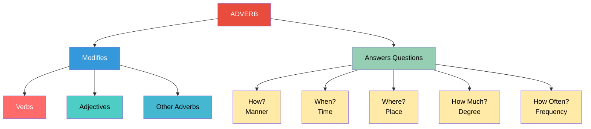

---

## Why Learn Adverbs?

| Purpose | Description |
|---------|-------------|
| **Precision** | Adverbs add specificity to actions and descriptions |
| **Richness** | They make language more vivid and expressive |
| **Clarity** | They answer crucial questions about actions |
| **Impact** | Well-chosen adverbs make communication more effective |

---

## The Word "Adverb" Itself

> The word **adverb** literally means "adds to the verb" (ad- = to/toward, verb = word/action)

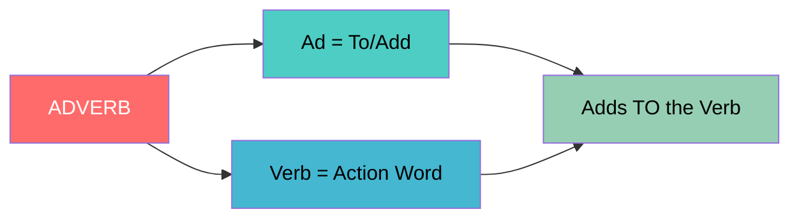

---

## Basic Examples

| Example Sentence | Adverb | Modifies |
|-----------------|--------|----------|
| "Shelly is **always** ready for health" | always | is ready (verb) |
| "He loved her **very much**" | very much | loved (verb) |
| "Time is running **fast**" | fast | running (verb) |
| "I gave that **willingly**" | willingly | gave (verb) |

---

## Adverb Clauses and Phrases

> **Adverb clauses** and **adverb phrases** are groups of words that function as adverbs, modifying verbs, adjectives, or other adverbs at the **sentential level**.

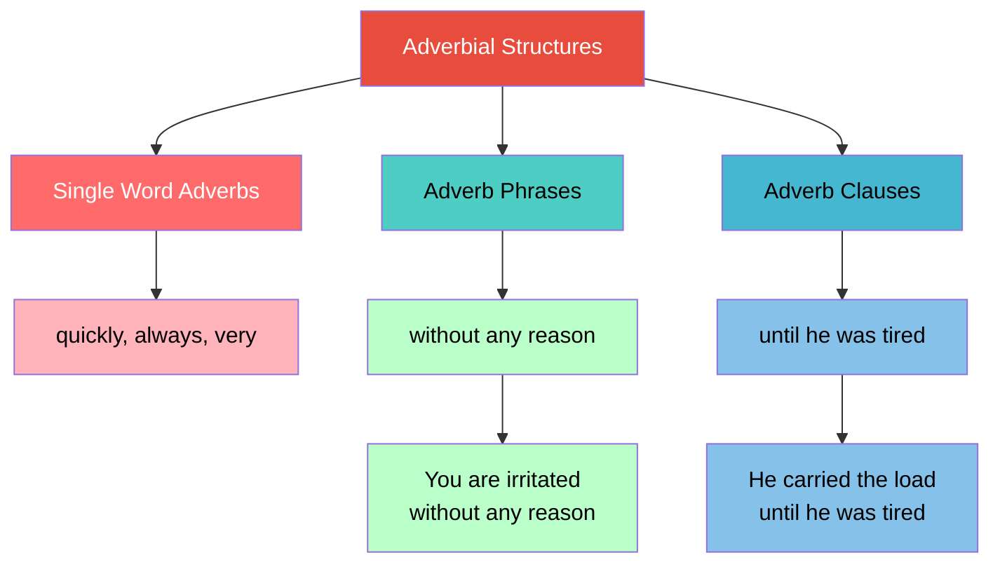

### Examples of Adverb Clauses/Phrases

| Type | Example | Modifies |
|------|---------|----------|
| **Clause** | "He carried the load **until he was tired**" | carried (verb) |
| **Phrase** | "Maya arrived **carrying her suitcases with two hands**" | arrived (verb) |
| **Phrase** | "You are irritated **without any reason**" | irritated (adjective) |

---

## Classification of Adverbs

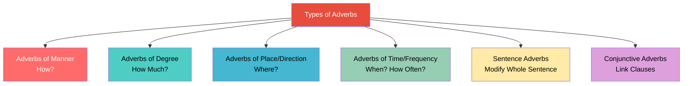

---

## 1. Adverbs of Manner (How?)

> These tell us **how** an action is performed.

| Example | Adverb | Meaning |
|---------|--------|---------|
| "We should distribute the workload **equally**" | equally | In equal portions |
| "Hold it **carefully**" | carefully | With care |
| "He is improving **slowly**" | slowly | At a slow pace |
| "Maya runs very **fast**" | fast | At high speed |

### 🔑 Key Identification Tip

Most adverbs of manner end in **-ly**:

```
beautiful + ly = beautifully
equal + ly = equally
thankful + ly = thankfully
careful + ly = carefully
quick + ly = quickly
earnest + ly = earnestly
tireless + ly = tirelessly
```

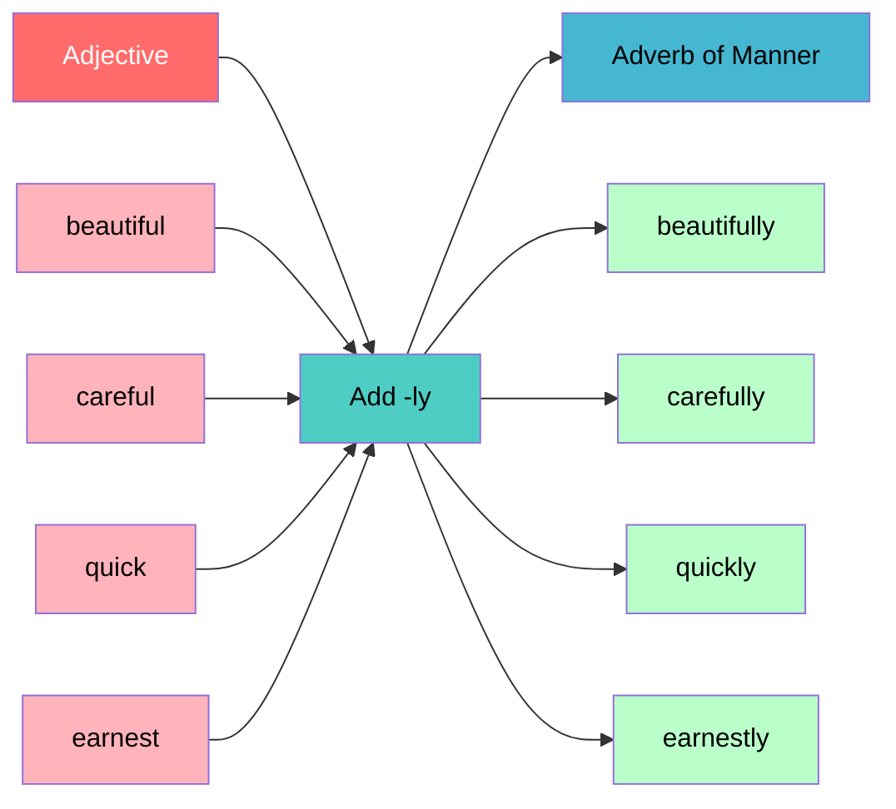

> 🎨 **Fun Fact:** Not all adverbs end in -ly! Words like "fast," "hard," "well," and "late" are adverbs of manner that don't follow the -ly pattern.

---

## 2. Adverbs of Degree (How Much?)

> These express the **amount, intensity, or degree** of an action.

| Example | Adverb | Degree Expressed |
|---------|--------|-----------------|
| "Jessie **completely** forgot about her appointment" | completely | Total/absolute |
| "The policeman examined the document **thoroughly**" | thoroughly | Full/detailed |
| "She was **so** excited about the new place" | so | High degree |
| "I **hardly** go to theater" | hardly | Minimal degree |

### Common Adverbs of Degree

```
completely   nearly    entirely   less
mildly       most      thoroughly  somewhat
excessively  much      absolutely  totally
very         quite     rather      too
```

### 📊 Degree Scale

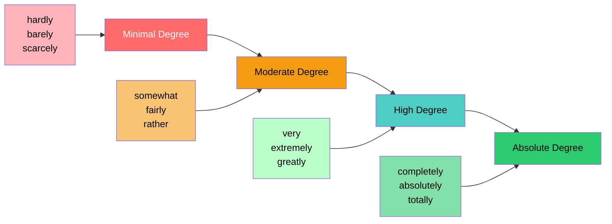

> ⚠️ **Important:** Some words ending in -ly (like completely, thoroughly) are adverbs of degree, NOT manner. Ask "how much?" to distinguish them.

---

## 3. Adverbs of Place/Direction (Where?)

> These indicate **location, direction, or spatial relationships**.

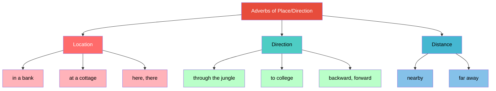

### Examples

| Example | Adverb/Phrase | Function |
|---------|--------------|----------|
| "I went **through the jungle**" | through the jungle | Direction |
| "He works **in a bank**" | in a bank | Location |
| "Maya is going **to college**" | to college | Direction |
| "We are staying **at a cottage**" | at a cottage | Location |

### Common Adverbs of Place

```
across    over     under    in
out       through  backward there
around    here     sideways upstairs
in the park   in the field   in the place
```

---

## 4. Adverbs of Time/Frequency (When? How Often?)

> These tell us **when** an action occurs and **how frequently**.

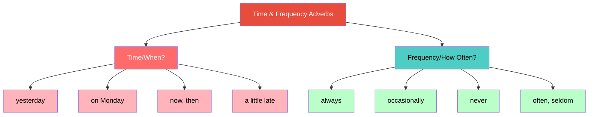

### Examples

| Example | Adverb | Type |
|---------|--------|------|
| "I arrived at the airport a little late **yesterday**" | yesterday | Time |
| "He **always** gets a good result" | always | Frequency |
| "The PM will leave for America **on Monday**" | on Monday | Time |
| "I go to theater **occasionally**" | occasionally | Frequency |

### Frequency Spectrum


---

## 5. Sentence Adverbs

> These adverbs take the **entire sentence** in their scope and usually appear at the **beginning** of the sentence.

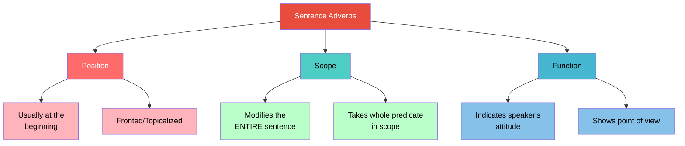

### Examples

| Example | Sentence Adverb | Meaning |
|---------|----------------|---------|
| "**Hopefully**, I will finish the assignment" | Hopefully | Expresses hope/expectation |
| "**Apparently**, the days are getting hotter" | Apparently | Based on what seems true |
| "**Certainly**, you did not consider asking for my permission" | Certainly | Expresses certainty |
| "**Obviously**, it was a mistake" | Obviously | Something clearly true |

### Common Sentence Adverbs

```
actually      apparently    certainly
clearly       definitely    fortunately
frankly       honestly      hopefully
interestingly luckily       naturally
obviously     perhaps       personally
sadly         surprisingly  undoubtedly
```

> 💡 **Fun Fact:** Sentence adverbs are sometimes called "disjuncts" in formal grammar because they stand apart from (dis-joined from) the main clause structure, expressing the speaker's attitude toward the entire statement.

---

## 6. Conjunctive Adverbs

> These adverbs **connect independent clauses** and show **relationships** between ideas, acting as transitions.

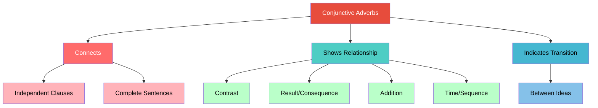

### Examples with Analysis

| Example | Conjunctive Adverb | Relationship |
|---------|-------------------|--------------|
| "The train started very late; **nonetheless**, it arrived on time" | nonetheless | Contrast (despite lateness, on time) |
| "We're still not sure about X; **however**, the opportunity will come" | however | Contrast |
| "Last year there was little rain; **consequently**, we did not have good harvest" | consequently | Cause-Effect |

### How Conjunctive Adverbs Work

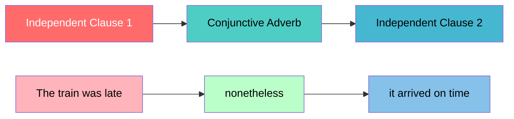

### Common Conjunctive Adverbs

| Function | Adverbs |
|----------|---------|
| **Contrast** | however, nevertheless, nonetheless, still, conversely |
| **Result** | therefore, consequently, accordingly, thus, hence |
| **Addition** | moreover, furthermore, additionally, besides |
| **Time** | meanwhile, subsequently, then |
| **Emphasis** | indeed, certainly, undoubtedly |

---

## 📊 Adverb Classification Summary

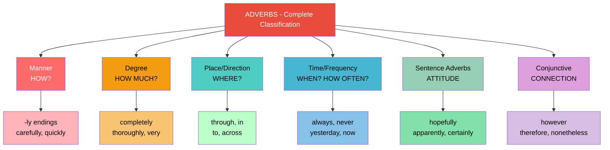

---

# Lecture 8: Tenses & Aspects in English

## 🎯 What Are Tenses and Aspects?

> **Tense** tells us about the **time** of an action. **Aspect** tells us about the **state** of an event.

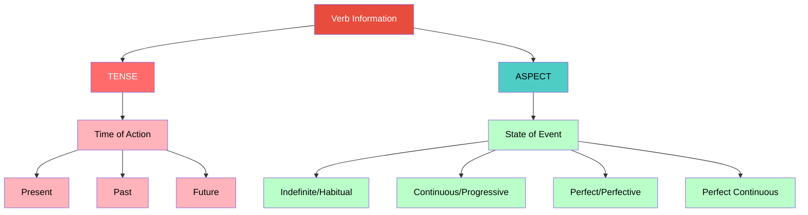

---

## Why Understand Tense and Aspect?

> Accuracy in tense and aspect usage builds **communicative confidence**. Understanding the underlying mechanism helps us process language subconsciously.

---

## The Three Tenses

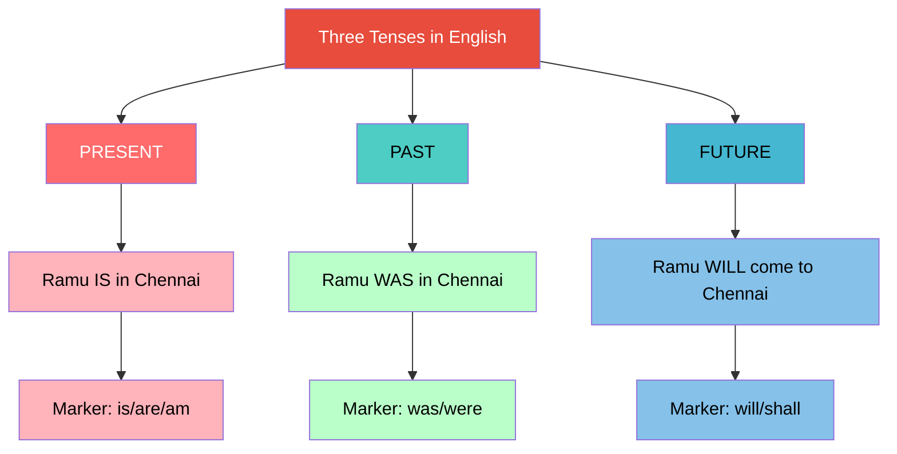

### Key Observation: Future Tense Difference

| Tense | Example | Structure |
|-------|---------|-----------|
| Present | "Ramu **is** in Chennai" | Single auxiliary |
| Past | "Ramu **was** in Chennai" | Single auxiliary |
| Future | "Ramu **will come** to Chennai" | **Requires another verb!** |

> ⚠️ You **cannot** say "Ramu will to Chennai." You must include a verb: "Ramu will **be/come/go** to Chennai."

---

## The Four Aspects

### Aspect Overview

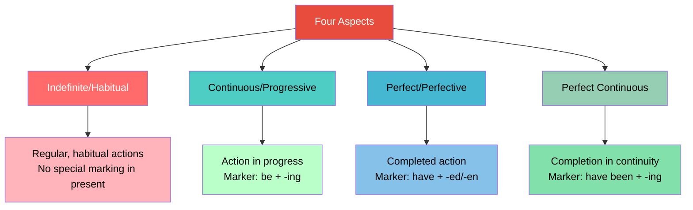

---

### 1. Indefinite/Habitual Aspect

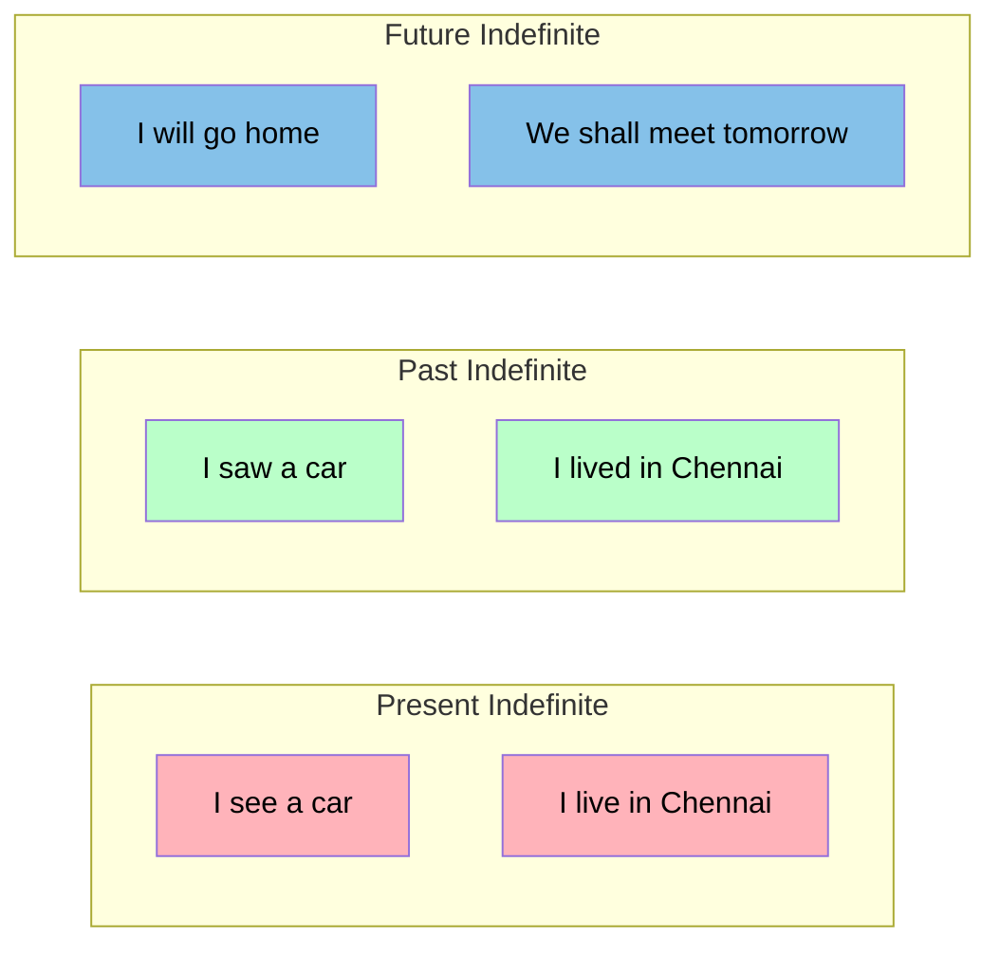

**Key Observations:**

| Tense | Verb Form | Agreement Marking |
|-------|-----------|-------------------|
| Present | Base form (Ø marking) | Only 3rd person singular: "he live**s**" |
| Past | Past form (-ed/irregular) | No agreement marking |
| Future | will/shall + base | No agreement marking |

> 🔍 **Important Discovery:** In present indefinite, there is **no tense marking** and **no aspect marking** visible on the verb! The only marking appears for third person singular.

---

### 2. Continuous/Progressive Aspect

```
Structure: BE + Verb-ing
```

| Tense | Example | Structure Analysis |
|-------|---------|-------------------|
| Present Continuous | "The girls **are playing** in the ground" | are (tense + agreement) + play-ing (aspect) |
| Past Continuous | "The girls **were playing** in the ground" | were (tense + agreement) + play-ing (aspect) |
| Future Continuous | "Girls **will be playing** in the ground" | will (future) + be + play-ing (aspect) |

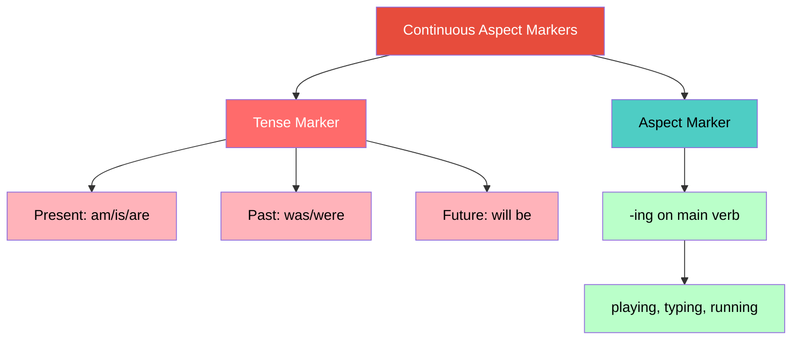

> 🤔 **Philosophical Note:** Future continuous is remarkable - we can talk about an action that hasn't started, hasn't completed, but **will be in progress** at some future time. This demonstrates the incredible abstract power of human language!

---

### 3. Perfect/Perfective Aspect

```
Structure: HAVE + Verb-ed/en (Past Participle)
```

| Tense | Example | Analysis |
|-------|---------|----------|
| Present Perfect | "The girls **have played** effectively" | have (tense + number) + play-ed (perfect) |
| Past Perfect | "The girls **had played** effectively" | had (past tense) + play-ed (perfect) |
| Future Perfect | "I **will have typed** a mail" | will + have + typed (perfect) |

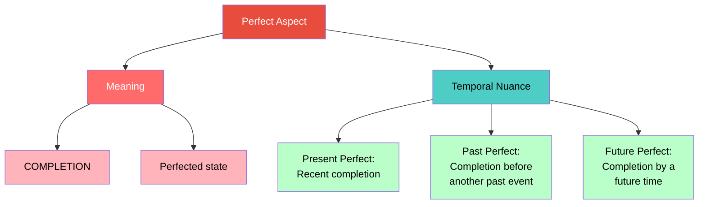

**Agreement Pattern in Perfect:**

| Present Perfect | Past Perfect |
|-----------------|--------------|
| have (plural) / has (singular) | had (same for all) |
| "Girls **have** played" | "Girls **had** played" |
| "She **has** played" | "She **had** played" |

---

### 4. Perfect Continuous Aspect

```
Structure: HAVE + BEEN + Verb-ing
```

| Tense | Example | Components |
|-------|---------|------------|
| Present Perfect Continuous | "Girls **have been playing** effectively" | have (present) + been (perfect) + play-ing (continuous) |
| Past Perfect Continuous | "Girls **had been playing** effectively" | had (past) + been (perfect) + play-ing (continuous) |
| Future Perfect Continuous | "Girls **will have been playing** nicely" | will (future) + have + been (perfect) + play-ing (continuous) |

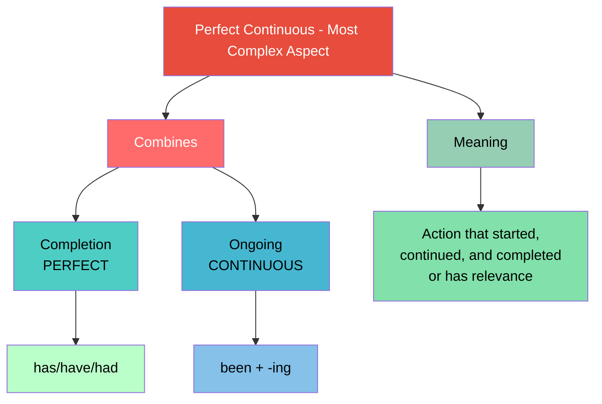

---

## Complete Tense-Aspect Matrix

```mermaid
graph TB
    A[TENSE + ASPECT MATRIX] --> B[PRESENT]
    A --> C[PAST]
    A --> D[FUTURE]
    
    B --> B1[Simple: I play]
    B --> B2[Continuous: I am playing]
    B --> B3[Perfect: I have played]
    B --> B4[Perfect Cont.: I have been playing]
    
    C --> C1[Simple: I played]
    C --> C2[Continuous: I was playing]
    C --> C3[Perfect: I had played]
    C --> C4[Perfect Cont.: I had been playing]
    
    D --> D1[Simple: I will play]
    D --> D2[Continuous: I will be playing]
    D --> D3[Perfect: I will have played]
    D --> D4[Perfect Cont.: I will have been playing]
    
    style A fill:#E74C3C,color:#fff
    style B fill:#FF6B6B,color:#fff
    style C fill:#4ECDC4,color:#000
    style D fill:#45B7D1,color:#000
    style B1 fill:#FFB3BA,color:#000
    style B2 fill:#FFB3BA,color:#000
    style B3 fill:#FFB3BA,color:#000
    style B4 fill:#FFB3BA,color:#000
    style C1 fill:#BAFFC9,color:#000
    style C2 fill:#BAFFC9,color:#000
    style C3 fill:#BAFFC9,color:#000
    style C4 fill:#BAFFC9,color:#000
    style D1 fill:#85C1E9,color:#000
    style D2 fill:#85C1E9,color:#000
    style D3 fill:#85C1E9,color:#000
    style D4 fill:#85C1E9,color:#000
```

---

## Regular vs Irregular Verbs

### Regular Pattern: Add -ed

| Base | Past | Past Participle |
|------|------|-----------------|
| act | acted | acted |
| live | lived | lived |
| hope | hoped | hoped |

### Irregular Patterns

```mermaid
graph TB
    A[Irregular Verb Patterns] --> B[Internal Vowel Change]
    A --> C[No Change]
    A --> D[Suppletion<br/>Completely New Word]
    
    B --> B1["become → became"]
    B --> B2["begin → began"]
    B --> B3["write → wrote"]
    B --> B4["wake → woke"]
    
    C --> C1["cut → cut"]
    C --> C2["put → put"]
    
    D --> D1["go → went"]
    D --> D2["be → am/is/are → was/were"]
    
    style A fill:#E74C3C,color:#fff
    style B fill:#FF6B6B,color:#fff
    style C fill:#4ECDC4,color:#000
    style D fill:#45B7D1,color:#000
    style B1 fill:#FFB3BA,color:#000
    style B2 fill:#FFB3BA,color:#000
    style B3 fill:#FFB3BA,color:#000
    style B4 fill:#FFB3BA,color:#000
    style C1 fill:#BAFFC9,color:#000
    style C2 fill:#BAFFC9,color:#000
    style D1 fill:#85C1E9,color:#000
    style D2 fill:#85C1E9,color:#000
```

---

## Children's Language Learning: An Interesting Phenomenon

```mermaid
graph LR
    A[Child Learns] --> B[Regular Pattern First]
    B --> C["see + ed = seed/sawed"]
    C --> D[Unlearning Phase]
    D --> E[Corrects to 'saw']
    
    style A fill:#FF6B6B,color:#fff
    style B fill:#4ECDC4,color:#000
    style C fill:#F39C12,color:#000
    style D fill:#FFEAA7,color:#000
    style E fill:#2ECC71,color:#000
```

> 👶 **Fun Fact:** Children often say "I seed" or "I sawed" before learning the correct irregular form "saw." This is called **overgeneralization** - applying the regular -ed rule to irregular verbs. It actually shows the child has learned the rule!

> ⚠️ **For Adult Learners:** This natural "learn → unlearn → relearn" process is NOT available to adults. Adults must consciously learn irregular patterns as exceptions.

---

## Key Takeaway

> **Tense ≠ Aspect.** They are separate but work together:
> - **Tense** = Time (when)
> - **Aspect** = State of event (how it unfolds)
> - Aspect can ONLY appear when there is a verb
> - Tense can appear without aspect (in sentences without verbs)

---

# Lecture 9: Structure & Functions of Passives in English

## 🎯 What Are Passives?

> **Passives** are structures where the **agent (doer) of the action is suppressed, demoted, or omitted**, and the **theme (receiver of action) becomes the grammatical subject**.

```mermaid
graph TB
    A[PASSIVE VOICE] --> B[Agent/Doer]
    A --> C[Action]
    A --> D[Theme/Receiver]
    
    B --> B1[Suppressed<br/>or Demoted]
    C --> C1[Described by<br/>Past Participle]
    D --> D1[Promoted to<br/>Subject Position]
    
    style A fill:#E74C3C,color:#fff
    style B fill:#FF6B6B,color:#fff
    style C fill:#4ECDC4,color:#000
    style D fill:#45B7D1,color:#000
    style B1 fill:#FFB3BA,color:#000
    style C1 fill:#BAFFC9,color:#000
    style D1 fill:#85C1E9,color:#000
```

---

## Active vs Passive: The Transformation

```mermaid
graph LR
    subgraph "ACTIVE"
    A1["Deepa wrote a novel"]
    A2["Subject = Agent<br/>Object = Theme<br/>Verb = Active Form"]
    end
    
    subgraph "PASSIVE"
    B1["A novel was written by Deepa"]
    B2["Subject = Theme<br/>Agent = By-phrase<br/>Verb = be + Past Participle"]
    end
    
    A1 -->|"Recast verb as passive"| B1
    
    style A1 fill:#FF6B6B,color:#fff
    style A2 fill:#FFB3BA,color:#000
    style B1 fill:#4ECDC4,color:#000
    style B2 fill:#BAFFC9,color:#000
```

---

## The Passive Rule

```
PASSIVE FORMULA: BE (or GET) + PAST PARTICIPLE (3rd form of verb)
```

| Active Verb | Passive Verb |
|-------------|--------------|
| wrote | was/were written |
| broke | was/were broken |
| gives | is/are given |
| will write | will be written |

---

## What Happens During Passivization?

```mermaid
graph TB
    A[Active: Deepa wrote a novel] --> B[Step 1: Recast Verb]
    B --> C["wrote → was written<br/>(be + past participle)"]
    
    C --> D[Step 2: Verb Loses Properties]
    D --> D1["Written (past participle)<br/>can no longer take<br/>a direct object"]
    
    D1 --> E[Step 3: Object Becomes Free]
    E --> E1["'a novel' must move"]
    
    E1 --> F[Step 4: Subject Position Vacant]
    F --> F1["Agent 'Deepa' is suppressed<br/>from subject position"]
    
    F1 --> G[Step 5: Theme Moves Up]
    G --> G1["'A novel' occupies<br/>subject position"]
    
    G1 --> H[Step 6: Agent Landing Site]
    H --> H1["Preposition 'by' inserted<br/>'by Deepa' (optional)"]
    
    style A fill:#E74C3C,color:#fff
    style B fill:#FF6B6B,color:#fff
    style C fill:#4ECDC4,color:#000
    style D fill:#45B7D1,color:#000
    style D1 fill:#85C1E9,color:#000
    style E fill:#96CEB4,color:#000
    style E1 fill:#82E0AA,color:#000
    style F fill:#FFEAA7,color:#000
    style F1 fill:#F8C471,color:#000
    style G fill:#DDA0DD,color:#000
    style G1 fill:#D7BDE2,color:#000
    style H fill:#F39C12,color:#000
    style H1 fill:#F8C471,color:#000
```

---

## Why Does the Object Move to Subject Position?

> **English does NOT allow sentences without a subject** (except imperatives like "Get out!" where "you" is understood).

```mermaid
graph LR
    A[English Sentence Rule] --> B[Subject Position<br/>MUST be filled]
    
    C[Exception] --> D[Imperatives]
    D --> E["(You) get out!"]
    
    style A fill:#E74C3C,color:#fff
    style B fill:#FF6B6B,color:#fff
    style C fill:#4ECDC4,color:#000
    style D fill:#BAFFC9,color:#000
    style E fill:#BAFFC9,color:#000
```

---

## Grammatical vs Thematic Roles

```mermaid
graph TB
    A[Two Types of Relations] --> B[Grammatical Relations]
    A --> C[Thematic/Logical Relations]
    
    B --> B1[Subject]
    B --> B2[Object]
    
    C --> C1[Agent - doer]
    C --> C2[Theme - acted upon]
    C --> C3[Recipient - beneficiary]
    C --> C4[Instrument - tool used]
    
    style A fill:#E74C3C,color:#fff
    style B fill:#FF6B6B,color:#fff
    style C fill:#4ECDC4,color:#000
    style B1 fill:#FFB3BA,color:#000
    style B2 fill:#FFB3BA,color:#000
    style C1 fill:#BAFFC9,color:#000
    style C2 fill:#BAFFC9,color:#000
    style C3 fill:#BAFFC9,color:#000
    style C4 fill:#BAFFC9,color:#000
```

### The Key Distinction in Passives

| Role | Active: "Deepa wrote a novel" | Passive: "A novel was written by Deepa" |
|------|-------------------------------|----------------------------------------|
| **Grammatical Subject** | Deepa | A novel |
| **Thematic Agent** | Deepa | Deepa (now in by-phrase) |
| **Grammatical Object** | A novel | (none - verb can't take object) |
| **Thematic Theme** | A novel | A novel (now in subject position) |

> **In passives, grammatical and thematic roles are SEPARATED.**

---

## Passives with Two Objects (Ditransitive Verbs)

```mermaid
graph TB
    A["Ravi gave Deepa a book"] --> B[Two Objects]
    B --> C["IO: Deepa (Recipient)"]
    B --> D["DO: a book (Theme)"]
    
    A --> E[Passive Option 1]
    E --> E1["Deepa was given a book by Ravi"]
    E1 --> E2["Indirect Object → Subject"]
    
    A --> F[Passive Option 2]
    F --> F1["A book was given to Deepa by Ravi"]
    F1 --> F2["Direct Object → Subject"]
    
    style A fill:#E74C3C,color:#fff
    style B fill:#FF6B6B,color:#fff
    style C fill:#4ECDC4,color:#000
    style D fill:#45B7D1,color:#000
    style E fill:#96CEB4,color:#000
    style E1 fill:#82E0AA,color:#000
    style E2 fill:#82E0AA,color:#000
    style F fill:#FFEAA7,color:#000
    style F1 fill:#F8C471,color:#000
    style F2 fill:#F8C471,color:#000
```

### The Rule for Two Objects

| Active Structure | Passive Structure | Which Object Moves |
|-----------------|-------------------|-------------------|
| V + IO + DO | IO + passive V + DO | Indirect Object |
| V + DO + to + IO | DO + passive V + to + IO | Direct Object |

---

## Important: Only Transitive Verbs Can Be Passivized!

```mermaid
graph LR
    A[Transitive Verbs] --> B[Take Direct Object]
    B --> C[CAN be passivized]
    
    D[Intransitive Verbs] --> E[No Direct Object]
    E --> F[CANNOT be passivized]
    
    style A fill:#2ECC71,color:#000
    style B fill:#BAFFC9,color:#000
    style C fill:#82E0AA,color:#000
    style D fill:#E74C3C,color:#fff
    style E fill:#FFB3BA,color:#000
    style F fill:#FFB3BA,color:#000
```

| Transitive (Can be passive) | Intransitive (Cannot be passive) |
|------------------------------|----------------------------------|
| "Deepa wrote a novel" → "A novel was written" | "Ravi runs very fast" → ❌ No passive possible |
| "I broke the glass" → "The glass was broken" | "She sleeps" → ❌ No passive possible |

---

## Functions of Passives: Why Do We Use Them?

```mermaid
graph TB
    A[Functions of Passives] --> B[Agent is Unknown]
    A --> C[Agent is Unimportant]
    A --> D[Deliberately Conceal Agent]
    A --> E[Emphasize the Action/Outcome]
    A --> F[Emphasize the Receiver]
    A --> G[Agent is Obvious/Predictable]
    A --> H[General Statements/Announcements]
    
    B --> B1["My watch was stolen<br/>(I don't know who)"]
    C --> C1["The bridge is being repaired<br/>(by workers - not important)"]
    D --> D1["The glass got broken<br/>(avoiding blame)"]
    E --> E1["A bullet was fired<br/>(action matters more than doer)"]
    F --> F1["America was discovered<br/>by Columbus"]
    G --> G1["Workers are paid weekly<br/>(by employer - obvious)"]
    H --> H1["People are requested<br/>to donate generously"]
    
    style A fill:#E74C3C,color:#fff
    style B fill:#FF6B6B,color:#fff
    style C fill:#4ECDC4,color:#000
    style D fill:#45B7D1,color:#000
    style E fill:#96CEB4,color:#000
    style F fill:#FFEAA7,color:#000
    style G fill:#DDA0DD,color:#000
    style H fill:#F39C12,color:#000
    style B1 fill:#FFB3BA,color:#000
    style C1 fill:#BAFFC9,color:#000
    style D1 fill:#85C1E9,color:#000
    style E1 fill:#82E0AA,color:#000
    style F1 fill:#F8C471,color:#000
    style G1 fill:#D7BDE2,color:#000
    style H1 fill:#F8C471,color:#000
```

> 🎭 **Fun Fact:** Passives are often used in legal and political language to avoid assigning direct responsibility. "Mistakes were made" is a classic passive construction that avoids saying who made the mistakes!

---

## Summary: The Only Rule to Remember

```
PASSIVE = BE (or GET) + PAST PARTICIPLE (3rd Form)
```

When you recast the verb in passive:
1. The **direct object** moves to **subject position**
2. The **agent** is optionally expressed with **"by"**
3. Only **transitive verbs** can be passivized

---

# Lecture 10: Some Important Concepts in Adjectives

## 🎯 What Do Adjectives Do?

> Adjectives provide information about nouns: **shape, size, age, colour, origin, material, purpose, character**, and more.

```mermaid
graph TB
    A[ADJECTIVES - Information Provided] --> B[Size]
    A --> C[Shape]
    A --> D[Age]
    A --> E[Colour]
    A --> F[Origin]
    A --> G[Material]
    A --> H[Purpose]
    A --> I[Character/Opinion]
    
    B --> B1["big man, small house"]
    C --> C1["round cup"]
    D --> D1["old house, young girl"]
    E --> E1["red dress"]
    F --> F1["Chinese saucer"]
    G --> G1["iron bridge"]
    H --> H1["reading hall"]
    I --> I1["noble woman, abandoned house"]
    
    style A fill:#E74C3C,color:#fff
    style B fill:#FF6B6B,color:#fff
    style C fill:#4ECDC4,color:#000
    style D fill:#45B7D1,color:#000
    style E fill:#96CEB4,color:#000
    style F fill:#FFEAA7,color:#000
    style G fill:#DDA0DD,color:#000
    style H fill:#F39C12,color:#000
    style I fill:#2ECC71,color:#000
    style B1 fill:#FFB3BA,color:#000
    style C1 fill:#BAFFC9,color:#000
    style D1 fill:#85C1E9,color:#000
    style E1 fill:#82E0AA,color:#000
    style F1 fill:#F8C471,color:#000
    style G1 fill:#D7BDE2,color:#000
    style H1 fill:#F8C471,color:#000
    style I1 fill:#82E0AA,color:#000
```

---

## How to Identify Adjectives: Suffix Clues

```mermaid
graph TB
    A[Common Adjective Suffixes] --> B[-able / -ible]
    A --> C[-al]
    A --> D[-an / -ian]
    A --> E[-ar]
    A --> F[-ent]
    A --> G[-ful]
    A --> H[-ic / -ical]
    A --> I[-ine]
    A --> J[-ile]
    A --> K[-ive]
    A --> L[-less]
    A --> M[-ous]
    A --> N[-some]
    
    B --> B1["comfortable, invisible"]
    C --> C1["educational, viral"]
    D --> D1["Indian, American"]
    E --> E1["popular, spectacular"]
    F --> F1["competent, patient"]
    G --> G1["beautiful, harmful"]
    H --> H1["athletic, magical"]
    I --> I1["feminine, masculine"]
    J --> J1["fragile, agile"]
    K --> K1["talkative, selective"]
    L --> L1["harmless, endless"]
    M --> M1["delicious, dangerous"]
    N --> N1["tiresome, handsome"]
    
    style A fill:#E74C3C,color:#fff
    style B fill:#FF6B6B,color:#fff
    style C fill:#4ECDC4,color:#000
    style D fill:#45B7D1,color:#000
    style E fill:#96CEB4,color:#000
    style F fill:#FFEAA7,color:#000
    style G fill:#DDA0DD,color:#000
    style H fill:#F39C12,color:#000
    style I fill:#2ECC71,color:#000
    style J fill:#3498DB,color:#fff
    style K fill:#9B59B6,color:#fff
    style L fill:#1ABC9C,color:#000
    style M fill:#E67E22,color:#000
    style N fill:#E74C3C,color:#fff
    style B1 fill:#FFB3BA,color:#000
    style C1 fill:#BAFFC9,color:#000
    style D1 fill:#85C1E9,color:#000
    style E1 fill:#82E0AA,color:#000
    style F1 fill:#F8C471,color:#000
    style G1 fill:#D7BDE2,color:#000
    style H1 fill:#F8C471,color:#000
    style I1 fill:#82E0AA,color:#000
    style J1 fill:#85C1E9,color:#000
    style K1 fill:#D7BDE2,color:#000
    style L1 fill:#BAFFC9,color:#000
    style M1 fill:#F8C471,color:#000
    style N1 fill:#FFB3BA,color:#000
```

---

## Nouns Acting as Adjectives: Compound Nouns

```mermaid
graph LR
    A[Compound Noun] --> B[First Noun = Adjective]
    A --> C[Second Noun = Main Noun]
    
    B --> B1["dinner table<br/>dinner = type of table"]
    B --> B2["music class<br/>music = type of class"]
    B --> B3["study room<br/>study = purpose of room"]
    B --> B4["cricket player<br/>cricket = type of player"]
    
    style A fill:#E74C3C,color:#fff
    style B fill:#FF6B6B,color:#fff
    style C fill:#4ECDC4,color:#000
    style B1 fill:#FFB3BA,color:#000
    style B2 fill:#FFB3BA,color:#000
    style B3 fill:#FFB3BA,color:#000
    style B4 fill:#FFB3BA,color:#000
```

---

## Attributive vs Predicative Adjectives

```mermaid
graph TB
    A[Adjective Positions] --> B[ATTRIBUTIVE]
    A --> C[PREDICATIVE]
    
    B --> B1[Comes BEFORE the noun]
    B --> B2["wonderful proposal<br/>honest person<br/>old car<br/>big book"]
    
    C --> C1[Comes AFTER the verb<br/>in the predicate]
    C --> C2["person looks suspicious<br/>place seems unsafe<br/>she is beautiful<br/>book is big"]
    
    C --> C3[Still modifies<br/>the subject!]
    
    style A fill:#E74C3C,color:#fff
    style B fill:#FF6B6B,color:#fff
    style C fill:#4ECDC4,color:#000
    style B1 fill:#FFB3BA,color:#000
    style B2 fill:#FFB3BA,color:#000
    style C1 fill:#BAFFC9,color:#000
    style C2 fill:#BAFFC9,color:#000
    style C3 fill:#85C1E9,color:#000
```

| Type | Position | Example |
|------|----------|---------|
| **Attributive** | Before noun | "This is a **wonderful** proposal" |
| **Predicative** | After verb | "This proposal is **wonderful**" |

---

## ⚠️ Same Adjective, Different Meaning!

> The **SAME adjective** can have **completely different meanings** depending on whether it's used attributively or predicatively.

```mermaid
graph TB
    A[Same Adjective - Different Meanings] --> B["PARTICULAR"]
    A --> C["LATE"]
    A --> D["CERTAIN"]
    
    B --> B1["Attributive: 'This particular work'<br/>= SPECIFIC"]
    B --> B2["Predicative: 'My father is very particular'<br/>= FUSSY, NOT EASY TO PERSUADE"]
    
    C --> C1["Attributive: 'Her late husband'<br/>= DECEASED, DEAD"]
    C --> C2["Predicative: 'You are always late'<br/>= NOT PUNCTUAL, DELAYED"]
    
    D --> D1["Attributive: 'Certain reasons'<br/>= SOME (unspecified)"]
    D --> D2["Predicative: 'I was certain'<br/>= SURE, DEFINITE"]
    
    style A fill:#E74C3C,color:#fff
    style B fill:#FF6B6B,color:#fff
    style C fill:#4ECDC4,color:#000
    style D fill:#45B7D1,color:#000
    style B1 fill:#FFB3BA,color:#000
    style B2 fill:#FFB3BA,color:#000
    style C1 fill:#BAFFC9,color:#000
    style C2 fill:#BAFFC9,color:#000
    style D1 fill:#85C1E9,color:#000
    style D2 fill:#85C1E9,color:#000
```

---

## Adjective Ordering in Noun Phrases

### Where to Find Adjectives in a Noun Phrase

| Position | Example |
|----------|---------|
| **Between article and noun** | "**the dirty** room" |
| **Between possessive and noun** | "**his big** office", "**Ram's white** shoes" |
| **Between demonstrative and noun** | "**that aggressive** moment" |
| **Between amount and noun** | "**a few ordinary** things" |

---

## Adjectives with Degree Adverbs

```
CORRECT ORDER: Article + Degree Adverb + Adjective + Noun
```

| Correct ✅ | Incorrect ❌ |
|-----------|-------------|
| **a fairly** cold day | fairly a cold day |
| **a very** cold day | very a cold day |
| **an extremely** cold day | extremely a cold day |
| **an absolutely** cold day | absolutely a cold day |

### Special Cases: "Quite" and "Rather"

```mermaid
graph LR
    A[Special Ordering] --> B["quite an expensive item<br/>(not: a quite expensive item)"]
    A --> C["a rather painful decision<br/>(common in speech)"]
    
    style A fill:#E74C3C,color:#fff
    style B fill:#FF6B6B,color:#fff
    style C fill:#4ECDC4,color:#000
```

---

## Multiple Adjectives Before a Noun

When you have **two layers of modification**:

| Example | Analysis |
|---------|----------|
| "an **expensive music** system" | expensive (adj) + music (noun modifier) + system (main noun) |
| "a **high-performance** machine" | high (adj) + performance (noun modifier) + machine (main noun) |

```mermaid
graph TB
    A["an expensive music system"] --> B[Main Noun: system]
    B --> C[Modifier 1: music<br/>noun acting as adjective]
    B --> D[Modifier 2: expensive<br/>adjective]
    
    style A fill:#E74C3C,color:#fff
    style B fill:#FF6B6B,color:#fff
    style C fill:#4ECDC4,color:#000
    style D fill:#45B7D1,color:#000
```

---

# Lecture 11: Degree Adverbs

## 🎯 What Are Degree Adverbs?

> **Degree adverbs** are used before adjectives, verbs, or other adverbs to give information about the **extent or degree** of something.

```mermaid
graph TB
    A[DEGREE ADVERBS] --> B[Modify]
    B --> C[Adjectives]
    B --> D[Verbs]
    B --> E[Other Adverbs]
    
    A --> F[Indicate]
    F --> G[Intensity]
    F --> H[Extent]
    F --> I[Degree]
    
    style A fill:#E74C3C,color:#fff
    style B fill:#FF6B6B,color:#fff
    style C fill:#4ECDC4,color:#000
    style D fill:#45B7D1,color:#000
    style E fill:#96CEB4,color:#000
    style F fill:#FFEAA7,color:#000
    style G fill:#F8C471,color:#000
    style H fill:#F8C471,color:#000
    style I fill:#F8C471,color:#000
```

### The Difference They Make

| Without Degree Adverb | With Degree Adverb |
|----------------------|-------------------|
| "They are sad" | "They are **extremely** sad" |
| "I hate the smell" | "I **really** hate the smell" |
| "She is always late" | "She is **almost** always late" |

---

## Common Degree Adverbs

```
completely    fairly      quite       rather
slightly      too         totally     very
very much     extremely   absolutely  hugely
simply        somewhat    nearly      entirely
```

### The Degree Spectrum

```mermaid
graph LR
    A[Low Degree] --> B[Medium Degree] --> C[High Degree] --> D[Absolute Degree]
    
    A1[slightly<br/>a bit<br/>somewhat] --> A
    B1[fairly<br/>rather<br/>quite] --> B
    C1[very<br/>extremely<br/>really] --> C
    D1[absolutely<br/>completely<br/>totally] --> D
    
    style A fill:#FF6B6B,color:#fff
    style B fill:#F39C12,color:#000
    style C fill:#4ECDC4,color:#000
    style D fill:#2ECC71,color:#000
    style A1 fill:#FFB3BA,color:#000
    style B1 fill:#F8C471,color:#000
    style C1 fill:#BAFFC9,color:#000
    style D1 fill:#82E0AA,color:#000
```

---

## "Very" vs "Too" - Important Distinction

```mermaid
graph TB
    A[VERY vs TOO] --> B[VERY]
    A --> C[TOO]
    
    B --> B1[High degree]
    B --> B2[Neutral/Positive]
    B --> B3["The weather is very hot<br/>- perfect for swimming"]
    
    C --> C1[More than enough]
    C --> C2[More than wanted/needed]
    C --> C3[Negative implication]
    C --> C4["It is too hot to stay<br/>in this room - find somewhere cooler"]
    
    style A fill:#E74C3C,color:#fff
    style B fill:#FF6B6B,color:#fff
    style C fill:#4ECDC4,color:#000
    style B1 fill:#FFB3BA,color:#000
    style B2 fill:#FFB3BA,color:#000
    style B3 fill:#FFB3BA,color:#000
    style C1 fill:#BAFFC9,color:#000
    style C2 fill:#BAFFC9,color:#000
    style C3 fill:#BAFFC9,color:#000
    style C4 fill:#BAFFC9,color:#000
```

| Use VERY when... | Use TOO when... |
|-----------------|-----------------|
| High degree (neutral/positive) | More than enough (negative) |
| "The weather is **very** hot - perfect for swimming" | "It is **too** hot to stay here" |
| "She is **very** tall" | "She is **too** tall for that dress" |

> 💡 **Exception:** In informal negative sentences, "too" can sometimes mean "very": "I'm not **too** bothered about who fails" ≈ "I'm not **very** bothered"

---

## "Very" vs "Very Much"

```mermaid
graph TB
    A[VERY vs VERY MUCH] --> B[VERY - Rules]
    A --> C[VERY MUCH - Rules]
    
    B --> B1["✅ Before adjectives<br/>'very happy'"]
    B --> B2["✅ Before participle adjectives<br/>'very disturbed'"]
    B --> B3["❌ NOT before verbs<br/>'I very agree' ✗"]
    
    C --> C1["✅ Before certain verbs<br/>'I very much agree'"]
    C --> C2["✅ Before past participles<br/>in passive<br/>'was very much needed'"]
    C --> C3["❌ NOT before participle<br/>adjectives<br/>'very much disturbed' ✗"]
    
    style A fill:#E74C3C,color:#fff
    style B fill:#FF6B6B,color:#fff
    style C fill:#4ECDC4,color:#000
    style B1 fill:#FFB3BA,color:#000
    style B2 fill:#FFB3BA,color:#000
    style B3 fill:#FFB3BA,color:#000
    style C1 fill:#BAFFC9,color:#000
    style C2 fill:#BAFFC9,color:#000
    style C3 fill:#BAFFC9,color:#000
```

### Verbs That Allow "Very Much"

```
agree    doubt    fear     hope
like     want     admire   appreciate
enjoy    regret
```

| Correct ✅ | Incorrect ❌ |
|-----------|-------------|
| "I **very much agree** with your decision" | "I **very agree** with your decision" |
| "I **very much enjoyed** having you" | "I **very enjoyed** having you" |
| "I **much appreciated** the gesture" | "I **very appreciated** the gesture" |

### Participle Adjectives: Use "Very" NOT "Very Much"

| Correct ✅ | Incorrect ❌ |
|-----------|-------------|
| "I was **very disturbed** to hear the news" | "I was very much disturbed..." |
| "It is **very disappointing**" | "It is very much disappointing" |

### Passive Past Participles: Use "Very Much"

| Correct ✅ | Incorrect ❌ |
|-----------|-------------|
| "The new highway was **very much needed**" | "The new highway was very needed" |

---

## Gradable vs Non-Gradable Adjectives

```mermaid
graph TB
    A[Adjective Types] --> B[GRADABLE]
    A --> C[NON-GRADABLE]
    
    B --> B1[Can have different levels]
    B --> B2["cold → very cold<br/>→ extremely cold<br/>→ a bit cold"]
    B --> B3[Use: very, extremely,<br/>fairly, rather]
    
    C --> C1[Cannot have levels]
    C --> C2["finished ≠ very finished<br/>dead ≠ very dead"]
    C --> C3[Use: absolutely,<br/>completely, totally]
    
    style A fill:#E74C3C,color:#fff
    style B fill:#FF6B6B,color:#fff
    style C fill:#4ECDC4,color:#000
    style B1 fill:#FFB3BA,color:#000
    style B2 fill:#FFB3BA,color:#000
    style B3 fill:#FFB3BA,color:#000
    style C1 fill:#BAFFC9,color:#000
    style C2 fill:#BAFFC9,color:#000
    style C3 fill:#BAFFC9,color:#000
```

### Matching Degree Adverbs to Adjective Types

| Gradable Adjectives | Non-Gradable Adjectives |
|--------------------|------------------------|
| **extremely** effective | **absolutely** sure |
| **very** difficult | **completely** clear |
| **hugely** successful | **simply** awful |
| **rather** interesting | **totally** wrong |

---

## Collocations with Degree Adverbs

> **Collocation** = Words that naturally go together

| Adverb | Common Collocations |
|--------|-------------------|
| **extremely** | effective, difficult, hard, important |
| **hugely** | successful, entertaining, popular |
| **absolutely** | sure, clear, necessary, essential |
| **simply** | awful, terrible, wonderful, amazing |
| **quite** | satisfied, good, nice, interesting |

---

## Two Meanings of "Quite"

```mermaid
graph TB
    A["QUITE - Two Meanings"] --> B[Meaning 1]
    A --> C[Meaning 2]
    
    B --> B1["Fairly, to some degree<br/>(but not very)"]
    B --> B2["With GRADABLE adjectives"]
    B --> B3["'I was quite satisfied<br/>with the result'"]
    
    C --> C1["Completely, totally"]
    C --> C2["With NON-GRADABLE adjectives"]
    C --> C3["'Are you quite sure?'<br/>= completely sure"]
    C --> C4["'You are quite wrong'<br/>= completely wrong"]
    
    style A fill:#E74C3C,color:#fff
    style B fill:#FF6B6B,color:#fff
    style C fill:#4ECDC4,color:#000
    style B1 fill:#FFB3BA,color:#000
    style B2 fill:#FFB3BA,color:#000
    style B3 fill:#FFB3BA,color:#000
    style C1 fill:#BAFFC9,color:#000
    style C2 fill:#BAFFC9,color:#000
    style C3 fill:#BAFFC9,color:#000
    style C4 fill:#BAFFC9,color:#000
```

---

# Lecture 12: Comment, Viewpoint & Focus Adverbs

## 🎯 Beyond Basic Adverbs

> Some adverbs are not just about the action - they express the **speaker's attitude, perspective, or emphasis**.

```mermaid
graph TB
    A[Advanced Adverb Types] --> B[Comment Adverbs]
    A --> C[Viewpoint Adverbs]
    A --> D[Focus Adverbs]
    
    B --> B1[Speaker's attitude<br/>or opinion]
    C --> C1[Perspective or<br/>framework]
    D --> D1[Emphasize specific<br/>parts of sentence]
    
    style A fill:#E74C3C,color:#fff
    style B fill:#FF6B6B,color:#fff
    style C fill:#4ECDC4,color:#000
    style D fill:#45B7D1,color:#000
    style B1 fill:#FFB3BA,color:#000
    style C1 fill:#BAFFC9,color:#000
    style D1 fill:#85C1E9,color:#000
```

---

## 1. Comment Adverbs

> These indicate the speaker's **attitude, opinion, or judgement** about what they're saying.

### Types of Comment Adverbs

```mermaid
graph TB
    A[Comment Adverbs] --> B[Indicate Likelihood]
    A --> C[Express Attitude/Opinion]
    A --> D[Judge Someone's Action]
    
    B --> B1["apparently, certainly<br/>clearly, definitely<br/>obviously, presumably<br/>undoubtedly"]
    
    C --> C1["astonishingly, frankly<br/>honestly, interestingly<br/>luckily, naturally<br/>sadly, seriously<br/>surprisingly"]
    
    D --> D1["bravely, carelessly<br/>foolishly, generously<br/>kindly, rightly<br/>stupidly, wisely<br/>wrongly"]
    
    style A fill:#E74C3C,color:#fff
    style B fill:#FF6B6B,color:#fff
    style C fill:#4ECDC4,color:#000
    style D fill:#45B7D1,color:#000
    style B1 fill:#FFB3BA,color:#000
    style C1 fill:#BAFFC9,color:#000
    style D1 fill:#85C1E9,color:#000
```

### Position Flexibility

> Comment adverbs can appear at the **beginning, middle, or end** of a sentence. When at the beginning, they're usually separated by a **comma**.

### Examples

| Position | Example |
|----------|---------|
| **Beginning** | "**Frankly**, I'm not surprised her family disowned her." |
| **Middle** | "The plane **apparently** overshot the runway after landing." |
| **Middle** | "Your plan sounds fine **in theory**, but will it work?" |
| **Beginning** | "**In my opinion**, he is one of the best students." |
| **Beginning** | "**Honestly speaking**, I don't care what the world thinks." |

---

## 2. Viewpoint Adverbs

> These indicate the **perspective or framework** from which a statement is made.

```mermaid
graph TB
    A[Viewpoint Adverbs] --> B[Common Examples]
    B --> B1["biologically"]
    B --> B2["chemically"]
    B --> B3["environmentally"]
    B --> B4["ideologically"]
    B --> B5["logically"]
    B --> B6["morally"]
    B --> B7["outwardly"]
    B --> B8["politically"]
    B --> B9["technically"]
    B --> B10["visually"]
    
    A --> C[Phrasal Forms]
    C --> C1["morally speaking"]
    C --> C2["in political terms"]
    C --> C3["from a technical point of view"]
    C --> C4["as far as environment is concerned"]
    
    style A fill:#E74C3C,color:#fff
    style B fill:#FF6B6B,color:#fff
    style C fill:#4ECDC4,color:#000
    style B1 fill:#FFB3BA,color:#000
    style B2 fill:#FFB3BA,color:#000
    style B3 fill:#FFB3BA,color:#000
    style B4 fill:#FFB3BA,color:#000
    style B5 fill:#FFB3BA,color:#000
    style B6 fill:#FFB3BA,color:#000
    style B7 fill:#FFB3BA,color:#000
    style B8 fill:#FFB3BA,color:#000
    style B9 fill:#FFB3BA,color:#000
    style B10 fill:#FFB3BA,color:#000
    style C1 fill:#BAFFC9,color:#000
    style C2 fill:#BAFFC9,color:#000
    style C3 fill:#BAFFC9,color:#000
    style C4 fill:#BAFFC9,color:#000
```

### Examples

| Example | Viewpoint |
|---------|-----------|
| "**Financially**, the hospitalization has been a disaster for my neighbours." | Financial perspective |
| "The sisters might be alike **physically**, but they have different personalities." | Physical perspective |
| "What you did was not illegal but was **morally** wrong." | Moral perspective |
| "**Technically**, the two countries are still at war." | Technical perspective |
| "**Outwardly**, the couple appeared happy." | External appearance perspective |

---

## 3. Focus Adverbs

> These **emphasize or restrict** the meaning to a specific part of the sentence.

### Key Focus Adverbs: "Only" and "Even"

```mermaid
graph TB
    A[Focus Adverbs] --> B[ONLY]
    A --> C[EVEN]
    
    B --> B1[Scope: What comes<br/>immediately after]
    B --> B2["My brother has only<br/>brought some BOOKS<br/>(nothing else)"]
    B --> B3["Only MY BROTHER has<br/>brought some food<br/>(no one else)"]
    
    C --> C1[Scope: What comes<br/>immediately after]
    C --> C2["Even LIYA can speak English<br/>(she's not expected to)"]
    C --> C3["Liya can even speak GERMAN<br/>(in addition to other things)"]
    
    style A fill:#E74C3C,color:#fff
    style B fill:#FF6B6B,color:#fff
    style C fill:#4ECDC4,color:#000
    style B1 fill:#FFB3BA,color:#000
    style B2 fill:#FFB3BA,color:#000
    style B3 fill:#FFB3BA,color:#000
    style C1 fill:#BAFFC9,color:#000
    style C2 fill:#BAFFC9,color:#000
    style C3 fill:#BAFFC9,color:#000
```

### The Critical Role of Position

> The **position** of "only" and "even" completely changes the meaning of the sentence!

```mermaid
graph TB
    A["My brother has only brought some books"] --> B["ONLY modifies 'brought some books'"]
    B --> C["Meaning: He brought books<br/>and NOTHING ELSE"]
    
    D["Only my brother has brought some food"] --> E["ONLY modifies 'my brother'"]
    E --> F["Meaning: MY BROTHER brought food<br/>and NO ONE ELSE did"]
    
    style A fill:#FF6B6B,color:#fff
    style B fill:#FFB3BA,color:#000
    style C fill:#FFB3BA,color:#000
    style D fill:#4ECDC4,color:#000
    style E fill:#BAFFC9,color:#000
    style F fill:#BAFFC9,color:#000
```

### "Alone" as a Focus Adverb

| Using "Only" | Using "Alone" |
|-------------|---------------|
| "It is not possible to pass **only with luck**" | "It is not possible to pass with **luck alone**" |

> When using "alone" to mean "only," it comes **after** the noun/phrase it modifies.

---

## 📊 Complete Adverb Type Summary

```mermaid
graph TB
    A[ADVERB TYPES - Complete] --> B[Basic Types]
    A --> C[Advanced Types]
    
    B --> B1[Manner - HOW?]
    B --> B2[Degree - HOW MUCH?]
    B --> B3[Place/Direction - WHERE?]
    B --> B4[Time/Frequency - WHEN?]
    B --> B5[Sentence Adverbs]
    B --> B6[Conjunctive Adverbs]
    
    C --> C1[Comment Adverbs<br/>Attitude/Opinion]
    C --> C2[Viewpoint Adverbs<br/>Perspective]
    C --> C3[Focus Adverbs<br/>Emphasis/Scope]
    
    style A fill:#E74C3C,color:#fff
    style B fill:#FF6B6B,color:#fff
    style C fill:#4ECDC4,color:#000
    style B1 fill:#FFB3BA,color:#000
    style B2 fill:#FFB3BA,color:#000
    style B3 fill:#FFB3BA,color:#000
    style B4 fill:#FFB3BA,color:#000
    style B5 fill:#FFB3BA,color:#000
    style B6 fill:#FFB3BA,color:#000
    style C1 fill:#BAFFC9,color:#000
    style C2 fill:#BAFFC9,color:#000
    style C3 fill:#BAFFC9,color:#000
```

---

## 🎓 Final Integration: How Everything Connects

```mermaid
graph TB
    A[Mastering English Grammar] --> B[Adverbs<br/>Add precision to actions]
    A --> C[Tenses & Aspects<br/>Anchor in time & state]
    A --> D[Passives<br/>Shift focus & agency]
    A --> E[Adjectives<br/>Describe & modify nouns]
    A --> F[Degree Adverbs<br/>Control intensity]
    
    B --> G[Communicative<br/>Confidence]
    C --> G
    D --> G
    E --> G
    F --> G
    
    G --> H[Accurate Expression]
    G --> I[Natural Fluency]
    G --> J[Impactful Communication]
    
    style A fill:#E74C3C,color:#fff
    style B fill:#FF6B6B,color:#fff
    style C fill:#4ECDC4,color:#000
    style D fill:#45B7D1,color:#000
    style E fill:#96CEB4,color:#000
    style F fill:#FFEAA7,color:#000
    style G fill:#DDA0DD,color:#000
    style H fill:#BAFFC9,color:#000
    style I fill:#BAFFC9,color:#000
    style J fill:#BAFFC9,color:#000
```

---

> 📝 **Remember:** "Accuracy is the foundation of confidence. Communicative competence can lead to communicative confidence only when we pursue accuracy. Understanding how our mind processes language yields dramatic impact on our accuracy."

---

*Notes compiled from the YouTube lecture series on English Language Mastery - Lectures 7-12*