# 📚 Advanced English Grammar Notes
## Clauses, Sentences, Complements & Adjuncts

---

# Lecture 13: Sentence, Clause, and Complex Sentences

## 🎯 What Are We Learning?

> Understanding how sentences get **processed and produced** in the human mind by analyzing **complex clauses** - their structure, nature, and function.

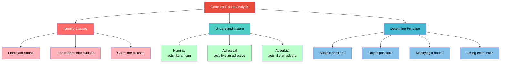

---

## Why Analyze Complex Sentences?

> **Key Insight:** The only way to understand the complexities underlying sentences is to analyze their constituents. We cannot memorize these things; we cannot ignore them either. But the result is **miraculous** - it builds confidence and makes your language impressive.

---

## Types of Sentences

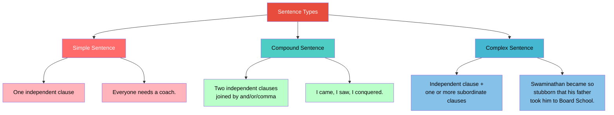

---

## Example Analysis: From "Swami and Friends"

### Text Excerpt

> "After making his exit from Albert Mission School in that theatrical manner on the day following the strike, Swaminathan became so consistently stubborn **that a few days later his father took him to the Board School and admitted him there**."

### Breaking It Down

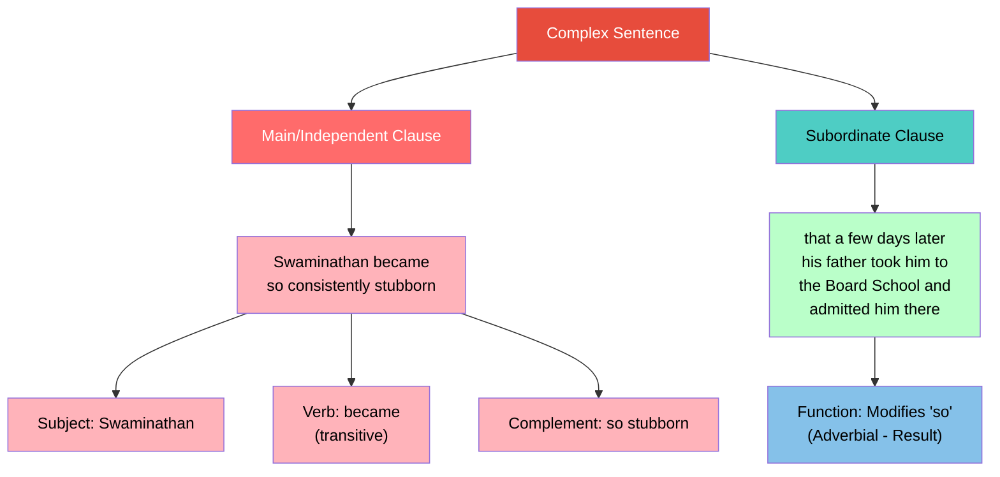

---

## More Examples of Complex Sentences from the Text

| Sentence | Main Clause | Subordinate Clause | Function |
|----------|-------------|-------------------|----------|
| "He excited the curiosity **that all newcomers do**" | He excited the curiosity | that all newcomers do | Adjectival (modifies "curiosity") |
| "He had not yet picked the few **that he would have liked to call his chums**" | He had not yet picked the few | that he would have liked to call his chums | Adjectival (modifies "the few") |
| "He still believed **that his Albert Mission set was intact**" | He still believed | that his Albert Mission set was intact | Nominal (object of "believed") |

---

## The Three Key Analysis Steps

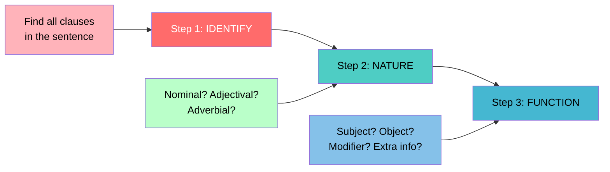

---

## Three Types of Subordinate Clauses

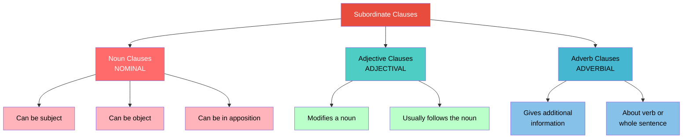

---

### Example: Nominal Clause as Subject

> "**That the pandemic would disappear** was believed last year by everyone."

| Component | Analysis |
|-----------|----------|
| **Subject** | "That the pandemic would disappear" (entire clause!) |
| **Verb** | "was believed" |
| **Agent** | "by everyone" |

### Example: Nominal Clause as Object

> "He still believed **that his Albert Mission School was intact**."

| Component | Analysis |
|-----------|----------|
| **Subject** | "He" |
| **Verb** | "believed" (transitive) |
| **Object** | "that his Albert Mission School was intact" (entire clause!) |

---

### Example: Adjectival Clause

> "Rabindranath Tagore, **who is a Nobel laureate**, was not only a great writer but also a great manager."

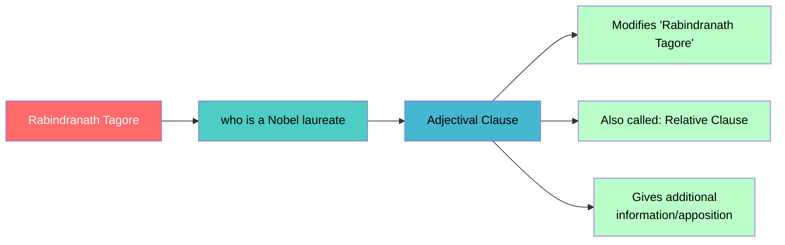

---

### Example: Multiple Clauses in One Sentence

> "Rajam realised at this point **that the starting of a cricket team was the most complicated problem on earth**."

| Clause | Type | Function |
|--------|------|----------|
| "Rajam realised at this point" | Independent/Main | Main clause |
| "that the starting of a cricket team was the most complicated problem on earth" | Subordinate - Nominal | Object of "realised" |

> "The government did not seem to know **where it ought to infer and where not**."

| Clause | Type | Function |
|--------|------|----------|
| "The government did not seem to know" | Independent/Main | Main clause |
| "where it ought to infer and where not" | Subordinate - Nominal | Object of "know" |

---

## 🎓 Key Takeaway

> **To master complex sentences:**
> 1. **Identify** all clauses
> 2. Determine their **nature** (nominal, adjectival, adverbial)
> 3. Understand their **function** (subject, object, modifier, extra information)
>
> One sentence can contain **multiple subordinate clauses** with **different functions**!

> 🧠 **Fun Fact:** The human mind processes complex sentences with multiple embedded clauses as easily as simple sentences! Structurally, even the most complex sentence has the same basic components - subject, verb, and object. This is why children can naturally produce complex sentences without formal grammar training.

---

# Lecture 14: Describing Clauses & Sentences

## 🎯 The Fundamental Question

> **Is a sentence a clause? Is a clause a sentence?** Understanding the similarities and differences is crucial for mastering sentence construction.

---

## Four Sentences That Tell the Whole Story

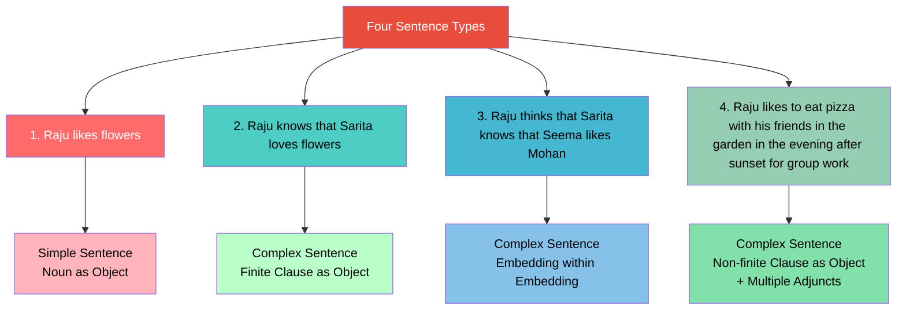

---

## What Makes All Four Grammatical Sentences?

**Every sentence must have:**
1. A **Subject** (Raju)
2. A **Predicate** (everything after the subject)
3. **Agreement** between subject and verb

### Analysis of Objects

| Sentence | Object Type | Analysis |
|----------|-------------|----------|
| 1 | Noun | "flowers" - simple noun |
| 2 | Finite Clause | "that Sarita loves flowers" - complete sentence as object |
| 3 | Clause within Clause | "that Sarita knows that Seema likes Mohan" - embedding within embedding |
| 4 | Non-finite Clause | "to eat pizza" - infinitival clause |

---

## The Crucial Distinction: Sentence vs Clause

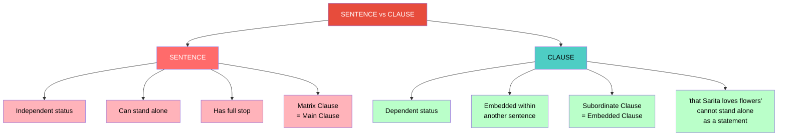

> 💡 **The Simple Truth:** A sentence is essentially a clause. We call it a "clause" when it's embedded within another sentence (subordinate). When it stands alone, we call it a "sentence" (independent clause).

---

## Embedding Within Embedding

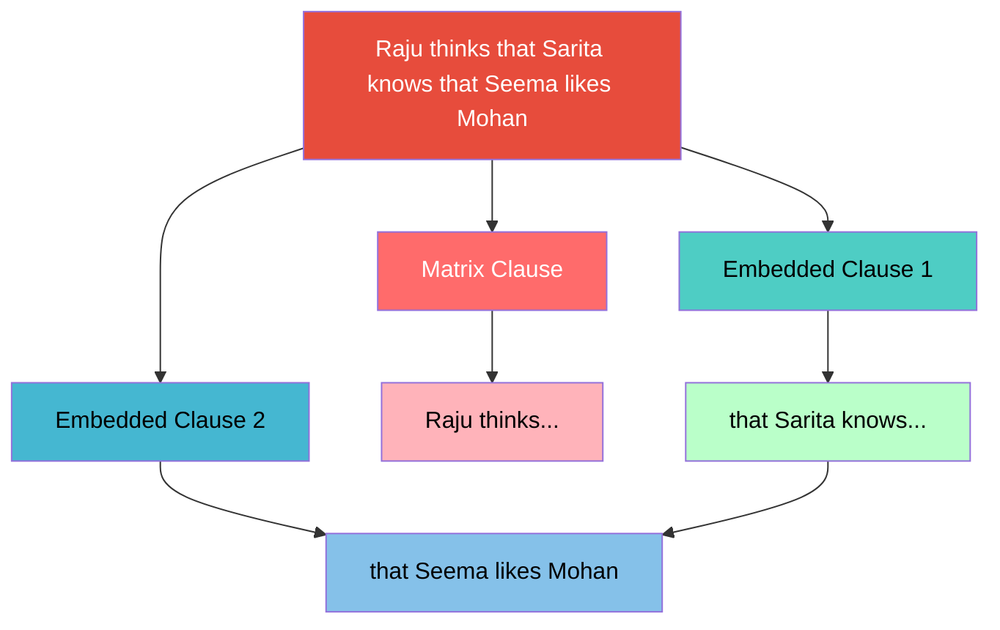

> 🧠 **The Human Mind Secret:** No matter how complex a sentence is (how many embeddings it has), the human mind treats it like a simple sentence! A complex sentence structurally still has only three things: subject, verb, and object. This is why we can process complex sentences effortlessly.

---

## Finite vs Non-Finite Clauses

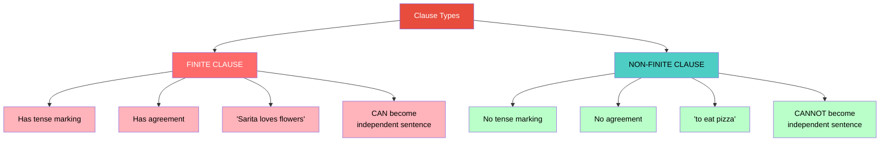

---

## The Secret of Missing Subjects in Non-Finite Clauses

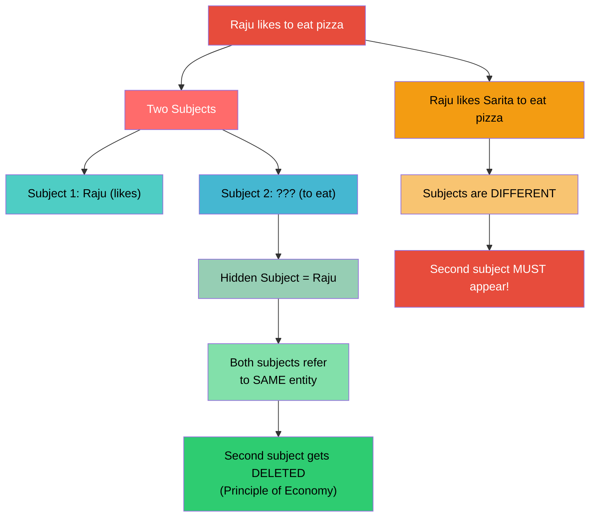

| Situation | Example | Rule |
|-----------|---------|------|
| **Same subject** | "I want to go" (I want + I go) | Second subject deleted |
| **Different subjects** | "I want Sarita to go" | Second subject MUST appear |

---

## Clauses Can Work in Different Structural Positions

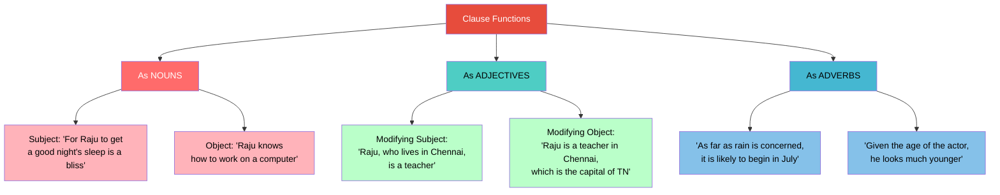

---

## Adjectival Clause vs Adverbial Clause

| Type | Example | Function |
|------|---------|----------|
| **Adjectival** | "Raju, **who lives in Chennai**, is a teacher" | Modifies the noun "Raju" |
| **Adverbial** | "**As far as rain is concerned**, it is likely to begin in July" | Gives context/framework for the whole sentence |

---

## 🎓 Summary: The Relationship Between Sentence and Clause

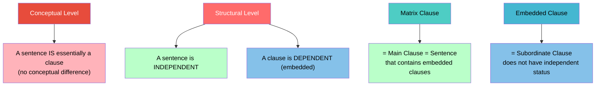

> 🎯 **The Goal:** Understanding these intricacies gives you **total control** over how to construct sentences with confidence. The human mind has no pressure processing any sentence, no matter how complex - because structurally, it's all the same.

---

# Lecture 15: Illustrating Clauses and Sentences

## 🎯 From Theory to Real Speech

> In real-life communication, people use **complex sentences with multiple clauses** - not simple sentences. Yet the hearer receives the message without ambiguity. Understanding how this works is key to mastering English.

---

## Real Discourse Analysis: Bill Gates Speech Excerpt

> "Everyone needs a coach. It does not matter whether you are a basketball player, a tennis player, a gymnast, or a bridge player. My bridge coach, Sharon Osberg, says there are more pictures of the back of her head than anyone else's in the world... We all need people who will give us feedback. That is how we improve."

### Sentence Type Analysis

| Sentence | Type | Structure |
|----------|------|-----------|
| "Everyone needs a coach." | **Simple** | One independent clause |
| "It does not matter whether you are a basketball player..." | **Complex** | Main clause + nominal subordinate clause |
| "We all need people **who will give us feedback**" | **Complex** | Main clause + adjectival (relative) clause |

---

## Complex Sentence Analysis: "Swami and Friends"

> "Six weeks later, Rajam came to Swaminathan's house **to announce** **that he forgave him all his sins** starting with his political activities, to his new acquisition, the Board High School air, **by which was meant a certain slowness and stupidity engendered by mental decay**."

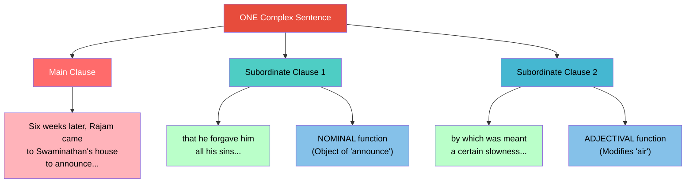

---

## Independent Clause Characteristics

> An **independent clause** (main clause/matrix clause):
> - Has both a **subject** and a **predicate**
> - Does **not depend** structurally on any other clause
> - Can stand **alone** as a complete sentence
> - Contains **only one verb** (as the main verb)

### Examples of Independent Clauses (Simple Sentences)

| Example | Analysis |
|---------|----------|
| "Water freezes at 0 degrees centigrade." | Complete simple sentence |
| "Sun rises in the east." | Complete simple sentence |
| "The plane was finally allowed to land." | Complete simple sentence |

---

## Compound Sentences

> **Compound Sentence** = Two or more **independent clauses** joined by:
> - Coordinating conjunctions: **and, or, but**
> - **Commas**

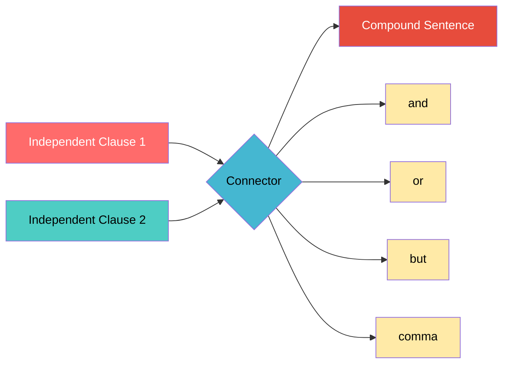

### Examples of Compound Sentences

| Example | How Connected |
|---------|---------------|
| "I came, I saw, I conquered." | Commas |
| "Sometimes I have Idlis for breakfast, **but** some other times, I also like bread." | Comma + but |
| "European workers generally go to church on Sundays **or** they go to work for charity." | or |
| "Mary called the check-in desk before leaving **and** she reached the airport in time." | and |

---

## Complex vs Compound: Clear Distinction

```mermaid
graph TB
    A[Two Types of Multi-Clause Sentences] --> B[COMPOUND]
    A --> C[COMPLEX]
    
    B --> B1[Two INDEPENDENT clauses]
    B --> B2[Joined by: and, or, but, comma]
    B --> B3["Example: 'I came, I saw,<br/>I conquered.'"]
    
    C --> C1[Independent + DEPENDENT clause(s)]
    C --> C2[Subordinate clause embedded within]
    C --> C3["Example: 'He believed<br/>that his set was intact.'"]
    
    style A fill:#E74C3C,color:#fff
    style B fill:#FF6B6B,color:#fff
    style C fill:#4ECDC4,color:#000
    style B1 fill:#FFB3BA,color:#000
    style B2 fill:#FFB3BA,color:#000
    style B3 fill:#FFB3BA,color:#000
    style C1 fill:#BAFFC9,color:#000
    style C2 fill:#BAFFC9,color:#000
    style C3 fill:#BAFFC9,color:#000
```

---

## The Essential Components of a Sentence

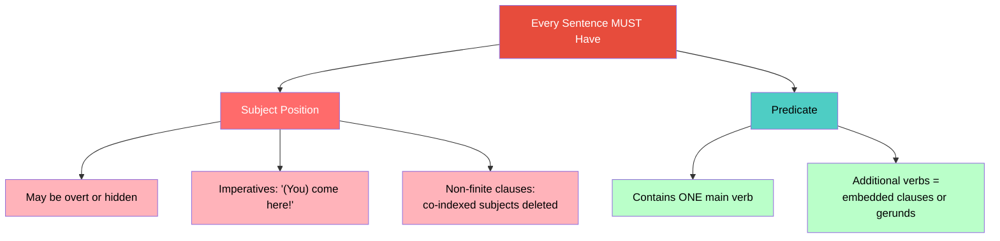

---

## 🎓 Key Takeaway

> In real speech and writing, people naturally use **complex sentences** with multiple clauses. The beauty is that the hearer's mind processes these without any ambiguity. Understanding this structure gives you:
> - **Confidence** in constructing complex sentences
> - **Control** over your written and spoken expression
> - The ability to **analyze** and **improve** your own language

> 🧠 **Fun Fact:** When we speak naturally, we often repeat parts of sentences ("than anyone else's in the world... than anyone else's in the world") and use run-on structures. This is perfectly normal in spoken discourse, and our minds process it effortlessly!

---

# Lecture 16: Adjectival (Relative) Clause

## 🎯 What Is an Adjectival Clause?

> An **adjectival clause** (also called a **relative clause**) is a subordinate clause that functions like an adjective - it **modifies a noun**.

```mermaid
graph TB
    A[Adjectival Clause] --> B[Characteristics]
    B --> C[Functions like an adjective]
    B --> D[Modifies a noun]
    B --> E[Can be replaced by an adjective]
    B --> F[Follows the noun<br/>(unlike adjectives)]
    
    A --> G[Also Known As]
    G --> H[Relative Clause]
    H --> I["Begins with relative pronoun:<br/>who, which, that, where, when"]
    
    style A fill:#E74C3C,color:#fff
    style B fill:#FF6B6B,color:#fff
    style C fill:#FFB3BA,color:#000
    style D fill:#FFB3BA,color:#000
    style E fill:#FFB3BA,color:#000
    style F fill:#FFB3BA,color:#000
    style G fill:#4ECDC4,color:#000
    style H fill:#BAFFC9,color:#000
    style I fill:#85C1E9,color:#000
```

---

## Why Large Sentences?

> **Scientific reason:** The human mind has no difficulty processing large sentences. A sentence is a sentence - large or small doesn't matter. The mind tests for grammaticality on the same parameters regardless of length.

---

## Adjective vs Adjectival Clause: Position

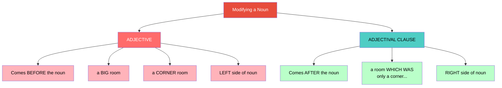

> ⚠️ **Key Distinction:** Adjectives **precede** the noun (left side); Adjectival clauses **follow** the noun (right side).

---

## Example 1: Basic Adjectival Clause

> "By eight, he was at his desk in his room, **which was only a corner in his father's dressing room**."

```mermaid
graph TB
    A[Main Clause] --> B["By eight, he was at his desk<br/>in his room"]
    C[Subordinate Adjectival Clause] --> D["which was only a corner<br/>in his father's dressing room"]
    D --> E[Modifies: "room"]
    D --> F[Could be replaced by:<br/>'corner room']
    
    style A fill:#FF6B6B,color:#fff
    style B fill:#FFB3BA,color:#000
    style C fill:#4ECDC4,color:#000
    style D fill:#BAFFC9,color:#000
    style E fill:#85C1E9,color:#000
    style F fill:#85C1E9,color:#000
```

---

## Example 2: Multiple Clauses in One Sentence

> "**While the teacher was scrutinising the sums**, Swaminathan was gazing on his face, **which seemed so tame at close quarters**."

| Clause | Type | Function |
|--------|------|----------|
| "Swaminathan was gazing on his face" | **Main/Independent** | Main clause |
| "While the teacher was scrutinising the sums" | **Subordinate - ADVERBIAL** | Additional information about timing |
| "which seemed so tame at close quarters" | **Subordinate - ADJECTIVAL** | Modifies "his face" |

---

## Example 3: Adjectival Clause Modifying a Person

> "It was taken by D. Pillai, **who had earned a name in the school for kindness and good humour**."

| Component | Analysis |
|-----------|----------|
| Main Clause | "It was taken by D. Pillai" |
| Adjectival Clause | "who had earned a name in the school for kindness and good humour" |
| Noun Modified | "D. Pillai" |
| Relative Pronoun | "who" (referring to a person) |

---

## Example 4: Using "That" as a Relative Pronoun

> "There were moments in it **that brought stirring pictures before one**."

| Component | Analysis |
|-----------|----------|
| Main Clause | "There were moments in it" |
| Adjectival Clause | "that brought stirring pictures before one" |
| Noun Modified | "moments" |
| Relative Pronoun | "that" |

---

## Relative Pronouns

```mermaid
graph TB
    A[Relative Pronouns] --> B["who - for people"]
    A --> C["which - for things"]
    A --> D["that - for people or things"]
    A --> E["where - for places"]
    A --> F["when - for times"]
    A --> G["whose - for possession"]
    
    B --> B1["D. Pillai, WHO had earned..."]
    C --> C1["his room, WHICH was only..."]
    D --> D1["moments THAT brought..."]
    E --> E1["the day WHEN his doings..."]
    
    style A fill:#E74C3C,color:#fff
    style B fill:#FF6B6B,color:#fff
    style C fill:#4ECDC4,color:#000    style D fill:#45B7D1,color:#000
    style E fill:#96CEB4,color:#000
    style F fill:#FFEAA7,color:#000
    style G fill:#DDA0DD,color:#000
    style B1 fill:#FFB3BA,color:#000
    style C1 fill:#BAFFC9,color:#000
    style D1 fill:#85C1E9,color:#000
    style E1 fill:#82E0AA,color:#000
```

---

## Exercise: Find Adjectival Clauses

> "**Those were the four** **that he liked and admired most in his class.** "

| Component | Analysis |
|-----------|----------|
| Main Clause | "Those were the four" |
| Adjectival Clause | "that he liked and admired most in his class" |
| Noun Modified | "the four" |

> "**The first was Somu**, the monitor, **who carried himself with such an easy air.** "

| Component | Analysis |
|-----------|----------|
| Main Clause | "The first was Somu, the monitor" |
| Adjectival Clause | "who carried himself with such an easy air" |
| Noun Modified | "Somu" / "the monitor" |

> "**Mani bullied all strangers** **that came his way**, be they big or small."

| Component | Analysis |
|-----------|----------|
| Main Clause | "Mani bullied all strangers" |
| Adjectival Clause | "that came his way" |
| Noun Modified | "strangers" |

---

## Nesting: Adjectival Clause Within a Nominal Clause

> "It was said **that a new teacher [who once tried it] very nearly lost his life**."

```mermaid
graph TB
    A[Main Clause] --> B["It was said"]
    C[Nominal Clause<br/>Object of 'said'] --> D["that a new teacher<br/>very nearly lost his life"]
    E[Adjectival Clause<br/>within Nominal Clause] --> F["who once tried it"]
    F --> G[Modifies: "teacher"]
    
    style A fill:#FF6B6B,color:#fff
    style B fill:#FFB3BA,color:#000
    style C fill:#4ECDC4,color:#000
    style D fill:#BAFFC9,color:#000
    style E fill:#45B7D1,color:#000
    style F fill:#85C1E9,color:#000
    style G fill:#85C1E9,color:#000
```

---

## 🎓 Key Takeaway

> Adjectival (relative) clauses:
> 1. **Function** like adjectives - they modify nouns
> 2. **Follow** the noun they modify (unlike adjectives which precede)
> 3. Begin with **relative pronouns** (who, which, that, where, when)
> 4. Can be **replaced** by a simple adjective or prepositional phrase
> 5. Can appear in **any position** where a noun appears (subject, object, etc.)

> 🧠 **Fun Fact:** Relative clauses are called "relative" because they "relate" back to a noun. The relative pronoun (who, which, that) acts like a bridge connecting the clause to the noun it describes. In some languages, relative clauses come BEFORE the noun - English is unusual in placing them after!

---

# Lecture 17: Required and Optional Elements in English Sentences (Complements and Adjuncts)

## 🎯 The Building Blocks of Grammatical Sentences

> Understanding what is **required** (complements) and what is **optional** (adjuncts) in a sentence is fundamental to producing grammatical English.

```mermaid
graph TB
    A[Sentence Elements] --> B[REQUIRED<br/>COMPLEMENTS]
    A --> C[OPTIONAL<br/>ADJUNCTS]
    
    B --> B1[Subject]
    B --> B2[Predicate]
    B --> B3[Objects of<br/>transitive verbs]
    
    C --> C1[Adverbs]
    C --> C2[Prepositional phrases<br/>giving extra info]
    C --> C3[Time, place, manner<br/>information]
    
    style A fill:#E74C3C,color:#fff
    style B fill:#FF6B6B,color:#fff
    style C fill:#4ECDC4,color:#000
    style B1 fill:#FFB3BA,color:#000
    style B2 fill:#FFB3BA,color:#000
    style B3 fill:#FFB3BA,color:#000
    style C1 fill:#BAFFC9,color:#000
    style C2 fill:#BAFFC9,color:#000
    style C3 fill:#BAFFC9,color:#000
```

---

## The Two-Part Structure of a Sentence

```mermaid
graph TB
    A[Every English Sentence] --> B[SUBJECT]
    A --> C[PREDICATE]
    
    B --> B1[What the sentence<br/>is about]
    
    C --> C1[Everything else]
    C --> C2[Contains the VERB]
    C --> C3[Verb is the MOST<br/>important element]
    
    B --> D[AGREEMENT]
    C --> D
    
    D --> D1[Subject and Verb<br/>MUST agree]
    D --> D2[Number: singular/plural]
    D --> D3[Person: 1st/2nd/3rd]
    D --> D4[Gender: limited role]
    
    style A fill:#E74C3C,color:#fff
    style B fill:#FF6B6B,color:#fff
    style C fill:#4ECDC4,color:#000
    style D fill:#45B7D1,color:#000
    style B1 fill:#FFB3BA,color:#000
    style C1 fill:#BAFFC9,color:#000
    style C2 fill:#BAFFC9,color:#000
    style C3 fill:#BAFFC9,color:#000
    style D1 fill:#85C1E9,color:#000
    style D2 fill:#85C1E9,color:#000
    style D3 fill:#85C1E9,color:#000
    style D4 fill:#85C1E9,color:#000
```

---

## Word Order: English vs Indian Languages

```mermaid
graph LR
    subgraph "English (Verb Medial)"
    E1[Subject] --> E2[Verb] --> E3[Object]
    end
    
    subgraph "Indian Languages (Verb Final)"
    I1[Subject] --> I2[Object] --> I3[Verb]
    end
    
    style E1 fill:#FF6B6B,color:#fff
    style E2 fill:#4ECDC4,color:#000
    style E3 fill:#45B7D1,color:#000
    style I1 fill:#FF6B6B,color:#fff
    style I2 fill:#45B7D1,color:#000
    style I3 fill:#4ECDC4,color:#000
```

> ⚠️ **Major Structural Difference:** In English, objects FOLLOW the verb (SVO). In most Indian languages (Hindi, Tamil, Telugu, etc.), objects PRECEDE the verb (SOV).

---

## Verb Types and Their Requirements

```mermaid
graph TB
    A[Verb Types] --> B[INTRANSITIVE]
    A --> C[TRANSITIVE]
    A --> D[DITRANSITIVE]
    
    B --> B1["No object needed"]
    B --> B2["'John sleeps'"]
    B --> B3["'Come here!'"]
    
    C --> C1["ONE object needed"]
    C --> C2["'John loves Mary'"]
    C --> C3["'Raju likes pizza'"]
    
    D --> D1["TWO objects needed"]
    D --> D2["'Ravi gave Deepa a book'"]
    D --> D3["IO + DO"]
    
    style A fill:#E74C3C,color:#fff
    style B fill:#FF6B6B,color:#fff
    style C fill:#4ECDC4,color:#000
    style D fill:#45B7D1,color:#000
    style B1 fill:#FFB3BA,color:#000
    style B2 fill:#FFB3BA,color:#000
    style B3 fill:#FFB3BA,color:#000
    style C1 fill:#BAFFC9,color:#000
    style C2 fill:#BAFFC9,color:#000
    style C3 fill:#BAFFC9,color:#000
    style D1 fill:#85C1E9,color:#000
    style D2 fill:#85C1E9,color:#000
    style D3 fill:#85C1E9,color:#000
```

---

## Complements: The Required Elements

> **Complement** = Structurally **indispensable** part of a sentence, clause, or phrase. Removing it makes the sentence **incomplete/ungrammatical**.

### What Happens When Complements Are Missing?

| Incomplete Sentence | Missing Complement | Complete Version |
|--------------------|--------------------|--------------------|
| "Raju needs for his exam." ❌ | Object of "needs" | "Raju needs **a pen** for his exam." ✅ |
| "Ramu eats after dinner." ❌ | Object of "eats" | "Ramu eats **medicine** after dinner." ✅ |
| "Seema reads in the morning." ❌ | Object of "reads" | "Seema reads **the newspaper** in the morning." ✅ |
| "Raju helped in the morning." ❌ | Object of "helped" | "Raju helped **Ramu** in the morning." ✅ |

```mermaid
graph LR
    A["Raju needs<br/>❌ INCOMPLETE"] --> B["Raju needs A PEN<br/>✅ COMPLETE"]
    C["Ramu eats<br/>❌ INCOMPLETE"] --> D["Ramu eats MEDICINE<br/>✅ COMPLETE"]
    
    style A fill:#FF6B6B,color:#fff
    style B fill:#2ECC71,color:#000
    style C fill:#FF6B6B,color:#fff
    style D fill:#2ECC71,color:#000
```

---

## Adjuncts: The Optional Elements

> **Adjunct** = Structurally **dispensable** element. Removing it does NOT make the sentence ungrammatical.

### Adjuncts Can Be Removed Freely

| Full Sentence | Without Adjunct | Still Grammatical? |
|---------------|-----------------|-------------------|
| "Raju helped Ramu **in the morning**" | "Raju helped Ramu" | ✅ Yes |
| "John likes pizza **with his friends**" | "John likes pizza" | ✅ Yes |
| "John and Mary like pizza **in the evening**" | "John and Mary like pizza" | ✅ Yes |
| "Drink a glass of water **before food**" | "Drink a glass of water" | ✅ Yes |

---

## The Special Verb "Drink"

```mermaid
graph TB
    A["The Verb 'DRINK'"] --> B[With specified object]
    A --> C[Without specified object]
    
    B --> B1["Drink WATER"]
    B --> B2["Drink JUICE"]
    B --> B3["Drink a glass of MILK"]
    
    C --> C1["Don't DRINK"]
    C --> C2["Don't DRINK and drive"]
    C --> C3["Means: Don't drink ALCOHOL"]
    
    style A fill:#E74C3C,color:#fff
    style B fill:#4ECDC4,color:#000
    style C fill:#FF6B6B,color:#fff
    style B1 fill:#BAFFC9,color:#000
    style B2 fill:#BAFFC9,color:#000
    style B3 fill:#BAFFC9,color:#000
    style C1 fill:#FFB3BA,color:#000
    style C2 fill:#FFB3BA,color:#000
    style C3 fill:#FFB3BA,color:#000
```

> 🍺 **Fun Fact:** "Drink" without a specified object defaults to meaning "drink alcohol" in English. This is why signs say "Don't drink and drive" - the "what" (alcohol) is understood!

---

## Adjuncts: What Do They Modify?

### The Key Question

> Is an adjunct modifying the **verb** or a **noun phrase**?

```mermaid
graph TB
    A["John likes pizza with his friends"] --> B["with his friends"]
    B --> C["Modifies: PIZZA"]
    C --> D["NP Adjunct<br/>(adjunct of noun phrase)"]
    
    E["John and Mary like pizza in the evening"] --> F["in the evening"]
    F --> G["Modifies: LIKE"]
    G --> H["VP Adjunct<br/>(adjunct of verb phrase)"]
    
    style A fill:#E74C3C,color:#fff
    style B fill:#FF6B6B,color:#fff
    style C fill:#FFB3BA,color:#000
    style D fill:#FFB3BA,color:#000
    style E fill:#4ECDC4,color:#000
    style F fill:#45B7D1,color:#000
    style G fill:#85C1E9,color:#000
    style H fill:#85C1E9,color:#000
```

| Sentence | Adjunct | What It Modifies |
|----------|---------|-----------------|
| "John likes pizza **with his friends**" | with his friends | "pizza" (NP adjunct) |
| "John and Mary like pizza **in the evening**" | in the evening | "like" (VP adjunct) |
| "Drink a glass of water **before food**" | before food | "water" (NP adjunct) |

---

## Complements and Adjuncts Within Phrases

> Complements and adjuncts don't only exist at the sentence level - they also exist **within phrases**!

```mermaid
graph TB
    A[Noun Phrase Structure] --> B["The King of England"]
    A --> C["The King of England with his ministers"]
    
    B --> B1["COMPLEMENT:<br/>'of England'"]
    B1 --> B2[Required<br/>Cannot be omitted<br/>without changing meaning]
    
    C --> C1["COMPLEMENT:<br/>'of England'"]
    C --> C2["ADJUNCT:<br/>'with his ministers'"]
    C2 --> C3[Optional<br/>Can be omitted]
    
    style A fill:#E74C3C,color:#fff
    style B fill:#FF6B6B,color:#fff
    style C fill:#4ECDC4,color:#000
    style B1 fill:#FFB3BA,color:#000
    style B2 fill:#FFB3BA,color:#000
    style C1 fill:#BAFFC9,color:#000
    style C2 fill:#85C1E9,color:#000
    style C3 fill:#85C1E9,color:#000
```

---

## The Proximity Rule

> **Complements must be CLOSER to the head than adjuncts.**

```mermaid
graph TB
    A[Word Order Test] --> B["✅ The King of England<br/>with his ministers"]
    A --> C["❌ The King with his ministers<br/>of England"]
    
    B --> B1[Complement is closer<br/>to the head noun]
    C --> C1[Adjunct cannot come<br/>between head and complement]
    
    D["✅ A student of physics<br/>with long hair"] --> D1[Complement closer]
    E["❌ A student with long hair<br/>of physics"] --> E1[UNGRAMMATICAL]
    
    style A fill:#E74C3C,color:#fff
    style B fill:#2ECC71,color:#000
    style C fill:#FF6B6B,color:#fff
    style B1 fill:#82E0AA,color:#000
    style C1 fill:#FFB3BA,color:#000
    style D fill:#2ECC71,color:#000
    style E fill:#FF6B6B,color:#fff
    style D1 fill:#82E0AA,color:#000
    style E1 fill:#FFB3BA,color:#000
```

---

## Key Rules for Complements and Adjuncts

```mermaid
graph TB
    A[Rules] --> B[Complements]
    A --> C[Adjuncts]
    
    B --> B1[Must be CLOSE to the head]
    B --> B2["Only ONE complement<br/>per head (maximum 2<br/>for ditransitive verbs)"]
    B --> B3[Removing them makes<br/>sentence UNGRAMMATICAL]
    
    C --> C1[Must stay AWAY from head<br/>(after complement)]
    C --> C2["MULTIPLE adjuncts<br/>are possible"]
    C --> C3[Removing them leaves<br/>sentence GRAMMATICAL]
    
    style A fill:#E74C3C,color:#fff
    style B fill:#FF6B6B,color:#fff
    style C fill:#4ECDC4,color:#000
    style B1 fill:#FFB3BA,color:#000
    style B2 fill:#FFB3BA,color:#000
    style B3 fill:#FFB3BA,color:#000
    style C1 fill:#BAFFC9,color:#000
    style C2 fill:#BAFFC9,color:#000
    style C3 fill:#BAFFC9,color:#000
```

---

## Imperative Sentences: The Hidden Subject

> "**Come here!**" - Is this a complete sentence without a subject?

```mermaid
graph TB
    A["Come here!"] --> B[Has a subject?]
    B --> C["YES - Hidden subject = 'YOU'"]
    
    C --> D[Principle of Economy]
    D --> E["When the subject is always<br/>the same (2nd person),<br/>why articulate it?"]
    
    A --> F[Verb: come (intransitive)]
    A --> G[Adjunct: here (location)]
    
    style A fill:#E74C3C,color:#fff
    style B fill:#FF6B6B,color:#fff
    style C fill:#4ECDC4,color:#000
    style D fill:#45B7D1,color:#000
    style E fill:#85C1E9,color:#000
    style F fill:#BAFFC9,color:#000
    style G fill:#BAFFC9,color:#000
```

> 🧠 **Principle of Economy:** Human language is a sophisticated product of the mind. When something is obvious and predictable (like the subject of an imperative always being "you"), we don't waste effort articulating it. The **absence** of the subject actually **registers its presence** in our mental grammar!

---

## 📊 Complete Analysis Framework

```mermaid
graph TB
    A[Analyzing Any English Sentence] --> B[Step 1]
    A --> C[Step 2]
    A --> D[Step 3]
    A --> E[Step 4]
    
    B --> B1[Identify SUBJECT<br/>and PREDICATE]
    
    C --> C1[Find the VERB]
    C --> C2[Determine verb type:<br/>Intransitive/Transitive/Ditransitive]
    
    D --> D1[Identify COMPLEMENTS]
    D --> D2[Objects of the verb<br/>(required elements)]
    
    E --> E1[Identify ADJUNCTS]
    E --> E2[What do they modify?<br/>Verb or Noun Phrase?]
    
    style A fill:#E74C3C,color:#fff
    style B fill:#FF6B6B,color:#fff
    style C fill:#4ECDC4,color:#000
    style D fill:#45B7D1,color:#000
    style E fill:#96CEB4,color:#000
    style B1 fill:#FFB3BA,color:#000
    style C1 fill:#BAFFC9,color:#000
    style C2 fill:#BAFFC9,color:#000
    style D1 fill:#85C1E9,color:#000
    style D2 fill:#85C1E9,color:#000
    style E1 fill:#82E0AA,color:#000
    style E2 fill:#82E0AA,color:#000
```

---

## 🎓 Final Summary: Complements vs Adjuncts

| Feature | Complement | Adjunct |
|---------|------------|---------|
| **Requirement** | Structurally REQUIRED | Structurally OPTIONAL |
| **Removal Effect** | Makes sentence ungrammatical | Sentence remains grammatical |
| **Position** | Close to the head | After complement, away from head |
| **Number** | One (max 2 for ditransitive) | Multiple possible |
| **Examples** | Objects of verbs, "of England" in "King of England" | Time, place, manner phrases |
| **Test** | "Raju needs ___" (incomplete!) | "Raju helped Ramu (in the morning)" |

---

## 🏆 Master Exercise

> Take 20 sentences. For each:
> 1. Underline the **subject**
> 2. Identify the **verb** and its type
> 3. Circle all **complements** (required objects)
> 4. Put brackets around all **adjuncts** (optional elements)
> 5. For each adjunct, determine what it **modifies** (verb or noun phrase)

> 🧠 **Fun Fact:** This analysis is like an "X-ray machine" for sentences! Once you master it, you'll see the skeleton of every sentence you read or hear, giving you amazing confidence in your own production.

---

*Notes compiled from the YouTube lecture series on English Language Mastery - Lectures 13-17*