# Comprehensive Notes on Writing Skills

## Lecture 18: Writing to Argue - Part I

### What is Argumentative Writing?

Argumentative writing is a form of writing where the author presents a **reasoned case** for or against a particular position, policy, or course of action. It involves presenting **evidence**, **examples**, and **logical reasoning** to persuade readers.

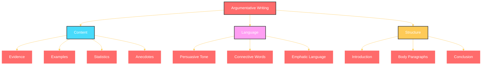

### Why Write to Argue?

1. **Influence decisions** - Shape policy and public opinion
2. **Advocate for causes** - Support positions you believe in
3. **Develop critical thinking** - Examine issues from multiple angles
4. **Build persuasive skills** - Essential for professional success
5. **Demonstrate language proficiency** - Show advanced command of the language

### How to Create Content for Argumentative Essays

#### Step 1: Brainstorm What You Know
- Make a list of everything you already know about the topic
- Include personal observations and experiences
- Note down common arguments you've heard

#### Step 2: Research Additional Information
- Look for **statistics** and **data**
- Find **expert opinions** and **quotations**
- Gather **case studies** and **examples**
- Search for **historical parallels**

#### Step 3: Organize Your Points
- Group similar arguments together
- Identify the **strongest** and **weakest** points
- Arrange points in a **logical sequence**

### Language of Argumentation

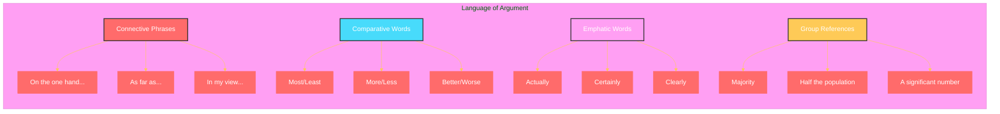

### Key Language Features for Argumentation

| **Feature** | **Examples** | **Purpose** |
|-------------|--------------|-------------|
| **Connective Phrases** | "On the one hand...", "As far as...", "In view of..." | Structure arguments |
| **Comparative Language** | "Most cost-effective", "Least polluting" | Show preferences |
| **Emphatic Adverbs** | "Actually", "Clearly", "Certainly" | Strengthen claims |
| **Group References** | "Majority", "Half the population" | Show support |
| **Demanding Consideration** | "Before we conclude...", "While we are at it..." | Guide readers |

### Example Analysis

**Online Grocery Debate:**

**Argument FOR:**
> "Big companies will take products from shops and deliver to customers. Nothing of culture would be lost. It will also reduce cost, increase efficiency, and enhance choices."

**Argument AGAINST:**
> "Local shops give employment to hundreds of thousands. They are culture-related. The kind of coffee one likes comes only from specific regions; these things will disappear in global markets."

### Structure of Argumentative Essays

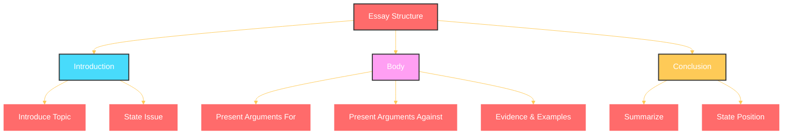

### When to Use Argumentative Writing

1. **Academic essays** - Examining controversial topics
2. **Policy proposals** - Advocating for specific policies
3. **Opinion pieces** - Expressing views in newspapers/magazines
4. **Debate preparation** - Organizing arguments
5. **Business proposals** - Persuading stakeholders
6. **Letters to the editor** - Public discourse

### Fun Fact

The art of argumentation dates back to **Ancient Greece**, where philosophers like Aristotle developed **rhetoric** - the art of persuasion. Aristotle identified three key appeals:
- **Ethos** (credibility)
- **Pathos** (emotion)
- **Logos** (logic)

---

## Lecture 19: Writing to Argue - Part II

### Structure of Arguments

The way you **organize** your arguments is as important as the arguments themselves. A well-structured argument keeps the reader engaged and makes your case more persuasive.

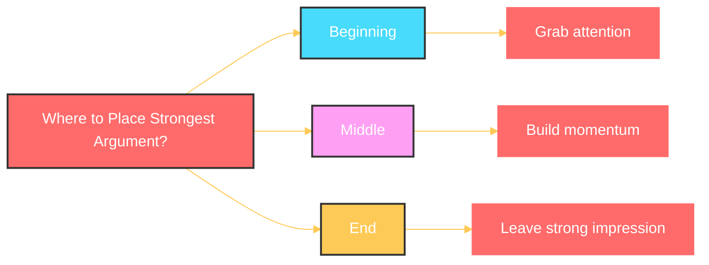

### Principles of Good Argument Structure

**1. Keep the Audience's Interest**
- Don't bore your readers
- Be concise and relevant
- Use engaging examples

**2. Illustrate with Examples**
- Make abstract ideas concrete
- Use real-world cases
- Include personal anecdotes when appropriate

**3. Use Evidence Wisely**
- Statistical evidence for major claims
- Anecdotal evidence for personal connection
- Mix both for balance

**4. Maintain Objectivity**
- Present both sides fairly
- Acknowledge counterarguments
- Build credibility through balance

### Complex Sentences in Arguments

Argumentative writing frequently uses **complex sentences** to show relationships between ideas:

| **Structure** | **Example** | **Function** |
|---------------|-------------|--------------|
| **If...then** | "If this seems contradictory, then why would a parent believe..." | Show condition |
| **While/Whereas** | "While there have been studies saying fathers are not the best caregivers, however, there are 13% of fathers..." | Show contrast |
| **Although** | "Although it may be uneconomical, this is the best way..." | Acknowledge objection |
| **Since** | "Since children are good at learning anything, English should be taught..." | Show cause |

### Types of Evidence

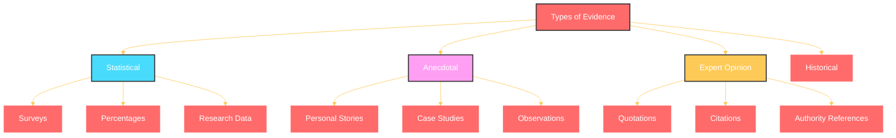

### Practice Topics for Argumentative Writing

**Topic 1: Big Chain Stores vs. Local Retail**
> "Should big global giants be banned from retail marketing of domestic items, vegetables, fruits, milk, meat, and fresh bread?"

**Topic 2: Early English Education**
> "Must a child be taught in English from the time of its birth?"

**Topic 3: State Power**
> "Should the state have absolute power on public roads and in public life, or should it respect privacy at home?"

### The Process of Writing an Argument

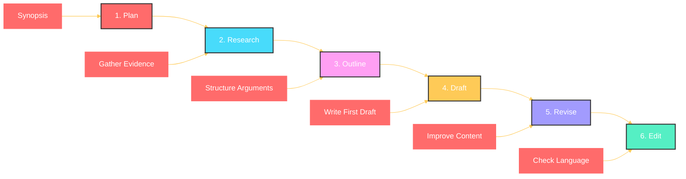

### Fun Fact

The **rule of three** is a powerful persuasive device. People remember things in threes better than in any other number. "Life, liberty, and the pursuit of happiness" - three things. "Veni, vidi, vici" (I came, I saw, I conquered) - three things.

### Key Takeaways for Argumentative Writing

1. **Plan before you write** - Create a synopsis
2. **Know both sides** - Present balanced arguments
3. **Use evidence effectively** - Mix statistics and anecdotes
4. **Write multiple drafts** - Revise and improve
5. **Use appropriate language** - Connective phrases and complex sentences
6. **Keep it interesting** - Engage your reader

> "**The best way is to keep it interesting, short and sweet. Illustrate it with examples. Occasionally bring some statistical evidence and structure your argument such that you will make the valid point and not be biased.** "

---

## Lecture 20: Lab Manuals - Writing Clear Procedures

### What is a Lab Manual?

A lab manual is a **procedural document** that provides step-by-step instructions for performing experiments, tasks, or processes. It tells the reader **what to do**, **how to do it**, and **in what sequence**.

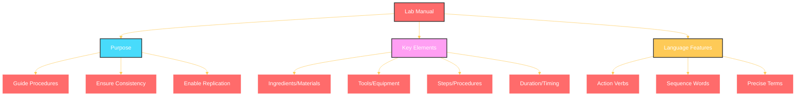

### Why Write Lab Manuals?

1. **Ensure reproducibility** - Others can repeat the process
2. **Maintain consistency** - Standardize procedures
3. **Prevent errors** - Clear instructions reduce mistakes
4. **Document processes** - Record methods for future reference
5. **Train others** - Teach new people how to do tasks

### How to Write an Effective Lab Manual

#### Step 1: Know Your Materials

List all **ingredients**, **tools**, and **equipment** needed:

| **Category** | **Examples** |
|--------------|--------------|
| **Ingredients** | Tea leaves, water, milk, sugar |
| **Tools** | Kettle, pan, percolator, cup, spoon |
| **Equipment** | Stove, burner, microwave |

#### Step 2: Know Your Actions (Verbs)

Use precise **action verbs** to describe each step:

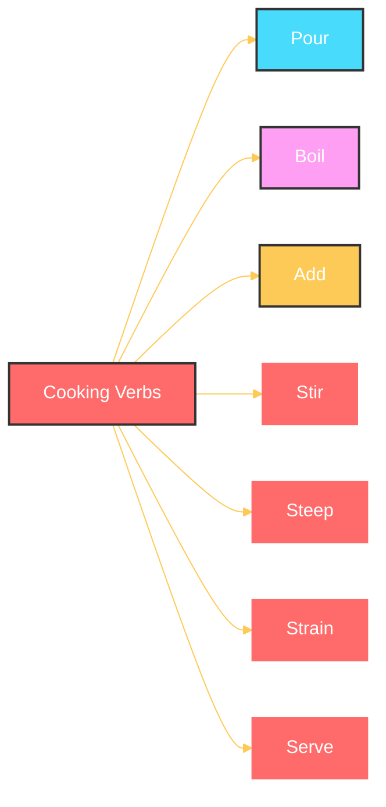

#### Step 3: Determine Sequence

The **order** of steps matters:
- Some processes must be done **before** others
- Some steps can be done **simultaneously**
- Some steps are **optional**

#### Step 4: Specify Duration

Use **time-related words** to indicate how long each step takes:

| **Term** | **Meaning** |
|----------|-------------|
| "Until bubbles settle" | Until the action completes |
| "Let leaves soak" | Wait for a period |
| "Hard-boiled" | 2 minutes |
| "Full boiled" | 4 minutes |
| "Until steam rises" | Completion indicator |

#### Step 5: Describe Changes

Explain **what to look for** as indicators of completion:

- **Color change**: "Tea changes from clear to yellow/red"
- **Form change**: "Leaves sink to the bottom"
- **Smell**: "Aroma rises"
- **Texture**: "Softens"

### Example: Making Tea - A Lab Manual

**Materials:**
- 1 cup of water
- ½ teaspoon of tea leaves (not dust)
- Optional: milk, sugar, ginger, spices

**Procedure:**

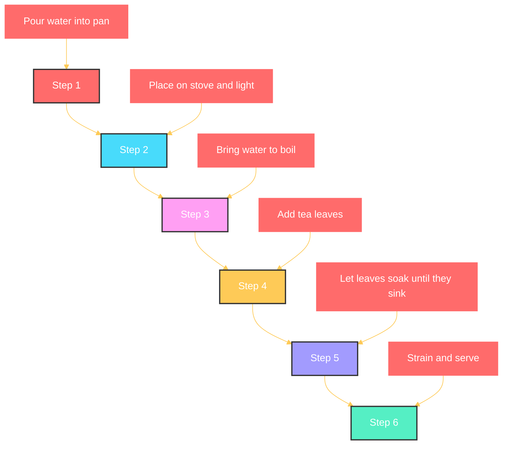

**Notes:**
- Use unbroken leaves for best results
- Add milk and sugar after straining
- Let leaves soak until they sink to the bottom

### Language Features of Lab Manuals

| **Feature** | **Examples** | **Purpose** |
|-------------|--------------|-------------|
| **Imperative Verbs** | "Pour", "Add", "Stir" | Give direct instructions |
| **Sequence Words** | "First", "Then", "Finally" | Show order |
| **Precise Terms** | "Hard-boiled", "Steep" | Ensure accuracy |
| **Passive Voice** | "The water is heated" | Focus on action |
| **Conditionals** | "If using tea bag, dip..." | Handle options |

### Common Mistakes to Avoid

1. **Assuming too much** - Don't skip steps
2. **Vague language** - Be specific
3. **Wrong sequence** - Order matters
4. **Missing durations** - Tell how long
5. **Lack of indicators** - Tell when to stop

### Fun Fact

The **Titanic disaster** is often attributed to a failure in following procedures. The crew ignored warnings, used inadequate tools, and failed to follow the manual - demonstrating why precise procedural writing matters!

### Practice Assignment

**Write a lab manual on how to make coffee.**

Include:
- List of materials
- Step-by-step instructions
- Duration for each step
- Indicators of completion

---

## Lecture 21: Writing to Influence

### What is Influential Writing?

Influential writing aims to **persuade readers** to adopt a particular viewpoint, belief, or course of action. It uses specific **language tools** to shape opinions.

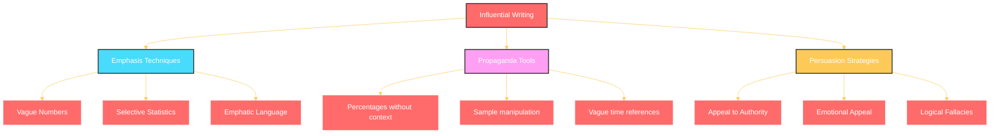

### Why Write to Influence?

1. **Shape public opinion** - On important issues
2. **Promote products/services** - Marketing and advertising
3. **Advocate for causes** - Social and political change
4. **Build credibility** - Establish expertise
5. **Drive action** - Encourage specific behaviors

### How Writers Influence Through Language

#### 1. Manipulating Numbers

| **Technique** | **Example** | **Effect** |
|---------------|-------------|------------|
| **Percentages without context** | "78% of respondents preferred..." | Makes it seem like a majority |
| **Vague sample description** | "350 respondents" | Hides inadequacy of sample size |
| **Selective presentation** | "7.2% of 350 respondents" | Distorts meaning |
| **Implied numbers** | "Significant number" | No accountability |

**Example Analysis:**
> "In an auto survey last week, 78.1% of the total 350 respondents showed preference towards personal car or two-wheelers."

- **Question to ask**: 78% of 350 people is about 273 people. Does that represent the population of a city?
- **Hidden reality**: 78% sounds impressive, but with only 350 respondents, it might not be representative.

#### 2. Vague Language

| **Vague Word** | **Meaning** | **Why It's Problematic** |
|----------------|-------------|--------------------------|
| "Strong preference" | How strong? | Not measurable |
| "Continuing to rise" | How much? | No baseline |
| "In the short run" | How long? | No time frame |
| "Several" | More than two, but how many? | Ambiguous |

#### 3. Selective Presentation

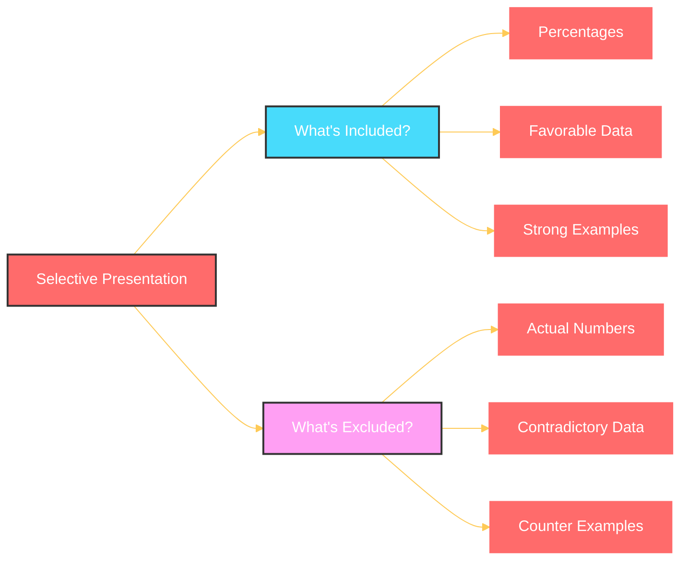

### Recognizing Persuasive Techniques

**What to Look For:**

1. **Vague quantities** - "Many," "Several," "A lot of"
2. **Unsupported claims** - No evidence provided
3. **Emotional language** - Strong adjectives without basis
4. **Selective evidence** - Only one side presented
5. **False authority** - Using titles without expertise

### Example Analysis

**Text 1:**
> "Another survey cited that 62 percent respondents..."

**Analysis:**
- How many respondents?
- Who were they?
- Where were they from?
- How were they selected?

**Text 2:**
> "Another survey included over 400 middle- and high-income groups from Delhi, Ghaziabad, Faridabad, Noida, Mathura, Rohtak, neighbouring cities in the national capital region."

**Analysis:**
- Now we know the sample composition
- But why was this specified now, not earlier?
- The writer is trying to add credibility

### The Ethics of Persuasive Writing

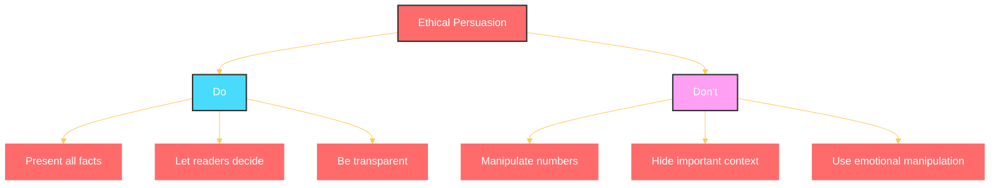

### Questions to Ask When Reading Persuasive Writing

1. **How many** people were surveyed?
2. **Who** conducted the survey?
3. **Where** were the respondents from?
4. **How** were they selected?
5. **What** was the original question?
6. **What** is the broader context?
7. **What** information is missing?

### Practice Exercise

**Analyze the following report:**
> "A survey of 400 respondents in Delhi NCR showed that 73% of respondents preferred online grocery shopping. The survey included people from all income groups and age brackets."

**Questions to consider:**
- Who conducted this survey?
- What was the sample composition?
- Was it truly representative?
- What is the margin of error?

### Fun Fact

The word **"propaganda"** originally meant "the propagation of faith" but now refers to biased or misleading information used to promote a political cause. It comes from the Latin "propagare" meaning "to spread."

### Key Takeaways

1. **Be critical** - Question numbers and percentages
2. **Look for context** - Numbers without context are meaningless
3. **Watch for vague language** - Words like "many" and "several"
4. **Check methodology** - How was the data collected?
5. **Be ethical** - Present facts and let readers decide

> "**If you ask yourself these questions, if you keep that antenna, that filter in your mind, then every time you come across propagandist writing, you will understand the propaganda part of it in no time; it is so easy.** "

---

## Lecture 22: Essays on Reflection - Part I

### What are Reflective Essays?

Reflective essays explore topics that **do not have clear black-and-white answers**. They involve **personal reflection**, **philosophical inquiry**, and **thoughtful consideration** of complex issues.

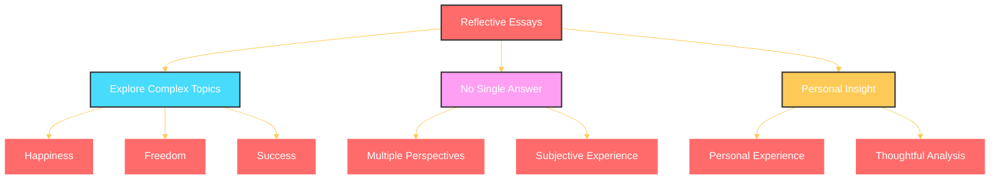

### Why Write Reflective Essays?

1. **Develop critical thinking** - Examine complex issues
2. **Express personal philosophy** - Share your worldview
3. **Demonstrate language proficiency** - Show advanced skills
4. **Prepare for exams** - IELTS, university admissions
5. **Explore meaningful topics** - Life's big questions

### How to Write a Reflective Essay

#### Step 1: Don't Start Writing Immediately

**Create a synopsis first.** A synopsis is an **overview** - like seeing a city from a rooftop.

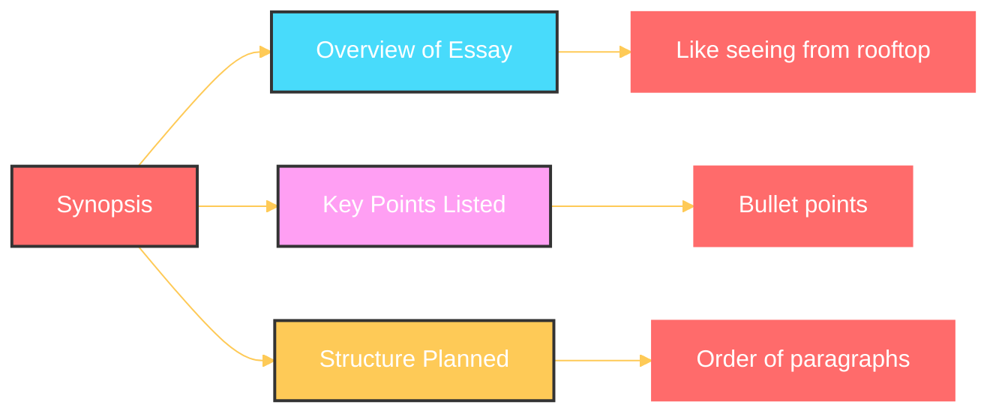

#### Step 2: What to Include in a Synopsis

| **Element** | **Description** | **Example** |
|-------------|-----------------|-------------|
| **Definition** | Define key terms | "What is happiness?" |
| **Dimensions** | Explore aspects | "Economic, social, personal" |
| **Examples** | Illustrate points | "Moments of happiness" |
| **Evidence** | Support claims | "Studies on happiness" |
| **Perspectives** | Different views | "What others say" |

#### Step 3: Sample Synopsis for "Happiness"

```
Write an essay on happiness in about 200 words.

Points:
- What is happiness? (Definition)
- Is it universal? (Dimensions)
- Examples of happiness (Instances)
- Factors affecting happiness (Evidence)
- Different perspectives (Multiple views)
- My conclusion (Personal view)
```

#### Step 4: Write the Essay

**First Draft:**
- Write freely
- Don't worry about perfection
- Include all your points

**Revision:**
- Check structure
- Improve vocabulary
- Correct grammar
- Cut unnecessary words

### Example Topic and Synopsis

**Topic:**
> "All human beings are alike; they can, therefore, live and work alike. We need not worry about local cultures, local languages, one global culture will create global happiness. Do you agree?"

**Synopsis:**

```
1. Define "alike" - What does it mean?
2. Are all humans really alike?
3. Cultural differences - Examples
4. Language and culture connection
5. Is global culture desirable?
6. Evidence from globalization
7. My conclusion
```

### The Importance of Synopsis

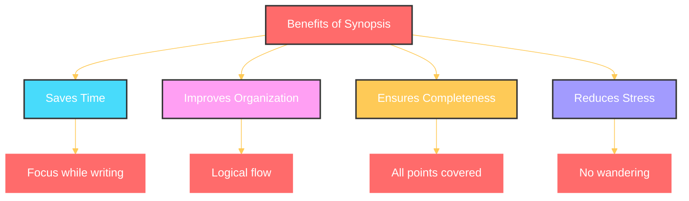

### Time Management for Essay Writing

| **Activity** | **Time (30 min total)** |
|--------------|------------------------|
| Synopsis creation | 5 minutes |
| Writing | 20 minutes |
| Revision | 5 minutes |

**10 words per minute** is a good pace for a 200-word essay.

### Common Mistakes to Avoid

1. **Starting to write immediately** - No planning
2. **Partisan viewpoint** - Only one side considered
3. **Missing aspects** - Forgetting important points
4. **No examples** - Theoretical without illustration
5. **No definition** - Terms not explained

### Fun Fact

The **essay** as a literary form was popularized by **Michel de Montaigne** in the 16th century. He called his writings "essays" because they were "attempts" (from the French "essayer" - to try) to express his thoughts.

---

## Lecture 23: Essays on Reflection - Part II

### The Complete Essay Writing Process

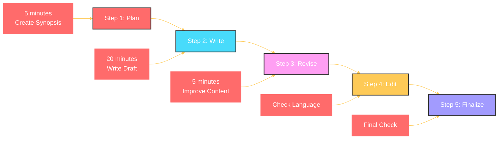

### What Makes a Good Reflective Essay?

**1. Clear Synopsis**
- Overview of the entire essay
- All key points included
- Logical order

**2. Compelling Stories**
- Personal anecdotes
- Relevant examples
- Memorable illustrations

**3. Balanced Perspective**
- Multiple viewpoints
- No bias
- Thoughtful analysis

**4. Statistical Evidence**
- Facts and figures
- Research findings
- Expert opinions

**5. Proper Language**
- Grammatically correct
- Appropriate vocabulary
- Clear sentences

### Cohesion and Coherence

**Cohesion** - How sentences connect together
**Coherence** - How ideas flow logically

```mermaid
%%{init: {'theme': 'base', 'themeVariables': { 'primaryColor': '#FF6B6B', 'primaryTextColor': '#fff', 'primaryBorderColor': '#FF6B6B', 'lineColor': '#FECA57', 'secondaryColor': '#48DBFB', 'tertiaryColor': '#FF9FF3'}}}%%
graph TD
    A[Cohesive Devices] --> B[Connectors]
    A --> C[Pronouns]
    A --> D[Prepositions]
    A --> E[Repetition]
    
    B --> B1["Furthermore", "However"]
    C --> C1["This", "That", "They"]
    D --> D1["Of", "For", "With"]
    E --> E1[Key terms repeated]
    
    style A fill:#FF6B6B,stroke:#333,stroke-width:2px,color:#fff
    style B fill:#48DBFB,stroke:#333,stroke-width:2px,color:#fff
    style C fill:#FF9FF3,stroke:#333,stroke-width:2px,color:#fff
    style D fill:#FECA57,stroke:#333,stroke-width:2px,color:#fff
    style E fill:#A29BFE,stroke:#333,stroke-width:2px,color:#fff
```

### Examples of Cohesive Devices

| **Type** | **Words** | **Function** |
|----------|-----------|--------------|
| **Addition** | Furthermore, Moreover, In addition | Add more information |
| **Contrast** | However, Nevertheless, On the other hand | Show difference |
| **Cause/Effect** | Therefore, Consequently, Thus | Show result |
| **Example** | For example, For instance, Such as | Illustrate |
| **Sequence** | First, Then, Finally | Show order |
| **Conclusion** | In conclusion, To summarize, Overall | End essay |

### The Revision Process

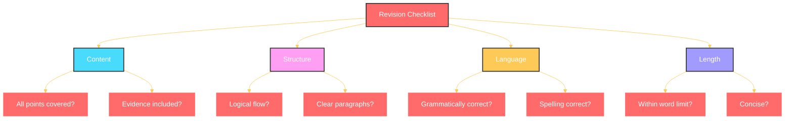

### Sample Essay Topic

**Topic:**
> "Should there be unlimited freedom? Write an essay in about 200 words presenting your views on the subject."

**Synopsis:**

```
1. Definition of freedom
2. Where does freedom begin/end?
3. Freedom in personal life
4. Freedom in public life
5. Need for regulation
6. Why some restrictions are necessary
7. My conclusion
```

### Comparing Drafts

**First Draft Example:**
> "Freedom is very important. Everyone wants freedom. But too much freedom can be bad. Some restrictions are necessary. The government should control some things. But not everything. People should have privacy at home."

**Revised Draft:**
> "Freedom is a fundamental human right, yet its exercise must be balanced with responsibility. While individuals should have autonomy in their personal lives, certain restrictions in public spaces are necessary for social harmony. The state has a duty to protect citizens without infringing on fundamental rights."

### Checklist for Final Essay

- [ ] Created a synopsis first
- [ ] All key points included
- [ ] Examples provided
- [ ] Both sides considered
- [ ] Personal conclusion stated
- [ ] Grammatically correct
- [ ] Appropriate vocabulary
- [ ] Proper punctuation
- [ ] Within word limit
- [ ] Cohesive and coherent

### Fun Fact

**Swami Vivekananda** said: "Our abilities are hidden within us, all we need is somebody to come and uncover it so that it comes out." This applies to essay writing too - the ability is already there, we just need the right technique to bring it out.

### Key Takeaways

1. **Create a synopsis first** - Plan before you write
2. **Spend 1/3 time planning** - 5 minutes for synopsis
3. **Spend 1/3 time revising** - 5 minutes for revision
4. **Write in 20 minutes** - 10 words per minute
5. **Use personal stories** - Make it memorable
6. **Include evidence** - Statistics and examples
7. **Check cohesion** - Use connectors
8. **Revise multiple times** - No first draft is perfect

> "**A good essay requires good preparation. Before you start writing, you should jog your memory, and you should see how much I know on this subject? How much of what I know is relevant?** "

---

## Quick Reference: Writing Skills Summary

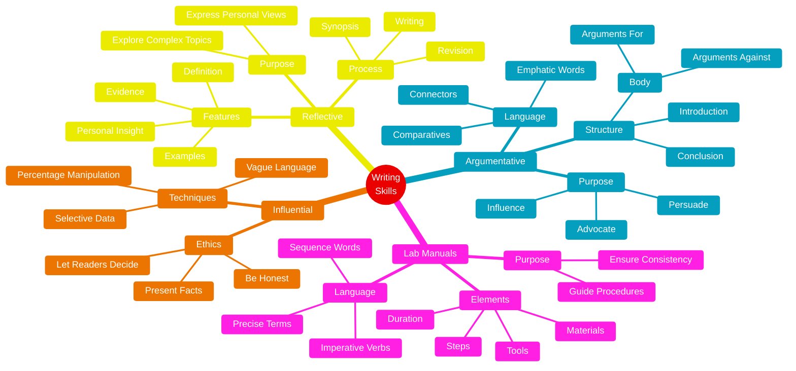

### Final Thoughts

> "**Writing is a skill and skills are best learned by doing again and again and several times over again; until you reach perfection.** "

> "**The best way to learn to write a good essay is to follow certain steps: Synopsis should include a definition, instances, illustration, statistical evidence, the different sides of the story. Then write, revise, usually spend one-third of the time planning the essay and revising the essay and in two-thirds writing the essay.** "