# 📘 Comprehensive Guide to Modal Verbs & Communicative Softening

> **From YouTube Lecture Series:** L24–L30  
> **Topics Covered:** Mood & Modality | Can/Could | Will/Would | Could vs Would | Must/Shall/Should | May/Might | Learning Softening

---

## 📋 Table of Contents

1. [Foundations: What is Modality?](#1-foundations-what-is-modality)
2. [The Golden Rules of Modal Auxiliaries](#2-the-golden-rules-of-modal-auxiliaries)
3. [Can vs. Could](#3-can-vs-could)
4. [Will vs. Would](#4-will-vs-would)
5. [Could vs. Would: The Crossroads](#5-could-vs-would-the-crossroads)
6. [Must, Shall & Should](#6-must-shall--should)
7. [May vs. Might](#7-may-vs-might)
8. [Learning Softening: Knowing vs. Using](#8-learning-softening-knowing-vs-using)
9. [Master Formula & Cheat Sheet](#9-master-formula--cheat-sheet)

---

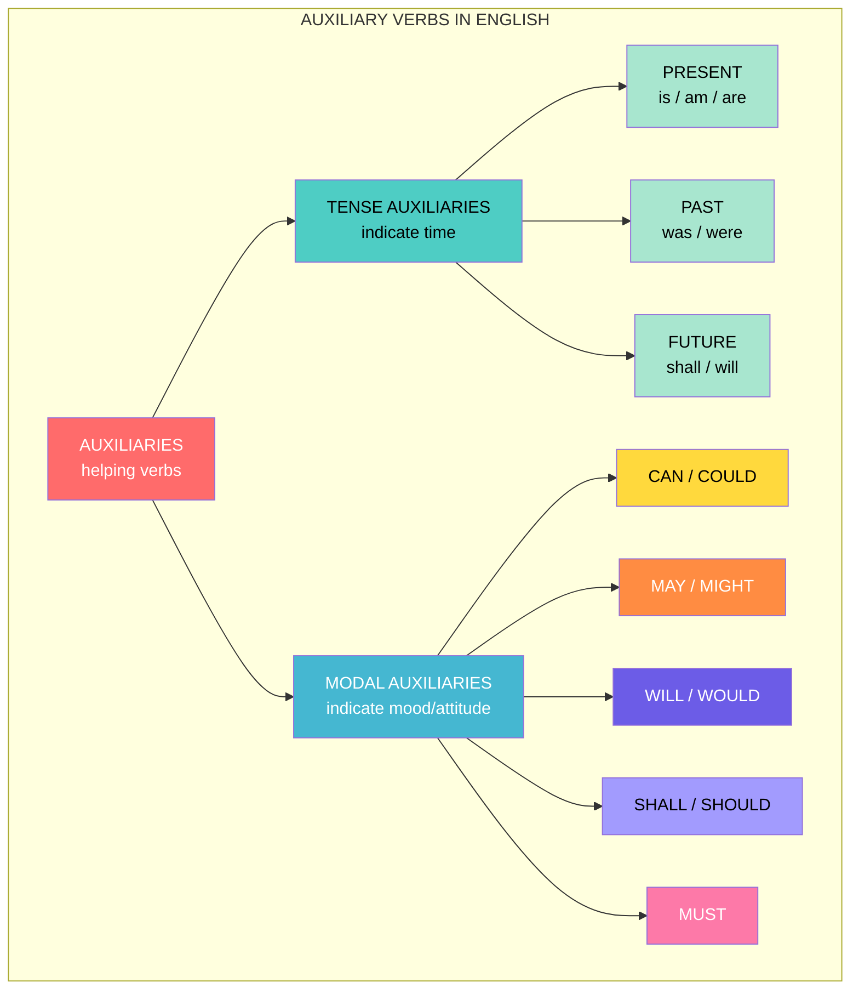

## 1. Foundations: What is Modality?

### What?
**Modality** is the grammatical representation of **mood**. It comes from the Latin word *modus* (mood). While tense auxiliaries (is, am, are, was, were) tell us *when* something happens, modal auxiliaries tell us *how* the speaker feels about it—possibility, necessity, obligation, permission, willingness, ability, or certainty.

### Why?
Without modality, every sentence would be a cold, hard fact. Modals allow us to:
- Seek permission (`Can I tell you something?`)
- Express obligation (`We should drive slow.`)
- Show possibility (`It might rain.`)
- Soften commands (`Could you please pass the salt?`)

### How?
Modals are **auxiliaries**, not main verbs. They always appear with a main verb (bare infinitive).

```
Structure: Subject + Modal + Base Verb (without 'to')
Example:   She + can + play + the piano.
```

### When?
Use modals whenever you need to express something **non-factual**—hypothetical, uncertain, obligatory, or permissible.

### 🎨 Concept Map: Modality vs. Tense

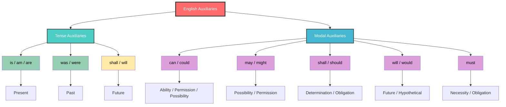

---

## 2. The Golden Rules of Modal Auxiliaries

### 🔑 Rule 1: Modals are NOT Verbs
They are a special class of **auxiliaries**. They cannot function as standalone main verbs in standard usage.

### 🔑 Rule 2: Modals are Tenseless
Unlike main verbs, modals do **not** carry tense information.
- ❌ *He cans swim.*
- ✅ *He can swim.*

### 🔑 Rule 3: Modals are Non-Inflectional
You **cannot** add:
- `-s` for third person singular
- `-ing` for continuous form
- `-ed` for past tense

### 🔑 Rule 4: Independent Pairs
**Critical Insight:** `could`, `might`, `should`, and `would` are **NOT** past tense forms of `can`, `may`, `shall`, and `will`. They are independent auxiliaries with their own meanings.

> **Proof:** Can a future tense marker (`will`) have a past form? No. Therefore, `would` is not the "past" of `will` in the grammatical sense.

### 🔑 Rule 5: Negation Structure
When negated, modals do not force tense separation from the main verb (unlike tense auxiliaries).

```
Tense Auxiliary:   He does not like pizza.  (tense separated into 'does')
Modal Auxiliary:   He cannot swim.          (no tense separation needed)
```

### 🎨 The Modal Anatomy Diagram

```mermaid
flowchart LR
    subgraph Sentence["Modal Sentence Structure"]
        direction LR
        S[Subject] --> M[Modal Auxiliary]
        M --> V[Base Verb]
        V --> O[Object/Complement]
    end

    subgraph Properties["Key Properties"]
        direction TB
        P1["✓ No -s, -ing, -ed"]
        P2["✓ No 'to' before verb"]
        P3["✓ Tenseless"]
        P4["✓ Independent meaning"]
    end

    Sentence --> Properties

    style S fill:#FF6B6B,color:#fff
    style M fill:#FFD93D,color:#000
    style V fill:#6BCB77,color:#fff
    style O fill:#4D96FF,color:#fff
    style P1 fill:#E0E0E0,color:#000
    style P2 fill:#E0E0E0,color:#000
    style P3 fill:#E0E0E0,color:#000
    style P4 fill:#E0E0E0,color:#000
```

---

## 3. Can vs. Could

### What?
Both express **ability**, **possibility**, **permission**, and **requests**—but with different degrees of formality, politeness, and temporal reference.

### The Core Distinction

| Feature | **Can** | **Could** |
|---------|---------|-----------|
| **Time** | Present | Past (ability) / Present/Future (possibility) |
| **Formality** | Informal | Formal |
| **Strength** | Strong / Direct | Weak / Polite |
| **Possibility Type** | General possibilities | Specific possibilities |

### How & When?

#### 1. Ability
- **Can** (Present): `I can play tennis.` → I have the ability now.
- **Could** (Past): `I could play tennis when I was in school.` → I had the ability then, but likely not now.

#### 2. Possibility
- **Can** = General truths: `Living in New York can cost a fortune.`
- **Could** = Specific guesses: `The bus could be late.` / `If you don't study, you could fail.`

#### 3. Requests
- **Can** = Informal: `Can you pass me the salt?` (friend, family)
- **Could** = Polite/Formal: `Could you pass me the salt, please?` (strangers, authority)

#### 4. Suggestions
- Always use **Could**: `We could try Thai food.` ❌ *We can try Thai food* (less natural as a soft suggestion).

### 🧪 Formula

```
Ability (Present)  = can + base verb
Ability (Past)     = could + base verb
General Possibility = can + base verb
Specific Possibility = could + base verb
Polite Request     = could + subject + base verb
Suggestion         = could + base verb
```

### 🎨 Decision Flowchart: Can or Could?

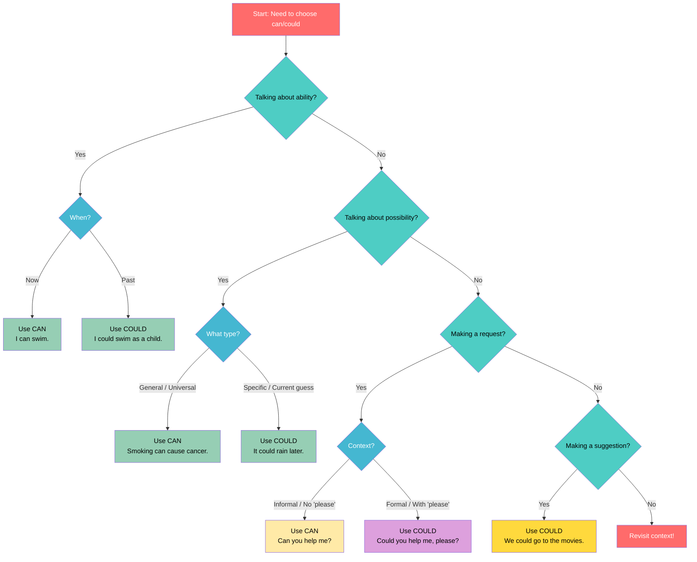

### 💡 Fun Fact
In many grammar tests, if the sentence contains the word **"please"**, the answer is almost always **could** because it signals a formal context!

---

## 4. Will vs. Would

### What?
- **Will** = Real situations, facts, future certainty, willingness, commands.
- **Would** = Imagined situations, past habits, politeness, hypotheticals.

### How & When?

#### Uses of WILL
1. **Future facts:** `I will head home after work.`
2. **Predictions:** `Don't lend him your car. He will crash it.`
3. **Willingness:** `I will eat anything. I'm not picky.`
4. **General rules:** `Smokers will be asked to smoke outside.`
5. **Commands/Orders:** `You will tidy up your room!`

#### Uses of WOULD
1. **Past habits** (with action verbs only!): `When we lived in the mountains, we would go hiking.`
2. **Imagined future/past:** `If I had a magic wand, I would change history.`
3. **Polite requests/offers:** `Would you like a cup of coffee?`
4. **Reported speech:** `She told me she would be here at 8.`
5. **Preferences:** `I would love to visit Spain.`
6. **Uncertain opinions:** `I would say he's about 40.`
7. **Refusal (past):** `My bike would not start today.`
8. **With "wish":** `I wish she would be quiet.`
9. **Results/Intentions:** `He burned the letters so that his mother would never read them.`

### ⚠️ Critical Warning: State Verbs
With **state verbs** (live, know, believe, love, hate), use **used to**, not **would**.

- ❌ *When I was young, I would live in an old house.*
- ✅ *When I was young, I used to live in an old house.*

### 🧪 Conditional Formulas

```
Zero Conditional (Facts):
If + Present Simple, Present Simple
→ If you add 1 and 1, you get 2.

First Conditional (Real Future):
If + Present Simple, will + infinitive
→ If it rains tomorrow, I will stay home.

Second Conditional (Unreal Present/Future):
If + Past Simple, would + infinitive
→ If I had a magic wand, I would change history.

Third Conditional (Unreal Past):
If + Past Perfect, would + have + past participle
→ If I had studied harder, I would have passed.
```

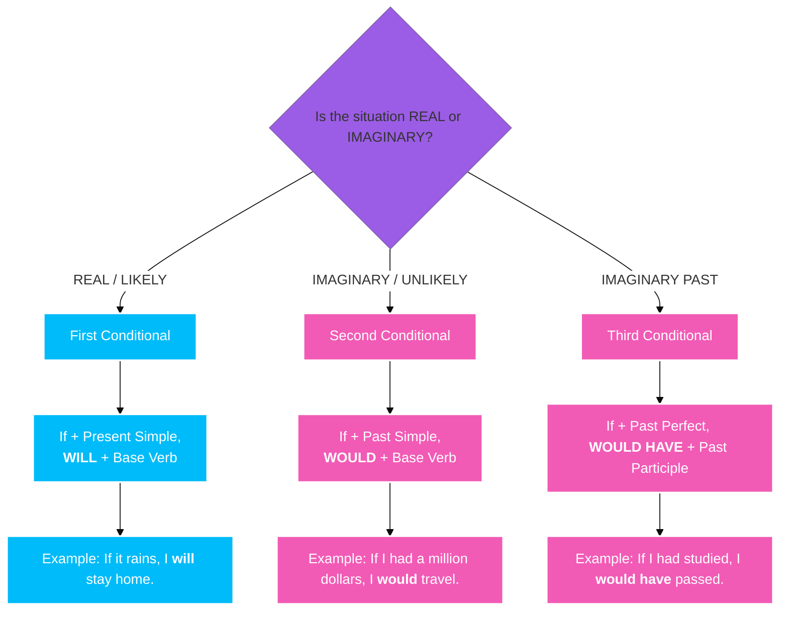

### 🎨 Will vs. Would: The Reality Spectrum

```mermaid
graph LR
    subgraph Real["REAL / CERTAIN"]
        direction TB
        R1["Will: Future facts"]
        R2["Will: Predictions"]
        R3["Will: Commands"]
        R4["Will: Willingness"]
    end

    subgraph Imagined["IMAGINED / UNCERTAIN"]
        direction TB
        I1["Would: Hypotheticals"]
        I2["Would: Past habits"]
        I3["Would: Polite requests"]
        I4["Would: Uncertain opinions"]
    end

    Real -->|"Shift to politeness / hypothetical"| Imagined

    style Real fill:#4ECDC4,stroke:#333,stroke-width:2px,color:#000
    style Imagined fill:#DDA0DD,stroke:#333,stroke-width:2px,color:#000
    style R1 fill:#96CEB4,color:#000
    style R2 fill:#96CEB4,color:#000
    style R3 fill:#96CEB4,color:#000
    style R4 fill:#96CEB4,color:#000
    style I1 fill:#FFEAA7,color:#000
    style I2 fill:#FFEAA7,color:#000
    style I3 fill:#FFEAA7,color:#000
    style I4 fill:#FFEAA7,color:#000
```

### 💡 Fun Fact
The word **"would"** appears in some of the most polite fixed expressions in English: **"Would you mind...?"**, **"Would you like...?"**, and **"I would rather..."**.

---

## 5. Could vs. Would: The Crossroads

### What?
Both can refer to the past and both can be polite—but they diverge sharply when dealing with **possibility** vs. **imagination**.

### The Golden Rule
- **Possible situations** → Use **Could**
- **Imaginary situations** → Prefer **Would**

### Detailed Comparison

| Context | Could | Would |
|---------|-------|-------|
| **Past Ability** | ✅ I could run 5 km. | ❌ |
| **Past Belief** | ❌ | ✅ I knew he would pass. |
| **Specific Possibility** | ✅ The exam could be tough. | ❌ |
| **Imaginary/Hypothetical** | ⚠️ Possible but weak | ✅ If I were rich, I would retire. |
| **Suggestions** | ✅ We could try Thai food. | ❌ We would try Thai food. |
| **Offers** | ❌ Could you like coffee? | ✅ Would you like coffee? |
| **Requests** | ✅ Could you open the door? | ✅ Would you open the door? |
| **Permission** | ✅ Could I borrow your pen? | ⚠️ Would it be okay if I borrowed...? |
| **Fixed Phrase** | ❌ Could you mind...? | ✅ Would you mind...? |

### 🎨 Could vs. Would: Usage Venn Diagram

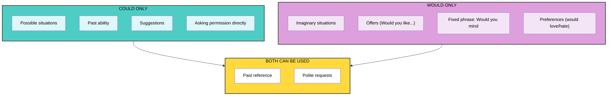

### 💡 Fun Fact
**"Would you mind"** is a fixed phrase. You cannot replace "would" with "could" and say *"Could you mind opening the window?"* — this is grammatically broken!

---

## 6. Must, Shall & Should

### What?
These three modals operate in the domain of **necessity** and **obligation**, but with varying degrees of force and social orientation.

### Must
**Core meaning:** Necessity & strong obligation.

#### Types of Obligation with Must:
1. **Self-imposed (Weak):** `I must clean my room.` → Talking to oneself; a reminder.
2. **Non-personal (Strong):** `Submissions must follow the guidelines.` → Rules, regulations.
3. **Social (Vague):** `We must visit Ramesh's uncle.` → Social expectation, contingent on other plans.

**Negative:** `must not` = Prohibition / Strong obligation without option.
- `You must not use phones at a fuel station.`

### Shall
**Dual identity:** Can be a tense auxiliary (future, interchangeable with *will*) OR a modal auxiliary.

**As a Modal:**
- **Determination:** `I shall talk to you about the proposal tomorrow.`
- **Strong obligation (Legal):** `The petitioners shall present the affidavit.`
- **Intention/Willingness:** `We shall have finished the work by noon.`

> **Note:** In contemporary English, with first person (*I/we*), *shall* carries a modal (determined) flavor rather than a simple future meaning.

### Should
**Core meaning:** Requirement / Weak obligation / Advice.

#### Uses:
1. **Advice/Suggestion:** `You should prepare well for the test.`
2. **Probability:** `Your order should be delivered in 6–7 days.`
3. **Socially rooted weak obligation:** `You should inform me before you leave.`
4. **Strong denial (with Why):** `Why should I watch the movie?` → Implies "I definitely won't."

### 🎨 The Obligation Strength Spectrum

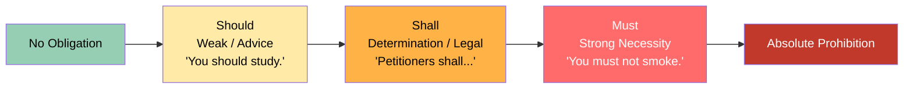

### 🧪 Formula: Negation Impact

```
must not  = prohibition / strong negative obligation (You must not go.)
need not  = lack of necessity (You need not go. = You don't have to go.)
```

### 💡 Fun Fact
In legal and contractual English, **"shall"** is one of the most powerful words—it creates mandatory duties that can be enforced by law!

---

## 7. May vs. Might

### What?
Both express **possibility** and **permission**, but they differ in the **remoteness** of possibility and the **formality** of permission.

### The Critical Distinction
**Might is NOT the past tense of May.** They are independent auxiliaries.

| Feature | **May** | **Might** |
|---------|---------|-----------|
| **Possibility** | Recent / Equal chance (50/50) | Remote / Weak possibility |
| **Permission** | Formal (`May I go?`) | Less common for permission |
| **Concession** | Yes (`He may be young, but he's wise.`) | Yes (even more tentative) |
| **Politeness** | Formal | Tentative / Very polite |

### How & When?

#### Possibility
- **May:** Equal possibility. `The delivery may be delayed.` → 50% chance it will, 50% it won't.
- **Might:** Remote possibility. `The Vice Chancellor might come tomorrow.` → Very low chance; leaning toward impossibility.

#### Permission
- **May** = Formal: `May I take a tea break?` (to a boss, teacher)
- **Can** = Informal: `Can I take a tea break?` (to a friend)

> **Pragmatic Insight:** When a company says "The delivery may be delayed," they often *know* it will be delayed but use "may" to be polite!

#### Concession
`He may be a child, but he is very wise.` → Acknowledging a possibility while emphasizing a contrasting fact.

### 🎨 Possibility Remoteness Diagram

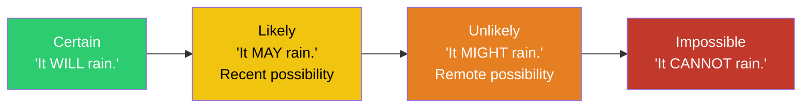

### 🎨 May vs. Can: The Formality Scale

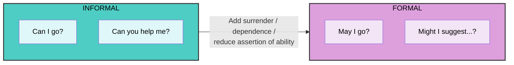

### 💡 Fun Fact
In extremely formal or old-fashioned English, you might hear **"Might I suggest...?"** — this is even more tentative and polite than "May I suggest...?"

---

## 8. Learning Softening: Knowing vs. Using

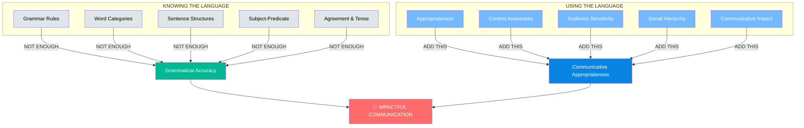

### What?
**Softening** is the art of making your communication less abrupt, less direct, and more socially aware. It is the bridge between **grammatical accuracy** and **communicative impact**.

### The Master Formula

```
Impactful Communication = Grammatical Accuracy + Social Appropriateness

Confidence = Knowing WHAT to say + Knowing HOW to say it
```

### Why?
- A grammatically perfect sentence can still be socially inappropriate.
- Directness can sound like a command or an insult.
- Softening buys you sympathy, flexibility, and influence.

### How? Techniques for Softening

#### 1. Modal Softening
Replace imperatives with modal questions:
- ❌ `Meet me at 9 AM.`
- ✅ `Could we meet at 9 AM?`
- ✅ `I was wondering if we could meet at 9 AM.`

#### 2. The "Please" Factor
Even in informal contexts, "please" adds a layer of respect without making things stiff.

#### 3. Indirect Negation (Saying No Without Saying No)
- ❌ `No, I cannot go for tea.`
- ✅ `I have a lot of stuff pending to take care of.`
- ✅ `I'll try my best.` (implies probable failure politely)

#### 4. Opinion Softening
- ❌ `You should not invest in mutual funds.`
- ✅ `I don't think mutual funds are doing good these days.`
- ✅ `If I were you, I would think several times about it.`

#### 5. Feedback Softening
- ❌ `You have made a mistake.`
- ✅ `You seem to have missed a few things. May I suggest a revisit?`
- ✅ `It appears to me that the calculations do not add up. Could you please take a look?`

### When?
Use softening when:
- Giving negative feedback
- Refusing an invitation
- Making suggestions to superiors
- Discussing sensitive issues
- Requesting favors in formal settings

### 🎨 The Softening Ladder

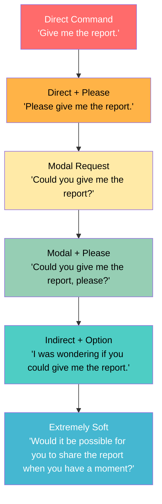

### 🎨 Communicative Competence Model

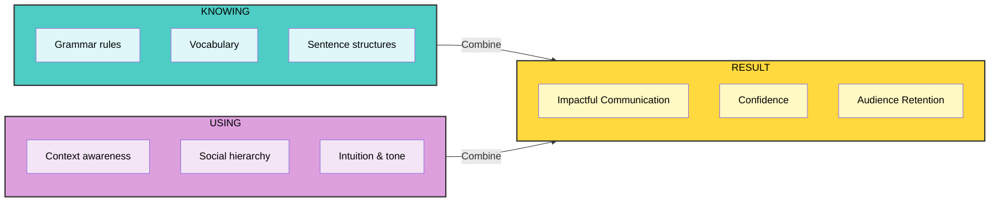

### 💡 Fun Fact
Even in the **most informal** contexts, bringing in **a little formality** makes you sound more natural and effortless—but achieving that "effortless" look actually requires a lot of conscious practice!

---

## 9. Master Formula & Cheat Sheet

### 📐 Universal Modal Formula

```
Subject + Modal + Base Verb (+ Object/Complement)

Constraints:
  ✗ No 'to' before the main verb
  ✗ No -s in 3rd person singular
  ✗ No -ing form
  ✗ No -ed past form
  ✗ Two modals cannot appear together in standard English
```

### 📊 Quick Reference Matrix

| Modal | Primary Meaning | Example |
|-------|----------------|---------|
| **Can** | Present ability / Informal permission | `I can swim.` / `Can I go?` |
| **Could** | Past ability / Polite request / Possibility | `I could run faster then.` / `Could you help?` |
| **Will** | Future / Prediction / Command | `It will rain.` / `You will do it!` |
| **Would** | Hypothetical / Past habit / Polite offer | `I would travel if I had money.` / `Would you like tea?` |
| **May** | Formal permission / Equal possibility | `May I enter?` / `It may be true.` |
| **Might** | Remote possibility / Tentative | `It might snow.` (unlikely) |
| **Must** | Strong necessity / Obligation | `You must finish this.` |
| **Shall** | Determination / Legal obligation | `I shall return.` / `Rent shall be paid.` |
| **Should** | Advice / Weak obligation / Probability | `You should rest.` / `It should work.` |

### 🎨 The Complete Modal Universe

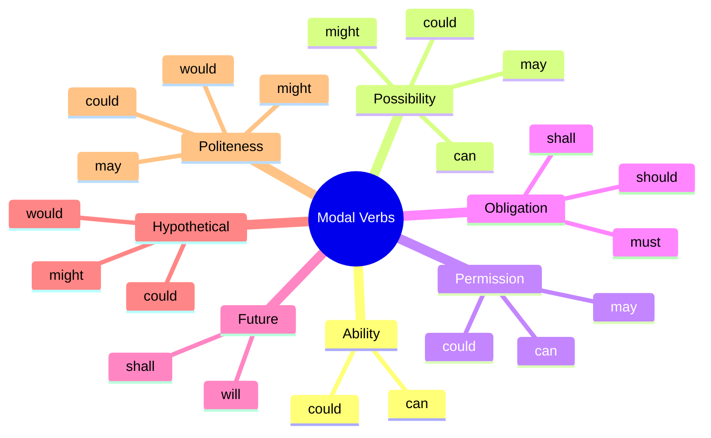
## ✍️ Practice Exercises & Answer Key

### Exercise Set 1: Fill in the Blanks

1. "Mom, the phone is ringing!" "______ you answer it?" (can/could)
2. "It ______ be grandpa calling." (can/could — expressing specific possibility)
3. I ______ run three kilometers without a break when I was a kid. (can/could)
4. Many swimmers ______ hold their breath for more than 3 minutes. (can/could — general possibility)
5. ______ I get you something to eat? (can/could — informal offer)
6. ______ you send me the details by email, please? (can/could — formal request)

<details>
<summary><b>Click for Answers</b></summary>

1. **Can** — Informal request between mother and daughter
2. **Could** — Specific possibility (not general)
3. **Could** — Past ability ("when I was a kid")
4. **Can** — General possibility (true in the world)
5. **Can** — Informal setting
6. **Could** — "Please" signals formal context

</details>

### Exercise Set 2: Would vs. Will

1. If I became the Prime Minister, I ______ make healthcare free. (will/would)
2. I knew he ______ pass the exam. (will/would — past belief)
3. The sky was getting cloudy, which meant it ______ rain. (will/would)
4. When we lived in the mountains, we ______ go hiking all the time. (will/would)
5. Don't lend him your car — he ______ crash it! (will/would)

<details>
<summary><b>Click for Answers</b></summary>

1. **Would** — Imaginary situation (second conditional)
2. **Would** — Past belief ("I knew" = past)
3. **Would** — Past expectation
4. **Would** — Past habit
5. **Will** — Prediction about real future

</details>

### Exercise Set 3: Could vs. Would

1. ______ you mind sharing your notes with me? (could/would)
2. ______ you like some coffee? (could/would)
3. We ______ try Thai food for dinner. (could/would — suggestion)
4. ______ I use your laptop to send an email? (could/would — permission)
5. If I had a lot of money, I ______ retire early. (could/would — imaginary)

<details>
<summary><b>Click for Answers</b></summary>

1. **Would** — "Would you mind" is a fixed phrase (NEVER "could you mind")
2. **Would** — Making an offer (ALWAYS "would you like")
3. **Could** — Making a suggestion
4. **Could** — Asking permission (or "Would it be okay if I...")
5. **Would** — Imaginary situation (preferred over "could")

</details>

### Exercise Set 4: Softening Practice

Rewrite these sentences to be softer and more appropriate:

1. "Give me the report by 5 PM."
2. "Your calculations are wrong."
3. "No, I won't come for tea."
4. "You should not invest in that stock."
5. "Meet me tomorrow at 9 AM."

<details>
<summary><b>Click for Sample Softened Versions</b></summary>

1. "Could you please send me the report by 5 PM?" / "I was wondering if you could have the report ready by 5."
2. "It appears some of the calculations may need another look. Could you review them when you have a moment?"
3. "I have quite a lot to take care of right now, but thank you for asking!"
4. "I don't think that stock is performing well these days. If I were you, I'd think carefully before investing."
5. "Could we meet at 9 tomorrow morning?" / "I was wondering if we could meet at 9 AM tomorrow — would that work for you?"

</details>

---

## 🌟 Final Thoughts

> *"Becoming natural requires looking effortless — but it takes a lot of effort to look effortless."*

Mastering modal verbs and softening techniques is a journey, not a destination. Here's your roadmap:

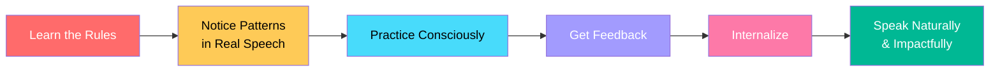

### 📝 Your Practice Checklist

- [ ] Create 5 original sentences for each modal verb
- [ ] Listen for modals in conversations this week — note how they're used
- [ ] Practice softening one direct statement each day
- [ ] Notice when "could" vs. "would" is used in formal settings
- [ ] Try the "I was wondering if..." formula at least once

---

> **Remember**: The goal isn't just to be *grammatical* — it's to be **heard, understood, 

---

## 🏁 Conclusion

Mastering modal verbs is not about memorizing rules—it is about understanding **intention**, **context**, and **social nuance**. 

> **Remember:** Grammar gives you accuracy. Modals and softening give you **impact**.

Practice by:
1. Underlining modals in everything you read.
2. Identifying the speaker's intention (ability? possibility? obligation?).
3. Rewriting direct sentences into softer, more appropriate versions.
4. Observing how native speakers use "would you mind," "could you," and "I was wondering if..."

---

*Compiled from Lectures L24–L30 | Mood, Modality & Communicative Softening*
