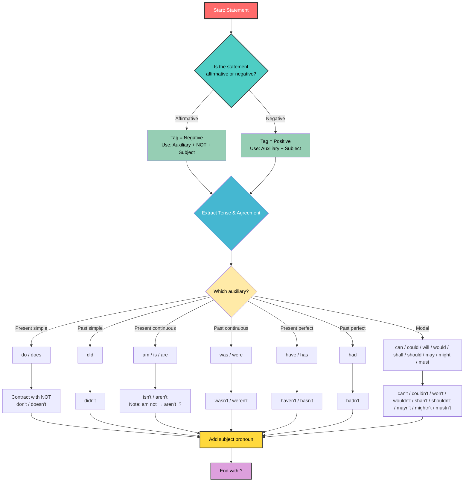
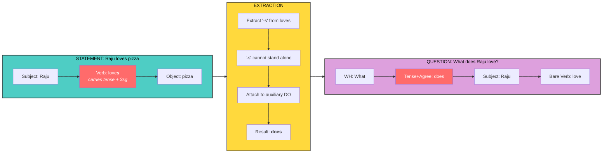
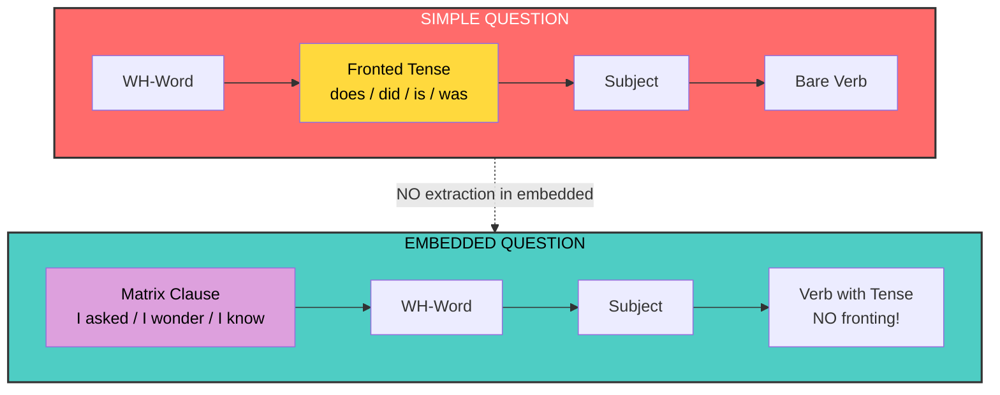
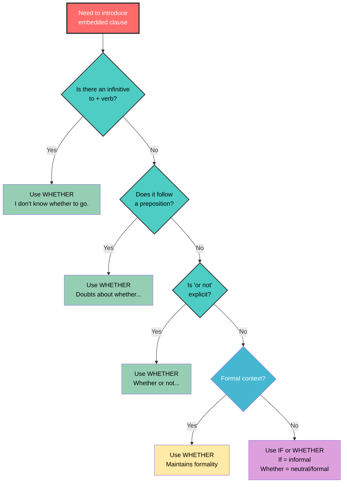
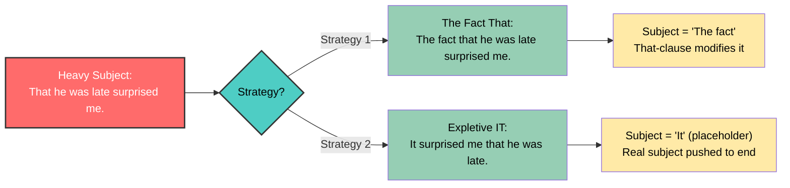
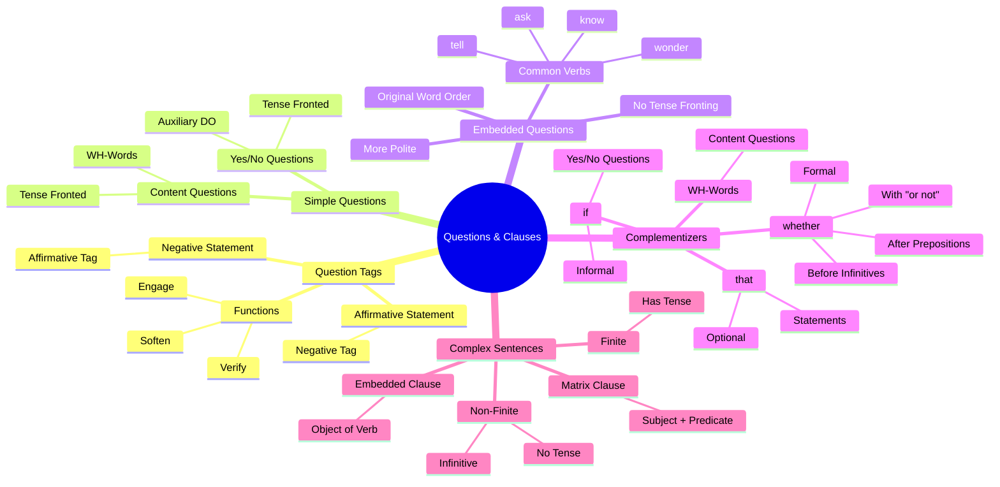

# 📘 Comprehensive Guide to Question Formation & Embedded Clauses

> **From YouTube Lecture Series:** L31–L35  
> **Topics Covered:** Question Tags | Interrogative Sentences | Embedded Questions | Whether vs. If | That-Clauses

---

## 📋 Table of Contents

1. [Question Tags: The Art of Confirmation](#1-question-tags-the-art-of-confirmation)
2. [Interrogative Sentences: How Questions Work](#2-interrogative-sentences-how-questions-work)
3. [Embedded Questions in Complex Sentences](#3-embedded-questions-in-complex-sentences)
4. [Whether vs. If Clauses](#4-whether-vs-if-clauses)
5. [That-Clauses: The Invisible Glue](#5-that-clauses-the-invisible-glue)
6. [Master Cheat Sheet & Formulas](#6-master-cheat-sheet--formulas)

---

## 1. Question Tags: The Art of Confirmation

### What?
A **question tag** is a short question added at the end of a declarative (statement) sentence. It turns a statement into a confirmation-seeking device.

### Why?
- To **verify** or **confirm** information
- To **engage** the listener in conversation
- To make speech sound **natural, impressive, and native-like**
- Without proper tags, speech may be grammatical but **inappropriate** or abrupt

### How? The Golden Formula

```
AFFIRMATIVE STATEMENT → NEGATIVE TAG
NEGATIVE STATEMENT  → AFFIRMATIVE TAG

Structure: [Statement], [Auxiliary + NOT] + [Subject Pronoun]?
```

#### Rules:
1. **Same Tense:** The auxiliary in the tag must match the tense of the main statement.
2. **Same Subject:** The pronoun in the tag refers back to the subject of the statement.
3. **Mandatory Contraction:** In negative tags, the auxiliary and "not" MUST be contracted.

### Examples

| Statement | Tag | Explanation |
|-----------|-----|-------------|
| You speak English, | **don't you?** | Present tense, "do" auxiliary, contracted |
| You don't speak English, | **do you?** | Negative statement → positive tag |
| He is devastated, | **isn't he?** | "is" auxiliary, contracted negative |
| She never misses an opportunity, | **does she?** | "Never" makes it negative → positive tag |
| They had food, | **hadn't they?** | Past perfect auxiliary |
| Raju was going to speak, | **wasn't he?** | Past continuous, "was" auxiliary |

### ⚠️ Common Errors (L1 Transfer)
Many non-native speakers use universal tags from their first language:
- ❌ "You speak English, right?" (colloquial but not standard)
- ❌ "You speak English, isn't it?" (L1 transfer error)
- ✅ "You speak English, don't you?"

### 🎨 Question Tag Formation Flowchart



### 💡 Fun Fact
The only exception to contraction: **"I am"** becomes **"aren't I?"** (not "amn't I"). This is a historical oddity in English!

---

## 2. Interrogative Sentences: How Questions Work

### What?
**Interrogative sentences** (questions) are sentences that seek information. English has two main types:
1. **Content Questions (WH-Questions):** Ask for specific information using WH-words.
2. **Yes/No Questions:** Can be answered with a simple yes or no.

### Why?
Understanding question formation reveals the **invisible machinery** of English grammar—how tense and agreement move within a sentence.

### How? The Mechanics of Question Formation

In English statements, the order is:
```
Subject → Verb → Object (SVO)
```

In questions, **Tense + Agreement** get **FRONTED** (moved to the beginning).

#### Content Questions (WH-Questions)
```
WH-Word + [Tense/Agreement] + Subject + Base Verb + ...?
```

**Example Breakdown:**
- Statement: `Raju loves pizza.`
- The "-s" on "loves" carries both **3rd person singular** (agreement) and **present tense**.
- In a question: `What does Raju love?`
  - The "-s" is extracted from "loves"
  - It cannot stand alone, so it attaches to the auxiliary **do**
  - Result: **does** (do + present + 3rd person singular)
  - "loves" becomes bare form: "love"

#### Yes/No Questions
```
[Tense/Agreement] + Subject + Verb + ...?
```

**Examples:**
- `Is Raju coming to Chennai tomorrow?` (Present continuous — "is" fronted)
- `Was Raju coming to Chennai?` (Past continuous — "was" fronted)
- `Did Raju eat pizza?` (Past simple — "did" = do + past tense)

### Key Insight: The Role of "Do"
When tense/agreement markers are extracted from the main verb, they need a host. **Do** functions as that host:
- **does** = do + present tense + 3rd person singular
- **did** = do + past tense

### Special Subject Types

#### Imperative Sentences (Commands)
- **No overt subject** — the subject "you" is understood but not spoken.
- `Sit down, please.` → Subject is invisible "you."
- This follows the **principle of economy** — when something is obvious, it need not be articulated.

#### Expletive Subjects
When English needs a subject but there is no logical one, it inserts a **meaningless placeholder**:
- **It:** `It is raining.` / `It is warm.` ("It" has no real meaning)
- **There:** `There are many students in the class.` ("There" is semantically vacuous)

### 🎨 Question Formation: The Extraction Process



### 💡 Fun Fact
English is one of the few languages where **question words must be fronted** (placed at the beginning). In many Indian languages, the question word often stays in the position of the information being asked about!

---

## 3. Embedded Questions in Complex Sentences

### What?
An **embedded question** is a question clause that functions as the **object** of a verb within a larger (matrix) sentence. It is also called an **indirect question**.

### Why?
- To make speech **less direct** and more polite
- To express **curiosity** without demanding an answer
- To avoid sounding like an **interrogation**

### How? The Critical Rule

> **In embedded questions, there is NO fronting of tense and agreement.**

The embedded clause keeps its **original word order** (Subject → Verb), even when it contains a WH-word.

#### The Contrast

| Type | Example | Structure |
|------|---------|-----------|
| **Simple Question** | What **did** you eat? | WH + fronted tense (did) + S + V |
| **Embedded Question** | I asked what you **ate**. | WH + S + V (no fronting!) |

#### More Examples

| Simple (Direct) | Embedded (Indirect) |
|-----------------|---------------------|
| What is her name? | I wonder **what her name is**. |
| What did you want? | I know **what you wanted**. |
| Is the doctor available? | Could you tell me **if the doctor is available**? |
| Where does she live? | I don't know **where she lives**. |

### ⚠️ Common Mistake
Many Indian English speakers incorrectly front the tense in embedded clauses:
- ❌ *I asked what **did** you eat.*
- ✅ *I asked what you **ate**.*

### What Makes a Sentence "Complex"?
A sentence becomes **complex** only when another sentence (clause) is embedded as the **object of the verb** in the predicate.

```
Matrix Sentence: I wonder [what her name is].
                 ↑Subject  ↑Verb   ↑Embedded Object Clause
```

> **Important:** A coordinated sentence (using *and*, *but*, *or*) is **NOT** a complex sentence.
> - `Raju likes pizza and Ramu likes sandwich.` → Coordinate sentence (two independent clauses joined by conjunction).

### 🎨 Simple vs. Embedded Question Structure



### 💡 Fun Fact
Embedded questions are one of the most powerful **politeness tools** in English. Saying *"I was wondering if you could help me"* is often more effective than *"Can you help me?"* because it softens the request by embedding it!

---

## 4. Whether vs. If Clauses

### What?
**Whether** and **if** are **complementizers** — functional words that introduce an embedded clause (complement) functioning as the object of certain verbs.

### Why?
They serve three key functions:
1. **Express doubt/uncertainty**
2. **Offer alternatives**
3. **Form indirect questions** (softening direct questions)

### How? Usage Rules

#### Both Are Possible (Informal vs. Formal)
In many contexts, both can introduce a complement clause:
- `I don't know whether she will come.`
- `I don't know if she will come.`

> **Pragmatic difference:** *whether* = formal; *if* = informal

#### Rule 1: Before Infinitives → WHETHER ONLY
When the embedded clause contains a **to-infinitive**, only **whether** is allowed.
- ✅ `I cannot decide **whether to accept** the new job offer.`
- ❌ *I cannot decide if to accept...*

#### Rule 2: After Prepositions → WHETHER ONLY
When the clause follows a preposition (e.g., *about*, *of*), use **whether**.
- ✅ `There are doubts **about whether** the decision was fair.`
- ❌ *There are doubts about if...*

#### Rule 3: With "or not" Explicitly → WHETHER ONLY
When "or not" is explicitly stated or strongly implied immediately after:
- ✅ `The question is **whether or not** we have the right to interfere.`
- ⚠️ `The question is if or not...` (awkward/ungrammatical)

#### Rule 4: With "or" Later in the Sentence → BOTH OK
When alternatives are presented with "or" later in the clause:
- ✅ `It is not clear **whether** the source is reliable or not.`
- ✅ `It is not clear **if** the source is reliable.`

### Verbs That Take Whether/If Complements
Not all verbs can take these complements. Common ones include:
- **know, understand, ask, tell, unsure, decide, wonder, see, check**

### 🎨 Whether vs. If Decision Tree



### 💡 Fun Fact
The word **whether** comes from Old English *hwæðer*, meaning "which of two." This etymology explains why it inherently carries a sense of choosing between alternatives!

---

## 5. That-Clauses: The Invisible Glue

### What?
A **that-clause** is a full sentence introduced by the complementizer **"that"** functioning as the object (complement) of a verb. The word "that" has **no literal meaning** — it is purely a functional element that introduces the embedded sentence.

### Why?
That-clauses allow us to express **propositions, thoughts, beliefs, and reports** as objects of verbs like *know, believe, wish, confirm, think, say*.

### How? Finite vs. Non-Finite Clauses

#### Finite Clauses (Have their own tense)
These can stand alone as independent sentences:
- `I believe **that he is innocent**.`
- `She said **that she can speak three languages**.`
- `John knows **that Peter likes Mary**.`

> **Optional "that":** In finite clauses, "that" can often be dropped:
> - `I wish (that) I had a lot of money.`
> - `John knows (that) Peter likes Mary.`

#### Non-Finite Clauses (No tense of their own)
These cannot stand alone and must be part of a matrix sentence:
- `I want **to go**.` (infinitive — no tense)
- `I want **him to go**.` (infinitive with different subject)

### Complex Sentence Rule
> **A sentence becomes COMPLEX only when the embedded clause is the OBJECT of the verb.**

#### That-Clause as SUBJECT (Does NOT make sentence complex)
When a that-clause functions as the **subject**, it is simply a heavy subject, not a complex sentence in the technical sense:
- `**That Mary would forget John** was rather a shock.`

However, English prefers to avoid heavy subjects at the beginning. Three strategies are used:

1. **The Fact That:** `**The fact that** she did not recognize him was rather a shock.`
2. **The Idea That:** `**The idea that** the leader should know everything is unacceptable.`
3. **Expletive "It":** `**It** surprised me **that he was still in bed**.` (The "it" is a placeholder; the real subject is pushed to the end.)

### Ditransitive Verbs + That-Clauses
Some verbs (tell, inform, advise, assure, convince, remind, promise, teach) take **two objects**:
- **Indirect Object** (person receiving the action)
- **Direct Object** (the that-clause)

**Examples:**
- `He **told** [us] [that it would take a long time].`
- `The principal **convinced** [everyone] [that the course would be good].`
- `She **convinced** [me] [that I was wrong].`

### Word Order: The Heavy Complement Rule
In English, **heavy complements** (long clauses) tend to move to the **end** of the sentence.

- ✅ `He **informed us** that he had an urgent meeting to attend.`
- ✅ `He **informed to us** that he had an urgent meeting to attend.` (OK because heavy object follows)
- ❌ `He informed that he had an urgent meeting to us.` (Indirect object "to us" awkwardly placed after heavy direct object)

### 🎨 The That-Clause Universe

```mermaid
graph TB
    subgraph Matrix["MATRIX SENTENCE"]
        direction TB
        M1["Subject: I / He / John"] --> M2["Verb: know / believe / wish / tell"]
    end

    subgraph ThatClause["THAT-CLAUSE (Object/Complement)"]
        direction TB
        T1["Complementizer: that<br/><i>optional in finite clauses</i>"] --> T2["Subject: he / she / Peter"]
        T2 --> T3["Verb with Tense: is / can / likes / had"]
        T3 --> T4["Object/Complement"]
    end

    subgraph FiniteCheck{"Does the clause<br/>have its own tense?"}
        direction TB
        F1["YES → Finite Clause<br/>'that' can be dropped"] 
        F2["NO → Non-Finite Clause<br/>infinitive: to go"]
    end

    M2 -->|"takes as object"| ThatClause
    ThatClause --> FiniteCheck

    style Matrix fill:#4ECDC4,stroke:#333,stroke-width:2px,color:#000
    style ThatClause fill:#DDA0DD,stroke:#333,stroke-width:2px,color:#000
    style FiniteCheck fill:#FFD93D,stroke:#333,stroke-width:2px,color:#000
    style M2 fill:#FF6B6B,color:#fff
    style T1 fill:#96CEB4,color:#000
```

### 🎨 Subject Position Strategies: Avoiding Heavy Subjects



### Recursion: Embedding Within Embedding
Human language has a unique property called **recursion** — embedding clauses within clauses indefinitely:

```
Matrix: I would like [to know [what he did best]]
        ↑Matrix    ↑Embedded 1   ↑Embedded 2 (inside Embedded 1)
```

### 💡 Fun Fact
The complementizer **"that"** is used so frequently in English that it is often **inaudible** in fast speech — native speakers drop it unconsciously! But structurally, it is still there in their minds.

---

## 6. Master Cheat Sheet & Formulas

### 📐 Universal Formulas

#### Question Tags
```
Positive Statement + , + [Auxiliary + n't] + Subject Pronoun?
Negative Statement + , + [Auxiliary] + Subject Pronoun?

Mandatory: Contraction in negative tags
```

#### Simple Questions
```
WH-Questions:    WH-Word + [Tense/Agreement] + Subject + Base Verb + ...?
Yes/No Questions: [Tense/Agreement] + Subject + Verb + ...?

Note: Tense/Agreement extracted from main verb and fronted.
       If no auxiliary exists, DO hosts the tense: does / did.
```

#### Embedded Questions
```
Matrix Verb + WH-Word/If/Whether + Subject + Verb (with tense) + ...

Critical: NO tense fronting. NO auxiliary "do" appears.
```

#### Complex Sentence Identification
```
A sentence is COMPLEX iff:
  → It has an embedded clause as the OBJECT of the matrix verb.

A sentence is NOT complex if:
  → It has coordinated clauses (and / but / or)
  → It has a that-clause only as SUBJECT
```

### 📊 Quick Reference: Embedded Clause Types

| Complementizer | Used For | Example | Restrictions |
|----------------|----------|---------|--------------|
| **that** | Statements, facts | `I know that he is here.` | Optional in finite clauses |
| **if** | Indirect yes/no questions | `I don't know if she is coming.` | Informal; not before infinitives |
| **whether** | Indirect questions, alternatives | `I don't know whether she is coming.` | Formal; required before infinitives and prepositions |
| **WH-words** | Content questions | `I wonder what she wants.` | No tense fronting in embedded form |

### 📊 Subject Types in English

| Type | Example | Description |
|------|---------|-------------|
| **Overt Noun** | `Raju likes pizza.` | Normal subject |
| **Imperative (Invisible)** | `Sit down.` | Understood "you"; not articulated |
| **Expletive "It"** | `It is raining.` | Semantically empty; fills subject slot |
| **Expletive "There"** | `There are students.` | Semantically empty; introduces existence |
| **Sentential Subject** | `That he came was a shock.` | Whole clause as subject (heavy) |

### 🎨 The Complete Question & Clause Ecosystem



---

## 🏁 Conclusion

Mastering questions and embedded clauses requires understanding the **movement** of invisible grammatical elements — tense and agreement. 

> **Key Takeaways:**
> 1. **Question tags** follow a strict polarity rule: positive statement → negative tag (contracted!), and vice versa.
> 2. **Simple questions** front tense/agreement; the main verb reverts to its base form.
> 3. **Embedded questions** do NOT front tense — this is the #1 mistake to avoid.
> 4. **Whether** beats **if** before infinitives, prepositions, and explicit "or not."
> 5. **That-clauses** make sentences complex only as objects; as subjects, they are just heavy subjects.
> 6. English **hates heavy subjects** — it uses "it," "the fact that," or "the idea that" to push them to the end.

Practice by:
1. Converting statements into tagged questions.
2. Transforming direct questions into embedded (indirect) questions.
3. Identifying whether a sentence is simple, complex, or coordinate.
4. Choosing between *if* and *whether* in different contexts.
5. Rewriting heavy subject sentences using expletive "it."

---

*Compiled from Lectures L31–L35 | Question Tags, Interrogatives, Embedded Clauses & Complementizers*
