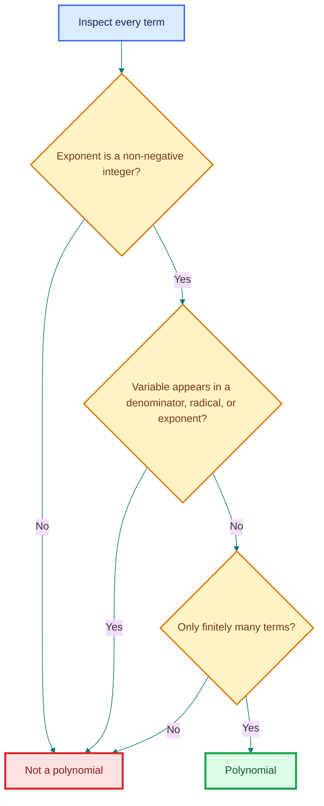
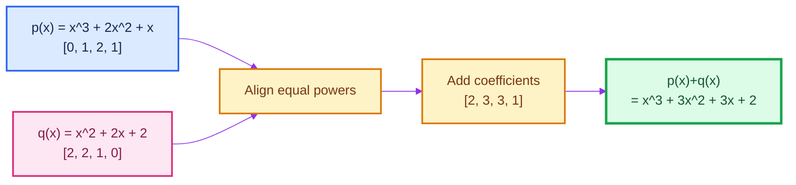
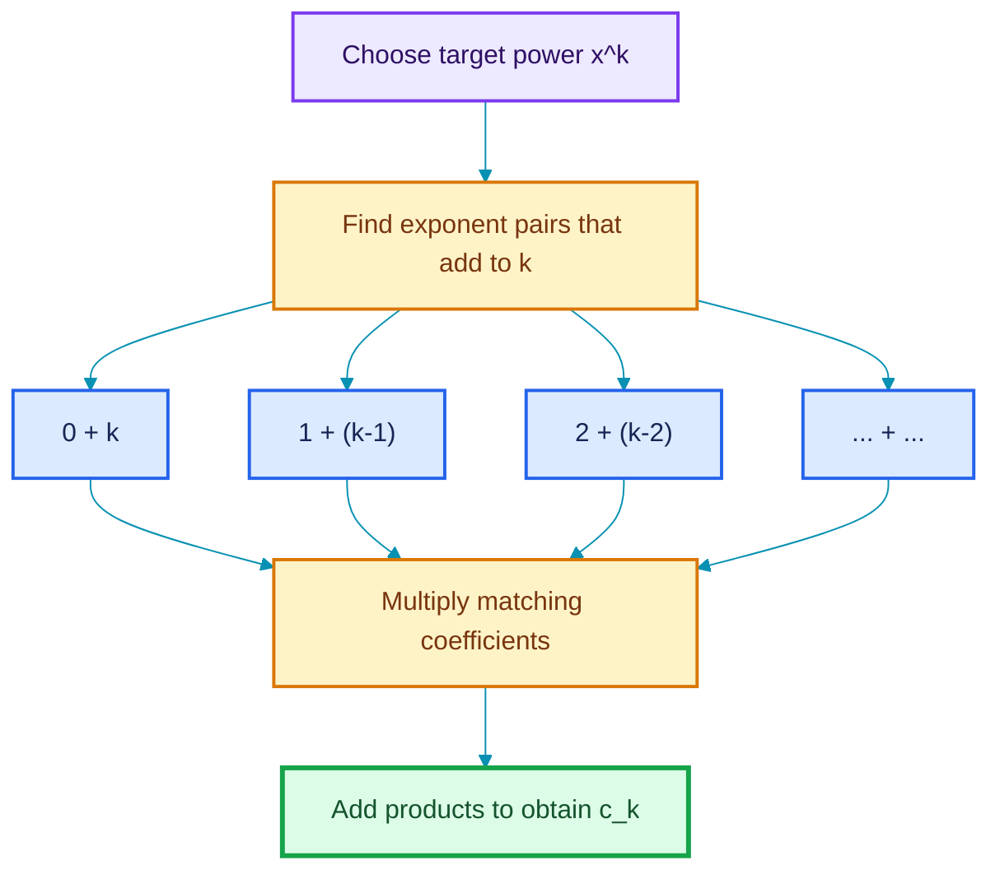
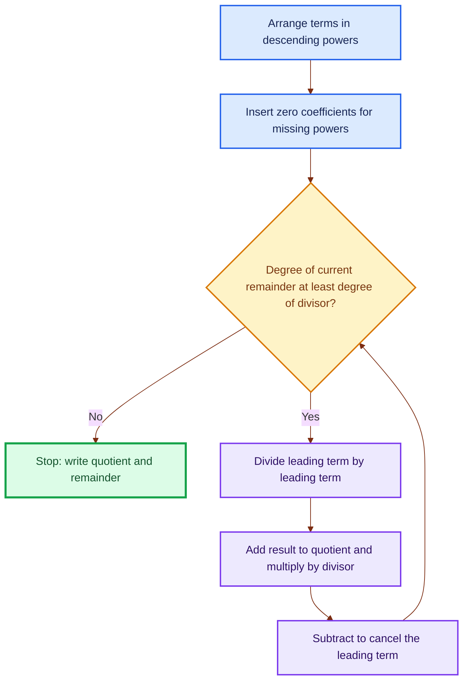
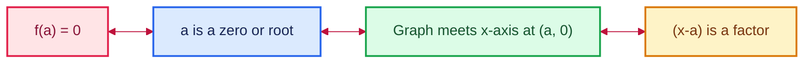
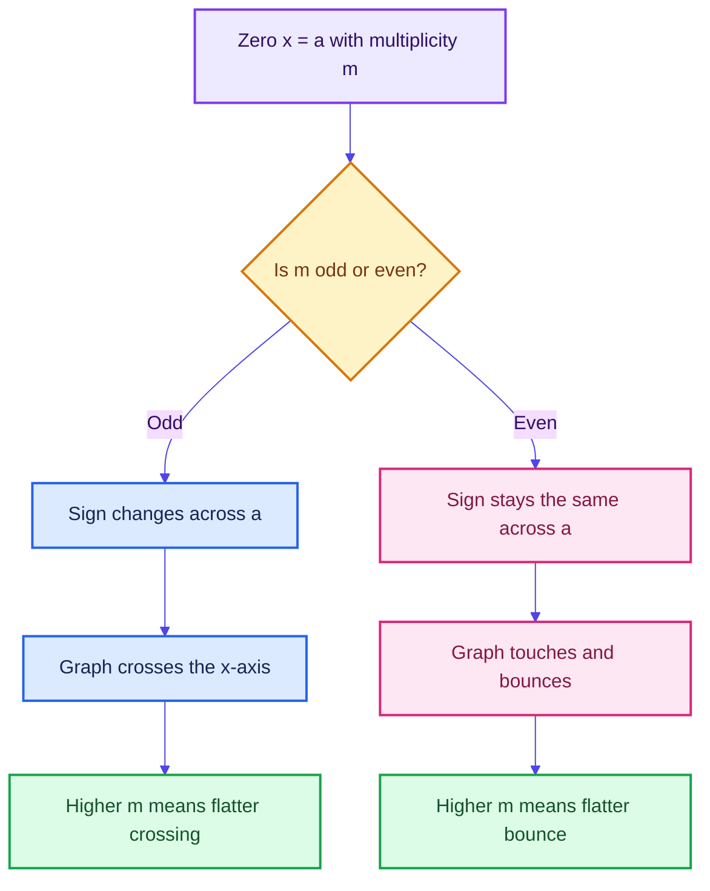
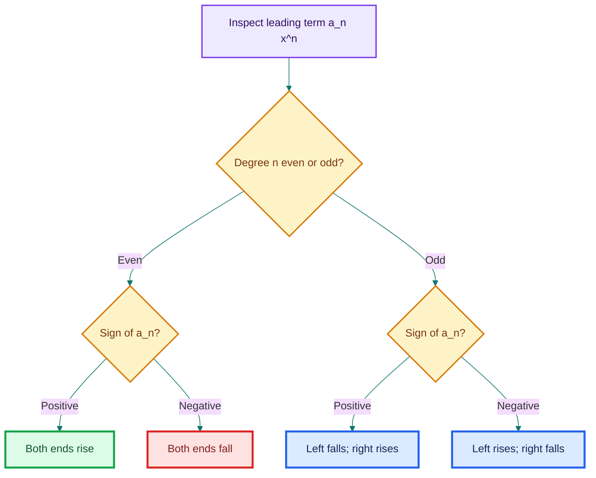
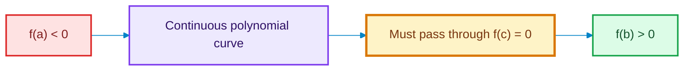
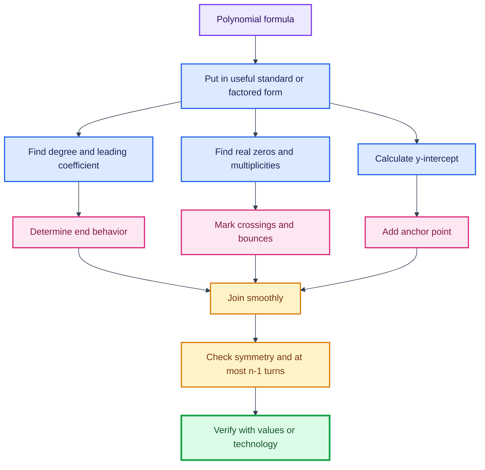

# Polynomials: 

> A concept-first guide developed from the supplied Lecture 4 YouTube transcripts and lecture slides. The notes explain **what** each idea means, **why** it matters, **how** it works, **when** to use it, and the intuition behind it.

---

## Table of contents

1. [The big picture](#1-the-big-picture)
2. [Lecture 4.1 - What is a polynomial?](#2-lecture-41---what-is-a-polynomial)
3. [Lecture 4.2 - Degree of a polynomial](#3-lecture-42---degree-of-a-polynomial)
4. [Lecture 4.3 - Addition and subtraction](#4-lecture-43---addition-and-subtraction)
5. [Lecture 4.4 - Multiplication](#5-lecture-44---multiplication)
6. [Lectures 4.5 and 4.6 - Division and the division algorithm](#6-lectures-45-and-46---division-and-the-division-algorithm)
7. [Lecture 4.7 - Recognizing polynomial graphs](#7-lecture-47---recognizing-polynomial-graphs)
8. [Lecture 4.8 - Zeros, roots, factors, and intercepts](#8-lecture-48---zeros-roots-factors-and-intercepts)
9. [Lectures 4.9 and 4.10 - Multiplicity and behavior at zeros](#9-lectures-49-and-410---multiplicity-and-behavior-at-zeros)
10. [Lecture 4.11 - End behavior](#10-lecture-411---end-behavior)
11. [Lecture 4.12 - Graphing and constructing polynomials](#11-lecture-412---graphing-and-constructing-polynomials)
12. [Intermediate Value Theorem](#12-intermediate-value-theorem)
13. [A unified problem-solving workflow](#13-a-unified-problem-solving-workflow)
14. [Connections to data science and computing](#14-connections-to-data-science-and-computing)
15. [Common mistakes and precision notes](#15-common-mistakes-and-precision-notes)
16. [Master cheat sheet](#16-master-cheat-sheet)
17. [Practice problems with answers](#17-practice-problems-with-answers)

---

## 1. The big picture

A polynomial can be studied from three complementary viewpoints:

- **Expression:** a finite sum of allowed algebraic terms.
- **Function:** a rule that maps an input $x$ to an output $p(x)$.
- **Graph:** a smooth, continuous curve whose shape is controlled by degree, zeros, multiplicities, and the leading term.

The lectures gradually connect these viewpoints.

### The four pieces of graph DNA

For a polynomial written in factored form

\[
f(x)=a(x-r_1)^{m_1}(x-r_2)^{m_2}\cdots(x-r_k)^{m_k},
\]

the graph is largely controlled by:

| Feature | What it tells us |
|---|---|
| $r_i$ | Location of an $x$-intercept |
| $m_i$ | Whether the graph crosses or bounces, and how flat it is |
| Degree $n$ | Maximum number of zeros and turning points; broad shape |
| Leading coefficient $a$ | Vertical scale/reflection and, with degree parity, end behavior |

This is the central idea of the graphing half of the course.

---

## 2. Lecture 4.1 - What is a polynomial?

### 2.1 What is it?

A **polynomial** in one real variable $x$ is an expression of the form

\[
p(x)=a_nx^n+a_{n-1}x^{n-1}+\cdots+a_2x^2+a_1x+a_0,
\]

where:

- $n$ is a non-negative integer;
- every exponent of $x$ is a non-negative integer $0,1,2,\ldots$;
- $a_0,a_1,\ldots,a_n$ are constants called **coefficients**;
- only finitely many terms occur;
- if the polynomial has degree $n$, then $a_n\ne0$.

Equivalent summation notation is

\[
p(x)=\sum_{k=0}^{n}a_kx^k.
\]

The transcript works mainly with **real coefficients**, meaning $a_k\in\mathbb R$.

### 2.2 Why is the definition restrictive?

The restriction to non-negative integer exponents gives polynomials their unusually nice behavior:

- they are defined for every real input;
- they are continuous everywhere;
- they have no corners, holes, or vertical asymptotes;
- they can be added, subtracted, and multiplied without leaving the polynomial family;
- their derivatives and antiderivatives are easy to compute;
- their local and long-run behavior can be read from algebraic features.

If negative, fractional, or variable exponents were allowed, these guarantees could disappear.

### 2.3 The polynomial test

For each term, ask:

1. Is the variable raised to a whole-number power $0,1,2,\ldots$?
2. Is the coefficient independent of the variable?
3. Are there only finitely many terms?

### 2.4 Examples and non-examples

| Expression | Polynomial? | Reason |
|---|---:|---|
| $3$ | Yes | $3=3x^0$ |
| $3x^2$ | Yes | Exponent $2$ is allowed |
| $x^2+4x+2$ | Yes | All exponents are non-negative integers |
| $x^2+4y^2+2z+10$ | Yes | A polynomial in three variables |
| $x+y+xy+x^3$ | Yes | Products of variables are allowed |
| $x+x^{1/2}$ | No | Fractional exponent |
| $x^{-2}+1$ | No | Negative exponent; $x^{-2}=1/x^2$ |
| $1/(x+1)$ | No | Variable expression in the denominator |
| $\sqrt{x}+x$ | No | $\sqrt{x}=x^{1/2}$ |
| $2^x+1$ | No | Variable occurs in the exponent |
| $\sin x+x^2$ | No | Contains a trigonometric term |

#### Important subtlety: substitution does not change the original classification

If $t=\sqrt{x}$, then $x+\sqrt{x}=t^2+t$ looks polynomial **in $t$**. But the original expression is still not a polynomial in $x$. Classification always depends on the declared variable.

### 2.5 Vocabulary

- A **term** such as $7x^3$ contains a coefficient $7$, variable $x$, and exponent $3$.
- A **monomial** has one term: $5x^4$.
- A **binomial** has two nonzero terms: $x+3$.
- A **trinomial** has three nonzero terms: $x^2+5x+6$.
- A general expression with one or more polynomial terms is called a polynomial.

The zero coefficients are usually hidden. For example,

\[
x^4+4x+1=1x^4+0x^3+0x^2+4x+1.
\]

Making those zeros visible is extremely useful in addition, subtraction, multiplication, division, and computer representation.

### 2.6 One variable versus many variables

- One variable: $3x^4-2x+7$
- Two variables: $4x^2y^2+3xy+1$
- Three variables: $x^2+y^2+z^2$

For multivariable polynomials, each individual exponent must still be a non-negative integer.

### When do we use polynomials?

Polynomials are useful when a relationship is smooth and can be approximated by combinations of powers. They appear in curve fitting, physics, engineering, economics, numerical approximation, computer graphics, and machine learning.

> **Fun fact:** The word *polynomial* combines roots meaning “many” and “terms/names.” Also, every monomial and binomial is technically a polynomial.

---

## 3. Lecture 4.2 - Degree of a polynomial

### 3.1 What is degree?

Degree measures the highest power structure present in a nonzero polynomial. In several variables, it must be computed in stages.

#### Degree of a variable in a term

In $4x^2y^3$:

- degree of $x$ is $2$;
- degree of $y$ is $3$.

#### Degree of a term

Add the exponents of all variables in that term:

\[
\deg(4x^2y^3)=2+3=5.
\]

#### Degree of a polynomial

Take the largest degree among its nonzero terms.

### 3.2 Worked example

Consider

\[
p(x,y)=3x^2+4x^2y^2+10y+1.
\]

| Term | Variable exponents | Term degree |
|---|---|---:|
| $3x^2$ | $x^2$ | $2$ |
| $4x^2y^2$ | $x^2,y^2$ | $2+2=4$ |
| $10y$ | $y^1$ | $1$ |
| $1$ | $x^0y^0$ | $0$ |

Therefore,

\[
\deg p=\max\{2,4,1,0\}=4.
\]

### 3.3 Why degree matters

Degree predicts or limits many properties:

- the type of polynomial;
- the maximum number of complex roots, counted with multiplicity;
- the maximum number of real $x$-intercepts;
- the maximum number of turning points;
- the graph's end behavior when paired with the sign of the leading coefficient;
- the number of steps or storage locations required by algorithms.

### 3.4 Classification by degree

| Degree | Name | Example |
|---:|---|---|
| $0$ | Constant | $5$ |
| $1$ | Linear | $2x+4$ |
| $2$ | Quadratic | $3x^2+2x-1$ |
| $3$ | Cubic | $x^3-4x$ |
| $4$ | Quartic | $10x^4+x+1$ |
| $5$ | Quintic | $2x^5-x^2+7$ |
| $n$ | Degree-$n$ polynomial | $a_nx^n+\cdots+a_0$ |

### 3.5 The zero polynomial

The zero polynomial is

\[
p(x)=0=0+0x+0x^2+\cdots.
\]

It has no highest power with a nonzero coefficient. In the convention used in these lectures, its degree is **undefined**.

This is not a minor technicality. It prevents contradictions in rules such as degree addition under multiplication.

> **Fun fact:** In more advanced algebra, some authors assign the zero polynomial degree $-\infty$. That convention makes formulas such as $\deg(pq)=\deg p+\deg q$ easier to state uniformly.

---

## 4. Lecture 4.3 - Addition and subtraction

### 4.1 What happens conceptually?

Only **like powers** can be combined. Think of $x^2$, $x$, and $1$ as different labeled containers. Addition or subtraction changes the number in each matching container, not its label.

If

\[
p(x)=\sum_{k=0}^{n}a_kx^k,\qquad q(x)=\sum_{k=0}^{m}b_kx^k,
\]

pad the shorter coefficient list with zeros. Then

\[
(p+q)(x)=\sum_{k=0}^{\max(m,n)}(a_k+b_k)x^k
\]

and

\[
(p-q)(x)=\sum_{k=0}^{\max(m,n)}(a_k-b_k)x^k.
\]

### 4.2 Coefficient-vector intuition

Represent a polynomial by coefficients in ascending powers:

\[
x^3+2x^2+x \longleftrightarrow [0,1,2,1].
\]

Then polynomial addition is ordinary component-wise vector addition.

### 4.3 Worked addition examples

#### Example A: add a constant

\[
(x^2+4x+4)+10=x^2+4x+14.
\]

The invisible form of $10$ is $0x^2+0x+10$.

#### Example B: missing powers

\[
(x^4+4x)+(x^3+1)=x^4+x^3+4x+1.
\]

Writing every position makes the alignment clear:

\[
\begin{aligned}
p(x)&=x^4+0x^3+0x^2+4x+0,\\
q(x)&=0x^4+x^3+0x^2+0x+1.
\end{aligned}
\]

### 4.4 Worked subtraction example

Let

\[
p(x)=x^3+2x^2+x,\qquad q(x)=x^2+2x+2.
\]

Then

\[
\begin{aligned}
p(x)-q(x)
&=x^3+(2-1)x^2+(1-2)x+(0-2)\\
&=x^3+x^2-x-2.
\end{aligned}
\]

The safest method is to distribute the negative sign to **every** term of $q(x)$ before combining.

### 4.5 Degree behavior

- If $\deg p\ne\deg q$, then
  \[
  \deg(p\pm q)=\max(\deg p,\deg q).
  \]
- If $\deg p=\deg q$, leading coefficients may cancel. Therefore,
  \[
  \deg(p\pm q)\le\max(\deg p,\deg q),
  \]
  not necessarily equality.

Example:

\[
(x^3+2)+( -x^3+x)=x+2.
\]

Both inputs have degree $3$, but the sum has degree $1$.

### When is this useful?

Addition and subtraction combine models, aggregate effects, compare two polynomial rules, and form residual/error polynomials. In code, coefficient arrays make these operations direct.

---

## 5. Lecture 4.4 - Multiplication

### 5.1 What and why?

Polynomial multiplication uses the distributive law:

1. multiply every term of one polynomial by every term of the other;
2. multiply coefficients;
3. add exponents of the same variable;
4. combine like powers.

Unlike division, multiplication of two polynomials always produces a polynomial.

### 5.2 Monomial times polynomial

\[
(x^2+x+1)(2x^3)
=2x^5+2x^4+2x^3.
\]

Why? For example,

\[
x^2\cdot 2x^3=2x^{2+3}=2x^5.
\]

### 5.3 Polynomial times polynomial

\[
\begin{aligned}
(x^2+x+1)(2x+1)
&=(x^2+x+1)(2x)+(x^2+x+1)(1)\\
&=2x^3+2x^2+2x+x^2+x+1\\
&=2x^3+3x^2+3x+1.
\end{aligned}
\]

FOIL is only a shortcut for two binomials. The underlying rule is always complete distribution.

### 5.4 The coefficient-convolution idea

Suppose

\[
p(x)=\sum_{j=0}^{n}a_jx^j,\qquad q(x)=\sum_{r=0}^{m}b_rx^r.
\]

In the product, the coefficient $c_k$ of $x^k$ is

\[
c_k=\sum_{j=0}^{k}a_jb_{k-j},
\]

where coefficients outside their valid index ranges are treated as $0$.

This is called the **discrete convolution** of the coefficient sequences.

### 5.5 Worked convolution example

Let

\[
p(x)=x^2+x+1,\qquad q(x)=x^2+2x+1.
\]

Using ascending coefficient lists,

\[
a=[1,1,1],\qquad b=[1,2,1].
\]

| Power | Coefficient calculation | Result |
|---:|---|---:|
| $x^0$ | $a_0b_0$ | $1$ |
| $x^1$ | $a_0b_1+a_1b_0$ | $2+1=3$ |
| $x^2$ | $a_0b_2+a_1b_1+a_2b_0$ | $1+2+1=4$ |
| $x^3$ | $a_1b_2+a_2b_1$ | $1+2=3$ |
| $x^4$ | $a_2b_2$ | $1$ |

Therefore,

\[
p(x)q(x)=x^4+3x^3+4x^2+3x+1.
\]

### 5.6 Degree under multiplication

For nonzero polynomials over the real numbers,

\[
\deg(pq)=\deg p+\deg q.
\]

The leading coefficient of $pq$ is the product of the leading coefficients of $p$ and $q$, which cannot be zero when both are nonzero.

> **Fun fact:** The same convolution operation appears in digital signal processing, probability distributions, and convolutional neural networks. The settings differ, but the “shift, multiply, and add” pattern is closely related.

---

## 6. Lectures 4.5 and 4.6 - Division and the division algorithm

### 6.1 What does polynomial division mean?

Polynomial division asks us to rewrite a dividend $p(x)$ in terms of a nonzero divisor $d(x)$:

\[
p(x)=d(x)q(x)+r(x),
\]

where:

- $p(x)$: dividend;
- $d(x)$: divisor;
- $q(x)$: quotient;
- $r(x)$: remainder;
- either $r(x)=0$, or $\deg r<\deg d$.

Equivalently,

\[
\frac{p(x)}{d(x)}=q(x)+\frac{r(x)}{d(x)},
\qquad d(x)\ne0.
\]

The final quotient-plus-remainder expression is generally a **rational function**, not necessarily a polynomial.

### 6.2 Three useful cases

#### Divide by a nonzero constant

Divide every coefficient:

\[
\frac{a_2x^2+a_1x+a_0}{c}
=\frac{a_2}{c}x^2+\frac{a_1}{c}x+\frac{a_0}{c}.
\]

#### Divide by a monomial

\[
\frac{3x^2+4x+3}{x}=3x+4+\frac{3}{x}.
\]

The last term prevents the result from being a polynomial.

#### Divide by another polynomial

Use factorization when obvious; otherwise use long division.

Example:

\[
\frac{3x^2+4x+1}{x+1}
=\frac{(3x+1)(x+1)}{x+1}
=3x+1,
\]

provided $x\ne-1$ in the original rational expression.

### 6.3 A precision point about degree

If $\deg p<\deg d$, division is **not impossible**. It is already complete:

\[
q(x)=0,\qquad r(x)=p(x).
\]

For example,

\[
4=(2x+1)(0)+4.
\]

Thus $4/(2x+1)$ remains a rational function with quotient $0$ and remainder $4$.

### 6.4 Why long division works

At every stage, we cancel the current leading term of the dividend. Each cancellation lowers the degree of what remains. Since degrees are non-negative integers, the process must eventually stop.

### 6.5 Full long-division example

Divide

\[
2x^3+3x^2+1
\]

by

\[
2x+1.
\]

First insert the missing term:

\[
2x^3+3x^2+0x+1.
\]

#### Step 1

\[
\frac{2x^3}{2x}=x^2.
\]

Multiply and subtract:

\[
(2x^3+3x^2+0x+1)-(2x^3+x^2)=2x^2+0x+1.
\]

#### Step 2

\[
\frac{2x^2}{2x}=x.
\]

Multiply and subtract:

\[
(2x^2+0x+1)-(2x^2+x)=-x+1.
\]

#### Step 3

\[
\frac{-x}{2x}=-\frac12.
\]

Multiply and subtract:

\[
(-x+1)-\left(-x-\frac12\right)=\frac32.
\]

Since the remainder has degree $0$, less than the divisor's degree $1$, stop:

\[
\boxed{
\frac{2x^3+3x^2+1}{2x+1}
=x^2+x-\frac12+\frac{\frac32}{2x+1}
}.
\]

Verification:

\[
(2x+1)\left(x^2+x-\frac12\right)+\frac32
=2x^3+3x^2+1.
\]

### 6.6 Another lecture example

For

\[
p(x)=x^4+2x^2+3x+2,\qquad d(x)=x^2+x+1,
\]

long division gives

\[
p(x)=d(x)(x^2-x+2)+2x.
\]

Therefore,

\[
\frac{p(x)}{d(x)}=x^2-x+2+\frac{2x}{x^2+x+1}.
\]

### When is polynomial division useful?

- finding unknown factors after discovering one or more roots;
- simplifying rational functions;
- proving the Factor and Remainder Theorems;
- constructing partial-fraction decompositions;
- reducing high-degree problems to lower-degree problems.

---

## 7. Lecture 4.7 - Recognizing polynomial graphs

### 7.1 What must a polynomial graph look like?

Every real polynomial function is:

- **continuous** on all of $\mathbb R$: no holes, jumps, or breaks;
- **smooth**: no sharp corners or cusps;
- defined for every real $x$;
- free of vertical asymptotes.

Informally, its graph can be drawn without lifting the pen and without making an abrupt turn.

### 7.2 Why are polynomial graphs smooth?

A polynomial is built from constants and powers $x^k$. These basic functions are continuous and differentiable everywhere, and finite sums preserve those properties.

In fact, polynomials can be differentiated any number of times. After enough derivatives, they become zero.

### 7.3 Necessary does not mean sufficient

Smoothness and continuity can **rule out** a polynomial, but they cannot by themselves prove that a function is polynomial.

| Graph feature | Conclusion |
|---|---|
| Sharp corner, as in $y=|x|$ | Definitely not a polynomial |
| Break/hole/jump | Definitely not a polynomial |
| Vertical asymptote | Definitely not a polynomial |
| Smooth and continuous | Could be polynomial, but more evidence is needed |

For example, $e^x$, $\sin x$, and $1/(1+x^2)$ are smooth and continuous on $\mathbb R$, but they are not polynomials.

### 7.4 Stronger visual clues

A nonconstant polynomial also has these global properties:

- its ends become unbounded in directions determined by its leading term;
- it cannot oscillate infinitely many times;
- a degree-$n$ polynomial has at most $n-1$ turning points;
- it has at most $n$ real zeros.

Thus a periodic wave with infinitely many turns, such as $\sin x$, cannot be a polynomial.

---

## 8. Lecture 4.8 - Zeros, roots, factors, and intercepts

### 8.1 Four related ideas

For a polynomial $f$, the following statements are equivalent:

\[
f(a)=0
\iff a\text{ is a zero/root}
\iff (a,0)\text{ is an }x\text{-intercept}
\iff (x-a)\text{ is a factor of }f(x).
\]

This equivalence is the **Factor Theorem**.

### 8.2 $x$-intercept versus $y$-intercept

- To find $x$-intercepts, solve $f(x)=0$.
- To find the $y$-intercept, calculate $f(0)$.

The $y$-intercept is always $(0,a_0)$ because all positive powers vanish at $x=0$.

### 8.3 Factoring workflow

1. Set $f(x)=0$.
2. Factor out the greatest common monomial factor.
3. Try grouping.
4. Factor recognizable binomials or trinomials.
5. Set every factor equal to zero.
6. Verify by substitution or graphing.

### 8.4 Example: common factor and quadratic pattern

Find the $x$-intercepts of

\[
f(x)=x^6-8x^4+16x^2.
\]

Factor:

\[
\begin{aligned}
f(x)
&=x^2(x^4-8x^2+16)\\
&=x^2(x^2-4)^2\\
&=x^2(x-2)^2(x+2)^2.
\end{aligned}
\]

Hence the zeros are

\[
x=0,\quad x=2,\quad x=-2.
\]

Each has multiplicity $2$, a fact that will later predict bouncing behavior.

### 8.5 Example: factor by grouping

Find the zeros of

\[
f(x)=x^3-4x^2-3x+12.
\]

Group terms:

\[
\begin{aligned}
f(x)
&=x^2(x-4)-3(x-4)\\
&=(x^2-3)(x-4)\\
&=(x-\sqrt3)(x+\sqrt3)(x-4).
\end{aligned}
\]

So,

\[
x=-\sqrt3,\quad x=\sqrt3,\quad x=4.
\]

### 8.6 Example: already factored

Let

\[
g(x)=(x-1)^2(x+3).
\]

The $x$-intercepts are $x=1$ and $x=-3$. The $y$-intercept is

\[
g(0)=(-1)^2(3)=3.
\]

### 8.7 When factoring is not obvious

Use a table, graphing technology, or root-testing strategy to discover a zero. Once $x=a$ is found, divide the polynomial by $x-a$ to reduce the degree.

For the lecture example

\[
f(x)=x^3+4x^2+x-6,
\]

a value table reveals $x=-2$ and $x=1$ as zeros. Therefore $(x+2)(x-1)$ is a factor. Division gives the remaining factor $x+3$:

\[
f(x)=(x+3)(x+2)(x-1).
\]

### 8.8 Why higher degrees are hard

- Quadratics have a practical general formula.
- Cubic and quartic formulas exist but are complicated.
- There is no formula by radicals that solves every general polynomial of degree $5$ or higher.

This last result is the **Abel-Ruffini theorem**. Numerical methods and approximations therefore become essential.

---

## 9. Lectures 4.9 and 4.10 - Multiplicity and behavior at zeros

### 9.1 What is multiplicity?

If

\[
f(x)=(x-a)^m g(x),\qquad g(a)\ne0,
\]

then $x=a$ is a zero of **multiplicity $m$**.

Multiplicity counts how many times the factor $x-a$ occurs.

### 9.2 Why parity controls crossing

Very close to $x=a$, the nonzero factor $g(x)$ keeps the same sign. Thus the sign change is controlled by $(x-a)^m$:

- if $m$ is odd, $(x-a)^m$ changes sign across $a$, so the graph crosses;
- if $m$ is even, $(x-a)^m$ stays nonnegative on both sides, so the graph touches and turns back.

### 9.3 Visual dictionary

| Multiplicity | Local model | Typical graph behavior |
|---:|---|---|
| $1$ | $y=x-a$ | Crosses almost like a straight line |
| $2$ | $y=(x-a)^2$ | Touches and bounces |
| $3$ | $y=(x-a)^3$ | Crosses with an S-shaped flattening |
| $4$ | $y=(x-a)^4$ | Bounces more flatly |
| Higher odd | $y=(x-a)^m$ | Crosses, increasingly flat near the zero |
| Higher even | $y=(x-a)^m$ | Bounces, increasingly flat near the zero |

### 9.4 Worked example

Consider

\[
f(x)=(x-1)^2(x+2)^3(x+4).
\]

| Zero | Multiplicity | Behavior |
|---:|---:|---|
| $x=1$ | $2$ | Touches and bounces |
| $x=-2$ | $3$ | Crosses with flattening |
| $x=-4$ | $1$ | Crosses almost linearly |

The degree is $2+3+1=6$.

### 9.5 Sum of visible multiplicities

If a real polynomial has degree $n$, then

\[
\sum(\text{multiplicities of real zeros})\le n.
\]

Why might the sum be smaller than $n$? Some zeros can be non-real complex numbers and therefore do not appear as $x$-intercepts.

Example:

\[
f(x)=(x^2+1)(x-2)^2.
\]

This is degree $4$, but the graph has only one real zero, $x=2$, with multiplicity $2$. The factor $x^2+1$ has roots $i$ and $-i$, which are not visible on a real coordinate plane.

> **Fun fact:** The Fundamental Theorem of Algebra says a degree-$n$ polynomial has exactly $n$ complex roots when multiplicity is counted. For real coefficients, non-real roots occur in conjugate pairs.

---

## 10. Lecture 4.11 - End behavior

### 10.1 What is end behavior?

End behavior describes what happens to $f(x)$ as

\[
x\to\infty\qquad\text{and}\qquad x\to-\infty.
\]

For

\[
f(x)=a_nx^n+a_{n-1}x^{n-1}+\cdots+a_0,
\]

the leading term $a_nx^n$ dominates for very large $|x|$. Thus

\[
f(x)\sim a_nx^n\quad\text{as }|x|\to\infty.
\]

### 10.2 Why does the leading term dominate?

Divide by $x^n$:

\[
\frac{f(x)}{x^n}
=a_n+\frac{a_{n-1}}{x}+\frac{a_{n-2}}{x^2}+\cdots+\frac{a_0}{x^n}.
\]

As $|x|\to\infty$, every fraction tends to $0$, leaving $a_n$. Lower-degree terms become negligible relative to $x^n$.

### 10.3 The four cases

| Degree parity | Leading coefficient | Left end $x\to-\infty$ | Right end $x\to\infty$ | Memory image |
|---|---:|---|---|---|
| Even | $a_n>0$ | $f(x)\to\infty$ | $f(x)\to\infty$ | Both up |
| Even | $a_n<0$ | $f(x)\to-\infty$ | $f(x)\to-\infty$ | Both down |
| Odd | $a_n>0$ | $f(x)\to-\infty$ | $f(x)\to\infty$ | Left down, right up |
| Odd | $a_n<0$ | $f(x)\to\infty$ | $f(x)\to-\infty$ | Left up, right down |

### 10.4 Fast mnemonic

- **Even degree:** the two ends agree.
- **Odd degree:** the two ends disagree.
- **Positive leading coefficient:** the right end goes up.
- **Negative leading coefficient:** the right end goes down.

### 10.5 Examples

1. $f(x)=3x^4-100x+2$: even degree, positive leading coefficient, both ends up.
2. $g(x)=-2x^6+x^5+7$: even degree, negative leading coefficient, both ends down.
3. $h(x)=x^5-4x^2$: odd degree, positive leading coefficient, left down and right up.
4. $k(x)=-x^3+8x$: odd degree, negative leading coefficient, left up and right down.

The large coefficient of a lower-degree term may change the middle of the graph, but it cannot change the ultimate end behavior.

---

## 11. Lecture 4.12 - Graphing and constructing polynomials

The transcript labels the final graphing lecture as 4.13, while the supplied slide deck is numbered 4.12. These notes group that final material here as Lecture 4.12.

### 11.1 How to graph a polynomial from its formula

1. Find all real $x$-intercepts, if possible.
2. Find the $y$-intercept $f(0)$.
3. Check symmetry.
4. Record the multiplicity of each zero.
5. Use multiplicity to decide crossing versus bouncing.
6. Use the leading term to determine end behavior.
7. Connect all information with a smooth, continuous curve.
8. Check that the number of turning points is at most $n-1$.
9. Use a table or graphing tool to refine/verify the sketch.

### 11.2 Symmetry checks

- If $f(-x)=f(x)$, $f$ is **even** and the graph is symmetric about the $y$-axis.
- If $f(-x)=-f(x)$, $f$ is **odd** and the graph is symmetric about the origin.
- A polynomial need not be either even or odd.

An even polynomial contains only even powers; an odd polynomial contains only odd powers and has zero constant term.

### 11.3 Turning-point limit

A degree-$n$ polynomial has at most

\[
n-1
\]

turning points.

Why? A turning point normally occurs where the derivative changes sign. The derivative has degree $n-1$, so it can have at most $n-1$ real zeros.

This is an upper bound, not an exact count. For example, $x^3$ has degree $3$ but no turning point.

### 11.4 Full sketching example

Sketch

\[
f(x)=-(x+2)^2(x-5).
\]

#### Intercepts

- $x=-2$, multiplicity $2$: touch and bounce.
- $x=5$, multiplicity $1$: cross.
- $y$-intercept:
  \[
  f(0)=-(2)^2(-5)=20.
  \]

#### End behavior

The leading term is $-x^3$. Hence

\[
x\to-\infty\Rightarrow f(x)\to\infty,
\qquad
x\to\infty\Rightarrow f(x)\to-\infty.
\]

#### Turning points

The degree is $3$, so there are at most $2$ turning points.

#### Mental sketch

Start high on the left, descend to touch and bounce at $(-2,0)$, pass through $(0,20)$, turn downward, cross at $(5,0)$, and finish low on the right.

### 11.5 How to recover a formula from a graph

Suppose a graph shows zeros $r_1,\ldots,r_k$ with multiplicities $m_1,\ldots,m_k$. The least-degree candidate is

\[
f(x)=a\prod_{i=1}^{k}(x-r_i)^{m_i},
\]

where $a\ne0$ is an unknown scale factor.

Use any known point $(x_0,y_0)$ that is not an $x$-intercept (so $y_0\ne0)$ to find $a$:

\[
a=\frac{y_0}{\prod_{i=1}^{k}(x_0-r_i)^{m_i}}.
\]

### 11.6 Reverse-engineering example

Suppose a graph:

- bounces at $x=-2$, so the least multiplicity is $2$;
- crosses nearly linearly at $x=1$, so the least multiplicity is $1$;
- passes through $(0,-2)$.

Start with

\[
f(x)=a(x+2)^2(x-1).
\]

Use $(0,-2)$:

\[
-2=a(2)^2(-1)=-4a,
\]

so

\[
a=\frac12.
\]

Therefore,

\[
\boxed{f(x)=\frac12(x+2)^2(x-1)}.
\]

The phrase **least degree** matters. A graph window may not reveal complex roots or additional factors that never become zero. Without more information, many higher-degree polynomials could share the same visible real zeros.

---

## 12. Intermediate Value Theorem

### 12.1 What does it say?

Because polynomials are continuous, if $f(a)$ and $f(b)$ have opposite signs, then at least one number $c$ between $a$ and $b$ satisfies

\[
f(c)=0.
\]

Symbolically, if

\[
f(a)f(b)<0,
\]

then there is at least one root in $(a,b)$.

### 12.2 Why is it intuitive?

To travel continuously from a negative height to a positive height, the graph must pass through height $0$. It cannot teleport across the $x$-axis.

### 12.3 How and when is it used?

It is useful for:

- proving that a root exists even when its exact value is unknown;
- narrowing a root to a smaller interval;
- supporting numerical methods such as bisection;
- checking a graph or table for missed zeros.

Example: if $f(1)=-4$ and $f(2)=3$, at least one root lies between $1$ and $2$.

### 12.4 Important limitation

No sign change does **not** prove that no root exists. An even-multiplicity zero touches the axis without changing sign.

Example:

\[
f(x)=(x-1)^2.
\]

We have $f(0)>0$ and $f(2)>0$, yet $f(1)=0$.

---

## 13. A unified problem-solving workflow

### 13.1 From equation to graph

### 13.2 From graph to equation

1. Check whether the graph could be polynomial.
2. Read every visible real zero.
3. Infer the least multiplicity from local behavior.
4. Use end behavior to infer degree parity and leading-coefficient sign.
5. Form $f(x)=a\prod(x-r_i)^{m_i}$.
6. Use a nonzero point to determine $a$.
7. Verify intercepts, local behavior, ends, and degree constraints.

### 13.3 Which algebraic form should I use?

| Form | Best for |
|---|---|
| Standard form $a_nx^n+\cdots+a_0$ | Degree, leading term, end behavior, addition/subtraction |
| Factored form $a\prod(x-r_i)^{m_i}$ | Zeros, multiplicities, graph behavior |
| Quotient-remainder form $dq+r$ | Division and rational simplification |
| Coefficient list $[a_0,a_1,\ldots,a_n]$ | Computer algorithms and convolution |

Good problem solving often means converting to the form that exposes the information you need.

---

## 14. Connections to data science and computing

### 14.1 Polynomial features

A model such as

\[
\hat y=\beta_0+\beta_1x+\beta_2x^2+\beta_3x^3
\]

is polynomial in $x$ but **linear in the parameters** $\beta_0,\beta_1,\beta_2,\beta_3$. Therefore it can be fitted using linear-regression machinery after creating the features $x,x^2,x^3$.

### 14.2 Why use polynomial models?

They can capture smooth curvature while remaining interpretable. They are useful when a straight line underfits but a fully flexible model is unnecessary.

### 14.3 When should we be careful?

- High degree may overfit noise.
- Powers can become numerically huge when $|x|$ is large.
- Extrapolation can be unstable because the leading term eventually dominates.
- Raw powers can be highly correlated; scaling and orthogonal polynomial bases can help.

### 14.4 Computing perspective

- Addition/subtraction: component-wise operations on coefficient arrays.
- Multiplication: convolution of coefficient arrays.
- Evaluation: Horner's method reduces repeated powers.
- Root finding: numerical algorithms are often used for high degree.

Horner's method rewrites

\[
a_nx^n+a_{n-1}x^{n-1}+\cdots+a_0
\]

as

\[
(\cdots((a_nx+a_{n-1})x+a_{n-2})x+\cdots)x+a_0,
\]

which needs fewer multiplications.

> **Fun fact:** Polynomial approximations are a major reason computers can quickly evaluate functions such as sine, cosine, and exponential. Over suitable intervals, complicated smooth functions can be approximated by polynomials.

---

## 15. Common mistakes and precision notes

These notes preserve the lecture's intent while making several statements mathematically precise.

1. **Fractional powers are not polynomial powers.** $x^{1/2}$ is not allowed in a polynomial in $x$.
2. **A constant is a polynomial.** A nonzero constant has degree $0$.
3. **The zero polynomial is special.** Its degree is undefined under the course convention.
4. **For multivariable terms, add exponents.** The degree of $x^2y^3$ is $5$, not $3$.
5. **Addition can lower degree.** Equal leading powers may cancel.
6. **Subtraction negates every term.** Use parentheses before distributing the minus sign.
7. **Multiplication adds degrees, not coefficients.** Coefficients multiply; exponents add.
8. **A smaller-degree dividend is still divisible.** Its quotient is $0$ and it remains the remainder.
9. **A zero and an $x$-intercept refer to the input.** The intercept point is $(a,0)$, while the zero is $a$.
10. **Cross/bounce depends on multiplicity, not total degree.** A degree-$6$ polynomial can cross at one zero and bounce at another.
11. **Smooth and continuous is not a proof of being polynomial.** It is only a necessary visual test.
12. **End behavior uses the leading term only.** Middle terms control local wiggles, not the ultimate ends.
13. **At most $n-1$ turns is not exactly $n-1$ turns.** It is an upper bound.
14. **Opposite signs guarantee a root; same signs do not rule one out.** Even-multiplicity roots may not change sign.
15. **Visible real multiplicities may sum to less than the degree.** Non-real roots do not appear as $x$-intercepts.

---

## 16. Master cheat sheet

### Definition

\[
p(x)=\sum_{k=0}^{n}a_kx^k,\qquad a_n\ne0,\quad k\in\{0,1,2,\ldots\}.
\]

### Degree rules for nonzero polynomials

\[
\deg(pq)=\deg p+\deg q,
\]

\[
\deg(p\pm q)\le\max(\deg p,\deg q).
\]

### Division algorithm

\[
p(x)=d(x)q(x)+r(x),\qquad r=0\text{ or }\deg r<\deg d.
\]

### Factor theorem

\[
f(a)=0\iff(x-a)\text{ divides }f(x).
\]

### Multiplicity

\[
(x-a)^m\mid f(x)
\]

- $m$ odd: cross;
- $m$ even: bounce;
- larger $m$: flatter near $a$.

### End behavior

- even degree: ends agree;
- odd degree: ends disagree;
- positive leading coefficient: right end up;
- negative leading coefficient: right end down.

### Graph limits

For degree $n$:

- at most $n$ real zeros;
- at most $n-1$ turning points;
- exactly $n$ complex zeros counted with multiplicity.

### Graph-building formula

\[
f(x)=a\prod_{i=1}^{k}(x-r_i)^{m_i}.
\]

Use a known nonzero point to solve for $a$.

---

## 17. Practice problems with answers

### Problem 1 - Identification

Which expressions are polynomials in $x$?

1. $3x^4-2x+1$
2. $x^{-1}+2$
3. $\sqrt{x}+x^2$
4. $7$
5. $x^3+\pi x$

Answer

1, 4, and 5 are polynomials. The constant $\pi$ is a valid real coefficient. Expressions 2 and 3 contain negative and fractional exponents.

### Problem 2 - Degree

Find the degree of

\[
4x^2y^3+7x^4y-2y^2+1.
\]

Answer

The term degrees are $5,5,2,0$, so the polynomial degree is $5$.

### Problem 3 - Addition and cancellation

Let

\[
p(x)=2x^4-x+3,\qquad q(x)=-2x^4+x^2+5.
\]

Find $p(x)+q(x)$ and its degree.

Answer

\[
p(x)+q(x)=x^2-x+8,
\]

which has degree $2$. The degree-$4$ terms cancel.

### Problem 4 - Multiplication

Multiply

\[
(x^2+1)(x-3).
\]

Answer

\[
x^3-3x^2+x-3.
\]

### Problem 5 - Division check

Verify that

\[
x^3-1=(x-1)(x^2+x+1).
\]

What are the quotient and remainder when $x^3-1$ is divided by $x-1$?

Answer

Multiplying gives $x^3+x^2+x-x^2-x-1=x^3-1$. The quotient is $x^2+x+1$, and the remainder is $0$.

### Problem 6 - Zeros and multiplicities

For

\[
f(x)=-2(x+1)^3(x-4)^2,
\]

list the zeros, multiplicities, and local behavior.

Answer

- $x=-1$, multiplicity $3$: crosses with flattening.
- $x=4$, multiplicity $2$: touches and bounces.

### Problem 7 - End behavior

Describe the end behavior of

\[
f(x)=-5x^7+2x^2-1.
\]

Answer

Odd degree with negative leading coefficient:

\[
x\to-\infty\Rightarrow f(x)\to\infty,
\qquad
x\to\infty\Rightarrow f(x)\to-\infty.
\]

### Problem 8 - Build a polynomial

Find the least-degree polynomial that:

- bounces at $x=-1$;
- crosses linearly at $x=2$;
- passes through $(0,4)$.

Answer

Start with

\[
f(x)=a(x+1)^2(x-2).
\]

Using $(0,4)$:

\[
4=a(1)^2(-2)=-2a\Rightarrow a=-2.
\]

Therefore,

\[
\boxed{f(x)=-2(x+1)^2(x-2)}.
\]

### Problem 9 - Intermediate Value Theorem

Suppose $p(2)=-7$ and $p(3)=5$. What can be concluded?

Answer

Because a polynomial is continuous and the signs are opposite, at least one zero lies in $(2,3)$. The theorem does not tell us the exact zero or whether there is more than one.

### Problem 10 - Full graph analysis

Analyze

\[
f(x)=x^2(x-3)^3.
\]

Answer

- Degree: $5$.
- Leading coefficient: positive.
- Zero $x=0$, multiplicity $2$: bounce.
- Zero $x=3$, multiplicity $3$: flattened crossing.
- $y$-intercept: $(0,0)$.
- End behavior: left down, right up.
- Maximum turning points: $4$.

---

## Final mental model

A polynomial graph is not a mysterious curve. Read it as a collection of local and global instructions:

- **coefficients** tell how powers are weighted;
- **degree** limits complexity;
- **zeros** place the graph on the $x$-axis;
- **multiplicities** decide crossing, bouncing, and flatness;
- **the leading term** controls both far ends;
- **one nonzero point** determines the remaining vertical scale.

Once these pieces are combined, converting between equation and graph becomes a systematic process rather than guesswork.
