# Polynomials: A Concept-First Guide

> A comprehensive guide developed from the supplied Lecture 4 YouTube transcripts and lecture slides. The notes explain **what** each idea means, **why** it matters, **how** it works, **when** to use it, and the intuition behind it.

---

## Table of Contents

1. [The Big Picture](#1-the-big-picture)
2. [Lecture 4.1 - What is a Polynomial?](#2-lecture-41---what-is-a-polynomial)
3. [Lecture 4.2 - Degree of a Polynomial](#3-lecture-42---degree-of-a-polynomial)
4. [Lecture 4.3 - Addition and Subtraction](#4-lecture-43---addition-and-subtraction)
5. [Lecture 4.4 - Multiplication](#5-lecture-44---multiplication)
6. [Lectures 4.5 and 4.6 - Division and the Division Algorithm](#6-lectures-45-and-46---division-and-the-division-algorithm)
7. [Lecture 4.7 - Recognizing Polynomial Graphs](#7-lecture-47---recognizing-polynomial-graphs)
8. [Lecture 4.8 - Zeros, Roots, Factors, and Intercepts](#8-lecture-48---zeros-roots-factors-and-intercepts)
9. [Lectures 4.9 and 4.10 - Multiplicity and Behavior at Zeros](#9-lectures-49-and-410---multiplicity-and-behavior-at-zeros)
10. [Lecture 4.11 - End Behavior](#10-lecture-411---end-behavior)
11. [Lecture 4.12 - Graphing and Constructing Polynomials](#11-lecture-412---graphing-and-constructing-polynomials)
12. [Intermediate Value Theorem](#12-intermediate-value-theorem)
13. [A Unified Problem-Solving Workflow](#13-a-unified-problem-solving-workflow)
14. [Connections to Data Science and Computing](#14-connections-to-data-science-and-computing)
15. [Common Mistakes and Precision Notes](#15-common-mistakes-and-precision-notes)
16. [Master Cheat Sheet](#16-master-cheat-sheet)
17. [Practice Problems with Answers](#17-practice-problems-with-answers)

---

## 1. The Big Picture

A polynomial can be studied from three complementary viewpoints:

- **Expression:** a finite sum of allowed algebraic terms.
- **Function:** a rule that maps an input $x$ to an output $p(x)$.
- **Graph:** a smooth, continuous curve whose shape is controlled by degree, zeros, multiplicities, and the leading term.

The lectures gradually connect these viewpoints.


### The Four Pieces of Graph DNA

For a polynomial written in factored form:

$$f(x)=a(x-r_1)^{m_1}(x-r_2)^{m_2}\cdots(x-r_k)^{m_k}$$

the graph is largely controlled by:

| Feature | What it tells us |
|---|---|
| $r_i$ | Location of an $x$-intercept |
| $m_i$ | Whether the graph crosses or bounces, and how flat it is |
| Degree $n$ | Maximum number of zeros and turning points; broad shape |
| Leading coefficient $a$ | Vertical scale/reflection and, with degree parity, end behavior |

This is the central idea of the graphing half of the course.

---

## 2. Lecture 4.1 - What is a Polynomial?

### 2.1 What is it?

A **polynomial** in one real variable $x$ is an expression of the form:

$$p(x)=a_nx^n+a_{n-1}x^{n-1}+\cdots+a_2x^2+a_1x+a_0$$

where:

- $n$ is a non-negative integer;
- every exponent of $x$ is a non-negative integer $0,1,2,\ldots$;
- $a_0,a_1,\ldots,a_n$ are constants called **coefficients**;
- only finitely many terms occur;
- if the polynomial has degree $n$, then $a_n\ne0$.

Equivalent summation notation is:

$$p(x)=\sum_{k=0}^{n}a_kx^k$$

The transcript works mainly with **real coefficients**, meaning $a_k\in\mathbb R$.

### 2.2 Why is the definition restrictive?

The restriction to non-negative integer exponents gives polynomials their unusually nice behavior:

- they are defined for every real input;
- they are continuous everywhere;
- they have no corners, holes, or vertical asymptotes;
- they can be added, subtracted, and multiplied without leaving the polynomial family;
- their derivatives and antiderivatives are easy to compute;
- their local and long-run behavior can be read from algebraic features.

If negative, fractional, or variable exponents were allowed, these guarantees could disappear.

### 2.3 The Polynomial Test

For each term, ask:

1. Is the variable raised to a whole-number power $0,1,2,\ldots$?
2. Is the coefficient independent of the variable?
3. Are there only finitely many terms?

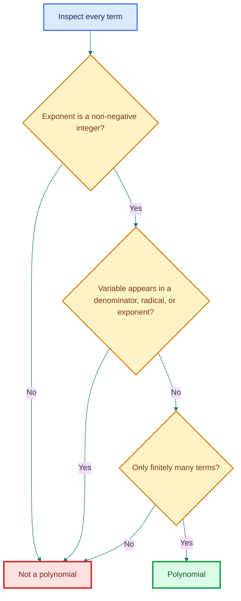

### 2.4 Examples and Non-Examples

| Expression | Polynomial? | Reason |
|---|---:|---|
| $3$ | Yes | $3=3x^0$ |
| $3x^2$ | Yes | Exponent $2$ is allowed |
| $x^2+4x+2$ | Yes | All exponents are non-negative integers |
| $x^2+4y^2+2z+10$ | Yes | A polynomial in three variables |
| $x+y+xy+x^3$ | Yes | Products of variables are allowed |
| $x+x^{1/2}$ | No | Fractional exponent |
| $x^{-2}+1$ | No | Negative exponent; $x^{-2}=1/x^2$ |
| $1/(x+1)$ | No | Variable expression in the denominator |
| $\sqrt{x}+x$ | No | $\sqrt{x}=x^{1/2}$ |
| $2^x+1$ | No | Variable occurs in the exponent |
| $\sin x+x^2$ | No | Contains a trigonometric term |

#### Important Subtlety: Substitution Does Not Change the Original Classification

If $t=\sqrt{x}$, then $x+\sqrt{x}=t^2+t$ looks polynomial **in $t$**. But the original expression is still not a polynomial in $x$. Classification always depends on the declared variable.

### 2.5 Vocabulary

- A **term** such as $7x^3$ contains a coefficient $7$, variable $x$, and exponent $3$.
- A **monomial** has one term: $5x^4$.
- A **binomial** has two nonzero terms: $x+3$.
- A **trinomial** has three nonzero terms: $x^2+5x+6$.
- A general expression with one or more polynomial terms is called a polynomial.

The zero coefficients are usually hidden. For example:

$$x^4+4x+1=1x^4+0x^3+0x^2+4x+1$$

Making those zeros visible is extremely useful in addition, subtraction, multiplication, division, and computer representation.

### 2.6 One Variable Versus Many Variables

- One variable: $3x^4-2x+7$
- Two variables: $4x^2y^2+3xy+1$
- Three variables: $x^2+y^2+z^2$

For multivariable polynomials, each individual exponent must still be a non-negative integer.

### When Do We Use Polynomials?

Polynomials are useful when a relationship is smooth and can be approximated by combinations of powers. They appear in curve fitting, physics, engineering, economics, numerical approximation, computer graphics, and machine learning.

> **Fun fact:** The word *polynomial* combines roots meaning "many" and "terms/names." Also, every monomial and binomial is technically a polynomial.

---

## 3. Lecture 4.2 - Degree of a Polynomial

### 3.1 What is Degree?

Degree measures the highest power structure present in a nonzero polynomial. In several variables, it must be computed in stages.

#### Degree of a Variable in a Term

In $4x^2y^3$:

- degree of $x$ is $2$;
- degree of $y$ is $3$.

#### Degree of a Term

Add the exponents of all variables in that term:

$$\deg(4x^2y^3)=2+3=5$$

#### Degree of a Polynomial

Take the largest degree among its nonzero terms.

### 3.2 Worked Example

Consider:

$$p(x,y)=3x^2+4x^2y^2+10y+1$$

| Term | Variable exponents | Term degree |
|---|---|---:|
| $3x^2$ | $x^2$ | $2$ |
| $4x^2y^2$ | $x^2,y^2$ | $2+2=4$ |
| $10y$ | $y^1$ | $1$ |
| $1$ | $x^0y^0$ | $0$ |

Therefore:

$$\deg p=\max\{2,4,1,0\}=4$$

### 3.3 Why Degree Matters

Degree predicts or limits many properties:

- the type of polynomial;
- the maximum number of complex roots, counted with multiplicity;
- the maximum number of real $x$-intercepts;
- the maximum number of turning points;
- the graph's end behavior when paired with the sign of the leading coefficient;
- the number of steps or storage locations required by algorithms.

### 3.4 Classification by Degree

| Degree | Name | Example |
|---:|---|---|
| $0$ | Constant | $5$ |
| $1$ | Linear | $2x+4$ |
| $2$ | Quadratic | $3x^2+2x-1$ |
| $3$ | Cubic | $x^3-4x$ |
| $4$ | Quartic | $10x^4+x+1$ |
| $5$ | Quintic | $2x^5-x^2+7$ |
| $n$ | Degree-$n$ polynomial | $a_nx^n+\cdots+a_0$ |

### 3.5 The Zero Polynomial

The zero polynomial is:

$$p(x)=0=0+0x+0x^2+\cdots$$

It has no highest power with a nonzero coefficient. In the convention used in these lectures, its degree is **undefined**.

This is not a minor technicality. It prevents contradictions in rules such as degree addition under multiplication.

> **Fun fact:** In more advanced algebra, some authors assign the zero polynomial degree $-\infty$. That convention makes formulas such as $\deg(pq)=\deg p+\deg q$ easier to state uniformly.

---

## 4. Lecture 4.3 - Addition and Subtraction

### 4.1 What Happens Conceptually?

Only **like powers** can be combined. Think of $x^2$, $x$, and $1$ as different labeled containers. Addition or subtraction changes the number in each matching container, not its label.

If:

$$p(x)=\sum_{k=0}^{n}a_kx^k,\qquad q(x)=\sum_{k=0}^{m}b_kx^k$$

pad the shorter coefficient list with zeros. Then:

$$(p+q)(x)=\sum_{k=0}^{\max(m,n)}(a_k+b_k)x^k$$

and:

$$(p-q)(x)=\sum_{k=0}^{\max(m,n)}(a_k-b_k)x^k$$

### 4.2 Coefficient-Vector Intuition

Represent a polynomial by coefficients in ascending powers:

$$x^3+2x^2+x \longleftrightarrow [0,1,2,1]$$

Then polynomial addition is ordinary component-wise vector addition.

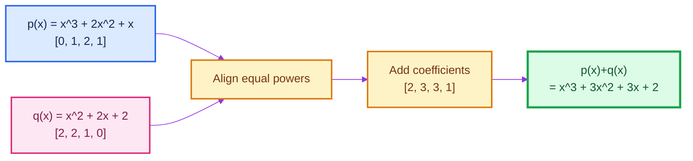

### 4.3 Worked Addition Examples

#### Example A: Add a Constant

$$(x^2+4x+4)+10=x^2+4x+14$$

The invisible form of $10$ is $0x^2+0x+10$.

#### Example B: Missing Powers

$$(x^4+4x)+(x^3+1)=x^4+x^3+4x+1$$

Writing every position makes the alignment clear:

$$p(x)=x^4+0x^3+0x^2+4x+0$$

$$q(x)=0x^4+x^3+0x^2+0x+1$$

### 4.4 Worked Subtraction Example

Let:

$$p(x)=x^3+2x^2+x,\qquad q(x)=x^2+2x+2$$

Then:

$$p(x)-q(x)=x^3+(2-1)x^2+(1-2)x+(0-2)$$

$$=x^3+x^2-x-2$$

The safest method is to distribute the negative sign to **every** term of $q(x)$ before combining.

### 4.5 Degree Behavior

- If $\deg p\ne\deg q$, then:

  $$\deg(p\pm q)=\max(\deg p,\deg q)$$

- If $\deg p=\deg q$, leading coefficients may cancel. Therefore:

  $$\deg(p\pm q)\le\max(\deg p,\deg q)$$

  not necessarily equality.

**Example:**

$$(x^3+2)+(-x^3+x)=x+2$$

Both inputs have degree $3$, but the sum has degree $1$.

### When Is This Useful?

Addition and subtraction combine models, aggregate effects, compare two polynomial rules, and form residual/error polynomials. In code, coefficient arrays make these operations direct.

---

## 5. Lecture 4.4 - Multiplication

### 5.1 What and Why?

Polynomial multiplication uses the distributive law:

1. multiply every term of one polynomial by every term of the other;
2. multiply coefficients;
3. add exponents of the same variable;
4. combine like powers.

Unlike division, multiplication of two polynomials always produces a polynomial.

### 5.2 Monomial Times Polynomial

$$(x^2+x+1)(2x^3)=2x^5+2x^4+2x^3$$

Why? For example:

$$x^2\cdot 2x^3=2x^{2+3}=2x^5$$

### 5.3 Polynomial Times Polynomial

$$(x^2+x+1)(2x+1)$$

$$=(x^2+x+1)(2x)+(x^2+x+1)(1)$$

$$=2x^3+2x^2+2x+x^2+x+1$$

$$=2x^3+3x^2+3x+1$$

FOIL is only a shortcut for two binomials. The underlying rule is always complete distribution.

### 5.4 The Coefficient-Convolution Idea

Suppose:

$$p(x)=\sum_{j=0}^{n}a_jx^j,\qquad q(x)=\sum_{r=0}^{m}b_rx^r$$

In the product, the coefficient $c_k$ of $x^k$ is:

$$c_k=\sum_{j=0}^{k}a_jb_{k-j}$$

where coefficients outside their valid index ranges are treated as $0$.

This is called the **discrete convolution** of the coefficient sequences.

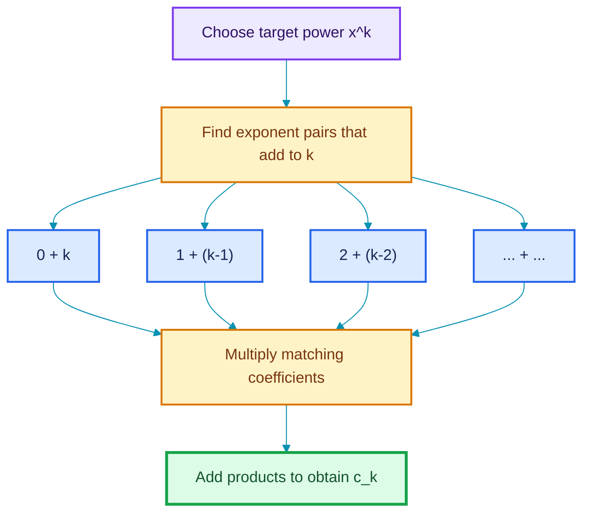

### 5.5 Worked Convolution Example

Let:

$$p(x)=x^2+x+1,\qquad q(x)=x^2+2x+1$$

Using ascending coefficient lists:

$$a=[1,1,1],\qquad b=[1,2,1]$$

| Power | Coefficient calculation | Result |
|---:|---|---:|
| $x^0$ | $a_0b_0$ | $1$ |
| $x^1$ | $a_0b_1+a_1b_0$ | $2+1=3$ |
| $x^2$ | $a_0b_2+a_1b_1+a_2b_0$ | $1+2+1=4$ |
| $x^3$ | $a_1b_2+a_2b_1$ | $1+2=3$ |
| $x^4$ | $a_2b_2$ | $1$ |

Therefore:

$$p(x)q(x)=x^4+3x^3+4x^2+3x+1$$

### 5.6 Degree Under Multiplication

For nonzero polynomials over the real numbers:

$$\deg(pq)=\deg p+\deg q$$

The leading coefficient of $pq$ is the product of the leading coefficients of $p$ and $q$, which cannot be zero when both are nonzero.

> **Fun fact:** The same convolution operation appears in digital signal processing, probability distributions, and convolutional neural networks. The settings differ, but the "shift, multiply, and add" pattern is closely related.

---

## 6. Lectures 4.5 and 4.6 - Division and the Division Algorithm

### 6.1 What Does Polynomial Division Mean?

Polynomial division asks us to rewrite a dividend $p(x)$ in terms of a nonzero divisor $d(x)$:

$$p(x)=d(x)q(x)+r(x)$$

where:

- $p(x)$: dividend;
- $d(x)$: divisor;
- $q(x)$: quotient;
- $r(x)$: remainder;
- either $r(x)=0$, or $\deg r<\deg d$.

Equivalently:

$$\frac{p(x)}{d(x)}=q(x)+\frac{r(x)}{d(x)} \qquad d(x)\ne0$$

The final quotient-plus-remainder expression is generally a **rational function**, not necessarily a polynomial.

### 6.2 Three Useful Cases

#### Divide by a Nonzero Constant

Divide every coefficient:

$$\frac{a_2x^2+a_1x+a_0}{c}=\frac{a_2}{c}x^2+\frac{a_1}{c}x+\frac{a_0}{c}$$

#### Divide by a Monomial

$$\frac{3x^2+4x+3}{x}=3x+4+\frac{3}{x}$$

The last term prevents the result from being a polynomial.

#### Divide by Another Polynomial

Use factorization when obvious; otherwise use long division.

**Example:**

$$\frac{3x^2+4x+1}{x+1}=\frac{(3x+1)(x+1)}{x+1}=3x+1$$

provided $x\ne-1$ in the original rational expression.

### 6.3 A Precision Point About Degree

If $\deg p<\deg d$, division is **not impossible**. It is already complete:

$$q(x)=0,\qquad r(x)=p(x)$$

For example:

$$4=(2x+1)(0)+4$$

Thus $4/(2x+1)$ remains a rational function with quotient $0$ and remainder $4$.

### 6.4 Why Long Division Works

At every stage, we cancel the current leading term of the dividend. Each cancellation lowers the degree of what remains. Since degrees are non-negative integers, the process must eventually stop.

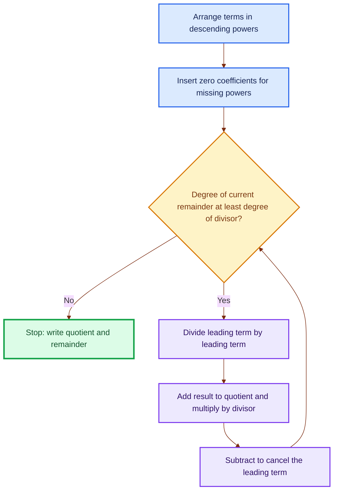

### 6.5 Full Long-Division Example

Divide:

$$2x^3+3x^2+1$$

by:

$$2x+1$$

First insert the missing term:

$$2x^3+3x^2+0x+1$$

#### Step 1

$$\frac{2x^3}{2x}=x^2$$

Multiply and subtract:

$$(2x^3+3x^2+0x+1)-(2x^3+x^2)=2x^2+0x+1$$

#### Step 2

$$\frac{2x^2}{2x}=x$$

Multiply and subtract:

$$(2x^2+0x+1)-(2x^2+x)=-x+1$$

#### Step 3

$$\frac{-x}{2x}=-\frac12$$

Multiply and subtract:

$$(-x+1)-\left(-x-\frac12\right)=\frac32$$

Since the remainder has degree $0$, less than the divisor's degree $1$, stop:

$$\boxed{\frac{2x^3+3x^2+1}{2x+1}=x^2+x-\frac12+\frac{\frac32}{2x+1}}$$

**Verification:**

$$(2x+1)\left(x^2+x-\frac12\right)+\frac32=2x^3+3x^2+1$$

### 6.6 Another Lecture Example

For:

$$p(x)=x^4+2x^2+3x+2,\qquad d(x)=x^2+x+1$$

long division gives:

$$p(x)=d(x)(x^2-x+2)+2x$$

Therefore:

$$\frac{p(x)}{d(x)}=x^2-x+2+\frac{2x}{x^2+x+1}$$

### When Is Polynomial Division Useful?

- finding unknown factors after discovering one or more roots;
- simplifying rational functions;
- proving the Factor and Remainder Theorems;
- constructing partial-fraction decompositions;
- reducing high-degree problems to lower-degree problems.

---

## 7. Lecture 4.7 - Recognizing Polynomial Graphs

### 7.1 What Must a Polynomial Graph Look Like?

Every real polynomial function is:

- **continuous** on all of $\mathbb R$: no holes, jumps, or breaks;
- **smooth**: no sharp corners or cusps;
- defined for every real $x$;
- free of vertical asymptotes.

Informally, its graph can be drawn without lifting the pen and without making an abrupt turn.

### 7.2 Why Are Polynomial Graphs Smooth?

A polynomial is built from constants and powers $x^k$. These basic functions are continuous and differentiable everywhere, and finite sums preserve those properties.

In fact, polynomials can be differentiated any number of times. After enough derivatives, they become zero.

### 7.3 Necessary Does Not Mean Sufficient

Smoothness and continuity can **rule out** a polynomial, but they cannot by themselves prove that a function is polynomial.

| Graph feature | Conclusion |
|---|---|
| Sharp corner, as in $y=|x|$ | Definitely not a polynomial |
| Break/hole/jump | Definitely not a polynomial |
| Vertical asymptote | Definitely not a polynomial |
| Smooth and continuous | Could be polynomial, but more evidence is needed |

For example, $e^x$, $\sin x$, and $1/(1+x^2)$ are smooth and continuous on $\mathbb R$, but they are not polynomials.

### 7.4 Stronger Visual Clues

A nonconstant polynomial also has these global properties:

- its ends become unbounded in directions determined by its leading term;
- it cannot oscillate infinitely many times;
- a degree-$n$ polynomial has at most $n-1$ turning points;
- it has at most $n$ real zeros.

Thus a periodic wave with infinitely many turns, such as $\sin x$, cannot be a polynomial.

---

## 8. Lecture 4.8 - Zeros, Roots, Factors, and Intercepts

### 8.1 Four Related Ideas

For a polynomial $f$, the following statements are equivalent:

$$f(a)=0 \iff a\text{ is a zero/root} \iff (a,0)\text{ is an }x\text{-intercept} \iff (x-a)\text{ is a factor of }f(x)$$

This equivalence is the **Factor Theorem**.

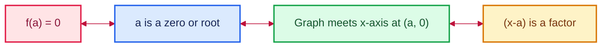

### 8.2 $x$-Intercept Versus $y$-Intercept

- To find $x$-intercepts, solve $f(x)=0$.
- To find the $y$-intercept, calculate $f(0)$.

The $y$-intercept is always $(0,a_0)$ because all positive powers vanish at $x=0$.

### 8.3 Factoring Workflow

1. Set $f(x)=0$.
2. Factor out the greatest common monomial factor.
3. Try grouping.
4. Factor recognizable binomials or trinomials.
5. Set every factor equal to zero.
6. Verify by substitution or graphing.

### 8.4 Example: Common Factor and Quadratic Pattern

Find the $x$-intercepts of:

$$f(x)=x^6-8x^4+16x^2$$

Factor:

$$f(x)=x^2(x^4-8x^2+16)$$

$$=x^2(x^2-4)^2$$

$$=x^2(x-2)^2(x+2)^2$$

Hence the zeros are:

$$x=0,\quad x=2,\quad x=-2$$

Each has multiplicity $2$, a fact that will later predict bouncing behavior.

### 8.5 Example: Factor by Grouping

Find the zeros of:

$$f(x)=x^3-4x^2-3x+12$$

Group terms:

$$f(x)=x^2(x-4)-3(x-4)$$

$$=(x^2-3)(x-4)$$

$$=(x-\sqrt3)(x+\sqrt3)(x-4)$$

So:

$$x=-\sqrt3,\quad x=\sqrt3,\quad x=4$$

### 8.6 Example: Already Factored

Let:

$$g(x)=(x-1)^2(x+3)$$

The $x$-intercepts are $x=1$ and $x=-3$. The $y$-intercept is:

$$g(0)=(-1)^2(3)=3$$

### 8.7 When Factoring Is Not Obvious

Use a table, graphing technology, or root-testing strategy to discover a zero. Once $x=a$ is found, divide the polynomial by $x-a$ to reduce the degree.

For the lecture example:

$$f(x)=x^3+4x^2+x-6$$

a value table reveals $x=-2$ and $x=1$ as zeros. Therefore $(x+2)(x-1)$ is a factor. Division gives the remaining factor $x+3$:

$$f(x)=(x+3)(x+2)(x-1)$$

### 8.8 Why Higher Degrees Are Hard

- Quadratics have a practical general formula.
- Cubic and quartic formulas exist but are complicated.
- There is no formula by radicals that solves every general polynomial of degree $5$ or higher.

This last result is the **Abel-Ruffini theorem**. Numerical methods and approximations therefore become essential.

---

## 9. Lectures 4.9 and 4.10 - Multiplicity and Behavior at Zeros

### 9.1 What Is Multiplicity?

If:

$$f(x)=(x-a)^m g(x),\qquad g(a)\ne0$$

then $x=a$ is a zero of **multiplicity $m$**.

Multiplicity counts how many times the factor $x-a$ occurs.

### 9.2 Why Parity Controls Crossing

Very close to $x=a$, the nonzero factor $g(x)$ keeps the same sign. Thus the sign change is controlled by $(x-a)^m$:

- if $m$ is odd, $(x-a)^m$ changes sign across $a$, so the graph crosses;
- if $m$ is even, $(x-a)^m$ stays nonnegative on both sides, so the graph touches and turns back.

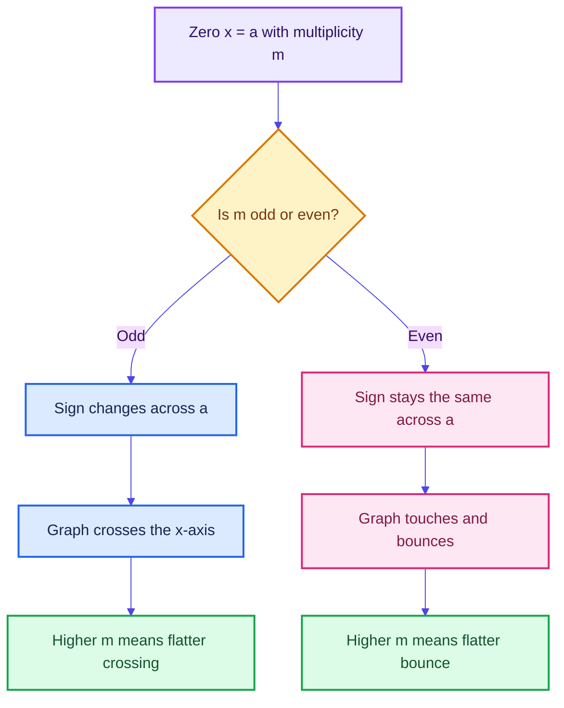

### 9.3 Visual Dictionary

| Multiplicity | Local model | Typical graph behavior |
|---:|---|---|
| $1$ | $y=x-a$ | Crosses almost like a straight line |
| $2$ | $y=(x-a)^2$ | Touches and bounces |
| $3$ | $y=(x-a)^3$ | Crosses with an S-shaped flattening |
| $4$ | $y=(x-a)^4$ | Bounces more flatly |
| Higher odd | $y=(x-a)^m$ | Crosses, increasingly flat near the zero |
| Higher even | $y=(x-a)^m$ | Bounces, increasingly flat near the zero |

### 9.4 Worked Example

Consider:

$$f(x)=(x-1)^2(x+2)^3(x+4)$$

| Zero | Multiplicity | Behavior |
|---:|---:|---|
| $x=1$ | $2$ | Touches and bounces |
| $x=-2$ | $3$ | Crosses with flattening |
| $x=-4$ | $1$ | Crosses almost linearly |

The degree is $2+3+1=6$.

### 9.5 Sum of Visible Multiplicities

If a real polynomial has degree $n$, then:

$$\sum(\text{multiplicities of real zeros})\le n$$

Why might the sum be smaller than $n$? Some zeros can be non-real complex numbers and therefore do not appear as $x$-intercepts.

**Example:**

$$f(x)=(x^2+1)(x-2)^2$$

This is degree $4$, but the graph has only one real zero, $x=2$, with multiplicity $2$. The factor $x^2+1$ has roots $i$ and $-i$, which are not visible on a real coordinate plane.

> **Fun fact:** The Fundamental Theorem of Algebra says a degree-$n$ polynomial has exactly $n$ complex roots when multiplicity is counted. For real coefficients, non-real roots occur in conjugate pairs.

---

## 10. Lecture 4.11 - End Behavior

### 10.1 What Is End Behavior?

End behavior describes what happens to $f(x)$ as:

$$x\to\infty\qquad\text{and}\qquad x\to-\infty$$

For:

$$f(x)=a_nx^n+a_{n-1}x^{n-1}+\cdots+a_0$$

the leading term $a_nx^n$ dominates for very large $|x|$. Thus:

$$f(x)\sim a_nx^n\quad\text{as }|x|\to\infty$$

### 10.2 Why Does the Leading Term Dominate?

Divide by $x^n$:

$$\frac{f(x)}{x^n}=a_n+\frac{a_{n-1}}{x}+\frac{a_{n-2}}{x^2}+\cdots+\frac{a_0}{x^n}$$

As $|x|\to\infty$, every fraction tends to $0$, leaving $a_n$. Lower-degree terms become negligible relative to $x^n$.

### 10.3 The Four Cases

| Degree parity | Leading coefficient | Left end $x\to-\infty$ | Right end $x\to\infty$ | Memory image |
|---|---:|---|---|---|
| Even | $a_n>0$ | $f(x)\to\infty$ | $f(x)\to\infty$ | Both up |
| Even | $a_n<0$ | $f(x)\to-\infty$ | $f(x)\to-\infty$ | Both down |
| Odd | $a_n>0$ | $f(x)\to-\infty$ | $f(x)\to\infty$ | Left down, right up |
| Odd | $a_n<0$ | $f(x)\to\infty$ | $f(x)\to-\infty$ | Left up, right down |

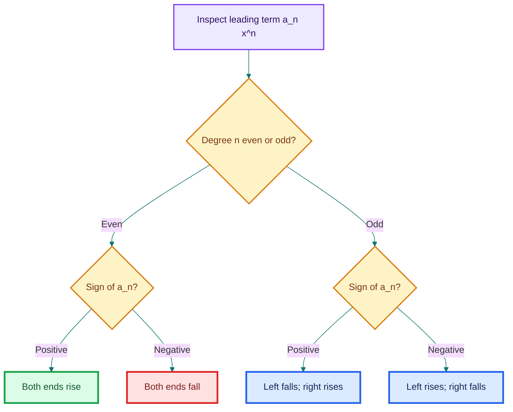

### 10.4 Fast Mnemonic

- **Even degree:** the two ends agree.
- **Odd degree:** the two ends disagree.
- **Positive leading coefficient:** the right end goes up.
- **Negative leading coefficient:** the right end goes down.

### 10.5 Examples

1. $f(x)=3x^4-100x+2$: even degree, positive leading coefficient, both ends up.
2. $g(x)=-2x^6+x^5+7$: even degree, negative leading coefficient, both ends down.
3. $h(x)=x^5-4x^2$: odd degree, positive leading coefficient, left down and right up.
4. $k(x)=-x^3+8x$: odd degree, negative leading coefficient, left up and right down.

The large coefficient of a lower-degree term may change the middle of the graph, but it cannot change the ultimate end behavior.

---

## 11. Lecture 4.12 - Graphing and Constructing Polynomials

The transcript labels the final graphing lecture as 4.13, while the supplied slide deck is numbered 4.12. These notes group that final material here as Lecture 4.12.

### 11.1 How to Graph a Polynomial from Its Formula

1. Find all real $x$-intercepts, if possible.
2. Find the $y$-intercept $f(0)$.
3. Check symmetry.
4. Record the multiplicity of each zero.
5. Use multiplicity to decide crossing versus bouncing.
6. Use the leading term to determine end behavior.
7. Connect all information with a smooth, continuous curve.
8. Check that the number of turning points is at most $n-1$.
9. Use a table or graphing tool to refine/verify the sketch.

### 11.2 Symmetry Checks

- If $f(-x)=f(x)$, $f$ is **even** and the graph is symmetric about the $y$-axis.
- If $f(-x)=-f(x)$, $f$ is **odd** and the graph is symmetric about the origin.
- A polynomial need not be either even or odd.

An even polynomial contains only even powers; an odd polynomial contains only odd powers and has zero constant term.

### 11.3 Turning-Point Limit

A degree-$n$ polynomial has at most:

$$n-1$$

turning points.

Why? A turning point normally occurs where the derivative changes sign. The derivative has degree $n-1$, so it can have at most $n-1$ real zeros.

This is an upper bound, not an exact count. For example, $x^3$ has degree $3$ but no turning point.

### 11.4 Full Sketching Example

Sketch:

$$f(x)=-(x+2)^2(x-5)$$

#### Intercepts

- $x=-2$, multiplicity $2$: touch and bounce.
- $x=5$, multiplicity $1$: cross.
- $y$-intercept:

$$f(0)=-(2)^2(-5)=20$$

#### End Behavior

The leading term is $-x^3$. Hence:

$$x\to-\infty\Rightarrow f(x)\to\infty,\qquad x\to\infty\Rightarrow f(x)\to-\infty$$

#### Turning Points

The degree is $3$, so there are at most $2$ turning points.

#### Mental Sketch

Start high on the left, descend to touch and bounce at $(-2,0)$, pass through $(0,20)$, turn downward, cross at $(5,0)$, and finish low on the right.

### 11.5 How to Recover a Formula from a Graph

Suppose a graph shows zeros $r_1,\ldots,r_k$ with multiplicities $m_1,\ldots,m_k$. The least-degree candidate is:

$$f(x)=a\prod_{i=1}^{k}(x-r_i)^{m_i}$$

where $a\ne0$ is an unknown scale factor.

Use any known point $(x_0,y_0)$ that is not an $x$-intercept (so $y_0\ne0$) to find $a$:

$$a=\frac{y_0}{\prod_{i=1}^{k}(x_0-r_i)^{m_i}}$$


### 11.6 Reverse-Engineering Example

Suppose a graph:

- bounces at $x=-2$, so the least multiplicity is $2$;
- crosses nearly linearly at $x=1$, so the least multiplicity is $1$;
- passes through $(0,-2)$.

Start with:

$$f(x)=a(x+2)^2(x-1)$$

Use $(0,-2)$:

$$-2=a(2)^2(-1)=-4a$$

so:

$$a=\frac12$$

Therefore:

$$\boxed{f(x)=\frac12(x+2)^2(x-1)}$$

The phrase **least degree** matters. A graph window may not reveal complex roots or additional factors that never become zero. Without more information, many higher-degree polynomials could share the same visible real zeros.

---

## 12. Intermediate Value Theorem

### 12.1 What Does It Say?

Because polynomials are continuous, if $f(a)$ and $f(b)$ have opposite signs, then at least one number $c$ between $a$ and $b$ satisfies:

$$f(c)=0$$

Symbolically, if:

$$f(a)f(b)<0$$

then there is at least one root in $(a,b)$.

### 12.2 Why Is It Intuitive?

To travel continuously from a negative height to a positive height, the graph must pass through height $0$. It cannot teleport across the $x$-axis.

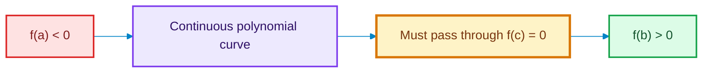

### 12.3 How and When Is It Used?

It is useful for:

- proving that a root exists even when its exact value is unknown;
- narrowing a root to a smaller interval;
- supporting numerical methods such as bisection;
- checking a graph or table for missed zeros.

**Example:** if $f(1)=-4$ and $f(2)=3$, at least one root lies between $1$ and $2$.

### 12.4 Important Limitation

No sign change does **not** prove that no root exists. An even-multiplicity zero touches the axis without changing sign.

**Example:**

$$f(x)=(x-1)^2$$

We have $f(0)>0$ and $f(2)>0$, yet $f(1)=0$.

---

## 13. A Unified Problem-Solving Workflow

### 13.1 From Equation to Graph

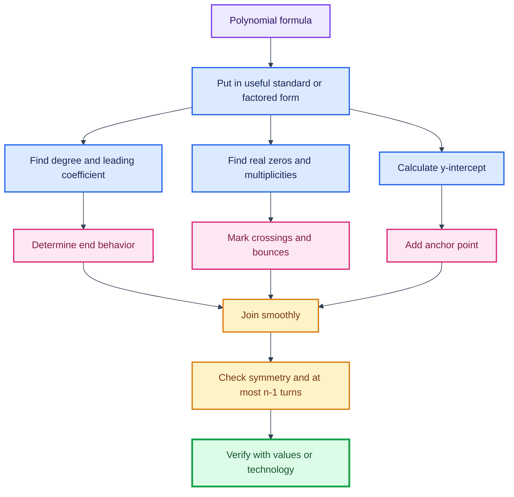

### 13.2 From Graph to Equation

1. Check whether the graph could be polynomial.
2. Read every visible real zero.
3. Infer the least multiplicity from local behavior.
4. Use end behavior to infer degree parity and leading-coefficient sign.
5. Form $f(x)=a\prod(x-r_i)^{m_i}$.
6. Use a nonzero point to determine $a$.
7. Verify intercepts, local behavior, ends, and degree constraints.

### 13.3 Which Algebraic Form Should I Use?

| Form | Best for |
|---|---|
| Standard form $a_nx^n+\cdots+a_0$ | Degree, leading term, end behavior, addition/subtraction |
| Factored form $a\prod(x-r_i)^{m_i}$ | Zeros, multiplicities, graph behavior |
| Quotient-remainder form $dq+r$ | Division and rational simplification |
| Coefficient list $[a_0,a_1,\ldots,a_n]$ | Computer algorithms and convolution |

Good problem solving often means converting to the form that exposes the information you need.

---

## 14. Connections to Data Science and Computing

### 14.1 Polynomial Features

A model such as:

$$\hat y=\beta_0+\beta_1x+\beta_2x^2+\beta_3x^3$$

is polynomial in $x$ but **linear in the parameters** $\beta_0,\beta_1,\beta_2,\beta_3$. Therefore it can be fitted using linear-regression machinery after creating the features $x,x^2,x^3$.

### 14.2 Why Use Polynomial Models?

They can capture smooth curvature while remaining interpretable. They are useful when a straight line underfits but a fully flexible model is unnecessary.

### 14.3 When Should We Be Careful?

- High degree may overfit noise.
- Powers can become numerically huge when $|x|$ is large.
- Extrapolation can be unstable because the leading term eventually dominates.
- Raw powers can be highly correlated; scaling and orthogonal polynomial bases can help.

### 14.4 Computing Perspective

- Addition/subtraction: component-wise operations on coefficient arrays.
- Multiplication: convolution of coefficient arrays.
- Evaluation: Horner's method reduces repeated powers.
- Root finding: numerical algorithms are often used for high degree.

Horner's method rewrites:

$$a_nx^n+a_{n-1}x^{n-1}+\cdots+a_0$$

as:

$$(\cdots((a_nx+a_{n-1})x+a_{n-2})x+\cdots)x+a_0$$

which needs fewer multiplications.

> **Fun fact:** Polynomial approximations are a major reason computers can quickly evaluate functions such as sine, cosine, and exponential. Over suitable intervals, complicated smooth functions can be approximated by polynomials.

---

## 15. Common Mistakes and Precision Notes

These notes preserve the lecture's intent while making several statements mathematically precise.

1. **Fractional powers are not polynomial powers.** $x^{1/2}$ is not allowed in a polynomial in $x$.
2. **A constant is a polynomial.** A nonzero constant has degree $0$.
3. **The zero polynomial is special.** Its degree is undefined under the course convention.
4. **For multivariable terms, add exponents.** The degree of $x^2y^3$ is $5$, not $3$.
5. **Addition can lower degree.** Equal leading powers may cancel.
6. **Subtraction negates every term.** Use parentheses before distributing the minus sign.
7. **Multiplication adds degrees, not coefficients.** Coefficients multiply; exponents add.
8. **A smaller-degree dividend is still divisible.** Its quotient is $0$ and it remains the remainder.
9. **A zero and an $x$-intercept refer to the input.** The intercept point is $(a,0)$, while the zero is $a$.
10. **Cross/bounce depends on multiplicity, not total degree.** A degree-$6$ polynomial can cross at one zero and bounce at another.
11. **Smooth and continuous is not a proof of being polynomial.** It is only a necessary visual test.
12. **End behavior uses the leading term only.** Middle terms control local wiggles, not the ultimate ends.
13. **At most $n-1$ turns is not exactly $n-1$ turns.** It is an upper bound.
14. **Opposite signs guarantee a root; same signs do not rule one out.** Even-multiplicity roots may not change sign.
15. **Visible real multiplicities may sum to less than the degree.** Non-real roots do not appear as $x$-intercepts.

---

## 16. Master Cheat Sheet

### Definition

$$p(x)=\sum_{k=0}^{n}a_kx^k,\qquad a_n\ne0,\quad k\in\{0,1,2,\ldots\}$$

### Degree Rules for Nonzero Polynomials

$$\deg(pq)=\deg p+\deg q$$

$$\deg(p\pm q)\le\max(\deg p,\deg q)$$

### Division Algorithm

$$p(x)=d(x)q(x)+r(x),\qquad r=0\text{ or }\deg r<\deg d$$

### Factor Theorem

$$f(a)=0\iff(x-a)\text{ divides }f(x)$$

### Multiplicity

$$(x-a)^m\mid f(x)$$

- $m$ odd: cross;
- $m$ even: bounce;
- larger $m$: flatter near $a$.

### End Behavior

- even degree: ends agree;
- odd degree: ends disagree;
- positive leading coefficient: right end up;
- negative leading coefficient: right end down.

### Graph Limits

For degree $n$:

- at most $n$ real zeros;
- at most $n-1$ turning points;
- exactly $n$ complex zeros counted with multiplicity.

### Graph-Building Formula

$$f(x)=a\prod_{i=1}^{k}(x-r_i)^{m_i}$$

Use a known nonzero point to solve for $a$.

---

## 17. Practice Problems with Answers

### Problem 1 - Identification

Which expressions are polynomials in $x$?

1. $3x^4-2x+1$
2. $x^{-1}+2$
3. $\sqrt{x}+x^2$
4. $7$
5. $x^3+\pi x$

<details>
<summary>Answer</summary>

1, 4, and 5 are polynomials. The constant $\pi$ is a valid real coefficient. Expressions 2 and 3 contain negative and fractional exponents.

</details>

### Problem 2 - Degree

Find the degree of:

$$4x^2y^3+7x^4y-2y^2+1$$

<details>
<summary>Answer</summary>

The term degrees are $5,5,2,0$, so the polynomial degree is $5$.

</details>

### Problem 3 - Addition and Cancellation

Let:

$$p(x)=2x^4-x+3,\qquad q(x)=-2x^4+x^2+5$$

Find $p(x)+q(x)$ and its degree.

<details>
<summary>Answer</summary>

$$p(x)+q(x)=x^2-x+8$$

which has degree $2$. The degree-$4$ terms cancel.

</details>

### Problem 4 - Multiplication

Multiply:

$$(x^2+1)(x-3)$$

<details>
<summary>Answer</summary>

$$x^3-3x^2+x-3$$

</details>

### Problem 5 - Division Check

Verify that:

$$x^3-1=(x-1)(x^2+x+1)$$

What are the quotient and remainder when $x^3-1$ is divided by $x-1$?

<details>
<summary>Answer</summary>

Multiplying gives $x^3+x^2+x-x^2-x-1=x^3-1$. The quotient is $x^2+x+1$, and the remainder is $0$.

</details>

### Problem 6 - Zeros and Multiplicities

For:

$$f(x)=-2(x+1)^3(x-4)^2$$

list the zeros, multiplicities, and local behavior.

<details>
<summary>Answer</summary>

- $x=-1$, multiplicity $3$: crosses with flattening.
- $x=4$, multiplicity $2$: touches and bounces.

</details>

### Problem 7 - End Behavior

Describe the end behavior of:

$$f(x)=-5x^7+2x^2-1$$

<details>
<summary>Answer</summary>

Odd degree with negative leading coefficient:

$$x\to-\infty\Rightarrow f(x)\to\infty,\qquad x\to\infty\Rightarrow f(x)\to-\infty$$

</details>

### Problem 8 - Build a Polynomial

Find the least-degree polynomial that:

- bounces at $x=-1$;
- crosses linearly at $x=2$;
- passes through $(0,4)$.

<details>
<summary>Answer</summary>

Start with:

$$f(x)=a(x+1)^2(x-2)$$

Using $(0,4)$:

$$4=a(1)^2(-2)=-2a\Rightarrow a=-2$$

Therefore:

$$\boxed{f(x)=-2(x+1)^2(x-2)}$$

</details>

### Problem 9 - Intermediate Value Theorem

Suppose $p(2)=-7$ and $p(3)=5$. What can be concluded?

<details>
<summary>Answer</summary>

Because a polynomial is continuous and the signs are opposite, at least one zero lies in $(2,3)$. The theorem does not tell us the exact zero or whether there is more than one.

</details>

### Problem 10 - Full Graph Analysis

Analyze:

$$f(x)=x^2(x-3)^3$$

<details>
<summary>Answer</summary>

- Degree: $5$.
- Leading coefficient: positive.
- Zero $x=0$, multiplicity $2$: bounce.
- Zero $x=3$, multiplicity $3$: flattened crossing.
- $y$-intercept: $(0,0)$.
- End behavior: left down, right up.
- Maximum turning points: $4$.

</details>

---

## Final Mental Model

A polynomial graph is not a mysterious curve. Read it as a collection of local and global instructions:

- **coefficients** tell how powers are weighted;
- **degree** limits complexity;
- **zeros** place the graph on the $x$-axis;
- **multiplicities** decide crossing, bouncing, and flatness;
- **the leading term** controls both far ends;
- **one nonzero point** determines the remaining vertical scale.

Once these pieces are combined, converting between equation and graph becomes a systematic process rather than guesswork.

# Week 4 Tutorial: Polynomials - Complete Worked Solutions

> Detailed solutions to all 17 questions in the supplied tutorial document. Each problem is explained step by step, followed by the governing idea, intuition, checks, and useful extensions.

---

## Contents

1. [Quick Answer Key](#quick-answer-key)
2. [Question 1 - Quadratics from Roots](#question-1---quadratics-from-roots)
3. [Question 2 - Remainder on Division by a Quadratic](#question-2---remainder-on-division-by-a-quadratic)
4. [Question 3 - Making a Polynomial Divisible](#question-3---making-a-polynomial-divisible)
5. [Question 4 - Degree of a Polynomial Quotient](#question-4---degree-of-a-polynomial-quotient)
6. [Question 5 - Melting Sheets into Boxes](#question-5---melting-sheets-into-boxes)
7. [Question 6 - Revenue, Cost, and Profit](#question-6---revenue-cost-and-profit)
8. [Question 7 - Comparing Manufacturing Processes](#question-7---comparing-manufacturing-processes)
9. [Question 8 - Best Fit Using SSE](#question-8---best-fit-using-sse)
10. [Question 9 - Reading a Polynomial Graph](#question-9---reading-a-polynomial-graph)
11. [Question 10 - Road and Railway Crossings](#question-10---road-and-railway-crossings)
12. [Question 11 - Gold-Price Polynomial](#question-11---gold-price-polynomial)
13. [Question 12 - Skydiver Graph](#question-12---skydiver-graph)
14. [Question 13 - ECG Graph](#question-13---ecg-graph)
15. [Question 14 - Profit Inequality](#question-14---profit-inequality)
16. [Question 15 - Four Real Roots](#question-15---four-real-roots)
17. [Question 16 - Four Distinct Real Roots](#question-16---four-distinct-real-roots)
18. [Question 17 - Demand Versus Production](#question-17---demand-versus-production)
19. [Concept Toolkit](#concept-toolkit)
20. [Final Formula Sheet](#final-formula-sheet)

---

## Quick Answer Key

| Question | Final Answer |
|---------:|--------------|
| 1 | **B, C, F** (assuming monic quadratics) |
| 2 | $p=1,\ c=-9$; **none of the printed options** |
| 3 | **B, C, D** |
| 4 | $\deg h=2$; under the usual monic/positive-leading-coefficient assumption, **C** |
| 5 | **45 boxes** |
| 6 | $4x^4+x^3-\frac32x^2-\frac12x$ lakhs |
| 7(a) | $E_i = M_i + W_i$ |
| 7(b) | $65001:10505 \approx 6.188:1$ |
| 7(c) | **Process 3** |
| 8 | $c=-\frac12$; minimum SSE = $5$ |
| 9 | 7 turns; 5 distinct roots; root-based minimum degree 6; turn-based and overall minimum degree 8; positive leading coefficient |
| 10 | 4 level crossings; 3 turning points |
| 11 | ₹5,000 per gram; ₹23,440 extra after 6 months |
| 12 | Statements 1 and 2 are true; statements 3 and 4 are false |
| 13 | 11 turning points; minimum sum of multiplicities 12; after $U_1$: zero polynomial |
| 14 | 6 golden months: February-April and September-November |
| 15 | **A** |
| 16 | **C** |
| 17 | Reduce production from **July through December** |

### Two Source-Quality Notes

1. In Question 2, direct polynomial reduction gives $c=-9$, but every option displaying $p=1$ prints $c=-19$. The options contain a typographical error.
2. In Question 4, degrees determine that $h$ is quadratic, but not whether its parabola opens upward or downward unless signs of leading coefficients are also assumed.

---

## How the Main Ideas Connect

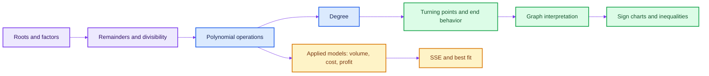

---

## Question 1 - Quadratics from Roots

### Given

- $p(x)$ has roots $-1$ and $1$
- $q(x)$ has roots $-5$ and $6$

The options assume that the quadratics are **monic**, meaning their leading coefficient is $1$.

### Step 1: Construct Each Polynomial

If $r$ is a root, then $x-r$ is a factor.

$$p(x)=(x+1)(x-1)=x^2-1$$

$$q(x)=(x+5)(x-6)=x^2-x-30$$

### Step 2: Degree of the Product

$$\deg[p(x)q(x)]=\deg p+\deg q=2+2=4$$

Therefore:
- **A is false**
- **B is true**

### Step 3: Add

$$p(x)+q(x)=(x^2-1)+(x^2-x-30)=2x^2-x-31$$

Therefore **C is true** and **D is false**.

### Step 4: Subtract

$$p(x)-q(x)=(x^2-1)-(x^2-x-30)=x^2-1-x^2+x+30=x+29$$

Therefore **F is true** and **E is false**.

$$\boxed{\text{Correct options: B, C, F}}$$

### What, Why, and When?

- **What:** Roots allow us to reconstruct a polynomial as a product of linear factors.
- **Why:** Substitution of a root must make one factor zero.
- **How:** A root $r$ produces the factor $(x-r)$.
- **When:** Use this whenever roots are supplied and an equation, sum, product, or graph property is requested.

> **Precision note:** Roots alone determine a quadratic only up to a nonzero multiplier. The tutorial options implicitly choose monic polynomials.


---

## Question 2 - Remainder on Division by a Quadratic

### Given

$$F(x)=3x^4-8x^3+16x^2-10$$

is divided by:

$$x^2-p$$

and the remainder is:

$$-8x-c$$

### Key Idea: Work Modulo the Divisor

Since $x^2-p=0$, we can replace:

$$x^2 \equiv p$$

Consequently:

$$x^3=x(x^2)\equiv px$$

$$x^4=(x^2)^2\equiv p^2$$

### Reduce $F(x)$

$$F(x)\equiv 3p^2-8px+16p-10$$

$$=(-8p)x+(3p^2+16p-10)$$

This must equal the stated remainder:

$$-8x-c$$

### Compare Coefficients

**Coefficient of $x$:**

$$-8p=-8 \implies p=1$$

**Constant term:**

$$3p^2+16p-10=-c$$

$$3(1)^2+16(1)-10=-c$$

$$9=-c$$

$$c=-9$$

$$\boxed{p=1,\qquad c=-9}$$

### Option Check

No printed option gives $p=1,\ c=-9$. Therefore the mathematically correct response is **none of the listed options**.

### Why Is the Remainder Linear?

When dividing by a degree-2 polynomial, the remainder must have degree less than $2$. Hence it has the form $ax+b$.

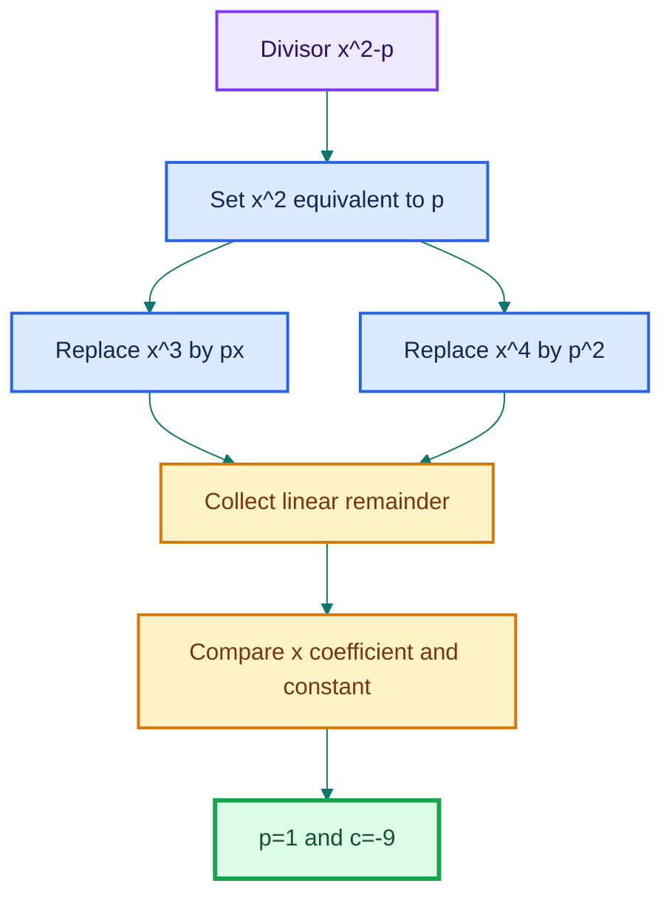
Alternate approach:

### The Full Long Division Layout

$$x^2 - p \quad\overline{\Big|\quad 3x^4 - 8x^3 + 16x^2 + 0x - 10}$$

$$3x^2 - 8x + (16 + 3p)$$

$$x^2 - p \quad\overline{\Big|\quad 3x^4 - 8x^3 + 16x^2 + 0x - 10}$$

$$\underline{-(3x^4 + 0x^3 - 3px^2 + 0x + 0)}$$

$$-8x^3 + (16 + 3p)x^2 + 0x - 10$$

$$\underline{-(-8x^3 + 0x^2 + 8px + 0)}$$

$$(16 + 3p)x^2 - 8px - 10$$

$$\underline{-[(16 + 3p)x^2 + 0x - 16p - 3p^2]}$$

$$-8px + (-10 + 16p + 3p^2)$$

### Remainder:

$$\boxed{-8px + (-10 + 16p + 3p^2)}$$

Compare with $-8x - c$:

$$-8p = -8 \implies p = 1$$

$$-10 + 16p + 3p^2 = -c \implies c = -9$$

$$\boxed{p = 1,\quad c = -9}$$
---

## Question 3 - Making a Polynomial Divisible

### Given

$$P(x)=2x^3+23x^2+40x$$

We want to add $H(x)$ so that $P(x)+H(x)$ is divisible by $(x+9)$.

### Use the Factor/Remainder Theorem

A polynomial $S(x)$ is divisible by $(x+9=x-(-9))$ exactly when:

$$S(-9)=0$$

First calculate:

$$P(-9)=2(-9)^3+23(-9)^2+40(-9)$$

$$=2(-729)+23(81)-360$$

$$=-1458+1863-360=45$$

Therefore we need:

$$H(-9)=-45$$

### Test Every Option

| Option | $H(x)$ | $H(-9)$ | Divisible? |
|--------|--------|--------:|-----------:|
| A | $2x^2+9x$ | $162-81=81$ | No |
| B | $-45$ | $-45$ | Yes |
| C | $5x$ | $-45$ | Yes |
| D | $x^2-126$ | $81-126=-45$ | Yes |

$$\boxed{\text{Correct options: B, C, D}}$$

### Intuition

The original polynomial misses divisibility by a remainder of $45$. Any added polynomial whose value at $-9$ is $-45$ cancels that remainder. The added expressions can look completely different; only their value at the target root matters.

---

## Question 4 - Degree of a Polynomial Quotient

### Given

$$\deg P=2,\qquad \deg Q=3,\qquad \deg R=4$$

and:

$$h(x)=\frac{P(x)Q(x)-Q(x)R(x)+R(x)P(x)}{P(x)+P(x)Q(x)}$$

where $h(x)$ is known to be a polynomial.

### Step 1: Degree of the Numerator

$$\deg(PQ)=2+3=5$$

$$\deg(QR)=3+4=7$$

$$\deg(RP)=4+2=6$$

The degree-7 term comes only from $-QR$, so it cannot be cancelled by the degree-5 or degree-6 terms:

$$\deg(\text{numerator})=7$$

### Step 2: Degree of the Denominator

$$\deg P=2,\qquad \deg(PQ)=5$$

The degree-5 term is unique, so:

$$\deg(\text{denominator})=5$$

### Step 3: Degree of $h$

Because the quotient is known to be an exact polynomial:

$$\deg h=7-5=2$$

Thus $h$ is quadratic, so its graph must be a parabola.

### Which Option?

- **A** is linear: reject
- **D** is constant: reject
- **B** and **C** are both quadratic: degree alone permits either

Let $p_2,\ q_3,\ r_4$ be leading coefficients. Then the leading coefficient of $h$ is:

$$\frac{-q_3r_4}{p_2q_3}=-\frac{r_4}{p_2}$$

Its sign is not determined unless the signs of $p_2$ and $r_4$ are given.

$$\boxed{\deg h=2;\ \text{B or C from degree alone}}$$

If the intended unstated assumption is that the polynomials are monic or have positive leading coefficients, then $-r_4/p_2<0$, so the parabola opens downward:

$$\boxed{\text{C under the positive-leading-coefficient assumption}}$$

### General Rule

For an exact quotient of nonzero polynomials:

$$\deg\left(\frac{A}{B}\right)=\deg A-\deg B$$

This rule applies only when the quotient is a polynomial with no nonzero remainder.

---

## Question 5 - Melting Sheets into Boxes

### Principle: Volume Is Conserved

Melting changes shape, not the amount of material. Therefore:

$$\text{number of boxes}=\frac{\text{total sheet volume}}{\text{volume of one box}}$$

### Step 1: Volume of One Sheet

The sheet dimensions are:

$$(x+4),\qquad (x+3),\qquad \frac{x}{2}$$

So:

$$V_{\text{sheet}}=(x+4)(x+3)\frac{x}{2}$$

There are six sheets:

$$V_{\text{total}}=6(x+4)(x+3)\frac{x}{2}=3x(x+3)(x+4)$$

### Step 2: Volume of One Box

The box dimensions are:

$$\frac{x}{2},\qquad \frac{2x+6}{3},\qquad \frac{x+4}{5}$$

Notice that:

$$2x+6=2(x+3)$$

Thus:

$$V_{\text{box}}=\frac{x}{2}\cdot\frac{2(x+3)}{3}\cdot\frac{x+4}{5}=\frac{x(x+3)(x+4)}{15}$$

### Step 3: Divide

$$N=\frac{3x(x+3)(x+4)}{\frac{x(x+3)(x+4)}{15}}=3\cdot15=45$$

$$\boxed{45\text{ solid boxes}}$$

The variable factors cancel because both shapes were deliberately designed using the same factors.


---

## Question 6 - Revenue, Cost, and Profit

### Given Revenue

$$T(x)=5x^4+3x^3+x^2+x$$

lakhs of rupees.

### Add All Costs

**Purchase:**

$$C_P=x^4+x^3+x^2$$

**Transportation:**

$$C_T=x^3+x^2+x$$

**Miscellaneous:**

$$C_M=0.5x^2+0.5x$$

**Total cost:**

$$C(x)=C_P+C_T+C_M$$

$$=x^4+2x^3+2.5x^2+1.5x$$

### Profit = Revenue - Cost

$$\Pi(x)=T(x)-C(x)$$

$$=(5x^4+3x^3+x^2+x)-(x^4+2x^3+2.5x^2+1.5x)$$

$$=4x^4+x^3-1.5x^2-0.5x$$

$$\boxed{\Pi(x)=4x^4+x^3-\frac32x^2-\frac12x\text{ lakhs}}$$

For the year $2000+x$, substitute that value of $x$ into this profit polynomial.

### Translation Rule for Word Problems

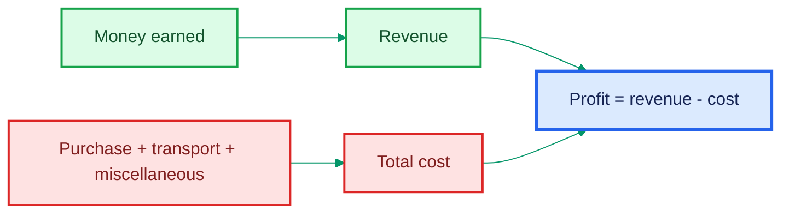

---

## Question 7 - Comparing Manufacturing Processes

### Given

$$M_1(x)=100x^3+20x^2+10$$

$$M_2(x)=20x^4+10x^2-20$$

$$M_3(x)=x^3+20$$

Waste-management costs are:

$$W_1(x)=0.01x^2-0.008x$$

$$W_2(x)=0.01x^4-0.001x^3+0.001x^2$$

$$W_3(x)=0.01x^2$$

### Part (a): Effective Manufacturing Costs

Effective cost includes ordinary manufacturing and waste management:

$$E_i(x)=M_i(x)+W_i(x)$$

Therefore:

$$\boxed{E_1(x)=100x^3+20.01x^2-0.008x+10}$$

$$\boxed{E_2(x)=20.01x^4-0.001x^3+10.001x^2-20}$$

$$\boxed{E_3(x)=x^3+0.01x^2+20}$$

### Part (b): Ratio of Processes 1 and 3 at $x=1$

$$E_1(1)=100+20.01-0.008+10=130.002$$

$$E_3(1)=1+0.01+20=21.01$$

Hence:

$$E_1(1):E_3(1)=130.002:21.01$$

Multiplying both entries by $1000$ and reducing by $2$:

$$\boxed{65001:10505\approx6.188:1}$$

### Part (c): Best Process at $x=10$

$$E_1(10)=100(10^3)+20.01(10^2)-0.008(10)+10=102010.92$$

$$E_2(10)=20.01(10^4)-0.001(10^3)+10.001(10^2)-20=201079.10$$

$$E_3(10)=10^3+0.01(10^2)+20=1021$$

The smallest effective cost is $E_3(10)$.

$$\boxed{\text{Choose process 3}}$$

### Decision Intuition

Never compare formulas only by degree when a specific input is supplied. Evaluate every candidate at that input and choose the smallest actual cost.

---

## Question 8 - Best Fit Using SSE

### Given Model

$$\widehat y=2x^5-4x^4-3x+c$$

and data:

| $x$ | Observed $y$ |
|----:|-------------:|
| 0 | 0 |
| 1 | -4 |
| 2 | -7 |
| 3 | 151 |

We must choose $c$ to minimize the **Sum of Squared Errors**:

$$\text{SSE}(c)=\sum_i(y_i-\widehat y_i)^2$$

### Step 1: Separate the Fixed Part

Let:

$$g(x)=2x^5-4x^4-3x$$

Then $\widehat y=g(x)+c$.

| $x$ | $y$ | $g(x)$ | $y-g(x)$ |
|----:|----:|-------:|---------:|
| 0 | 0 | 0 | 0 |
| 1 | -4 | -5 | 1 |
| 2 | -7 | -6 | -1 |
| 3 | 151 | 153 | -2 |

The residual is:

$$y_i-\widehat y_i=[y_i-g(x_i)]-c$$

### Step 2: Write SSE

$$\text{SSE}(c)=c^2+(1-c)^2+(-1-c)^2+(-2-c)^2$$

Expand:

$$\text{SSE}(c)=c^2+(c^2-2c+1)+(c^2+2c+1)+(c^2+4c+4)$$

$$=4c^2+4c+6$$

### Step 3: Minimize

Complete the square:

$$4c^2+4c+6=4\left(c^2+c\right)+6$$

$$=4\left[\left(c+\frac12\right)^2-\frac14\right]+6$$

$$=4\left(c+\frac12\right)^2+5$$

The squared term is smallest at zero:

$$c+\frac12=0$$

Therefore:

$$\boxed{c=-\frac12}$$

and:

$$\boxed{\text{SSE}_{\min}=5}$$

### A Faster Interpretation

For a model $g(x)+c$, the best additive constant is the mean of the offsets:

$$c=\frac{1}{n}\sum_{i=1}^{n}[y_i-g(x_i)]=\frac{0+1-1-2}{4}=-\frac12$$

Why? At the least-squares optimum, the residuals have mean zero.

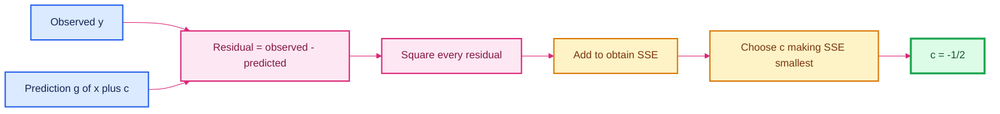

> **Fun fact:** Squaring prevents positive and negative errors from cancelling and penalizes large misses more heavily than small ones.

---

## Question 9 - Reading a Polynomial Graph

Following the intended reading of Figure T-7.1:

- The graph has **7 turning points**
- It has **5 distinct real roots**
- Four roots are crossings
- One root is a touch-and-bounce root

### Part (a): Number of Turning Points

Count each change from decreasing to increasing or increasing to decreasing:

$$\boxed{7\text{ turning points}}$$

### Part (b): Number of Roots

Count distinct places where the curve meets the $x$-axis:

$$\boxed{5\text{ distinct real roots}}$$

### Part (c): Minimum Degree Based on Roots

Four crossing roots need at least multiplicity $1$ each. The touching root must have even multiplicity, at least $2$:

$$1+1+1+2+1=6$$

Therefore:

$$\boxed{\text{root-based minimum degree}=6}$$

If one ignored multiplicity and used only five distinct roots, one would get the weaker bound $n\ge5$. The graph provides enough local behavior to improve it to $n\ge6$.

### Part (d): Minimum Degree Based on Turning Points

A degree-$n$ polynomial has at most $n-1$ turning points:

$$7\le n-1$$

Hence:

$$n\ge8$$

$$\boxed{\text{turn-based minimum degree}=8}$$

### Part (e): Overall Minimum Degree

Both constraints must hold:

$$n\ge6,\qquad n\ge8$$

Thus:

$$\boxed{\text{minimum possible degree}=8}$$

### Part (f): End Behavior and Leading Coefficient

Both ends rise:

$$p(x)\to+\infty \quad\text{as}\quad x\to\pm\infty$$

Therefore the degree is even and the leading coefficient is positive.

$$\boxed{\text{Even degree; positive leading coefficient}}$$

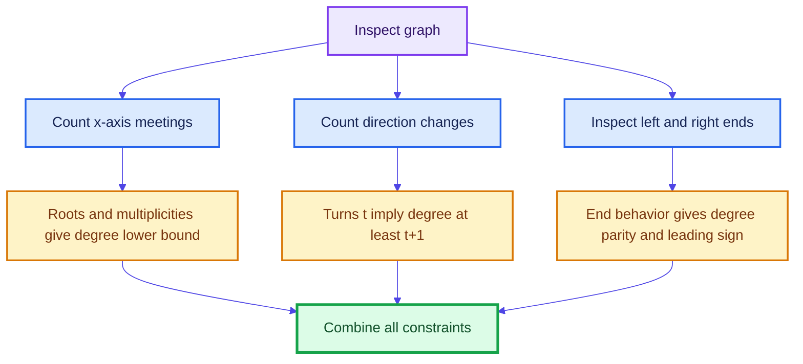

---

## Question 10 - Road and Railway Crossings

### Given

$$P(x)=(x^4-5x^3+6x^2+4x-8)(x^2-15x+50)$$

for $-5\le x\le20$. The railway is the $x$-axis.

### Step 1: Factor the Road Polynomial

First:

$$x^2-15x+50=(x-5)(x-10)$$

For the quartic, $x=2$ is a root:

$$2^4-5(2^3)+6(2^2)+4(2)-8=0$$

Repeated synthetic division gives:

$$x^4-5x^3+6x^2+4x-8=(x-2)^3(x+1)$$

Therefore:

$$\boxed{P(x)=(x+1)(x-2)^3(x-5)(x-10)}$$

### Part 1: Level Crossings

The distinct real roots are:

$$x=-1,\quad2,\quad5,\quad10$$

All lie in $[-5,20]$. Each has odd multiplicity, including $x=2$, whose multiplicity is $3$. Odd multiplicity means the graph crosses the axis.

$$\boxed{4\text{ level crossings}}$$

### Part 2: Turning Points

There must be at least one stationary point between every pair of consecutive distinct roots by Rolle's Theorem:

$$(-1,2),\qquad(2,5),\qquad(5,10)$$

The derivative also vanishes at $x=2$ because the factor $(x-2)^3$ produces a factor $(x-2)^2$ in $P'(x)$. However, the graph crosses at $x=2$; it is a **stationary inflection**, not a turning point.

The degree is $6$, so $P'$ has degree $5$. Counting multiplicity:

- $x=2$ contributes two derivative roots
- The three intervals contribute three more

That accounts for all five derivative roots, so there are exactly three genuine turns.

$$\boxed{3\text{ turning points}}$$

Numerically, the turning points occur near $x\approx-0.357,\ 4.257,\ 8.767$, while $x=2$ is the stationary inflection.

```mermaid
%%{init: {"theme":"base","themeVariables":{"fontFamily":"Arial","lineColor":"#dc2626"}}}%%
flowchart LR
    A["Root -1"] --> B["Turn in (-1,2)"]
    B --> C["Root 2: flat crossing"]
    C --> D["Turn in (2,5)"]
    D --> E["Root 5"]
    E --> F["Turn in (5,10)"]
    F --> G["Root 10"]

    classDef root fill:#fee2e2,stroke:#dc2626,color:#7f1d1d,stroke-width:2px;
    classDef turn fill:#dbeafe,stroke:#2563eb,color:#172554,stroke-width:2px;
    classDef special fill:#fef3c7,stroke:#d97706,color:#78350f,stroke-width:3px;
    class A,E,G root;
    class B,D,F turn;
    class C special;
```

> **Fun fact:** A horizontal tangent does not automatically mean a turning point. The function $x^3$ has derivative $0$ at $x=0$, but it keeps increasing through the point.

---

## Question 11 - Gold-Price Polynomial

### Given

The gold rate in thousands of rupees per gram is:

$$G(t)=0.07t^3-1.4t^2+7t+5$$

The original 8 g chain was sold after 10 months, and a 10 g chain was bought by paying ₹10,000 extra. The same $G(t)$ applies to used and new gold.

### Part 1: Rate After 10 Months

$$G(10)=0.07(10^3)-1.4(10^2)+7(10)+5$$

$$=70-140+70+5=5$$

Since the unit is thousands of rupees per gram:

$$\boxed{G(10)=₹5{,}000\text{ per gram}}$$

Check using the transaction:

$$\text{extra}=10G(10)-8G(10)=2G(10)=₹10{,}000$$

so $G(10)=₹5{,}000$, consistent.

### Part 2: If Sold After 6 Months

$$G(6)=0.07(6^3)-1.4(6^2)+7(6)+5$$

$$=0.07(216)-1.4(36)+42+5$$

$$=15.12-50.4+42+5=11.72$$

Thus the rate would be ₹11,720 per gram.

The buyer needs two additional grams:

$$\text{extra payment}=(10-8)G(6)=2(11.72)\text{ thousand}=23.44\text{ thousand}$$

$$\boxed{₹23{,}440}$$

---

## Question 12 - Skydiver Graph

The graph is a rough height-versus-time model.

### Statement 1: Range is $[-30,3000]$ m

The highest point is the initial height $3000$ m, and the lowest is $30$ m below sea level:

$$\boxed{\text{True}}$$

### Statement 2: Domain Is the Total Journey Time

The horizontal variable is time from the beginning to the end of the journey:

$$\boxed{\text{True}}$$

### Statement 3: Number of Turning Points Is 5

The rough curve shows:
1. Underwater minimum
2. Later maximum
3. Later minimum

There are about three direction changes:

$$\boxed{\text{False; the graph shows 3 turning points}}$$

### Statement 4: Degree Is at Least 6

Three turning points require:

$$n-1\ge3\implies n\ge4$$

The strongest bound visible from the turns is degree at least $4$, not $6$:

$$\boxed{\text{False}}$$

### Final Selection

$$\boxed{\text{Statements 1 and 2 only}}$$

> **Modeling note:** A genuinely constant final interval would make the full journey a piecewise model rather than one nonconstant polynomial. The answer above follows the tutorial's intended rough-graph interpretation.

---

## Question 13 - ECG Graph

The graph is interpreted from $P_1$ to $U_1$, following the labeled rough diagram.

### Part (a): Turning Points

Reading from left to right, the curve has:

1. Peak $P$
2. Small valley after $P$
3. Small peak before $Q$
4. Valley $Q$
5. Peak $R$
6. Valley $S$
7. Small peak on the axis after $S$
8. Small valley before $T$
9. Peak $T$
10. Valley between $T$ and $U$
11. Peak $U$

$$\boxed{11\text{ turning points}}$$

### Minimum Sum of Multiplicities

The graph has ten displayed $x$-axis contacts from $P_1$ through $U_1$. Two contacts are touch-and-bounce roots: the small contact between $P$ and $Q$, and the small contact after $S$. Each needs minimum multiplicity $2$. The other eight displayed contacts require at least multiplicity $1$.

$$\text{minimum sum}=8(1)+2(2)=12$$

$$\boxed{\text{Minimum sum of multiplicities}=12}$$

This is consistent with the turning-point bound:

$$11\text{ turns}\implies n\ge12$$

Because the source calls the graph rough, this count follows the intended visible contacts and treats the boundary contacts $(P_1,U_1)$ as roots of minimum multiplicity $1$.

### Part (b): Polynomial After $U_1$

After $U_1$, the graph lies on the $x$-axis:

$$f(x)=0$$

This is the **zero polynomial**.

$$\boxed{\text{Zero polynomial; its degree is undefined under the course convention}}$$

It is also a constant function, but it is a special constant polynomial because the constant is zero.

---

## Question 14 - Profit Inequality

### Given

$$p(x)=5+150x-46.7x^2+5.44x^3-0.211x^4$$

in thousands of rupees. A month is golden when:

$$p(x)\ge150$$

### Step 1: Move the Threshold to One Side

$$p(x)-150\ge0$$

Let:

$$q(x)=-145+150x-46.7x^2+5.44x^3-0.211x^4$$

The hint gives:

$$q(x)=-a(x-1.7)(x-4.117)(x-8.776)(x-11.189),\qquad a>0$$

### Step 2: Build a Sign Chart

All roots are simple, so the sign alternates at every root. The negative factor $-a$ makes the far-right interval negative:

| Interval | Sign of $q(x)$ |
|----------|---------------:|
| $(-\infty,1.7)$ | Negative |
| $(1.7,4.117)$ | Positive |
| $(4.117,8.776)$ | Negative |
| $(8.776,11.189)$ | Positive |
| $(11.189,\infty)$ | Negative |

Therefore:

$$q(x)\ge0$$

on:

$$[1.7,4.117]\cup[8.776,11.189]$$

### Step 3: Keep Only Integer Month Numbers $(1,\ldots,12)$

**First interval:**
$$x=2,3,4$$

**Second interval:**
$$x=9,10,11$$

These correspond to:

- February, March, April
- September, October, November

$$\boxed{6\text{ golden months}}$$

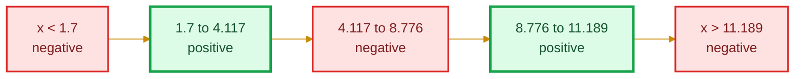

### How to Interpret Inequality Word Problems

1. Translate the phrase: "at least" or "more than or equal to" means $\ge$
2. Move everything to one side
3. Factor or use supplied roots
4. Build a sign chart
5. Intersect the solution with the real-world domain, here integer months $1$ to $12$

---

## Question 15 - Four Real Roots

### Given

$$p(x)=(x^2+kx+4)(x-5)(x-3)$$

The linear factors already give real roots $5$ and $3$. We need the quadratic:

$$x^2+kx+4$$

to have real roots.

### Use the Discriminant

For $ax^2+bx+c$, the discriminant is:

$$\Delta=b^2-4ac$$

Here:

$$a=1,\qquad b=k,\qquad c=4$$

Therefore:

$$\Delta=k^2-16$$

Real roots require $\Delta\ge0$:

$$k^2-16\ge0$$

$$(k-4)(k+4)\ge0$$

Hence:

$$k\le-4\quad\text{or}\quad k\ge4$$

$$\boxed{K=(-\infty,-4]\cup[4,\infty)}$$

$$\boxed{\text{Option A}}$$

At $k=\pm4$, the quadratic has a repeated real root. This is allowed because Question 15 asks for real roots, not distinct roots.

---

## Question 16 - Four Distinct Real Roots

Now all four roots must be distinct.

### Condition 1: The Quadratic Needs Two Distinct Real Roots

$$\Delta=k^2-16>0$$

Thus:

$$k<-4\quad\text{or}\quad k>4$$

### Condition 2: A Quadratic Root Cannot Equal 3

Substitute $x=3$ into $x^2+kx+4$:

$$9+3k+4=0$$

$$13+3k=0 \implies k=-\frac{13}{3}=-\frac{52}{12}$$

Exclude this value.

### Condition 3: A Quadratic Root Cannot Equal 5

$$25+5k+4=0$$

$$29+5k=0 \implies k=-\frac{29}{5}=-5.8$$

Exclude this value.

### Final Set

$$\boxed{K=(-\infty,-5.8)\cup\left(-5.8,-\frac{52}{12}\right)\cup\left(-\frac{52}{12},-4\right)\cup(4,\infty)}$$

$$\boxed{\text{Option C}}$$

```mermaid
%%{init: {"theme":"base","themeVariables":{"fontFamily":"Arial","lineColor":"#7c3aed"}}}%%
flowchart TD
    A[Quadratic factor x^2+kx+4] --> B{Discriminant condition}
    B -- Real roots --> C[k less than or equal to -4, or k at least 4]
    B -- Distinct roots --> D[k less than -4, or k greater than 4]
    D --> E{Does a quadratic root duplicate 3 or 5?}
    E -- Root 3 --> F["Exclude k=-13/3"]
    E -- Root 5 --> G["Exclude k=-29/5"]
    E -- No --> H[Four distinct real roots]

    classDef input fill:#ede9fe,stroke:#7c3aed,color:#2e1065,stroke-width:2px;
    classDef decision fill:#fef3c7,stroke:#d97706,color:#78350f,stroke-width:2px;
    classDef valid fill:#dcfce7,stroke:#16a34a,color:#14532d,stroke-width:3px;
    classDef exclude fill:#fee2e2,stroke:#dc2626,color:#7f1d1d,stroke-width:2px;
    class A input;
    class B,E decision;
    class C,D valid;
    class F,G exclude;
    class H valid;
```

### Discriminant Intuition

The quadratic formula is:

$$x=\frac{-b\pm\sqrt{\Delta}}{2a}$$

- $\Delta>0$: two distinct real roots
- $\Delta=0$: one repeated real root
- $\Delta<0$: no real roots

The discriminant tells us whether the square-root term is positive, zero, or non-real.

---

## Question 17 - Demand Versus Production

### Given

$$d(x)-p(x)=a(x^2+1)(x-2)(x-5.8)(x-11.6),\qquad a>0$$

January is $x=0$, so:

| $x$ | Month |
|----:|-------|
| 0 | January |
| 1 | February |
| 2 | March |
| 3 | April |
| 4 | May |
| 5 | June |
| 6 | July |
| 7 | August |
| 8 | September |
| 9 | October |
| 10 | November |
| 11 | December |

### When Should Production Be Reduced?

Production should be reduced when production exceeds demand:

$$p(x)>d(x)$$

Equivalently:

$$d(x)-p(x)<0$$

### Sign Analysis

Both $a$ and $(x^2+1)$ are always positive, so the sign is determined by:

$$(x-2)(x-5.8)(x-11.6)$$

After March means $x>2$.

#### For $2<x<5.8$:

$$(+)(-)(-)=+$$

Thus $d-p>0$, so demand is greater than production. **Do not reduce.**

#### For $5.8<x<11.6$:

$$(+)(+)(-)=-$$

Thus $d-p<0$, so production exceeds demand. **Reduce production.**

The integer month indices in this interval are:

$$x=6,7,8,9,10,11$$

They correspond to:

$$\boxed{\text{July, August, September, October, November, December}}$$

```mermaid
%%{init: {"theme":"base","themeVariables":{"fontFamily":"Arial","lineColor":"#0891b2"}}}%%
flowchart LR
    A["After March: x > 2"] --> B["2 < x < 5.8<br/>demand > production"]
    B --> C[Keep or increase production]
    A --> D["5.8 < x < 11.6<br/>production > demand"]
    D --> E[Reduce production]
    E --> F[July through December]

    classDef start fill:#ede9fe,stroke:#7c3aed,color:#2e1065,stroke-width:2px;
    classDef demand fill:#dbeafe,stroke:#2563eb,color:#172554,stroke-width:2px;
    classDef surplus fill:#fee2e2,stroke:#dc2626,color:#7f1d1d,stroke-width:2px;
    classDef action fill:#dcfce7,stroke:#16a34a,color:#14532d,stroke-width:3px;
    class A start;
    class B,C demand;
    class D surplus;
    class E,F action;
```

---

## Concept Toolkit

### 1. Roots, Factors, and Multiplicities

$$f(r)=0 \iff r\text{ is a root} \iff x-r\text{ is a factor}$$

If $(x-r)^m$ is a factor:

- $m$ odd: graph crosses the $x$-axis
- $m$ even: graph touches and bounces
- larger $m$: graph becomes flatter near the root

### 2. Degree from a Graph

For a polynomial of degree $n$:

$$\text{number of distinct real roots}\le n$$

$$\text{number of turning points}\le n-1$$

$$\sum(\text{multiplicities of real roots})\le n$$

Therefore, if a graph has $t$ turning points:

$$n\ge t+1$$

Use the **largest** lower bound obtained from roots, multiplicities, and turning points.

### 3. End Behavior

| Degree | Leading coefficient | Left end | Right end |
|--------|--------------------:|----------|-----------|
| Even | Positive | Up | Up |
| Even | Negative | Down | Down |
| Odd | Positive | Down | Up |
| Odd | Negative | Up | Down |

### 4. Remainder Theorem

The remainder when $f(x)$ is divided by $x-a$ is:

$$f(a)$$

Thus:

$$x-a\text{ divides }f(x) \iff f(a)=0$$

### 5. Polynomial Division

$$f(x)=d(x)q(x)+r(x)$$

where:

$$r(x)=0 \quad\text{or}\quad \deg r<\deg d$$

### 6. Discriminant

For $ax^2+bx+c=0$:

$$\Delta=b^2-4ac$$

| Condition | Nature of roots |
|-----------|-----------------|
| $\Delta>0$ | Two distinct real roots |
| $\Delta=0$ | One repeated real root |
| $\Delta<0$ | Two non-real complex roots |

### 7. Polynomial Inequalities

To solve $f(x)\ge0$ or $f(x)<0$:

1. Move all terms to one side
2. Factor
3. Order the real roots
4. Mark multiplicities
5. Determine signs interval by interval
6. Include/exclude endpoints according to $\ge,\le,>,<$
7. Intersect with the real-world domain

### 8. SSE

$$\text{SSE}=\sum_{i=1}^{n}(y_i-\widehat y_i)^2$$

For a model $\widehat y_i=g(x_i)+c$:

$$c_{\text{best}}=\frac1n\sum_{i=1}^{n}[y_i-g(x_i)]$$

### 9. Applied-Model Translations

| Phrase | Mathematical action |
|--------|---------------------|
| Profit | Revenue minus total cost |
| Effective cost | Base cost plus additional/waste cost |
| Material melted into objects | Conserve total volume |
| At least / no less than | $\ge$ |
| Exceeds / more than | $>$ |
| Reduce production | Identify where production $>$ demand |
| Best fit by SSE | Minimize squared residuals |

---

## Final Formula Sheet

$$\boxed{\deg(fg)=\deg f+\deg g}$$

$$\boxed{\deg(f\pm g)\le\max(\deg f,\deg g)}$$

$$\boxed{\deg(\text{exact quotient})=\deg(\text{numerator})-\deg(\text{denominator})}$$

$$\boxed{f(a)=0\iff x-a\text{ is a factor}}$$

$$\boxed{\text{turning points}\le\deg f-1}$$

$$\boxed{\Delta=b^2-4ac}$$

$$\boxed{\text{SSE}=\sum(y_i-\widehat y_i)^2}$$

$$\boxed{\text{Profit}=\text{Revenue}-\text{Cost}}$$

---

## Final Learning Takeaway

The same small set of ideas solves apparently different problems:

- Factor information becomes root information
- Roots and multiplicities become graph behavior
- Turning points and ends reveal degree
- Polynomial signs solve practical inequalities
- Algebraic addition/subtraction builds profit and effective-cost models
- Conservation turns a geometry story into a volume ratio
- SSE converts "best fit" into an optimization problem

**The important habit is to translate the words or diagram into the correct mathematical object before calculating.**