# Exponential, Composite, and Inverse Functions

> **Lecture notes for L5.1–L5.10**  
> Topics: functions, one-to-one tests, exponential functions, the natural exponential function, composite functions, domains, and inverse functions.

---

## Table of Contents

1. [Learning roadmap](#learning-roadmap)
2. [Functions, domain, codomain, and range](#1-functions-domain-codomain-and-range)
3. [One-to-one functions and graphical tests](#2-one-to-one-functions-and-graphical-tests)
4. [Exponential functions](#3-exponential-functions)
5. [Graphing exponential functions](#4-graphing-exponential-functions)
6. [The natural exponential function](#5-the-natural-exponential-function)
7. [Composite functions](#6-composite-functions)
8. [Domains of composite functions](#7-domains-of-composite-functions)
9. [Inverse functions](#8-inverse-functions)
10. [Finding and verifying inverses](#9-finding-and-verifying-inverses)
11. [Master comparison tables](#10-master-comparison-tables)
12. [Practice questions](#11-practice-questions)
13. [Solutions](#12-solutions)
14. [Final revision sheet](#13-final-revision-sheet)

---

## Learning roadmap

The lectures develop one continuous idea:

1. A **function** assigns exactly one output to each allowed input.
2. A **one-to-one function** never assigns the same output to two different inputs.
3. One-to-one functions are important because they can be **reversed**.
4. Exponential functions are strictly increasing or strictly decreasing, so they are one-to-one.
5. Real-world processes often apply one function after another, leading to **composite functions**.
6. A function and its inverse undo each other through composition.

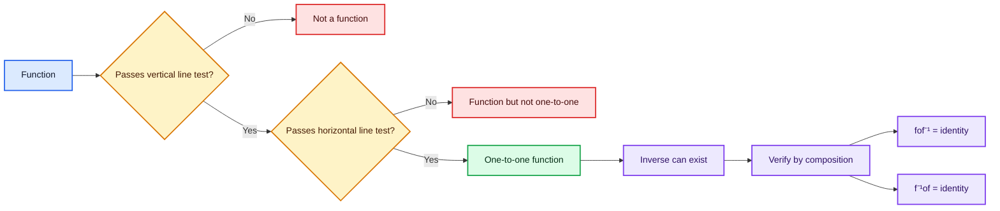

---

# 1. Functions, domain, codomain, and range

## 1.1 What is a function?

A relation from set `A` (domain) to set `B` (codomain) is a **function ONLY if**:

> **Rule 1:** Every element of the domain **must** have an output. (No element left without an arrow.)
> **Rule 2:** Every element of the domain has **exactly one** output. (No element can shoot two arrows.)
**Crucial point:** It **IS allowed** for multiple inputs to share the same output. It is **NOT allowed** for one input to give multiple outputs.

If a function maps a set $A$ to a set $B$, we write

$$
f:A\to B.
$$

Here:

- $A$ is the **domain**.
- $B$ is the **codomain**.
- For an input $x\in A$, the output is $f(x)\in B$.
- The collection of outputs actually produced is the **range** or **image** of $f$.

### Example

Let

$$
f(x)=x^2.
$$

Then:

- $f(2)=4$
- $f(-2)=4$
- $f(3)=9$

This is a function because every input has only one output. The fact that two different inputs can produce the same output does **not** stop it from being a function.

A useful mental model is a machine:

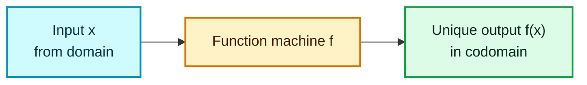

It gives us **4 main cases** 👇


---

# Case 1: One-to-One (Injective) ✔ — Valid Function

Each input goes to a **different** output. No sharing.

- `1 → a`, `2 → b`, `3 → c`
- Example: `f(x) = 2x + 1`

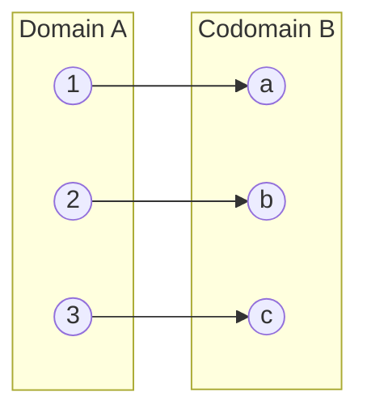
✅ Valid function **and** one-to-one.

---

# Case 2: Many-to-One ✔ — Still a Valid Function (but NOT one-to-one)

**Multiple inputs → the SAME single output.** This is the case you asked about: *"single output has multiple inputs."*

- `−2 → 4`, `2 → 4`, `3 → 9` (two different inputs land on `4`)
- Example: `f(x) = x²` because `f(2) = 4` and `f(−2) = 4`

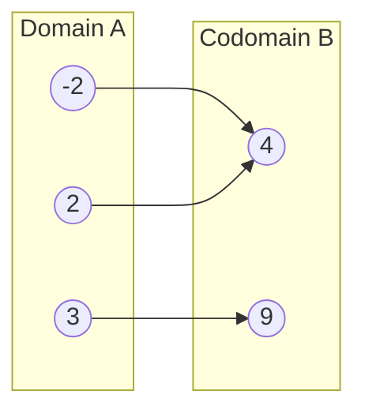
✅ **Still a valid function** (each input has exactly one output).
❌ But it is **not one-to-one**, because output `4` comes from two inputs.

> **This is why the horizontal line test works:** a horizontal line at `y = 4` hits the graph twice → many-to-one → not one-to-one.

---

# Case 3: One-to-Many ✘ — NOT a Function

**One input → multiple outputs.** This is the case you asked about: *"single input has multiple outputs."*

- `1 → a` **and** `1 → b` (input `1` gives two different outputs)
- Example: the relation `x = y²`. For `x = 4`, we get `y = 2` **and** `y = −2`. One input → two outputs.

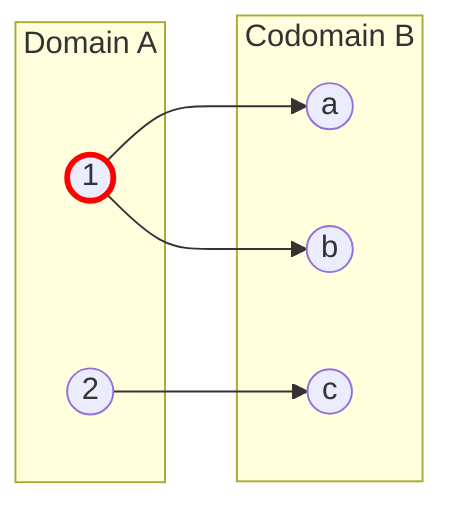
❌ **NOT a function** — input `1` (red) violates Rule 2 by having two arrows.

> **This is why the vertical line test works:** a vertical line at that `x` would hit the graph twice → one-to-many → not a function.

---

# Case 4: Some Input Has NO Output ✘ — NOT a Function

Every element of the domain **must** be used. If even one is left out, it's not a function (from that domain).

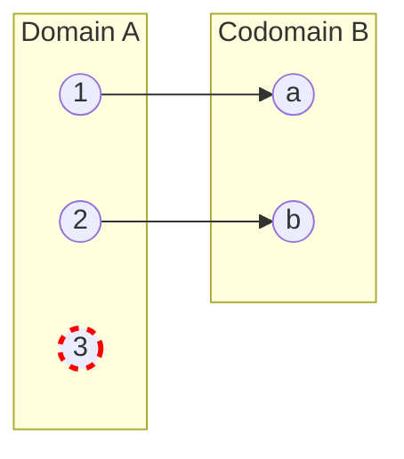
❌ **NOT a function** — input `3` (red, dashed) has no output, violating Rule 1.

---

# Bonus: Onto (Surjective) vs Into

This is about the **codomain**, not about one-to-many.

### Onto (Surjective) ✔
**Every** element of the codomain is hit by at least one arrow. Range = Codomain.
- Example: `f : ℝ → ℝ, f(x) = x³` (every real number is reached).

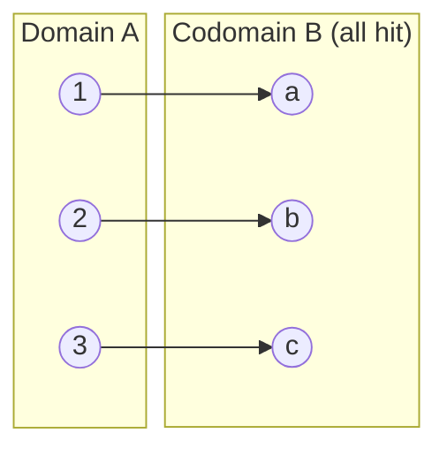

### Into (NOT Onto)
At least one element of the codomain is **never** hit. Range ⊊ Codomain.
- Example: `f : ℝ → ℝ, f(x) = x²` (negative numbers are never reached).

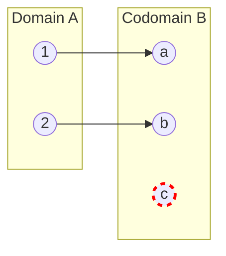
Here `c` (red) is in the codomain but never reached → **into**, not onto.

---

# Bijective = One-to-One AND Onto

Every input maps to a unique output **and** every codomain element is hit. Only bijective functions have a proper inverse function.


✔ One-to-one (no shared output) **and** onto (nothing left in B).

---

# Master Comparison Table

| Case | Description | Example | Function? | One-to-One? |
|---|---|---|---|---|
| One-to-One | each input → unique output | `f(x)=2x+1` | ✅ Yes | ✅ Yes |
| Many-to-One | many inputs → same output | `f(x)=x²` | ✅ Yes | ❌ No |
| One-to-Many | one input → many outputs | `x=y²` | ❌ No | — |
| Input with no output | some input unused | partial mapping | ❌ No | — |
| Onto | all codomain hit | `f(x)=x³` on ℝ | ✅ Yes | depends |
| Bijective | 1-1 + onto | `f(x)=x³` | ✅ Yes | ✅ Yes |

---


---

## 1.2 Domain versus codomain versus range

Consider

$$
f:\mathbb R\to\mathbb R,\qquad f(x)=x^2.
$$

- Domain: $\mathbb R$
- Codomain: $\mathbb R$
- Range: $[0,\infty)$

The codomain is the set in which outputs are declared to lie. The range is the smaller set of values that the function actually reaches.


---

## 1.3 The vertical line test

A graph represents $y=f(x)$ only if every vertical line intersects the graph at **at most one point**.

### Why?

A vertical line has equation $x=c$. If it intersects the graph at two points, then the same input $c$ has two different outputs. That violates the definition of a function.

### Example: circle

The circle

$$
x^2+y^2=1
$$

is not the graph of a single function $y=f(x)$ on $[-1,1]$, because for most values of $x$,

$$
y=\pm\sqrt{1-x^2}.
$$

One input produces two outputs.

---

# 2. One-to-one functions and graphical tests

## 2.1 Definition of a one-to-one function

A function $f$ is **one-to-one**, or **injective**, if different inputs always produce different outputs.

Formally,

$$
x_1\ne x_2 \implies f(x_1)\ne f(x_2).
$$

An equivalent and often more useful statement is

$$
f(x_1)=f(x_2)\implies x_1=x_2.
$$

The second form is the contrapositive of the first and is commonly used in algebraic proofs.

---

## 2.2 Function versus one-to-one function

These are different questions:

| Question | Test | Meaning |
|---|---|---|
| Is the relation a function? | Vertical line test | One input cannot have two outputs. |
| Is the function one-to-one? | Horizontal line test | Two inputs cannot share one output. |

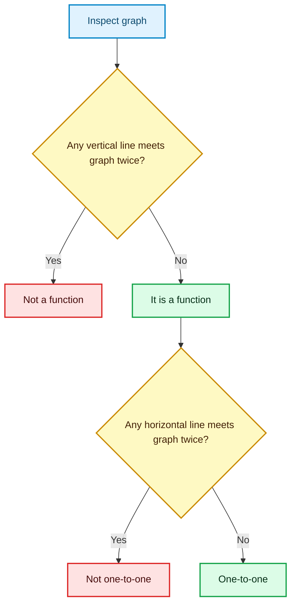

---

## 2.3 Horizontal line test

A function is one-to-one if and only if every horizontal line intersects its graph at at most one point.

### Why does this work?

A horizontal line has equation $y=k$. If it crosses the graph at two points $(x_1,k)$ and $(x_2,k)$, then

$$
f(x_1)=k=f(x_2)
$$

with $x_1\ne x_2$. Therefore, the function is not one-to-one.

---

## 2.4 Example: absolute value

Consider

$$
f(x)=|x|=
\begin{cases}
x, & x\ge 0,\\
-x, & x<0.
\end{cases}
$$

It passes the vertical line test, so it is a function. However,

$$
f(2)=2=f(-2),
$$

so it is not one-to-one.

A horizontal line such as $y=2$ intersects its graph at $x=-2$ and $x=2$.

---

## 2.5 Example: identity function

The identity function is

$$
I(x)=x.
$$

If

$$
I(x_1)=I(x_2),
$$

then

$$
x_1=x_2.
$$

Therefore, the identity function is one-to-one.

---

## 2.6 Example: cubic function

Consider

$$
f(x)=x^3.
$$

It is strictly increasing on all real numbers. Thus, if $x_1<x_2$, then

$$
x_1^3<x_2^3.
$$

Therefore, different inputs produce different outputs, and $f$ is one-to-one.

---

## 2.7 Increasing and decreasing functions


A **monotonic function** is a mathematical function that preserves a given order, meaning it is entirely non-decreasing or entirely non-increasing across its domain. It never changes direction, so it either constantly climbs, stays flat, or constantly drops.

A function is **strictly increasing** if

$$
x_1 < x_2 \implies f(x_1) < f(x_2)
$$

A function is **strictly decreasing** if

$$
x_1 < x_2 \implies f(x_1) > f(x_2)
$$

Every strictly increasing or strictly decreasing function is one-to-one.

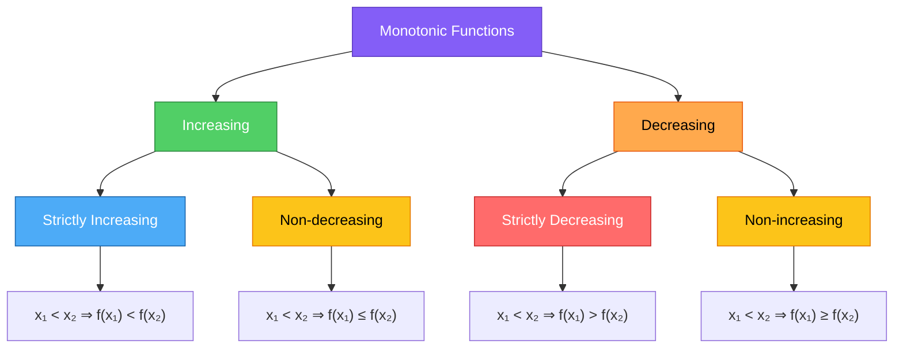

### Proof for a strictly increasing function

Assume $f$ is strictly increasing and suppose

$$
f(x_1)=f(x_2).
$$

If $x_1<x_2$, strict increase would imply $f(x_1)<f(x_2)$, a contradiction. Similarly, $x_2<x_1$ is impossible. Hence,

$$
x_1=x_2.
$$

Therefore, $f$ is one-to-one.

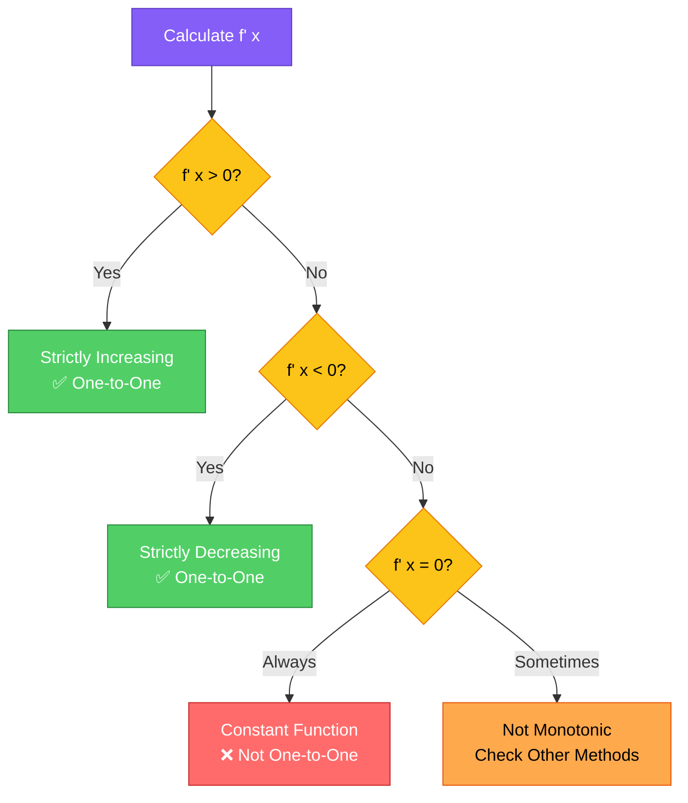

### The Derivative Test Rule

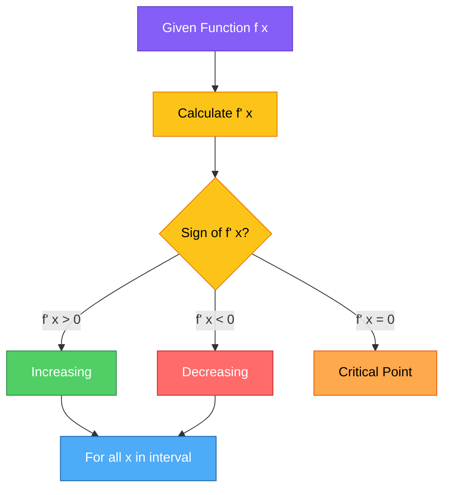

```math
f(x) = x²
f'(x) = 2x

Critical Points:
2x = 0 → x = 0

Sign Analysis:
x < 0: f'(x) < 0 → Decreasing
x > 0: f'(x) > 0 → Increasing

Conclusion:
f is decreasing on (-∞, 0)
f is increasing on (0, ∞)
```

---
| Function | Graph | One-to-One? | Reason |
|----------|-------|-------------|--------|
| $f(x) = \|x\|$ | V-shape | ❌ No | $f(2) = f(-2) = 2$ |
| $f(x) = x$ | Straight line | ✅ Yes | Strictly increasing |
| $f(x) = x^2$ | Parabola | ❌ No (over ℝ) | Horizontal line hits twice |
| $f(x) = x^3$ | Cubic curve | ✅ Yes | Strictly increasing |
| $f(x) = x^2, \; x \geq 0$ | Right half parabola | ✅ Yes | Domain restricted |
---

## 2.8 Why one-to-one functions matter

A one-to-one function can associate each output with a unique original input. This is exactly what is required to define an inverse.

- If $f(2)=4$ and $f(-2)=4$, then reversing the output $4$ is ambiguous.
- If every output corresponds to only one input, reversal is unambiguous.

> **Key idea:** One-to-one means reversible, provided the inverse is defined using the correct domain and range.

### 💡 Fun Fact
> The concept of one-to-one is the mathematical foundation of reversibility. In data science, this is analogous to bijective mappings in database joins — if two different user IDs map to the same email, you cannot uniquely reverse the lookup!
---

# 3. Exponential functions

## 3.1 Exponents with real powers

Before defining an exponential function, we need to understand expressions of the form

$$
f(x) = a^x
$$

where:
- $a > 0$ (base is positive)
- $a \neq 1$ (base cannot be 1)
- $x \in \mathbb{R}$ (exponent is any real number)

### 🤔 Why $a > 0$ and $a \neq 1$?

| Restriction | Reason |
|-------------|--------|
| $a > 0$ | If $a < 0$, then $a^{1/2} = \sqrt{a}$ becomes imaginary (complex). We stay in real numbers. |
| $a \neq 1$ | $1^x = 1$ for all $x$, which is just a **constant function**, not exponential growth/decay. |
| $a \neq 0$ | $0^0$ is undefined; $0^x = 0$ is also trivial/constant for $x > 0$. |


For rational exponents, familiar definitions apply. For example,

$$
2^{3/2}=\sqrt{2^3}=2\sqrt 2.
$$

For irrational exponents such as $5^\pi$, the value can be understood through rational approximations:

$$
3,\ 3.1,\ 3.14,\ 3.141,\ldots\to\pi.
$$

The corresponding sequence

$$
5^3,\ 5^{3.1},\ 5^{3.14},\ 5^{3.141},\ldots
$$

approaches a well-defined limit, which is called $5^\pi$.

This rigorous construction belongs to calculus or real analysis, but the essential intuition is that irrational powers are obtained continuously from rational approximations.

---

## 3.2 Laws of exponents
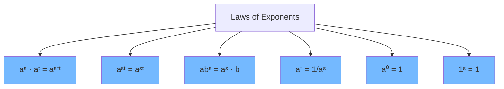

For $a,b>0$ and real numbers $s,t$:

$$
a^s a^t=a^{s+t}
$$

$$
\frac{a^s}{a^t}=a^{s-t}
$$

$$
(a^s)^t=a^{st}
$$

$$
(ab)^s=a^s b^s
$$

$$
a^{-s}=\frac1{a^s}=\left(\frac1a\right)^s
$$

$$
a^0=1
$$

$$
1^s=1.
$$

### Structural intuition

Exponential notation converts:

- multiplication of equal bases into addition of exponents;
- repeated exponentiation into multiplication of exponents.

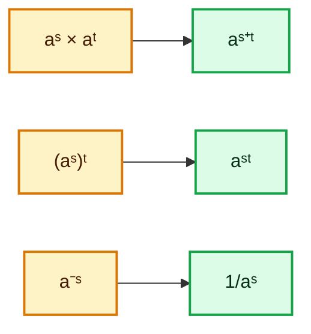

---

## 3.3 Definition of an exponential function

An exponential function in standard form is

$$
f(x)=a^x,
$$

where

$$
a>0\quad\text{and}\quad a\ne1.
$$

The **constant** $a$ is the **base**, and the **variable** $x$ is the **exponent**.

### Why must $a>0$?

A negative base does not produce a real number for every real exponent. For example,

$$
(-1)^{1/2}=i,
$$

which is not real. Restricting to $a>0$ ensures that $a^x$ is real for every real $x$.

### Why exclude $a=1$?

If $a=1$, then

$$
f(x)=1^x=1,
$$

which is a constant function rather than a growth or decay function.

### Why not use $a=0$?

Negative exponents would require division by zero:

$$
0^{-1}=\frac10,
$$

which is undefined. Also, $0^0$ is not assigned the ordinary exponent-law value in this setting. Also, **$0^0$ is undefined**.

---

## 3.4 Two fundamental cases

Every nonconstant real exponential function belongs to one of two classes:

### Exponential growth

$$
a>1.
$$

Then $a^x$ is strictly increasing.

### Exponential decay

$$
0<a<1.
$$

Then $a^x$ is strictly decreasing.

Since both classes are strictly monotonic, every exponential function is one-to-one.

---

# 4. Graphing exponential functions

## 4.1 Universal properties of $f(x)=a^x$

For every valid base $a>0$, $a\ne1$:

- Domain: $\mathbb R$
- Range: $(0,\infty)$
- $y$-intercept: $(0,1)$, because $a^0=1$
- No $x$-intercept, because $a^x>0$
- Horizontal asymptote: $y=0$
- The graph passes through $(1,a)$
- The function is one-to-one

---

## 4.2 Case 1: $a>1$ (Growth)

Example:

$$
f(x)=2^x.
$$

A table of values is

| $x$ | $2^x$ |
|---:|---:|
| $-3$ | $1/8$ |
| $-2$ | $1/4$ |
| $-1$ | $1/2$ |
| $0$ | $1$ |
| $1$ | $2$ |
| $2$ | $4$ |
| $3$ | $8$ |

### End behaviour

$$
\lim_{x\to\infty}a^x=\infty
$$

and

$$
\lim_{x\to-\infty}a^x=0.
$$

The graph approaches the $x$-axis on the left but never touches it.

| Property | Value |
|----------|-------|
| **Domain** | $(-\infty, \infty)$ = $\mathbb{R}$ |
| **Range** | $(0, \infty)$ |
| **y-intercept** | $(0, 1)$ because $a^0 = 1$ |
| **x-intercept** | None |
| **Roots** | None |
| **Behavior as $x \to \infty$** | $f(x) \to \infty$ (rapid growth) |
| **Behavior as $x \to -\infty$** | $f(x) \to 0$ |
| **Monotonicity** | Strictly Increasing |
| **One-to-One** | ✅ Yes |
| **Asymptote** | $y = 0$ (horizontal asymptote) |
| **Key Point** | $(1, a)$ — e.g., $(1, 2)$ for $2^x$ |

---

## 4.3 Case 2: $0<a<1$ (Decay)

Example:

$$
g(x)=\left(\frac15\right)^x=5^{-x}.
$$

This graph is the reflection of $5^x$ across the $y$-axis because replacing $x$ with $-x$ reflects a graph horizontally.

### End behaviour

$$
\lim_{x\to\infty}a^x=0
$$

and

$$
\lim_{x\to-\infty}a^x=\infty.
$$

| Property | Value |
|----------|-------|
| **Domain** | $\mathbb{R}$ |
| **Range** | $(0, \infty)$ |
| **y-intercept** | $(0, 1)$ |
| **x-intercept** | None |
| **Behavior as $x \to \infty$** | $f(x) \to 0$ |
| **Behavior as $x \to -\infty$** | $f(x) \to \infty$ |
| **Monotonicity** | Strictly Decreasing |
| **One-to-One** | ✅ Yes |
| **Asymptote** | $y = 0$ |
| **Key Point** | $(1, a)$ — e.g., $(1, 1/5)$ |

---

## 4.4 Growth versus decay

| Property | $a>1$ | $0<a<1$ |
|---|---|---|
| Behaviour |↗️ Increasing |↘️ Decreasing |
| $x\to\infty$ | $a^x\to\infty$ | $a^x\to0$ |
| $x\to-\infty$ | $a^x\to0$ | $a^x\to\infty$ |
| Domain | $\mathbb R$ | $\mathbb R$ |
| Range | $(0,\infty)$ | $(0,\infty)$ |
| Horizontal asymptote | $y=0$ | $y=0$ |
| One-to-one? | Yes | Yes |
| Graph Shape | J-curve (up-right) | J-curve (up-left) |
| Reflection | — | Reflection of $a > 1$ across y-axis |
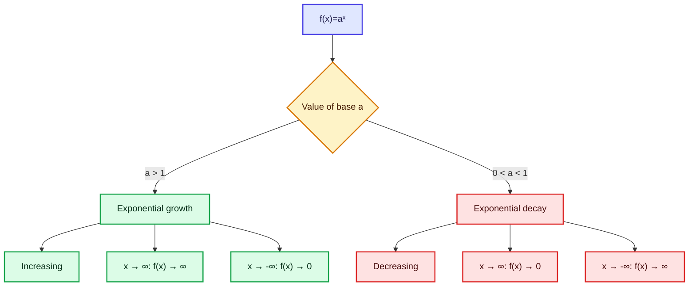

---

## 4.5 Transformations of exponential graphs

For

$$
y=Aa^{B(x-h)}+k,
$$

we can interpret each parameter:

- $A$: vertical scaling; if $A<0$, reflection across the $x$-axis.
- $B$: horizontal scaling; if $B<0$, reflection across the $y$-axis.
- $h$: horizontal shift.
- $k$: vertical shift.
- New horizontal asymptote: $y=k$.

### Example

$$
y=50-100e^{-0.2t}.
$$

Starting from $y=e^t$:

1. Replace $t$ by $-0.2t$: reflect across the $y$-axis and stretch horizontally.
2. Multiply by $-100$: reflect across the $x$-axis and scale vertically.
3. Add $50$: shift upward by 50.
4. The horizontal asymptote becomes $y=50$.

---

# 5. The natural exponential function

## 5.1 Euler’s number $e$

The number $e$ is approximately

$$
e\approx2.718281828\ldots
$$

It is irrational, so its decimal expansion never terminates and never repeats.

One defining limit is

$$
e=\lim_{n\to\infty}\left(1+\frac1n\right)^n.
$$

Approximate values:

| $n$ | $\left(1+\frac1n\right)^n$ |
|---:|---:|
| 1 | 2.0000 |
| 10 | 2.5937 |
| 100 | 2.7048 |
| 1,000 | 2.7169 |
| 10,000 | 2.7181 |
| 100,000 | 2.7182 |

The values approach $e$ as $n$ grows.

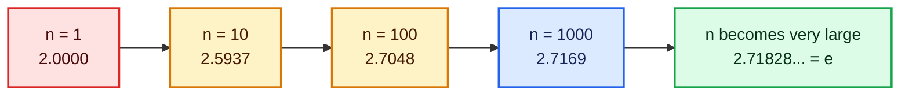

---

## 5.2 Natural exponential function

The natural exponential function is

$$
f(x)=e^x.
$$

Because $e>1$, it has all the properties of an exponential growth function:

- Domain: $\mathbb R$
- Range: $(0,\infty)$
- Passes through $(0,1)$ and $(1,e)$
- Strictly increasing
- Horizontal asymptote: $y=0$
- No roots

---

## 5.3 Why is $e$ called “natural”?

The number $e$ appears naturally in processes whose rate of change is proportional to their current size. Examples include:

- continuous compounding;
- population growth;
- radioactive decay;
- charging and discharging systems;
- differential equations;
- probability distributions and statistics.

The transcript emphasizes continuous compounding and later calculus properties.

---

## 5.4 Continuous compounding

Suppose a principal $P$ earns an annual rate $r$, compounded $n$ times per year for $t$ years. Then

$$
A_n=P\left(1+\frac rn\right)^{nt}.
$$

As compounding becomes infinitely frequent,

$$
A=\lim_{n\to\infty}P\left(1+\frac rn\right)^{nt}
=Pe^{rt}.
$$

This is the continuous compounding formula:

$$
\boxed{A=Pe^{rt}}.
$$

### Example

If you invest $₹1$ at $1%$ interest:
- **Annually:** $1 + 0.01 = 1.01$
- **Quarterly:** $\left(1 + \frac{0.01}{4}\right)^4$
- **Monthly:** $\left(1 + \frac{0.01}{12}\right)^{12}$
- **Continuously:** $\lim_{n \to \infty} \left(1 + \frac{0.01}{n}\right)^n = e^{0.01}$

**General Formula:** After time $t$ at rate $x$:
$$A(t) = e^{xt}$$

This is why $e$ is called **Euler's Number** — it appears naturally in continuous processes.
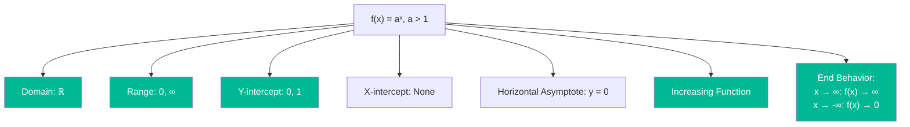
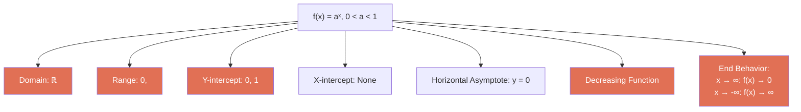
```mermaid
xychart-beta
    title "Exponential Functions: Growth vs Decay"
    x-axis [-3, -2, -1, 0, 1, 2, 3]
    y-axis "Y" 0 --> 10
    line [0.125, 0.5, 1, 2, 4, 8, 16]
    line [8, 4, 2, 1, 0.5, 0.25, 0.125]
```

---

## 5.5 Special calculus properties of $e^x$

These ideas are introduced intuitively in the lecture and become rigorous in calculus.

### Derivative

$$
\frac{d}{dx}e^x=e^x
$$

Thus, the **slope of $y=e^x$ at $x=1$ is**

$$
e^1=e
$$

### Area under $e^x$
The area under $y = e^x$ from $-\infty$ to $1$ equals $e$:
$$
\int_{-\infty}^{1} e^x\,dx=e
$$

### Logarithm Connection
Area under $y = \frac{1}{x}$ from $1$ to $e$ equals **1 unit**.

$$
\int_1^e\frac1x\,dx=1
$$

> **Transcript clarification:** The lecture’s spoken wording around the third area property is garbled, but the intended standard result is the unit area under $y=1/x$ from $1$ to $e$.

---

## 5.6 Real-world response-rate example

Suppose the percentage of people who respond after $t$ minutes is modeled by

$$
R(t)=50-100e^{-0.2t}
$$

### A. What % respond after 10 minutes?

$$
R(10)=50-100e^{-0.2(10)}
=50-100e^{-2}
$$

Since $e^{-2}\approx0.135335$,

$$
R(10)\approx50-13.5335=36.4665
$$

Therefore,

$$
\boxed{R(10)\approx36.47\%}
$$

### B. What is the highest percentage expected? 

As $t\to\infty$,

$$
e^{-0.2t}\to0
$$

Therefore,

$$
R(t)\to50
$$

So 50% is the limiting response rate. The model approaches 50% but does not exceed it for finite $t$.

### C. When does the response reach $30\%$ ($R(t) > 30\%$)?

Set

$$
50-100e^{-0.2t}=30
$$

Then

$$
100e^{-0.2t}=20
$$

and

$$
e^{-0.2t}=\frac15
$$

The lecture estimates the answer graphically as about 8 minutes. Using logarithms as additional context:

$$
-0.2t=\ln\left(\frac15\right)=-\ln5
$$

so

$$
t=\frac{\ln5}{0.2}\approx8.047
$$

Thus,

$$
\boxed{t\approx8.05\text{ minutes}}
$$

---

# 6. Composite functions

```mermaid
flowchart LR
    A["x"] -->|"Input to g"| B["g"]
    B -->|"Output: g(x)"| C{"Is g(x) in<br/>domain of f?"}
    C -->|"Yes"| D["f"]
    C -->|"No"| E["❌ Undefined"]
    D -->|"Output: f(g(x))"| F["(f ∘ g)(x)"]
    
    style F fill:#00b894,color:#fff
    style E fill:#d63031,color:#fff
```

## 6.1 What is function composition?

A **composite function** applies one function to the result of another. It is the mathematical equivalent of **chaining operations**.

For functions $f$ and $g$,

$$
(f\circ g)(x)=f(g(x))
$$

Read this as “$f$ composed with $g$” or “$f$ after $g$.”

The inner function acts first.

```mermaid
flowchart LR
    X["Input x"] --> G["Apply g"]
    G --> GX["Intermediate value g(x)"]
    GX --> F["Apply f"]
    F --> OUT["Final value f(g(x))"]

    classDef input fill:#dbeafe,stroke:#2563eb,color:#172554,stroke-width:2px;
    classDef inner fill:#fef3c7,stroke:#d97706,color:#451a03,stroke-width:2px;
    classDef middle fill:#f3e8ff,stroke:#9333ea,color:#3b0764,stroke-width:2px;
    classDef outer fill:#cffafe,stroke:#0891b2,color:#083344,stroke-width:2px;
    classDef output fill:#dcfce7,stroke:#16a34a,color:#052e16,stroke-width:2px;

    class X input;
    class G inner;
    class GX middle;
    class F outer;
    class OUT output;
```

> **Order matters:** In general,
>
> $$
> f\circ g\ne g\circ f
> $$

---

## 6.2 Real-world discount example

A computer store offers:

1. Pay 85% of the listed price.
2. Then receive an additional ₹3,000 discount.

Let the listed price be $x$.

Define

$$
f(x)=0.85x
$$

and

$$
g(x)=x-3000
$$

Applying the percentage discount first and the flat discount second gives

$$
(g\circ f)(x)=g(f(x))=0.85x-3000
$$

For $x=₹14{,}000$:

$$
(g\circ f)(14{,}000)
=0.85(14{,}000)-3000
=11{,}900-3000
=₹8{,}900
$$

### Does reversing the order matter?

Applying the flat discount first gives

$$
(f\circ g)(x)=f(x-3000)=0.85(x-3000)
$$

For $x=14{,}000$:

$$
(f\circ g)(14{,}000)=0.85(11{,}000)=₹9{,}350
$$

Therefore,

$$
(g\circ f)(14{,}000)\ne(f\circ g)(14{,}000)
$$

The sequence of operations changes the result.

---

## 6.3 Algebraic example

Let

$$
f(x)=3x-4,\qquad g(x)=x^2
$$

### Find $g\circ f$

$$
(g\circ f)(x)=g(f(x))
$$

Since $g(u)=u^2$, replace $u$ by $f(x)=3x-4$:

$$
(g\circ f)(x)=(3x-4)^2
$$

Expanding,

$$
(g\circ f)(x)=9x^2-24x+16
$$

### Find $f\circ g$

$$
(f\circ g)(x)=f(g(x))
$$

Since $f(u)=3u-4$, replace $u$ by $g(x)=x^2$:

$$
(f\circ g)(x)=3x^2-4
$$

Thus,

$$
(g\circ f)(x)\ne(f\circ g)(x)
$$

---

## 6.4 The “box method”

To reduce substitution errors, rewrite a function using a placeholder.

If

$$
f(x)=3x-4
$$

think of it as

$$
f(\square)=3(\square)-4
$$

Then

$$
f(g(x))=3g(x)-4
$$

This method is particularly useful when the inner expression is long.

---

# 7. Domains of composite functions

## 7.1 Domain rule

For

$$
(f\circ g)(x)=f(g(x))
$$

an input $x$ is allowed only if both conditions hold:

1. $x\in\operatorname{Dom}(g)$, i.e., $(x)$ must be in the **domain of $g$**.
2. $g(x)\in\operatorname{Dom}(f)$, i.e., $g(x)$ must be in the **domain of $f$**.

Therefore,

$$
\boxed{\operatorname{Dom}(f\circ g)=\{x\in\operatorname{Dom}(g):g(x)\in\operatorname{Dom}(f)\}}.
$$

```mermaid
flowchart TD
    A[Candidate input x] --> B{"Is x in Dom(g)?"}
    B -- No --> C[Reject x]
    B -- Yes --> D["Compute g(x)"]
    D --> E{"Is g(x) in Dom(f)?"}
    E -- No --> F[Reject x]
    E -- Yes --> G["Accept x in Dom(fog)"]

    classDef candidate fill:#dbeafe,stroke:#2563eb,color:#172554,stroke-width:2px;
    classDef decision fill:#fef3c7,stroke:#d97706,color:#451a03,stroke-width:2px;
    classDef reject fill:#fee2e2,stroke:#dc2626,color:#450a0a,stroke-width:2px;
    classDef process fill:#f3e8ff,stroke:#9333ea,color:#3b0764,stroke-width:2px;
    classDef accept fill:#dcfce7,stroke:#16a34a,color:#052e16,stroke-width:2px;

    class A candidate;
    class B,E decision;
    class C,F reject;
    class D process;
    class G accept;
```

---

## 7.2 Why simplifying first can hide restrictions

An algebraically simplified expression may appear defined at a point that was not allowed in the original composition.

Domain restrictions created before cancellation must be retained.

For example,

$$
\frac{x}{x}=1
$$

only when $x\ne0$. The simplified expression $1$ is defined at $x=0$, but the original expression is not.

---

## 7.3 Worked example

Let

$$
f(x)=\frac{2}{x-1},\qquad g(x)=\frac3x
$$

Find $(f\circ g)(x)$ and its domain.

### Step 1: Compose

$$
(f\circ g)(x)=f\left(\frac3x\right)
=\frac{2}{\frac3x-1}
$$

Simplify:

$$
\frac{2}{\frac{3-x}{x}}
=\frac{2x}{3-x}
$$

Thus,

$$
(f\circ g)(x)=\frac{2x}{3-x}
$$

### Step 2: Apply the inner-domain restriction

Since

$$
g(x)=\frac3x
$$

we must have

$$
x\ne0
$$

### Step 3: Ensure the inner output is allowed by $f$

The function $f(u)=2/(u-1)$ requires

$$
u\ne1
$$

Therefore,

$$
g(x)\ne1
$$

So

$$
\frac3x\ne1
\implies x\ne3
$$

### Final domain

$$
\boxed{\operatorname{Dom}(f\circ g)=\mathbb R\setminus\{0,3\}}
$$

Even though the simplified expression $2x/(3-x)$ appears defined at $x=0$, the original inner function $3/x$ is not. Hence $x=0$ remains excluded.

---

## 7.4 Quick restriction checklist

When finding a composite domain, check:

- denominator $\ne0$;
- even-root radicand $\ge0$;
- logarithm argument $>0$;
- inner output satisfies all outer-function restrictions;
- restrictions lost during algebraic cancellation.

---

## 7.5 Exercise from the lecture

Let

$$
f(x)=\frac1{x+1},\qquad g(x)=\frac1x
$$

Then

$$
(f\circ g)(x)
=f\left(\frac1x\right)
=\frac{1}{\frac1x+1}
=\frac{x}{x+1}
$$

Restrictions:

1. $x\ne0$, because $g(x)=1/x$.
2. $g(x)\ne-1$, because $f(u)=1/(u+1)$.

Thus,

$$
\frac1x\ne-1\implies x\ne-1
$$

Therefore,

$$
\boxed{\operatorname{Dom}(f\circ g)=\mathbb R\setminus\{-1,0\}}
$$

### 💡 Fun Fact
Function composition is the backbone of **Deep Learning**! A neural network is essentially a massive composition of functions: $f_n(f_{n-1}(...(f_1(x))...))$. Each layer applies a linear transformation followed by an activation function — pure composition!

---

# 8. Inverse functions

## 8.1 What does an inverse do?

An **inverse function** $f^{-1}$ "undoes" what $f$ does. If $f$ takes $x$ to $y$, then $f^{-1}$ takes $y$ back to $x$.
An inverse function reverses the effect of the original function.

If

$$
f(a)=b
$$

then

$$
f^{-1}(b)=a
$$

The input and output exchange roles.

```mermaid
flowchart LR
    A[a] -->|f| B[b]
    B -->|f⁻¹| A

    classDef original fill:#dbeafe,stroke:#2563eb,color:#172554,stroke-width:2px;
    classDef output fill:#dcfce7,stroke:#16a34a,color:#052e16,stroke-width:2px;

    class A original;
    class B output;
```

---

## 8.2 Formal definition

The function $f^{-1}$ is the inverse of $f$ if

$$
(f^{-1}\circ f)(x)=x
$$

for every $x$ in the domain of $f$, and

$$
(f\circ f^{-1})(x)=x
$$

for every $x$ in the domain of $f^{-1}$.

Equivalently,

$$
f^{-1}(f(x))=x
$$

and

$$
f(f^{-1}(x))=x
$$

Both compositions must produce the identity function on the appropriate domains. **Inverse exists if and only if $f$ is one-to-one.**

- If $f$ passes the **horizontal line test**, $f^{-1}$ exists.
- If $f$ is strictly increasing or decreasing, $f^{-1}$ exists.


---

## 8.3 Inverse notation warning

The notation

$$
f^{-1}(x)
$$

means the inverse function. It does **not** mean

$$
\frac1{f(x)}
$$

For example, if $f(x)=2x$, then

$$
f^{-1}(x)=\frac x2
$$

whereas

$$
\frac1{f(x)}=\frac1{2x}
$$

These are completely different functions.

---

## 8.4 Why one-to-one is necessary

Consider

$$
f(x)=x^2
$$

on all real numbers. Since

$$
f(2)=4=f(-2)
$$

an inverse would need to send $4$ to both $2$ and $-2$. That would not be a function.

Therefore, $x^2$ has no inverse on $\mathbb R$.

```mermaid
flowchart TD
    A[Function f] --> B{Is f<br/>one-to-one?}
    B -->|No| C[❌ Inverse does NOT exist<br/>or restrict domain]
    B -->|Yes| D[✅ Inverse f⁻¹ exists!]
    
    C --> E["Example: f(x) = x²<br/>Restrict to x ≥ 0<br/>Then inverse exists"]
    D --> F["Example: f(x) = x³<br/>Already one-to-one<br/>Inverse: f⁻¹(x) = ∛x"]
    
    style D fill:#00b894,color:#fff
    style C fill:#d63031,color:#fff
```

### Restricting the domain

If we restrict

$$
f:[0,\infty)\to[0,\infty),\qquad f(x)=x^2
$$

then $f$ becomes one-to-one and

$$
f^{-1}(x)=\sqrt x
$$

Alternatively, restricting the domain to $( -\infty,0]$ gives the inverse

$$
f^{-1}(x)=-\sqrt x
$$

The chosen inverse depends on the original domain restriction.

---

## 8.5 Domain and range swap

```mermaid
graph TD
    A[f: Domain → Range] --> B["Domain(f) = Range(f⁻¹)"]
    A --> C["Range(f) = Domain(f⁻¹)"]
    
    style B fill:#74b9ff,color:#fff
    style C fill:#fd79a8,color:#fff
```
If $f$ has an inverse, then

$$
\operatorname{Dom}(f^{-1})=\operatorname{Range}(f)
$$

and

$$
\operatorname{Range}(f^{-1})=\operatorname{Dom}(f)
$$


```mermaid
flowchart LR
    D[Domain of f] -->|f| R[Range of f]
    R -->|f⁻¹| D
    R -. becomes .-> ID[Domain of f⁻¹]
    D -. becomes .-> IR[Range of f⁻¹]

    classDef domain fill:#dbeafe,stroke:#2563eb,color:#172554,stroke-width:2px;
    classDef range fill:#dcfce7,stroke:#16a34a,color:#052e16,stroke-width:2px;
    classDef inverse fill:#f3e8ff,stroke:#9333ea,color:#3b0764,stroke-width:2px;

    class D domain;
    class R range;
    class ID,IR inverse;
```
| | Original $f$ | Inverse $f^{-1}$ |
|---|----------------|-------------------|
| **Domain** | $A$ | Range of $f$ |
| **Range** | $B$ | Domain of $f$ |

---

## 8.6 Graphical symmetry

If $(a,f(a))$ lies on the graph of $f$, then

$$
(f(a),a)
$$

lies on the graph of $f^{-1}$.

Swapping the coordinates reflects a point across the line

$$
y=x
$$

Therefore, the graphs of $f$ and $f^{-1}$ are mirror images across $y=x$.

### Fixed points

If a point lies on both $f$ and $f^{-1}$, it must often lie on $y=x$, meaning

$$
f(x)=x
$$

These are called fixed points of the function.

---

# 9. Finding and verifying inverses

## 9.1 Standard procedure

To find $f^{-1}$:

1. Write $y=f(x)$.
2. Solve the equation for $x$ in terms of $y$.
3. Swap $x$ and $y$, or rename the solved expression as $f^{-1}(x)$.
4. State the domain and range.
5. Verify both compositions.

```mermaid
flowchart TD
    A["Start with y=f(x)"] --> B[Solve for x]
    B --> C[Swap x and y]
    C --> D["Write f⁻¹(x)"]
    D --> E[Check domains and ranges]
    E --> F["Verify f(f⁻¹(x))=x"]
    E --> G["Verify f⁻¹(f(x))=x"]

    classDef start fill:#dbeafe,stroke:#2563eb,color:#172554,stroke-width:2px;
    classDef algebra fill:#fef3c7,stroke:#d97706,color:#451a03,stroke-width:2px;
    classDef inverse fill:#f3e8ff,stroke:#9333ea,color:#3b0764,stroke-width:2px;
    classDef check fill:#dcfce7,stroke:#16a34a,color:#052e16,stroke-width:2px;

    class A start;
    class B,C algebra;
    class D inverse;
    class E,F,G check;
```

---

## 9.2 Example: linear function

Let

$$
g(x)=4x
$$

Write

$$
y=4x
$$

Solve for $x$:

$$
x=\frac y4
$$

Therefore,

$$
g^{-1}(x)=\frac x4
$$

### Verification

$$
g(g^{-1}(x))=4\left(\frac x4\right)=x
$$

and

$$
g^{-1}(g(x))=\frac{4x}{4}=x
$$

---

## 9.3 Example: cubic function

Let

$$
g(x)=x^3
$$

Then

$$
y=x^3
$$

Solving for $x$:

$$
x=\sqrt[3]{y}
$$

Thus,

$$
g^{-1}(x)=\sqrt[3]{x}=x^{1/3}
$$

Verification:

$$
g(g^{-1}(x))=(\sqrt[3]{x})^3=x
$$

and

$$
g^{-1}(g(x))=\sqrt[3]{x^3}=x
$$

Unlike the square-root identity, the cube-root identity works for every real $x$.

---

## 9.4 Example: $x^2+1$ with a restricted domain

Consider

$$
f(x)=x^2+1
$$

On all real numbers, this function is not one-to-one. Restrict it to

$$
f:[0,\infty)\to[1,\infty)
$$

Write

$$
y=x^2+1
$$

Then

$$
y-1=x^2
$$

Since the original domain requires $x\ge0$, choose the positive square root:

$$
x=\sqrt{y-1}
$$

Therefore,

$$
\boxed{f^{-1}(x)=\sqrt{x-1}},\qquad x\ge1
$$

### Verification 1

$$
f(f^{-1}(x))
=\left(\sqrt{x-1}\right)^2+1
=x.
$$

This requires $x\ge1$, the domain of $f^{-1}$.

### Verification 2

$$
f^{-1}(f(x))
=\sqrt{x^2+1-1}
=\sqrt{x^2}
=|x|
$$

Because the original domain is $x\ge0$, $|x|=x$. Hence the second condition is satisfied.

### Why the negative branch is not the inverse here

If we used

$$
g(x)=-\sqrt{x-1}
$$

then

$$
g(f(x))=-\sqrt{x^2}=-|x|=-x
$$

for $x\ge0$. It does not return $x$, so it is not the inverse of the restricted nonnegative branch.

---

## 9.5 Example: rational function

Let

$$
f(x)=\frac{4x+5}{3x-2}
$$

The original domain is

$$
\mathbb R\setminus\left\{\frac23\right\}
$$

### Step 1: Write $y=f(x)$

$$
y=\frac{4x+5}{3x-2}
$$

### Step 2: Solve for $x$

Multiply both sides by $3x-2$:

$$
y(3x-2)=4x+5
$$

Expand:

$$
3xy-2y=4x+5
$$

Collect the $x$-terms:

$$
3xy-4x=2y+5
$$

Factor:

$$
x(3y-4)=2y+5
$$

Thus,

$$
x=\frac{2y+5}{3y-4}
$$

Therefore,

$$
\boxed{f^{-1}(x)=\frac{2x+5}{3x-4}}
$$

### Domain and range

The inverse denominator cannot be zero:

$$
3x-4\ne0\implies x\ne\frac43
$$

Hence,

$$
\operatorname{Dom}(f^{-1})=\mathbb R\setminus\left\{\frac43\right\}
$$

Therefore, the range of $f$ is

$$
\mathbb R\setminus\left\{\frac43\right\}
$$

Likewise,

$$
\operatorname{Range}(f^{-1})=
\mathbb R\setminus\left\{\frac23\right\}
$$

---

## 9.6 Why both composition checks matter

An expression may undo a function in one direction on a broad-looking formula but fail in the other direction because of:

- domain restrictions;
- branch choices such as $\pm\sqrt{x}$;
- absolute values such as $\sqrt{x^2}=|x|$;
- cancelled factors;
- outputs not covering the intended codomain.

Therefore, always check

$$
f(f^{-1}(x))=x
$$

and

$$
f^{-1}(f(x))=x
$$

on their proper domains.

---

# 10. Master comparison tables

## 10.1 Graphical tests

| Test | Line used | What it checks | Failure means |
|---|---|---|---|
| Vertical line test | $x=c$ | Whether a graph represents a function | One input has multiple outputs |
| Horizontal line test | $y=c$ | Whether a function is one-to-one | Multiple inputs share an output |

---

## 10.2 Function types

| Function | One-to-one on $\mathbb R$? | Reason |
|---|---:|---|
| $f(x)=x$ | Yes | Strictly increasing |
| $f(x)=x^3$ | Yes | Strictly increasing |
| $f(x)=\|x\|$ | No | $f(a)=f(-a)$ |
| $f(x)=x^2$ | No | $f(a)=f(-a)$ |
| $f(x)=a^x, a>1$ | Yes | Strictly increasing |
| $f(x)=a^x, 0<a<1$ | Yes | Strictly decreasing |

---

## 10.3 Exponential function properties

| Property | $f(x)=a^x$ |
|---|---|
| Base condition | $a>0, a\ne1$ |
| Domain | $\mathbb R$ |
| Range | $(0,\infty)$ |
| $y$-intercept | $(0,1)$ |
| $x$-intercepts | None |
| Horizontal asymptote | $y=0$ |
| One-to-one | Yes |
| Inverse | Logarithmic function with base $a$ |

> The logarithmic inverse is the natural next topic after these lectures.

---

## 10.4 Composition and inverse

| Concept | Formula | Main caution |
|---|---|---|
| Composition | $(f\circ g)(x)=f(g(x))$ | Inner function acts first |
| Composite domain | $x\in\operatorname{Dom}(g)$ and $g(x)\in\operatorname{Dom}(f)$ | Simplification may hide restrictions |
| Inverse | $f^{-1}(f(x))=x$ and $f(f^{-1}(x))=x$ | Function must be one-to-one |
| Domain-range swap | $\operatorname{Dom}(f^{-1})=\operatorname{Range}(f)$ | State restrictions clearly |
| Graph symmetry | Reflect across $y=x$ | Coordinates swap |

---

# 11. Practice questions

## A. Concepts

1. Explain the difference between the vertical and horizontal line tests.
2. Why is $f(x)=|x|$ a function but not a one-to-one function?
3. State two equivalent definitions of a one-to-one function.
4. Why must the base of a real exponential function be positive?
5. Why is $a=1$ excluded from the standard definition of an exponential function?
6. What are the domain, range, intercepts, and asymptote of $f(x)=3^x$?
7. Explain why every exponential function $a^x$, with $a>0$ and $a\ne1$, is one-to-one.
8. Why can algebraic simplification fail to show the complete domain of a composite function?
9. Why is $f^{-1}(x)$ not the same as $1/f(x)$?
10. Why does $x^2$ require a domain restriction before it can have an inverse?

## B. Computation

11. Determine whether $f(x)=5x-7$ is one-to-one.
12. Determine whether $f(x)=x^4$ is one-to-one on $\mathbb R$.
13. For $f(x)=2^x$, compute $f(-3), f(0), f(4)$.
14. For $g(x)=(1/3)^x$, describe the end behaviour.
15. Let $f(x)=x+1$ and $g(x)=x^2-1$. Find $g\circ f$ and $f\circ g$.
16. Let $f(x)=1/(x+1)$ and $g(x)=1/x$. Find $f\circ g$ and its domain.
17. Let $f(x)=\sqrt{x}$ and $g(x)=x-4$. Find $f\circ g$ and its domain.
18. Find the inverse of $f(x)=7x-5$.
19. Find the inverse of $f(x)=x^3+2$.
20. Find the inverse of $f(x)=x^2+4$ when the domain is $[0,\infty)$.
21. Verify that $f(x)=3x+2$ and $g(x)=(x-2)/3$ are inverses.
22. For $R(t)=50-100e^{-0.2t}$, calculate $R(5)$.
23. Solve $50-100e^{-0.2t}=40$ using logarithms.
24. Find the domain and range of the inverse of $f(x)=e^x$.

---

# 12. Solutions

## 1–10: Concept answers

1. The vertical line test checks whether each input has at most one output. The horizontal line test checks whether each output comes from at most one input.
2. Every input has one absolute-value output, but $|a|=|-a|$, so different inputs can share an output.
3. $x_1\ne x_2\Rightarrow f(x_1)\ne f(x_2)$, and equivalently $f(x_1)=f(x_2)\Rightarrow x_1=x_2$.
4. A nonpositive base does not give a real value for every real exponent.
5. $1^x=1$, so it is constant rather than a nonconstant growth or decay model.
6. Domain $\mathbb R$, range $(0,\infty)$, $y$-intercept $(0,1)$, no $x$-intercept, asymptote $y=0$.
7. It is strictly increasing when $a>1$ and strictly decreasing when $0<a<1$.
8. Cancellation can remove a visible denominator while the original expression remains undefined at the cancelled value.
9. $f^{-1}$ reverses $f$; $1/f(x)$ is merely its reciprocal.
10. On $\mathbb R$, $x^2$ sends $x$ and $-x$ to the same output, so reversal is ambiguous.

## 11. $f(x)=5x-7$

The function is strictly increasing because its slope is positive. Therefore, it is one-to-one.

## 12. $f(x)=x^4$

It is not one-to-one on $\mathbb R$, because

$$
f(1)=1=f(-1)
$$

## 13. $f(x)=2^x$

$$
f(-3)=2^{-3}=\frac18
$$

$$
f(0)=1
$$

$$
f(4)=16
$$

## 14. $g(x)=(1/3)^x$

Since $0<1/3<1$, the function is decreasing:

$$
x\to\infty\implies g(x)\to0
$$

$$
x\to-\infty\implies g(x)\to\infty
$$

## 15. Composition

Given

$$
f(x)=x+1,\qquad g(x)=x^2-1
$$

we get

$$
(g\circ f)(x)=g(x+1)=(x+1)^2-1=x^2+2x
$$

and

$$
(f\circ g)(x)=f(x^2-1)=x^2
$$

## 16. Rational composite domain

$$
(f\circ g)(x)=\frac{x}{x+1}
$$

The original restrictions are $x\ne0$ and $x\ne-1$. Thus,

$$
\operatorname{Dom}(f\circ g)=\mathbb R\setminus\{-1,0\}
$$

## 17. Square-root composition

$$
(f\circ g)(x)=\sqrt{x-4}
$$

Require

$$
x-4\ge0
$$

so

$$
\operatorname{Dom}(f\circ g)=[4,\infty)
$$

## 18. Inverse of $7x-5$

$$
y=7x-5
$$

implies

$$
x=\frac{y+5}{7}
$$

Therefore,

$$
\boxed{f^{-1}(x)=\frac{x+5}{7}}
$$

## 19. Inverse of $x^3+2$

$$
y=x^3+2
$$

implies

$$
x=\sqrt[3]{y-2}
$$

Thus,

$$
\boxed{f^{-1}(x)=\sqrt[3]{x-2}}
$$

## 20. Inverse of $x^2+4$ on $[0,\infty)$

$$
y=x^2+4
$$

implies

$$
x=\sqrt{y-4}
$$

Therefore,

$$
\boxed{f^{-1}(x)=\sqrt{x-4}},\qquad x\ge4
$$

## 21. Verify linear inverses

Let

$$
f(x)=3x+2,\qquad g(x)=\frac{x-2}{3}
$$

Then

$$
f(g(x))=3\left(\frac{x-2}{3}\right)+2=x
$$

and

$$
g(f(x))=\frac{3x+2-2}{3}=x
$$

Hence, the functions are inverses.

## 22. Evaluate $R(5)$

$$
R(5)=50-100e^{-1}
$$

Since $e^{-1}\approx0.367879$,

$$
R(5)\approx50-36.7879=13.2121
$$

Thus,

$$
\boxed{R(5)\approx13.21\%}
$$

## 23. Solve $R(t)=40$

$$
50-100e^{-0.2t}=40
$$

implies

$$
e^{-0.2t}=0.1
$$

Taking natural logarithms:

$$
-0.2t=\ln(0.1)=-\ln10
$$

Therefore,

$$
t=\frac{\ln10}{0.2}=5\ln10\approx11.513
$$

So

$$
\boxed{t\approx11.51\text{ minutes}}
$$

## 24. Inverse of $e^x$

The range of $e^x$ is $(0,\infty)$, so the inverse has domain $(0,\infty)$. The original domain is $\mathbb R$, so the inverse range is $\mathbb R$.

The inverse is the natural logarithm:

$$
f^{-1}(x)=\ln x
$$

Thus,

$$
\operatorname{Dom}(\ln x)=(0,\infty)
$$

$$
\operatorname{Range}(\ln x)=\mathbb R
$$

---

# 13. Final revision sheet

## Essential definitions

### Function

Each input has exactly one output.

### One-to-one

$$
f(x_1)=f(x_2)\implies x_1=x_2
$$

### Exponential function

$$
f(x)=a^x,\qquad a>0,\ a\ne1
$$

### Natural exponential function

$$
f(x)=e^x,
$$

where

$$
e=\lim_{n\to\infty}\left(1+\frac1n\right)^n
$$

### Composition

$$
(f\circ g)(x)=f(g(x))
$$

### Composite domain

$$
x\in\operatorname{Dom}(g)
\quad\text{and}\quad
g(x)\in\operatorname{Dom}(f)
$$

### Inverse

$$
f^{-1}(f(x))=x
$$

and

$$
f(f^{-1}(x))=x
$$

---

## High-priority exam reminders

1. **Vertical** line test asks: “Is it a function?”
2. **Horizontal** line test asks: “Is it one-to-one?”
3. Strictly increasing or decreasing functions are one-to-one.
4. Every real exponential function is positive and never crosses the $x$-axis.
5. Every exponential graph passes through $(0,1)$.
6. In $(f\circ g)(x)$, apply $g$ first.
7. Composite functions may retain hidden domain exclusions after simplification.
8. An inverse swaps domain and range.
9. $f^{-1}(x)\ne1/f(x)$.
10. Verify an inverse in both directions and respect domain restrictions.

---

## One-page concept map

```mermaid
flowchart TD
    A[Functions] --> B[Domain, codomain, range]
    A --> C[Vertical line test]
    A --> D[One-to-one functions]
    D --> E[Horizontal line test]
    D --> F[Strictly increasing or decreasing]
    F --> G[Exponential functions aˣ]
    G --> H{Base a}
    H -- a greater than 1 --> I[Growth]
    H -- 0 less than a less than 1 --> J[Decay]
    G --> K[Natural exponential eˣ]
    K --> L[Continuous compounding Peʳᵗ]
    A --> M[Composite functions]
    M --> N[fog = f(g(x))]
    N --> O[Check inner domain]
    O --> P[Check inner output in outer domain]
    D --> Q[Inverse functions]
    Q --> R[Domain and range swap]
    Q --> S[Reflection across y=x]
    Q --> T[Verify both compositions]

    classDef root fill:#dbeafe,stroke:#2563eb,color:#172554,stroke-width:2px;
    classDef function fill:#cffafe,stroke:#0891b2,color:#083344,stroke-width:2px;
    classDef injective fill:#dcfce7,stroke:#16a34a,color:#052e16,stroke-width:2px;
    classDef exponential fill:#fef3c7,stroke:#d97706,color:#451a03,stroke-width:2px;
    classDef composite fill:#f3e8ff,stroke:#9333ea,color:#3b0764,stroke-width:2px;
    classDef inverse fill:#ffe4e6,stroke:#e11d48,color:#4c0519,stroke-width:2px;

    class A root;
    class B,C function;
    class D,E,F injective;
    class G,H,I,J,K,L exponential;
    class M,N,O,P composite;
    class Q,R,S,T inverse;
```

---

## Source lecture sequence

- L5.1: One-to-one function definition, tests, and exponential basics
- L5.2: One-to-one examples and theorems
- L5.3: Exponential-function definition and exponent laws
- L5.4: Graphing and analysing exponential functions
- L5.5: Natural exponential function and applications
- L5.6: Composite-function definition and a discount example
- L5.7: Step-by-step composition practice
- L5.8: Domain of composite functions
- L5.9: Inverse-function definition and graphical symmetry
- L5.10: Finding and verifying inverse functions

