# Week 6 — Logarithmic Functions

> Detailed lecture notes based on **W6_L1 to W6_L7**  
> Topics: logarithms as inverse functions, domains and ranges, graphs, transformations, logarithmic laws, change of base, exponential equations, logarithmic equations, inequalities, applications, and verification of solutions.

---

## Source Lectures

1. [W6_L1 — Logarithmic Functions](https://www.youtube.com/watch/G5A7imv2Otc)
2. [W6_L2 — Graphs & Properties of Logarithmic Functions](https://www.youtube.com/watch/NL8MlTO-Yf8)
3. [W6_L3 — Solving Exponential Equations with Logarithms](https://www.youtube.com/watch/Q5ef_uFX7ug)
4. [W6_L4 — Properties & Fundamental Laws of Logarithms](https://www.youtube.com/watch/0WQFcv-wjiI)
5. [W6_L5 — Applications of Logarithmic Laws](https://www.youtube.com/watch/XSJ1QZ0MHOs)
6. [W6_L6 — Change of Base Theorem](https://www.youtube.com/watch/eMt8xq0Fuww)
7. [W6_L7 — Solving Logarithmic Equations & Applications](https://www.youtube.com/watch/bB1um2s0NDE)

---

## Learning Objectives

By the end of these notes, you should be able to:

- explain why a logarithm is the inverse of an exponential function;
- convert fluently between exponential and logarithmic forms;
- identify the correct domain, range, intercepts, asymptotes, and monotonicity of logarithmic functions;
- sketch transformed logarithmic graphs;
- distinguish natural logarithms from common logarithms;
- derive and apply the product, quotient, reciprocal, and power laws;
- use the change-of-base theorem;
- solve exponential and logarithmic equations;
- identify and reject infeasible or extraneous solutions;
- decide when an equation requires algebraic, logarithmic, substitution, or graphical methods.

---

# Table of Contents

1. [Big Picture](#1-big-picture)
2. [Logarithms as Inverses of Exponentials](#2-logarithms-as-inverses-of-exponentials)
3. [Exponential and Logarithmic Forms](#3-exponential-and-logarithmic-forms)
4. [Domain and Range](#4-domain-and-range)
5. [Graphs and Properties](#5-graphs-and-properties)
6. [Graph Transformations](#6-graph-transformations)
7. [Natural and Common Logarithms](#7-natural-and-common-logarithms)
8. [Solving Exponential Equations](#8-solving-exponential-equations)
9. [Fundamental Laws of Logarithms](#9-fundamental-laws-of-logarithms)
10. [Expanding and Combining Logarithms](#10-expanding-and-combining-logarithms)
11. [Change of Base Theorem](#11-change-of-base-theorem)
12. [Solving Logarithmic Equations](#12-solving-logarithmic-equations)
13. [Logarithmic Inequalities](#13-logarithmic-inequalities)
14. [Problem-Solving Decision Guide](#14-problem-solving-decision-guide)
15. [Common Mistakes](#15-common-mistakes)
16. [Data Science and Real-World Connections](#16-data-science-and-real-world-connections)
17. [Python Verification](#17-python-verification)
18. [Quick Revision Sheet](#18-quick-revision-sheet)
19. [Practice Questions](#19-practice-questions)
20. [Solutions](#20-solutions)
21. [Glossary](#21-glossary)

---

# 1. Big Picture

Exponentials answer:

> **What value do we obtain after raising a base to a power?**

Logarithms answer the reverse question:

> **To what power must the base be raised to obtain a given value?**

For example,

$$
2^3=8
$$
asks us to compute the output when the base is $2$ and the exponent is $3$.

The inverse statement is:

$
\log_2 8=3
$

which asks:

> To what power must $2$ be raised to get $8$?

The answer is $3$.

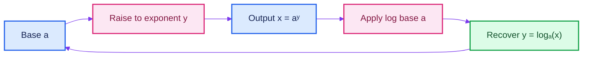

## Why logarithms matter

Logarithms are useful because they:

1. undo exponential operations;
2. convert multiplication into addition;
3. convert powers into multiplication;
4. help solve equations where the unknown appears in an exponent;
5. compress very large numerical ranges;
6. appear in algorithms, information theory, probability, machine learning, finance, acoustics, chemistry, and astronomy.

---

# 2. Logarithms as Inverses of Exponentials

Consider the exponential function

$$
f(x)=a^x
$$

where

$$
a>0,\qquad a\ne1
$$

These restrictions are essential.

## Why must $a>0$?

For a negative base, expressions such as

$$
(-1)^{1/2}
$$

are not real numbers. Restricting $a>0$ ensures that $a^x$ is real-valued for every real $x$.

## Why must $a\ne1$?

If $a=1$, then

$$
f(x)=1^x=1
$$

for every $x$. This is a constant function, not one-to-one, and therefore does not possess an inverse function over the entire real line.

## Why does $a^x$ have an inverse?

For either permissible case,

$$
a>1
$$

or

$$
0<a<1
$$

the function $a^x$ is strictly monotonic:

- strictly increasing when $a>1$;
- strictly decreasing when $0<a<1$.

Every strictly monotonic function is one-to-one. Therefore, $a^x$ passes the horizontal-line test and has an inverse.

The inverse is called the logarithmic function:

$$
f^{-1}(x)=\log_a x
$$

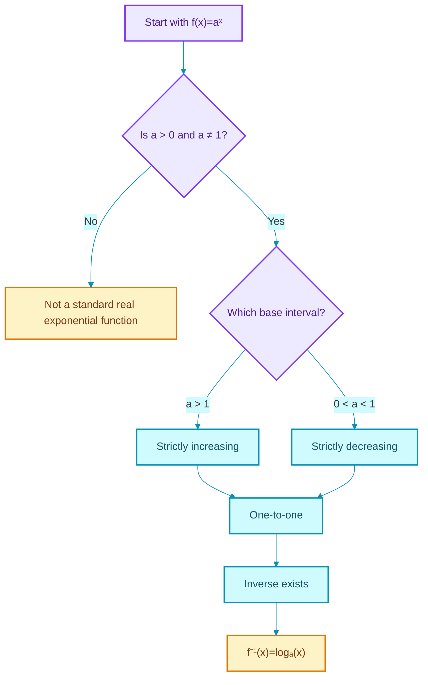

---

# 3. Exponential and Logarithmic Forms

The central equivalence is

$$
\boxed{\log_a x=y\iff a^y=x}
$$

subject to

$$
a>0,\qquad a\ne1,\qquad x>0
$$

The transcript calls a visual memory aid for this equivalence the **“7 rule”**: begin at the base, move toward the exponent, and return to the argument.

## Anatomy of a logarithm

In

$$
\log_a x=y
$$

- $a$ is the **base**;
- $x$ is the **argument**;
- $y$ is the **logarithmic value** or exponent.

It means:

$$
\text{base}^{\text{answer}}=\text{argument}
$$

## Examples

### Example 1

$$
\log_2 8=3
$$

because

$$
2^3=8
$$

### Example 2

$$
\log_3 \frac{1}{9}=-2
$$

because

$$
3^{-2}=\frac{1}{3^2}=\frac{1}{9}.
$$

### Example 3

$$
\log_5 1=0
$$

because

$$
5^0=1.
$$

### Example 4

$$
\log_7 7=1
$$

because

$$
7^1=7
$$

## Inverse identities

Because logarithmic and exponential functions undo each other,

$$
\boxed{a^{\log_a x}=x},\qquad x>0
$$

and

$$
\boxed{\log_a(a^x)=x},\qquad x\in\mathbb R
$$

The domain conditions differ:

- $a^{\log_a x}=x$ requires $x>0$, because $\log_a x$ must exist;
- $\log_a(a^x)=x$ is valid for every real $x$, because $a^x>0$.

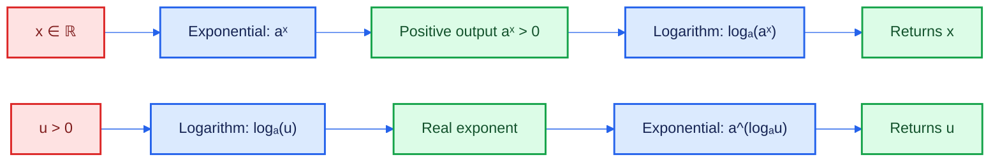

---

# 4. Domain and Range

## Exponential function

For

$$
f(x)=a^x
$$

$$
\operatorname{Dom}(f)=\mathbb R
$$

and

$$
\operatorname{Range}(f)=(0,\infty)
$$

## Logarithmic function

Since the inverse swaps the domain and range,

$$
f^{-1}(x)=\log_a x
$$

has

$$
\boxed{\operatorname{Dom}(\log_a x)=(0,\infty)}
$$

and

$$
\boxed{\operatorname{Range}(\log_a x)=\mathbb R}
$$

Therefore:

- $\log_a(0)$ is not defined;
- $\log_a(-4)$ is not defined in the real-number system;
- the argument of every real logarithm must be **strictly positive**.

## Master domain rule

For a function

$$
f(x)=\log_a(g(x))
$$

the domain is determined by

$$
\boxed{g(x)>0}
$$

Notice the strict inequality. It is not enough for $g(x)\ge0$.

## Example 1: $\log_4(1-x)$

Require

$$
1-x>0
$$

Thus,

$$
x<1
$$

Therefore,

$$
\boxed{\operatorname{Dom}(f)=(-\infty,1)}
$$

## Example 2: $\log_3\left(\frac{1+x}{1-x}\right)$

Require

$$
\frac{1+x}{1-x}>0
$$

Critical points:

$$
x=-1,\qquad x=1
$$

Use a sign chart.

| Interval | $1+x$ | $1-x$ | Quotient |
|---|---:|---:|---:|
| $(-\infty,-1)$ | $-$ | $+$ | $-$ |
| $(-1,1)$ | $+$ | $+$ | $+$ |
| $(1,\infty)$ | $+$ | $-$ | $-$ |

At $x=-1$, the argument is $0$, which is invalid.  
At $x=1$, the denominator is $0$, which is invalid.

Therefore,

$$
\boxed{\operatorname{Dom}(f)=(-1,1)}
$$

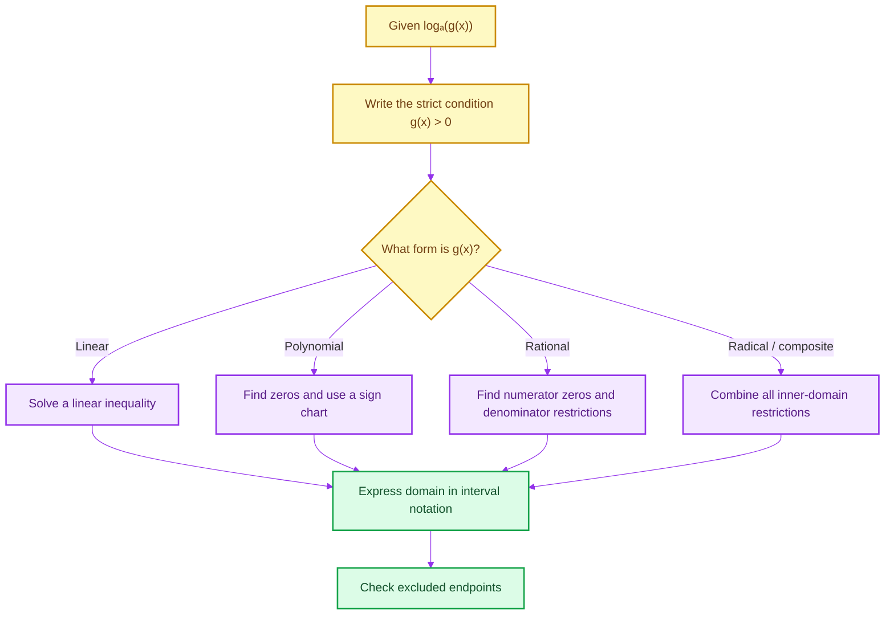

---

# 5. Graphs and Properties

The graph of

$$
y=\log_a x
$$

is the reflection of

$$
y=a^x
$$

across the line

$$
y=x
$$

Reflection swaps every point $(p,q)$ with $(q,p)$.

Thus:

$$
(0,1)\text{ on }y=a^x
$$

becomes

$$
(1,0)\text{ on }y=\log_a x
$$

and

$$
(1,a)
$$

becomes

$$
(a,1)
$$

## Standard properties

| Property | $y=\log_a x$ |
|---|---|
| Base condition | $a>0,\ a\ne1$ |
| Domain | $(0,\infty)$ |
| Range | $\mathbb R$ |
| $x$-intercept | $(1,0)$ |
| $y$-intercept | None |
| Vertical asymptote | $x=0$ |
| One-to-one | Yes |
| Fixed points | $(1,0)$, $(a,1)$ |
| Increasing | $a>1$ |
| Decreasing | $0<a<1$ |

## Case 1: $a>1$

The logarithm is strictly increasing.

$$
x_1<x_2\implies \log_a x_1<\log_a x_2
$$

End behaviour:

$$
\lim_{x\to0^+}\log_a x=-\infty
$$

$$
\lim_{x\to\infty}\log_a x=\infty
$$

## Case 2: $0<a<1$

The logarithm is strictly decreasing.

$$
x_1<x_2\implies \log_a x_1>\log_a x_2
$$

End behaviour:

$$
\lim_{x\to0^+}\log_a x=\infty
$$

$$
\lim_{x\to\infty}\log_a x=-\infty
$$

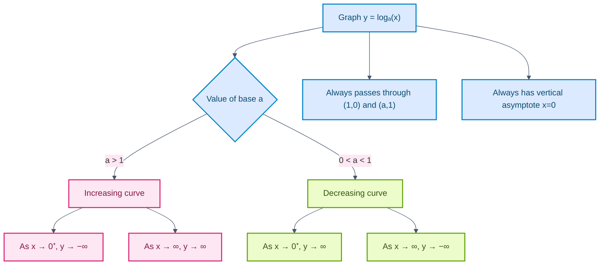

---

# 6. Graph Transformations

Start with the parent function:

$$
y=\log_a x
$$

For a transformed function

$$
y=A\log_a(B(x-h))+k
$$

work from the inside outward.

## Transformation rules

| Change | Graph effect |
|---|---|
| $\log_a(x-h)$ | shift right by $h$ |
| $\log_a(x+h)$ | shift left by $h$ |
| $\log_a(-x)$ | reflect across the $y$-axis |
| $-\log_a x$ | reflect across the $x$-axis |
| $\log_a x+k$ | shift upward by $k$ |
| $\log_a x-k$ | shift downward by $k$ |
| $c\log_a x$ | vertical scaling by factor $|c|$ |
| $\log_a(cx)$ | horizontal scaling, with domain condition $cx>0$ |

## The transformed asymptote

The vertical asymptote is found where the logarithmic argument is zero.

For

$$
y=\log_a(x-h)
$$

the argument is zero at $x=h$, so the vertical asymptote is

$$
x=h
$$

## Example 1

$$
f(x)=-\log_4(x+1)
$$

### Step 1: Parent graph

$$
y=\log_4 x
$$

is increasing because $4>1$.

### Step 2: Replace $x$ with $x+1$

Shift left by one unit:

$$
y=\log_4(x+1)
$$

The asymptote moves from

$$
x=0
$$

to

$$
x=-1
$$

The point $(1,0)$ moves to $(0,0)$.

The point $(4,1)$ moves to $(3,1)$.

### Step 3: Multiply by $-1$

Reflect across the $x$-axis:

$$
f(x)=-\log_4(x+1)
$$

The point $(3,1)$ becomes $(3,-1)$.

Domain:

$$
x+1>0\implies x>-1
$$

Therefore,

$$
\operatorname{Dom}(f)=(-1,\infty)
$$

## Example 2

$$
g(x)=\log_{1/4}(1-x)+1
$$

The argument requires

$$
1-x>0\implies x<1
$$

Thus the vertical asymptote is

$$
x=1
$$

Because the base satisfies

$$
0<\frac14<1
$$

the parent logarithmic graph is decreasing.

Replacing $x$ by $-x$ reflects across the $y$-axis, and adding $1$ shifts the result upward.

> **Transcript clarification:** In spoken graph descriptions, “reflection along the $x$-axis” and “reflection along the $y$-axis” are occasionally interchanged before being corrected. The reliable algebraic rules are:
>
> - $f(-x)$: reflection across the $y$-axis;
> - $-f(x)$: reflection across the $x$-axis.

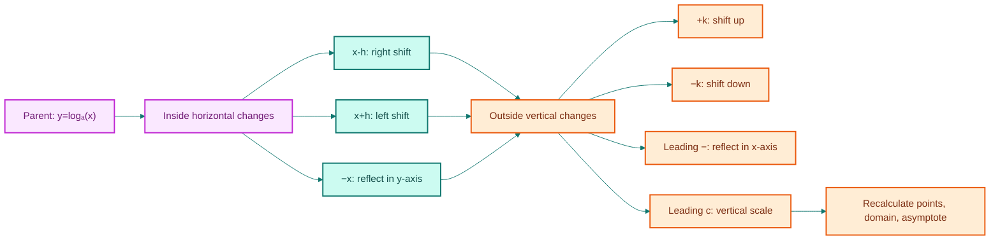

---

# 7. Natural and Common Logarithms

## Natural logarithm

The logarithm to base $e$ is called the natural logarithm:

$$
\boxed{\ln x=\log_e x}
$$

Here,

$$
e\approx2.718281828\ldots
$$

The inverse identities become

$$
\ln(e^x)=x,\qquad x\in\mathbb R
$$

and

$$
e^{\ln x}=x,\qquad x>0
$$

Natural logarithms occur naturally in:

- calculus;
- differential equations;
- continuous growth and decay;
- continuous compounding;
- probability distributions;
- maximum likelihood;
- information theory.

## Common logarithm

The base-$10$ logarithm is called the common logarithm:

$$
\boxed{\log x=\log_{10}x}
$$

when the convention is explicitly base $10$.

Common logarithms are convenient for decimal orders of magnitude.

For example,

$$
\log_{10}(1000)=3
$$

## Calculator notation

- `ln` means $\log_e$;
- `log` commonly means $\log_{10}$.

In software libraries, conventions may differ, so always check the documentation.

---

# 8. Solving Exponential Equations

An exponential equation contains the unknown in an exponent.

## Strategy hierarchy

1. simplify algebraically;
2. rewrite both sides with a common base;
3. use one-to-one behaviour to equate exponents;
4. if bases cannot be matched, take logarithms;
5. use substitution if the equation is quadratic in $a^x$;
6. use a graph or numerical method if algebra does not isolate $x$;
7. verify every candidate.

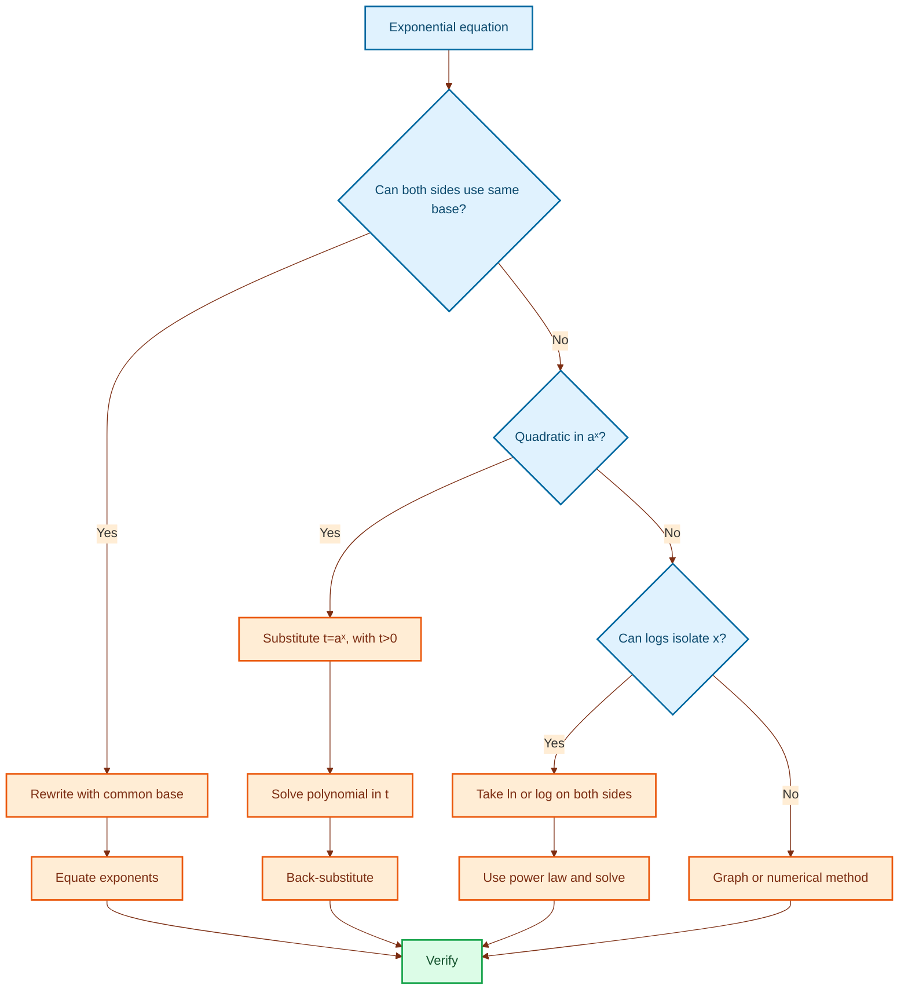

## Example 1: Common base

Solve

$$
2^{x+1}=64
$$

Since

$$
64=2^6
$$

we have

$$
2^{x+1}=2^6
$$

The exponential function is one-to-one, so

$$
x+1=6
$$

Therefore,

$$
\boxed{x=5}
$$

## Example 2: Natural exponential with a quadratic exponent

The lecture example corresponds to

$$
e^{-x^2}=e^{2x-3}
$$

Since the bases are the same,

$$
-x^2=2x-3
$$

Move all terms to one side:

$$
x^2+2x-3=0
$$

Factor:

$$
(x+3)(x-1)=0.
$$

Therefore,

$$
\boxed{x=-3\text{ or }x=1}
$$

> **Transcript clarification:** The transcript momentarily states $x^2=2x-3$, but the subsequent quadratic and answers correspond to the correct relation $-x^2=2x-3$.

## Example 3: Quadratic in exponential form

Solve

$$
9^x-2\cdot3^{x+1}-27=0
$$

Rewrite:

$$
9^x=(3^2)^x=(3^x)^2
$$

and

$$
2\cdot3^{x+1}=2\cdot3\cdot3^x=6\cdot3^x
$$

Thus,

$$
(3^x)^2-6(3^x)-27=0
$$

Let

$$
t=3^x
$$

Because $3^x>0$, we must enforce

$$
t>0
$$

The equation becomes

$$
t^2-6t-27=0
$$

Factor:

$$
(t-9)(t+3)=0
$$

Candidates:

$$
t=9,\qquad t=-3
$$

Reject $t=-3$, because $3^x$ cannot be negative.

Therefore,

$$
3^x=9=3^2
$$

so

$$
\boxed{x=2}
$$

## Example 4: Different bases

Solve

$$
5^{x-2}=3^{3x+2}
$$

Take natural logarithms:

$$
\ln(5^{x-2})=\ln(3^{3x+2})
$$

Apply the power law:

$$
(x-2)\ln5=(3x+2)\ln3
$$

Expand:

$$
x\ln5-2\ln5=3x\ln3+2\ln3
$$

Collect \(x\)-terms:

$$
x(\ln5-3\ln3)=2\ln5+2\ln3
$$

Therefore,

$$
x=\frac{2(\ln5+\ln3)}{\ln5-3\ln3}
$$

Using logarithm laws,

$$
\ln5+\ln3=\ln15
$$

and

$$
3\ln3=\ln27
$$

Thus,

$$
\boxed{x=\frac{2\ln15}{\ln(5/27)}}
$$

which is equivalent to

$$
\boxed{x=-\frac{2\ln15}{\ln(27/5)}}
$$

## Example 5: No elementary closed form in the lecture method

Solve approximately:

$$
x+e^x=2
$$

Rearrange:

$$
e^x=2-x
$$

Taking logs gives

$$
x=\ln(2-x)
$$

which still contains $x$ on both sides.

Define

$$
h(x)=x+e^x-2
$$

The solution is where $h(x)=0$. A graphing tool gives

$$
\boxed{x\approx0.443}
$$

This illustrates that logarithms are powerful, but not every transcendental equation becomes algebraically solvable.

---

# 9. Fundamental Laws of Logarithms

Assume throughout:

$$
a>0,\qquad a\ne1,\qquad m>0,\qquad n>0,\qquad r\in\mathbb R
$$

## 9.1 Product law

$$
\boxed{\log_a(mn)=\log_a m+\log_a n}
$$

### Why it works

Let

$$
p=\log_a m,\qquad q=\log_a n
$$

Then

$$
m=a^p,\qquad n=a^q
$$

Therefore,

$$
mn=a^p a^q=a^{p+q}
$$

Taking $\log_a$ gives

$$
\log_a(mn)=p+q
$$

hence

$$
\log_a(mn)=\log_a m+\log_a n
$$

## 9.2 Quotient law

$$
\boxed{\log_a\left(\frac mn\right)=\log_a m-\log_a n}
$$

because

$$
\frac mn=\frac{a^p}{a^q}=a^{p-q}
$$

## 9.3 Reciprocal law

$$
\boxed{\log_a\left(\frac1n\right)=-\log_a n}
$$

because

$$
\log_a\left(\frac1n\right)
=\log_a1-\log_a n
=0-\log_a n.
$$

## 9.4 Power law

$$
\boxed{\log_a(m^r)=r\log_a m}
$$

For a positive integer $r$,

$$
m^r=\underbrace{m\cdot m\cdots m}_{r\text{ times}}
$$

so the product law gives $r$ copies of $\log_a m$.

For rational and irrational $r$, a complete proof uses the extension of exponents and continuity, which belongs to calculus or real analysis.

## Special values

$$
\boxed{\log_a1=0}
$$

because

$$
a^0=1
$$

and

$$
\boxed{\log_a a=1}
$$

because

$$
a^1=a
$$

## Fun fact: Why logarithms were historically valuable

Before electronic calculators, logarithm tables transformed difficult multiplication into addition:

$$
\log(mn)=\log m+\log n
$$

Astronomers, navigators, and engineers could add logarithms and then use an antilogarithm table instead of directly multiplying very large numbers.

> Historical note: The transcript broadly associates the motivation with astronomical computation. Logarithms were developed in the early seventeenth century, particularly through the work of John Napier and Henry Briggs.

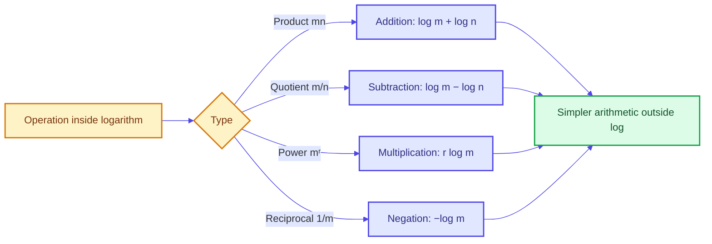

---

# 10. Expanding and Combining Logarithms

## 10.1 Expanding a logarithm

Expand

$$
\log_a\left(
\frac{x^3\sqrt{x^2+1}}{(x+3)^4}
\right)
$$

Write the square root as a power:

$$
\sqrt{x^2+1}=(x^2+1)^{1/2}
$$

Apply the quotient law:

$$
\log_a\left(x^3(x^2+1)^{1/2}\right)
-\log_a\left((x+3)^4\right)
$$

Apply the product law:

$$
\log_a(x^3)
+\log_a\left((x^2+1)^{1/2}\right)
-\log_a\left((x+3)^4\right)
$$

Apply the power law:

$$
\boxed{
3\log_a x
+\frac12\log_a(x^2+1)
-4\log_a(x+3)
}
$$

Domain requirements include:

$$  
x>0,\qquad x+3>0.
$$

The first condition already implies the second, so the expanded real expression requires $x>0$.

## 10.2 Combining logarithms

Combine:

$$
2\log_a x+\log_a9+\log_a(x^2+1)-\log_a5
$$

Use the power law in reverse:

$$
2\log_a x=\log_a(x^2)
$$

Then use product and quotient laws:

$$
\log_a(x^2)+\log_a9+\log_a(x^2+1)-\log_a5
$$

$$
=\log_a\left(
\frac{9x^2(x^2+1)}5
\right)
$$

Thus,

$$
\boxed{
2\log_a x+\log_a9+\log_a(x^2+1)-\log_a5
=
\log_a\left(\frac{9x^2(x^2+1)}5\right)
}
$$

## What cannot be split

There is no standard law that simplifies

$$
\log_a(m+n)
$$

into a sum of separate logarithms.

In particular,

$$
\boxed{\log_a(m+n)\ne\log_a m+\log_a n}
$$

Similarly,

$$
\boxed{\log_a(m-n)\ne\log_a m-\log_a n}
$$

The product and quotient laws apply only when multiplication or division occurs **inside** the logarithm.

---

# 11. Change of Base Theorem

For valid bases $a$ and $b$,

$$
a>0,\quad a\ne1,\quad b>0,\quad b\ne1
$$

and $x>0$,

$$
\boxed{\log_a x=\frac{\log_b x}{\log_b a}}
$$

Using natural logarithms:

$$
\boxed{\log_a x=\frac{\ln x}{\ln a}}
$$

Using common logarithms:

$$
\boxed{\log_a x=\frac{\log x}{\log a}}
$$

## Derivation

Let

$$
y=\log_a x
$$

Then

$$
a^y=x
$$

Take $\log_b$ of both sides:

$$
\log_b(a^y)=\log_b x
$$

Use the power law:

$$
y\log_b a=\log_b x
$$

Therefore,

$$
y=\frac{\log_b x}{\log_b a}
$$

Since $y=\log_a x$,

$$
\boxed{\log_a x=\frac{\log_b x}{\log_b a}}
$$

## Example 1

$$
\log_5 89
=
\frac{\ln89}{\ln5}
\approx2.788
$$

The transcript rounds this to approximately $2.78$.

## Example 2

$$
\log_{\sqrt2}\sqrt5
=
\frac{\ln\sqrt5}{\ln\sqrt2}
$$

Because

$$
\ln\sqrt5=\frac12\ln5
$$

and

$$
\ln\sqrt2=\frac12\ln2
$$

we get

$$
\log_{\sqrt2}\sqrt5
=
\frac{\ln5}{\ln2}
=
\log_2 5
\approx2.322
$$

## Graphing an arbitrary base

To graph

$$
y=\log_2 x
$$

using a calculator that only supports $\ln$, write

$$
y=\frac{\ln x}{\ln2}
$$

Since $1/\ln2$ is a positive constant, the graph has the same qualitative shape as $\ln x$, but is vertically scaled.

## Important warning

Do not confuse

$$
\ln\left(\frac xa\right)
$$

with

$$
\frac{\ln x}{\ln a}
$$

They mean different things:

$$
\ln\left(\frac xa\right)=\ln x-\ln a,
$$

whereas

$$
\frac{\ln x}{\ln a}=\log_a x
$$

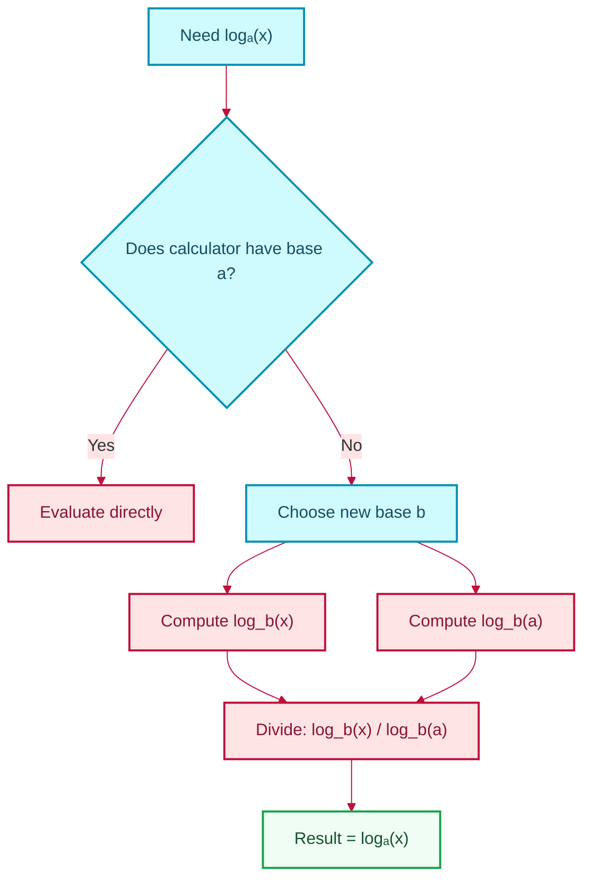

---

# 12. Solving Logarithmic Equations

## Essential workflow

1. state domain restrictions;
2. simplify with logarithmic laws;
3. make bases common if necessary;
4. exponentiate or use one-to-one behaviour;
5. solve the resulting algebraic equation;
6. test every candidate in the original equation.

The domain check is not optional. Algebraic manipulation can produce values for which an original logarithm is undefined.

## Example 1

Solve

$$
2\log_{0.5}x=\log_{0.5}4
$$

Domain:

$$
x>0.
$$

Apply the power law:

$$
\log_{0.5}(x^2)=\log_{0.5}4
$$

Since $\log_{0.5}$ is one-to-one,

$$
x^2=4
$$

So algebra gives

$$
x=\pm2
$$

But the domain requires $x>0$. Therefore,

$$
\boxed{x=2}
$$

Notice that the decreasing nature of $\log_{0.5}$ does not affect equality. Equal outputs still imply equal inputs because the function is one-to-one.

## Example 2

Solve

$$
\log_8(x+1)+\log_8(x-1)=1
$$

### Domain

$$
x+1>0
$$  

and

$$
x-1>0
$$

Together,

$$
x>1
$$

### Combine

$$
\log_8\left((x+1)(x-1)\right)=1
$$

Thus,

$$
\log_8(x^2-1)=1
$$

Convert to exponential form:

$$
x^2-1=8^1=8
$$

Therefore,

$$
x^2=9
$$

so

$$
x=\pm3
$$

Only $x=3$ satisfies $x>1$. Hence,

$$
\boxed{x=3}
$$

## Example 3: Different bases

Solve

$$
\log_3x+\log_4x=4
$$

Domain:

$$
x>0.
$$

Apply change of base:

$$
\frac{\ln x}{\ln3}+\frac{\ln x}{\ln4}=4
$$

Factor $\ln x$:

$$
\ln x\left(\frac1{\ln3}+\frac1{\ln4}\right)=4
$$

Thus,

$$
\ln x
=
\frac4{\frac1{\ln3}+\frac1{\ln4}}
$$

Combine the denominator:

$$
\frac1{\ln3}+\frac1{\ln4}
=
\frac{\ln4+\ln3}{\ln3\ln4}
=
\frac{\ln12}{\ln3\ln4}
$$

Therefore,

$$
\ln x
=
\frac{4\ln3\ln4}{\ln12}
$$

Exponentiate:

$$
\boxed{
x=
e^{\frac{4\ln3\ln4}{\ln12}}
}.
$$

This is positive, so it satisfies the domain.

## Example 4

Solve

$$
\ln(x^2)=(\ln x)^2
$$

Domain of $\ln x$:

$$
x>0
$$

Since $x>0$,

$$
\ln(x^2)=2\ln x
$$

Let

$$
t=\ln x
$$

Then

$$
2t=t^2
$$

Thus,

$$
t^2-2t=0
$$

$$
t(t-2)=0
$$

Therefore,

$$
t=0
$$

or

$$
t=2
$$

Back-substitute:

$$
\ln x=0\implies x=1
$$  

and

$$
\ln x=2\implies x=e^2
$$

Hence,

$$
\boxed{x=1\text{ or }x=e^2}
$$

Both are positive and valid.

> Important distinction:
>
> $$
> \ln(x^2)
> $$
>
> means take the logarithm after squaring $x$, while
>
> $$
> (\ln x)^2
> $$
>
> means square the logarithmic value. They are not the same expression.

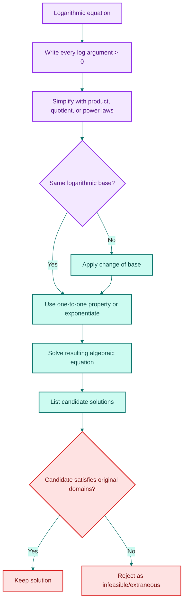

---

# 13. Logarithmic Inequalities

The monotonicity of a logarithm determines whether an inequality direction is preserved.

## Case 1: $a>1$

Because $\log_a x$ is increasing,

$$
\log_a u>\log_a v
\iff
u>v
$$

provided $u>0$ and $v>0$.

## Case 2: $0<a<1$

Because $\log_a x$ is decreasing,

$$
\log_a u>\log_a v
\iff
u<v
$$

The inequality reverses.

## Lecture inequality

Prove:

$$
\frac1{\log_2\pi}+\frac1{\log_6\pi}>2
$$

Use the reciprocal change-of-base identity:

$$  
\frac1{\log_b x}=\log_x b
$$

Or directly,

$$
\frac1{\log_2\pi}
=
\frac{\ln2}{\ln\pi}
$$

and

$$
\frac1{\log_6\pi}
=
\frac{\ln6}{\ln\pi}
$$

Therefore,

$$
\text{LHS}
=
\frac{\ln2+\ln6}{\ln\pi}
=
\frac{\ln12}{\ln\pi}
$$

Since $\pi>1$,

$$
\ln\pi>0.
$$

Thus,

$$
\frac{\ln12}{\ln\pi}>2
\iff
\ln12>2\ln\pi
$$

Use the power law:

$$
2\ln\pi=\ln(\pi^2)
$$

Since $\ln x$ is increasing,

$$
\ln12>\ln(\pi^2)
\iff
12>\pi^2
$$

And

$$
\pi^2\approx9.8696<12
$$

Therefore,

$$
\boxed{
\frac1{\log_2\pi}+\frac1{\log_6\pi}>2
}
$$

> **Transcript clarification:** The lecture estimates \(\pi^2<10<12\). This is a valid sufficient comparison. The exact numerical approximation above makes the same argument explicit.

---

# 14. Problem-Solving Decision Guide

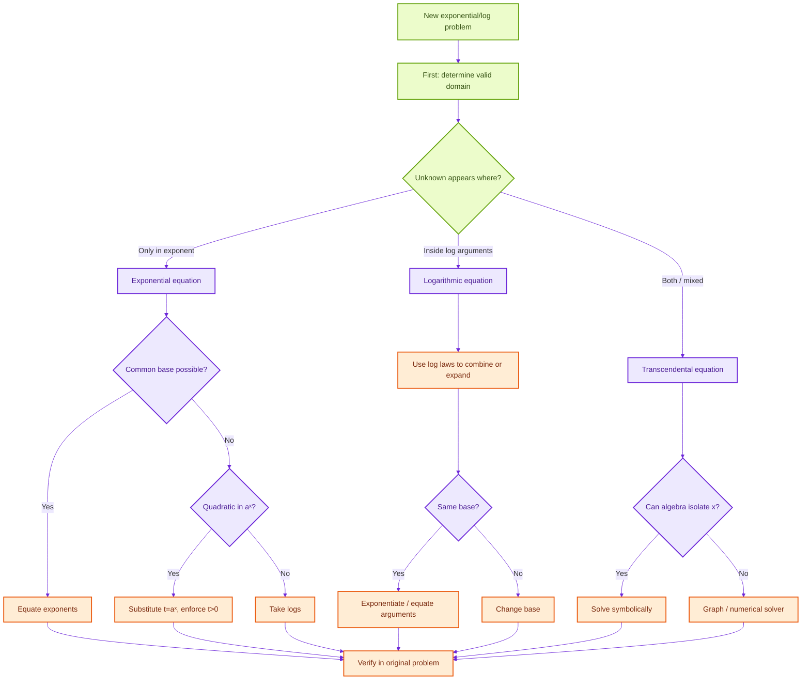

## Compact checklist

Before finalising an answer, ask:

- Are all logarithmic arguments positive?
- Are all logarithmic bases positive and unequal to $1$?
- Did I accidentally split a logarithm of a sum?
- Did I preserve or reverse an inequality correctly?
- Did substitution introduce a forbidden negative exponential value?
- Did squaring create extra algebraic roots?
- Did I test candidates in the original equation?
- Is the result exact, approximate, or graphical?

---

# 15. Common Mistakes

## Mistake 1: Allowing a zero logarithmic argument

Incorrect:

$$
\log_a0=0
$$

Correct:

$$
\log_a0
$$

is undefined in the real-number system.

## Mistake 2: Allowing negative arguments

Incorrect:

$$
\log_2(-8)=-3
$$

Although $2^{-3}=1/8$, not $-8$, a positive real base can never produce a negative output.

## Mistake 3: Confusing a logarithm of a sum

Incorrect:

$$
\log_a(m+n)=\log_a m+\log_a n
$$

Correct: no such standard identity exists.

## Mistake 4: Confusing quotient law with change of base

$$
\ln\left(\frac xa\right)
=
\ln x-\ln a
$$

but

$$
\log_a x
=
\frac{\ln x}{\ln a}
$$

## Mistake 5: Forgetting the positivity of $a^x$

If substitution gives

$$
t=a^x
$$

then

$$
t>0
$$

Any nonpositive root for $t$ must be rejected.

## Mistake 6: Forgetting original domains after combining logs

From

$$
\log(x+1)+\log(x-1)
$$

the original restrictions are

$$
x+1>0,\qquad x-1>0
$$

Even if the combined product $(x+1)(x-1)$ is positive for $x<-1$, those negative-$x$ values are invalid because each original logarithm must exist separately.

## Mistake 7: Confusing transformations

- $f(-x)$: reflection in the $y$-axis;
- $-f(x)$: reflection in the $x$-axis.

## Mistake 8: Treating $\ln(x^2)$ as $(\ln x)^2$

They are different:

$$
\ln(x^2)=2\ln|x|
$$

whenever $x\ne0$, while

$$
(\ln x)^2
$$

requires $x>0$ and squares the logarithmic value.

In the lecture equation, the right-hand side $(\ln x)^2$ already forces $x>0$, so $\ln(x^2)=2\ln x$ is valid there.

## Mistake 9: Reversing inequalities without checking the base

For $0<a<1$, $\log_a x$ is decreasing, so the inequality direction reverses.

## Mistake 10: Using approximate values too early

Keep exact forms such as

$$
\frac{\ln89}{\ln5}
$$

until the final step. Early rounding can introduce avoidable numerical error.

---

# 16. Data Science and Real-World Connections

## 16.1 Log transformations

A variable with a strong right skew may be transformed:

$$
z=\ln x
$$

Why?

- compresses large values;
- may reduce skewness;
- can stabilise variance;
- makes multiplicative effects more additive;
- can improve interpretability in linear models.

For a multiplicative relationship

$$
y=Ax^b
$$

take logs:

$$
\ln y=\ln A+b\ln x
$$

This becomes linear in $\ln x$.

## 16.2 Exponential growth models

A model such as

$$
P(t)=P_0e^{kt}
$$

can be linearised:

$$
\ln P(t)=\ln P_0+kt
$$

Thus, a plot of $\ln P(t)$ against $t$ is linear with slope $k$.

## 16.3 Logistic regression

The log-odds or logit is

$$
\log\left(\frac{p}{1-p}\right)
$$

Logistic regression models this as a linear combination:

$$
\log\left(\frac{p}{1-p}\right)
=
\beta_0+\beta_1x_1+\cdots+\beta_kx_k
$$

Exponentiating a coefficient gives an odds ratio.

## 16.4 Information theory

Information content is often represented by

$$
I(x)=-\log p(x)
$$

Rare events have small probabilities and therefore larger information values.

Cross-entropy and log-loss use logarithms because probabilities multiply across independent observations, while logarithms convert products into sums.

## 16.5 Algorithmic complexity

Binary search takes approximately

$$
\log_2 n
$$

steps because the search interval is halved repeatedly.

If

$$
n=2^k
$$

then

$$
k=\log_2 n
$$

## 16.6 Numerical stability

Machine-learning systems often compute log-probabilities instead of raw products.

Instead of

$$
p_1p_2\cdots p_n
$$

which may underflow numerically, compute

$$
\ln p_1+\ln p_2+\cdots+\ln p_n
$$

## 16.7 Logarithmic scales

Examples include:

- decibels for sound intensity;
- pH for hydrogen-ion concentration;
- Richter-style magnitude scales;
- orders of magnitude in scientific notation.

A logarithmic scale is especially useful when values span several powers of ten.

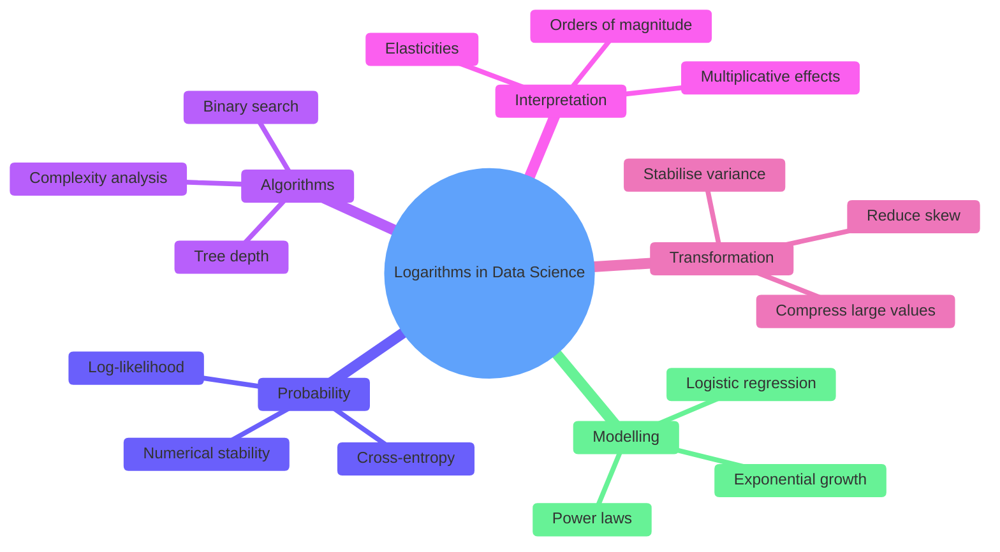

---

# 17. Python Verification

The following commented code can be used to verify graphs and numerical solutions.

```python
import math
import numpy as np
import matplotlib.pyplot as plt


def log_base(x: np.ndarray, base: float) -> np.ndarray:
    """
    Compute log_base(x) using the change-of-base formula.

    Conditions:
    - x must be strictly positive.
    - base must be positive and not equal to 1.
    """
    if base <= 0 or math.isclose(base, 1.0):
        raise ValueError("The logarithm base must be positive and not equal to 1.")

    if np.any(x <= 0):
        raise ValueError("Every logarithmic argument must be strictly positive.")

    return np.log(x) / np.log(base)


# Generate positive x-values because log(x) is undefined for x <= 0.
x = np.linspace(0.02, 8, 800)

# Compare an increasing and a decreasing logarithmic function.
y_log2 = log_base(x, 2)
y_log_half = log_base(x, 0.5)

plt.figure(figsize=(9, 6))
plt.plot(x, y_log2, label=r"$\log_2(x)$")
plt.plot(x, y_log_half, label=r"$\log_{0.5}(x)$")
plt.axhline(0, linewidth=1)
plt.axvline(0, linewidth=1)
plt.scatter([1, 2, 0.5], [0, 1, 1], zorder=3)
plt.xlabel("x")
plt.ylabel("y")
plt.title("Increasing and Decreasing Logarithmic Functions")
plt.legend()
plt.grid(True)
plt.show()
```

## Verify $x+e^x=2$

```python
import math


def h(x: float) -> float:
    """Equation converted to root form h(x)=0."""
    return x + math.exp(x) - 2


def bisection(
    func,
    left: float,
    right: float,
    tolerance: float = 1e-12,
    max_iterations: int = 200,
) -> float:
    """
    Find a root using the bisection method.

    The function must have opposite signs at the two endpoints.
    """
    f_left = func(left)
    f_right = func(right)

    if f_left == 0:
        return left
    if f_right == 0:
        return right
    if f_left * f_right > 0:
        raise ValueError("The selected interval does not bracket a root.")

    for _ in range(max_iterations):
        midpoint = (left + right) / 2
        f_mid = func(midpoint)

        if abs(f_mid) < tolerance or (right - left) / 2 < tolerance:
            return midpoint

        if f_left * f_mid < 0:
            right = midpoint
        else:
            left = midpoint
            f_left = f_mid

    raise RuntimeError("Bisection did not converge within the iteration limit.")


root = bisection(h, 0, 1)
print(root)       # Approximately 0.442854401...
print(h(root))    # Approximately 0
```

---

# 18. Quick Revision Sheet

## Definition

$$
\boxed{\log_a x=y\iff a^y=x}
$$

Conditions:

$$
a>0,\qquad a\ne1,\qquad x>0
$$

## Inverse identities

$$
a^{\log_a x}=x,\qquad x>0
$$

$$
\log_a(a^x)=x,\qquad x\in\mathbb R
$$

## Domain and range

$$
\operatorname{Dom}(\log_a x)=(0,\infty)
$$

$$
\operatorname{Range}(\log_a x)=\mathbb R
$$

## Graph

- $x$-intercept: $(1,0)$
- no $y$-intercept
- vertical asymptote: $x=0$
- fixed points: $(1,0)$, $(a,1)$
- increasing for $a>1$
- decreasing for $0<a<1$

## Special logarithms

$$
\ln x=\log_e x
$$

$$
\log x=\log_{10}x
$$

under the common-log convention.

## Laws

$$
\log_a(mn)=\log_a m+\log_a n
$$

$$
\log_a\left(\frac mn\right)=\log_a m-\log_a n
$$

$$
\log_a(m^r)=r\log_a m
$$

$$ 
\log_a\left(\frac1m\right)=-\log_a m.
$$

## Change of base

$$
\log_a x=\frac{\ln x}{\ln a}
=\frac{\log x}{\log a}
$$

## Domain rule

For

$$
\log_a(g(x))
$$

require

$$
g(x)>0
$$

## Equality rule

Because logarithms are one-to-one,

$$
\log_a u=\log_a v
\implies
u=v
$$

provided both $u$ and $v$ are positive.

## Inequality rule

- $a>1$: inequality direction preserved;
- $0<a<1$: inequality direction reversed.

---

# 19. Practice Questions

## Conceptual

1. Explain in words what $\log_3 81=4$ means.
2. Why is $a=1$ excluded as a logarithmic base?
3. Why can the argument of a real logarithm not be zero?
4. Describe the relationship between the graphs of $y=a^x$ and $y=\log_a x$.
5. State the domain and range of $y=\log_{0.2}x$.
6. Is $y=\log_{0.2}x$ increasing or decreasing? Why?
7. Explain why $\log_a(m+n)$ cannot generally be split.

## Evaluation

8. Evaluate $\log_2 32$.
9. Evaluate $\log_5(1/125)$.
10. Evaluate $7^{\log_7 13}$.
11. Evaluate $\ln(e^{-4})$.
12. Evaluate $e^{\ln 9}$.

## Domains

13. Find the domain of $\log_2(5-x)$.
14. Find the domain of $\ln(x^2-9)$.
15. Find the domain of
   $$
   \log_3\left(\frac{x+2}{x-4}\right).
   $$
16. Find the domain of
   $$
   \ln\sqrt{x-1}
   $$

## Graphs

17. State the vertical asymptote and domain of
   $$
   y=\log_5(x-3)+2
   $$
18. Describe all transformations from $y=\log_2x$ to
   $$
   y=-2\log_2(x+4)-1
   $$

## Laws

19. Expand:
   $$
   \log_3\left(\frac{x^4\sqrt{x+1}}{(x-2)^2}\right)
   $$
20. Combine:
   $$
   3\ln x+\ln(x+1)-2\ln(x-1)
   $$
21. Explain why
   $$
   \ln(x+2)\ne\ln x+\ln2
   $$

## Change of base

22. Express $\log_7 20$ using natural logarithms.
23. Simplify
   $$
   \log_{\sqrt3}9
   $$

## Exponential equations

24. Solve:
   $$
   3^{x+2}=81
   $$
25. Solve:
   $$
   4^x-5\cdot2^x+4=0
   $$
26. Solve:
   $$
   2^{x+1}=5^{x-2}
   $$
27. Explain why
   $$   
   2^x=-4
   $$
   has no real solution.

## Logarithmic equations

28. Solve:
   $$
   \log_2(x-1)=3
   $$
29. Solve:
   $$
   \log_3x+\log_3(x-2)=1
   $$
30. Solve:
   $$
   2\ln x=(\ln x)^2
   $$
31. Solve:
   $$
   \log_2x+\log_4x=6
   $$
32. Solve:
   $$
   \ln(x^2)=\ln4
   $$
   and carefully discuss the domain.
33. Solve:
   $$
   \log_{1/2}(x+1)>\log_{1/2}3
   $$

## Applications

34. A population follows
   $$
   P(t)=500e^{0.08t}
   $$
   Find the time when $P(t)=1000$.
35. An algorithm repeatedly halves a list of size $n$. Explain why the maximum number of halvings is proportional to $\log_2 n$.

---

# 20. Solutions

## 1

$$
\log_3 81=4
$$

means that $3$ must be raised to the fourth power to obtain $81$:

$$
3^4=81
$$

## 2

If $a=1$, then

$$
1^x=1
$$

for every $x$. The exponential is not one-to-one and therefore has no inverse over $\mathbb R$.

## 3

For every permissible real base $a$,

$$
a^y>0
$$

for all real $y$. Therefore, there is no real exponent that produces $0$, so $\log_a0$ is undefined.

## 4

The graphs are reflections of one another across

$$
y=x
$$

Their domain and range are interchanged, as are the coordinates of corresponding points.

## 5

$$
\operatorname{Dom}=(0,\infty),\qquad
\operatorname{Range}=\mathbb R.
$$

## 6

It is decreasing because

$$
0<0.2<1
$$

## 7

The logarithm laws derive from exponent laws for multiplication, division, and powers. Addition inside a logarithm has no corresponding exponent law that separates it.

## 8

$$
\log_2 32=5
$$

## 9

$$
\frac1{125}=5^{-3}
$$

so

$$
\log_5(1/125)=-3
$$

## 10

$$
7^{\log_7 13}=13
$$

## 11

$$
\ln(e^{-4})=-4
$$

## 12

$$
e^{\ln9}=9
$$

## 13

Require

$$
5-x>0
$$

so

$$
\boxed{x<5}
$$

Domain:

$$
(-\infty,5)
$$

## 14

Require

$$
x^2-9>0
$$

Factor:

$$
(x-3)(x+3)>0
$$

Thus,

$$
\boxed{x<-3\text{ or }x>3}
$$

Domain:

$$
(-\infty,-3)\cup(3,\infty)
$$

## 15

Require

$$
\frac{x+2}{x-4}>0
$$

Critical points are $-2$ and $4$. A sign chart gives

$$
\boxed{(-\infty,-2)\cup(4,\infty)}
$$

Both endpoints are excluded.

## 16

The square root must be positive because it is the logarithmic argument:

$$
\sqrt{x-1}>0
$$

This requires

$$
x-1>0
$$

Therefore,

$$
\boxed{x>1}
$$

## 17

$$
y=\log_5(x-3)+2
$$

Require

$$
x-3>0\implies x>3
$$

Vertical asymptote:

$$
\boxed{x=3}
$$

Domain:

$$
\boxed{(3,\infty)}
$$

## 18

From $y=\log_2x$:

1. $x+4$: shift left by $4$;
2. coefficient $-2$: reflect across the $x$-axis and stretch vertically by factor $2$;
3. $-1$: shift down by $1$.

The asymptote moves to

$$
x=-4
$$

## 19

$$
\log_3\left(\frac{x^4\sqrt{x+1}}{(x-2)^2}\right)
$$

$$
=
4\log_3x
+\frac12\log_3(x+1)
-2\log_3(x-2)
$$

This expanded form assumes all displayed individual arguments are positive.

## 20

$$
3\ln x+\ln(x+1)-2\ln(x-1)
$$

$$
=
\ln(x^3)+\ln(x+1)-\ln((x-1)^2)
$$

$$
=
\boxed{
\ln\left(\frac{x^3(x+1)}{(x-1)^2}\right)
}
$$

Original-domain conditions require

$$
x>0,\quad x+1>0,\quad x-1>0
$$

so $x>1$.

## 21

The product law applies to multiplication:

$$
\ln(2x)=\ln2+\ln x
$$

But $x+2$ is a sum, not a product, so no splitting law applies.

## 22

$$
\boxed{\log_7 20=\frac{\ln20}{\ln7}}
$$

## 23

Let

$$
\log_{\sqrt3}9=y
$$

Then

$$
(\sqrt3)^y=9
$$

Write both in base $3$:

$$
(3^{1/2})^y=3^2
$$

Thus,

$$
\frac y2=2
$$

so

$$
\boxed{y=4}
$$

## 24

$$
3^{x+2}=81=3^4
$$

Thus,

$$
x+2=4,
$$

so

$$
\boxed{x=2}
$$

## 25

$$
4^x-5\cdot2^x+4=0
$$

Let

$$
t=2^x>0
$$

Then

$$
4^x=(2^x)^2=t^2
$$

So

$$
t^2-5t+4=0
$$

$$
(t-1)(t-4)=0
$$

Thus,

$$
t=1\quad\text{or}\quad t=4
$$

Therefore,

$$
2^x=1\implies x=0
$$

or

$$
2^x=4\implies x=2
$$

Hence,

$$
\boxed{x=0\text{ or }x=2}
$$

## 26

$$
2^{x+1}=5^{x-2}
$$

Take $\ln$:

$$
(x+1)\ln2=(x-2)\ln5
$$

Expand:

$$
x\ln2+\ln2=x\ln5-2\ln5
$$

Collect:

$$
x(\ln2-\ln5)=-(2\ln5+\ln2)
$$

Thus,

$$
x=
\frac{2\ln5+\ln2}{\ln5-\ln2}
$$

Therefore,

$$
\boxed{
x=\frac{\ln50}{\ln(5/2)}
}
$$

## 27

For every real $x$,

$$
2^x>0
$$

It can never equal $-4$, so there is no real solution.

## 28

$$
\log_2(x-1)=3
$$

implies

$$
x-1=2^3=8
$$

Hence,

$$
\boxed{x=9}
$$

The domain $x>1$ is satisfied.

## 29

Domain:

$$
x>0,\qquad x-2>0
$$

so

$$
x>2
$$

Combine:

$$
\log_3(x(x-2))=1
$$

Thus,

$$
x(x-2)=3
$$

$$
x^2-2x-3=0
$$

$$
(x-3)(x+1)=0
$$

Candidates are $3$ and $-1$. Only $3$ satisfies $x>2$.

$$
\boxed{x=3}
$$

## 30

Domain:

$$
x>0
$$

Let

$$
t=\ln x
$$

Then

$$
2t=t^2
$$

so

$$
t(t-2)=0
$$

Thus,

$$
t=0\quad\text{or}\quad t=2
$$

Therefore,

$$
\boxed{x=1\text{ or }x=e^2}
$$

## 31

Use

$$
\log_4x=\frac{\log_2x}{\log_24}
=\frac12\log_2x
$$

Thus,

$$
\log_2x+\frac12\log_2x=6
$$

$$
\frac32\log_2x=6
$$

$$
\log_2x=4
$$

Therefore,

$$
\boxed{x=16}
$$

## 32

$$
\ln(x^2)=\ln4
$$

The left side requires

$$
x^2>0
$$

so

$$
x\ne0
$$

Because $\ln$ is one-to-one,

$$
x^2=4
$$

Thus,

$$
\boxed{x=\pm2}
$$

Both are valid because the logarithmic argument is $x^2=4>0$. This differs from equations containing $\ln x$, where $x$ itself must be positive.

## 33

$$
\log_{1/2}(x+1)>\log_{1/2}3
$$

Domain:

$$
x+1>0\implies x>-1
$$

Because $0<1/2<1$, the logarithm is decreasing, so reverse the inequality:

$$
x+1<3
$$

Thus,

$$
x<2
$$

Combine with the domain:

$$
\boxed{-1<x<2}
$$

## 34

$$
500e^{0.08t}=1000
$$

Divide by $500$:

$$
e^{0.08t}=2
$$

Take $\ln$:

$$
0.08t=\ln2
$$

Thus,

$$
\boxed{
t=\frac{\ln2}{0.08}\approx8.664
}
$$

## 35

After $k$ halvings, a list of size $n$ becomes approximately

$$
\frac{n}{2^k}
$$

Stop when one item remains:

$$
\frac{n}{2^k}=1
$$

Thus,

$$
2^k=n
$$

Taking $\log_2$:

$$
k=\log_2n
$$

Therefore, the number of halvings grows logarithmically.

---

# 21. Glossary

| Term | Meaning |
|---|---|
| Base | The fixed positive number $a\ne1$ in $a^x$ or $\log_a x$ |
| Argument | The input inside a logarithm |
| Exponential function | $f(x)=a^x$ |
| Logarithmic function | $f(x)=\log_a x$, inverse of $a^x$ |
| Natural logarithm | $\ln x=\log_e x$ |
| Common logarithm | $\log_{10}x$ |
| One-to-one | Different inputs produce different outputs |
| Inverse function | A function that reverses another function |
| Vertical asymptote | A vertical line approached but not reached by the graph |
| Change of base | Rewriting a logarithm using another base |
| Extraneous solution | An algebraic candidate that fails the original equation or domain |
| Transcendental equation | An equation involving functions such as exponentials or logarithms that may not be algebraically solvable |
| Monotonic | Entirely increasing or entirely decreasing |
| Log transformation | Replacing $x$ with $\log x$ or $\ln x$, often to compress scale or linearise relationships |

---

## Final Takeaway

A logarithm is not a mysterious new operation. It is the inverse question associated with exponentiation:

$$
\boxed{\log_a x=y\iff a^y=x}
$$

Most logarithmic problem solving rests on five ideas:

1. logarithmic arguments must be positive;
2. logarithms and exponentials undo each other;
3. logarithms convert products to sums and powers to coefficients;
4. change of base lets any valid logarithm be computed using $\ln$ or $\log_{10}$;
5. every candidate solution must be checked against the original domains.

Master these five ideas, and graphing, simplifying, solving equations, and understanding real-world logarithmic models become systematic rather than memorisation-heavy.
