# Maths 2 — Week 7 Foundations  
## Functions, Trigonometry, Graphs, Tangents, Sequences, Limits, and Continuity

> **Source basis:** These notes are organized from the five shared lecture transcripts:
>
> 1. **L7.1 — Some Topics from Maths 1**
> 2. **L7.2 — Functions of One Variable**
> 3. **L7.3 — Graphs and Tangents**
> 4. **L7.4 — Limits for Sequences**
> 5. **L7.5 — Limits for Functions of One Variable**
>
> Mathematical notation has been normalized where the automatic transcript merged words or misread symbols.  
> Sections marked **Additional intuition** expand the lecture ideas without changing their mathematical meaning.

---

## Table of Contents

1. [Learning Roadmap](#1-learning-roadmap)
2. [Functions: Domain, Codomain, and Range](#2-functions-domain-codomain-and-range)
3. [Important Families of Functions](#3-important-families-of-functions)
4. [Increasing, Decreasing, and Growth Rates](#4-increasing-decreasing-and-growth-rates)
5. [Trigonometric Functions](#5-trigonometric-functions)
6. [Operations and Composition of Functions](#6-operations-and-composition-of-functions)
7. [Graphs and Curves](#7-graphs-and-curves)
8. [Tangent Lines and Instantaneous Direction](#8-tangent-lines-and-instantaneous-direction)
9. [Sequences](#9-sequences)
10. [Limits of Sequences](#10-limits-of-sequences)
11. [Limit Laws and the Sandwich Principle](#11-limit-laws-and-the-sandwich-principle)
12. [Limits of Functions](#12-limits-of-functions)
13. [One-Sided Limits](#13-one-sided-limits)
14. [Limits at Infinity](#14-limits-at-infinity)
15. [Substitution, Indeterminate Forms, and Standard Limits](#15-substitution-indeterminate-forms-and-standard-limits)
16. [Continuity](#16-continuity)
17. [Data Science Connections](#17-data-science-connections)
18. [Python Experiments](#18-python-experiments)
19. [Common Mistakes](#19-common-mistakes)
20. [Formula Sheet](#20-formula-sheet)
21. [Practice Questions](#21-practice-questions)
22. [Solutions](#22-solutions)

---

# 1. Learning Roadmap

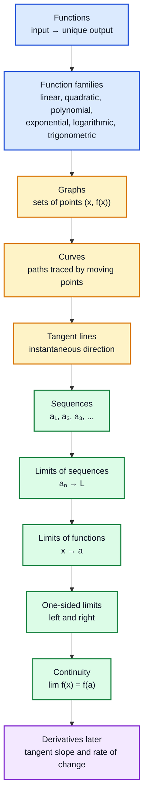

The lectures build calculus from a geometric question:

> **How can we describe the direction of a curve at one instant?**

A tangent line appears simple in a picture, but examples such as the floor function and \(f(x)=|x|\) reveal that tangents need not exist. To make the idea precise, we first need **limits**, and to understand function limits, we first study **sequence limits**.

---

# 2. Functions: Domain, Codomain, and Range

## 2.1 What is a function?

A function is a rule that maps every allowed input to **exactly one output**.

If $f$ maps a set $X$ to a set $Y$, we write

$$
f:X\to Y.
$$

- $X$: **domain**, the set of allowed inputs.
- $Y$: **codomain**, the declared set of possible outputs.
- $f(x)$: the unique output assigned to $x$.
- $\operatorname{Range}(f)$: the set of outputs actually produced.

Formally,

$$
\operatorname{Range}(f)
=
\{y\in Y:\text{ there exists }x\in X\text{ such that }f(x)=y\}
$$

Therefore,

$$
\operatorname{Range}(f)\subseteq Y.
$$

### Intuition: a function as a machine

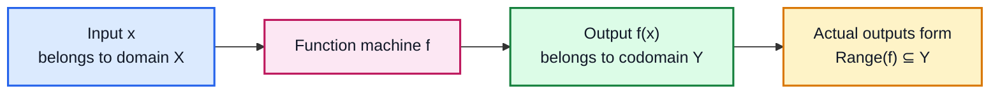

The crucial condition is **uniqueness**: one input cannot produce two different outputs.

---

## 2.2 Function of one variable

In these lectures, a function of one variable generally means

$$
f:D\to\mathbb{R},
\qquad
D\subseteq\mathbb{R}.
$$

The input $x$ is a single real number, so the function has one real variable.

Examples:

$$
f(x)=5x+2,
\qquad
g(x)=x^2+1,
\qquad
h(x)=\sin x.
$$

The domain need not be all of $\mathbb R$. For example,

$$
q(x)=\frac{1}{x}
$$

has domain

$$
\mathbb R\setminus\{0\}
$$

---

# 3. Important Families of Functions

## 3.1 Linear functions

A linear function in the lecture’s one-variable setting has the form

$$
f(x)=mx+c
$$

Here:

- $m$ is the slope.
- $c=f(0)$ is the y-intercept.

### Example

For

$$
f(x)=5x+2
$$

$$
f(0)=2
$$

and

$$
f(20)=5(20)+2=102
$$

### Geometric meaning

The graph is the line

$$
y=mx+c
$$

The slope is associated with its angle $\theta$ with the positive $x$-axis:

$$
m=\tan\theta,
$$

when the angle interpretation is valid.

---

## 3.2 Quadratic functions

A convenient geometric form is the vertex form

$$
f(x)=a(x-b)^2+c
$$

The vertex is

$$
(b,c)
$$

### Effect of $a$

- $a>0$: the parabola opens upward.
- $a<0$: the parabola opens downward.
- Larger $|a|$: the parabola is narrower.
- Smaller $|a|$: the parabola is wider.

When $a>0$,

$$
f(x)\ge c
$$

and the minimum occurs at

$$
x=b
$$

When $a<0$, the maximum occurs at $x=b$.

### Conversion to standard form

$$
\begin{aligned}
f(x)
&=a(x-b)^2+c\\
&=a(x^2-2bx+b^2)+c\\
&=ax^2-2abx+ab^2+c.
\end{aligned}
$$

Thus it can also be written as

$$
f(x)=Ax^2+Bx+C
$$

### Algebra–geometry connection

```mermaid
flowchart LR
    A["Algebra<br/>a(x-b)²+c"] --> B["a determines<br/>opening and width"]
    A --> C["b determines<br/>horizontal position"]
    A --> D["c determines<br/>vertical position"]
    B --> E["Graph: parabola"]
    C --> E
    D --> E
    E --> F["Vertex = (b,c)"]

    classDef algebra fill:#dbeafe,stroke:#1d4ed8,stroke-width:2px,color:#111827;
    classDef parameter fill:#fef3c7,stroke:#d97706,stroke-width:2px,color:#111827;
    classDef graph fill:#dcfce7,stroke:#15803d,stroke-width:2px,color:#111827;

    class A algebra;
    class B,C,D parameter;
    class E,F graph;
```

---

## 3.3 Polynomial functions

A polynomial of degree $n$ is

$$
p(x)=a_nx^n+a_{n-1}x^{n-1}+\cdots+a_1x+a_0,
\qquad
a_n\ne0.
$$

The numbers $a_0,a_1,\ldots,a_n$ are the coefficients.

### Example: finding roots

Consider

$$
p(x)=x^3-4x
$$

Factor:

$$
\begin{aligned}
x^3-4x
&=x(x^2-4)\\
&=x(x-2)(x+2)
\end{aligned}
$$  

Therefore,

$$
p(x)=0
\iff
x\in\{-2,0,2\}
$$

These values are the $x$-intercepts of the graph.

### Key lesson

Algebra tells us where the graph crosses the axis, while the graph gives visual meaning to algebraic solutions.

---

## 3.4 Exponential functions

For a positive base $a$,

$$
f(x)=a^x
$$

The lecture explains how increasingly general exponents are understood:

### Integer exponent

$$
a^3=a\cdot a\cdot a
$$

### Negative integer exponent

$$
a^{-n}=\frac1{a^n}
$$

### Rational exponent

For integers $m,n$ with $n>0$,

$$
a^{m/n}=\sqrt[n]{a^m}
$$

### Irrational exponent

An irrational exponent such as $a^{\sqrt2}$ is understood by taking rational numbers $q_n$ approaching $\sqrt2$ and considering

$$
a^{q_n}
$$

The desired number is defined through the limiting behavior.

### Why $a>0$?

Negative bases cause difficulties for arbitrary real exponents. For example,

$$
(-1)^{1/2}
$$

is not real. Also, $a=0$ causes trouble with negative exponents.

---

## 3.5 Logarithmic functions

The logarithm reverses exponentiation:

$$
y=\log_a x
\iff
a^y=x
$$

Thus,

$$
\log_a(a^x)=x
$$

and, for $x>0$,

$$
a^{\log_a x}=x
$$

For $a>1$, both $a^x$ and $\log_a x$ are increasing, but their growth speeds are dramatically different.

---

# 4. Increasing, Decreasing, and Growth Rates

## 4.1 Monotone increasing

A function $f$ is monotone increasing if

$$
x_1\le x_2
\implies
f(x_1)\le f(x_2)
$$

## 4.2 Monotone decreasing

A function $f$ is monotone decreasing if

$$
x_1\le x_2
\implies
f(x_1)\ge f(x_2)
$$

These ideas matter later when locating maxima, minima, and intervals of change.

---

## 4.3 Comparing growth

The lecture compares:

$$
x,\quad x^2,\quad x^3,\quad x^4,\quad 2^x.
$$

For moderate values, a polynomial may temporarily be larger than an exponential. But eventually,

$$
2^x
$$

grows faster than every fixed-degree polynomial $x^n$.

Informally,

$$
x^n \ll a^x \qquad (x\to\infty,\;a>1)
$$

At the slow-growing end,

$$
\log x
$$

grows more slowly than any positive power $x^\alpha$, where $\alpha>0$:

$$
\log x \ll x^\alpha.
$$

### Growth hierarchy

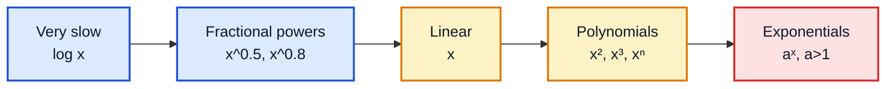

### Fun fact

This hierarchy appears in algorithm analysis:

- $\log n$: binary search.
- $n$: one pass through data.
- $n^2$: pairwise comparisons.
- $2^n$: exhaustive subset search.

---

# 5. Trigonometric Functions

## 5.1 Sine

For an acute angle $x$ in a right triangle,

$$ 
\sin x=
\frac{\text{opposite side}}{\text{hypotenuse}}
$$

The function extends to all real numbers through symmetry and periodicity.

### Properties

$$
\operatorname{Domain}(\sin)=\mathbb R
$$

$$
\operatorname{Range}(\sin)=[-1,1]
$$

$$
\sin(x+2\pi)=\sin x
$$

Therefore, its period is $2\pi$.

It is an odd function:

$$
\sin(-x)=-\sin x
$$

---

## 5.2 Cosine

For an acute angle,

$$
\cos x
=
\frac{\text{adjacent side}}{\text{hypotenuse}}
$$

### Properties

$$
\operatorname{Domain}(\cos)=\mathbb R
$$

$$
\operatorname{Range}(\cos)=[-1,1]
$$

$$
\cos(x+2\pi)=\cos x
$$

Cosine is even:

$$
\cos(-x)=\cos x
$$

Sine and cosine are horizontal shifts of one another:

$$
\cos x=\sin\left(x+\frac{\pi}{2}\right)
$$

---

## 5.3 Tangent

For an acute angle,

$$
\tan x
=
\frac{\text{opposite side}}{\text{adjacent side}}
$$

Using sine and cosine,

$$
\tan x=\frac{\sin x}{\cos x}
$$

provided

$$
\cos x\ne0
$$

Therefore, tangent is undefined at

$$
x=\frac{(2k+1)\pi}{2},
\qquad
k\in\mathbb Z
$$

Its domain is

$$
\mathbb R
\setminus
\left\{
\frac{(2k+1)\pi}{2}:k\in\mathbb Z
\right\}.
$$

Its period is

$$
\pi
$$

because

$$
\tan(x+\pi)=\tan x
$$

Tangent is odd:

$$
\tan(-x)=-\tan x
$$

---

## 5.4 Reciprocal trigonometric functions

$$
\cot x=\frac1{\tan x}
=\frac{\cos x}{\sin x}
$$

$$
\sec x=\frac1{\cos x}
$$

$$
\csc x=\frac1{\sin x}
$$

Every reciprocal definition imposes a domain restriction: its denominator must not be zero.

---

## 5.5 Fundamental identity

The Pythagorean identity is

$$
\sin^2x+\cos^2x=1
$$

It comes from the Pythagorean theorem on the unit circle.

### Trigonometric relationship map

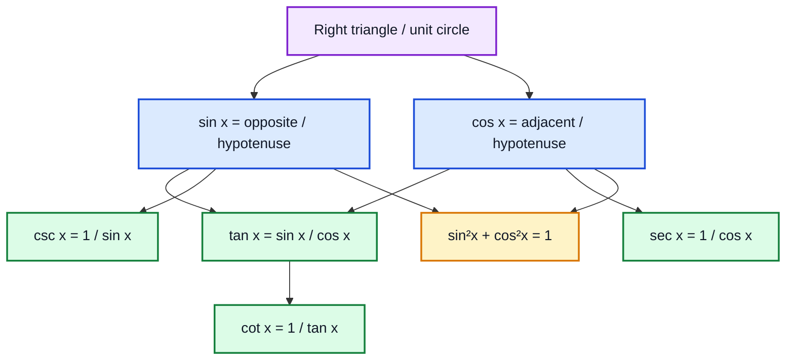

---

# 6. Operations and Composition of Functions

Suppose

$$
f:D\to\mathbb R,
\qquad
g:D\to\mathbb R
$$

## 6.1 Sum

$$
(f+g)(x)=f(x)+g(x)
$$

## 6.2 Difference

$$
(f-g)(x)=f(x)-g(x)
$$

## 6.3 Product

$$
(fg)(x)=f(x)g(x)
$$

## 6.4 Scalar multiplication

For $c\in\mathbb R$,

$$
(cf)(x)=c\,f(x)
$$

## 6.5 Quotient

$$
\left(\frac fg\right)(x)
=
\frac{f(x)}{g(x)}
$$

only where

$$
g(x)\ne0
$$

### Example: tangent as a quotient

$$
\tan x=\frac{\sin x}{\cos x}
$$

so values where $\cos x=0$ must be removed from the domain.

---

## 6.6 Rational-function example

Let

$$  
h(x)=\frac{x}{x^2+1}
$$

Since

$$
x^2+1\ge1>0
$$

the denominator is never zero. Therefore,

$$
\operatorname{Domain}(h)=\mathbb R
$$

---

## 6.7 Composition

Suppose

$$
f:D\to E,
\qquad
g:E\to\mathbb R
$$

Then

$$
g\circ f:D\to\mathbb R
$$

is defined by

$$
(g\circ f)(x)=g(f(x))
$$

The output of $f$ becomes the input of $g$.

### Domain compatibility

The composition is valid only if the outputs produced by $f$ are allowed inputs for $g$:

$$
\operatorname{Range}(f)\subseteq\operatorname{Domain}(g)
$$

### Example

Let

$$
f(x)=x^2+1,
\qquad
g(x)=\sqrt{x}.
$$

The range of $f$ is

$$
[1,\infty)
$$

which is contained in the domain of the square-root function,

$$
[0,\infty)
$$

Thus,

$$
(g\circ f)(x)
=
\sqrt{x^2+1}
$$

is defined for every real $x$.

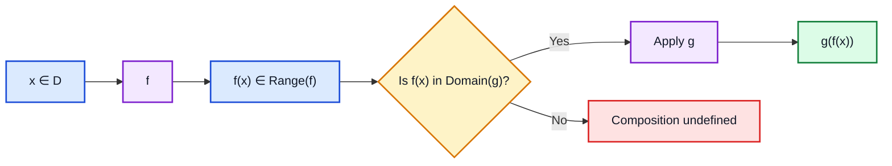

---

# 7. Graphs and Curves

## 7.1 Formal definition of a graph

For a function

$$
f:X\to Y
$$

its graph is

$$
\Gamma_f
=
\{(x,f(x)):x\in X\}
\subseteq
X\times Y
$$  

For a real function

$$
f:D\to\mathbb R
$$

the graph is drawn in $\mathbb R^2$ using points

$$
(x,f(x))
$$

### Examples

- $f(x)=x^2$: parabola.
- $f(x)=\sin x$: periodic oscillation.
- $f(x)=\cos x$: shifted oscillation.
- $f(x)=e^x$: exponential growth.
- $f(x)=e^{-x}$: exponential decay.
- $f(x)=\frac{1}{\sqrt{2\pi}}e^{-x^2/2}$: bell curve.

---

## 7.2 Bell curve and normal distribution

The function

$$
\phi(x)
=
\frac{1}{\sqrt{2\pi}}
e^{-x^2/2}
$$

has the familiar bell shape associated with the standard normal distribution.

It is symmetric:

$$
\phi(-x)=\phi(x)
$$

It is largest at $x=0$ and decreases as $\|x\|$ grows.

### Data Science significance

Many statistical methods use the normal distribution to model:

- measurement noise,
- aggregated random effects,
- standardized scores,
- sampling distributions.

---

## 7.3 What is a curve?

The lecture gives a heuristic rather than a formal topological definition.

A curve can be thought of as the path traced by a moving point:

- a motorcycle moving along a road,
- an aeroplane tracing an arc,
- a cricket ball travelling through space,
- a figure skater moving across ice.

A straight line is also a curve. Curves can be:

- open,
- closed,
- self-intersecting,
- planar,
- spatial.

### Important distinction

Every ordinary graph of a sufficiently well-behaved one-variable function looks like a curve, but not every curve is the graph of a function. A closed circle, for example, fails the vertical-line test when represented as $y$ as a function of $x$.

---

# 8. Tangent Lines and Instantaneous Direction

## 8.1 Geometric intuition

A tangent line to a curve at a point $P$ represents the **instantaneous direction** in which the curve moves at $P$.

A useful mental model:

1. Imagine a particle travelling along the curve.
2. Observe it immediately before and immediately after $P$.
3. The line matching its instantaneous direction is the tangent.

This is more reliable than saying:

> “A tangent touches a curve at exactly one point.”

That statement can fail.

### Why “one intersection” is not a definition

- A tangent line may intersect the curve elsewhere.
- If the curve itself is a straight line, its tangent is the same line and intersects it at every point.
- Local behavior near the chosen point matters more than global intersections.

---

## 8.2 Tangent to the graph of a function

If $f:D\to\mathbb R$, then the tangent to $f$ at input $a$ means the tangent to its graph at

$$
(a,f(a))
$$

Later, calculus will produce its equation:

$$
y-f(a)=f'(a)(x-a)
$$

provided the derivative $f'(a)$ exists.

The transcript does not yet define the derivative; it motivates why limits are needed before derivatives.

---

## 8.3 When tangents fail to exist

### Floor function

The floor function is

$$
\lfloor x\rfloor
=
\text{greatest integer less than or equal to }x
$$

At every integer, the graph jumps. There is no single instantaneous direction across the jump.

### Absolute-value function

$$
f(x)=|x|
$$

At $x=0$:

- from the left, the graph has slope $-1$,
- from the right, the graph has slope $+1$.

The two directions do not match, so no unique tangent exists at $0$.

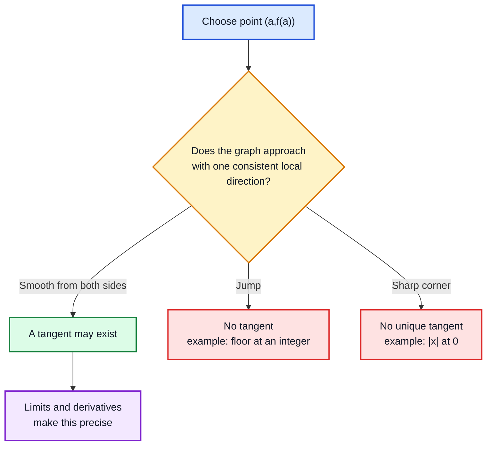

---

# 9. Sequences

## 9.1 Definition

A real sequence assigns a real number $a_n$ to each positive integer $n$.

It can be viewed as a function

$$
a:\mathbb N\to\mathbb R,
\qquad
n\mapsto a_n
$$

Examples:

$$
a_n=n
\quad\Rightarrow\quad
1,2,3,4,\ldots
$$

$$
a_n=(-1)^n
\quad\Rightarrow\quad
-1,1,-1,1,\ldots
$$

$$
a_n=\frac1{2^n}
\quad\Rightarrow\quad
\frac12,\frac14,\frac18,\frac1{16},\ldots
$$

A sequence need not always have a simple closed-form formula; it only needs a rule assigning a number to each index.

---

## 9.2 Subsequence

A subsequence is obtained by retaining terms in their original order while possibly discarding others.

If

$$
a_1,a_2,a_3,\ldots
$$

is a sequence and

$$
n_1<n_2<n_3<\cdots
$$

then

$$
a_{n_1},a_{n_2},a_{n_3},\ldots
$$

is a subsequence.

### Example

For

$$
a_n=(-1)^n
$$

the even-index subsequence is

$$
a_{2n}=1,1,1,\ldots
$$

and the odd-index subsequence is

$$
a_{2n-1}=-1,-1,-1,\ldots
$$

These two subsequences approach different values, which shows why the full sequence cannot converge.

---

# 10. Limits of Sequences

## 10.1 Intuitive definition

A sequence $(a_n)$ has limit $L$ if its terms become arbitrarily close to $L$ as $n$ becomes large.

We write

$$
a_n\to L
$$

or

$$
\lim_{n\to\infty}a_n=L.
$$

Equivalent language:

- $a_n$ tends to $L$.
- $a_n$ converges to $L$.
- The limit of $a_n$ is $L$.

The transcript intentionally uses an intuitive notion of “closer and closer” and postpones the formal $\varepsilon$-definition.

---

## 10.2 Convergent and divergent sequences

A sequence is **convergent** if it converges to a real number.

Example:

$$
\frac1n\to0.
$$

A sequence is **divergent** if it does not converge to a real number.

### Oscillatory divergence

$$
(-1)^n
$$

alternates between $-1$ and $1$, so it does not approach one number.

### Divergence to $\infty$

$$
a_n=n.
$$

Its values grow beyond every fixed real number.

### Divergence to $-\infty$

$$
a_n=-n.
$$

Its values become arbitrarily large in magnitude on the negative side.

---

## 10.3 Same limit, different convergence speeds

The lecture compares three sequences approaching $2$.

### Sequence A

$$
a_n=2-\frac1n.
$$

Then

$$
a_n\to2.
$$

Its error is

$$
2-a_n=\frac1n.
$$

### Sequence B

$$
b_n=2-\frac1{n^2}.
$$

Then

$$
b_n\to2.
$$

Its error is

$$
2-b_n=\frac1{n^2},
$$

which becomes small faster than $1/n$.

### Sequence C

$$
c_n
=
2-
\frac{1}{(1+\log n)^{1.1}}
$$

Then

$$
c_n\to2
$$

but very slowly because logarithms grow slowly.

### Numerical comparison

| $n$ | $2-\frac1n$ | $2-\frac1{n^2}$ |
|---:|---:|---:|
| 10 | 1.900000 | 1.990000 |
| 50 | 1.980000 | 1.999600 |
| 200 | 1.995000 | 1.999975 |

### Why this matters

In numerical algorithms, two methods can converge to the same answer but require radically different amounts of computation.

---

## 10.4 Exponential functions hidden inside limits

The lecture presents several important limits as facts to use.

### Exponential series

$$
e^x
=
\sum_{k=0}^{\infty}
\frac{x^k}{k!}
$$

The partial sums form a sequence:

$$
s_n
=
\sum_{k=0}^{n}
\frac{x^k}{k!}
$$

and

$$
s_n\to e^x
$$

For $x=1$,

$$
e
=
\sum_{k=0}^{\infty}
\frac1{k!}
$$

### Compound-growth limit

$$
\left(1+\frac{x}{n}\right)^n
\to e^x
$$

Specially,

$$
\left(1+\frac1n\right)^n
\to e
$$

### Stirling-related limits

The lecture mentions limits connected with Stirling’s approximation and the normal distribution, including forms that converge to $e$. A standard one consistent with the discussion is

$$
\frac{n}{\sqrt[n]{n!}}\to e
$$

The broader lesson is that exponentials are deeply connected to sequences and limiting processes.

---

# 11. Limit Laws and the Sandwich Principle

Suppose

$$
a_n\to a,
\qquad
b_n\to b.
$$

## 11.1 Subsequence law

Every subsequence of a convergent sequence converges to the same limit.

This gives a useful divergence test:

> If two subsequences have different limits, the original sequence diverges.

---

## 11.2 Sum

$$
a_n+b_n\to a+b
$$

## 11.3 Scalar multiple

For $c\in\mathbb R$,

$$
ca_n\to ca
$$

## 11.4 Difference

$$
a_n-b_n\to a-b
$$

## 11.5 Product

$$
a_nb_n\to ab
$$

## 11.6 Polynomial substitution

For a polynomial $p$,

$$
p(a_n)\to p(a)
$$

## 11.7 Quotient

If $b\ne0$, then

$$
\frac{a_n}{b_n}\to\frac ab
$$

provided the denominator is nonzero for sufficiently large $n$.

## 11.8 Exponential substitution

For $c>0$,

$$
c^{a_n}\to c^a
$$

## 11.9 Logarithmic substitution

If $a_n>0$, $a>0$, and $c>0$, $c\ne1$, then

$$
\log_c(a_n)\to\log_c(a)
$$

---

## 11.10 Sandwich principle

If

$$
u_n\le v_n\le w_n
$$

and

$$
u_n\to L,
\qquad
w_n\to L,
$$

then

$$
v_n\to L
$$

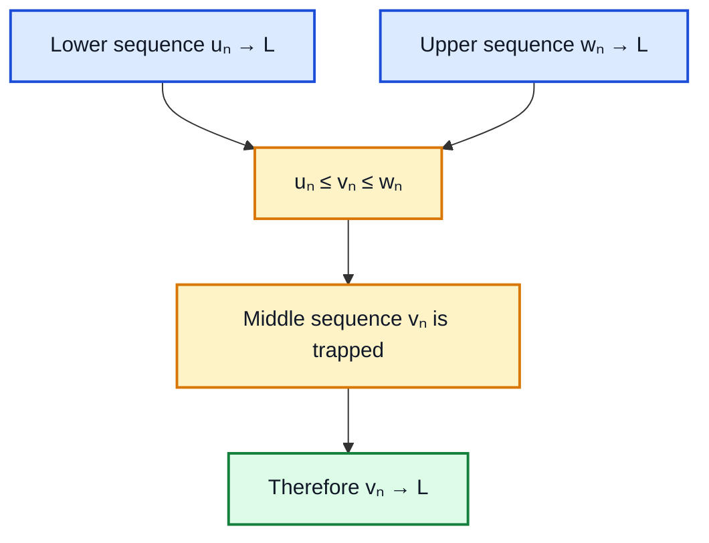

---

## 11.11 Worked example: alternating numerator

Evaluate

$$
\lim_{n\to\infty}\frac{(-1)^n}{n}
$$

Since

$$
-1\le(-1)^n\le1,
$$

dividing by $n>0$ gives

$$
-\frac1n
\le
\frac{(-1)^n}{n}
\le
\frac1n
$$

Both bounds tend to $0$:

$$
-\frac1n\to0,
\qquad
\frac1n\to0
$$

Therefore, by the sandwich principle,

$$
\boxed{\frac{(-1)^n}{n}\to0}
$$

Although the signs oscillate, the amplitude shrinks to zero.

---

## 11.12 Worked example: combined laws

Consider

$$
A_n
=
\frac{
\displaystyle
\frac{1}{\log(1+n)}
+
\frac{5n^2}{1+n^2}
}{
\displaystyle
\left(1+\frac1n\right)^{2n}
}
$$

### First numerator term

As $n\to\infty$,

$$
\log(1+n)\to\infty
$$ 

so

$$
\frac1{\log(1+n)}\to0
$$

### Second numerator term

$$
\frac{5n^2}{1+n^2}
=
\frac5{\frac1{n^2}+1}
\to5
$$ 

Thus, the numerator tends to

$$
0+5=5
$$

### Denominator

$$
\left(1+\frac1n\right)^{2n}
=
\left[
\left(1+\frac1n\right)^n
\right]^2
\to e^2
$$

Therefore,

$$
\boxed{
A_n\to\frac5{e^2}
}
$$

---

# 12. Limits of Functions

## 12.1 From sequence limits to function limits

For the polynomial function

$$
f(x)=x^2
$$

if

$$
a_n\to a
$$

then

$$  
f(a_n)=a_n^2\to a^2=f(a)
$$

This motivates asking:

> When inputs approach $a$, what do the corresponding outputs approach?

The expression

$$
\lim_{x\to a}f(x)=L
$$

means that $f(x)$ becomes close to $L$ whenever $x$ becomes sufficiently close to $a$, from the allowed points of the domain.

---

## 12.2 Sequential interpretation

A sequence-based interpretation is:

$$
\lim_{x\to a}f(x)=L
$$

when, for every sequence $x_n$ in the domain with

$$
x_n\to a
$$

and ordinarily $x_n\ne a$, we have

$$
f(x_n)\to L
$$

The lecture uses this idea to explain why one or two selected sequences can illustrate a limit but cannot by themselves prove the full limit. The condition must hold for **all** appropriate sequences.

---

## 12.3 Smooth example: $f(x)=x^2$

From either side,

$$
x\to a
\implies
x^2\to a^2
$$

Therefore,

$$
\boxed{\lim_{x\to a}x^2=a^2}
$$

At $a=2$,

$$ 
\lim_{x\to2}x^2=4
$$

---

## 12.4 Jump example: floor function

Let

$$
g(x)=\lfloor x\rfloor
$$

At $x=2$:

- approaching from the left gives values $1$,
- approaching from the right gives values $2$.

Therefore,

$$
\lim_{x\to2^-}\lfloor x\rfloor=1
$$

$$
\lim_{x\to2^+}\lfloor x\rfloor=2
$$

Because they differ,

$$
\boxed{
\lim_{x\to2}\lfloor x\rfloor
\text{ does not exist}
}
$$

At a noninteger point such as $1.5$, no jump occurs:

$$
\lim_{x\to1.5}\lfloor x\rfloor=1
$$

---

## 12.5 Everywhere-discontinuous example

Define

$$
D(x)
=
\begin{cases}
1,&x\in\mathbb Q,\\
0,&x\notin\mathbb Q.
\end{cases}
$$

This is often called the Dirichlet function.

Take an irrational number such as $\sqrt2$. Its decimal truncations

$$
1.4,\quad1.41,\quad1.414,\quad\ldots
$$

are rational and approach $\sqrt2$. Along this rational sequence,

$$
D(x_n)=1
$$

But

$$
D(\sqrt2)=0
$$

One can also construct irrational sequences approaching the same point, along which the function value is always $0$.

Therefore, no unique limit exists. The same phenomenon occurs at every real number:

$$
\boxed{D \text{ is discontinuous everywhere}}
$$

### Why this example matters

It warns us that not every function has a drawable, smooth-looking graph. Limit definitions must work even for pathological functions.

---

# 13. One-Sided Limits

## 13.1 Left-hand limit

$$
\lim_{x\to a^-}f(x)=L
$$

means that $f(x)\to L$ as $x$ approaches $a$ using values less than $a$.

Sequence form:

If

$$
x_n<a
\quad\text{and}\quad
x_n\to a
$$

then

$$
f(x_n)\to L
$$

---

## 13.2 Right-hand limit

$$
\lim_{x\to a^+}f(x)=R
$$

means that $f(x)\to R$ as $x$ approaches $a$ using values greater than $a$.

Sequence form:

If

$$
x_n>a
\quad\text{and}\quad
x_n\to a
$$

then

$$
f(x_n)\to R
$$

---

## 13.3 Two-sided limit

The two-sided limit exists precisely when both one-sided limits exist and agree:

$$
\lim_{x\to a}f(x)=L
$$

if and only if

$$
\lim_{x\to a^-}f(x)=L
$$

and

$$
\lim_{x\to a^+}f(x)=L
$$

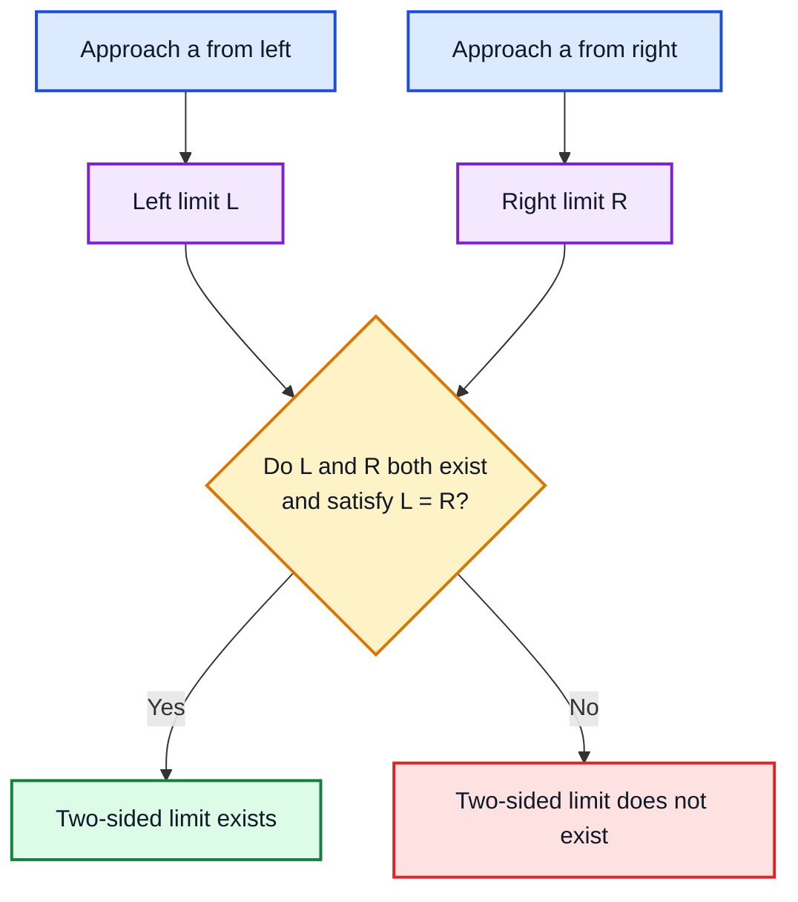

### Important point

The function need not be defined at $a$ for the limit to exist. A limit studies nearby behavior, not necessarily the value at the point.

---

# 14. Limits at Infinity

## 14.1 Limit as $x\to+\infty$

$$
\lim_{x\to\infty}f(x)=L
$$

means $f(x)$ becomes close to $L$ as $x$ becomes arbitrarily large.

## 14.2 Limit as $x\to-\infty$

$$
\lim_{x\to-\infty}f(x)=L
$$

means $f(x)$ becomes close to $L$ as $x$ becomes arbitrarily negative.

---

## 14.3 Example: reciprocal function

Let

$$
f(x)=\frac1x
$$

Then

$$
\lim_{x\to\infty}\frac1x=0
$$

and

$$
\lim_{x\to-\infty}\frac1x=0.
$$

The $x$-axis is a horizontal asymptote.

At zero, however,

$$
\lim_{x\to0^-}\frac1x=-\infty
$$

while

$$
\lim_{x\to0^+}\frac1x=+\infty
$$

Thus the real two-sided limit at zero does not exist.

---

## 14.4 Why tails matter in statistics

Limits at infinity describe the tails of distributions.

For the standard normal density,

$$
\phi(x)
=
\frac1{\sqrt{2\pi}}e^{-x^2/2}
$$

$$
\lim_{x\to\infty}\phi(x)=0,
\qquad
\lim_{x\to-\infty}\phi(x)=0.
$$

The density gets closer to zero but remains positive for every finite $x$.

---

# 15. Substitution, Indeterminate Forms, and Standard Limits

## 15.1 When direct substitution works

For many well-behaved functions,

$$
\lim_{x\to a}f(x)=f(a)
$$

Examples include:

$$
\lim_{x\to a}x^k=a^k
$$

for positive integers $k$,

$$
\lim_{x\to a}e^x=e^a
$$

$$
\lim_{x\to a}\log x=\log a
\quad(a>0)
$$

$$
\lim_{x\to a}\sin x=\sin a
$$

and, where tangent is defined,

$$
\lim_{x\to a}\tan x=\tan a
$$

These work because the functions are continuous at the relevant points.

---

## 15.2 Direct substitution can fail

### Example 1: actual divergence

$$
\lim_{x\to0}\frac1x
$$

cannot be evaluated by substitution, and the two-sided limit does not exist.

### Example 2: removable problem

Evaluate

$$
\lim_{x\to2}
\frac{x^2-5x+6}{x-2}
$$

Substitution gives

$$
\frac00
$$

which is not a number. It does **not** tell us the limit is zero or that it automatically fails.

Factor:

$$
x^2-5x+6=(x-2)(x-3)
$$

For $x\ne2$,

$$
\frac{x^2-5x+6}{x-2}
=
x-3
$$

Therefore,

$$
\lim_{x\to2}
\frac{x^2-5x+6}{x-2}
=
\lim_{x\to2}(x-3)
=
-1
$$

The original function has a hole at $x=2$, but its nearby values approach $-1$.

---

## 15.3 Indeterminate form $0/0$

The symbol

$$
\frac00
$$

is called an indeterminate form in a limit problem. It means more work is needed.

Different functions producing $0/0$ can have completely different limits:

$$
\frac{x}{x}=1
\quad(x\ne0)
$$

$$
\frac{x^2}{x}=x\to0
$$

$$
\frac{|x|}{x}
$$

has different left and right limits.

Thus $0/0$ does not determine an answer.

---

## 15.4 Standard trigonometric limit

Using radians,

$$
\boxed{
\lim_{x\to0}\frac{\sin x}{x}=1
}
$$

The lecture motivates this numerically and geometrically. The geometric proof uses inequalities from the unit circle and a sandwich argument.

A common bounding form for small positive $x$ is

$$
\cos x
\le
\frac{\sin x}{x}
\le
1
$$

Since

$$
\cos x\to1
$$

the sandwich principle yields the result.

---

## 15.5 Standard logarithmic limit

$$
\boxed{
\lim_{x\to0}
\frac{\log(1+x)}{x}
=
1
}
$$

when $\log$ denotes the natural logarithm.

A useful inequality around $x=0$ is based on bounding the expression between quantities that both approach $1$.

This limit later explains why

$$
\frac{d}{dx}\ln x=\frac1x
$$

---

## 15.6 Ratio of exponential expressions

Evaluate

$$
\lim_{x\to\infty}
\frac{a+be^x}{c+de^x},
\qquad
d\ne0.
$$

Multiply numerator and denominator by $e^{-x}$:

$$
\frac{ae^{-x}+b}{ce^{-x}+d}.
$$

Since

$$
e^{-x}\to0,
$$

we obtain

$$  
\boxed{
\lim_{x\to\infty}
\frac{a+be^x}{c+de^x}
=
\frac bd
}
$$

### General pattern

For large $x$, the dominant exponential terms control the ratio.

---

## 15.7 Limit-solving workflow

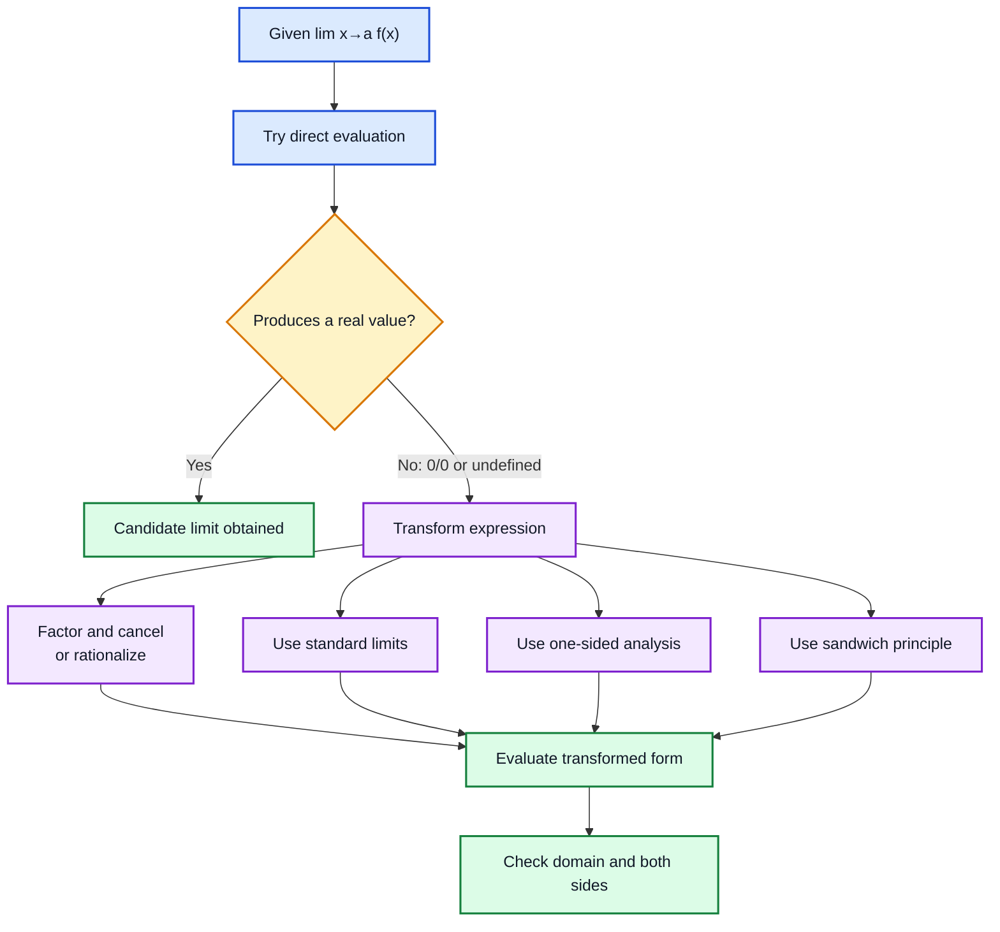

---

# 16. Continuity

## 16.1 Definition

A function $f$ is continuous at $a$ if:

1. $f(a)$ is defined.
2. $\lim_{x\to a}f(x)$ exists.
3. The limit equals the function value.

In one equation,

$$
\boxed{
\lim_{x\to a}f(x)=f(a)
}
$$

### Geometric intuition

A continuous graph has no jump, hole, or incompatible break at the point.

---

## 16.2 Continuous extension

Consider

$$
g(x)=\frac{\sin x}{x},
\qquad
x\ne0
$$

The expression is undefined at $x=0$, but

$$
\lim_{x\to0}\frac{\sin x}{x}=1
$$

Define a new function

$$
f(x)
=
\begin{cases}
\dfrac{\sin x}{x},&x\ne0,\\[6pt]
1,&x=0.
\end{cases}
$$

Then

$$
\lim_{x\to0}f(x)=f(0)=1
$$

So $f$ is continuous at zero.

This repairs a removable discontinuity.

---

## 16.3 Evaluating versus substituting

The lecture distinguishes these ideas:

- **Substituting** means inserting $a$ into a particular formula.
- **Evaluating** means determining the actual value $f(a)$, possibly from a piecewise definition or an equivalent expression.

A formula may fail at a point even when a related, properly defined function has a meaningful value there.

---

## 16.4 Continuity decision tree

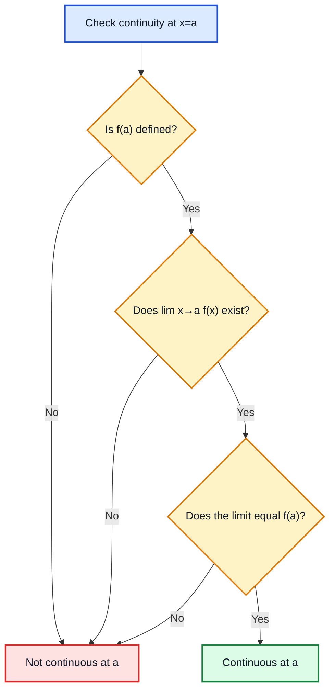

---

# 17. Data Science Connections

## 17.1 Functions as models

A predictive model is a function:

$$
\hat y=f(x).
$$

For one feature, $x\in\mathbb R$. For several features,

$$
x\in\mathbb R^d.
$$

The Week 7 lectures begin with one-variable functions before extending calculus ideas to multivariable models.

---

## 17.2 Linear regression

A one-feature linear regression model is

$$
\hat y=mx+c
$$

- $m$: effect of changing the feature.
- $c$: baseline prediction at $x=0$.

---

## 17.3 Logistic models

The logistic function is built from the exponential:

$$
\sigma(x)=\frac1{1+e^{-x}}.
$$

It maps real values to probabilities in $(0,1)$.

---

## 17.4 Normal distribution

The standard normal density is

$$
\phi(x)=\frac1{\sqrt{2\pi}}e^{-x^2/2}
$$

Its graph and tail behavior rely on exponential functions and limits.

---

## 17.5 Optimization

Gradient-based learning depends on tangent and derivative ideas.

For a loss function $L(w)$, the derivative indicates the local direction of change:

- positive derivative: loss increases as $w$ increases,
- negative derivative: loss decreases,
- derivative near zero: candidate stationary point.

The tangent intuition in L7.3 is therefore a foundation for training machine-learning models.

---

## 17.6 Convergence of algorithms

Iterative algorithms generate sequences:

$$
w_1,w_2,w_3,\ldots
$$

Training is successful when the sequence approaches a stable value or when the loss sequence

$$
L(w_n)
$$

converges.

Convergence speed determines computational cost.

---

# 18. Python Experiments

## 18.1 Compare sequence convergence speeds

```python
import math

def sequence_values(n: int) -> tuple[float, float, float]:
    """Return the three lecture-inspired sequences at index n."""
    if n < 2:
        raise ValueError("Use n >= 2 because log(n) appears.")

    a_n = 2 - 1 / n
    b_n = 2 - 1 / (n ** 2)
    c_n = 2 - 1 / ((1 + math.log(n)) ** 1.1)
    return a_n, b_n, c_n


for n in [10, 50, 200, 2000]:
    a_n, b_n, c_n = sequence_values(n)
    print(
        f"n={n:4d} | "
        f"2-1/n={a_n:.6f} | "
        f"2-1/n²={b_n:.6f} | "
        f"log-based={c_n:.6f}"
    )
```

The second sequence approaches $2$ much faster, while the logarithmic sequence approaches it slowly.

---

## 18.2 Verify $\sin x/x\to1$

```python
import math

for exponent in range(1, 9):
    x = 10 ** (-exponent)
    ratio = math.sin(x) / x
    print(f"x={x:.0e}, sin(x)/x={ratio:.12f}")
```

Always use radians for this limit.

---

## 18.3 Explore a removable discontinuity

```python
def rational_expression(x: float) -> float:
    """Original expression; undefined at x=2."""
    if x == 2:
        raise ZeroDivisionError("The original formula is undefined at x=2.")
    return (x**2 - 5*x + 6) / (x - 2)


for x in [1.9, 1.99, 1.999, 2.001, 2.01, 2.1]:
    print(x, rational_expression(x))
```

The values approach $-1$ even though the original formula is undefined at $2$.

---

## 18.4 Plot common functions

```python
import numpy as np
import matplotlib.pyplot as plt

x = np.linspace(-2 * np.pi, 2 * np.pi, 1000)

plt.figure(figsize=(10, 5))
plt.plot(x, np.sin(x), label="sin(x)")
plt.plot(x, np.cos(x), label="cos(x)")
plt.axhline(0, linewidth=0.8)
plt.axvline(0, linewidth=0.8)
plt.xlabel("x")
plt.ylabel("function value")
plt.title("Sine and Cosine")
plt.legend()
plt.grid(True)
plt.show()
```

---

# 19. Common Mistakes

## Mistake 1: confusing codomain and range

The codomain is declared in the function definition. The range contains the outputs actually achieved.

---

## Mistake 2: ignoring denominator restrictions

For

$$
\frac{f(x)}{g(x)}
$$

remove every input for which

$$
g(x)=0
$$

---

## Mistake 3: forgetting composition order

$$
(g\circ f)(x)=g(f(x))
$$

Apply $f$ first, then $g$.

Usually,

$$
g\circ f\ne f\circ g
$$

---

## Mistake 4: calling every one-point intersection a tangent

A line can intersect a curve once without representing its instantaneous direction. Conversely, a true tangent can intersect the curve elsewhere.

---

## Mistake 5: believing continuity guarantees differentiability

The function

$$
|x|
$$

is continuous at $0$, but it has no unique tangent there.

Differentiability is stronger than continuity.

---

## Mistake 6: saying $0/0=0$

The form $\frac{0}{0}$ is undefined and indeterminate in limit problems.

---

## Mistake 7: checking only one approach sequence

To establish a function limit through sequences, the behavior must agree for every valid sequence approaching the point.

---

## Mistake 8: assuming a limit requires $f(a)$

A limit can exist even if the function is not defined at $a$.

---

## Mistake 9: forgetting left and right limits

At a jump, each one-sided limit may exist, but the two-sided limit fails because they differ.

---

## Mistake 10: using degrees in $\sin x/x$

The standard result

$$
\lim_{x\to0}\frac{\sin x}{x}=1
$$

requires $x$ in radians.

---

# 20. Formula Sheet

## Functions

$$
f:X\to Y
$$

$$
\operatorname{Range}(f)
=
\{f(x):x\in X\}
$$

## Linear

$$
f(x)=mx+c
$$

## Quadratic vertex form

$$
f(x)=a(x-b)^2+c
$$

## Polynomial

$$
p(x)=a_nx^n+\cdots+a_0
$$

## Exponential–log inverse

$$
y=\log_a x
\iff
a^y=x
$$

## Trigonometric identities

$$
\sin^2x+\cos^2x=1
$$

$$
\tan x=\frac{\sin x}{\cos x}
$$

$$
\sec x=\frac1{\cos x}
$$

$$
\csc x=\frac1{\sin x}
$$

## Composition

$$
(g\circ f)(x)=g(f(x))
$$

## Graph

$$
\Gamma_f=\{(x,f(x)):x\in D\}
$$

## Sequence limit

$$
a_n\to L
\iff
\lim_{n\to\infty}a_n=L
$$

## Exponential limits

$$
\left(1+\frac{x}{n}\right)^n\to e^x
$$

$$
e^x
=
\sum_{k=0}^{\infty}\frac{x^k}{k!}
$$

## Sandwich principle

$$
u_n\le v_n\le w_n,\quad
u_n,w_n\to L
\implies
v_n\to L
$$

## One-sided limits

$$
\lim_{x\to a^-}f(x)
$$

$$
\lim_{x\to a^+}f(x)
$$

## Two-sided criterion

$$
\lim_{x\to a}f(x)=L
\iff
\lim_{x\to a^-}f(x)
=
\lim_{x\to a^+}f(x)
=
L
$$

## Standard limits

$$
\lim_{x\to0}\frac{\sin x}{x}=1
$$

$$
\lim_{x\to0}\frac{\ln(1+x)}{x}=1
$$

## Continuity

$$
f\text{ continuous at }a
\iff
\lim_{x\to a}f(x)=f(a)
$$

---

# 21. Practice Questions

## Conceptual

1. Define domain, codomain, and range.
2. Why is the range always a subset of the codomain?
3. Is every curve the graph of a function? Explain.
4. Why is a line that intersects a curve only once not automatically a tangent?
5. Why does $|x|$ have no tangent at $x=0$?
6. What is a subsequence?
7. How can two subsequences prove that a sequence diverges?
8. Explain the difference between divergence by oscillation and divergence to infinity.
9. Why can a function limit exist even if the function is undefined at the point?
10. State the condition for a two-sided limit to exist.
11. Distinguish evaluating a function from substituting into one formula.
12. Why is $0/0$ called indeterminate?

## Computation

13. For $f(x)=5x+2$, find $f(-3)$.
14. Find the vertex of $f(x)=3(x-4)^2-7$.
15. Find the roots of $x^3-9x$.
16. State the domain of $\tan x$.
17. State the domain of $\sec x$.
18. If $f(x)=x^2+1$ and $g(x)=\sqrt{x}$, find $(g\circ f)(x)$.
19. If $f(x)=2x-1$ and $g(x)=x^2$, find $g\circ f$ and $f\circ g$.
20. Evaluate $\lim_{n\to\infty}(3-\frac{2}{n})$.
21. Evaluate $\lim_{n\to\infty}\frac{(-1)^n}{n^2}$.
22. Determine whether $(-1)^n$ converges.
23. Evaluate $\lim_{n\to\infty}\frac{4n^2+1}{2n^2-3}$.
24. Evaluate $\lim_{x\to3}(x^2-2x+4)$.
25. Evaluate $\lim_{x\to2}\frac{x^2-4}{x-2}$.
26. Determine $\lim_{x\to0^-}\frac1x$ and $\lim_{x\to0^+}\frac1x$.
27. Determine whether $\lim_{x\to0}\frac1x$ exists.
28. Evaluate $\lim_{x\to0}\frac{\sin(5x)}{x}$.
29. Evaluate $\lim_{x\to0}\frac{\ln(1+3x)}{x}$.
30. Evaluate
$$
\lim_{x\to\infty}
\frac{2+7e^x}{5+4e^x}.
$$
31. Is the floor function continuous at $2$
32. Is the floor function continuous at $2.4$
33. Define
$$
f(x)=
\begin{cases}
\dfrac{x^2-1}{x-1},&x\ne1,\\
c,&x=1.
\end{cases}
$$
Find $c$ so that $f$ is continuous at $1$.
34. Define
$$
h(x)=
\begin{cases}
\dfrac{\sin x}{x},&x\ne0,\\
k,&x=0.
\end{cases}
$$
Find $k$ so that $h$ is continuous at $0$.
35. Explain why the Dirichlet function has no limit at any real number.

---

# 22. Solutions

## 1. Domain, codomain, range

The domain is the set of allowed inputs. The codomain is the declared target set. The range is the subset of the codomain actually produced.

---

## 2. Why range is a subset

Every output $f(x)$ must belong to the codomain by the definition of $f:X\to Y$. The range collects these outputs, so it lies inside $Y$.

---

## 3. Every curve a graph?

No. A circle is a curve, but a vertical line can meet it twice, so it cannot be the graph $y=f(x)$ of a one-variable function over the full circle.

---

## 4. One intersection versus tangent

Tangency is about local instantaneous direction. A line can cross a curve once without matching its local direction, and a tangent can meet the curve at other distant points.

---

## 5. Why no tangent for $|x|$ at zero?

The left-hand direction has slope $-1$, while the right-hand direction has slope $1$. No unique line matches both.

---

## 6. Subsequence

A subsequence is formed by selecting terms of a sequence in their original order, possibly discarding other terms.

---

## 7. Different subsequence limits

If the original sequence converged to $L$, every subsequence would also converge to $L$. Therefore, two subsequences with different limits prove divergence.

---

## 8. Oscillation versus infinity

An oscillating sequence such as $(-1)^n$ jumps among values without settling. The sequence $n$ moves consistently beyond every finite number.

---

## 9. Limit without a function value

The limit depends on values near the point. The point itself can be missing, as in a removable discontinuity.

---

## 10. Two-sided limit criterion

Both one-sided limits must exist and be equal.

---

## 11. Evaluation versus substitution

Substitution uses a specific algebraic formula. Evaluation determines the function’s actual defined value, perhaps through a piecewise rule or equivalent representation.

---

## 12. Why $0/0$ is indeterminate

Different expressions yielding $0/0$ after substitution can approach different limits, so the form alone does not determine an answer.

---

## 13. Linear evaluation

$$
f(-3)=5(-3)+2=-15+2=\boxed{-13}.
$$

---

## 14. Quadratic vertex

$$
f(x)=3(x-4)^2-7
$$

Thus,

$$
\boxed{(4,-7)}
$$

---

## 15. Roots

$$
x^3-9x=x(x^2-9)=x(x-3)(x+3)
$$

Therefore,

$$
\boxed{x=-3,0,3}
$$

---

## 16. Domain of tangent

$$
\boxed{
\mathbb R\setminus
\left\{
\frac{(2k+1)\pi}{2}:k\in\mathbb Z
\right\}
}
$$

---

## 17. Domain of secant

Since $\sec x=1/\cos x$, it has the same restriction:

$$
\boxed{
\mathbb R\setminus
\left\{
\frac{(2k+1)\pi}{2}:k\in\mathbb Z
\right\}
}
$$

---

## 18. Composition with square root

$$
(g\circ f)(x)
=
g(x^2+1)
=
\boxed{\sqrt{x^2+1}}
$$

---

## 19. Both composition orders

$$ 
(g\circ f)(x)
=
g(2x-1)
=
\boxed{(2x-1)^2}
$$

$$
(f\circ g)(x)
=
f(x^2)
=
\boxed{2x^2-1}
$$

They are not equal in general.

---

## 20. Sequence limit

$$
3-\frac2n\to3-0=\boxed{3}
$$

---

## 21. Alternating sequence with shrinking magnitude

$$
-\frac1{n^2}
\le
\frac{(-1)^n}{n^2}
\le
\frac1{n^2}
$$

Both bounds tend to zero, so

$$
\boxed{0}
$$

---

## 22. Does $(-1)^n$ converge?

No. Its even subsequence converges to $1$, while its odd subsequence converges to $-1$. Therefore it diverges.

---

## 23. Rational sequence

Divide by $n^2$:

$$
\frac{4+\frac1{n^2}}{2-\frac3{n^2}}
\to
\frac42
=
\boxed{2}
$$

---

## 24. Polynomial limit

Direct evaluation is valid:

$$
3^2-2(3)+4=9-6+4=\boxed{7}
$$

---

## 25. Removable factor

$$
\frac{x^2-4}{x-2}
=
\frac{(x-2)(x+2)}{x-2}
=
x+2
\quad(x\ne2)
$$

Thus,

$$
\boxed{4}
$$

---

## 26. One-sided reciprocal limits

$$
\boxed{
\lim_{x\to0^-}\frac1x=-\infty
}
$$

and

$$
\boxed{
\lim_{x\to0^+}\frac1x=+\infty
}
$$

---

## 27. Two-sided reciprocal limit

The one-sided behaviors differ, so the real two-sided limit does not exist.

---

## 28. Scaled sine limit

$$
\frac{\sin(5x)}{x}
=
5\frac{\sin(5x)}{5x}
$$

As $x\to0$,

$$
\boxed{5}
$$

---

## 29. Scaled logarithmic limit

$$
\frac{\ln(1+3x)}{x}
=
3\frac{\ln(1+3x)}{3x}
$$

Therefore,

$$
\boxed{3}
$$

---

## 30. Exponential ratio

$$
\lim_{x\to\infty}
\frac{2+7e^x}{5+4e^x}
=
\boxed{\frac74}
$$

---

## 31. Floor continuity at $2$

No. The left limit is $1$ and the right limit is $2$.

---

## 32. Floor continuity at $2.4$

Yes. In a sufficiently small interval around $2.4$, the function is constantly $2$, so

$$
\lim_{x\to2.4}\lfloor x\rfloor=2=\lfloor2.4\rfloor.
$$

---

## 33. Repairing the hole

For $x\ne1$,

$$
\frac{x^2-1}{x-1}
=
x+1
$$

Therefore,

$$
\lim_{x\to1}\frac{x^2-1}{x-1}
=
2
$$

Choose

$$
\boxed{c=2}
$$

---

## 34. Sine extension

Since

$$
\lim_{x\to0}\frac{\sin x}{x}=1
$$

choose

$$
\boxed{k=1}
$$

---

## 35. Dirichlet function

Near every real number, there are both rational and irrational numbers. Along rational sequences the function values are \(1\); along irrational sequences they are \(0\). Since the outputs approach different values, no limit exists at any point.

---

# Final Concept Map

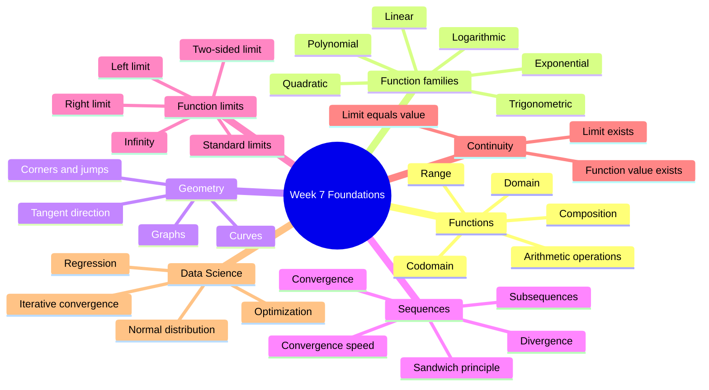

---

## One-Sentence Summary

> Functions create graphs, graphs motivate tangents, tangents require limits, sequence limits provide the foundation for function limits, and continuity identifies the points where nearby function behavior agrees with the function’s actual value.
