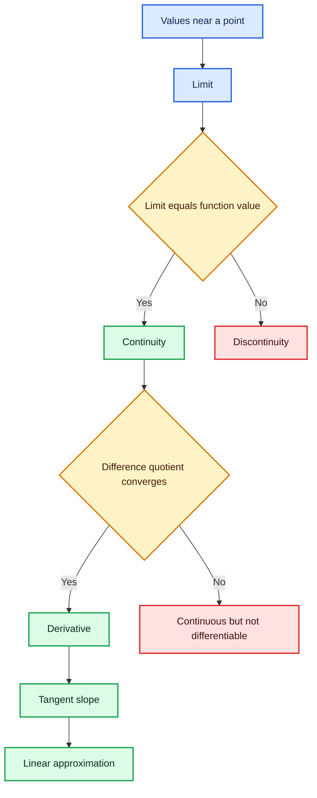
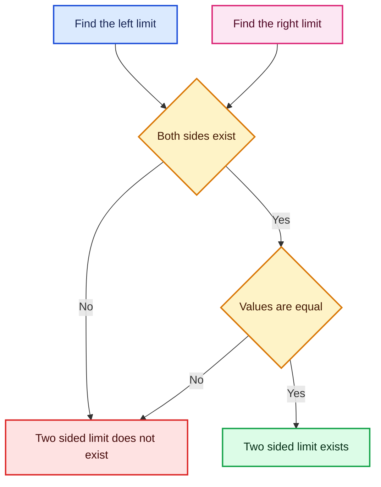
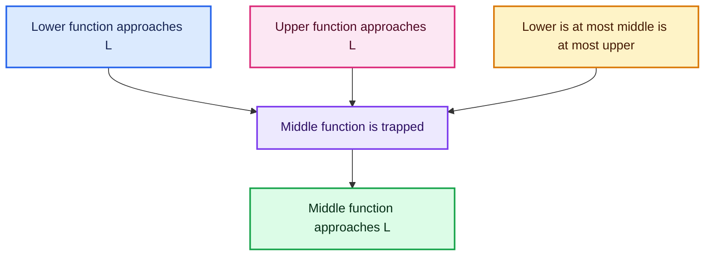
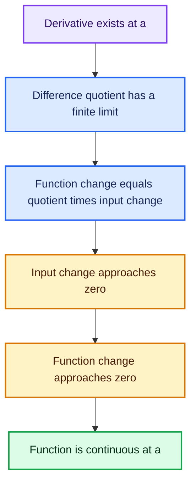
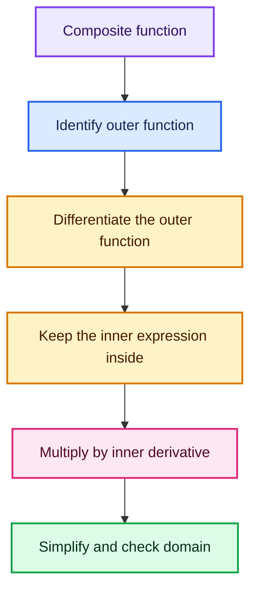
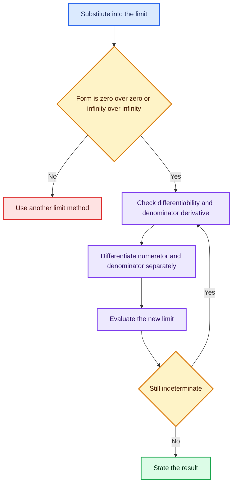
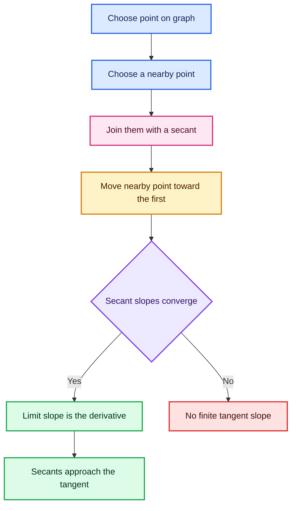
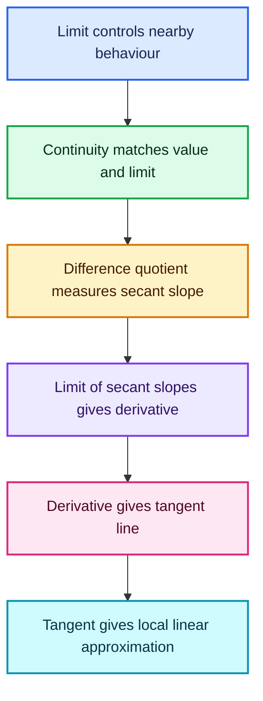

# Week 8 Mathematics: Limits, Continuity, Derivatives, Tangents, and Linear Approximation

> Detailed study notes based on IIT Madras Mathematics 2 lectures L8.1–L8.4.
>
> **Central idea:** a limit describes what happens *near* a point; continuity connects that nearby behaviour to the value *at* the point; a derivative measures instantaneous change; and the derivative produces the tangent line—the best local linear model of a smooth function.

---

## Table of Contents

1. [Learning map](#1-learning-map)
2. [Essential notation](#2-essential-notation)
3. [L8.1 — Limits and continuity](#3-l81--limits-and-continuity)
4. [L8.2 — Differentiability and the derivative](#4-l82--differentiability-and-the-derivative)
5. [L8.3 — Computing derivatives](#5-l83--computing-derivatives)
6. [L'Hôpital's rule](#6-lhôpitals-rule)
7. [L8.4 — Tangents and linear approximation](#7-l84--tangents-and-linear-approximation)
8. [How all the ideas connect](#8-how-all-the-ideas-connect)
9. [Common mistakes and exam traps](#9-common-mistakes-and-exam-traps)
10. [Practice questions](#10-practice-questions)
11. [Answers and solutions](#11-answers-and-solutions)
12. [Final formula sheet](#12-final-formula-sheet)
13. [Fun facts](#13-fun-facts)

---

## 1. Learning map

The dependency is one-way:

$$
\boxed{\text{Differentiable at }a \implies \text{Continuous at }a}
$$

but the converse is false:

$$
\text{Continuous at }a \centernot\implies \text{Differentiable at }a.
$$

For example, $f(x)=|x|$ is continuous at $0$ but has a sharp corner there, so it is not differentiable at $0$.

---

## 2. Essential notation

| Notation | Meaning |
|---|---|
| $x\to a$ | $x$ approaches $a$ from either side |
| $x\to a^-$ | $x$ approaches $a$ from values smaller than $a$ |
| $x\to a^+$ | $x$ approaches $a$ from values larger than $a$ |
| $\lim_{x\to a}f(x)=L$ | $f(x)$ approaches $L$ as $x$ approaches $a$ |
| $f'(a)$ | derivative of $f$ at $x=a$ |
| $f'(x)$ or $\dfrac{df}{dx}$ | derivative function |
| $\Delta x$ | a finite change in input |
| $h$ | a small nonzero input change that will approach $0$ |
| $\approx$ | approximately equal |

### A crucial distinction

- $x\to a$ does **not** mean $x=a$.
- A limit studies nearby inputs and may exist even when $f(a)$ is missing or has a different value.
- Continuity is the extra condition that connects the limiting value to $f(a)$.

---

## 3. L8.1 — Limits and continuity

### 3.1 What is a limit?

The statement

$$
\lim_{x\to a}f(x)=L
$$

means that we can make $f(x)$ as close to $L$ as desired by choosing $x$ sufficiently close to $a$, while allowing $x\ne a$.

#### Why do we need limits?

Limits let us study:

- a function at a hole where it is not defined;
- its behaviour near a jump;
- instantaneous rates of change;
- tangent slopes;
- infinite processes and asymptotic behaviour.

#### Example: a removable hole

Let

$$
f(x)=\frac{x^2-4}{x-2},\qquad x\ne2.
$$

Factor the numerator:

$$
f(x)=\frac{(x-2)(x+2)}{x-2}=x+2,\qquad x\ne2.
$$

Although $f(2)$ is not defined in the original expression,

$$
\lim_{x\to2}f(x)=\lim_{x\to2}(x+2)=4.
$$

The limit asks where the values are going, not whether the original formula can be evaluated at the point.

### 3.2 One-sided limits

The **left-hand limit** is

$$
\lim_{x\to a^-}f(x),
$$

and the **right-hand limit** is

$$
\lim_{x\to a^+}f(x).
$$

A finite two-sided limit exists exactly when both one-sided limits exist and are equal:

$$
\boxed{
\lim_{x\to a}f(x)=L
\iff
\lim_{x\to a^-}f(x)=L=\lim_{x\to a^+}f(x)
}
$$

### 3.3 The floor function

The floor function $\lfloor x\rfloor$ is the greatest integer less than or equal to $x$.

If $n$ is an integer, then

$$
\lim_{x\to n^-}\lfloor x\rfloor=n-1,
\qquad
\lim_{x\to n^+}\lfloor x\rfloor=n.
$$

Since $n-1\ne n$,

$$
\lim_{x\to n}\lfloor x\rfloor
$$

does not exist. The function jumps at every integer.

If $a$ is not an integer, nearby values of $x$ remain within the same integer interval, so

$$
\lim_{x\to a}\lfloor x\rfloor=\lfloor a\rfloor.
$$

### 3.4 Continuity at a point

A function $f$ is continuous at $x=a$ when all three conditions hold:

1. $f(a)$ is defined.
2. $\lim_{x\to a}f(x)$ exists.
3. $\lim_{x\to a}f(x)=f(a)$.

Thus,

$$
\boxed{f\text{ is continuous at }a\iff\lim_{x\to a}f(x)=f(a)}
$$

This compact equation silently includes the requirement that both sides exist.

#### Intuition

A continuous graph can be traced through the point without lifting the pen. This is a helpful picture, although the limit definition is the mathematically precise test.

#### Example: repairing a removable discontinuity

Define

$$
f(x)=
\begin{cases}
\dfrac{x^2-9}{x-3}, & x\ne3,\\[4pt]
k, & x=3.
\end{cases}
$$

For continuity at $3$,

$$
k=f(3)=\lim_{x\to3}\frac{(x-3)(x+3)}{x-3}=6.
$$

Therefore, the hole is repaired by choosing $\boxed{k=6}$.

### 3.5 Limit laws

Suppose

$$
\lim_{x\to a}f(x)=L,
\qquad
\lim_{x\to a}g(x)=M.
$$

Then:

| Operation | Law |
|---|---|
| Constant multiple | $\displaystyle \lim_{x\to a}cf(x)=cL$ |
| Sum | $\displaystyle \lim_{x\to a}[f(x)+g(x)]=L+M$ |
| Difference | $\displaystyle \lim_{x\to a}[f(x)-g(x)]=L-M$ |
| Product | $\displaystyle \lim_{x\to a}f(x)g(x)=LM$ |
| Quotient | $\displaystyle \lim_{x\to a}\frac{f(x)}{g(x)}=\frac{L}{M}$, provided $M\ne0$ |
| Integer power | $\displaystyle \lim_{x\to a}[f(x)]^n=L^n$ |

The quotient rule for limits cannot be used when the denominator limit is zero.

### 3.6 Direct substitution and polynomial continuity

For a positive integer $n$,

$$
\lim_{x\to a}x^n=a^n.
$$

Using limit laws, every polynomial

$$
p(x)=a_nx^n+a_{n-1}x^{n-1}+\cdots+a_1x+a_0
$$

is continuous for every real $x$. Therefore,

$$
\boxed{\lim_{x\to a}p(x)=p(a)}.
$$

Rational functions are continuous wherever their denominators are nonzero.

### 3.7 Sandwich or Squeeze Theorem

Suppose that near $a$,

$$
g(x)\le f(x)\le h(x),
$$

and

$$
\lim_{x\to a}g(x)=L=\lim_{x\to a}h(x).
$$

Then

$$
\boxed{\lim_{x\to a}f(x)=L}.
$$

#### Why it works

If the lower and upper bounds both become arbitrarily close to $L$, the trapped middle value has nowhere else to go.

### 3.8 Fundamental trigonometric limit

When $x$ is measured in **radians**,

$$
\boxed{\lim_{x\to0}\frac{\sin x}{x}=1}.
$$

A geometric argument gives, for small positive $x$,

$$
\cos x\le\frac{\sin x}{x}\le1.
$$

Since $\cos x\to1$ as $x\to0$, the Squeeze Theorem gives the result. Symmetry handles negative $x$.

#### Consequences

Using substitutions and identities:

$$
\lim_{x\to0}\frac{\sin(kx)}{x}=k,
$$

because

$$
\frac{\sin(kx)}{x}
=k\frac{\sin(kx)}{kx}.
$$

Also,

$$
\lim_{x\to0}\frac{1-\cos x}{x}=0
$$

and

$$
\boxed{\lim_{x\to0}\frac{1-\cos x}{x^2}=\frac12}.
$$

For the second result, use $1-\cos x=2\sin^2(x/2)$:

$$
\frac{1-\cos x}{x^2}
=\frac12\left(\frac{\sin(x/2)}{x/2}\right)^2\to\frac12.
$$

### 3.9 Limits of composite functions

If

$$
\lim_{x\to a}g(x)=b
$$

and $f$ is continuous at $b$, then

$$
\boxed{\lim_{x\to a}f(g(x))=f(b)}.
$$

Example:

$$
\lim_{x\to0}\cos(x^2)=\cos\left(\lim_{x\to0}x^2\right)=\cos0=1.
$$

Continuity of the outer function is what justifies moving the limit inside it.

---

## 4. L8.2 — Differentiability and the derivative

### 4.1 Average rate versus instantaneous rate

Suppose a truck covers $2400$ km in $40$ hours. Its average speed is

$$
\frac{2400}{40}=60\text{ km/h}.
$$

This does **not** prove that the truck was travelling at exactly $60$ km/h at every moment. It may have stopped, slowed down, or exceeded $60$ km/h during parts of the journey.

For a position function $s(t)$, the average velocity between $t=a$ and $t=a+h$ is

$$
\frac{s(a+h)-s(a)}{h}.
$$

To obtain instantaneous velocity, shrink the time interval:

$$
v(a)=\lim_{h\to0}\frac{s(a+h)-s(a)}{h}=s'(a).
$$

### 4.2 Definition of the derivative

A function $f$ is differentiable at $a$ if the following finite limit exists:

$$
\boxed{
f'(a)=\lim_{h\to0}\frac{f(a+h)-f(a)}{h}
}
$$

An equivalent form is

$$
\boxed{
f'(a)=\lim_{x\to a}\frac{f(x)-f(a)}{x-a}
}.
$$

The expression

$$
\frac{f(a+h)-f(a)}{h}
$$

is the **difference quotient**.

### 4.3 What does a derivative mean?

The derivative has several equivalent interpretations:

| Viewpoint | Interpretation of $f'(a)$ |
|---|---|
| Motion | instantaneous velocity |
| Geometry | slope of the tangent line |
| Measurement | instantaneous rate of output change per unit input change |
| Approximation | coefficient of the best local linear model |
| Data science | local sensitivity of a model output to one input |

If $f'(a)>0$, the function is locally increasing at $a$. If $f'(a)<0$, it is locally decreasing. If $f'(a)=0$, the tangent is horizontal, although the point need not be a maximum or minimum.

### 4.4 Computing a derivative from first principles

Let $f(x)=x^2$. Then

$$
\begin{aligned}
f'(a)
&=\lim_{h\to0}\frac{(a+h)^2-a^2}{h}\\
&=\lim_{h\to0}\frac{a^2+2ah+h^2-a^2}{h}\\
&=\lim_{h\to0}(2a+h)\\
&=2a.
\end{aligned}
$$

Therefore,

$$
\boxed{\frac{d}{dx}x^2=2x}.
$$

### 4.5 One-sided derivatives

The right and left derivatives at $a$ are

$$
f'_+(a)=\lim_{h\to0^+}\frac{f(a+h)-f(a)}{h},
$$

$$
f'_-(a)=\lim_{h\to0^-}\frac{f(a+h)-f(a)}{h}.
$$

The ordinary derivative exists exactly when the two finite one-sided derivatives exist and are equal.

### 4.6 Example: $f(x)=|x|$ at $0$

Since $f(0)=0$,

$$
\frac{f(0+h)-f(0)}{h}=\frac{|h|}{h}.
$$

For $h>0$, this equals $1$; for $h<0$, it equals $-1$. Hence,

$$
f'_+(0)=1,
\qquad
f'_-(0)=-1.
$$

The values disagree, so $f'(0)$ does not exist. Geometrically, $|x|$ has a corner at the origin.

### 4.7 Example: $f(x)=x^{1/3}$ at $0$

The difference quotient is

$$
\frac{h^{1/3}-0}{h}=\frac{1}{h^{2/3}}.
$$

As $h\to0$, this grows without bound. Under the course definition, a derivative must be a finite real number, so $f'(0)$ does not exist.

However, the graph has the vertical tangent

$$
x=0.
$$

This example separates two statements:

- the graph may have a vertical tangent;
- the ordinary finite derivative may still fail to exist.

### 4.8 Example: an oscillating function

Define

$$
f(x)=
\begin{cases}
x\sin(1/x), & x\ne0,\\
0, & x=0.
\end{cases}
$$

It is continuous at $0$ because

$$
|x\sin(1/x)|\le|x|\to0.
$$

But its difference quotient at $0$ is

$$
\frac{f(h)-f(0)}{h}=\sin(1/h),
$$

which oscillates and has no limit from either side. Thus the function is continuous but not differentiable at $0$.

> **Transcript clarification:** a statement that one side tends to $0$ for this exact difference quotient would be incorrect; $\sin(1/h)$ oscillates from both sides.

### 4.9 Differentiability implies continuity

Suppose $f'(a)$ exists. For $x\ne a$,

$$
f(x)-f(a)
=\frac{f(x)-f(a)}{x-a}(x-a).
$$

Taking the limit as $x\to a$,

$$
\lim_{x\to a}[f(x)-f(a)]
=f'(a)\cdot0=0.
$$

Therefore,

$$
\lim_{x\to a}f(x)=f(a),
$$

so $f$ is continuous at $a$.

The reverse implication fails. Continuity removes holes and jumps, but a continuous graph can still contain a corner, cusp, vertical tangent, or rapid oscillation.

---

## 5. L8.3 — Computing derivatives

### 5.1 Core derivative rules

Assume $f$ and $g$ are differentiable, and $c$ is a constant.

| Rule | Formula |
|---|---|
| Constant | $\dfrac{d}{dx}c=0$ |
| Identity | $\dfrac{d}{dx}x=1$ |
| Constant multiple | $(cf)'=cf'$ |
| Sum | $(f+g)'=f'+g'$ |
| Difference | $(f-g)'=f'-g'$ |
| Product | $(fg)'=f'g+fg'$ |
| Quotient | $\displaystyle\left(\frac{f}{g}\right)'=\frac{f'g-fg'}{g^2}$, where $g\ne0$ |
| Chain | $(f\circ g)'(x)=f'(g(x))g'(x)$ |

### 5.2 Why the product rule has two terms

If both factors change, the total first-order change receives a contribution from each one:

$$
\begin{aligned}
f(a+h)g(a+h)-f(a)g(a)
={}&f(a+h)[g(a+h)-g(a)]\\
&+g(a)[f(a+h)-f(a)].
\end{aligned}
$$

Divide by $h$ and let $h\to0$. Continuity of differentiable functions gives $f(a+h)\to f(a)$, producing

$$
(fg)'(a)=f'(a)g(a)+f(a)g'(a)
$$

The incorrect shortcut $(fg)'=f'g'$ ignores how the first factor changes while the second is present, and vice versa.

### 5.3 Power rule

For suitable real exponents $r$ and values of $x$ where the expression is defined,

$$
\boxed{\frac{d}{dx}x^r=rx^{r-1}}
$$

For natural numbers, the pattern follows from the product rule. For example,

$$
\frac{d}{dx}x^3
=\frac{d}{dx}(x^2\cdot x)
=2x\cdot x+x^2\cdot1
=3x^2.
$$

An induction proof writes

$$
x^n=x^{n-1}x
$$

and assumes $(x^{n-1})'=(n-1)x^{n-2}$:

$$
\begin{aligned}
(x^n)'
&=(n-1)x^{n-2}x+x^{n-1}\\
&=nx^{n-1}.
\end{aligned}
$$

For negative powers,

$$
\frac{d}{dx}x^{-r}=-rx^{-r-1},\qquad x\ne0
$$

Always check the domain. A symbolic formula does not make an undefined point valid.

### 5.4 Derivative of a polynomial

If

$$
p(x)=a_nx^n+a_{n-1}x^{n-1}+\cdots+a_1x+a_0
$$

then

$$
\boxed{
p'(x)=na_nx^{n-1}+(n-1)a_{n-1}x^{n-2}+\cdots+a_1
}.
$$

Example:

$$
f(x)=5x^3-17x^2+\pi x-0.5
$$

gives

$$
\boxed{f'(x)=15x^2-34x+\pi}
$$

### 5.5 Standard derivatives used in these lectures

| Function | Derivative | Domain note |
|---|---|---|
| $x^r$ | $rx^{r-1}$ | depends on $r$ |
| $e^x$ | $e^x$ | all real $x$ |
| $\ln x$ | $1/x$ | $x>0$ |
| $\sin x$ | $\cos x$ | all real $x$ |
| $\cos x$ | $-\sin x$ | all real $x$ |
| $\tan x$ | $\sec^2x$ | $\cos x\ne0$ |
| $\sec x$ | $\sec x\tan x$ | $\cos x\ne0$ |

### 5.6 Product-rule example

Let

$$
f(x)=x^7\sin x
$$

Then

$$
\begin{aligned}
f'(x)
&=(x^7)'\sin x+x^7(\sin x)'\\
&=7x^6\sin x+x^7\cos x
\end{aligned}
$$

### 5.7 Quotient-rule example: derivative of $\tan x$

Since

$$
\tan x=\frac{\sin x}{\cos x}
$$

the quotient rule gives

$$
\begin{aligned}
\frac{d}{dx}\tan x
&=\frac{(\cos x)(\cos x)-(\sin x)(-\sin x)}{\cos^2x}\\
&=\frac{\cos^2x+\sin^2x}{\cos^2x}\\
&=\frac1{\cos^2x}\\
&=\sec^2x.
\end{aligned}
$$

This is valid only where $\cos x\ne0$, so $x\ne\frac\pi2+k\pi$ for integers $k$.

### 5.8 Chain rule

If $y=f(g(x))$, then

$$
\boxed{\frac{dy}{dx}=f'(g(x))g'(x)}
$$

Think: **differentiate the outside, keep the inside unchanged, then multiply by the derivative of the inside.**

#### Example: $f(x)=\tan(2x)$

Outer function: $\tan u$. Inner function: $u=2x$.

$$
f'(x)=\sec^2(2x)\cdot2
=\boxed{2\sec^2(2x)}
$$

#### Example: $f(x)=\ln(1+x)$

Outer function: $\ln u$. Inner function: $u=1+x$.

$$
f'(x)=\frac1{1+x}\cdot1
=\boxed{\frac1{1+x}}
$$

#### Example: a longer chain

Let

$$
f(x)=\sin\big((3x+1)^2\big)
$$

Work from the outside inward:

$$
\begin{aligned}
f'(x)
&=\cos\big((3x+1)^2\big)\cdot2(3x+1)\cdot3\\
&=\boxed{6(3x+1)\cos\big((3x+1)^2\big)}
\end{aligned}
$$

---

## 6. L'Hôpital's rule

### 6.1 What is an indeterminate form?

Direct substitution may produce

$$
\frac00
\qquad\text{or}\qquad
\frac{\infty}{\infty}
$$

These are called **indeterminate forms** because they do not determine a unique answer.

For example, as $x\to0$:

$$
\frac{x}{x}\to1,
\qquad
\frac{x^2}{x}\to0,
\qquad
\frac{x}{x^2}
$$

is unbounded. All three initially have the form $0/0$, but their behaviours differ.

### 6.2 The rule

Suppose $f$ and $g$ are differentiable in a punctured interval around $a$, $g'(x)\ne0$ there, and

$$
\frac{f(x)}{g(x)}
$$

has the form $0/0$ or $\infty/\infty$. If

$$
\lim_{x\to a}\frac{f'(x)}{g'(x)}=L
$$

exists in the allowed sense, then under the theorem's hypotheses,

$$
\boxed{
\lim_{x\to a}\frac{f(x)}{g(x)}
=
\lim_{x\to a}\frac{f'(x)}{g'(x)}
=L
}
$$

The rule also applies to suitable limits as $x\to\pm\infty$.

> L'Hôpital's rule differentiates the numerator and denominator **separately**. It is not the quotient rule.

### 6.3 Example: logarithmic limit

Evaluate

$$
\lim_{x\to0}\frac{\ln(1+x)}{x}
$$

Direct substitution gives $0/0$. Apply L'Hôpital's rule:

$$
\begin{aligned}
\lim_{x\to0}\frac{\ln(1+x)}{x}
&=\lim_{x\to0}\frac{1/(1+x)}{1}\\
&=1.
\end{aligned}
$$

### 6.4 Example: polynomial ratio near a point

$$
\begin{aligned}
\lim_{x\to2}\frac{x^2-5x+6}{x-2}
&\overset{0/0}{=}
\lim_{x\to2}\frac{2x-5}{1}\\
&=4-5\\
&=\boxed{-1}.
\end{aligned}
$$

Factoring also works:

$$
x^2-5x+6=(x-2)(x-3)
$$

Then the ratio equals $x-3$ for $x\ne2$, giving the same limit. L'Hôpital is useful, but not always the shortest method.

### 6.5 Example: the sine limit

Once $\dfrac{d}{dx}\sin x=\cos x$ is available,

$$
\lim_{x\to0}\frac{\sin x}{x}
=\lim_{x\to0}\frac{\cos x}{1}
=1.
$$

In a logically careful development of calculus, the derivative of sine may itself rely on the geometric sine limit. Therefore, using L'Hôpital to prove that same foundational limit can be circular. In these lectures, it is best viewed as a quick recomputation after the derivative formula has already been established.

### 6.6 Example: exponential ratio at infinity

Assume $d\ne0$ and the expression has the required $\infty/\infty$ behaviour:

$$
\begin{aligned}
\lim_{x\to\infty}\frac{a+be^x}{c+de^x}
&=\lim_{x\to\infty}\frac{be^x}{de^x}\\
&=\boxed{\frac bd}.
\end{aligned}
$$

### 6.7 Example: cosine limit

$$
\begin{aligned}
\lim_{x\to0}\frac{1-\cos x}{x^2}
&\overset{0/0}{=}
\lim_{x\to0}\frac{\sin x}{2x}\\
&=\frac12\lim_{x\to0}\frac{\sin x}{x}\\
&=\boxed{\frac12}.
\end{aligned}
$$

### 6.8 When not to use L'Hôpital directly

The rule does not directly apply to:

- $0\cdot\infty$;
- $\infty-\infty$;
- $1^\infty$, $0^0$, or $\infty^0$;
- a quotient whose substituted form is already a determinate nonzero number;
- a denominator approaching $0$ while the numerator approaches a nonzero constant.

Some of these can be algebraically transformed into $0/0$ or $\infty/\infty$, but the transformation must be justified first.

---

## 7. L8.4 — Tangents and linear approximation

### 7.1 Secant lines approach the tangent

Take two points on the graph:

$$
(a,f(a))
\quad\text{and}\quad
(a+h,f(a+h))
$$

The secant slope is

$$
m_h=\frac{f(a+h)-f(a)}{(a+h)-a}
=\frac{f(a+h)-f(a)}{h}.
$$

As $h\to0$, the second point approaches the first. If the slopes converge, then

$$
\lim_{h\to0}m_h=f'(a)
$$

the tangent slope.

The secant does not have to move monotonically toward the tangent. For a curve such as $x^3$, it may overshoot before settling. Limits describe eventual behaviour sufficiently close to the point.

### 7.2 Equation of a secant line

The line through $(a,f(a))$ and $(a+h,f(a+h))$ is

$$
y-f(a)
=\frac{f(a+h)-f(a)}{h}(x-a)
$$

Letting $h\to0$ replaces the secant slope by $f'(a)$.

### 7.3 Equation of the tangent line

If $f$ is differentiable at $a$, its tangent line is

$$
\boxed{y-f(a)=f'(a)(x-a)}
$$

or equivalently

$$
\boxed{y=f(a)+f'(a)(x-a)}
$$

This is simply the point-slope equation of a line with:

- point $(a,f(a))$;
- slope $f'(a)$.

### 7.4 Tangent example: a polynomial at $0$

Let

$$
f(x)=5x^3-17x^2+\pi x-0.5
$$

We already found

$$
f'(x)=15x^2-34x+\pi
$$

At $a=0$,

$$
f'(0)=\pi,
\qquad
f(0)=-0.5.
$$

Therefore,

$$
\boxed{y=\pi x-0.5}
$$

### 7.5 Tangent example: $\cos x$ at $\pi/3$

Let $f(x)=\cos x$. Then

$$
f'(x)=-\sin x.
$$

At $a=\pi/3$,

$$
f'(\pi/3)=-\frac{\sqrt3}{2},
\qquad
f(\pi/3)=\frac12.
$$

Thus,

$$
\boxed{
y=-\frac{\sqrt3}{2}\left(x-\frac\pi3\right)+\frac12
}
$$

### 7.6 Tangent example: $x\tan x$ at $\pi/4$

Let

$$
f(x)=x\tan x
$$

By the product rule,

$$
f'(x)=\tan x+x\sec^2x
$$

At $a=\pi/4$,

$$
f'(\pi/4)=1+\frac\pi4(2)=1+\frac\pi2
$$

and

$$
f(\pi/4)=\frac\pi4
$$

Therefore,

$$
\boxed{
y=\left(1+\frac\pi2\right)
\left(x-\frac\pi4\right)+\frac\pi4
}.
$$

### 7.7 Vertical tangents

The ordinary tangent formula assumes a finite real slope. For

$$
f(x)=x^{1/3}
$$

the tangent at the origin is vertical:

$$
x=0.
$$

It cannot be written as $y=mx+c$ with finite $m$. This is why the graph can have a tangent even though the ordinary derivative at the point does not exist.

### 7.8 Linear approximation

Near $x=a$, a differentiable function behaves approximately like its tangent line:

$$
\boxed{
f(x)\approx f(a)+f'(a)(x-a)
}.
$$

Define the linearization

$$
\boxed{L(x)=f(a)+f'(a)(x-a)}
$$

Then $L(a)=f(a)$ and $L'(x)=f'(a)$. Thus $f$ and $L$ have the same value and the same slope at $a$.

In a more precise error statement,

$$
f(a+h)=f(a)+f'(a)h+r(h)
$$

where

$$
\lim_{h\to0}\frac{r(h)}{h}=0
$$

The error becomes negligible compared with the input change $h$.

### 7.9 Why linear approximation is useful

Linear functions are easy to calculate. Near a chosen point, they help us:

- estimate difficult function values mentally;
- understand sensitivity to small input changes;
- approximate measurement error;
- develop optimization algorithms;
- interpret local effects in mathematical and statistical models.

### 7.10 Example: approximate $1.01^3$

Let

$$
f(x)=x^3,
\qquad a=1
$$

Then

$$
f(1)=1,
\qquad
f'(x)=3x^2,
\qquad
f'(1)=3.
$$

The linearization is

$$
L(x)=1+3(x-1)=3x-2
$$

Therefore,

$$
1.01^3=f(1.01)\approx L(1.01)=1+3(0.01)=1.03.
$$

The exact value is $1.030301$, so the local estimate is close.

### 7.11 Example: approximate $\sqrt{4.1}$

Let $f(x)=\sqrt{x}$ and choose $a=4$ because $\sqrt4$ is easy.

$$
f(4)=2,
\qquad
f'(x)=\frac1{2\sqrt{x}},
\qquad
f'(4)=\frac14
$$

Thus,

$$
L(x)=2+\frac14(x-4)
$$

At $x=4.1$,

$$
\sqrt{4.1}\approx2+\frac14(0.1)=\boxed{2.025}.
$$

### 7.12 Horizontal tangent and constant approximation

Let $f(x)=\sec x$ near $a=0$. Since

$$
f'(x)=\sec x\tan x
$$

we have

$$
f'(0)=1\cdot0=0,
\qquad
f(0)=1
$$

Therefore,

$$
L(x)=1+0(x-0)=\boxed{1}
$$

The best local linear approximation is constant because the tangent is horizontal.

---

## 8. How all the ideas connect

| Concept | Mathematical object | Central question | Result |
|---|---|---|---|
| Limit | $\lim_{x\to a}f(x)$ | Where do nearby outputs go? | Local destination |
| Continuity | $\lim_{x\to a}f(x)=f(a)$ | Does the nearby behaviour meet the actual value? | No hole or jump at the point |
| Difference quotient | $\dfrac{f(a+h)-f(a)}h$ | What is the average rate over a small interval? | Secant slope |
| Derivative | $f'(a)=\lim_{h\to0}\dfrac{f(a+h)-f(a)}h$ | Does the average rate settle to a finite value? | Instantaneous rate |
| Tangent | $y=f(a)+f'(a)(x-a)$ | Which line matches the graph's local direction? | Geometric local model |
| Linearization | $L(x)=f(a)+f'(a)(x-a)$ | Which linear function best approximates $f$ near $a$? | Computational local model |

### Data science intuition

Suppose a model prediction is $\hat y=f(x)$. For a small feature change $\Delta x$,

$$
\Delta\hat y
=f(x+\Delta x)-f(x)
\approx f'(x)\Delta x
$$

Thus $f'(x)$ describes local sensitivity. In many variables, the same idea becomes the gradient, which powers gradient descent and sensitivity analysis.

---

## 9. Common mistakes and exam traps

### Mistake 1: substituting before checking the form

If substitution gives a normal finite expression, use continuity. If it gives $0/0$, simplify or consider L'Hôpital. If it gives nonzero divided by zero, L'Hôpital is not justified.

### Mistake 2: declaring $0/0=0$ or $1$

$0/0$ is not a number. It signals that more analysis is required.

### Mistake 3: checking only one side

A two-sided limit or derivative needs agreement from the left and right.

### Mistake 4: assuming continuity implies differentiability

$|x|$ is the standard counterexample at $0$.

### Mistake 5: using degrees in $\sin x/x$

The fundamental limit equals $1$ only when angles are measured in radians.

### Mistake 6: confusing the quotient rule with L'Hôpital's rule

For a derivative,

$$
\left(\frac fg\right)'=\frac{f'g-fg'}{g^2}
$$

For a qualifying indeterminate limit, L'Hôpital replaces $f/g$ by $f'/g'$ inside the limit. These are different theorems used for different tasks.

### Mistake 7: forgetting the inner derivative

$$
\frac{d}{dx}\sin(3x)=3\cos(3x)
$$

not merely $\cos(3x)$.

### Mistake 8: losing the tangent's point

The tangent formula is

$$
y-f(a)=f'(a)(x-a)
$$

not just $y=f'(a)x$.

### Mistake 9: ignoring domains

Formulas for $\tan x$, $1/x^r$, $\ln x$, and fractional powers do not remove their domain restrictions.

### Mistake 10: using a linear approximation too far away

$L(x)$ is designed for $x$ close to $a$. Its error generally grows as the input moves farther from the base point.

---

## 10. Practice questions

### Limits and continuity

1. Evaluate $\displaystyle\lim_{x\to3}\frac{x^2-9}{x-3}$.
2. Determine whether $\displaystyle\lim_{x\to2}\lfloor x\rfloor$ exists.
3. Find $k$ so that

   $$
   f(x)=
   \begin{cases}
   \dfrac{x^2-1}{x-1}, & x\ne1,\\
   k, & x=1
   \end{cases}
   $$

   is continuous at $1$.
4. Evaluate $\displaystyle\lim_{x\to0}\frac{\sin(5x)}x$.
5. Evaluate $\displaystyle\lim_{x\to0}\frac{1-\cos x}{x^2}$.

### Derivatives

6. Use first principles to find the derivative of $f(x)=3x+2$.
7. Differentiate $f(x)=4x^5-3x^2+7$.
8. Differentiate $f(x)=x^3\cos x$.
9. Differentiate $f(x)=\dfrac{x^2+1}{x}$ for $x\ne0$.
10. Differentiate $f(x)=\sin(4x^2)$.
11. Is $f(x)=|x-2|$ differentiable at $x=2$? Explain using one-sided derivatives.
12. Show that

    $$
    f(x)=
    \begin{cases}
    x\sin(1/x), & x\ne0,\\
    0, & x=0
    \end{cases}
    $$

    is continuous but not differentiable at $0$.

### L'Hôpital's rule

13. Evaluate $\displaystyle\lim_{x\to0}\frac{e^x-1}{x}$.
14. Evaluate $\displaystyle\lim_{x\to1}\frac{\ln x}{x-1}$.
15. Evaluate $\displaystyle\lim_{x\to\infty}\frac{3x^2+1}{5x^2-7}$.
16. Explain why L'Hôpital cannot be directly applied to $\displaystyle\lim_{x\to0^+}x\ln x$ before rewriting it.

### Tangents and linear approximation

17. Find the tangent line to $f(x)=x^2$ at $x=3$.
18. Find the tangent line to $f(x)=\sin x$ at $x=0$.
19. Find the linearization of $f(x)=\sqrt{x}$ at $a=9$.
20. Use the result of Question 19 to approximate $\sqrt{9.1}$.

---

## 11. Answers and solutions

### 1. Limit by factoring

$$
\frac{x^2-9}{x-3}=\frac{(x-3)(x+3)}{x-3}=x+3
$$

for $x\ne3$. Hence,

$$
\boxed{6}
$$

### 2. Floor-function limit

$$
\lim_{x\to2^-}\lfloor x\rfloor=1,
\qquad
\lim_{x\to2^+}\lfloor x\rfloor=2
$$

The sides disagree, so the two-sided limit does not exist.

### 3. Continuity parameter

For $x\ne1$,

$$
\frac{x^2-1}{x-1}=x+1
$$

Thus

$$
k=\lim_{x\to1}(x+1)=\boxed{2}
$$

### 4. Scaled sine limit

$$
\frac{\sin(5x)}x
=5\frac{\sin(5x)}{5x}\to\boxed{5}
$$

### 5. Cosine limit

Using $1-\cos x=2\sin^2(x/2)$,

$$
\frac{1-\cos x}{x^2}
=\frac12\left(\frac{\sin(x/2)}{x/2}\right)^2
\to\boxed{\frac12}
$$

### 6. First-principles derivative

$$
\begin{aligned}
f'(a)
&=\lim_{h\to0}\frac{3(a+h)+2-(3a+2)}h\\
&=\lim_{h\to0}\frac{3h}h\\
&=\boxed{3}.
\end{aligned}
$$

### 7. Polynomial derivative

$$
\boxed{f'(x)=20x^4-6x}
$$

### 8. Product rule

$$
\boxed{f'(x)=3x^2\cos x-x^3\sin x}
$$

### 9. Quotient or simplification

First simplify:

$$
f(x)=x+\frac1x
$$

Therefore,

$$
\boxed{f'(x)=1-\frac1{x^2}},\qquad x\ne0.
$$

### 10. Chain rule

$$
f'(x)=\cos(4x^2)\cdot8x
=\boxed{8x\cos(4x^2)}
$$

### 11. Corner at $2$

For $f(x)=|x-2|$,

$$
f'_-(2)=-1,
\qquad
f'_+(2)=1
$$

The one-sided derivatives differ, so $f$ is not differentiable at $2$.

### 12. Continuous but not differentiable

Continuity follows from

$$
|x\sin(1/x)|\le|x|\to0
$$

But the difference quotient is

$$
\frac{f(h)-f(0)}h=\sin(1/h)
$$

which has no limit. Hence $f$ is continuous but not differentiable at $0$.

### 13. Exponential limit

The form is $0/0$, so

$$
\lim_{x\to0}\frac{e^x-1}{x}
=\lim_{x\to0}\frac{e^x}{1}
=\boxed{1}
$$

### 14. Logarithmic limit

$$
\lim_{x\to1}\frac{\ln x}{x-1}
=\lim_{x\to1}\frac{1/x}{1}
=\boxed{1}
$$

### 15. Ratio at infinity

Applying L'Hôpital twice,

$$
\lim_{x\to\infty}\frac{3x^2+1}{5x^2-7}
=\lim_{x\to\infty}\frac{6x}{10x}
=\boxed{\frac35}
$$

Dividing numerator and denominator by $x^2$ gives the same result more directly.

### 16. Product form

$x\ln x$ has the form $0\cdot(-\infty)$, not $0/0$ or $\infty/\infty$. Rewrite it as

$$
x\ln x=\frac{\ln x}{1/x}
$$

Now it has form $(-\infty)/(\infty)$ as $x\to0^+$, so L'Hôpital may be considered:

$$
\lim_{x\to0^+}\frac{1/x}{-1/x^2}
=\lim_{x\to0^+}(-x)=\boxed{0}
$$

### 17. Tangent to $x^2$ at $3$

$$
f(3)=9,
\qquad
f'(3)=2(3)=6
$$

Therefore,

$$
y-9=6(x-3)
$$

so

$$
\boxed{y=6x-9}
$$

### 18. Tangent to sine at $0$

$$
f(0)=0,
\qquad
f'(0)=\cos0=1
$$

Thus

$$
\boxed{y=x}
$$

### 19. Linearization of $\sqrt{x}$ at $9$

$$
f(9)=3,
\qquad
f'(9)=\frac1{2\sqrt9}=\frac16
$$

Hence,

$$
\boxed{L(x)=3+\frac16(x-9)}
$$

### 20. Approximation of $\sqrt{9.1}$

$$
\sqrt{9.1}\approx L(9.1)
=3+\frac{0.1}{6}
=\boxed{3.016\overline6}
$$

---

## 12. Final formula sheet

### Limits

$$
\lim_{x\to a}f(x)=L
\iff
\lim_{x\to a^-}f(x)=L=\lim_{x\to a^+}f(x)
$$

$$
\lim_{x\to0}\frac{\sin x}{x}=1
$$

$$
\lim_{x\to0}\frac{1-\cos x}{x^2}=\frac12
$$

### Continuity

$$
f\text{ continuous at }a
\iff
\lim_{x\to a}f(x)=f(a)
$$

### Derivative definition

$$
f'(a)=\lim_{h\to0}\frac{f(a+h)-f(a)}h
$$

### Derivative rules

$$
(cf)'=cf'
$$

$$
(f\pm g)'=f'\pm g'
$$

$$
(fg)'=f'g+fg'
$$

$$
\left(\frac fg\right)'=\frac{f'g-fg'}{g^2}
$$

$$
(f\circ g)'(x)=f'(g(x))g'(x)
$$

$$
\frac{d}{dx}x^r=rx^{r-1}
$$

### L'Hôpital

For qualifying $0/0$ or $\infty/\infty$ forms,

$$
\lim\frac{f(x)}{g(x)}=\lim\frac{f'(x)}{g'(x)}.
$$

### Tangent and linearization

$$
y-f(a)=f'(a)(x-a)
$$

$$
L(x)=f(a)+f'(a)(x-a)
$$

$$
f(a+h)\approx f(a)+f'(a)h
$$

---

## 13. Fun facts

- **L'Hôpital pronunciation:** approximately “lo-pee-tal”; the *h* is silent in French.
- **Naming history:** the rule is named after Guillaume de l'Hôpital, but it is strongly associated with work by Johann Bernoulli, who taught him calculus.
- **Two derivative notations:** $f'(x)$ is associated with Lagrange-style prime notation, while $dy/dx$ reflects Leibniz's notation and highlights the variables involved.
- **Local straightness:** when you zoom in sufficiently near a differentiable point, a smooth graph increasingly resembles its tangent line. This is the geometric heart of linear approximation.
- **From one variable to data science:** in multivariable problems, derivatives become partial derivatives and gradients. Gradient-based optimization uses local linear information to decide how model parameters should change.

---

## Lecture sources

- L8.1 — Limits and continuity — transcript supplied by the learner.
- L8.2 — Differentiability and the derivative — transcript supplied by the learner.
- [L8.3 — Computing derivatives and L'Hôpital's rule](https://www.youtube.com/watch?v=Ah3laZhgHus)
- [L8.4 — Derivatives, tangents, and linear approximation](https://www.youtube.com/watch?v=4IpVR6QpBok)

---

> **One-sentence revision:** Limits describe approach, continuity joins approach to value, derivatives are limits of secant slopes, and tangent lines use those derivatives to approximate a function locally.
