# Python Fundamentals: Variables, Data Types, Operators, and Strings

> Detailed notes derived from the shared YouTube transcripts for lectures **L1.4–L1.13**.
>
> The notes explain **what**, **why**, **how**, and **when** to use each idea, with formulas, commented code, colorful Mermaid diagrams, common mistakes, and practice exercises.

---

## Table of Contents

1. [Learning Roadmap](#learning-roadmap)
2. [Variables: Named Storage for Values](#1-variables-named-storage-for-values)
3. [Input Statements and Interactive Programs](#2-input-statements-and-interactive-programs)
4. [Variables and Literals](#3-variables-and-literals)
5. [Python Data Types](#4-python-data-types)
6. [Type Conversion and Boolean Values](#5-type-conversion-and-boolean-values)
7. [Operators and Expressions](#6-operators-and-expressions)
8. [Operator Precedence](#7-operator-precedence)
9. [Introduction to Strings](#8-introduction-to-strings)
10. [More String Operations](#9-more-string-operations)
11. [Errors and Debugging](#10-errors-and-debugging)
12. [Beginner Learning Strategy](#11-beginner-learning-strategy)
13. [Complete Mini-Project](#12-complete-mini-project)
14. [Cheat Sheet](#13-cheat-sheet)
15. [Practice Questions](#14-practice-questions)
16. [Answer Key](#15-answer-key)
17. [Lecture Sources](#lecture-sources)

---

The sequence is important because later ideas depend on earlier ones:

- A **variable** must exist before it can be used.
- An operator behaves according to the **data types** of its operands.
- A character extracted from a string is still a **string**, even when it looks like a number.
- User input must often be **converted** before mathematical operations are possible.

---

# 1. Variables: Named Storage for Values

## 1.1 What is a variable?

A **variable** is a named container (or "bucket") in memory that stores a value. Unlike mathematics where `a = 10` is an equation, in programming it is an **assignment** — the value on the right is stored inside the name on the left.

```python
# Store the integer literal 10 under the name `a`.
a = 10

# Print the value currently associated with `a`.
print(a)
```

Output:

```text
10
```

A useful beginner analogy is a **labelled container**:

- The label is the variable name: `a`
- The content is the value: `10`
- The content can later be replaced


## 1.2 Why use variables?

Variables let us:

1. reuse a value without typing it repeatedly;
2. give meaningful names to data;
3. update values while the program runs;
4. accept values that are not known in advance;
5. build general programs that work for different users and inputs.

Compare these two approaches:

```python
# Direct value: useful, but not reusable by name.
print(10)
```

```python
# Variable: the value can be reused in many expressions.
a = 10
print(a)
print(a + 1)
print(a * 2)
```

## 1.3 Assignment is not algebraic equality

In Python:

```python
a = 10
```

means:

> Evaluate the value on the right and associate it with the name on the left.

The symbol `=` is the **assignment operator**. It is not being used as a mathematical claim that the two sides are permanently equal.

### Assignment flow

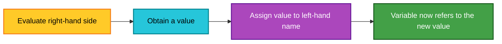

## 1.4 Updating a variable

The statement below is common in programming:

```python
a = 10

# Read the old value of a, add 1, and store the result back in a.
a = a + 1

print(a)
```

Output:

```text
11
```

Step by step:

1. The old value of `a` is read: `10`
2. Python evaluates `10 + 1`
3. The result is `11`
4. `a` is reassigned to `11`

This process is called **incrementing** when the value is increased, commonly by one.

$$
a_{new} = a_{old} + 1
$$

### Repeated increments

```python
a = 10
print(a)  # 10

a = a + 1
print(a)  # 11

a = a + 1
print(a)  # 12

a = a + 1
print(a)  # 13
```

A shorter Python form is:

```python
a = 10

# Augmented assignment: equivalent to a = a + 1.
a += 1

print(a)  # 11
```

> **Source-extension note:** The transcript introduces `a = a + 1`. The `+=` form is an equivalent Python shorthand added here for completeness.

## 1.5 Variables in expressions

```python
# Two integer variables.
a = 10
b = 20

# The values stored in a and b are used in each expression.
print(a + b)  # 30
print(a * b)  # 200
```

An **expression** is a combination of values, variables, and operators that Python evaluates to produce another value.

Examples:

```python
10 + 20

a + b

a * b

a + 1
```
### 🎉 Fun Facts
- The word "increment" comes from Latin *incrementum* meaning "growth." In CS, `a = a + 1` is the most frequently used statement in loops!
- Python variables are **dynamically typed** — you don't need to declare the type beforehand.

### 📊 Concept Diagram

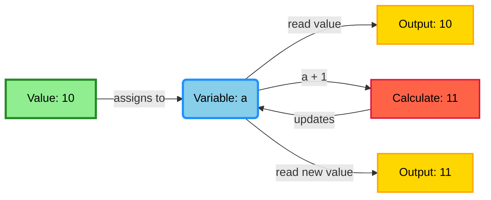
---

# 2. Input Statements and Interactive Programs

## 2.1 What does `input()` do?

`input()` pauses the program, displays an optional prompt, waits for the user to type something, and returns the entered text.

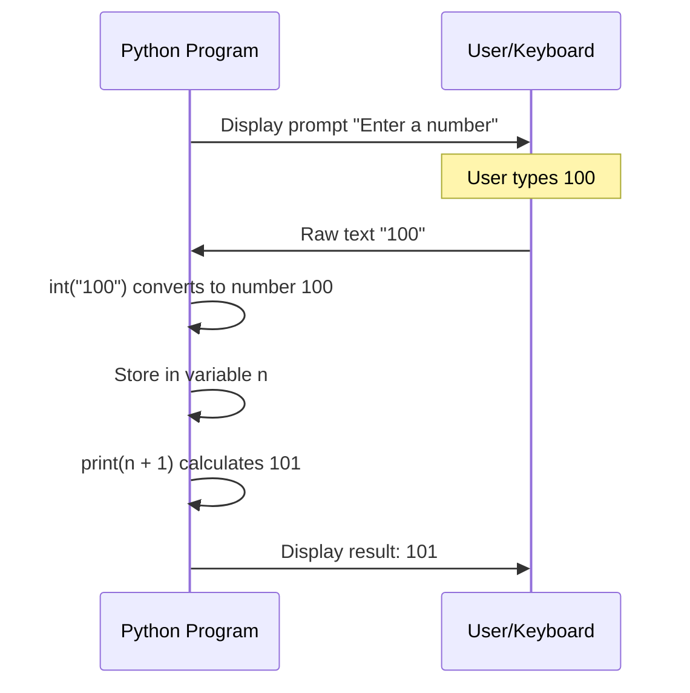

```python
# Ask the user for a name and store the entered text.
name = input("Type your name: ")

print(name)
```

## 2.2 Input-processing flow

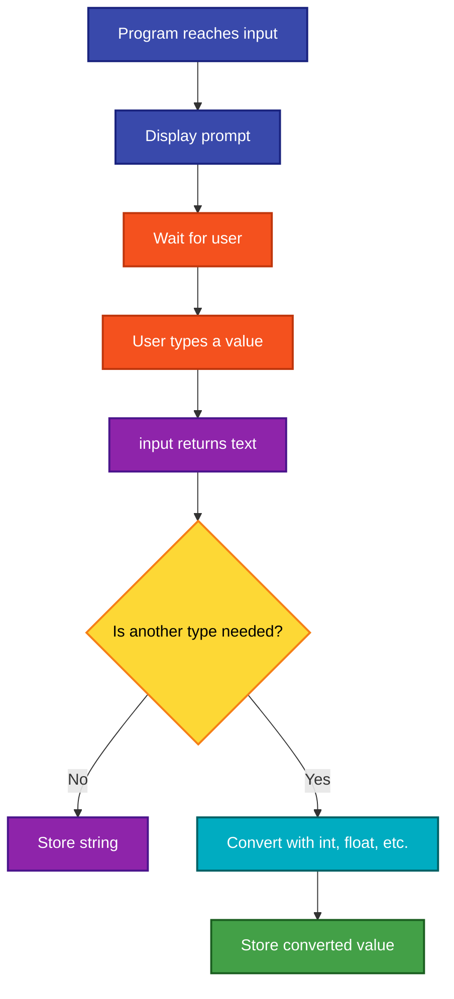

## 2.3 Numeric input

In Python 3, `input()` returns a string. To perform integer arithmetic, convert it with `int()`.

```python
# input() returns text; int(...) converts that text to an integer.
number = int(input("Enter a number: "))

# These are numeric additions because number is an int.
print(number)
print(number + 1)
print(number + 2)
print(number + 3)
```

Example interaction:

```text
Enter a number: 100
100
101
102
103
```

## 2.4 Text input

```python
# A name should remain text, so no numeric conversion is needed.
name = input("Type your name: ")

print("Hello", name)
```

The transcript uses `str(input(...))`. In Python 3, this is valid but usually unnecessary because `input()` already returns a string.

```python
# Valid but redundant in Python 3.
name = str(input("Type your name: "))
```

## 2.5 Using separate variables for separate facts

```python
name = input("Type your name: ")
place = input("Which place are you in? ")
age = int(input("What is your age? "))

print("Hello", name)
print("How is the weather in", place + "?")
print("Good to know you are", age, "years old.")
```

Why use three variables?

- `name` stores the name
- `place` stores the location
- `age` stores the age

If the same variable is reused, the previous value is replaced:

```python
value = input("Type your name: ")

# The name stored in value is replaced by the place.
value = input("Which place are you in? ")

# Only the place remains available through value.
print(value)
```

## 2.6 A cleaner formatted version

```python
name = input("Type your name: ")
place = input("Which place are you in? ")
age = int(input("What is your age? "))

# An f-string inserts variable values directly inside a string.
print(f"Hello {name}, how is the weather in {place}?")
print(f"Good to know you are {age} years old.")
```

> **Source-extension note:** The transcript hints at a format specifier to avoid unwanted spaces. The f-string form is a modern Python solution.

## 2.7 When should input be converted?

| Intended meaning | Recommended code | Resulting type |
|---|---|---|
| Name or city | `input(...)` | `str` |
| Whole-number age | `int(input(...))` | `int` |
| Decimal measurement | `float(input(...))` | `float` |
| Later yes/no interpretation | input plus explicit logic | depends on logic |

Do not use `bool(input(...))` to interpret words such as `yes` and `no`, because any non-empty string becomes `True`.

---

# 3. Variables and Literals

## 3.1 What is a literal?

A **literal** is an actual value written directly in source code.

```python
name = "Sudarshan"
age = 40
radius = 5
pi = 3.14
```

Here:

- `name`, `age`, `radius`, and `pi` are variable names.
- `"Sudarshan"`, `40`, `5`, and `3.14` are literals.

## 3.2 Variable versus literal

| Feature | Variable | Literal |
|---|---|---|
| Meaning | A name that refers to a value | A value written directly in code |
| Example | `age` | `30` |
| Can appear on assignment left side? | Yes | No |
| Can appear on assignment right side? | Yes | Yes |
| Can refer to different values over time? | Yes | The written literal itself does not change |

Valid:

```python
age = 30
age = age + 1
```

Invalid:

```python
# SyntaxError: a literal cannot receive an assigned value.
30 = 30 + 1
```

## 3.3 Circle-area example

The area of a circle is:

$$
A = \pi r^2
$$

where:

- $A$ is the area;
- $r$ is the radius;
- $\pi$ is approximately $3.14$.

```python
# The radius may change for each run, so store it in a variable.
radius = float(input("Enter the radius of the circle: "))

# In this beginner example, 3.14 is written as a numeric literal.
area = 3.14 * radius * radius

print(f"Area of the circle with radius {radius} is {area}")
```

For `radius = 5`:

$$
A = 3.14 \times 5 \times 5 = 78.5
$$

For `radius = 15`:

$$
A = 3.14 \times 15 \times 15 = 706.5
$$

## 3.4 When to use a variable and when to write a literal

Use a **variable** when:

- the value can differ between users;
- the value may change while the program runs;
- the value is reused;
- the value needs a meaningful name;
- the value is produced by a calculation.

Use a **literal** when:

- the value is directly part of the instruction;
- the value is small and self-explanatory;
- it is used only once;
- the program intentionally fixes that value.

For named constants, Python convention uses uppercase names:

```python
# Convention: uppercase names indicate values intended to remain unchanged.
PI = 3.14

radius = float(input("Radius: "))
area = PI * radius ** 2
print(area)
```

> Python does not technically prevent `PI` from being reassigned; uppercase is a convention communicating intent.

---

# 4. Python Data Types

## 4.1 What is a data type?

Data types tell Python **how to store** a value in memory and **what operations** can be performed on it. Python automatically detects the type, but you can verify it with `type()`.

### 🤔 Why?
Just as you use different containers for rice (jar) vs. water (bottle), Python uses different memory structures for integers vs. strings vs. lists.

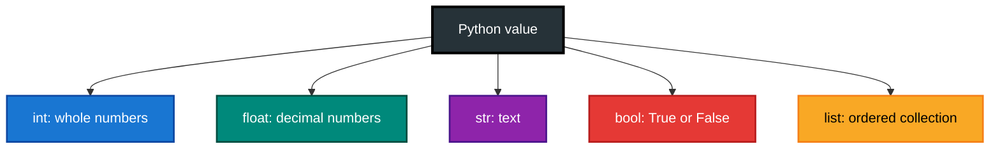

## 4.2 Integer: `int`

An integer is a whole number without a decimal part.

```python
count = 10
temperature = -4
zero = 0

print(type(count))       # <class 'int'>
print(type(temperature)) # <class 'int'>
```

Common uses:

- counts;
- ages in completed years;
- list indices;
- number of attempts;
- whole-number scores.

## 4.3 Floating-point number: `float`

A float represents a number with a decimal point or fractional component.

```python
radius = 6.3
price = 99.95
ratio = 11 / 15

print(type(radius))  # <class 'float'>
print(type(ratio))   # <class 'float'>
```

Common uses:

- measurements;
- averages;
- probabilities;
- currency calculations, with precision considerations;
- scientific values.

## 4.4 String: `str`

A string is a sequence of characters used to represent text.

```python
name = "Sudarshan"
country = "India"
number_as_text = "10"

print(type(name))            # <class 'str'>
print(type(number_as_text))  # <class 'str'>
```

Quotation marks matter:

```python
numeric_value = 10       # int
text_value = "10"       # str
```

Although both display as `10`, they behave differently in expressions.

## 4.5 Boolean: `bool`

A Boolean value represents one of two logical states:

```python
is_valid = True
is_finished = False

print(type(is_valid))  # <class 'bool'>
```

Python requires capitalized Boolean literals:

```python
True
False
```

The lowercase forms `true` and `false` are not Python Boolean literals.

## 4.6 List: `list`

A list stores an ordered sequence of values.

```python
numbers = [10, 20, 30, 68, 720, 732]

print(numbers)
print(type(numbers))  # <class 'list'>
```

### List indexing

Python indexing begins at zero.

```python
numbers = [10, 20, 30, 68]

print(numbers[0])  # 10: first element
print(numbers[1])  # 20: second element
print(numbers[2])  # 30: third element
print(numbers[3])  # 68: fourth element
```

Index-value map:

| Index | `0` | `1` | `2` | `3` |
|---:|---:|---:|---:|---:|
| Value | `10` | `20` | `30` | `68` |

## 4.7 Inspecting types with `type()`

```python
items = [10, 20, 30]
whole_number = 10
decimal_number = 6.9
text = "India"

print(type(items))           # <class 'list'>
print(type(whole_number))    # <class 'int'>
print(type(decimal_number))  # <class 'float'>
print(type(text))            # <class 'str'>
```

The type of an element can differ from the type of its container:

```python
numbers = [10, 20, 30]

print(type(numbers))     # <class 'list'>
print(type(numbers[2]))  # <class 'int'>
```

## 4.8 Dynamic typing

Python determines types from values at runtime:

```python
value = 10
print(type(value))  # int

# The same name is now associated with a string.
value = "ten"
print(type(value))  # str
```

This flexibility is useful, but using one variable for unrelated meanings can make programs confusing. Prefer stable, descriptive names.

---

# 5. Type Conversion and Boolean Values

## 5.1 What is type conversion?

**Type conversion**, also called **type casting**, transforms a value from one data type into another when a valid conversion exists.

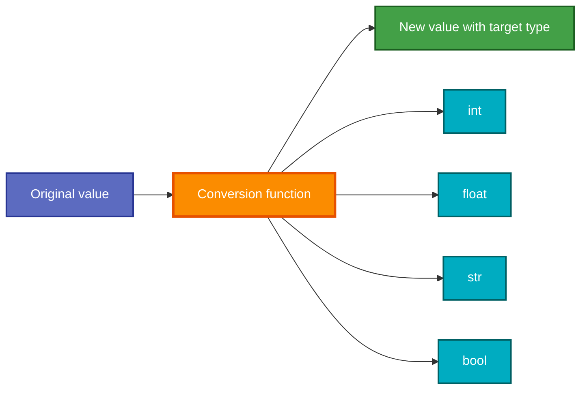

## 5.2 Convert to integer with `int()`

```python
# Float to int: the fractional part is discarded toward zero.
a = int(5.7)

# Numeric string to int.
b = int("10")

print(a, type(a))  # 5 <class 'int'>
print(b, type(b))  # 10 <class 'int'>
```

Important:

```python
print(int(5.7))   # 5
print(int(-5.7))  # -5
```

`int()` does not perform ordinary rounding. It removes the fractional part toward zero.

Invalid conversion:

```python
# ValueError: the text does not represent a valid integer.
number = int("India")
```

## 5.3 Convert to float with `float()`

```python
# Integer to float.
a = float(9)

# Numeric string to float.
b = float("5.3")

print(a, type(a))  # 9.0 <class 'float'>
print(b, type(b))  # 5.3 <class 'float'>
```

## 5.4 Convert to string with `str()`

```python
whole_number = str(9)
decimal_number = str(5.3)

print(whole_number, type(whole_number))
print(decimal_number, type(decimal_number))
```

String conversion is useful when creating messages:

```python
age = 20
message = "Age: " + str(age)
print(message)
```

An f-string often avoids manual conversion:

```python
age = 20
print(f"Age: {age}")
```

## 5.5 Convert to Boolean with `bool()`

The transcript demonstrates Python's truth-value rules.

### Numbers to Boolean

```python
print(bool(10))    # True
print(bool(-10))   # True
print(bool(0))     # False

print(bool(5.7))   # True
print(bool(-2.4))  # True
print(bool(0.0))   # False
```

For numeric values:

$$
\operatorname{bool}(x) =
\begin{cases}
\text{False}, & x = 0 \\
\text{True}, & x \neq 0
\end{cases}
$$

### Strings to Boolean

```python
print(bool("India"))  # True
print(bool("10"))     # True
print(bool("0"))      # True
print(bool(""))       # False
```

Why is `bool("0")` true?

Because `"0"` is a **non-empty string**. Python is checking whether the string contains any character, not whether the text resembles the number zero.

For strings:

$$
\operatorname{bool}(s) =
\begin{cases}
\text{False}, & s = \text{empty string} \\
\text{True}, & s = \text{non-empty string}
\end{cases}
$$

### Truthiness table

| Value | Type | Boolean result |
|---|---|---|
| `0` | `int` | `False` |
| `-10` | `int` | `True` |
| `0.0` | `float` | `False` |
| `3.2` | `float` | `True` |
| `""` | `str` | `False` |
| `"0"` | `str` | `True` |
| `[]` | `list` | `False` |
| `[0]` | `list` | `True` |

> **Source-extension note:** Empty and non-empty list truthiness follows the same broader Python rule as the string examples in the transcript.

## 5.6 Safe conversion of user input

```python
raw_value = input("Enter an integer: ")

try:
    # Attempt conversion only inside the protected block.
    number = int(raw_value)
    print(f"You entered the integer {number}.")
except ValueError:
    # This runs when raw_value is not valid integer text.
    print("That input is not a valid integer.")
```

> **Source-extension note:** Exception handling is not taught in these transcript sections, but it demonstrates a safe real-world use of conversion.

---

# 6. Operators and Expressions

## 6.1 What is an operator?

An **operator** tells Python to perform an operation on one or more operands.

```python
result = 3 + 2
```

- `3` and `2` are operands.
- `+` is the operator.
- `3 + 2` is an expression.
- `5` is the resulting value.

The transcript organizes operators into three major categories:

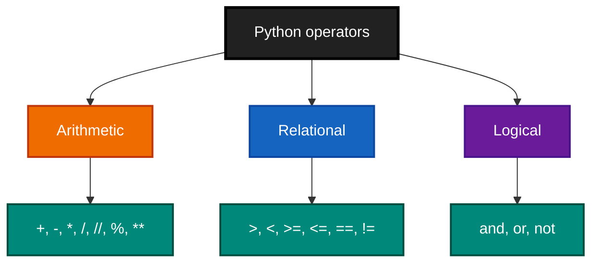

## 6.2 Arithmetic operators

| Operator | Meaning | Example | Result |
|---|---|---|---:|
| `+` | Addition | `2 + 3` | `5` |
| `-` | Subtraction | `9 - 1` | `8` |
| `*` | Multiplication | `5 * 4` | `20` |
| `/` | Division | `7 / 3` | `2.333...` |
| `//` | Floor division | `7 // 3` | `2` |
| `%` | Modulus/remainder | `7 % 3` | `1` |
| `**` | Exponentiation | `6 ** 2` | `36` |

```python
print(2 + 3)   # 5
print(9 - 1)   # 8
print(5 * 4)   # 20
print(7 / 3)   # 2.3333333333333335
print(7 // 3)  # 2
print(7 % 3)   # 1
print(6 ** 2)  # 36
```

### Division relationship

For integers $a$ and positive divisor $b$:

$$
a = bq + r
$$

where:

- $q = a // b$ is the floor quotient;
- $r = a \% b$ is the remainder.

For `a = 7` and `b = 3`:

$$
7 = 3(2) + 1
$$

Therefore:

```python
print(7 // 3)  # 2
print(7 % 3)   # 1
```

> **Precision note:** The transcript describes `//` using the positive example `7 // 3`. More precisely, Python floor division rounds the quotient down toward negative infinity, which matters for negative values.

```python
print(-7 // 3)  # -3, not -2
```

### Common use of modulus

Check whether a number is even:

```python
number = int(input("Enter an integer: "))

# An even integer leaves remainder 0 when divided by 2.
is_even = number % 2 == 0

print(is_even)
```

## 6.3 The meaning of an operator depends on data type

### Addition with numbers

```python
print(4 + 7)  # 11
```

### Concatenation with strings

```python
first = "Sudarshan"
second = "India"

# + joins the two strings; it does not add them numerically.
print(first + second)  # SudarshanIndia
```

### Concatenation with lists

```python
first = [1, 2, 3]
second = [7, 9, 15]

# The lists are placed one after the other.
print(first + second)  # [1, 2, 3, 7, 9, 15]
```

This is list **concatenation**, not mathematical set union. Repeated values are preserved.

```python
print([1, 2] + [2, 3])  # [1, 2, 2, 3]
```

### Unsupported combinations

```python
# TypeError: subtraction is not defined for strings.
print("coffee" - "bread")
```

The key lesson is:

> Before predicting an operator's result, identify the data type of every operand.

## 6.4 Relational operators

Relational operators compare values and produce Boolean results.

| Operator | Meaning |
|---|---|
| `>` | Greater than |
| `<` | Less than |
| `>=` | Greater than or equal to |
| `<=` | Less than or equal to |
| `==` | Equal to |
| `!=` | Not equal to |

```python
print(5 > 10)   # False
print(10 > 5)   # True
print(5 < 10)   # True
print(5 >= 5)   # True
print(5 <= 5)   # True
print(5 == 50)  # False
print(5 == 5)   # True
print(5 != 50)  # True
print(5 != 5)   # False
```

### `=` versus `==`

```python
# Assignment: store 5 in x.
x = 5

# Comparison: ask whether x equals 5.
print(x == 5)  # True
```

A common beginner error is using the wrong symbol.

## 6.5 Logical operators

Logical operators combine or invert Boolean conditions.

### `and`

`A and B` is true only when both operands are true.

| A | B | A `and` B |
|---|---|---|
| `True` | `True` | `True` |
| `True` | `False` | `False` |
| `False` | `True` | `False` |
| `False` | `False` | `False` |

### `or`

`A or B` is true when at least one operand is true.

| A | B | A `or` B |
|---|---|---|
| `True` | `True` | `True` |
| `True` | `False` | `True` |
| `False` | `True` | `True` |
| `False` | `False` | `False` |

### `not`

`not` reverses a Boolean value.

| A | `not A` |
|---|---|
| `True` | `False` |
| `False` | `True` |

```python
print(True and True)    # True
print(True and False)   # False

print(True or False)    # True
print(False or False)   # False

print(not True)         # False
print(not False)        # True
```

### Practical condition example

```python
age = int(input("Enter your age: "))
has_ticket = True

# Entry is allowed only when both conditions are true.
can_enter = age >= 18 and has_ticket

print(can_enter)
```
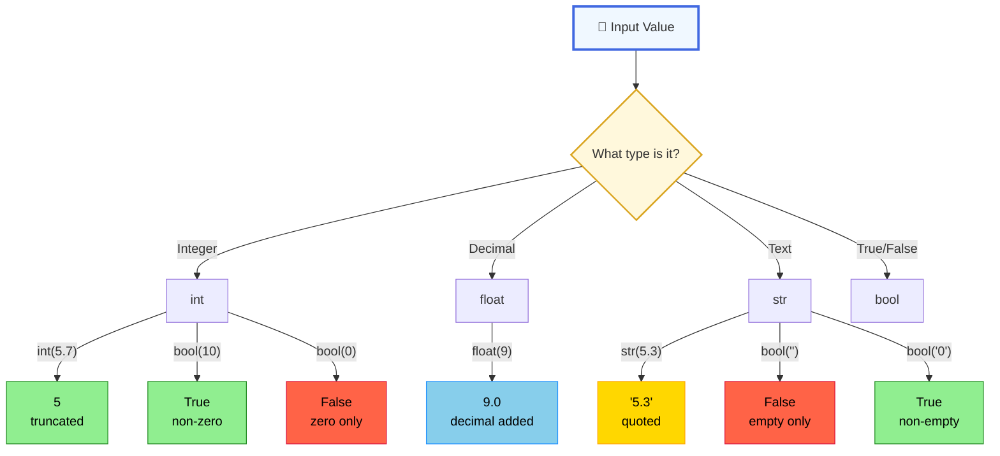
---

# 7. Operator Precedence

## 7.1 Why precedence matters

Consider:

```python
result = 10 + 13 * 2
print(result)
```

Python calculates multiplication before addition:

$$
10 + 13 \times 2 = 10 + 26 = 36
$$

It does not first compute `(10 + 13) * 2`.

## 7.2 Parentheses make intention explicit

```python
without_parentheses = 10 + 13 * 2
with_parentheses = (10 + 13) * 2

print(without_parentheses)  # 36
print(with_parentheses)     # 46
```


## 7.3 Simplified precedence guide

From higher to lower priority for the operators discussed here:

1. Parentheses: `(...)`
2. Exponentiation: `**`
3. Multiplication group: `*`, `/`, `//`, `%`
4. Addition group: `+`, `-`
5. Comparisons: `<`, `<=`, `>`, `>=`, `==`, `!=`
6. `not`
7. `and`
8. `or`

Best practice:

```python
# Correct but requires the reader to know precedence.
result = a + b * c

# Explicit and easier to read when grouping is important.
result = a + (b * c)
```

---

# 8. Introduction to Strings

## 8.1 Strings as sequences

A string is not just one indivisible value. It is an ordered sequence of characters.

```python
s = "coffee"
```

Character positions:

| Character | `c` | `o` | `f` | `f` | `e` | `e` |
|---|---|---|---|---|---|---|
| Index | `0` | `1` | `2` | `3` | `4` | `5` |

## 8.2 Concatenation

```python
s = "coffee"
t = "bread"

# Without an inserted space.
print(s + t)  # coffeebread

# Add a space explicitly.
print(s + " " + t)  # coffee bread
```

## 8.3 Positive indexing

```python
s = "coffee"

print(s[0])  # c
print(s[1])  # o
print(s[2])  # f
```

The valid positive indices are:

$$
0, 1, 2, \ldots, \operatorname{len}(s)-1
$$

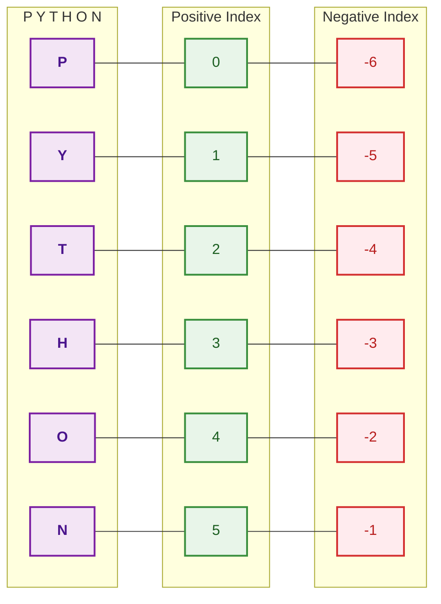

## 8.4 String slicing

Syntax:

```python
string[start:stop]
```

The `start` index is included, while the `stop` index is excluded.

```python
s = "coffee"

print(s[1:3])  # of: indices 1 and 2
print(s[1:5])  # offe: indices 1, 2, 3, and 4
print(s[3:5])  # fe: indices 3 and 4
```

Mathematically, a slice `s[a:b]` includes indices:

$$
a \leq i < b
$$

### Slice intuition

```mermaid
flowchart LR
    S["String: coffee"] --> A["Start at index 1"]
    A --> B["Take index 1: o"]
    B --> C["Take index 2: f"]
    C --> D["Stop before index 3"]
    D --> R["Result of s[1:3]: of"]

    classDef source fill:#5e35b1,color:#fff,stroke:#311b92,stroke-width:2px;
    classDef action fill:#039be5,color:#fff,stroke:#01579b,stroke-width:2px;
    classDef char fill:#fdd835,color:#000,stroke:#f57f17,stroke-width:2px;
    classDef result fill:#43a047,color:#fff,stroke:#1b5e20,stroke-width:3px;

    class S source;
    class A,D action;
    class B,C char;
    class R result;
```

Useful slice forms:

```python
s = "coffee"

print(s[:3])   # cof: from beginning to index 2
print(s[3:])   # fee: from index 3 to the end
print(s[:])    # coffee: entire string
```

## 8.5 Extracted numeric characters are still strings

```python
s = "0123456789"

a = s[4]
b = s[7]

print(a)        # 4
print(b)        # 7
print(type(a))  # <class 'str'>
print(type(b))  # <class 'str'>

# String concatenation, not numeric addition.
print(a + b)    # 47
```

To add numerically:

```python
s = "0123456789"

a = int(s[4])
b = int(s[7])

print(a + b)  # 11
```

### Conversion position changes the result

```python
s = "0123456789"

a = s[3]  # "3"
b = s[8]  # "8"

# First concatenate strings to "38", then convert the complete text to 38.
combined_number = int(a + b)
print(combined_number)  # 38
```

```python
s = "0123456789"

# Convert each character separately, then add the integers.
a = int(s[3])
b = int(s[8])

print(a + b)  # 11
```

This demonstrates a general programming rule:

> The order of operations and the moment at which conversion happens can change the result.

---

# 9. More String Operations

## 9.1 String replication

Multiplying a string by an integer repeats it.

```python
s = "good"

print(s * 5)     # goodgoodgoodgoodgood
print(s[0] * 5)  # ggggg
```

Conceptually:

$$
\text{"good"} \times 3 = \text{"good"} + \text{"good"} + \text{"good"}
$$

A practical use:

```python
# Print a separator line containing 30 hyphens.
print("-" * 30)
```

## 9.2 String equality is case-sensitive

```python
country = "India"

print(country == "India")  # True
print(country == "india")  # False
```

Uppercase and lowercase characters are distinct.

A case-insensitive comparison can normalize both sides:

```python
country = "India"
user_value = "india"

print(country.lower() == user_value.lower())  # True
```

> **Source-extension note:** `.lower()` is added as a practical follow-up to the transcript's case-sensitivity demonstration.

## 9.3 Lexicographic string comparison

Python compares strings character by character.

```python
print("apple" > "one")  # False
print("four" < "ten")   # True
print("ab" < "az")      # True
```

Reasoning for `"ab" < "az"`:

1. Compare `a` with `a`: equal.
2. Move to the next characters.
3. Compare `b` with `z`.
4. `b` comes before `z`, so the result is `True`.

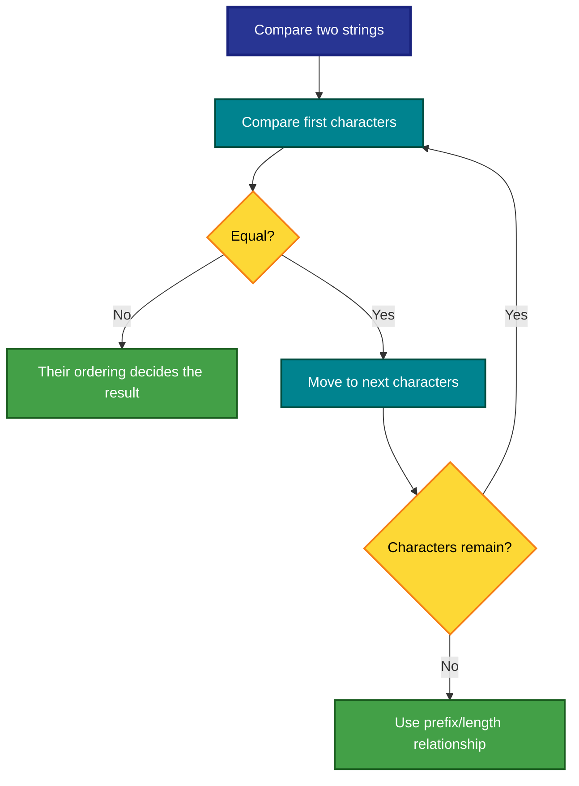

> **Precision note:** The transcript explains this using alphabetical order. Python more precisely compares Unicode code points lexicographically, so capitalization and non-English characters can affect ordering.

## 9.4 Negative indexing

Negative indices count from the end of a string.

```python
s = "Python"

print(s[-1])  # n: last character
print(s[-2])  # o: second-last character
print(s[-3])  # h
print(s[-6])  # P: first character
```

Index map:

| Character | `P` | `y` | `t` | `h` | `o` | `n` |
|---|---|---|---|---|---|---|
| Positive index | `0` | `1` | `2` | `3` | `4` | `5` |
| Negative index | `-6` | `-5` | `-4` | `-3` | `-2` | `-1` |

Useful pattern:

```python
filename = "report.pdf"

# Access the final character.
print(filename[-1])  # f
```

## 9.5 String length with `len()`

```python
s = "Python"

print(len(s))  # 6
```

If the length is $n$, valid positive indices run from:

$$
0 \text{ to } n-1
$$

Therefore:

```python
s = "Python"

last_index = len(s) - 1
print(s[last_index])  # n
```

The shorter equivalent is:

```python
print(s[-1])  # n
```

## 9.6 Index out of range

```python
s = "Python"

# IndexError: valid positive indices are 0 through 5.
print(s[100])
```

Even `s[len(s)]` is invalid:

```python
s = "Python"

print(len(s))  # 6

# Invalid because the final valid index is len(s) - 1, which is 5.
print(s[6])
```

### Safe last-character logic

```python
text = input("Enter some text: ")

if len(text) > 0:
    print("Last character:", text[-1])
else:
    print("The string is empty.")
```

> **Source-extension note:** Conditional statements are used here only to demonstrate safe indexing; they are not developed as a main topic in the supplied transcript.

---

# 10. Errors and Debugging

Errors are normal in programming. The transcript deliberately includes mistakes so that learners can observe how to diagnose them.

## 10.1 NameError: using a variable that is not defined

```python
name = input("Name: ")

# `place` has never been assigned.
print(place)
```

Typical error:

```text
NameError: name 'place' is not defined
```

Fix:

```python
name = input("Name: ")
place = input("Place: ")

print(place)
```

## 10.2 SyntaxError: missing punctuation

```python
# Missing closing parenthesis.
print(type(10)
```

Fix:

```python
print(type(10))
```

## 10.3 TypeError: unsupported operation

```python
# Python does not define subtraction between strings.
print("coffee" - "bread")
```

Fix by reconsidering the intended operation. For joining text, use `+`:

```python
print("coffee" + " " + "bread")
```

## 10.4 ValueError: invalid conversion

```python
# "ten" is not written as an integer literal.
number = int("ten")
```

Valid version:

```python
number = int("10")
```

## 10.5 IndexError: index outside the sequence

```python
word = "Python"
print(word[100])
```

Fix by checking `len(word)` and remembering that the maximum positive index is `len(word) - 1`.

## 10.6 Debugging workflow

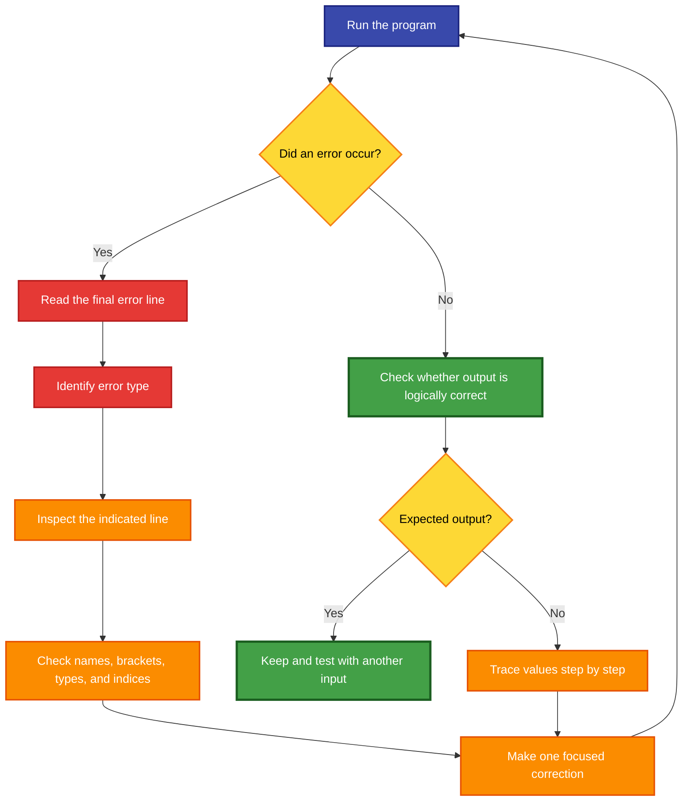

### Four questions to ask when code fails

1. **Name:** Did I define every variable before using it?
2. **Syntax:** Did I close every quote, bracket, and parenthesis?
3. **Type:** Am I applying an operator to compatible data types?
4. **Range:** Is my list or string index valid?

---

# 11. Beginner Learning Strategy

The concluding transcript emphasizes that learning programming requires repeated practice rather than memorizing the whole language.

## 11.1 You do not need to memorize everything

A practical approach:

- remember the concepts you use frequently;
- keep a small cheat sheet;
- look up exact syntax when necessary;
- repeat examples until common syntax becomes familiar.

Programming is similar to learning a natural language: fluency grows through use.

## 11.2 Errors are part of programming

Even experienced programmers make syntax and logic errors. The goal is not to avoid every error; it is to become good at:

- reading error messages;
- locating the relevant line;
- testing assumptions;
- making a correction;
- rerunning the program.

## 11.3 Separate syntax practice from logic practice

When both syntax and problem-solving logic are new, a beginner must think about two difficult things at once.

The transcript recommends rewriting the same non-trivial program multiple times without copying it. Repetition makes syntax more automatic, leaving more attention for logic.

### Suggested practice cycle

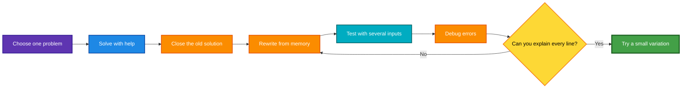

## 11.4 A seven-day practice plan

| Day | Focus | Suggested work |
|---|---|---|
| 1 | Variables | Assign, print, reassign, increment |
| 2 | Input | Build name, place, age interaction |
| 3 | Data types | Predict and inspect types with `type()` |
| 4 | Conversion | Convert strings, integers, floats, Booleans |
| 5 | Operators | Arithmetic, relational, and logical expressions |
| 6 | Strings | Indexing, slicing, replication, comparison |
| 7 | Integration | Build the mini-project below from memory |

---

# 12. Complete Mini-Project

## Personal Introduction and Number Explorer

This program combines variables, input, conversion, formulas, operators, Boolean expressions, strings, and indexing.

```python
# ------------------------------------------------------------
# PERSONAL INTRODUCTION AND NUMBER EXPLORER
# ------------------------------------------------------------

# Collect text information. input() returns strings.
name = input("What is your name? ")
city = input("Which city are you in? ")

# Convert numeric input from string to int.
age = int(input("What is your age? "))
number = int(input("Enter an integer to explore: "))

# Create derived values using arithmetic operators.
next_age = age + 1
square = number ** 2
quotient_by_2 = number // 2
remainder_by_2 = number % 2

# A number is even when its remainder after division by 2 is zero.
is_even = remainder_by_2 == 0

# Logical example: check whether the user is an adult and number is even.
is_adult_with_even_number = age >= 18 and is_even

# String-derived information.
name_length = len(name)

# Display a formatted introduction.
print("-" * 50)
print(f"Hello {name} from {city}!")
print(f"You will be {next_age} years old next year.")
print(f"Your name contains {name_length} characters.")

# Avoid indexing an empty string.
if name_length > 0:
    print(f"Your first initial is {name[0]}.")
    print(f"The last character of your name is {name[-1]}.")

# Display calculations.
print("-" * 50)
print(f"Number entered: {number}")
print(f"Square: {square}")
print(f"Floor quotient after division by 2: {quotient_by_2}")
print(f"Remainder after division by 2: {remainder_by_2}")
print(f"Is the number even? {is_even}")
print(f"Adult and even-number condition: {is_adult_with_even_number}")
print("-" * 50)
```

## Concepts used

| Program component | Concept |
|---|---|
| `name`, `city`, `age`, `number` | Variables |
| Text and numbers written in code | Literals |
| `input()` | User input |
| `int(...)` | Type conversion |
| `+`, `**`, `//`, `%` | Arithmetic operators |
| `==`, `>=` | Relational operators |
| `and` | Logical operator |
| `len(name)` | String length |
| `name[0]`, `name[-1]` | Positive and negative indexing |
| `f"..."` | Formatted strings |
| `"-" * 50` | String replication |

---

# 13. Cheat Sheet

## Variables and input

```python
x = 10
x = x + 1
x += 1

name = input("Name: ")
age = int(input("Age: "))
height = float(input("Height: "))
```

## Types

```python
10          # int
6.3         # float
"India"     # str
True        # bool
[10, 20]    # list

type(value)
```

## Conversion

```python
int("10")     # 10
int(5.7)      # 5
float("5.3") # 5.3
float(9)      # 9.0
str(10)       # "10"
bool(0)       # False
bool("0")     # True
bool("")      # False
```

## Arithmetic

```text
+   addition
-   subtraction
*   multiplication
/   division
//  floor division
%   remainder
**  exponentiation
```

## Comparisons

```text
>   <   >=   <=   ==   !=
```

## Logic

```text
and
or
not
```

## Strings

```python
s = "Python"

s[0]       # "P"
s[-1]      # "n"
s[1:4]     # "yth"
len(s)     # 6
s * 3      # "PythonPythonPython"
s + " 3"  # "Python 3"
```

## Frequent errors

| Error | Typical cause |
|---|---|
| `NameError` | Variable used before assignment |
| `SyntaxError` | Missing bracket, quote, colon, or invalid syntax |
| `TypeError` | Operation not supported for given data types |
| `ValueError` | Value cannot be converted as requested |
| `IndexError` | Sequence index is outside its valid range |

---

# 14. Practice Questions

Try predicting each answer before running the code.

## A. Variables and assignment

1. What is printed?

```python
x = 5
x = x + 3
x = x * 2
print(x)
```

2. Explain why this is invalid:

```python
10 = x + 1
```

3. Rewrite the following using augmented assignment:

```python
score = score + 5
```

## B. Input and conversion

4. Why does this print `101` instead of `11` when the user enters `10`?

```python
number = input("Number: ")
print(number + "1")
```

5. Correct the program so that it adds one numerically.

6. What error occurs if the user enters `hello` here?

```python
number = int(input("Number: "))
```

## C. Types and Booleans

7. Predict the types:

```python
values = [10, 4.5, "10", False]
```

8. Predict:

```python
print(bool(0))
print(bool(-1))
print(bool(""))
print(bool("False"))
```

9. Why is `bool("0")` different from `bool(0)`?

## D. Operators

10. Predict:

```python
print(17 // 5)
print(17 % 5)
print(2 ** 5)
```

11. Predict:

```python
print(10 + 3 * 4)
print((10 + 3) * 4)
```

12. Write an expression that is true only when `age` is at least 18 and `has_id` is true.

## E. Strings

13. Given `s = "Programming"`, find:

- the first character;
- the last character;
- the substring `gram`;
- the string length.

14. Predict:

```python
s = "0123456789"
a = s[2]
b = s[5]
print(a + b)
print(int(a) + int(b))
```

15. Explain why this fails:

```python
word = "Python"
print(word[len(word)])
```

## F. Challenge exercises

16. Ask the user for a radius and calculate both circumference and area.

Formulas:

$$
C = 2\pi r
$$

$$
A = \pi r^2
$$

17. Ask the user for a two-digit number as text, extract both digits, and print their numeric sum.

18. Ask the user for a word and print:

- its length;
- its first character;
- its last character;
- the word repeated three times.

19. Ask for two integers and print the quotient and remainder using `//` and `%`.

20. Create a Boolean expression that checks whether a number is between 10 and 20 inclusive.

---

# 15. Answer Key

1. `16`

2. A literal cannot appear on the left side of assignment. The left side must be an assignable target such as a variable name.

3.

```python
score += 5
```

4. `input()` returns a string, and `+` concatenates strings.

5.

```python
number = int(input("Number: "))
print(number + 1)
```

6. `ValueError`

7. Element types: `int`, `float`, `str`, `bool`; container type: `list`.

8.

```text
False
True
False
True
```

9. `0` is numeric zero and therefore false; `"0"` is a non-empty string and therefore true.

10.

```text
3
2
32
```

11.

```text
22
52
```

12.

```python
age >= 18 and has_id
```

13.

```python
s = "Programming"

print(s[0])     # P
print(s[-1])    # g
print(s[3:7])   # gram
print(len(s))   # 11
```

14.

```text
25
7
```

15. For a string of length `n`, the final positive index is `n - 1`; `word[len(word)]` is one position beyond the end.

16.

```python
PI = 3.14
radius = float(input("Radius: "))

circumference = 2 * PI * radius
area = PI * radius ** 2

print(f"Circumference: {circumference}")
print(f"Area: {area}")
```

17.

```python
number_text = input("Enter a two-digit number: ")

first_digit = int(number_text[0])
second_digit = int(number_text[1])

print(first_digit + second_digit)
```

18.

```python
word = input("Enter a word: ")

print("Length:", len(word))
print("First:", word[0])
print("Last:", word[-1])
print("Repeated:", word * 3)
```

19.

```python
a = int(input("Dividend: "))
b = int(input("Divisor: "))

print("Quotient:", a // b)
print("Remainder:", a % b)
```

20.

```python
10 <= number <= 20
```

---

# Key Takeaways

1. A variable is a name associated with a value.
2. Assignment updates program state; it is not algebraic equality.
3. `input()` returns text in Python 3, so numeric input requires conversion.
4. Literals are actual values written directly in code.
5. Data types determine what operations are valid and what those operations mean.
6. `+` adds numbers but concatenates strings and lists.
7. Relational expressions produce Boolean values.
8. `and`, `or`, and `not` combine or invert logical conditions.
9. Operator precedence affects evaluation; parentheses clarify intent.
10. Strings support indexing, slicing, replication, comparison, and length measurement.
11. Positive indexing begins at zero; negative indexing begins at `-1` from the end.
12. Errors are expected feedback, not evidence that someone cannot program.
13. Rewriting the same program repeatedly helps separate syntax learning from logic learning.

---

# Lecture Sources

- **L1.4 — A Quick Introduction to Variables**  
  <https://www.youtube.com/watch/Yg6xzi2ie5s>
- **L1.5 — Variables and Input Statement**  
  <https://www.youtube.com/watch/ruQb8jzkGyQ>
- **L1.6 — Variables and Literals**  
  <https://www.youtube.com/watch/tDaXdoKfX0k>
- **L1.7 — Data Types 1**  
  <https://www.youtube.com/watch/8n4MBjuDBu4>
- **L1.8 — Data Types 2**  
  <https://www.youtube.com/watch/xQXxufhEJHw>
- **L1.9 — Operators and Expressions 1**  
  <https://www.youtube.com/watch/8pu73HKzNOE>
- **L1.10 — Operators and Expressions 2**  
  <https://www.youtube.com/watch/Y53K9FFu97Q>
- **L1.11 — Introduction to Strings**  
  <https://www.youtube.com/watch/sS89tiDuqoM>
- **L1.12 — More on Strings**  
  <https://www.youtube.com/watch/e45MVXwya7A>
- **L1.13 — Conclusion: FAQs and Tips for Beginner Python Programmers**  
  <https://www.youtube.com/watch/_Ccezy5hlc8>

---

> **Study recommendation:** Run every code block, change at least one value, predict the output before execution, and explain the result using both the value and its data type.
