# 🐍 Python Programming Fundamentals — Week 2

> Detailed study notes prepared from the shared YouTube transcripts for Lectures **L2.1–L2.12**.
>
> Topics: readable variables, comments, dynamic typing, naming rules, assignment, escape characters, string methods, Caesar cipher, `if`/`elif`/`else`, nested conditions, libraries, randomness, and import styles.

---

## 📚 Table of Contents

1. [Learning by Programming](#1-learning-by-programming)
2. [Variables from a Programmer's Perspective](#2-variables-from-a-programmers-perspective)
3. [Dynamic Typing](#3-dynamic-typing)
4. [Variable Rules and Advanced Assignment](#4-variable-rules-and-advanced-assignment)
5. [Escape Characters and Quotes](#5-escape-characters-and-quotes)
6. [String Methods](#6-string-methods)
7. [Caesar Cipher](#7-caesar-cipher)
8. [Introduction to Conditional Statements](#8-introduction-to-conditional-statements)
9. [Practical `if`, `elif`, and `else` Problems](#9-practical-if-elif-and-else-problems)
10. [Python Libraries](#10-python-libraries)
11. [Different Import Styles](#11-different-import-styles)
12. [Week 2 Summary](#12-week-2-summary)
13. [Common Errors and Debugging Guide](#13-common-errors-and-debugging-guide)
14. [Practice Exercises](#14-practice-exercises)
15. [Cheat Sheet](#15-cheat-sheet)

---

# 1. Learning by Programming

## What is the central idea?

Programming is similar to learning to drive: theory explains the controls, but confidence develops only through repeated practice. The lectures emphasize that programming is not merely about memorizing syntax. It is about using syntax to solve increasingly complex problems.

## Why is practice essential?

When you actively write code, you learn to:

- predict what a program will do;
- identify syntax and logical errors;
- understand how Python interprets values;
- break a large problem into smaller steps;
- gain confidence with unfamiliar code.

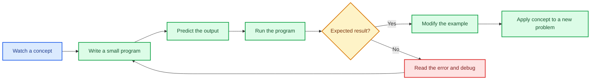

## The control-flow triangle

The introduction identifies three fundamental programming ideas:

- `if` — make a decision;
- `for` — repeat for each item;
- `while` — repeat while a condition remains true.

Week 2 mainly develops the first corner: **conditional decision-making with `if`**.

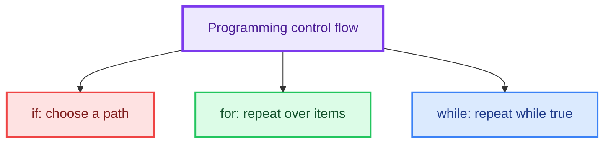

---

# 2. Variables from a Programmer's Perspective

## What is a variable?

A variable is a meaningful name used to refer to a value. The transcript uses a **bucket or container analogy**: the variable name labels the container, while the value is what is stored or referenced.

```python
ram_bank_balance = 100_000
ram_loan = 500_000

lakshman_bank_balance = 2_000_000
lakshman_loan = 1_000_000
```

Python permits underscores inside numeric literals, so `100_000` is exactly the same number as `100000`; the underscores only improve readability.

## Why meaningful names matter

Compare these two versions:

```python
# Difficult to understand later
a = 100_000
b = 500_000
c = 2_000_000
d = 1_000_000
```

```python
# The purpose of every value is visible immediately
ram_bank_balance = 100_000
ram_loan = 500_000
lakshman_bank_balance = 2_000_000
lakshman_loan = 1_000_000
```

Names such as `a`, `b`, `c`, and `d` may work technically, but they force the reader to remember what each letter represents. Descriptive names reduce this mental burden.

## Financial example

Let:

$$
\text{Total Balance} = B_R + B_L
$$

$$
\text{Total Liability} = L_R + L_L
$$

$$
\text{Net Family Position} = \text{Total Balance} - \text{Total Liability}
$$

```python
# Positive assets owned by the family
ram_bank_balance = 100_000
lakshman_bank_balance = 2_000_000

# Amounts that must be repaid
ram_loan = 500_000
lakshman_loan = 1_000_000

# Sum of both brothers' balances
total_balance = ram_bank_balance + lakshman_bank_balance

# Sum of both brothers' loans
total_liability = ram_loan + lakshman_loan

# Positive means surplus; negative means net debt
net_family_position = total_balance - total_liability

print("Net family position:", net_family_position)
```

### Interpretation

- `net_family_position > 0` → the family has a surplus;
- `net_family_position == 0` → assets and liabilities are equal;
- `net_family_position < 0` → liabilities exceed available balances.

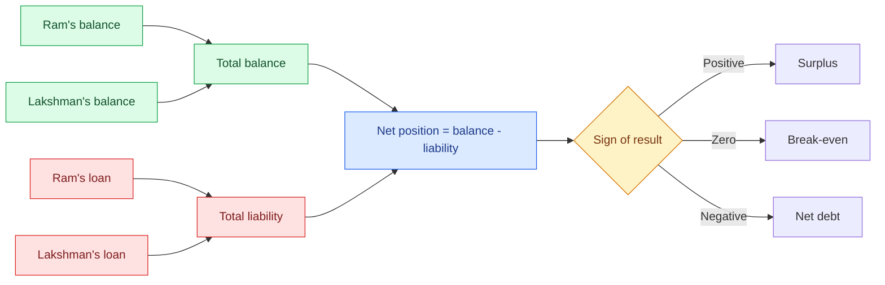

## Comments

A comment begins with `#`. Python ignores everything after `#` on that line.

```python
account_balance = 50_000  # Current available balance
```

### Why comments are useful

Comments help:

- your future self remember why a decision was made;
- another programmer understand the code;
- explain assumptions, units, limitations, or unusual logic;
- document complex sections of a program.

### Good and weak comments

```python
# Weak: merely repeats the code
count = count + 1  # Add 1 to count
```

```python
# Better: explains the purpose
count = count + 1  # Record one more completed transaction
```
### 🎉 Fun Facts
- The underscore `_` in Python variable names is called the **"snake_case"** convention — the standard naming style in Python.
- Professional codebases often have a rule: *"If you need a comment to explain the variable name, rename the variable."*

> **Best-practice note:** Comment the reason or intention, not every obvious symbol. Clear variable names plus focused comments are better than excessive narration.

---

# 3. Dynamic Typing

## What is dynamic typing?

Python is dynamically typed. A variable name can refer to values of different types at different moments during execution.

```python
a = 10
print(type(a))       # <class 'int'>

a = "India"
print(type(a))       # <class 'str'>
```

The name `a` first refers to an integer and later refers to a string.

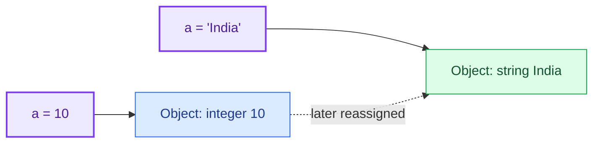

> **Python precision note:** A variable is best understood as a **name bound to an object**, rather than as a fixed box whose type changes. Reassignment makes the same name refer to a new object.

## Type changes caused by operations

```python
n = 10
print(n, type(n))    # 10 <class 'int'>

n = n / 2
print(n, type(n))    # 5.0 <class 'float'>
```

Why does this happen? In Python 3, `/` performs true division and returns a floating-point result.

\[
10 / 2 = 5.0
\]

Even when the mathematical answer is a whole number, the operation returns a `float`.

```python
n = 10
n = n / 1
print(n)             # 10.0
print(type(n))       # <class 'float'>
```

### Compare division operators

```python
print(10 / 2)        # 5.0  -> true division
print(10 // 2)       # 5    -> floor division
```

## When is dynamic typing useful?

It provides flexibility during quick scripting and interactive work. However, repeatedly changing the meaning and type of a variable can make a program difficult to understand.

```python
# Avoid confusing reuse
result = 25
result = "Successful"
```

A clearer version uses separate names:

```python
score = 25
status = "Successful"
```

---

# 4. Variable Rules and Advanced Assignment

## 4.1 Python keywords

Keywords are reserved words that already have a special meaning in Python. Examples include:

```text
and, or, not, if, elif, else, for, while, import, from, as, del
```

They cannot be used as variable names.

```python
# Invalid syntax
# if = 10
# and = 5
```

To inspect Python's keyword list:

```python
import keyword
print(keyword.kwlist)
```

## 4.2 Naming rules

A valid identifier:

1. may contain letters, digits, and underscores;
2. must begin with a letter or underscore;
3. cannot begin with a digit;
4. cannot be a Python keyword;
5. is case-sensitive.

| Name | Valid? | Reason |
|---|---:|---|
| `age` | ✅ | Starts with a letter |
| `age2` | ✅ | Digits are allowed after the first character |
| `_age` | ✅ | May start with an underscore |
| `student_name` | ✅ | Underscore is allowed |
| `2age` | ❌ | Begins with a digit |
| `student-name` | ❌ | Hyphen is an operator, not an identifier character |
| `for` | ❌ | Reserved keyword |

## 4.3 Case sensitivity

```python
roll = 5
ROLL = 10
Roll = 15

print(roll)  # 5
print(ROLL)  # 10
print(Roll)  # 15
```

These are three separate names.

> **Style recommendation:** Python programs generally use `snake_case` for ordinary variable names, for example `student_marks` and `total_balance`.

## 4.4 Multiple assignment

```python
x, y = 1, 2
print(x, y)  # 1 2
```

Assignment is positional:

```python
x, y = 2, 1
print(x, y)  # 2 1
```

The number of names and values must match:

```python
# ValueError: not enough values to unpack
# x, y = 10
```

## 4.5 Assigning one value to several variables

```python
x = y = z = 10
print(x, y, z)  # 10 10 10
```

## 4.6 Swapping values

Python supports direct swapping:

```python
x = 1
y = 2

x, y = y, x

print(x, y)  # 2 1
```

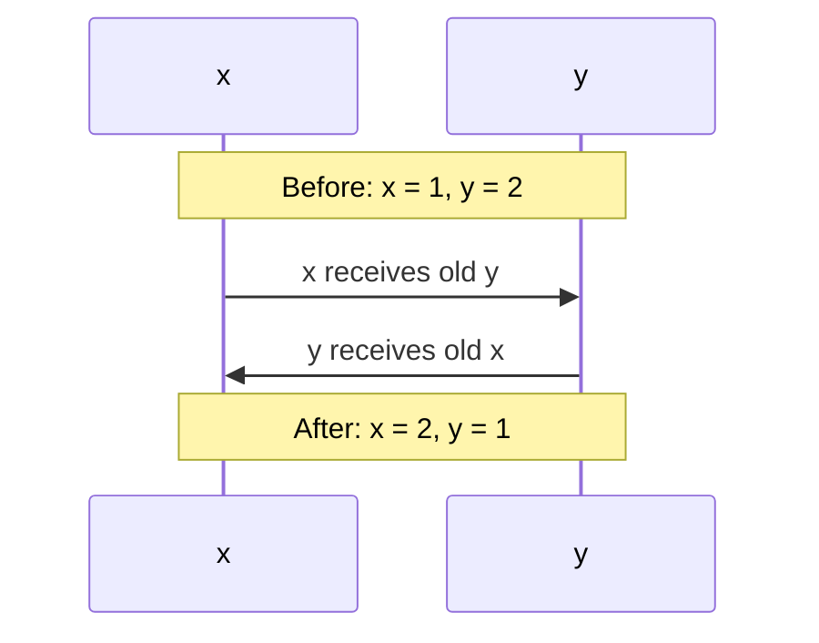

## 4.7 Deleting a variable

```python
x = 10
print(x)

del x

# print(x)  # NameError: name 'x' is not defined
```

`del x` removes the binding of the name `x`.

## 4.8 Shorthand assignment operators

```python
count = 0
count += 1   # Same as count = count + 1
count += 1
count += 1
count += 1
print(count)  # 4
```

| Shorthand | Expanded form |
|---|---|
| `x += y` | `x = x + y` |
| `x -= y` | `x = x - y` |
| `x *= y` | `x = x * y` |
| `x /= y` | `x = x / y` |
| `x //= y` | `x = x // y` |
| `x %= y` | `x = x % y` |
| `x **= y` | `x = x ** y` |

```python
value = 10
value *= 2     # 20
value /= 4     # 5.0
value **= 2    # 25.0
print(value)
```

## 4.9 Membership operator: `in`

The `in` operator checks whether a value occurs inside another value such as a string, list, or tuple.

```python
sentence = "variable names can contain alphanumeric characters"

print("alpha" in sentence)   # True
print("digit" in sentence)   # False
```

Its result is Boolean: `True` or `False`.

## 4.10 Chained comparisons

Python allows multiple comparisons in one expression:

```python
x = 5
print(1 < x < 10)  # True
```

This is equivalent to:

```python
print((1 < x) and (x < 10))
```

More examples:

```python
x = 5

print(10 < x < 20)             # False
print(x < 10 < x * 10 < 100)   # True: 5 < 10 < 50 < 100
print(10 > x <= 9)              # True
print(5 == x > 4)               # True
```

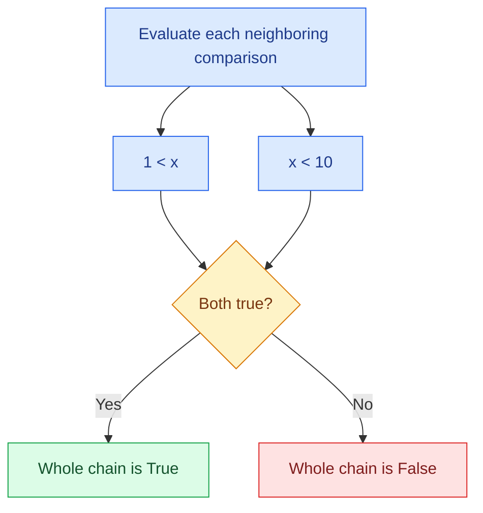

---

# 5. Escape Characters and Quotes

## 5.1 The quote problem

This causes a syntax error because the apostrophe prematurely closes the string:

```python
# Invalid
# print('It's a beautiful day')
```

## 5.2 Escaping a quote

A backslash tells Python to treat the following quote as part of the string.

```python
print('It\'s a beautiful day')
print("We are from \"IIT Madras\"")
```

## 5.3 Common escape sequences

| Escape sequence | Meaning | Example output |
|---|---|---|
| `\'` | Single quote | `'` |
| `\"` | Double quote | `"` |
| `\\` | Backslash | `\` |
| `\n` | New line | Moves to next line |
| `\t` | Horizontal tab | Adds tab spacing |

```python
print("Name:\tAnuj")
print("City:\tAligarh")

print("First line\nSecond line\nThird line")
```

## 5.4 Choosing quote styles

A simpler solution is often to choose the opposite outer quote:

```python
print("It's a beautiful day")
print('He said, "Python is readable."')
```

## 5.5 Triple-quoted strings

Triple quotes can store text across multiple lines.

```python
message = """First line
Second line
Third line"""

print(message)
```

They can use either three double quotes or three single quotes.

```python
poem = """Line one
Line two
Line three"""
```

> **Python precision note:** A standalone triple-quoted string may appear to behave like a multiline comment because its value is unused. Technically, it is still a string literal. Use `#` for ordinary comments and triple quotes primarily for multiline strings and documentation strings (`docstrings`).

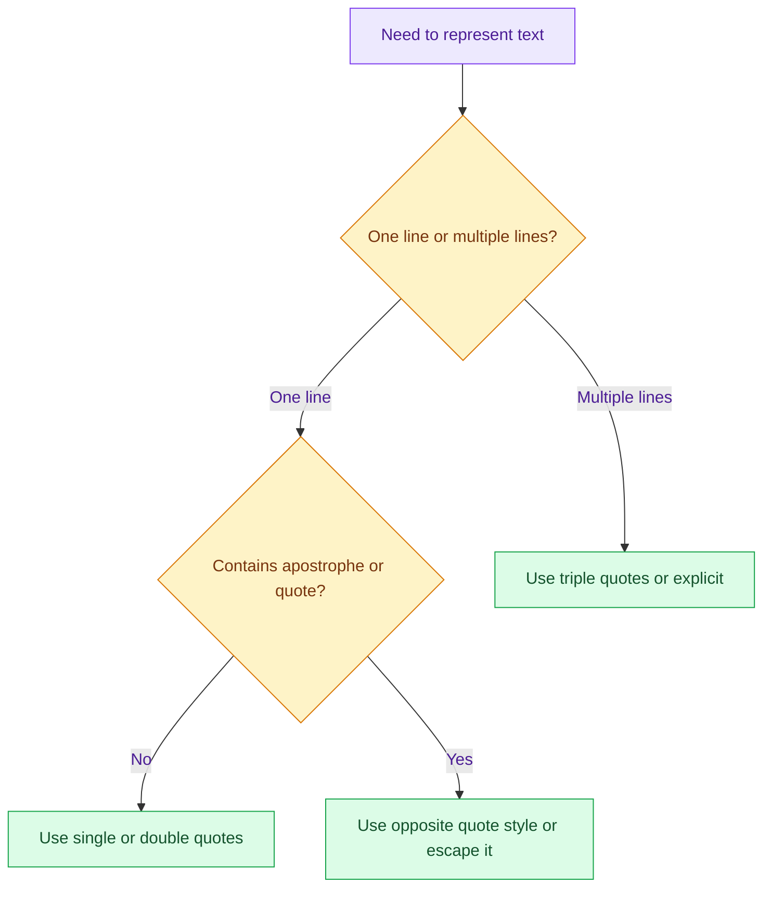

---

# 6. String Methods

## What is a method?

**String methods** are built-in functions that operate on strings to transform or inspect them.

Instead of writing complex loops, Python provides ready-made tools for common text operations.

For a beginner, a method can be treated as a command attached to a value:

```python
text = "python"
print(text.upper())
```

The general form is:

```text
string.method(arguments)
```

Most string methods return a **new string** because strings are immutable.

```python
text = "python"
text.upper()

print(text)  # python: original string is unchanged
```

To preserve the result:

```python
text = "python"
text = text.upper()
print(text)  # PYTHON
```

## 6.1 Changing letter case

```python
text = "pYtHon proGRAMMing"

print(text.lower())       # python programming
print(text.upper())       # PYTHON PROGRAMMING
print(text.capitalize())  # Python programming
print(text.title())       # Python Programming
print(text.swapcase())    # PyThON PROgrammING
```

| Method | Purpose |
|---|---|
| `.lower()` | Convert cased letters to lowercase |
| `.upper()` | Convert cased letters to uppercase |
| `.capitalize()` | Capitalize first character and lowercase the rest |
| `.title()` | Capitalize the beginning of each word |
| `.swapcase()` | Swap uppercase and lowercase |

## 6.2 Checking letter case

```python
print("python".islower())       # True
print("PYTHON".isupper())       # True
print("Python Programming".istitle())  # True
```

These methods do not transform the string; they test it and return a Boolean value.

## 6.3 Testing character categories

```python
print("12345".isdigit())     # True
print("Python".isalpha())    # True
print("Python3".isalnum())   # True
print("Python@3".isalnum())  # False
```

Important observations:

- spaces are not alphabetic or alphanumeric;
- punctuation such as `@`, `*`, and `#` is not alphanumeric;
- uppercase and lowercase letters both count as alphabetic.

## 6.4 Removing characters from the ends

```python
text = "---Python---"

print(text.strip("-"))   # Python
print(text.lstrip("-"))  # Python---
print(text.rstrip("-"))  # ---Python
```

Without an argument, whitespace is removed:

```python
name = "   Anuj   "
print(name.strip())  # Anuj
```

> `strip`, `lstrip`, and `rstrip` affect the ends, not matching characters in the middle.

## 6.5 Checking beginnings and endings

```python
language = "Python"

print(language.startswith("P"))  # True
print(language.startswith("p"))  # False
print(language.endswith("n"))    # True
print(language.endswith("N"))    # False
```

String comparisons and these methods are case-sensitive.

## 6.6 Counting occurrences

```python
text = "statistics"

print(text.count("t"))  # 3
print(text.count("s"))  # 3
```

## 6.7 Finding an index

```python
text = "statistics"
print(text.index("t"))  # 1: first occurrence
```

Indexes begin at `0`.

```text
s t a t i s t i c s
0 1 2 3 4 5 6 7 8 9
```

If the substring is missing, `.index()` raises a `ValueError`.

```python
# ValueError: substring not found
# "python".index("z")
```

A safer alternative when absence is expected:

```python
print("python".find("z"))  # -1
```

## 6.8 Replacing text

```python
message = "I like Java"
updated_message = message.replace("Java", "Python")

print(updated_message)  # I like Python
```

## String-method decision map

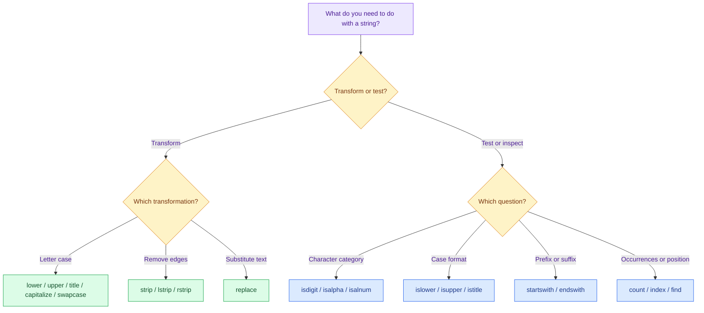

---

# 7. Caesar Cipher

## What is a Caesar cipher?

The **Caesar Cipher** is one of the oldest encryption techniques: each letter in the plaintext is shifted by a fixed number (key `k`) down the alphabet. It is a toy example of cryptography.

For a shift of `k = 1`:

```text
a -> b
b -> c
...
y -> z
z -> a
```

The shift value `k` acts as the key.

## Mathematical formula

Map letters to numbers:

```text
a = 0, b = 1, ..., z = 25
```

For plaintext index \(x\) and shift \(k\):

$$
E_k(x) = (x + k) \bmod 26
$$

For decryption:

$$
D_k(x) = (x - k) \bmod 26
$$

The modulo operation wraps values back to the beginning after `z`.

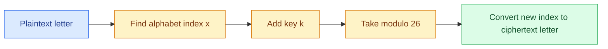

## Transcript-style manual construction

```python
alphabet = "abcdefghijklmnopqrstuvwxyz"
word = "india"
k = 1
ciphertext = ""

# Transform each position manually
ciphertext += alphabet[(alphabet.index(word[0]) + k) % 26]
ciphertext += alphabet[(alphabet.index(word[1]) + k) % 26]
ciphertext += alphabet[(alphabet.index(word[2]) + k) % 26]
ciphertext += alphabet[(alphabet.index(word[3]) + k) % 26]
ciphertext += alphabet[(alphabet.index(word[4]) + k) % 26]

print(ciphertext)  # joejb
```

This version reveals every step but becomes repetitive for long text.

## Compact version using iteration

The transcript intentionally prepares for loops, which are introduced later. Once iteration is available, the same logic becomes concise:

```python
alphabet = "abcdefghijklmnopqrstuvwxyz"
plaintext = "chennai"
k = 2
ciphertext = ""

for character in plaintext:
    # Find the current character's numeric position
    old_index = alphabet.index(character)

    # Shift and wrap within the 26-letter alphabet
    new_index = (old_index + k) % 26

    # Add the encrypted character to the result
    ciphertext += alphabet[new_index]

print(ciphertext)  # ejgppck
```

## Decryption

```python
alphabet = "abcdefghijklmnopqrstuvwxyz"
ciphertext = "ejgppck"
k = 2
plaintext = ""

for character in ciphertext:
    old_index = alphabet.index(character)
    new_index = (old_index - k) % 26
    plaintext += alphabet[new_index]

print(plaintext)  # chennai
```

## Why `% 26` is essential

Suppose `z` has index `25` and `k = 3`:

$$
(25 + 3) \bmod 26 = 28 \bmod 26 = 2
$$

Index `2` is `c`, so `z` wraps to `c`.

## Limitations

The lecture describes this as a toy example. A Caesar cipher is not secure for real communication because only 26 possible shifts exist and letter patterns remain visible.
### ⚙️ How?

#### Step 1: The Alphabet Reference
```python
# The alphabet string — our "lookup table"
alpha = "abcdefghijklmnopqrstuvwxyz"

# Indexing examples
print(alpha[0])     # 'a'
print(alpha[10])    # 'k'
print(alpha[25])   # 'z'
# print(alpha[26])  # IndexError! Out of range
```

#### Step 2: The Modulo Trick for Rotation
```python
# 26 letters → indices 0 to 25
# What if we want to go beyond 'z'? Use modulo 26!

i = 25
print(alpha[i % 26])        # 'z'  (25 % 26 = 25)
print(alpha[(i + 1) % 26])  # 'a'  (26 % 26 = 0)
print(alpha[(i + 2) % 26])  # 'b'  (27 % 26 = 1)
```

#### Step 3: Building the Cipher
```python
alpha = "abcdefghijklmnopqrstuvwxyz"
s = "sudarshan"     # Original message
k = 1               # Shift key (Caesar used k=3!)
t = ""              # Encrypted message (empty string)

# Shift each letter by k positions
# For letter 's': find its index (18), add k (1), mod 26 → 19 → 't'
t = t + alpha[(alpha.index(s[0]) + k) % 26]   # s → t
t = t + alpha[(alpha.index(s[1]) + k) % 26]   # u → v
t = t + alpha[(alpha.index(s[2]) + k) % 26]   # d → e
t = t + alpha[(alpha.index(s[3]) + k) % 26]   # a → b
t = t + alpha[(alpha.index(s[4]) + k) % 26]   # r → s
t = t + alpha[(alpha.index(s[5]) + k) % 26]   # s → t
t = t + alpha[(alpha.index(s[6]) + k) % 26]   # h → i
t = t + alpha[(alpha.index(s[7]) + k) % 26]   # a → b
t = t + alpha[(alpha.index(s[8]) + k) % 26]   # n → o

print("Original:", s)       # sudarshan
print("Encrypted:", t)      # tvebstibo
```

#### Step 4: Using a Variable for the Key
```python
alpha = "abcdefghijklmnopqrstuvwxyz"
s = "chennai"
k = 2                       # Change this one variable to change shift!
t = ""

# Same logic, but k is now a variable
t += alpha[(alpha.index(s[0]) + k) % 26]
t += alpha[(alpha.index(s[1]) + k) % 26]
t += alpha[(alpha.index(s[2]) + k) % 26]
t += alpha[(alpha.index(s[3]) + k) % 26]
t += alpha[(alpha.index(s[4]) + k) % 26]
t += alpha[(alpha.index(s[5]) + k) % 26]
t += alpha[(alpha.index(s[6]) + k) % 26]

print("Shift", k, ":", t)   # ejpgpck
```

> **Fun fact:** The method is associated with Julius Caesar, who is traditionally said to have used letter substitution for military correspondence.

---

# 8. Introduction to Conditional Statements

## What is an `if` statement?

The **`if` statement** is the decision-maker of programming. It checks a condition and executes code **only if** that condition is `True`.

Without `if`, every line of code would execute unconditionally. `if` lets programs react differently based on data.

```python
if condition:
    # Runs only when condition is True
    statement
```

## `if`–`else`

```python
if condition:
    # True branch
    statement_a
else:
    # False branch
    statement_b
```

Exactly one of the two branches runs.

## Movie-age example

The transcript uses a PG-13 movie example.

$$
\text{Age} = \text{Current Year} - \text{Birth Year}
$$

```python
birth_year = int(input("Enter your birth year: "))
current_year = 2021
age = current_year - birth_year

if age < 13:
    print("You are under age for this movie.")
    print("Wait until you are old enough.")
else:
    print("You are old enough to watch the movie.")
    print("Enjoy!")

# This is outside the conditional, so it always runs.
print("Have a nice time.")
```

## Why indentation matters

Indentation tells Python which statements belong to a branch.

```python
if age < 13:
    print("Under age")        # Inside if
    print("Please wait")     # Inside if

print("Program finished")    # Outside if
```

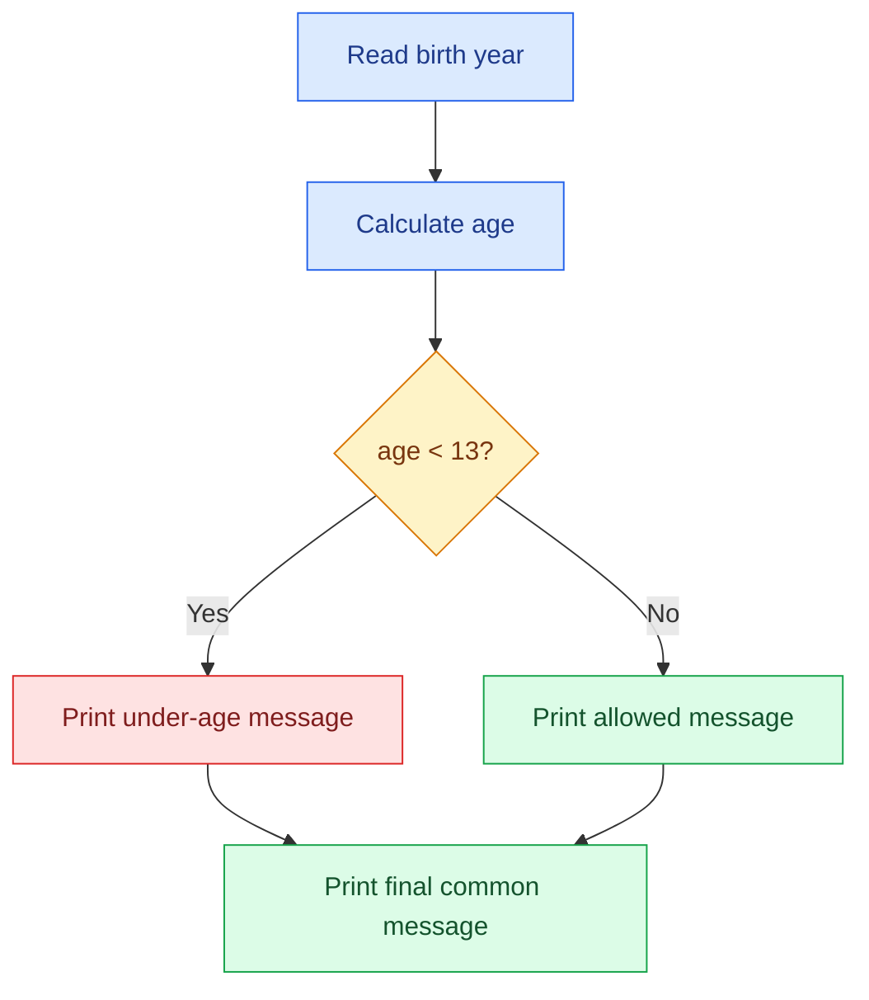

## Current-year precision

A hard-coded year makes the program outdated. A more reusable version can obtain the current year from the standard library:

```python
from datetime import date

birth_year = int(input("Enter your birth year: "))
current_year = date.today().year

# Approximation: exact age also depends on whether the birthday has occurred.
age = current_year - birth_year
```

---

# 9. Practical `if`, `elif`, and `else` Problems

## 9.1 Even or odd

An integer is even when division by `2` leaves remainder `0`.

$$
n \text{ is even} \iff n \bmod 2 = 0
$$

```python
number = int(input("Enter an integer: "))

if number % 2 == 0:
    print("Even")
else:
    print("Odd")
```

This also works for zero and negative integers.

| Input | `number % 2` | Result |
|---:|---:|---|
| `4` | `0` | Even |
| `5` | `1` | Odd |
| `0` | `0` | Even |
| `-7` | `1` in Python | Odd |
| `-10` | `0` | Even |

## 9.2 Does a number end in `0`, `5`, or another digit?

A number ending in `0` is divisible by `10`. A number ending in `5` is divisible by `5` but not by `10`.

```python
number = int(input("Enter an integer: "))

if number % 5 == 0:
    # Multiples of 5 end in either 0 or 5.
    if number % 10 == 0:
        print("Ends with 0")
    else:
        print("Ends with 5")
else:
    print("Ends with another digit")
```

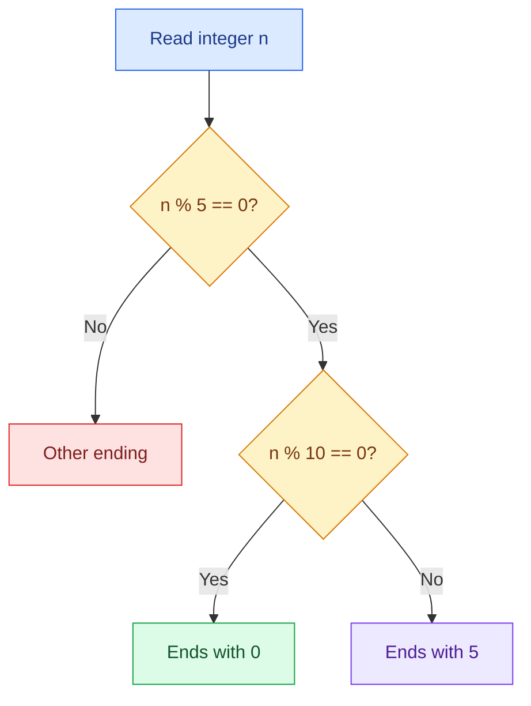

A direct last-digit approach is also possible:

```python
last_digit = abs(number) % 10
```

Using `abs` makes the last digit intuitive for negative numbers.

## 9.3 Grade classification

Assume:

| Marks | Grade |
|---:|:---:|
| `90–100` | A |
| `80–89` | B |
| `70–79` | C |
| `60–69` | D |
| `0–59` | E |
| Outside `0–100` | Invalid |

```python
marks = int(input("Enter marks from 0 to 100: "))

# Validate the input range first.
if not 0 <= marks <= 100:
    print("Invalid input")
elif marks >= 90:
    print("Grade A")
elif marks >= 80:
    print("Grade B")
elif marks >= 70:
    print("Grade C")
elif marks >= 60:
    print("Grade D")
else:
    print("Grade E")
```

### Why the order matters

The conditions are checked from top to bottom. Once one branch matches, the remaining branches are skipped.

For `marks = 87`:

1. `87 >= 90` → `False`;
2. `87 >= 80` → `True`;
3. print `Grade B` and stop the chain.

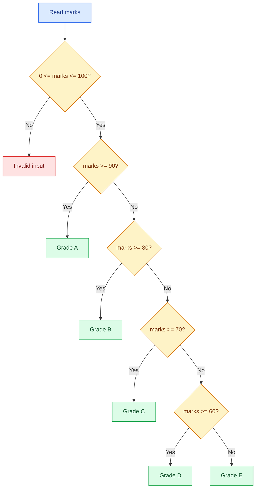

## 9.4 Independent `if` statements versus an `elif` chain

Independent conditions:

```python
if marks >= 90:
    print("A")
if marks >= 80:
    print("B")
```

For `marks = 95`, both conditions are true, so both outputs appear. This is usually wrong for a single grade.

Mutually exclusive chain:

```python
if marks >= 90:
    print("A")
elif marks >= 80:
    print("B")
```

Only the first matching branch runs.

## 9.5 Converting a travel flowchart into code

The transcript describes a decision based on travel time and price:

- long time + high price → train;
- long time + lower price → coach;
- short time + high price → daytime flight;
- short time + lower price → red-eye flight.

```python
print("Travel from City A to City B")

time = int(input("Enter travel time: "))
longer_threshold = int(input("Define the long-time threshold: "))

price = int(input("Enter ticket price: "))
higher_threshold = int(input("Define the high-price threshold: "))

if time >= longer_threshold:
    # Long-duration journey
    if price >= higher_threshold:
        print("Choose train")
    else:
        print("Choose coach")
else:
    # Short-duration journey
    if price >= higher_threshold:
        print("Choose daytime flight")
    else:
        print("Choose red-eye flight")

# Common endpoint, independent of the selected route
print("Arrive at City B")
```

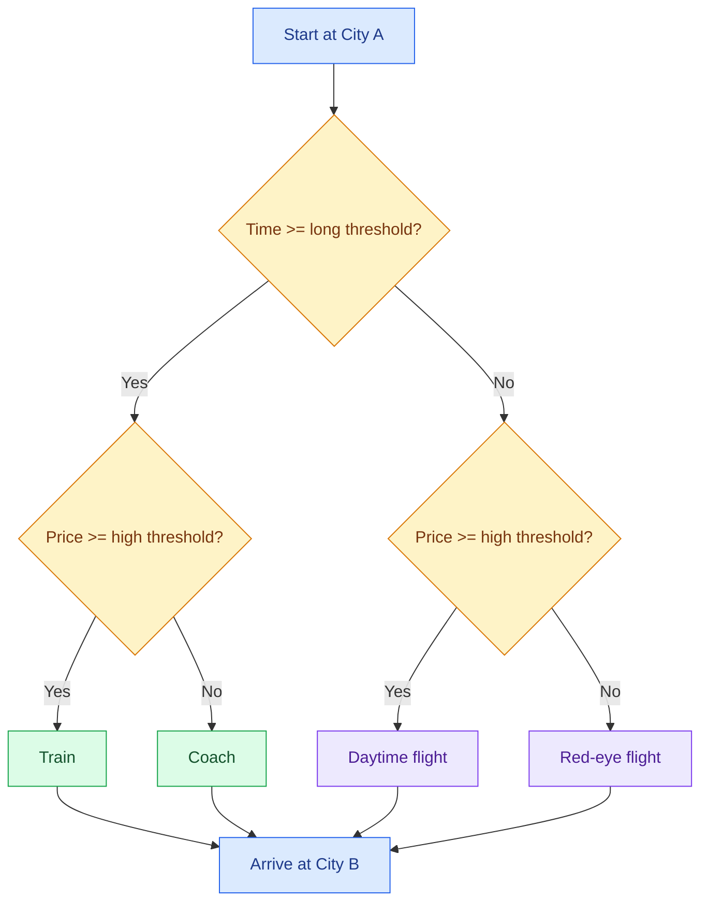

---

# 10. Python Libraries

## What is a library?

A **library** (or module) is a collection of pre-written functions. `import` brings these functions into your program, like borrowing a book from a library.

Instead of writing complex math from scratch, you reuse battle-tested code. Python has thousands of libraries for math, science, AI, web development, and more.

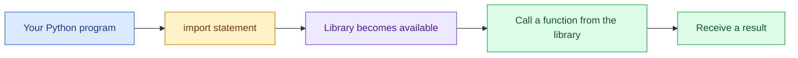

## 10.1 The `math` library

```python
import math

print(math.log(10))       # Natural logarithm of 10
print(math.sqrt(16))      # 4.0
print(math.factorial(5))  # 120
print(math.pow(10, 3))    # 1000.0
```

### Factorial formula

For a non-negative integer \(n\):

$$
n! = n(n-1)(n-2)\cdots 2 \cdot 1
$$

$$
5! = 5 \times 4 \times 3 \times 2 \times 1 = 120
$$

### Trigonometric precision note

`math.sin` expects radians, not degrees.

```python
import math

angle_degrees = 30
angle_radians = math.radians(angle_degrees)

print(math.sin(angle_radians))  # Approximately 0.5
```

Conversion formula:

$$
\text{radians} = \text{degrees} \times \frac{\pi}{180}
$$

## 10.2 The `random` library

```python
import random

value = random.random()
print(value)  # A pseudo-random float where 0.0 <= value < 1.0
```

### Coin-toss simulation

```python
import random

value = random.random()

if value < 0.5:
    print("Heads")
else:
    print("Tails")
```

The interval `[0, 1)` is divided into two equal-width regions:

$$
P(\text{Heads}) \approx 0.5, \qquad P(\text{Tails}) \approx 0.5
$$

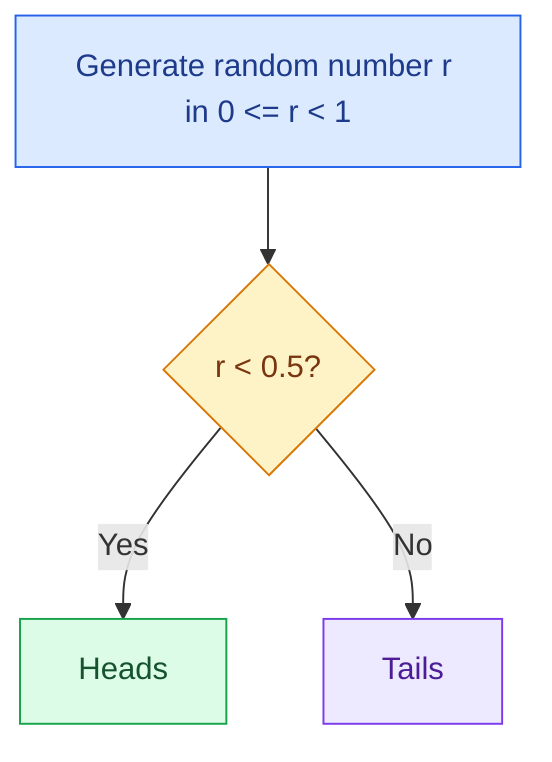

> **Precision note:** Python's standard `random` module produces pseudo-random values suitable for simulations and games, but not for cryptographic secrets. Use the `secrets` module for security-sensitive randomness.

### Simulating a six-sided die

The transcript explores `randrange` and discovers that the stop value is excluded.

```python
import random

roll = random.randrange(1, 7)  # 1, 2, 3, 4, 5, or 6
print(roll)
```

A clearer alternative is:

```python
roll = random.randint(1, 6)  # Both endpoints included
```

### Sum of two dice

```python
import random

dice_1 = random.randint(1, 6)
dice_2 = random.randint(1, 6)
total = dice_1 + dice_2

print("Die 1:", dice_1)
print("Die 2:", dice_2)
print("Total:", total)
```

Possible totals range from:

$$
1 + 1 = 2
$$

to:

$$
6 + 6 = 12
$$

The totals are not equally likely. There are six combinations producing `7`, but only one producing `2` and one producing `12`.

| Total | Number of combinations |
|---:|---:|
| 2 | 1 |
| 3 | 2 |
| 4 | 3 |
| 5 | 4 |
| 6 | 5 |
| 7 | 6 |
| 8 | 5 |
| 9 | 4 |
| 10 | 3 |
| 11 | 2 |
| 12 | 1 |

$$
P(\text{sum}=7) = \frac{6}{36} = \frac{1}{6}
$$

$$
P(\text{sum}=2) = \frac{1}{36}
$$

> **Fun fact:** Repeated simulations tend to make observed frequencies approach theoretical probabilities. This is an intuitive connection to the law of large numbers.

---

# 11. Different Import Styles

The `calendar` library is used to illustrate multiple import forms.

## 11.1 Import the module

```python
import calendar

print(calendar.month(2026, 7))
print(calendar.calendar(2026))
```

You access features through the module name: `calendar.month`.

## 11.2 Import everything

```python
from calendar import *

print(month(2026, 7))
print(calendar(2026))
```

> **Best-practice note:** Although the transcript demonstrates `import *`, it is usually avoided in production code because it hides where names came from and may overwrite existing names.

## 11.3 Import selected names

```python
from calendar import month, calendar

print(month(2026, 7))
print(calendar(2026))
```

This is useful when only a few features are required.

## 11.4 Import with an alias

```python
import calendar as cal

print(cal.month(2026, 7))
```

Or alias a selected function:

```python
from calendar import month as show_month

print(show_month(2026, 7))
```

## Comparison table

| Import style | Example call | Main advantage | Main concern |
|---|---|---|---|
| `import calendar` | `calendar.month(...)` | Explicit origin | Slightly longer |
| `import calendar as cal` | `cal.month(...)` | Short and explicit | Alias must remain clear |
| `from calendar import month` | `month(...)` | Imports only what is needed | Origin less visible at call site |
| `from calendar import *` | `month(...)` | Quick access to all public names | Namespace pollution and ambiguity |

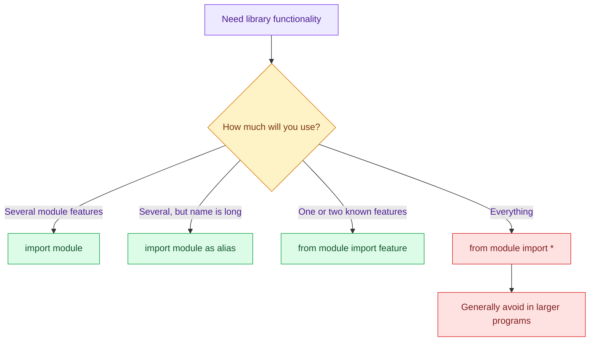

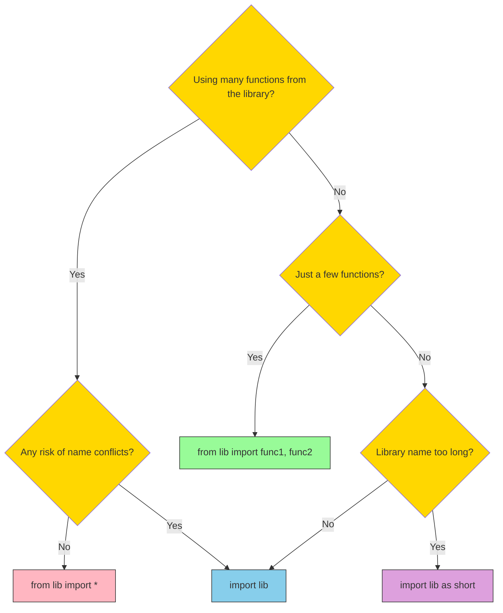

---

# 12. Week 2 Summary

By the end of the transcript sequence, the learner can:

- create variables with meaningful names;
- use comments to explain intention;
- recognize Python's dynamic typing;
- follow identifier rules and avoid keywords;
- use multiple assignment, swapping, deletion, and shorthand operators;
- work with escape characters and multiline strings;
- transform and inspect strings with methods;
- understand the arithmetic behind a Caesar cipher;
- write `if`, `elif`, `else`, and nested conditions;
- translate decision flowcharts into Python;
- import and use `math`, `random`, and `calendar`;
- choose between common import styles.

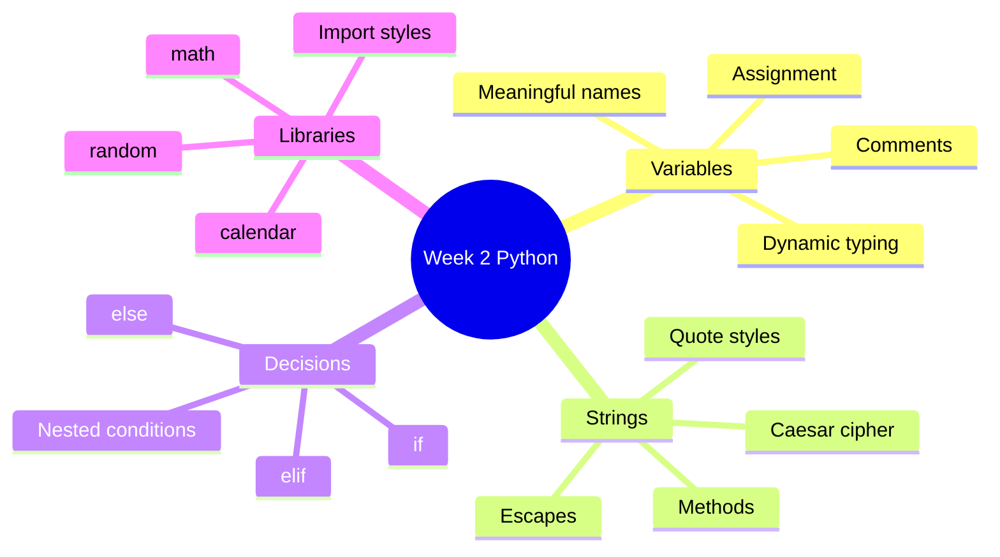

---

# 13. Common Errors and Debugging Guide

## 13.1 Invalid variable name

```python
# 1name = "Anuj"  # SyntaxError
```

**Fix:** Begin with a letter or underscore.

```python
name1 = "Anuj"
```

## 13.2 Using a keyword as a name

```python
# for = 10  # SyntaxError
```

**Fix:** Choose a descriptive non-keyword name.

```python
loop_count = 10
```

## 13.3 Name mismatch

```python
marks = 95
# print(mark)  # NameError
```

Python treats `marks` and `mark` as different names.

## 13.4 Unescaped quote

```python
# print('It's useful')  # SyntaxError
```

```python
print("It's useful")
```

## 13.5 Missing indentation

```python
# if age >= 18:
# print("Adult")  # IndentationError
```

```python
if age >= 18:
    print("Adult")
```

## 13.6 Invalid input conversion

```python
# int("ten")  # ValueError
```

A robust version:

```python
raw_value = input("Enter an integer: ")

if raw_value.lstrip("-").isdigit():
    number = int(raw_value)
    print("Valid integer:", number)
else:
    print("Invalid integer input")
```

## 13.7 Missing string in `.index()`

```python
# "python".index("z")  # ValueError
```

Use `.find()` when absence is acceptable:

```python
position = "python".find("z")
print(position)  # -1
```

## 13.8 Calling a library without importing it

```python
# print(math.sqrt(16))  # NameError
```

```python
import math
print(math.sqrt(16))
```

## Debugging workflow

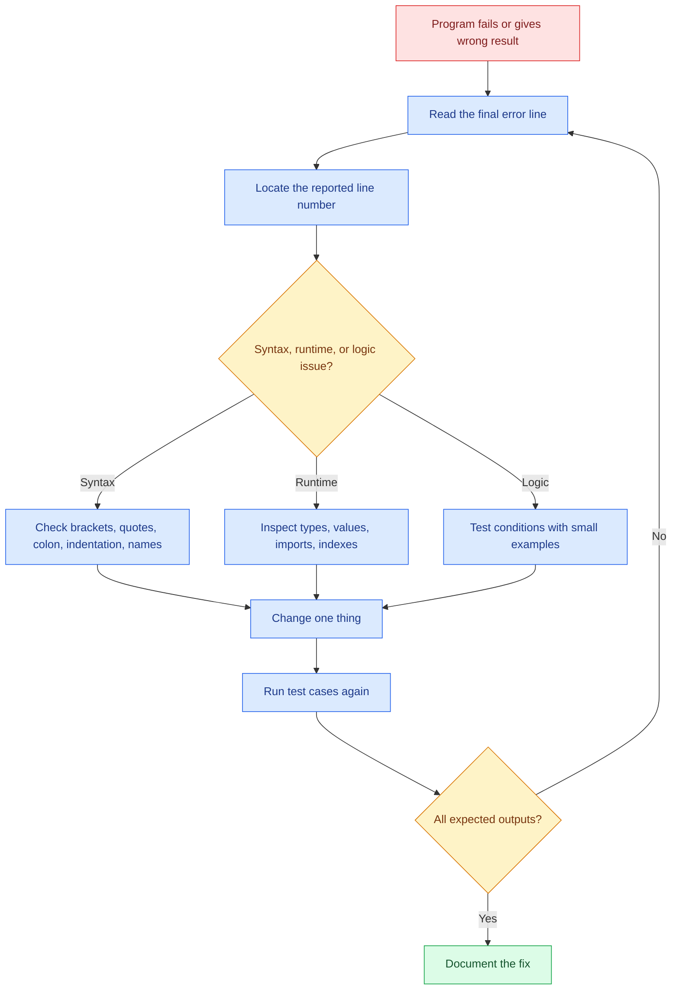

---

# 14. Practice Exercises

## Exercise 1 — Net position

Create variables for assets and liabilities, then print whether the final position is a surplus, break-even, or debt.

## Exercise 2 — Dynamic typing

Predict the type after each line:

```python
value = 12
value = value / 3
value = str(value)
```

## Exercise 3 — Identifier validity

Classify these names:

```text
student_name, 2marks, _count, while, Total, total
```

## Exercise 4 — String cleaning

Given:

```python
raw_name = "---aNUj cHAUDHARY---"
```

Produce:

```text
Anuj Chaudhary
```

## Exercise 5 — Password format checker

Accept a string and report whether it is alphanumeric.

## Exercise 6 — Caesar cipher

Encrypt `python` with `k = 4`, then decrypt it.

## Exercise 7 — Number classifier

Classify an integer as:

- positive even;
- positive odd;
- negative even;
- negative odd;
- zero.

## Exercise 8 — Grade program

Extend the grade program so that decimal marks are accepted using `float`.

## Exercise 9 — Coin toss

Simulate one coin toss using `random.random()`.

## Exercise 10 — Calendar

Ask the user for a year and month, then display that month's calendar.

<details>
<summary><strong>Suggested solutions</strong></summary>

### Solution 1

```python
assets = 800_000
liabilities = 650_000
net = assets - liabilities

if net > 0:
    print("Surplus:", net)
elif net == 0:
    print("Break-even")
else:
    print("Debt:", abs(net))
```

### Solution 2

```text
12      -> int
4.0     -> float
"4.0"   -> str
```

### Solution 3

```text
student_name -> valid
2marks       -> invalid: starts with digit
_count       -> valid
while        -> invalid: keyword
Total        -> valid
total        -> valid and different from Total
```

### Solution 4

```python
raw_name = "---aNUj cHAUDHARY---"
clean_name = raw_name.strip("-").title()
print(clean_name)
```

### Solution 5

```python
password = input("Enter password text: ")
print(password.isalnum())
```

### Solution 6

```python
alphabet = "abcdefghijklmnopqrstuvwxyz"
plaintext = "python"
k = 4
ciphertext = ""

for char in plaintext:
    ciphertext += alphabet[(alphabet.index(char) + k) % 26]

print(ciphertext)

recovered = ""
for char in ciphertext:
    recovered += alphabet[(alphabet.index(char) - k) % 26]

print(recovered)
```

### Solution 7

```python
number = int(input("Enter an integer: "))

if number == 0:
    print("Zero")
elif number > 0 and number % 2 == 0:
    print("Positive even")
elif number > 0:
    print("Positive odd")
elif number % 2 == 0:
    print("Negative even")
else:
    print("Negative odd")
```

### Solution 8

```python
marks = float(input("Enter marks: "))

if not 0 <= marks <= 100:
    print("Invalid input")
elif marks >= 90:
    print("A")
elif marks >= 80:
    print("B")
elif marks >= 70:
    print("C")
elif marks >= 60:
    print("D")
else:
    print("E")
```

### Solution 9

```python
import random
print("Heads" if random.random() < 0.5 else "Tails")
```

### Solution 10

```python
import calendar

year = int(input("Enter year: "))
month_number = int(input("Enter month number: "))

if 1 <= month_number <= 12:
    print(calendar.month(year, month_number))
else:
    print("Invalid month")
```

</details>

---

# 15. Cheat Sheet

## Variables

```python
student_name = "Anuj"
marks = 92
x, y = 1, 2
x, y = y, x
count += 1
```

## Types

```python
print(type(value))
```

## Strings

```python
text.lower()
text.upper()
text.title()
text.strip()
text.startswith("Py")
text.endswith("on")
text.count("t")
text.find("x")
text.replace("old", "new")
```

## Conditions

```python
if condition:
    ...
elif another_condition:
    ...
else:
    ...
```

## Useful operators

```python
%       # remainder
in      # membership
==      # equality comparison
!=      # inequality comparison
and     # both conditions
or      # at least one condition
not     # invert Boolean result
```

## Libraries

```python
import math
import random
import calendar as cal
from calendar import month
```

---

## Final learning advice

1. Re-type every example rather than only reading it.
2. Predict the output before running the code.
3. Change one input or operator and observe the effect.
4. Test boundary values such as `0`, `13`, `60`, `90`, and `100`.
5. Read error messages from the last line upward.
6. Use meaningful variable names and focused comments.
7. Convert flowcharts into small decisions before writing code.
8. Revisit difficult topics after writing more programs.

> Programming becomes familiar through execution, experimentation, errors, and correction—not through syntax memorization alone.
