# Python Programming — Week 3: Loops, Iteration, Formatted Output, and Nested Logic

> Detailed study notes derived from the shared Week 3 YouTube transcripts  
> Topics: `while`, `for`, `range`, accumulators, factorials, digit algorithms, formatted printing, nested loops, `break`, `continue`, and `pass`

---

## Table of Contents

1. [Week 3 Overview: The `if`–`for`–`while` Triangle](#1-week-3-overview-the-ifforwhile-triangle)
2. [Repetition and Loop Anatomy](#2-repetition-and-loop-anatomy)
3. [`while` Loop Fundamentals](#3-while-loop-fundamentals)
4. [Quiz Program Using `while`](#4-quiz-program-using-while)
5. [Factorial Using `while`](#5-factorial-using-while)
6. [Additional `while` Loop Problems](#6-additional-while-loop-problems)
7. [`for` Loop Fundamentals](#7-for-loop-fundamentals)
8. [Understanding `range()` Deeply](#8-understanding-range-deeply)
9. [Accumulator Pattern and Summation](#9-accumulator-pattern-and-summation)
10. [Multiplication Tables](#10-multiplication-tables)
11. [Formatted Printing](#11-formatted-printing)
12. [`while` versus `for`](#12-while-versus-for)
13. [Iterating Directly Over Strings](#13-iterating-directly-over-strings)
14. [Nested Loops](#14-nested-loops)
15. [Nested-Loop Case Studies](#15-nested-loop-case-studies)
16. [`break`, `continue`, and `pass`](#16-break-continue-and-pass)
17. [Common Errors and Debugging](#17-common-errors-and-debugging)
18. [Complexity and Performance Intuition](#18-complexity-and-performance-intuition)
19. [Practice Problems](#19-practice-problems)
20. [Solutions](#20-solutions)
21. [Final Cheat Sheet](#21-final-cheat-sheet)

---

# 1. Week 3 Overview: The `if`–`for`–`while` Triangle

The transcript introduces Week 3 through a driving and treadmill analogy:

- **`if`** makes a decision once.
- **`while`** repeats while a condition remains true.
- **`for`** repeats over a known sequence or a known collection of values.

A useful mental model is:

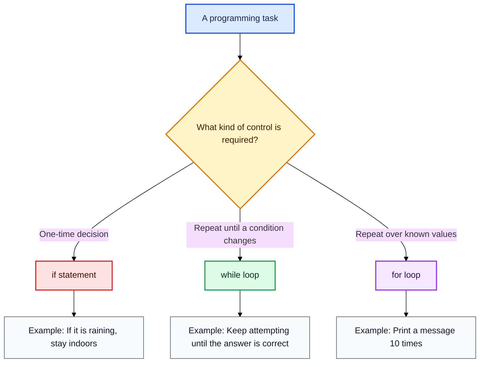
```mermaid
%%{init: {'theme': 'base', 'themeVariables': {'fontFamily': 'Arial'}}}%%
flowchart TD
    A["A programming task"] --> B{"What kind of control is required?"}
    B -->|One-time decision| C["if statement"]
    B -->|Repeat until a condition changes| D["while loop"]
    B -->|Repeat over known values| E["for loop"]

    C --> F["Example: If it is raining, stay indoors"]
    D --> G["Example: Keep attempting until the answer is correct"]
    E --> H["Example: Print a message 10 times"]

    classDef start fill:#dbeafe,stroke:#1d4ed8,color:#172554,stroke-width:2px;
    classDef decision fill:#fef3c7,stroke:#d97706,color:#451a03,stroke-width:2px;
    classDef ifnode fill:#fee2e2,stroke:#dc2626,color:#450a0a,stroke-width:2px;
    classDef whilenode fill:#dcfce7,stroke:#16a34a,color:#052e16,stroke-width:2px;
    classDef fornode fill:#f3e8ff,stroke:#9333ea,color:#3b0764,stroke-width:2px;
    classDef example fill:#f8fafc,stroke:#475569,color:#0f172a;

    class A start;
    class B decision;
    class C ifnode;
    class D whilenode;
    class E fornode;
    class F,G,H example;
```

## Why loops matter

Without loops, repeated work requires repeated code:

```python
# Repeating a statement manually is possible but inefficient.
print("Hello India")
print("Hello India")
print("Hello India")
print("Hello India")
print("Hello India")
```

A loop expresses the same intention more clearly:

```python
# Repeat the indented statement exactly five times.
for _ in range(5):
    print("Hello India")
```

### Main advantages

| Advantage | Meaning |
|---|---|
| Less repetition | One loop can replace hundreds of copied statements. |
| Easier maintenance | Changing one line changes every repetition. |
| Automation | The computer performs repetitive work automatically. |
| Scalability | A loop can process ten, ten thousand, or a million items. |
| Generality | The same program can work for different inputs. |

> **Fun fact:** The variable `_` is commonly used when the loop value itself is not needed. It communicates: “repeat this, but I do not need the current counter.”

---

# 2. Repetition and Loop Anatomy
### What?
Loops are control structures that allow a block of code to be executed **repeatedly** based on a condition or a sequence.

### Why?
Without loops, automation is impossible. Imagine printing "Hello India" 1000 times by writing 1000 `print()` statements — loops save us from this madness.

### How?
Python provides two primary looping constructs:
- **`while` loop**: Repeats **while** a condition remains true (like jogging on a treadmill until someone says "stop").
- **`for` loop**: Repeats **for** a predefined number of times or over a sequence (like counting exactly 1000 steps on a treadmill).

### When?
- Use **`while`** when you **don't know** how many iterations are needed beforehand.
- Use **`for`** when you **know** the exact count or are iterating over a collection.

Every useful loop needs three ideas:

1. **Initialization** — the starting state.
2. **Condition or sequence** — whether another iteration should occur.
3. **Update** — how progress is made.

## Generic `while` anatomy

```python
# 1. Initialization
counter = 1

# 2. Condition
while counter <= 5:
    print(counter)

    # 3. Update
    counter += 1
```

## Generic `for` anatomy

```python
# range(1, 6) automatically produces 1, 2, 3, 4, 5.
for counter in range(1, 6):
    print(counter)
```

## Loop lifecycle

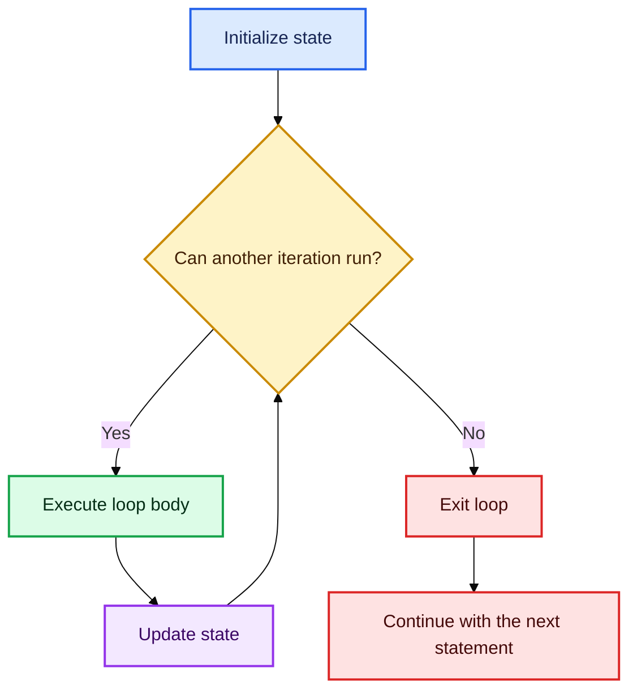
```mermaid
%%{init: {'theme': 'base'}}%%
flowchart TD
    A["Initialize state"] --> B{"Can another iteration run?"}
    B -->|Yes| C["Execute loop body"]
    C --> D["Update state"]
    D --> B
    B -->|No| E["Exit loop"]
    E --> F["Continue with the next statement"]

    classDef init fill:#dbeafe,stroke:#2563eb,color:#172554,stroke-width:2px;
    classDef test fill:#fef3c7,stroke:#ca8a04,color:#422006,stroke-width:2px;
    classDef body fill:#dcfce7,stroke:#16a34a,color:#052e16,stroke-width:2px;
    classDef update fill:#f3e8ff,stroke:#9333ea,color:#3b0764,stroke-width:2px;
    classDef stop fill:#fee2e2,stroke:#dc2626,color:#450a0a,stroke-width:2px;

    class A init;
    class B test;
    class C body;
    class D update;
    class E,F stop;
```

## The most important loop question

Ask:

> **What changes after each iteration so that the loop can eventually stop?**

If nothing changes, the condition may remain true forever.

```python
# WARNING: This is an infinite loop because count never changes.
count = 1

while count <= 5:
    print(count)
    # Missing: count += 1
```

Correct version:

```python
# The update ensures progress toward the stopping condition.
count = 1

while count <= 5:
    print(count)
    count += 1
```

---

# 3. `while` Loop Fundamentals

A `while` loop continuously executes its body **as long as** its boolean condition evaluates to `True`. It creates a **patient, emotionless quiz master** — it will ask the same question a million times without getting frustrated until you get it right.

## Syntax

```python
while condition:
    # Statements in this indented block repeat.
    statement_1
    statement_2
```

The condition is checked **before** each iteration. Therefore, a `while` loop may execute zero times.

```python
# The condition is False immediately, so the body never runs.
number = 10

while number < 5:
    print(number)
```

## Treadmill analogy

The transcript compares a `while` loop to:

> “Keep jogging while I remain silent. Stop when I say stop.”

The number of repetitions is unknown in advance. Execution depends on a condition.

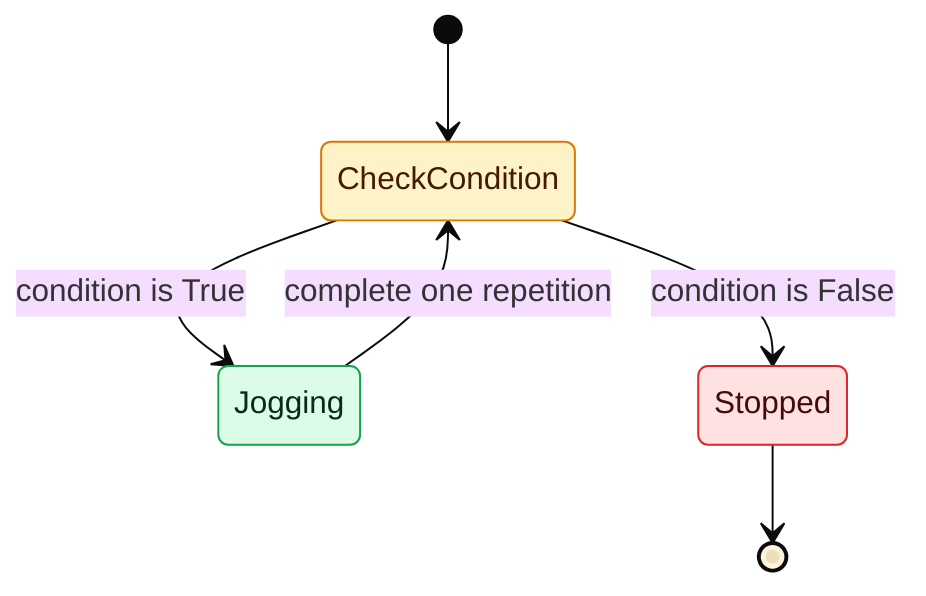
```mermaid
%%{init: {'theme': 'base'}}%%
stateDiagram-v2
    [*] --> CheckCondition
    CheckCondition --> Jogging: condition is True
    Jogging --> CheckCondition: complete one repetition
    CheckCondition --> Stopped: condition is False
    Stopped --> [*]

    classDef checking fill:#fef3c7,stroke:#d97706,color:#451a03;
    classDef active fill:#dcfce7,stroke:#16a34a,color:#052e16;
    classDef done fill:#fee2e2,stroke:#dc2626,color:#450a0a;
    class CheckCondition checking
    class Jogging active
    class Stopped done
```

## `if` versus `while`

```python
# if checks once.
temperature = 35

if temperature > 30:
    print("It is hot.")
```

```python
# while checks repeatedly.
temperature = 35

while temperature > 30:
    print("Cooling the room...")
    temperature -= 1  # Simulate the room becoming cooler.
```

| Feature | `if` | `while` |
|---|---|---|
| Condition checked | Once | Repeatedly |
| Body can run | Zero or one time | Zero or many times |
| Typical purpose | Decision | Repetition |
| Needs progress update | Usually no | Usually yes |

---

# 4. Quiz Program Using `while`

The transcript begins with a quiz asking the year of Indian independence. A single `if` can check one attempt, but a `while` loop can offer unlimited attempts.

## One-attempt version

```python
# Ask the question once.
year = int(input("When did India gain independence? "))

# Check only once.
if year == 1947:
    print("Hip Hip Hurray! You got that right.")
else:
    print("That answer is incorrect.")
```

## Repeated-attempt version

```python
# Read the first attempt before entering the loop.
year = int(input("When did India gain independence? "))

# Keep repeating while the answer is incorrect.
while year != 1947:
    print("You got this wrong. Enter once again.")

    # This update is essential; it gives year a new value.
    year = int(input("Try again: "))

# This statement runs only after the loop condition becomes False.
print("Wow! You got it right.")
```

## Execution flow

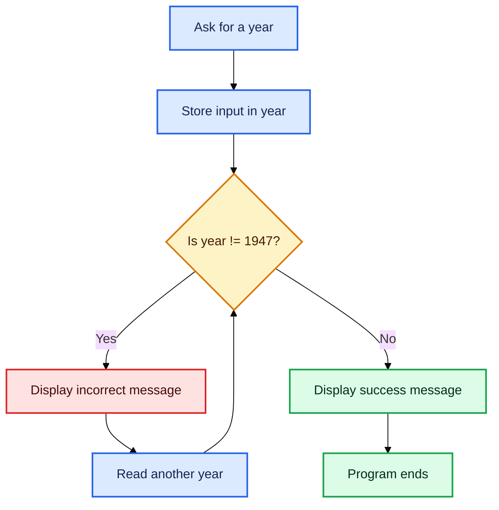
```mermaid
%%{init: {'theme': 'base'}}%%
flowchart TD
    A["Ask for a year"] --> B["Store input in year"]
    B --> C{"Is year != 1947?"}
    C -->|Yes| D["Display incorrect message"]
    D --> E["Read another year"]
    E --> C
    C -->|No| F["Display success message"]
    F --> G["Program ends"]

    classDef input fill:#dbeafe,stroke:#2563eb,color:#172554,stroke-width:2px;
    classDef test fill:#fef3c7,stroke:#d97706,color:#451a03,stroke-width:2px;
    classDef wrong fill:#fee2e2,stroke:#dc2626,color:#450a0a,stroke-width:2px;
    classDef right fill:#dcfce7,stroke:#16a34a,color:#052e16,stroke-width:2px;

    class A,B,E input;
    class C test;
    class D wrong;
    class F,G right;
```

## Dry run

Suppose the user enters `1950`, `1940`, and then `1947`.

| Check | `year` | `year != 1947` | Action |
|---:|---:|---|---|
| 1 | 1950 | `True` | Print error and ask again |
| 2 | 1940 | `True` | Print error and ask again |
| 3 | 1947 | `False` | Exit loop and congratulate |

## Sentinel-controlled loops

A **sentinel** is a special value that signals the end of input.

Examples from this week include:

- `1947` as the correct answer that stops retrying.
- `-1` to stop entering traders or words.
- `0` to stop entering transaction values.
- `-1` to stop entering rainfall measurements for one day.

Generic pattern:

```python
# Read the first value.
value = int(input("Enter a value (-1 to stop): "))

# Continue until the sentinel appears.
while value != -1:
    print("Processing:", value)

    # Read the next value.
    value = int(input("Enter a value (-1 to stop): "))
```

---

# 5. Factorial Using `while`

## What is a factorial?

For a non-negative integer \(n\),

$$
n! = 1 \times 2 \times 3 \times \cdots \times n
$$

Equivalent descending form:

$$
n! = n \times (n-1) \times (n-2) \times \cdots \times 1
$$

Special case:

$$
0! = 1
$$

Examples:

$$
5! = 1 \times 2 \times 3 \times 4 \times 5 = 120
$$

$$
6! = 720
$$

The transcript emphasizes that factorial values grow extremely quickly.

| \(n\) | \(n!\) |
|---:|---:|
| 5 | 120 |
| 10 | 3,628,800 |
| 20 | 2,432,902,008,176,640,000 |

## Why initialize the answer to `1`?

Factorial uses multiplication. The multiplicative identity is `1`:

$$
x \times 1 = x
$$

Starting with `0` would destroy the calculation:

$$
0 \times 1 \times 2 \times \cdots \times n = 0
$$

## Ascending version

```python
# Read the number whose factorial is required.
n = int(input("Enter a non-negative integer: "))

# Factorial is not defined here for negative integers.
if n < 0:
    print("Factorial is not defined for negative integers.")
else:
    answer = 1  # Multiplicative accumulator starts at 1.
    i = 1       # First multiplier.

    # Multiply answer by every integer from 1 through n.
    while i <= n:
        answer *= i
        i += 1

    print(f"{n}! = {answer}")
```

## Descending version

```python
# Read the input.
number = int(input("Enter a non-negative integer: "))

if number < 0:
    print("Factorial is not defined for negative integers.")
else:
    factorial = 1
    current = number

    # Multiply by current, then reduce current toward zero.
    while current > 0:
        factorial *= current
        current -= 1

    print(f"Factorial = {factorial}")
```

## Trace table for `5!`

| Iteration | `i` before multiplication | `answer` before | Operation | `answer` after |
|---:|---:|---:|---|---:|
| 1 | 1 | 1 | \(1 \times 1\) | 1 |
| 2 | 2 | 1 | \(1 \times 2\) | 2 |
| 3 | 3 | 2 | \(2 \times 3\) | 6 |
| 4 | 4 | 6 | \(6 \times 4\) | 24 |
| 5 | 5 | 24 | \(24 \times 5\) | 120 |

After the fifth iteration, `i` becomes `6`. The condition `6 <= 5` is false, so the loop stops.

## Factorial flowchart

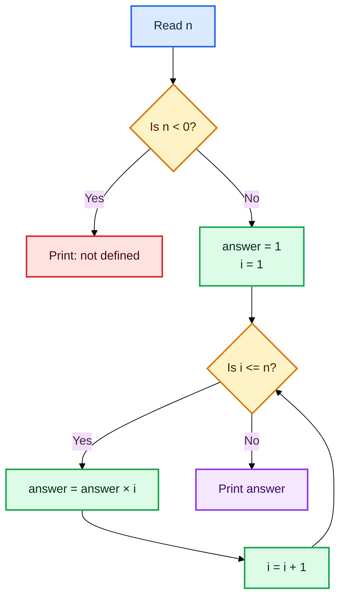
```mermaid
%%{init: {'theme': 'base'}}%%
flowchart TD
    A["Read n"] --> B{"Is n < 0?"}
    B -->|Yes| C["Print: not defined"]
    B -->|No| D["answer = 1<br/>i = 1"]
    D --> E{"Is i <= n?"}
    E -->|Yes| F["answer = answer × i"]
    F --> G["i = i + 1"]
    G --> E
    E -->|No| H["Print answer"]

    classDef input fill:#dbeafe,stroke:#2563eb,color:#172554,stroke-width:2px;
    classDef test fill:#fef3c7,stroke:#d97706,color:#451a03,stroke-width:2px;
    classDef calc fill:#dcfce7,stroke:#16a34a,color:#052e16,stroke-width:2px;
    classDef error fill:#fee2e2,stroke:#dc2626,color:#450a0a,stroke-width:2px;
    classDef output fill:#f3e8ff,stroke:#9333ea,color:#3b0764,stroke-width:2px;

    class A input;
    class B,E test;
    class D,F,G calc;
    class C error;
    class H output;
```

## Supplementary complexity insight

The loop performs approximately \(n\) multiplications.

$$
T(n) = O(n)
$$

Python supports arbitrarily large integers, but very large factorials require more time and memory because the number of digits grows rapidly.

A rough estimate of the number of decimal digits in \(n!\) is:

$$
\text{digits}(n!) =
\left\lfloor
\sum_{k=1}^{n} \log_{10}(k)
\right\rfloor + 1
$$

---

# 6. Additional `while` Loop Problems

The transcript develops four classic algorithms:

1. Factorial
2. Counting digits
3. Reversing digits
4. Detecting palindromes

These examples teach how loop state changes over time.

---

## 6.1 Counting the number of digits

### Core idea

Repeated integer division by 10 removes the final digit.

$$
1234 // 10 = 123
$$

$$
123 // 10 = 12
$$

$$
12 // 10 = 1
$$

Each successful division corresponds to removing one digit.

```python
# Read the number and ignore its sign for digit counting.
number = abs(int(input("Enter an integer: ")))

# Zero and all one-digit numbers have one digit.
digits = 1

# Remove one trailing digit per iteration.
while number >= 10:
    number //= 10
    digits += 1

print("Number of digits:", digits)
```

### Trace for `1234`

| Iteration | `number` before | `number // 10` | `digits` |
|---:|---:|---:|---:|
| Initial | 1234 | — | 1 |
| 1 | 1234 | 123 | 2 |
| 2 | 123 | 12 | 3 |
| 3 | 12 | 1 | 4 |

The loop stops because `1 >= 10` is false.

### Supplementary mathematical formula

For $(n \neq \theta)$,

$$
\text{digits}(n) = \lfloor \log_{10}(|n|) \rfloor + 1
$$

For $n=0$, the digit count is `1`.

The loop-based method is valuable because it directly develops iteration and integer-division intuition.

---

## 6.2 Reversing the digits of a number

For `1234`, the required result is `4321`.

Two operations are central:

1. Extract the last digit:

$$
d = n \bmod 10
$$

2. Remove the last digit:

$$
n = n // 10
$$

To append digit $d$ to the right of the current reversed number $r$:

$$
r_{\text{new}} = 10r + d
$$

### Example recurrence

| Current `reverse` | New digit | Calculation | New `reverse` |
|---:|---:|---|---:|
| 0 | 4 | $0 \times 10 + 4$ | 4 |
| 4 | 3 | $4 \times 10 + 3$ | 43 |
| 43 | 2 | $43 \times 10 + 2$ | 432 |
| 432 | 1 | $432 \times 10 + 1$ | 4321 |

### Program preserving the sign

```python
# Preserve the original number so its sign remains available.
original = int(input("Enter an integer: "))

# Perform digit operations on the non-negative magnitude.
remaining = abs(original)
reverse = 0

# Extract and append one digit per iteration.
while remaining > 0:
    digit = remaining % 10
    reverse = reverse * 10 + digit
    remaining //= 10

# If the original number was negative, restore its sign.
if original < 0:
    reverse = -reverse

print("Reversed number:", reverse)
```

### Important zero case

The program naturally prints `0` for an input of `0` because `reverse` begins at zero and the loop does not run.

### Flowchart

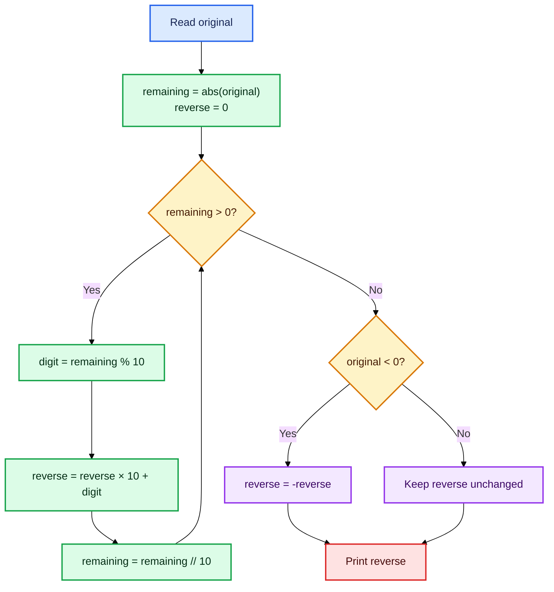
```mermaid
%%{init: {'theme': 'base'}}%%
flowchart TD
    A["Read original"] --> B["remaining = abs(original)<br/>reverse = 0"]
    B --> C{"remaining > 0?"}
    C -->|Yes| D["digit = remaining % 10"]
    D --> E["reverse = reverse × 10 + digit"]
    E --> F["remaining = remaining // 10"]
    F --> C
    C -->|No| G{"original < 0?"}
    G -->|Yes| H["reverse = -reverse"]
    G -->|No| I["Keep reverse unchanged"]
    H --> J["Print reverse"]
    I --> J

    classDef input fill:#dbeafe,stroke:#2563eb,color:#172554,stroke-width:2px;
    classDef test fill:#fef3c7,stroke:#d97706,color:#451a03,stroke-width:2px;
    classDef calc fill:#dcfce7,stroke:#16a34a,color:#052e16,stroke-width:2px;
    classDef sign fill:#f3e8ff,stroke:#9333ea,color:#3b0764,stroke-width:2px;
    classDef output fill:#fee2e2,stroke:#dc2626,color:#450a0a,stroke-width:2px;

    class A input;
    class C,G test;
    class B,D,E,F calc;
    class H,I sign;
    class J output;
```

---

## 6.3 Palindrome number

A palindrome remains the same after reversal.

Examples:

- `12321`
- `1221`
- `7`
- In the transcript’s convention, a negative number such as `-1221` is treated as a palindrome if its signed reversed result is also `-1221`.

### Logic

$$
\text{palindrome} \iff \text{original} = \text{reverse(original)}
$$

```python
# Read and preserve the original number.
original = int(input("Enter an integer: "))

remaining = abs(original)
reversed_number = 0

# Reverse the magnitude.
while remaining > 0:
    digit = remaining % 10
    reversed_number = reversed_number * 10 + digit
    remaining //= 10

# Restore the sign for comparison.
if original < 0:
    reversed_number = -reversed_number

# Compare the original and reversed values.
if original == reversed_number:
    print("It is a palindrome.")
else:
    print("It is not a palindrome.")
```

## Why a single-digit number is always a palindrome

Reversing a one-digit number does not change it:

$$
\text{reverse}(7) = 7
$$

---

## 6.4 Sum of digits

This problem appears later when choosing between `while` and `for`.

For $n=583$:

$$
5 + 8 + 3 = 16
$$

```python
# Ignore the sign while summing digits.
number = abs(int(input("Enter an integer: ")))
digit_sum = 0

while number > 0:
    digit = number % 10      # Extract the final digit.
    digit_sum += digit       # Add it to the accumulator.
    number //= 10            # Remove the final digit.

print("Sum of digits:", digit_sum)
```

For input `0`, the result correctly remains `0`.

---

# 7. `for` Loop Fundamentals

A `for` loop is especially suitable when:

- the number of repetitions is known;
- a finite sequence is available;
- every item in a string, list, or other iterable must be processed.

## Basic syntax with `range`

```python
# i receives 0, 1, 2, ..., 9.
for i in range(10):
    print(i, "Hello India")
```

`range(10)` generates values from `0` up to—but not including—`10`.

$$
\{0,1,2,\ldots,9\}
$$

## Why the stop value is excluded

In Python:

```python
range(start, stop)
```

includes `start` but excludes `stop`.

Therefore:

```python
# Produces 1 through 10.
for number in range(1, 11):
    print(number)
```

## Indentation matters

Incorrect:

```python
# This causes an IndentationError because the loop body is missing.
for i in range(5):
print(i)
```

Correct:

```python
# The indented statement belongs to the loop.
for i in range(5):
    print(i)
```

## Combining `for` and `if`

```python
# Classify each number from 0 through 11.
for i in range(12):
    if i % 2 == 0:
        print(i, "is even")
    else:
        print(i, "is odd")
```

The condition for evenness is:

$$
i \bmod 2 = 0
$$

The condition for oddness is:

$$
i \bmod 2 \neq 0
$$

## Loop flow

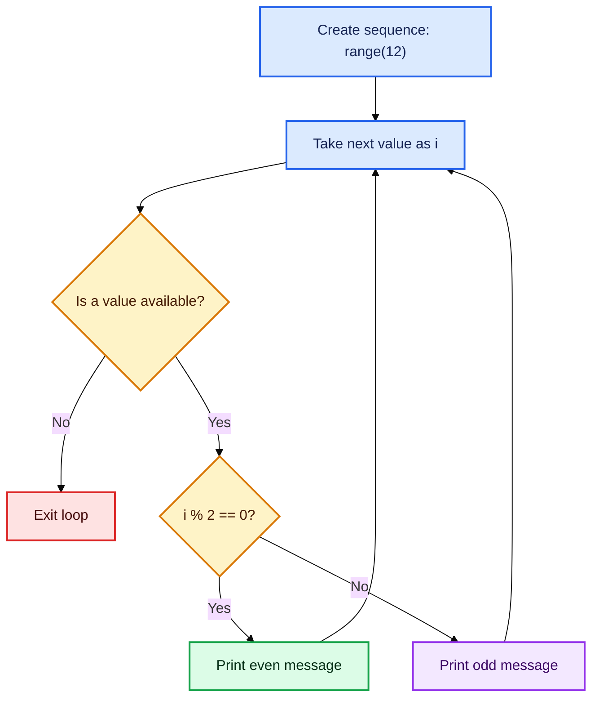
```mermaid
%%{init: {'theme': 'base'}}%%
flowchart TD
    A["Create sequence: range(12)"] --> B["Take next value as i"]
    B --> C{"Is a value available?"}
    C -->|No| H["Exit loop"]
    C -->|Yes| D{"i % 2 == 0?"}
    D -->|Yes| E["Print even message"]
    D -->|No| F["Print odd message"]
    E --> B
    F --> B

    classDef seq fill:#dbeafe,stroke:#2563eb,color:#172554,stroke-width:2px;
    classDef test fill:#fef3c7,stroke:#d97706,color:#451a03,stroke-width:2px;
    classDef even fill:#dcfce7,stroke:#16a34a,color:#052e16,stroke-width:2px;
    classDef odd fill:#f3e8ff,stroke:#9333ea,color:#3b0764,stroke-width:2px;
    classDef stop fill:#fee2e2,stroke:#dc2626,color:#450a0a,stroke-width:2px;

    class A,B seq;
    class C,D test;
    class E even;
    class F odd;
    class H stop;
```

---

# 8. Understanding `range()` Deeply

`range()` can be used in three forms.

## 8.1 `range(stop)`

```python
# start defaults to 0 and step defaults to 1.
for x in range(5):
    print(x)
```

Output:

```text
0
1
2
3
4
```

Equivalent conceptual form:

```python
range(0, 5, 1)
```

---

## 8.2 `range(start, stop)`

```python
# Print 1 through 10.
for x in range(1, 11):
    print(x)
```

Conceptual form:

```python
range(1, 11, 1)
```

---

## 8.3 `range(start, stop, step)`

```python
# Print odd numbers from 1 through 9.
for x in range(1, 11, 2):
    print(x)
```

Generated sequence:

$$
1,3,5,7,9
$$

The sequence can be modelled as:

$$
a_k = \text{start} + k(\text{step})
$$

Values are generated while they remain before the exclusive stop boundary.

## Range parameter map

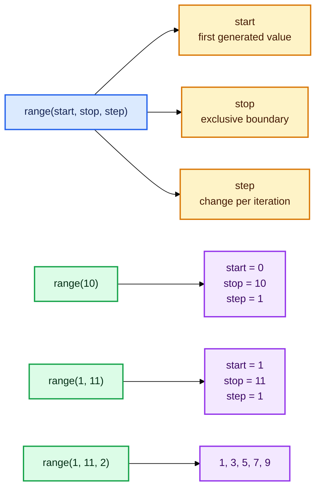
```mermaid
%%{init: {'theme': 'base'}}%%
flowchart LR
    A["range(start, stop, step)"] --> B["start<br/>first generated value"]
    A --> C["stop<br/>exclusive boundary"]
    A --> D["step<br/>change per iteration"]

    E["range(10)"] --> F["start = 0<br/>stop = 10<br/>step = 1"]
    G["range(1, 11)"] --> H["start = 1<br/>stop = 11<br/>step = 1"]
    I["range(1, 11, 2)"] --> J["1, 3, 5, 7, 9"]

    classDef main fill:#dbeafe,stroke:#2563eb,color:#172554,stroke-width:2px;
    classDef param fill:#fef3c7,stroke:#d97706,color:#451a03,stroke-width:2px;
    classDef example fill:#dcfce7,stroke:#16a34a,color:#052e16,stroke-width:2px;
    classDef result fill:#f3e8ff,stroke:#9333ea,color:#3b0764,stroke-width:2px;

    class A main;
    class B,C,D param;
    class E,G,I example;
    class F,H,J result;
```

## Descending ranges

To count downward, use a negative step.

```python
# Print 9 down to 0.
for x in range(9, -1, -1):
    print(x)
```

Why is the stop value `-1`?

Because the stop is excluded. To include `0`, the range must stop just beyond it.

```python
# Print odd numbers in descending order.
for x in range(9, -1, -2):
    print(x)
```

Output:

```text
9
7
5
3
1
```

## A step cannot be zero

```python
# This raises ValueError because the sequence cannot progress.
for x in range(1, 10, 0):
    print(x)
```

A loop needs movement. A zero step provides no way to reach the stopping boundary.

---

# 9. Accumulator Pattern and Summation

An **accumulator** stores a running result.

For addition, initialize it to `0`, the additive identity:

$$
x + 0 = x
$$

## Sum of integers from `0` through `9`

```python
total = 0

# i takes every integer from 0 through 9.
for i in range(10):
    total += i

print("Sum:", total)
```

Dry run:

| `i` | `total` before | `total += i` | `total` after |
|---:|---:|---|---:|
| 0 | 0 | \(0+0\) | 0 |
| 1 | 0 | \(0+1\) | 1 |
| 2 | 1 | \(1+2\) | 3 |
| 3 | 3 | \(3+3\) | 6 |
| ... | ... | ... | ... |
| 9 | 36 | \(36+9\) | 45 |

## Formula for the first \(n\) positive integers

$$
1+2+\cdots+n = \frac{n(n+1)}{2}
$$

```python
# Compare loop calculation with the formula.
n = int(input("Enter n: "))

loop_sum = 0

for value in range(1, n + 1):
    loop_sum += value

formula_sum = n * (n + 1) // 2

print("Loop result:", loop_sum)
print("Formula result:", formula_sum)
```

## Formula for `0 + 1 + ... + (n-1)`

`range(n)` produces the first `n` non-negative integers:

$$
0+1+\cdots+(n-1) = \frac{n(n-1)}{2}
$$

## Accumulator flow

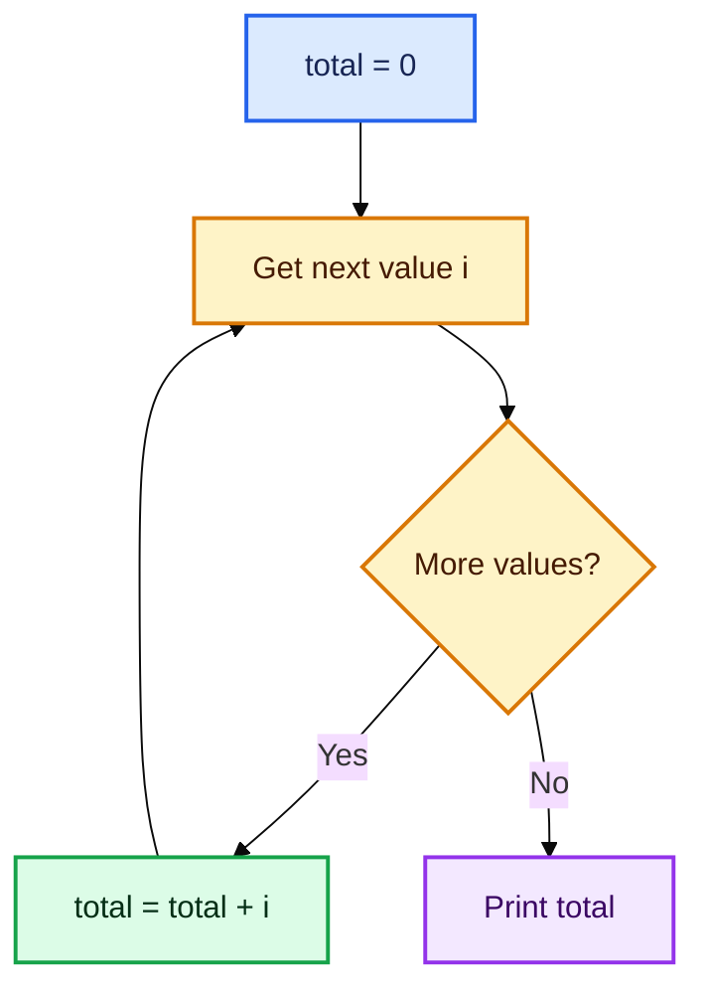
```mermaid
%%{init: {'theme': 'base'}}%%
flowchart TD
    A["total = 0"] --> B["Get next value i"]
    B --> C{"More values?"}
    C -->|Yes| D["total = total + i"]
    D --> B
    C -->|No| E["Print total"]

    classDef init fill:#dbeafe,stroke:#2563eb,color:#172554,stroke-width:2px;
    classDef loop fill:#fef3c7,stroke:#d97706,color:#451a03,stroke-width:2px;
    classDef calc fill:#dcfce7,stroke:#16a34a,color:#052e16,stroke-width:2px;
    classDef output fill:#f3e8ff,stroke:#9333ea,color:#3b0764,stroke-width:2px;

    class A init;
    class B,C loop;
    class D calc;
    class E output;
```

## Common accumulator initial values

| Operation | Recommended initial value |
|---|---:|
| Sum | `0` |
| Count | `0` |
| Product / factorial | `1` |
| String construction | `""` |
| Maximum with known first item | First item |
| Boolean “all conditions true” flag | `True` |
| Boolean “found something” flag | `False` |

---

# 10. Multiplication Tables

A multiplication table has a predictable number of rows, so `for` is a natural choice.

## Standard table

```python
# Read the base number.
number = int(input("Enter a number: "))

# Print multiplication results from 1 through 10.
for multiplier in range(1, 11):
    product = number * multiplier
    print(number, "x", multiplier, "=", product)
```

Mathematical relation:

$$
P_i = n \times i
$$

where \(i \in \{1,2,\ldots,10\}\).

## Custom interval

```python
number = int(input("Enter the table number: "))
start = int(input("Enter the starting multiplier: "))
end = int(input("Enter the ending multiplier: "))

# end + 1 is used because range excludes its stop value.
for multiplier in range(start, end + 1):
    print(f"{number} x {multiplier} = {number * multiplier}")
```

Example: `number=2`, `start=15`, `end=34` prints the table from \(2 \times 15\) through \(2 \times 34\).

---

# 11. Formatted Printing

The transcript covers:

1. `end`
2. `sep`
3. f-strings
4. `.format()`
5. `%` formatting
6. Format specifiers for precision and width

---

## 11.1 The `end` parameter

By default:

```python
print("A")
print("B")
```

behaves as if Python used:

```python
print("A", end="\n")
print("B", end="\n")
```

`\n` means a new line.

To print on one line:

```python
# Each print ends with a space instead of a newline.
for x in range(10):
    print(x, end=" ")
```

Output:

```text
0 1 2 3 4 5 6 7 8 9
```

To print characters with no separator:

```python
for character in "PYTHON":
    print(character, end="")
```

Output:

```text
PYTHON
```

---

## 11.2 The `sep` parameter

When several values are passed to `print`, the default separator is a space.

```python
day = 10
month = 5
year = 2021

# Default sep=" "
print(day, month, year)
```

Output:

```text
10 5 2021
```

Using a slash:

```python
print(day, month, year, sep="/")
```

Output:

```text
10/5/2021
```

Combining `end` and `sep`:

```python
print("Today's date is", end=" ")
print(day, month, year, sep="-")
```

Output:

```text
Today's date is 10-5-2021
```

## Print formatting map

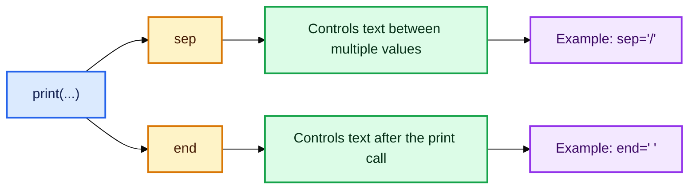
```mermaid
%%{init: {'theme': 'base'}}%%
flowchart LR
    A["print(...)"] --> B["sep"]
    A --> C["end"]
    B --> D["Controls text between multiple values"]
    C --> E["Controls text after the print call"]
    D --> F["Example: sep='/'"]
    E --> G["Example: end=' '"]

    classDef root fill:#dbeafe,stroke:#2563eb,color:#172554,stroke-width:2px;
    classDef param fill:#fef3c7,stroke:#d97706,color:#451a03,stroke-width:2px;
    classDef meaning fill:#dcfce7,stroke:#16a34a,color:#052e16,stroke-width:2px;
    classDef example fill:#f3e8ff,stroke:#9333ea,color:#3b0764,stroke-width:2px;

    class A root;
    class B,C param;
    class D,E meaning;
    class F,G example;
```

---

## 11.3 f-strings

An f-string embeds expressions inside `{}`.

```python
number = 5

for multiplier in range(1, 11):
    # Values and expressions inside braces are evaluated.
    print(f"{number} x {multiplier} = {number * multiplier}")
```

Why f-strings are useful:

- concise;
- readable;
- support expressions;
- support precision, width, and alignment.

---

## 11.4 `.format()` method

```python
number = 4

for multiplier in range(1, 11):
    # {0}, {1}, and {2} refer to arguments by position.
    print("{0} x {1} = {2}".format(
        number,
        multiplier,
        number * multiplier
    ))
```

---

## 11.5 `%` formatting

This is an older style retained in Python.

```python
number = 6

for multiplier in range(1, 11):
    # %d is a placeholder for an integer.
    print("%d x %d = %d" % (
        number,
        multiplier,
        number * multiplier
    ))
```

Common placeholders:

| Placeholder | Type |
|---|---|
| `%d` | Integer |
| `%f` | Floating-point number |
| `%s` | String |

---

## 11.6 Decimal precision

```python
pi_approximation = 22 / 7

# Print two digits after the decimal point.
print(f"Pi ≈ {pi_approximation:.2f}")

# Print four digits after the decimal point.
print(f"Pi ≈ {pi_approximation:.4f}")
```

`:.2f` means:

- `:` begins the format specification;
- `.2` requests two digits after the decimal;
- `f` uses fixed-point notation.

Equivalent styles:

```python
pi_approximation = 22 / 7

# f-string
print(f"{pi_approximation:.2f}")

# format method
print("{0:.2f}".format(pi_approximation))

# old percentage formatting
print("%.2f" % pi_approximation)
```

---

## 11.7 Width and alignment

```python
# Reserve a width of five characters and right-align integers.
for value in [1, 11, 111, 1111, 11111]:
    print(f"{value:5d}")
```

Output:

```text
    1
   11
  111
 1111
11111
```

Other alignment options:

```python
word = "Python"

print(f"|{word:<10}|")  # Left aligned
print(f"|{word:^10}|")  # Center aligned
print(f"|{word:>10}|")  # Right aligned
```

---

# 12. `while` versus `for`

The transcript’s central decision rule is:

- Use **`for`** when the repetition count or sequence is known.
- Use **`while`** when repetition depends on a condition and the count is not known in advance.

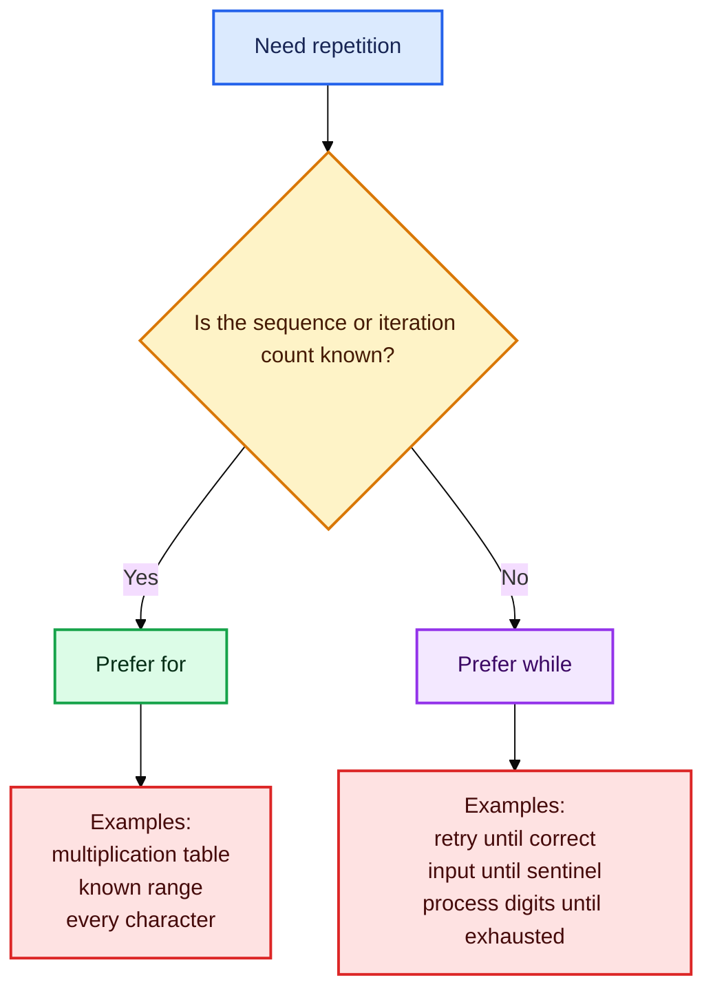
```mermaid
%%{init: {'theme': 'base'}}%%
flowchart TD
    A["Need repetition"] --> B{"Is the sequence or iteration count known?"}
    B -->|Yes| C["Prefer for"]
    B -->|No| D["Prefer while"]
    C --> E["Examples:<br/>multiplication table<br/>known range<br/>every character"]
    D --> F["Examples:<br/>retry until correct<br/>input until sentinel<br/>process digits until exhausted"]

    classDef start fill:#dbeafe,stroke:#2563eb,color:#172554,stroke-width:2px;
    classDef decision fill:#fef3c7,stroke:#d97706,color:#451a03,stroke-width:2px;
    classDef fornode fill:#dcfce7,stroke:#16a34a,color:#052e16,stroke-width:2px;
    classDef whilenode fill:#f3e8ff,stroke:#9333ea,color:#3b0764,stroke-width:2px;
    classDef example fill:#fee2e2,stroke:#dc2626,color:#450a0a,stroke-width:2px;

    class A start;
    class B decision;
    class C fornode;
    class D whilenode;
    class E,F example;
```

## Decision table from transcript examples

| Problem | Best fit | Reason |
|---|---|---|
| Factorial of `n` | `for` or `while`; transcript prefers `for` when range is known | Multipliers are known |
| Count digits numerically | `while` | Number of divisions depends on input size |
| Reverse digits numerically | `while` | Continue until no digits remain |
| Palindrome via numeric reversal | `while` | Depends on digit exhaustion |
| Maximum until user enters `-1` | `while` | Number of inputs is unknown |
| Multiplication table 1–10 | `for` | Exactly ten iterations |
| Prime test | `for` | Candidate divisors form a known range |
| Sum of digits | `while` | Repeatedly remove digits |
| Numbers divisible by 3 or 5 up to `n` | `for` | Known range from 1 through `n` |
| Factors of `n` | `for` | Candidate factors form a known range |

## Same factorial using both loops

### `while`

```python
n = int(input("Enter n: "))
factorial = 1
current = n

while current > 0:
    factorial *= current
    current -= 1

print(factorial)
```

### `for`

```python
n = int(input("Enter n: "))
factorial = 1

# Count downward from n through 1.
for current in range(n, 0, -1):
    factorial *= current

print(factorial)
```

The `for` version does not require a manual `current -= 1` because `range` manages the progression.

---

# 13. Iterating Directly Over Strings

A `for` loop does not require `range`. It can iterate directly over an iterable.

```python
country = "India"

# letter receives each character in order.
for letter in country:
    print(letter)
```

Output:

```text
I
n
d
i
a
```

This is often described as a **for-each** style:

> For each character in the string, execute the loop body.

## Index-based versus direct iteration

Index-based:

```python
country = "India"

for index in range(len(country)):
    print(country[index])
```

Direct:

```python
country = "India"

for letter in country:
    print(letter)
```

Use direct iteration when only the values are needed. Use indexing when positions are also required.

## Getting both index and value

Supplementary Python feature:

```python
country = "India"

# enumerate provides both the position and the character.
for index, letter in enumerate(country):
    print(index, letter)
```

---

# 14. Nested Loops

A nested loop is a loop inside another loop.

All four combinations are possible:

1. `for` inside `for`
2. `while` inside `while`
3. `while` inside `for`
4. `for` inside `while`

## General structure

```python
for outer_value in outer_sequence:
    # The inner loop runs completely for each outer value.
    for inner_value in inner_sequence:
        print(outer_value, inner_value)
```

## Iteration count

If the outer loop runs \(m\) times and the inner loop runs \(n\) times for every outer iteration:

$$
\text{total inner executions} = m \times n
$$

## VIBGYOR color combinations

The transcript uses the string:

```python
colors = "VIBGYOR"
```

There are seven characters. If two people can independently choose one of seven colors:

$$
7 \times 7 = 49
$$

```python
colors = "VIBGYOR"
count = 0

# First person's choice.
for first_color in colors:
    # Second person's choice for every first-person choice.
    for second_color in colors:
        print(first_color, second_color)
        count += 1

print("Total combinations:", count)
```

## Nested execution visualization

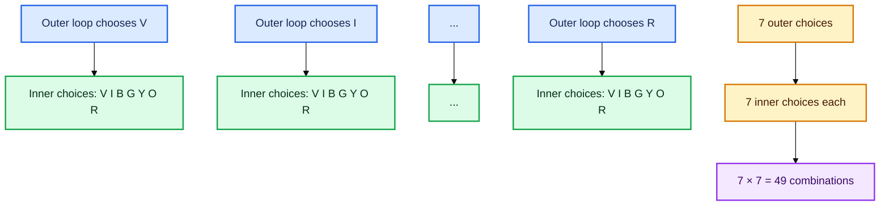
```mermaid
%%{init: {'theme': 'base'}}%%
flowchart TD
    A["Outer loop chooses V"] --> B["Inner choices: V I B G Y O R"]
    A2["Outer loop chooses I"] --> B2["Inner choices: V I B G Y O R"]
    A3["..."] --> B3["..."]
    A4["Outer loop chooses R"] --> B4["Inner choices: V I B G Y O R"]

    C["7 outer choices"] --> D["7 inner choices each"]
    D --> E["7 × 7 = 49 combinations"]

    classDef outer fill:#dbeafe,stroke:#2563eb,color:#172554,stroke-width:2px;
    classDef inner fill:#dcfce7,stroke:#16a34a,color:#052e16,stroke-width:2px;
    classDef calc fill:#fef3c7,stroke:#d97706,color:#451a03,stroke-width:2px;
    classDef result fill:#f3e8ff,stroke:#9333ea,color:#3b0764,stroke-width:2px;

    class A,A2,A3,A4 outer;
    class B,B2,B3,B4 inner;
    class C,D calc;
    class E result;
```

## Important rule

The inner loop starts again from its first value for every outer iteration.

For `i = 0`, `j` takes every value.  
Then `i = 1`, and `j` again starts from its beginning.

---

# 15. Nested-Loop Case Studies

The transcript presents one example for each nesting combination.

---

## 15.1 `for` inside `for`: Prime numbers below a limit

A prime number has exactly two positive divisors: `1` and itself.

For each candidate \(i\), test possible divisors \(j\).

$$
i \text{ is composite if } i \bmod j = 0
$$

```python
limit = int(input("Print primes below: "))

# Test every candidate below the limit.
for candidate in range(2, limit):
    is_prime = True

    # Search for a divisor from 2 to candidate - 1.
    for divisor in range(2, candidate):
        if candidate % divisor == 0:
            is_prime = False
            break  # No further divisor testing is necessary.

    if is_prime:
        print(candidate, end=" ")
```

### More efficient supplementary refinement

A composite number must have at least one factor not exceeding its square root.

$$
j \leq \sqrt{i}
$$

```python
limit = int(input("Print primes below: "))

for candidate in range(2, limit):
    is_prime = True

    # Only test divisors up to sqrt(candidate).
    for divisor in range(2, int(candidate ** 0.5) + 1):
        if candidate % divisor == 0:
            is_prime = False
            break

    if is_prime:
        print(candidate, end=" ")
```

### Prime-testing flow

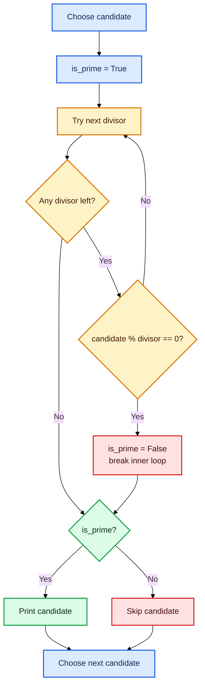
```mermaid
%%{init: {'theme': 'base'}}%%
flowchart TD
    A["Choose candidate"] --> B["is_prime = True"]
    B --> C["Try next divisor"]
    C --> D{"Any divisor left?"}
    D -->|No| E{"is_prime?"}
    D -->|Yes| F{"candidate % divisor == 0?"}
    F -->|Yes| G["is_prime = False<br/>break inner loop"]
    F -->|No| C
    G --> E
    E -->|Yes| H["Print candidate"]
    E -->|No| I["Skip candidate"]
    H --> J["Choose next candidate"]
    I --> J

    classDef outer fill:#dbeafe,stroke:#2563eb,color:#172554,stroke-width:2px;
    classDef inner fill:#fef3c7,stroke:#d97706,color:#451a03,stroke-width:2px;
    classDef composite fill:#fee2e2,stroke:#dc2626,color:#450a0a,stroke-width:2px;
    classDef prime fill:#dcfce7,stroke:#16a34a,color:#052e16,stroke-width:2px;
    classDef next fill:#f3e8ff,stroke:#9333ea,color:#3b0764,stroke-width:2px;

    class A,B,J outer;
    class C,D,F inner;
    class G,I composite;
    class E,H prime;
```

---

## 15.2 `while` inside `while`: Trader profit or loss

Situation:

- The number of traders is unknown.
- The number of transactions per trader is unknown.
- Employee ID `-1` stops the outer loop.
- Transaction value `0` stops the inner loop.

```python
employee_id = input("Enter employee ID (-1 to stop): ")

# Outer loop processes one employee at a time.
while employee_id != "-1":
    profit_loss = 0

    trade_value = int(input("Enter trade value (0 to finish employee): "))

    # Inner loop processes all trades for this employee.
    while trade_value != 0:
        profit_loss += trade_value
        trade_value = int(input("Enter trade value (0 to finish employee): "))

    print(f"Employee {employee_id}: net result = {profit_loss}")

    # Move to the next employee.
    employee_id = input("Enter employee ID (-1 to stop): ")
```

Positive values represent gains; negative values represent losses.

$$
\text{Net result} = \sum_{k=1}^{m} \text{trade}_k
$$

---

## 15.3 `while` inside `for`: Daily rainfall

Situation:

- Number of days is known → outer `for`.
- Number of readings per day is unknown → inner `while`.
- `-1` stops readings for the current day.

```python
days = int(input("Enter number of days: "))

# The outer loop has a known number of days.
for day in range(1, days + 1):
    total_rainfall = 0

    reading = float(input(
        f"Day {day}: enter rainfall (-1 to finish the day): "
    ))

    # The inner loop accepts an unknown number of readings.
    while reading != -1:
        total_rainfall += reading
        reading = float(input(
            f"Day {day}: enter rainfall (-1 to finish the day): "
        ))

    print(f"Total rainfall for day {day} = {total_rainfall}")
```

For readings $r_1,r_2,\ldots,r_m$:

$$
R_{\text{day}} = \sum_{k=1}^{m} r_k
$$

If the first reading is `-1`, the total remains `0`.

---

## 15.4 `for` inside `while`: Longest entered word

Situation:

- Number of words is unknown → outer `while`.
- Characters in each word form a known sequence → inner `for`.
- `-1` stops input.

```python
word = input("Enter a word (-1 to stop): ")
max_length = 0

# Continue accepting words until the sentinel appears.
while word != "-1":
    current_length = 0

    # Count every character in the current word.
    for _ in word:
        current_length += 1

    # Update the maximum only when a longer word appears.
    if current_length > max_length:
        max_length = current_length

    word = input("Enter another word (-1 to stop): ")

print("Length of longest word:", max_length)
```

Supplementary Python shortcut:

```python
word = input("Enter a word (-1 to stop): ")
max_length = 0

while word != "-1":
    max_length = max(max_length, len(word))
    word = input("Enter another word (-1 to stop): ")

print("Length of longest word:", max_length)
```

## Selecting a nesting structure

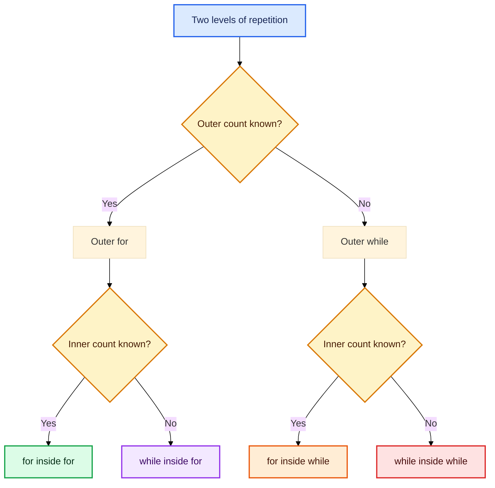
```mermaid
%%{init: {'theme': 'base'}}%%
flowchart TD
    A["Two levels of repetition"] --> B{"Outer count known?"}
    B -->|Yes| C["Outer for"]
    B -->|No| D["Outer while"]
    C --> E{"Inner count known?"}
    D --> F{"Inner count known?"}
    E -->|Yes| G["for inside for"]
    E -->|No| H["while inside for"]
    F -->|Yes| I["for inside while"]
    F -->|No| J["while inside while"]

    classDef start fill:#dbeafe,stroke:#2563eb,color:#172554,stroke-width:2px;
    classDef decision fill:#fef3c7,stroke:#d97706,color:#451a03,stroke-width:2px;
    classDef ff fill:#dcfce7,stroke:#16a34a,color:#052e16,stroke-width:2px;
    classDef fw fill:#f3e8ff,stroke:#9333ea,color:#3b0764,stroke-width:2px;
    classDef wf fill:#ffedd5,stroke:#ea580c,color:#431407,stroke-width:2px;
    classDef ww fill:#fee2e2,stroke:#dc2626,color:#450a0a,stroke-width:2px;

    class A start;
    class B,E,F decision;
    class G ff;
    class H fw;
    class I wf;
    class J ww;
```

---

# 16. `break`, `continue`, and `pass`

These keywords alter normal control flow.

| Keyword | Meaning |
|---|---|
| `break` | Exit the current loop immediately |
| `continue` | Skip the rest of the current iteration |
| `pass` | Perform no operation; syntactic placeholder |

---

## 16.1 `break`

The transcript extracts the username from an email by stopping at `@`.

```python
email = input("Enter an email address: ")

# Process characters until @ is found.
for character in email:
    if character == "@":
        break

    print(character, end="")
```

Input:

```text
xyz123@iitm.in
```

Output:

```text
xyz123
```

### `break` flow

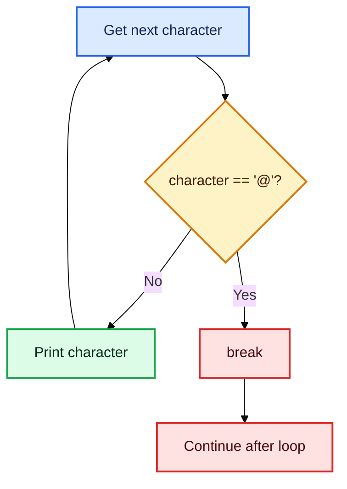
```mermaid
%%{init: {'theme': 'base'}}%%
flowchart TD
    A["Get next character"] --> B{"character == '@'?"}
    B -->|No| C["Print character"]
    C --> A
    B -->|Yes| D["break"]
    D --> E["Continue after loop"]

    classDef loop fill:#dbeafe,stroke:#2563eb,color:#172554,stroke-width:2px;
    classDef test fill:#fef3c7,stroke:#d97706,color:#451a03,stroke-width:2px;
    classDef normal fill:#dcfce7,stroke:#16a34a,color:#052e16,stroke-width:2px;
    classDef exit fill:#fee2e2,stroke:#dc2626,color:#450a0a,stroke-width:2px;

    class A loop;
    class B test;
    class C normal;
    class D,E exit;
```

### Important nested-loop behavior

`break` exits only the **innermost currently executing loop**.

```python
for row in range(3):
    for column in range(5):
        if column == 2:
            break  # Stops only the inner column loop.

        print(row, column)
```

---

## 16.2 `continue`

To print both username and domain on separate lines, skip `@` but continue iterating.

```python
email = input("Enter an email address: ")

for character in email:
    if character == "@":
        print()       # Move output to the next line.
        continue      # Skip printing @ itself.

    print(character, end="")
```

Input:

```text
xyz123@iitm.in
```

Output:

```text
xyz123
iitm.in
```

### `continue` flow

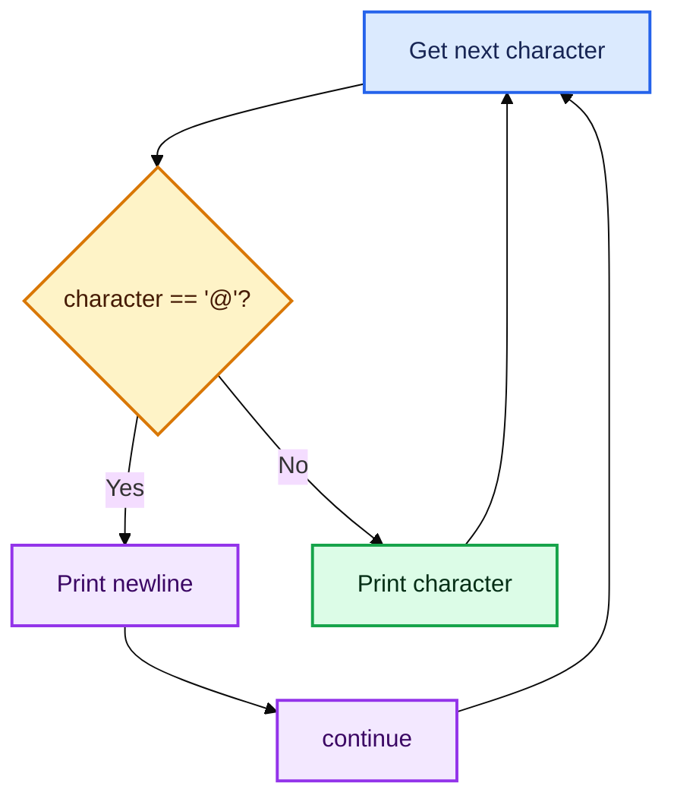
```mermaid
%%{init: {'theme': 'base'}}%%
flowchart TD
    A["Get next character"] --> B{"character == '@'?"}
    B -->|Yes| C["Print newline"]
    C --> D["continue"]
    D --> A
    B -->|No| E["Print character"]
    E --> A

    classDef loop fill:#dbeafe,stroke:#2563eb,color:#172554,stroke-width:2px;
    classDef test fill:#fef3c7,stroke:#d97706,color:#451a03,stroke-width:2px;
    classDef skip fill:#f3e8ff,stroke:#9333ea,color:#3b0764,stroke-width:2px;
    classDef normal fill:#dcfce7,stroke:#16a34a,color:#052e16,stroke-width:2px;

    class A loop;
    class B test;
    class C,D skip;
    class E normal;
```

## Difference between `break` and `continue`

| Event | `break` | `continue` |
|---|---|---|
| Current iteration | Ends | Ends early |
| Remaining loop iterations | Cancelled | Continue |
| Control moves to | Statement after loop | Next iteration |

---

## 16.3 `pass`

Python requires a statement inside an indented block. `pass` is a valid statement that intentionally does nothing.

```python
# Print numbers divisible by 3.
for number in range(11):
    if number % 3 == 0:
        print(number)
    else:
        # Placeholder for logic that may be added later.
        pass
```

A comment alone does not satisfy Python’s requirement for a block:

```python
# INVALID
for number in range(5):
    if number % 2 == 0:
        print(number)
    else:
        # Do nothing
```

Valid:

```python
# VALID
for number in range(5):
    if number % 2 == 0:
        print(number)
    else:
        pass
```

## Comment versus `pass`

| Comment | `pass` |
|---|---|
| Ignored by Python’s execution | Executed as a no-operation statement |
| Intended for humans | Intended to keep syntax valid |
| Cannot form a block alone | Can form a block |

## Control-keyword comparison

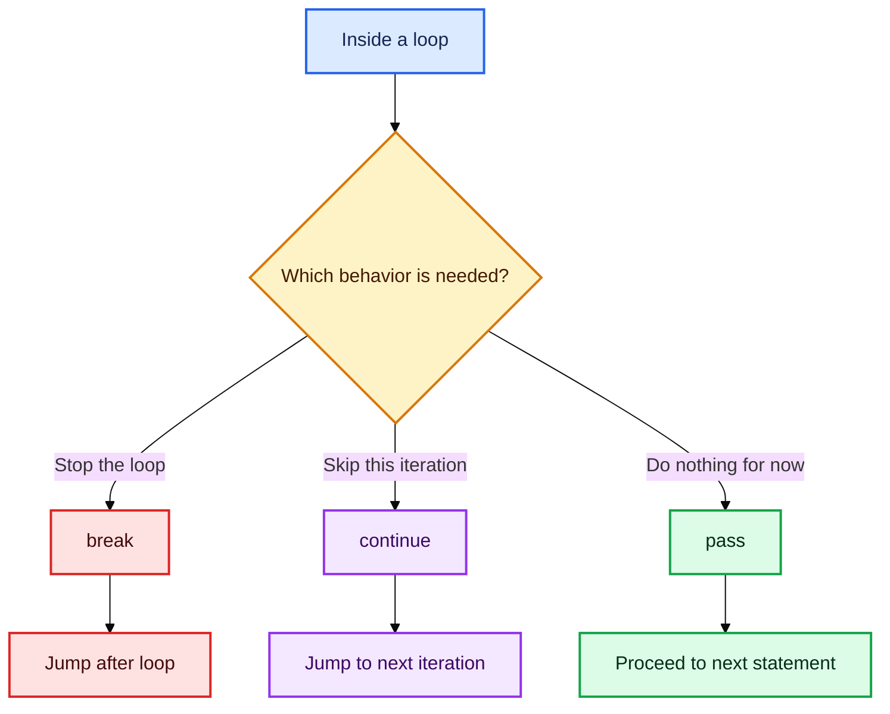
```mermaid
%%{init: {'theme': 'base'}}%%
flowchart TD
    A["Inside a loop"] --> B{"Which behavior is needed?"}
    B -->|Stop the loop| C["break"]
    B -->|Skip this iteration| D["continue"]
    B -->|Do nothing for now| E["pass"]
    C --> F["Jump after loop"]
    D --> G["Jump to next iteration"]
    E --> H["Proceed to next statement"]

    classDef start fill:#dbeafe,stroke:#2563eb,color:#172554,stroke-width:2px;
    classDef decision fill:#fef3c7,stroke:#d97706,color:#451a03,stroke-width:2px;
    classDef breaknode fill:#fee2e2,stroke:#dc2626,color:#450a0a,stroke-width:2px;
    classDef continuenode fill:#f3e8ff,stroke:#9333ea,color:#3b0764,stroke-width:2px;
    classDef passnode fill:#dcfce7,stroke:#16a34a,color:#052e16,stroke-width:2px;

    class A start;
    class B decision;
    class C,F breaknode;
    class D,G continuenode;
    class E,H passnode;
```

---

# 17. Common Errors and Debugging

## Error 1: Infinite `while` loop

```python
# Incorrect: number never changes.
number = 1

while number <= 5:
    print(number)
```

Fix:

```python
number = 1

while number <= 5:
    print(number)
    number += 1
```

---

## Error 2: Off-by-one errors in `range`

```python
# Prints 1 through 9, not 1 through 10.
for number in range(1, 10):
    print(number)
```

Fix:

```python
# Stop at 11 to include 10.
for number in range(1, 11):
    print(number)
```

---

## Error 3: Wrong direction and step

```python
# Produces no values because start > stop but step is positive.
for number in range(10, 0):
    print(number)
```

Fix:

```python
for number in range(10, 0, -1):
    print(number)
```

---

## Error 4: Forgetting input validation

```python
# Incorrect mathematical result for negative factorial input.
number = int(input("Enter number: "))
factorial = 1

while number > 0:
    factorial *= number
    number -= 1

print(factorial)
```

Fix:

```python
number = int(input("Enter number: "))

if number < 0:
    print("Factorial is not defined for negative integers.")
else:
    factorial = 1

    while number > 0:
        factorial *= number
        number -= 1

    print(factorial)
```

---

## Error 5: Destroying a needed original value

When reversing a number, repeatedly dividing it changes it. Preserve the original value.

```python
original = int(input("Enter number: "))
working = abs(original)

# Modify working, not original.
while working > 0:
    working //= 10
```

---

## Error 6: Resetting an accumulator inside the loop

Incorrect:

```python
# total is reset during every iteration.
for number in range(1, 6):
    total = 0
    total += number

print(total)
```

Correct:

```python
# Initialize once before the loop.
total = 0

for number in range(1, 6):
    total += number

print(total)
```

---

## Error 7: `break` placed too early

```python
# The loop always stops after the first character.
for character in "Python":
    print(character)
    break
```

Always inspect indentation: a one-level indentation change can alter the entire algorithm.

---

## Debugging with trace prints

```python
number = 1234
reverse = 0

while number > 0:
    digit = number % 10

    # Temporary trace output helps inspect state.
    print(
        f"Before update: number={number}, "
        f"digit={digit}, reverse={reverse}"
    )

    reverse = reverse * 10 + digit
    number //= 10

    print(
        f"After update: number={number}, "
        f"reverse={reverse}"
    )
```

Remove or comment out trace statements after confirming correctness.

## Debugging checklist

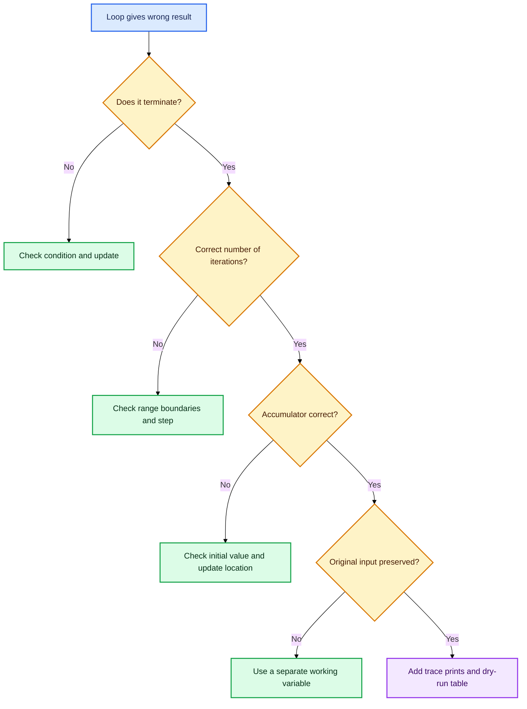
```mermaid
%%{init: {'theme': 'base'}}%%
flowchart TD
    A["Loop gives wrong result"] --> B{"Does it terminate?"}
    B -->|No| C["Check condition and update"]
    B -->|Yes| D{"Correct number of iterations?"}
    D -->|No| E["Check range boundaries and step"]
    D -->|Yes| F{"Accumulator correct?"}
    F -->|No| G["Check initial value and update location"]
    F -->|Yes| H{"Original input preserved?"}
    H -->|No| I["Use a separate working variable"]
    H -->|Yes| J["Add trace prints and dry-run table"]

    classDef start fill:#dbeafe,stroke:#2563eb,color:#172554,stroke-width:2px;
    classDef decision fill:#fef3c7,stroke:#d97706,color:#451a03,stroke-width:2px;
    classDef fix fill:#dcfce7,stroke:#16a34a,color:#052e16,stroke-width:2px;
    classDef inspect fill:#f3e8ff,stroke:#9333ea,color:#3b0764,stroke-width:2px;

    class A start;
    class B,D,F,H decision;
    class C,E,G,I fix;
    class J inspect;
```

---

# 18. Complexity and Performance Intuition

This section is supplementary context that extends the transcript’s discussion of computers slowing down for huge factorials.

## Single loop

```python
for i in range(n):
    pass
```

The body executes $n$ times:

$$
T(n)=O(n)
$$

## Two independent loops

```python
for i in range(n):
    pass

for j in range(n):
    pass
```

Total:

$$
n+n=2n
$$

Ignoring constants:

$$
T(n)=O(n)
$$

## Nested loops

```python
for i in range(n):
    for j in range(n):
        pass
```

Total:

$$
n \times n = n^2
$$

Therefore:

$$
T(n)=O(n^2)
$$

## VIBGYOR example

$$
7 \times 7 = 49
$$

## Prime-listing example

The basic nested approach tests many candidate–divisor combinations, so its running time grows roughly quadratically with the limit.

## Why large factorials become expensive

There are two costs:

1. More loop iterations.
2. Increasingly large integer multiplications.

Even if the number of iterations grows linearly, the numbers themselves become much larger, making later multiplications more expensive.

---

# 19. Practice Problems

## Beginner

1. Print numbers from 1 to 20 using a `while` loop.
2. Print numbers from 20 down to 1 using a `for` loop.
3. Print all even numbers from 2 through 50 using `range`.
4. Ask for a password repeatedly until the user enters `"python123"`.
5. Find the sum of integers from 1 through `n`.
6. Print the multiplication table of an entered number from 1 through 20.

## Intermediate

7. Count the digits of an entered integer without converting it to a string.
8. Reverse an integer while preserving its sign.
9. Check whether an entered integer is a palindrome.
10. Find the sum of digits of an entered integer.
11. Print all factors of an entered positive integer.
12. Determine whether an entered positive integer is prime.
13. Print every character of a string except spaces.
14. Extract the part before `@` from an email address using `break`.

## Nested loops

15. Print every ordered pair `(i, j)` where both values range from 1 through 3.
16. Print a `5 × 5` square of `*`.
17. Print this pattern:

```text
*
**
***
****
*****
```

18. Print all prime numbers below an entered limit.
19. Accept rainfall readings for several days using a `for` loop outside and a `while` loop inside.
20. Accept words until `-1` and report both the longest word and its length.

## Reasoning questions

21. Why does `range(1, 11)` include 10 but `range(1, 10)` does not?
22. Why is factorial initialized to `1`?
23. Why is a sum accumulator initialized to `0`?
24. What happens if a `while` loop’s condition variable never changes?
25. In a nested loop, which loop does `break` exit?
26. What is the difference between `continue` and `pass`?
27. Why is `while` usually better for “read until sentinel” problems?
28. How many times does the inner statement run here?

```python
for i in range(4):
    for j in range(6):
        print(i, j)
```

---

# 20. Solutions

## 1. Numbers 1 to 20 with `while`

```python
number = 1

while number <= 20:
    print(number)
    number += 1
```

## 2. Numbers 20 down to 1

```python
for number in range(20, 0, -1):
    print(number)
```

## 3. Even numbers 2 through 50

```python
for number in range(2, 51, 2):
    print(number)
```

## 4. Password retry

```python
password = input("Enter password: ")

while password != "python123":
    print("Incorrect password.")
    password = input("Try again: ")

print("Access granted.")
```

## 5. Sum from 1 through `n`

```python
n = int(input("Enter n: "))
total = 0

for number in range(1, n + 1):
    total += number

print(total)
```

## 6. Table from 1 through 20

```python
number = int(input("Enter number: "))

for multiplier in range(1, 21):
    print(f"{number} x {multiplier} = {number * multiplier}")
```

## 7. Count digits

```python
number = abs(int(input("Enter integer: ")))
digits = 1

while number >= 10:
    number //= 10
    digits += 1

print(digits)
```

## 8. Reverse with sign

```python
original = int(input("Enter integer: "))
remaining = abs(original)
reverse = 0

while remaining > 0:
    reverse = reverse * 10 + remaining % 10
    remaining //= 10

if original < 0:
    reverse = -reverse

print(reverse)
```

## 9. Palindrome

```python
original = int(input("Enter integer: "))
remaining = abs(original)
reverse = 0

while remaining > 0:
    reverse = reverse * 10 + remaining % 10
    remaining //= 10

if original < 0:
    reverse = -reverse

print("Palindrome" if original == reverse else "Not palindrome")
```

## 10. Sum of digits

```python
number = abs(int(input("Enter integer: ")))
total = 0

while number > 0:
    total += number % 10
    number //= 10

print(total)
```

## 11. Factors

```python
number = int(input("Enter a positive integer: "))

for candidate in range(1, number + 1):
    if number % candidate == 0:
        print(candidate, end=" ")
```

## 12. Prime test

```python
number = int(input("Enter a positive integer: "))

if number < 2:
    print("Not prime")
else:
    is_prime = True

    for divisor in range(2, int(number ** 0.5) + 1):
        if number % divisor == 0:
            is_prime = False
            break

    print("Prime" if is_prime else "Not prime")
```

## 13. Skip spaces

```python
text = input("Enter text: ")

for character in text:
    if character == " ":
        continue

    print(character, end="")
```

## 14. Username before `@`

```python
email = input("Enter email: ")

for character in email:
    if character == "@":
        break

    print(character, end="")
```

## 15. Ordered pairs

```python
for i in range(1, 4):
    for j in range(1, 4):
        print(i, j)
```

Total pairs:

\[
3 \times 3 = 9
\]

## 16. `5 × 5` square

```python
for row in range(5):
    for column in range(5):
        print("*", end="")

    print()
```

## 17. Increasing triangle

```python
for row in range(1, 6):
    for column in range(row):
        print("*", end="")

    print()
```

## 18. Primes below a limit

```python
limit = int(input("Enter limit: "))

for candidate in range(2, limit):
    is_prime = True

    for divisor in range(2, int(candidate ** 0.5) + 1):
        if candidate % divisor == 0:
            is_prime = False
            break

    if is_prime:
        print(candidate, end=" ")
```

## 19. Rainfall

```python
days = int(input("Enter number of days: "))

for day in range(1, days + 1):
    total = 0
    reading = float(input(f"Day {day} reading (-1 to stop): "))

    while reading != -1:
        total += reading
        reading = float(input(f"Day {day} reading (-1 to stop): "))

    print(f"Total rainfall for day {day}: {total}")
```

## 20. Longest word and length

```python
word = input("Enter word (-1 to stop): ")
longest_word = ""

while word != "-1":
    if len(word) > len(longest_word):
        longest_word = word

    word = input("Enter word (-1 to stop): ")

print("Longest word:", longest_word)
print("Length:", len(longest_word))
```

## Reasoning answers

21. The stop value of `range` is exclusive.  
22. `1` is the multiplicative identity.  
23. `0` is the additive identity.  
24. The loop may run forever.  
25. `break` exits the innermost active loop.  
26. `continue` skips to the next iteration; `pass` does nothing and proceeds normally.  
27. The number of inputs is unknown and depends on a condition.  
28. \(4 \times 6 = 24\) times.

---

# 21. Final Cheat Sheet

## `while`

```python
initialization

while condition:
    # Repeated work
    update
```

Use when the number of iterations is not known in advance.

## `for`

```python
for item in sequence:
    # Repeated work
```

Use when iterating over known values.

## `range`

```python
range(stop)
range(start, stop)
range(start, stop, step)
```

Defaults:

- `start = 0`
- `step = 1`
- `stop` is mandatory and excluded

## Accumulators

```python
total = 0
total += value
```

```python
product = 1
product *= value
```

## Digit extraction

```python
digit = number % 10
number //= 10
```

## Reverse recurrence

$$
\text{reverse}_{new}
=
10 \times \text{reverse}_{old}
+
\text{digit}
$$

## Formatted printing

```python
print(value, end=" ")
print(a, b, c, sep="/")
print(f"{value:.2f}")
print(f"{number:5d}")
```

## Loop-control keywords

```python
break      # Exit loop
continue   # Skip current iteration
pass       # Placeholder; do nothing
```

## Final conceptual map

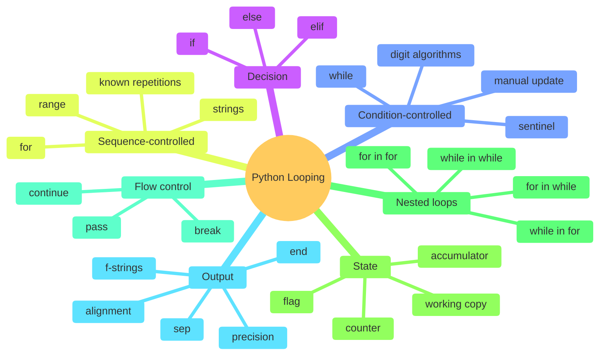
```mermaid
%%{init: {'theme': 'base'}}%%
mindmap
  root((Python Looping))
    Decision
      if
      elif
      else
    Condition-controlled
      while
      sentinel
      manual update
      digit algorithms
    Sequence-controlled
      for
      range
      strings
      known repetitions
    State
      accumulator
      counter
      flag
      working copy
    Nested loops
      for in for
      while in while
      while in for
      for in while
    Flow control
      break
      continue
      pass
    Output
      end
      sep
      f-strings
      precision
      alignment
```

---

---

## Fun Facts & Intuitions

### 🏃 The Treadmill Analogy
- **`while` loop**: "Keep jogging until I tell you to stop." You don't know when the stop command will come.
- **`for` loop**: "Jog exactly 1000 steps and stop." The endpoint is known before you start.

### 🧒 The 5-Year-Old Programmer
After just 3 weeks of Python (variables, `if`, `for`, `while`), you have the vocabulary of a 5-year-old child — but that's enough to communicate complex ideas! Every sophisticated program is built from these humble blocks.

### 🔢 Gauss's Summation Trick
The mathematician Carl Friedrich Gauss, as a child, reportedly summed 1 to 100 instantly using:
$$\text{Sum} = \frac{n(n+1)}{2}$$
Your `for` loop does the same thing, just a billion times faster.

### 🚀 Factorial Explosion
Factorials grow **faster than exponential functions**! 
- $05! = 120$
- $10! = 3,628,800$
- $20! = 2,432,902,008,176,640,000$

Even powerful computers can take noticeable time computing 100,000! — demonstrating that **algorithmic efficiency matters**.

### 🎨 VIBGYOR Combinatorics
With just $7$ colors and $2$ brothers, nested loops generate **$49$ combinations**. Add a third brother? $343$ combinations! This is the power of **$O(n^2)$** and **$O(n^3)$** complexity.

### 🔄 The Patient Quiz Master
A `while` loop is the perfect quiz master: it never gets angry, never gets tired, and will give you infinite attempts. This is the **emotional advantage** of machines over humans.

### 📝 `pass` vs Comment
A comment is **ignored** by Python — it doesn't exist to the interpreter. But `pass` is **executed** (it does nothing, but it counts as a statement). That's why you can't leave an `else` block with just a comment, but you can with `pass`.

---


## 🎯 Key Takeaway

Programming becomes powerful when repeated work is expressed as a general rule rather than copied line by line.

- Use `if` to **choose**.
- Use **`while`** when the iteration count is **unknown** or condition-driven or **repeat until a condition changes**.
- Use **`for`** when the iteration count is **known** or you're iterating over a sequence.
- **`range(start, stop, step)`** is incredibly flexible — master its three-parameter form.
- Use nested loops to model **combinations and multi-level repetition**.
- Use accumulators, counters, flags, and clear updates to manage loop state.
- Dry-run loops with a table whenever execution feels confusing.
- **Nested loops** multiply computational power but also complexity (O($n^2$)).
- **`break`** exits, **`continue`** skips, **`pass`** placeholders.
- **f-strings** are the modern, readable way to format output in Python.

> The most effective way to understand loops is to predict the next values of every variable, execute the program, compare the output, and then modify the code yourself.

> *"Programming is not about typing — it's about thinking. Loops are how we teach computers to think repetitively so we don't have to."*
