# Python Collections, Functional Programming, and Functions

---

# L4.1 — Warm-up with Lists

**Lecture:** [Warmup with lists | programming in Python](https://www.youtube.com/watch/toMhJJHSIYk)

## 1. What is a list?

A **list** is an ordered Python collection that can store multiple values under one variable name.

```python
numbers = [1, 7, 4, 2, 100]
print(numbers)
```

Output:

```text
[1, 7, 4, 2, 100]
```

### Main properties

| Property | Meaning |
|---|---|
| Ordered | Every item has a position called an index. |
| Mutable | Items can be added, removed, or changed. |
| Duplicates allowed | The same value may occur many times. |
| Heterogeneous | A list may contain values of different types. |
| Dynamic | Its size may grow or shrink while the program runs. |

```python
mixed = [10, "Python", 3.14, True]
```

A list differs from a mathematical set because repeated items are permitted:

```python
values = [2, 2, 2, 5]
print(values)
```

Output:

```text
[2, 2, 2, 5]
```

## 2. Adding items with `append()`

`append()` adds exactly one new item at the end of a list.

```python
numbers = [1, 7, 4, 2, 100]

# Add one integer to the end.
numbers.append(1024)

# Duplicate values are allowed.
numbers.append(2)

print(numbers)
```

Output:

```text
[1, 7, 4, 2, 100, 1024, 2]
```

### Important distinction

```python
values = [1, 2]
values.append([3, 4])
print(values)
```

Output:

```text
[1, 2, [3, 4]]
```

The entire list `[3, 4]` was inserted as **one element**. To add its elements individually, use `extend()`:

```python
values = [1, 2]
values.extend([3, 4])
print(values)
```

Output:

```text
[1, 2, 3, 4]
```

## 3. Removing items with `remove()`

`remove(value)` deletes the **first occurrence** of the specified value.

```python
numbers = [1, 7, 4, 2, 100, 1024, 2]

# Remove the first occurrence of 2 only.
numbers.remove(2)

print(numbers)
```

Output:

```text
[1, 7, 4, 100, 1024, 2]
```

Calling it again removes the remaining `2`:

```python
numbers.remove(2)
```

### Error condition

```python
numbers.remove(999)
```

This raises:

```text
ValueError: list.remove(x): x not in list
```

A safe pattern is:

```python
value_to_remove = 999

if value_to_remove in numbers:
    numbers.remove(value_to_remove)
else:
    print("Value is not present.")
```

## 4. Indexing

Python uses **zero-based indexing**.

```python
numbers = [10, 20, 30, 40]

print(numbers[0])   # First item: 10
print(numbers[1])   # Second item: 20
print(numbers[-1])  # Last item: 40
```

For a list of length `n`:

- First valid index: `0`
- Last valid positive index: `n - 1`
- Last item using negative indexing: `-1`

## 5. Lists inside lists

A list can contain another list.

```python
row_1 = [1, 2, 3]
row_2 = [10, 20, 30]

matrix_like = []
matrix_like.append(row_1)
matrix_like.append(row_2)

print(matrix_like)
```

Output:

```text
[[1, 2, 3], [10, 20, 30]]
```

This is called a **nested list** or a **list of lists**.

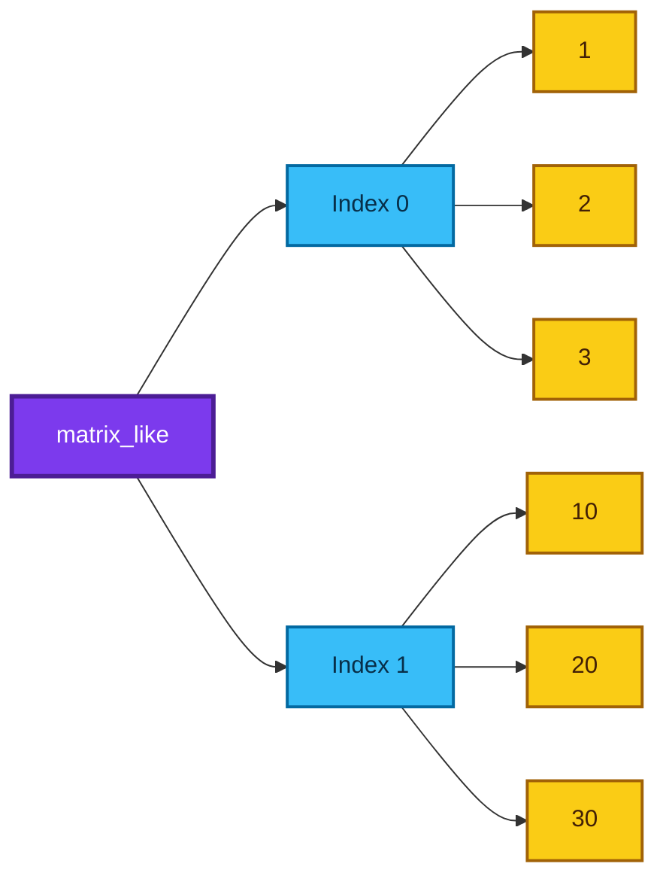

## 6. Representing a matrix with lists

The transcript uses nested lists as a simple matrix representation:

```python
matrix = []

# Each inner list represents one row.
matrix.append([1, 2, 3])
matrix.append([4, 5, 6])
matrix.append([7, 8, 9])

print(matrix)
```

Equivalent direct construction:

```python
matrix = [
    [1, 2, 3],
    [4, 5, 6],
    [7, 8, 9],
]
```

### Matrix indexing

For a mathematical matrix element $a_{ij}$, Python nested-list notation is:

$$
a_{ij} \longleftrightarrow \texttt{matrix[i][j]}
$$

Python indices begin at zero:

```python
print(matrix[0][0])  # Row 0, column 0 -> 1
print(matrix[0][1])  # Row 0, column 1 -> 2
print(matrix[2][1])  # Row 2, column 1 -> 8
```

### Diagonal elements

For a square matrix, the main diagonal consists of positions where the row and column indices are equal:

$$
M_{00}, M_{11}, M_{22}, \ldots, M_{(n-1)(n-1)}
$$

```python
matrix = [
    [1, 2, 3],
    [4, 5, 6],
    [7, 8, 9],
]

for i in range(len(matrix)):
    print(matrix[i][i])
```

Output:

```text
1
5
9
```

## 7. When should you use a list?

Use a list when:

- Order matters.
- Duplicate values are meaningful.
- You need indexing or slicing.
- The collection will change.
- You need to represent rows, sequences, or simple matrices.

## Fun facts

- Python lists are not restricted to one data type.
- A list may contain another list, which may contain another list, and so on.
- In production data science, matrices are usually handled with NumPy arrays, but nested lists provide the underlying intuition.

---

# L4.2 — Lists vs Sets: Trade-offs and Efficiency

**Lecture:** [Lists & sets | understanding trade-offs & efficiency](https://www.youtube.com/watch/WQNxG2B85rc)

## 1. The trade-off idea

The lecture uses a **car-versus-bus analogy**:

- A car is compact and manoeuvrable but carries fewer people.
- A bus carries many people but is larger and more expensive to operate.

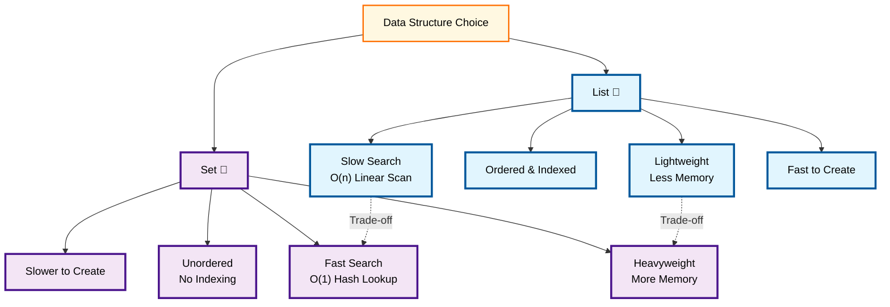

Data structures behave similarly. A structure that is excellent for one operation may require more memory or give up another feature.

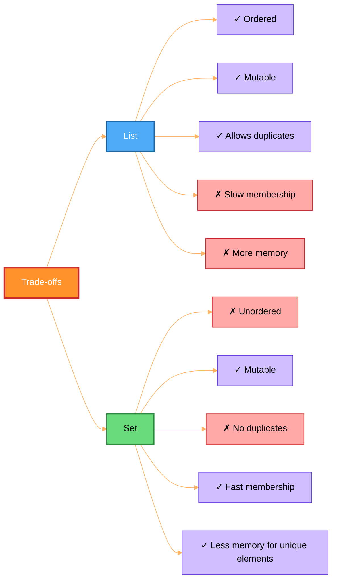

## 2. Membership testing with `in`

```python
values = [0, 1, 2, 3, 4, 5]

print(5 in values)   # True
print(-1 in values)  # False
```

For a list, Python normally checks items from left to right until it:

- Finds a matching value, or
- Reaches the end.

### List membership time

If the target is not present in a list of `n` elements, up to `n` comparisons may be required.

\[
T_{\text{list-membership}}(n) \propto n
\]

Therefore, worst-case list membership is:

\[
O(n)
\]

Examples:

- Looking for the first element: often very fast.
- Looking for the last element: may inspect almost the entire list.
- Looking for an absent element: usually scans the entire list.

## 3. Creating a set

A set is written with curly braces:

```python
numbers = {1, 7, 6, 2, 4, 8, 1}
print(numbers)
```

The repeated `1` appears only once because sets keep unique elements.

```python
print(type(numbers))  # <class 'set'>
```

### Empty set warning

```python
empty_dictionary = {}
empty_set = set()
```

`{}` creates an empty dictionary, not an empty set.

## 4. Why is membership faster in a set?

Sets use a **hash table** internally. Instead of scanning all values in order, Python computes a hash and uses it to locate a probable storage position.

Average membership complexity:

$$
T_{\text{set-membership}}(n) \approx O(1)
$$

Worst-case complexity can degrade to \(O(n)\), but average behaviour is usually close to constant time.

```python
large_set = set(range(1_000_000))

print(-1 in large_set)  # Usually returns almost immediately.
```

## 5. Why not use a set everywhere?

A set gives up some list features:

```python
values = {10, 20, 30}
print(values[0])
```

This raises:

```text
TypeError: 'set' object is not subscriptable
```

A set has no meaningful “first”, “second”, or “third” position.

### Core trade-off

| Operation or feature | List | Set |
|---|---:|---:|
| Preserve sequence | Yes | No positional guarantee |
| Duplicates | Allowed | Removed |
| Access by index | Yes | No |
| Membership test | \(O(n)\) worst case | \(O(1)\) average |
| Memory overhead | Usually lower | Usually higher |
| Unhashable values such as lists | Allowed | Not allowed as elements |

## 6. Measuring memory

The transcript uses `sys.getsizeof()`:

```python
import sys

list_values = list(range(100))
set_values = set(range(100))

print(sys.getsizeof(list_values))
print(sys.getsizeof(set_values))
```

### Accuracy note

The exact byte counts vary according to:

- Python version,
- Platform,
- Internal allocation strategy,
- Number and type of elements.

`sys.getsizeof()` reports the shallow size of the container object. It does not recursively add the full sizes of every referenced object.

## 7. A safer timing experiment

Avoid creating a list with one billion items on a normal machine. It may consume enormous memory or crash the session.

```python
from timeit import timeit

size = 100_000
list_values = list(range(size))
set_values = set(range(size))
missing_value = -1

list_time = timeit(
    "missing_value in list_values",
    globals=globals(),
    number=100,
)

set_time = timeit(
    "missing_value in set_values",
    globals=globals(),
    number=100,
)

print(f"List membership time: {list_time:.6f} seconds")
print(f"Set membership time:  {set_time:.6f} seconds")
```

## 8. Practical example: people already met

A set is appropriate when only membership matters:

```python
people_met = {"Amit", "Neeru", "Anamika", "Varsha", "Nitin"}

print("Amar" in people_met)     # False
print("Anamika" in people_met)  # True

# Add a new unique name.
people_met.add("Karthik")
```

Use a list instead if the order of meetings matters:

```python
meeting_order = ["Amit", "Neeru", "Anamika", "Varsha", "Nitin"]
print(meeting_order[0])  # First person met
```

## 9. When should each be used?

### Use a list when

- You need order.
- You need duplicates.
- You need indexing.
- You need to preserve arrival or processing sequence.

### Use a set when

- You need unique values.
- You repeatedly ask “Is this item present?”
- You perform union, intersection, or difference.
- Sequence is irrelevant.

## Fun fact

A common real-world optimisation is to keep both:

```python
ordered_users = []  # Preserves order.
seen_users = set()  # Gives fast membership checks.
```

This uses more memory but combines the strengths of both structures.

---

# L4.3 — Tuples and Immutability

**Lecture:** [Tuples | immutable data structures explained](https://www.youtube.com/watch/z-n9yQaWr7o)

## 1. What is a tuple?

A **tuple** is an ordered collection that cannot be structurally modified after creation.

```python
coordinates = (2, 7, 18, 64)
print(coordinates)
```

### Main properties

| Property | Tuple behaviour |
|---|---|
| Ordered | Yes |
| Indexed | Yes |
| Duplicates | Allowed |
| Mutable | No |
| Slicing | Yes |
| Iteration | Yes |

## 2. List versus tuple intuition

The lecture compares:

- A cupboard with wheels: movable and flexible.
- A fixed cupboard: less flexible but suitable when movement is unwanted.

A list is like the cupboard with wheels: it supports more modification operations.

A tuple is like the fixed cupboard: it deliberately removes modification capability.

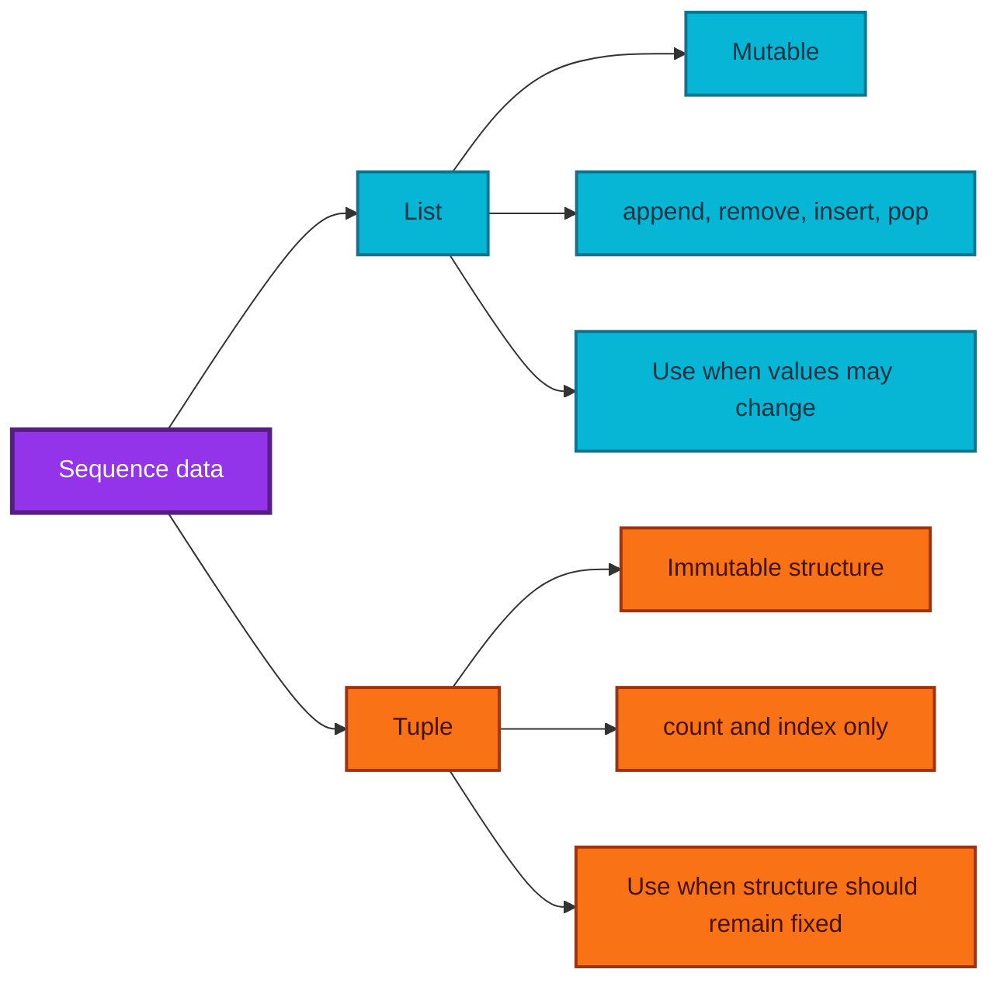

## 3. Accessing tuple values

```python
values = (10, 20, 30)

print(values[0])   # 10
print(values[-1])  # 30
print(values[0:2]) # (10, 20)
```

## 4. Modification is not allowed

```python
values = (10, 20, 30)
values[0] = 99
```

Raises:

```text
TypeError: 'tuple' object does not support item assignment
```

These methods are unavailable:

- `append()`
- `extend()`
- `insert()`
- `remove()`
- `pop()`
- `clear()`

A tuple mainly offers:

```python
values.count(20)
values.index(30)
```

## 5. Why use a tuple?

A tuple communicates intent:

> “The structure and element positions should remain fixed.”

Possible examples:

```python
rgb_red = (255, 0, 0)
location = (28.6139, 77.2090)
days_of_week = (
    "Monday",
    "Tuesday",
    "Wednesday",
    "Thursday",
    "Friday",
    "Saturday",
    "Sunday",
)
```

## 6. Filtering only valid letters

The transcript creates a fixed collection of English letters and uses it as a lookup.

```python
import string

# Convert the fixed alphabet string to a tuple.
letters = tuple(string.ascii_letters)

raw_text = "Sudarshan#% India() Bharath Karnataka Punjab Tamil Nadu"
cleaned_characters = []

for character in raw_text:
    # Keep the character only if it is an English letter.
    if character in letters:
        cleaned_characters.append(character)

cleaned_text = "".join(cleaned_characters)
print(cleaned_text)
```

Output:

```text
SudarshanIndiaBharathKarnatakaPunjabTamilNadu
```

### Better data-structure choice for lookup

A tuple is fixed, but membership testing in a tuple is linear. A `set` or `frozenset` is generally a better lookup structure:

```python
allowed_letters = frozenset(string.ascii_letters)
```

This preserves immutability and gives average $O(1)$ membership checking.

## 7. Memory comparison

```python
import sys

list_values = list(range(10))
tuple_values = tuple(range(10))

print(sys.getsizeof(list_values))
print(sys.getsizeof(tuple_values))
```

Tuples often require less container overhead than lists because Python does not need to reserve the same growth flexibility.

### Accuracy note

The exact difference is implementation-dependent and should be measured rather than assumed.

## 8. When should you use a tuple?

Use a tuple when:

- The number and positions of fields are fixed.
- Accidental structural modification should be prevented.
- The sequence may be used as a dictionary key, provided every item is hashable.
- A function naturally returns multiple related values.

## Fun fact

Parentheses are not always what make a tuple—the **comma** is the essential syntax:

```python
value = 1, 2, 3
print(type(value))  # tuple
```

---

# L4.4 — Advanced List Operations and Methods

**Lecture:** [More on lists | advanced operations & methods](https://www.youtube.com/watch/aaaENpVGS5U)

## 1. List concatenation with `+`

```python
list_1 = [1, 2, 3]
list_2 = [10, 20, 30]

print(list_1 + list_2)
print(list_2 + list_1)
```

Output:

```text
[1, 2, 3, 10, 20, 30]
[10, 20, 30, 1, 2, 3]
```

Concatenation is order-sensitive:

$$
A + B \neq B + A
$$

for most lists.

Length formula:

$$
\operatorname{len}(A+B)=\operatorname{len}(A)+\operatorname{len}(B)
$$

## 2. List repetition with `*`

```python
zeros = [0] * 10
print(zeros)

pattern = [1, 2, 3] * 5
print(pattern)
```

Length formula for non-negative integer `k`:

$$
\operatorname{len}(A \times k)=k\operatorname{len}(A)
$$

### Nested-list warning

```python
matrix = [[0] * 3] * 3
matrix[0][0] = 1
print(matrix)
```

Unexpected output:

```text
[[1, 0, 0], [1, 0, 0], [1, 0, 0]]
```

All rows refer to the same inner list.

Correct construction:

```python
matrix = [[0] * 3 for _ in range(3)]
matrix[0][0] = 1
print(matrix)
```

Output:

```text
[[1, 0, 0], [0, 0, 0], [0, 0, 0]]
```

## 3. Equality comparison

Lists are equal when:

1. They have the same length.
2. Corresponding values are equal.
3. The values occur in the same order.

```python
list_1 = [1, 2, 3]
list_2 = [1, 2, 3]
list_3 = [1, 3, 2]

print(list_1 == list_2)  # True
print(list_2 == list_3)  # False
```

## 4. Lexicographic comparison

Python compares lists element by element, similar to dictionary order for words.

```python
print([1] < [2])            # True
print([1, 2] < [1, 3])      # True
print([1] < [1, 0])         # True: shorter matching prefix
print([] < [1])             # True
```

### Step-by-step intuition

For:

```python
[1, 2, 9] < [1, 3, 0]
```

- First pair: `1 == 1`, so continue.
- Second pair: `2 < 3`, so the result is `True`.
- The third pair is never needed.

## 5. Mutability

```python
values = [1, 2, 4]
values[2] = 3
print(values)
```

Output:

```text
[1, 2, 3]
```

This in-place replacement is possible because lists are mutable.

Strings are immutable:

```python
word = "code"
word[0] = "C"
```

Raises:

```text
TypeError: 'str' object does not support item assignment
```

Correct approach:

```python
word = "code"
word = "C" + word[1:]
print(word)  # Code
```

## 6. Aliasing: two names, one list

```python
list_1 = [1, 2, 3]
list_2 = list_1

# Mutate the shared list through list_1.
list_1[0] = 100

print(list_1)
print(list_2)
```

Both print:

```text
[100, 2, 3]
```

`list_2 = list_1` does not create a new list. It creates a second name for the same object.

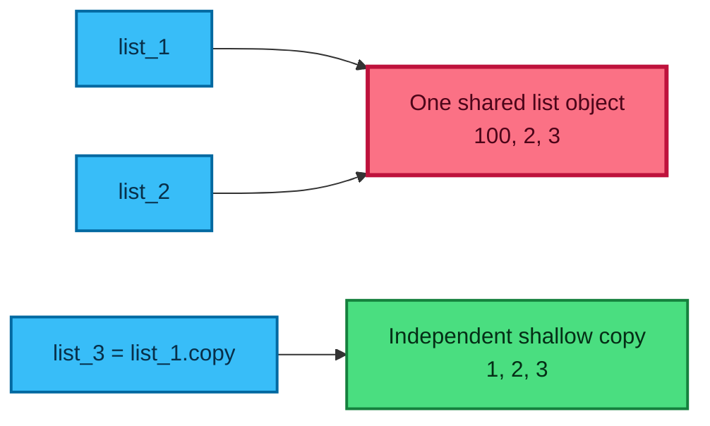

## 7. Copying a list

The transcript presents three shallow-copy techniques:

```python
original = [1, 2, 3]

copy_1 = list(original)
copy_2 = original[:]
copy_3 = original.copy()
```

All three create new outer list objects.

```python
copy_1[0] = 100

print(original)  # [1, 2, 3]
print(copy_1)    # [100, 2, 3]
```

### Shallow-copy warning

```python
original = [[1, 2], [3, 4]]
shallow = original.copy()

shallow[0][0] = 99
print(original)
```

Output:

```text
[[99, 2], [3, 4]]
```

The outer list is new, but nested inner lists remain shared.

For an independent recursive copy:

```python
from copy import deepcopy

independent = deepcopy(original)
```

## 8. `==` versus `is`

```python
list_1 = [1, 2, 3]
list_2 = [1, 2, 3]
list_3 = list_1

print(list_1 == list_2)  # True: same values
print(list_1 is list_2)  # False: different objects
print(list_1 is list_3)  # True: same object
```

| Operator | Question answered |
|---|---|
| `==` | “Do these objects have equal values?” |
| `is` | “Are these names pointing to the exact same object?” |

Use `is` primarily for singleton checks such as:

```python
if result is None:
    print("No result was returned.")
```

## 9. Accuracy clarification: assignment and function arguments

The transcript describes immutable arguments as “call by value” and mutable arguments as “call by reference.” This is a useful beginner intuition, but Python’s more accurate model is:

> **Call by object sharing** or **call by assignment**.

A function receives a reference to the same object. The visible effect depends on whether the object is mutated or the local name is rebound.

### Immutable object example

```python
def increase(number):
    # Rebind the local name to a new integer object.
    number = number + 1
    print(number)

value = 5
increase(value)  # 6
print(value)     # 5
```

The caller’s name `value` remains bound to `5`.

### Mutable object example

```python
def add_item(items):
    # Mutate the shared list object.
    items.append(1)

values = [5]
add_item(values)
print(values)  # [5, 1]
```

### Rebinding a mutable parameter

```python
def replace_list(items):
    # Rebind only the local parameter name.
    items = [100, 200]

values = [5]
replace_list(values)
print(values)  # [5]
```

Mutability alone does not decide everything; the crucial distinction is **mutation versus rebinding**.

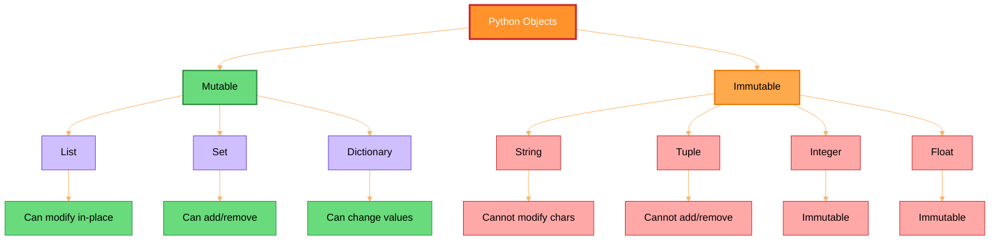

## 10. Important list methods

### `append(value)`

Adds one item at the end.

```python
values = [1, 2]
values.append(3)
```

### `insert(index, value)`

Inserts an item at a chosen position.

```python
values = [1, 2, 3]
values.insert(2, 9)
print(values)  # [1, 2, 9, 3]
```

### `remove(value)`

Removes the first matching value.

```python
values = [1, 2, 2, 3]
values.remove(2)
print(values)  # [1, 2, 3]
```

### `pop(index=-1)`

Removes and returns an item.

```python
values = [10, 20, 30]
removed = values.pop(0)

print(removed)  # 10
print(values)   # [20, 30]
```

Without an index, `pop()` removes the last item.

### `sort()`

Sorts the list in place.

```python
values = [4, 1, 3, 2]
values.sort()
print(values)  # [1, 2, 3, 4]
```

Descending order:

```python
values.sort(reverse=True)
```

### `reverse()`

Reverses the current order in place.

```python
values = [1, 2, 3]
values.reverse()
print(values)  # [3, 2, 1]
```

### `sort()` is not the same as `reverse()`

- `sort(reverse=True)` orders values from largest to smallest.
- `reverse()` simply flips the current sequence.

## Fun facts

- `list.sort()` returns `None` because it modifies the existing list.
- `sorted(values)` returns a new sorted list and leaves the original unchanged.
- Python’s sort is stable: equal-key elements retain their original relative order.

---

# L4.5 — Set Properties and Mathematical Operations

**Lecture:** [More on sets | operations, properties & methods](https://www.youtube.com/watch/qoV4tdDD8zE)

## 1. Essential set properties

```python
values = {1, 2, 2, 3, 3, 3}
print(values)
```

Only unique values remain.

### Property summary

1. **No duplicates**
2. **No positional indexing**
3. **Mutable container**
4. **Elements must be hashable**
5. **Iterable**

## 2. Mutable set, hashable elements

A set can change:

```python
values = {1, 2, 3}
values.add(4)
values.remove(2)
```

But a list cannot be inserted into a set:

```python
values.add([5, 6])
```

Raises:

```text
TypeError: unhashable type: 'list'
```

Valid elements include:

- Integers
- Floats
- Strings
- Tuples whose contents are all hashable
- `frozenset` objects

## 3. Subset and superset

For sets $A$ and $B$:

$$
A \subseteq B
$$

means every element of $A$ is also in $B$.

```python
A = {1, 2}
B = {1, 2, 3, 4}

print(A.issubset(B))    # True
print(B.issuperset(A))  # True
print(A <= B)           # True
print(B >= A)           # True
```

Proper subset:

```python
print(A < B)  # True because A is contained in B and A != B
```

## 4. Union

The union contains every value present in either set:

$$
A \cup B = \{x \mid x \in A \text{ or } x \in B\}
$$

```python
A = {1, 2, 3}
B = {3, 4, 5}

print(A.union(B))
print(A | B)
```

Output:

```text
{1, 2, 3, 4, 5}
```

## 5. Intersection

The intersection contains values common to both sets:

$$
A \cap B = \{x \mid x \in A \text{ and } x \in B\}
$$

```python
print(A.intersection(B))
print(A & B)
```

Output:

```text
{3}
```

## 6. Difference

The difference $A-B$ contains values in `A` but not in `B`:

$$
A-B = \{x \mid x \in A \text{ and } x \notin B\}
$$

```python
print(A.difference(B))
print(A - B)
```

Output:

```text
{1, 2}
```

Order matters:

```python
print(B - A)  # {4, 5}
```

## 7. Symmetric difference

Although not emphasised in the transcript, it naturally extends the same set-algebra family:

$$
A \triangle B = (A-B) \cup (B-A)
$$

```python
print(A.symmetric_difference(B))
print(A ^ B)
```

Output:

```text
{1, 2, 4, 5}
```

## 8. Set-operation map

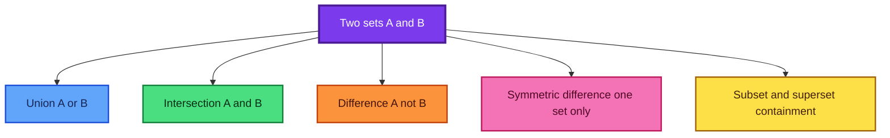

## 9. Practical data-science examples

```python
train_features = {"age", "income", "city", "score"}
test_features = {"age", "income", "city", "device"}

common = train_features & test_features
missing_in_test = train_features - test_features
extra_in_test = test_features - train_features

print(common)
print(missing_in_test)
print(extra_in_test)
```

This is useful for schema validation before model inference.

---

# L4.6 — Tuple Packing, Unpacking, and Hashability

**Lecture:** [More on tuples | immutability, packing & hashable tuples](https://www.youtube.com/watch/V7r6DB3a6_o)

## 1. Operations still available on tuples

Even though tuples are immutable, you can:

- Access by index
- Slice
- Iterate
- Count occurrences
- Find an index

```python
values = (10, 20, 20, 30)

print(values[0])       # 10
print(values[1:3])     # (20, 20)
print(values.count(20))
print(values.index(30))
```

## 2. Tuple packing

Packing combines multiple values into one tuple.

```python
packed = 1, 2, 3
print(packed)
print(type(packed))
```

Output:

```text
(1, 2, 3)
<class 'tuple'>
```

## 3. Tuple unpacking

```python
x, y, z = packed

print(x)  # 1
print(y)  # 2
print(z)  # 3
```

The number of target names must normally match the number of values.

```python
x, y = (1, 2, 3)
```

Raises:

```text
ValueError: too many values to unpack
```

### Extended unpacking

```python
first, *middle, last = (1, 2, 3, 4, 5)

print(first)   # 1
print(middle)  # [2, 3, 4]
print(last)    # 5
```

## 4. Swapping values

```python
x = 5
y = 10

x, y = y, x

print(x, y)  # 10 5
```

Conceptually:

1. Pack `y, x`.
2. Unpack the values into `x, y`.

## 5. Single-element tuple

```python
not_a_tuple = (10)
actual_tuple = (10,)

print(type(not_a_tuple))  # int
print(type(actual_tuple)) # tuple
```

The comma creates the tuple.

## 6. A tuple may contain a mutable object

```python
nested = ([1, 2], [3, 4])
```

You cannot replace a tuple element:

```python
nested[0] = [10, 20]
```

But you can mutate the list stored inside it:

```python
nested[0][0] = 10
print(nested)
```

Output:

```text
([10, 2], [3, 4])
```

### Important interpretation

Tuple immutability means the tuple’s references cannot be reassigned. It does not recursively freeze nested mutable objects.

## 7. Hashability

An object is hashable when:

1. It has a stable hash value during its lifetime.
2. It can be compared for equality consistently.

Hashable objects can be used as:

- Set elements
- Dictionary keys

### Hashable tuple

```python
point = (10, 20)
print(hash(point))

locations = {point}
```

### Non-hashable tuple

```python
not_hashable = ([1, 2], 3)
print(hash(not_hashable))
```

Raises:

```text
TypeError: unhashable type: 'list'
```

A tuple is hashable only when all values required for its hash are themselves hashable.

## 8. Decision diagram for a tuple

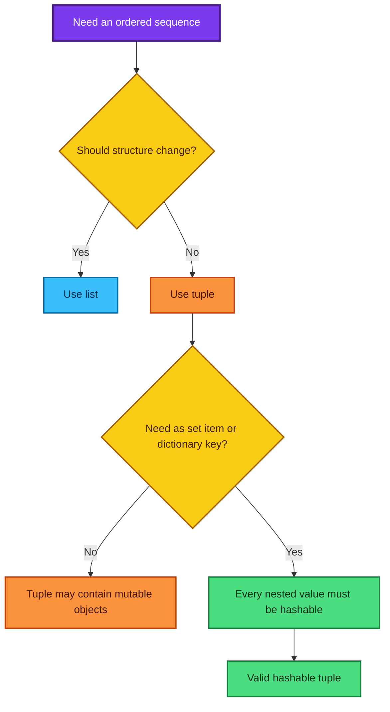

## Fun facts

- Functions frequently return tuples even when parentheses are not shown.
- `enumerate()` produces index-value pairs that can be unpacked.
- `dict.items()` yields key-value pairs that are commonly unpacked in loops.

```python
for index, value in enumerate(["a", "b", "c"]):
    print(index, value)
```

---

# L4.7 — Inline Statements and List Comprehensions

**Lecture:** [Functional programming | part 2 | inline statements & list comprehensions](https://www.youtube.com/watch/MNe03MfOLto)

## 1. Conditional expression

Normal form:

```python
a = 10
b = 20

if a < b:
    smaller = a
else:
    smaller = b
```

Inline form:

```python
smaller = a if a < b else b
```

General syntax:

```text
value_if_true if condition else value_if_false
```

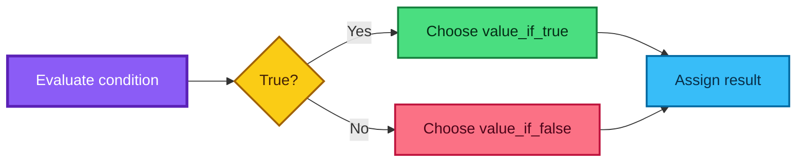

### When to use it

Use it for a simple value choice:

```python
status = "adult" if age >= 18 else "minor"
```

Avoid deeply nested conditional expressions because readability quickly declines.

## 2. Multiple statements on one line

Python permits semicolons:

```python
count = 5
while count > 0: print(count); count -= 1
```

This works, but the clearer form is:

```python
count = 5

while count > 0:
    print(count)
    count -= 1
```

### Principle

Fewer lines do not automatically mean better code. Readability is more important than compression.

## 3. List comprehension

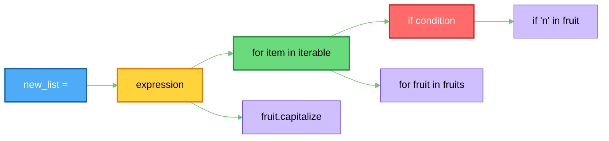
A list comprehension creates a new list from an iterable.

General form:

```python
new_list = [expression for item in iterable]
```

With filtering:

```python
new_list = [expression for item in iterable if condition]
```

## 4. Transcript fruit example

Loop-based solution:

```python
fruits = ["mango", "banana", "orange", "apple", "melon"]
selected = []

for fruit in fruits:
    # Keep only fruit names containing the letter n.
    if "n" in fruit:
        # Capitalize the selected fruit before adding it.
        selected.append(fruit.capitalize())

print(selected)
```

Comprehension:

```python
selected = [
    fruit.capitalize()      # Transformation
    for fruit in fruits     # Iteration
    if "n" in fruit         # Filter
]
```

Output:

```text
['Mango', 'Banana', 'Orange', 'Melon']
```

### Reading order

Read it as:

> “Take `fruit.capitalize()` for every `fruit` in `fruits` if `'n'` is in `fruit`.”

## 5. Examples

### Squares

```python
squares = [number ** 2 for number in range(1, 6)]
print(squares)
```

Output:

```text
[1, 4, 9, 16, 25]
```

Mathematically:

$$
S = \{x^2 \mid x \in \{1,2,3,4,5\}\}
$$

### Even squares

```python
even_squares = [
    number ** 2
    for number in range(1, 11)
    if number % 2 == 0
]
```

### Conditional transformation

```python
labels = ["even" if number % 2 == 0 else "odd" for number in range(5)]
```

Notice that an inline `if-else` appears before `for`, while a filtering `if` appears after the iterable.

## 6. When not to use a comprehension

Prefer a normal loop when:

- The logic has several steps.
- Multiple side effects occur.
- Error handling is required.
- The comprehension becomes difficult to read.

Bad:

```python
result = [complex_transform(x) if condition_a(x) else other_transform(x) for x in data if condition_b(x) and condition_c(x)]
```

Clearer:

```python
result = []

for item in data:
    if not condition_b(item) or not condition_c(item):
        continue

    if condition_a(item):
        transformed = complex_transform(item)
    else:
        transformed = other_transform(item)

    result.append(transformed)
```

## 7. Functional-programming clarification

List comprehensions and conditional expressions are often discussed alongside functional programming because they express transformations compactly. However, Python comprehensions are not purely functional by definition; Python is a multi-paradigm language.

---

# L4.8 — Introduction to Functions

**Lecture:** [Introduction to functions | hands-on coding with examples](https://www.youtube.com/watch/zDZRfWWetg0)

## 1. What is a function?

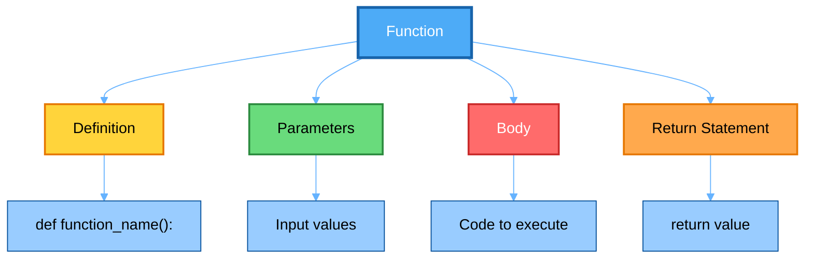

A function is a named, reusable block of code that performs a specific task.

Mathematically, a function maps an input to an output:

$$
f: X \rightarrow Y
$$

In programming, a function may:

- Accept zero or more inputs,
- Perform statements,
- Return zero or more logical results,
- Produce side effects such as printing or modifying an object.

## 2. Basic syntax

```python
def add(a, b):
    # Compute the sum of the two parameters.
    answer = a + b

    # Send the result back to the caller.
    return answer
```

Function call:

```python
result = add(1, 6)
print(result)  # 7
```

### Components

| Component | Example | Meaning |
|---|---|---|
| `def` | `def add(...)` | Starts a function definition. |
| Function name | `add` | Name used to call the function. |
| Parameters | `a, b` | Local names receiving input values. |
| Body | `answer = a + b` | Statements executed when called. |
| `return` | `return answer` | Sends a value back to the caller. |
| Arguments | `1, 6` | Actual values supplied in the call. |

## 3. Definition versus execution

Defining a function does not execute its body:

```python
def greet():
    print("Hello")
```

No output appears yet.

```python
greet()  # Function body executes here.
```

## 4. Why functions matter

Functions support **modular programming**.

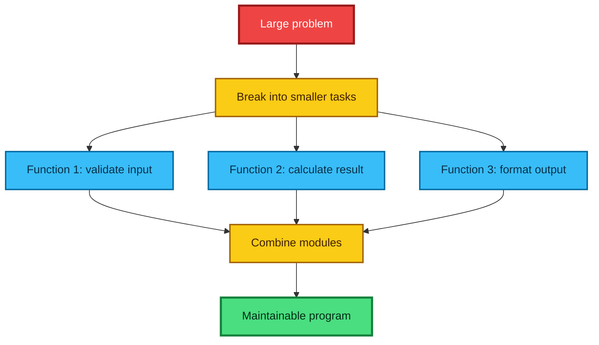

Benefits:

- Reuse
- Readability
- Testing
- Debugging
- Separation of concerns
- Easier collaboration

## 5. Add and subtract functions

```python
def add(a, b):
    """Return the sum of a and b."""
    return a + b


def subtract(a, b):
    """Return a minus b."""
    return a - b


print(add(10, 72))       # 82
print(subtract(10, 8))   # 2
```

## 6. Discount function and formula

Let:

- $P$ = original price
- $d$ = discount percentage
- $P_f$ = final price

Discount amount:

$$
D = P\times\frac{d}{100}
$$

Final price:

$$
P_f = P-D
$$

or equivalently:

$$
P_f = P\left(1-\frac{d}{100}\right)
$$

```python
def discounted_price(cost, discount_percent):
    """Return the price after applying a percentage discount."""

    # Reject impossible discount values.
    if not 0 <= discount_percent <= 100:
        raise ValueError("discount_percent must be between 0 and 100")

    discount_amount = cost * discount_percent / 100
    final_price = cost - discount_amount
    return final_price


print(discounted_price(100, 8))    # 92.0
print(discounted_price(1200, 8))   # 1104.0
```

## 7. `print()` versus `return`

### Printing only

```python
def add_and_print(a, b):
    answer = a + b
    print(answer)
```

This displays the answer but implicitly returns `None`.

```python
result = add_and_print(2, 3)
print(result)
```

Output:

```text
5
None
```

### Returning

```python
def add_and_return(a, b):
    answer = a + b
    return answer
```

Now the value can be reused:

```python
combined = add_and_return(17, 5) + add_and_return(100, -3)
print(combined)
```

## 8. Function-call flow

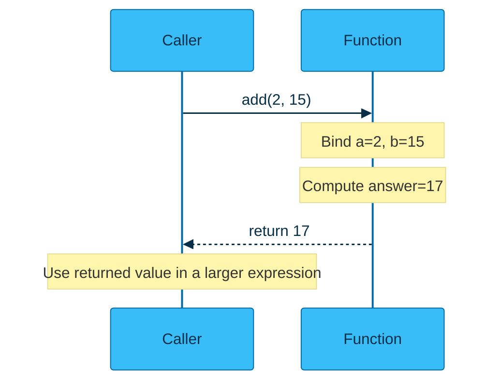

## 9. Parameters are local names

```python
def discounted_price(cost, discount_percent):
    return cost * (1 - discount_percent / 100)

price = 1000
rate = 11

# price is assigned to cost; rate is assigned to discount_percent.
final = discounted_price(price, rate)
print(final)  # 890.0
```

The caller’s variable names do not need to match the parameter names. Position establishes the mapping for positional arguments.

## 10. Type-safe input example

```python
def discounted_price(cost, discount_percent):
    return cost * (1 - discount_percent / 100)

try:
    cost = float(input("Enter the original price: "))
    discount = float(input("Enter the discount percentage: "))

    if cost < 0:
        raise ValueError("Cost cannot be negative.")

    final_price = discounted_price(cost, discount)
    print(f"Final price: ₹{final_price:.2f}")

except ValueError as error:
    print(f"Invalid input: {error}")
```

---

# L4.9 — Functions That Manipulate Lists

**Lecture:** [More examples of functions | programming in Python](https://www.youtube.com/watch/TBFTFusLIco)

## 1. Lists as function inputs

```python
def first_element(values):
    """Return the first element of a non-empty list."""
    return values[0]


def second_element(values):
    """Return the second element of a list with at least two items."""
    return values[1]


numbers = [1, 2, 3]
print(first_element(numbers))   # 1
print(second_element(numbers))  # 2
```

Robust validation:

```python
def first_element(values):
    if not values:
        raise ValueError("values must not be empty")
    return values[0]
```

## 2. Custom minimum function

Algorithm:

1. Assume the first item is the minimum.
2. Scan every item.
3. Replace the current minimum whenever a smaller item is found.
4. Return the final minimum.

```python
def list_minimum(values):
    """Return the smallest value from a non-empty sequence."""

    if not values:
        raise ValueError("values must not be empty")

    current_minimum = values[0]

    for value in values[1:]:
        # Update only when a smaller value is found.
        if value < current_minimum:
            current_minimum = value

    return current_minimum


print(list_minimum([1, 2, 3, 4, 5, -10, 6, 4]))  # -10
```

Time complexity:

$$
O(n)
$$

Space complexity:

$$
O(1)
$$

excluding the input.

## 3. Custom maximum function

```python
def list_maximum(values):
    """Return the largest value from a non-empty sequence."""

    if not values:
        raise ValueError("values must not be empty")

    current_maximum = values[0]

    for value in values[1:]:
        if value > current_maximum:
            current_maximum = value

    return current_maximum


print(list_maximum([1, 2, 3, 100, -10]))  # 100
```

### Naming warning

Avoid using names of built-in functions as variables:

```python
min = 10  # Shadows Python's built-in min function.
```

Prefer:

```python
current_minimum = 10
```

## 4. Prepending one list to another

Transcript-style algorithm:

```python
def append_before(values, prefix):
    """Return a new list with prefix placed before values."""

    combined = []

    for item in prefix:
        combined.append(item)

    for item in values:
        combined.append(item)

    return combined


print(append_before([1, 2, 3], [10, 20, 30]))
```

Pythonic version:

```python
def append_before(values, prefix):
    return prefix + values
```

## 5. Appending one list after another

```python
def append_after(values, suffix):
    """Return a new list with suffix placed after values."""
    return values + suffix
```

## 6. Average of list values

For values $x_1,x_2,\ldots,x_n$, arithmetic mean:

$$
\bar{x}=\frac{x_1+x_2+\cdots+x_n}{n}
$$

or:

$$
\bar{x}=\frac{1}{n}\sum_{i=1}^{n}x_i
$$

```python
def list_average(values):
    """Return the arithmetic mean of a non-empty numeric sequence."""

    if not values:
        raise ValueError("values must not be empty")

    total = 0

    for value in values:
        total += value

    return total / len(values)


print(list_average([1, 7, 8, 10]))  # 6.5
```

Pythonic version:

```python
def list_average(values):
    if not values:
        raise ValueError("values must not be empty")
    return sum(values) / len(values)
```

## 7. Modular list-analysis program

```python
def list_minimum(values):
    if not values:
        raise ValueError("values must not be empty")
    return min(values)


def list_maximum(values):
    if not values:
        raise ValueError("values must not be empty")
    return max(values)


def list_average(values):
    if not values:
        raise ValueError("values must not be empty")
    return sum(values) / len(values)


def analyse(values):
    """Combine smaller reusable functions into one report."""
    return {
        "minimum": list_minimum(values),
        "maximum": list_maximum(values),
        "average": list_average(values),
    }


numbers = [1, 7, 8, 10]
print(analyse(numbers))
```

Output:

```text
{'minimum': 1, 'maximum': 10, 'average': 6.5}
```

## 8. Why modular programming is powerful

A large problem can be decomposed into tested units:

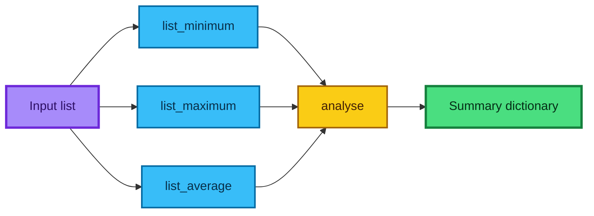

---

# L4.10 — Types of Function Arguments

**Lecture:** [Types of function arguments](https://www.youtube.com/watch/NqjnCY2qQWU)

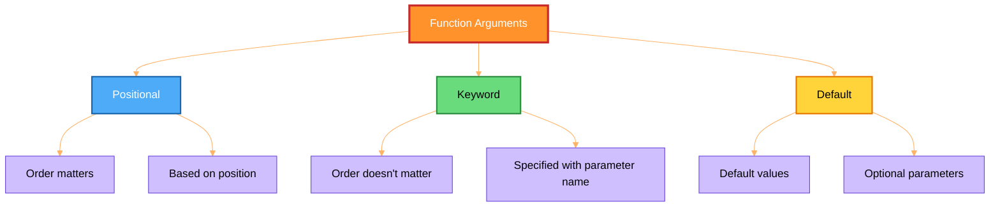
## 1. Key terminology

```python
def calculate(a, b, c):      # a, b, c are parameters.
    return a + b - c

result = calculate(20, 30, 40)  # 20, 30, 40 are arguments.
```

| Term | Meaning |
|---|---|
| Function definition | The `def` block that describes behaviour. |
| Function call | The expression that executes the function. |
| Parameter | A local name in the definition. |
| Argument | A value supplied by the caller. |
| Return value | The value sent back to the caller. |

## 2. Positional arguments

Arguments map to parameters according to order.

```python
def calculate(a, b, c):
    return a + b - c

print(calculate(20, 30, 40))  # 10
```

Mapping:

```text
20 -> a
30 -> b
40 -> c
```

Changing the definition order changes the interpretation:

```python
def calculate(c, a, b):
    return a + b - c

print(calculate(20, 30, 40))  # 50
```

## 3. Keyword arguments

Keyword arguments map by name rather than position.

```python
def calculate(c, a, b):
    return a + b - c

print(calculate(a=20, b=30, c=40))  # 10
print(calculate(c=40, a=20, b=30))  # 10
```

Advantages:

- Calls become self-documenting.
- Order is less important.
- Long parameter lists are less error-prone.

## 4. Default arguments

```python
def calculate(c, a=20, b=30):
    return a + b - c

print(calculate(40))          # 10
print(calculate(40, 10))      # 0
print(calculate(40, 10, 50))  # 20
```

A supplied argument overrides the default.

## 5. Required ordering rule

A non-default parameter cannot follow a default parameter:

```python
def invalid(a=10, b):
    return a + b
```

Raises a syntax error.

Correct:

```python
def valid(b, a=10):
    return a + b
```

## 6. Combining argument styles

```python
def calculate(c, a=20, b=30):
    return a + b - c

# c is positional; a and b are keyword arguments.
print(calculate(40, b=10, a=50))
```

### Rule

Positional arguments must generally appear before keyword arguments in a call:

```python
calculate(c=40, 20, 30)  # Invalid syntax
```

## 7. Why does `None` appear?

```python
def calculate(a, b, c):
    print(a + b - c)

print(calculate(20, 30, 40))
```

Output:

```text
10
None
```

Explanation:

1. The function’s internal `print()` displays `10`.
2. The function has no `return` statement.
3. Python implicitly returns `None`.
4. The outer `print()` displays that `None`.

Correct reusable function:

```python
def calculate(a, b, c):
    return a + b - c
```

## 8. Mutable default argument warning

This common Python pitfall extends the lecture’s discussion of default values.

Avoid:

```python
def add_item(item, items=[]):
    items.append(item)
    return items
```

The same list is reused across calls.

Use:

```python
def add_item(item, items=None):
    if items is None:
        items = []

    items.append(item)
    return items
```

## 9. Argument mapping diagram

```mermaid
flowchart TD
    A[Function call] --> B{Argument style}
    B -->|Positional| C[Map by sequence]
    B -->|Keyword| D[Map by parameter name]
    B -->|Omitted optional value| E[Use default]
    C --> F[Execute function body]
    D --> F
    E --> F
    F --> G[Return result or None]

    classDef call fill:#7c3aed,color:#ffffff,stroke:#4c1d95,stroke-width:3px;
    classDef decision fill:#facc15,color:#422006,stroke:#a16207,stroke-width:2px;
    classDef mapping fill:#38bdf8,color:#082f49,stroke:#0369a1,stroke-width:2px;
    classDef execute fill:#fb923c,color:#431407,stroke:#c2410c,stroke-width:2px;
    classDef output fill:#4ade80,color:#052e16,stroke:#15803d,stroke-width:3px;

    class A call;
    class B decision;
    class C,D,E mapping;
    class F execute;
    class G output;
```

---

# L4.11 — Categories of Python Functions

**Lecture:** [Types of functions | built-in, library, string & user-defined](https://www.youtube.com/watch/F9xeVMToUJ8)

## 1. Built-in functions

Built-in functions are available without importing a module.

Examples:

```python
print("Hello")
length = len("Python")
name = input("Enter your name: ")
number = int("42")
```

Common built-ins:

- `print()`
- `input()`
- `len()`
- `type()`
- `int()`
- `float()`
- `str()`
- `min()`
- `max()`
- `sum()`
- `sorted()`

## 2. Library functions

Library functions belong to imported modules.

```python
import math
import random
import calendar

print(math.log(10))
print(math.sqrt(25))
print(random.random())
print(random.randrange(1, 10))
print(calendar.month(2026, 7))
```

Typical form:

```text
module_name.function_name(arguments)
```

## 3. Methods

A method is a function associated with an object or class.

String-method examples:

```python
text = "  Python Programming  "

print(text.upper())
print(text.lower())
print(text.strip())
print(text.count("m"))
print(text.index("P"))
print(text.replace("Python", "Data Science"))
```

Typical form:

```text
object.method(arguments)
```

Lists, sets, tuples, and dictionaries also have methods.

## 4. User-defined functions

```python
def square(number):
    """Return the square of a number."""
    return number ** 2


print(square(5))  # 25
```

Until the function is defined, `square(5)` has no user-defined meaning.

## 5. Comparison table

| Category | Defined by | Import needed? | Invocation example |
|---|---|---:|---|
| Built-in | Python language/runtime | No | `len(values)` |
| Library function | A module or package | Usually yes | `math.sqrt(25)` |
| Method | Object’s type/class | No separate import if type is available | `text.upper()` |
| User-defined | Programmer | No | `square(5)` |

## 6. Function naming rules

Function names follow identifier rules:

- May contain letters, digits, and underscores.
- Cannot begin with a digit.
- Cannot be a Python keyword.
- Are case-sensitive.
- Should normally use `snake_case`.

Good:

```python
def calculate_average(values):
    return sum(values) / len(values)
```

Poor:

```python
def CalculateAverageOfAllNumbersInsideTheList(values):
    return sum(values) / len(values)
```

Invalid:

```python
def 2average(values):
    pass
```

## 7. Parentheses and calls

A function object and a function call are different:

```python
def greet():
    return "Hello"

print(greet)    # Displays a representation of the function object.
print(greet())  # Calls the function and displays "Hello".
```

## 8. Category map

```mermaid
%%{init: {'theme': 'base', 'themeVariables': { 'primaryColor': '#ffcc99', 'primaryTextColor': '#000', 'primaryBorderColor': '#b36600', 'lineColor': '#ffb366', 'secondaryColor': '#006100', 'tertiaryColor': '#fff'}}}%%
graph TD
    A[Function Types] --> B[Built-in]
    A --> C[Library]
    A --> D[Methods]
    A --> E[User-defined]
    
    B --> B1[print, input, len]
    B --> B2[No import needed]
    
    C --> C1[math.sqrt, random.randint]
    C --> C2[Need to import]
    
    D --> D1[str.upper, str.lower]
    D --> D2[Call on objects]
    
    E --> E1["def my_function():"]
    E --> E2[Created by programmer]
    
    style A fill:#ff922b,stroke:#c92a2a,stroke-width:3px,color:#fff
    style B fill:#4dabf7,stroke:#1864ab,stroke-width:2px,color:#fff
    style C fill:#69db7c,stroke:#2b8a3e,stroke-width:2px,color:#000
    style D fill:#ffd43b,stroke:#e67700,stroke-width:2px,color:#000
    style E fill:#ff6b6b,stroke:#c92a2a,stroke-width:2px,color:#fff
    style B1 fill:#d0bfff,stroke:#6741d9,stroke-width:1px,color:#000
    style B2 fill:#d0bfff,stroke:#6741d9,stroke-width:1px,color:#000
    style C1 fill:#d0bfff,stroke:#6741d9,stroke-width:1px,color:#000
    style C2 fill:#d0bfff,stroke:#6741d9,stroke-width:1px,color:#000
    style D1 fill:#d0bfff,stroke:#6741d9,stroke-width:1px,color:#000
    style D2 fill:#d0bfff,stroke:#6741d9,stroke-width:1px,color:#000
    style E1 fill:#d0bfff,stroke:#6741d9,stroke-width:1px,color:#000
    style E2 fill:#d0bfff,stroke:#6741d9,stroke-width:1px,color:#000
```

---

# Master Comparison Table

| Feature | List | Tuple | Set |
|---|---|---|---|
| Syntax | `[1, 2, 3]` | `(1, 2, 3)` | `{1, 2, 3}` |
| Ordered | Yes | Yes | No positional ordering |
| Indexed | Yes | Yes | No |
| Sliceable | Yes | Yes | No |
| Mutable container | Yes | No | Yes |
| Duplicates | Yes | Yes | No |
| Membership average | \(O(n)\) | \(O(n)\) | \(O(1)\) |
| Can contain list | Yes | Yes | No |
| Can be dictionary key | No | Yes if fully hashable | No |
| Typical use | Dynamic sequence | Fixed record or sequence | Unique values and fast lookup |

## Operation complexity overview

| Operation | List | Tuple | Set |
|---|---:|---:|---:|
| Access by index | \(O(1)\) | \(O(1)\) | Not supported |
| Membership | \(O(n)\) | \(O(n)\) | Average \(O(1)\) |
| Append | Amortised \(O(1)\) | Not supported | Average \(O(1)\) via `add()` |
| Insert near front | \(O(n)\) | Not supported | Not positional |
| Remove known value | \(O(n)\) | Not supported | Average \(O(1)\) |
| Copy outer container | \(O(n)\) | Often unnecessary | \(O(n)\) |

---

# Common Errors and Debugging Guide

## 1. `ValueError` with `remove()`

```python
values = [1, 2, 3]
values.remove(99)
```

Fix:

```python
if 99 in values:
    values.remove(99)
```

## 2. Set is not subscriptable

```python
values = {1, 2, 3}
print(values[0])
```

Fix: use a list when index position matters.

## 3. Tuple item assignment

```python
values = (1, 2, 3)
values[0] = 99
```

Fix: create a new tuple:

```python
values = (99,) + values[1:]
```

## 4. Unexpected shared-list mutation

```python
a = [1, 2]
b = a
b.append(3)
```

Fix:

```python
b = a.copy()
```

Use `deepcopy()` for nested structures when complete independence is required.

## 5. Function prints but returns `None`

```python
def add(a, b):
    print(a + b)
```

Fix:

```python
def add(a, b):
    return a + b
```

## 6. Single-item tuple mistake

```python
value = (10)   # int
value = (10,)  # tuple
```

## 7. Incorrect list-comprehension variable

Wrong:

```python
[fruit.capitalize() for fruit in fruits if "n" in fruits]
```

Correct:

```python
[fruit.capitalize() for fruit in fruits if "n" in fruit]
```

## 8. Shadowing built-ins

Avoid:

```python
list = [1, 2, 3]
min = 0
sum = 10
```

Prefer:

```python
values = [1, 2, 3]
current_minimum = 0
total = 10
```

---

# Decision Guide: Which Structure Should You Use?

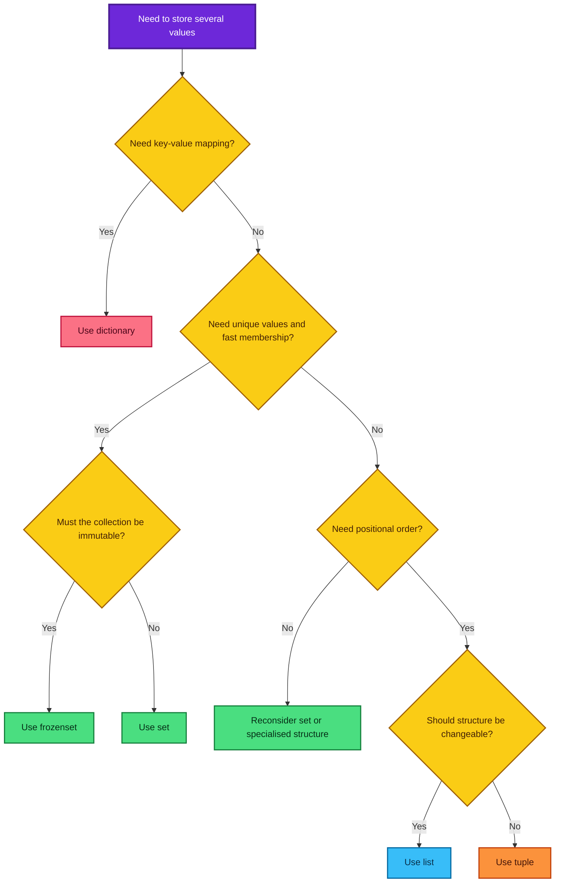

---

# Practice Problems

## Beginner

1. Create a list containing five numbers and append two more values.
2. Remove the first occurrence of a repeated value.
3. Create a 3 × 3 matrix with nested lists and print its diagonal.
4. Convert a list with repeated values into a set.
5. Create a one-element tuple correctly.

## Intermediate

6. Write a function that returns the minimum and maximum as a tuple.
7. Write a list comprehension that returns cubes of odd numbers from 1 to 20.
8. Compare two lists lexicographically and explain the result.
9. Demonstrate the difference between `==` and `is`.
10. Create shallow and deep copies of a nested list and compare mutation behaviour.

## Applied data-science tasks

11. Compare feature-name sets from training and test data.
12. Remove duplicate customer IDs while preserving original order.
13. Write a function that returns mean, minimum, and maximum for numeric data.
14. Validate that matrix rows all have the same length.
15. Use a tuple as a dictionary key for `(latitude, longitude)` coordinates.

## Challenge solution: remove duplicates while preserving order

```python
def unique_in_order(values):
    """Return unique values while preserving first-seen order."""

    seen = set()
    result = []

    for value in values:
        if value not in seen:
            seen.add(value)
            result.append(value)

    return result


print(unique_in_order([3, 1, 3, 2, 1, 4]))
```

Output:

```text
[3, 1, 2, 4]
```

Complexity under normal hashing assumptions:

$$
O(n)
$$

---

# Final Cheat Sheet

## Lists

```python
values = [1, 2, 3]
values.append(4)
values.extend([5, 6])
values.insert(1, 99)
values.remove(99)
last = values.pop()
copy_values = values.copy()
values.sort()
values.reverse()
```

## Sets

```python
A = {1, 2, 3}
B = {3, 4, 5}

A.add(6)
A.discard(99)   # No error if absent.
union = A | B
intersection = A & B
difference = A - B
symmetric = A ^ B
```

## Tuples

```python
point = (10, 20)
single = (10,)
x, y = point
```

## Comprehensions

```python
squares = [x ** 2 for x in range(10)]
even_squares = [x ** 2 for x in range(10) if x % 2 == 0]
labels = ["even" if x % 2 == 0 else "odd" for x in range(5)]
```

## Functions

```python
def function_name(required, optional=10):
    """Describe what the function returns."""
    result = required + optional
    return result


value = function_name(5)
value_2 = function_name(required=5, optional=20)
```

## Final mental model

- A **list** is a changeable ordered sequence.
- A **tuple** is a fixed ordered sequence.
- A **set** is a collection of unique hashable values optimised for membership.
- A **comprehension** expresses a transformation and optional filter.
- A **function** packages logic into a reusable module.
- `return` provides a value to the caller; `print` only displays a value.
- Python passes references to objects; mutation can be visible outside a function, while local rebinding is not.

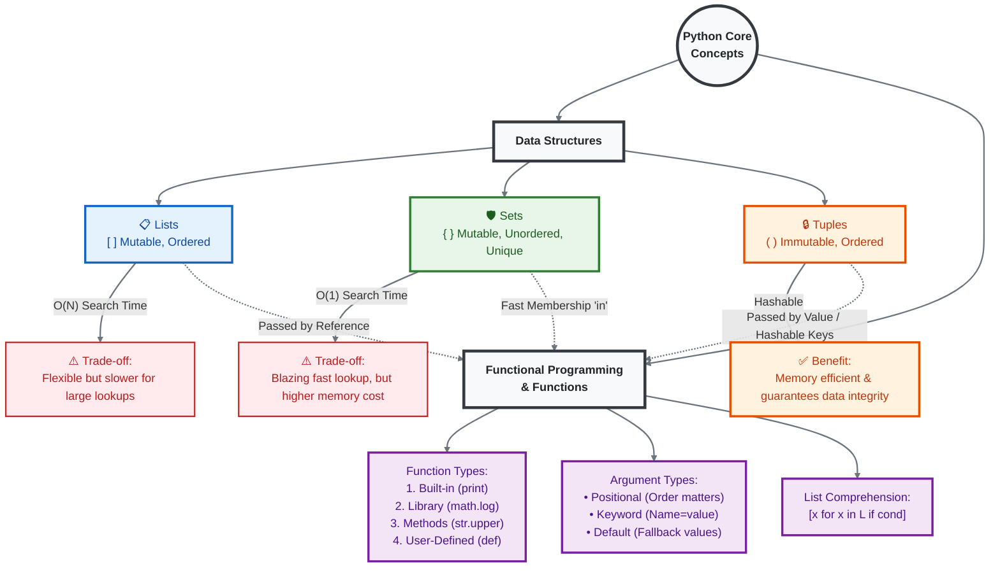
---
