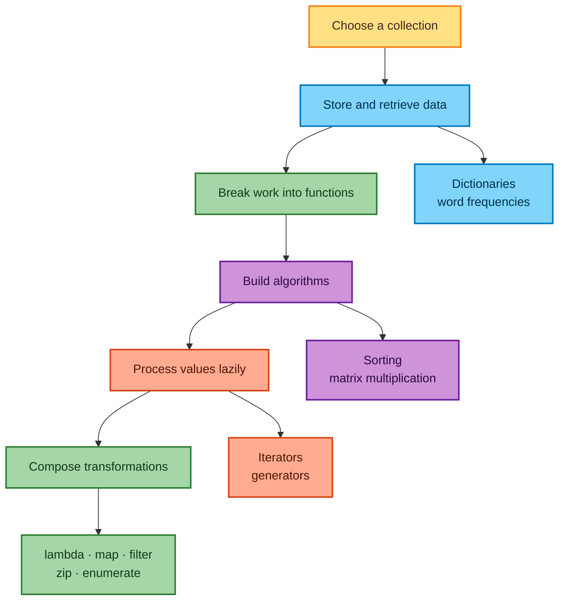
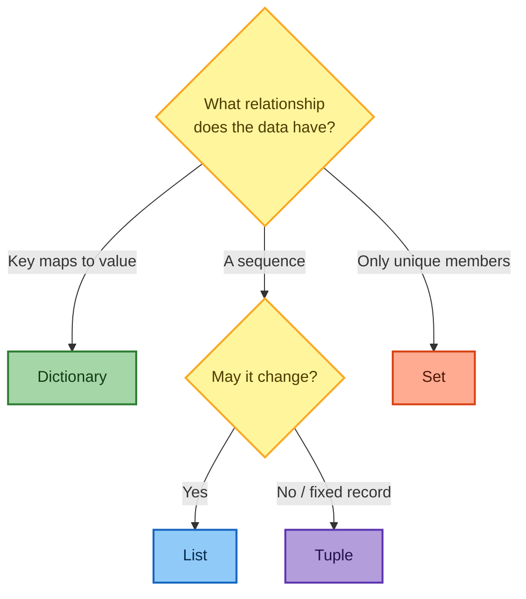
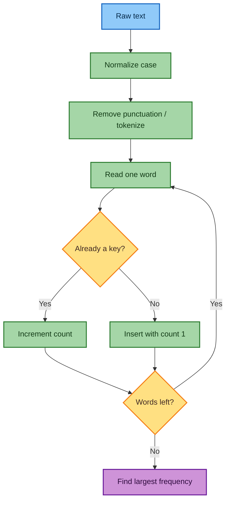
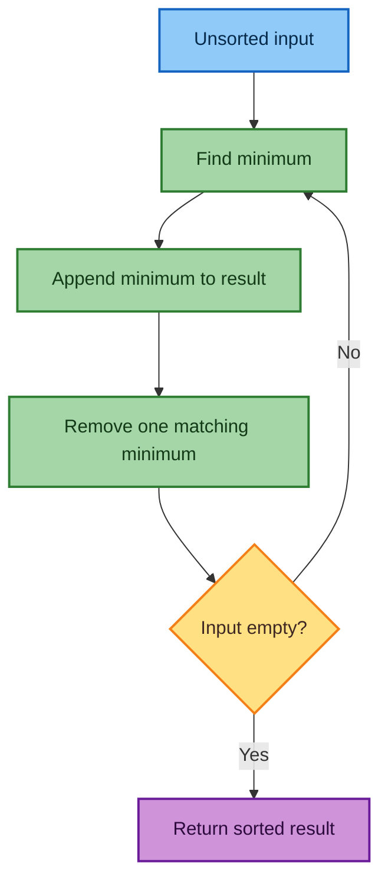
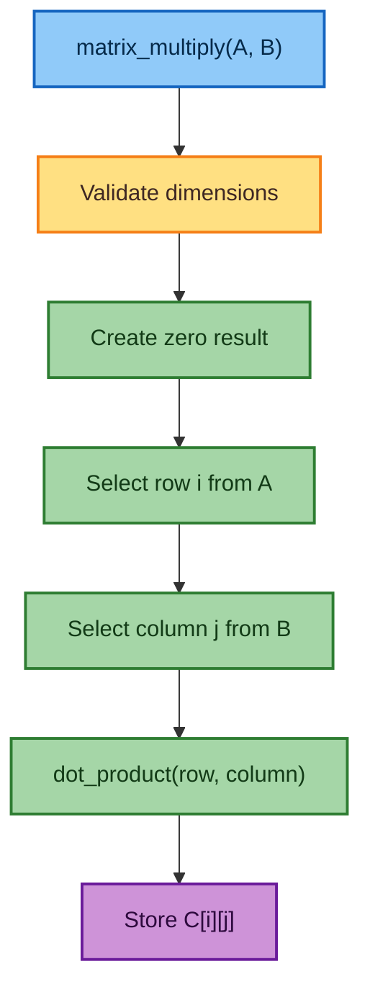
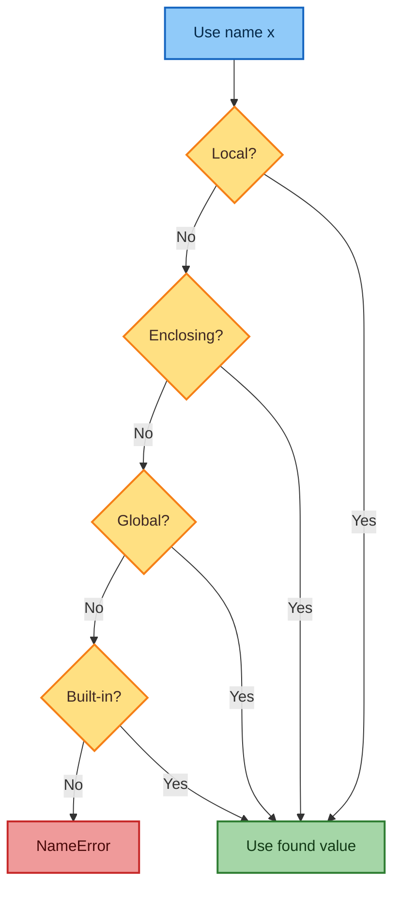
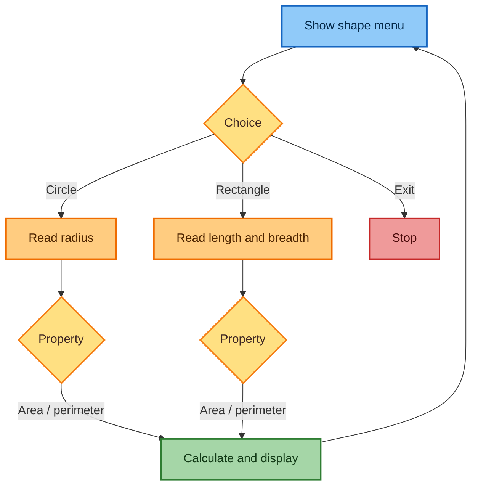
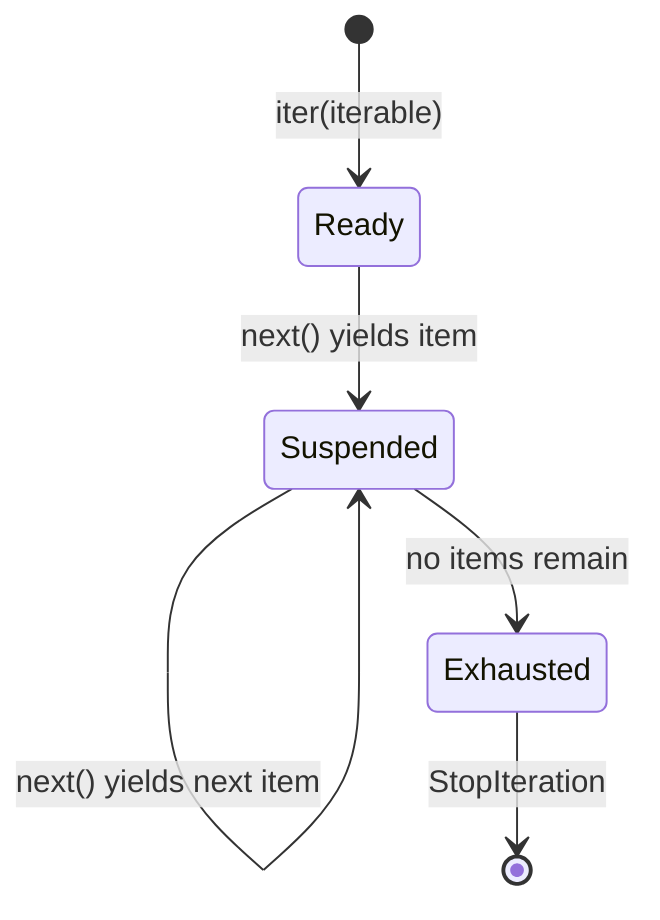
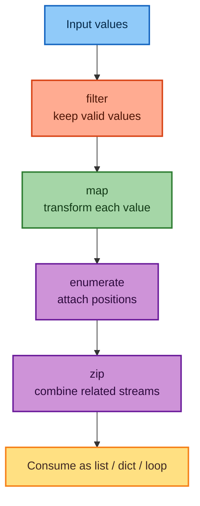

# Python Week 5: Collections, Functions, Matrices, Scope, Iterators, and Functional Tools

> Detailed notes reconstructed from the supplied Week 5 lecture transcripts and
> collection-summary slides. The examples have been cleaned up, commented, and
> updated for modern Python 3.

## Contents

1. [Learning map](#1-learning-map)
2. [Python collections refresher](#2-python-collections-refresher)
3. [Dictionaries in depth](#3-dictionaries-in-depth)
4. [Sorting using functions](#4-sorting-using-functions)
5. [Matrix multiplication](#5-matrix-multiplication)
6. [Scope of variables](#6-scope-of-variables)
7. [Tutorial applications of functions](#7-tutorial-applications-of-functions)
8. [Iterables, iterators, and generators](#8-iterables-iterators-and-generators)
9. [Functional-programming tools](#9-functional-programming-tools)
10. [Common mistakes and corrections](#10-common-mistakes-and-corrections)
11. [Practice questions](#11-practice-questions)
12. [Quick revision sheet](#12-quick-revision-sheet)
13. [Lecture source index](#13-lecture-source-index)

---

## 1. Learning map

This week connects data storage with program organization:



### What you should be able to do

After studying these notes, you should be able to:

- choose between a list, tuple, dictionary, and set;
- create, read, update, delete, and iterate through dictionaries;
- count word frequencies and find the most frequent word;
- decompose an algorithm into small reusable functions;
- implement selection-style sorting and matrix multiplication;
- explain local and global scope using Python's LEGB lookup rule;
- distinguish an iterable, an iterator, and a generator;
- use `lambda`, `enumerate`, `zip`, `map`, and `filter` correctly;
- recognize several subtle inaccuracies that commonly appear in beginner notes.

---

## 2. Python collections refresher

Python's four common built-in collections solve different storage problems.

### 2.1 Corrected comparison table

| Property | List | Tuple | Dictionary | Set |
|---|---|---|---|---|
| Literal notation | `[1, 2]` | `(1, 2)` | `{"name": "Anuj"}` | `{1, 2}` |
| Empty form | `[]` | `()` | `{}` | `set()` |
| Main idea | Ordered sequence | Fixed ordered sequence | Key → value mapping | Unique values |
| Mutable? | Yes | No | Yes | Yes |
| Elements | Any objects | Any objects | Keys must be hashable; values may be any objects | Elements must be hashable |
| Preserves insertion order? | Yes | Yes | Yes in Python 3.7+ | No positional-order guarantee |
| Duplicates | Allowed | Allowed | Duplicate keys overwrite; values may repeat | Removed |
| Indexing/slicing | Yes | Yes | By key, not position | No |
| Typical membership cost | $O(n)$ | $O(n)$ | Average $O(1)$ for keys | Average $O(1)$ |
| Best use | Changing sequence | Fixed record | Fast labeled lookup | Uniqueness and membership |

> **Important:** `{}` is an empty dictionary, not an empty set. Use `set()` for
> an empty set.

### 2.2 How to choose



### 2.3 Collection method cheat sheet

#### List methods

| Method | Purpose | Small example |
|---|---|---|
| `append(x)` | Add one item at the end | `a.append(5)` |
| `extend(iterable)` | Add every item from another iterable | `a.extend([5, 6])` |
| `insert(i, x)` | Insert before index `i` | `a.insert(0, "first")` |
| `remove(x)` | Remove the first equal value | `a.remove(5)` |
| `pop([i])` | Remove and return an item | `last = a.pop()` |
| `clear()` | Remove all items | `a.clear()` |
| `index(x)` | Return first matching index | `a.index(5)` |
| `count(x)` | Count equal values | `a.count(5)` |
| `sort()` | Sort the list in place | `a.sort()` |
| `reverse()` | Reverse in place | `a.reverse()` |
| `copy()` | Make a shallow copy | `b = a.copy()` |

#### Tuple methods

| Method | Purpose |
|---|---|
| `count(x)` | Count how often `x` occurs |
| `index(x)` | Return the first index containing `x` |

A tuple has few methods because it cannot be changed after creation.

#### Dictionary methods

| Method | Purpose |
|---|---|
| `clear()` | Remove all pairs |
| `copy()` | Make a shallow copy |
| `fromkeys(keys, value)` | Construct a dictionary from keys |
| `get(key, default)` | Read safely without a `KeyError` |
| `items()` | Dynamic view of `(key, value)` pairs |
| `keys()` | Dynamic view of keys |
| `pop(key[, default])` | Remove a key and return its value |
| `popitem()` | Remove and return the newest pair |
| `setdefault(key, default)` | Read a value, inserting a default if absent |
| `update(other)` | Add or overwrite pairs |
| `values()` | Dynamic view of values |

#### Set methods

| Category | Methods |
|---|---|
| Add/remove | `add`, `update`, `remove`, `discard`, `pop`, `clear` |
| New result | `union`, `intersection`, `difference`, `symmetric_difference`, `copy` |
| In-place update | `intersection_update`, `difference_update`, `symmetric_difference_update` |
| Relationship tests | `isdisjoint`, `issubset`, `issuperset` |

`remove(x)` raises `KeyError` when `x` is absent; `discard(x)` does nothing.

### 2.4 Hashability

A hashable object has a hash value that remains stable during its lifetime and
can therefore be used in a dictionary's hash table.

```python
# Valid dictionary keys: these values are hashable.
valid = {
    42: "integer",
    3.14: "float",
    True: "Boolean",
    "name": "string",
    (10, 20): "tuple containing only hashable values",
}

# Invalid: a list can change, so it is unhashable.
# invalid = {[10, 20]: "list"}  # TypeError: unhashable type: 'list'

# A tuple is hashable only when every item inside it is hashable.
hash((1, "A", (2, 3)))     # Works
# hash((1, [2, 3]))        # TypeError because the nested list is mutable
```

---

## 3. Dictionaries in depth

### 3.1 What is a dictionary?

A dictionary stores associations between unique **keys** and **values**:

```python
phone_book = {
    "Sudarshan": "9898989898",
    "Ramya": "1234512345",
    "Ravi": "1234567899",
}
```

Conceptually:

$$
\text{key} \longmapsto \text{value}
$$

Examples include:

- a name mapped to a phone number;
- a student ID mapped to marks;
- a word mapped to its frequency;
- a product ID mapped to its price and inventory;
- a graph vertex mapped to its neighboring vertices.

### 3.2 Why use a dictionary?

Suppose one billion identifiers are stored.

- A list search may inspect many elements: average/typical work grows with
  $n$, so membership is $O(n)$.
- A dictionary uses hashing and has average $O(1)$ key lookup.

This does **not** mean every lookup is literally one machine operation, and the
worst case can degrade. It means expected lookup time normally does not grow in
proportion to the number of stored pairs.

### 3.3 Create, read, update, and delete

```python
# CREATE
marks = {
    "Sudarshan": [93, 95, 99],
    "Ajit": [74, 63, 82],
    "Supriya": [81, 66, 90],
}

# READ using a key.
print(marks["Supriya"])       # [81, 66, 90]
print(marks["Supriya"][1])    # 66: the second mark

# UPDATE an existing key.
marks["Ajit"] = [76, 68, 84]

# ADD a new key-value pair.
marks["Anuj"] = [88, 91, 86]

# DELETE a pair.
removed_marks = marks.pop("Sudarshan")
print(removed_marks)          # [93, 95, 99]
```

Accessing an absent key with square brackets raises `KeyError`:

```python
# print(marks["IIT"])  # KeyError: 'IIT'

# Safe lookup:
print(marks.get("IIT"))                    # None
print(marks.get("IIT", "Student missing")) # Student missing
```

Use square brackets when absence is a programming error. Use `get` when absence
is expected and you have a meaningful default.

### 3.4 Iterating through a dictionary

```python
prices = {"apple": 120, "banana": 60, "mango": 150}

# Iterating over a dictionary directly produces its keys.
for fruit in prices:
    print(fruit)

# Explicit key iteration.
for fruit in prices.keys():
    print(fruit)

# Values only.
for price in prices.values():
    print(price)

# Key and value together; each item behaves like a two-value tuple.
for fruit, price in prices.items():
    print(f"{fruit}: ₹{price}/kg")
```

In modern Python, `keys()`, `values()`, and `items()` return **view objects**,
not lists. A view reflects later changes to the dictionary.

### 3.5 Word-frequency problem

For a sequence of words $w_1,w_2,\ldots,w_n$, the frequency of word $u$ is:

$$
f(u)=\sum_{i=1}^{n}\mathbf{1}(w_i=u)
$$

Here, $\mathbf{1}(\text{condition})$ equals 1 when the condition is true and 0
otherwise.



#### Clean one-pass implementation

```python
import re


def tokenize(text):
    """Return lowercase word tokens; apostrophes inside words are retained."""
    return re.findall(r"[A-Za-z]+(?:'[A-Za-z]+)?", text.lower())


def word_frequencies(words):
    """Map every distinct word to its number of occurrences."""
    frequencies = {}

    for word in words:
        # get(word, 0) gives 0 when the word has not appeared before.
        frequencies[word] = frequencies.get(word, 0) + 1

    return frequencies


def most_frequent_word(frequencies):
    """Return (word, count), or (None, 0) for an empty dictionary."""
    if not frequencies:
        return None, 0

    # key=frequencies.get tells max to compare words by their counts.
    word = max(frequencies, key=frequencies.get)
    return word, frequencies[word]


passage = """
It was Monday morning. It was difficult to enter the Monday mood,
and the thought of school was unpleasant.
"""

counts = word_frequencies(tokenize(passage))
word, count = most_frequent_word(counts)

print(counts)
print(f"Most frequent: {word!r}, appearing {count} times")
```

Time complexity:

- tokenization: $O(n)$ characters;
- counting: average $O(w)$ for $w$ tokens;
- finding the maximum: $O(u)$ for $u$ unique words;
- total: $O(n+w+u)$, effectively linear in the input size.

Space complexity is $O(u)$ because one dictionary entry is stored per unique
word.

#### Standard-library version

```python
from collections import Counter

words = tokenize(passage)
counts = Counter(words)

# most_common(1) returns a list containing the top (word, count) pair.
top = counts.most_common(1)
print(top)
```

`Counter` is a specialized dictionary for counting hashable objects.

### 3.6 Nested dictionaries produce clearer records

The lecture stores marks and an email in the same list. That works, but numeric
indices such as `[3]` are easy to forget. A nested dictionary gives each field
a name:

```python
students = {
    "Sudarshan": {
        "marks": {"physics": 93, "chemistry": 95, "mathematics": 99},
        "email": "sudarshan@example.com",
    },
    "Supriya": {
        "marks": {"physics": 81, "chemistry": 66, "mathematics": 90},
        "email": "supriya@example.com",
    },
}

print(students["Supriya"]["marks"]["chemistry"])  # 66
print(students["Supriya"]["email"])
```

### 3.7 Useful dictionary patterns

```python
# 1. Dictionary comprehension
squares = {number: number**2 for number in range(1, 6)}

# 2. Build from matching sequences
names = ["Asha", "Ben", "Chen"]
scores = [91, 85, 94]
score_by_name = dict(zip(names, scores))

# 3. Group several values under one key
groups = {}
for word in ["ant", "apple", "bat", "ball"]:
    first_letter = word[0]
    groups.setdefault(first_letter, []).append(word)

print(groups)  # {'a': ['ant', 'apple'], 'b': ['bat', 'ball']}

# 4. Merge/update
profile = {"name": "Anuj", "course": "Python"}
profile.update({"course": "Data Science", "city": "Aligarh"})
```

### 3.8 Fun facts

- Python dictionaries use a hash-table design and are heavily optimized because
  Python itself uses dictionaries for namespaces and object attributes.
- A dictionary has preserved insertion order as a language guarantee since
  Python 3.7.
- `1`, `1.0`, and `True` compare equal and have compatible hashes, so using all
  three as separate keys may surprise you.
- Values do not need to be hashable; a dictionary can store lists, sets, other
  dictionaries, functions, or custom objects as values.

---

## 4. Sorting using functions

### 4.1 What is the lecture's “obvious sort”?

The algorithm repeatedly:

1. finds the smallest remaining item;
2. appends it to a result list;
3. removes it from the working list;
4. continues until nothing remains.

It is a selection-style algorithm. The pedagogical goal is not to beat Python's
built-in sorting; it is to show **modular decomposition**.



### 4.2 Modular implementation

```python
def minimum_value(values):
    """Return the smallest value from a non-empty sequence."""
    if not values:
        raise ValueError("minimum_value() requires at least one item")

    smallest = values[0]

    for value in values[1:]:
        if value < smallest:
            smallest = value

    return smallest


def obvious_sort(values):
    """Return a sorted list without changing the caller's original list."""
    remaining = list(values)  # Defensive copy: removals affect only this copy.
    result = []

    while remaining:
        smallest = minimum_value(remaining)
        result.append(smallest)
        remaining.remove(smallest)  # Remove only one copy; duplicates are safe.

    return result


numbers = [90, 23, 97, 88, 5, 1, 23]
print(obvious_sort(numbers))  # [1, 5, 23, 23, 88, 90, 97]
print(numbers)                # Original input is unchanged.
```

Do not name a variable or function `min`, `max`, `list`, or `str`, because that
shadows a Python built-in with the same name.

### 4.3 Complexity

When there are $n$ items, the algorithm scans approximately:

$$
n+(n-1)+(n-2)+\cdots+1
=\frac{n(n+1)}{2}
$$

Therefore:

$$
T(n)=O(n^2)
$$

`list.remove` also shifts elements and can take $O(n)$, but the overall order
remains quadratic.

Python's `sorted()` and `list.sort()` use **Timsort**, whose usual worst-case
time is $O(n\log n)$ and which is highly optimized.

```python
numbers = [90, 23, 97, 88, 5, 1]

# sorted() creates a new list and accepts any iterable.
new_numbers = sorted(numbers)

# list.sort() changes the existing list and returns None.
numbers.sort(reverse=True)
```

### 4.4 Why functions help

| Benefit | Meaning in this algorithm |
|---|---|
| Decomposition | “Find minimum” and “build result” are separate jobs |
| Reuse | `minimum_value` can be used elsewhere |
| Testing | Each small function can be checked independently |
| Readability | The high-level algorithm resembles its English description |
| Maintenance | A bug in one step can be fixed in one place |

Use a helper function when an operation has a clear name, repeats, deserves its
own test, or makes the main algorithm easier to read.

---

## 5. Matrix multiplication

### 5.1 What does multiplication mean?

If:

$$
A\in\mathbb{R}^{m\times n}
\quad\text{and}\quad
B\in\mathbb{R}^{n\times p},
$$

then:

$$
C=AB\in\mathbb{R}^{m\times p}.
$$

The inner dimensions must match. The entry in row $i$, column $j$ is:

$$
C_{ij}
=\sum_{k=0}^{n-1}A_{ik}B_{kj}.
$$

In words: **row $i$ of $A$ dot column $j$ of $B$**.

### 5.2 Worked example

$$
A=
\begin{bmatrix}
1&2&3\\
4&5&6\\
7&8&9
\end{bmatrix},
\qquad
B=
\begin{bmatrix}
1&2&1\\
6&2&3\\
4&2&1
\end{bmatrix}.
$$

The first result entry is:

$$
C_{00}=1(1)+2(6)+3(4)=1+12+12=25.
$$

The complete product is:

$$
C=
\begin{bmatrix}
25&12&10\\
58&30&25\\
91&48&40
\end{bmatrix}.
$$

### 5.3 Direct triple-loop implementation

```python
def matrix_multiply_direct(a, b):
    """Multiply compatible rectangular matrices using three nested loops."""
    if not a or not b or not a[0] or not b[0]:
        raise ValueError("Matrices must be non-empty")

    a_rows = len(a)
    a_cols = len(a[0])
    b_rows = len(b)
    b_cols = len(b[0])

    # Reject ragged rows such as [[1, 2], [3]].
    if any(len(row) != a_cols for row in a):
        raise ValueError("Matrix A is ragged")
    if any(len(row) != b_cols for row in b):
        raise ValueError("Matrix B is ragged")

    if a_cols != b_rows:
        raise ValueError(
            f"Incompatible shapes: ({a_rows}, {a_cols}) and "
            f"({b_rows}, {b_cols})"
        )

    # C has one row per row of A and one column per column of B.
    c = [[0 for _ in range(b_cols)] for _ in range(a_rows)]

    for i in range(a_rows):          # Choose a row of A.
        for j in range(b_cols):      # Choose a column of B.
            for k in range(a_cols):  # Walk across the row/down the column.
                c[i][j] += a[i][k] * b[k][j]

    return c
```

For square $n\times n$ matrices, this classical algorithm performs $n^3$
multiplications and about $n^3$ additions:

$$
T(n)=O(n^3), \qquad \text{output space}=O(n^2).
$$

### 5.4 Functional decomposition



```python
def zero_matrix(rows, columns):
    """Create independent rows filled with zeros."""
    return [[0 for _ in range(columns)] for _ in range(rows)]


def matrix_row(matrix, row_index):
    """Return a copy of one row."""
    return list(matrix[row_index])


def matrix_column(matrix, column_index):
    """Return one column as a list."""
    return [row[column_index] for row in matrix]


def dot_product(u, v):
    """Return u·v; both vectors must have the same length."""
    if len(u) != len(v):
        raise ValueError("Dot-product vectors must have equal lengths")

    total = 0
    for left, right in zip(u, v):
        total += left * right
    return total


def matrix_multiply(a, b):
    """Multiply compatible rectangular matrices using helper functions."""
    if not a or not b or not a[0] or not b[0]:
        raise ValueError("Matrices must be non-empty")

    a_rows, a_cols = len(a), len(a[0])
    b_rows, b_cols = len(b), len(b[0])

    if any(len(row) != a_cols for row in a):
        raise ValueError("Matrix A is ragged")
    if any(len(row) != b_cols for row in b):
        raise ValueError("Matrix B is ragged")
    if a_cols != b_rows:
        raise ValueError("Columns of A must equal rows of B")

    result = zero_matrix(a_rows, b_cols)

    for i in range(a_rows):
        for j in range(b_cols):
            row = matrix_row(a, i)
            column = matrix_column(b, j)
            result[i][j] = dot_product(row, column)

    return result


A = [[1, 2, 3], [4, 5, 6], [7, 8, 9]]
B = [[1, 2, 1], [6, 2, 3], [4, 2, 1]]
print(matrix_multiply(A, B))
```

### 5.5 NumPy verification

Modern NumPy code should use arrays and `@`:

```python
import numpy as np

a = np.array(A)
b = np.array(B)
c = a @ b

print(c)
```

Avoid new code based on `numpy.matrix`; NumPy recommends regular
two-dimensional arrays. The `*` operator on arrays performs element-wise
multiplication, while `@` performs matrix multiplication.

### 5.6 Fun fact

The familiar $O(n^3)$ algorithm is not theoretically fastest. Algorithms such
as Strassen's reduce the exponent, while optimized numerical libraries use
careful cache access, vector instructions, parallelism, and hardware
accelerators. For normal data-science work, use a tested array library rather
than hand-written Python loops.

---

## 6. Scope of variables

### 6.1 What is scope?

Scope is the region in which a name can be resolved. Python generally searches
names using **LEGB**:

1. **L — Local:** current function;
2. **E — Enclosing:** outer function when functions are nested;
3. **G — Global:** module-level names;
4. **B — Built-in:** names such as `len`, `sum`, and `print`.



### 6.2 Rebinding an immutable argument

```python
def double(x):
    # x is a local name. Integers are immutable, so this rebinds local x.
    x = x * 2
    print("Inside:", x)


x = 5
print("Before:", x)  # 5
double(x)            # Inside: 10
print("After:", x)   # 5
```

The lecture calls this “call by value,” but Python is more accurately described
as **call by object sharing** or **call by assignment**:

- the function receives a reference to the same object;
- assigning the parameter to another object affects only the local name;
- mutating a shared mutable object can be visible to the caller.

### 6.3 Mutating a mutable argument

```python
def add_score(scores):
    # Both caller and parameter initially refer to the same list object.
    scores.append(95)  # Mutation is visible outside.


marks = [81, 88]
add_score(marks)
print(marks)  # [81, 88, 95]
```

Compare that with rebinding:

```python
def replace_scores(scores):
    # This points only the local name at a new list.
    scores = [100, 100]


marks = [81, 88]
replace_scores(marks)
print(marks)  # [81, 88]
```

### 6.4 Global variables

```python
x = 5


def double_global():
    global x
    x *= 2


def triple_global():
    global x
    x *= 3


double_global()
triple_global()
print(x)  # 30
```

`global x` tells Python that assignments to `x` inside the function target the
module-level name.

However, returning values is usually safer and easier to test:

```python
def double(value):
    return value * 2


def triple(value):
    return value * 3


x = 5
x = double(x)
x = triple(x)
print(x)  # 30
```

### 6.5 Enclosing scope and `nonlocal`

```python
def make_counter():
    count = 0

    def increment():
        nonlocal count  # Modify count from the enclosing function.
        count += 1
        return count

    return increment


counter = make_counter()
print(counter())  # 1
print(counter())  # 2
```

The inner function remembers its enclosing state. This combination is called a
**closure**.

---

## 7. Tutorial applications of functions

### 7.1 Text statistics

#### Problem

For an input string, count:

- uppercase letters;
- lowercase letters;
- all characters, including spaces and punctuation;
- words.

For a string $s$:

$$
U(s)=\sum_{c\in s}\mathbf{1}(c\text{ is uppercase}),
$$

$$
L(s)=\sum_{c\in s}\mathbf{1}(c\text{ is lowercase}).
$$

#### Robust implementation

```python
def count_uppercase(text):
    """Count Unicode uppercase characters."""
    count = 0
    for character in text:
        if character.isupper():
            count += 1
    return count


def count_lowercase(text):
    """Count Unicode lowercase characters."""
    count = 0
    for character in text:
        if character.islower():
            count += 1
    return count


def count_characters(text):
    """Count every code point, including spaces and punctuation."""
    return len(text)


def count_words(text):
    """Count whitespace-separated words robustly."""
    return len(text.split())


def text_statistics(text):
    """Combine the smaller functions into one labeled result."""
    return {
        "uppercase": count_uppercase(text),
        "lowercase": count_lowercase(text),
        "characters": count_characters(text),
        "words": count_words(text),
    }


sentence = "Functions could have no parameters."
print(text_statistics(sentence))
```

Why prefer `len(text.split())` over “number of spaces + 1”?

- `""` should contain zero words, not one;
- repeated spaces should not create imaginary words;
- tabs and newlines are also separators;
- leading/trailing spaces should not change the answer.

For linguistically exact tokenization, punctuation and languages without spaces
need more advanced tools; `split()` is a practical beginner definition.

### 7.2 Circle and rectangle calculations

#### Formulas

For radius $r$:

$$
\text{circle area}=\pi r^2,
\qquad
\text{circle perimeter}=2\pi r.
$$

For rectangle length $l$ and breadth $b$:

$$
\text{rectangle area}=lb,
\qquad
\text{rectangle perimeter}=2(l+b).
$$

```python
import math


def circle_area(radius):
    if radius < 0:
        raise ValueError("Radius cannot be negative")
    return math.pi * radius**2


def circle_perimeter(radius):
    if radius < 0:
        raise ValueError("Radius cannot be negative")
    return 2 * math.pi * radius


def rectangle_area(length, breadth):
    if length < 0 or breadth < 0:
        raise ValueError("Dimensions cannot be negative")
    return length * breadth


def rectangle_perimeter(length, breadth):
    if length < 0 or breadth < 0:
        raise ValueError("Dimensions cannot be negative")
    return 2 * (length + breadth)
```

Use `math.pi`, not `22 / 7`, when you want the library's more accurate
floating-point approximation of $\pi$.

#### Menu-driven control flow



The mathematical functions should remain independent of `input()` and
`print()`. Then a command-line menu, web page, notebook, or test suite can all
reuse the same logic.

### 7.3 Do three points form a triangle?

Let:

$$
P_1=(x_1,y_1),\quad P_2=(x_2,y_2),\quad P_3=(x_3,y_3).
$$

#### Distance approach from the lecture

The Euclidean distance between $P_i$ and $P_j$ is:

$$
d(P_i,P_j)
=\sqrt{(x_j-x_i)^2+(y_j-y_i)^2}.
$$

If the points are distinct, their three distances form a triangle when the sum
of the two smaller distances is strictly greater than the largest distance.

```python
import math


def distance(point_a, point_b):
    x1, y1 = point_a
    x2, y2 = point_b
    return math.hypot(x2 - x1, y2 - y1)


def is_triangle_by_distance(p1, p2, p3, tolerance=1e-12):
    sides = sorted([
        distance(p1, p2),
        distance(p2, p3),
        distance(p3, p1),
    ])

    # The smallest side must be positive, so duplicate points are rejected.
    return sides[0] > tolerance and sides[0] + sides[1] > sides[2] + tolerance
```

#### Better coordinate-area approach

Three points are collinear when the following determinant is zero:

$$
\Delta
=(x_2-x_1)(y_3-y_1)
-(y_2-y_1)(x_3-x_1).
$$

The triangle's area is:

$$
\text{Area}=\frac{1}{2}|\Delta|.
$$

Therefore, the points form a non-degenerate triangle when
$|\Delta|$ is greater than a small tolerance.

```python
def is_triangle(p1, p2, p3, tolerance=1e-12):
    """Return True when three 2D points are not collinear."""
    x1, y1 = p1
    x2, y2 = p2
    x3, y3 = p3

    twice_signed_area = (
        (x2 - x1) * (y3 - y1)
        - (y2 - y1) * (x3 - x1)
    )

    return abs(twice_signed_area) > tolerance


print(is_triangle((0, 0), (0, 1), (1, 0)))  # True
print(is_triangle((1, 1), (2, 2), (3, 3)))  # False
print(is_triangle((2, 3), (3, 2), (2, 3)))  # False
```

Why is this preferable to comparing slopes?

- vertical lines do not require infinity as a special case;
- there is no division by zero;
- it uses fewer operations;
- it naturally rejects duplicate points;
- it avoids directly comparing two floating-point slopes.

#### Same interface, different implementation

Both `is_triangle_by_distance(p1, p2, p3)` and
`is_triangle(p1, p2, p3)` accept the same kind of input and return a Boolean.
That is the idea of keeping an **interface** stable while improving the
**implementation**.

---

## 8. Iterables, iterators, and generators

### 8.1 Three related terms

| Term | Meaning | Examples |
|---|---|---|
| Iterable | Can produce an iterator | list, tuple, string, set, dictionary |
| Iterator | Remembers a position and returns one item at a time | `iter([1, 2])`, file object |
| Generator | A convenient way to create an iterator using `yield` | generator function/expression |

### 8.2 Manual iteration

```python
fruits = ["mango", "apple", "guava"]
basket = iter(fruits)

print(next(basket))  # mango
# Other work can happen here.
print(next(basket))  # apple
print(next(basket))  # guava

try:
    print(next(basket))
except StopIteration:
    print("The iterator is exhausted.")
```

A `for` loop performs this protocol automatically:

```python
iterator = iter(fruits)

while True:
    try:
        fruit = next(iterator)
    except StopIteration:
        break
    print(fruit)
```

### 8.3 Iterator state



### 8.4 Generator functions and `yield`

A normal function usually returns once. A generator:

1. runs until `yield`;
2. sends a value to the caller;
3. suspends while preserving local state;
4. resumes after the same `yield` on the next request.

```python
def squares_and_cubes(limit):
    """Yield square, then cube, for every integer from 0 to limit - 1."""
    x = 0

    while x < limit:
        yield x**2  # Suspend after producing the square.
        yield x**3  # Resume here and then suspend after the cube.
        x += 1


values = squares_and_cubes(3)
print(next(values))  # 0**2 = 0
print(next(values))  # 0**3 = 0
print(next(values))  # 1**2 = 1
print(next(values))  # 1**3 = 1
print(list(values))  # Remaining values: [4, 8]
```

### 8.5 Why and when generators help

- They process large or unbounded streams lazily.
- They avoid building the complete output list in memory.
- They model files, database rows, sensor readings, and batches naturally.
- They allow the consumer to decide when to request the next value.

If a list of $n$ generated items is stored, auxiliary memory is often $O(n)$.
A simple generator may hold only its current state, often $O(1)$ auxiliary
memory.

Generator expression:

```python
# No list of one million squares is created immediately.
squares = (number**2 for number in range(1_000_000))

first_five = [next(squares) for _ in range(5)]
print(first_five)  # [0, 1, 4, 9, 16]
```

Generators are usually one-pass. Once exhausted, create a new generator to
iterate again.

---

## 9. Functional-programming tools

The supplied transcript labels this sequence “Part 1” and “Part 3”; a “Part 2”
transcript was not included. The following notes cover only the supplied
material.

### 9.1 Lambda expressions

A lambda expression creates a small anonymous function:

```python
add = lambda x, y: x + y
subtract = lambda x, y: x - y
multiply = lambda x, y: x * y
divide = lambda x, y: x / y

print(add(10, 4))       # 14
print(subtract(10, 4))  # 6
```

General form:

```text
lambda parameter_1, parameter_2, ...: single_expression
```

Use a lambda for a short, local operation:

```python
students = [
    {"name": "Asha", "score": 91},
    {"name": "Ben", "score": 85},
    {"name": "Chen", "score": 94},
]

# Sort by the value stored under "score".
ranked = sorted(students, key=lambda student: student["score"], reverse=True)
```

Prefer `def` when logic needs multiple statements, annotations, a docstring,
reuse in several places, or a descriptive name.

### 9.2 `enumerate`

`enumerate(iterable, start=0)` couples each value with an index:

```python
fruits = ["mango", "apple", "guava", "orange"]

for index, fruit in enumerate(fruits):
    print(index, fruit)

# Begin human-facing numbering at 1.
for position, fruit in enumerate(fruits, start=1):
    print(f"{position}. {fruit}")
```

Each produced element is a tuple such as `(0, "mango")`.

### 9.3 `zip`

`zip` couples items at matching positions:

```python
fruits = ["mango", "watermelon", "kiwi"]
sizes = [5, 10, 4]

pairs = list(zip(fruits, sizes))
print(pairs)
# [('mango', 5), ('watermelon', 10), ('kiwi', 4)]

size_by_fruit = dict(zip(fruits, sizes))
print(size_by_fruit)
# {'mango': 5, 'watermelon': 10, 'kiwi': 4}
```

By default, `zip` stops when the shortest iterable is exhausted:

```python
print(list(zip([1, 2, 3], ["a", "b"])))
# [(1, 'a'), (2, 'b')]
```

On supported modern Python versions, use `strict=True` when unequal lengths
would indicate a bug:

```python
# list(zip([1, 2, 3], ["a", "b"], strict=True))  # Raises ValueError
```

### 9.4 `map`

`map(function, iterable, ...)` lazily applies a function to corresponding
values:

```python
def subtract(x, y):
    return x - y


a = [10, 20, 30]
b = [3, 5, 8]

differences = list(map(subtract, a, b))
print(differences)  # [7, 15, 22]

incremented = list(map(lambda number: number + 1, a))
print(incremented)  # [11, 21, 31]
```

Equivalent list comprehensions are often easier to read:

```python
differences = [left - right for left, right in zip(a, b)]
incremented = [number + 1 for number in a]
```

### 9.5 `filter`

`filter(predicate, iterable)` lazily keeps items for which the predicate is
truthy:

```python
import math

values = [25, -16, 9, -100, 81, 0]

non_negative = filter(lambda number: number >= 0, values)
roots = list(map(math.sqrt, non_negative))

print(roots)  # [5.0, 3.0, 9.0, 0.0]
```

The predicate should communicate a Boolean decision. Do not write `return n`
when you mean `return n >= 0`; returning `0` is falsy and would incorrectly
remove zero.

Equivalent comprehension:

```python
roots = [math.sqrt(number) for number in values if number >= 0]
```

### 9.6 Functional data pipeline



### 9.7 Eager versus lazy results

In Python 3:

- `enumerate`, `zip`, `map`, and `filter` return lazy iterable objects;
- calling them does not necessarily perform all work immediately;
- `list(...)`, `tuple(...)`, `dict(...)`, a `for` loop, or repeated `next()`
  consumes their results.

This saves memory, but an exhausted iterator does not restart automatically.

---

## 10. Common mistakes and corrections

| Mistake or oversimplification | Correct understanding |
|---|---|
| `{}` creates an empty set | It creates an empty dictionary; use `set()` |
| Dictionaries are unordered | They preserve insertion order in Python 3.7+ |
| `keys()`, `values()`, and `items()` return lists | They return dynamic view objects |
| Any tuple can be a dictionary key | Only a tuple whose contents are all hashable |
| Set elements can be any values | Set elements must be hashable |
| Tuples cannot be sorted | They cannot be sorted *in place*; `sorted(tuple)` returns a list |
| Dictionaries can simply be sorted | Their keys/items can be sorted to create a chosen iteration order |
| Python is call-by-value | “Call by object sharing/assignment” is more accurate |
| Reassigning an argument changes the caller | Rebinding is local; mutating a shared object may be visible |
| Word count equals spaces + 1 | This fails for empty/repeated/leading whitespace; use `split()` |
| `return n` is a good non-negative filter | Zero is falsy; return the Boolean `n >= 0` |
| `zip` requires equal lengths | It normally stops at the shortest; use `strict=True` to detect mismatch |
| A generator stores every future value | It computes lazily and preserves only suspended state |
| Use `numpy.matrix` and `*` | Prefer `numpy.array` and `@` for matrix multiplication |
| Comparing slopes is the easiest triangle test | A determinant/cross-product test avoids division and vertical-line cases |
| Name a variable `max` or `min` | This shadows the built-in functions |

### Dangerous zero-matrix aliasing

Do not create a matrix like this:

```python
# All three rows refer to the same inner list.
bad = [[0] * 3] * 3
bad[0][0] = 9
print(bad)  # [[9, 0, 0], [9, 0, 0], [9, 0, 0]]
```

Create independent rows:

```python
good = [[0] * 3 for _ in range(3)]
good[0][0] = 9
print(good)  # [[9, 0, 0], [0, 0, 0], [0, 0, 0]]
```

---

## 11. Practice questions

### Concept checks

1. Why can `(1, 2)` be a dictionary key but `(1, [2])` cannot?
2. What is the difference between `dictionary["x"]` and
   `dictionary.get("x")`?
3. Why is set membership usually faster than list membership for large data?
4. What does iterating directly over a dictionary produce?
5. What is the time complexity of the lecture's repeated-minimum sort?
6. For $A_{4\times 3}$ and $B_{3\times 2}$, what is the shape of $AB$?
7. In $C_{ij}=\sum_k A_{ik}B_{kj}$, which indices stay fixed while computing
   one entry?
8. Why does rebinding an integer parameter not change the caller's integer?
9. How can a function change a list supplied by the caller?
10. What happens when `next()` is called on an exhausted iterator?
11. What is the difference between `return` and `yield`?
12. Why can `list(zip(a, b))` contain fewer pairs than `len(a)`?
13. What value would a `filter` predicate returning `0` communicate?
14. Why is a determinant better than slopes for testing whether three points
    are collinear?
15. When is a list comprehension clearer than `map` or `filter`?

### Coding exercises

1. Write `invert_unique(d)` that swaps keys and values, rejecting duplicate
   values.
2. Count characters in a sentence while ignoring spaces and case.
3. Modify `obvious_sort` to sort from largest to smallest.
4. Write a function that checks matrix compatibility before multiplication.
5. Write a generator that yields Fibonacci numbers below a limit.
6. Use `enumerate` to print only the even-indexed items of a list.
7. Use `zip` to build a dictionary from student names and scores.
8. Use `filter` and `map` to square only the positive values in a sequence.

### Short answers

<details>
<summary>Show answers to the concept checks</summary>

1. The first tuple contains only hashable objects; the second contains a mutable,
   unhashable list.
2. Square-bracket lookup raises `KeyError` when absent; `get` returns `None` or a
   supplied default.
3. A set uses hashing for average $O(1)$ membership; a list normally scans in
   $O(n)$.
4. Keys.
5. $O(n^2)$.
6. $4\times2$.
7. $i$ and $j$ stay fixed; $k$ varies across the shared dimension.
8. Integers are immutable and assignment rebinds only the local parameter name.
9. By mutating the shared list, for example with `append`.
10. Python raises `StopIteration`.
11. `return` finishes a normal function; `yield` produces a value and suspends a
    generator's state.
12. Ordinary `zip` stops when its shortest input is exhausted.
13. Falsy, so that item is removed.
14. It avoids division, vertical-line special cases, and direct slope equality.
15. When the transformation/filter is simple and the comprehension reads more
    naturally.

</details>

---

## 12. Quick revision sheet

```python
# COLLECTIONS
sequence = [10, 20, 20]               # Ordered, mutable
fixed = (10, 20, 20)                  # Ordered, immutable
mapping = {"name": "Anuj", "score": 9} # Key -> value
unique = {10, 20}                     # Unique, hashable members

# DICTIONARY COUNTING
counts = {}
for item in sequence:
    counts[item] = counts.get(item, 0) + 1

# FUNCTION
def square(number):
    return number**2

# MATRIX ENTRY
# c[i][j] = sum(a[i][k] * b[k][j] for k in range(shared_dimension))

# SCOPE
# LEGB = Local -> Enclosing -> Global -> Built-in

# ITERATOR
iterator = iter(sequence)
first = next(iterator)

# GENERATOR
def countdown(start):
    while start > 0:
        yield start
        start -= 1

# FUNCTIONAL TOOLS
indexed = enumerate(sequence, start=1)
paired = zip(["a", "b"], [1, 2])
transformed = map(lambda x: x * 2, sequence)
selected = filter(lambda x: x > 10, sequence)
```

### One-sentence memory hooks

- **List:** “Keep an ordered sequence that may change.”
- **Tuple:** “Keep an ordered record that should stay fixed.”
- **Dictionary:** “Find a value by its meaningful key.”
- **Set:** “Keep unique members and test belonging quickly.”
- **Function:** “Give one job a name and reusable interface.”
- **Matrix product:** “Row from the left, column from the right.”
- **Scope:** “Python looks from local outward.”
- **Iterator:** “Remember where I stopped.”
- **Generator:** “Compute the next value only when requested.”
- **Map/filter:** “Transform values / keep selected values.”

---

## 13. Lecture source index

| Lecture | Topic | Supplied source |
|---|---|---|
| L5.1 | Dictionaries | <https://www.youtube.com/watch/X8Nj5cxaP9E> |
| L5.2 | More on Dictionaries | <https://www.youtube.com/watch/gTpPI3SMnAA> |
| L5.3 | Sorting using Functions | <https://www.youtube.com/watch/8MQBieBCRFA> |
| L5.4 | Matrix Multiplication — 1 | <https://www.youtube.com/watch/seYP1F6Ct2g> |
| L5.5 | Matrix Multiplication — 2 | <https://www.youtube.com/watch/mtRRS_ssl3s> |
| L5.6 | Matrix Multiplication using Functions | <https://www.youtube.com/watch/HJetH-CCOGY> |
| L5.7 | Scope of Variables | <https://www.youtube.com/watch/4q5rGHfR-ic> |
| L5.8 | Tutorial on Functions | <https://www.youtube.com/watch/mkAbfQM2OJY> |
| L5.9 | Functional Programming — Part 1 | <https://www.youtube.com/watch/29A7HhnzxPU> |
| L5.10 | Functional Programming — Part 3 | <https://www.youtube.com/watch/ueIignqReDY> |

> The transcript supplied no lecture titled “Functional Programming — Part 2.”
> These notes intentionally do not invent its contents.
