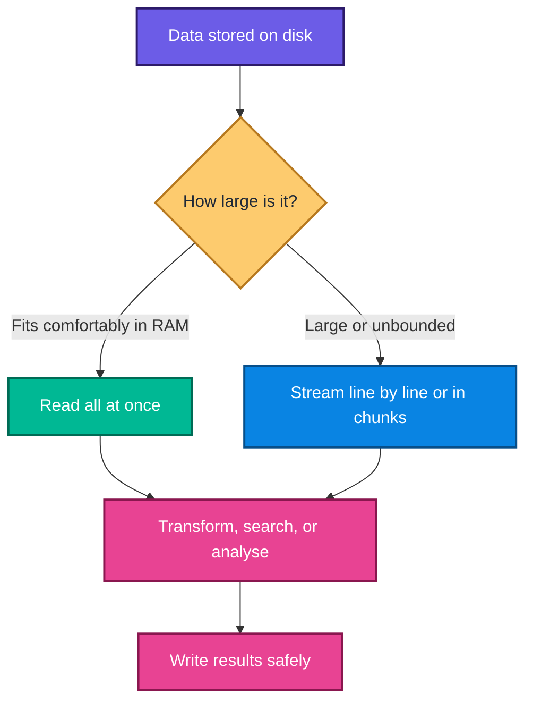
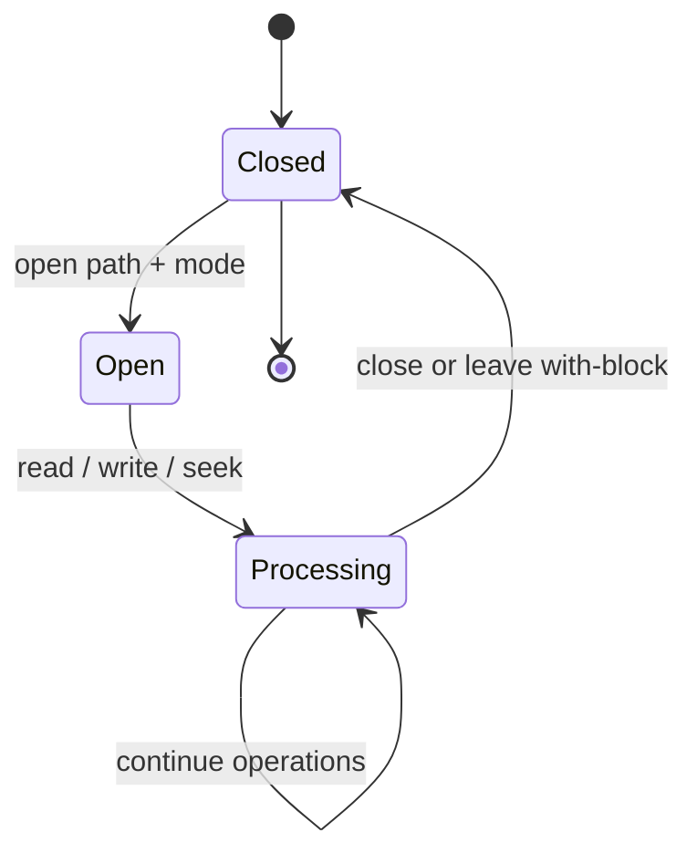
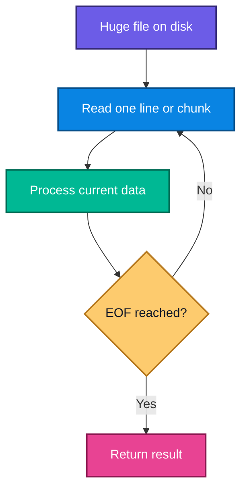
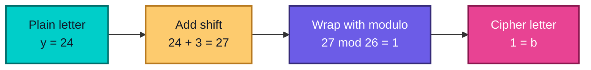
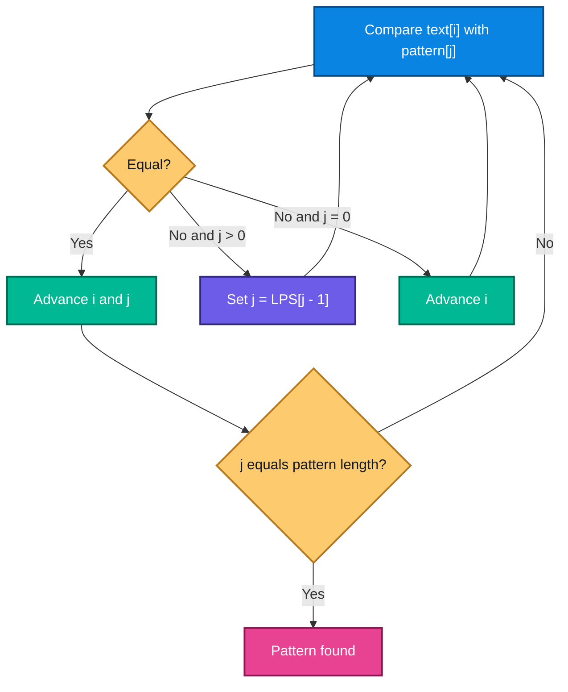
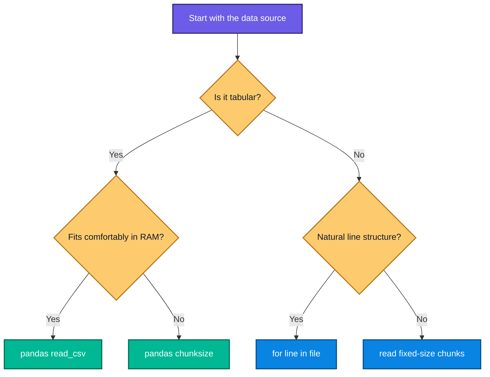

# Python File Handling: From First Principles to Large-File Search

## Source lectures

1. [Introduction to file handling — basics and pandas overview](https://www.youtube.com/watch/o5MBF0yo6lA)
2. [Reading and writing to a file — basics of file handling](https://www.youtube.com/watch/rYLJaAdgLhI)
3. [Big text-file handling — searching and error management](https://www.youtube.com/watch/9eOxi7smTKg)
4. [Very big files — a practical tip](https://www.youtube.com/watch/NwFpo_KGvOA)
5. [Caesar Cipher](https://www.youtube.com/watch/MkqFvnC2naE)
6. [File handling, genetic sequences, `seek()`, `read()`, and KMP](https://www.youtube.com/watch/df8FxNd27Dg)

---

## Table of contents

1. [Learning outcomes](#learning-outcomes)
2. [The big picture](#the-big-picture)
3. [Why file handling exists](#1-why-file-handling-exists)
4. [The lifecycle of a file](#2-the-lifecycle-of-a-file)
5. [Paths and the working directory](#3-paths-and-the-working-directory)
6. [Opening files and choosing a mode](#4-opening-files-and-choosing-a-mode)
7. [Writing text files](#5-writing-text-files)
8. [Reading text files](#6-reading-text-files)
9. [The file cursor: `tell()` and `seek()`](#7-the-file-cursor-tell-and-seek)
10. [End of file](#8-detecting-the-end-of-a-file)
11. [Processing very large files](#9-processing-very-large-files)
12. [Searching a large phone directory](#10-worked-example-searching-a-large-phone-directory)
13. [Handling file-related errors](#11-handling-file-related-errors)
14. [Caesar cipher with files](#12-worked-example-caesar-cipher-with-files)
15. [Genetic-sequence search](#13-genetic-sequence-search)
16. [KMP substring-search intuition](#14-knuthmorrispratt-kmp-substring-search)
17. [Bridge to pandas](#15-bridge-from-plain-files-to-pandas)
18. [Decision guide](#16-which-file-handling-technique-should-you-use)
19. [Common mistakes](#17-common-mistakes-and-how-to-fix-them)
20. [Practice tasks](#18-practice-tasks)
21. [Quick-reference cheat sheet](#19-quick-reference-cheat-sheet)
22. [Final takeaways](#20-final-takeaways)

---

## Learning outcomes

After studying these notes, you should be able to:

- explain why permanent storage is necessary even though RAM is faster;
- open, read, write, append to, and safely close text files in Python;
- distinguish `read()`, `read(n)`, `readline()`, and direct file iteration;
- understand that a file object maintains a changing cursor position;
- use `tell()` and `seek()` to inspect or reposition that cursor;
- recognize end of file correctly using the empty string `''`;
- process files much larger than the available RAM by streaming them;
- search a large line-oriented file without loading the whole file;
- handle common errors such as a missing file or invalid text encoding;
- encrypt and decrypt text using the Caesar-cipher formula;
- explain why naive substring search may be wasteful;
- understand the intuition and complexity of KMP;
- connect low-level file handling with chunked processing in pandas.

---

## The big picture



The central idea is simple:

> A file lets a program exchange data with persistent storage. The program does not need to keep the entire dataset in memory at once.

---

# 1. Why file handling exists

## 1.1 What is file handling?

**File handling** is the process of using a program to create, open, read, modify, write, append to, and close files stored on a persistent device.

A file may contain:

- plain text, such as `.txt`, `.csv`, or source code;
- structured data, such as JSON or XML;
- tabular data, such as CSV or Parquet;
- binary data, such as images, audio, video, or trained ML models.

The shared lectures focus mainly on **text files**, but the underlying open–process–close pattern also applies to many other formats.

## 1.2 Why not keep everything in variables?

Variables, lists, and strings normally live in **RAM** while a program runs. RAM is fast, but it has two important limitations:

1. **Capacity:** RAM is usually much smaller than permanent storage.
2. **Volatility:** ordinary RAM loses its contents when power is removed or the program ends.

A disk or solid-state drive is slower, but it stores far more data and retains that data between program executions.

### The kitchen and library analogies

| Computer concept | Kitchen analogy | Library analogy |
|---|---|---|
| RAM | Small kitchen shelf containing frequently used vessels | A few books kept on your personal shelf |
| Disk/SSD | Larger storage space containing rarely used vessels | A library containing thousands of books |
| Loading a file | Bringing a vessel into the kitchen | Borrowing a book |
| Saving a file | Returning an item to storage | Returning or cataloguing a book |

The trade-off is between **speed** and **capacity**.


## 1.3 Capacity and processing formulas

If a machine has memory capacity $M$ and a file has size $F$, reading the whole file at once is safe only when the program's total memory requirement stays comfortably below the available memory:

$$
F + M_{\text{program}} + M_{\text{overhead}} < M_{\text{available}}
$$

The in-memory representation can be larger than the file itself. For example, parsing CSV text into Python objects or a pandas DataFrame introduces extra structure and metadata.

If a file contains $N$ records and the program processes roughly $r$ records per second, a rough sequential-processing estimate is:

$$
T \approx \frac{N}{r}
$$

For a file of $F$ bytes read at effective throughput $v$ bytes per second:

$$
T_{\text{read}} \approx \frac{F}{v}
$$

These are idealized estimates. Disk speed, operating-system caching, decoding, Python overhead, and the work performed on each record also affect the actual time.

> **Precision note:** Storage vendors usually use decimal units, where $1\text{ TB}=1000\text{ GB}$. Binary units use $1\text{ TiB}=1024\text{ GiB}$. Therefore, “1 TB is exactly 1024 GB” is not universally correct.

### Fun fact

A media player does not usually load an entire multi-gigabyte movie into RAM. It buffers a manageable portion, decodes it, displays it, and continues reading—an everyday example of **streaming**.

---

# 2. The lifecycle of a file

Most file-handling tasks follow the same lifecycle:



The traditional style shown in the lecture is:

```python
file = open("example.txt", "r", encoding="utf-8")
content = file.read()
file.close()
```

Modern Python normally prefers a **context manager**:

```python
with open("example.txt", "r", encoding="utf-8") as file:
    content = file.read()

# The file is automatically closed here, even if an error occurred above.
```

## Why is closing important?

Closing a file:

- releases the operating-system resource associated with the file;
- flushes buffered output so it reaches storage;
- prevents accidental operations through a stale file handle;
- reduces the chance of incomplete output or locked files.

After `file.close()`, an operation such as `file.read()` raises `ValueError: I/O operation on closed file`.

---

# 3. Paths and the working directory

When Python receives a relative path such as `"notes.txt"`, it looks relative to the program's **current working directory**.

```python
from pathlib import Path

print(Path.cwd())  # Show the current working directory.
```

In IPython or Jupyter, a shell command may be prefixed with `!`:

```ipython
!pwd   # Common on Linux/macOS
!cd    # In Windows Command Prompt, cd without arguments shows the directory
```

However, `pathlib` is portable Python and is usually easier to reuse across operating systems.

```python
from pathlib import Path

data_path = Path("data") / "phone_directory.txt"

if data_path.exists():
    print(f"Found: {data_path.resolve()}")
else:
    print("The file does not exist at the expected location.")
```

### Relative versus absolute paths

| Path type | Example | Meaning |
|---|---|---|
| Relative | `data/names.txt` | Resolved from the current working directory |
| Absolute on Windows | `C:\\Users\\Anuj\\data\\names.txt` | Complete location starting from a drive |
| Absolute on Linux/macOS | `/home/anuj/data/names.txt` | Complete location starting from `/` |

---

# 4. Opening files and choosing a mode

The general form is:

```python
file_object = open(file_path, mode, encoding="utf-8")
```

## 4.1 Important modes

| Mode | Purpose | Must already exist? | Existing content preserved? | Initial cursor |
|---|---|---:|---:|---|
| `"r"` | Read text | Yes | Yes | Beginning |
| `"w"` | Write text | No | **No—truncated if it exists** | Beginning |
| `"a"` | Append text | No | Yes | Writes go to end |
| `"x"` | Create a new file | No | Fails rather than overwriting | Beginning |
| `"r+"` | Read and write | Yes | Yes | Beginning |
| `"w+"` | Read and write | No | **No—truncated if it exists** | Beginning |
| `"a+"` | Read and append | No | Yes | Writes go to end |

Add `b` for binary mode, for example `"rb"` or `"wb"`. Binary mode works with `bytes` rather than `str` and does not use a text encoding.

## 4.2 When should each mode be used?

- Use `"r"` when the file is an input and must not change.
- Use `"w"` when you deliberately want a fresh output file.
- Use `"a"` for logs or history where new data belongs at the end.
- Use `"x"` when accidental overwriting would be dangerous.
- Use a `+` mode only when reading and writing through the same handle is genuinely useful; cursor management becomes more important.

> **Critical warning:** Opening an existing file with `"w"` empties it immediately. If the old content matters, use `"a"`, create a separate output path, or make a backup.

---

# 5. Writing text files

## 5.1 Basic writing

```python
with open("my_text.txt", "w", encoding="utf-8") as file:
    file.write("Anuj ")
    file.write("IIT Madras ")
    file.write("Python ")
    file.write("India")
```

`write()` does not insert spaces or line breaks automatically. The exact characters supplied are written.

```python
with open("joined.txt", "w", encoding="utf-8") as file:
    file.write("first")
    file.write("second")

# File content: firstsecond
```

## 5.2 New lines with `\n`

The escape sequence `\n` represents a newline.

```python
with open("lines.txt", "w", encoding="utf-8") as file:
    file.write("This is the first line.\n")
    file.write("This is the second line.\n")
```

Result:

```text
This is the first line.
This is the second line.
```

## 5.3 Writing several lines

```python
names = ["Anuj", "Amit", "Lakshmi", "Ramya"]

with open("names.txt", "w", encoding="utf-8") as file:
    file.writelines(f"{name}\n" for name in names)
```

Despite its name, `writelines()` does **not** add line separators. They must be part of the strings.

## 5.4 What does `write()` return?

For a text file, `write(text)` returns the number of **characters accepted**, not a universal count of storage bytes.

```python
with open("count.txt", "w", encoding="utf-8") as file:
    count = file.write("Python")

print(count)  # 6 characters
```

For ASCII characters, the UTF-8 byte count happens to be the same as the character count. That is not true for every Unicode character.

```python
text = "हैलो"
print(len(text))                 # Number of Unicode code points
print(len(text.encode("utf-8"))) # Number of encoded bytes; may differ
```

## 5.5 Appending instead of replacing

```python
from datetime import datetime

with open("activity.log", "a", encoding="utf-8") as file:
    file.write(f"{datetime.now().isoformat()} - program started\n")
```

Use append mode for audit trails, application logs, and incremental results.

---

# 6. Reading text files

Python provides several reading strategies. The correct choice depends mainly on the file size and the structure of the data.

## 6.1 `read()` — read everything remaining

```python
with open("names.txt", "r", encoding="utf-8") as file:
    content = file.read()

print(type(content))  # <class 'str'>
print(content)
```

### When to use it

Use `read()` when:

- the file is known to be small;
- the entire text is needed at once;
- random string operations will be performed repeatedly.

Avoid it for a file whose size is close to or larger than available memory.

## 6.2 `read(n)` — read at most `n` characters

```python
with open("digits.txt", "r", encoding="utf-8") as file:
    first = file.read(2)
    second = file.read(2)
    third = file.read(2)

print(first, second, third)
```

Each call starts from the current cursor position. If `digits.txt` contains `0123456789`, the pieces are `01`, `23`, and `45`.

> In text mode, `n` is a character-oriented request. In binary mode, `read(n)` requests up to $n$ bytes.

## 6.3 `readline()` — read one line

```python
with open("names.txt", "r", encoding="utf-8") as file:
    first_line = file.readline()
    second_line = file.readline()

print(repr(first_line))   # The representation reveals a possible trailing \n.
print(repr(second_line))
```

`readline()` returns the newline character when it is present. To remove surrounding whitespace:

```python
clean_line = first_line.strip()
```

Use `rstrip("\n")` when only the final newline should be removed and other leading/trailing spaces are meaningful.

## 6.4 Direct iteration — the clearest line-by-line approach

```python
with open("names.txt", "r", encoding="utf-8") as file:
    for line_number, line in enumerate(file, start=1):
        name = line.rstrip("\n")
        print(line_number, name)
```

This is lazy and memory-efficient: Python produces lines as needed instead of constructing a list containing the entire file.

## 6.5 `readlines()` — read all lines into a list

```python
with open("names.txt", "r", encoding="utf-8") as file:
    lines = file.readlines()
```

This may be convenient for a small file, but its memory use grows with the whole input. Direct iteration is usually better for large files.

## Comparison

| Method | Returns | Memory pattern | Best use |
|---|---|---|---|
| `read()` | One string | Whole remaining file | Small files, whole-text work |
| `read(n)` | One string of up to `n` characters | Bounded chunk | Chunk processing |
| `readline()` | One line as a string | Roughly one line | Manual line control |
| `for line in file` | One line per iteration | Roughly one line | Normal large text files |
| `readlines()` | List of strings | Whole remaining file | Small files needing a list |

---

# 7. The file cursor: `tell()` and `seek()`

A file object maintains a **cursor**—the position at which the next read or write begins.

If `digits.txt` contains `0123456789`:

```python
with open("digits.txt", "r", encoding="utf-8") as file:
    print(file.read(2))  # 01
    print(file.read(2))  # 23
```

The second call does not repeat `01`; the first call advanced the cursor.

## 7.1 `tell()`

`tell()` reports an opaque position value suitable for returning to the same point later.

```python
with open("digits.txt", "r", encoding="utf-8") as file:
    print(file.tell())
    print(file.read(3))
    saved_position = file.tell()
    print(saved_position)
```

## 7.2 `seek()`

`seek(offset)` repositions the cursor.

```python
with open("digits.txt", "rb") as file:
    file.seek(4)
    print(file.read(2))  # b'45'

    file.seek(2)
    print(file.read(1))  # b'2'
```

Binary mode makes byte offsets unambiguous. In text mode, encodings and newline translation mean arbitrary numeric offsets are not always portable; positions previously returned by `tell()` are safe to reuse.

```python
with open("message.txt", "r", encoding="utf-8") as file:
    first_word = file.read(5)
    checkpoint = file.tell()
    later_text = file.read(20)

    file.seek(checkpoint)
    same_later_text = file.read(20)
```

### When is `seek()` useful?

- rereading a header;
- jumping to a known location in a fixed-format binary file;
- resuming from a stored checkpoint;
- inspecting selected sections without reopening the file.

### Performance precision

Seeking is not inherently a character-by-character linear scan. Modern operating systems and storage devices can often reposition efficiently. The true cost depends on buffering, the filesystem, the device, and the access pattern. Repeated random seeks can nevertheless be slower than one sequential scan, especially on mechanical disks.

---

# 8. Detecting the end of a file

At end of file, `read()` and `readline()` return the **empty string** `''` in text mode or `b''` in binary mode.

```python
with open("names.txt", "r", encoding="utf-8") as file:
    while True:
        line = file.readline()

        if line == "":  # Empty string means EOF.
            break

        print(line, end="")
```

This is not the same as a blank line:

- a blank line commonly reads as `"\n"`;
- end of file reads as `""`.

The lecture informally calls the EOF result “null,” but in Python it is specifically an **empty string**, not `None` and not a special null character.

The same loop can be written more clearly as:

```python
with open("names.txt", "r", encoding="utf-8") as file:
    for line in file:
        print(line, end="")
```

---

# 9. Processing very large files

Suppose a file contains billions of phone numbers and is $12\text{ GB}$ in size. A text editor may freeze because it tries to load, index, or render a large portion of the file. Python can still process it sequentially.

## 9.1 Whole-file versus streaming memory

Let:

- $F$ be the total file size;
- $C$ be the chosen chunk size;
- $L_{\max}$ be the longest line;
- $A$ be additional algorithm state.

Reading everything at once uses approximately:

$$
M_{\text{whole}} = O(F)
$$

Line-by-line processing uses approximately:

$$
M_{\text{line}} = O(L_{\max} + A)
$$

Fixed-size chunk processing uses approximately:

$$
M_{\text{chunk}} = O(C + A)
$$

The runtime of a required full sequential scan is normally:

$$
T(N) = O(N)
$$

where $N$ is the number of characters, bytes, or records examined. Streaming reduces **memory consumption**, not the fundamental amount of input that must be inspected.

## 9.2 Line-by-line streaming

```python
def count_nonempty_lines(path: str) -> int:
    count = 0

    with open(path, "r", encoding="utf-8") as file:
        for line in file:
            if line.strip():
                count += 1

    return count
```

## 9.3 Fixed-size chunk streaming

Chunking is useful when the file is not naturally line-oriented.

```python
def count_characters(path: str, chunk_size: int = 1024 * 1024) -> int:
    """Count text characters while holding about one chunk at a time."""
    total = 0

    with open(path, "r", encoding="utf-8") as file:
        while True:
            chunk = file.read(chunk_size)

            if chunk == "":
                break

            total += len(chunk)

    return total
```

If $F$ is the file size and $C$ is the chunk size, the approximate number of reads is:

$$
R = \left\lceil \frac{F}{C} \right\rceil
$$

A tiny chunk causes many Python-level operations. An enormous chunk consumes more memory. Values from a few kilobytes to a few megabytes are common starting points, but measurement should guide performance tuning.



### Fun fact

This “read a little, process it, discard it, repeat” pattern appears in log analytics, ETL pipelines, video playback, network servers, database cursors, and model training data loaders.

---

# 10. Worked example: searching a large phone directory

Assume `phone_directory.txt` contains one phone number per line.

## 10.1 Recommended solution

```python
from pathlib import Path


def find_phone_number(path: str | Path, target: str) -> tuple[bool, int | None]:
    """Return whether target occurs and its 1-based line number, if found."""
    target = target.strip()

    with open(path, "r", encoding="utf-8") as file:
        for line_number, line in enumerate(file, start=1):
            current_number = line.strip()

            if current_number == target:
                return True, line_number  # Stop early once a match is found.

    return False, None


found, line_number = find_phone_number(
    "phone_directory.txt",
    "0920214197",
)

if found:
    print(f"Number found on line {line_number}.")
else:
    print("Number not found.")
```

## 10.2 Why keep phone numbers as strings?

Phone numbers are identifiers, not quantities. Integer conversion can:

- remove leading zeros;
- make international `+` prefixes invalid;
- reject spaces or formatting characters;
- tempt us to perform meaningless arithmetic.

Therefore, compare normalized strings unless the data specification explicitly requires something else.

## 10.3 Algorithm analysis

If there are $N$ lines, the worst-case time complexity is:

$$
T(N)=O(N)
$$

If the match appears early, the function returns early. The extra memory use remains approximately:

$$
M=O(L_{\max})
$$

because only the current line and small fixed state are needed.

## 10.4 When repeated searches require a better design

A linear scan is appropriate for one or a few searches. For thousands of queries against an unchanged file, repeatedly scanning the entire file is inefficient. Consider:

- loading manageable data into a `set` for average $O(1)$ membership checks;
- sorting once and using binary search for $O(\log N)$ lookup;
- importing the data into SQLite and indexing the phone-number column;
- building a dedicated disk-based index.

The engineering lesson is that the best method depends on both **data size** and **query frequency**.

---

# 11. Handling file-related errors

File operations interact with the operating system and external data, so failures are normal possibilities rather than exceptional surprises.

```python
from pathlib import Path


def print_file(path: str | Path) -> None:
    try:
        with open(path, "r", encoding="utf-8") as file:
            for line in file:
                print(line, end="")

    except FileNotFoundError:
        print(f"File not found: {path}")

    except PermissionError:
        print(f"Permission denied: {path}")

    except UnicodeDecodeError:
        print("The file is not valid UTF-8 text. Check its encoding or open it in binary mode.")

    except OSError as error:
        print(f"Operating-system error: {error}")
```

## Common exceptions

| Exception | Typical cause | Response |
|---|---|---|
| `FileNotFoundError` | Wrong path or missing input | Verify the working directory and path |
| `PermissionError` | Insufficient access or locked resource | Check permissions and whether another program owns the file |
| `IsADirectoryError` | A directory path was passed to `open()` | Supply a file path |
| `UnicodeDecodeError` | Incorrect text encoding | Use the correct encoding or inspect bytes |
| `ValueError` | Operation on a closed file or invalid mode | Keep work inside the `with` block and check the mode |
| `OSError` | General device/filesystem problem | Inspect the specific error message |

## The transcript’s `int('')` error

At EOF, `readline()` returns `''`. Therefore this fails:

```python
number = int("")  # ValueError
```

Always test for EOF before conversion:

```python
with open("numbers.txt", "r", encoding="utf-8") as file:
    while True:
        text = file.readline()

        if text == "":
            break

        number = int(text.strip())
        print(number)
```

If malformed records may appear, validate each line separately rather than treating all conversion failures as EOF.

---

# 12. Worked example: Caesar cipher with files

## 12.1 What is the Caesar cipher?

The Caesar cipher replaces each alphabetic character with another character a fixed number of positions away. With a shift of $k=3$:

```text
a → d    b → e    c → f    ...    x → a    y → b    z → c
```

Map letters to indices:

$$
a\mapsto0,\ b\mapsto1,\ \ldots,\ z\mapsto25
$$

For plaintext index $x$, encryption is:

$$
E_k(x)=(x+k)\bmod 26
$$

Decryption is:

$$
D_k(y)=(y-k)\bmod 26
$$

### Why modulo 26?

Modulo performs the wrap-around. For `y`, $x=24$ and $k=3$:

$$
E_3(24)=(24+3)\bmod 26=27\bmod 26=1
$$

Index $1$ is `b`, so `y → b`.



## 12.2 Build the lowercase mapping used in the lecture

```python
import string


def create_caesar_dictionary(shift: int = 3) -> dict[str, str]:
    letters = string.ascii_lowercase

    return {
        letters[index]: letters[(index + shift) % len(letters)]
        for index in range(len(letters))
    }


mapping = create_caesar_dictionary(3)
print(mapping["a"])  # d
print(mapping["y"])  # b
print(mapping["z"])  # c
```

## 12.3 Stream an input file character by character

This version stays close to the lecture while safely preserving characters that are not lowercase ASCII letters.

```python
def encrypt_file_characterwise(
    input_path: str,
    output_path: str,
    shift: int = 3,
) -> None:
    mapping = create_caesar_dictionary(shift)

    with (
        open(input_path, "r", encoding="utf-8") as source,
        open(output_path, "w", encoding="utf-8") as destination,
    ):
        while True:
            character = source.read(1)

            if character == "":  # EOF
                break

            destination.write(mapping.get(character, character))
```

`mapping.get(character, character)` means:

- replace the character if it exists in the mapping;
- otherwise preserve it unchanged.

Without this protection, spaces, punctuation, uppercase letters, and newlines would raise `KeyError` when used as dictionary keys.

## 12.4 A reusable version that handles both cases

```python
def shift_character(character: str, shift: int) -> str:
    if "a" <= character <= "z":
        start = ord("a")
        return chr((ord(character) - start + shift) % 26 + start)

    if "A" <= character <= "Z":
        start = ord("A")
        return chr((ord(character) - start + shift) % 26 + start)

    return character


def transform_file(
    input_path: str,
    output_path: str,
    shift: int,
    chunk_size: int = 64 * 1024,
) -> None:
    """Shift alphabetic characters while streaming bounded chunks."""
    with (
        open(input_path, "r", encoding="utf-8") as source,
        open(output_path, "w", encoding="utf-8") as destination,
    ):
        while True:
            chunk = source.read(chunk_size)

            if chunk == "":
                break

            transformed = "".join(
                shift_character(character, shift)
                for character in chunk
            )
            destination.write(transformed)


# Encrypt using +3.
transform_file("sherlock.txt", "encrypted_sherlock.txt", shift=3)

# Decrypt using -3.
transform_file("encrypted_sherlock.txt", "decrypted_sherlock.txt", shift=-3)
```

Correctness follows from modular arithmetic:

$$
D_k(E_k(x))=((x+k)-k)\bmod 26=x
$$

## 12.5 Complexity

For $N$ characters:

$$
T(N)=O(N)
$$

For chunk size $C$:

$$
M(N)=O(C)
$$

## 12.6 Security limitation

The Caesar cipher is useful for learning mappings, loops, modulo, and file streaming, but it is **not secure encryption**. There are only 26 possible shifts, so an attacker can try every key almost instantly.

### Fun fact

With English text, even without trying all shifts, letter-frequency patterns can often reveal the key. Real cryptography relies on rigorously analysed algorithms and large secret-key spaces.

---

# 13. Genetic-sequence search

DNA sequences are commonly represented with the symbols `A`, `C`, `G`, and `T`. This makes genome data a natural motivation for substring search.

```python
sequence = "ACGTACGTAAAACG"
pattern = "GTAAAA"

print(pattern in sequence)  # True
print(sequence.find(pattern))  # Starting index, or -1 if absent
```

## Important scientific caution

The lecture uses disease-associated substrings as an intuition-building example. Real genetic risk is much more complex:

- many traits are influenced by numerous variants;
- environment and lifestyle may interact with genetic factors;
- sequencing and variant interpretation require specialised pipelines;
- finding a short substring is not enough to diagnose a disease.

Treat the example as a **computer-science search problem**, not a medical diagnostic method.

## Finding the longest run of one base

The transcript explores whether 11 or 12 consecutive `A` characters occur. A streaming solution does not need the complete sequence:

```python
def longest_run(path: str, base: str = "A") -> int:
    base = base.upper()
    current = 0
    longest = 0

    with open(path, "r", encoding="utf-8") as file:
        for chunk in iter(lambda: file.read(1024 * 1024), ""):
            for character in chunk.upper():
                if character == base:
                    current += 1
                    longest = max(longest, current)
                elif character in {"A", "C", "G", "T"}:
                    current = 0
                # Ignore formatting such as newlines without breaking the run.

    return longest
```

## The chunk-boundary trap

Suppose one chunk ends with `GTAA` and the next begins with `AAC`. The pattern `GTAAAAC` crosses the boundary. Searching each chunk independently would miss it.

Solutions include:

- retaining an overlap of the last $m-1$ characters, where $m$ is pattern length;
- carrying algorithm state from one chunk to the next;
- using a streaming method such as KMP.

---

# 14. Knuth–Morris–Pratt (KMP) substring search

The transcript names KMP as an ingenious algorithm for finding a smaller pattern inside a large string. Here is the intuition.

## 14.1 The weakness of naive search

Let the text have length $n$ and the pattern have length $m$. A naive method may begin a comparison at many text positions and recheck characters after a mismatch.

Worst-case time:

$$
T_{\text{naive}}(n,m)=O(nm)
$$

KMP learns how much of the pattern is still useful after a mismatch. It avoids moving the text cursor backwards.

## 14.2 The LPS array

KMP preprocesses the pattern into an **LPS array**: Longest Proper Prefix which is also a Suffix.

For each pattern prefix ending at position $i$:

$$
\operatorname{LPS}[i]
=
\max\left\{
k:
0\le k<i+1
\text{ and }
P[0:k]=P[i-k+1:i+1]
\right\}
$$

“Proper” means the prefix cannot be the entire substring itself.

Example pattern: `ABABCABAB`

| Index $i$ | Character | Pattern prefix | `LPS[i]` |
|---:|:---:|---|---:|
| 0 | A | A | 0 |
| 1 | B | AB | 0 |
| 2 | A | ABA | 1 |
| 3 | B | ABAB | 2 |
| 4 | C | ABABC | 0 |
| 5 | A | ABABCA | 1 |
| 6 | B | ABABCAB | 2 |
| 7 | A | ABABCABA | 3 |
| 8 | B | ABABCABAB | 4 |

If a mismatch occurs after matching `ABAB`, the LPS value says that the suffix `AB` is also a valid prefix. KMP continues from that knowledge instead of restarting from zero.



## 14.3 Build the LPS array

```python
def build_lps(pattern: str) -> list[int]:
    lps = [0] * len(pattern)
    prefix_length = 0
    index = 1

    while index < len(pattern):
        if pattern[index] == pattern[prefix_length]:
            prefix_length += 1
            lps[index] = prefix_length
            index += 1

        elif prefix_length > 0:
            # Reuse the next-shorter valid prefix; do not advance index yet.
            prefix_length = lps[prefix_length - 1]

        else:
            lps[index] = 0
            index += 1

    return lps
```

## 14.4 Standard KMP search

```python
def kmp_find(text: str, pattern: str) -> int:
    """Return the first match index, or -1 if the pattern is absent."""
    if pattern == "":
        return 0

    lps = build_lps(pattern)
    text_index = 0
    pattern_index = 0

    while text_index < len(text):
        if text[text_index] == pattern[pattern_index]:
            text_index += 1
            pattern_index += 1

            if pattern_index == len(pattern):
                return text_index - pattern_index

        elif pattern_index > 0:
            pattern_index = lps[pattern_index - 1]

        else:
            text_index += 1

    return -1
```

## 14.5 Streaming KMP across file chunks

This form keeps `pattern_index` between chunks, so it detects matches that cross chunk boundaries.

```python
def file_contains_kmp(
    path: str,
    pattern: str,
    chunk_size: int = 1024 * 1024,
) -> bool:
    if pattern == "":
        return True

    lps = build_lps(pattern)
    pattern_index = 0

    with open(path, "r", encoding="utf-8") as file:
        while True:
            chunk = file.read(chunk_size)

            if chunk == "":
                return False

            for character in chunk:
                while (
                    pattern_index > 0
                    and character != pattern[pattern_index]
                ):
                    pattern_index = lps[pattern_index - 1]

                if character == pattern[pattern_index]:
                    pattern_index += 1

                    if pattern_index == len(pattern):
                        return True
```

## 14.6 KMP complexity

LPS preprocessing takes $O(m)$ time and $O(m)$ memory. Searching takes $O(n)$ time.

$$
T_{\text{KMP}}(n,m)=O(n+m)
$$

$$
M_{\text{KMP}}(m)=O(m)
$$

KMP is valuable when:

- the pattern can contain repeated prefixes;
- worst-case linear search time matters;
- input arrives as a stream;
- the text is too large to load into memory.

For normal in-memory Python strings, `pattern in text` and `text.find(pattern)` are written in optimized native code and should usually be preferred unless implementing KMP is itself the learning objective or strict algorithmic guarantees are required.

---

# 15. Bridge from plain files to pandas

The transcripts introduce pandas as the next tool for data science. Low-level file handling and pandas solve related but different problems:

- plain `open()` gives precise control over text or bytes;
- pandas parses structured tables into labelled rows and columns;
- pandas can also stream a large CSV in chunks.

## Read a manageable CSV

```python
import pandas as pd

data = pd.read_csv("students.csv")
print(data.head())
print(data.info())
```

## Process a large CSV in chunks

```python
import pandas as pd

rows_per_chunk = 100_000
total_at_risk = 0

for chunk in pd.read_csv("students.csv", chunksize=rows_per_chunk):
    total_at_risk += chunk["health_condition"].eq("at-risk").sum()

print(total_at_risk)
```

If the file contains $N$ rows and each chunk contains $C$ rows, pandas processes approximately:

$$
\left\lceil\frac{N}{C}\right\rceil
$$

chunks.

### When plain Python is preferable

- the input is not tabular;
- exact byte or character control is required;
- only a simple streaming transformation is needed;
- the data format is custom.

### When pandas is preferable

- the input represents columns and rows;
- filtering, grouping, aggregation, joining, or missing-value handling is needed;
- a DataFrame-based data-science workflow follows.

---

# 16. Which file-handling technique should you use?



| Situation | Recommended starting point | Reason |
|---|---|---|
| Small configuration file | `read()` | Simple and fully available as a string |
| Large log file | `for line in file` | Natural streaming by record |
| Huge unbroken text or binary stream | `read(chunk_size)` | Bounded memory |
| One exact phone-number lookup | One sequential line scan | Simple, early exit possible |
| Many lookups in unchanged data | Database or index | Avoid repeated full scans |
| Character substitution | Chunked read and write | Efficient bounded-memory transformation |
| Pattern search across chunks | Stateful KMP or overlap | Prevent missed boundary matches |
| Manageable CSV analysis | `pandas.read_csv()` | Convenient tabular operations |
| Oversized CSV analysis | `pandas.read_csv(..., chunksize=...)` | DataFrame operations with bounded batches |

---

# 17. Common mistakes and how to fix them

## Mistake 1: Using `"w"` on an important existing file

**Problem:** The original content is erased.

**Fix:** Use `"a"`, `"x"`, or a new output filename as appropriate.

## Mistake 2: Forgetting to close the file

**Problem:** Resources remain open and buffered writes may not be finalized promptly.

**Fix:** Use `with open(...) as file:`.

## Mistake 3: Expecting `write()` to add spaces or newlines

**Problem:** Words or lines run together.

**Fix:** Include spaces and `\n` explicitly.

## Mistake 4: Calling `read()` repeatedly and expecting the same content

**Problem:** The cursor has moved; later calls read later content or return `''`.

**Fix:** Understand the cursor, reopen the file, or use `seek()` appropriately.

## Mistake 5: Treating EOF as `None`

**Problem:** The loop does not stop as expected.

**Fix:** Check for `''` in text mode or simply iterate over the file.

## Mistake 6: Converting EOF to an integer

**Problem:** `int('')` raises `ValueError`.

**Fix:** Check for EOF before parsing.

## Mistake 7: Loading a huge file with `read()` or `readlines()`

**Problem:** Excess memory use, swapping, or process failure.

**Fix:** Stream lines or bounded chunks.

## Mistake 8: Searching chunks independently

**Problem:** A match split between two chunks is missed.

**Fix:** Keep an overlap or preserve KMP state.

## Mistake 9: Assuming a text-file offset always equals a character index

**Problem:** Variable-width encodings make arbitrary text seeks unreliable.

**Fix:** Reuse values from `tell()` or use binary mode for exact byte offsets.

## Mistake 10: Using Caesar cipher as real security

**Problem:** It is trivially breakable.

**Fix:** Use established cryptographic libraries and modern authenticated encryption for actual security.

---

# 18. Practice tasks

## Task 1 — Write and read a profile

Create `profile.txt` containing your name, city, course, and one goal on separate lines. Read it back and print each field with a line number.

<details>
<summary>Suggested solution</summary>

```python
details = [
    "Name: Anuj Chaudhary",
    "City: Aligarh",
    "Course: BS in Data Science and Applications",
    "Goal: Build strong data-science fundamentals",
]

with open("profile.txt", "w", encoding="utf-8") as file:
    file.write("\n".join(details) + "\n")

with open("profile.txt", "r", encoding="utf-8") as file:
    for number, line in enumerate(file, start=1):
        print(f"{number}: {line.rstrip()}")
```

</details>

## Task 2 — Compare write and append

Write one line with `"w"`, append two lines with `"a"`, and verify that all three remain. Then open the file with `"w"` once more and observe what happens.

## Task 3 — Search without a flag variable

Search a large file and return immediately when the target is found. Compare this with a `flag = 0` / `flag = 1` approach.

<details>
<summary>Suggested solution</summary>

```python
def contains_line(path: str, target: str) -> bool:
    with open(path, "r", encoding="utf-8") as file:
        return any(line.strip() == target for line in file)
```

</details>

## Task 4 — Count selected DNA bases

Stream a DNA file and count `A`, `C`, `G`, and `T` without loading the entire sequence.

<details>
<summary>Suggested solution</summary>

```python
from collections import Counter


def count_bases(path: str) -> Counter:
    counts = Counter()

    with open(path, "r", encoding="utf-8") as file:
        for chunk in iter(lambda: file.read(1024 * 1024), ""):
            counts.update(
                character
                for character in chunk.upper()
                if character in {"A", "C", "G", "T"}
            )

    return counts
```

</details>

## Task 5 — Decrypt the Caesar file

Use a shift of $-3$ on the encrypted file and verify that it reproduces the original text.

For a strong verification, compare the two files:

```python
from pathlib import Path

original = Path("sherlock.txt").read_text(encoding="utf-8")
decrypted = Path("decrypted_sherlock.txt").read_text(encoding="utf-8")

print(original == decrypted)
```

## Task 6 — Demonstrate a chunk-boundary match

Use the text `ABCDEFGHIJ`, pattern `DEFG`, and a chunk size of 5. Show that independent per-chunk search fails, then verify that streaming KMP succeeds.

## Task 7 — Build a CSV chunk summary

Process a large CSV with pandas `chunksize` and accumulate the number of records in each class without concatenating all chunks.

---

# 19. Quick-reference cheat sheet

```python
# Safely read an entire small text file.
with open("input.txt", "r", encoding="utf-8") as file:
    text = file.read()

# Stream a text file line by line.
with open("input.txt", "r", encoding="utf-8") as file:
    for line in file:
        process(line)

# Stream fixed-size text chunks.
with open("input.txt", "r", encoding="utf-8") as file:
    for chunk in iter(lambda: file.read(1024 * 1024), ""):
        process(chunk)

# Replace/create a file.
with open("output.txt", "w", encoding="utf-8") as file:
    file.write("new content\n")

# Append to a file.
with open("output.txt", "a", encoding="utf-8") as file:
    file.write("additional content\n")

# Check the cursor and return to a saved position.
with open("input.txt", "r", encoding="utf-8") as file:
    checkpoint = file.tell()
    data = file.read(100)
    file.seek(checkpoint)

# Read binary bytes.
with open("image.png", "rb") as file:
    signature = file.read(8)
```

## One-line mental model

| Concept | Mental model |
|---|---|
| File path | Address of persistent data |
| Mode | Permission and intended operation |
| File object | Program’s active connection to the file |
| Cursor | Position of the next read or write |
| EOF | No more data; reads return an empty string/bytes object |
| Streaming | Keep only a small moving window in memory |
| Chunk | Bounded batch of data |
| KMP state | Knowledge about the useful part of an earlier partial match |

---

# 20. Final takeaways

1. **Files provide persistence and scale.** They let programs work with data that must survive after the program ends or is too large for RAM.
2. **Choose the mode deliberately.** In particular, `"w"` truncates existing content, while `"a"` preserves it and writes at the end.
3. **Prefer context managers.** `with open(...)` closes files reliably.
4. **The cursor explains reading behaviour.** Every read advances the current position; `tell()` reports it and `seek()` changes it.
5. **EOF is an empty result.** In text mode, that result is `''`, not `None`.
6. **Large files should be streamed.** File size may be enormous while working memory remains bounded by one line or chunk.
7. **Validate before converting.** Never call `int()` on EOF or malformed text.
8. **Caesar cipher combines files with modular arithmetic.** It is educational, not secure.
9. **Chunk boundaries matter.** Stateful algorithms or overlap are necessary when patterns may cross chunks.
10. **KMP avoids repeated comparisons.** It searches in $O(n+m)$ time using $O(m)$ preprocessing memory.
11. **pandas builds on the same ideas.** `read_csv(..., chunksize=...)` brings streaming to tabular data-science workflows.

---

> **Core intuition:** A dataset does not have to fit in memory for Python to process it. Keep a small portion in RAM, preserve only the state required for the task, and move through the file systematically.
