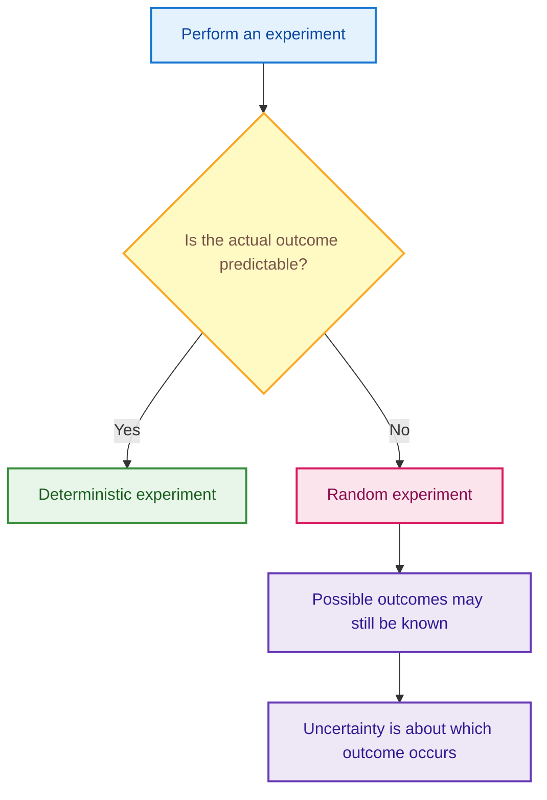
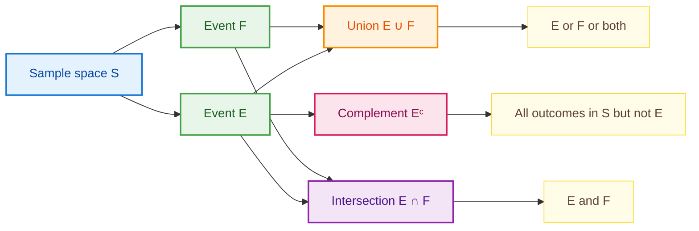
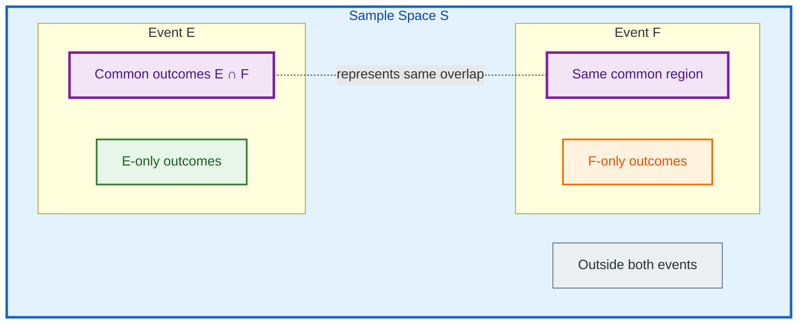
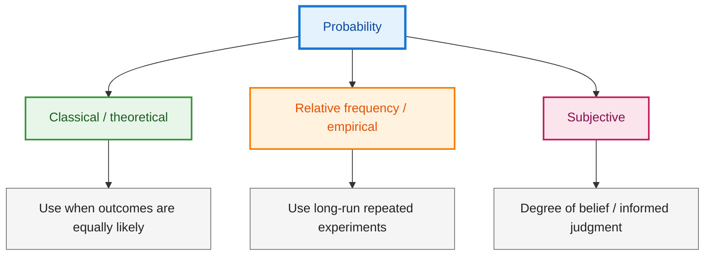
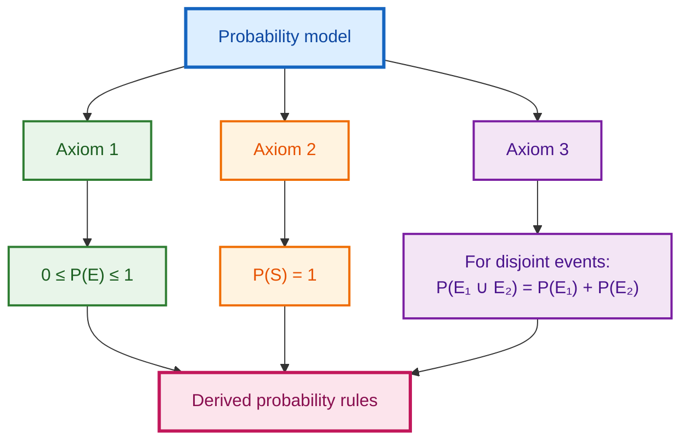
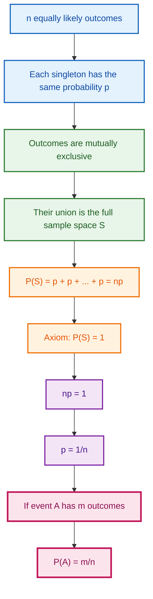
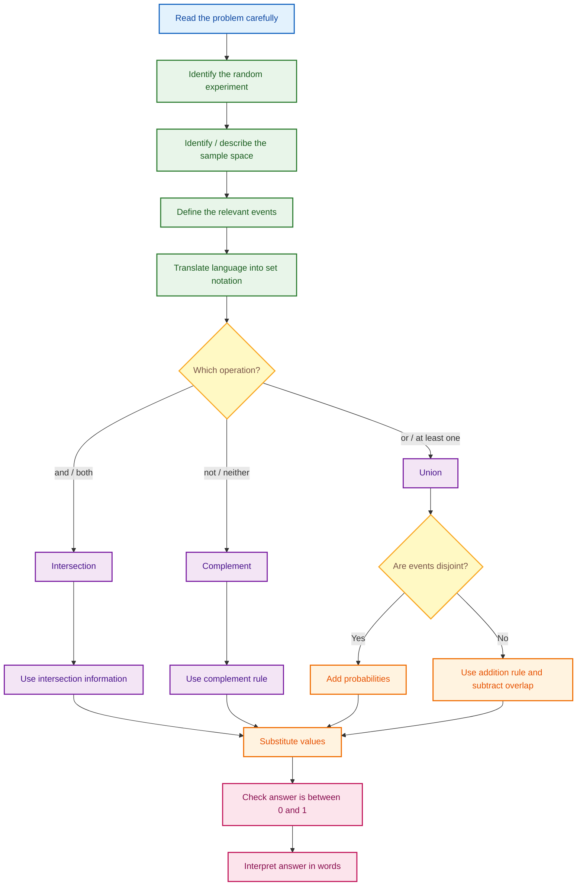

# Probability Foundations — Detailed Notes from the Shared YouTube Transcripts

> **Source basis:** These notes are built from the shared transcript containing the lectures:
>
> 1. **L7.1: Probability — Basic Definitions**
> 2. **Lecture 6.2 — Probability — Events**
> 3. **Lecture 6.3 — Probability — Venn Diagrams**
> 4. **L7.4: Probability — Properties of Probability**
> 5. **L7.5: Probability — Applications**
> 6. **L7.6: Probability — Equally Likely Outcomes**
>
> The lecture numbering above is preserved as it appears in the supplied transcript.

---

## Table of Contents

1. [Big Picture: Why Probability?](#1-big-picture-why-probability)
2. [Experiment and Random Experiment](#2-experiment-and-random-experiment)
3. [Outcomes and Sample Space](#3-outcomes-and-sample-space)
4. [Types of Sample Spaces Seen in the Lectures](#4-types-of-sample-spaces-seen-in-the-lectures)
5. [Events](#5-events)
6. [Set Operations on Events](#6-set-operations-on-events)
7. [Null, Mutually Exclusive, and Subset Events](#7-null-mutually-exclusive-and-subset-events)
8. [Playing-Card Example](#8-playing-card-example)
9. [Venn Diagrams](#9-venn-diagrams)
10. [Interpretations of Probability](#10-interpretations-of-probability)
11. [Axiomatic Probability](#11-axiomatic-probability)
12. [Important Derived Properties](#12-important-derived-properties)
13. [Addition Rule of Probability](#13-addition-rule-of-probability)
14. [Applications of the Addition and Complement Rules](#14-applications-of-the-addition-and-complement-rules)
15. [Equally Likely Outcomes](#15-equally-likely-outcomes)
16. [Worked Examples](#16-worked-examples)
17. [Common Mistakes and Exam Traps](#17-common-mistakes-and-exam-traps)
18. [Problem-Solving Framework](#18-problem-solving-framework)
19. [Formula Sheet](#19-formula-sheet)
20. [Quick Revision Tables](#20-quick-revision-tables)
21. [Fun Facts and Intuition](#21-fun-facts-and-intuition)
22. [Programming / Code Note](#22-programming--code-note)

---

# 1. Big Picture: Why Probability?

Probability is the mathematical language used to describe **uncertainty**.

The lectures begin with everyday statements such as:

- there is a chance of winning a coin toss,
- we may guess an answer in a multiple-choice question,
- a party may probably win an election,
- there may be a certain chance of rain.

All these statements share one feature:

> We know that several outcomes are possible, but we are not certain which one will actually occur.

Probability gives us a way to **quantify** this uncertainty.

---

## 1.1 What does probability measure?

Probability measures how likely an event is to occur.

A probability is represented by a number between $0$ and $1$:

$$
0 \le P(E) \le 1
$$

Interpretation:

| Probability | Meaning |
|---:|---|
| $0$ | Impossible event |
| Close to $0$ | Very unlikely |
| $0.5$ | Middle level of likelihood |
| Close to $1$ | Very likely |
| $1$ | Certain event |

---

## 1.2 Why is probability important in statistics?

The transcript connects probability with the transition from **descriptive statistics** to **inferential statistics**.

### Descriptive statistics

Descriptive statistics summarizes observed data.

For example:

- mean,
- median,
- variance,
- charts,
- tables.

### Inferential statistics

Inferential statistics tries to use a **sample** to learn something about a larger **population**.

That introduces uncertainty.

Suppose:

- Population = all students in a university.
- Sample = $200$ selected students.

Even if we know everything about the $200$ students, we are still uncertain about the entire population.

Probability provides the mathematical machinery for handling that uncertainty.

---

## 1.3 Concept map

---

# 2. Experiment and Random Experiment

## 2.1 What is an experiment?

An **experiment** is any process that produces an observation or an outcome.

Examples discussed in the transcript include:

- measuring the diameter of nuts or bolts produced by a machine,
- measuring how long a process takes,
- mixing substances under controlled conditions,
- tossing a coin,
- observing the order of finish in a race,
- measuring the lifetime of a bulb,
- throwing a dart at a square.

The essential idea is:

$$
\text{Experiment} \longrightarrow \text{Observation/Outcome}
$$

---

## 2.2 Deterministic experiment

A deterministic experiment is one in which the outcome is expected to be predictable under the specified controlled setup.

The lecture uses an example involving identical glasses containing the same amount of water and the same amount of sugar being mixed under the same controlled conditions.

The purpose of this example is to contrast a controlled, predictable setup with a random experiment.

---

## 2.3 Random experiment

A **random experiment** is an experiment whose actual outcome is uncertain.

A crucial point from the lecture is:

> In a random experiment, the **possible outcomes may be known in advance**, but we do not know which particular outcome will occur.

### Example: coin toss

We know the possible outcomes are

$$
S=\{H,T\}
$$

but before the toss we do not know whether the actual outcome will be $H$ or $T$.

That uncertainty makes coin tossing a random experiment.

---

## 2.4 Deterministic vs random

---

# 3. Outcomes and Sample Space

## 3.1 Basic outcome

A **basic outcome** is one possible result of a random experiment.

### Coin toss

Basic outcomes:

$$
H,\quad T
$$

### Die roll

Basic outcomes:

$$
1,2,3,4,5,6
$$

For a single performance of the experiment, only one basic outcome occurs.

---

## 3.2 Sample space

The **sample space** is the set of all possible basic outcomes of a random experiment.

It is usually denoted by $S$. Some texts may use $\Omega$.

Formally:

$$
S=\{\text{all possible basic outcomes}\}
$$

The sample space must be **exhaustive**: every outcome that can occur under the experiment must belong to it.

---

## 3.3 Examples of sample spaces

### Example 1: Tossing one coin

$$
S=\{H,T\}
$$

### Example 2: Rolling one die

$$
S=\{1,2,3,4,5,6\}
$$

### Example 3: Guessing one answer in a four-option question

If the available choices are $A,B,C,D$,

$$
S=\{A,B,C,D\}
$$

### Example 4: Tossing two coins

$$
S=\{HH,HT,TH,TT\}
$$

The first symbol identifies the outcome of the first coin/toss and the second symbol identifies the second.

---

## 3.4 Order of finish in a race

Suppose six students $A,B,C,D,E,F$ participate in a race.

An outcome must specify the complete finishing order.

Examples:

$$
ABCDEF
$$

and

$$
BACDEF
$$

are different outcomes.

The sample space consists of all permutations of six students.

Therefore,

$$
|S|=6!
$$

and

$$
6!=720.
$$

Thus there are

$$
\boxed{720}
$$

possible finishing orders.

---

## 3.5 Bulb lifetime

The lecture considers measuring bulb lifetime in hours, with outcomes represented according to a chosen recording convention.

One possible representation is

$$
S=\{0,1,2,3,\ldots\}.
$$

This is an example of a sample space that can contain infinitely many discrete values.

The transcript also emphasizes that how the lifetime is recorded depends on the convention chosen.

---

## 3.6 Dart landing in a unit square

Suppose a dart is assumed to land somewhere inside the unit square.

The outcome is the coordinate $(x,y)$ at which the dart lands.

The sample space can be represented as

$$
S=\{(x,y):0\le x\le 1,\;0\le y\le 1\}.
$$

Unlike the coin or die examples, there are continuously many possible locations.

---

# 4. Types of Sample Spaces Seen in the Lectures

The examples show that sample spaces can have different structures.

| Experiment | Sample space type | Example |
|---|---|---|
| Guessing one MCQ answer | Finite discrete | $\{A,B,C,D\}$ |
| Rolling a die | Finite discrete | $\{1,2,3,4,5,6\}$ |
| Race of six students | Finite but large | $6!=720$ outcomes |
| Two coin tosses | Finite discrete | $\{HH,HT,TH,TT\}$ |
| Recorded bulb lifetime | Infinite discrete under integer-hour recording | $\{0,1,2,\ldots\}$ |
| Dart in unit square | Continuous region | $(x,y)$ in the square |

---

# 5. Events

## 5.1 What is an event?

An **event** is a collection of basic outcomes.

Mathematically:

$$
E\subseteq S.
$$

So an event is a subset of the sample space.

An event occurs when the observed basic outcome belongs to the event.

---

## 5.2 Example: odd number on a die

Sample space:

$$
S=\{1,2,3,4,5,6\}.
$$

Define the event

$$
E=\{\text{odd outcome}\}.
$$

Then

$$
E=\{1,3,5\}.
$$

If the die shows $3$, then the event $E$ has occurred because

$$
3\in E.
$$

If the die shows $4$, the event has not occurred because

$$
4\notin E.
$$

---

## 5.3 Example: even number on a die

Define

$$
F=\{2,4,6\}.
$$

Again,

$$
F\subseteq S.
$$

---

## 5.4 Singleton event

An event containing exactly one basic outcome is a singleton event.

For two coin tosses,

$$
S=\{HH,HT,TH,TT\}.
$$

The event

$$
E=\{HH\}
$$

contains only one outcome.

---

## 5.5 Race example

Suppose

$$
E=\{\text{A finishes first}\}.
$$

If $A$ is fixed in the first position, the remaining five students can be arranged in

$$
5!
$$

ways.

Therefore,

$$
|E|=5!=120.
$$

The entire sample space contains

$$
|S|=6!=720
$$

outcomes.

This illustrates clearly that

$$
E\subseteq S.
$$

---

## 5.6 Bulb example

An event can also represent an interval or range.

For example, "the bulb fails within $4$ hours" can be represented as

$$
E=\{x:0\le x\le4\}.
$$

The exact interpretation depends on how lifetime is measured and recorded.

---

# 6. Set Operations on Events

Because events are sets, we can apply ordinary set operations to them.

The three central operations in the transcript are:

1. Union
2. Intersection
3. Complement

---

## 6.1 Union of events

For events $E$ and $F$,

$$
E\cup F
$$

contains outcomes that are in:

- $E$, or
- $F$, or
- both.

In probability language:

> $E\cup F$ occurs when **E or F or both** occur.

---

### Example: two coin tosses

Let

$$
E=\{\text{head on first toss}\}=\{HH,HT\}
$$

and

$$
F=\{\text{head on second toss}\}=\{HH,TH\}.
$$

Then

$$
E\cup F=\{HH,HT,TH\}.
$$

Interpretation:

> At least one toss is a head.

---

## 6.2 Intersection of events

For events $E$ and $F$,

$$
E\cap F
$$

contains outcomes that belong to both $E$ and $F$.

In probability language:

> $E\cap F$ occurs when **both E and F** occur.

Using the same coin example,

$$
E\cap F=\{HH\}.
$$

Interpretation:

> Head occurs on both tosses.

---

## 6.3 Complement of an event

The complement of $E$, written $E^c$, contains every outcome in the sample space that is not in $E$.

$$
E^c=S\setminus E.
$$

---

### Example: at least one head

For two coin tosses,

$$
S=\{HH,HT,TH,TT\}.
$$

Let

$$
E=\{\text{at least one head}\}=\{HH,HT,TH\}.
$$

Then

$$
E^c=\{TT\}.
$$

So the complement of "at least one head" is:

> both tosses are tails.

This is an extremely useful pattern.

---

## 6.4 Language-to-symbol dictionary

| Everyday language | Set notation |
|---|---|
| E or F | $E\cup F$ |
| E and F | $E\cap F$ |
| Not E | $E^c$ |
| Neither E nor F | $(E\cup F)^c$ |
| At least one of E or F | $E\cup F$ |
| Both E and F | $E\cap F$ |

---

## 6.5 Event-operation intuition

---

# 7. Null, Mutually Exclusive, and Subset Events

## 7.1 Null event

A **null event** or **empty event** contains no outcomes.

It is written as

$$
\varnothing.
$$

---

## 7.2 Mutually exclusive / disjoint events

Two events $E$ and $F$ are mutually exclusive if they cannot occur together.

Mathematically,

$$
E\cap F=\varnothing.
$$

---

### Example: one coin toss

Let

$$
E=\{H\}
$$

and

$$
F=\{T\}.
$$

Then

$$
E\cap F=\varnothing.
$$

A single toss cannot simultaneously be both head and tail.

---

### Example: MCQ guess

If exactly one answer is selected, then

$$
E_A=\{\text{guess A}\}
$$

and

$$
E_B=\{\text{guess B}\}
$$

cannot occur simultaneously.

Hence,

$$
E_A\cap E_B=\varnothing.
$$

---

## 7.3 Subset relation between events

If every outcome in $E$ also belongs to $F$, then

$$
E\subseteq F.
$$

### Two-coin example

Let

$$
E=\{HH\}
$$

represent "heads on both tosses", and

$$
F=\{HH,HT\}
$$

represent "head on the first toss".

Then

$$
E\subseteq F.
$$

Why?

Because if both tosses are heads, it is automatically true that the first toss is a head.

---

# 8. Playing-Card Example

The transcript uses a standard deck to tie together sample spaces, events, unions, intersections, and mutual exclusivity.

---

## 8.1 Structure of a deck

A standard deck has:

- $4$ suits,
- $13$ cards in each suit.

Thus,

$$
4\times13=52
$$

cards.

The four suits are:

- clubs,
- spades,
- hearts,
- diamonds.

---

## 8.2 Random experiment

Randomly select one face-down card from the $52$-card deck.

The sample space contains all $52$ cards.

$$
|S|=52.
$$

---

## 8.3 Event: King of Hearts

Let

$$
E=\{\text{King of Hearts}\}.
$$

There is exactly one such card, so

$$
|E|=1.
$$

---

## 8.4 Event: selecting a king

Let

$$
F=\{\text{king}\}.
$$

The four possible outcomes are:

- King of Clubs,
- King of Spades,
- King of Hearts,
- King of Diamonds.

Therefore,

$$
|F|=4.
$$

---

## 8.5 Event: selecting a heart

Let

$$
G=\{\text{heart}\}.
$$

There are $13$ hearts.

Therefore,

$$
|G|=13.
$$

---

## 8.6 Union: king or heart

The event

$$
F\cup G
$$

means:

> the selected card is a king or a heart or both.

There are:

- $13$ hearts,
- plus $3$ additional kings that are not hearts.

Thus,

$$
|F\cup G|=13+3=16.
$$

Why not $13+4=17$?

Because the King of Hearts belongs to both events and would be counted twice.

---

## 8.7 Intersection: king and heart

$$
F\cap G
$$

means the card must be both a king and a heart.

There is exactly one such card:

$$
F\cap G=\{\text{King of Hearts}\}.
$$

---

## 8.8 Mutually exclusive card events

### King and Queen

A single card cannot be both a king and a queen.

Therefore,

$$
\{\text{king}\}\cap\{\text{queen}\}=\varnothing.
$$

Thus these two events are mutually exclusive.

### Ace and Heart

These are **not** mutually exclusive because the Ace of Hearts belongs to both events.

---

# 9. Venn Diagrams

Venn diagrams provide a graphical way to represent logical relationships between events.

The transcript emphasizes:

- Sample space $S$ is represented by a large rectangle.
- Events are represented as regions inside that rectangle.
- Overlapping event regions show intersections.
- The combined regions show unions.
- Non-overlapping event regions represent disjoint events.
- A region completely inside another represents a subset relation.

---

## 9.1 Conceptual Venn representation

> Mermaid flowcharts are being used here as a conceptual visualization. The underlying mathematical interpretation is the same as a conventional Venn diagram.

---

## 9.2 Two-coin Venn intuition

Let

$$
E=\{HH,HT\}
$$

and

$$
F=\{HH,TH\}.
$$

Then:

$$
E\cap F=\{HH\}
$$

and

$$
E\cup F=\{HH,HT,TH\}.
$$

The only outcome outside the union is

$$
TT.
$$

Therefore,

$$
(E\cup F)^c=\{TT\}.
$$

---

# 10. Interpretations of Probability

The transcript introduces three major interpretations before presenting the axiomatic framework.

---

## 10.1 Classical approach

Also described as:

- a priori,
- theoretical.

If the sample space contains $n$ **equally likely** outcomes and event $E$ contains $m$ of them, then

$$
P(E)=\frac{m}{n}.
$$

Equivalently,

$$
P(E)=\frac{|E|}{|S|}.
$$

### Critical condition

This formula is valid in this form only when the basic outcomes are equally likely.

---

### Example: even number on a fair die

$$
S=\{1,2,3,4,5,6\}
$$

and

$$
E=\{2,4,6\}.
$$

Therefore,

$$
P(E)=\frac{3}{6}=\frac12.
$$

---

## 10.2 Relative frequency / empirical approach

This interpretation considers repeated independent performances of an experiment.

Suppose:

- the experiment is repeated $n$ times,
- event $E$ occurs $N_E(n)$ times.

The observed relative frequency is

$$
\frac{N_E(n)}{n}.
$$

As the number of repetitions becomes very large, probability is interpreted through the long-run limiting proportion:

$$
P(E)=\lim_{n\to\infty}\frac{N_E(n)}{n}.
$$

The transcript uses repeated coin tosses to illustrate that the short-run number of heads and tails need not be exactly equal, even when the coin is fair.

### Why this interpretation is useful

It connects probability to experimentally observed frequencies.

### Limitation highlighted in the transcript

Not every experiment can be repeated independently a very large number of times.

---

## 10.3 Subjective interpretation

Subjective probability describes a person's degree of belief or best judgment concerning an uncertain event.

Examples include statements such as:

- a certain chance of rain tomorrow,
- a certain chance that a candidate wins an election.

This interpretation does not require that the experiment be repeatedly performed in the same way.

---

# 11. Axiomatic Probability

The axiomatic framework assigns a number $P(E)$ to an event $E$ and requires probability to satisfy fundamental rules.

These rules provide a unified framework.

---

## 11.1 Axiom 1: probability lies between 0 and 1

For every event $E$,

$$
0\le P(E)\le1.
$$

This guarantees that probabilities cannot be negative and cannot exceed certainty.

---

## 11.2 Axiom 2: probability of the sample space

$$
P(S)=1.
$$

Why?

Because the outcome of the experiment must belong to the sample space.

The sample space contains every possible basic outcome.

---

## 11.3 Axiom 3: additivity for mutually exclusive events

For mutually exclusive events $E_1,E_2,\ldots$,

$$
P\left(\bigcup_i E_i\right)
=
\sum_i P(E_i).
$$

For two disjoint events,

$$
E_1\cap E_2=\varnothing
$$

and therefore

$$
P(E_1\cup E_2)
=
P(E_1)+P(E_2).
$$

The lecture focuses mainly on finite unions for the course.

---

## 11.4 Example: odd or even on a die

Let

$$
E_1=\{1,3,5\}
$$

and

$$
E_2=\{2,4,6\}.
$$

They are disjoint:

$$
E_1\cap E_2=\varnothing.
$$

Also,

$$
E_1\cup E_2=S.
$$

Hence,

$$
P(E_1\cup E_2)
=
P(E_1)+P(E_2).
$$

For a fair die,

$$
P(E_1)=\frac36=\frac12
$$

and

$$
P(E_2)=\frac36=\frac12.
$$

Therefore,

$$
P(E_1\cup E_2)
=
\frac12+\frac12
=
1.
$$

This agrees with

$$
P(S)=1.
$$

---

## 11.5 Axiom map

---

# 12. Important Derived Properties

The transcript derives important consequences of the axioms.

---

## 12.1 Complement rule

An event and its complement are disjoint:

$$
E\cap E^c=\varnothing.
$$

Together they make the entire sample space:

$$
E\cup E^c=S.
$$

Therefore, by additivity,

$$
P(E\cup E^c)
=
P(E)+P(E^c).
$$

But

$$
P(E\cup E^c)=P(S)=1.
$$

Thus,

$$
P(E)+P(E^c)=1.
$$

Therefore,

$$
\boxed{P(E^c)=1-P(E)}.
$$

---

## 12.2 Probability of the null event

The complement of the sample space is the null event:

$$
S^c=\varnothing.
$$

By the complement rule,

$$
P(S^c)=1-P(S).
$$

Since

$$
P(S)=1,
$$

we get

$$
P(\varnothing)=1-1=0.
$$

Hence,

$$
\boxed{P(\varnothing)=0}.
$$

---

# 13. Addition Rule of Probability

The third axiom directly handles disjoint events, but many real events overlap.

For arbitrary events $E$ and $F$,

$$
\boxed{
P(E\cup F)
=
P(E)+P(F)-P(E\cap F)
}
$$

---

## 13.1 Why do we subtract the intersection?

If we calculate

$$
P(E)+P(F),
$$

every outcome in

$$
E\cap F
$$

has been counted twice:

- once as part of $E$,
- once as part of $F$.

So we subtract it once.

---

## 13.2 Relationship to the disjoint case

If $E$ and $F$ are mutually exclusive,

$$
E\cap F=\varnothing
$$

and

$$
P(E\cap F)=0.
$$

Therefore the general formula reduces to

$$
P(E\cup F)
=
P(E)+P(F).
$$

So the mutually exclusive formula is a special case of the general addition rule.

---

## 13.3 Intuition diagram

---

# 14. Applications of the Addition and Complement Rules

The applications lecture emphasizes an important skill:

> First translate the real-life statement into events and set operations. Then apply probability rules.

---

## 14.1 Application 1: clothing-store customer

Suppose:

- $S$ = customer purchases a shirt,
- $P$ = customer purchases pants.

Given:

$$
P(S)=0.3
$$

$$
P(P)=0.2
$$

$$
P(S\cap P)=0.1.
$$

Find the probability that a customer purchases **neither** a shirt nor pants.

---

### Step 1: Translate "shirt or pants"

"Shirt or pants" corresponds to

$$
S\cup P.
$$

---

### Step 2: Find the union

Using the addition rule,

$$
P(S\cup P)
=
P(S)+P(P)-P(S\cap P).
$$

Substitute:

$$
P(S\cup P)
=
0.3+0.2-0.1.
$$

Therefore,

$$
P(S\cup P)=0.4.
$$

---

### Step 3: Translate "neither"

"Neither a shirt nor pants" is the complement of purchasing at least one of them:

$$
(S\cup P)^c.
$$

Thus,

$$
P((S\cup P)^c)
=
1-P(S\cup P).
$$

Therefore,

$$
P((S\cup P)^c)
=
1-0.4
=
0.6.
$$

### Answer

$$
\boxed{0.6}
$$

or

$$
\boxed{60\%}.
$$

---

## 14.2 Application 2: grades in Statistics and Mathematics

Let:

- $S$ = student receives an A in Statistics,
- $M$ = student receives an A in Mathematics.

Given:

$$
P(S)=0.4
$$

$$
P(M)=0.6
$$

$$
P(S\cup M)=0.86.
$$

Find:

1. probability of receiving an A in neither subject;
2. probability of receiving an A in both subjects.

---

### Part 1: neither subject

"Neither" is

$$
(S\cup M)^c.
$$

Therefore,

$$
P((S\cup M)^c)
=
1-P(S\cup M).
$$

Hence,

$$
P((S\cup M)^c)
=
1-0.86
=
0.14.
$$

So,

$$
\boxed{P(\text{neither})=0.14}.
$$

---

### Part 2: both subjects

"Both" means

$$
S\cap M.
$$

From the addition rule,

$$
P(S\cup M)
=
P(S)+P(M)-P(S\cap M).
$$

Rearrange:

$$
P(S\cap M)
=
P(S)+P(M)-P(S\cup M).
$$

Substitute:

$$
P(S\cap M)
=
0.4+0.6-0.86.
$$

Thus,

$$
P(S\cap M)=0.14.
$$

Therefore,

$$
\boxed{P(\text{both})=0.14}.
$$

### Transcript consistency note

Near the end of this worked example, the spoken transcript contains wording equivalent to "0.4 or 14 percent." The calculation shown from the supplied values gives $0.14$, and $14\%=0.14$. The notes therefore retain the mathematically consistent result while flagging the apparent spoken slip rather than silently treating $0.4$ as equivalent to $14\%$.

---

# 15. Equally Likely Outcomes

The final lecture in the shared transcript develops the classical formula from the probability axioms.

---

## 15.1 Start with $n$ equally likely basic outcomes

Suppose

$$
S=\{E_1,E_2,\ldots,E_n\}
$$

where each singleton outcome is equally likely.

Then

$$
P(E_1)=P(E_2)=\cdots=P(E_n).
$$

Let this common probability be $p$.

Because the basic outcomes are mutually exclusive and exhaustive,

$$
E_1\cup E_2\cup\cdots\cup E_n=S.
$$

Using additivity,

$$
P(S)
=
P(E_1)+P(E_2)+\cdots+P(E_n).
$$

Since each has probability $p$,

$$
1=np.
$$

Therefore,

$$
\boxed{p=\frac1n}.
$$

So every basic outcome has probability

$$
\boxed{\frac1n}.
$$

---

## 15.2 Probability of an event containing $m$ outcomes

Suppose event $A$ contains exactly $m$ of the $n$ equally likely outcomes.

Since each has probability $1/n$,

$$
P(A)
=
m\left(\frac1n\right).
$$

Hence,

$$
\boxed{P(A)=\frac{m}{n}}.
$$

Equivalently,

$$
\boxed{
P(A)=\frac{|A|}{|S|}
}
$$

provided all outcomes in $S$ are equally likely.

---

## 15.3 Derivation map

---

# 16. Worked Examples

## 16.1 Fair die: odd outcome

For a fair die,

$$
S=\{1,2,3,4,5,6\}.
$$

Let

$$
A=\{1,3,5\}.
$$

There are $3$ favorable outcomes out of $6$ equally likely outcomes.

Therefore,

$$
P(A)
=
\frac{3}{6}
=
\frac12.
$$

---

## 16.2 Fair die: outcome greater than 4

Let

$$
B=\{5,6\}.
$$

Therefore,

$$
P(B)
=
\frac{2}{6}
=
\frac13.
$$

---

## 16.3 Fair die: odd or greater than 4

Let

$$
A=\{1,3,5\}
$$

and

$$
B=\{5,6\}.
$$

Notice that

$$
A\cap B=\{5\}.
$$

So these events are not disjoint.

Use the addition rule:

$$
P(A\cup B)
=
P(A)+P(B)-P(A\cap B).
$$

Now,

$$
P(A)=\frac36,
$$

$$
P(B)=\frac26,
$$

and

$$
P(A\cap B)=\frac16.
$$

Therefore,

$$
P(A\cup B)
=
\frac36+\frac26-\frac16
=
\frac46
=
\frac23.
$$

Alternatively,

$$
A\cup B=\{1,3,5,6\},
$$

so directly,

$$
P(A\cup B)=\frac46=\frac23.
$$

Both methods agree.

---

## 16.4 Deck of cards: red or queen

A standard deck has $52$ equally likely cards.

Let

$$
R=\{\text{red card}\}
$$

and

$$
Q=\{\text{queen}\}.
$$

There are $26$ red cards:

$$
P(R)=\frac{26}{52}.
$$

There are $4$ queens:

$$
P(Q)=\frac4{52}.
$$

There are $2$ red queens:

$$
P(R\cap Q)=\frac2{52}.
$$

Therefore,

$$
P(R\cup Q)
=
\frac{26}{52}
+
\frac4{52}
-
\frac2{52}.
$$

Hence,

$$
P(R\cup Q)
=
\frac{28}{52}
=
\frac7{13}.
$$

Therefore,

$$
\boxed{P(\text{red or queen})=\frac7{13}}.
$$

---

# 17. Common Mistakes and Exam Traps

## Mistake 1: Using $m/n$ without checking equal likelihood

The formula

$$
P(E)=\frac{|E|}{|S|}
$$

requires equally likely basic outcomes.

Do not use it automatically just because you can count the outcomes.

---

## Mistake 2: Treating "or" as exclusive

In probability,

$$
E\cup F
$$

normally means:

> E or F **or both**.

Unless the events are explicitly mutually exclusive, overlapping outcomes remain possible.

---

## Mistake 3: Adding probabilities of overlapping events directly

Incorrect in general:

$$
P(E\cup F)=P(E)+P(F).
$$

Correct general formula:

$$
P(E\cup F)
=
P(E)+P(F)-P(E\cap F).
$$

---

## Mistake 4: Confusing mutually exclusive with complement

Mutually exclusive events satisfy

$$
E\cap F=\varnothing.
$$

But $F$ is the complement of $E$ only if, in addition,

$$
E\cup F=S.
$$

So every complementary pair is disjoint, but disjoint events need not necessarily be complements.

---

## Mistake 5: Misreading "neither"

"Neither E nor F" means

$$
(E\cup F)^c,
$$

not simply

$$
E^c\cup F^c.
$$

For the problems in these lectures, the most direct route is usually

$$
P((E\cup F)^c)
=
1-P(E\cup F).
$$

---

## Mistake 6: Forgetting to define events before calculating

The applications lecture repeatedly emphasizes translation.

Write:

$$
S=\{\text{shirt purchase}\}
$$

or

$$
M=\{\text{A grade in Mathematics}\}
$$

before plugging values into formulas.

This reduces ambiguity.

---

# 18. Problem-Solving Framework

Use the following workflow whenever you see a probability word problem.

---

## 18.1 Translation checklist

Before calculating, ask:

1. What is the experiment?
2. What is the outcome?
3. What is the sample space?
4. What event does each statement describe?
5. Does "or" mean union?
6. Does "and" mean intersection?
7. Does "not" or "neither" suggest a complement?
8. Are the events mutually exclusive?
9. Are the underlying outcomes equally likely?
10. Does the final probability lie between $0$ and $1$?

---

# 19. Formula Sheet

## 19.1 Probability bounds

$$
\boxed{0\le P(E)\le1}
$$

---

## 19.2 Probability of the sample space

$$
\boxed{P(S)=1}
$$

---

## 19.3 Probability of the null event

$$
\boxed{P(\varnothing)=0}
$$

---

## 19.4 Complement rule

$$
\boxed{P(E^c)=1-P(E)}
$$

---

## 19.5 Disjoint-event addition

If

$$
E\cap F=\varnothing,
$$

then

$$
\boxed{P(E\cup F)=P(E)+P(F)}.
$$

---

## 19.6 General addition rule

$$
\boxed{
P(E\cup F)
=
P(E)+P(F)-P(E\cap F)
}
$$

---

## 19.7 Equally likely outcomes

If there are $n$ equally likely outcomes and $m$ outcomes belong to event $E$,

$$
\boxed{
P(E)=\frac{m}{n}
}
$$

or

$$
\boxed{
P(E)=\frac{|E|}{|S|}
}.
$$

---

## 19.8 Relative frequency interpretation

$$
\boxed{
P(E)=
\lim_{n\to\infty}
\frac{N_E(n)}{n}
}
$$

where $N_E(n)$ denotes the number of times event $E$ occurs in $n$ repetitions.

---

# 20. Quick Revision Tables

## 20.1 Core definitions

| Concept | Definition | Key notation |
|---|---|---|
| Experiment | Process producing an observation/outcome | — |
| Random experiment | Experiment whose actual outcome is uncertain | — |
| Basic outcome | One possible result | $\omega$ or an element of $S$ |
| Sample space | Set of all possible basic outcomes | $S$ |
| Event | Collection/subset of basic outcomes | $E\subseteq S$ |
| Null event | Event with no outcomes | $\varnothing$ |
| Complement | Outcomes in $S$ but not in $E$ | $E^c$ |
| Union | E or F or both | $E\cup F$ |
| Intersection | E and F | $E\cap F$ |
| Mutually exclusive | Cannot occur together | $E\cap F=\varnothing$ |

---

## 20.2 Probability interpretations

| Interpretation | Main idea | Typical use |
|---|---|---|
| Classical | Favorable outcomes / total outcomes | Equally likely finite outcomes |
| Relative frequency | Long-run fraction of occurrence | Repeated experiments |
| Subjective | Degree of belief | Judgment under uncertainty |
| Axiomatic | Probability obeys formal rules | Unified mathematical framework |

---

## 20.3 Important examples

| Experiment | Event | Probability/result |
|---|---|---|
| Fair die | Odd | $\frac12$ |
| Fair die | Greater than 4 | $\frac13$ |
| Fair die | Odd or greater than 4 | $\frac23$ |
| Clothing customer | Neither shirt nor pants | $0.6$ |
| Student grades | Neither A in Statistics nor Mathematics | $0.14$ |
| Student grades | A in both Statistics and Mathematics | $0.14$ |
| Card draw | Red or Queen | $\frac7{13}$ |

---

# 21. Fun Facts and Intuition

## 21.1 Probability does not mean short-run equality

A fair coin does **not** guarantee exactly five heads in ten tosses.

Fairness means the two basic outcomes are modeled as equally likely on each toss.

Short runs can be unbalanced.

The relative-frequency interpretation concerns what happens as the number of repetitions becomes very large.

---

## 21.2 The sample space depends on what you record

The same physical situation can lead to different sample spaces depending on the observation rule.

For a bulb, you might record:

- exact lifetime,
- lifetime rounded to hours,
- whether it survives beyond four hours.

The experiment and the observation rule determine the appropriate sample space.

---

## 21.3 Events are questions about outcomes

A useful mental model is:

- **Sample space:** everything that could happen.
- **Event:** a question selecting some of those possibilities.

For a die:

$$
S=\{1,2,3,4,5,6\}.
$$

The question "Did I get an odd number?" selects

$$
\{1,3,5\}.
$$

That selected subset is the event.

---

## 21.4 Addition rule is inclusion-exclusion in miniature

The formula

$$
P(E\cup F)
=
P(E)+P(F)-P(E\cap F)
$$

has the same counting intuition as avoiding double-counting in sets.

The overlap is added twice, so it must be removed once.

---

# 22. Programming / Code Note

The supplied transcripts do **not** contain programming code. Therefore, there is no source code to annotate line-by-line without introducing material that is not present in the lectures.

The notes intentionally remain grounded in the supplied probability lectures. The mathematical worked examples and Mermaid diagrams provide the computational and visual explanations requested without inventing a programming section that was not part of the source.

---

# Final Concept Summary

Probability develops in layers:

The most important formulas from this set of lectures are:

$$
0\le P(E)\le1
$$

$$
P(S)=1
$$

$$
P(E^c)=1-P(E)
$$

$$
P(\varnothing)=0
$$

$$
P(E\cup F)=P(E)+P(F)-P(E\cap F)
$$

and, when all basic outcomes are equally likely,

$$
P(E)=\frac{|E|}{|S|}.
$$

These ideas form the foundation for the later probability topics mentioned at the beginning of the transcript, including conditional probability and the distinction between dependent and independent events.
