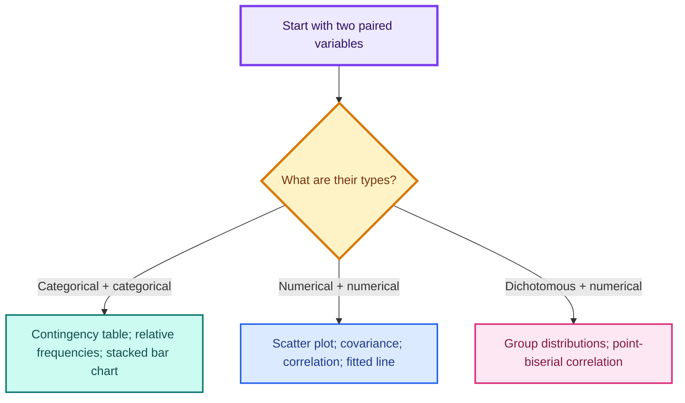
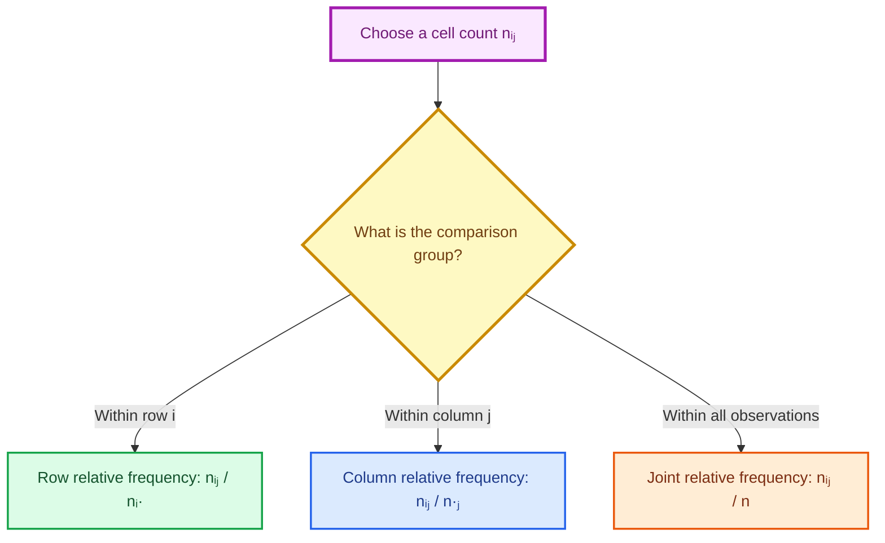
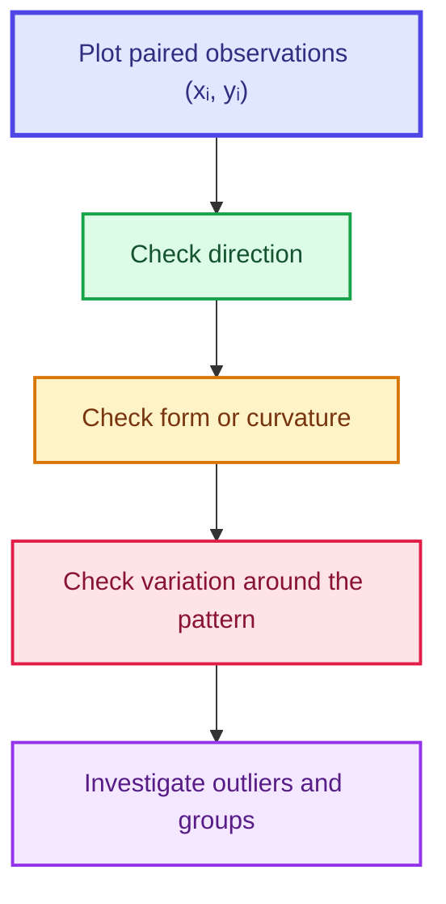
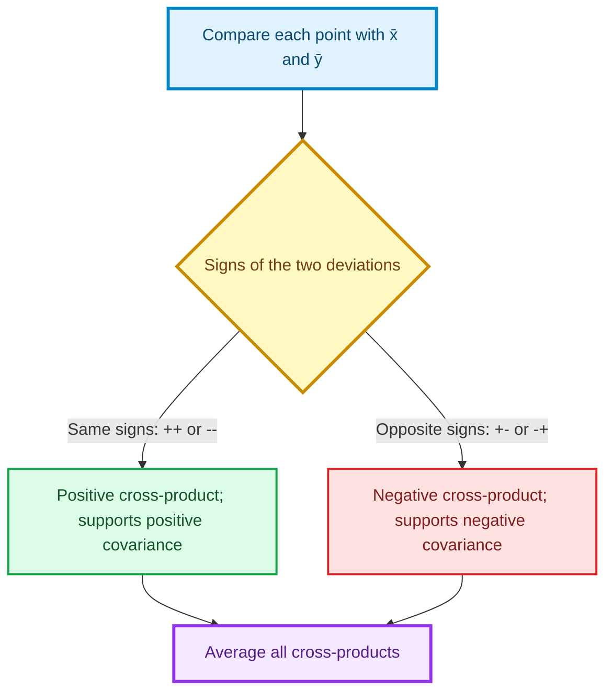
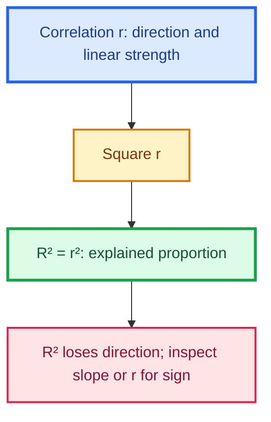
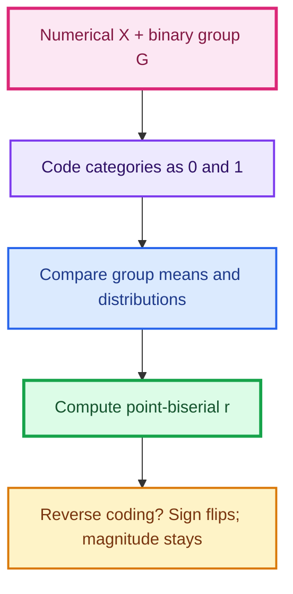
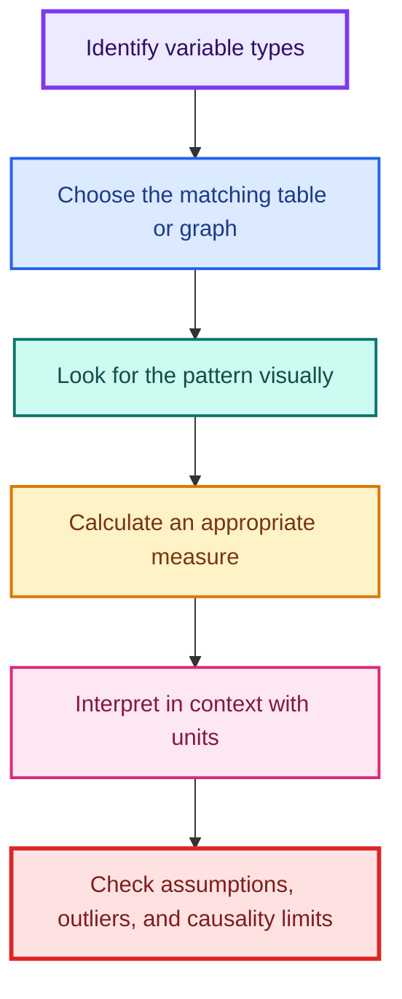

# Association Between Variables

> **Statistics for Data Science - 1 | Lecture 4 consolidated notes**  
> Prepared from the shared lecture slides and YouTube transcript PDFs for Lectures 4.1-4.9.

These notes explain how to study the relationship between two variables. They move from visual summaries to numerical measures and then to a fitted line. Every section answers five practical questions:

- **What** is the concept?
- **Why** do we need it?
- **How** is it calculated or constructed?
- **When** should it be used?
- **What can go wrong?**

The lecture examples, formulas, spreadsheet procedures, commented Python code, interpretation rules, cautions, and revision questions have been consolidated into one chapter.

---

## Table of contents

1. [Learning objectives](#1-learning-objectives)
2. [Review: the foundation from Lectures 1-3](#2-review-the-foundation-from-lectures-1-3)
3. [The master decision guide](#3-the-master-decision-guide)
4. [Association between two categorical variables](#4-association-between-two-categorical-variables)
5. [Association between two numerical variables](#5-association-between-two-numerical-variables)
6. [Covariance](#6-covariance)
7. [Correlation](#7-correlation)
8. [Fitting a straight line](#8-fitting-a-straight-line)
9. [Association between a categorical and a numerical variable](#9-association-between-a-categorical-and-a-numerical-variable)
10. [Complete Python workflow](#10-complete-python-workflow)
11. [Google Sheets quick guide](#11-google-sheets-quick-guide)
12. [Common mistakes and misconceptions](#12-common-mistakes-and-misconceptions)
13. [Formula sheet](#13-formula-sheet)
14. [Exam-style interpretation templates](#14-exam-style-interpretation-templates)
15. [Practice questions with hidden answers](#15-practice-questions-with-hidden-answers)
16. [Fun facts](#16-fun-facts)
17. [Glossary](#17-glossary)
18. [Source map](#18-source-map)

---

## 1. Learning objectives

By the end of this chapter, you should be able to:

1. Identify the types of two variables before choosing a method.
2. Construct and interpret a two-way contingency table.
3. Calculate row and column relative frequencies.
4. Use conditional distributions to judge association between categorical variables.
5. Create and interpret stacked and 100% stacked bar charts.
6. Draw a scatter plot for two numerical variables.
7. Describe a scatter plot using **direction, form/curvature, variation, and outliers**.
8. Calculate and interpret population and sample covariance.
9. Calculate and interpret Pearson's correlation coefficient.
10. Fit and interpret a straight line of the form $$\hat y = b_0 + b_1x$$.
11. Interpret the coefficient of determination, $$R^2$$.
12. Measure association between a dichotomous categorical variable and a numerical variable using point-biserial correlation.
13. Distinguish association, prediction, and causation.

---

## 2. Review: the foundation from Lectures 1-3

Before studying two variables together, recall how one variable is described.

### 2.1 What is statistics?

- **Descriptive statistics** organizes, summarizes, and displays observed data.
- **Inferential statistics** uses sample data to make conclusions about a larger population.

This lecture mainly extends descriptive statistics from **univariate** analysis to **bivariate** analysis.

### 2.2 Cases and variables

In a conventional data table:

- each **row** represents a case, unit, participant, house, car, or other observation;
- each **column** represents a variable measured on those cases.

For association analysis, the values must be **paired**. If age and height are measured, $$(x_i, y_i)$$ must describe the same individual.

### 2.3 Types and scales of data

| Data type | Common scales | Examples | Typical one-variable summaries |
|---|---|---|---|
| Categorical | Nominal, ordinal | Gender category, ownership, income level | Counts, proportions, mode, bar chart |
| Numerical | Interval, ratio | Marks, height, age, house price | Mean, median, variance, standard deviation, histogram |

- **Nominal:** categories have no inherent order.
- **Ordinal:** categories have an order, but gaps are not necessarily equal.
- **Interval:** equal differences are meaningful, but zero is not an absolute absence.
- **Ratio:** equal differences and ratios are meaningful; zero represents absence of the measured quantity.

> **Why this review matters:** the types of the two variables determine the correct table, graph, and numerical measure. A correlation coefficient is not meaningful for two unencoded nominal variables, and a contingency table discards useful magnitude information if both variables are genuinely numerical.

### 2.4 Association is not causation

Two variables are **associated** when knowing one gives information about the likely value or distribution of the other.

Association alone does **not** prove that changing one variable causes the other to change. A third variable, reverse direction, selection effect, or coincidence may explain the observed relationship.

---

## 3. The master decision guide



### 3.1 Quick selection table

| Variable 1 | Variable 2 | Best first display | Main lecture measure |
|---|---|---|---|
| Categorical | Categorical | Contingency table; 100% stacked bar chart | Conditional relative frequencies |
| Numerical | Numerical | Scatter plot | Covariance; Pearson correlation; $$R^2$$ |
| Dichotomous categorical | Numerical | Strip/dot plot or grouped distributions | Point-biserial correlation |

Always inspect the graph before trusting a single numerical summary.

---

## 4. Association between two categorical variables

### 4.1 What is a contingency table?

A **two-way contingency table** cross-classifies observations according to two categorical variables. It is also called a **cross-tabulation** or **two-way table**.

Suppose variable $$A$$ has $$r$$ categories and variable $$B$$ has $$c$$ categories. Let

- $$n_{ij}$$ = number of observations in row category $$i$$ and column category $$j$$;
- $$n_{i\cdot} = \sum_{j=1}^{c} n_{ij}$$ = total for row $$i$$;
- $$n_{\cdot j} = \sum_{i=1}^{r} n_{ij}$$ = total for column $$j$$;
- $$n = \sum_i \sum_j n_{ij}$$ = grand total.

The inside cells contain **joint counts** because each cell describes a combination of two categories.

### 4.2 Why do we need it?

Separate one-way summaries cannot show how categories occur together. Knowing that 44 participants are female and 76 own smartphones is insufficient to study gender and ownership. We also need counts such as "34 female participants own a smartphone."

### 4.3 Example 1: gender and smartphone ownership

The lecture surveys 100 students:

| Gender | Does not own | Owns | Row total |
|---|---:|---:|---:|
| Female | 10 | 34 | 44 |
| Male | 14 | 42 | 56 |
| **Column total** | **24** | **76** | **100** |

Consistency checks:

$$10 + 34 = 44, \qquad 14 + 42 = 56,$$

$$10 + 14 = 24, \qquad 34 + 42 = 76,$$

$$44 + 56 = 24 + 76 = 100.$$

Both variables are nominal, so reversing category order does not change their meaning.

### 4.4 Example 2: income level and smartphone ownership

| Income level | Does not own | Owns | Row total |
|---|---:|---:|---:|
| High | 2 | 18 | 20 |
| Medium | 27 | 39 | 66 |
| Low | 9 | 5 | 14 |
| **Column total** | **38** | **62** | **100** |

Income level is ordinal. Preserve a logical sequence such as **High → Medium → Low** or **Low → Medium → High**. A scrambled order such as High → Low → Medium hides the trend.

### 4.5 Relative frequencies: the central idea

A raw count answers "how many?" A relative frequency answers "what proportion?" The denominator must match the group named after words such as **among**, **within**, **of**, or **given**.



#### Row relative frequency

Divide each cell by its **row total**:

$$\text{Row relative frequency}_{ij} = \frac{n_{ij}}{n_{i\cdot}}.$$

It estimates a conditional proportion:

$$\frac{n_{ij}}{n_{i\cdot}} \approx P(B = j \mid A = i).$$

For gender and smartphone ownership:

| Gender | Does not own | Owns | Row sum |
|---|---:|---:|---:|
| Female | $$10/44 = 22.73\%$$ | $$34/44 = 77.27\%$$ | $$100\%$$ |
| Male | $$14/56 = 25.00\%$$ | $$42/56 = 75.00\%$$ | $$100\%$$ |
| Overall | $$24/100 = 24.00\%$$ | $$76/100 = 76.00\%$$ | $$100\%$$ |

Interpretation: among female students, 77.27% own a smartphone; among male students, 75% own one.

For income and smartphone ownership:

| Income level | Does not own | Owns | Row sum |
|---|---:|---:|---:|
| High | $$2/20 = 10.00\%$$ | $$18/20 = 90.00\%$$ | $$100\%$$ |
| Medium | $$27/66 = 40.91\%$$ | $$39/66 = 59.09\%$$ | $$100\%$$ |
| Low | $$9/14 = 64.29\%$$ | $$5/14 = 35.71\%$$ | $$100\%$$ |

The ownership proportion falls from 90% in the high-income group to 35.71% in the low-income group. This difference suggests association.

#### Column relative frequency

Divide each cell by its **column total**:

$$\text{Column relative frequency}_{ij} = \frac{n_{ij}}{n_{\cdot j}}.$$

It estimates the reverse conditional proportion:

$$\frac{n_{ij}}{n_{\cdot j}} \approx P(A = i \mid B = j).$$

For gender and ownership:

| Gender | Among non-owners | Among owners | Overall |
|---|---:|---:|---:|
| Female | $$10/24 = 41.67\%$$ | $$34/76 = 44.74\%$$ | $$44/100 = 44.00\%$$ |
| Male | $$14/24 = 58.33\%$$ | $$42/76 = 55.26\%$$ | $$56/100 = 56.00\%$$ |
| Column sum | $$100\%$$ | $$100\%$$ | $$100\%$$ |

Interpretation: among smartphone owners, 44.74% are female. This is a different question from "what percentage of females own a smartphone?"

#### Joint relative frequency

Although the lecture emphasizes row and column proportions, a useful third quantity divides by the grand total:

$$\text{Joint relative frequency}_{ij} = \frac{n_{ij}}{n}.$$

For example, $$34/100 = 34\%$$ of all surveyed students are female smartphone owners.

### 4.6 How conditional proportions reveal association

Two categorical variables are not associated when the conditional distribution of one variable is the same across every category of the other.

In probability notation, independence means

$$P(B = j \mid A = i) = P(B = j)$$

for every relevant $$i, j$$. Equivalently,

$$P(A = i, B = j) = P(A = i)P(B = j).$$

In a sample, proportions will rarely be exactly equal. We look for meaningful differences; formal inference would use methods such as a chi-square test, which is beyond this lecture.

#### Example 1 conclusion

- Female ownership: 77.27%
- Male ownership: 75.00%
- Overall ownership: 76.00%

These conditional distributions are very similar. The lecture concludes that gender and smartphone ownership are **not associated**, or more cautiously, that the table shows little visible association in this sample.

#### Example 2 conclusion

- High-income ownership: 90.00%
- Medium-income ownership: 59.09%
- Low-income ownership: 35.71%

The conditional distributions differ substantially. Income level and smartphone ownership are associated in this sample.

> **Important:** association is symmetric. If knowing income tells us something about ownership, then knowing ownership also changes what we expect about income. Row and column percentages tell the same underlying story from different directions.

### 4.7 Stacked bar charts

A **stacked bar chart** divides each bar into segments representing the categories of a second variable.

- A **standard stacked bar chart** retains actual counts and total group sizes.
- A **100% stacked bar chart** makes every bar the same height and emphasizes conditional proportions.

#### When to use each

| Goal | Better chart |
|---|---|
| Compare total group sizes and composition | Standard stacked bar chart |
| Compare within-group proportions | 100% stacked bar chart |
| Compare individual categories precisely | Grouped/side-by-side bar chart may be clearer |

In the income example, a 100% stacked chart makes the transition from mostly owners in the high-income group to mostly non-owners in the low-income group immediately visible.

### 4.8 Google Sheets: contingency table and chart

1. Select the two categorical columns.
2. Choose **Data → Pivot table**.
3. Add the first variable under **Rows**.
4. Add the second variable under **Columns**.
5. Add either variable under **Values** and summarize using **COUNTA**.
6. For a chart, select the cross-tabulated data and choose **Insert → Chart → Stacked column chart**.
7. Choose standard or 100% stacking according to the question.

### 4.9 Python: counts, proportions, and a 100% stacked chart

```python
import pandas as pd
import matplotlib.pyplot as plt

# Reconstruct the gender-smartphone table as individual observations.
# Repeating each pair by its frequency creates 100 paired rows.
records = (
    [("Female", "No")] * 10
    + [("Female", "Yes")] * 34
    + [("Male", "No")] * 14
    + [("Male", "Yes")] * 42
)

# Create a DataFrame with one row per surveyed student.
df_phone = pd.DataFrame(records, columns=["gender", "owns_smartphone"])

# Raw contingency table: each cell is a count.
counts = pd.crosstab(
    df_phone["gender"],
    df_phone["owns_smartphone"],
    margins=True,           # Add row totals, column totals, and grand total.
    margins_name="Total",
)
print(counts)

# Row proportions: each row sums to 1.
# This answers questions such as "Within each gender, what proportion owns?"
row_prop = pd.crosstab(
    df_phone["gender"],
    df_phone["owns_smartphone"],
    normalize="index",
)
print((100 * row_prop).round(2))  # Convert proportions to percentages.

# Column proportions: each column sums to 1.
# This answers questions such as "Among owners, what proportion is female?"
column_prop = pd.crosstab(
    df_phone["gender"],
    df_phone["owns_smartphone"],
    normalize="columns",
)
print((100 * column_prop).round(2))

# Plot row proportions. Because rows sum to 1, this is a 100% stacked chart.
ax = row_prop[["No", "Yes"]].plot(
    kind="bar",
    stacked=True,
    color=["#fb7185", "#2dd4bf"],
    edgecolor="white",
)
ax.set_title("Smartphone ownership within each gender")
ax.set_xlabel("Gender")
ax.set_ylabel("Proportion")
ax.legend(title="Owns smartphone")
plt.xticks(rotation=0)
plt.tight_layout()
plt.show()
```

Expected row percentages:

```text
owns_smartphone     No    Yes
gender                       
Female            22.73  77.27
Male              25.00  75.00
```

---

## 5. Association between two numerical variables

### 5.1 What is a scatter plot?

A **scatter plot** displays paired numerical observations $$(x_i, y_i)$$ as points on a two-dimensional plane.

Usually:

- the **explanatory variable** goes on the horizontal $$x$$-axis;
- the **response variable** goes on the vertical $$y$$-axis.

This placement expresses the analytical question, not necessarily causation. Correlation itself is symmetric: $$r_{xy} = r_{yx}$$.

### 5.2 Why use a scatter plot?

A scatter plot can reveal things that a single correlation cannot:

- upward or downward direction;
- linear or curved form;
- strong or weak clustering;
- separated groups;
- changing variation;
- unusual observations;
- data-entry errors.

### 5.3 Simple example: age and height

| Age in years ($$x$$) | Height in cm ($$y$$) | Ordered pair |
|---:|---:|---|
| 1 | 75 | $$(1, 75)$$ |
| 2 | 85 | $$(2, 85)$$ |
| 3 | 94 | $$(3, 94)$$ |
| 4 | 101 | $$(4, 101)$$ |
| 5 | 108 | $$(5, 108)$$ |

Age is the explanatory variable and height is the response variable. The points form a strong upward, nearly linear pattern.

### 5.4 Lecture example: house size and price

The real-estate example records 15 homes:

| Home | Size (1000 sq ft) | Price (INR lakh) |
|---:|---:|---:|
| 1 | 0.8 | 68 |
| 2 | 1.0 | 81 |
| 3 | 1.1 | 72 |
| 4 | 1.3 | 91 |
| 5 | 1.6 | 87 |
| 6 | 1.8 | 56 |
| 7 | 2.3 | 83 |
| 8 | 2.3 | 112 |
| 9 | 2.5 | 93 |
| 10 | 2.5 | 98 |
| 11 | 2.7 | 136 |
| 12 | 3.1 | 109 |
| 13 | 3.1 | 122 |
| 14 | 3.2 | 159 |
| 15 | 3.4 | 170 |

The broad pattern rises: larger houses tend to have higher prices, but the points do not lie exactly on a line.

### 5.5 How to describe a scatter plot: D-F-V-O

The lecture uses four questions. A memorable label is **D-F-V-O**:

1. **Direction:** Does the pattern trend upward, downward, or show no consistent direction?
2. **Form/curvature:** Is the pattern linear or curved?
3. **Variation:** Are points tightly clustered around the pattern or widely scattered?
4. **Outliers:** Are there observations that do not follow the main pattern?

| Feature | What to inspect | Interpretation example |
|---|---|---|
| Direction | Whether $$y$$ generally rises or falls as $$x$$ rises | Larger house → higher price: positive direction |
| Form | Straight-line versus curved structure | Rapid early depreciation that later levels off: curved |
| Variation | Vertical spread around the pattern | Tight cloud: stronger predictability |
| Outliers | Points distant from the main cloud | Large house with unusually low price |

> **Strength is not the same as slope.** A steep but scattered pattern can have weaker correlation than a shallow but extremely tight straight-line pattern.

### 5.6 Scatter-plot workflow



### 5.7 Google Sheets: scatter plot

1. Highlight both numerical columns.
2. Choose **Insert → Chart → Scatter chart**.
3. Under **X-axis**, select the explanatory variable.
4. Under **Series**, select the response variable.
5. Add a meaningful chart title and labels with units.

### 5.8 Python: create and inspect a scatter plot

```python
import numpy as np
import matplotlib.pyplot as plt

# x is the explanatory variable: house size in thousands of square feet.
size = np.array([
    0.8, 1.0, 1.1, 1.3, 1.6,
    1.8, 2.3, 2.3, 2.5, 2.5,
    2.7, 3.1, 3.1, 3.2, 3.4,
])

# y is the response variable: price in lakh INR.
price = np.array([
    68, 81, 72, 91, 87,
    56, 83, 112, 93, 98,
    136, 109, 122, 159, 170,
])

# Draw the paired observations.
plt.scatter(
    size,
    price,
    color="#2563eb",
    edgecolor="white",
    s=75,
)

# Include variable names and units so the graph is self-contained.
plt.xlabel("House size (1000 sq ft)")
plt.ylabel("Price (INR lakh)")
plt.title("House size versus price")
plt.grid(alpha=0.25)
plt.tight_layout()
plt.show()
```

---

## 6. Covariance

### 6.1 What is covariance?

Covariance measures whether two numerical variables tend to deviate from their means in the same direction or in opposite directions. It is a measure of **linear co-movement**.

For paired observations $$(x_i, y_i)$$, compare each value with its mean:

$$x_i - \bar{x} \quad \text{and} \quad y_i - \bar{y}.$$

Then multiply the deviations:

$$(x_i - \bar{x})(y_i - \bar{y}).$$

### 6.2 The sign intuition

| Position relative to means | $$x_i - \bar{x}$$ | $$y_i - \bar{y}$$ | Product |
|---|---:|---:|---:|
| $$x$$ below mean, $$y$$ below mean | $$-$$ | $$-$$ | $$+$$ |
| $$x$$ above mean, $$y$$ above mean | $$+$$ | $$+$$ | $$+$$ |
| $$x$$ below mean, $$y$$ above mean | $$-$$ | $$+$$ | $$-$$ |
| $$x$$ above mean, $$y$$ below mean | $$+$$ | $$-$$ | $$-$$ |



### 6.3 Formulas

For a population of $$N$$ paired observations:

$$\operatorname{Cov}_{\text{pop}}(X, Y) = \frac{1}{N} \sum_{i=1}^{N} (x_i - \mu_X)(y_i - \mu_Y).$$

For a sample of $$n$$ paired observations:

$$s_{XY} = \operatorname{Cov}_{\text{sample}}(X, Y) = \frac{1}{n-1} \sum_{i=1}^{n} (x_i - \bar{x})(y_i - \bar{y}).$$

The $$n-1$$ denominator is the same sample correction used in sample variance.

An equivalent population identity is

$$\operatorname{Cov}(X, Y) = E[XY] - E[X]E[Y].$$

The deviation formula is usually better for intuition; the expectation identity is often useful in probability calculations.

### 6.4 Interpretation

- $$\operatorname{Cov}(X, Y) > 0$$: larger $$x$$ values tend to occur with larger $$y$$ values.
- $$\operatorname{Cov}(X, Y) < 0$$: larger $$x$$ values tend to occur with smaller $$y$$ values.
- $$\operatorname{Cov}(X, Y) \approx 0$$: little **linear** co-movement is visible.

Zero covariance does not guarantee independence and does not rule out a strong curved relationship.

### 6.5 Worked example 1: age and height

Here $$\bar{x} = 3$$ years and $$\bar{y} = 92.6$$ cm.

| $$x$$ | $$y$$ | $$x_i - \bar{x}$$ | $$y_i - \bar{y}$$ | Product |
|---:|---:|---:|---:|---:|
| 1 | 75 | -2 | -17.6 | 35.2 |
| 2 | 85 | -1 | -7.6 | 7.6 |
| 3 | 94 | 0 | 1.4 | 0.0 |
| 4 | 101 | 1 | 8.4 | 8.4 |
| 5 | 108 | 2 | 15.4 | 30.8 |
| **Sum** |  |  |  | **82.0** |

Population covariance:

$$\frac{82}{5} = 16.4\ \text{year·cm}.$$

Sample covariance:

$$\frac{82}{5-1} = 20.5\ \text{year·cm}.$$

The positive sign matches the upward pattern.

### 6.6 Worked example 2: car age and price

| Age ($$x$$) | Price ($$y$$) | $$x_i - \bar{x}$$ | $$y_i - \bar{y}$$ | Product |
|---:|---:|---:|---:|---:|
| 1 | 6 | -2 | 2 | -4 |
| 2 | 5 | -1 | 1 | -1 |
| 3 | 4 | 0 | 0 | 0 |
| 4 | 3 | 1 | -1 | -1 |
| 5 | 2 | 2 | -2 | -4 |
| **Sum** |  |  |  | **-10** |

$$\operatorname{Cov}_{\text{pop}}(X, Y) = \frac{-10}{5} = -2,$$

$$s_{XY} = \frac{-10}{4} = -2.5.$$

As the car gets older, its price falls, so the covariance is negative.

### 6.7 Why covariance is hard to compare

Covariance has units equal to the product of the variables' units. If $$X$$ is measured in years and $$Y$$ in centimetres, covariance is in year·cm. Changing centimetres to metres changes the numerical covariance even though the relationship is unchanged.

Therefore:

- the **sign** is interpretable;
- the **magnitude** is not standardized and is difficult to compare across datasets or units.

This motivates correlation.

### 6.8 Python: compute covariance from first principles

```python
import numpy as np

# Paired age-height observations from the lecture.
age = np.array([1, 2, 3, 4, 5], dtype=float)
height = np.array([75, 85, 94, 101, 108], dtype=float)

# Centre each variable by subtracting its own mean.
age_deviation = age - age.mean()
height_deviation = height - height.mean()

# Each cross-product records whether the deviations have the same sign.
cross_products = age_deviation * height_deviation
cross_product_sum = cross_products.sum()

# Population covariance divides by N because all five cases are treated as
# the complete population of interest.
population_covariance = cross_product_sum / len(age)

# Sample covariance divides by n - 1 when these cases represent a sample.
sample_covariance = cross_product_sum / (len(age) - 1)

print(cross_products)          # [35.2, 7.6, 0.0, 8.4, 30.8]
print(population_covariance)   # 16.4
print(sample_covariance)       # 20.5

# NumPy can calculate the same sample covariance matrix.
# The off-diagonal entries are Cov(age, height).
covariance_matrix = np.cov(age, height, ddof=1)
print(covariance_matrix)
```

---

## 7. Correlation

### 7.1 What is Pearson correlation?

Pearson's correlation coefficient standardizes covariance by the two standard deviations:

$$r = \frac{s_{XY}}{s_X s_Y}.$$

Equivalently,

$$r = \frac{\sum_{i=1}^{n} (x_i - \bar{x})(y_i - \bar{y})}{\sqrt{\sum_{i=1}^{n} (x_i - \bar{x})^2} \sqrt{\sum_{i=1}^{n} (y_i - \bar{y})^2}}.$$

The sample denominators cancel, so both expressions give the same result.

### 7.2 Why is correlation easier to interpret?

The units cancel:

$$\frac{(\text{unit of }X)(\text{unit of }Y)}{(\text{unit of }X)(\text{unit of }Y)} = 1.$$

Therefore correlation is unitless and always lies within

$$-1 \le r \le 1.$$

### 7.3 Interpreting sign and magnitude

- The **sign** gives direction.
- The **absolute value** $$|r|$$ gives the strength of the linear association.

| Correlation | General description |
|---:|---|
| $$r = 1$$ | Perfect positive linear association |
| $$r$$ close to $$1$$ | Strong positive linear association |
| $$r$$ close to $$0$$ | Weak or no linear association |
| $$r$$ close to $$-1$$ | Strong negative linear association |
| $$r = -1$$ | Perfect negative linear association |

The transcript uses values around $$|r| \ge 0.75$$ as an illustrative "strong" range. This is a teaching guideline, not a universal law. What counts as strong depends on the field, measurement reliability, sample size, and purpose.

### 7.4 Worked example 1: age and height

From the lecture:

$$\sum (x_i - \bar{x})^2 = 10,$$

$$\sum (y_i - \bar{y})^2 = 677.2,$$

$$\sum (x_i - \bar{x})(y_i - \bar{y}) = 82.$$

Therefore,

$$r = \frac{82}{\sqrt{10}\sqrt{677.2}} = 0.9964.$$

Interpretation: age and height have an extremely strong positive linear association in this five-observation example.

### 7.5 Worked example 2: age and car price

$$r = \frac{-10}{\sqrt{10}\sqrt{10}} = -1.$$

Every point lies exactly on a decreasing straight line, so the association is perfectly negative.

### 7.6 Lecture datasets

| Dataset | $$r$$ | Interpretation |
|---|---:|---|
| House size vs price, dataset 1 | $$0.804$$ | Strong positive linear association |
| Car age vs price | approximately $$-0.925$$ | Strong negative linear association |
| House size vs price, dataset 2 | $$0.149$$ | Very weak positive linear association |

Small rounding differences appear across the lecture material for the car example (for example, $$-0.9247$$ or approximately $$-0.927$$). The interpretation is unchanged.

### 7.7 Properties of correlation

1. **Symmetry:** $$r_{XY} = r_{YX}$$.
2. **No units:** converting rupees to lakhs or centimetres to metres does not change $$r$$.
3. **Linear focus:** $$r$$ measures straight-line association, not every possible relationship.
4. **Translation invariance:** adding a constant to either variable does not change $$r$$.
5. **Positive scale invariance:** multiplying by a positive constant does not change $$r$$.
6. **Sign reversal:** multiplying one variable by a negative constant reverses the sign of $$r$$.
7. **Outlier sensitivity:** a single influential point can substantially change $$r$$.
8. **Undefined for zero variation:** if all $$x$$ values or all $$y$$ values are identical, its standard deviation is zero and $$r$$ is undefined.

### 7.8 Why $$r = 0$$ does not mean "no relationship"

Consider a symmetric U-shaped relationship such as $$Y = X^2$$. Large negative and positive $$X$$ values both produce large $$Y$$ values. The upward and downward linear tendencies can cancel, producing $$r \approx 0$$ even though $$Y$$ is completely determined by $$X$$.

Therefore the correct phrase is:

> "There is little or no **linear** association," not "there is no relationship."

### 7.9 Correlation matrix

For several numerical variables, a correlation matrix contains every pairwise Pearson correlation:

$$R = (r_{jk}).$$

- Diagonal entries equal 1 because every variable is perfectly correlated with itself.
- The matrix is symmetric because $$r_{jk} = r_{kj}$$.
- A heat map helps reveal clusters of related variables and possible redundancy.

```python
import pandas as pd
import seaborn as sns
import matplotlib.pyplot as plt

# Example DataFrame containing several numerical variables.
homes = pd.DataFrame({
    "size": size,
    "price": price,
})

# Calculate all pairwise Pearson correlations among numerical columns.
corr_matrix = homes.corr(numeric_only=True)
print(corr_matrix)

# Display the matrix with an annotated colour scale.
sns.heatmap(
    corr_matrix,
    annot=True,             # Print each correlation inside its cell.
    vmin=-1,
    vmax=1,
    center=0,               # Make zero the centre of the colour scale.
    cmap="vlag",
    square=True,
)
plt.title("Correlation matrix")
plt.tight_layout()
plt.show()
```

> A correlation matrix is a screening tool, not proof of causality and not a replacement for individual scatter plots.

### 7.10 Python: calculate correlation manually and with a library

```python
import numpy as np

age = np.array([1, 2, 3, 4, 5], dtype=float)
height = np.array([75, 85, 94, 101, 108], dtype=float)

# Centre both variables.
dx = age - age.mean()
dy = height - height.mean()

# Numerator: sum of cross-products.
numerator = np.sum(dx * dy)

# Denominator: product of the two root-sum-of-squares terms.
denominator = np.sqrt(np.sum(dx**2)) * np.sqrt(np.sum(dy**2))

# Pearson correlation from first principles.
r_manual = numerator / denominator

# NumPy returns a 2 x 2 correlation matrix; [0, 1] selects the off-diagonal r.
r_numpy = np.corrcoef(age, height)[0, 1]

print(r_manual)  # Approximately 0.9964
print(r_numpy)   # The same value
```

---

## 8. Fitting a straight line

### 8.1 What is a fitted line?

When a scatter plot shows an approximately linear relationship, we summarize it using

$$\hat{y} = b_0 + b_1 x,$$

where

- $$\hat{y}$$ is the predicted response;
- $$b_1$$ is the slope;
- $$b_0$$ is the intercept.

The hat distinguishes a predicted value $$\hat{y}_i$$ from an observed value $$y_i$$.

### 8.2 Why fit a line?

A fitted line provides:

- a compact description of the average linear pattern;
- a way to predict $$Y$$ for a specified $$X$$;
- a numerical interpretation of how the response changes with the explanatory variable;
- residuals that reveal what the model fails to explain.

### 8.3 Least-squares formulas

The simple linear least-squares slope is

$$b_1 = \frac{\sum_{i=1}^{n} (x_i - \bar{x})(y_i - \bar{y})}{\sum_{i=1}^{n} (x_i - \bar{x})^2}.$$

It can also be written as

$$b_1 = r \frac{s_Y}{s_X}.$$

The intercept is

$$b_0 = \bar{y} - b_1 \bar{x}.$$

Therefore the least-squares line passes through $$(\bar{x}, \bar{y})$$.

### 8.4 Residuals and the least-squares idea

For observation $$i$$:

$$e_i = y_i - \hat{y}_i.$$

The least-squares line chooses $$b_0, b_1$$ to minimize

$$\operatorname{SSE} = \sum_{i=1}^{n} (y_i - \hat{y}_i)^2 = \sum e_i^2.$$

Squaring prevents positive and negative residuals from cancelling and penalizes large errors more strongly.

### 8.5 Interpreting slope and intercept

#### Slope

$$b_1$$ is the predicted change in $$Y$$ for a one-unit increase in $$X$$.

For the house example,

$$\widehat{\text{Price}} = 30.5(\text{Size}) + 36,$$

where size is measured in 1000 sq ft and price in INR lakh.

Interpretation: an additional 1000 sq ft is associated with an estimated average price increase of about INR 30.5 lakh.

#### Intercept

$$b_0$$ is the predicted response when $$x = 0$$. It may be mathematically necessary but practically meaningless if zero is impossible or far outside the observed range. A "zero-size house" is not a meaningful case here.

### 8.6 Coefficient of determination, $$R^2$$

Define the total variation in the response:

$$\operatorname{SST} = \sum_{i=1}^{n} (y_i - \bar{y})^2.$$

Then

$$R^2 = 1 - \frac{\operatorname{SSE}}{\operatorname{SST}}.$$

For ordinary simple linear regression with an intercept,

$$R^2 = r^2.$$

$$R^2$$ is the proportion of observed variation in $$Y$$ explained by the fitted linear relationship with $$X$$.



#### Lecture examples

| Example | Fitted line | $$r$$ | $$R^2$$ | Interpretation |
|---|---:|---:|---:|---|
| House size vs price, dataset 1 | $$\hat{y} = 30.5x + 36$$ | $$0.804$$ | $$0.647$$ | 64.7% of price variation is explained by the linear size relationship |
| Car age vs price | $$\hat{y} = -0.694x + 9.03$$ | $$-0.9247$$ | $$0.855$$ | Strong fit; price decreases as age increases |
| House size vs price, dataset 2 | $$\hat{y} = 7.77x + 130$$ | $$0.149$$ | $$0.022$$ | Only 2.2% of response variation is explained by the line |

Because $$R^2$$ squares the correlation, it cannot show direction. Both $$r = 0.9$$ and $$r = -0.9$$ give $$R^2 = 0.81$$.

### 8.7 Prediction versus extrapolation

- **Interpolation** predicts within the observed $$x$$ range and is generally safer.
- **Extrapolation** predicts outside the observed range and assumes the same pattern continues there.

Even a high $$R^2$$ does not make distant extrapolation reliable.

### 8.8 Google Sheets: add a fitted line

1. Open the scatter plot.
2. Choose **Customize → Series**.
3. Enable **Trendline**.
4. Under **Label**, choose **Use equation**.
5. Enable **Show $$R^2$$**.

### 8.9 Python: fit the lecture's house-price line

```python
import numpy as np
import matplotlib.pyplot as plt

# size and price were defined in the scatter-plot section.

# np.polyfit with degree=1 returns slope and intercept for a straight line.
slope, intercept = np.polyfit(size, price, deg=1)

# Calculate predicted prices for every observed house size.
predicted_price = intercept + slope * size

# Residuals are observed minus predicted values.
residuals = price - predicted_price

# SSE measures variation left unexplained by the fitted line.
sse = np.sum(residuals**2)

# SST measures total variation around the mean price.
sst = np.sum((price - price.mean())**2)

# R-squared is the explained proportion of response variation.
r_squared = 1 - sse / sst

# Pearson correlation; in simple regression R-squared equals r squared.
r = np.corrcoef(size, price)[0, 1]

print(f"Price = {slope:.2f} × Size + {intercept:.2f}")
print(f"r = {r:.3f}")
print(f"R² = {r_squared:.3f}")
print(f"Check r² = {r**2:.3f}")

# Sort x only for drawing a visually continuous line.
# The fit itself does not require sorted data.
order = np.argsort(size)

plt.scatter(size, price, color="#2563eb", label="Observed homes")
plt.plot(
    size[order],
    predicted_price[order],
    color="#e11d48",
    linewidth=2.5,
    label="Least-squares line",
)
plt.xlabel("House size (1000 sq ft)")
plt.ylabel("Price (INR lakh)")
plt.title("House price with fitted line")
plt.legend()
plt.grid(alpha=0.2)
plt.tight_layout()
plt.show()
```

Expected rounded output:

```text
Price = 30.48 × Size + 36.02
r = 0.805
R² = 0.647
Check r² = 0.647
```

---

## 9. Association between a categorical and a numerical variable

### 9.1 The setting

Let:

- $$X$$ be a numerical variable;
- $$G$$ be a categorical variable with exactly two categories.

Such a two-category variable is called **dichotomous** or **binary**. Code its categories as 0 and 1.

Examples:

- treatment versus control and recovery time;
- owns versus does not own and monthly spending;
- category A versus category B and marks.

### 9.2 What should be compared first?

Split $$X$$ into two groups and inspect:

- each group mean or median;
- each group's spread;
- outliers;
- overlap between the distributions;
- group sizes.

A strip/dot plot, box plot, or violin plot is often easier to read than a scatter plot at only $$x = 0$$ and $$x = 1$$.

### 9.3 Lecture example: gender category and marks

The first marks dataset has 20 students:

- 12 in category F, total marks 944, mean 78.67;
- 8 in category M, total marks 658, mean 82.25;
- proportions $$p_F = 12/20 = 0.60$$ and $$p_M = 8/20 = 0.40$$.

The group means differ by only about 3.58 marks relative to the overall spread. The plotted distributions overlap considerably.

### 9.4 Point-biserial correlation

Let

- $$\bar{x}_0$$ = mean of the numerical variable for the group coded 0;
- $$\bar{x}_1$$ = mean for the group coded 1;
- $$p_0$$ and $$p_1$$ = group proportions;
- $$s_X$$ = standard deviation of all numerical observations.

The lecture uses the convention

$$r_{pb}^{(\text{lecture})} = \frac{\bar{x}_0 - \bar{x}_1}{s_X} \sqrt{p_0 p_1}.$$

Many textbooks and statistical packages use the Pearson-compatible convention

$$r_{pb}^{(\text{Pearson})} = \frac{\bar{x}_1 - \bar{x}_0}{s_X} \sqrt{p_0 p_1}.$$

These have the same magnitude and opposite signs. Always state the coding and convention.

If category F is coded 1 and category M is coded 0:

$$\bar{x}_0 = 82.25, \qquad \bar{x}_1 = 78.67,$$

and using the population standard deviation $$s_X \approx 9.332$$,

$$r_{pb}^{(\text{lecture})} = \frac{82.25 - 78.67}{9.332} \sqrt{(0.4)(0.6)} \approx 0.188.$$

The Pearson correlation between marks and the 0/1 code is $$-0.188$$. Both indicate a weak association; only the sign differs.

### 9.5 Why can the sign flip?

The names of nominal categories do not have a natural numerical order. If the 0 and 1 labels are reversed:

- the group means exchange positions;
- the sign of $$r_{pb}$$ reverses;
- the magnitude $$|r_{pb}|$$ and strength do not change.



### 9.6 Important identity

Point-biserial correlation is not a fundamentally different correlation. It is exactly Pearson correlation when one variable is a genuine 0/1 indicator, subject to sign convention and denominator convention.

This means:

- its magnitude lies between 0 and 1;
- it measures the standardized difference between two group means;
- it is sensitive to group coding and outliers;
- it does not prove that group membership caused the numerical difference.

### 9.7 Python: visualize and calculate point-biserial correlation

```python
import numpy as np
import pandas as pd
import seaborn as sns
import matplotlib.pyplot as plt
from scipy.stats import pointbiserialr

# Lecture data: one categorical value and one numerical mark per student.
gender = np.array([
    "F", "F", "F", "M", "M",
    "M", "F", "F", "F", "F",
    "M", "F", "M", "M", "F",
    "F", "F", "M", "F", "M",
])

marks = np.array([
    71, 67, 65, 69, 75,
    83, 91, 85, 69, 75,
    92, 79, 71, 94, 86,
    75, 90, 84, 91, 90,
], dtype=float)

# Code F as 1 and M as 0. Reversing this choice reverses only the sign.
gender_code = (gender == "F").astype(int)

# Inspect group means before calculating a correlation.
data = pd.DataFrame({"gender": gender, "marks": marks})
print(data.groupby("gender")["marks"].agg(["count", "mean", "std"]))

# A strip plot shows every mark and adds jitter to reduce overlap.
sns.stripplot(
    data=data,
    x="gender",
    y="marks",
    hue="gender",              # Map colour explicitly to avoid ambiguous palettes.
    jitter=0.12,
    size=8,
    palette={"F": "#ec4899", "M": "#14b8a6"},
    legend=False,               # The x-axis labels already identify both categories.
)
plt.title("Distribution of marks by category")
plt.xlabel("Category")
plt.ylabel("Marks out of 100")
plt.tight_layout()
plt.show()

# SciPy uses the ordinary Pearson sign convention for the supplied 0/1 code.
r_pb, p_value = pointbiserialr(gender_code, marks)
print(f"Point-biserial r = {r_pb:.3f}")  # Approximately -0.188

# Verify the lecture's sign convention manually.
mean_0 = marks[gender_code == 0].mean()  # Mean for M: 82.25
mean_1 = marks[gender_code == 1].mean()  # Mean for F: 78.67
p0 = np.mean(gender_code == 0)           # 8/20 = 0.40
p1 = np.mean(gender_code == 1)           # 12/20 = 0.60
sd_population = marks.std(ddof=0)         # Lecture calculation uses population SD.

r_lecture = ((mean_0 - mean_1) / sd_population) * np.sqrt(p0 * p1)
print(f"Lecture convention = {r_lecture:.3f}")  # Approximately +0.188
```

The `p_value` returned by SciPy belongs to inferential testing, which is beyond the descriptive focus of these lectures.

---

## 10. Complete Python workflow

The following reusable function chooses a summary according to the variable types. It is intentionally simple; real analysis should also inspect missing values, sample design, and data quality.

```python
import pandas as pd
import seaborn as sns
import matplotlib.pyplot as plt
from scipy.stats import pointbiserialr


def summarize_association(data, x, y, x_type, y_type):
    """Summarize association between two columns.

    Parameters
    ----------
    data : pandas.DataFrame
        Table containing the paired observations.
    x, y : str
        Column names to analyze.
    x_type, y_type : {"categorical", "numerical"}
        Declared measurement types.
    """

    # Keep only complete pairs. Dropping each column separately would destroy pairing.
    pair = data[[x, y]].dropna().copy()

    if x_type == "categorical" and y_type == "categorical":
        # Counts describe how frequently category combinations occur.
        counts = pd.crosstab(pair[x], pair[y])

        # Row proportions compare the distribution of y within every x category.
        row_prop = pd.crosstab(pair[x], pair[y], normalize="index")

        print("Counts:\n", counts)
        print("\nRow percentages:\n", (100 * row_prop).round(2))

        # A 100% stacked chart makes row conditional distributions comparable.
        row_prop.plot(kind="bar", stacked=True, colormap="Set2")
        plt.ylabel("Proportion within x category")
        plt.title(f"{y} within each {x} category")
        plt.tight_layout()
        plt.show()

    elif x_type == "numerical" and y_type == "numerical":
        # The scatter plot must be inspected before interpreting Pearson r.
        sns.regplot(
            data=pair,
            x=x,
            y=y,
            ci=None,                         # Hide inferential confidence band here.
            scatter_kws={"alpha": 0.8},
            line_kws={"color": "#e11d48"},
        )
        plt.title(f"{y} versus {x}")
        plt.tight_layout()
        plt.show()

        # pandas Series.corr calculates Pearson correlation by default.
        r = pair[x].corr(pair[y])
        print(f"Pearson r = {r:.4f}")
        print(f"R² for simple linear regression = {r**2:.4f}")

    elif {x_type, y_type} == {"categorical", "numerical"}:
        # Put the categorical variable in group_col and numerical in value_col.
        group_col = x if x_type == "categorical" else y
        value_col = y if y_type == "numerical" else x

        # Point-biserial correlation requires exactly two categories.
        levels = pair[group_col].dropna().unique()
        if len(levels) != 2:
            raise ValueError("Point-biserial correlation needs exactly two groups.")

        # Encode the first discovered category as 0 and the second as 1.
        # Print the map because the sign depends on this coding.
        code_map = {levels[0]: 0, levels[1]: 1}
        binary = pair[group_col].map(code_map)

        sns.stripplot(data=pair, x=group_col, y=value_col, jitter=0.15)
        plt.title(f"{value_col} by {group_col}")
        plt.tight_layout()
        plt.show()

        r_pb, _ = pointbiserialr(binary, pair[value_col])
        print("Coding:", code_map)
        print(f"Point-biserial r = {r_pb:.4f}")

    else:
        raise ValueError("Use 'categorical' or 'numerical' for each type.")
```

### 10.1 Why the function drops complete pairs

If an $$x$$ value is removed without removing its paired $$y$$ value, observations shift and the analysis becomes invalid. Association is based on matched pairs, so missing-data handling must preserve row alignment.

### 10.2 Advanced extension: additional diagnostic plots

Beyond the basic workflow, consider these additional visualizations for more thorough analysis:

```python
def advanced_diagnostics(data, x, y):
    """Generate advanced diagnostic plots for numerical variables."""
    fig, axes = plt.subplots(1, 3, figsize=(15, 4))
    
    # 1. Residual plot to check for patterns
    slope, intercept = np.polyfit(data[x], data[y], 1)
    residuals = data[y] - (intercept + slope * data[x])
    axes[0].scatter(data[x], residuals, alpha=0.7)
    axes[0].axhline(y=0, color='red', linestyle='--', alpha=0.5)
    axes[0].set_xlabel(x)
    axes[0].set_ylabel("Residuals")
    axes[0].set_title("Residual plot")
    
    # 2. Q-Q plot for normality check
    from scipy import stats
    stats.probplot(residuals, dist="norm", plot=axes[1])
    axes[1].set_title("Normal Q-Q plot")
    
    # 3. Residuals vs fitted values
    fitted = intercept + slope * data[x]
    axes[2].scatter(fitted, residuals, alpha=0.7)
    axes[2].axhline(y=0, color='red', linestyle='--', alpha=0.5)
    axes[2].set_xlabel("Fitted values")
    axes[2].set_ylabel("Residuals")
    axes[2].set_title("Fitted vs residuals")
    
    plt.tight_layout()
    plt.show()
```

---

## 11. Google Sheets quick guide

### 11.1 Key functions

| Task | Google Sheets function or route |
|---|---|
| Contingency table | Data → Pivot table → Rows, Columns, Values/COUNTA |
| Population covariance | `=COVARIANCE.P(A2:A6, B2:B6)` |
| Sample covariance | `=COVARIANCE.S(A2:A6, B2:B6)` |
| Pearson correlation | `=CORREL(A2:A6, B2:B6)` |
| Scatter plot | Insert → Chart → Scatter chart |
| Fitted line and $$R^2$$ | Customize → Series → Trendline → Use equation → Show $$R^2$$ |
| Conditional total | `SUMIF`/`COUNTIF` can summarize a chosen group |

### 11.2 Spreadsheet cautions

- Select ranges with equal lengths.
- Do not include headers inside numerical function ranges.
- Confirm which variable appears on each axis.
- Lock mean cells with absolute references such as `$D$2` before filling deviation formulas down.
- Keep ordinal categories in their meaningful order.
- State whether `COVARIANCE.P` or `COVARIANCE.S` is appropriate.

### 11.3 Advanced Google Sheets techniques

#### Creating a dynamic contingency table with formulas

```excel
=COUNTIFS(A:A, "Female", B:B, "Yes")  ' Counts females who own smartphones
=COUNTIFS(A:A, "Female")              ' Counts all females
=COUNTIFS(A:A, "Female", B:B, "Yes") / COUNTIFS(A:A, "Female")  ' Row percentage
```

#### Conditional formatting for heat maps

1. Select the contingency table cell range.
2. Choose **Format → Conditional formatting**.
3. Select **Color scale**.
4. Choose a color scheme (e.g., green to red, or blue to white to red).
5. This visually highlights cells with high or low frequencies.

---

## 12. Common mistakes and misconceptions

### Mistake 1: using the wrong denominator for a percentage

"Percentage of females who own" uses the female total, $$34/44$$.  
"Percentage of owners who are female" uses the owner total, $$34/76$$.

### Mistake 2: comparing raw counts when groups have different sizes

If one category contains 1,000 cases and another contains 50, raw counts are misleading. Compare within-group proportions.

### Mistake 3: saying "not associated" because percentages are not exactly equal

Sample proportions naturally vary. Visual comparison is descriptive; a formal population claim needs inferential analysis.

### Mistake 4: treating the explanatory variable as automatically causal

Placing a variable on the $$x$$-axis expresses the question being asked. It does not establish an intervention or causal mechanism.

### Mistake 5: calculating correlation without drawing a scatter plot

Outliers, curves, and groups can make a single $$r$$ misleading.

### Mistake 6: interpreting covariance magnitude as standardized strength

Covariance depends on measurement units. Use correlation for unit-free comparison.

### Mistake 7: interpreting $$r \approx 0$$ as independence

$$r \approx 0$$ means little linear association. A strong curved relationship may still exist.

### Mistake 8: interpreting $$R^2$$ as direction

$$R^2$$ is nonnegative. Use the slope or $$r$$ to identify positive versus negative direction.

### Mistake 9: saying "$$R^2 = 0.647$$ means 64.7% of prices are correct"

Correct interpretation: 64.7% of the observed variation in price is explained by the fitted linear relationship with size.

### Mistake 10: interpreting an unrealistic intercept literally

The intercept may correspond to $$x = 0$$ outside the data range. It may have no practical meaning.

### Mistake 11: extrapolating far outside the observed range

Patterns can change beyond the data. A strong in-range fit does not validate distant prediction.

### Mistake 12: forgetting binary coding in point-biserial correlation

The sign depends on which category is coded 1. State the map before interpreting direction.

### Mistake 13: correlating category labels such as 1, 2, and 3

Arbitrary codes for a nominal variable do not create meaningful numerical distances. Point-biserial correlation applies naturally only to two categories; multi-category analysis needs other methods.

### Mistake 14: forgetting that a large correlation is not causation

Correlation can result from confounding, reverse causality, selection, common trends, or chance.

### Mistake 15: overinterpreting $R^2$ as model quality

A high $R^2$ does not guarantee that the model is appropriate, that predictions are accurate, or that the relationship is truly linear.

### Mistake 16: ignoring the effect of outliers on correlation

A single influential outlier can dramatically change $r$ from strong positive to strong negative, or vice versa.

### Mistake 17: treating $R^2$ as a measure of prediction accuracy

$R^2$ measures explained variation in-sample, not out-of-sample prediction accuracy. Cross-validation is needed for predictive performance.

### Mistake 18: confusing correlation with slope in regression

Correlation $r$ measures strength and direction of linear association, while slope $b_1$ measures the rate of change in $Y$ per unit change in $X$, which depends on measurement scales.

---

## 13. Formula sheet

### 13.1 Categorical–categorical

$$n_{i\cdot} = \sum_j n_{ij}, \qquad n_{\cdot j} = \sum_i n_{ij}, \qquad n = \sum_i \sum_j n_{ij}.$$

$$\text{Row proportion}_{ij} = \frac{n_{ij}}{n_{i\cdot}}.$$

$$\text{Column proportion}_{ij} = \frac{n_{ij}}{n_{\cdot j}}.$$

$$\text{Joint proportion}_{ij} = \frac{n_{ij}}{n}.$$

Independence condition:

$$P(A = i, B = j) = P(A = i)P(B = j).$$

### 13.2 Numerical–numerical

Population covariance:

$$\operatorname{Cov}(X, Y) = \frac{1}{N} \sum_{i=1}^{N} (x_i - \mu_X)(y_i - \mu_Y).$$

Sample covariance:

$$s_{XY} = \frac{1}{n-1} \sum_{i=1}^{n} (x_i - \bar{x})(y_i - \bar{y}).$$

Pearson correlation:

$$r = \frac{s_{XY}}{s_X s_Y} = \frac{\sum (x_i - \bar{x})(y_i - \bar{y})}{\sqrt{\sum (x_i - \bar{x})^2 \sum (y_i - \bar{y})^2}}.$$

Least-squares slope and intercept:

$$b_1 = \frac{\sum (x_i - \bar{x})(y_i - \bar{y})}{\sum (x_i - \bar{x})^2} = r \frac{s_Y}{s_X},$$

$$b_0 = \bar{y} - b_1 \bar{x},$$

$$\hat{y} = b_0 + b_1 x,$$

$$e_i = y_i - \hat{y}_i.$$

Coefficient of determination:

$$R^2 = 1 - \frac{\sum (y_i - \hat{y}_i)^2}{\sum (y_i - \bar{y})^2}.$$

For simple linear regression with an intercept:

$$R^2 = r^2.$$

### 13.3 Binary categorical–numerical

Lecture sign convention:

$$r_{pb} = \frac{\bar{x}_0 - \bar{x}_1}{s_X} \sqrt{p_0 p_1}.$$

Pearson/software sign convention when the group indicator itself is coded 0/1:

$$r_{XG} = \frac{\bar{x}_1 - \bar{x}_0}{s_X} \sqrt{p_0 p_1}.$$

### 13.4 Relationship between covariance and correlation

This relationship is fundamental and worth memorizing:

$$r = \frac{\operatorname{Cov}(X, Y)}{s_X s_Y}$$

This shows that correlation is simply standardized covariance, making it unit-free and comparable across datasets.

### 13.5 Alternative formula for slope using correlation

$$b_1 = r \frac{s_Y}{s_X}$$

This formula is particularly useful when you have summary statistics rather than raw data.

### 13.6 Degrees of freedom in sample statistics

- Sample covariance: $$n - 1$$ degrees of freedom
- Sample correlation: $$n - 2$$ degrees of freedom (for inference)
- Regression residuals: $$n - 2$$ degrees of freedom

---

## 14. Exam-style interpretation templates

### 14.1 Two categorical variables

> "The conditional proportion of **[outcome]** is **A%** in **[group 1]** and **B%** in **[group 2]**. Because these proportions are **similar/different**, the data show **little evidence/evidence** of an association between the variables. This is an association statement, not a causal conclusion."

### 14.2 Scatter plot

> "The scatter plot shows a **positive/negative/no clear** direction, an approximately **linear/curved** form, **low/moderate/high** variation around the pattern, and **no/one/several** potential outliers."

### 14.3 Correlation

> "The Pearson correlation is $$r = \ldots$$, indicating a **weak/moderate/strong positive/negative linear** association between $$X$$ and $$Y$$ in this sample."

Do not say "$$X$$ causes $$Y$$."

### 14.4 Regression slope

> "For each one-unit increase in $$X$$, the model predicts an average **increase/decrease** of $$|b_1|$$ units in $$Y$$."

Include both variables' units.

### 14.5 $$R^2$$

> "Approximately $$100R^2\%$$ of the observed variation in $$Y$$ is explained by its fitted linear relationship with $$X$$."

### 14.6 Point-biserial correlation

> "With **[category]** coded 1 and **[category]** coded 0, $$r_{pb} = \ldots$$. The magnitude indicates a **weak/moderate/strong** association. Reversing the coding would reverse the sign but not the strength."

### 14.7 Extended regression interpretation template

For a more complete interpretation of regression output:

> "The fitted regression model is $$\hat{Y} = b_0 + b_1 X$$. The slope $$b_1 = \ldots$$ means that for each one-unit increase in $$X$$, the predicted value of $$Y$$ changes by $$b_1$$ units. The intercept $$b_0 = \ldots$$ represents the predicted value of $$Y$$ when $$X = 0$$, which may or may not be meaningful in context. The coefficient of determination $$R^2 = \ldots$$ indicates that $$100R^2\%$$ of the variation in $$Y$$ is explained by this linear model."

---

## 15. Practice questions with hidden answers

### Question 1

In the gender-smartphone table, what percentage of smartphone owners are female?

<details>
<summary>Show answer</summary>

Among owners, the denominator is the owner column total, 76:

$$\frac{34}{76} \times 100 = 44.74\%.$$

</details>

### Question 2

What percentage of female participants own a smartphone?

<details>
<summary>Show answer</summary>

Among female participants, the denominator is the female row total, 44:

$$\frac{34}{44} \times 100 = 77.27\%.$$

This differs from Question 1 because the conditioning group differs.

</details>

### Question 3

Why does the income table suggest association with smartphone ownership?

<details>
<summary>Show answer</summary>

The ownership proportions are 90.00% for high income, 59.09% for medium income, and 35.71% for low income. Since the conditional distribution of ownership changes substantially across income levels, the variables are associated in the sample.

</details>

### Question 4

A scatter plot forms a perfect U shape and Pearson $$r = 0$$. Is there no association?

<details>
<summary>Show answer</summary>

No. Pearson $$r = 0$$ means no linear association. The U shape is a strong nonlinear relationship.

</details>

### Question 5

If covariance changes when height is converted from centimetres to metres, has the underlying relationship changed?

<details>
<summary>Show answer</summary>

No. Covariance changes because it depends on measurement units. Pearson correlation does not change under a positive unit conversion.

</details>

### Question 6

If $$r = -0.8$$, what is $$R^2$$ in simple linear regression with an intercept?

<details>
<summary>Show answer</summary>

$$R^2 = r^2 = (-0.8)^2 = 0.64.$$

The model explains 64% of the observed variation in the response. The negative direction must be read from $$r$$ or the slope, not from $$R^2$$.

</details>

### Question 7

In $$\widehat{\text{Price}} = 30.5(\text{Size}) + 36$$, size is measured in 1000 sq ft and price in INR lakh. Interpret 30.5.

<details>
<summary>Show answer</summary>

For each additional 1000 sq ft of house size, the fitted model predicts an average increase of approximately INR 30.5 lakh in price.

</details>

### Question 8

What happens to point-biserial correlation if the 0 and 1 category labels are reversed?

<details>
<summary>Show answer</summary>

The sign reverses, but the magnitude and strength remain unchanged.

</details>

### Question 9

Can a correlation of 0.9 prove that $$X$$ causes $$Y$$?

<details>
<summary>Show answer</summary>

No. It shows a strong positive linear association in the observed data. Confounding, reverse causality, selection, or other explanations remain possible.

</details>

### Question 10

Why should an outlier be investigated instead of automatically deleted?

<details>
<summary>Show answer</summary>

It may be a data-entry error, a genuinely rare case, evidence of a different subgroup, or an important exception. Deletion is justified only after understanding its origin and the analytical goal.

</details>

### Question 11

Calculate the sample covariance for the following data: $$X = [2, 4, 6, 8]$$, $$Y = [1, 3, 5, 7]$$.

<details>
<summary>Show answer</summary>

$$\bar{x} = 5, \bar{y} = 4$$

$$(2-5)(1-4) = (-3)(-3) = 9$$
$$(4-5)(3-4) = (-1)(-1) = 1$$
$$(6-5)(5-4) = (1)(1) = 1$$
$$(8-5)(7-4) = (3)(3) = 9$$

Sum = 20

$$s_{XY} = 20 / (4-1) = 20 / 3 \approx 6.67$$

</details>

### Question 12

Interpret $$R^2 = 0.81$$ in the context of predicting house prices from house size.

<details>
<summary>Show answer</summary>

81% of the observed variation in house prices is explained by the linear relationship with house size. The remaining 19% of variation is due to other factors not included in the model, measurement error, or random variation.

</details>

### Question 13

What is the difference between interpolation and extrapolation in regression?

<details>
<summary>Show answer</summary>

Interpolation is predicting within the range of observed $$x$$ values, which is generally safer and more reliable. Extrapolation is predicting outside the observed range, which assumes the same linear relationship continues beyond the data—an assumption that may be invalid.

</details>

### Question 14

Why is the least-squares line guaranteed to pass through $$(\bar{x}, \bar{y})$$?

<details>
<summary>Show answer</summary>

Because $$b_0 = \bar{y} - b_1\bar{x}$$, the line is constructed to pass through the point $$(\bar{x}, \bar{y})$$. This follows from the algebra of least-squares estimation.

</details>

---

## 16. Fun facts

1. **Point-biserial correlation is Pearson correlation in disguise.** Binary coding converts a two-group comparison into an ordinary correlation problem.

2. **$$R^2$$ forgets direction.** Squaring makes both strong positive and strong negative correlations produce a large $$R^2$$.

3. **Averages can hide subgroup patterns.** An overall trend may differ from trends within groups, a phenomenon related to Simpson's paradox.

4. **Identical summaries can hide different datasets.** Anscombe's quartet contains datasets with almost identical means, variances, correlations, and fitted lines but very different scatter plots. This is why visualization comes first.

5. **Correlation is based on standardized co-movement.** If both variables are converted to $$z$$-scores, correlation is essentially the average product of paired standardized values, with the appropriate sample convention.

6. **The least-squares line is anchored at the centre.** It always passes through $$(\bar{x}, \bar{y})$$ when an intercept is included.

7. **A 100% stacked chart deliberately hides group size.** This is helpful for comparing composition but risky if one group has only a handful of observations.

8. **The correlation coefficient was first derived by Sir Francis Galton** in the 1880s while studying the heritability of height in humans.

9. **Karl Pearson (1857-1936)** popularized the correlation coefficient and developed the chi-square test, making him one of the founders of modern statistics.

10. **The coefficient of determination $$R^2$$ was independently discovered** by Sewall Wright in the 1920s while studying animal breeding patterns.

11. **Correlation does not imply causation, but causation implies correlation.** If one variable causes changes in another, they will typically be correlated (unless the relationship is perfectly nonlinear).

12. **Francis Anscombe created his quartet in 1973** to demonstrate the importance of graphical data analysis before relying on summary statistics.

---

## 17. Glossary

| Term | Meaning |
|---|---|
| Association | Knowing one variable changes what is expected about another |
| Bivariate data | Data involving two variables measured on paired cases |
| Case/observation | A row or unit on which variables are measured |
| Contingency table | Table of joint counts for two categorical variables |
| Conditional distribution | Distribution of one variable within a specified category of another |
| Dichotomous variable | Categorical variable with exactly two categories |
| Explanatory variable | Variable placed on the $$x$$-axis to explain or predict the response |
| Response variable | Outcome placed on the $$y$$-axis |
| Scatter plot | Plot of paired numerical observations |
| Covariance | Unit-dependent measure of linear co-movement |
| Correlation | Unit-free standardized covariance in $$[-1, 1]$$ |
| Outlier | Observation that lies unusually far from the main pattern |
| Fitted value | Predicted response $$\hat{y}_i$$ from a model |
| Residual | Observed minus fitted response, $$e_i = y_i - \hat{y}_i$$ |
| Slope | Predicted response change for one unit of explanatory-variable change |
| Intercept | Predicted response when $$x = 0$$ |
| $$R^2$$ | Proportion of response variation explained by the fitted model |
| Point-biserial correlation | Pearson correlation between a numerical variable and a binary indicator |
| Least squares | Method of fitting a line by minimizing the sum of squared residuals |
| Extrapolation | Predicting outside the observed range of data |
| Interpolation | Predicting within the observed range of data |
| Simpson's paradox | A phenomenon where a trend appears in different groups of data but disappears or reverses when these groups are combined |
| Nonlinear relationship | A relationship between two variables that is not well described by a straight line |
| Pearson correlation coefficient | The most common measure of linear association between two numerical variables |
| Coefficient of determination | $$R^2$$, the proportion of variance explained by a regression model |

---

## 18. Source map

These consolidated notes were prepared from all shared Lecture 4 files.

### Lecture slide PDFs

- `Lecture 4_1_Association between variables_review.pdf`
- `Lecture 4_2_Association between variables_Introduction.pdf`
- `Lecture 4_3_Association between variables_Relative frequencies.pdf`
- `Lecture 4_4_Association between variables_Scatter Plot.pdf`
- `Lecture 4_5_Association between variables_Describing association.pdf`
- `Lecture 4_6_Association between variables_Covariance.pdf`
- `Lecture 4_7_Association between variables_Correlation.pdf`
- `Lecture 4_8_Association between variables_Fitting a line.pdf`
- `Lecture 4_9_Association between categorical and numerical variables.pdf`

### YouTube transcript PDFs

- `Lecture 4.1(1).pdf`
- `Lecture 4.2(1).pdf`
- `Lecture 4.3 .pdf`
- `Lecture 4.4(1).pdf`
- `Lecture 4.5(1).pdf`
- `Lecture 4.6(1).pdf`
- `Lecture 4.7(1).pdf`
- `Lecture 4.8(1).pdf`
- `Lecture 4.9(1).pdf`

Minor typographical or transcription inconsistencies were normalized where the intended calculation was clear. For example, the worked percentage is $$34/44 = 77.27\%$$, and the final car-age deviation is $$2-4 = -2$$.

---

## Final mental model



> **One-sentence summary:** first identify the variable types, then visualize the paired data, calculate the matching measure, interpret it in context, and never confuse association with causation.

---

## Appendix: Quick reference card

### Categorical × Categorical
- **Display:** Contingency table, stacked bar chart
- **Measure:** Conditional relative frequencies
- **Key question:** Does the distribution of one variable differ across categories of the other?

### Numerical × Numerical
- **Display:** Scatter plot (always first!)
- **Measure:** Correlation $$r$$, covariance, regression line
- **Key question:** What is the direction, strength, and form of the relationship?

### Binary × Numerical
- **Display:** Strip plot, box plot, or violin plot
- **Measure:** Point-biserial correlation
- **Key question:** How much do the group means differ relative to overall variation?

### Remember
- **Visualize first, calculate second**
- **Correlation ≠ causation**
- **Always interpret in context with units**
- **Check for outliers and nonlinear patterns**