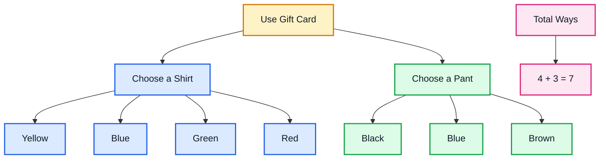
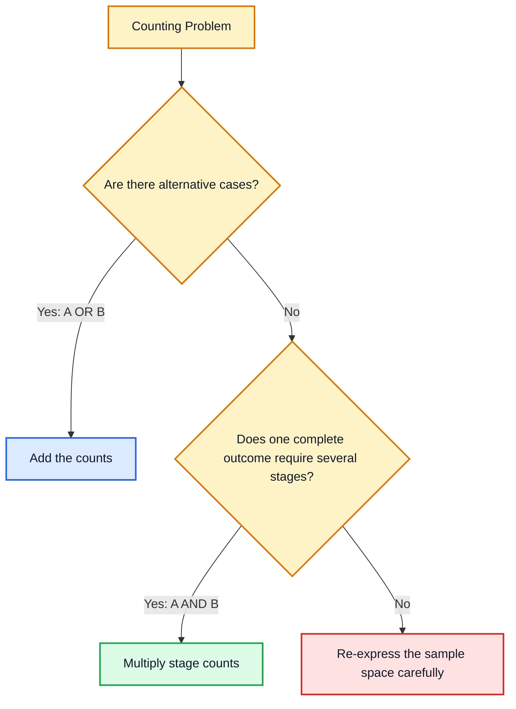
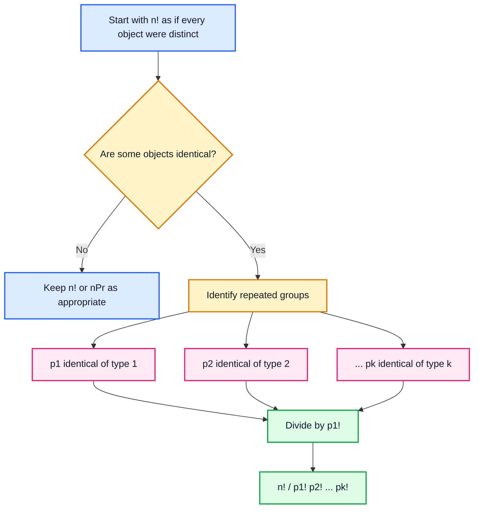

# Week 5 — Permutations & Combinations: Counting Principles, Factorials, and Permutations

> Detailed study notes prepared from the supplied YouTube transcripts.
>
> **Source scope:** The supplied material fully covers basic counting principles, factorials, permutations of distinct objects (with and without repetition), permutations of non-distinct objects, circular permutations, and algebraic manipulation of permutation formulas. **Combinations are introduced conceptually at the end, but the combination formula is not derived in the supplied transcript.**

---

## Table of Contents

1. [Why Counting Comes Before Probability](#1-why-counting-comes-before-probability)
2. [The Fundamental Principles of Counting](#2-the-fundamental-principles-of-counting)
   - [Addition Rule](#21-addition-rule-of-counting)
   - [Multiplication Rule](#22-multiplication-rule-of-counting)
   - [A Decision Rule: Add or Multiply?](#23-a-decision-rule-add-or-multiply)
3. [Factorials](#3-factorials)
   - [Definition](#31-definition-of-factorial)
   - [Why $0! = 1$](#32-why-0--1)
   - [Factorial Identities](#33-important-factorial-identities)
   - [Simplifying Factorial Expressions](#34-simplifying-factorial-expressions)
4. [Permutations: The Core Idea](#4-permutations-the-core-idea)
5. [Permutations of Distinct Objects Without Repetition](#5-permutations-of-distinct-objects-without-repetition)
   - [$nP_r$ Formula](#51-the-np_r-formula)
   - [Special Cases](#52-special-cases)
   - [Worked Examples](#53-worked-examples)
6. [Permutations with Repetition Allowed](#6-permutations-with-repetition-allowed)
7. [Permutations of Objects That Are Not Distinct](#7-permutations-of-objects-that-are-not-distinct)
8. [Circular Permutations](#8-circular-permutations)
9. [Solving Equations Involving Permutations](#9-solving-equations-involving-permutations)
10. [Permutation vs Combination: What the Transcript Introduces](#10-permutation-vs-combination-what-the-transcript-introduces)
11. [Master Decision Flowchart](#11-master-decision-flowchart)
12. [Formula Sheet](#12-formula-sheet)
13. [Common Mistakes and Exam Traps](#13-common-mistakes-and-exam-traps)
14. [Intuition Summary](#14-intuition-summary)
15. [Fun Facts](#15-fun-facts)
16. [Source Lectures](#16-source-lectures)

---

# 1. Why Counting Comes Before Probability

The transcript begins by connecting **descriptive statistics** with the next major idea: **uncertainty**.

Descriptive statistics tells us what the observed data looks like. Probability helps us reason about what **may happen** when the outcome is uncertain.

Before we can calculate many probabilities, however, we often need to answer two questions:

- How many outcomes are possible?
- How many of those outcomes satisfy the event we care about?

That is why **counting principles, factorials, permutations, and combinations** form a foundation for probability.

A common probability structure is:

$$
P(E)=\frac{\text{number of favorable outcomes}}{\text{number of possible outcomes}}
$$

when all outcomes are equally likely.

So, if we cannot count the denominator and numerator correctly, we cannot calculate the probability correctly.

### What?

Counting methods are systematic techniques for determining the number of possible outcomes without listing every outcome individually.

### Why?

Because direct enumeration quickly becomes impossible.

For example, arranging just 10 distinct objects gives:

$$
10! = 3,628,800
$$

possible arrangements.

Listing more than three million outcomes manually is clearly impractical.

### When?

Counting principles become useful in problems involving:

- passwords and codes,
- rankings,
- seating arrangements,
- committees with designated roles,
- digit formation,
- probability sample spaces,
- circular seating,
- repeated letters in words.


---

# 2. The Fundamental Principles of Counting

The first lecture develops two basic rules:

1. **Addition rule** — associated with an **OR** choice.
2. **Multiplication rule** — associated with an **AND / sequence of stages** choice.

These two rules are the engine behind nearly every later formula in the transcript.

---

## 2.1 Addition Rule of Counting

### What?

Suppose action $A$ can happen in $n_1$ ways and action $B$ can happen in $n_2$ ways, and the alternatives do not occur together in the situation being counted.

Then the number of ways to perform **$A$ OR $B$** is:

$$
\boxed{n_1+n_2}
$$

### Transcript Example: Shirt OR Pant

A gift card allows the customer to buy exactly one item:

- 4 possible shirts,
- 3 possible pants.

Because buying a shirt exhausts the option and prevents buying a pant with the same card, the alternatives are counted by addition:

$$
4+3=7
$$

So there are:

$$
\boxed{7}
$$

possible uses of the card.

### Intuition

Think of the word **OR** as creating separate branches.

You are choosing one branch or another.



### Why?

Because the outcomes in one group are alternatives to the outcomes in the other group.

### When?

Look for language such as:

- either ... or,
- choose one of these categories,
- one route or another route,
- one mutually exclusive case or another.

> **Important:** The simple addition rule $n_1+n_2$ assumes the counted sets do not overlap. If they overlap, double counting must be corrected. That more general inclusion-exclusion rule is not developed in this transcript.

---

## 2.2 Multiplication Rule of Counting

### What?

Suppose an activity consists of several stages:

- stage 1 can be completed in $n_1$ ways,
- stage 2 can be completed in $n_2$ ways,
- ...,
- stage $r$ can be completed in $n_r$ ways.

Then the number of complete outcomes is:

$$
\boxed{n_1n_2\cdots n_r}
$$

### Transcript Example 1: Shirt AND Pant

There are:

- 4 shirts,
- 3 pants.

Now the card allows one shirt **and** one pant.

For every shirt there are 3 pant choices:

$$
4\times3=12
$$

Therefore:

$$
\boxed{12}
$$

shirt-pant outfits are possible.

### Transcript Example 2: Shirt AND Pant AND Shoes

Add 2 shoe choices:

- 4 shirts,
- 3 pants,
- 2 pairs of shoes.

Then:

$$
4\times3\times2=24
$$

Hence:

$$
\boxed{24}
$$

complete outfits are possible.

### Why multiplication works

Each choice at one stage can be paired with **every valid choice** at the next stage.

The multiplication rule counts the number of root-to-leaf paths in a decision tree.


### When?

Use multiplication when the outcome requires completing multiple stages:

- choose a shirt **and** pants,
- fill position 1 **and** position 2 **and** position 3,
- choose a chairman **and** vice-chairman,
- create each character of a password.

---

## 2.3 A Decision Rule: Add or Multiply?

A useful first diagnostic is:

> **OR → usually add**  
> **AND / sequential stages → usually multiply**

But the real question is whether you are counting **alternative cases** or **completing a multi-stage outcome**.



---

## 2.4 Application: Alphanumeric Codes

The transcript considers a 6-position code where:

- first 2 positions are alphabets,
- next 4 positions are digits.

### Case A: Repetition allowed

For each alphabet position:

$$
26 \text{ choices}
$$

For each numeric position:

$$
10 \text{ choices} \quad (0,1,\ldots,9)
$$

Therefore:

$$
26\times26\times10\times10\times10\times10
$$

or

$$
26^2\times10^4
$$

Thus:

$$
676\times10,000=6,760,000
$$

So:

$$
\boxed{6,760,000}
$$

codes are possible.

> **Transcript-cleanup note:** One transcribed multiplication line appears to omit one factor of $10$, but the described six positions and the stated numerical result $6,760,000$ correspond to $26^2\times10^4$.

### Case B: Repetition not allowed

For letters:

$$
26\times25
$$

For digits:

$$
10\times9\times8\times7
$$

Hence:

$$
26\times25\times10\times9\times8\times7
$$

$$
=3,276,000
$$

So:

$$
\boxed{3,276,000}
$$

codes are possible.

### Key intuition

When repetition is **not** allowed, the number of available choices falls after each selection.

When repetition **is** allowed, the same number of choices remains available at every stage.

---

# 3. Factorials

Factorials provide compact notation for long descending products.

---

## 3.1 Definition of Factorial

For a positive integer $n$:

$$
\boxed{n!=n(n-1)(n-2)\cdots3\cdot2\cdot1}
$$

Examples:

$$
3!=3\times2\times1=6
$$

$$
5!=5\times4\times3\times2\times1=120
$$

$$
8!=8\times7\times6\times5\times4\times3\times2\times1=40,320
$$

### Transcript intuition: an 8-person race

There are 8 choices for first place.

Once first place is occupied, there are 7 choices for second place.

Then 6 choices, then 5, and so on.

By the multiplication rule:

$$
8\times7\times6\times5\times4\times3\times2\times1
$$

which is exactly:

$$
\boxed{8!}
$$

### What?

Factorial notation compresses a descending product into one symbol.

### Why?

Because permutation formulas are filled with descending products. Factorials make those formulas concise and easy to simplify.

### When?

Use factorials when:

- arranging all distinct objects,
- simplifying permutation expressions,
- converting consecutive products into compact notation.

---

## 3.2 Why $0! = 1$

The transcript states by convention:

$$
\boxed{0!=1}
$$

and also:

$$
\boxed{1!=1}
$$

This convention is essential because it keeps identities such as

$$
nP_n=\frac{n!}{(n-n)!}=\frac{n!}{0!}=n!
$$

consistent.

A useful intuition is that there is exactly **one way to arrange zero objects**: do nothing.

---

## 3.3 Important Factorial Identities

### Identity 1

$$
\boxed{n!=n(n-1)!}
$$

Example:

$$
6!=6\times5!
$$

### Identity 2

You can expand further:

$$
n!=n(n-1)(n-2)!
$$

and, more generally:

$$
n!=n(n-1)(n-2)\cdots(n-i+1)(n-i)!
$$

for suitable integer $i$.

### Why is this useful?

Because factorial fractions often contain large common products that cancel.

---

## 3.4 Simplifying Factorial Expressions

### Example 1

Simplify:

$$
\frac{6!}{3!}
$$

Expand only what is necessary:

$$
6!=6\times5\times4\times3!
$$

Therefore:

$$
\frac{6!}{3!}
=
\frac{6\times5\times4\times3!}{3!}
$$

Cancel $3!$:

$$
=6\times5\times4=120
$$

Hence:

$$
\boxed{120}
$$

### Principle

Do **not** expand every factorial all the way to 1 unless necessary.

Expand only until a common factorial appears.

---

### Example 2: Express a product using factorial notation

Express:

$$
25\times24\times23
$$

Notice:

$$
25!=25\times24\times23\times22!
$$

Therefore:

$$
25\times24\times23=\frac{25!}{22!}
$$

So:

$$
\boxed{25\times24\times23=\frac{25!}{22!}}
$$

### Pattern

For consecutive descending factors:

$$
n(n-1)(n-2)\cdots(n-r+1)=\frac{n!}{(n-r)!}
$$

This pattern becomes exactly the permutation formula.

---

# 4. Permutations: The Core Idea

The transcript formally defines a permutation as an:

> **ordered arrangement of all or some of $n$ objects**.

The most important word is:

## **ORDERED**

If changing the order produces a different outcome, permutations are relevant.

For example:

- $AB$ and $BA$ are different arrangements.
- Chairman = A, Vice-Chairman = B is different from Chairman = B, Vice-Chairman = A.

### Distinct objects

Objects are distinct when they can be individually distinguished.

Examples:

- three different people $A,B,C$,
- red, blue, and yellow balls,
- digits 1, 2, 3, 4, 5.

By contrast, in the word **DATA**, the two A's are not distinct for the purpose of spelling arrangements.

```mermaid
flowchart TD
    A[Permutation Question] --> B{Does order matter?}
    B -- Yes --> C[Permutation]
    C --> D{Are objects distinct?}
    D -- Yes --> E{Is repetition allowed?}
    E -- No --> F[nPr = n! / (n-r)!]
    E -- Yes --> G[n^r]
    D -- No --> H[n! / product of repeated-count factorials]
    B -- No --> I[Combination idea: selection rather than arrangement]

    classDef root fill:#fef3c7,stroke:#d97706,stroke-width:2px,color:#111827;
    classDef perm fill:#e0e7ff,stroke:#4f46e5,stroke-width:2px,color:#111827;
    classDef noRep fill:#dbeafe,stroke:#2563eb,stroke-width:2px,color:#111827;
    classDef rep fill:#dcfce7,stroke:#16a34a,stroke-width:2px,color:#111827;
    classDef repeated fill:#fce7f3,stroke:#db2777,stroke-width:2px,color:#111827;
    classDef combo fill:#ffedd5,stroke:#ea580c,stroke-width:2px,color:#111827;

    class A,B,D,E root;
    class C perm;
    class F noRep;
    class G rep;
    class H repeated;
    class I combo;
```

---

# 5. Permutations of Distinct Objects Without Repetition

Suppose:

- there are $n$ distinct objects,
- we arrange $r$ of them,
- repetition is not allowed,
- order matters.

The first position has:

$$
n
$$

choices.

The second has:

$$
n-1
$$

choices.

The third has:

$$
n-2
$$

choices.

The $r$th position has:

$$
n-r+1
$$

choices.

Therefore:

$$
n(n-1)(n-2)\cdots(n-r+1)
$$

possible arrangements exist.

> **Transcript-cleanup note:** One intermediate transcribed sentence says the $r$th position has $n-r-1$ choices. The subsequent product, factorial derivation, and final formula clearly use the correct term $n-r+1$.

---

## 5.1 The $nP_r$ Formula

The number of permutations of $r$ objects chosen from $n$ distinct objects without repetition is:

$$
\boxed{{}^nP_r=\frac{n!}{(n-r)!}}
$$

Alternative notation:

$$
P(n,r)=\frac{n!}{(n-r)!}
$$

### Derivation

Start with:

$$
{}^nP_r=n(n-1)(n-2)\cdots(n-r+1)
$$

Multiply and divide by $(n-r)!$:

$$
{}^nP_r
=
\frac{n(n-1)\cdots(n-r+1)(n-r)!}{(n-r)!}
$$

The numerator becomes $n!$:

$$
\boxed{{}^nP_r=\frac{n!}{(n-r)!}}
$$

---

## 5.2 Special Cases

### Case 1: $nP_0$

$$
{}^nP_0=\frac{n!}{n!}=1
$$

Therefore:

$$
\boxed{{}^nP_0=1}
$$

There is one ordered arrangement of zero selected objects.

---

### Case 2: $nP_1$

$$
{}^nP_1=\frac{n!}{(n-1)!}=n
$$

Therefore:

$$
\boxed{{}^nP_1=n}
$$

This makes intuitive sense: choosing one ordered position from $n$ objects gives $n$ possibilities.

---

### Case 3: $nP_n$

$$
{}^nP_n=\frac{n!}{0!}=n!
$$

Thus:

$$
\boxed{{}^nP_n=n!}
$$

So arranging all $n$ distinct objects is simply $n!$.

---

## 5.3 Worked Examples

### Example 1: Arrange A, B, C

All three distinct objects are used.

$$
n=3,\quad r=3
$$

Therefore:

$$
{}^3P_3=3!=6
$$

The arrangements are:

- ABC
- ACB
- BAC
- BCA
- CAB
- CBA

Hence:

$$
\boxed{6}
$$

---

### Example 2: Choose and arrange 2 from A, B, C

$$
n=3,\quad r=2
$$

$$
{}^3P_2=\frac{3!}{1!}=6
$$

The six ordered arrangements are:

$$
AB, BA, AC, CA, BC, CB
$$

Notice why order matters:

$$
AB\ne BA
$$

---

### Example 3: Arrange A, B, C, D

$$
n=4,\quad r=4
$$

$$
{}^4P_4=4!=24
$$

Thus:

$$
\boxed{24}
$$

arrangements are possible.

---

### Example 4: Arrange 2 from A, B, C, D

$$
n=4,\quad r=2
$$

$$
{}^4P_2=\frac{4!}{2!}=4\times3=12
$$

So:

$$
\boxed{12}
$$

ordered arrangements are possible.

---

### Example 5: Chairman and Vice-Chairman from 8 People

There are 8 people.

We need two different roles:

- chairman,
- vice-chairman.

Because the roles are different, order matters.

Because one person cannot hold both positions, repetition is not allowed.

Thus:

$$
n=8,\quad r=2
$$

$$
{}^8P_2=\frac{8!}{6!}=8\times7=56
$$

Therefore:

$$
\boxed{56}
$$

ways are possible.

### Why this is not merely “choose 2 people”

If A is chairman and B is vice-chairman, that differs from B being chairman and A being vice-chairman.

The labels of the roles create order.

---

### Example 6: Four-Digit Numbers from 1, 2, 3, 4, 5 Without Repetition

We need 4 positions from 5 distinct digits.

$$
n=5,\quad r=4
$$

$$
{}^5P_4=\frac{5!}{1!}=120
$$

Therefore:

$$
\boxed{120}
$$

four-digit numbers can be formed.

---

### Example 7: How Many of Those Four-Digit Numbers Are Even?

Available digits:

$$
\{1,2,3,4,5\}
$$

An even number must end in:

$$
2 \text{ or } 4
$$

So split into two cases.

#### Case 1: Last digit is 2

The remaining 3 positions can be filled from 4 remaining digits:

$$
{}^4P_3=4\times3\times2=24
$$

#### Case 2: Last digit is 4

Again:

$$
{}^4P_3=24
$$

Since the cases are alternatives, use addition:

$$
24+24=48
$$

Thus:

$$
\boxed{48}
$$

even four-digit numbers are possible.

### Important lesson

This example combines both fundamental counting rules:

- **multiplication** inside each case,
- **addition** across the two possible ending digits.

---

### Example 8: Six People and Ten Cinema Seats

There are 10 distinct seat positions and 6 distinct people.

If the people may sit anywhere:

$$
{}^{10}P_6
$$

arrangements are possible.

Expanded:

$$
{}^{10}P_6=10\times9\times8\times7\times6\times5
$$

$$
=151,200
$$

So:

$$
\boxed{151,200}
$$

seating arrangements are possible.

---

### Example 9: All Four Empty Seats Must Be Together

With 10 seats and 6 people, there are 4 empty seats.

If all four empty seats must be consecutive, treat the group of empty seats as one **block**.

Then the objects become:

- 6 people,
- 1 block of empty seats.

So there are 7 effective positions/objects.

The transcript expresses the count as:

$$
{}^7P_6
$$

which equals:

$$
7!=5040
$$

Thus:

$$
\boxed{5040}
$$

arrangements satisfy the condition.

### Block method intuition

Whenever several items must stay together, temporarily compress them into a single super-object.

---

# 6. Permutations with Repetition Allowed

Now suppose:

- there are $n$ distinct choices,
- we fill $r$ ordered positions,
- the same object may be used again.

Each position has $n$ choices.

Thus:

$$
\underbrace{n\times n\times\cdots\times n}_{r\text{ times}}
$$

which gives:

$$
\boxed{n^r}
$$

---

## Example 1: A, B, C — Three Positions with Repetition

Each of the 3 positions can contain A, B, or C.

$$
3\times3\times3=3^3=27
$$

Therefore:

$$
\boxed{27}
$$

arrangements are possible.

Examples include:

- AAA
- AAB
- ABA
- BAC
- CCC

Repeated symbols are legal because repetition is allowed.

---

## Example 2: A, B, C — Two Positions with Repetition

Each position has 3 choices:

$$
3\times3=3^2=9
$$

Therefore:

$$
\boxed{9}
$$

possible ordered arrangements exist.

They are:

$$
AA, AB, AC, BA, BB, BC, CA, CB, CC
$$

---

## Without Repetition vs With Repetition

| Situation | Choices per position | Formula |
|---|---:|---:|
| Order matters, no repetition | choices decrease | $\displaystyle {}^nP_r=\frac{n!}{(n-r)!}$ |
| Order matters, repetition allowed | always $n$ choices | $\displaystyle n^r$ |

### Intuition

Without replacement:

$$
n,(n-1),(n-2),\ldots
$$

With replacement/repetition:

$$
n,n,n,\ldots
$$

That single difference changes the entire formula.

---

# 7. Permutations of Objects That Are Not Distinct

The previous formulas treated the available objects as distinguishable.

But what happens when some objects are identical?

If identical objects are artificially treated as different, we overcount.

The correction is to divide by the number of internal rearrangements of each repeated group.

---

## 7.1 One Repeated Type

If there are $n$ total objects and $p$ are identical, while the rest are distinct:

$$
\boxed{\frac{n!}{p!}}
$$

### Transcript Example: DATA

The word DATA has 4 letters:

$$
D,A,T,A
$$

If the two A's were temporarily labelled $A_1$ and $A_2$, then all four objects would appear distinct:

$$
4!=24
$$

arrangements.

But swapping $A_1$ and $A_2$ does not create a new visible word.

The two A's can be internally permuted in:

$$
2!=2
$$

ways.

Thus the distinct arrangements are:

$$
\frac{4!}{2!}=\frac{24}{2}=12
$$

Therefore:

$$
\boxed{12}
$$

unique arrangements of DATA exist.

### Why divide?

Every true visible arrangement was counted $2!$ times when the two identical A's were artificially labelled.

So division removes that overcounting.

---

## 7.2 Several Repeated Types

If there are $n$ objects where:

- $p_1$ are of one kind,
- $p_2$ are of another kind,
- ...,
- $p_k$ are of the $k$th kind,

with

$$
p_1+p_2+\cdots+p_k=n,
$$

then the number of distinct linear permutations is:

$$
\boxed{\frac{n!}{p_1!p_2!\cdots p_k!}}
$$

---

## 7.3 Transcript Example: STATISTICS

The word **STATISTICS** has 10 letters.

Counts:

- S appears 3 times,
- T appears 3 times,
- A appears 1 time,
- I appears 2 times,
- C appears 1 time.

Thus:

$$
n=10
$$

and

$$
p_1=3,\quad p_2=3,\quad p_3=1,\quad p_4=2,\quad p_5=1
$$

The number of distinct permutations is:

$$
\frac{10!}{3!3!1!2!1!}
$$

Since $1!=1$:

$$
=\frac{10!}{3!3!2!}
$$

$$
=\frac{3,628,800}{6\times6\times2}
$$

$$
=\frac{3,628,800}{72}
$$

$$
=50,400
$$

Therefore:

$$
\boxed{50,400}
$$

unique arrangements are possible.



---

# 8. Circular Permutations

Linear arrangements and circular arrangements are fundamentally different.

In a row:

$$
ABCD
$$

and

$$
BCDA
$$

are different because the positions are fixed from left to right.

Around a circle, rotating everyone together does not change who is next to whom.

So rotations represent the same circular arrangement.

---

## 8.1 Why Fix One Object?

Suppose $n$ distinct people sit around a round table.

If we fix one person's position, then only the remaining $n-1$ people need to be arranged.

Therefore, when clockwise and anticlockwise arrangements are considered different:

$$
\boxed{(n-1)!}
$$

### Example: 4 People

Fix person A.

Arrange B, C, D around A:

$$
3!=6
$$

Therefore:

$$
\boxed{6}
$$

circular arrangements exist when mirror-image orders are treated as different.

---

## 8.2 Clockwise and Anticlockwise Considered the Same

If a circular arrangement and its mirror image are considered equivalent, then every arrangement is paired with its reverse.

Therefore divide by 2:

$$
\boxed{\frac{(n-1)!}{2}}
$$

This situation arises in settings where clockwise vs anticlockwise orientation does not create a distinguishable arrangement.

### Important distinction

| Circular interpretation | Number of arrangements |
|---|---:|
| Clockwise and anticlockwise different | $\displaystyle (n-1)!$ |
| Clockwise and anticlockwise same | $\displaystyle \frac{(n-1)!}{2}$ |

```mermaid
flowchart TD
    A[Circular Arrangement] --> B[Fix one object to remove rotational duplicates]
    B --> C[Arrange remaining n-1 objects]
    C --> D[(n-1)!]
    D --> E{Are mirror images considered the same?}
    E -- No --> F[Answer: (n-1)!]
    E -- Yes --> G[Pair each order with its reverse]
    G --> H[Answer: (n-1)! / 2]

    classDef circle fill:#ede9fe,stroke:#7c3aed,stroke-width:2px,color:#111827;
    classDef step fill:#dbeafe,stroke:#2563eb,stroke-width:2px,color:#111827;
    classDef decision fill:#fef3c7,stroke:#d97706,stroke-width:2px,color:#111827;
    classDef result fill:#dcfce7,stroke:#16a34a,stroke-width:2px,color:#111827;

    class A circle;
    class B,C,D,G step;
    class E decision;
    class F,H result;
```

---

# 9. Solving Equations Involving Permutations

Once we know

$$
{}^nP_r=\frac{n!}{(n-r)!},
$$

we can solve equations in which $n$ or $r$ is unknown.

The main strategy is:

1. Replace permutation notation with factorial notation.
2. Expand only enough factorial terms to create cancellation.
3. Cancel common factorials.
4. Solve the resulting algebraic equation.
5. Check whether the solution is valid for a permutation count.

---

## 9.1 Example: Solve $nP_4=20(nP_2)$

Given:

$$
{}^nP_4=20({}^nP_2)
$$

Use the formula:

$$
\frac{n!}{(n-4)!}=20\frac{n!}{(n-2)!}
$$

Cancel $n!$:

$$
\frac{1}{(n-4)!}=\frac{20}{(n-2)!}
$$

Cross multiply:

$$
(n-2)!=20(n-4)!
$$

Expand:

$$
(n-2)!=(n-2)(n-3)(n-4)!
$$

Therefore:

$$
(n-2)(n-3)(n-4)!=20(n-4)!
$$

Cancel $(n-4)!$:

$$
(n-2)(n-3)=20
$$

Expand:

$$
n^2-5n+6=20
$$

$$
n^2-5n-14=0
$$

Factor:

$$
(n-7)(n+2)=0
$$

So:

$$
n=7 \quad \text{or} \quad n=-2
$$

A number of objects cannot be negative, so:

$$
\boxed{n=7}
$$

---

## 9.2 Example: Solve

$$
\frac{{}^nP_4}{{}^{n-1}P_4}=\frac{5}{3}
$$

Use factorial notation:

$$
\frac{\frac{n!}{(n-4)!}}{\frac{(n-1)!}{(n-5)!}}
=
\frac{5}{3}
$$

Rewrite division as multiplication:

$$
\frac{n!}{(n-4)!}\times\frac{(n-5)!}{(n-1)!}
=
\frac{5}{3}
$$

Use:

$$
n!=n(n-1)!
$$

and:

$$
(n-4)!=(n-4)(n-5)!
$$

Then:

$$
\frac{n}{n-4}=\frac{5}{3}
$$

Cross multiply:

$$
3n=5(n-4)
$$

$$
3n=5n-20
$$

$$
2n=20
$$

Hence:

$$
\boxed{n=10}
$$

---

## 9.3 Example: Solve an Equation for $r$

The transcript considers:

$$
{}^5P_r=2\left({}^6P_{r-1}\right)
$$

Using factorial notation:

$$
\frac{5!}{(5-r)!}
=
2\frac{6!}{(7-r)!}
$$

Since:

$$
(7-r)!=(7-r)(6-r)(5-r)!
$$

and

$$
6!=6\cdot5!,
$$

cancellation leads to:

$$
(7-r)(6-r)=12
$$

Expand:

$$
r^2-13r+42=12
$$

$$
r^2-13r+30=0
$$

Factor:

$$
(r-3)(r-10)=0
$$

So the algebraic candidates are:

$$
r=3 \quad \text{or} \quad r=10
$$

### Domain check — important

The transcript reports both algebraic roots. However, under the permutation definition used in these lectures, ${}^5P_r$ requires:

$$
0\le r\le5
$$

Therefore $r=10$ is not admissible, leaving:

$$
\boxed{r=3}
$$

> This domain check is an explicit mathematical clarification added to the transcript's algebraic result.

---

# 10. Permutation vs Combination: What the Transcript Introduces

The transcript closes by contrasting arrangements and selections.

### Permutation

Order matters:

$$
AB\ne BA
$$

Examples:

- chairman and vice-chairman,
- first and second place,
- digit sequences,
- seating positions.

### Combination

Order does not matter:

$$
AB=BA
$$

Example introduced in the transcript:

> choose 2 people from 3 people.

If the same pair is selected, reversing the names does not create a new selection.

### Critical scope note

The supplied transcript **introduces combinations but stops before deriving the combination formula**. Therefore this README does not attribute an $nC_r$ formula to the supplied lecture.

That distinction is worth remembering:

> **Permutation = arrange**  
> **Combination = select**

---

# 11. Master Decision Flowchart

Use this flow whenever you face a counting problem from this material.

```mermaid
flowchart TD
    A[Start: What exactly counts as a different outcome?] --> B{Alternative cases OR sequential stages?}
    B -- Alternative cases --> C[Use Addition Rule across disjoint cases]
    B -- Sequential stages --> D[Use Multiplication Rule]

    D --> E{Does order matter?}
    E -- No --> F[Combination / selection idea]
    E -- Yes --> G{Linear or circular?}

    G -- Circular --> H{Are clockwise and anticlockwise distinct?}
    H -- Yes --> I[(n-1)!]
    H -- No --> J[(n-1)! / 2]

    G -- Linear --> K{Are all objects distinct?}
    K -- No --> L[n! / p1!p2!...pk!]
    K -- Yes --> M{Is repetition allowed?}
    M -- Yes --> N[n^r]
    M -- No --> O[nPr = n! / (n-r)!]

    classDef start fill:#f3e8ff,stroke:#9333ea,stroke-width:2px,color:#111827;
    classDef decision fill:#fef3c7,stroke:#d97706,stroke-width:2px,color:#111827;
    classDef add fill:#dbeafe,stroke:#2563eb,stroke-width:2px,color:#111827;
    classDef mult fill:#cffafe,stroke:#0891b2,stroke-width:2px,color:#111827;
    classDef perm fill:#dcfce7,stroke:#16a34a,stroke-width:2px,color:#111827;
    classDef repeat fill:#fce7f3,stroke:#db2777,stroke-width:2px,color:#111827;
    classDef circular fill:#ffedd5,stroke:#ea580c,stroke-width:2px,color:#111827;

    class A start;
    class B,E,G,H,K,M decision;
    class C add;
    class D mult;
    class O,N,L perm;
    class F repeat;
    class I,J circular;
```

---

# 12. Formula Sheet

## Fundamental counting

### Addition rule

For disjoint alternatives:

$$
\boxed{n_1+n_2+\cdots+n_k}
$$

### Multiplication rule

For successive stages:

$$
\boxed{n_1n_2\cdots n_k}
$$

---

## Factorial

$$
\boxed{n!=n(n-1)(n-2)\cdots2\cdot1}
$$

$$
\boxed{0!=1}
$$

$$
\boxed{n!=n(n-1)!}
$$

---

## Distinct objects, order matters, no repetition

$$
\boxed{{}^nP_r=\frac{n!}{(n-r)!}}
$$

Special cases:

$$
\boxed{{}^nP_0=1}
$$

$$
\boxed{{}^nP_1=n}
$$

$$
\boxed{{}^nP_n=n!}
$$

---

## Distinct objects, order matters, repetition allowed

$$
\boxed{n^r}
$$

---

## Non-distinct objects

If repeated group sizes are $p_1,p_2,\ldots,p_k$:

$$
\boxed{\frac{n!}{p_1!p_2!\cdots p_k!}}
$$

---

## Circular permutations

Clockwise and anticlockwise different:

$$
\boxed{(n-1)!}
$$

Clockwise and anticlockwise same:

$$
\boxed{\frac{(n-1)!}{2}}
$$

---

# 13. Common Mistakes and Exam Traps

## Mistake 1: Seeing “choose” and automatically using combinations

Words alone are not enough.

Example:

> Choose a chairman and vice-chairman.

Although the word “choose” appears, the roles are different.

Therefore:

$$
AB\ne BA
$$

and order matters.

---

## Mistake 2: Ignoring repetition

Compare:

### No repetition

$$
{}^nP_r=\frac{n!}{(n-r)!}
$$

### Repetition allowed

$$
n^r
$$

Ask:

> After I use an object once, is it still available for the next position?

If yes, repetition is allowed.

---

## Mistake 3: Treating identical objects as distinct

For DATA:

$$
4!=24
$$

would overcount because the two A's are indistinguishable.

Correct count:

$$
\frac{4!}{2!}=12
$$

---

## Mistake 4: Using $n!$ when only $r$ positions are filled

If only $r$ of $n$ objects are arranged:

$$
{}^nP_r
$$

not generally $n!$.

Only when:

$$
r=n
$$

do we get:

$$
{}^nP_n=n!
$$

---

## Mistake 5: Forgetting place-value constraints

For even numbers, the last digit must satisfy a special condition.

Often the best strategy is:

1. fix the constrained position first,
2. count the remaining positions,
3. add across valid cases if necessary.

---

## Mistake 6: Counting rotations separately in a circle

Circular seating has no fixed “first” position.

Fix one person, then arrange the rest:

$$
(n-1)!
$$

---

## Mistake 7: Expanding factorials unnecessarily

Instead of expanding:

$$
\frac{20!}{18!}
$$

all the way, write:

$$
\frac{20\times19\times18!}{18!}
$$

Then:

$$
=20\times19
$$

This reduces arithmetic errors.

---

## Mistake 8: Keeping algebraic roots that violate counting constraints

A permutation parameter such as $r$ must satisfy the relevant domain restrictions.

Always check the algebraic result against the original counting problem.

---

# 14. Intuition Summary

The whole topic can be understood through a few mental models.

## Model 1: Branches

Alternative branches → **add**.

$$
\text{case 1} + \text{case 2}
$$

---

## Model 2: Slots

Several slots to fill → multiply the choices available at each slot.

$$
\text{choices for slot 1}\times\text{choices for slot 2}\times\cdots
$$

---

## Model 3: Shrinking choice pool

No repetition:

$$
n,(n-1),(n-2),\ldots
$$

which leads to:

$$
{}^nP_r
$$

---

## Model 4: Constant choice pool

Repetition allowed:

$$
n,n,n,\ldots,n
$$

which leads to:

$$
n^r
$$

---

## Model 5: Remove overcounting

Identical objects cause duplicate arrangements.

Count as if distinct, then divide by their internal rearrangements:

$$
\frac{n!}{p_1!p_2!\cdots p_k!}
$$

---

## Model 6: Remove rotational duplicates

In a circle, rotations do not create new relative arrangements.

Fix one object:

$$
(n-1)!
$$

If reflection is also equivalent:

$$
\frac{(n-1)!}{2}
$$

---

# 15. Fun Facts

### Fun Fact 1: Factorials grow extremely fast

A small increase in $n$ produces a huge increase in $n!$.

For example:

$$
8!=40,320
$$

but

$$
10!=3,628,800
$$

This explosive growth is one reason brute-force enumeration quickly becomes computationally expensive.

---

### Fun Fact 2: Password spaces are multiplication-rule problems

Every independent character position multiplies the number of possible strings.

If a password had 10 positions and every position could contain any one of 62 alphanumeric characters, repetition allowed, the same counting idea would be:

$$
62^{10}
$$

The transcript's six-position code is the same idea with different allowed character sets by position.

---

### Fun Fact 3: “Same people, different roles” creates permutations

Many students associate permutations only with physical arrangements in a row.

But job titles also create ordered positions.

Chairman/vice-chairman, gold/silver/bronze, president/secretary, and first/second/third are all examples where **role labels create order**.

---

### Fun Fact 4: Repeated-letter formulas are really overcounting corrections

The denominator in

$$
\frac{n!}{p_1!p_2!\cdots p_k!}
$$

is not an arbitrary memorized expression.

Each repeated group can be internally rearranged without changing the visible outcome, so we divide away those invisible duplicates.

---

### Fun Fact 5: Circular permutations remove a reference point

In a row, the left end provides a natural starting point.

A circle has no natural “first seat.” Fixing one object creates an artificial reference point and removes rotational duplicates.

---

# 16. Source Lectures

These notes were constructed from the supplied transcript containing:

1. **W5_L1 — Permutations & combinations: basic principles of counting**  
   YouTube: https://www.youtube.com/watch/TeARzjZMra0

2. **W5_L2 — Permutations & combinations: factorials**  
   YouTube: https://www.youtube.com/watch/kV1nGXR7c0I

3. **Lecture 5.3 — Permutations and Combinations: Permutations — Distinct Objects**  
   YouTube: https://www.youtube.com/watch/7qSuq3jUxwY

4. **Lecture 5.4 — Permutations and Combinations: Permutations — Objects Not Distinct**  
   YouTube: https://www.youtube.com/watch/Zrhz44TVc14

---

# Final One-Minute Revision

- **OR cases:** add.
- **AND / successive stages:** multiply.
- **Factorial:** $n!=n(n-1)\cdots1$ and $0!=1$.
- **Permutation means order matters.**
- **Distinct, no repetition:**

$$
{}^nP_r=\frac{n!}{(n-r)!}
$$

- **Distinct, repetition allowed:**

$$
n^r
$$

- **Repeated identical objects:**

$$
\frac{n!}{p_1!p_2!\cdots p_k!}
$$

- **Circular, direction distinct:**

$$
(n-1)!
$$

- **Circular, reverse direction equivalent:**

$$
\frac{(n-1)!}{2}
$$

- **Permutation vs combination:** permutation cares about order; combination does not.
- The supplied transcript introduces combinations but does not derive the combination formula.

---

> **Best exam habit:** Before touching a formula, ask: **What makes two outcomes different? Does order matter? Can an object repeat? Are any objects identical? Is the arrangement linear or circular?** The correct formula usually becomes obvious after those questions.
