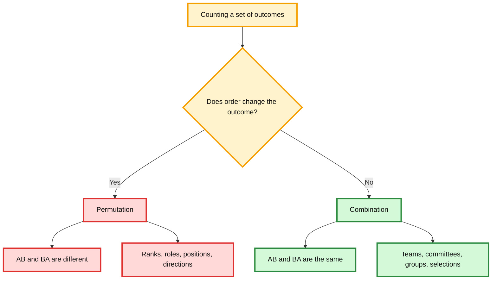
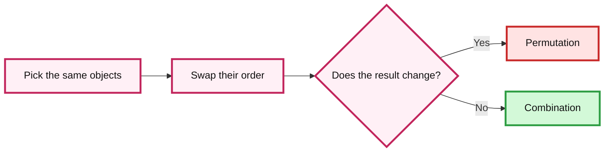
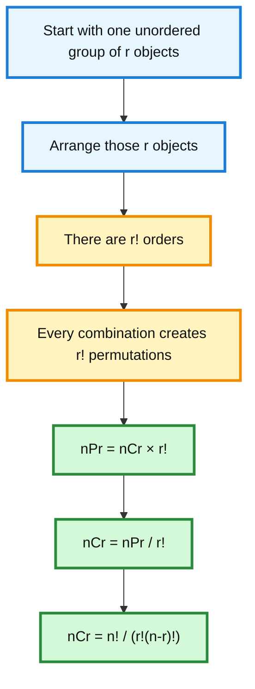
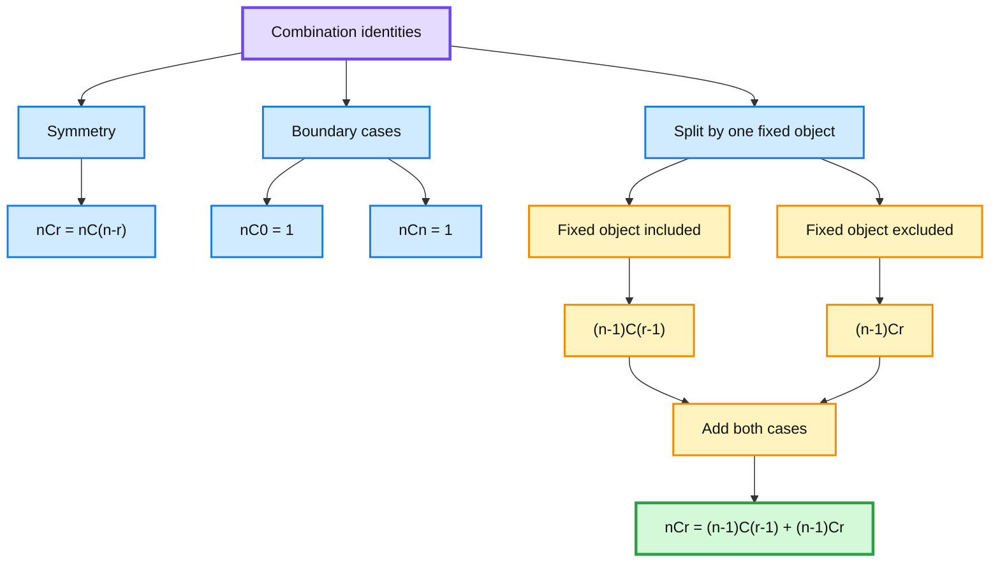
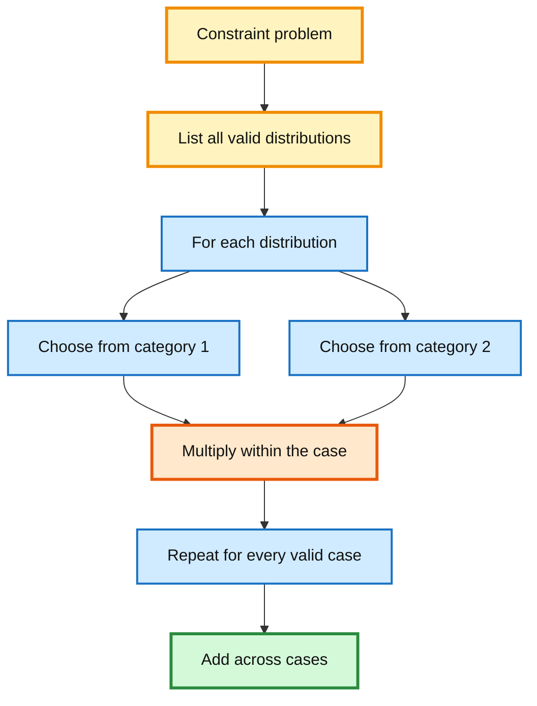
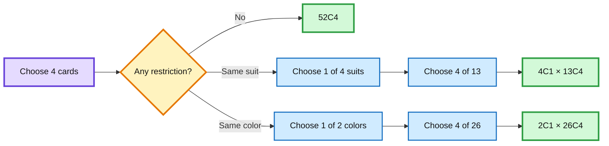
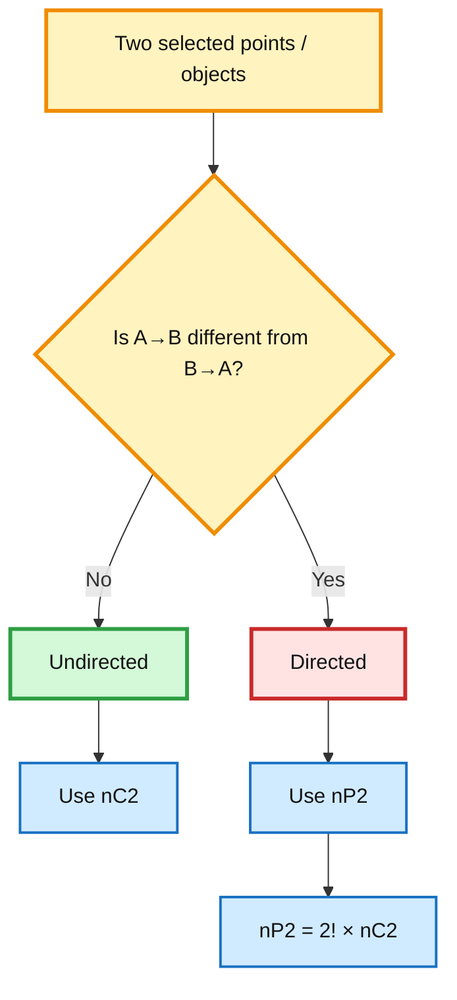
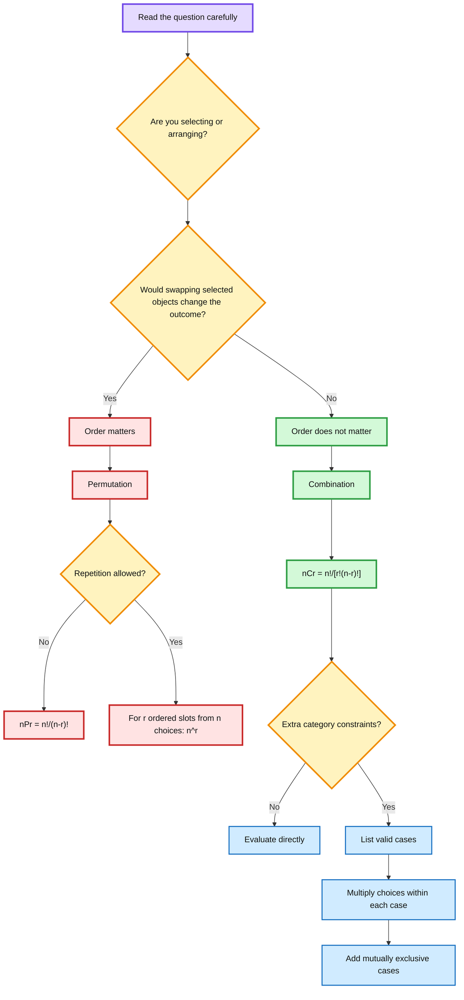

# Permutations & Combinations — Combinations and Applications

> Detailed study notes prepared from the supplied YouTube transcripts:
>
> - **L6.1: Permutations and Combinations — Combinations**
> - **L6.2: Permutations and Combinations — Applications**
>
> These notes focus on **what a combination is, why it is needed, how the formula is derived, when to use combinations instead of permutations, useful identities, and worked applications**.

---

## Table of Contents

1. [Big Picture](#1-big-picture)
2. [The Core Question: Does Order Matter?](#2-the-core-question-does-order-matter)
3. [What Is a Combination?](#3-what-is-a-combination)
4. [Combination vs Permutation](#4-combination-vs-permutation)
5. [Deriving the Combination Formula](#5-deriving-the-combination-formula)
6. [Notation and the Binomial Coefficient](#6-notation-and-the-binomial-coefficient)
7. [Important Combination Identities](#7-important-combination-identities)
8. [How to Recognize Combination Problems](#8-how-to-recognize-combination-problems)
9. [Application 1 — Selecting Questions in an Exam](#9-application-1--selecting-questions-in-an-exam)
10. [Application 2 — Playing Cards](#10-application-2--playing-cards)
11. [Application 3 — Cricket Team Selection](#11-application-3--cricket-team-selection)
12. [Application 4 — Lines Joining Points](#12-application-4--lines-joining-points)
13. [Application 5 — Medals vs Qualifiers](#13-application-5--medals-vs-qualifiers)
14. [Application 6 — Representatives vs Captain/Vice-Captain](#14-application-6--representatives-vs-captainvice-captain)
15. [Directed vs Undirected Connections](#15-directed-vs-undirected-connections)
16. [Master Decision Flowchart](#16-master-decision-flowchart)
17. [Common Mistakes and Exam Traps](#17-common-mistakes-and-exam-traps)
18. [Formula Sheet](#18-formula-sheet)
19. [Quick Revision Table](#19-quick-revision-table)
20. [Practice Questions](#20-practice-questions)
21. [Answers to Practice Questions](#21-answers-to-practice-questions)
22. [Fun Facts and Intuition](#22-fun-facts-and-intuition)
23. [One-Minute Revision](#23-one-minute-revision)

---

# 1. Big Picture

The previous counting material introduced:

- addition principle of counting,
- multiplication principle of counting,
- factorial notation,
- permutations of distinct objects,
- permutations with repetition,
- permutations when objects are not distinct.

The new topic is **combinations**.

The most important distinction is:

> **Permutation = arrangement where order matters.**  
> **Combination = selection where order does not matter.**

This distinction is fundamental because the **same set of objects** can produce many permutations but only one combination.

For example, if we choose students \(A\) and \(B\):

- as a combination: \(AB = BA\),
- as a permutation: \(AB \neq BA\).

That single difference explains the extra \(r!\) factor connecting permutations and combinations.

---

## Why combinations are needed

Suppose a class contains 10 students and we want to **select 3 students** for a committee.

If the committee contains Anuj, Ravi and Priya, then:

- Anuj–Ravi–Priya,
- Ravi–Priya–Anuj,
- Priya–Anuj–Ravi,

all describe the **same committee**.

Counting them separately would overcount the same selection.

Combinations remove this overcounting.

---

## Concept map

---

# 2. The Core Question: Does Order Matter?

Before applying any formula, ask:

> **If I swap the selected objects, does the outcome become different?**

This is more reliable than memorizing keywords.

---

## Example A — Gold, silver and bronze medals

Suppose 8 athletes compete and we award:

1. Gold
2. Silver
3. Bronze

If \(A,D,F\) receive the medals in that order:

- \(A\): Gold
- \(D\): Silver
- \(F\): Bronze

this is different from:

- \(D\): Gold
- \(A\): Silver
- \(F\): Bronze

Although the same three athletes are involved, their **positions are different**.

Therefore:

$$
\boxed{\text{Use permutation}}
$$

---

## Example B — Top 3 qualify for the next round

Now suppose the top 3 athletes simply advance.

If the qualifiers are \(A,B,C\), then whether they finished as:

- \(A,B,C\),
- \(B,C,A\),
- \(C,A,B\),

does not change the group of qualifiers.

Therefore:

$$
\boxed{\text{Use combination}}
$$

---

## Fast test

---

# 3. What Is a Combination?

A **combination** is a selection of objects in which **order is irrelevant**.

Suppose there are three students:

$$
A,\;B,\;C
$$

and we select two.

The possible groups are:

$$
AB,\quad AC,\quad BC
$$

There are only **3 combinations**.

Why not include \(BA\), \(CA\), and \(CB\)?

Because:

$$
AB=BA
$$

$$
AC=CA
$$

$$
BC=CB
$$

when we are only selecting groups.

---

## Formal meaning

From \(n\) distinct objects, selecting \(r\) objects without considering order is called a combination.

The number of such selections is written as:

$$
\binom{n}{r}
$$

or equivalently:

$$
{}^nC_r
$$

and is read as:

> “\(n\) choose \(r\)”

---

## What do \(n\) and \(r\) mean?

- \(n\) = total number of available distinct objects
- \(r\) = number of objects selected

with:

$$
0\le r\le n
$$

---

# 4. Combination vs Permutation

This is the central concept of the lecture.

| Feature | Permutation | Combination |
|---|---|---|
| Main idea | Arrangement | Selection |
| Order | Matters | Does not matter |
| \(AB\) vs \(BA\) | Different | Same |
| Formula | \({}^nP_r\) | \({}^nC_r\) |
| Common contexts | ranks, seats, offices, codes | teams, committees, subsets |
| Relationship | counts ordered selections | counts unordered selections |

---

## Formula for permutation

For \(r\) objects chosen from \(n\) distinct objects without repetition:

$$
{}^nP_r=\frac{n!}{(n-r)!}
$$

---

## Formula for combination

$$
\boxed{
{}^nC_r=\frac{n!}{r!(n-r)!}
}
$$

---

## Why is combination smaller?

Every group of \(r\) selected objects can itself be arranged in:

$$
r!
$$

different orders.

So each one combination corresponds to \(r!\) permutations.

Therefore:

$$
\boxed{
{}^nC_r\times r!={}^nP_r
}
$$

or:

$$
\boxed{
{}^nP_r=r!\,{}^nC_r
}
$$

and consequently:

$$
\boxed{
{}^nC_r=\frac{{}^nP_r}{r!}
}
$$

---

# 5. Deriving the Combination Formula

This is one of the most important derivations in the transcript.

Suppose we choose \(r\) objects from \(n\) distinct objects.

---

## Step 1 — Count ordered selections

The number of permutations is:

$$
{}^nP_r=\frac{n!}{(n-r)!}
$$

---

## Step 2 — Recognize overcounting

Each selected group of \(r\) objects can be rearranged among itself in:

$$
r!
$$

ways.

So one combination produces \(r!\) permutations.

Thus:

$$
{}^nC_r\times r!={}^nP_r
$$

---

## Step 3 — Substitute permutation formula

$$
{}^nC_r\times r!
=
\frac{n!}{(n-r)!}
$$

Divide both sides by \(r!\):

$$
{}^nC_r
=
\frac{n!}{r!(n-r)!}
$$

Hence:

$$
\boxed{
{}^nC_r=\frac{n!}{r!(n-r)!}
}
$$

---

## Visual intuition

---

## Example: choosing 2 from 3

Permutation count:

$$
{}^3P_2=\frac{3!}{(3-2)!}=6
$$

The combinations are:

$$
AB,\;AC,\;BC
$$

Each combination has:

$$
2!=2
$$

orders.

Therefore:

$$
{}^3C_2
=
\frac{{}^3P_2}{2!}
=
\frac{6}{2}
=
3
$$

---

# 6. Notation and the Binomial Coefficient

The combination count may be written as:

$$
{}^nC_r
$$

or:

$$
\binom{n}{r}
$$

Both mean:

$$
\frac{n!}{r!(n-r)!}
$$

The notation:

$$
\binom{n}{r}
$$

is also called a **binomial coefficient**.

---

## Why is it called a binomial coefficient?

This transcript only states the terminology and does not derive the binomial theorem. The important point for this lecture is:

$$
\binom{n}{r}
=
{}^nC_r
$$

and both represent the number of ways of selecting \(r\) objects from \(n\) distinct objects when order does not matter.

---

# 7. Important Combination Identities

The transcript introduces three especially useful identities.

---

## Identity 1 — Symmetry

$$
\boxed{
\binom{n}{r}
=
\binom{n}{n-r}
}
$$

---

## Algebraic derivation

Start with:

$$
\binom{n}{r}
=
\frac{n!}{r!(n-r)!}
$$

Since multiplication in the denominator is commutative:

$$
\frac{n!}{r!(n-r)!}
=
\frac{n!}{(n-r)!r!}
$$

Therefore:

$$
\boxed{
\binom{n}{r}
=
\binom{n}{n-r}
}
$$

---

## Intuition: selecting vs rejecting

Suppose we have \(n\) people and select \(r\).

Selecting \(r\) people automatically means rejecting:

$$
n-r
$$

people.

Therefore:

> Selecting \(r\) people is equivalent to deciding which \(n-r\) people are not selected.

### Example

Choosing 2 people from 5:

$$
\binom{5}{2}=10
$$

is equivalent to rejecting 3 people from 5:

$$
\binom{5}{3}=10
$$

---

## Identity 2 — Selecting all or none

### Selecting all \(n\)

$$
\binom{n}{n}
=
\frac{n!}{n!0!}
$$

Since:

$$
0!=1
$$

we get:

$$
\boxed{
\binom{n}{n}=1
}
$$

There is exactly one way to select everyone.

---

### Selecting none

$$
\binom{n}{0}
=
\frac{n!}{0!n!}
=
1
$$

Hence:

$$
\boxed{
\binom{n}{0}=1
}
$$

There is exactly one empty selection.

---

## Identity 3 — Pascal-type identity

The transcript introduces:

$$
\boxed{
\binom{n}{r}
=
\binom{n-1}{r-1}
+
\binom{n-1}{r}
}
$$

This identity is extremely useful.

---

## Intuition using one fixed object

Suppose we have \(n\) objects and must choose \(r\).

Pick one particular object, say \(A\).

Every valid selection falls into exactly one of two cases:

### Case 1 — \(A\) is selected

Then we need only:

$$
r-1
$$

more objects from the remaining:

$$
n-1
$$

objects.

Number of ways:

$$
\binom{n-1}{r-1}
$$

### Case 2 — \(A\) is not selected

Then all \(r\) objects must be chosen from the remaining \(n-1\).

Number of ways:

$$
\binom{n-1}{r}
$$

The two cases are mutually exclusive, so we add:

$$
\boxed{
\binom{n}{r}
=
\binom{n-1}{r-1}
+
\binom{n-1}{r}
}
$$

---

## Transcript example: choose 3 from 5

Let the objects be:

$$
A,B,C,D,E
$$

Fix \(A\).

### If \(A\) is selected

Choose 2 more from \(B,C,D,E\):

$$
\binom{4}{2}
$$

### If \(A\) is not selected

Choose all 3 from \(B,C,D,E\):

$$
\binom{4}{3}
$$

Therefore:

$$
\binom{5}{3}
=
\binom{4}{2}
+
\binom{4}{3}
$$

Numerically:

$$
10=6+4
$$

---

## Identity map

---

# 8. How to Recognize Combination Problems

Combination problems usually involve **selection without roles or order**.

Common cues include:

- choose,
- select,
- form a group,
- form a committee,
- form a team,
- choose questions,
- choose cards,
- select points,
- choose qualifiers,
- pick members.

But keywords alone are not enough.

The reliable test is:

> **Would rearranging the same selected objects create a new outcome?**

If no:

$$
\boxed{\text{Combination}}
$$

---

## Comparison examples

| Situation | Order matters? | Method |
|---|---:|---|
| Select 3 committee members | No | Combination |
| Select president, secretary, treasurer | Yes | Permutation |
| Choose 4 cards | No | Combination |
| Create a 4-digit code | Yes | Permutation/counting rule |
| Pick 3 qualifiers | No | Combination |
| Award gold, silver, bronze | Yes | Permutation |
| Draw an undirected line between two points | No | Combination |
| Travel from \(A\to B\) vs \(B\to A\) | Yes | Permutation |

---

# 9. Application 1 — Selecting Questions in an Exam

## Problem

An exam has:

- Part I: 7 questions
- Part II: 5 questions

A student must attempt exactly 8 questions, with **at least 3 questions from each part**.

How many possible selections are there?

---

## Step 1 — Identify possible distributions

The student must choose 8 total.

At least 3 must come from each part.

Possible cases:

| Part I | Part II | Total |
|---:|---:|---:|
| 3 | 5 | 8 |
| 4 | 4 | 8 |
| 5 | 3 | 8 |

Cases such as \(6+2\) are invalid because Part II would have fewer than 3.

---

## Step 2 — Count each valid case

### Case 1: Choose 3 from Part I and 5 from Part II

$$
\binom{7}{3}\binom{5}{5}
$$

$$
=35\times1
=35
$$

---

### Case 2: Choose 4 from Part I and 4 from Part II

$$
\binom{7}{4}\binom{5}{4}
$$

$$
=35\times5
=175
$$

---

### Case 3: Choose 5 from Part I and 3 from Part II

$$
\binom{7}{5}\binom{5}{3}
$$

$$
=21\times10
=210
$$

---

## Step 3 — Add mutually exclusive cases

$$
35+175+210=420
$$

Therefore:

$$
\boxed{420}
$$

---

## Why multiply inside each case?

Within one fixed distribution, for example \(3\) from Part I **and** \(5\) from Part II, both choices must occur together.

Therefore multiply:

$$
\binom{7}{3}\times\binom{5}{5}
$$

---

## Why add between cases?

The student can choose:

- \(3+5\), **or**
- \(4+4\), **or**
- \(5+3\).

These are alternative mutually exclusive cases.

Therefore add.

---

## General pattern

---

# 10. Application 2 — Playing Cards

The lecture introduces card-counting examples because card problems commonly appear later in probability.

The transcript uses the standard counts:

- 4 suits,
- 13 cards per suit,
- 52 cards total,
- 26 black,
- 26 red.

---

## A. Choose any 4 cards from 52

Order does not matter.

Therefore:

$$
\boxed{
\binom{52}{4}
}
$$

Numerically:

$$
\binom{52}{4}=270725
$$

---

## B. Choose 4 cards all from the same suit

### Step 1 — Choose the suit

There are 4 suits.

Choose 1:

$$
\binom{4}{1}
$$

### Step 2 — Choose 4 cards from that suit

Each suit contains 13 cards:

$$
\binom{13}{4}
$$

### Step 3 — Multiply

$$
\binom{4}{1}\binom{13}{4}
$$

$$
=4\times715
$$

$$
=\boxed{2860}
$$

---

## Why multiply?

We must:

1. choose the suit, **and**
2. choose 4 cards within that chosen suit.

Both decisions occur together.

---

## C. Choose 4 cards of the same color

There are 2 colors.

Choose 1 color:

$$
\binom{2}{1}
$$

Within a color there are 26 cards.

Choose 4:

$$
\binom{26}{4}
$$

Therefore:

$$
\binom{2}{1}\binom{26}{4}
$$

$$
=2\times14950
$$

$$
=\boxed{29900}
$$

---

## Card-selection intuition

---

# 11. Application 3 — Cricket Team Selection

## Problem

There are 17 available players:

- 5 bowlers
- 12 non-bowlers

Choose a team of 11 containing **exactly 4 bowlers**.

---

## Step 1 — Choose the bowlers

Choose exactly 4 from 5:

$$
\binom{5}{4}
$$

---

## Step 2 — Choose the non-bowlers

A team has 11 players.

If 4 are bowlers, the remaining number is:

$$
11-4=7
$$

Choose 7 non-bowlers from 12:

$$
\binom{12}{7}
$$

---

## Step 3 — Multiply

$$
\binom{5}{4}\binom{12}{7}
$$

$$
=5\times792
$$

$$
=\boxed{3960}
$$

---

## Why this is a combination

No batting order, captaincy, or positional ranking is assigned.

We are simply forming a team.

Therefore order does not matter.

---

## Exactly vs at least

This phrase matters enormously.

### Exactly 4 bowlers

Only one distribution:

$$
4\text{ bowlers}+7\text{ non-bowlers}
$$

### At least 4 bowlers

Would require multiple cases, such as:

$$
4,\;5,\;\ldots
$$

subject to the available numbers.

Then we would add those cases.

---

# 12. Application 4 — Lines Joining Points

Suppose \(n\) points are given on a circle.

How many undirected line segments can be drawn by joining pairs of points?

---

## Key insight

A line segment requires exactly **2 endpoints**.

Thus every line is determined by choosing 2 points from \(n\).

Since:

$$
AB=BA
$$

for an undirected line segment, order does not matter.

Therefore:

$$
\boxed{
\binom{n}{2}
}
$$

---

## Simplify

$$
\binom{n}{2}
=
\frac{n!}{2!(n-2)!}
$$

$$
=
\frac{n(n-1)}{2}
$$

So:

$$
\boxed{
\binom{n}{2}=\frac{n(n-1)}{2}
}
$$

---

## Example with 3 points

Points:

$$
A,B,C
$$

Possible segments:

$$
AB,\quad AC,\quad BC
$$

Thus:

$$
\binom{3}{2}=3
$$

---

# 13. Application 5 — Medals vs Qualifiers

This example is especially important because the **same 8 athletes** produce a permutation problem or a combination problem depending only on what the question asks.

---

## Part A — Award gold, silver and bronze

Here the medal positions differ.

Order matters.

So:

$$
{}^8P_3
=
\frac{8!}{5!}
$$

$$
=8\times7\times6
$$

$$
=\boxed{336}
$$

---

## Part B — Select 3 athletes to qualify

No ranking among the selected athletes matters.

So:

$$
{}^8C_3
=
\frac{8!}{3!5!}
$$

$$
=
\frac{8\times7\times6}{3\times2\times1}
$$

$$
=\boxed{56}
$$

---

## Relationship check

$$
{}^8C_3\times3!
=
56\times6
=
336
$$

which equals:

$$
{}^8P_3
$$

Therefore:

$$
\boxed{
{}^nC_r\times r!={}^nP_r
}
$$

is verified.

---

# 14. Application 6 — Representatives vs Captain/Vice-Captain

Suppose a class has 40 students.

---

## A. Choose two class representatives

The two representatives have equal status.

Choosing \(A,D\) is the same as choosing \(D,A\).

Therefore:

$$
\binom{40}{2}
$$

$$
=
\frac{40\times39}{2}
$$

$$
=\boxed{780}
$$

---

## B. Choose a captain and vice-captain

Now the roles differ.

\(A\) as captain and \(D\) as vice-captain is different from:

\(D\) as captain and \(A\) as vice-captain.

Therefore:

$$
{}^{40}P_2
$$

$$
=40\times39
$$

$$
=\boxed{1560}
$$

---

## Transcript accuracy note

The supplied transcript states the value as “1,500,560,” but the same lecture’s formula gives:

$$
40P2=40\times39=1560
$$

So the larger number appears to be a transcription or narration error. The correct value according to the formula taught in the transcript is:

$$
\boxed{1560}
$$

---

# 15. Directed vs Undirected Connections

The lecture uses lines/chords to show how direction can turn a combination problem into a permutation problem.

---

## Undirected connection

If \(AB\) and \(BA\) describe the same connection:

$$
AB=BA
$$

Choose 2 endpoints:

$$
\boxed{
\binom{n}{2}
}
$$

---

## Directed connection

If:

$$
A\to B
$$

is different from:

$$
B\to A
$$

then order matters.

The count is:

$$
{}^nP_2
$$

or equivalently:

$$
\binom{n}{2}\times2!
$$

Hence:

$$
\boxed{
{}^nP_2=2!\binom{n}{2}
}
$$

---

## Example

Suppose there are 5 cities.

### Undirected road pair

A connection between city \(A\) and city \(B\) is the same pair regardless of direction:

$$
\binom{5}{2}=10
$$

### Directed travel

\(A\to B\) and \(B\to A\) are different:

$$
{}^5P_2=5\times4=20
$$

---

## Direction flowchart

---

# 16. Master Decision Flowchart

Use this whenever you face a counting problem.

---

# 17. Common Mistakes and Exam Traps

## Mistake 1 — Choosing a formula from a keyword alone

“Choose” often suggests combination, but not always.

Example:

> Choose a captain and vice-captain.

Although the word “choose” is used, the roles are different.

Therefore order matters.

Use permutation.

---

## Mistake 2 — Treating \(AB\) and \(BA\) as different in a committee

For an ordinary group:

$$
AB=BA
$$

So do not double-count.

---

## Mistake 3 — Forgetting the \(r!\) connection

Remember:

$$
{}^nP_r=r!\,{}^nC_r
$$

If the same selected group can be internally arranged in \(r!\) ways, permutations are \(r!\) times the combination count.

---

## Mistake 4 — Multiplying when cases should be added

In the exam-question example:

- \(3+5\),
- \(4+4\),
- \(5+3\),

are alternative cases.

So we **add** their counts.

---

## Mistake 5 — Adding when decisions must both occur

For exactly 4 bowlers:

- choose 4 bowlers,
- **and** choose 7 non-bowlers.

So multiply:

$$
\binom54\binom{12}{7}
$$

---

## Mistake 6 — Ignoring words like “exactly” and “at least”

These words change the structure of the count.

- **Exactly** usually identifies a fixed case.
- **At least** often requires multiple valid cases.
- **At most** often requires multiple cases below a threshold.

---

## Mistake 7 — Confusing line segments with directed routes

Undirected segment:

$$
AB=BA
$$

so use combination.

Directed route:

$$
A\to B\neq B\to A
$$

so use permutation.

---

## Mistake 8 — Expanding huge factorials unnecessarily

Instead of:

$$
\binom{40}{2}
=
\frac{40!}{2!38!}
$$

cancel first:

$$
=
\frac{40\times39}{2}
$$

This is faster and safer.

---

# 18. Formula Sheet

## Factorial

$$
n!=n(n-1)(n-2)\cdots2\cdot1
$$

and:

$$
0!=1
$$

---

## Permutation without repetition

$$
\boxed{
{}^nP_r=\frac{n!}{(n-r)!}
}
$$

---

## Combination

$$
\boxed{
{}^nC_r
=
\binom nr
=
\frac{n!}{r!(n-r)!}
}
$$

---

## Permutation–combination relationship

$$
\boxed{
{}^nP_r=r!\,{}^nC_r
}
$$

$$
\boxed{
{}^nC_r=\frac{{}^nP_r}{r!}
}
$$

---

## Symmetry

$$
\boxed{
\binom nr=\binom n{n-r}
}
$$

---

## Boundary identities

$$
\boxed{
\binom n0=1
}
$$

$$
\boxed{
\binom nn=1
}
$$

---

## Pascal identity

$$
\boxed{
\binom nr
=
\binom{n-1}{r-1}
+
\binom{n-1}{r}
}
$$

---

## Pair selection

$$
\boxed{
\binom n2=\frac{n(n-1)}2
}
$$

---

## Ordered pair

$$
\boxed{
{}^nP_2=n(n-1)
}
$$

and:

$$
{}^nP_2=2\binom n2
$$

---

# 19. Quick Revision Table

| Question pattern | Method | Typical expression |
|---|---|---|
| Choose \(r\) people from \(n\) | Combination | \(\binom nr\) |
| Arrange \(r\) from \(n\) | Permutation | \({}^nP_r\) |
| Choose a team | Combination | \(\binom nr\) |
| Assign ranked posts | Permutation | \({}^nP_r\) |
| Award gold/silver/bronze | Permutation | \({}^nP_3\) |
| Select top 3 qualifiers | Combination | \(\binom n3\) |
| Choose exactly \(a\) from one group and \(b\) from another | Combination + multiplication | \(\binom{x}{a}\binom{y}{b}\) |
| Several valid distributions | Add cases | sum of products |
| Undirected pair/edge/chord | Combination | \(\binom n2\) |
| Directed ordered pair | Permutation | \({}^nP_2\) |

---

# 20. Practice Questions

## Q1

From 9 students, how many groups of 4 can be formed?

---

## Q2

From 9 students, how many ways can a president, vice-president, secretary and treasurer be appointed?

---

## Q3

A class has 12 students. How many pairs of representatives can be selected?

---

## Q4

From 12 students, how many ways can a captain and vice-captain be chosen?

---

## Q5

Compute:

$$
\binom{8}{3}
$$

---

## Q6

Compute:

$$
{}^8P_3
$$

and verify:

$$
{}^8P_3=3!\binom83
$$

---

## Q7

Show using symmetry that:

$$
\binom{10}{8}=\binom{10}{2}
$$

Then evaluate the value.

---

## Q8

A team of 6 is selected from 8 men and 5 women. How many teams contain exactly 4 men and 2 women?

---

## Q9

An exam has 6 questions in Section A and 4 in Section B. A student must answer exactly 5 questions with at least 2 from each section. Write the counting expression.

---

## Q10

There are 10 points. How many undirected line segments can be formed by joining pairs of points?

---

## Q11

There are 10 cities. If travel from city \(A\) to \(B\) is considered different from \(B\) to \(A\), how many directed city pairs are possible?

---

## Q12

Explain why:

$$
\binom nr=\binom n{n-r}
$$

without using algebra.

---

## Q13

Use Pascal's identity to evaluate:

$$
\binom63
$$

through:

$$
\binom52+\binom53
$$

---

## Q14

A deck contains 52 cards. Write the expression for selecting 5 cards all from the same suit.

---

## Q15

A group contains 7 technical members and 5 non-technical members. How many committees of 5 can be formed containing exactly 3 technical members?

---

# 21. Answers to Practice Questions

## A1

Order does not matter.

$$
\binom94
=
\frac{9!}{4!5!}
=
126
$$

$$
\boxed{126}
$$

---

## A2

The posts are different, so order matters.

$$
{}^9P_4
=
9\times8\times7\times6
=
3024
$$

$$
\boxed{3024}
$$

---

## A3

$$
\binom{12}{2}
=
\frac{12\times11}{2}
=
66
$$

$$
\boxed{66}
$$

---

## A4

Captain and vice-captain are different roles.

$$
{}^{12}P_2
=
12\times11
=
132
$$

$$
\boxed{132}
$$

---

## A5

$$
\binom83
=
\frac{8\times7\times6}{3\times2\times1}
=
56
$$

$$
\boxed{56}
$$

---

## A6

$$
{}^8P_3
=
8\times7\times6
=
336
$$

Now:

$$
3!\binom83
=
6\times56
=
336
$$

Verified.

---

## A7

By symmetry:

$$
\binom{10}{8}
=
\binom{10}{2}
$$

Then:

$$
\binom{10}{2}
=
\frac{10\times9}{2}
=
45
$$

$$
\boxed{45}
$$

---

## A8

Choose 4 men and 2 women:

$$
\binom84\binom52
$$

$$
=70\times10
$$

$$
=\boxed{700}
$$

---

## A9

Possible distributions are:

- 2 from A and 3 from B,
- 3 from A and 2 from B.

Therefore:

$$
\boxed{
\binom62\binom43+\binom63\binom42
}
$$

---

## A10

$$
\binom{10}{2}
=
45
$$

$$
\boxed{45}
$$

---

## A11

Direction matters:

$$
{}^{10}P_2
=
10\times9
=
90
$$

$$
\boxed{90}
$$

---

## A12

Selecting \(r\) objects from \(n\) automatically determines which \(n-r\) objects are rejected.

So there is a one-to-one correspondence between:

- choosing \(r\),
- rejecting \(n-r\).

Hence:

$$
\binom nr=\binom n{n-r}
$$

---

## A13

$$
\binom63
=
\binom52+\binom53
$$

$$
=10+10
$$

$$
=\boxed{20}
$$

---

## A14

Choose 1 suit and then 5 cards from its 13 cards:

$$
\boxed{
\binom41\binom{13}{5}
}
$$

---

## A15

Choose exactly 3 technical members and therefore 2 non-technical members:

$$
\binom73\binom52
$$

$$
=35\times10
$$

$$
=\boxed{350}
$$

---

# 22. Fun Facts and Intuition

## Fun Fact 1 — Combinations are about subsets

A combination can be viewed as choosing a subset of a given size.

For example:

$$
\binom{5}{2}
$$

counts the 2-element subsets of a 5-element set.

---

## Fun Fact 2 — Why the factorial division appears

Permutation counts the same selected group many times because every internal order is treated as different.

A group of \(r\) objects has:

$$
r!
$$

internal orderings.

That is why:

$$
{}^nC_r
=
\frac{{}^nP_r}{r!}
$$

---

## Fun Fact 3 — Symmetry has a practical interpretation

The identity:

$$
\binom nr=\binom n{n-r}
$$

is not just algebra.

It says:

> Choosing who gets in is equivalent to choosing who stays out.

---

## Fun Fact 4 — The same physical situation can require different mathematics

Eight athletes can lead to:

$$
{}^8P_3
$$

if assigning medals,

but:

$$
\binom83
$$

if selecting qualifiers.

So the formula is determined by the **question**, not merely by the objects involved.

---

## Fun Fact 5 — Network edges are combinations

If \(n\) nodes are connected by undirected pairwise links, the maximum number of distinct links is:

$$
\binom n2
=
\frac{n(n-1)}2
$$

This same idea appears in graph theory, computer networks, pairwise comparisons, and social-network analysis.

---

# 23. One-Minute Revision

## The single most important question

> **Does order matter?**

If yes:

$$
\boxed{\text{Permutation}}
$$

If no:

$$
\boxed{\text{Combination}}
$$

---

## Permutation

$$
\boxed{
{}^nP_r=\frac{n!}{(n-r)!}
}
$$

---

## Combination

$$
\boxed{
{}^nC_r=\binom nr=\frac{n!}{r!(n-r)!}
}
$$

---

## Relationship

$$
\boxed{
{}^nP_r=r!{}^nC_r
}
$$

---

## Identities

$$
\boxed{
\binom nr=\binom n{n-r}
}
$$

$$
\boxed{
\binom n0=\binom nn=1
}
$$

$$
\boxed{
\binom nr
=
\binom{n-1}{r-1}
+
\binom{n-1}{r}
}
$$

---

## Constraint problems

- **AND within a case** → multiply
- **OR across mutually exclusive cases** → add
- **Exactly** → fixed composition
- **At least / at most** → usually several cases

---

## Final intuition

Permutation asks:

> **Who is selected, and in what order?**

Combination asks:

> **Who is selected?**

That distinction is the foundation for many probability problems because probability often requires counting:

$$
\text{favourable outcomes}
\quad\text{and}\quad
\text{total outcomes}.
$$

The transcript closes by using this counting framework as a prerequisite for the next probability topics: random experiments, sample spaces, events, and operations on events.
