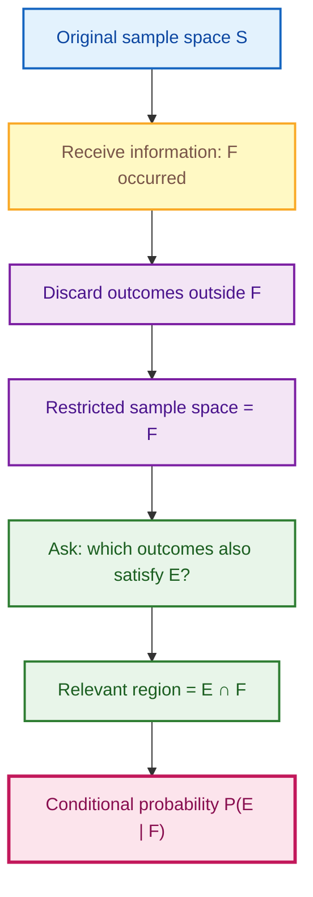
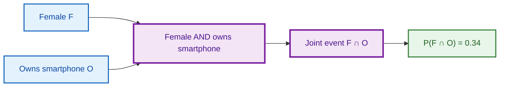
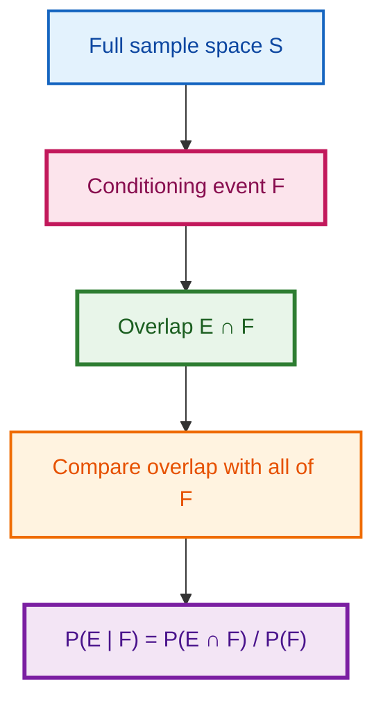
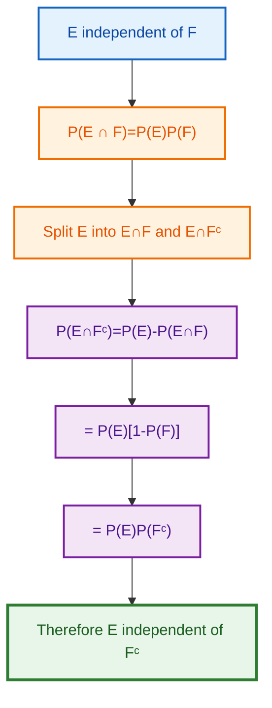
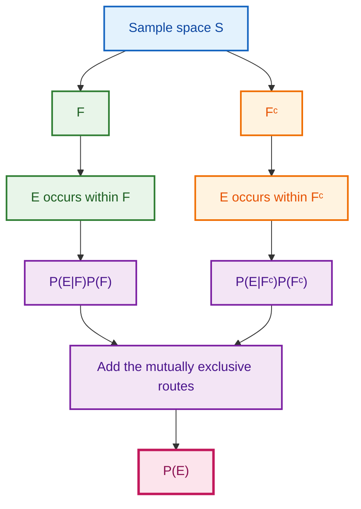
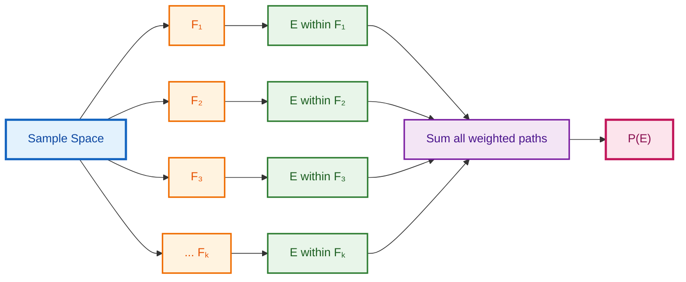
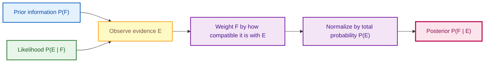
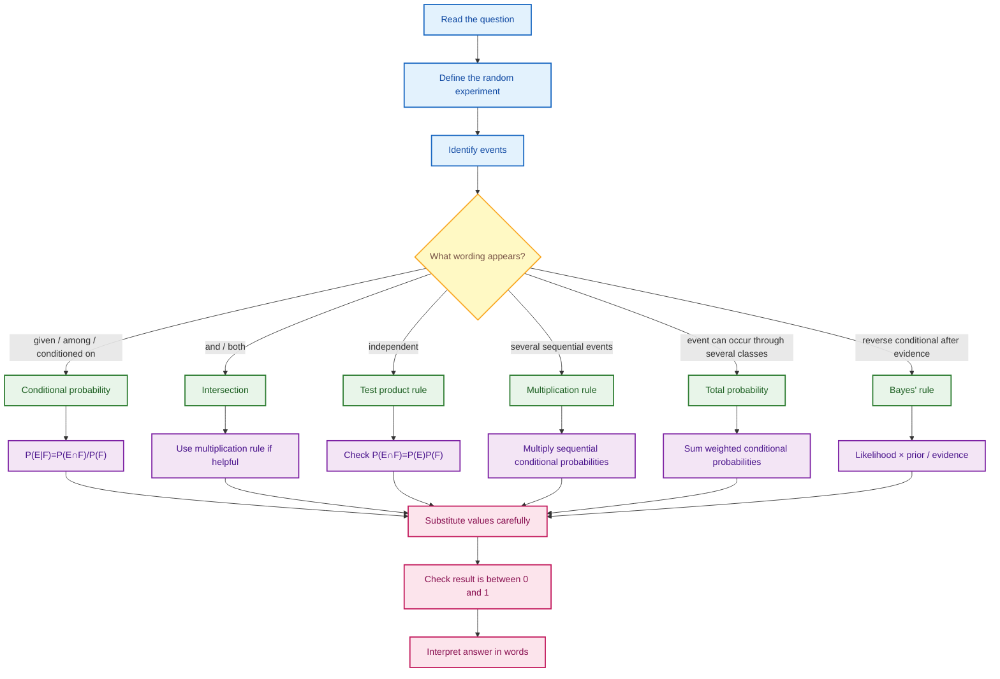
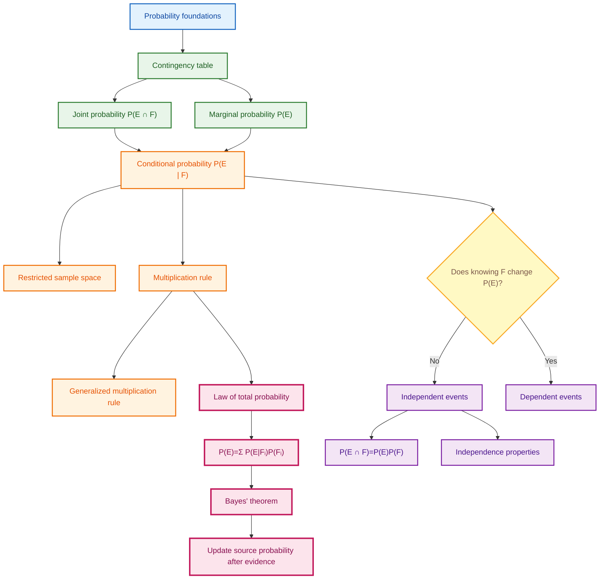

# Conditional Probability, Independence & Bayes' Rule
## Detailed Notes from the Shared YouTube Transcripts

> These notes are based **only on the concepts, examples, formulas, and applications contained in the shared transcript**.  
> The transcript covers contingency tables, conditional probability, multiplication rules, independent events, the law of total probability, and Bayes' rule.
>
> **Math formatting used throughout**
>
> - Inline mathematics: `$ ... $`
> - Display mathematics: `$$ ... $$`

---

# Table of Contents

1. [Lecture Roadmap](#1-lecture-roadmap)
2. [Prerequisite Probability Recap](#2-prerequisite-probability-recap)
3. [Why Conditional Probability?](#3-why-conditional-probability)
4. [Contingency Tables as Probability Tables](#4-contingency-tables-as-probability-tables)
5. [Joint Probabilities](#5-joint-probabilities)
6. [Marginal Probabilities](#6-marginal-probabilities)
7. [Conditional Probability as a Restricted Sample Space](#7-conditional-probability-as-a-restricted-sample-space)
8. [Formal Conditional Probability Formula](#8-formal-conditional-probability-formula)
9. [Dice Example: Conditional Probability](#9-dice-example-conditional-probability)
10. [Multiplication Rule](#10-multiplication-rule)
11. [Sampling Without Replacement Example](#11-sampling-without-replacement-example)
12. [Generalized Multiplication Rule](#12-generalized-multiplication-rule)
13. [Four Piles and Four Aces Example](#13-four-piles-and-four-aces-example)
14. [Independent and Dependent Events](#14-independent-and-dependent-events)
15. [Independence Examples with Dice](#15-independence-examples-with-dice)
16. [Independence Examples with Cards](#16-independence-examples-with-cards)
17. [Properties of Independence](#17-properties-of-independence)
18. [Independence of Three Events](#18-independence-of-three-events)
19. [Three-Children Example](#19-three-children-example)
20. [Law of Total Probability](#20-law-of-total-probability)
21. [General Law of Total Probability](#21-general-law-of-total-probability)
22. [Insurance Example: Total Probability](#22-insurance-example-total-probability)
23. [Bayes' Rule](#23-bayes-rule)
24. [General Bayes' Theorem](#24-general-bayes-theorem)
25. [Insurance Example: Bayes' Rule](#25-insurance-example-bayes-rule)
26. [Mutually Exclusive vs Independent Events](#26-mutually-exclusive-vs-independent-events)
27. [Complete Problem-Solving Strategy](#27-complete-problem-solving-strategy)
28. [Formula Sheet](#28-formula-sheet)
29. [Common Mistakes and Exam Traps](#29-common-mistakes-and-exam-traps)
30. [Quick Revision Tables](#30-quick-revision-tables)
31. [Fun Facts and Intuition](#31-fun-facts-and-intuition)
32. [Transcript Consistency Notes](#32-transcript-consistency-notes)
33. [Code Note](#33-code-note)
34. [Final Concept Map](#34-final-concept-map)

---

# 1. Lecture Roadmap

The shared transcript contains the following sequence:

1. **W8L1: Conditional Probability — Contingency tables**
2. **W8L2: Conditional Probability — Conditional Probability Formula**
3. **W8L3: Conditional Probability — Multiplication rule**
4. **W7L4: Conditional probability — Independent events**
5. **W7L5: Conditional Probability — Independent events: examples**
6. **W7L6: Conditional probability — Independent events: properties**
7. **Lecture 7.7: Conditional Probability — Bayes' rule**

The conceptual progression is:

---

# 2. Prerequisite Probability Recap

Before conditional probability, the transcript recalls the basic probability framework.

## 2.1 Sample space

A **sample space** $S$ is the set of all possible outcomes of a random experiment.

## 2.2 Event

An event $E$ is a subset of the sample space:

$$
E\subseteq S.
$$

## 2.3 Probability axioms recalled in the lecture

For an event $E$:

$$
0\le P(E)\le 1.
$$

For the complete sample space:

$$
P(S)=1.
$$

For mutually exclusive events:

$$
P\left(\bigcup_i E_i\right)
=
\sum_i P(E_i).
$$

## 2.4 Addition rule

For any two events $A$ and $B$:

$$
P(A\cup B)
=
P(A)+P(B)-P(A\cap B).
$$

This formula is important later because conditional probability and Bayes' rule are built on intersections of events.

## 2.5 Complement rule

For any event $A$:

$$
P(A^c)=1-P(A).
$$

---

# 3. Why Conditional Probability?

## 3.1 The central question

Very often, we want to calculate a probability **after receiving some information**.

For example:

> If we know that the first toss of a coin was a head, what is the probability of obtaining a head on the second toss?

The phrase **"given that"** is the key.

Conditional probability answers questions of the form:

> What is the probability of event $E$ occurring **given that event $F$ has already occurred**?

It is written as:

$$
P(E\mid F).
$$

Read it as:

> "Probability of $E$ given $F$"

or

> "Probability of $E$ conditioned on $F$"

### Important notation warning

The vertical bar in

$$
P(E\mid F)
$$

does **not** mean ordinary division.

You should not read it as "$E$ divided by $F$."

---

## 3.2 Why is conditioning important?

Conditioning means we use available information to refine our probability calculation.

The original sample space contains all possibilities.

Once we know $F$ has happened, outcomes outside $F$ are no longer relevant.

So we effectively work inside a **restricted sample space**.

---

# 4. Contingency Tables as Probability Tables

The first lecture revisits a contingency table involving:

- **Gender**: Female / Male
- **Smartphone ownership**: No / Yes

The counts in the transcript are:

| Gender | Does not own | Owns smartphone | Total |
|---|---:|---:|---:|
| Female | 10 | 34 | 44 |
| Male | 14 | 42 | 56 |
| **Total** | **24** | **76** | **100** |

There are $100$ people in total.

---

## 4.1 Converting counts into probabilities

Divide each count by the total number of people, $100$.

| Gender | Does not own | Owns smartphone | Total |
|---|---:|---:|---:|
| Female | $0.10$ | $0.34$ | $0.44$ |
| Male | $0.14$ | $0.42$ | $0.56$ |
| **Total** | **$0.24$** | **$0.76$** | **$1.00$** |

This relative-frequency table can now be interpreted probabilistically.

---

# 5. Joint Probabilities

A **joint probability** is the probability that two events happen together.

The word **and** usually corresponds to intersection.

If:

- $F$ = person is female,
- $O$ = person owns a smartphone,

then

$$
P(F\cap O)=0.34.
$$

This means:

> The probability that a randomly selected person is both female **and** owns a smartphone is $0.34$.

Similarly,

$$
P(F\cap O^c)=0.10,
$$

$$
P(M\cap O^c)=0.14,
$$

and

$$
P(M\cap O)=0.42.
$$

---

## 5.1 Why are these called "joint" probabilities?

Because two characteristics are being considered jointly.

For example:

$$
\text{Female AND Smartphone Owner}
$$

corresponds to

$$
F\cap O.
$$

---

## 5.2 Joint probability intuition

---

# 6. Marginal Probabilities

A **marginal probability** is the probability of one variable/category without conditioning on the other variable.

From the table:

$$
P(F)=0.10+0.34=0.44.
$$

Similarly,

$$
P(M)=0.14+0.42=0.56.
$$

For smartphone ownership:

$$
P(O)=0.34+0.42=0.76.
$$

For not owning a smartphone:

$$
P(O^c)=0.10+0.14=0.24.
$$

These values appear in the margins of the contingency table, hence the name **marginal probability**.

---

## 6.1 Joint vs marginal

| Type | Example | Meaning |
|---|---|---|
| Joint | $P(F\cap O)$ | Female **and** owns smartphone |
| Marginal | $P(F)$ | Female, regardless of ownership |
| Marginal | $P(O)$ | Owns smartphone, regardless of gender |

---

# 7. Conditional Probability as a Restricted Sample Space

This is the key intuition of the first lecture.

Suppose we ask:

> Among females, what is the probability that a person owns a smartphone?

The phrase **among females** tells us to restrict our attention to the $44$ females.

The original population of $100$ people is no longer the relevant denominator.

Within the female group:

- $34$ own a smartphone,
- $10$ do not.

Therefore,

$$
P(O\mid F)=\frac{34}{44}.
$$

Likewise,

$$
P(O^c\mid F)=\frac{10}{44}.
$$

---

## 7.1 Compare unconditional and conditional denominators

### Joint probability

$$
P(F\cap O)=\frac{34}{100}.
$$

### Conditional probability

$$
P(O\mid F)=\frac{34}{44}.
$$

Why did the denominator change?

Because conditioning on $F$ means the new reference population is only the $44$ females.

---

## 7.2 Another example from the table

Question:

> Among people who do not own a smartphone, what is the probability that the person is male?

There are $24$ non-owners.

Among them, $14$ are male.

Thus,

$$
P(M\mid O^c)=\frac{14}{24}.
$$

This can also be written using probabilities:

$$
P(M\mid O^c)
=
\frac{P(M\cap O^c)}{P(O^c)}.
$$

Substituting:

$$
P(M\mid O^c)
=
\frac{14/100}{24/100}
=
\frac{14}{24}.
$$

---

# 8. Formal Conditional Probability Formula

For events $E$ and $F$:

$$
\boxed{
P(E\mid F)
=
\frac{P(E\cap F)}{P(F)}
}
$$

provided

$$
\boxed{P(F)>0}.
$$

---

## 8.1 What does each part mean?

### Denominator

$$
P(F)
$$

represents the probability of the event we are **conditioning on**.

Once $F$ is known to have happened, $F$ becomes our restricted sample space.

### Numerator

$$
P(E\cap F)
$$

represents the part of $F$ in which $E$ also occurs.

Thus:

$$
\text{Conditional probability}
=
\frac{\text{part of F that is also E}}{\text{all of F}}.
$$

---

## 8.2 Why must $P(F)>0$?

Because the formula divides by $P(F)$.

If

$$
P(F)=0,
$$

the expression would involve division by zero.

The transcript therefore conditions on a **non-null event**.

---

## 8.3 Visual intuition

---

# 9. Dice Example: Conditional Probability

The transcript rolls a fair die twice.

Each outcome is an ordered pair:

$$
(i,j)
$$

where $i$ is the first roll and $j$ is the second roll.

There are:

$$
6\times6=36
$$

equally likely outcomes.

Each therefore has probability:

$$
\frac1{36}.
$$

---

## 9.1 Define the events

Let:

$$
F=\{\text{first roll is }4\}
$$

so

$$
F=\{(4,1),(4,2),(4,3),(4,4),(4,5),(4,6)\}.
$$

Hence,

$$
P(F)=\frac6{36}=\frac16.
$$

Let:

$$
E=\{\text{sum of the two rolls is }10\}.
$$

The outcomes are:

$$
E=\{(4,6),(5,5),(6,4)\}.
$$

The intersection is:

$$
E\cap F=\{(4,6)\}.
$$

Therefore,

$$
P(E\cap F)=\frac1{36}.
$$

---

## 9.2 Apply conditional probability

$$
P(E\mid F)
=
\frac{P(E\cap F)}{P(F)}.
$$

Substitute:

$$
P(E\mid F)
=
\frac{1/36}{6/36}.
$$

Therefore,

$$
P(E\mid F)=\frac16.
$$

---

## 9.3 Restricted sample-space method

Given that the first roll is $4$, the only remaining possibilities are:

$$
(4,1),(4,2),(4,3),(4,4),(4,5),(4,6).
$$

There are $6$ equally likely outcomes in this restricted sample space.

Only

$$
(4,6)
$$

has sum $10$.

Therefore,

$$
P(E\mid F)=\frac16.
$$

Both approaches agree.

---

# 10. Multiplication Rule

Start with:

$$
P(E\mid F)=\frac{P(E\cap F)}{P(F)}.
$$

Multiply both sides by $P(F)$:

$$
P(E\cap F)
=
P(F)P(E\mid F).
$$

Thus:

$$
\boxed{
P(E\cap F)
=
P(F)P(E\mid F)
}
$$

for $P(F)>0$.

By symmetry, we can also write:

$$
\boxed{
P(E\cap F)
=
P(E)P(F\mid E)
}.
$$

---

## 10.1 Meaning

The probability that **both $E$ and $F$ occur** can be computed as:

1. probability that one event occurs;
2. multiplied by the conditional probability that the other event occurs given the first.

---

# 11. Sampling Without Replacement Example

An introductory statistics class contains:

- $23$ males,
- $17$ females,
- total $40$ students.

Two students are selected **without replacement**.

Find the probability that:

1. the first student is female;
2. the second student is male.

---

## 11.1 Define events

Let:

$$
F_1=\{\text{first selected student is female}\}
$$

and

$$
M_2=\{\text{second selected student is male}\}.
$$

We want:

$$
P(F_1\cap M_2).
$$

By the multiplication rule:

$$
P(F_1\cap M_2)
=
P(F_1)P(M_2\mid F_1).
$$

---

## 11.2 First selection

Initially:

- $17$ females,
- $40$ total students.

Therefore,

$$
P(F_1)=\frac{17}{40}.
$$

---

## 11.3 Second selection given the first was female

Because sampling is **without replacement**, after selecting a female:

- total students remaining = $39$,
- males remaining = $23$,
- females remaining = $16$.

Therefore,

$$
P(M_2\mid F_1)=\frac{23}{39}.
$$

---

## 11.4 Final probability

$$
P(F_1\cap M_2)
=
\frac{17}{40}\times\frac{23}{39}.
$$

Thus,

$$
P(F_1\cap M_2)
=
\frac{391}{1560}
\approx0.2506.
$$

The transcript rounds this to approximately:

$$
\boxed{0.251}.
$$

---

## 11.5 Why is this a conditional-probability problem?

Because the probability for the second draw depends on the result of the first draw.

Without replacement changes the composition of the remaining population.

---

# 12. Generalized Multiplication Rule

For events:

$$
E_1,E_2,\ldots,E_n,
$$

the generalized multiplication rule is:

$$
\boxed{
P(E_1\cap E_2\cap\cdots\cap E_n)
=
P(E_1)
P(E_2\mid E_1)
P(E_3\mid E_1\cap E_2)
\cdots
P(E_n\mid E_1\cap\cdots\cap E_{n-1})
}
$$

---

## 12.1 Intuition

Each new factor asks:

> Given that everything required so far has already happened, what is the probability that the next event also happens?

---

# 13. Four Piles and Four Aces Example

The transcript considers a standard deck of $52$ cards randomly divided into four piles of $13$ cards each.

Question:

> What is the probability that each pile contains exactly one ace?

The lecture defines a sequence of events concerning the locations of the four aces.

The resulting conditional factors obtained in the transcript are:

$$
P(E_1)=1,
$$

$$
P(E_2\mid E_1)=\frac{39}{51},
$$

$$
P(E_3\mid E_1\cap E_2)=\frac{26}{50},
$$

and

$$
P(E_4\mid E_1\cap E_2\cap E_3)=\frac{13}{49}.
$$

Thus:

$$
P(E_1\cap E_2\cap E_3\cap E_4)
=
1
\times
\frac{39}{51}
\times
\frac{26}{50}
\times
\frac{13}{49}.
$$

Hence:

$$
P(E_1\cap E_2\cap E_3\cap E_4)
\approx0.105.
$$

Therefore,

$$
\boxed{P(\text{one ace in each pile})\approx0.105}.
$$

The main purpose of this example is not merely the numerical answer; it demonstrates how a complicated intersection can be decomposed into sequential conditional probabilities.

---

# 14. Independent and Dependent Events

## 14.1 Intuitive definition

Events $E$ and $F$ are independent if knowing that $F$ occurred does **not change** the probability of $E$.

Thus:

$$
\boxed{
P(E\mid F)=P(E)
}
$$

when $P(F)>0$.

---

## 14.2 Coin-toss intuition

Suppose a fair coin is tossed twice.

Let:

- $F$ = first toss is head,
- $E$ = second toss is head.

Unconditionally:

$$
P(E)=\frac12.
$$

Given that the first toss is head:

$$
P(E\mid F)=\frac12.
$$

Since:

$$
P(E\mid F)=P(E),
$$

the event "head on second toss" is independent of "head on first toss."

---

## 14.3 Product criterion for independence

From the multiplication rule:

$$
P(E\cap F)
=
P(F)P(E\mid F).
$$

If $E$ and $F$ are independent, then:

$$
P(E\mid F)=P(E).
$$

Therefore:

$$
P(E\cap F)
=
P(E)P(F).
$$

Hence for two events:

$$
\boxed{
E\text{ and }F\text{ are independent}
\iff
P(E\cap F)=P(E)P(F)
}
$$

This is an **if and only if** condition for two events.

---

## 14.4 Dependent events

If the equality fails:

$$
P(E\cap F)\ne P(E)P(F),
$$

then the events are dependent.

Equivalent intuition:

$$
P(E\mid F)\ne P(E).
$$

Knowing $F$ changes the probability of $E$.

---

# 15. Independence Examples with Dice

The lecture rolls a fair die twice, giving $36$ equally likely outcomes.

Define:

$$
E_1=\{\text{first roll is }3\}.
$$

Therefore:

$$
P(E_1)=\frac6{36}=\frac16.
$$

---

## 15.1 Event $E_2$: sum is 8

The outcomes giving sum $8$ are:

$$
(2,6),(3,5),(4,4),(5,3),(6,2).
$$

Thus:

$$
P(E_2)=\frac5{36}.
$$

The intersection with $E_1$ is:

$$
E_1\cap E_2=\{(3,5)\}.
$$

So:

$$
P(E_1\cap E_2)=\frac1{36}.
$$

Now compare:

$$
P(E_1)P(E_2)
=
\frac6{36}\times\frac5{36}.
$$

This is not equal to:

$$
\frac1{36}.
$$

Therefore:

$$
\boxed{E_1\text{ and }E_2\text{ are dependent}}.
$$

### Intuition

The possibility of obtaining sum $8$ depends on what happened on the first roll.

For example, if the first roll were $1$, a sum of $8$ cannot be obtained with a standard six-sided die.

---

## 15.2 Event $E_3$: sum is 7

The outcomes giving sum $7$ are:

$$
(1,6),(2,5),(3,4),(4,3),(5,2),(6,1).
$$

Hence:

$$
P(E_3)=\frac6{36}=\frac16.
$$

The intersection with $E_1$ is:

$$
E_1\cap E_3=\{(3,4)\}.
$$

Thus:

$$
P(E_1\cap E_3)=\frac1{36}.
$$

But:

$$
P(E_1)P(E_3)
=
\frac16\times\frac16
=
\frac1{36}.
$$

Therefore:

$$
\boxed{E_1\text{ and }E_3\text{ are independent}}.
$$

### Intuition

Whatever value appears on the first die, exactly one value of the second die will complete the sum to $7$.

---

# 16. Independence Examples with Cards

A card is randomly selected from a $52$-card deck.

Define:

- $E_1$ = face card selected,
- $E_2$ = king selected,
- $E_3$ = heart selected.

There are $12$ face cards:

$$
P(E_1)=\frac{12}{52}.
$$

There are $4$ kings:

$$
P(E_2)=\frac4{52}.
$$

There are $13$ hearts:

$$
P(E_3)=\frac{13}{52}.
$$

---

## 16.1 Face card and king

A king is automatically a face card.

Therefore:

$$
E_1\cap E_2=E_2.
$$

Hence:

$$
P(E_1\cap E_2)=\frac4{52}.
$$

But:

$$
P(E_1)P(E_2)
=
\frac{12}{52}\times\frac4{52}.
$$

These are not equal.

Therefore:

$$
\boxed{E_1\text{ and }E_2\text{ are dependent}}.
$$

### Intuition

If you already know that the card is a face card, the probability of it being a king changes.

Among $12$ face cards, $4$ are kings:

$$
P(E_2\mid E_1)=\frac4{12}=\frac13.
$$

But without that information:

$$
P(E_2)=\frac4{52}=\frac1{13}.
$$

Since:

$$
\frac13\ne\frac1{13},
$$

the events are dependent.

---

## 16.2 King and heart

There is exactly one King of Hearts:

$$
P(E_2\cap E_3)=\frac1{52}.
$$

Now:

$$
P(E_2)P(E_3)
=
\frac4{52}\times\frac{13}{52}.
$$

Since:

$$
\frac4{52}\times\frac{13}{52}
=
\frac1{52},
$$

we conclude:

$$
\boxed{E_2\text{ and }E_3\text{ are independent}}.
$$

### Intuition

Knowing that a card is a king does not alter the probability of its suit being hearts:

$$
P(\text{heart}\mid\text{king})
=
\frac14.
$$

And:

$$
P(\text{heart})
=
\frac{13}{52}
=
\frac14.
$$

---

# 17. Properties of Independence

The transcript proves an important result.

## 17.1 If $E$ and $F$ are independent, then $E$ and $F^c$ are independent

Assume:

$$
P(E\cap F)=P(E)P(F).
$$

Notice:

$$
E=(E\cap F)\cup(E\cap F^c).
$$

The two events on the right are disjoint.

Therefore:

$$
P(E)
=
P(E\cap F)+P(E\cap F^c).
$$

Rearrange:

$$
P(E\cap F^c)
=
P(E)-P(E\cap F).
$$

Using independence:

$$
P(E\cap F^c)
=
P(E)-P(E)P(F).
$$

Factor:

$$
P(E\cap F^c)
=
P(E)[1-P(F)].
$$

But:

$$
1-P(F)=P(F^c).
$$

Hence:

$$
\boxed{
P(E\cap F^c)=P(E)P(F^c)
}
$$

so:

$$
\boxed{E\text{ and }F^c\text{ are independent}}.
$$

---

## 17.2 Interpretation

If knowing that $F$ occurred does not change the probability of $E$, then knowing that $F$ **did not occur** also does not change the probability of $E$.

---

# 18. Independence of Three Events

Independence involving three or more events requires more care.

The transcript emphasizes that pairwise relationships alone may not be sufficient.

For three events $E$, $F$, and $G$, the lecture states the following conditions.

Pairwise:

$$
P(E\cap F)=P(E)P(F),
$$

$$
P(E\cap G)=P(E)P(G),
$$

$$
P(F\cap G)=P(F)P(G).
$$

And jointly:

$$
P(E\cap F\cap G)
=
P(E)P(F)P(G).
$$

If these conditions hold, the three events are independent in the sense stated in the lecture.

---

## 18.1 Why pairwise information can be insufficient

The lecture gives a two-dice example.

Let:

$$
E=\{\text{sum is }7\},
$$

$$
F=\{\text{first die is }4\},
$$

$$
G=\{\text{second die is }3\}.
$$

The transcript notes:

$$
P(E)=\frac16,
$$

$$
P(F)=\frac16,
$$

$$
P(G)=\frac16.
$$

It argues that $E$ is independent of $F$ and that $E$ is independent of $G$.

However:

$$
F\cap G=\{(4,3)\}.
$$

Once we know:

$$
F\cap G
$$

has occurred, the sum must be $7$.

Therefore:

$$
P(E\mid F\cap G)=1.
$$

But:

$$
P(E)=\frac16.
$$

So:

$$
P(E\mid F\cap G)\ne P(E).
$$

Thus $E$ is not independent of the combined event $F\cap G$.

This illustrates why multi-event independence needs stronger conditions than checking only selected pairwise relationships.

---

# 19. Three-Children Example

A couple plans to have three children.

The lecture assumes:

- each child is equally likely to be male or female;
- the sexes of the children are independent.

Define:

$$
E_1=\{\text{first child is a girl}\},
$$

$$
E_2=\{\text{second child is a girl}\},
$$

$$
E_3=\{\text{third child is a girl}\}.
$$

Each probability is:

$$
P(E_i)=\frac12.
$$

The event that all three children are girls is:

$$
E_1\cap E_2\cap E_3.
$$

By independence:

$$
P(E_1\cap E_2\cap E_3)
=
P(E_1)P(E_2)P(E_3).
$$

Thus:

$$
P(\text{all three girls})
=
\frac12\times\frac12\times\frac12.
$$

Therefore:

$$
\boxed{
P(\text{all three girls})=\frac18
}.
$$

---

# 20. Law of Total Probability

Before Bayes' rule, the transcript introduces the **law of total probability**.

Let $F$ be an event and $F^c$ its complement.

These two events are:

1. mutually exclusive:

$$
F\cap F^c=\varnothing;
$$

2. exhaustive:

$$
F\cup F^c=S.
$$

Any event $E$ can be split as:

$$
E=(E\cap F)\cup(E\cap F^c).
$$

Since these two pieces are disjoint:

$$
P(E)
=
P(E\cap F)+P(E\cap F^c).
$$

Using the multiplication rule:

$$
P(E\cap F)
=
P(E\mid F)P(F),
$$

and:

$$
P(E\cap F^c)
=
P(E\mid F^c)P(F^c).
$$

Therefore:

$$
\boxed{
P(E)
=
P(E\mid F)P(F)
+
P(E\mid F^c)P(F^c)
}.
$$

---

## 20.1 Why is it called "total" probability?

Event $E$ can happen through different mutually exclusive routes:

- $E$ happens while $F$ happens;
- $E$ happens while $F$ does not happen.

By adding all routes, we obtain the total probability of $E$.

---

## 20.2 Weighted-average interpretation

The transcript describes the formula as a weighted average of conditional probabilities:

$$
P(E\mid F)
$$

weighted by:

$$
P(F),
$$

and:

$$
P(E\mid F^c)
$$

weighted by:

$$
P(F^c).
$$

---

# 21. General Law of Total Probability

Suppose the sample space is partitioned into:

$$
F_1,F_2,\ldots,F_k
$$

such that they are mutually exclusive:

$$
F_i\cap F_j=\varnothing
\quad\text{for }i\ne j,
$$

and exhaustive:

$$
F_1\cup F_2\cup\cdots\cup F_k=S.
$$

Then for any event $E$:

$$
\boxed{
P(E)
=
\sum_{i=1}^{k}
P(E\mid F_i)P(F_i)
}.
$$

This is the general form of the law of total probability.

---

## 21.1 Partition intuition

---

# 22. Insurance Example: Total Probability

The transcript gives an insurance-company example.

People are classified into:

- accident-prone,
- not accident-prone.

Let:

$$
F=\{\text{policyholder is accident-prone}\}
$$

and:

$$
E=\{\text{policyholder has an accident in the first year}\}.
$$

Given:

$$
P(F)=0.2.
$$

Therefore:

$$
P(F^c)=0.8.
$$

The structured numerical calculation later in the transcript uses:

$$
P(E\mid F)=0.1
$$

and:

$$
P(E\mid F^c)=0.05.
$$

---

## 22.1 Find the overall accident probability

By the law of total probability:

$$
P(E)
=
P(E\mid F)P(F)
+
P(E\mid F^c)P(F^c).
$$

Substitute:

$$
P(E)
=
(0.1)(0.2)+(0.05)(0.8).
$$

Calculate:

$$
P(E)
=
0.02+0.04.
$$

Therefore:

$$
\boxed{P(E)=0.06}.
$$

So the overall probability of an accident within the first year is:

$$
\boxed{6\%}.
$$

---

# 23. Bayes' Rule

Conditional probability lets us calculate:

$$
P(E\mid F).
$$

Bayes' rule helps us reverse the direction and calculate:

$$
P(F\mid E).
$$

Start with:

$$
P(F\mid E)
=
\frac{P(F\cap E)}{P(E)}.
$$

Using the multiplication rule:

$$
P(F\cap E)
=
P(E\mid F)P(F).
$$

Therefore:

$$
\boxed{
P(F\mid E)
=
\frac{P(E\mid F)P(F)}{P(E)}
}.
$$

Now use the law of total probability for $P(E)$:

$$
P(E)
=
P(E\mid F)P(F)
+
P(E\mid F^c)P(F^c).
$$

Hence:

$$
\boxed{
P(F\mid E)
=
\frac{
P(E\mid F)P(F)
}{
P(E\mid F)P(F)
+
P(E\mid F^c)P(F^c)
}
}.
$$

---

## 23.1 Bayes intuition

Bayes' rule updates the probability of a possible source/cause after observing new evidence.

In the insurance example:

- before seeing an accident, the probability that someone is accident-prone is $P(F)$;
- after observing an accident, we update to $P(F\mid E)$.

---

# 24. General Bayes' Theorem

Suppose:

$$
F_1,F_2,\ldots,F_k
$$

form a mutually exclusive and exhaustive partition of the sample space.

Then:

$$
P(E)
=
\sum_{i=1}^{k}
P(E\mid F_i)P(F_i).
$$

For a particular $F_j$:

$$
\boxed{
P(F_j\mid E)
=
\frac{
P(E\mid F_j)P(F_j)
}{
\sum_{i=1}^{k}
P(E\mid F_i)P(F_i)
}
}.
$$

---

## 24.1 Structure of Bayes' formula

### Numerator

$$
P(E\mid F_j)P(F_j)
$$

represents the joint probability of:

- source/hypothesis $F_j$, and
- evidence $E$.

### Denominator

$$
\sum_{i=1}^{k}
P(E\mid F_i)P(F_i)
$$

represents all possible ways the evidence $E$ can occur.

So Bayes' rule asks:

> Of all the ways evidence $E$ could have happened, what fraction came through $F_j$?

---

# 25. Insurance Example: Bayes' Rule

From the previous example:

$$
P(F)=0.2,
$$

$$
P(E\mid F)=0.1,
$$

and:

$$
P(E)=0.06.
$$

We now learn that a policyholder **did have an accident in the first year**.

Question:

> What is the probability that the person belongs to the accident-prone class?

We need:

$$
P(F\mid E).
$$

By Bayes' rule:

$$
P(F\mid E)
=
\frac{P(E\mid F)P(F)}{P(E)}.
$$

Substitute:

$$
P(F\mid E)
=
\frac{(0.1)(0.2)}{0.06}.
$$

Thus:

$$
P(F\mid E)
=
\frac{0.02}{0.06}
=
\frac13.
$$

Therefore:

$$
\boxed{
P(F\mid E)=\frac13\approx0.333
}.
$$

---

## 25.1 Interpretation

Before observing the accident:

$$
P(F)=0.2.
$$

After observing that an accident occurred:

$$
P(F\mid E)\approx0.333.
$$

So the new evidence changes the probability from:

$$
20\%
$$

to about:

$$
33.3\%.
$$

This is the central idea behind Bayes' rule: **probabilities are updated when new information becomes available**.

---

# 26. Mutually Exclusive vs Independent Events

The transcript explicitly warns not to confuse these concepts.

They describe very different relationships.

---

## 26.1 Mutually exclusive events

$E$ and $F$ are mutually exclusive if:

$$
E\cap F=\varnothing.
$$

They cannot happen together.

Example from a single coin toss:

- Head
- Tail

If head occurs, tail cannot occur on the same toss.

---

## 26.2 Independent events

$E$ and $F$ are independent if knowing one occurred does not change the probability of the other.

For two events:

$$
P(E\cap F)=P(E)P(F).
$$

Equivalently, when the relevant probabilities are positive:

$$
P(E\mid F)=P(E).
$$

---

## 26.3 Comparison

| Feature | Mutually exclusive | Independent |
|---|---|---|
| Can both occur? | No | Yes, usually |
| Intersection | $E\cap F=\varnothing$ | $P(E\cap F)=P(E)P(F)$ |
| Effect of knowing F | E becomes impossible if F occurs | Probability of E remains unchanged |
| Main concept | Incompatibility | Lack of probabilistic influence |

---

## 26.4 Crucial exam insight

If two events with positive probability are mutually exclusive, then they **cannot be independent**.

Why?

Mutual exclusivity gives:

$$
P(E\cap F)=0.
$$

But if both have positive probability:

$$
P(E)P(F)>0.
$$

Therefore:

$$
P(E\cap F)\ne P(E)P(F).
$$

So they are dependent.

This conclusion follows directly from the definitions emphasized in the transcript.

---

# 27. Complete Problem-Solving Strategy

Use this workflow for conditional-probability questions.

---

## 27.1 Translation dictionary

| Phrase in question | Mathematical idea |
|---|---|
| "given that F occurred" | $P(E\mid F)$ |
| "among females" | condition on female |
| "E and F" | $E\cap F$ |
| "E or F" | $E\cup F$ |
| "without replacement" | later probabilities change |
| "independent" | $P(E\cap F)=P(E)P(F)$ |
| "all sequential events occur" | generalized multiplication rule |
| "several mutually exclusive sources" | total probability |
| "given evidence, find source" | Bayes' rule |

---

# 28. Formula Sheet

## 28.1 Conditional probability

$$
\boxed{
P(E\mid F)
=
\frac{P(E\cap F)}{P(F)}
}
$$

for:

$$
P(F)>0.
$$

---

## 28.2 Multiplication rule

$$
\boxed{
P(E\cap F)
=
P(F)P(E\mid F)
}
$$

or:

$$
\boxed{
P(E\cap F)
=
P(E)P(F\mid E)
}.
$$

---

## 28.3 Generalized multiplication rule

$$
\boxed{
P(E_1\cap\cdots\cap E_n)
=
P(E_1)
\prod_{j=2}^{n}
P\left(
E_j
\mid
E_1\cap\cdots\cap E_{j-1}
\right)
}
$$

---

## 28.4 Independence criterion for two events

$$
\boxed{
E\perp F
\iff
P(E\cap F)=P(E)P(F)
}
$$

and, when $P(F)>0$:

$$
\boxed{
P(E\mid F)=P(E)
}.
$$

---

## 28.5 Complement independence property

If $E$ and $F$ are independent:

$$
\boxed{
P(E\cap F^c)=P(E)P(F^c)
}.
$$

---

## 28.6 General addition rule

$$
\boxed{
P(E\cup F)
=
P(E)+P(F)-P(E\cap F)
}.
$$

---

## 28.7 Law of total probability: two-part form

$$
\boxed{
P(E)
=
P(E\mid F)P(F)
+
P(E\mid F^c)P(F^c)
}.
$$

---

## 28.8 General law of total probability

For mutually exclusive and exhaustive $F_1,\ldots,F_k$:

$$
\boxed{
P(E)
=
\sum_{i=1}^{k}
P(E\mid F_i)P(F_i)
}.
$$

---

## 28.9 Bayes' rule: two-part form

$$
\boxed{
P(F\mid E)
=
\frac{
P(E\mid F)P(F)
}{
P(E)
}
}.
$$

With total probability substituted:

$$
\boxed{
P(F\mid E)
=
\frac{
P(E\mid F)P(F)
}{
P(E\mid F)P(F)
+
P(E\mid F^c)P(F^c)
}
}.
$$

---

## 28.10 General Bayes' theorem

$$
\boxed{
P(F_j\mid E)
=
\frac{
P(E\mid F_j)P(F_j)
}{
\sum_{i=1}^{k}
P(E\mid F_i)P(F_i)
}
}.
$$

---

# 29. Common Mistakes and Exam Traps

## Mistake 1: Reading $P(E\mid F)$ as division

Incorrect interpretation:

> "$E$ divided by $F$"

Correct interpretation:

> probability of $E$ **given** $F$.

The division appears in the formula for the probability, not in the event notation itself.

---

## Mistake 2: Keeping the original denominator after conditioning

Suppose $34$ of $100$ people are female smartphone owners, while $44$ people are female.

Then:

$$
P(F\cap O)=\frac{34}{100},
$$

but:

$$
P(O\mid F)=\frac{34}{44}.
$$

Conditioning changes the reference group.

---

## Mistake 3: Reversing the conditional

In general:

$$
P(E\mid F)\ne P(F\mid E).
$$

Bayes' rule is needed when reversing the conditioning direction.

---

## Mistake 4: Assuming independence

Do not automatically write:

$$
P(E\cap F)=P(E)P(F).
$$

This is valid only if independence has been stated or established.

For general events:

$$
P(E\cap F)=P(F)P(E\mid F).
$$

---

## Mistake 5: Ignoring "without replacement"

Without replacement changes the denominator and possibly the category counts.

For the class example:

$$
\frac{17}{40}
$$

for the first female is followed by:

$$
\frac{23}{39}
$$

for the second student being male, not $23/40$.

---

## Mistake 6: Confusing mutually exclusive with independent

Mutually exclusive means:

$$
E\cap F=\varnothing.
$$

Independent means:

$$
P(E\cap F)=P(E)P(F).
$$

They are not synonyms.

---

## Mistake 7: Checking only one pair when discussing three-event independence

The transcript warns that independence for more than two events is more subtle.

For three events, pairwise product relations and the triple intersection condition must be considered.

---

## Mistake 8: Using Bayes' rule before finding the evidence probability

In:

$$
P(F\mid E)
=
\frac{P(E\mid F)P(F)}{P(E)},
$$

you must know or calculate:

$$
P(E).
$$

The law of total probability is often used to calculate that denominator.

---

# 30. Quick Revision Tables

## 30.1 Joint, marginal, conditional

| Concept | Formula/example | Meaning |
|---|---|---|
| Joint | $P(E\cap F)$ | E and F together |
| Marginal | $P(E)$ | E regardless of F |
| Conditional | $P(E\mid F)$ | E within the restricted world where F occurred |

---

## 30.2 Formula decision table

| Goal | Formula |
|---|---|
| E given F | $P(E\mid F)=\frac{P(E\cap F)}{P(F)}$ |
| E and F | $P(E\cap F)=P(F)P(E\mid F)$ |
| Independent E and F | $P(E\cap F)=P(E)P(F)$ |
| E through multiple partitions | $P(E)=\sum_i P(E\mid F_i)P(F_i)$ |
| Reverse conditional | Bayes' theorem |

---

## 30.3 Main transcript examples

| Example | Main concept | Result |
|---|---|---|
| Smartphone contingency table | Joint/marginal probabilities | e.g. $P(F\cap O)=0.34$, $P(F)=0.44$ |
| Smartphone among females | Conditional probability | $P(O\mid F)=34/44$ |
| Male among non-owners | Conditional probability | $P(M\mid O^c)=14/24$ |
| Two dice, first roll 4, sum 10 | Conditional probability | $1/6$ |
| First female, second male without replacement | Multiplication rule | $\approx0.251$ |
| One ace in each of 4 piles | General multiplication | $\approx0.105$ |
| First die 3 and sum 8 | Dependence | Not independent |
| First die 3 and sum 7 | Independence | Independent |
| Face card and king | Dependence | Not independent |
| King and heart | Independence | Independent |
| Three girls | Independent multiplication | $1/8$ |
| Insurance accident probability | Total probability | $0.06$ |
| Accident-prone given accident | Bayes' rule | $1/3$ |

---

# 31. Fun Facts and Intuition

## 31.1 Conditioning creates a new "world"

One of the most useful ways to understand conditional probability is:

> Once you know $F$ occurred, pretend $F$ is the whole world.

Then ask what fraction of that world also belongs to $E$.

This is why:

$$
P(E\mid F)
=
\frac{P(E\cap F)}{P(F)}.
$$

---

## 31.2 Independence is about information

Independence can be understood as:

> Learning that $F$ happened gives no useful information for predicting $E$.

Mathematically:

$$
P(E\mid F)=P(E).
$$

---

## 31.3 Bayes' rule reverses perspective

There is a major difference between:

$$
P(E\mid F)
$$

and:

$$
P(F\mid E).
$$

For example:

- $P(\text{accident}\mid\text{accident-prone})$
- $P(\text{accident-prone}\mid\text{accident})$

These answer different questions.

Bayes' rule connects them.

---

## 31.4 Total probability is a "sum over routes"

If an event $E$ can happen through several mutually exclusive classes:

$$
F_1,F_2,\ldots,F_k,
$$

then total probability adds the probability contribution from every route.

This is similar to asking:

> Through which category could $E$ have happened?

and then summing across all categories.

---

## 31.5 Without replacement naturally creates dependence

When sampling without replacement, the first choice changes what is available for the second choice.

That is why conditional probability appears naturally.

---

# 32. Transcript Consistency Notes

The shared transcript contains a few spoken/transcription inconsistencies. These notes do **not silently rewrite them**.

### Insurance example

At one point the transcript appears to say that the non-accident-prone conditional accident probability is `$0.5$`. In the structured setup and all subsequent calculations, it uses:

$$
P(E\mid F^c)=0.05.
$$

The total-probability calculation:

$$
(0.1)(0.2)+(0.05)(0.8)=0.06
$$

confirms that `$0.05$` is the value actually used in the worked solution.

### Dice-independence example

Some spoken/transcribed ordered-pair labels around the "sum equals 7" example contain minor inconsistencies. The transcript's intended event is clear from the listed six outcomes:

$$
(1,6),(2,5),(3,4),(4,3),(5,2),(6,1).
$$

The notes preserve that event definition and explicitly avoid relying on isolated malformed transcript wording.

---

# 33. Code Note

The shared YouTube transcript contains **no programming code**.

Therefore, there is no source code to annotate line-by-line without adding material that is not present in the supplied lectures.

The mathematical calculations, examples, and Mermaid diagrams above explain the computational logic while remaining grounded in the transcript.

---

# 34. Final Concept Map

---

# Final One-Page Mental Model

If you remember only a few ideas, remember these:

### Conditional probability = restrict the sample space

$$
P(E\mid F)=\frac{P(E\cap F)}{P(F)}.
$$

### Multiplication rule = probability of a path

$$
P(E\cap F)=P(F)P(E\mid F).
$$

### Independence = conditioning changes nothing

$$
P(E\mid F)=P(E).
$$

Equivalently:

$$
P(E\cap F)=P(E)P(F).
$$

### Total probability = add all mutually exclusive routes

$$
P(E)=\sum_iP(E\mid F_i)P(F_i).
$$

### Bayes = reverse the conditioning using evidence

$$
P(F_j\mid E)
=
\frac{
P(E\mid F_j)P(F_j)
}{
\sum_iP(E\mid F_i)P(F_i)
}.
$$

These ideas complete the introductory probability framework in the shared transcript and prepare the transition to random variables, distributions, expectation, variance, and later the binomial and normal distributions.
