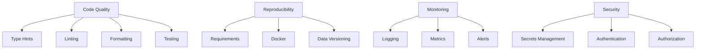

# [Roadmap](https://1drv.ms/w/c/685b12f7987da0d2/IQAfREwlbJdqRJFvxAkEIIT5AWZGrDpDco4nVuEpb3AxjUw?e=ELSgsD)


---

# 🚀 The Production-Ready AI & ML Master Roadmap (Ultimate Hybrid Edition)

> **Core Execution Philosophy: The 40/60 Rule**
> Spend **40%** of your time consuming theory (courses, books, docs) and **60%** building aligned projects.
> **The Loop:** Learn → Build → Break → Debug → Repeat.
> **Rule #1:** Never watch a tutorial without coding along. Never copy-paste without typing it out manually to build muscle memory.
> **Rule #2: Consistency Over Hoarding.** It is better to complete one course and build one project consistently than to bookmark 50 resources and never implement them. Projects > Certificates.

---

## 📊 2026 AI Industry Paradigm Shift: From Researcher to Product Engineer
*(Added from Gemini)*
The landscape of Artificial Intelligence and Machine Learning has fundamentally evolved. The industry has dramatically shifted away from 2022-style experimental model training inside isolated Jupyter Notebooks toward production-ready AI engineering. Today, companies do not just need researchers who perform siloed experiments; they require **Product Engineers with AI Superpowers**—professionals capable of building, securing, optimizing, deploying, and monitoring real-world products at global scale.

### 🔄 Architecture Evolution: Experimental vs. Production AI Systems

```mermaid
graph TD
%% Experimental Loop
subgraph Legacy Workflow [2022 Experimental Jupyter Loop]
A[Raw Static CSV] --> B[Jupyter Notebook]
B --> C[Manual Preprocessing]
C --> D[Model Training/Fit]
D --> E[Local Evaluation Metric]
end
%% Production Loop
subgraph Modern Workflow [2026 Production AI Product Loop]
F[Streaming Data / Vector DB] --> G[Containerized App Docker]
G --> H[FastAPI Gateway / Async Workers]
H --> I[Advanced RAG / Multi-Agent Core]
I --> J[Observability Layer LangSmith/Prometheus]
J --> K[CI/CD Auto-Deployment Cloud]
K --> F
end
style Legacy Workflow fill:#fee,stroke:#b33,stroke-width:2px
style Modern Workflow fill:#efe,stroke:#3b3,stroke-width:2px
```


---

## 📋 Table of Contents
1. [Learning Strategy & Mindset](#-learning-strategy--mindset)
2. [Software Engineering Fundamentals](#-software-engineering-fundamentals)
3. [Production Mindset (From Day 1)](#-production-mindset-from-day-1)
4. [Portfolio Strategy](#-portfolio-strategy)
5. [Phase 0: Foundations & Data Wrangling](#-phase-0-foundations--data-wrangling)
6. [Phase 1: Classical Machine Learning](#-phase-1-classical-machine-learning)
7. [Phase 2: Deep Learning & PyTorch](#-phase-2-deep-learning--pytorch)
8. [Phase 3: Natural Language Processing](#-phase-3-natural-language-processing)
9. [Phase 3.5: Production Systems Engineering](#-phase-35-production-systems-engineering)
10. [Phase 4: Data Engineering](#-phase-4-data-engineering)
11. [Phase 5: Production Engineering & MLOps](#-phase-5-production-engineering--mlops)
12. [Phase 6: AI in Practice — LLMs, RAG, Agents & MCP](#-phase-6-ai-in-practice--llms-rag-agents--mcp)
13. [Phase 7: Advanced Production AI Engineering](#-phase-7-advanced-production-ai-engineering)
14. [Phase 8: Reinforcement Learning & Capstone](#-phase-8-reinforcement-learning--capstone)
15. [Interview Preparation](#-interview-preparation)
16. [Open Source Contribution Roadmap](#-open-source-contribution-roadmap)
17. [Weekly Learning Habits](#-weekly-learning-habits)
18. [Weekly Execution Model](#-weekly-execution-model-the-non-negotiables)
19. [Complete Book List](#-complete-book-list-prioritized)
20. [Deployment Checklist](#-deployment-checklist-for-every-project)
21. [Minimal vs Advanced Path](#-minimal-vs-advanced-path)
22. [Golden Rules of AI Practice](#-golden-rules-of-ai-practice)
23. [Common Mistakes to Avoid](#-common-mistakes-to-avoid)
24. [Quick Reference: Resource Links](#-quick-reference-resource-links)
25. [Immediate Next Steps](#-immediate-next-steps-do-this-today)

---

## 🧠 Learning Strategy & Mindset
### The "Build → Break → Debug → Repeat" Loop
| Stage | Action | Duration |
|-------|--------|----------|
| **Learn** | Watch courses, read books, take handwritten notes | 40% |
| **Build** | Write code from scratch (no copy-paste) | 30% |
| **Break** | Intentionally break code to understand edge cases | 15% |
| **Debug** | Fix errors, trace root causes, document solutions | 15% |

### When to Use What
| Resource Type | When to Use | How to Use |
|---------------|-------------|------------|
| **Courses** | Initial concept introduction | Watch at 1.25x, take handwritten notes |
| **Books** | Deep understanding & reference | Read specific chapters, implement code examples |
| **Documentation** | When building projects | Read source code, understand API internals |
| **Blog Posts** | Stay updated & learn tricks | Read actively, try techniques immediately |

### How to Avoid Tutorial Hell
| Wrong Approach | Correct Approach |
|----------------|------------------|
| Watch 5 courses sequentially | Watch 1 module, build 1 project |
| Copy-paste code from GitHub | Type every line manually |
| Move on when code runs | Debug when code breaks |
| Never deploy anything | Deploy every project |
| Skip documentation | Write README for every project |

### Why Students Struggle in 2026
> **Many students are still learning outdated techniques (2022-style model training) while the industry has shifted toward production-ready AI. Companies today need engineers who can build and deploy real products, not just perform experiments in Jupyter Notebooks.**

**The Reality Gap:**
- ❌ **Old Focus:** Model training, Jupyter notebooks, academic datasets, single experiments
- ✅ **New Focus:** Production deployment, APIs, Docker, monitoring, evaluation pipelines, iterative improvement

**What This Means For You:**
- Every project must be deployment-ready
- Your portfolio should demonstrate engineering maturity, not just model accuracy
- Companies value production experience over theoretical knowledge

---

## 🏗️ Software Engineering Fundamentals
> **Video Insight (8:08 - 10:20):** Master Python, APIs, SQL, and Git before deep-diving into AI frameworks. Companies need engineers first, AI specialists second.

### Core Software Engineering Skills
| Skill | Why It Matters | Resource |
|-------|----------------|----------|
| **Python** | The lingua franca of AI. Must be fluent in OOP, type hints, context managers, generators, decorators | [freeCodeCamp Python](https://www.freecodecamp.org/learn/python-v9/) |
| **APIs** | All AI systems communicate via APIs. Master FastAPI, REST, authentication, request/response models | [FastAPI Tutorial](https://fastapi.tiangolo.com/tutorial/) |
| **SQL** | Data access and analytics. Master joins, window functions, query optimization, CTEs | [Mode SQL Tutorial](https://mode.com/sql-tutorial/) |
| **Git** | Version control is non-negotiable. Master branching, merging, rebasing, PR workflows | [GitHub Skills](https://skills.github.com/) |
| **Linux** | Most production servers run Linux. Master bash, SSH, file permissions, process management | [Linux Journey](https://linuxjourney.com/) |
| **Testing** | Catch bugs before they reach production. Master pytest, unit tests, integration tests, mocking | [pytest Documentation](https://docs.pytest.org/) |
| **Packaging** | Reusable, shareable code. Master `pyproject.toml`, `setup.py`, virtual environments, dependency management | [Python Packaging Guide](https://packaging.python.org/) |

### Recommended Learning Path
| Week | Focus | Resources |
|------|-------|-----------|
| Week 1 | Python Fundamentals | freeCodeCamp Python Course |
| Week 2 | Python Intermediate | Google Developers Python Course |
| Week 3 | APIs & FastAPI | FastAPI Official Tutorial |
| Week 4 | SQL & Databases | Mode SQL Tutorial |
| Week 5 | Git & Version Control | GitHub Skills, Atlassian Git Tutorials |
| Week 6 | Linux & Bash | Linux Journey, freeCodeCamp Linux Course |
| Week 7 | Testing & Packaging | pytest Documentation, Poetry Guide |
| Week 8 | **Software Engineering Project** | Build a production-ready CLI tool with tests, CI/CD, and documentation |

### 💻 Software Engineering Project: Production-Ready Python Package
| Aspect | Details |
|--------|---------|
| **What** | Build a reusable Python package for data validation with proper testing and CI/CD |
| **Why** | Shows software engineering maturity - rare among AI/ML candidates |
| **How** | 1. Write modular code → 2. Add type hints → 3. Write unit tests → 4. Set up GitHub Actions → 5. Publish to PyPI |
| **Focus** | Code quality, testing, CI/CD, documentation, versioning |
| **Tech Stack** | Python, pytest, GitHub Actions, poetry, pre-commit hooks |
| **Deliverable** | PyPI package with >80% test coverage, CI/CD pipeline, comprehensive README |

### Production Engineering Fundamentals
> **The role has shifted from being a researcher to a Product Engineer with AI superpowers. Key focus areas include deployment, RAG, AI Agents, and MLOps**.

**Before you touch AI, master these production tools:**
| Tool | When to Use | Why It Matters |
|------|-------------|----------------|
| **Docker** | Containerization of every project | Reproducibility across environments |
| **Docker Compose** | Multi-service applications | Orchestrating ML services, databases, caches |
| **FastAPI** | Building APIs for models | High performance, automatic docs, type hints |
| **Redis** | Caching, message broker | Reduce latency, handle rate limiting |
| **Celery** | Background tasks | Async model inference, batch processing |
| **Gunicorn/Uvicorn** | Production serving | WSGI/ASGI servers for high traffic |
| **Nginx** | Reverse proxy, load balancing | Security, SSL, static file serving |
| **GitHub Actions** | CI/CD | Automated testing, deployment pipelines |

---

## ⚙️ Production Mindset (From Day 1)
Treat every project like it's going to production:
| Principle | Why It Matters |
|-----------|----------------|
| **Version Control** | Every commit tells a story. Use clear messages: `feat: add reranker to RAG pipeline` |
| **Experiment Tracking** | Use MLflow/W&B from Phase 1. You can't improve what you don't measure |
| **Reproducibility** | Always `pip freeze > requirements.txt`. Your future self needs to run your code |
| **Logging** | Log errors, metrics, and system state. Debugging in production is painful without logs |
| **CI/CD** | Run tests on every push. Catch bugs before they reach production |
| **Type Hints** | Self-documenting code that catches bugs early. Use `mypy` for type checking |
| **Environment Variables** | Never hardcode secrets. Use `.env` files with `python-dotenv` |
| **Graceful Degradation** | Plan for failures. Implement fallbacks, retries, circuit breakers |

### Production Metrics You Must Track
| Metric Category | Examples | Why It Matters |
|-----------------|----------|----------------|
| **Performance** | Latency (P50, P95, P99), Throughput, Inference speed | User experience and scalability |
| **Resource** | CPU, Memory, GPU utilization, Cost per prediction | Optimization and cost management |
| **Quality** | Accuracy, F1, Precision, Recall, BLEU, ROUGE | Model effectiveness |
| **Operational** | Uptime, Error rate, Token usage, Rate limit hits | System reliability |
| **Business** | User engagement, Conversion rate, Revenue impact | ROI demonstration |

### Modern AI Engineering Best Practices


---

## 🚀 Portfolio Strategy
Your GitHub repository is your resume. Make it exceptional:

### What Makes a Project Stand Out
| Element | Why It Matters |
|---------|----------------|
| **Professional README** | First thing hiring managers see. Must have: What, Why, Architecture diagram, Setup instructions |
| **Architecture Diagrams** | Show you think at system level, not just code. Use Excalidraw/Draw.io |
| **Deployment Links** | Prove your code works outside your local machine |
| **Clean Code** | Modular, documented, type-hinted. Shows engineering maturity |
| **Blog Posts** | 10+ articles demonstrating communication skills and deep understanding |
| **Metrics Dashboard** | Show your system's performance with real-time data |
| **Video Walkthrough** | 3-5 minute screen recording explaining your system |
| **Tests** | Demonstrate confidence in your code with high test coverage |
| **CI/CD Pipeline** | Show automated testing and deployment |

### 👔 Hiring Manager Perspectives & Recruiter Expectations *(Added from Qwen)*
- **Recruiters** scan for keywords (FastAPI, Docker, RAG, LangGraph, MLOps) and live demo links. They spend ~30 seconds per resume.
- **Hiring Managers** look for *judgment*. Can you evaluate, debug, and secure the code you produce? Do you understand trade-offs (e.g., latency vs. accuracy)?
- **Senior Engineers** will read your code. They check for type hinting, error handling, test coverage, and clean commit history.

### 📋 Project Evaluation Checklist *(Added from Qwen)*
Before marking any project as "complete", verify:
- [ ] **Latency:** Is inference time < 200ms (or documented if higher)?
- [ ] **Throughput:** Can it handle concurrent requests (tested with `locust` or `pytest`)?
- [ ] **Memory Usage:** Is memory footprint optimized (no memory leaks)?
- [ ] **Scalability:** Can it be horizontally scaled (e.g., via Docker + Kubernetes)?
- [ ] **Observability:** Are logs, metrics, and traces captured?
- [ ] **Security:** Are API keys hidden? Is input validated/sanitized?

### 📝 Professional README Template *(Added from Qwen)*
```markdown
# Project Name
**One-sentence summary of what it does and the business value it provides.**

## 🎯 Problem & Solution
- **Problem:** What specific issue does this solve?
- **Solution:** How does your architecture solve it?

## 🏗️ Architecture
[Insert Excalidraw/Draw.io Diagram Here]

## 📊 Production Metrics
- **Latency:** p95 < 150ms
- **Throughput:** 50 req/sec
- **Accuracy/F1:** 0.92
- **Cost:** $0.002 per inference

## 🚀 Deployment
1. `git clone ...`
2. `docker-compose up -d`
3. Visit `http://localhost:8000/docs`

## 🧪 Testing
- `pytest tests/` (90% coverage)
```

### Project Selection Strategy
| Type | Number | Examples |
|------|--------|----------|
| **Foundation Projects** | 3-4 | EDA Dashboard, ML Pipeline, Image Classifier |
| **Advanced Projects** | 3-4 | RAG System, Multi-Agent System, MCP Server |
| **Capstone Projects** | 1-2 | AI-Powered BI System, Multi-Modal Assistant |

### Avoiding Generic Projects
>  **Recruiters skip over common tutorials like basic sentiment analysis. Build something that solves a specific problem and includes metrics of success (e.g., latency reduction or F1-score improvement).**

**Bad Project Examples:**
- ❌ Basic sentiment analysis (done millions of times)
- ❌ MNIST classifier (standard tutorial)
- ❌ Titanic survival prediction (everyone has this)
- ❌ Iris dataset classifier (entry-level)

**Good Project Examples:**
- ✅ **Domain-Specific Sentiment Analysis** for legal documents with 95% accuracy
- ✅ **Medical Entity Recognition** with BERT fine-tuned on PubMed data
- ✅ **Financial Anomaly Detection** with real-time streaming and dashboards
- ✅ **E-commerce Recommendation System** with A/B testing and personalization

---

## 🟢 Phase 0: Foundations & Data Wrangling
**Goal:** Build robust mathematical intuition and master programmatic data manipulation before touching ML algorithms. Stop relying on pre-cleaned datasets.

| Duration | Core Skills Gained | Interview Relevance |
|----------|-------------------|---------------------|
| 3-4 weeks | Python, Pandas, SQL, Linear Algebra, Probability | Asked in every data/ML interview |

### ✅ Checklist
- [ ] Master vector/matrix operations and probability distributions
- [ ] Complete programmatic data cleaning and EDA tasks without tutorials
- [ ] Build and deploy an automated data ingestion and analysis pipeline
- [ ] Write production-quality Python code with type hints and documentation
- [ ] Master Git workflow (branching, merging, pull requests)

### 📚 Learning Resources & Specific Focus
| Resource | Specific Focus | Link |
|----------|----------------|------|
| **Kaggle Learn: Python & Pandas** | Data manipulation, GroupBy, handling missing values | [freeCodeCamp Python](https://www.freecodecamp.org/learn/python-v9/), [✅ Kaggle Python](https://www.kaggle.com/learn/certification/beinganujchaudhary/python), [✅ Kaggle Pandas](https://www.kaggle.com/learn/certification/beinganujchaudhary/pandas) |
| **3Blue1Brown: Essence of Linear Algebra** | Visual intuition of vectors, matrices, and transformations | [Link](https://www.youtube.com/playlist?list=PLZHQObOWTQDPD3MizzM2xVFitgF8hE_ab) |
| **StatQuest: Statistics Fundamentals** | Derivatives (for backprop) and probability distributions | [Link](https://www.youtube.com/@StatQuest) |
| **Mathematics for Machine Learning (Book)** | Chapters 2-6 | [Link](https://mml-book.github.io/) |
| **Python for Data Analysis (Book)** | Data Cleaning, Reshaping, Time-Series | [Link](https://www.oreilly.com/library/view/python-for-data/9781491957653/) |
<<<<<<< HEAD
| **Mode SQL Tutorial** | Joins, window functions, query optimization | [Link](https://mode.com/sql-tutorial/),[freeCodeCamp Relational Databases Certification](https://www.freecodecamp.org/learn/relational-databases-v9/), [Kaggle Intro to SQL](https://www.kaggle.com/learn/intro-to-sql), [Kaggle Advanced SQL](https://www.kaggle.com/learn/advanced-sql) |
| **FastAPI Tutorial** | Building production APIs for data services | [Link](https://fastapi.tiangolo.com/tutorial/) |
| **Git & GitHub** | Version control, collaboration, CI/CD basics | [Link](https://skills.github.com/) |
=======
| **Mode SQL Tutorial** | Joins, window functions, query optimization | [Link](https://mode.com/sql-tutorial/),[freeCodeCamp Relational Databases Certification](https://www.freecodecamp.org/learn/relational-databases-v9/), [Kaggle Intro to SQL](https://www.kaggle.com/learn/intro-to-sql) [Notes](https://github.com/beingAnujChaudhary/personalNotes/tree/main/notebooks/5.%20sql/kaggleSQL), [Kaggle Advanced SQL](https://www.kaggle.com/learn/advanced-sql) |
>>>>>>> ec552b1949145307fd779ef988ceacc65b79b1f9

### 💻 Projects
#### 💻 Project 0.1: Automated Scraper & EDA Dashboard (Core)
| Aspect | Details |
|--------|---------|
| **What** | Build an automated pipeline pulling raw, messy data from a public API or web scraper, clean it, and visualize it in an interactive dashboard |
| **Why** | Real-world data is messy. Mastering automated ingestion and cleaning builds the exact muscles required for 80% of data/ML jobs |
| **How** | Use Python (Requests/BeautifulSoup) for extraction, Pandas for cleaning, Streamlit for the UI |
| **Focus** | Handling missing values, reshaping DataFrames, extracting actionable business insights |
| **Tech Stack** | Python, Pandas, BeautifulSoup, Matplotlib/Seaborn, Streamlit, Docker |
| **Production Considerations** | Containerize with Docker, schedule with cron, add logging, write tests, create API endpoint |
| **Deliverable** | GitHub repo with modular data-fetching script, live Streamlit dashboard, Dockerfile, README with architecture diagram |

**Enhanced Production Requirements:**
- [ ] Add type hints to all functions
- [ ] Write unit tests for data cleaning functions
- [ ] Containerize with Docker and docker-compose
- [ ] Set up GitHub Actions for CI/CD
- [ ] Add logging with rotation
- [ ] Implement error handling and retries
- [ ] Document API rate limits and backup strategies
- [ ] Create performance benchmarks for data processing
- [ ] Build monitoring dashboard for data pipeline health

#### 💻 Project 0.2: SQL Analytics & Data Quality Pipeline
| Aspect | Details |
|--------|---------|
| **What** | Ingest a large public dataset (NYC Taxi) into PostgreSQL and write complex analytical queries |
| **Why** | SQL is the lingua franca of data. Understanding how to query and validate data at scale is a non-negotiable engineering skill |
| **How** | Write Python scripts to batch-load CSVs into PostgreSQL, then write SQL scripts for aggregations and anomaly detection |
| **Focus** | Joins, window functions, and data type optimization |
| **Tech Stack** | Python, PostgreSQL, SQL, Pandas, SQLAlchemy |
| **Production Considerations** | Data validation, schema management, query optimization, automated testing |
| **Deliverable** | Repository with database schema, data ingestion script, documented complex analytical queries, and performance benchmarks |

**Enhanced Production Requirements:**
- [ ] Implement database migrations with Alembic
- [ ] Write data validation tests
- [ ] Optimize queries with EXPLAIN ANALYZE
- [ ] Create materialized views for common queries
- [ ] Add monitoring for query performance
- [ ] Implement backup and restore procedures
- [ ] Document schema and query patterns
- [ ] Create dashboards for data quality metrics
- [ ] Set up automated data quality alerts

#### 💻 Project 0.3: Production-Ready Data API (New)
| Aspect | Details |
|--------|---------|
| **What** | Build a FastAPI service that serves cleaned data with filtering, pagination, and caching |
| **Why** | Shows you understand API design, caching, authentication, and production considerations |
| **How** | 1. Load cleaned data → 2. Build FastAPI endpoints → 3. Add Redis caching → 4. Implement authentication → 5. Containerize → 6. Deploy |
| **Focus** | API design, caching, security, error handling, rate limiting |
| **Tech Stack** | FastAPI, Redis, PostgreSQL, Docker, Python |
| **Deliverable** | Production API with documentation, authentication, rate limiting, and monitoring |

**Production Requirements:**
- [ ] Implement JWT authentication
- [ ] Add Redis caching with TTL
- [ ] Implement rate limiting
- [ ] Add request validation with Pydantic
- [ ] Write comprehensive tests
- [ ] Containerize with Docker
- [ ] Add OpenAPI documentation
- [ ] Implement health checks
- [ ] Set up metrics endpoint

### Phase 0 Output
- [ ] 3 polished GitHub repositories (Projects 0.1, 0.2, 0.3)
- [ ] 1 deployed Streamlit dashboard
- [ ] 1 deployed FastAPI service
- [ ] SQL portfolio with 10+ complex queries
- [ ] Containerized data pipeline
- [ ] CI/CD pipeline with GitHub Actions

---

## 🟡 Phase 1: Classical Machine Learning
**Goal:** Understand the mechanics of supervised/unsupervised learning, moving beyond simple scripts into structured, reproducible model pipelines.

| Duration | Core Skills Gained | Interview Relevance |
|----------|-------------------|---------------------|
| 4-6 weeks | Scikit-Learn, XGBoost, MLflow, Bias-Variance, Cross-Validation | Heavy focus: Bias/Variance, Overfitting, Cross-Validation, Feature Importance |

### ✅ Checklist
- [ ] Implement linear/logistic regression and decision trees from scratch (NumPy)
- [ ] Master tree-based ensembles and handle class imbalances using SMOTE
- [ ] Build an end-to-end ML pipeline with hyperparameter tuning and experiment tracking
- [ ] Deploy a baseline model via FastAPI
- [ ] Implement model monitoring for drift detection

### 📚 Learning Resources & Specific Focus
| Resource | Specific Focus | Link |
|----------|----------------|------|
| **Machine Learning Specialization** (Andrew Ng) | Core math behind cost functions, gradient descent, bias-variance | [Link](https://www.deeplearning.ai/courses/machine-learning-specialization/) |
| **Kaggle: Intro to ML + Intermediate ML** | Pipelines, cross-validation, XGBoost | [Intro to ML](https://www.kaggle.com/learn/intro-to-machine-learning), [Intermediate ML](https://www.kaggle.com/learn/intermediate-machine-learning) |
| **fast.ai: Intro to ML for Coders** | Practical, top-down implementation of Random Forests | [Link](https://course18.fast.ai/ml.html) |
| **StatQuest ML Playlist** | Demystify complex algorithms visually | [Link](https://www.youtube.com/playlist?list=PLblh5JKOoLUIxGDQs4LFFD--41Vzf-ME1) |
| **Hands-On ML with Scikit-Learn...** (Book) | Ch 2 (End-to-End), Ch 4 (Training Models), Ch 6-7 (Trees & Ensembles) | [Link](https://www.oreilly.com/library/view/hands-on-machine-learning/9781492032632/) |
| **MLflow Documentation** | Experiment tracking, model registry, serving | [Link](https://mlflow.org/docs/latest/index.html) |

### 💻 Projects
#### 💻 Project 1.1: End-to-End ML Pipeline (CRITICAL 🚨)
| Aspect | Details |
|--------|---------|
| **What** | House Price Prediction or Loan Approval System — complete from data to deployment |
| **Why** | This is the single most important project. It covers the entire ML lifecycle and is asked about in every interview |
| **How** | 1. EDA & data cleaning → 2. Feature engineering (3-5 new features) → 3. Build Scikit-Learn Pipeline with ColumnTransformer → 4. Cross-validation → 5. Hyperparameter tuning (GridSearchCV/Optuna) → 6. Evaluation → 7. MLflow tracking → 8. FastAPI deployment |
| **Focus** | Bias-variance tradeoff, feature importance, model evaluation, pipeline construction, preventing data leakage |
| **Tech Stack** | Scikit-Learn, Pandas, XGBoost, MLflow, FastAPI, Streamlit, Docker |
| **Production Considerations** | Model versioning, experiment tracking, API deployment, monitoring, A/B testing |
| **Deliverable** | Complete GitHub repo with: Pipeline code, MLflow tracking, FastAPI endpoint, Streamlit dashboard, README with architecture diagram |

**Enhanced Production Requirements:**
- [ ] Implement feature store integration
- [ ] Add model registry with versioning
- [ ] Set up automated retraining pipeline
- [ ] Implement model A/B testing infrastructure
- [ ] Add prediction caching with Redis
- [ ] Monitor model performance over time
- [ ] Track feature importance over time
- [ ] Implement model explainability (SHAP/LIME)
- [ ] Add data drift detection
- [ ] Create performance dashboards
- [ ] Implement CI/CD for model deployment

#### 💻 Project 1.2: Fraud Detection with Imbalanced Data
| Aspect | Details |
|--------|---------|
| **What** | Credit card fraud detection (highly imbalanced dataset) |
| **Why** | Real-world classification problems are almost always imbalanced — you must know how to handle this |
| **How** | Data cleaning → SMOTE for class imbalance → Train Decision Trees, Random Forest, XGBoost → GridSearchCV → Compare F1, Precision, Recall → Threshold tuning |
| **Focus** | Class imbalance, precision-recall tradeoff, threshold optimization |
| **Tech Stack** | Scikit-Learn, Imbalanced-Learn (SMOTE), XGBoost, MLflow, FastAPI |
| **Production Considerations** | Real-time prediction, batch processing, false positive mitigation, cost-sensitive evaluation |
| **Deliverable** | Production-ready classification model with comprehensive evaluation metrics, API endpoint, and monitoring dashboard |

**Enhanced Production Requirements:**
- [ ] Implement cost-sensitive evaluation metrics
- [ ] Build real-time prediction service
- [ ] Add batch prediction capabilities
- [ ] Monitor false positive rate over time
- [ ] Implement alert system for anomaly detection
- [ ] Track feature distribution changes
- [ ] Add model retraining triggers
- [ ] Create explainability reports for predictions
- [ ] Implement A/B testing for new models

#### 💻 Project 1.3: Customer Segmentation & Recommendation
| Aspect | Details |
|--------|---------|
| **What** | Segment e-commerce customers using unsupervised learning |
| **Why** | Unsupervised learning is widely used in industry — this shows you can find patterns without labels |
| **How** | PCA for dimensionality reduction → K-Means clustering → Elbow method → Visualize clusters → Build recommendation system based on cluster membership |
| **Focus** | Dimensionality reduction, cluster interpretation, business value |
| **Tech Stack** | Scikit-Learn, PCA, K-Means, Matplotlib, Seaborn, Streamlit |
| **Production Considerations** | Real-time clustering, recommendation serving, personalization, A/B testing |
| **Deliverable** | Interactive dashboard showing customer segments and recommendations |

**Enhanced Production Requirements:**
- [ ] Build real-time recommendation API
- [ ] Implement personalization engine
- [ ] Add A/B testing framework
- [ ] Track user engagement metrics
- [ ] Monitor recommendation diversity
- [ ] Implement feedback loop for continuous improvement
- [ ] Add explainability for recommendations

#### 💻 Project 1.4: Production ML Monitoring System (New)
| Aspect | Details |
|--------|---------|
| **What** | Build a comprehensive monitoring system for a deployed model tracking drift, performance, and data quality |
| **Why** | Critical differentiator - most candidates can't do this |
| **How** | 1. Deploy model → 2. Track predictions → 3. Monitor data drift → 4. Set up alerts → 5. Create dashboards |
| **Focus** | Monitoring, alerting, debugging in production |
| **Tech Stack** | Evidently AI, Prometheus, Grafana, MLflow, Python |
| **Deliverable** | Production monitoring dashboard with drift detection, performance metrics, and alerts |

**Production Requirements:**
- [ ] Monitor data drift (feature distributions)
- [ ] Monitor concept drift (model performance)
- [ ] Track prediction distributions
- [ ] Set up automated alerts
- [ ] Create performance dashboards
- [ ] Monitor system resources (CPU, memory)
- [ ] Track API latency and throughput
- [ ] Implement log aggregation
- [ ] Add model version tracking

### Phase 1 Output
- [ ] 1 deployed ML API (FastAPI)
- [ ] 1 MLflow experiment dashboard
- [ ] 4 polished GitHub repositories (Projects 1.1, 1.2, 1.3, 1.4)
- [ ] 1 monitoring dashboard
- [ ] CI/CD pipeline for model deployment

### 🛠️ Tool Progression
| Phase | Tools |
|-------|-------|
| 0 | Pandas, SQL, Streamlit, FastAPI, Docker, Git |
| 1 | Scikit-learn, XGBoost, MLflow, FastAPI, Evidently AI, Prometheus, Grafana |

---

## 🟠 Phase 2: Deep Learning & PyTorch
**Goal:** Demystify neural networks by building them from scratch, then master state-of-the-art architectures and transfer learning.

| Duration | Core Skills Gained | Interview Relevance |
|----------|-------------------|---------------------|
| 6-8 weeks | PyTorch, CNNs, Transfer Learning, Backpropagation, GANs | Heavy: Backpropagation, CNN architectures, Training debugging |

### ✅ Checklist
- [ ] Write a custom forward/backward pass training loop in raw NumPy/PyTorch
- [ ] Build and train a Convolutional Neural Network (CNN) for image data
- [ ] Implement transfer learning using pretrained models (ResNet)
- [ ] Understand attention mechanism (The Illustrated Transformer)
- [ ] Track experiments with Weights & Biases
- [ ] Optimize models for production inference (quantization, pruning)

### 📚 Learning Resources & Specific Focus
| Resource | Specific Focus | Link |
|----------|----------------|------|
| **Deep Learning Specialization** (Andrew Ng) | Courses 1-3 ONLY (Courses 4-5 are outdated) | [Link](https://www.deeplearning.ai/courses/deep-learning-specialization/) |
| **Practical Deep Learning for Coders** (fast.ai) | High-level APIs and getting SOTA results quickly | [Link](https://course.fast.ai/) |
| **MIT 6.S191 Introduction to DL** | Modern architectural overviews | [Link](http://introtodeeplearning.com/) |
| **PyTorch for Deep Learning** (Daniel Bourke) | Tensor shapes, `nn.Module`, custom training loops | [Link](https://www.learnpytorch.io/) |
| **The Illustrated Transformer** (Blog) | Visual explanation of attention mechanism | [Link](https://jalammar.github.io/illustrated-transformer/) |
| **Dive into Deep Learning** (Book) | Ch 3-5, 7-8 — Theory + PyTorch code | [Link](https://d2l.ai/) |
| **Deep Learning** (Goodfellow Book) | Ch 6-9 ONLY (Feedforward, Backprop, Optimization, CNNs) | [Link](https://www.deeplearningbook.org/) |
| **Weights & Biases** | Experiment tracking, visualization, collaboration | [Link](https://wandb.ai/site) |
| **ONNX Documentation** | Model optimization and conversion for production | [Link](https://onnx.ai/) |

### 💻 Projects
#### 💻 Project 2.1: Neural Network from Scratch
| Aspect | Details |
|--------|---------|
| **What** | Build forward pass and backpropagation from scratch in NumPy, then refactor into PyTorch |
| **Why** | Doing the math manually demystifies the "magic" of frameworks. This is the single best way to debug vanishing gradients |
| **How** | 1. Implement forward pass (dot products, activations) → 2. Implement backward pass (explicit partial derivatives) → 3. Train on MNIST → 4. Refactor using `nn.Module` and `nn.Sequential` |
| **Focus** | Backpropagation, gradient flow, activation functions, loss functions |
| **Tech Stack** | NumPy (manual), then PyTorch |
| **Production Considerations** | Model serialization, inference optimization, benchmarking |
| **Deliverable** | Two implementations (NumPy + PyTorch) with performance comparison and benchmark results |

**Enhanced Production Requirements:**
- [ ] Benchmark training and inference performance
- [ ] Profile GPU memory usage
- [ ] Implement model checkpointing
- [ ] Add model serialization (ONNX)
- [ ] Compare inference latency between NumPy and PyTorch
- [ ] Document optimization techniques
- [ ] Add performance visualization

#### 💻 Project 2.2: Image Classifier with CNNs & Transfer Learning (Core)
| Aspect | Details |
|--------|---------|
| **What** | Multi-class image classifier on CIFAR-10 / Intel Image Dataset |
| **Why** | CNNs are foundational to computer vision. This teaches both custom architectures and transfer learning |
| **How** | 1. Build custom CNN from scratch → 2. Add data augmentation → 3. Introduce transfer learning with ResNet-50 → 4. Compare performance → 5. Deploy to Hugging Face Spaces |
| **Focus** | Overfitting, data augmentation, transfer learning, convergence monitoring |
| **Tech Stack** | PyTorch, TorchVision, Weights & Biases (W&B), Gradio, ONNX |
| **Production Considerations** | Model optimization (quantization), serving optimization, batch inference, caching |
| **Deliverable** | Deployed image classifier on Hugging Face Spaces with Gradio UI, optimized for production |

**Enhanced Production Requirements:**
- [ ] Quantize model for production
- [ ] Benchmark inference latency (P50, P95, P99)
- [ ] Deploy to multiple platforms (CPU/GPU)
- [ ] Implement model caching for repeated predictions
- [ ] Add request batching for improved throughput
- [ ] Monitor inference performance over time
- [ ] Implement canary deployment
- [ ] Add A/B testing infrastructure
- [ ] Create performance dashboards
- [ ] Implement model versioning in registry

#### 💻 Project 2.3: Sentiment Analysis — LSTM vs Transformer
| Aspect | Details |
|--------|---------|
| **What** | Sentiment analysis on IMDB dataset comparing LSTM vs Mini-Transformer |
| **Why** | This is the "critical shift" from RNNs to Transformers — you'll understand why attention is revolutionary |
| **How** | 1. Build LSTM in PyTorch → 2. Build Mini-Transformer Encoder (multi-head attention from scratch) → 3. Compare accuracy, training time, parameter count → 4. Visualize attention weights |
| **Focus** | Multi-head attention, positional encoding, architecture comparison |
| **Tech Stack** | PyTorch, TorchText, Matplotlib, WandB |
| **Production Considerations** | Model size optimization, inference speed comparison, memory footprint |
| **Deliverable** | Jupyter notebook comparing architectures with attention visualizations and performance benchmarks |

**Enhanced Production Requirements:**
- [ ] Benchmark inference latency for both models
- [ ] Compare memory usage
- [ ] Analyze model size and optimization opportunities
- [ ] Implement attention visualization
- [ ] Track training metrics with WandB
- [ ] Compare token-to-token performance
- [ ] Document architectural trade-offs
- [ ] Implement model serialization

#### 💻 Project 2.4: Generative Models (DCGAN)
| Aspect | Details |
|--------|---------|
| **What** | DCGAN on CelebA dataset to generate realistic faces |
| **Why** | GANs are the foundation of generative AI — understanding them builds intuition for diffusion models |
| **How** | 1. Build Generator and Discriminator → 2. Implement adversarial training loop → 3. Generate new images → 4. Visualize latent space interpolation |
| **Focus** | Training instability, mode collapse, latent space |
| **Tech Stack** | PyTorch, TorchVision, WandB |
| **Production Considerations** | Model stability monitoring, generation quality assessment, inference optimization |
| **Deliverable** | Trained GAN with generated samples, latent space visualizations, and inference API |

**Enhanced Production Requirements:**
- [ ] Implement FID score for quality assessment
- [ ] Monitor training stability
- [ ] Add early stopping
- [ ] Create generation API endpoint
- [ ] Implement caching for generated images
- [ ] Monitor generation quality over time
- [ ] Add image quality metrics

> 🚀 **2026 Modern Alternative/Addition (ChatGPT/Qwen Reality Check):** While GANs build foundational intuition, industry has largely shifted. *Supplement or replace* this project with **Vision Transformers (ViT)**, **Object Detection (YOLOv8/v10)**, **Segment Anything (SAM)**, or building cross-modal search indices using **CLIP** / **LLaVA** to directly modernize your computer vision workflows for 2026.

### Phase 2 Output
- [ ] 1 deployed image classifier on Hugging Face Spaces
- [ ] 1 custom Transformer implementation
- [ ] 4 polished GitHub repositories
- [ ] 1 optimized model (quantized/pruned)
- [ ] Performance benchmarks for all models

### 🛠️ Tool Progression
| Phase | Tools |
|-------|-------|
| 0 | Pandas, SQL, Streamlit, FastAPI, Docker, Git |
| 1 | Scikit-learn, XGBoost, MLflow, FastAPI, Evidently AI |
| 2 | PyTorch, TorchVision, W&B, Gradio, ONNX, TensorRT |

---

## 🔵 Phase 3: Natural Language Processing
**Goal:** Master text processing, transition to the Transformer ecosystem, and leverage the Hugging Face hub for fine-tuning.

| Duration | Core Skills Gained | Interview Relevance |
|----------|-------------------|---------------------|
| 4-6 weeks | Transformers, Attention, Fine-tuning, LoRA, Tokenization | Heavy: Attention mechanism, Fine-tuning strategies, Tokenization |

### ✅ Checklist
- [ ] Understand attention mechanisms and the Transformer architecture
- [ ] Fine-tune a pre-trained language model on a custom dataset
- [ ] Build a domain-specific Named Entity Recognition (NER) pipeline
- [ ] Implement Parameter-Efficient Fine-Tuning (PEFT / LoRA / QLoRA)
- [ ] Build and deploy a Gradio demo
- [ ] Understand tokenization strategies and their production implications
- [ ] Implement model compression for production

### 📚 Learning Resources & Specific Focus
| Resource | Specific Focus | Link |
|----------|----------------|------|
| **Hugging Face NLP Course** | Transformers, BERT, GPT, fine-tuning, prompt engineering | [Link](https://huggingface.co/learn/nlp-course) |
| **Stanford CS224N** | Attention, pretraining, RLHF — the gold standard | [Link](https://web.stanford.edu/class/cs224n/) |
| **Karpathy: Zero to Hero** | Building GPT from scratch (unparalleled intuition) | [Link](https://karpathy.ai/zero-to-hero.html) |
| **HF PEFT + TRL Docs** | Hands-on LoRA, QLoRA, DPO | [Link](https://huggingface.co/docs/peft/index) |
| **NLP with Transformers** (Book) | Tokenization, fine-tuning workflows, pushing to HF Hub | [Link](https://www.oreilly.com/library/view/natural-language-processing/9781098103231/) |
| **Speech and Language Processing** (Book) | Transformer, LLM, Prompting chapters | [Link](https://web.stanford.edu/~jurafsky/slp3/) |
| **RAGAS Documentation** | RAG evaluation and monitoring | [Link](https://docs.ragas.io/) |

### 💻 Projects
#### 💻 Project 3.1: Multi-Head Attention from Scratch
| Aspect | Details |
|--------|---------|
| **What** | Implement Transformer block manually in PyTorch |
| **Why** | You must understand attention at the code level to debug RAG/Agent systems |
| **How** | 1. Implement Scaled Dot-Product Attention → 2. Implement Multi-Head Attention → 3. Implement Positional Encoding → 4. Implement Feed-Forward → 5. Combine into Transformer block → 6. Test on simple sequence task |
| **Focus** | Attention matrices, QKV projections, positional encoding |
| **Tech Stack** | PyTorch only (no Hugging Face) |
| **Production Considerations** | Attention optimization, KV caching for inference, memory optimization |
| **Deliverable** | Complete Transformer implementation with tests, visualizations, and performance benchmarks |

**Enhanced Production Requirements:**
- [ ] Implement KV caching for inference
- [ ] Benchmark attention computation performance
- [ ] Profile memory usage for different sequence lengths
- [ ] Implement Flash Attention (if applicable)
- [ ] Visualize attention patterns
- [ ] Compare with Hugging Face implementation
- [ ] Document optimization strategies

#### 💻 Project 3.2: Domain-Specific NER with BERT (Core)
| Aspect | Details |
|--------|---------|
| **What** | Fine-tune BERT for Named Entity Recognition on medical/legal data |
| **Why** | Domain-specific models are highly valued — proves you can adapt SOTA to niche needs |
| **How** | 1. Load custom dataset → 2. Tokenize with BERT tokenizer → 3. Fine-tune using Hugging Face Trainer API → 4. Push to Hugging Face Hub → 5. Build Gradio demo |
| **Focus** | Token classification, fine-tuning strategy, evaluation (seqeval) |
| **Tech Stack** | Hugging Face transformers, datasets, PyTorch, Gradio, MLflow |
| **Production Considerations** | Model optimization, batch processing, caching, monitoring |
| **Deliverable** | Fine-tuned model on HF Hub with interactive Gradio demo and production API |

**Enhanced Production Requirements:**
- [ ] Implement batch processing for scale
- [ ] Add caching layer for predictions
- [ ] Measure and optimize latency
- [ ] Implement cost tracking
- [ ] Add fallback mechanisms
- [ ] Create monitoring dashboards
- [ ] Implement model versioning
- [ ] Add A/B testing capability
- [ ] Monitor drift in entity types
- [ ] Implement feedback loop

#### 💻 Project 3.3: Text Summarization & Translation
| Aspect | Details |
|--------|---------|
| **What** | Fine-tune T5/BART for summarization and translation tasks |
| **Why** | Sequence-to-sequence models are fundamental to generation tasks |
| **How** | 1. Load CNN/DailyMail or XSUM dataset → 2. Fine-tune T5-small → 3. Compare zero-shot vs fine-tuned → 4. Build Gradio demo |
| **Focus** | Sequence-to-sequence, generation quality, evaluation (ROUGE, BLEU) |
| **Tech Stack** | Hugging Face, PyTorch, Gradio, MLflow |
| **Production Considerations** | Generation parameter tuning, output quality monitoring, latency optimization |
| **Deliverable** | Deployed summarization/translation app on Hugging Face Spaces with production-grade API |

**Enhanced Production Requirements:**
- [ ] Implement beam search optimization
- [ ] Benchmark generation latency
- [ ] Monitor output quality with ROUGE/BLEU
- [ ] Add length control strategies
- [ ] Implement caching for common inputs
- [ ] Create evaluation pipeline
- [ ] Monitor token usage and costs
- [ ] Add quality feedback mechanism

#### 💻 Project 3.4: LLM Fine-Tuning with LoRA (New)
| Aspect | Details |
|--------|---------|
| **What** | Fine-tune Mistral 7B (or Llama 3) on custom dataset using LoRA/QLoRA |
| **Why** | Full fine-tuning is computationally prohibitive. LoRA/QLoRA is the industry standard for cost-effective, domain-specific LLM adaptation |
| **How** | 1. Prepare dataset → 2. Load Mistral 7B → 3. Apply LoRA adapters → 4. Train with TRL → 5. Evaluate → 6. Push to HF Hub |
| **Focus** | Parameter efficiency, dataset preparation, evaluation |
| **Tech Stack** | Hugging Face transformers, PEFT, TRL, Unsloth, WandB |
| **Production Considerations** | Resource optimization, cost management, model compression |
| **Deliverable** | Fine-tuned model on HF Hub with evaluation metrics and inference API |

**Production Requirements:**
- [ ] Optimize for resource usage (QLoRA)
- [ ] Monitor training costs
- [ ] Implement model quantization
- [ ] Benchmark inference performance
- [ ] Compare to base model
- [ ] Track training metrics
- [ ] Document cost analysis
- [ ] Create evaluation harness

### Phase 3 Output
- [ ] 1 fine-tuned model on Hugging Face Hub
- [ ] 1 deployed Gradio demo
- [ ] 4 polished GitHub repositories
- [ ] Production monitoring dashboards
- [ ] Cost optimization documentation

### 🛠️ Tool Progression
| Phase | Tools |
|-------|-------|
| 0 | Pandas, SQL, Streamlit, FastAPI, Docker, Git |
| 1 | Scikit-learn, XGBoost, MLflow, FastAPI, Evidently AI |
| 2 | PyTorch, TorchVision, W&B, Gradio, ONNX |
| 3 | Hugging Face, Transformers, PEFT, TRL, RAGAS, MLflow |

---

## 🌐 Phase 3.5: Production Systems Engineering
**Goal:** Bridge the gap between application scripting and full-scale, fault-tolerant production architecture by building modern web scaling, resource decoupling, and infrastructure orchestration capabilities.

```text
┌─────────────────────────────────────────────────────────────────────────┐
│                    PRODUCTION SYSTEM DESIGN TOPOLOGY                    │
├─────────────────────────────────────────────────────────────────────────┤
│                                                                         │
│  [Client UI] ──> [Nginx Reverse Proxy] ──> [Uvicorn ASGI FastAPI]       │
│                                                 │                       │
│                                                 ▼                       │
│  [Prometheus Metrics] <── [Redis Cache] <── [Celery Worker Pool]        │
│                                                 │                       │
│                                                 ▼                       │
│                                          [Model Inference]              │
└─────────────────────────────────────────────────────────────────────────┘
```

### ✅ Checklist
- [ ] Package multi-service microservice backends into isolated container images using Docker.
- [ ] Configure Docker Compose orchestration rules to handle networks, volume flags, and safe service boot orders.
- [ ] Set up decoupled background task queues to offload heavy inference compute workloads from core API threads.
- [ ] Construct end-to-end GitHub Actions automated testing templates tracking live operational parameters.
- [ ] Spin up live monitoring dashboards visualizing service resource shapes, operational latency indicators, and traffic configurations.

### 📚 Learning Resources & Specific Focus
- **Docker Deep Dive (Nigel Poulton):** Image layering mechanics, caching optimizations, multi-stage building formats, and volume allocation settings.
- **TestDriven.io FastAPI Architecture Tracks:** Constructing production asynchronous gateway applications, task orchestration with Celery, and route grouping patterns.
- **Prometheus & Grafana Operational Guides:** Designing meaningful infrastructure alerts, log tracing, and runtime system health graphing formats.

### 💻 System Engineering Projects
#### 💻 Project 3.5.1: High-Availability Microservices Inference Target
- **What:** Assemble a production application wrapping a machine learning classification engine inside an optimized FastAPI deployment layer. Decouple traffic distribution networks using Nginx reverse proxy routing rules and manage caching logic using Redis.
- **System Metrics Target:** Keep P99 response patterns strictly bounded sub 10ms boundary conditions across 500 parallel incoming operational connection requests.
- **Production Focus:** Establish automated continuous integration pipelines via GitHub Actions verifying code formatting parameters (`black`), type linting metrics (`mypy`), and service behaviors (`pytest`).

#### 💻 Project 3.5.2: Asynchronous Distributed Job Broker System
- **What:** Construct a robust task processing architecture utilizing Celery worker loops and a Redis message broker backend to process massive text generation pipelines off main web loops.
- **System Metrics Target:** Eliminate web route blockages completely by maintaining zero queue latency impacts across concurrent transaction spikes up to 10,000 parallel evaluation slots.
- **Production Focus:** Implement Prometheus metrics instrumentation to track job execution times, worker health status, memory footprint skews, and broker drop rates, visualized via clean Grafana monitoring setups.

---

## 🟣 Phase 4: Data Engineering
**Goal:** Bridge the gap between local Jupyter notebooks and scalable, automated, containerized cloud architecture.

| Duration | Core Skills Gained | Interview Relevance |
|----------|-------------------|---------------------|
| 4-6 weeks | Docker, Airflow, dbt, PostgreSQL, ETL/ELT | Heavy: Data pipelines, Orchestration, Containerization |

### ✅ Checklist
- [ ] Containerize an application and database using Docker
- [ ] Build an automated, orchestrated ETL/ELT pipeline
- [ ] Master dbt for analytics engineering
- [ ] Grasp system design for data-intensive applications
- [ ] Understand streaming data with Kafka
- [ ] Implement data version control (DVC)

### 📚 Learning Resources & Specific Focus
| Resource | Specific Focus | Link |
|----------|----------------|------|
| **Data Engineering Zoomcamp** | Hands-on: Docker, Airflow, Kafka, dbt | [Link](https://github.com/DataTalksClub/data-engineering-zoomcamp) |
| **Data Engineering Course** (Joe Reis) | Data lifecycle and pipeline architecture | [Link](https://www.deeplearning.ai/courses/data-engineering/) |
| **Designing Data-Intensive Applications** (Book) | All chapters — state, consistency, distribution | [Link](https://www.oreilly.com/library/view/designing-data-intensive-applications/9781491903063/) |
| **Fundamentals of Data Engineering** (Book) | Industry best practices | [Link](https://www.oreilly.com/library/view/fundamentals-of-data/9781098108298/) |
| **dbt Documentation** | Analytics engineering, transformations, testing | [Link](https://docs.getdbt.com/) |
| **Apache Airflow Documentation** | Workflow orchestration, DAGs, operators | [Link](https://airflow.apache.org/docs/) |

### 💻 Projects
#### 💻 Project 4.1: Dockerized ETL Pipeline (Core)
| Aspect | Details |
|--------|---------|
| **What** | Automated ETL pipeline: Extract from API → Transform → Load to PostgreSQL |
| **Why** | AI models are useless without reliable data pipelines feeding them fresh information |
| **How** | 1. Write Python script to pull from public API → 2. Transform with Pandas → 3. Load into PostgreSQL → 4. Containerize with Docker and docker-compose → 5. Schedule with cron |
| **Focus** | Containerization, environment isolation, ETL logic |
| **Tech Stack** | Python, Pandas, PostgreSQL, Docker, docker-compose, Cron |
| **Production Considerations** | Error handling, logging, monitoring, scalability, data quality checks |
| **Deliverable** | docker-compose setup with database and Python ETL service, with monitoring and logging |

**Enhanced Production Requirements:**
- [ ] Implement idempotent data loading
- [ ] Add data validation and quality checks
- [ ] Set up logging with rotation
- [ ] Implement error handling and retries
- [ ] Add monitoring with Prometheus
- [ ] Create health checks
- [ ] Implement data lineage tracking
- [ ] Add SLA monitoring
- [ ] Create data quality dashboards
- [ ] Implement incremental loading

#### 💻 Project 4.2: Orchestrated Data Pipeline with Airflow
| Aspect | Details |
|--------|---------|
| **What** | Airflow DAG that daily ingests, transforms, and loads data |
| **Why** | Orchestration is critical in production. Airflow is the industry standard |
| **How** | 1. Write Airflow DAG with tasks → 2. Set up Airflow with Docker → 3. Monitor via Airflow UI → 4. Add retry logic and alerts → 5. Implement idempotent tasks |
| **Focus** | Orchestration, task dependencies, failure handling |
| **Tech Stack** | Apache Airflow, Docker, PostgreSQL, Python, Celery |
| **Production Considerations** | Task retries, alerting, SLA, monitoring, resource management |
| **Deliverable** | Production-ready Airflow DAG with error handling, monitoring, and alerting |

**Enhanced Production Requirements:**
- [ ] Implement task retry logic
- [ ] Add SLA monitoring and alerts
- [ ] Create resource management strategies
- [ ] Implement data quality checks between tasks
- [ ] Add notification system (email/Slack)
- [ ] Monitor DAG performance
- [ ] Implement task dependencies visualization
- [ ] Add data lineage tracking
- [ ] Create operational dashboards

#### 💻 Project 4.3: Analytics Engineering with dbt
| Aspect | Details |
|--------|---------|
| **What** | dbt models on e-commerce data, build analytics dashboards |
| **Why** | dbt is the modern standard for analytics engineering — shows you can build production-ready data models |
| **How** | 1. Load raw data into PostgreSQL → 2. Write dbt models (staging → intermediate → marts) → 3. Add tests (unique, not null) → 4. Document models → 5. Build dashboards |
| **Focus** | Data modeling, testing, documentation |
| **Tech Stack** | dbt, PostgreSQL, Metabase, Superset |
| **Production Considerations** | Documentation, testing, version control, CI/CD for data models |
| **Deliverable** | dbt project with models, tests, documentation, and dashboards |

**Enhanced Production Requirements:**
- [ ] Implement dbt CI/CD pipeline
- [ ] Add comprehensive model testing
- [ ] Create data documentation
- [ ] Build dashboards for business metrics
- [ ] Implement incremental models
- [ ] Add snapshotting for slowly changing dimensions
- [ ] Set up data freshness tests
- [ ] Create business glossary
- [ ] Implement data quality monitoring

#### 💻 Project 4.4: Real-Time Data Pipeline (New)
| Aspect | Details |
|--------|---------|
| **What** | Build a real-time data ingestion and processing pipeline with Kafka |
| **Why** | Real-time data processing is increasingly important for AI applications |
| **How** | 1. Set up Kafka → 2. Build producers → 3. Implement consumers → 4. Process stream → 5. Store results |
| **Focus** | Streaming data, real-time processing, scalability |
| **Tech Stack** | Kafka, Python, PostgreSQL, Docker |
| **Deliverable** | Real-time data pipeline with monitoring and dashboards |

**Production Requirements:**
- [ ] Monitor stream processing lag
- [ ] Implement exactly-once processing
- [ ] Add data validation for streaming data
- [ ] Create consumer group management
- [ ] Implement dead letter queue
- [ ] Monitor throughput
- [ ] Add alerting for system failures

### Phase 4 Output
- [ ] 1 docker-compose infrastructure
- [ ] 1 Airflow DAG
- [ ] 1 dbt project
- [ ] 1 real-time data pipeline
- [ ] 4 polished GitHub repositories
- [ ] Production monitoring dashboards

### 🛠️ Tool Progression
| Phase | Tools |
|-------|-------|
| 0 | Pandas, SQL, Streamlit, FastAPI, Docker, Git |
| 1 | Scikit-learn, XGBoost, MLflow, FastAPI, Evidently AI |
| 2 | PyTorch, TorchVision, W&B, Gradio, ONNX |
| 3 | Hugging Face, Transformers, PEFT, TRL, RAGAS |
| 4 | Docker, Airflow, dbt, PostgreSQL, Kafka, Prometheus, Grafana |

---

## 🔴 Phase 5: Production Engineering & MLOps
> **Video Insight (4:32 - 5:44):** MLOps - Knowing how to monitor models for drift, latency, and system failures is a critical differentiator.

**Goal:** Master the production infrastructure that makes AI systems reliable, scalable, and maintainable.

| Duration | Core Skills Gained | Interview Relevance |
|----------|-------------------|---------------------|
| 4-6 weeks | Docker, Kubernetes, CI/CD, Monitoring, Observability | Heavy: Deployment, Monitoring, Scalability, Reliability |

### ✅ Checklist
- [ ] Master Docker and containerization
- [ ] Set up CI/CD pipelines with GitHub Actions
- [ ] Implement comprehensive monitoring (Prometheus/Grafana)
- [ ] Build production-ready model serving infrastructure
- [ ] Implement feature stores and model registries
- [ ] Master scaling strategies (horizontal/vertical)

### 📚 Learning Resources & Specific Focus
| Resource | Specific Focus | Link |
|----------|----------------|------|
| **Docker Documentation** | Containerization, Dockerfiles, Compose | [Link](https://docs.docker.com/) |
| **Kubernetes Documentation** | Orchestration, pods, services, deployments | [Link](https://kubernetes.io/docs/) |
| **GitHub Actions** | CI/CD pipelines, automation, testing | [Link](https://docs.github.com/en/actions) |
| **Prometheus Documentation** | Metrics collection, querying, alerting | [Link](https://prometheus.io/docs/) |
| **Grafana Documentation** | Visualization, dashboards, alerts | [Link](https://grafana.com/docs/) |
| **Designing ML Systems** (Book) | Production ML best practices | [Link](https://www.oreilly.com/library/view/designing-machine-learning/9781098107956/) |

### 💻 Production Engineering Projects
#### 💻 Project 5.1: Complete ML Infrastructure
| Aspect | Details |
|--------|---------|
| **What** | Build complete production infrastructure for ML serving |
| **Why** | Shows you understand all aspects of production ML |
| **How** | 1. Model serving with FastAPI → 2. Containerize with Docker → 3. Orchestrate with Docker Compose → 4. Add monitoring → 5. Set up CI/CD → 6. Deploy to cloud |
| **Focus** | Complete lifecycle from development to production |
| **Tech Stack** | FastAPI, Docker, Docker Compose, Redis, Prometheus, Grafana, GitHub Actions |
| **Deliverable** | Production-ready ML infrastructure with monitoring and CI/CD |

**Production Requirements:**
- [ ] Implement model serving API
- [ ] Containerize all services
- [ ] Set up Redis caching
- [ ] Add Prometheus metrics
- [ ] Create Grafana dashboards
- [ ] Set up GitHub Actions CI/CD
- [ ] Implement blue-green deployment
- [ ] Add health checks
- [ ] Set up logging aggregation
- [ ] Implement canary deployments

#### 💻 Project 5.2: Feature Store Implementation
| Aspect | Details |
|--------|---------|
| **What** | Build a feature store for ML models |
| **Why** | Feature stores are critical for production ML |
| **How** | 1. Define features → 2. Build feature pipeline → 3. Store in Redis/Feast → 4. Serve via API → 5. Monitor |
| **Focus** | Feature engineering, storage, serving |
| **Tech Stack** | Feast, Redis, PostgreSQL, FastAPI |
| **Deliverable** | Feature store with serving API and monitoring |

**Production Requirements:**
- [ ] Implement feature validation
- [ ] Add feature versioning
- [ ] Monitor feature availability
- [ ] Implement feature freshness checks
- [ ] Add A/B testing support
- [ ] Create feature documentation

#### 💻 Project 5.3: End-to-End CI/CD Pipeline
| Aspect | Details |
|--------|---------|
| **What** | Complete CI/CD pipeline for ML models |
| **Why** | Automation is key to production ML |
| **How** | 1. Set up GitHub Actions → 2. Run tests → 3. Build container → 4. Deploy to staging → 5. Run integration tests → 6. Deploy to production |
| **Focus** | Automation, testing, deployment |
| **Tech Stack** | GitHub Actions, Docker, Python, pytest |
| **Deliverable** | CI/CD pipeline with automated testing and deployment |

**Production Requirements:**
- [ ] Implement automated testing
- [ ] Add security scanning
- [ ] Set up staging environment
- [ ] Implement rollback strategies
- [ ] Add environment validation
- [ ] Monitor deployment success

### Phase 5 Output
- [ ] Production ML infrastructure
- [ ] Feature store
- [ ] CI/CD pipeline
- [ ] Monitoring and observability stack
- [ ] 3 polished GitHub repositories

### 🛠️ Tool Progression
| Phase | Tools |
|-------|-------|
| 0 | Pandas, SQL, Streamlit, FastAPI, Docker, Git |
| 1 | Scikit-learn, XGBoost, MLflow, FastAPI, Evidently AI |
| 2 | PyTorch, TorchVision, W&B, Gradio, ONNX |
| 3 | Hugging Face, Transformers, PEFT, TRL, RAGAS |
| 4 | Docker, Airflow, dbt, PostgreSQL, Kafka, Prometheus, Grafana |
| 5 | Kubernetes, GitHub Actions, Feast, Redis, Terraform |

---

## 🟢 Phase 6: AI in Practice — LLMs, RAG, Agents & MCP
> **Video Insight (3:25 - 4:32):** RAG & AI Agents - Building Retrieval-Augmented Generation (RAG) pipelines and multi-step AI agents is now mandatory.

**Goal:** Build stateful, non-linear, multi-agent architectures with rigorous evaluation, monitoring, and external tool integration.

| Duration | Core Skills Gained | Interview Relevance |
|----------|-------------------|---------------------|
| 8-10 weeks | RAG, LangGraph, Agents, MCP, LoRA, Observability | Very Heavy: RAG evaluation, Agent workflows, MCP |

### ✅ Checklist
- [ ] Build a production-grade RAG system with hybrid search and reranking
- [ ] Construct a multi-agent workflow using LangGraph
- [ ] Connect LLMs to external systems using the Model Context Protocol (MCP)
- [ ] Fine-tune open-source LLMs with LoRA/QLoRA
- [ ] Implement rigorous RAG evaluation (RAGAS) and observability (LangSmith)
- [ ] Deploy apps via FastAPI and Streamlit with CI/CD

### 📚 Learning Resources & Specific Focus
| Resource | Specific Focus | Link |
|----------|----------------|------|
| **GenAI with LLMs** (DL.AI) + **Post-training** | Alignment, fine-tuning, RLHF | [Link](https://www.deeplearning.ai/courses/generative-ai-with-llms/) |
| **RAG Course** (Zain Hasan) + LangChain Tutorials | RAG with memory, reranking, hybrid search | [Link](https://www.deeplearning.ai/short-courses/retrieval-augmented-generation-rag/) |
| **Agentic AI** (Andrew Ng) + **LangGraph Docs** | Cyclical graphs, routing, tool calling | [Link](https://www.deeplearning.ai/short-courses/agentic-design-patterns/) |
| **MCP Official Documentation** | Building secure, standardized LLM-to-tool connections | [Link](https://modelcontextprotocol.io/) |
| **Full Stack LLM Bootcamp** | Production LLM systems end-to-end | [Link](https://fullstackdeeplearning.com/llm-bootcamp/) |
| **Made with ML** (Goku Mohandas) | Orchestration, monitoring, CI/CD for ML | [Link](https://madewithml.com/) |
| **Designing ML Systems** (Book) | All chapters — production ML bible | [Link](https://www.oreilly.com/library/view/designing-machine-learning/9781098107956/) |
| **Building LLMs for Production** (Book) | Evaluation, cost, latency | [Link](https://www.oreilly.com/library/view/building-llms-for/9781098161712/) |
| **RAGAS Documentation** | RAG evaluation and monitoring | [Link](https://docs.ragas.io/) |

### 💻 Projects
#### 💻 Project 6.1: Enterprise RAG System (MUST BUILD 🚨)
| Aspect | Details |
|--------|---------|
| **What** | Q&A system over 100+ PDFs with advanced retrieval techniques |
| **Why** | RAG is the #1 GenAI use case in industry. This single project is worth 10 certifications |
| **How** | 1. Load 100+ PDFs → 2. Smart chunking (recursive, semantic) → 3. Generate embeddings → 4. Store in vector DB → 5. Implement hybrid search (BM25 + Dense) → 6. Add reranker → 7. Augment prompts → 8. Evaluate with RAGAS → 9. Build Streamlit UI |
| **Focus** | Chunking strategies, retrieval optimization, reranking, evaluation, hallucination detection |
| **Tech Stack** | LangChain/LlamaIndex, Chroma/Qdrant, Hugging Face embeddings, Streamlit, RAGAS, FastAPI |
| **Production Considerations** | Cost optimization, caching, rate limiting, monitoring, evaluation pipelines |
| **Deliverable** | Production-grade RAG system with evaluation metrics, Streamlit UI, and monitoring dashboards |

**Advanced Techniques to Implement:**
- [ ] HyDE (Hypothetical Document Embeddings)
- [ ] Self-RAG (self-reflection on retrieval quality)
- [ ] Multi-query retrieval (generate variations of the query)
- [ ] Parent document retriever (retrieve sentences, return paragraphs)

**Enhanced Production Requirements:**
- [ ] Implement production-grade caching
- [ ] Add cost tracking per query
- [ ] Build evaluation harness with RAGAS
- [ ] Implement rate limiting
- [ ] Add authentication/authorization
- [ ] Create production dashboards
- [ ] Add user feedback collection
- [ ] Implement iterative improvement loop
- [ ] Monitor retrieval quality
- [ ] Track token usage and costs

**Success Metrics to Track:**
- Response latency (P50, P95, P99)
- Cost per query
- User satisfaction
- Retrieval quality (context relevancy)
- Hallucination rate
- System uptime
- Cache hit ratio

#### 💻 Project 6.2: Multi-Agent Research Team with LangGraph (Core)
| Aspect | Details |
|--------|---------|
| **What** | LangGraph multi-agent system: Planner → Researcher → Writer → Critic |
| **Why** | Agents are the future of AI applications. LangGraph is the leading framework |
| **How** | 1. Build state management → 2. Define agent nodes → 3. Implement conditional edges → 4. Give tools (Web Search, Python REPL, Database) → 5. Run loop until Critic approves → 6. Monitor with LangSmith |
| **Focus** | State management, conditional routing, tool calling, evaluation |
| **Tech Stack** | LangGraph, LangChain, Tavily, LangSmith, Streamlit, FastAPI |
| **Production Considerations** | Tool security, cost management, quality control, monitoring |
| **Deliverable** | Multi-agent system with LangGraph workflow, Streamlit UI, and monitoring |

**Agent Architecture:**
```text
User Input → Planner (breaks down task)
→ Researcher (gathers info with tools)
→ Writer (synthesizes)
→ Critic (evaluates quality)
→ If not approved → loop back to Researcher
→ If approved → output
```

**Enhanced Production Requirements:**
- [ ] Implement tool security and permissions
- [ ] Add cost tracking per agent
- [ ] Monitor agent performance
- [ ] Implement quality control
- [ ] Add human-in-the-loop
- [ ] Create agent versioning
- [ ] Implement fallback strategies
- [ ] Monitor tool usage patterns
- [ ] Add evaluation pipelines

#### 💻 Project 6.3: Custom MCP Server
| Aspect | Details |
|--------|---------|
| **What** | MCP server providing secure access to file system and database queries |
| **Why** | MCP is the emerging standard for tool calling — build it now to stay ahead |
| **How** | 1. Set up MCP server → 2. Implement `read_file` tool → 3. Implement `query_database` tool → 4. Secure with authentication → 5. Connect to LLM client → 6. Test with real queries |
| **Focus** | Security, tool implementation, standardization |
| **Tech Stack** | MCP SDK, Python, FastAPI/Starlette, PostgreSQL |
| **Production Considerations** | Authentication, authorization, logging, rate limiting, monitoring |
| **Deliverable** | Production MCP server with authentication, monitoring, and documentation |

**Enhanced Production Requirements:**
- [ ] Implement comprehensive authentication
- [ ] Add authorization and RBAC
- [ ] Monitor tool usage and performance
- [ ] Implement rate limiting
- [ ] Add audit logging
- [ ] Create security policies
- [ ] Implement tool versioning
- [ ] Monitor error rates
- [ ] Add health checks

#### 💻 Project 6.4: Fine-tune Mistral 7B with LoRA
| Aspect | Details |
|--------|---------|
| **What** | Fine-tune Mistral 7B (or Llama 3) on custom dataset using LoRA/QLoRA |
| **Why** | Full fine-tuning is computationally prohibitive. LoRA/QLoRA is the industry standard for cost-effective, domain-specific LLM adaptation |
| **How** | 1. Prepare dataset → 2. Load Mistral 7B → 3. Apply LoRA adapters → 4. Train with TRL → 5. Evaluate → 6. Push to HF Hub |
| **Focus** | Parameter efficiency, dataset preparation, evaluation |
| **Tech Stack** | Hugging Face transformers, PEFT, TRL, Unsloth, WandB |
| **Production Considerations** | Resource optimization, cost management, model compression |
| **Deliverable** | Fine-tuned model on HF Hub with evaluation metrics and inference API |

**Enhanced Production Requirements:**
- [ ] Optimize for resource usage (QLoRA)
- [ ] Monitor training costs
- [ ] Implement model quantization
- [ ] Benchmark inference performance
- [ ] Compare to base model
- [ ] Track training metrics
- [ ] Document cost analysis
- [ ] Create evaluation harness
- [ ] Monitor model drift post-deployment

#### 💻 Project 6.5: LLM Observability Stack
| Aspect | Details |
|--------|---------|
| **What** | Full observability for LLM applications: traces, metrics, dashboards |
| **Why** | You can't ship LLM systems without monitoring. This shows you can operate in production |
| **How** | 1. Integrate LangSmith/Phoenix → 2. Trace agent calls → 3. Measure latency and token usage → 4. Detect hallucinations with RAGAS → 5. Build dashboard → 6. Set up alerts |
| **Focus** | Tracing, evaluation, monitoring, alerting |
| **Tech Stack** | LangSmith, Phoenix Arize, RAGAS, WandB, Prometheus, Grafana |
| **Production Considerations** | Real-time monitoring, alerting, performance tracking, cost management |
| **Deliverable** | Production observability dashboard with alerts and monitoring |

**Enhanced Production Requirements:**
- [ ] Monitor token usage and costs
- [ ] Track latency metrics
- [ ] Implement hallucination detection
- [ ] Set up cost alerts
- [ ] Create performance dashboards
- [ ] Monitor user satisfaction
- [ ] Implement drift detection
- [ ] Track model version performance
- [ ] Add business metrics

#### 💻 Project 6.6: LLM Caching & Cost Optimization (New)
| Aspect | Details |
|--------|---------|
| **What** | Build a caching system for LLM responses to reduce costs and latency |
| **Why** | Cost optimization is a critical skill - shows business awareness |
| **How** | 1. Implement semantic caching → 2. Add TTL management → 3. Implement cache invalidation → 4. Monitor hit rates |
| **Focus** | Cost optimization, latency reduction, caching strategies |
| **Tech Stack** | Redis, LangChain, Python |
| **Deliverable** | Production caching system with metrics dashboard |

**Production Requirements:**
- [ ] Implement semantic caching
- [ ] Manage cache TTL and invalidation
- [ ] Monitor cache hit rates
- [ ] Track cost savings
- [ ] Implement cache warming
- [ ] Handle cache storms
- [ ] Monitor cache performance

### Phase 6 Output
- [ ] 1 production RAG system with evaluation
- [ ] 1 LangGraph multi-agent system
- [ ] 1 custom MCP server
- [ ] 1 fine-tuned LLM
- [ ] 1 observability dashboard
- [ ] 1 caching system
- [ ] 6 polished GitHub repositories

### 🛠️ Tool Progression
| Phase | Tools |
|-------|-------|
| 0 | Pandas, SQL, Streamlit, FastAPI, Docker, Git |
| 1 | Scikit-learn, XGBoost, MLflow, FastAPI, Evidently AI |
| 2 | PyTorch, TorchVision, W&B, Gradio, ONNX |
| 3 | Hugging Face, Transformers, PEFT, TRL, RAGAS |
| 4 | Docker, Airflow, dbt, PostgreSQL, Kafka, Prometheus, Grafana |
| 5 | Kubernetes, GitHub Actions, Feast, Redis, Terraform |
| 6 | LangChain, LangGraph, MCP, RAGAS, LangSmith, Phoenix |

---

## 🔵 Phase 7: Advanced Production AI Engineering
**Goal:** Master enterprise-grade AI production patterns, security, and advanced engineering practices.

| Duration | Core Skills Gained | Interview Relevance |
|----------|-------------------|---------------------|
| 6-8 weeks | Security, Scalability, Reliability, Cost Optimization | Heavy: System Design, Security, Production Architecture |

### ✅ Checklist
- [ ] Master LLM security patterns (prompt injection, data leakage)
- [ ] Implement comprehensive evaluation pipelines
- [ ] Master cost optimization strategies
- [ ] Build scalable AI architectures
- [ ] Implement A/B testing frameworks
- [ ] Master model governance and compliance

### 📚 Advanced Production Concepts
#### Security & Compliance
| Concept | Implementation | Why It Matters |
|---------|----------------|----------------|
| **Prompt Injection Prevention** | Input sanitization, validation, restrictions | Prevent malicious inputs |
| **Data Leakage Prevention** | Data masking, anonymization, access controls | Protect sensitive information |
| **Secrets Management** | Vault, AWS Secrets Manager, environment variables | Secure credentials |
| **Authentication** | OAuth2, JWT, API keys | Control access |
| **Authorization** | RBAC, permissions, scopes | Granular access control |
| **Audit Logging** | Comprehensive logging of all operations | Compliance and debugging |

#### Performance Optimization
| Concept | Implementation | Why It Matters |
|---------|----------------|----------------|
| **Caching** | Redis, semantic caching, CDN | Reduce latency and cost |
| **Batching** | Request batching, batch inference | Improve throughput |
| **Quantization** | INT8, FP16, AWQ, GPTQ | Reduce memory and latency |
| **Pruning** | Weight pruning, structured pruning | Model compression |
| **Speculative Decoding** | Draft models, verification | Faster LLM inference |
| **KV Caching** | Attention cache | Faster auto-regressive generation |

#### Monitoring & Observability
| Concept | Implementation | Why It Matters |
|---------|----------------|----------------|
| **Metrics** | Prometheus, custom metrics | Track performance |
| **Tracing** | Jaeger, LangSmith, Phoenix | Debug systems |
| **Logging** | Structured logging, ELK stack | System insight |
| **Alerting** | PagerDuty, OpsGenie, custom alerts | Proactive response |
| **Dashboards** | Grafana, custom dashboards | Visualize systems |

#### Scalability Patterns
| Pattern | Implementation | Why It Matters |
|---------|----------------|----------------|
| **Horizontal Scaling** | Load balancers, replicas | Handle more traffic |
| **Vertical Scaling** | More powerful instances | Handle heavier workloads |
| **Sharding** | Data sharding, partition keys | Scale storage |
| **Queueing** | Celery, RabbitMQ, SQS | Handle asynchronous tasks |
| **Circuit Breakers** | Resilience patterns | Handle failures |
| **Retry Logic** | Exponential backoff | Recover from transient failures |

### 💻 Enterprise Projects
#### 💻 Project 7.1: Enterprise AI Security Framework
| Aspect | Details |
|--------|---------|
| **What** | Build a comprehensive security framework for AI systems |
| **Why** | Security is non-negotiable in enterprise AI |
| **How** | 1. Implement authentication → 2. Add authorization → 3. Set up secrets management → 4. Implement audit logging → 5. Add prompt injection protection |
| **Focus** | Security patterns, compliance, monitoring |
| **Tech Stack** | FastAPI, Auth0/Keycloak, Vault, ELK stack |
| **Deliverable** | Complete security framework with documentation and monitoring |

**Requirements:**
- [ ] Implement OAuth2/OIDC
- [ ] Add RBAC and permissions
- [ ] Set up secrets management
- [ ] Implement comprehensive audit logging
- [ ] Add prompt injection prevention
- [ ] Monitor security incidents
- [ ] Create security dashboards
- [ ] Implement compliance reporting

#### 💻 Project 7.2: AI Model Governance & Compliance
| Aspect | Details |
|--------|---------|
| **What** | Build a governance framework for AI models in production |
| **Why** | Regulatory compliance is increasingly important for AI |
| **How** | 1. Track model versions → 2. Log decisions → 3. Implement explainability → 4. Monitor fairness → 5. Generate compliance reports |
| **Focus** | Governance, compliance, fairness |
| **Tech Stack** | MLflow, SHAP/LIME, Aequitas, Python |
| **Deliverable** | Governance framework with compliance dashboards and reporting |

**Requirements:**
- [ ] Track all model versions and decisions
- [ ] Implement model explainability
- [ ] Monitor for algorithmic bias
- [ ] Generate compliance reports
- [ ] Implement model approval workflows
- [ ] Track data lineage
- [ ] Monitor regulatory compliance
- [ ] Create audit trails

#### 💻 Project 7.3: Multi-Modal AI System
| Aspect | Details |
|--------|---------|
| **What** | Build a production system that processes text, images, and audio |
| **Why** | Multi-modal AI is the future of enterprise AI |
| **How** | 1. Set up model pipeline → 2. Add processing → 3. Implement caching → 4. Monitor performance → 5. Deploy |
| **Focus** | Integration, performance, reliability |
| **Tech Stack** | PyTorch, CLIP, Whisper, FastAPI, Redis |
| **Deliverable** | Production multi-modal system with monitoring and dashboards |

**Requirements:**
- [ ] Integrate multiple model types
- [ ] Optimize processing pipelines
- [ ] Implement caching strategies
- [ ] Monitor each modality separately
- [ ] Handle cross-modal queries
- [ ] Scale processing independently
- [ ] Track costs per modality

### Phase 7 Output
- [ ] 3 enterprise-grade AI projects
- [ ] Complete security framework
- [ ] Governance and compliance system
- [ ] Multi-modal AI system
- [ ] 3 polished GitHub repositories

---

## ⚫ Phase 8: Reinforcement Learning & Capstone
> ⚠️ **Industry Note (Added from Gemini/ChatGPT):** Unless you are specifically targeting robotics or academic research roles, spend minimal time on traditional Markov Decision Process RL. Focus heavily on **RLHF (Reinforcement Learning from Human Feedback)** and **DPO (Direct Preference Optimization)** for LLM alignment, as this is how modern GenAI engineers adapt models to company data.

**Goal:** Expand into decision-making AI and finalize a hireable portfolio.

| Duration | Core Skills Gained | Interview Relevance |
|----------|-------------------|---------------------|
| 4-6 weeks | RL, System Design, Portfolio Polish | Capstone projects are what get you hired |

### ✅ Checklist
- [ ] Understand Markov Decision Processes (or RLHF/DPO fundamentals)
- [ ] Deploy 3-5 major projects to GitHub with pristine documentation
- [ ] Write comprehensive README files outlining architecture and trade-offs
- [ ] Record walkthrough videos for flagship projects
- [ ] Finalize professional portfolio
- [ ] Complete interview preparation

### 📚 Learning Resources & Specific Focus
| Resource | Specific Focus | Link |
|----------|----------------|------|
| **Spinning Up in RL** (OpenAI) | Code-first RL implementations | [Link](https://spinningup.openai.com/) |
| **RL Course** (David Silver) | Theoretical foundations | [Link](https://www.youtube.com/playlist?list=PLqYmG7hTraZDM-OYHWgPebj2MfCFzFObQ) |
| **RLHF Course** | Reinforcement Learning from Human Feedback | [Link](https://huggingface.co/learn/trl-course) |

### 💻 Capstone Projects
#### 💻 Project 8.1: AI-Powered Business Intelligence System (Capstone)
| Aspect | Details |
|--------|---------|
| **What** | Complete system with data ingestion → ML models → RAG insights → Agentic workflows → Deployment |
| **Why** | Combines ALL skills. This is the project that gets you hired |
| **How** | 1. Data Layer: Ingest from APIs via webhooks → Store in PostgreSQL → 2. ML Layer: Customer churn, CLV, anomaly detection → 3. RAG Layer: Query internal documentation → 4. Agent Layer: LangGraph for analysis and reporting → 5. UI Layer: Streamlit dashboard → 6. Observability: LangSmith + WandB |
| **Focus** | System integration, production readiness, documentation |
| **Tech Stack** | Full stack: Python, FastAPI, Streamlit, LangGraph, RAG, MLflow, Docker, Kubernetes |
| **Production Considerations** | Scalability, security, cost optimization, monitoring, user feedback |
| **Deliverable** | Complete system with: Clean GitHub repo, Architecture diagram, Live demo URL, 5-min video walkthrough, 1-2 blog posts |

**Capstone Requirements:**
- [ ] Complete system architecture
- [ ] All components integrated
- [ ] Production-ready deployment
- [ ] Comprehensive monitoring
- [ ] User documentation
- [ ] Cost analysis
- [ ] Performance benchmarks
- [ ] Security review
- [ ] A/B testing framework
- [ ] Feedback loop implemented

#### 💻 Project 8.2: Multi-Modal AI Assistant (Capstone)
| Aspect | Details |
|--------|---------|
| **What** | Multi-modal assistant with Text + Image understanding, Tool calling (MCP), Memory, Cloud deployment |
| **Why** | Multi-modal is the frontier of GenAI — this shows you can build cutting-edge systems |
| **How** | 1. Set up model (GPT-4V, LLaVA, or CLIP + LLM) → 2. Implement MCP tools → 3. Add conversation memory → 4. Deploy to cloud |
| **Focus** | Multi-modal integration, tool calling, memory management |
| **Tech Stack** | GPT-4V/LLaVA, MCP, LangChain, FastAPI, Streamlit, AWS/GCP, Redis |
| **Production Considerations** | Cost optimization, latency, security, user experience |
| **Deliverable** | Production-grade multi-modal assistant with tool integration and monitoring |

**Enhanced Production Requirements (Added from Qwen/ChatGPT):**
- [ ] Integrate multiple model types (CLIP, Whisper, LLM)
- [ ] Optimize processing pipelines
- [ ] Implement caching strategies
- [ ] Monitor each modality separately
- [ ] Handle cross-modal queries
- [ ] Scale processing independently
- [ ] Track costs per modality

#### 💻 Project 8.3: Real-World AI Product with Users (New)
| Aspect | Details |
|--------|---------|
| **What** | Build an AI product that solves a specific problem for real users |
| **Why** | Shows product thinking and ability to ship real solutions |
| **How** | 1. Identify real problem → 2. Build MVP → 3. Deploy to production → 4. Get real users → 5. Iterate based on feedback |
| **Focus** | Product thinking, user feedback, iteration |
| **Tech Stack** | Full production stack |
| **Deliverable** | Live product with real users and feedback |

**Criteria:**
- [ ] Has at least 10 real users
- [ ] Solves a specific, identifiable problem
- [ ] Has feedback mechanism
- [ ] Has been iterated on based on user feedback
- [ ] Has analytics tracking
- [ ] Is deployed and accessible
- [ ] Has documentation for users
- [ ] Has metrics dashboard
- [ ] Has cost tracking

### Phase 8 Output
- [ ] 2 flagship capstone projects
- [ ] 1 product with real users
- [ ] Professional portfolio website
- [ ] 10+ blog posts
- [ ] 5+ deployed applications
- [ ] 5+ polished GitHub repositories

### 🛠️ Tool Progression
| Phase | Tools |
|-------|-------|
| 0 | Pandas, SQL, Streamlit, FastAPI, Docker, Git |
| 1 | Scikit-learn, XGBoost, MLflow, FastAPI, Evidently AI |
| 2 | PyTorch, TorchVision, W&B, Gradio, ONNX |
| 3 | Hugging Face, Transformers, PEFT, TRL, RAGAS |
| 4 | Docker, Airflow, dbt, PostgreSQL, Kafka, Prometheus, Grafana |
| 5 | Kubernetes, GitHub Actions, Feast, Redis, Terraform |
| 6 | LangChain, LangGraph, MCP, RAGAS, LangSmith, Phoenix |
| 7 | Advanced security, Governance, Multi-modal, Advanced optimization |
| 8 | Full stack + Cloud (AWS/GCP) + User product |

---

## 💼 Interview Preparation
### Technical Skills to Master
| Domain | Topics | Resources |
|--------|--------|-----------|
| **Python** | Data structures, OOP, Type hints, Context managers, Generators, Decorators | LeetCode, HackerRank |
| **SQL** | Joins, Window functions, Query optimization, CTEs, Subqueries | LeetCode, Mode SQL |
| **ML** | Bias-variance, Cross-validation, Feature importance, Pipelines, Hyperparameter tuning | ML interview books |
| **DL** | Backpropagation, CNN architectures, Attention, Training debugging | PyTorch docs, Karpathy |
| **LLMs** | Transformers, Fine-tuning, RAG, Agents, Prompt engineering | Papers, Hugging Face |
| **MLOps** | Deployment, Monitoring, CI/CD, Feature stores, Model registries | MLOps courses, blogs |
| **System Design** | Scalability, Reliability, Caching, Sharding, Load balancing | DDIA book, System design courses |
| **Behavioral** | STAR method, Project explanations, Team collaboration | Practice interviews |

### Common Interview Questions
**Python:**
- What are decorators and how would you use them?
- How do you handle memory management in Python?
- Explain generators and when to use them.
- What are context managers?

**Machine Learning:**
- What's the bias-variance tradeoff?
- How do you handle overfitting?
- Explain cross-validation and its importance.
- What's the difference between bagging and boosting?
- How do you handle imbalanced datasets?

**Deep Learning:**
- Explain backpropagation in detail.
- Why are CNNs effective for images?
- What's the transformer architecture?
- How do you debug training issues?
- What is vanishing gradient and how to handle it?

**RAG & Agents:**
- How do you evaluate RAG systems?
- What are retrieval strategies you've used?
- How do you handle hallucinations?
- Explain agent architectures you've built.
- What's MCP and why is it important?

**System Design:**
- Design a scalable LLM inference system.
- How would you architect a RAG system for millions of documents?
- How do you handle model serving at scale?
- Design a system for A/B testing ML models.

### Portfolio Presentation
- [ ] 5-minute walkthrough video for capstone
- [ ] Live demos of all major projects
- [ ] Blog posts explaining key learnings
- [ ] Architecture diagrams for each project
- [ ] Metrics dashboards
- [ ] GitHub README with clear documentation

### Resume Tips
**What Hiring Managers Look For:**
- ✅ Production experience (deployed systems)
- ✅ Impact metrics (latency reduction, accuracy improvement)
- ✅ Technical depth (understanding of internals)
- ✅ Communication (clear writing, blog posts)
- ✅ Engineering practices (testing, CI/CD, monitoring)
- ❌ Generic projects (basic sentiment analysis)
- ❌ Certificate collection (no implementation)

---

## 🌟 Open Source Contribution Roadmap
> **Video Insight (8:08 - 10:20):** Small contributions to existing projects can significantly boost your profile and networking opportunities.

### Getting Started
**Phase 1: Foundation (First 1-2 Months)**
- [ ] Pick 1-2 projects you use regularly
- [ ] Read the documentation thoroughly
- [ ] Set up the development environment
- [ ] Run the tests locally
- [ ] Browse existing issues (start with good-first-issues)

**Phase 2: First Contributions (Months 2-3)**
- [ ] Fix a small documentation bug
- [ ] Add missing tests
- [ ] Fix a typo in error messages
- [ ] Improve code comments
- [ ] Update dependencies

**Phase 3: Meaningful Contributions (Months 3-6)**
- [ ] Fix a minor bug
- [ ] Add a small feature
- [ ] Improve performance
- [ ] Add documentation examples
- [ ] Review pull requests from others

**Phase 4: Becoming a Contributor (Month 6+)**
- [ ] Add significant features
- [ ] Become a maintainer for a module
- [ ] Mentor new contributors
- [ ] Write blog posts about the project
- [ ] Speak at community events

### Recommended Projects
| Project | Type | Contribution Ideas |
|---------|------|-------------------|
| **Hugging Face Transformers** | Library | Add model tests, improve docs, fix bugs |
| **LangChain** | Framework | Add integrations, improve docs, fix issues |
| **FastAPI** | Framework | Improve docs, fix bugs, add features |
| **PyTorch** | Framework | Improve docs, fix bugs, contribute to ecosystem |
| **MLflow** | Tool | Fix bugs, improve docs, add integrations |
| **Streamlit** | Tool | Fix bugs, improve components, docs |

### Contribution Best Practices
- [ ] Read CONTRIBUTING.md
- [ ] Start with small issues
- [ ] Write comprehensive tests
- [ ] Follow code style
- [ ] Update documentation
- [ ] Be patient with reviews
- [ ] Be respectful to maintainers
- [ ] Help other new contributors

---

## 📅 Weekly Learning Habits
### Daily Non-Negotiables
| Activity | Duration | When | Focus |
|----------|----------|------|-------|
| **Paper Reading** | 30 min | Morning | "Attention is All You Need", "BERT", "LoRA", recent ArXiv |
| **Theory/Coursework** | 2 hours | Mid-day | Current phase content |
| **Coding/Project Work** | 3 hours | Evening | Build current phase project |
| **Review & Plan** | 15 min | Before bed | Track progress, plan next day |

### Weekly AI Learning Habits
**Industry Awareness:**
- [ ] Read 3 AI blogs/papers per week
- [ ] Follow 5 AI influencers/engineers
- [ ] Subscribe to 3 AI newsletters
- [ ] Attend 1 AI meetup/webinar per month

**Reading Suggestions:**
| Type | Examples | Frequency |
|------|----------|-----------|
| **Research Papers** | ArXiv, ACL, NeurIPS | 2-3/week |
| **Engineering Blogs** | OpenAI, Anthropic, Google AI | Daily |
| **Newsletters** | The Batch, Import AI, Last Week in AI | Weekly |
| **Release Notes** | PyTorch, Hugging Face, LangChain | Weekly |
| **Tutorials** | fast.ai, Hugging Face, Andrew Ng | Weekly |

**Reproduce Recent AI Projects:**
- [ ] Try to replicate a state-of-the-art result
- [ ] Implement a recent paper from scratch
- [ ] Fine-tune a new model release
- [ ] Build a small demo of a new technique

### Recommended Sources
| Type | Resources |
|------|-----------|
| **Blogs** | Lil'Log, The Gradient, Andreas Stahl, Sebastian Ruder |
| **Newsletters** | The Batch (DeepLearning.AI), Import AI, Last Week in AI |
| **Communities** | r/MachineLearning, Discord servers, Slack communities |
| **Podcasts** | TWIML AI, Data Science at Home, Machine Learning Street Talk |

---

## 📅 Weekly Execution Model (The "Non-Negotiables")
| Days | Focus Area | Direct Actions | Expected Output |
|------|------------|----------------|-----------------|
| **Day 1-2** | **Conceptual Absorption** | Watch course videos at 1.25x speed. Read assigned book chapters. Take handwritten notes. | Completed notes + understanding of key concepts |
| **Day 3-4** | **System Core Coding** | Close the tutorials. Write the project code from scratch. Type every line manually. | Working core implementation |
| **Day 5-6** | **Debugging & Production Refactoring** | The "Suck" phase. Add Docker, set up MLflow/W&B/LangSmith tracking, write unit tests, fix environment bugs. | Stable, tracked, and containerized code |
| **Day 7** | **Deployment & Documentation** | Write the `README.md`. Create an architecture diagram. Deploy to a live URL. Post a "Learnings of the Week" thread on LinkedIn. | Public, portfolio-ready repository |

### Consistency Over Quantity
> **Video Insight (12:10-12:48):** It is better to take one course and finish it consistently than to hoard many resources without implementation.

**Weekly Focus:**
- 1 course module (completed and implemented)
- 1 project increment (working code)
- 1 deployment (live and accessible)
- 1 blog post or documentation

---

## 📚 Complete Book List (Prioritized)
| # | Book | Chapters/Reading Strategy | Why |
|---|------|---------------------------|-----|
| **1** | *Hands-On Machine Learning* (Géron) | Ch 1-9 (classical ML) + Ch 10-14 (DL) | The best practical ML book |
| **2** | *Designing ML Systems* (Huyen) | All chapters | Production ML bible |
| **3** | *Dive into Deep Learning* (Zhang) | Ch 3-5, 7-8 | Theory + code, PyTorch version |
| **4** | *Designing Data-Intensive Applications* (Kleppmann) | All chapters | Data engineering fundamentals |
| **5** | *NLP with Transformers* (Tunstall) | All chapters | Hugging Face ecosystem |
| **6** | *Mathematics for ML* (Deisenroth) | Ch 2-6 | Foundational math |
| **7** | *Speech and Language Processing* (Jurafsky) | Transformer, LLM, Prompting chapters | Comprehensive NLP reference |
| **8** | *Building LLMs for Production* (Lakshmanan) | All chapters | LLM deployment specifics |
| **9** | *Deep Learning* (Goodfellow, Bengio) | Ch 6-9 ONLY | Feedforward, backprop, optimization, CNNs |
| **10** | *Introduction to Linear Algebra* (Strang) | All chapters | Visual and conceptual intuition |

---

## 📦 Deployment Checklist (For Every Project)
For each project, ensure:
- [ ] Dockerized (Dockerfile + docker-compose)
- [ ] API built (FastAPI/Flask)
- [ ] UI built (Streamlit/Gradio)
- [ ] Hosted (Hugging Face Spaces / Render / AWS / GCP / Railway / Fly.io / Modal / RunPod) *(Expanded from ChatGPT)*
- [ ] Professional README (What, Why, Architecture diagram, Setup instructions)
- [ ] Architecture diagram (Excalidraw/Draw.io)
- [ ] Blog post written
- [ ] Tests implemented (unit, integration)
- [ ] CI/CD pipeline configured
- [ ] Monitoring set up
- [ ] Documentation complete
- [ ] Performance benchmarks documented
- [ ] Security reviewed

---

## 🚀 Minimal vs Advanced Path
| Path | Projects per Phase | Expected Outcome |
|------|-------------------|------------------|
| **Minimal** | 1 project per phase (core projects) | Solid understanding, 6-7 projects |
| **Advanced** | All listed projects | Strong portfolio, 20+ projects, job-ready |

**Recommendation:** Start with **Minimal** for Phase 0-2, then switch to **Advanced** for Phase 3-8.

---

## 🧠 Golden Rules of AI Practice
| Rule | Explanation |
|------|-------------|
| **The Baseline Rule** | Always build a simple baseline first (linear regression, simple prompt). If your complex agent doesn't beat it, you don't need the complex agent |
| **The Abstraction Ladder** | Whenever you use `trainer.train()` or `agent.invoke()`, spend 15 minutes reading the source code on GitHub to see what it actually does |
| **Embrace the "Suck"** | You'll spend 80% of your time debugging Docker errors, tensor shape mismatches, and API rate limits. **This is the actual job.** Debugging is where the real learning happens |
| **Git Hygiene** | Commit often. Use clear commit messages (`feat: add reranker to RAG pipeline`). Never commit `.env` files or raw API keys |
| **Deploy Early** | Deploy Project 2.2 (Image Classifier) to HF Spaces in Phase 2. Learn the pain of file sizes and inference speed early |
| **Don't Rely on AI Code** | You must be able to evaluate, debug, and secure the code you produce to succeed in interviews |
| **Production First** | Always ask: "How would this work in production with 1000 users?" |
| **Measure Everything** | You can't improve what you don't measure. Track latency, cost, quality, and user satisfaction |

---

## 🚫 Common Mistakes to Avoid
| Mistake | Consequence | Solution |
|---------|-------------|----------|
| **Tutorial Hell** | Never build anything independently | Close the video, write the code from memory |
| **Copy-Pasting** | Learn nothing | Type every line manually |
| **Skipping Math** | Can't debug models | Do the math exercises in MML book |
| **No Deployment** | Can't show work | Deploy every major project |
| **TensorFlow + PyTorch** | Confusion | **Choose PyTorch ONLY** |
| **No Documentation** | Can't explain work | README + Blog posts for every project |
| **AI Code Reliance** | Can't debug or secure code | Build understanding of your code |
| **Generic Projects** | Resume ignored | Build unique, problem-solving projects |
| **No Monitoring** | Can't detect problems | Add monitoring to every project |

---

## 📌 Quick Reference: Resource Links
| Category | Resource | Link |
|----------|----------|------|
| Python | Python for Everybody | [Coursera](https://www.coursera.org/specializations/python) |
| Math | 3Blue1Brown LA | [YouTube](https://www.youtube.com/playlist?list=PLZHQObOWTQDPD3MizzM2xVFitgF8hE_ab) |
| Math | StatQuest | [YouTube](https://www.youtube.com/@StatQuest) |
| ML | Kaggle ML | [Kaggle](https://www.kaggle.com/learn/intro-to-machine-learning) |
| ML | Andrew Ng CS229 | [YouTube](https://www.youtube.com/playlist?list=PLoROMvodv4rMiGQp3WXShtMGgzqpfVfbU) |
| ML | Hands-On ML Book | [O'Reilly](https://www.oreilly.com/library/view/hands-on-machine-learning/9781492032632/) |
| DL | PyTorch for DL (free) | [learnpytorch.io](https://www.learnpytorch.io/) |
| DL | Dive into DL (free) | [d2l.ai](https://d2l.ai/) |
| DL | MIT 6.S191 | [introtodeeplearning.com](http://introtodeeplearning.com/) |
| NLP | Hugging Face Course | [Hugging Face](https://huggingface.co/learn/nlp-course) |
| NLP | CS224N | [Stanford](https://web.stanford.edu/class/cs224n/) |
| NLP | Karpathy Zero to Hero | [YouTube](https://karpathy.ai/zero-to-hero.html) |
| DE | Data Engineering Zoomcamp | [GitHub](https://github.com/DataTalksClub/data-engineering-zoomcamp) |
| DE | DDIA Book | [O'Reilly](https://www.oreilly.com/library/view/designing-data-intensive-applications/9781491903063/) |
| GenAI | LangGraph Docs | [LangChain](https://langchain-ai.github.io/langgraph/) |
| GenAI | MCP Docs | [Model Context Protocol](https://modelcontextprotocol.io/) |
| GenAI | Designing ML Systems | [O'Reilly](https://www.oreilly.com/library/view/designing-machine-learning/9781098107956/) |
| GenAI | Building LLMs for Production | [O'Reilly](https://www.oreilly.com/library/view/building-llms-for/9781098161712/) |
| MLOps | Prometheus | [prometheus.io](https://prometheus.io/) |
| MLOps | Grafana | [grafana.com](https://grafana.com/) |
| MLOps | Evidently AI | [evidentlyai.com](https://www.evidentlyai.com/) |

---

## 🚀 Immediate Next Steps (Do This Today)
1. **Fork this repository** and star it ⭐
2. **Create GitHub repository** called `ai-ml-roadmap`
3. **Create folders:** `phase_0/` through `phase_8/`
4. **Start Project 0.1** (EDA on Netflix/IMDb/Housing data)
5. **Set up environment:** Python 3.10+, PyTorch, VS Code
6. **Bookmark all resources** mentioned above
7. **Add this README** to your repository with a checklist
8. **Start a blog** documenting your journey
9. **Join an open source project** as a contributor
10. **Schedule 30 minutes daily** for paper reading

---
*This roadmap is your guide to becoming a Production-Ready AI Engineer in 2026. Remember: The goal is not to complete everything, but to build the skills and portfolio that get you hired. Focus on production readiness, deploy every project, and never stop building.*

---
## 🏆 The Definitive Recommendation: Follow the Ultimate Hybrid Master Roadmap

The cross-model consensus is definitive: you should follow the **Ultimate Hybrid Edition Master Roadmap**.

Attempting to follow any single model's isolated roadmap out of the box creates immediate architectural gaps. The Hybrid framework combines the distinct superpowers of each blueprint into a unified, book-quality track:

* **The Spine (DeepSeek):** Establishes the core structural architecture, specifically carving out deep enterprise subsystems like Phase 3.5 (Production Systems Engineering) and Phase 7 (Advanced Production AI Engineering).
* **The Guardrails (Qwen):** Dictates the career and portfolio presentation tactics—forcing every project to include strict Production Metrics, README templates, and Project Evaluation Checklists to bypass automated resume screeners.
* **The Tooling (Gemini & ChatGPT):** Modernizes the curriculum, correctly identifying legacy components to drop while injecting 2026 engineering realities (Model Context Protocol, vLLM serving, and advanced agentic workflows).

---

## 🛠️ Critical Curriculum Adjustments

Because you have already established clean proficiency across core programming blocks, data layer operations, deep learning workflows via PyTorch, containerized multi-service Docker deployments, and baseline computer vision engineering, a traditional linear timeline will result in months of wasted velocity.

Modify the Master Roadmap using these direct system overrides:

### 1. Execute the Personalized Fast-Track Navigation

* **The Action:** Completely **SKIP** Phase 0 (Foundations), Phase 1 (Classical ML), and Phase 2 (Deep Learning Basics).
* **The Pivot:** Do not spend time on entry-level syntax, elementary math proofs, or basic local scripts. Treat your existing Computer Vision and geospatial satellite retrieval prototypes as an immediate microservices conversion playground. Wrap them inside high-speed FastAPI endpoints, build multi-stage Docker builds around them, and move directly to Phase 3 (NLP/Transformers) and Phase 3.5 (Production Systems Engineering).

### 2. Shift Infrastructure Engineering "Left"

* **The Action:** Move the execution of multi-container networking frameworks earlier into the timeline.
* **The Pivot:** The absolute moment you build or interface with a transformer pipeline in Phase 3, your baseline deliverable cannot be a loose script file. It must be an engineered application wrapped cleanly inside a Docker network, offloading heavy processing sequences to containerized Celery worker pools, utilizing Redis memory caches, and exposing metrics endpoints for Prometheus scraping.

### 3. Kill Obsolescence: Modernize Vision, serving, and Alignment

* **The Action:** Completely purge legacy GAN exercises and traditional Markov Decision Process reinforcement learning tracks from your schedule.
* **The Pivot:**
* **Vision Layers:** Replace traditional generative loops with **Vision Transformers (ViTs)**, **Object Detection (YOLOv8/v10)**, and cross-modal embedding search indices using **CLIP** or **LLaVA** to build sophisticated multi-modal retrieval services.
* **Inference Serving:** Introduce high-performance production serving frameworks like **vLLM**, **SGLang**, and **TensorRT-LLM** early in your LLM application phase to master continuous request batching and PagedAttention mechanics under load.
* **Model Alignment:** Swap traditional reinforcement learning loops for **RLHF (Reinforcement Learning from Human Feedback)** and **DPO (Direct Preference Optimization)** via the Hugging Face `TRL` library, focusing strictly on aligning open models to custom enterprise instruction datasets.


### 4. Inject Early Open-Source Tracks

* **The Action:** Do not wait until the absolute conclusion of the curriculum to look at open-source codebases.
* **The Pivot:** The moment you cross Phase 3.5 and feel comfortable navigating decoupled network architectures, begin tracking repository health indicators on foundational ecosystems like **LangGraph**, **PEFT**, or the **Model Context Protocol (MCP) SDK**. Contributing simple data type hints, documentation patches, or minor functional unit tests will dramatically solidify your real-world code comprehension and industry presence.

---

## 🎯 Immediate Strategic Next Steps

To transform this layout into an actionable engineering schedule this week, initialize your production setup using the following sequential milestones:

### Step 1: Initialize the Production Core Skeleton

Generate a clean, version-controlled master repository on GitHub titled `ai-ml-production-roadmap`. Replicate the hybrid system tree by constructing dedicated directories from `phase_3/` through `phase_8/`. Keep your commit history pristine and programmatic by enforcing conventional commit rules (`feat:`, `fix:`, `docs:`, `chore:`).

### Step 2: Build the High-Availability Gateway First

Take one of your active data extraction components or computer vision script assets and instantly decouple it. Build a FastAPI wrapper around it, deploy an Nginx reverse proxy to handle external routing controls, configure a containerized Celery worker engine to process the inference asynchronously, cache identical query states inside Redis, and run stress tests with `locust`.

### Step 3: Embed the Performance Matrix Guardrail

Enforce a zero-trust policy on your documentation. Append the explicit performance metrics block to the top of every repository README you maintain. No project is marked complete until you can explicitly showcase its P95 latency distributions, verified request throughput limits, and token financial cost optimization index under concurrent compute loads.

---


### 🚀 Part 1: The "Quickest Way" (Your Personalized Fast-Track)
**Do not start at Phase 0.** You already have the foundations. Instead, use a "Retrofit & Leapfrog" strategy.

1. **Weeks 1-2: The "Retrofit" Phase (Prove Engineering Maturity)**
   - Take *one* of your existing Computer Vision or Earth Observation projects.
   - Do not retrain the model. Instead, wrap it in a **FastAPI** endpoint.
   - Add **Redis** for caching repeated requests.
   - Write **`pytest`** unit tests and set up a **GitHub Actions** CI/CD pipeline.
   - Containerize it with **Docker Compose** and deploy it (e.g., Render, Hugging Face Spaces, or AWS EC2).
   - *Result:* You instantly skip Phases 0-2 while creating a Phase 3.5-level portfolio piece that proves you are a *Product Engineer*, not just a notebook tinkerer.

2. **Weeks 3-10: The "Leapfrog" Phase (Focus on 2026 High-ROI Skills)**
   - Jump straight to **Phase 3.5 (Production Systems)**, **Phase 4 (Data Engineering)**, and **Phase 5 (Advanced RAG/Agents/MCP)**.
   - These phases contain the exact keywords and architectures hiring managers are desperately looking for right now.

---

### 🛠️ Part 2: The "Proper Manner" (Execution Framework)
To avoid burnout and "tutorial hell," you must change *how* you learn.

1. **Documentation-Driven Development (DDD):** 
   - Before writing a single line of code for a new project, write the `README.md` first. 
   - Define the architecture (draw it in Excalidraw), list the tech stack, and explicitly state the **Production Metrics** you will track (e.g., "Target P95 latency: <150ms"). This forces clarity and prevents scope creep.
2. **The 40/60 Rule in Practice:** 
   - Spend a maximum of 2 days consuming theory (watching a course at 1.5x speed or reading docs). 
   - Spend the next 5 days building. If you get stuck, look up the *specific* error on StackOverflow or in the docs. Do not re-watch the entire course module.
3. **Metrics Over Accuracy:** 
   - Hiring managers care more that your system handles 100 concurrent requests gracefully than whether your model has 98% vs. 99% accuracy on a static dataset. Always instrument your code with logging and metrics.

---

### 📅 Part 3: The 90-Day High-ROI Execution Plan

#### **Month 1: Production Systems & Data Plumbing (Phases 3.5 & 4)**
- **Week 1-2:** Build the **High-Availability Microservices Inference Target**. Create a FastAPI app that offloads heavy ML inference to a **Celery** worker queue, uses **Nginx** as a reverse proxy, and exposes metrics to **Prometheus/Grafana**.
- **Week 3-4:** Build the **Real-Time Data Pipeline with Kafka** (Project 4.4). Batch processing is no longer enough. Learn how to produce and consume streaming data, as modern AI systems react to events in real-time.

#### **Month 2: The GenAI Core (Phase 5)**
- **Week 5-6:** Build the **Enterprise RAG System** (Project 5.1). *Do not build a basic PDF chatbot.* Implement Hybrid Search (BM25 + Dense Vector), add a Cross-Encoder Reranker (e.g., BGE), and evaluate it rigorously using **RAGAS**. Track token costs and retrieval latency.
- **Week 7-8:** Build a **Custom MCP Server** (Project 5.3) or a **LangGraph Multi-Agent System** (Project 5.2). Focus heavily on state management, tool security (preventing directory traversal), and implementing hard limits to prevent infinite agent loops.

#### **Month 3: Advanced Engineering & The Flagship Capstone (Phases 6 & 7)**
- **Week 9-10:** Learn **vLLM or SGLang** for high-throughput LLM inference. Add semantic caching to your RAG system to cut external API token costs by 40%+.
- **Week 11-12:** Build your **Flagship Capstone** (e.g., AI-Powered Business Intelligence System). Integrate *everything*: Data ingestion (Kafka) → Orchestration (Airflow) → Intelligence (LangGraph + RAG) → Serving (FastAPI + vLLM) → Monitoring (LangSmith + Prometheus).

---

### 💼 Part 4: The Parallel "Hireability" Engine (Do This Concurrently)
Do not wait until you finish the roadmap to start acting like a hireable engineer. Start these habits in Week 1:

1. **The "Perfect README" Standard:** Every single repository must use the Professional README Template provided in the roadmap. It must have a live demo link, an architecture diagram, and quantified metrics.
2. **Open Source Contributions (Start in Month 2):** Do not wait until the end. Go to `langchain-ai/langgraph` or `huggingface/transformers`, filter by `good-first-issue`, and submit a PR. Even if it’s just fixing a typo in the documentation or adding a missing type hint, it is a massive green flag for hiring managers.
3. **Build in Public:** Write one short technical post per week on LinkedIn or a personal blog. Example: *"How I reduced my RAG pipeline latency by 40% using Redis semantic caching"* or *"Debugging Celery worker memory leaks in Docker."* This proves communication skills and deep understanding.

---

### ⏱️ Part 5: Your Weekly Execution Routine (The Non-Negotiables)
Structure your week to balance learning, building, and shipping:

- **Monday–Tuesday (Theory & Design):** Read documentation, watch specific course modules, design the architecture in Excalidraw, and write the `README.md` skeleton.
- **Wednesday–Thursday (Core Build):** Code from scratch. **No copy-pasting.** Type every line manually to build muscle memory and force yourself to understand the syntax.
- **Friday (The "Suck" Phase – Debugging & Production):** This is where real learning happens. Add Docker, write `pytest` unit tests, set up GitHub Actions CI/CD, and fix environment bugs. *Embrace the frustration; this is the actual job.*
- **Saturday (Deployment & Polish):** Deploy to a live URL. Record a 2-minute Loom video walkthrough explaining your architecture and trade-offs. 
- **Sunday (Review & Open Source):** Review the week's progress, plan the next week, and spend 2 hours reading 1 AI paper or browsing open-source issues.

---

### ⚠️ Critical Mindset Shifts for Speed
1. **Kill Tutorial Hell:** If a tutorial is longer than 2 hours, skip it. Read the official documentation and build it yourself. 
2. **Judgment Over Generation:** Do not rely on AI to write your code. You must be able to evaluate, debug, and secure the code you produce. Hiring managers will ask you *why* you chose a specific tool, not just *how* you used it.
3. **Ship Imperfectly, Iterate Relentlessly:** A deployed, monitored, slightly flawed system is infinitely more valuable than a perfect model sitting in a local Jupyter Notebook. 

**Your Immediate Next Step (Do This Today):**
Create the `ai-ml-roadmap` GitHub repository, copy the "Ultimate Hybrid" README into it, and spend this weekend retrofitting one of your old CV projects with FastAPI, Docker, and a proper README. You will immediately feel the shift from "student" to "engineer."
