# 🚀 The Production-Ready AI & ML Master Roadmap (Ultimate Hybrid Edition)

> **Core Execution Philosophy: The 40/60 Rule**  
> Spend **40%** of your time consuming theory (courses, books, docs) and **60%** building aligned projects.  
> **The Loop:** Learn → Build → Break → Debug → Repeat.  
> **Rule #1:** Never watch a tutorial without coding along. Never copy-paste without typing it out manually to build muscle memory.  
> **Rule #2: Consistency Over Hoarding.** It is better to complete one course and build one project consistently than to bookmark 50 resources and never implement them. Projects > Certificates.

---

## 📊 2026 Industry Reality Check: From Researcher to Product Engineer
The landscape of Artificial Intelligence and Machine Learning has fundamentally evolved. The industry has dramatically shifted away from 2022-style experimental model training inside isolated Jupyter Notebooks toward production-ready AI engineering. Today, companies do not just need researchers who perform siloed experiments; they require **Product Engineers with AI Superpowers**—professionals capable of building, securing, optimizing, deploying, and monitoring real-world products at global scale.

### 🔄 Architecture Evolution: Experimental vs. Production AI Systems

```mermaid
graph TD
%% Experimental Loop
subgraph Legacy Workflow [2022 Experimental Jupyter Loop]
A[Raw Static CSV] --> B[Jupyter Notebook]
B --> C[Manual Preprocessing]
C --> D[Model Training/Fit]
D --> E[Local Evaluation Metric]
end
%% Production Loop
subgraph Modern Workflow [2026 Production AI Product Loop]
F[Streaming Data / Vector DB] --> G[Containerized App Docker]
G --> H[FastAPI Gateway / Async Workers]
H --> I[Advanced RAG / Multi-Agent Core]
I --> J[Observability Layer LangSmith/Prometheus]
J --> K[CI/CD Auto-Deployment Cloud]
K --> F
end
style Legacy Workflow fill:#fee,stroke:#b33,stroke-width:2px
style Modern Workflow fill:#efe,stroke:#3b3,stroke-width:2px
```


---

## 📋 Table of Contents
1. [Learning Strategy & Mindset](#-learning-strategy--mindset)
2. [Software Engineering Fundamentals](#-software-engineering-fundamentals)
3. [Production Mindset (From Day 1)](#-production-mindset-from-day-1)
4. [Portfolio Strategy](#-portfolio-strategy)
5. [Phase 0: Foundations & Data Wrangling](#-phase-0-foundations--data-wrangling)
6. [Phase 1: Classical Machine Learning](#-phase-1-classical-machine-learning)
7. [Phase 2: Deep Learning & PyTorch](#-phase-2-deep-learning--pytorch)
8. [Phase 3: Natural Language Processing](#-phase-3-natural-language-processing)
9. [Phase 3.5: Production Systems Engineering](#-phase-35-production-systems-engineering)
10. [Phase 4: Data Engineering](#-phase-4-data-engineering)
11. [Phase 5: AI in Practice — LLMs, RAG, Agents & MCP](#-phase-5-ai-in-practice--llms-rag-agents--mcp)
12. [Phase 6: Advanced Production AI Engineering](#-phase-6-advanced-production-ai-engineering)
13. [Phase 7: Reinforcement Learning, RLHF & Capstone](#-phase-7-reinforcement-learning-rlhf--capstone)
14. [Interview Preparation](#-interview-preparation)
15. [Open Source Contribution Roadmap](#-open-source-contribution-roadmap)
16. [Weekly Execution Model](#-weekly-execution-model-the-non-negotiables)
17. [Complete Book List](#-complete-book-list-prioritized)
18. [Deployment Checklist](#-deployment-checklist-for-every-project)
19. [Golden Rules & Common Mistakes](#-golden-rules--common-mistakes)
20. [Quick Reference: Resource Links](#-quick-reference-resource-links)

---

## 🧠 Learning Strategy & Mindset
### The "Build → Break → Debug → Repeat" Loop
| Stage | Action | Duration |
|-------|--------|----------|
| **Learn** | Watch courses, read books, take handwritten notes | 40% |
| **Build** | Write code from scratch (no copy-paste) | 30% |
| **Break** | Intentionally break code to understand edge cases | 15% |
| **Debug** | Fix errors, trace root causes, document solutions | 15% |

### How to Avoid Tutorial Hell
| Wrong Approach | Correct Approach |
|----------------|------------------|
| Watch 5 courses sequentially | Watch 1 module, build 1 project |
| Copy-paste code from GitHub | Type every line manually |
| Move on when code runs | Debug when code breaks |
| Never deploy anything | Deploy every project |
| Skip documentation | Write README for every project |

---

## 🏗️ Software Engineering Fundamentals
> **Video Insight:** Master Python, APIs, SQL, and Git before deep-diving into AI frameworks. Companies need engineers first, AI specialists second.

| Skill | Why It Matters | Resource |
|-------|----------------|----------|
| **Python** | Lingua franca of AI. Must be fluent in OOP, type hints, context managers, decorators | [freeCodeCamp Python](https://www.freecodecamp.org/learn/python-v9/) |
| **APIs** | All AI systems communicate via APIs. Master FastAPI, REST, authentication | [FastAPI Tutorial](https://fastapi.tiangolo.com/tutorial/) |
| **SQL** | Data access and analytics. Master joins, window functions, CTEs | [Mode SQL Tutorial](https://mode.com/sql-tutorial/) |
| **Git** | Version control is non-negotiable. Master branching, rebasing, PR workflows | [GitHub Skills](https://skills.github.com/) |
| **Linux** | Most production servers run Linux. Master bash, SSH, process management | [Linux Journey](https://linuxjourney.com/) |
| **Testing** | Catch bugs before production. Master `pytest`, unit tests, mocking | [pytest Documentation](https://docs.pytest.org/) |

---

## ⚙️ Production Mindset (From Day 1)
Treat every project like it's going to production:
| Principle | Why It Matters |
|-----------|----------------|
| **Version Control** | Every commit tells a story. Use clear messages: `feat: add reranker to RAG pipeline` |
| **Experiment Tracking** | Use MLflow/W&B from Phase 1. You can't improve what you don't measure |
| **Reproducibility** | Always `pip freeze > requirements.txt` or use `uv`/`poetry` |
| **Logging** | Log errors, metrics, and system state. Debugging in production is painful without logs |
| **CI/CD** | Run tests on every push. Catch bugs before they reach production |
| **Type Hints** | Self-documenting code that catches bugs early. Use `mypy` for type checking |
| **Environment Variables** | Never hardcode secrets. Use `.env` files with `python-dotenv` |

### 📋 Project Evaluation Checklist
Before marking any project as "complete", verify:
- [ ] **Latency:** Is inference time < 200ms (or explicitly documented if higher)?
- [ ] **Throughput:** Can it handle concurrent requests (tested with `locust` or `pytest`)?
- [ ] **Memory Usage:** Is memory footprint optimized (no memory leaks)?
- [ ] **Scalability:** Can it be horizontally scaled (e.g., via Docker + Kubernetes)?
- [ ] **Observability:** Are logs, metrics, and traces captured?
- [ ] **Security:** Are API keys hidden? Is input validated/sanitized?

---

## 🚀 Portfolio Strategy
Your GitHub repository is your resume. Make it exceptional.

### 👔 Hiring Manager Perspectives
- **Recruiters** scan for keywords (`FastAPI`, `Docker`, `RAG`, `LangGraph`, `MLOps`) and live demo links. They spend ~30 seconds per resume.
- **Hiring Managers** look for *judgment*. Can you evaluate, debug, and secure the code you produce? Do you understand trade-offs (e.g., latency vs. accuracy)?
- **Senior Engineers** will read your code. They check for type hinting, error handling, test coverage, and clean commit history.

### 📝 Professional README Template
```markdown
# 📦 Project Title (Enterprise Production System)
[](https://github.com/username/repo/actions)
[](https://your-demo-url.com)

## 🎯 Problem & Solution
- **Problem:** What specific issue does this solve?
- **Solution:** How does your architecture solve it?

## 🏗️ Architecture
[Insert Excalidraw/Draw.io Diagram Here]

## 📊 Production Metrics
- **Latency:** p95 < 150ms
- **Throughput:** 50 req/sec
- **Accuracy/F1:** 0.92
- **Cost:** $0.002 per inference

## 🚀 Deployment
1. `git clone ...`
2. `docker-compose up -d`
3. Visit `http://localhost:8000/docs`

## 🧪 Testing
- `pytest tests/` (90% coverage)
```

---

## 🟢 Phase 0: Foundations & Data Wrangling
**Goal:** Build robust mathematical intuition and master programmatic data manipulation before touching ML algorithms. Stop relying on pre-cleaned datasets.

### 💻 Projects
#### 💻 Project 0.1: Automated Scraper & EDA Dashboard
- **What:** Build an automated pipeline pulling raw, messy data from a public API, clean it, and visualize it.
- **Tech Stack:** Python, Pandas, BeautifulSoup, Streamlit, Docker.
- **Production Metrics:** Data ingestion latency, API rate limit handling, dashboard load time.

#### 💻 Project 0.2: SQL Analytics & Data Quality Pipeline
- **What:** Ingest a large public dataset (NYC Taxi) into PostgreSQL and write complex analytical queries.
- **Tech Stack:** Python, PostgreSQL, SQL, Pandas, SQLAlchemy.
- **Production Metrics:** Query execution time, data validation pass rate, pipeline idempotency.

#### 💻 Project 0.3: Production-Ready Data API *(New)*
- **What:** Build a FastAPI service that serves cleaned data with filtering, pagination, and caching.
- **Tech Stack:** FastAPI, Redis, PostgreSQL, Docker.
- **Production Metrics:** API request throughput (RPS), cache hit ratio, P99 endpoint response latency.

---

## 🟡 Phase 1: Classical Machine Learning
**Goal:** Understand the mechanics of supervised/unsupervised learning, moving beyond simple scripts into structured, reproducible model pipelines.

### 💻 Projects
#### 💻 Project 1.1: End-to-End ML Pipeline (CRITICAL 🚨)
- **What:** House Price Prediction or Loan Approval System — complete from data to deployment.
- **How:** EDA → Feature engineering → Scikit-Learn Pipeline → Cross-validation → Hyperparameter tuning → MLflow tracking → FastAPI deployment.
- **Production Metrics:** Inference latency (<50ms), API throughput, model size, CI/CD pipeline status.

#### 💻 Project 1.2: Fraud Detection with Imbalanced Data
- **What:** Credit card fraud detection (highly imbalanced dataset).
- **How:** Data cleaning → SMOTE → Train Decision Trees/XGBoost → Compare F1, Precision, Recall → Threshold tuning.
- **Production Metrics:** False Positive Rate (FPR), Recall at fixed FPR, inference cost per transaction.

#### 💻 Project 1.3: Production ML Monitoring System *(New)*
- **What:** Build a comprehensive monitoring system for a deployed model tracking drift, performance, and data quality.
- **Tech Stack:** Evidently AI, Prometheus, Grafana, MLflow, Python.
- **Production Metrics:** Feature drift detection confidence intervals, monitoring script processing latency overhead.

---

## 🟠 Phase 2: Deep Learning & PyTorch
**Goal:** Demystify neural networks by building them from scratch, then master state-of-the-art architectures and transfer learning.

### 💻 Projects
#### 💻 Project 2.1: Neural Network from Scratch
- **What:** Build forward pass and backpropagation from scratch in NumPy, then refactor into PyTorch.
- **Production Metrics:** Training time per epoch, memory footprint during backprop, numerical stability checks.

#### 💻 Project 2.2: Image Classifier with CNNs & Transfer Learning
- **What:** Multi-class image classifier on CIFAR-10 / Intel Image Dataset.
- **How:** Custom CNN → Data augmentation → Transfer learning with ResNet-50 → Deploy to Hugging Face Spaces.
- **Production Metrics:** Inference latency (<100ms), model size (MB), concurrent user handling via Gradio.

#### 💻 Project 2.3: Generative Models & Vision Modernization *(Enhanced)*
- **What:** DCGAN on CelebA to generate faces, **plus** modern computer vision pivots.
- **Modern Alternative:** Supplement or replace with **Vision Transformers (ViT)**, **Object Detection (YOLOv8/v10)**, or building cross-modal search indices using **CLIP** / **LLaVA**.
- **Production Metrics:** FID score, generation speed, memory usage, model quantization size.

---

## 🔵 Phase 3: Natural Language Processing
**Goal:** Master text processing, transition to the Transformer ecosystem, and leverage the Hugging Face hub for fine-tuning.

### 💻 Projects
#### 💻 Project 3.1: Multi-Head Attention from Scratch
- **What:** Implement Transformer block manually in PyTorch.
- **Production Metrics:** Matrix multiplication efficiency, memory usage for large context windows.

#### 💻 Project 3.2: Domain-Specific NER with BERT
- **What:** Fine-tune BERT for Named Entity Recognition on medical/legal data.
- **Production Metrics:** Inference latency per token, model quantization size (e.g., INT8), F1-score on holdout set.

#### 💻 Project 3.3: LLM Fine-Tuning with LoRA *(New)*
- **What:** Fine-tune Mistral 7B (or Llama 3) on custom dataset using LoRA/QLoRA.
- **Tech Stack:** Hugging Face transformers, PEFT, TRL, Unsloth, WandB.
- **Production Metrics:** Training cost ($), VRAM utilization, inference speedup vs base model, perplexity score.

---

## 🌐 Phase 3.5: Production Systems Engineering
**Goal:** Bridge the gap between application scripting and full-scale, fault-tolerant production architecture.

```text
┌─────────────────────────────────────────────────────────────────────────┐
│                    PRODUCTION SYSTEM DESIGN TOPOLOGY                    │
├─────────────────────────────────────────────────────────────────────────┤
│  [Client UI] ──> [Nginx Reverse Proxy] ──> [Uvicorn ASGI FastAPI]       │
│                                                 │                       │
│                                                 ▼                       │
│  [Prometheus Metrics] <── [Redis Cache] <── [Celery Worker Pool]       │
│                                                 │                       │
│                                                 ▼                       │
│                                          [Model Inference]              │
└─────────────────────────────────────────────────────────────────────────┘
```

### 💻 Projects
#### 💻 Project 3.5.1: High-Availability Microservices Inference Target
- **What:** Wrap a machine learning classification engine inside an optimized FastAPI deployment layer, decoupled via Nginx and Redis.
- **System Metrics Target:** P99 response patterns strictly bounded sub 10ms across 500 parallel incoming requests.

#### 💻 Project 3.5.2: Asynchronous Distributed Job Broker System
- **What:** Construct a robust task processing architecture utilizing Celery worker loops and a Redis message broker backend.
- **System Metrics Target:** Zero queue latency impacts across concurrent transaction spikes up to 10,000 parallel evaluation slots.

---

## 🟣 Phase 4: Data Engineering
**Goal:** Bridge the gap between local Jupyter notebooks and scalable, automated, containerized cloud architecture.

### 💻 Projects
#### 💻 Project 4.1: Dockerized ETL Pipeline
- **What:** Automated ETL pipeline: Extract from API → Transform → Load to PostgreSQL.
- **Production Metrics:** Pipeline execution time, data freshness latency, container resource limits.

#### 💻 Project 4.2: Orchestrated Data Pipeline with Airflow
- **What:** Airflow DAG that daily ingests, transforms, and loads data.
- **Production Metrics:** DAG success rate, task retry frequency, SLA breach alerts.

#### 💻 Project 4.3: Real-Time Data Pipeline with Kafka *(New)*
- **What:** Build a real-time data ingestion and processing pipeline.
- **Tech Stack:** Kafka, Python, PostgreSQL, Docker.
- **Production Metrics:** Stream processing lag, exactly-once processing validation, throughput.

---

## 🔴 Phase 5: AI in Practice — LLMs, RAG, Agents & MCP
**Goal:** Build stateful, non-linear, multi-agent architectures with rigorous evaluation, monitoring, and external tool integration.

### 💻 Projects
#### 💻 Project 5.1: Enterprise RAG System (MUST BUILD 🚨)
- **What:** Q&A system over 100+ PDFs with advanced retrieval techniques.
- **How:** Smart chunking → Embeddings → Vector DB → Hybrid search (BM25 + Dense) → Reranker → Evaluate with RAGAS.
- **Production Metrics:** Retrieval latency, RAGAS faithfulness/context relevance scores, token cost per query, cache hit rate.

#### 💻 Project 5.2: Multi-Agent Research Team with LangGraph
- **What:** LangGraph multi-agent system: Planner → Researcher → Writer → Critic.
- **Production Metrics:** Agent loop execution time, tool call success rate, total token consumption per task, LangSmith trace completeness.

#### 💻 Project 5.3: Custom MCP Server
- **What:** MCP server providing secure access to file system and database queries.
- **Production Metrics:** Tool invocation latency, authentication failure rate, concurrent connection handling.

#### 💻 Project 5.4: LLM Caching & Cost Optimization *(New)*
- **What:** Build a caching system for LLM responses to reduce costs and latency.
- **Tech Stack:** Redis, LangChain, Python.
- **Production Metrics:** Semantic cache hit ratios, token budget price reduction percentages.

---

## 🔵 Phase 6: Advanced Production AI Engineering
**Goal:** Master enterprise-grade AI production patterns, security, and advanced engineering practices.

### 💻 Projects
#### 💻 Project 6.1: Enterprise AI Security Framework
- **What:** Build a comprehensive security framework for AI systems (prompt injection prevention, PII scrubbing, secrets management).
- **Tech Stack:** FastAPI, NeMo Guardrails, Llama-Guard, HashiCorp Vault.

#### 💻 Project 6.2: High-Throughput Multi-Modal Inference Gateway
- **What:** Build a production system that processes text, images, and audio using optimized inference engines.
- **Tech Stack:** vLLM, SGLang, TensorRT-LLM, Whisper, CLIP, FastAPI.
- **Production Metrics:** System RPS throughput limits, input image-to-token parsing latencies, compute device memory utilization.

---

## ⚫ Phase 7: Reinforcement Learning, RLHF & Capstone
> ⚠️ **Industry Note:** Unless targeting robotics/research, spend minimal time on traditional Markov Decision Process RL. Focus heavily on **RLHF** and **DPO** for LLM alignment.

### 💻 Capstone Projects
#### 💻 Project 7.1: AI-Powered Business Intelligence System
- **What:** Complete system: Data ingestion → ML models → RAG insights → Agentic workflows → Deployment.
- **Production Metrics:** End-to-end system latency, data pipeline reliability (uptime), total cloud cost.

#### 💻 Project 7.2: Real-World AI Product with Users *(New)*
- **What:** Build an AI product that solves a specific problem for real users.
- **Criteria:** Has at least 10 real users, feedback mechanism, analytics tracking, deployed and accessible.

---

## 💼 Interview Preparation
### Technical Skills to Master
| Domain | Key Topics |
|--------|------------|
| **Python** | Data structures, OOP, Type hints, Context managers, Generators, Decorators |
| **SQL** | Joins, Window functions, Query optimization, CTEs, Subqueries |
| **ML/DL** | Bias-variance, Cross-validation, Backpropagation, CNN/Transformer architectures |
| **LLMs & RAG** | Attention mechanism, Tokenization, LoRA/QLoRA, Chunking, Reranking, Hybrid search |
| **MLOps** | Feature stores, Model registry, Drift detection, CI/CD, Scaling, A/B testing |

### 💼 Resume & Portfolio Advice
1. **Quantify Impact:** *"Built [X] using [Y], resulting in [Z]% improvement in [Metric]."*
2. **Link Everything:** Every project must link to a live demo or pristine GitHub repository.
3. **Tailor for the Role:** Emphasize MLOps/deployment for ML Engineer roles; emphasize RAG/Agents for GenAI Engineer roles.

---

## 🌟 Open Source Contribution Roadmap
1. **Start Small:** Fix typos, improve documentation, or add type hints to repos like `langchain`, `llama-index`, or `huggingface/transformers`.
2. **Good First Issues:** Look for `good first issue` or `help wanted` tags on GitHub.
3. **Bug Reproduction:** Create minimal, reproducible examples for reported bugs.
4. **Build Plugins:** Create and publish a custom tool, retriever, or MCP server for existing frameworks.

---

## 📅 Weekly Execution Model (The "Non-Negotiables")
| Days | Focus Area | Direct Actions | Expected Output |
|------|------------|----------------|-----------------|
| **Day 1-2** | Conceptual Absorption | Watch at 1.25x, read docs, take handwritten notes. | Completed notes + core concept understanding |
| **Day 3-4** | System Core Coding | Close tutorials. Write code from scratch. Type manually. | Working core implementation |
| **Day 5-6** | Debugging & Refactoring | Add Docker, set up MLflow/LangSmith, write unit tests. | Stable, tracked, and containerized code |
| **Day 7** | Deployment & Docs | Write `README.md`, draw architecture, deploy live, post on LinkedIn. | Public, portfolio-ready repository |

### Daily Non-Negotiables
- [ ] **30 min:** Paper Reading / Engineering Blogs (Morning)
- [ ] **2 hours:** Theory/Coursework (Mid-day)
- [ ] **3 hours:** Coding/Project Work (Evening)
- [ ] **15 min:** Review & Plan (Before bed)

---

## 📚 Complete Book List (Prioritized)
1. *Hands-On Machine Learning* (Géron) - Ch 1-9 (classical) + Ch 10-14 (DL)
2. *Designing Machine Learning Systems* (Chip Huyen) - All chapters
3. *Dive into Deep Learning* (Zhang) - Ch 3-5, 7-8
4. *Designing Data-Intensive Applications* (Kleppmann) - All chapters
5. *Natural Language Processing with Transformers* (Tunstall) - All chapters
6. *Building LLMs for Production* (Lakshmanan) - All chapters

---

## 📦 Deployment Checklist (For Every Project)
- [ ] Dockerized (Dockerfile + docker-compose)
- [ ] API built (FastAPI/Flask)
- [ ] UI built (Streamlit/Gradio)
- [ ] Hosted (Hugging Face Spaces / Render / AWS / GCP / Railway / Fly.io / Modal)
- [ ] Professional README (What, Why, Architecture diagram, Setup instructions)
- [ ] Architecture diagram (Excalidraw/Draw.io)
- [ ] Tests implemented (unit, integration)
- [ ] CI/CD pipeline configured (GitHub Actions)
- [ ] Monitoring set up (Prometheus/Grafana/LangSmith)
- [ ] Security reviewed (No hardcoded secrets, input validation)

---

## 🧠 Golden Rules & Common Mistakes
| Rule / Mistake | Explanation / Solution |
|----------------|------------------------|
| **The Baseline Rule** | Always build a simple baseline first. If your complex agent doesn't beat it, you don't need the complex agent. |
| **Embrace the "Suck"** | You'll spend 80% of your time debugging Docker errors, tensor shape mismatches, and API rate limits. **This is the actual job.** |
| **Git Hygiene** | Commit often. Use clear commit messages (`feat: add reranker`). Never commit `.env` files. |
| **Tutorial Hell** | Close the video, write the code from memory. |
| **Generic Projects** | Recruiters skip basic sentiment analysis. Build specific problem solvers with explicit metrics of success. |
| **Ignoring MLOps** | Models fail silently in production. Implement drift detection, logging, and monitoring from Day 1. |

---

## 📌 Quick Reference: Resource Links
| Category | Resource | Link |
|----------|----------|------|
| **Python** | Google Developers Python Course | [Link](https://developers.google.com/edu/python) |
| **ML** | Andrew Ng ML Specialization | [Link](https://www.deeplearning.ai/courses/machine-learning-specialization/) |
| **DL** | PyTorch for Deep Learning (free) | [learnpytorch.io](https://www.learnpytorch.io/) |
| **NLP** | Hugging Face NLP Course | [Link](https://huggingface.co/learn/nlp-course) |
| **NLP** | Karpathy Zero to Hero | [YouTube](https://karpathy.ai/zero-to-hero.html) |
| **DE** | Data Engineering Zoomcamp | [GitHub](https://github.com/DataTalksClub/data-engineering-zoomcamp) |
| **GenAI** | LangGraph Docs | [Link](https://langchain-ai.github.io/langgraph/) |
| **GenAI** | MCP Docs | [Link](https://modelcontextprotocol.io/) |
| **MLOps** | DeepLearning.AI MLOps | [YouTube](https://www.youtube.com/@DeepLearningAI) |
| **Interviews** | Chip Huyen's ML Interviews | [Link](https://huyenchip.com/interviews/) |

---

## 🚀 Immediate Next Steps (Do This Today)
1. **Fork this repository** and star it ⭐
2. **Create GitHub repository** called `ai-ml-roadmap`
3. **Create folders:** `phase_0/` through `phase_7/`
4. **Start Project 0.1** (or skip to 3.5.1 if you already have foundations)
5. **Set up environment:** Python 3.10+, PyTorch, VS Code, Git
6. **Bookmark all resources** mentioned above
7. **Add this README** to your repository with a checklist
8. **Make your first open-source contribution** (even if it's just fixing a typo in documentation)

---
*Built for the 2026 AI Engineer. Focus on production, measure your impact, and ship relentlessly.* 🚀
