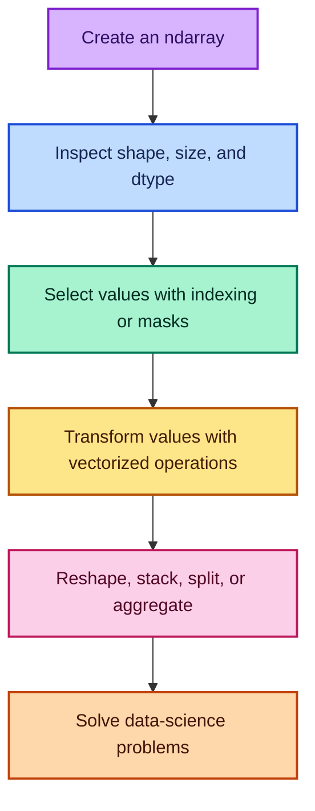
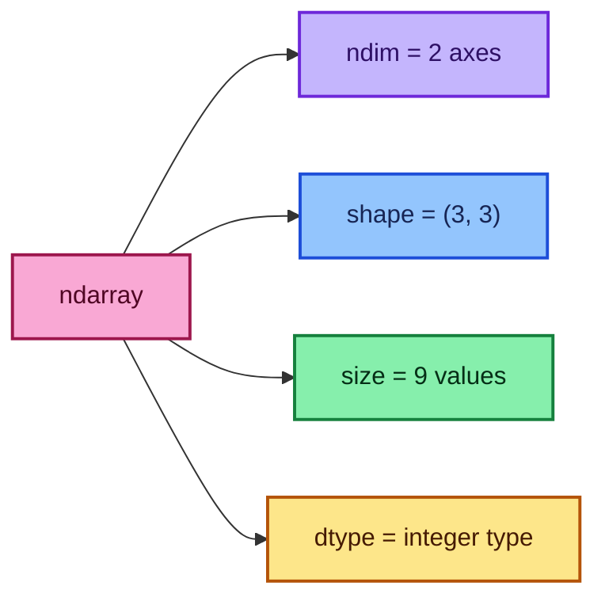
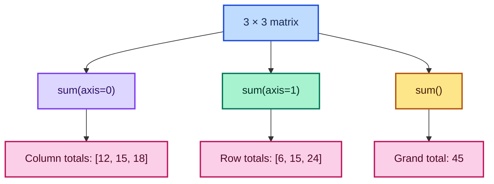
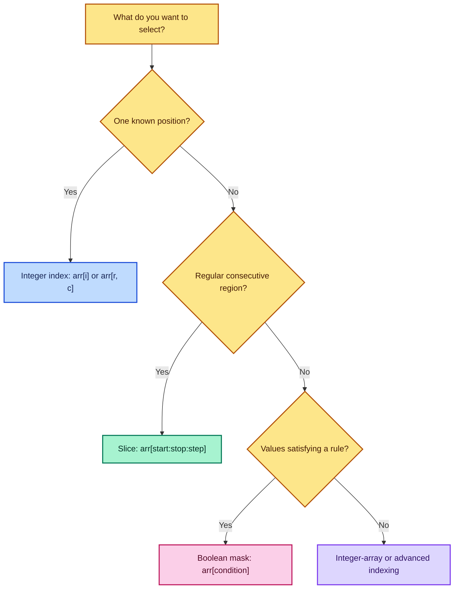
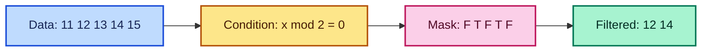
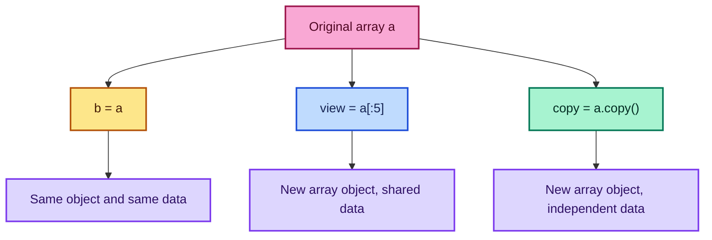
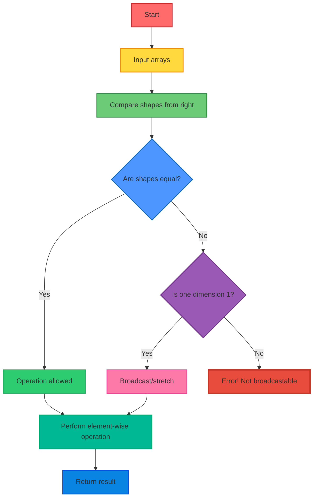
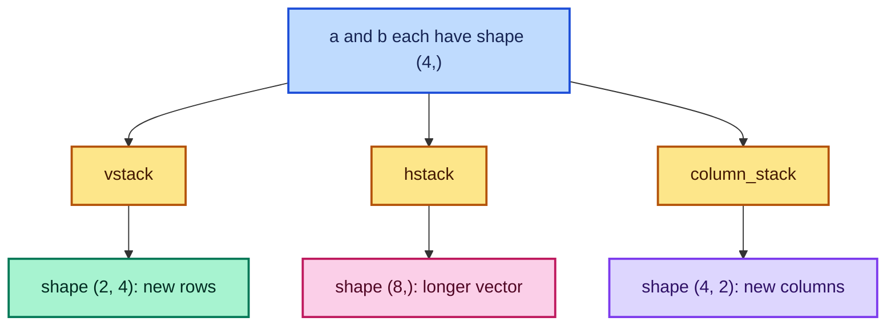
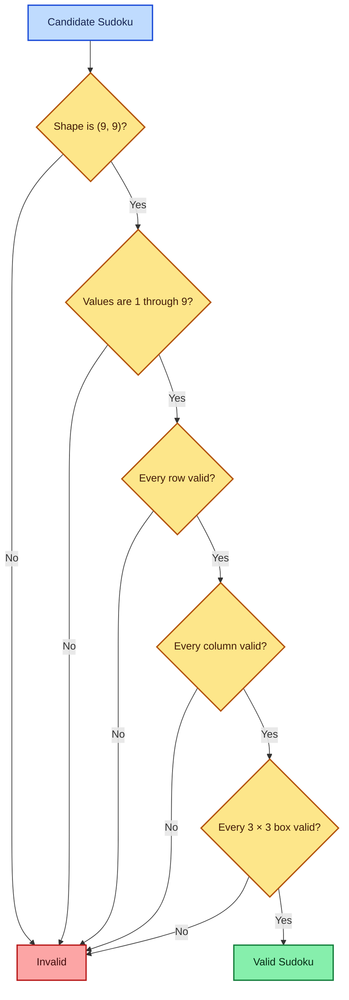
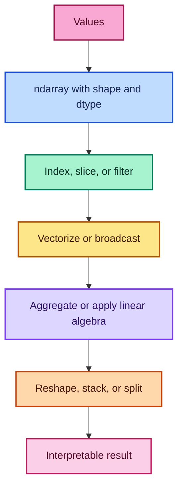

# NumPy Arrays: Creation, Indexing, Operations, and Practice

[**NOTEBOOK**](https://colab.research.google.com/drive/11NwI0T5XLRt2z-Xp5YiDtO7dbTdQRMVv?usp=sharing)

NumPy is the numerical foundation of much of Python data science. Its central
object, the **N-dimensional array** (`ndarray`), stores values in a structured,
usually homogeneous form and lets us perform calculations on entire groups of
values without writing a Python loop for each element.

These notes explain not only **what** each operation does, but also **why** it
matters, **how** it works, **when** to use it, and the mistakes that commonly
surprise beginners.

---

## Table of Contents

1. [Learning map](#1-learning-map)
2. [What is a NumPy array?](#2-what-is-a-numpy-array)
3. [Creating arrays](#3-creating-arrays)
4. [Random array generation](#4-random-array-generation)
5. [Array attributes](#5-array-attributes)
6. [Aggregation and statistical methods](#6-aggregation-and-statistical-methods)
7. [Reshaping arrays](#7-reshaping-arrays)
8. [Indexing and slicing](#8-indexing-and-slicing)
9. [Boolean indexing](#9-boolean-indexing)
10. [Views, shallow copies, and deep copies](#10-views-shallow-copies-and-deep-copies)
11. [Element-wise arithmetic](#11-element-wise-arithmetic)
12. [Broadcasting](#12-broadcasting)
13. [Matrix operations](#13-matrix-operations)
14. [Stacking and splitting](#14-stacking-and-splitting)
15. [Solved student-data exercises](#15-solved-student-data-exercises)
16. [Valid Sudoku exercise](#16-valid-sudoku-exercise)
17. [Common errors and corrections](#17-common-errors-and-corrections)
18. [Quick-reference cheat sheet](#18-quick-reference-cheat-sheet)
19. [Practice questions](#19-practice-questions)
20. [Further reading](#20-further-reading)

---

## 1. Learning map



The typical NumPy workflow is:

1. Create or load an array.
2. Inspect its structure.
3. Select relevant elements.
4. calculate without explicit element-by-element loops.
5. reorganize or summarize the result.

---

## 2. What is a NumPy array?

An `ndarray` is a grid of values organized along one or more **axes**.

```python
import numpy as np

# A one-dimensional array: one axis containing four values
vector = np.array([1, 2, 3, 4])

# A two-dimensional array: rows along axis 0 and columns along axis 1
matrix = np.array([
    [1, 2, 3],
    [4, 5, 6],
    [7, 8, 9]
])
```

### 2.1 Array, vector, and matrix vocabulary

| Object | Example shape | Meaning |
| --- | ---: | --- |
| Scalar | `()` | One value, such as `7` |
| Vector | `(n,)` | One-dimensional sequence of $n$ values |
| Matrix | $(m,n)$ | Two-dimensional grid with $m$ rows and $n$ columns |
| Tensor / N-D array | $(d_1,d_2,\ldots,d_k)$ | Array with $k$ axes |

For an array with shape $(d_1,d_2,\ldots,d_k)$, the total number of elements is

$$
N = \prod_{j=1}^{k} d_j = d_1d_2\cdots d_k
$$

For example, a $(6,5)$ matrix contains

$$
6 \times 5 = 30
$$

elements.

### 2.2 Why use NumPy instead of ordinary Python lists?

- **Vectorization:** one expression can process a complete array.
- **Consistent structure:** shape and data type are explicit.
- **Compact numerical storage:** values commonly share one `dtype`.
- **Scientific operations:** aggregation, linear algebra, random sampling,
  reshaping, and broadcasting are built in.
- **Ecosystem compatibility:** pandas, scikit-learn, SciPy, and many machine
  learning tools use NumPy arrays internally or accept them directly.

### 2.3 Homogeneous data and type promotion

An array generally uses one data type. When a Python list mixes integers and a
floating-point value, NumPy chooses a common type capable of representing all
values.

```python
values = [1, 2, 3.5]
arr = np.array(values)

print(arr)        # [1.  2.  3.5]
print(arr.dtype)  # usually float64
```

The integers become floating-point values because one `dtype` must serve the
entire array.

> **When is this important?** Data type affects memory use, precision, allowed
> values, and the result of arithmetic. For example, an integer array cannot
> store a decimal result without conversion.

---

## 3. Creating arrays

### 3.1 `np.array()`: convert Python data

Use `np.array()` when values already exist in a Python list, tuple, or another
array-like structure.

```python
import numpy as np

# One-dimensional array
arr_1d = np.array([1, 2, 3, 4])

# Two-dimensional array created from a nested list
arr_2d = np.array([
    [1, 2, 3],
    [4, 5, 6],
    [7, 8, 9]
])

print(arr_1d)
print(arr_2d)
```

You can request a specific type when the domain requires it:

```python
# Store the values explicitly as 32-bit floating-point numbers
temperatures = np.array([21, 23, 25], dtype=np.float32)
```

### 3.2 `np.arange()`: values separated by a fixed step

The syntax is

```python
np.arange(start, stop, step)
```

The `start` value is included, but `stop` is normally excluded.

```python
# Start at 1, stop before 11, move by 2
arr = np.arange(1, 11, 2)
print(arr)  # [1 3 5 7 9]
```

The generated values follow

$$
x_k = \text{start} + k(\text{step}), \qquad k=0,1,2,\ldots
$$

subject to the condition that the values have not crossed `stop` in the step's
direction.

**Use `arange` when:**

- the step size matters;
- integer ranges are required;
- indices or regularly increasing counters are being generated.

**Caution:** decimal steps can be affected by floating-point rounding. If the
number of points and both endpoints matter, prefer `linspace`.

### 3.3 `np.zeros()`: initialize with zeros

```python
# Four rows and eight columns
zeros = np.zeros((4, 8))
```

Common uses include initializing an accumulator, preparing an output matrix,
creating a blank image, or allocating placeholders before values are filled.

### 3.4 `np.ones()`: initialize with ones

```python
# Six rows and six columns
ones = np.ones((6, 6))
```

Ones are useful for weights, masks, baseline matrices, and constructing an
array containing another constant:

```python
# Every entry becomes 7
sevens = np.ones((2, 3), dtype=int) * 7
```

An even clearer constant constructor is:

```python
sevens = np.full((2, 3), 7)
```

### 3.5 `np.linspace()`: a fixed number of equally spaced points

```python
# Create exactly 100 values from 0 through 1, including both endpoints
grid = np.linspace(0, 1, 100)
```

For `num = n` and the default `endpoint=True`, the $i$-th value is

$$
x_i = a + i\left(\frac{b-a}{n-1}\right),
\qquad i=0,1,\ldots,n-1
$$

The spacing is therefore

$$
\Delta x = \frac{b-a}{n-1}
$$

For `np.linspace(0, 1, 100)`:

$$
\Delta x = \frac{1-0}{100-1} = \frac{1}{99} \approx 0.010101
$$

**Use `linspace` when:**

- plotting a function over a closed interval;
- evaluating a model at an exact number of points;
- both endpoints should usually be included;
- a controlled sampling grid is needed.

### 3.6 `arange` versus `linspace`

| Question | `np.arange()` | `np.linspace()` |
| --- | --- | --- |
| What do you control? | Step size | Number of values |
| Is `stop` included? | Usually no | Yes by default |
| Best with | Integer sequences | Continuous grids |
| Example | `np.arange(1, 11, 2)` | `np.linspace(0, 1, 100)` |

---

## 4. Random array generation

The source notebook uses the convenient legacy functions `np.random.rand`,
`np.random.randn`, and `np.random.randint`. They remain useful for recognizing
older code.

### 4.1 Uniform random values: `np.random.rand()`

```python
# Ten random values from the interval [0, 1)
uniform_values = np.random.rand(10)
```

For a continuous uniform random variable $X \sim U(0,1)$,

$$
0 \le X < 1, \qquad E[X] = \frac{1}{2},
\qquad \operatorname{Var}(X)=\frac{1}{12}
$$

### 4.2 Standard normal values: `np.random.randn()`

```python
# Ten values from an approximate standard normal distribution
normal_values = np.random.randn(10)
```

For $Z \sim N(0,1)$,

$$
E[Z] = 0, \qquad \operatorname{Var}(Z)=1
$$

Positive and negative values are both possible.

### 4.3 Random integers: `np.random.randint()`

```python
# Ten integers from 10 through 19; 20 is excluded
integers = np.random.randint(10, 20, 10)
```

### 4.4 Recommended generator style for new code

For new programs, create a local generator with `default_rng()`:

```python
import numpy as np

# A fixed seed makes this example reproducible
rng = np.random.default_rng(seed=42)

uniform_values = rng.random(10)              # Uniform on [0, 1)
normal_values = rng.standard_normal(10)      # Standard normal values
integers = rng.integers(10, 20, size=10)     # Integers 10 through 19
```

> **Fun fact:** These values are pseudo-random, meaning an algorithm generates
> them. A fixed seed helps reproduce an experiment, which is essential when
> debugging a machine-learning pipeline. They should not be used for passwords
> or cryptographic secrets.

---

## 5. Array attributes

Consider:

```python
arr = np.array([
    [1, 2, 3],
    [4, 5, 6],
    [7, 8, 9]
])
```



| Attribute | Result | Interpretation |
| --- | ---: | --- |
| `arr.ndim` | `2` | Number of axes |
| `arr.shape` | `(3, 3)` | Three rows and three columns |
| `arr.size` | `9` | Total number of stored elements |
| `arr.dtype` | e.g. `int64` | Data type of each element |

The relationships are

$$
\text{ndim} = \operatorname{len}(\text{shape})
$$

and

$$
\text{size} = \prod \text{shape}
$$

**Why inspect attributes?** Most NumPy errors are really shape, axis, or data
type misunderstandings. Checking these properties early makes debugging much
easier.

---

## 6. Aggregation and statistical methods

An **aggregation** reduces many values to one value or to fewer values.

Using

```python
arr = np.array([
    [1, 2, 3],
    [4, 5, 6],
    [7, 8, 9]
])
```

we obtain:

| Expression | Result | Meaning |
| --- | ---: | --- |
| `arr.min()` | `1` | Smallest value |
| `arr.max()` | `9` | Largest value |
| `arr.sum()` | `45` | Sum of all elements |
| `arr.mean()` | `5.0` | Arithmetic mean |
| `arr.std()` | `2.5819...` | Population standard deviation by default |
| `arr.argmin()` | `0` | Flat index of the first minimum |
| `arr.argmax()` | `8` | Flat index of the first maximum |

### 6.1 Sum and mean formulas

For values $x_1,x_2,\ldots,x_N$:

$$
\text{sum} = \sum_{i=1}^{N}x_i
$$

and

$$
\bar{x} = \frac{1}{N}\sum_{i=1}^{N}x_i
$$

For the values $1$ through $9$:

$$
\bar{x} = \frac{1+2+\cdots+9}{9} = \frac{45}{9}=5
$$

### 6.2 Standard deviation

By default, `arr.std()` calculates the population standard deviation:

$$
\sigma = \sqrt{\frac{1}{N}\sum_{i=1}^{N}(x_i-\bar{x})^2}
$$

For a sample standard deviation, use `ddof=1`:

```python
sample_std = arr.std(ddof=1)
```

which uses

$$
s = \sqrt{\frac{1}{N-1}\sum_{i=1}^{N}(x_i-\bar{x})^2}
$$

### 6.3 Understanding `axis`

For a two-dimensional matrix:

- `axis=0` collapses the row direction and produces one result per **column**.
- `axis=1` collapses the column direction and produces one result per **row**.
- omitting `axis` aggregates all elements.



```python
# Add down the rows, leaving one total for each column
column_sums = np.sum(arr, axis=0)  # [12, 15, 18]

# Add across the columns, leaving one total for each row
row_sums = np.sum(arr, axis=1)     # [6, 15, 24]
```

> **Memory aid:** The named axis is the axis that disappears from the result.

### 6.4 `argmax` and `argmin`

With no axis, NumPy conceptually flattens the array before returning the
position:

```python
flat_position = arr.argmax()         # 8
row_col = np.unravel_index(flat_position, arr.shape)
print(row_col)                       # (2, 2)
```

Use `argmax` when the location of the best score matters, not only the value.

---

## 7. Reshaping arrays

The notebook creates 30 values and rearranges them into six rows and five
columns:

```python
arr = np.arange(1, 31)
arr = arr.reshape(6, 5)

print(arr)
# [[ 1  2  3  4  5]
#  [ 6  7  8  9 10]
#  [11 12 13 14 15]
#  [16 17 18 19 20]
#  [21 22 23 24 25]
#  [26 27 28 29 30]]
```

### 7.1 Reshape invariant

Reshaping changes the arrangement, not the number of values. Therefore:

$$
\prod \text{old shape} = \prod \text{new shape}
$$

Here:

$$
30 = 6 \times 5
$$

`reshape(4, 8)` would fail because

$$
4 \times 8 = 32 \ne 30
$$

### 7.2 Let NumPy infer one dimension

```python
# NumPy calculates that the missing dimension must be 5
arr = np.arange(1, 31).reshape(6, -1)
print(arr.shape)  # (6, 5)
```

Only one dimension may be `-1`, because NumPy needs enough information to
solve for the missing size.

### 7.3 `reshape` versus `resize`

| Operation | Main behavior |
| --- | --- |
| `arr.reshape(...)` | New shape; element count must match |
| `np.resize(arr, ...)` | May repeat or truncate values to fill the new size |
| `arr.resize(...)` | Changes the array in place when permitted |

For most data reshaping, `reshape` is the clearer and safer choice.

---

## 8. Indexing and slicing

Indexing selects one element; slicing selects a range or structured region.
NumPy uses zero-based indexing.

### 8.1 One-dimensional indexing

```python
arr = np.arange(11, 21)
# arr = [11, 12, 13, 14, 15, 16, 17, 18, 19, 20]

value = arr[4]
print(value)  # 15
```

The value `15` is at index `4` because counting begins at `0`.

Negative indices count backward:

```python
print(arr[-1])  # 20, the last value
print(arr[-2])  # 19, the second-last value
```

### 8.2 Slicing syntax

```python
arr[start:stop:step]
```

- `start` is included.
- `stop` is excluded.
- `step` controls the jump between positions.
- omitted values use sensible defaults.

```python
arr_slice = arr[3::2]
print(arr_slice)  # [14, 16, 18, 20]
```

Reasoning:

1. Start at index `3`, whose value is `14`.
2. No stop is given, so continue to the end.
3. Move two indices at a time: `3, 5, 7, 9`.

### 8.3 Two-dimensional indexing

For a matrix, use

```python
matrix[row_selection, column_selection]
```

Let

```python
arr = np.arange(1, 31).reshape(6, 5)
```

Then:

```python
# Rows from index 3 onward and columns from index 3 onward
bottom_right = arr[3:, 3:]

print(bottom_right)
# [[19 20]
#  [24 25]
#  [29 30]]
```

Why does this work?

- `3:` for rows selects row indices `3, 4, 5`.
- `3:` for columns selects column indices `3, 4`.
- Their intersection forms a $3 \times 2$ submatrix.

To select the third column:

```python
third_column = arr[:, 2]
print(third_column)  # [3, 8, 13, 18, 23, 28]
```

Here, `:` means “all rows,” while column index `2` means the third column.

### 8.4 A selection decision guide



---

## 9. Boolean indexing

Boolean indexing filters an array using a condition.

```python
arr = np.arange(11, 21)

# Test the condition element by element
even_mask = arr % 2 == 0
print(even_mask)
# [False, True, False, True, False, True, False, True, False, True]

# Keep values whose corresponding mask entry is True
even_values = arr[even_mask]
print(even_values)  # [12, 14, 16, 18, 20]
```

The divisibility rule is

$$
x \text{ is even} \iff x \bmod 2 = 0
$$

### 9.1 Mental model



### 9.2 Multiple conditions

Use `&` for element-wise AND, `|` for element-wise OR, and `~` for element-wise
NOT. Place each comparison inside parentheses.

```python
scores = np.array([55, 72, 84, 91, 67])

# Keep scores from 70 through 90, inclusive
selected = scores[(scores >= 70) & (scores <= 90)]
print(selected)  # [72, 84]
```

Do not write:

```python
# Incorrect for arrays
# scores >= 70 and scores <= 90
```

Python's scalar `and` does not perform an element-wise array comparison.

### 9.3 Filtering versus replacement

```python
arr = np.array([10, 20, 30, 40])

# Filtering creates a result containing only matching values
filtered = arr[arr >= 30]            # [30, 40]

# Boolean assignment changes matching positions
arr[arr < 30] = 0                    # arr becomes [0, 0, 30, 40]
```

Use filtering when rows or values should be removed from the result. Use
Boolean assignment when the original structure should remain but selected
values must change.

---

## 10. Views, shallow copies, and deep copies

This is one of the most important NumPy concepts.

### 10.1 Assignment: another name for the same array

```python
a = np.arange(1, 6)
b = a

b[0] = 99
print(a)  # [99, 2, 3, 4, 5]
```

`a` and `b` refer to the same array object.

### 10.2 Basic slices are usually views

```python
a = np.arange(1, 21)
view = a[:5]

# In-place modification changes the shared underlying data
view *= 10

print(view)  # [10, 20, 30, 40, 50]
print(a[:5]) # [10, 20, 30, 40, 50]
```

### 10.3 Why the notebook's slice example leaves `a` unchanged

The notebook uses:

```python
slice_part = a[:5]
slice_part = slice_part * 10
```

`slice_part * 10` calculates a **new array**, and the assignment makes
`slice_part` refer to that new result. It does not write the result back into
the view, so `a` remains unchanged.

Compare the two patterns:

```python
# New result: original remains unchanged
slice_part = a[:5]
slice_part = slice_part * 10

# In-place mutation: original changes because slice_part is a view
slice_part = a[:5]
slice_part *= 10
```

### 10.4 Explicit deep copy

```python
a = np.arange(1, 21)
b = a.copy()

b[0] = 99

print(b[0])  # 99
print(a[0])  # 1
```

The data buffers are independent.



| Expression | Shares underlying data? | Typical purpose |
| --- | ---: | --- |
| `b = a` | Yes; same object | Alias the array |
| `b = a[:]` | Usually yes; basic slice view | Efficient window into data |
| `b = a.view()` | Yes | Explicit view |
| `b = a.copy()` | No | Independent modification |
| `b = a[boolean_mask]` | No; advanced indexing copy | Filtered result |

> **When should you copy?** Use `.copy()` when the selected data must be edited
> independently and accidental mutation of the source would be harmful.

---

## 11. Element-wise arithmetic

Let

```python
a1 = np.array([1, 2, 3, 4, 5])
a2 = np.array([6, 7, 8, 9, 10])
```

NumPy's ordinary arithmetic operators act element by element when the shapes
are equal or broadcast-compatible.

| Operation | Expression | Result |
| --- | --- | --- |
| Addition | `a1 + a2` | `[7, 9, 11, 13, 15]` |
| Subtraction | `a1 - a2` | `[-5, -5, -5, -5, -5]` |
| Multiplication | `a1 * a2` | `[6, 14, 24, 36, 50]` |
| True division | `a1 / a2` | `[0.1667, 0.2857, 0.375, 0.4444, 0.5]` |
| Floor division | `a1 // a2` | `[0, 0, 0, 0, 0]` |
| Power | `a1 ** a2` | `[1, 128, 6561, 262144, 9765625]` |

For two arrays $\mathbf{a}$ and $\mathbf{b}$, element-wise multiplication is

$$
\mathbf{a} \odot \mathbf{b}
=
\begin{bmatrix}
a_1b_1 & a_2b_2 & \cdots & a_nb_n
\end{bmatrix}
$$

It is **not** the same as a dot product or matrix multiplication.

### 11.1 Floor division versus true division

For positive numbers:

$$
a // b = \left\lfloor \frac{a}{b}\right\rfloor
$$

Since every value in `a1` is smaller than its matching value in `a2`, each
ratio lies between $0$ and $1$, and its floor is $0$.

### 11.2 Why vectorization matters

Without vectorization:

```python
result = []
for x, y in zip(a1, a2):
    result.append(x + y)
```

With NumPy:

```python
result = a1 + a2
```

The second form expresses the mathematical intention directly and lets NumPy
perform the element-wise loop internally.

---

## 12. Broadcasting

**Broadcasting** is NumPy's superpower that allows arrays of different shapes to work together in arithmetic operations. Think of it as **"shape magic"** - NumPy automatically stretches smaller arrays to match larger ones!


### 12.1 Scalar broadcasting

```python
arr = np.array([10, 20, 30, 40])
result = arr + 10

print(result)  # [20, 30, 40, 50]
```

Mathematically:

$$
[10,20,30,40] + 10
=
[10+10,20+10,30+10,40+10]
$$

### 12.2 Matrix and scalar

```python
arr2 = np.arange(1, 26).reshape(5, 5)

# Add ten to every cell and store the new array
arr2 = arr2 + 10

# Multiply every cell by two
doubled = arr2 * 2
```

In the notebook, `arr2 * 2` occurs before `arr2` is created. In a clean Python
session that line raises `NameError`. Define `arr2` first, as above.

### 12.3 General broadcasting rules

Compare shapes from their **rightmost** dimensions. Two dimensions are
compatible when:

1. they are equal, or
2. one of them equals `1`.

Missing leading dimensions behave like dimensions of size `1`.



Examples:

| Shape A | Shape B | Compatible? | Result shape |
| ---: | ---: | ---: | ---: |
| `(5, 5)` | `()` | Yes | `(5, 5)` |
| `(5, 5)` | `(5,)` | Yes | `(5, 5)` |
| `(3, 1)` | `(1, 4)` | Yes | `(3, 4)` |
| `(3, 4)` | `(3,)` (NumPy reads this as (1, 3)) | No | — |
| `(2, 3, 4)` | `(3, 1)` | Yes | `(2, 3, 4)` |

### 12.4 A useful row/column example

```python
matrix = np.array([
    [1, 2, 3],
    [4, 5, 6]
])                              # shape (2, 3)

column_offsets = np.array([10, 20, 30])  # shape (3,)
result = matrix + column_offsets

print(result)
# [[11, 22, 33],
#  [14, 25, 36]]
```

The length-3 vector aligns with the matrix's last dimension, so it is applied
to every row.

---

## 13. Matrix operations

Let

```python
A = np.array([[1, 2],
              [3, 4]])

B = np.array([[5, 6],
              [7, 8]])
```

### 13.1 Matrix multiplication

The notebook uses:

```python
C = np.dot(A, B)
print(C)
# [[19, 22],
#  [43, 50]]
```

For two-dimensional arrays, this is matrix multiplication. The modern `@`
operator makes the intention especially clear:

```python
C = A @ B
```

If $A$ has shape $(m,n)$ and $B$ has shape $(n,p)$, then

$$
AB \text{ has shape } (m,p)
$$

and each result entry is

$$
C_{ij} = \sum_{k=1}^{n} A_{ik}B_{kj}
$$

For the first element:

$$
C_{11} = 1(5)+2(7)=19
$$

For the first row, second column:

$$
C_{12} = 1(6)+2(8)=22
$$

For the second row, first column:

$$
C_{21} = 3(5)+4(7)=43
$$

For the last element:

$$
C_{22} = 3(6)+4(8)=50
$$

### 13.2 Element-wise `*` versus matrix `@`

```python
elementwise = A * B
# [[ 5, 12],
#  [21, 32]]

matrix_product = A @ B
# [[19, 22],
#  [43, 50]]
```

Use `*` when matching cells should interact. Use `@` when rows and columns
should be combined according to linear algebra.

### 13.3 Transpose

```python
A_transpose = A.T
print(A_transpose)
# [[1, 3],
#  [2, 4]]
```

The transpose exchanges row and column indices:

$$
(A^T)_{ij} = A_{ji}
$$

and changes shape from $(m,n)$ to $(n,m)$.

> **Fun fact:** A matrix equal to its transpose, $A=A^T$, is called a
> **symmetric matrix**.

---

## 14. Stacking and splitting

### 14.1 Vertical stacking

```python
a = np.array([1, 2, 3, 4])
b = np.array([5, 6, 7, 8])

vertical = np.vstack((a, b))
print(vertical)
# [[1, 2, 3, 4],
#  [5, 6, 7, 8]]
```

Two shape-`(4,)` vectors become one shape-`(2, 4)` matrix.

**Use it when:** each array represents a new row or batch of observations.

### 14.2 Horizontal stacking

```python
horizontal = np.hstack((a, b))
print(horizontal)
# [1, 2, 3, 4, 5, 6, 7, 8]
```

For one-dimensional inputs, `hstack` joins them end to end, giving shape
`(8,)`.

### 14.3 Column stacking

```python
columns = np.column_stack((a, b))
print(columns)
# [[1, 5],
#  [2, 6],
#  [3, 7],
#  [4, 8]]
```

The vectors become columns of a shape-`(4, 2)` matrix.

**Use it when:** each one-dimensional array is a feature column and matching
positions belong to the same observation.

### 14.4 Shape intuition



### 14.5 Horizontal splitting

```python
c = np.arange(16).reshape(4, 4)

column_blocks = np.hsplit(c, 4)
```

This splits four columns into four shape-`(4, 1)` arrays.

The axis length must divide evenly when an integer number of equal sections is
requested. Here:

$$
\frac{4\text{ columns}}{4\text{ sections}}=1\text{ column per section}
$$

### 14.6 Vertical splitting

```python
row_blocks = np.vsplit(c, 2)
```

This splits four rows into two shape-`(2, 4)` arrays:

$$
\frac{4\text{ rows}}{2\text{ sections}}=2\text{ rows per section}
$$

### 14.7 Stacking/splitting summary

| Function | Direction or role | Typical interpretation |
| --- | --- | --- |
| `np.vstack` | Vertical | Add observations as rows |
| `np.hstack` | Horizontal | Join along existing horizontal direction |
| `np.column_stack` | Columns | Build feature columns from 1-D arrays |
| `np.hsplit` | Across columns | Divide feature groups |
| `np.vsplit` | Across rows | Divide observation batches |

---

## 15. Solved student-data exercises

The exercise notebook provides this dataset:

```python
import numpy as np

# Columns: [Age, Math Marks, Science Marks]
data = np.array([
    [18, 85, 78],   # Student 1
    [19, 92, 88],   # Student 2
    [17, 76, 95],   # Student 3
    [18, 65, 70],   # Student 4
    [20, 90, 85]    # Student 5
])
```

The structure is:

- one **row** per student;
- column `0` = age;
- column `1` = mathematics mark;
- column `2` = science mark.

### Exercise 1: Get the shape of the matrix

```python
data.shape
# (5, 3)
```

There are five students and three recorded variables.

### Exercise 2: Find the average age

```python
average_age = data[:, 0].mean()
print(average_age)  # 18.4
```

The ages are $18,19,17,18,20$, so

$$
\bar{x}_{\text{age}}
=\frac{18+19+17+18+20}{5}
=\frac{92}{5}
=18.4
$$

### Exercise 3: Extract all mathematics marks

```python
math_marks = data[:, 1]
print(math_marks)  # [85, 92, 76, 65, 90]
```

`:` selects all rows and `1` selects the second column.

### Exercise 4: Find the highest science mark

```python
highest_science = data[:, 2].max()
print(highest_science)  # 95
```

### Exercise 5: Get details of students scoring more than 90 in mathematics

```python
high_math_students = data[data[:, 1] > 90]
print(high_math_students)
# [[19, 92, 88]]
```

The condition creates one Boolean value per row:

```text
Math marks:  [85,    92,   76,    65,    90]
Condition:   [False, True, False, False, False]
```

Notice that `90` is excluded because the question says **more than** 90, not
“at least 90.”

### Exercise 6: Increase all mathematics marks by 5

To preserve the original data, work on a copy:

```python
updated_data = data.copy()
updated_data[:, 1] += 5

print(updated_data)
# [[18, 90,  78],
#  [19, 97,  88],
#  [17, 81,  95],
#  [18, 70,  70],
#  [20, 95,  85]]
```

This uses scalar broadcasting over the mathematics column.

> In a real grading system, consider whether marks must be capped at 100. A
> safe capped version is `np.minimum(data[:, 1] + 5, 100)`.

### Exercise 7: Count students younger than 19

```python
count_younger_than_19 = np.sum(data[:, 0] < 19)
print(count_younger_than_19)  # 3
```

Why does summing work? In numerical contexts, `True` behaves like $1$ and
`False` behaves like $0$. The mask is

```text
[True, False, True, True, False]
```

so

$$
1+0+1+1+0=3
$$

An equally clear counting method is:

```python
count_younger_than_19 = np.count_nonzero(data[:, 0] < 19)
```

### Exercise 8: Calculate the column-wise averages

```python
column_means = data.mean(axis=0)
print(column_means)  # [18.4, 81.6, 83.2]
```

These are:

- average age: $18.4$;
- average mathematics mark: $81.6$;
- average science mark: $83.2$.

For mathematics:

$$
\bar{x}_{\text{math}}
=\frac{85+92+76+65+90}{5}
=\frac{408}{5}
=81.6
$$

For science:

$$
\bar{x}_{\text{science}}
=\frac{78+88+95+70+85}{5}
=\frac{416}{5}
=83.2
$$

`axis=0` collapses the student rows, leaving one result for each column.

### Exercise 9: Students scoring at least 80 in both subjects

```python
strong_in_both = data[(data[:, 1] >= 80) & (data[:, 2] >= 80)]

print(strong_in_both)
# [[19, 92, 88],
#  [20, 90, 85]]
```

The logical condition is

$$
(\text{Math} \ge 80) \land (\text{Science} \ge 80)
$$

Both comparisons must be true for the row to remain.

### Exercise 10: Replace science marks below 75 with zero

Again, use a copy if the original data must remain available:

```python
cleaned_data = data.copy()
cleaned_data[cleaned_data[:, 2] < 75, 2] = 0

print(cleaned_data)
# [[18, 85, 78],
#  [19, 92, 88],
#  [17, 76, 95],
#  [18, 65,  0],
#  [20, 90, 85]]
```

The row condition finds students whose science mark is below 75. The trailing
`, 2` limits the assignment to the science column.

### Complete exercise solution

```python
import numpy as np

data = np.array([
    [18, 85, 78],
    [19, 92, 88],
    [17, 76, 95],
    [18, 65, 70],
    [20, 90, 85]
])

# 1. Matrix structure
matrix_shape = data.shape

# 2. All rows, age column, followed by the mean
average_age = data[:, 0].mean()

# 3. All rows from the mathematics column
math_marks = data[:, 1]

# 4. Maximum value in the science column
highest_science = data[:, 2].max()

# 5. Keep complete rows whose mathematics value exceeds 90
high_math_students = data[data[:, 1] > 90]

# 6. Copy first so the source data is not mutated
updated_data = data.copy()
updated_data[:, 1] += 5

# 7. Count True entries in the age condition
younger_count = np.count_nonzero(data[:, 0] < 19)

# 8. Collapse rows and retain one average per column
column_means = data.mean(axis=0)

# 9. Parentheses are required around both vectorized comparisons
strong_in_both = data[(data[:, 1] >= 80) & (data[:, 2] >= 80)]

# 10. Copy, locate rows with low science marks, then modify column 2
cleaned_data = data.copy()
cleaned_data[cleaned_data[:, 2] < 75, 2] = 0
```

---

## 16. Valid Sudoku exercise

The notebook contains this completed $9 \times 9$ Sudoku grid:

```python
s = np.array([
    [5, 3, 4, 6, 7, 8, 9, 1, 2],
    [6, 7, 2, 1, 9, 5, 3, 4, 8],
    [1, 9, 8, 3, 4, 2, 5, 6, 7],
    [8, 5, 9, 7, 6, 1, 4, 2, 3],
    [4, 2, 6, 8, 5, 3, 7, 9, 1],
    [7, 1, 3, 9, 2, 4, 8, 5, 6],
    [9, 6, 1, 5, 3, 7, 2, 8, 4],
    [2, 8, 7, 4, 1, 9, 6, 3, 5],
    [3, 4, 5, 2, 8, 6, 1, 7, 9]
])
```

### 16.1 What makes a completed Sudoku valid?

For the standard symbol set

$$
S=\{1,2,3,4,5,6,7,8,9\}
$$

a completed grid is valid when:

1. its shape is $(9,9)$;
2. every value belongs to $S$;
3. every row contains each element of $S$ exactly once;
4. every column contains each element of $S$ exactly once;
5. every $3 \times 3$ subgrid contains each element of $S$ exactly once.

### 16.2 Validation intuition



### 16.3 Complete, readable validator

```python
import numpy as np

def is_valid_completed_sudoku(grid):
    """Return True only if grid is a valid completed 9x9 Sudoku."""

    # Convert array-like input while preserving NumPy-friendly operations
    grid = np.asarray(grid)

    # A standard completed Sudoku must have exactly 9 rows and 9 columns
    if grid.shape != (9, 9):
        return False

    required = np.arange(1, 10)

    # Sorting any valid unit must produce [1, 2, ..., 9]
    def valid_unit(values):
        return np.array_equal(np.sort(values), required)

    # Check all nine rows
    for row in grid:
        if not valid_unit(row):
            return False

    # grid.T exposes the original columns as rows
    for column in grid.T:
        if not valid_unit(column):
            return False

    # Visit the nine non-overlapping 3x3 boxes
    for row_start in range(0, 9, 3):
        for col_start in range(0, 9, 3):
            box = grid[
                row_start:row_start + 3,
                col_start:col_start + 3
            ]

            # ravel() converts the 3x3 box into a length-9 vector
            if not valid_unit(box.ravel()):
                return False

    return True

print(is_valid_completed_sudoku(s))  # True
```

### 16.4 Why sorting is sufficient

Each unit contains nine entries. If its sorted values equal
$[1,2,3,4,5,6,7,8,9]$, then every required digit appears exactly once. A
duplicate necessarily forces some other required value to be missing.

### 16.5 Compact vectorized reshape for subgrids

The nine boxes can also be rearranged without nested Python loops:

```python
# (9, 9) -> (3, 3, 3, 3) -> box-friendly axis order -> (9, 9)
boxes = (
    s.reshape(3, 3, 3, 3)
     .transpose(0, 2, 1, 3)
     .reshape(9, 9)
)

# Each row of `boxes` now represents one 3x3 Sudoku box
boxes_are_valid = np.all(np.sort(boxes, axis=1) == np.arange(1, 10))
```

This version is elegant but less obvious to a beginner. Prefer the readable
loop version until the reshape-and-transpose mapping is completely understood.

---

## 17. Common errors and corrections

### Error 1: Using a variable before defining it

```python
# Raises NameError in a clean session
arr2 * 2
```

Correct order:

```python
arr2 = np.arange(1, 26).reshape(5, 5)
doubled = arr2 * 2
```

### Error 2: Confusing an out-of-place expression with view mutation

```python
part = a[:5]
part = part * 10   # New array; `a` is unchanged
```

If intentional shared-data mutation is required:

```python
part = a[:5]
part *= 10         # In-place; shared region of `a` changes
```

If independence is required:

```python
part = a[:5].copy()
part *= 10         # `a` stays unchanged
```

### Error 3: Shadowing the built-in name `slice`

The notebooks assign an array to `slice`:

```python
slice = arr[3:, 3:]
```

This works, but `slice` is also a Python built-in type. Prefer a descriptive
name:

```python
bottom_right = arr[3:, 3:]
```

### Error 4: Expecting `stop` to be included in a slice

```python
arr[1:4]
```

selects indices `1`, `2`, and `3`, not index `4`.

### Error 5: Mixing up `axis=0` and `axis=1`

Remember: the named axis is collapsed.

```python
arr.sum(axis=0)  # one result per column
arr.sum(axis=1)  # one result per row
```

### Error 6: Using `and` or `or` with array conditions

```python
# Wrong
# data[(data[:, 1] >= 80) and (data[:, 2] >= 80)]

# Correct
data[(data[:, 1] >= 80) & (data[:, 2] >= 80)]
```

### Error 7: Confusing `*` with matrix multiplication

```python
A * B  # element-wise
A @ B  # matrix multiplication
```

### Error 8: Ignoring shape compatibility

Before combining arrays, inspect:

```python
print(A.shape, B.shape)
```

This simple check explains many broadcasting and matrix-multiplication errors.

---

## 18. Quick-reference cheat sheet

### Creation

| Task | Code |
| --- | --- |
| Convert a list | `np.array([1, 2, 3])` |
| Integer sequence | `np.arange(1, 11, 2)` |
| Fixed number of points | `np.linspace(0, 1, 100)` |
| Zeros | `np.zeros((4, 8))` |
| Ones | `np.ones((6, 6))` |
| Constant values | `np.full((2, 3), 7)` |
| Reproducible random generator | `rng = np.random.default_rng(42)` |

### Inspection and shape

| Task | Code |
| --- | --- |
| Number of axes | `arr.ndim` |
| Dimensions | `arr.shape` |
| Element count | `arr.size` |
| Data type | `arr.dtype` |
| Reshape | `arr.reshape(rows, columns)` |
| Flatten view when possible | `arr.ravel()` |

### Selection

| Task | Code |
| --- | --- |
| One vector element | `arr[i]` |
| One matrix element | `arr[row, col]` |
| Slice | `arr[start:stop:step]` |
| All rows, one column | `arr[:, col]` |
| One row, all columns | `arr[row, :]` |
| Filter by rule | `arr[arr > threshold]` |
| Combine conditions | `arr[(cond1) & (cond2)]` |

### Aggregation

| Task | Code |
| --- | --- |
| Minimum / maximum | `arr.min()`, `arr.max()` |
| Sum / mean | `arr.sum()`, `arr.mean()` |
| Population standard deviation | `arr.std()` |
| Sample standard deviation | `arr.std(ddof=1)` |
| Index of maximum | `arr.argmax()` |
| Column-wise mean | `arr.mean(axis=0)` |
| Row-wise mean | `arr.mean(axis=1)` |

### Combination and linear algebra

| Task | Code |
| --- | --- |
| Element-wise multiplication | `A * B` |
| Matrix multiplication | `A @ B` |
| Transpose | `A.T` |
| Stack as rows | `np.vstack((a, b))` |
| Stack as columns | `np.column_stack((a, b))` |
| Split columns | `np.hsplit(A, sections)` |
| Split rows | `np.vsplit(A, sections)` |
| Independent copy | `B = A.copy()` |

---

## 19. Practice questions

Try each question before expanding the answer mentally or running the solution.

### Question 1

What is the output shape?

```python
np.arange(24).reshape(2, 3, 4).shape
```

**Answer:** `(2, 3, 4)`. The element count is preserved because
$2 \times 3 \times 4=24$.

### Question 2

Create exactly 21 equally spaced points from $-1$ to $1$, including both
endpoints.

```python
points = np.linspace(-1, 1, 21)
```

The spacing is

$$
\Delta x = \frac{1-(-1)}{21-1}=\frac{2}{20}=0.1
$$

### Question 3

Given `a = np.arange(10, 20)`, select `11, 14, 17` using one slice.

```python
a[1:9:3]
```

Index positions `1, 4, 7` contain the required values.

### Question 4

Given a matrix `A` with shape `(6, 5)`, what does `A[:, 2]` return?

**Answer:** All rows from the third column, with shape `(6,)`.

### Question 5

Filter values divisible by both 2 and 3.

```python
x = np.arange(1, 31)
answer = x[(x % 2 == 0) & (x % 3 == 0)]
# [6, 12, 18, 24, 30]
```

Equivalently, numbers divisible by both 2 and 3 are divisible by
$\operatorname{lcm}(2,3)=6$.

### Question 6

Why does this change `a`?

```python
a = np.array([1, 2, 3, 4])
b = a[:2]
b[0] = 99
```

**Answer:** Basic slicing usually returns a view sharing `a`'s data. Use
`b = a[:2].copy()` for independence.

### Question 7

Can arrays with shapes `(4, 3)` and `(3,)` be added?

**Answer:** Yes. Their rightmost dimensions are both `3`; the vector is applied
to every row, and the result has shape `(4, 3)`.

### Question 8

Can arrays with shapes `(4, 3)` and `(4,)` be added?

**Answer:** No. The rightmost dimensions `3` and `4` are unequal and neither is
`1`.

### Question 9

For $A$ with shape $(5,3)$ and $B$ with shape $(3,2)$, what is the shape of
$AB$?

**Answer:** $(5,2)$. The inner dimensions agree:

$$
(5,\cancel{3})(\cancel{3},2) \rightarrow (5,2)
$$

### Question 10

Create one result per row containing the largest value in that row.

```python
row_maxima = A.max(axis=1)
```

`axis=1` is collapsed, so the result retains the row axis.

---

## 20. Further reading

The examples in these notes come from the four supplied notebooks. For deeper
reference, see the official NumPy documentation:

- [NumPy array creation](https://numpy.org/doc/stable/user/basics.creation.html)
- [NumPy absolute basics for beginners](https://numpy.org/doc/stable/user/absolute_beginners.html)
- [Indexing on ndarrays](https://numpy.org/doc/stable/user/basics.indexing.html)
- [Broadcasting](https://numpy.org/doc/stable/user/basics.broadcasting.html)
- [Random Generator](https://numpy.org/doc/stable/reference/random/generator.html)

---

## Final mental model



The central habit is simple: always know the array's **shape**, know which
**axis** an operation uses, and know whether an expression returns a **view** or
an independent **copy**. Once these three ideas become intuitive, most NumPy
code becomes much easier to read and write.
