# Pandas for Data Analysis: Complete Notes and Case Studies

[**NOTEBOOK**](https://colab.research.google.com/drive/1Kz7TkB6lFQoqWX3FChUPDAwrBnqZ6eIL?usp=sharing)

Pandas is a Python library for working with **labeled, tabular, and time-aware
data**. It combines NumPy-style numerical operations with row and column labels,
making it especially useful for cleaning, exploring, joining, summarizing, and
preparing datasets for analysis or machine learning.

These notes explain **what**, **why**, **how**, and **when** for every major
concept demonstrated in the notebooks. They also correct stale or misleading
notebook outputs and replace brittle code with safer alternatives.

---

## Table of Contents

1. [Learning map](#1-learning-map)
2. [The Pandas mental model](#2-the-pandas-mental-model)
3. [Series](#3-series)
4. [DataFrame creation](#4-dataframe-creation)
5. [Selecting columns, rows, and subsets](#5-selecting-columns-rows-and-subsets)
6. [Conditional filtering](#6-conditional-filtering)
7. [Creating and removing columns or rows](#7-creating-and-removing-columns-or-rows)
8. [Inspecting and summarizing a DataFrame](#8-inspecting-and-summarizing-a-dataframe)
9. [Missing data](#9-missing-data)
10. [Merging, joining, and concatenating](#10-merging-joining-and-concatenating)
11. [GroupBy and aggregation](#11-groupby-and-aggregation)
12. [Pivot tables and cross-tabulations](#12-pivot-tables-and-cross-tabulations)
13. [Arithmetic, functions, and `apply`](#13-arithmetic-functions-and-apply)
14. [Countries dataset case study](#14-countries-dataset-case-study)
15. [Feature extraction case study](#15-feature-extraction-case-study)
16. [Important notebook corrections](#16-important-notebook-corrections)
17. [Common mistakes and safer patterns](#17-common-mistakes-and-safer-patterns)
18. [Quick-reference cheat sheet](#18-quick-reference-cheat-sheet)
19. [Practice questions with answers](#19-practice-questions-with-answers)
20. [Further reading](#20-further-reading)

---

## 1. Learning map

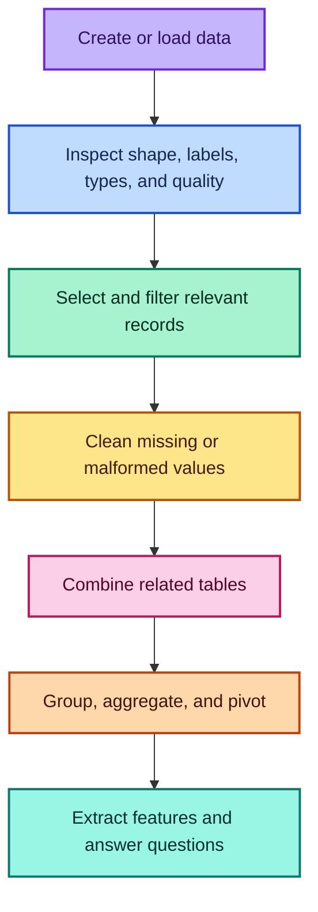

A reliable Pandas workflow usually follows this order:

1. Load or construct the data.
2. Inspect its dimensions, labels, types, and missingness.
3. Select the variables and observations needed for the question.
4. Clean invalid, missing, or inconsistent values.
5. Combine other tables only after understanding their keys.
6. Summarize or reshape the cleaned data.
7. Validate the result before interpreting it.

---

## 2. The Pandas mental model

Pandas has two foundational structures:

- a **Series** is a one-dimensional labeled sequence;
- a **DataFrame** is a two-dimensional labeled table.

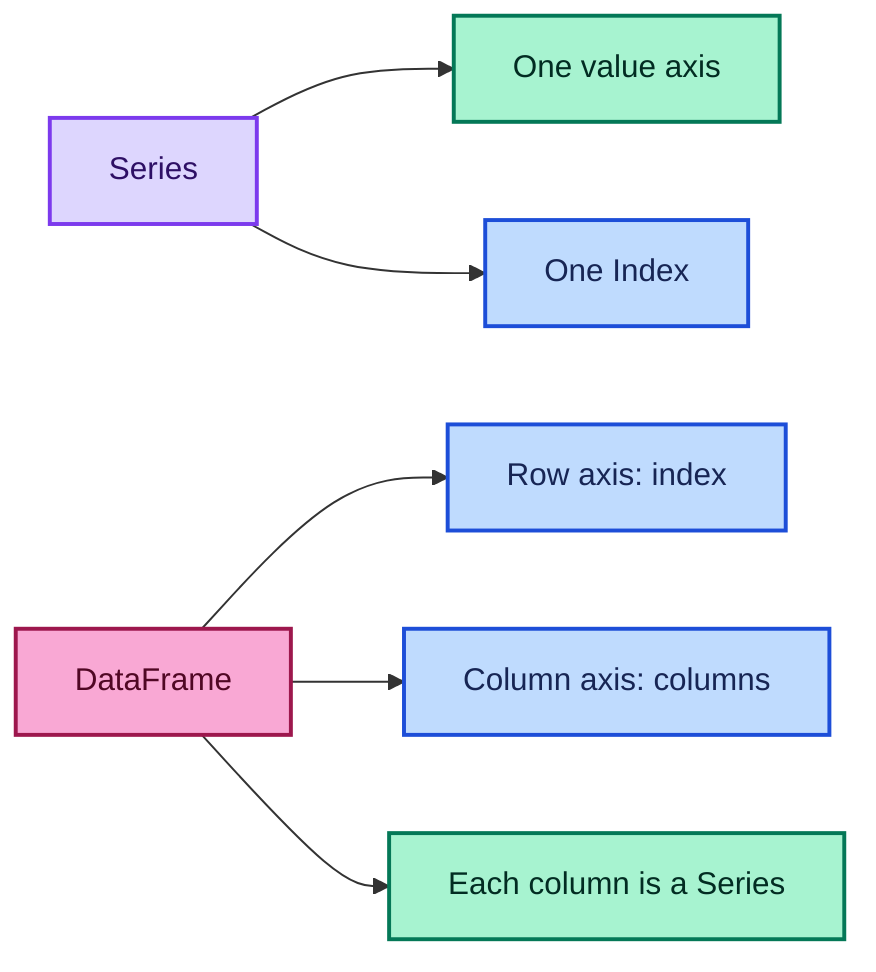

### 2.1 Why labels matter

NumPy operations mostly depend on array position and shape. Pandas operations
often align values by **labels**.

```python
import pandas as pd

left = pd.Series([10, 20], index=["a", "b"])
right = pd.Series([1, 2], index=["b", "a"])

result = left + right
print(result)
# a    12   <- left['a'] + right['a'] = 10 + 2
# b    21   <- left['b'] + right['b'] = 20 + 1
```

The calculation follows matching labels, not the displayed positions.

Mathematically, for indexes $I_L$ and $I_R$, an aligned addition behaves like

$$
r_i = l_i + q_i, \qquad i \in I_L \cap I_R
$$

while labels without a matching value usually produce a missing result.

### 2.2 DataFrame dimensions

If a DataFrame has $m$ rows and $n$ columns, its shape is

$$
(m,n)
$$

and it contains

$$
m \times n
$$

cells before considering nested objects inside individual cells.

### 2.3 Installation and import

```bash
pip install pandas numpy
```

```python
import numpy as np
import pandas as pd
```

`pd` and `np` are conventional aliases used throughout the notebooks and the
wider Python data-science ecosystem.

---

## 3. Series

A `Series` is a one-dimensional labeled array capable of holding values such as
integers, floats, strings, dates, or Python objects.

We can think of a Series as a mapping

$$
s: I \rightarrow V
$$

where $I$ is the set of index labels and $V$ is the value domain.

### 3.1 Creating a Series from a list

```python
import pandas as pd

values = [10, 20, 30]
s = pd.Series(values)

print(s)
# 0    10
# 1    20
# 2    30
# dtype: int64
```

Because no labels were supplied, Pandas creates a default integer index
$0,1,2$.

### 3.2 Creating a Series with custom labels

```python
labels = ["a", "b", "c"]
values = [10, 20, 30]

s = pd.Series(values, index=labels)

print(s)
# a    10
# b    20
# c    30
```

Custom labels are useful when each value has a natural identity, such as a
product code, country, month, or employee ID.

### 3.3 Creating a Series from a NumPy array

```python
import numpy as np

arr = np.array([10, 20, 30])
s = pd.Series(arr)
```

This is useful when numerical values already exist in a NumPy workflow but
need labels or Pandas operations.

### 3.4 Creating a Series from a dictionary

```python
mapping = {"a": 10, "b": 20, "c": 30}
s = pd.Series(mapping)

print(s)
# a    10
# b    20
# c    30
```

Dictionary keys become index labels and dictionary values become Series
values.

### 3.5 Selecting from a Series

```python
s = pd.Series([10, 20, 30], index=["a", "b", "c"])

by_label = s.loc["b"]   # 20
by_position = s.iloc[1] # 20
```

Use `.loc` when a label is meaningful and `.iloc` when the numerical position
is intentional.

### 3.6 Series anatomy

| Component | Example | Meaning |
| --- | --- | --- |
| Values | `[10, 20, 30]` | Stored observations |
| Index | `['a', 'b', 'c']` | Labels identifying observations |
| `dtype` | `int64` | Common storage type |
| `name` | e.g. `'Sales'` | Optional Series label |

```python
sales = pd.Series(
    [100, 150, 120],
    index=["Mon", "Tue", "Wed"],
    name="Sales"
)
```

> **Fun fact:** A DataFrame column selected with `df["column"]` is a Series.
> Selecting it with `df[["column"]]` returns a one-column DataFrame instead.

---

## 4. DataFrame creation

A DataFrame is a two-dimensional table with a row index and labeled columns.
Different columns can have different data types.

### 4.1 Creating a DataFrame from a dictionary

```python
import pandas as pd

data = {
    "Name": ["John", "Anna", "Peter", "Linda"],
    "Age": [28, 34, 29, 42],
    "City": ["New York", "Paris", "Berlin", "London"],
    "Salary": [65_000, 70_000, 62_000, 85_000]
}

df = pd.DataFrame(data)
print(df)
```

Output:

```text
    Name  Age      City  Salary
0   John   28  New York   65000
1   Anna   34     Paris   70000
2  Peter   29    Berlin   62000
3  Linda   42    London   85000
```

Dictionary keys become column names. Equal-length value sequences become the
column values.

### 4.2 Creating a DataFrame from a list of rows

```python
rows = [
    ["John", 28, "New York", 65_000],
    ["Anna", 34, "Paris", 70_000],
    ["Peter", 29, "Berlin", 62_000],
    ["Linda", 42, "London", 85_000]
]

columns = ["Name", "Age", "City", "Salary"]
df2 = pd.DataFrame(rows, columns=columns)
```

Without `columns=columns`, Pandas uses `0, 1, 2, 3` as column labels.

### 4.3 Notebook-state correction

The DataFrame notebook contains a cell that creates `df2` twice:

```python
df2 = pd.DataFrame(rows)
df2 = pd.DataFrame(rows, columns=columns)
```

The second assignment replaces the first object, so the final `df2` must have
named columns. A later output showing numerical column names was saved from an
earlier execution state and does not match the cell's final code.

### 4.4 Creating from external data

The country and anime notebooks load CSV files:

```python
countries = pd.read_csv("Countries.csv")
anime = pd.read_csv("anime.csv")
```

When loading a file, immediately inspect it:

```python
print(countries.shape)
countries.head()
countries.info()
```

This checks that the correct file, delimiter, header, and inferred data types
were used.

### 4.5 Row and column semantics

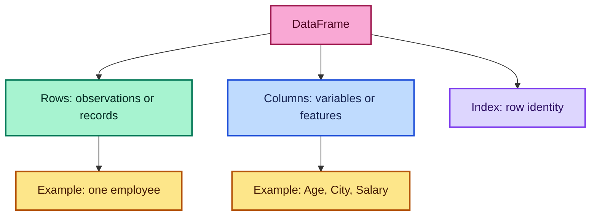

The “one row = one observation” convention makes filtering, grouping, joining,
and modeling much easier.

---

## 5. Selecting columns, rows, and subsets

Selection is not just syntax. It expresses whether we are choosing variables,
observations, or both.

### 5.1 Select one column

```python
names = df["Name"]
print(type(names))  # pandas.Series
```

### 5.2 Select multiple columns

```python
name_and_city = df[["Name", "City"]]
print(type(name_and_city))  # pandas.DataFrame
```

The outer brackets perform selection. The inner list contains the requested
column labels.

### 5.3 `.loc`: label-based selection

```python
# Rows with index labels 0 and 1
first_two = df.loc[[0, 1]]

# Select rows and columns in one operation
subset = df.loc[[0, 1], ["City", "Salary"]]
```

Prefer the second expression over chained selection such as
`df.loc[[0, 1]][["City", "Salary"]]`. A single `.loc` operation is clearer and
safer when assignment is involved.

For label slices, the ending label is normally included:

```python
# If labels are 0, 1, 2, this includes all three labels
df.loc[0:2]
```

### 5.4 `.iloc`: position-based selection

```python
# Fourth row because positions begin at zero
fourth_row = df.iloc[3]

print(fourth_row)
# Name       Linda
# Age           42
# City      London
# Salary     85000
```

Position slices follow ordinary Python rules, so the stop position is excluded:

```python
# Positions 0 and 1 only
df.iloc[0:2]
```

### 5.5 Selection comparison

| Goal | Recommended syntax | Result |
| --- | --- | --- |
| One column | `df['Name']` | Series |
| Several columns | `df[['Name', 'City']]` | DataFrame |
| Row by label | `df.loc[label]` | Series or scalar-like result |
| Row by position | `df.iloc[position]` | Series or scalar-like result |
| Rows/columns by label | `df.loc[rows, columns]` | Depends on selection |
| Rows/columns by position | `df.iloc[rows, columns]` | Depends on selection |

### 5.6 Selection decision guide

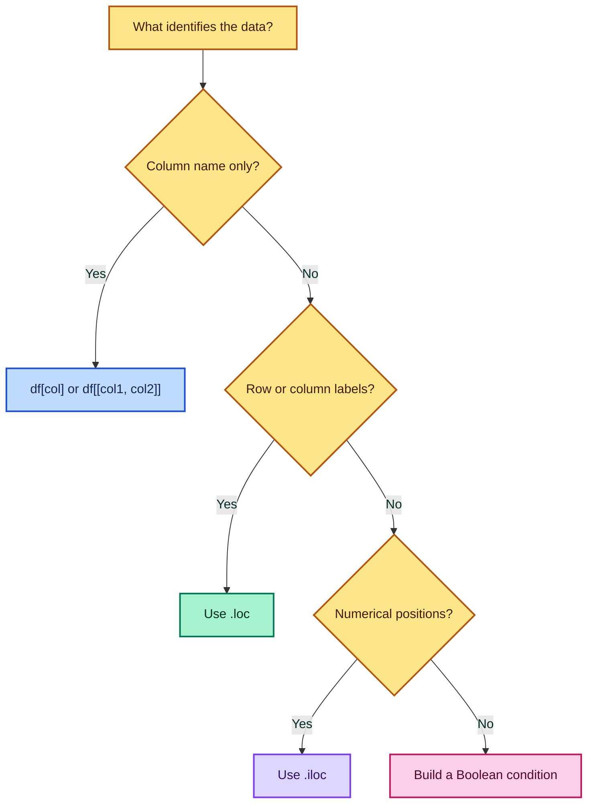

---

## 6. Conditional filtering

Conditional filtering keeps rows that satisfy a logical rule.

### 6.1 One condition

```python
# Keep people older than 30
older_than_30 = df[df["Age"] > 30]
```

Internally, `df["Age"] > 30` creates a Boolean Series:

```text
0    False
1     True
2    False
3     True
```

The filter retains rows aligned with `True`.

Using indicator notation, a row $i$ is retained when

$$
\mathbf{1}(\text{Age}_i > 30)=1
$$

### 6.2 Multiple conditions

```python
# Age above 30 AND city equal to Paris
result = df[(df["Age"] > 30) & (df["City"] == "Paris")]
```

Use:

- `&` for element-wise AND;
- `|` for element-wise OR;
- `~` for element-wise NOT.

Each comparison must be inside parentheses because of Python operator
precedence.

```python
# People in Paris OR London
european_cities = df[
    (df["City"] == "Paris") | (df["City"] == "London")
]

# Everyone not in Berlin
not_berlin = df[~(df["City"] == "Berlin")]
```

For membership in a list, `.isin()` is clearer:

```python
selected_cities = df[df["City"].isin(["Paris", "London"])]
```

### 6.3 Filter only the columns you need

```python
result = df.loc[df["Age"] > 30, ["Name", "Age", "City"]]
```

This combines a row condition and a column selection in one expression.

### 6.4 Do not use scalar `and` and `or`

```python
# Incorrect for Pandas Series
# df[(df["Age"] > 30) and (df["City"] == "Paris")]

# Correct element-wise operation
df[(df["Age"] > 30) & (df["City"] == "Paris")]
```

Python's `and` expects one truth value. A Series contains many truth values, so
Pandas cannot choose one automatically.

---

## 7. Creating and removing columns or rows

### 7.1 Create a new column from supplied values

```python
df = df.copy()
df["Designation"] = ["Doctor", "Eng.", "Doctor", "Eng."]
```

The supplied sequence must have one value per row unless Pandas can align it by
index labels.

### 7.2 Create a column from an existing column

```python
# Vectorized arithmetic
df["Annual_Bonus"] = df["Salary"] * 0.10
```

For employee $i$:

$$
\text{Bonus}_i = 0.10 \times \text{Salary}_i
$$

### 7.3 Remove a column

```python
without_designation = df.drop(columns=["Designation"])
```

Equivalent axis-explicit form:

```python
without_designation = df.drop("Designation", axis=1)
```

`columns=[...]` is often easier to read because it states the intention.

### 7.4 Remove a row by index label

```python
without_first_label = df.drop(index=0)
```

Equivalent form:

```python
without_first_label = df.drop(0, axis=0)
```

The original notebook places `df2.drop(0, axis=0)` under “Removing Columns,”
but `axis=0` removes a **row**, not a column.

### 7.5 Why the original is unchanged

```python
df.drop(index=0)
df
```

Most DataFrame transformation methods return a new object unless their result
is assigned.

```python
# Clear, reusable pattern
df_without_row = df.drop(index=0)

# Replace the variable intentionally
df = df.drop(index=0)
```

Avoid relying heavily on `inplace=True`; explicit assignment is easier to
trace in notebooks and data pipelines.

---

## 8. Inspecting and summarizing a DataFrame

The operations notebook creates:

```python
df1 = pd.DataFrame({
    "A": [1, 2, 3, 4, 5],
    "B": [10, 20, 30, 40, 50],
    "C": [100, 200, 300, 400, 500]
})
```

### 8.1 `shape`

```python
df1.shape  # (5, 3)
```

There are five rows and three columns.

### 8.2 `columns`

```python
df1.columns
# Index(['A', 'B', 'C'], dtype='object')
```

This is useful for checking exact spelling, spaces, capitalization, and
unexpected fields.

### 8.3 `head()` and `tail()`

```python
df1.head()   # first five rows by default
df1.head(3)  # first three rows
df1.tail(2)  # last two rows
```

These methods are quick previews, not statistical samples.

### 8.4 `info()`

```python
df1.info()
```

`info()` reports:

- row count and index type;
- column names;
- non-null count per column;
- inferred data types;
- approximate memory use.

It prints the report and returns `None`, so do not write
`print(df1.info())` unless an extra printed `None` is acceptable.

### 8.5 `describe()`

```python
summary = df1.describe()
```

For numerical columns, the default summary contains:

| Statistic | Meaning |
| --- | --- |
| `count` | Number of non-missing observations |
| `mean` | Arithmetic average |
| `std` | Sample standard deviation |
| `min` | Minimum |
| `25%` | First quartile |
| `50%` | Median |
| `75%` | Third quartile |
| `max` | Maximum |

For observations $x_1,x_2,\ldots,x_n$, the mean is

$$
\bar{x}=\frac{1}{n}\sum_{i=1}^{n}x_i
$$

and the sample standard deviation shown by `describe()` is

$$
s=\sqrt{\frac{1}{n-1}\sum_{i=1}^{n}(x_i-\bar{x})^2}
$$

For column `A = [1,2,3,4,5]`:

$$
\bar{x}=\frac{1+2+3+4+5}{5}=3
$$

and

$$
s=\sqrt{\frac{(1-3)^2+(2-3)^2+(3-3)^2+(4-3)^2+(5-3)^2}{4}}
=\sqrt{2.5}\approx1.5811
$$

### 8.6 Recommended first inspection

```python
def inspect_dataframe(df, name="df"):
    """Print a compact first-pass audit without changing the DataFrame."""
    print(f"{name}.shape = {df.shape}")
    print(f"{name}.columns = {df.columns.tolist()}")
    print("\nData types and non-null counts:")
    df.info()
    print("\nMissing values per column:")
    print(df.isna().sum().sort_values(ascending=False))
    return df.head()
```

> **When to use it:** immediately after `read_csv`, `merge`, or any major
> reshaping step. These are common points where row counts, labels, or types can
> change unexpectedly.

---

## 9. Missing data

Missing data means that the value for a specific observation-variable pair is
unknown, unavailable, invalid, or not applicable.

The notebook creates:

```python
import numpy as np
import pandas as pd

data = {
    "A": [1, 2, np.nan, 4, 5],
    "B": [1, 2, 3, 4, 5],
    "C": [1, 2, 3, np.nan, np.nan],
    "D": [1, np.nan, np.nan, np.nan, 5]
}

df = pd.DataFrame(data)
```

### 9.1 Correct missingness map

```python
missing_map = df.isna()
print(missing_map)
```

Correct output:

```text
       A      B      C      D
0  False  False  False  False
1  False  False  False   True
2   True  False  False   True
3  False  False   True   True
4  False  False   True  False
```

The saved notebook output incorrectly displays `True` for `B` in row `0`.
Column `B` contains no missing value, so that output came from a different
execution state.

### 9.2 Count missing values

```python
missing_count = df.isna().sum()
print(missing_count)
# A    1
# B    0
# C    2
# D    3
```

For column $j$, the count can be written as

$$
M_j=\sum_{i=1}^{n}\mathbf{1}(x_{ij}\text{ is missing})
$$

The missing percentage is

$$
R_j=\frac{M_j}{n}\times100\%
$$

```python
missing_percent = df.isna().mean().mul(100)
```

For the five-row example:

| Column | Missing count | Missing percentage |
| --- | ---: | ---: |
| A | 1 | $20\%$ |
| B | 0 | $0\%$ |
| C | 2 | $40\%$ |
| D | 3 | $60\%$ |

### 9.3 Check whether each column has any missing value

`any()` method checks if a column contains **ANY** missing values and returns `True` if **at least one value is missing**.

```python
df.isna().any()
# A     True
# B    False
# C     True
# D     True
```

The notebook's saved result marks every column as `True`, but that is
inconsistent with the actual `B` values.

### 9.4 Missing-data decision flow

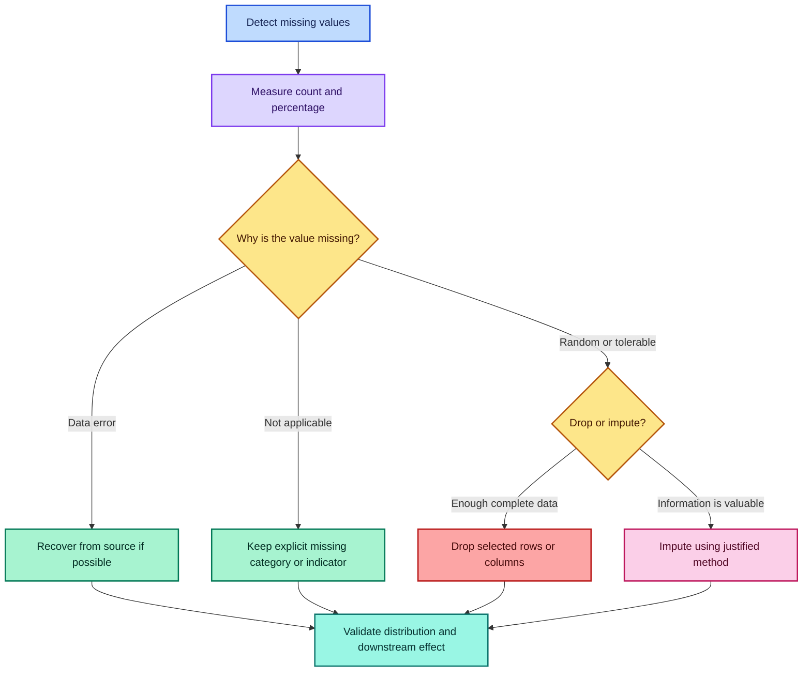

### 9.5 Drop rows containing any missing value

```python
complete_rows = df.dropna()
```

Only row `0` remains because it is the only row complete across all columns.

Use this only when complete-case analysis is scientifically acceptable and the
lost rows do not introduce serious bias.

### 9.6 Understand `thresh`

```python
# Keep rows with at least one non-missing value
df.dropna(thresh=1)
```

Every row in the notebook dataset has at least one known value, so this removes
nothing.

A more informative example is:

```python
# Keep rows with at least three known values
at_least_three_values = df.dropna(thresh=3)
```

This keeps rows `0`, `1`, and `4`.

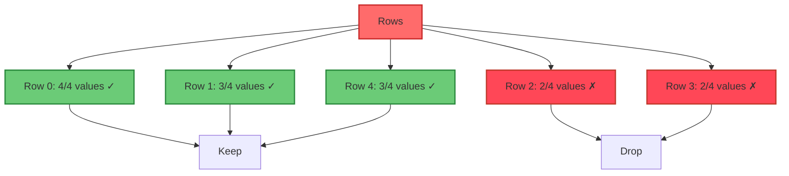

### 9.7 Fill every missing value with one constant

```python
filled_with_zero = df.fillna(0)
```

This can be appropriate when zero has a genuine domain meaning. It is dangerous
when zero means something different from “unknown.”

### 9.8 Fill different columns with different values

```python
fill_values = {"A": 0, "B": 100, "C": 300, "D": 400}
filled_by_column = df.fillna(value=fill_values)
```

Pandas aligns dictionary keys with column labels. Because `B` has no missing
values, its fill value `100` is never used.

### 9.9 Mean imputation

```python
mean_filled = df.fillna(df.mean(numeric_only=True))
```

For column `A`:

$$
\bar{x}_A=\frac{1+2+4+5}{4}=3
$$

For column `C`:

$$
\bar{x}_C=\frac{1+2+3}{3}=2
$$

For column `D`:

$$
\bar{x}_D=\frac{1+5}{2}=3
$$

Mean imputation follows

$$
\tilde{x}_{ij}=
\begin{cases}
x_{ij}, & \text{if }x_{ij}\text{ is observed}\\
\bar{x}_j, & \text{if }x_{ij}\text{ is missing}
\end{cases}
$$

### 9.10 Why mean imputation is not automatically “best”

Mean imputation:

- preserves the number of rows;
- is simple and reproducible;
- reduces the apparent variance;
- weakens correlations;
- can produce unrealistic values;
- can leak information if computed before the train-validation split.

For machine learning, fit imputation statistics using only the training data,
then apply those learned statistics to validation and test data.

### 9.11 Missing-value sentinels and data types

Common Pandas missing markers include:

- `np.nan` for many NumPy-backed numerical columns;
- `pd.NA` for nullable Pandas data types;
- `NaT` for missing datetime-like values;
- `None` in object-oriented data.

Ordinary integer NumPy columns cannot represent `np.nan`, so a column may be
promoted to floating point. Nullable Pandas types can preserve integer meaning:

```python
s = pd.Series([1, 2, pd.NA, 4], dtype="Int64")
```

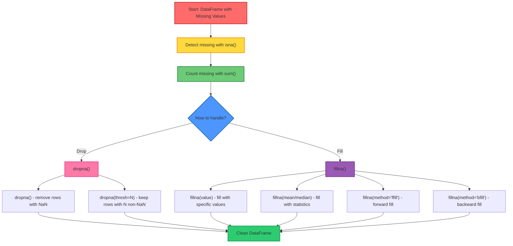

```python
import numpy as np
import pandas as pd

# Create dataset with missing values
data = {
    "Name": ["Alice", "Bob", "Charlie", "David", "Eve"],
    "Age": [25, np.nan, 30, 35, np.nan],
    "Salary": [50000, 55000, np.nan, 65000, 70000],
    "Department": ["IT", "HR", "IT", np.nan, "Finance"],
    "Years_Experience": [2, 5, 3, np.nan, 8]
}

df = pd.DataFrame(data)
print("Original DataFrame:")
print(df)

# Step 1: Explore missing data
print("\n--- Missing Data Analysis ---")
print("Missing values per column:")
print(df.isna().sum())

print("\nPercentage missing per column:")
print((df.isna().sum() / len(df)) * 100)

# Step 2: Visualize missing data pattern
print("\nMissing data map:")
print(df.isna())

# Step 3: Decide handling strategy
# For numeric columns - use mean imputation
numeric_cols = ['Age', 'Salary', 'Years_Experience']
for col in numeric_cols:
    mean_val = df[col].mean()
    df[col].fillna(mean_val, inplace=True)

# For categorical columns - use mode or fill with 'Unknown'
df['Department'].fillna('Unknown', inplace=True)

print("\n--- After Imputation ---")
print(df)

# Step 4: Verify no missing values remain
print("\nFinal missing value check:")
print(df.isna().sum().sum())  # Should be 0
```

---

## 10. Merging, joining, and concatenating

Combining tables is one of the most powerful and risky data-wrangling tasks.
The central question is: **which labels or keys identify corresponding rows?**

### 10.1 Source tables

```python
employees = pd.DataFrame({
    "employee_id": [1, 2, 3, 4, 5],
    "name": ["John", "Anna", "Peter", "Linda", "Bob"],
    "department": ["HR", "IT", "Finance", "IT", "HR"]
})

salaries = pd.DataFrame({
    "employee_id": [1, 2, 3, 6, 7],
    "salary": [60_000, 80_000, 65_000, 70_000, 90_000],
    "bonus": [5_000, 10_000, 7_000, 8_000, 12_000]
})
```

The left key set is

$$
K_L=\{1,2,3,4,5\}
$$

and the right key set is

$$
K_R=\{1,2,3,6,7\}
$$

### 10.2 Inner merge

```python
inner = pd.merge(
    employees,
    salaries,
    on="employee_id",
    how="inner"
)
```

An inner merge retains keys in the intersection:

$$
K_{\text{inner}}=K_L\cap K_R=\{1,2,3\}
$$

Output:

```text
   employee_id   name department  salary  bonus
0            1   John         HR   60000   5000
1            2   Anna         IT   80000  10000
2            3  Peter    Finance   65000   7000
```

Use an inner merge when unmatched rows should not appear in the result.

### 10.3 Left merge

```python
left = employees.merge(
    salaries,
    on="employee_id",
    how="left"
)
```

A left merge preserves all keys from the left table:

$$
K_{\text{left}}=K_L
$$

Employees `4` and `5` have no salary record, so their `salary` and `bonus`
fields become missing.

Use a left merge when the left table defines the population of interest.

### 10.4 Right merge

```python
right = employees.merge(
    salaries,
    on="employee_id",
    how="right"
)
```

A right merge preserves all keys from the right table:

$$
K_{\text{right}}=K_R
$$

Salary records `6` and `7` lack matching employee details.

### 10.5 Outer merge

```python
outer = employees.merge(
    salaries,
    on="employee_id",
    how="outer"
)
```

An outer merge retains the union:

$$
K_{\text{outer}}=K_L\cup K_R
=\{1,2,3,4,5,6,7\}
$$

Missing values mark fields unavailable on one side.

### 10.6 Join-type intuition

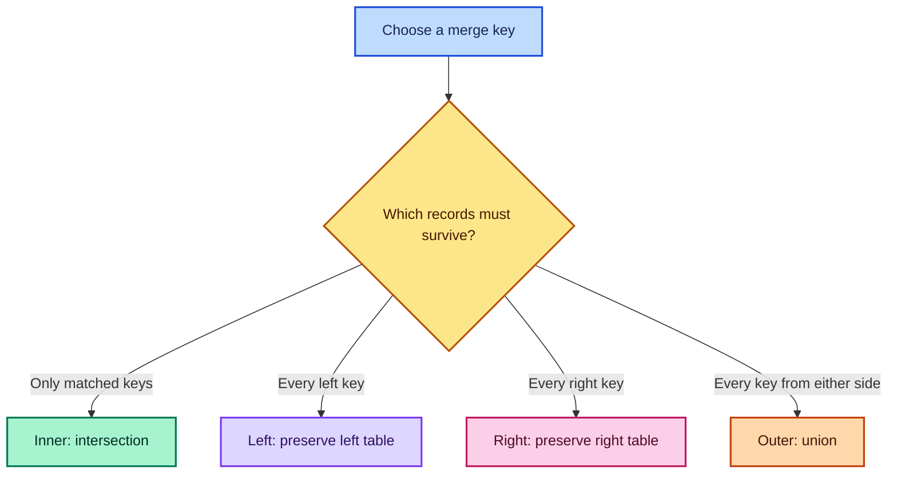

### 10.7 Validate merge relationships

A key may appear more than once. If a key appears $m$ times on the left and
$n$ times on the right, a many-to-many merge can generate

$$
m\times n
$$

rows for that key.

Protect assumptions with `validate`:

```python
checked = employees.merge(
    salaries,
    on="employee_id",
    how="left",
    validate="one_to_one"
)
```

Useful validation modes include `one_to_one`, `one_to_many`, `many_to_one`, and
`many_to_many`.

### 10.8 Diagnose unmatched keys

```python
audited = employees.merge(
    salaries,
    on="employee_id",
    how="outer",
    indicator=True,
    validate="one_to_one"
)

print(audited["_merge"].value_counts())
```

The `_merge` column identifies `left_only`, `right_only`, and `both` records.
This is an excellent integrity check before dropping unmatched rows.

### 10.9 Concatenate rows

```python
df1 = pd.DataFrame({
    "A": ["A0", "A1", "A2"],
    "B": ["B0", "B1", "B2"],
    "C": ["C0", "C1", "C2"]
})

df2 = pd.DataFrame({
    "A": ["A3", "A4", "A5"],
    "B": ["B3", "B4", "B5"],
    "C": ["C3", "C4", "C5"]
})

combined_rows = pd.concat([df1, df2], ignore_index=True)
```

`axis=0` is the default. `ignore_index=True` creates a fresh unique row index.
Without it, the notebook result repeats index labels `0,1,2`.

Use row concatenation when tables represent the same variables for different
batches of observations.

### 10.10 Concatenate columns

```python
combined_columns = pd.concat([df1, df2], axis=1)
```

Pandas aligns rows by index labels. This can create missing values when the
indexes differ.

Use column concatenation when rows represent the same entities and the tables
provide different features. Confirm index alignment first.

### 10.11 Join by index

```python
people = pd.DataFrame(
    {"name": ["Alice", "Bob", "Charlie"]},
    index=[1, 2, 3]
)

scores = pd.DataFrame(
    {"score": [85, 90, 75]},
    index=[2, 3, 4]
)

outer_join = people.join(scores, how="outer")
```

`DataFrame.join()` is convenient for index-based combination. Its default join
type is `left`:

```python
# Preserve all score indexes: 2, 3, and 4
score_first = scores.join(people)
```

### 10.12 Merge versus join versus concat

| Operation | Main matching basis | Best use |
| --- | --- | --- |
| `merge` | Key columns or indexes | Relational combination |
| `join` | Index by default | Convenient index-based combination |
| `concat` | Axis labels | Stack or align objects |

---

## 11. GroupBy and aggregation

`groupby` answers questions such as “total sales per category” or “average score
per region.” Its mental model is **split, apply, combine**.

### 11.1 Example data

```python
data = {
    "Category": ["A", "B", "A", "B", "A", "B", "A", "B"],
    "Store": ["S1", "S1", "S2", "S2", "S1", "S2", "S2", "S1"],
    "Sales": [100, 200, 150, 250, 120, 180, 200, 300],
    "Quantity": [10, 15, 12, 18, 8, 20, 15, 25],
    "Date": pd.date_range("2023-01-01", periods=8)
}

sales_df = pd.DataFrame(data)
```

### 11.2 Split-apply-combine

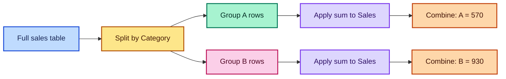

For group $g$, the sum is

$$
S_g=\sum_{i:G_i=g}x_i
$$

### 11.3 Group by one column

```python
category_sales = sales_df.groupby("Category")["Sales"].sum()

print(category_sales)
# Category
# A    570
# B    930
```

For category `A`:

$$
100+150+120+200=570
$$

For category `B`:

$$
200+250+180+300=930
$$

### 11.4 Group by store

```python
store_sales = sales_df.groupby("Store")["Sales"].sum()
# S1 = 720
# S2 = 780
```

### 11.5 Group by multiple keys

```python
category_store_sales = (
    sales_df
    .groupby(["Category", "Store"])["Sales"]
    .sum()
)
```

Output:

```text
Category  Store
A         S1       220
          S2       350
B         S1       500
          S2       430
```

The result uses a hierarchical `MultiIndex`. If ordinary columns are easier to
work with, use `as_index=False`:

```python
flat_result = (
    sales_df
    .groupby(["Category", "Store"], as_index=False)["Sales"]
    .sum()
)
```

### 11.6 Aggregating one Series

```python
sales_df["Sales"].agg([
    "sum", "mean", "min", "max", "count", "std", "median"
])
```

For $n=8$ sales values and total $1500$:

$$
\bar{x}=\frac{1500}{8}=187.5
$$

The median is the average of the fourth and fifth sorted values because $n$ is
even:

$$
\operatorname{median}=\frac{180+200}{2}=190
$$

Pandas' default `std()` uses the sample standard deviation:

$$
s=\sqrt{\frac{1}{n-1}\sum_{i=1}^{n}(x_i-\bar{x})^2}
\approx66.0627
$$

### 11.7 Named aggregation

Named aggregation creates clear output labels:

```python
summary = (
    sales_df
    .groupby("Category", as_index=False)
    .agg(
        total_sales=("Sales", "sum"),
        average_sales=("Sales", "mean"),
        total_quantity=("Quantity", "sum"),
        transactions=("Sales", "size")
    )
)
```

Use this form when building a report or modeling table with several metrics.

### 11.8 Aggregation, transformation, and filtering

| GroupBy operation | Output behavior | Example question |
| --- | --- | --- |
| `agg` | One or more summaries per group | Total sales per category |
| `transform` | Same length as input | Each row's group mean |
| `filter` | Keeps or removes groups | Stores with total above 700 |

```python
# Add the category average beside every original row
sales_df["Category_Mean"] = (
    sales_df.groupby("Category")["Sales"].transform("mean")
)

# Keep stores whose total sales exceed 700
large_stores = sales_df.groupby("Store").filter(
    lambda group: group["Sales"].sum() > 700
)
```

### 11.9 Validate grouped totals

For a complete non-overlapping grouping, group totals should reconcile with the
overall total:

$$
\sum_g S_g=\sum_i x_i
$$

```python
assert category_sales.sum() == sales_df["Sales"].sum()
```

This simple invariant can catch accidentally excluded missing group labels or
filters applied too early.

---

## 12. Pivot tables and cross-tabulations

A pivot table converts long-form records into a matrix of aggregated values.

### 12.1 Reproducible example data

The notebook uses unseeded random values, so its exact sales and units change
when the data-creation cell is rerun. A seeded generator makes examples
reproducible:

```python
import numpy as np
import pandas as pd

rng = np.random.default_rng(seed=42)

pivot_df = pd.DataFrame({
    "Date": pd.date_range("2023-01-01", periods=20),
    "Product": ["A", "B", "C", "D"] * 5,
    "Region": ["East", "West", "North", "South"] * 5,
    "Sales": rng.integers(100, 1000, size=20),
    "Units": rng.integers(10, 100, size=20),
    "Rep": ["John", "Mary", "Bob", "Alice"] * 5
})

pivot_df["Month"] = pivot_df["Date"].dt.month_name()
pivot_df["Quarter"] = "Q" + pivot_df["Date"].dt.quarter.astype(str)
```

### 12.2 Pivot-table anatomy

```python
median_sales = pd.pivot_table(
    pivot_df,
    values="Sales",
    index="Region",
    columns="Product",
    aggfunc="median"
)
```

For region $r$ and product $p$, the pivot cell is

$$
P_{r,p}=\operatorname{median}
\{\text{Sales}_i:\text{Region}_i=r,\text{Product}_i=p\}
$$

### 12.3 Why the notebook pivot contains many missing cells

The source data pairs the categories deterministically:

- product `A` always appears in `East`;
- product `B` always appears in `West`;
- product `C` always appears in `North`;
- product `D` always appears in `South`.

Therefore combinations such as `(East, B)` do not exist. Their pivot cells are
`NaN`. This is not an aggregation error; it represents an absent combination.

### 12.4 Pivot-table flow

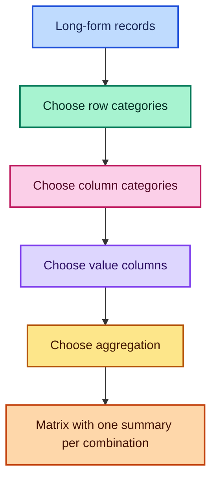

### 12.5 Multiple value columns

```python
multi_value_pivot = pd.pivot_table(
    pivot_df,
    values=["Sales", "Units"],
    index="Region",
    columns="Product",
    aggfunc="mean"
)
```

This creates hierarchical columns: the first level identifies the measured
variable and the second identifies the product.

### 12.6 Totals and fill values

```python
report = pd.pivot_table(
    pivot_df,
    values="Sales",
    index="Region",
    columns="Product",
    aggfunc="sum",
    fill_value=0,
    margins=True,
    margins_name="Total"
)
```

Use `fill_value=0` only when “no record” should genuinely be interpreted as a
zero total. It may be misleading for means or medians.

### 12.7 Cross-tabulation

```python
counts = pd.crosstab(
    pivot_df["Region"],
    pivot_df["Product"]
)
```

Each cell counts records satisfying both categories:

$$
N_{r,p}=\sum_{i=1}^{n}
\mathbf{1}(\text{Region}_i=r\land\text{Product}_i=p)
$$

With the notebook pattern, each present pair has count `5` and every other
combination has count `0`.

### 12.8 Normalize a crosstab

```python
# Row proportions: distribution of products within each region
row_proportions = pd.crosstab(
    pivot_df["Region"],
    pivot_df["Product"],
    normalize="index"
)
```

For row $r$:

$$
p_{r,p}=\frac{N_{r,p}}{\sum_p N_{r,p}}
$$

### 12.9 `pivot` versus `pivot_table`

| Method | Duplicate row-column combinations | Aggregation |
| --- | --- | --- |
| `pivot` | Raises an error | None |
| `pivot_table` | Allowed | Required or defaults to mean |

Use `pivot` for pure reshaping when every combination is unique. Use
`pivot_table` when multiple records must be summarized into one cell.

---

## 13. Arithmetic, functions, and `apply`

Pandas supports vectorized operations on complete Series or DataFrames.

### 13.1 Scalar arithmetic

```python
df1["A"] + 10
```

For each row $i$:

$$
y_i=x_i+10
$$

The expression returns a new Series. It does not modify `df1["A"]` unless the
result is assigned:

```python
df1["A_plus_10"] = df1["A"] + 10
```

### 13.2 Applying a function with `apply`

The notebook creates a square of column `B`:

```python
df1["D"] = df1["B"].apply(lambda x: x**2)
```

For each row:

$$
D_i=B_i^2
$$

Thus `10, 20, 30, 40, 50` becomes
`100, 400, 900, 1600, 2500`.

### 13.3 Prefer direct vectorization when available

The same transformation is simpler as:

```python
df1["D"] = df1["B"].pow(2)

# Equivalent arithmetic expression
df1["D"] = df1["B"] ** 2
```

Vectorized methods usually express intent more clearly and avoid a Python
function call for every element.

### 13.4 When `apply` is appropriate

Use `Series.apply` when:

- each cell needs custom Python logic;
- no built-in vectorized string, datetime, numerical, or categorical method
  expresses the transformation;
- correctness and clarity matter more than maximum speed for the data size.

Avoid `apply` when `.str`, `.dt`, arithmetic, `.map`, `.where`, `.replace`, or
another vectorized method already solves the task.

### 13.5 Operation-choice guide

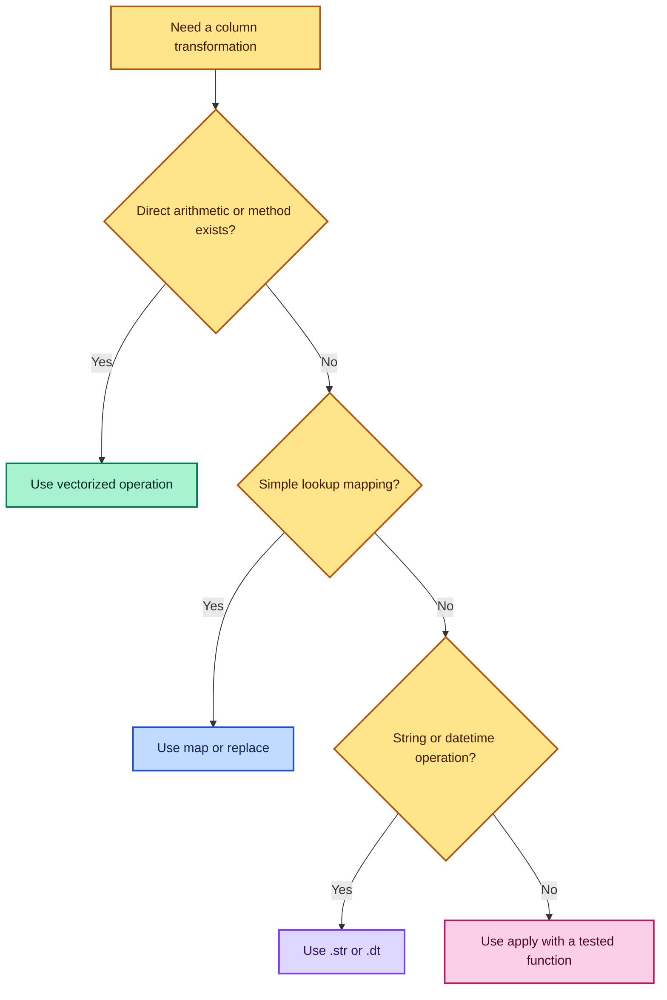

### 13.6 Alignment during arithmetic

Pandas aligns labels when combining Series or DataFrames:

```python
s1 = pd.Series([10, 20], index=["a", "b"])
s2 = pd.Series([1, 2], index=["b", "c"])

print(s1 + s2)
# a     NaN
# b    21.0
# c     NaN
```

Only label `b` has values on both sides. To supply a fill value explicitly:

```python
result = s1.add(s2, fill_value=0)
```

> **Fun fact:** Label alignment prevents many silent position-based errors, but
> it can also introduce unexpected missing values when indexes are accidentally
> different. Always inspect indexes before arithmetic across objects.

---

## 14. Countries dataset case study

`Countries.ipynb` demonstrates how basic Pandas operations answer questions
from a real, wide table. The notebook output shows a dataset with

$$
194\text{ rows}\times64\text{ columns}
$$

Each row represents a country or territory entry, while columns describe
geography, economy, energy, health, population, governance, and leadership.

> **Important interpretation:** The country values and political leaders belong
> to the supplied CSV's snapshot. They should not be described as current facts
> without checking the dataset date and an up-to-date authoritative source.

### 14.1 Load and audit the data

```python
import pandas as pd

countries = pd.read_csv("Countries.csv")

print(countries.shape)   # (194, 64) for the supplied notebook data
countries.head()
countries.info()
```

The audit reveals:

- 194 records and 64 variables;
- 48 floating-point columns, 6 integer columns, and 10 text/object columns in
  the saved output;
- substantial missingness in fields such as internally displaced persons;
- complete values for central identifiers such as `country`, `region`, and
  `continent` in the saved snapshot.

### 14.2 Use `describe()` selectively

```python
numeric_summary = countries.describe()
```

Because the table contains many numerical variables with very different units,
inspect related columns together:

```python
population_summary = countries[
    ["population", "population_female", "population_male"]
].describe()

governance_summary = countries[
    ["democracy_score", "press", "women_parliament_seats_pct"]
].describe()
```

This avoids comparing quantities such as population counts and percentages as
if they were on the same scale.

### 14.3 Country with the highest population in the dataset

The notebook filters against the maximum:

```python
countries[
    countries["population"] == countries["population"].max()
]["country"]
```

This is tie-aware because every row equal to the maximum is retained. The saved
dataset output identifies `India`.

The same query with related fields is:

```python
max_population = countries["population"].max()

most_populated = countries.loc[
    countries["population"].eq(max_population),
    ["country", "capital_city", "population"]
]
```

If only one first-occurring maximum is required:

```python
row_index = countries["population"].idxmax()
most_populated_one = countries.loc[
    row_index,
    ["country", "capital_city", "population"]
]
```

The row index is

$$
i^*=\operatorname*{arg\,max}_i(\text{population}_i)
$$

### 14.4 Capital of the highest-population entry

```python
countries.loc[
    countries["population"].eq(countries["population"].max()),
    ["country", "capital_city"]
]
```

The notebook snapshot returns `New Delhi` for `India`.

Selecting both fields in the same query preserves the relationship and avoids
running separate filters that could later diverge.

### 14.5 Lowest-population entry and its capital

```python
least_populated = countries.loc[
    countries["population"].eq(countries["population"].min()),
    ["country", "capital_city", "population"]
]
```

The saved output identifies `Tuvalu` and `Funafuti`.

### 14.6 Top five democracy scores without mutating row order

The notebook uses an in-place sort:

```python
# Mutates countries and changes every later display order
countries.sort_values(
    by="democracy_score",
    ascending=False,
    inplace=True
)
```

A safer query is:

```python
top_democracy_scores = countries.nlargest(
    5,
    columns="democracy_score"
)[["country", "democracy_score", "democracy_type"]]
```

The saved notebook lists Norway, Iceland, Sweden, New Zealand, and Denmark.
These are results from the supplied snapshot, not a live ranking.

### 14.7 Why avoiding in-place sorting helps

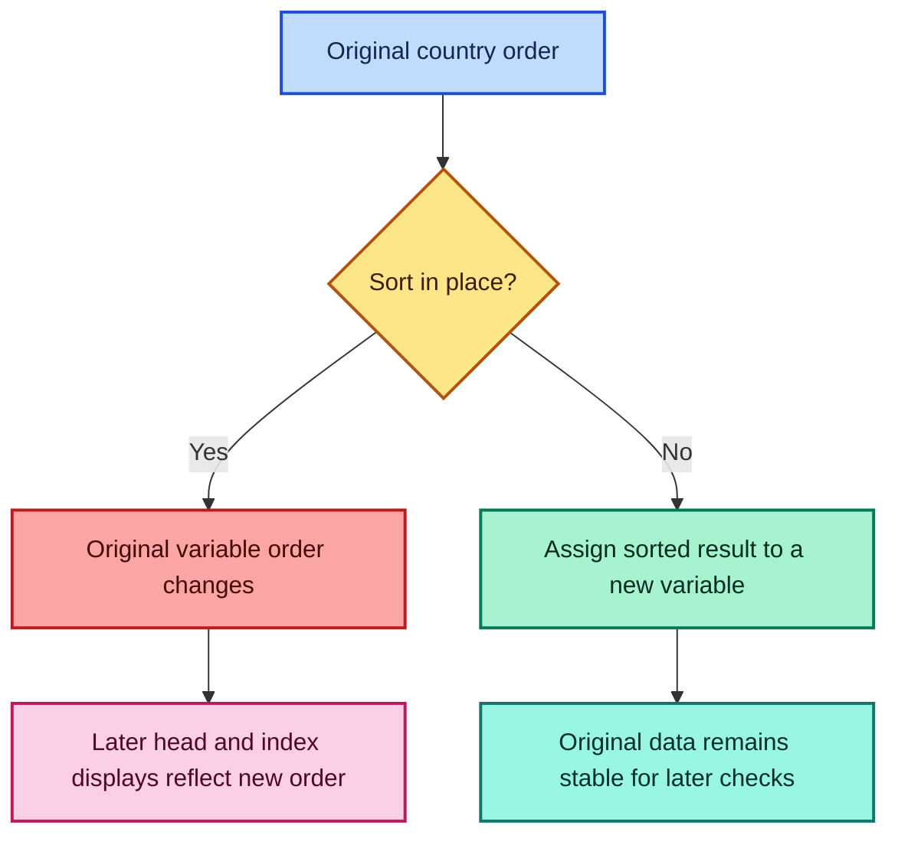

The notebook's early `info()` output reports a nonsequential index order that
matches its later democracy sort. This indicates cells were run out of order
before saving. `info()` does not sort rows by itself.

### 14.8 Number of distinct regions

The notebook uses:

```python
countries["region"].value_counts().count()
```

This works because `value_counts()` creates one entry per distinct non-missing
region, then `count()` counts those entries. The direct expression is clearer:

```python
region_count = countries["region"].nunique(dropna=True)
print(region_count)  # 22 in the notebook snapshot
```

### 14.9 Countries in Eastern Europe

```python
eastern_europe = countries.loc[
    countries["region"].eq("Eastern Europe"),
    ["country", "capital_city", "population"]
].sort_values("country")
```

To count them:

```python
eastern_europe_count = len(eastern_europe)
```

The notebook result contains ten entries.

### 14.10 Political leader of the second-highest population entry

```python
second_by_population = countries.nlargest(2, "population").iloc[1]

answer = second_by_population[
    ["country", "population", "political_leader"]
]
```

The saved snapshot returns `China` and `Xi Jinping`.

This interpretation ranks rows, not distinct population values. If ties must
share ranks, define the ranking rule explicitly:

```python
countries = countries.assign(
    population_rank=countries["population"].rank(
        method="dense",
        ascending=False
    )
)

second_rank = countries.loc[
    countries["population_rank"].eq(2),
    ["country", "population", "political_leader"]
]
```

### 14.11 Count unknown political leaders

```python
unknown_leader_count = countries["political_leader"].isna().sum()
print(unknown_leader_count)  # 7 in the notebook snapshot
```

To inspect rather than only count them:

```python
unknown_leaders = countries.loc[
    countries["political_leader"].isna(),
    ["country", "title", "political_leader"]
]
```

Never assume missing means “no leader.” It may mean the value was unavailable,
not collected, not applicable, or stale.

### 14.12 Count full country names containing “Republic”

The notebook uses a global counter and `apply`. This creates hidden state: if
the cell is rerun, the counter may continue from an earlier value unless it is
reset correctly.

A vectorized, side-effect-free solution is:

```python
republic_mask = countries["country_long"].str.contains(
    r"\brepublic\b",
    case=False,
    na=False,
    regex=True
)

republic_count = republic_mask.sum()
print(republic_count)  # 125 in the notebook snapshot
```

The word-boundary pattern `\b` prevents partial-word matches. The count follows

$$
N_{\text{republic}}
=\sum_{i=1}^{n}
\mathbf{1}(\text{country\_long}_i\text{ contains “Republic”})
$$

### 14.13 Highest-population African entry

```python
africa = countries.loc[countries["continent"].eq("Africa")]

africa_population_max = africa["population"].max()

largest_in_africa = africa.loc[
    africa["population"].eq(africa_population_max),
    ["country", "capital_city", "population"]
]
```

The notebook snapshot identifies `Nigeria`.

This is a two-stage query:

1. restrict the population of rows to the African continent;
2. calculate the maximum only inside that restricted subset.

Calculating the global maximum first would answer a different question.

### 14.14 Reusable extreme-within-group function

```python
def rows_with_group_maximum(df, group_col, group_value, value_col):
    """Return all tied maximum rows within one selected group."""
    subset = df.loc[df[group_col].eq(group_value)]

    if subset.empty:
        return subset

    maximum = subset[value_col].max()
    return subset.loc[subset[value_col].eq(maximum)]


largest_in_africa = rows_with_group_maximum(
    countries,
    group_col="continent",
    group_value="Africa",
    value_col="population"
)
```

### 14.15 Country-analysis workflow

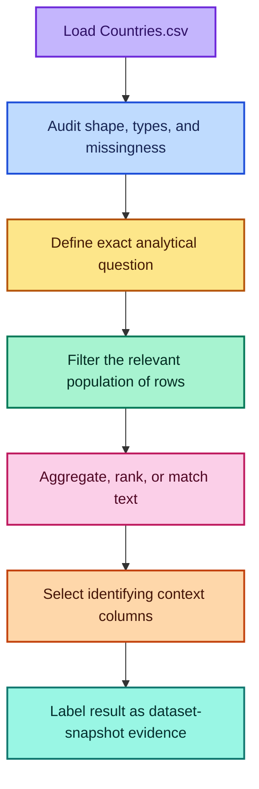

---

## 15. Feature extraction case study

Feature extraction converts useful information embedded in raw text into
structured columns. The anime notebook starts with columns `Rank`, `Title`, and
`Score`, but the `Title` field contains several concatenated facts.

Example:

```text
Shingeki no Kyojin Season 3 Part 2TV (10 eps)Apr 2019 - Jul 2019...
```

Useful components include:

- anime name;
- type, such as `TV`, `Movie`, or `OVA`;
- episode count;
- start month;
- end month;
- running duration.

### 15.1 Feature extraction versus feature engineering

- **Feature extraction** parses information already present in raw data.
- **Feature engineering** constructs a new analytical variable from existing
  fields.

Extracting `Episodes` from the string is feature extraction. Calculating
`Months` from `Start_Date` and `End_Date` is feature engineering.

### 15.2 The notebook's character-by-character episode parser

The original function starts collecting characters after `(` and returns when
it sees `)`:

```python
def extract_episodes_original(text):
    collecting = False
    extracted = ""

    for character in text:
        if character == ")":
            return extracted

        if collecting:
            extracted += character

        if character == "(":
            collecting = True
```

For `(64 eps)`, this returns the string `"64 eps"`. The notebook then removes
`" eps"` and converts the result to `int`.

### 15.3 Limitations of the original parser

It assumes:

- the first parenthesized text is always the episode count;
- every row has both parentheses;
- every extracted value becomes a valid integer after removing `" eps"`;
- no missing title exists.

If one row violates these assumptions, `.astype(int)` can fail for the entire
column.

### 15.4 Vectorized regex extraction

A safer approach defines the expected pattern explicitly:

```python
import pandas as pd

anime = pd.read_csv("anime.csv")

metadata_pattern = (
    r"^(?P<Anime>.*?)"
    r"(?P<Type>TV|Movie|OVA)\s*"
    r"\((?P<Episodes>\d+)\s+eps\)"
)

metadata = anime["Title"].str.extract(metadata_pattern)

# Remove spaces left between the name and the media type
metadata["Anime"] = metadata["Anime"].str.strip()

# Nullable integer allows failed or missing parses to remain <NA>
metadata["Episodes"] = pd.to_numeric(
    metadata["Episodes"],
    errors="coerce"
).astype("Int64")

anime = anime.join(metadata)
```

The regular-expression components mean:

| Pattern | Meaning |
| --- | --- |
| `^` | Start of the string |
| `(?P<Anime>.*?)` | Capture the anime name with minimal matching |
| `(?P<Type>TV\|Movie\|OVA)` | Capture one recognized media type |
| `\s*` | Allow optional whitespace |
| `\(` and `\)` | Match literal parentheses |
| `(?P<Episodes>\d+)` | Capture one or more digits |
| `\s+eps` | Require whitespace followed by `eps` |

### 15.5 Why named capture groups help

`(?P<Episodes>...)` assigns a meaningful column name directly. This makes a
complex parsing expression easier to test and maintain.

### 15.6 Extract the date interval

The notebook copies exactly 19 characters after the first `)`. This happens to
fit strings such as `Apr 2009 - Jul 2010`, but fixed-width slicing is brittle.

Use an explicit date pattern:

```python
date_pattern = (
    r"(?P<Start_Text>[A-Z][a-z]{2}\s+\d{4})"
    r"\s*-\s*"
    r"(?P<End_Text>[A-Z][a-z]{2}\s+\d{4})"
)

date_parts = anime["Title"].str.extract(date_pattern)

anime["Start_Date"] = pd.to_datetime(
    date_parts["Start_Text"],
    format="%b %Y",
    errors="coerce"
)

anime["End_Date"] = pd.to_datetime(
    date_parts["End_Text"],
    format="%b %Y",
    errors="coerce"
)
```

`errors="coerce"` converts unparseable values to `NaT`, making failed parses
measurable rather than crashing the pipeline.

### 15.7 Inclusive month duration formula

Let the start be $(y_s,m_s)$ and the end be $(y_e,m_e)$. The number of month
boundaries between them is

$$
12(y_e-y_s)+(m_e-m_s)
$$

Because the notebook wants to count both the starting and ending months, add
one:

$$
M=12(y_e-y_s)+(m_e-m_s)+1
$$

For April 2009 through July 2010:

$$
M=12(2010-2009)+(7-4)+1=12+3+1=16
$$

Vectorized implementation:

```python
duration = (
    (anime["End_Date"].dt.year - anime["Start_Date"].dt.year) * 12
    + (anime["End_Date"].dt.month - anime["Start_Date"].dt.month)
    + 1
)

valid_dates = anime["Start_Date"].notna() & anime["End_Date"].notna()

anime["Months"] = duration.where(valid_dates).astype("Int64")
```

### 15.8 Validate extracted features

Never assume every parse succeeded:

```python
parse_audit = pd.Series({
    "rows": len(anime),
    "missing_anime_name": anime["Anime"].isna().sum(),
    "missing_type": anime["Type"].isna().sum(),
    "missing_episodes": anime["Episodes"].isna().sum(),
    "missing_start": anime["Start_Date"].isna().sum(),
    "missing_end": anime["End_Date"].isna().sum(),
    "invalid_duration": anime["Months"].lt(1).fillna(False).sum()
})

print(parse_audit)
```

Inspect failures:

```python
failed_rows = anime.loc[
    anime[["Anime", "Type", "Episodes", "Start_Date", "End_Date"]]
    .isna()
    .any(axis=1),
    ["Rank", "Title", "Score"]
]
```

### 15.9 Feature-extraction pipeline

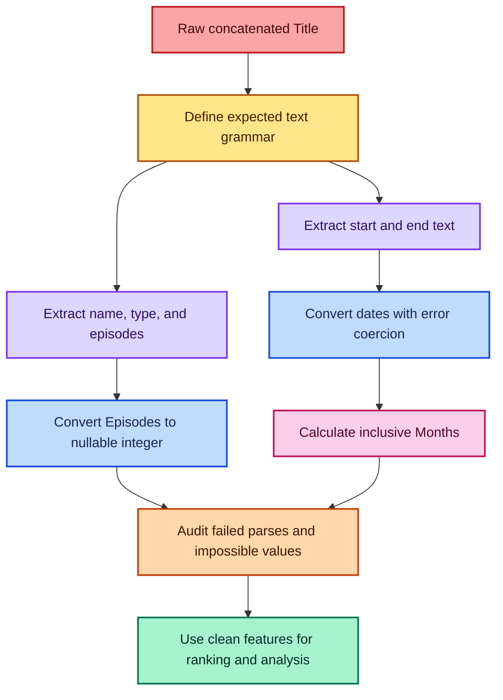

### 15.10 Highest-scoring anime

Tie-aware query:

```python
highest_score = anime["Score"].max()

highest_scoring = anime.loc[
    anime["Score"].eq(highest_score),
    ["Rank", "Anime", "Type", "Score", "Episodes"]
]
```

The notebook snapshot identifies *Fullmetal Alchemist: Brotherhood* with score
`9.10`.

### 15.11 Top five by score

```python
top_five_scores = anime.nlargest(5, "Score")[
    ["Rank", "Anime", "Type", "Score", "Episodes"]
]
```

`nlargest(5, "Score")` returns five rows. If the fifth position has ties and
all tied entries must be included, calculate the cutoff:

```python
cutoff = anime["Score"].nlargest(5).iloc[-1]
top_with_ties = anime.loc[anime["Score"].ge(cutoff)]
```

### 15.12 Highest episode count

```python
max_episodes = anime["Episodes"].max()

highest_episode_count = anime.loc[
    anime["Episodes"].eq(max_episodes),
    ["Rank", "Anime", "Type", "Score", "Episodes", "Months"]
]
```

The notebook snapshot identifies *Gintama* with `201` episodes.

### 15.13 Top five by episode count

```python
top_five_episode_counts = anime.nlargest(5, "Episodes")[
    ["Rank", "Anime", "Type", "Episodes", "Months", "Score"]
]
```

### 15.14 Longest-running anime by calendar duration

```python
max_months = anime["Months"].max()

longest_running = anime.loc[
    anime["Months"].eq(max_months),
    ["Rank", "Anime", "Type", "Episodes", "Start_Date", "End_Date", "Months"]
]
```

The saved data shows *Ginga Eiyuu Densetsu* with `111` inclusive months. It does
not have the highest episode count. Calendar duration and episode count measure
different things.

### 15.15 Complete robust feature pipeline

```python
import pandas as pd


def build_anime_features(path):
    """Load anime data and extract validated structured features."""

    anime = pd.read_csv(path)

    # Require the minimum source columns before parsing.
    required = {"Rank", "Title", "Score"}
    missing_columns = required.difference(anime.columns)
    if missing_columns:
        raise ValueError(f"Missing required columns: {sorted(missing_columns)}")

    # Extract name, media type, and integer-looking episode text.
    metadata = anime["Title"].str.extract(
        r"^(?P<Anime>.*?)(?P<Type>TV|Movie|OVA)\s*"
        r"\((?P<Episodes>\d+)\s+eps\)"
    )
    metadata["Anime"] = metadata["Anime"].str.strip()
    metadata["Episodes"] = pd.to_numeric(
        metadata["Episodes"],
        errors="coerce"
    ).astype("Int64")

    # Extract and convert the two month-year strings.
    dates = anime["Title"].str.extract(
        r"(?P<Start_Text>[A-Z][a-z]{2}\s+\d{4})\s*-\s*"
        r"(?P<End_Text>[A-Z][a-z]{2}\s+\d{4})"
    )

    anime = anime.join(metadata)
    anime["Start_Date"] = pd.to_datetime(
        dates["Start_Text"],
        format="%b %Y",
        errors="coerce"
    )
    anime["End_Date"] = pd.to_datetime(
        dates["End_Text"],
        format="%b %Y",
        errors="coerce"
    )

    # Count both endpoint months.
    months = (
        (anime["End_Date"].dt.year - anime["Start_Date"].dt.year) * 12
        + (anime["End_Date"].dt.month - anime["Start_Date"].dt.month)
        + 1
    )
    valid_dates = anime["Start_Date"].notna() & anime["End_Date"].notna()
    anime["Months"] = months.where(valid_dates).astype("Int64")

    # Reject logically impossible parsed intervals.
    invalid = anime["Months"].lt(1).fillna(False)
    if invalid.any():
        bad_ranks = anime.loc[invalid, "Rank"].tolist()
        raise ValueError(f"End date precedes start date for ranks: {bad_ranks}")

    return anime


anime = build_anime_features("anime.csv")
```

> **Fun fact:** Text parsing is a small language-recognition problem. A regular
> expression acts like a compact grammar: it describes which character patterns
> count as valid fields.

---

## 16. Important notebook corrections

Notebook cells can be run in any order. The code saved in a cell and its saved
output can therefore describe different states. The following corrections are
important for reproducible learning.

- **DataFrame columns:** The final `df2` assignment uses named columns. The
  later output showing `0,1,2,3` came from an earlier execution state.
- **Dropping axis `0`:** `drop(0, axis=0)` removes the row whose index label is
  `0`; it does not remove a column.
- **Disappearing `Designation`:** The saved cells were likely run out of order.
  An added column remains until it is dropped or the variable is replaced.
- **Missing value in `B[0]`:** The source defines `B[0] = 1`, so it is not
  missing.
- **Missing count for `B`:** `df['B'].isna().sum()` is `0`, not `1`.
- **`dropna(thresh=1)`:** Every example row already has at least one known
  value, so no row is removed.
- **Repeated concatenation indexes:** The original indexes are retained. Use
  `ignore_index=True` when a fresh sequential index is intended.
- **Random pivot values:** Exact outputs change after rerunning. Seed a local
  random generator for reproducibility.
- **Sorted country index in `info()`:** Saved state reflects the later sort;
  `info()` itself never sorts the rows.
- **Global text counter:** Reruns create hidden state. Prefer
  `.str.contains(...).sum()`.
- **In-place country sort:** Every later display changes order. Assign
  `nlargest` or `sort_values` to a new variable.
- **Episode parentheses assumption:** Unexpected text can break the parser.
  Use a regex that names the expected fields.
- **Fixed 19-character date extraction:** Short or differently formatted rows
  can fail. Extract explicit month-year patterns.
- **Bare `except`:** Programming errors can be hidden. Use
  `errors='coerce'` and audit the failed rows.
- **Political-leader snapshot:** Leadership changes over time. Treat these
  answers as results from the supplied CSV, not automatically current facts.

### 16.1 A reproducible-notebook habit

Before trusting outputs:

1. restart the kernel;
2. run all cells from top to bottom;
3. check that no cell fails;
4. verify key invariants;
5. save the notebook only after the clean run.

Examples of useful invariants:

```python
assert len(df) == df.shape[0]
assert df.columns.is_unique
assert df.index.is_unique
assert df["employee_id"].is_unique
assert (anime["Months"].dropna() >= 1).all()
```

---

## 17. Common mistakes and safer patterns

### 17.1 Confusing labels with positions

```python
df.loc[3]   # index label 3
df.iloc[3]  # fourth physical row
```

They are equal only when the index labels happen to match row positions.

### 17.2 Forgetting parentheses in Boolean filters

```python
# Correct
df[(df["Age"] > 30) & (df["City"] == "Paris")]
```

### 17.3 Using chained assignment

Avoid:

```python
# Ambiguous and unsafe style
# df[df["Age"] > 30]["Salary"] = 0
```

Use one `.loc` assignment:

```python
df.loc[df["Age"] > 30, "Salary"] = 0
```

### 17.4 Mutating a filtered object without making intent clear

```python
paris = df.loc[df["City"].eq("Paris")].copy()
paris["Salary_K"] = paris["Salary"] / 1000
```

`.copy()` communicates that the subset is intended to become an independent
working table.

### 17.5 Treating missing values as ordinary equality values

```python
# Do not rely on equality to find missing values
# df["A"] == np.nan

# Correct
df["A"].isna()
```

Missing-value semantics differ from normal scalar equality.

### 17.6 Dropping missing data before measuring it

Bad sequence:

```python
df = df.dropna()
# Original missingness pattern is now unavailable
```

Better sequence:

```python
missing_report = df.isna().agg(["sum", "mean"]).T
cleaned = df.dropna(subset=["critical_column"])
```

### 17.7 Filling every numerical field with its mean

Different variables may require different strategies:

- median for strongly skewed numerical data;
- mode or an explicit `"Unknown"` category for categorical data;
- group-wise imputation when justified;
- model-based imputation for complex patterns;
- no imputation when missingness itself is meaningful.

### 17.8 Merging without checking key uniqueness

```python
print(employees["employee_id"].duplicated().sum())
print(salaries["employee_id"].duplicated().sum())
```

Then state the expected relationship through `validate=`.

### 17.9 Confusing `concat` with relational matching

`concat` stacks or aligns existing axes. It does not search a key column for
corresponding entities. Use `merge` when a relational key defines the match.

### 17.10 Using row-wise `apply` for vectorizable logic

Avoid when a direct expression exists:

```python
# Slower and less direct
df1["D"] = df1["B"].apply(lambda x: x**2)

# Prefer
df1["D"] = df1["B"] ** 2
```

### 17.11 Using a global counter inside `apply`

Avoid hidden state:

```python
# Prefer a Boolean vector and an explicit reduction
count = countries["country_long"].str.contains(
    "republic",
    case=False,
    na=False
).sum()
```

### 17.12 Interpreting top five as “all tied top-five positions”

`nlargest(5, column)` returns five rows. If ties at the cutoff must be retained,
compute the fifth value and filter with `>=`.

### 17.13 Reporting a result without its unit

Examples:

- `population` is a count;
- `democracy_score` uses the dataset's score scale;
- `Months` is an inclusive month count;
- `Sales` may represent currency units;
- `women_parliament_seats_pct` is a percentage.

A number without its unit or definition is easy to misinterpret.

### 17.14 Ignoring row-count changes

Track row counts around filtering and merging:

```python
before = len(employees)
merged = employees.merge(salaries, on="employee_id", how="left")
after = len(merged)

print({"before": before, "after": after, "change": after - before})
```

### 17.15 Safe transformation flow

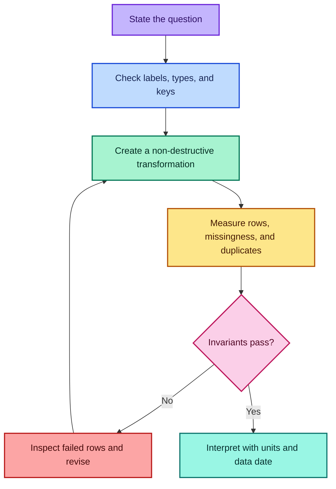

---

## 18. Quick-reference cheat sheet

### 18.1 Create and load

| Task | Code |
| --- | --- |
| Series from list | `pd.Series([10, 20, 30])` |
| Series with labels | `pd.Series(values, index=labels)` |
| DataFrame from dictionary | `pd.DataFrame(data)` |
| DataFrame from rows | `pd.DataFrame(rows, columns=columns)` |
| Read CSV | `pd.read_csv('file.csv')` |

### 18.2 Inspect

| Task | Code |
| --- | --- |
| Dimensions | `df.shape` |
| Column labels | `df.columns` |
| First rows | `df.head()` |
| Last rows | `df.tail()` |
| Types and non-null counts | `df.info()` |
| Numerical summary | `df.describe()` |
| Missing count | `df.isna().sum()` |
| Distinct count | `df[col].nunique()` |
| Frequency table | `df[col].value_counts()` |

### 18.3 Select and filter

| Task | Code |
| --- | --- |
| One column | `df['A']` |
| Several columns | `df[['A', 'B']]` |
| Label-based subset | `df.loc[rows, columns]` |
| Position-based subset | `df.iloc[rows, columns]` |
| Filter | `df[df['A'] > 10]` |
| AND condition | `df[(cond1) & (cond2)]` |
| OR condition | `df[(cond1) \| (cond2)]` |
| Membership | `df[df['A'].isin(values)]` |
| Missing rows | `df[df['A'].isna()]` |

### 18.4 Modify and clean

| Task | Code |
| --- | --- |
| Add/replace column | `df['New'] = values` |
| Assign selected cells | `df.loc[condition, 'A'] = value` |
| Remove rows | `df.drop(index=labels)` |
| Remove columns | `df.drop(columns=labels)` |
| Drop incomplete rows | `df.dropna()` |
| Require non-null threshold | `df.dropna(thresh=k)` |
| Fill one value | `df.fillna(0)` |
| Column-specific fill | `df.fillna({'A': 0, 'B': 10})` |
| Independent copy | `new_df = df.copy()` |

### 18.5 Combine

| Task | Code |
| --- | --- |
| Inner merge | `left.merge(right, on='key', how='inner')` |
| Left merge | `left.merge(right, on='key', how='left')` |
| Outer merge audit | `left.merge(right, how='outer', indicator=True)` |
| Stack rows | `pd.concat([a, b], ignore_index=True)` |
| Align columns | `pd.concat([a, b], axis=1)` |
| Join indexes | `a.join(b, how='left')` |

### 18.6 Summarize and reshape

| Task | Code |
| --- | --- |
| Group sum | `df.groupby('Group')['Value'].sum()` |
| Flat grouped output | `df.groupby('Group', as_index=False).sum()` |
| Several summaries | `df['Value'].agg(['sum', 'mean'])` |
| Named aggregation | `df.groupby('G').agg(total=('V', 'sum'))` |
| Pivot table | `pd.pivot_table(df, values='V', index='R', columns='C')` |
| Cross-tabulation | `pd.crosstab(df['R'], df['C'])` |

### 18.7 Text, dates, and ranking

| Task | Code |
| --- | --- |
| Contains text | `s.str.contains(pattern, na=False)` |
| Extract regex groups | `s.str.extract(pattern)` |
| Convert dates | `pd.to_datetime(s, errors='coerce')` |
| Datetime year | `s.dt.year` |
| Largest rows | `df.nlargest(k, 'Value')` |
| Maximum index | `s.idxmax()` |
| Numerical conversion | `pd.to_numeric(s, errors='coerce')` |

---

## 19. Practice questions with answers

### Question 1: Series labels

What is the output?

```python
s = pd.Series([5, 8, 13], index=["x", "y", "z"])
s.loc["y"]
```

**Answer:** `8`. `.loc` searches the label `"y"`.

### Question 2: Series versus DataFrame

What is the structural difference between `df['Age']` and `df[['Age']]`?

**Answer:** The first is a one-dimensional Series; the second is a
two-dimensional one-column DataFrame.

### Question 3: `loc` and `iloc`

Suppose a DataFrame has index `[10, 20, 30]`. What do `df.loc[20]` and
`df.iloc[1]` select?

**Answer:** Both select the second displayed row in this particular case, but
for different reasons. `.loc[20]` uses the label; `.iloc[1]` uses position.

### Question 4: Boolean filtering

Write a filter for rows with `Score >= 8.5` and `Episodes < 20`.

```python
answer = anime[
    (anime["Score"] >= 8.5) & (anime["Episodes"] < 20)
]
```

### Question 5: Missing counts

For the missing-data example, what is the missing percentage in column `D`?

There are three missing values among five rows:

$$
\frac{3}{5}\times100\%=60\%
$$

### Question 6: `dropna(thresh=3)`

What does `thresh=3` mean?

**Answer:** Keep a row only when it contains at least three non-missing values.
It does not mean “allow three missing values.”

### Question 7: Mean imputation

Why can mean imputation reduce variance?

**Answer:** Every imputed value is placed exactly at the mean, contributing zero
squared deviation from the mean. This artificially concentrates the data.

### Question 8: Merge type

You have a complete customer table and an optional purchase table. You must
retain every customer. Which merge should you use?

```python
result = customers.merge(purchases, on="customer_id", how="left")
```

The customer table must be on the left.

### Question 9: Many-to-many expansion

A key appears three times in the left table and four times in the right table.
How many merged rows can that key produce?

$$
3\times4=12
$$

### Question 10: `concat` index

Why use `ignore_index=True` while stacking independent row batches?

**Answer:** It creates one fresh sequential index and avoids duplicate labels
carried from the separate inputs.

### Question 11: Grouped total

Write a grouped total of `Sales` by `Category` and `Store` with ordinary output
columns.

```python
answer = (
    sales_df
    .groupby(["Category", "Store"], as_index=False)["Sales"]
    .sum()
)
```

### Question 12: Pivot table

What does this calculate?

```python
pd.pivot_table(
    sales_df,
    values="Sales",
    index="Store",
    columns="Category",
    aggfunc="mean"
)
```

**Answer:** One mean sales value for each existing store-category combination,
arranged with stores as rows and categories as columns.

### Question 13: Count text matches

Count country names containing the whole word `Republic`, case-insensitively.

```python
answer = countries["country_long"].str.contains(
    r"\brepublic\b",
    case=False,
    na=False
).sum()
```

### Question 14: Inclusive duration

How many inclusive months are there from October 2011 through September 2014?

$$
M=12(2014-2011)+(9-10)+1=36-1+1=36
$$

### Question 15: Parse failure

Why use `errors='coerce'` during date conversion?

**Answer:** Invalid text becomes `NaT`, allowing the pipeline to count, inspect,
and handle failed rows explicitly instead of stopping at the first malformed
value.

### Question 16: Top five with ties

How do you include every row tied with the fifth-highest score?

```python
cutoff = anime["Score"].nlargest(5).iloc[-1]
answer = anime[anime["Score"] >= cutoff]
```

### Question 17: Data snapshot

Why should political-leader answers from `Countries.csv` not automatically be
reported as current?

**Answer:** The CSV represents a particular collection date, while leadership
can change. The query is correct for the dataset but does not verify the present
world state.

### Question 18: Reconciliation check

Why should category totals sum to the overall sales total?

**Answer:** If every row belongs to exactly one included category, the groups
partition the data. Therefore:

$$
\sum_g\sum_{i:G_i=g}x_i=\sum_i x_i
$$

A mismatch suggests excluded groups, missing labels, filters, or duplicated
records.

---

## 20. Further reading

The examples and case-study results in these notes are based on the nine
supplied notebooks. The following official Pandas documentation provides deeper
and current API reference:

- [Pandas: introduction to data structures](https://pandas.pydata.org/docs/user_guide/dsintro.html)
- [Indexing and selecting data](https://pandas.pydata.org/docs/user_guide/indexing.html)
- [Working with missing data](https://pandas.pydata.org/docs/user_guide/missing_data.html)
- [Merge, join, and concatenate](https://pandas.pydata.org/docs/user_guide/merging.html)
- [GroupBy: split-apply-combine](https://pandas.pydata.org/docs/user_guide/groupby.html)
- [Reshaping and pivot tables](https://pandas.pydata.org/docs/user_guide/reshaping.html)
- [Working with text data](https://pandas.pydata.org/docs/user_guide/text.html)
- [`Series.str.extract`](https://pandas.pydata.org/docs/reference/api/pandas.Series.str.extract.html)
- [`pandas.to_datetime`](https://pandas.pydata.org/docs/reference/api/pandas.to_datetime.html)

---

## Final mental model

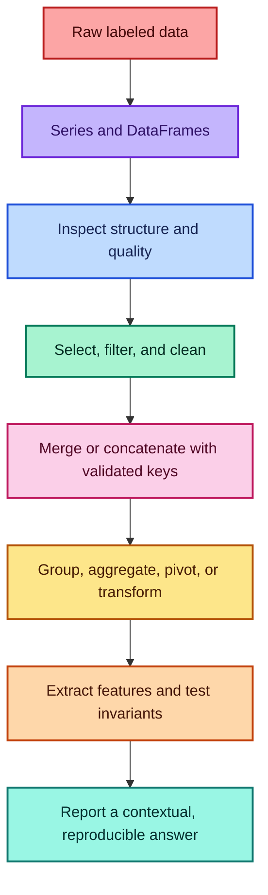

The most useful Pandas habit is to treat every operation as a statement about
**labels**, **row populations**, and **data meaning**. Before interpreting any
result, know which rows survived, which columns were used, how missing values
were handled, whether keys duplicated records, and which dataset date the answer
describes.
