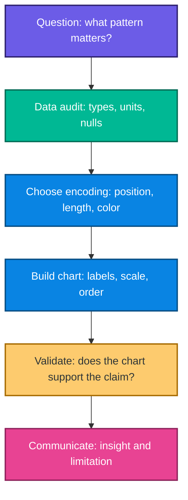
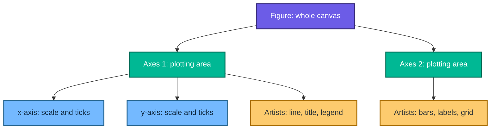
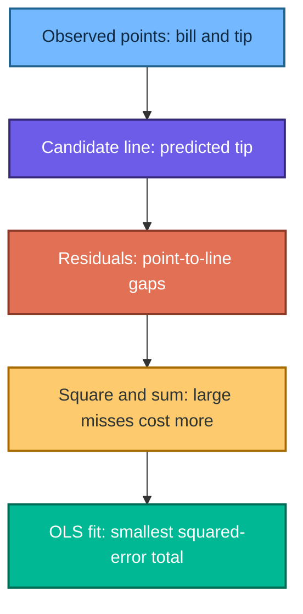
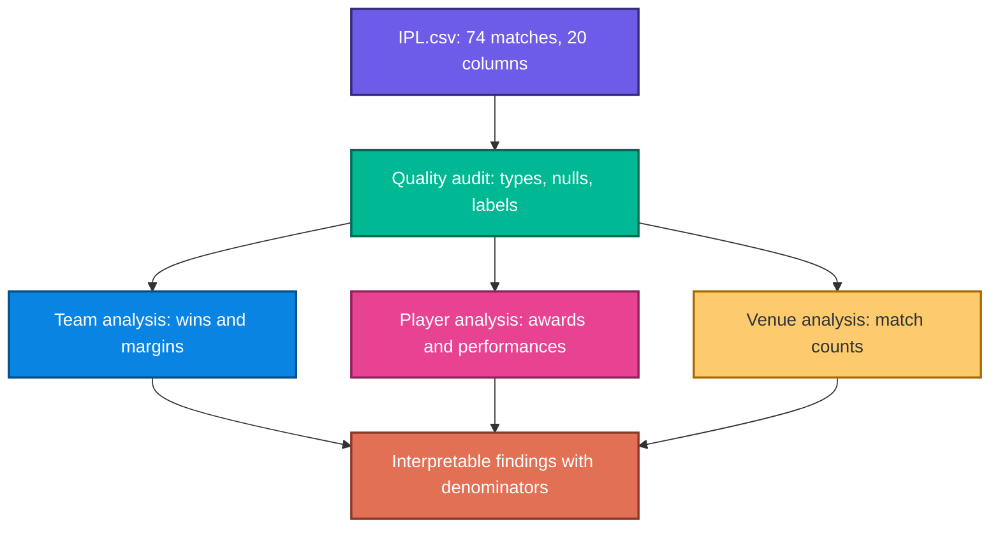
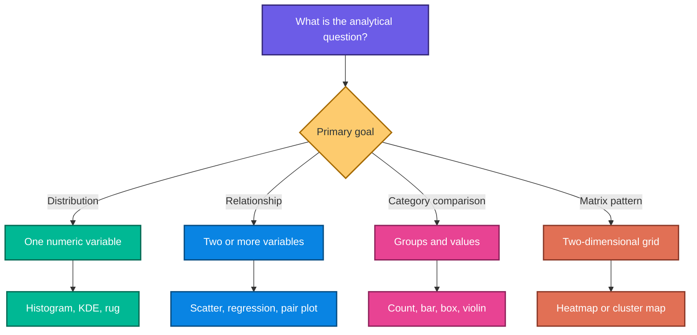

# Python Data Visualization: Matplotlib, Seaborn, Plotly, and an IPL 2022 Case Study

> Detailed study notes built from the supplied notebooks and data files: `Matplotlib.ipynb`, `Distributionplot.ipynb`, `Categoricalplots.ipynb`, `Matrixplot.ipynb`, `regression.ipynb`, `plotlyandcufflinks.ipynb`, `IPL_Capstone_Project.ipynb`, `IPL.csv`, `images.jpeg`, and `basicplot.png`.

These notes explain **what** each visualization does, **why** it is useful, **how** it works, and **when** it should be used. They also correct a few execution-order and interpretation issues in the source notebooks and include reproducible, commented examples.

---

## Table of contents

1. [The visualization mindset](#1-the-visualization-mindset)
2. [Environment and imports](#2-environment-and-imports)
3. [Matplotlib foundations](#3-matplotlib-foundations)
4. [Common Matplotlib plots](#4-common-matplotlib-plots)
5. [Images as numerical arrays](#5-images-as-numerical-arrays)
6. [Seaborn and statistical graphics](#6-seaborn-and-statistical-graphics)
7. [Distribution plots](#7-distribution-plots)
8. [Categorical plots](#8-categorical-plots)
9. [Matrix plots](#9-matrix-plots)
10. [Regression plots and linear intuition](#10-regression-plots-and-linear-intuition)
11. [Interactive charts with Plotly](#11-interactive-charts-with-plotly)
12. [IPL 2022 capstone](#12-ipl-2022-capstone)
13. [Chart-selection guide](#13-chart-selection-guide)
14. [Common mistakes and better patterns](#14-common-mistakes-and-better-patterns)
15. [Practice exercises](#15-practice-exercises)
16. [Quick-reference cheat sheet](#16-quick-reference-cheat-sheet)

---

## 1. The visualization mindset

### What is data visualization?

Data visualization maps data attributes to visual properties such as position, length, color, area, shape, and opacity. A chart is therefore not decoration; it is a **model of the data expressed visually**.

For example, in a bar chart of team wins:

- the team name is mapped to vertical position;
- the number of wins is mapped to bar length;
- color may separate or highlight teams;
- sorting controls the order in which the comparison is perceived.

### Why visualize?

Tables are excellent for exact lookup, but charts are better for recognizing structure:

- **comparison:** Which team won most often?
- **distribution:** Are bills tightly clustered or strongly skewed?
- **relationship:** Does a larger bill tend to accompany a larger tip?
- **composition:** What proportion of toss decisions were to field?
- **change:** How does a value move over time or index position?
- **anomaly:** Which point or match is unusually large?

### A reliable visualization workflow



### The most trustworthy visual encodings

People usually compare aligned positions and lengths more accurately than angles, areas, or color intensity. That is why a sorted bar chart is often clearer than a pie chart for comparing many categories.

| Encoding | Good for | Typical chart | Main caution |
|---|---|---|---|
| Position | Precise comparison | scatter, line | axis scale can mislead |
| Length | Category magnitude | bar | bars should normally start at zero |
| Color hue | Group identity | grouped scatter | too many colors overwhelm |
| Color intensity | Ordered magnitude | heatmap | palette must preserve order |
| Area | Rough magnitude | bubbles | humans compare area poorly |
| Shape | Small number of groups | scatter markers | hard to decode at scale |

> **Fun fact:** A visualization can be numerically correct and still be misleading. Truncated axes, uneven bins, overplotting, and inappropriate aggregation can change the story a reader perceives.

---

## 2. Environment and imports

Install the main libraries in a notebook or terminal environment:

```bash
python -m pip install numpy pandas matplotlib seaborn plotly
```

Recommended imports:

```python
# Numerical and tabular work
import numpy as np
import pandas as pd

# Static and statistical visualization
import matplotlib.pyplot as plt
import seaborn as sns

# Interactive visualization
import plotly.express as px

# Apply a readable Seaborn theme to Matplotlib-based charts.
sns.set_theme(style="whitegrid", context="notebook")
```

The supplied Plotly notebook installs Plotly `5.24.1` with Cufflinks `0.17.3`. Cufflinks is useful for understanding older pandas-to-Plotly workflows, but Plotly Express is the preferred interface for new code because it is maintained as part of Plotly and has direct dataframe support.

---

## 3. Matplotlib foundations

### 3.1 What is Matplotlib?

Matplotlib is Python's foundational plotting library. It provides precise control over figures, axes, labels, lines, markers, images, layouts, and export settings. Seaborn and pandas plotting build on top of it.

### 3.2 The Figure–Axes mental model

The most important Matplotlib distinction is:

- **Figure:** the entire canvas or output image;
- **Axes:** one plotting region inside that canvas;
- **Axis:** the x- or y-scale, ticks, and tick labels inside an Axes;
- **Artist:** almost every visible object, such as a line, title, legend, or annotation.



### 3.3 A first line plot

The source notebook creates eleven evenly spaced values from 0 to 5 and plots $y=x^3$.

```python
import numpy as np
import matplotlib.pyplot as plt

# Create 11 equally spaced x-values, including both endpoints.
x = np.linspace(0, 5, 11)

# NumPy performs element-wise exponentiation.
y = x ** 3

# Create one Figure containing one Axes.
fig, ax = plt.subplots(figsize=(8, 5))

# Plot y against x. The label will be used by the legend.
ax.plot(x, y, color="#0984E3", linewidth=2.5, label=r"$y=x^3$")

# Describe the chart and variables clearly.
ax.set(
    title="Cubic Growth",
    xlabel="Input, x",
    ylabel=r"Output, $y=x^3$",
)
ax.legend()
ax.grid(alpha=0.25)

# Prevent labels from being clipped in compact displays.
fig.tight_layout()
plt.show()
```

The mathematical relation is:

$$
y=x^3
$$

Its derivative is:

$$
\frac{dy}{dx}=3x^2
$$

As $x$ grows, the slope grows quadratically, which explains why the line becomes increasingly steep. The supplied `basicplot.png` is an exported version of this cubic curve.

### 3.4 `pyplot` versus the object-oriented interface

The stateful `plt.plot(...)` interface is concise for exploration. The object-oriented interface, `fig, ax = plt.subplots(...)`, is clearer for reusable code because every change names its target Axes.

| Interface | Example | Use when |
|---|---|---|
| Stateful | `plt.plot(x, y)` | one quick plot in a notebook |
| Object-oriented | `ax.plot(x, y)` | multiple plots, functions, apps, reports |

### 3.5 Multiple subplots

```python
fig, axes = plt.subplots(
    nrows=2,
    ncols=2,
    figsize=(10, 7),
    constrained_layout=True,
)

# Flatten the 2 × 2 array so each Axes is easy to address.
axes = axes.ravel()

axes[0].plot(x, x, color="#00B894")
axes[0].set_title(r"Linear: $y=x$")

axes[1].plot(x, x**2, color="#0984E3")
axes[1].set_title(r"Quadratic: $y=x^2$")

axes[2].plot(x, x**3, color="#6C5CE7")
axes[2].set_title(r"Cubic: $y=x^3$")

axes[3].plot(x, np.sqrt(x), color="#E17055")
axes[3].set_title(r"Square root: $y=\sqrt{x}$")

for ax in axes:
    ax.set_xlabel("x")
    ax.set_ylabel("y")
    ax.grid(alpha=0.2)

plt.show()
```

Use subplots when panels share a meaningful comparison. Do not squeeze unrelated charts into a dashboard just because space is available.

### 3.6 Manual Axes placement and inset plots

The notebook uses normalized bounds of the form `[left, bottom, width, height]`:

```python
fig = plt.figure(figsize=(10, 6))

# Coordinates are fractions of the Figure dimensions, from 0 to 1.
main_ax = fig.add_axes([0.10, 0.12, 0.80, 0.78])
inset_ax = fig.add_axes([0.55, 0.22, 0.28, 0.28])

main_ax.plot(x, x**3, color="#6C5CE7", linewidth=3)
main_ax.set_title("Main view")

inset_ax.plot(x, x**2, color="#E84393")
inset_ax.set_title("Inset", fontsize=10)

plt.show()
```

Manual placement is useful for insets and unusual report layouts. For ordinary grids, `plt.subplots()` is easier to maintain.

### 3.7 Figure size, DPI, and export

If the figure dimensions are $W$ inches by $H$ inches and the resolution is $d$ dots per inch, the approximate pixel dimensions are:

$$
\text{pixel width}=W\times d
$$

$$
\text{pixel height}=H\times d
$$

A `figsize=(10, 6)` figure saved at `dpi=150` is therefore about $1500\times900$ pixels.

```python
fig, ax = plt.subplots(figsize=(10, 6))
ax.plot(x, y, color="#0984E3")
ax.set(title="Cubic Curve", xlabel="x", ylabel="y")

# bbox_inches="tight" reduces unnecessary outer whitespace.
fig.savefig(
    "basicplot.png",
    dpi=150,
    bbox_inches="tight",
    facecolor="white",
)
```

Use PNG for raster output, SVG/PDF for scalable vector output, and a higher DPI when raster text or lines need to remain crisp in print.

---

## 4. Common Matplotlib plots

### 4.1 Scatter plot

**What:** each observation is a point located by two numeric variables.  
**Why:** reveals association, clusters, nonlinearity, and outliers.  
**When:** both x and y are quantitative.

```python
rng = np.random.default_rng(42)
x_scatter = rng.normal(size=100)
y_scatter = 2 * x_scatter + rng.normal(scale=0.8, size=100)

fig, ax = plt.subplots(figsize=(7, 5))
ax.scatter(
    x_scatter,
    y_scatter,
    color="#6C5CE7",
    alpha=0.65,      # Transparency helps reveal overlapping points.
    edgecolor="white",
)
ax.set(title="Relationship between x and y", xlabel="x", ylabel="y")
plt.show()
```

### 4.2 Histogram

**What:** divides a numeric range into bins and counts observations in each bin.  
**Why:** shows center, spread, skewness, modes, and possible outliers.  
**When:** studying one quantitative variable.

For bin $j$ with boundaries $b_j$ and $b_{j+1}$, the count is:

$$
h_j=\sum_{i=1}^{n}\mathbf{1}\left(b_j\leq x_i<b_{j+1}\right)
$$

Here, $\mathbf{1}(\cdot)$ equals 1 when the condition is true and 0 otherwise.

```python
rng = np.random.default_rng(42)
values = rng.normal(loc=50, scale=12, size=500)

fig, ax = plt.subplots(figsize=(7, 5))
ax.hist(values, bins=20, color="#00B894", edgecolor="white")
ax.set(title="Distribution of values", xlabel="Value", ylabel="Frequency")
plt.show()
```

Bin width matters: too few bins hide structure; too many create noise. Always inspect more than one reasonable bin choice.

### 4.3 Box plot

A box plot summarizes a distribution using quartiles and the interquartile range:

$$
IQR=Q_3-Q_1
$$

The conventional potential-outlier fences are:

$$
\text{lower fence}=Q_1-1.5(IQR)
$$

$$
\text{upper fence}=Q_3+1.5(IQR)
$$

Points outside the whiskers are not automatically errors; they are observations worth investigating.

```python
groups = [
    rng.normal(50, 8, 150),
    rng.normal(62, 12, 150),
    rng.normal(70, 6, 150),
]

fig, ax = plt.subplots(figsize=(7, 5))
ax.boxplot(groups, tick_labels=["A", "B", "C"], patch_artist=True)
ax.set(title="Comparing three distributions", xlabel="Group", ylabel="Value")
plt.show()
```

### 4.4 Styling lines and markers

```python
fig, ax = plt.subplots(figsize=(8, 5))
ax.plot(
    x,
    y,
    color="#E84393",
    linewidth=2.5,
    linestyle="--",
    marker="o",
    markersize=7,
    markerfacecolor="#FDCB6E",
    markeredgecolor="#6C5CE7",
    markeredgewidth=1.2,
)
ax.set(title="Styled line", xlabel="x", ylabel=r"$x^3$")
plt.show()
```

Common line styles are `"-"`, `"--"`, `"-."`, and `":"`. Style should add meaning—for example, dashed for a forecast—not merely visual variety.

---

## 5. Images as numerical arrays

### 5.1 What happens when an image is loaded?

`matplotlib.image.imread` returns an array. A color image commonly has shape:

$$
(\text{height},\ \text{width},\ \text{channels})
$$

An RGB image has three channels; an RGBA image has a fourth alpha channel.

```python
import matplotlib.image as mpimg
import matplotlib.pyplot as plt

# Load the supplied portrait image as a numerical array.
image = mpimg.imread("images.jpeg")

print(image.shape)
print(image.dtype)

fig, ax = plt.subplots(figsize=(5, 7))
ax.imshow(image)
ax.set_title("Original image")
ax.axis("off")
plt.show()
```

### 5.2 Cropping by array slicing

```python
# Select rows 50–199 and columns 100–299.
# The third dimension (color channels) is retained automatically.
crop = image[50:200, 100:300]

fig, ax = plt.subplots(figsize=(6, 4))
ax.imshow(crop)
ax.set_title("Cropped region")
ax.axis("off")
plt.show()
```

The slicing order is `[rows, columns]`, which corresponds to `[y, x]`, not `[x, y]`.

> **Fun fact:** A digital image is data. Cropping is array slicing, brightness adjustment is arithmetic on pixel values, and color filtering is manipulation of channel matrices.

---

## 6. Seaborn and statistical graphics

Seaborn provides high-level statistical plots on top of Matplotlib. It understands pandas dataframes and maps column names directly to visual roles.

The source notebooks use Seaborn’s built-in `tips` and `flights` datasets. If internet access is unavailable, save a local copy before teaching or production use.

```python
import seaborn as sns

tips = sns.load_dataset("tips")
flights = sns.load_dataset("flights")

print(tips.head())
print(flights.head())
```

Useful `tips` variables include `total_bill`, `tip`, `sex`, `smoker`, `day`, `time`, and `size`.

### Figure-level versus Axes-level functions

| Type | Examples | Returns | Best use |
|---|---|---|---|
| Axes-level | `histplot`, `barplot`, `boxplot`, `heatmap` | Matplotlib `Axes` | existing subplot layout |
| Figure-level | `jointplot`, `pairplot`, `lmplot` | Seaborn grid object | complete multi-panel figure |

This difference matters: `ax=...` works naturally with Axes-level functions, while figure-level functions manage their own Figure.

---

## 7. Distribution plots

### 7.1 Histogram with KDE

```python
fig, ax = plt.subplots(figsize=(8, 5))
sns.histplot(
    data=tips,
    x="total_bill",
    bins=20,
    kde=True,
    color="#0984E3",
    ax=ax,
)
ax.set(title="Distribution of total bills", xlabel="Total bill", ylabel="Count")
plt.show()
```

A kernel density estimate places a smooth kernel around each observation:

$$
\hat f_h(x)=\frac{1}{nh}\sum_{i=1}^{n}K\left(\frac{x-x_i}{h}\right)
$$

where:

- $n$ is the number of observations;
- $K$ is the kernel, often Gaussian;
- $h$ is the bandwidth;
- a small $h$ creates a wiggly estimate;
- a large $h$ creates a smoother estimate that may hide detail.

The KDE is an estimate, not a literal outline of the population.

### 7.2 Joint plot

`jointplot` displays a bivariate relationship in the center and marginal distributions along the edges.

```python
sns.jointplot(
    data=tips,
    x="total_bill",
    y="tip",
    kind="scatter",
    color="#6C5CE7",
    height=7,
)
plt.show()
```

Use `kind="reg"` when a fitted linear trend helps answer the question. Do not treat the fitted line as evidence of causation.

### 7.3 Pair plot

```python
g = sns.pairplot(
    data=tips,
    vars=["total_bill", "tip", "size"],
    hue="time",
    palette="Set2",
    corner=True,       # Avoid duplicate upper-triangle panels.
    diag_kind="hist",
)
g.fig.suptitle("Pairwise relationships in tips", y=1.02)
plt.show()
```

For $p$ numeric variables, a full pair plot creates roughly $p^2$ panels. This is useful for quick exploration but becomes expensive and unreadable as $p$ grows.

### 7.4 Rug plot

```python
fig, ax = plt.subplots(figsize=(8, 2.5))
sns.rugplot(data=tips, x="tip", height=0.25, color="#E84393", ax=ax)
ax.set(title="Every observed tip", xlabel="Tip")
plt.show()
```

Each small mark represents one observation. Rug plots are most useful beside a histogram or KDE; by themselves they become crowded for large datasets.

### Distribution-plot comparison

| Plot | Shows | Use when | Limitation |
|---|---|---|---|
| Histogram | binned counts | shape and frequency matter | depends on bin choice |
| KDE | smoothed density | comparing smooth shapes | depends on bandwidth |
| Joint plot | two variables + marginals | relationship and distributions both matter | larger figure |
| Pair plot | all pairwise relationships | early multivariate exploration | scales poorly with columns |
| Rug plot | exact observation locations | small/medium samples | overplots easily |

---

## 8. Categorical plots

### 8.1 Count plot

A count plot answers “how many rows belong to each category?”

For category $c$:

$$
n_c=\sum_{i=1}^{n}\mathbf{1}(x_i=c)
$$

```python
fig, ax = plt.subplots(figsize=(7, 5))
sns.countplot(
    data=tips,
    x="sex",
    hue="smoker",
    palette="Set2",
    ax=ax,
)
ax.set(title="Customer counts by sex and smoking status", ylabel="Rows")
plt.show()
```

Use a count plot for row frequency. Use a bar plot when the bar height should represent an aggregate of another variable.

### 8.2 Bar plot and estimators

By default, `sns.barplot` estimates the mean of $y$ within each category:

$$
\bar y_c=\frac{1}{n_c}\sum_{i:x_i=c}y_i
$$

```python
fig, ax = plt.subplots(figsize=(7, 5))
sns.barplot(
    data=tips,
    x="sex",
    y="total_bill",
    estimator="mean",
    errorbar=("ci", 95),
    hue="sex",
    legend=False,
    palette="viridis",
    ax=ax,
)
ax.set(title="Mean bill by sex", ylabel="Mean total bill")
plt.show()
```

For a sum, the estimator is:

$$
S_c=\sum_{i:x_i=c}y_i
$$

```python
sns.barplot(
    data=tips,
    x="sex",
    y="tip",
    estimator="sum",
    errorbar=None,
    hue="sex",
    legend=False,
)
```

Always label the aggregation. “Tip by group” is ambiguous; “mean tip by group” or “total recorded tips by group” is precise.

### 8.3 Box plot

```python
fig, ax = plt.subplots(figsize=(8, 5))
sns.boxplot(
    data=tips,
    x="day",
    y="tip",
    hue="day",
    legend=False,
    palette="Set3",
    ax=ax,
)
ax.set(title="Tip distributions by day")
plt.show()
```

Use box plots for compact distribution comparison. They reveal median, quartiles, spread, and potential outliers, but they can hide multimodality and individual observations.

### 8.4 Violin plot

```python
fig, ax = plt.subplots(figsize=(8, 5))
sns.violinplot(
    data=tips,
    x="day",
    y="total_bill",
    hue="day",
    legend=False,
    palette="pastel",
    inner="quartile",
    cut=0,
    ax=ax,
)
ax.set(title="Bill density by day")
plt.show()
```

A violin plot mirrors a KDE around a center line. Width indicates estimated density, not raw count unless the plot is configured to scale that way. It works best with enough observations per group for a meaningful density estimate.

### 8.5 Strip and swarm plots

```python
fig, axes = plt.subplots(1, 2, figsize=(12, 5), sharey=True)

sns.stripplot(
    data=tips,
    x="day",
    y="tip",
    jitter=True,
    alpha=0.65,
    color="#6C5CE7",
    ax=axes[0],
)
axes[0].set_title("Strip plot: jittered observations")

sns.swarmplot(
    data=tips,
    x="day",
    y="tip",
    size=4,
    color="#E17055",
    ax=axes[1],
)
axes[1].set_title("Swarm plot: collision-aware placement")

plt.show()
```

- A **strip plot** adds jitter to reduce overlap. It is fast but positions are slightly randomized.
- A **swarm plot** attempts to place points without collision. It preserves the numeric axis but may fail to place every point in dense groups.

When a swarm warning says points cannot be placed, reduce marker size, enlarge the figure, sample the data, or use a strip plot.

### 8.6 Layering summary and detail

```python
fig, ax = plt.subplots(figsize=(9, 5))

# First draw the estimated distribution.
sns.violinplot(
    data=tips,
    x="day",
    y="total_bill",
    inner=None,
    color="#A29BFE",
    cut=0,
    ax=ax,
)

# Then show the individual observations.
sns.stripplot(
    data=tips,
    x="day",
    y="total_bill",
    color="#2D3436",
    alpha=0.55,
    jitter=0.18,
    size=3,
    ax=ax,
)

ax.set_title("Distribution plus individual observations")
plt.show()
```

Layering is powerful when each layer adds distinct information. Avoid layers that merely create visual noise.

---

## 9. Matrix plots

### 9.1 Correlation matrix

The Pearson correlation coefficient between variables $X$ and $Y$ is:

$$
r_{XY}=\frac{\sum_{i=1}^{n}(x_i-\bar{x})(y_i-\bar{y})}
{\sqrt{\sum_{i=1}^{n}(x_i-\bar{x})^2}\sqrt{\sum_{i=1}^{n}(y_i-\bar{y})^2}}
$$

It lies between $-1$ and $1$:

- $r\approx1$: strong positive linear association;
- $r\approx-1$: strong negative linear association;
- $r\approx0$: little linear association, though a nonlinear relation may still exist.

```python
numeric_tips = tips[["total_bill", "tip", "size"]]
corr = numeric_tips.corr(method="pearson")

fig, ax = plt.subplots(figsize=(7, 5))
sns.heatmap(
    corr,
    annot=True,
    fmt=".2f",
    cmap="vlag",
    center=0,
    vmin=-1,
    vmax=1,
    square=True,
    linewidths=0.5,
    ax=ax,
)
ax.set_title("Pearson correlation matrix")
plt.show()
```

In the source notebook's `tips` data, the displayed correlations are approximately:

| Pair | Pearson correlation |
|---|---:|
| `total_bill` and `tip` | 0.676 |
| `total_bill` and `size` | 0.598 |
| `tip` and `size` | 0.489 |

These are associations, not proof that one variable causes the other. The matrix is symmetric, and each diagonal value is 1 because a variable is perfectly correlated with itself.

### 9.2 Cluster map

```python
sns.clustermap(
    corr,
    cmap="vlag",
    center=0,
    annot=True,
    fmt=".2f",
    figsize=(7, 7),
)
plt.show()
```

A cluster map reorders rows and columns using hierarchical clustering so similar patterns become adjacent. It is useful when a large matrix contains groups that are hard to see in the original order. With only three variables, it is mainly instructional.

One common distance between two row vectors $\mathbf{x}$ and $\mathbf{y}$ is Euclidean distance:

$$
d(\mathbf{x},\mathbf{y})=\sqrt{\sum_{j=1}^{p}(x_j-y_j)^2}
$$

The dendrogram shows merge order, but that order depends on the distance metric, linkage method, and scaling.

### 9.3 Pivot-table heatmap

The flights example reshapes long data into a month-by-year matrix:

```python
flight_matrix = flights.pivot(
    index="month",
    columns="year",
    values="passengers",
)

fig, ax = plt.subplots(figsize=(12, 7))
sns.heatmap(
    flight_matrix,
    cmap="YlGnBu",
    linewidths=0.2,
    cbar_kws={"label": "Passengers"},
    ax=ax,
)
ax.set_title("Monthly passengers by year")
plt.show()
```

**Why it works:** two categorical/ordered dimensions become the grid, while color encodes the numeric value. This makes seasonal and long-term patterns visible at once.

> **Fun fact:** A heatmap is essentially a colored table. Its usefulness comes from ordering, normalization, and the color scale—not from the grid alone.

---

## 10. Regression plots and linear intuition

### 10.1 What does `lmplot` do?

`sns.lmplot` combines a scatter plot with a fitted regression line. It is a figure-level function and can create separate fits across `hue`, `row`, or `col` groups.

```python
g = sns.lmplot(
    data=tips,
    x="total_bill",
    y="tip",
    hue="sex",
    palette="Set1",
    markers=["o", "x"],
    scatter_kws={"s": 45, "alpha": 0.65},
    height=5,
    aspect=1.4,
)
g.set_axis_labels("Total bill", "Tip")
g.fig.suptitle("Separate linear fits by sex", y=1.03)
plt.show()
```

### 10.2 Linear model

For one predictor, the model is:

$$
y_i=\beta_0+\beta_1x_i+\varepsilon_i
$$

where:

- $\beta_0$ is the intercept;
- $\beta_1$ is the expected change in $y$ for a one-unit change in $x$;
- $\varepsilon_i$ is unexplained variation.

The fitted value and residual are:

$$
\hat y_i=\hat\beta_0+\hat\beta_1x_i
$$

$$
e_i=y_i-\hat y_i
$$

Ordinary least squares chooses the line that minimizes the sum of squared errors:

$$
SSE=\sum_{i=1}^{n}\left(y_i-\hat y_i\right)^2
$$

For simple linear regression:

$$
\hat\beta_1=
\frac{\sum_{i=1}^{n}(x_i-\bar{x})(y_i-\bar{y})}
{\sum_{i=1}^{n}(x_i-\bar{x})^2}
$$

$$
\hat\beta_0=\bar{y}-\hat\beta_1\bar{x}
$$

### 10.3 Goodness of fit

A common summary is the coefficient of determination:

$$
R^2=1-\frac{\sum_{i=1}^{n}(y_i-\hat y_i)^2}
{\sum_{i=1}^{n}(y_i-\bar y)^2}
$$

$R^2$ describes the fraction of observed variation explained by the fitted model in the sample. `lmplot` draws the fit and its uncertainty band but does not print $R^2$ automatically.

### 10.4 Visual intuition



### 10.5 When a line is not enough

Inspect the scatter and residual pattern before interpreting a fit. Warning signs include:

- curvature, suggesting the relation is not linear;
- a fan-shaped spread, suggesting non-constant variance;
- influential outliers;
- clusters caused by a missing group variable;
- repeated observations that are not independent;
- extrapolation far beyond the observed x-range.

Separate `hue` fits describe within-group patterns. They do not by themselves establish that group membership changes the causal effect.

---

## 11. Interactive charts with Plotly

### 11.1 What and why?

Plotly produces interactive figures with hover labels, zoom, pan, selection, legend toggling, and export controls. Use it when readers benefit from exploring exact values or subsets. Prefer a static chart when a fixed report, print layout, or simple message is the goal.

### 11.2 Modern Plotly Express equivalents

#### Interactive line chart

```python
# Convert the index into an explicit column for a clear x-axis.
bill_series = tips[["total_bill"]].reset_index(names="row")

fig = px.line(
    bill_series,
    x="row",
    y="total_bill",
    title="Total bill by dataset row",
    markers=True,
)
fig.update_layout(xaxis_title="Row", yaxis_title="Total bill")
fig.show()
```

This reproduces the intent of `tips['total_bill'].iplot()` from the Cufflinks notebook. Because row order is not time, call the horizontal axis “row,” not “time.”

#### Aggregated bar chart

```python
# observed=True avoids unused categorical combinations in grouped results.
day_mean = (
    tips.groupby("day", observed=True, as_index=False)
    .agg(mean_tip=("tip", "mean"))
)

fig = px.bar(
    day_mean,
    x="day",
    y="mean_tip",
    color="day",
    title="Mean tip by day",
)
fig.update_layout(showlegend=False, yaxis_title="Mean tip")
fig.show()
```

#### Interactive scatter plot

```python
fig = px.scatter(
    tips,
    x="total_bill",
    y="tip",
    color="time",
    size="size",
    hover_data=["day", "smoker"],
    title="Bill–tip relationship",
)
fig.show()
```

#### Correctly oriented box plot

```python
fig = px.box(
    tips,
    x="day",
    y="total_bill",
    color="day",
    points="outliers",
    title="Total bill distribution by day",
)
fig.update_layout(showlegend=False)
fig.show()
```

This is clearer than passing a numeric column as `x` and a category as `y` while selecting only mismatched columns, as in the source Cufflinks box example.

### 11.3 Saving an interactive chart

```python
# Produce a standalone HTML file that retains interactivity.
fig.write_html("interactive_boxplot.html", include_plotlyjs="cdn")
```

Using `include_plotlyjs="cdn"` keeps the file smaller but requires internet access when opened. Use `include_plotlyjs=True` for a larger, self-contained file.

### 11.4 Cufflinks legacy syntax

For existing notebooks that already use Cufflinks:

```python
import cufflinks as cf

# Configure Cufflinks to render Plotly figures inside the notebook.
cf.go_offline()

tips["total_bill"].iplot(kind="line")
```

Keep this pattern when maintaining a known working environment. Prefer Plotly Express for new projects and test older Cufflinks notebooks carefully after Plotly or pandas upgrades.

---

## 12. IPL 2022 capstone

### 12.1 Business questions

The capstone turns match-level IPL 2022 data into answers about:

- team wins;
- toss decisions and toss–match agreement;
- victory mode: runs or wickets;
- player-of-the-match awards;
- match-level top scores and bowling figures;
- venue usage;
- exceptional performances and margins.



### 12.2 Data dictionary

The file contains 74 rows and 20 original columns, with no missing values in the supplied copy.

| Column | Type | Meaning |
|---|---|---|
| `match_id` | integer | match identifier |
| `date` | text | match date |
| `venue` | text | stadium and city |
| `team1`, `team2` | text | competing teams |
| `stage` | text | Group, Playoff, or Final |
| `toss_winner` | text | team winning the toss |
| `toss_decision` | text | Bat or Field |
| `first_ings_score` | integer | first-innings runs |
| `first_ings_wkts` | integer | first-innings wickets lost |
| `second_ings_score` | integer | second-innings runs |
| `second_ings_wkts` | integer | second-innings wickets lost |
| `match_winner` | text | winning team |
| `won_by` | text | Runs or Wickets |
| `margin` | integer | winning margin in the unit named by `won_by` |
| `player_of_the_match` | text | award recipient |
| `top_scorer` | text | match's highest scorer |
| `highscore` | integer | that match-level individual score |
| `best_bowling` | text | match's recorded best bowler |
| `best_bowling_figure` | text | wickets and runs conceded, stored like `5--10` |

The abbreviations `ings` and `wkts` mean innings and wickets. The file spells one label as `Banglore`; do not silently replace categorical labels until the intended standard is confirmed, because inconsistent normalization can split or merge categories incorrectly. It also contains one date without a space—`April11,2022`—which the loading code normalizes before applying an explicit date format.

### 12.3 Load, audit, and engineer reliable fields

```python
from pathlib import Path
import pandas as pd

DATA_PATH = Path("IPL.csv")
ipl = pd.read_csv(DATA_PATH)

# Confirm expected dimensions before analysis.
print(f"Rows: {ipl.shape[0]}, columns: {ipl.shape[1]}")

# One source value is "April11,2022" while the remaining month/day values
# include a space. Normalize that specific text pattern before parsing.
normalized_date = ipl["date"].str.replace(
    r"^([A-Za-z]+)(\d)",
    r"\1 \2",
    regex=True,
)

# An explicit format prevents locale-dependent or inconsistent inference.
# errors="raise" makes any remaining unexpected text visible immediately.
ipl["date"] = pd.to_datetime(
    normalized_date,
    format="%B %d,%Y",
    errors="raise",
)

# Split bowling figures such as "5--10" into two numeric fields.
bowling_parts = ipl["best_bowling_figure"].str.extract(
    r"^(?P<best_wickets>\d+)--(?P<runs_conceded>\d+)$"
)

# Conversion to integer will fail loudly if parsing produced missing values.
ipl[["best_wickets", "runs_conceded"]] = bowling_parts.astype("int64")

# Audit data quality after transformations.
assert ipl.shape[0] == 74
assert ipl["match_id"].is_unique
assert not ipl.isna().any().any()
assert set(ipl["toss_decision"]) == {"Bat", "Field"}
assert set(ipl["won_by"]) == {"Runs", "Wickets"}

print(ipl.dtypes)
```

Why parse the bowling figure into two numbers? Cricket bowling figures are lexicographic: more wickets is better; among equal wickets, fewer conceded runs is better. Sorting the raw strings cannot represent that rule reliably.

### 12.4 Which team won the most matches?

```python
# Compute before displaying: the source notebook contains one cell that refers
# to match_wins before assigning it, which only works if cells ran out of order.
match_wins = (
    ipl["match_winner"]
    .value_counts()
    .rename_axis("team")
    .reset_index(name="wins")
)

fig, ax = plt.subplots(figsize=(9, 6))
sns.barplot(
    data=match_wins,
    y="team",
    x="wins",
    hue="team",
    legend=False,
    palette="viridis",
    ax=ax,
)
ax.set(title="IPL 2022 match wins", xlabel="Matches won", ylabel="Team")
for container in ax.containers:
    ax.bar_label(container, padding=3)
plt.show()
```

Results in the supplied data:

| Rank | Team | Wins |
|---:|---|---:|
| 1 | Gujarat | 12 |
| 2 | Rajasthan | 10 |
| 3 (tie) | Banglore | 9 |
| 3 (tie) | Lucknow | 9 |
| 5 (tie) | Delhi | 7 |
| 5 (tie) | Punjab | 7 |

Gujarat has the most wins in this match-level dataset. A raw win count is appropriate because every row is one match and each row has exactly one winner.

### 12.5 Toss-decision trends

```python
toss_counts = (
    ipl["toss_decision"]
    .value_counts()
    .rename_axis("decision")
    .reset_index(name="matches")
)

fig, ax = plt.subplots(figsize=(7, 5))
sns.barplot(
    data=toss_counts,
    x="decision",
    y="matches",
    hue="decision",
    legend=False,
    palette=["#00B894", "#6C5CE7"],
    ax=ax,
)
ax.set(title="Toss decisions", xlabel="Decision", ylabel="Matches")
plt.show()
```

- Field: 59 matches
- Bat: 15 matches

The proportion choosing to field is:

$$
\hat p_{field}=\frac{59}{74}\approx0.7973=79.73\%
$$

This describes the season in the file. It does not prove fielding first causes victory.

### 12.6 Did the toss winner also win the match?

Define an indicator:

$$
I_i=
\begin{cases}
1, & \text{if toss winner equals match winner}\\
0, & \text{otherwise}
\end{cases}
$$

Then:

$$
\hat p=\frac{1}{n}\sum_{i=1}^{n}I_i
$$

```python
toss_match_same = ipl["toss_winner"].eq(ipl["match_winner"])

same_count = int(toss_match_same.sum())
same_rate = toss_match_same.mean()

print(f"Same team: {same_count}/{len(ipl)} ({same_rate:.2%})")
```

The supplied data gives:

$$
\frac{36}{74}\times100\%=48.65\%
$$

Interpretation: the toss winner was also the match winner in 36 of 74 matches. This is a descriptive agreement rate, not a causal estimate of “toss advantage.” Teams are not randomly assigned toss outcomes alongside all other match conditions, and the calculation does not control for team strength, venue, or decision.

### 12.7 Runs versus wickets

```python
win_mode = (
    ipl["won_by"]
    .value_counts()
    .rename_axis("mode")
    .reset_index(name="matches")
)

fig, ax = plt.subplots(figsize=(7, 5))
sns.barplot(
    data=win_mode,
    x="mode",
    y="matches",
    hue="mode",
    legend=False,
    palette=["#E84393", "#0984E3"],
    ax=ax,
)
ax.set(title="How matches were won", xlabel="Winning unit", ylabel="Matches")
plt.show()
```

The file contains an exact split: 37 wins by runs and 37 by wickets.

Do not average `margin` across both categories. A 20-run margin and a 6-wicket margin use different units. Analyze each `won_by` group separately.

### 12.8 Player-of-the-match awards

```python
top_awards = (
    ipl["player_of_the_match"]
    .value_counts()
    .head(10)
    .rename_axis("player")
    .reset_index(name="awards")
)

fig, ax = plt.subplots(figsize=(9, 6))
sns.barplot(
    data=top_awards,
    y="player",
    x="awards",
    hue="player",
    legend=False,
    palette="mako",
    ax=ax,
)
ax.set(title="Most Player of the Match awards", xlabel="Awards", ylabel="Player")
plt.show()
```

Kuldeep Yadav leads the supplied data with 4 awards, followed by Jos Buttler with 3. Several players are tied at 2, so a “top 10” may cut through a tie. State the tie policy or include everyone at the cutoff.

### 12.9 Match-top-score aggregation: precise interpretation

```python
match_top_score_summary = (
    ipl.groupby("top_scorer", observed=True)
    .agg(
        top_scorer_appearances=("top_scorer", "size"),
        sum_of_match_highscores=("highscore", "sum"),
        maximum_match_highscore=("highscore", "max"),
    )
    .sort_values(
        ["sum_of_match_highscores", "maximum_match_highscore"],
        ascending=False,
    )
)

print(match_top_score_summary.head(10))
```

The notebook obtains Jos Buttler 651 and Quinton de Kock 377 by summing `highscore` only in matches where each player was the match's top scorer.

That measure is:

$$
S_p=\sum_{i:\ top\_scorer_i=p}highscore_i
$$

It is **not total season runs**, because a player's runs are absent whenever another player topped the match. Call it “sum of recorded match-top scores,” not “season run total.” A batting-ball or scorecard dataset is required for an Orange Cap analysis.

The highest individual score recorded in any row is Quinton de Kock's 140 in match 66.

### 12.10 Best bowling figures: wickets first, runs second

```python
best_figures = (
    ipl.loc[
        :,
        [
            "match_id",
            "best_bowling",
            "best_bowling_figure",
            "best_wickets",
            "runs_conceded",
        ],
    ]
    .sort_values(
        ["best_wickets", "runs_conceded"],
        ascending=[False, True],
    )
    .head(10)
)

print(best_figures)
```

Four five-wicket performances occur in the supplied data:

| Bowler | Figure |
|---|---:|
| Jasprit Bumrah | 5–10 |
| Wanindu Hasaranga | 5–18 |
| Umran Malik | 5–25 |
| Yuzvendra Chahal | 5–40 |

Under the ordinary wickets-first, fewer-runs tie-break, 5–10 ranks ahead of the other five-wicket figures.

The notebook's sum of `highest_wickets` for each recorded match-best bowler can be reproduced, but it is not a season wicket tally: it excludes wickets from matches in which the player was not the recorded best bowler.

### 12.11 Venue analysis

```python
venue_counts = (
    ipl["venue"]
    .value_counts()
    .rename_axis("venue")
    .reset_index(name="matches")
)

fig, ax = plt.subplots(figsize=(10, 6))
sns.barplot(
    data=venue_counts,
    y="venue",
    x="matches",
    hue="venue",
    legend=False,
    palette="crest",
    ax=ax,
)
ax.set(title="Matches played by venue", xlabel="Matches", ylabel="Venue")
plt.show()
```

| Venue | Matches |
|---|---:|
| Wankhede Stadium, Mumbai | 21 |
| Dr DY Patil Sports Academy, Mumbai | 20 |
| Brabourne Stadium, Mumbai | 16 |
| Maharashtra Cricket Association Stadium, Pune | 13 |
| Eden Gardens, Kolkata | 2 |
| Narendra Modi Stadium, Ahmedabad | 2 |

Counts measure scheduling concentration, not venue quality or home advantage.

### 12.12 Exceptional matches

```python
# Largest victory by runs; filter first because margin units differ.
largest_run_win = (
    ipl.loc[ipl["won_by"].eq("Runs")]
    .nlargest(1, "margin")[
        ["match_id", "match_winner", "margin", "team1", "team2"]
    ]
)

# Highest individual score recorded in a match.
highest_individual = ipl.loc[
    ipl["highscore"].eq(ipl["highscore"].max()),
    ["match_id", "top_scorer", "highscore", "team1", "team2"],
]

print(largest_run_win)
print(highest_individual)
```

Findings:

- Chennai recorded the largest run-margin win: 91 runs, in match 55.
- Quinton de Kock recorded the highest individual score: 140, in match 66.
- Jasprit Bumrah's 5–10 ranks as the best five-wicket figure using fewer runs conceded as the tie-break.

### 12.13 Descriptive score statistics

| Statistic | First innings | Second innings | Match high score | Margin* |
|---|---:|---:|---:|---:|
| Mean | 171.12 | 158.54 | 71.72 | 16.97 |
| Standard deviation | 29.05 | 29.30 | 20.71 | 19.65 |
| Minimum | 68 | 72 | 28 | 2 |
| Median | 169.50 | 160.00 | 68 | 8 |
| Maximum | 222 | 211 | 140 | 91 |

\*The overall margin column mixes runs and wickets, so its combined mean and standard deviation have limited substantive meaning. The values are shown only to explain the raw `describe()` output.

The sample mean is:

$$
\bar{x}=\frac{1}{n}\sum_{i=1}^{n}x_i
$$

The sample standard deviation is:

$$
s=\sqrt{\frac{1}{n-1}\sum_{i=1}^{n}(x_i-\bar{x})^2}
$$

### 12.14 A compact, reproducible capstone script

```python
from pathlib import Path

import matplotlib.pyplot as plt
import pandas as pd
import seaborn as sns

sns.set_theme(style="whitegrid")

# ---------- Load ----------
ipl = pd.read_csv(Path("IPL.csv"))

# ---------- Validate ----------
required = {
    "match_id",
    "match_winner",
    "toss_winner",
    "toss_decision",
    "won_by",
    "margin",
    "player_of_the_match",
    "best_bowling",
    "best_bowling_figure",
}
missing_columns = required.difference(ipl.columns)
if missing_columns:
    raise ValueError(f"Missing required columns: {sorted(missing_columns)}")

if ipl["match_id"].duplicated().any():
    raise ValueError("match_id must be unique")

# ---------- Feature engineering ----------
figure_parts = ipl["best_bowling_figure"].str.extract(
    r"^(?P<best_wickets>\d+)--(?P<runs_conceded>\d+)$"
)
ipl[["best_wickets", "runs_conceded"]] = figure_parts.astype(int)
ipl["toss_and_match_winner_same"] = ipl["toss_winner"].eq(
    ipl["match_winner"]
)

# ---------- Summaries ----------
team_wins = ipl["match_winner"].value_counts()
toss_agreement = ipl["toss_and_match_winner_same"].mean()
largest_run_win = ipl.loc[ipl["won_by"].eq("Runs")].nlargest(1, "margin")
best_bowling = ipl.sort_values(
    ["best_wickets", "runs_conceded"],
    ascending=[False, True],
).head(1)

print(team_wins)
print(f"Toss winner also won: {toss_agreement:.2%}")
print(largest_run_win[["match_winner", "margin"]])
print(best_bowling[["best_bowling", "best_bowling_figure"]])

# ---------- Visualization ----------
plot_data = team_wins.rename_axis("team").reset_index(name="wins")

fig, ax = plt.subplots(figsize=(9, 6))
sns.barplot(
    data=plot_data,
    y="team",
    x="wins",
    hue="team",
    legend=False,
    palette="viridis",
    ax=ax,
)
ax.set(title="IPL 2022 team wins", xlabel="Wins", ylabel="Team")
fig.tight_layout()
plt.show()
```

---

## 13. Chart-selection guide



| Question | Recommended starting chart | Why |
|---|---|---|
| How often does each category occur? | count plot / sorted bar | direct length comparison |
| What is the shape of one numeric variable? | histogram + optional KDE | shows frequency and smooth shape |
| How do distributions differ by group? | box or violin + points | compares center, spread, and shape |
| Are two numeric variables associated? | scatter plot | preserves individual pairs |
| What are all pairwise numeric relationships? | pair plot | rapid exploratory overview |
| Which matrix cells are high or low? | heatmap | color encodes a two-dimensional grid |
| Is there an approximate linear trend? | scatter + regression line | shows observations and fit together |
| Must readers hover, zoom, or filter? | Plotly | adds interaction |

---

## 14. Common mistakes and better patterns

### 14.1 Running notebook cells out of order

The source IPL notebook displays `match_wins` before the assignment cell. Restart the kernel and run all cells top-to-bottom before sharing a notebook. A clean run exposes hidden state.

### 14.2 Suppressing all warnings

Avoid global `warnings.filterwarnings("ignore")`. Warnings revealed real issues in the supplied notebooks, including changing pandas defaults, deprecated Seaborn palette usage, and crowded swarm plots. Fix or narrowly filter a known warning instead.

### 14.3 Palette without `hue`

Modern Seaborn discourages supplying `palette` without a `hue` mapping in categorical plots. Use the displayed category as `hue` and disable the redundant legend:

```python
sns.boxplot(
    data=tips,
    x="day",
    y="tip",
    hue="day",
    legend=False,
    palette="Set3",
)
```

### 14.4 Ambiguous aggregation

Never show a bar without stating whether it represents count, mean, median, sum, rate, or another estimator. Different aggregations answer different questions.

### 14.5 Mixing units

IPL `margin` means runs in some rows and wickets in others. Filtering by `won_by` before summarizing keeps units meaningful.

### 14.6 Correlation interpreted as causation

A correlation or fitted line describes association. Causal claims need a defensible design, relevant controls, and assumptions beyond a visualization.

### 14.7 Overplotting

When many points overlap:

- reduce marker size;
- add transparency;
- add jitter for categories;
- use hexbin or density plots for large numeric datasets;
- aggregate only when the aggregation matches the question.

### 14.8 Unlabeled axes and decorative titles

Prefer “Mean tip by day” over “Day plot.” Include units when known. A reader should understand the chart without inspecting the code.

### 14.9 Unseeded randomness

Use `np.random.default_rng(42)` in teaching examples so the output is reproducible.

### 14.10 Choosing technology before the question

Interactive charts are not automatically better. Use Matplotlib/Seaborn for precise static communication and Plotly when interaction materially improves exploration.

---

## 15. Practice exercises

### Beginner

1. Recreate the $y=x^3$ plot with a dotted line and square markers.
2. Export it as a 1200-by-720-pixel PNG. Choose a compatible `figsize` and DPI using the pixel formula.
3. Load `images.jpeg`, print its shape, and crop a different valid region.
4. Plot the distribution of `first_ings_score` with 10, 20, and 30 bins. Explain what changes.
5. Create a sorted bar chart of IPL venue counts.

### Intermediate

1. Compare first- and second-innings score distributions using a tidy dataframe and a violin or box plot.
2. Compute the toss–match agreement rate separately for `Bat` and `Field` decisions.
3. Build a heatmap of average first-innings score by venue and stage. Decide how to handle missing venue-stage combinations.
4. Make a scatter plot of first-innings score versus second-innings score, colored by `won_by`.
5. Include all players tied at the Player-of-the-Match cutoff instead of using `.head(10)` blindly.

### Advanced

1. Construct a confidence interval for the toss–match agreement proportion and explain the assumptions.
2. Fit a regression predicting second-innings score from first-innings score, venue, and wickets. Inspect residuals before interpreting it.
3. Design a Plotly dashboard with team, venue, and stage filters.
4. Explain why the match-level file cannot estimate a player's total season runs or wickets. Specify the additional table structure needed.
5. Compare Pearson and Spearman correlations for the numeric match columns and explain when their conclusions differ.

### Concept checks

1. Why should most bar charts start at zero?
2. What information does a box plot hide that a violin or strip plot can reveal?
3. Why can a KDE extend beyond the observed data range?
4. Why does a pair plot become impractical as the number of variables grows?
5. What does the shaded band around a Seaborn regression line represent?
6. Why is 5–10 better than 5–40 when wickets are equal?
7. Why is a combined mean of IPL run and wicket margins not meaningful?

---

## 16. Quick-reference cheat sheet

| Goal | Function | Essential arguments |
|---|---|---|
| Basic line | `ax.plot` | `x`, `y`, `color`, `linestyle` |
| Scatter | `ax.scatter` | `x`, `y`, `alpha`, `s` |
| Histogram | `sns.histplot` | `data`, `x`, `bins`, `kde` |
| Joint view | `sns.jointplot` | `data`, `x`, `y`, `kind` |
| Pairwise exploration | `sns.pairplot` | `data`, `vars`, `hue` |
| Category counts | `sns.countplot` | `data`, `x`, `hue` |
| Estimated category value | `sns.barplot` | `data`, `x`, `y`, `estimator` |
| Quartile comparison | `sns.boxplot` | `data`, `x`, `y`, `hue` |
| Density by category | `sns.violinplot` | `data`, `x`, `y`, `inner` |
| Individual category points | `sns.stripplot` | `data`, `x`, `y`, `jitter` |
| Collision-aware points | `sns.swarmplot` | `data`, `x`, `y`, `size` |
| Matrix values | `sns.heatmap` | matrix, `annot`, `cmap`, `center` |
| Clustered matrix | `sns.clustermap` | matrix, `method`, `metric` |
| Linear fit | `sns.lmplot` | `data`, `x`, `y`, `hue` |
| Interactive chart | `px.scatter`, `px.bar`, etc. | `data_frame`, `x`, `y`, `color` |
| Save static Figure | `fig.savefig` | path, `dpi`, `bbox_inches` |
| Save interactive Figure | `fig.write_html` | path, `include_plotlyjs` |

### Final checklist before publishing a chart

- [ ] The chart answers a stated question.
- [ ] The aggregation and denominator are explicit.
- [ ] Units and axis labels are present.
- [ ] Category order is deliberate.
- [ ] Color has a purpose and is readable.
- [ ] Uncertainty is shown or acknowledged when relevant.
- [ ] Outliers and missing values were investigated.
- [ ] The code runs from a clean session.
- [ ] The written claim does not exceed what the data supports.

---

## Official documentation

- [Matplotlib quick start](https://matplotlib.org/stable/users/explain/quick_start.html)
- [Matplotlib `savefig`](https://matplotlib.org/stable/api/_as_gen/matplotlib.pyplot.savefig.html)
- [Seaborn API reference](https://seaborn.pydata.org/api.html)
- [Seaborn regression plots](https://seaborn.pydata.org/tutorial/regression.html)
- [Plotly Express](https://plotly.com/python/plotly-express/)
- [Plotly figure fundamentals](https://plotly.com/python/creating-and-updating-figures/)
- [Cufflinks repository](https://github.com/santosjorge/cufflinks)

---

> **Core intuition:** First decide what relationship the reader must see. Then choose the simplest honest encoding, validate the calculation behind it, and label the result so the chart cannot be mistaken for a stronger claim than the data supports.
