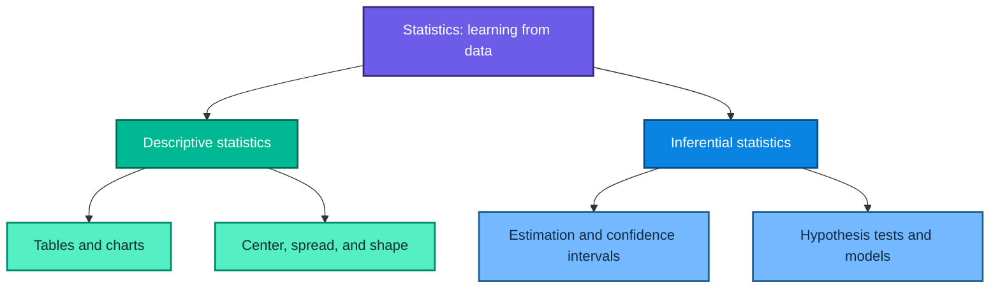
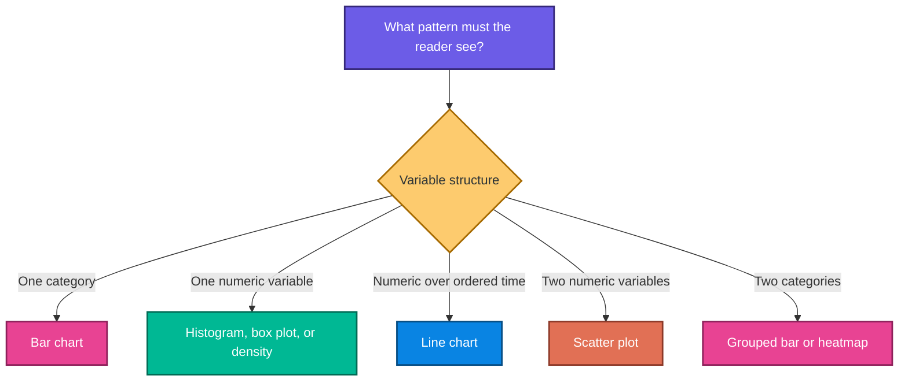
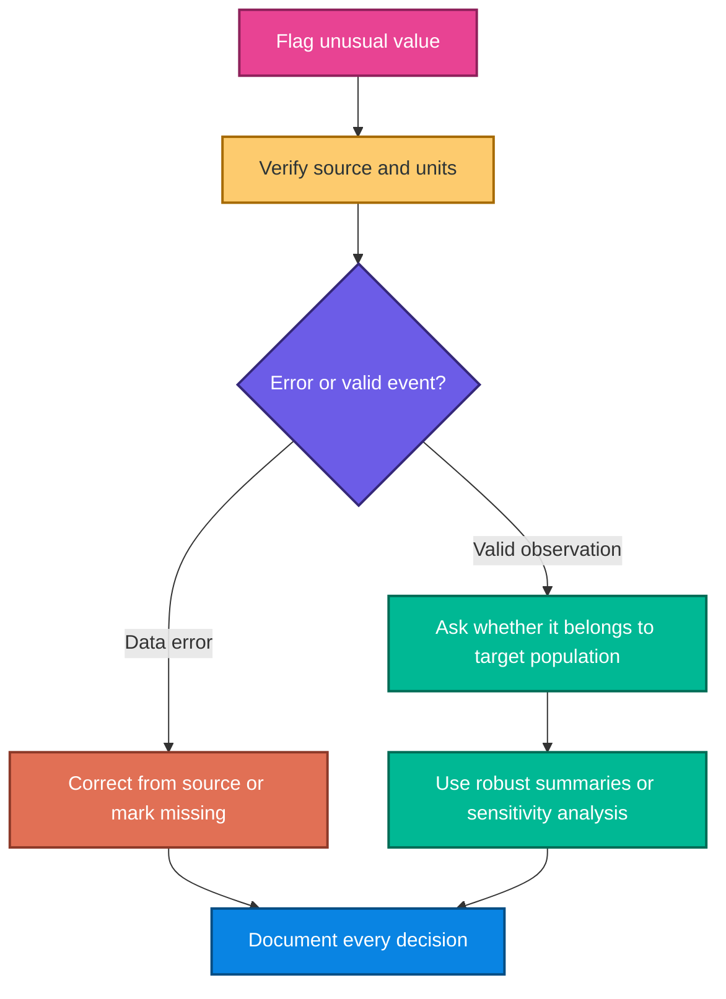
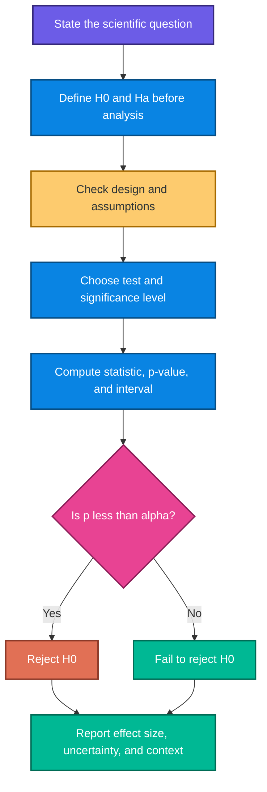
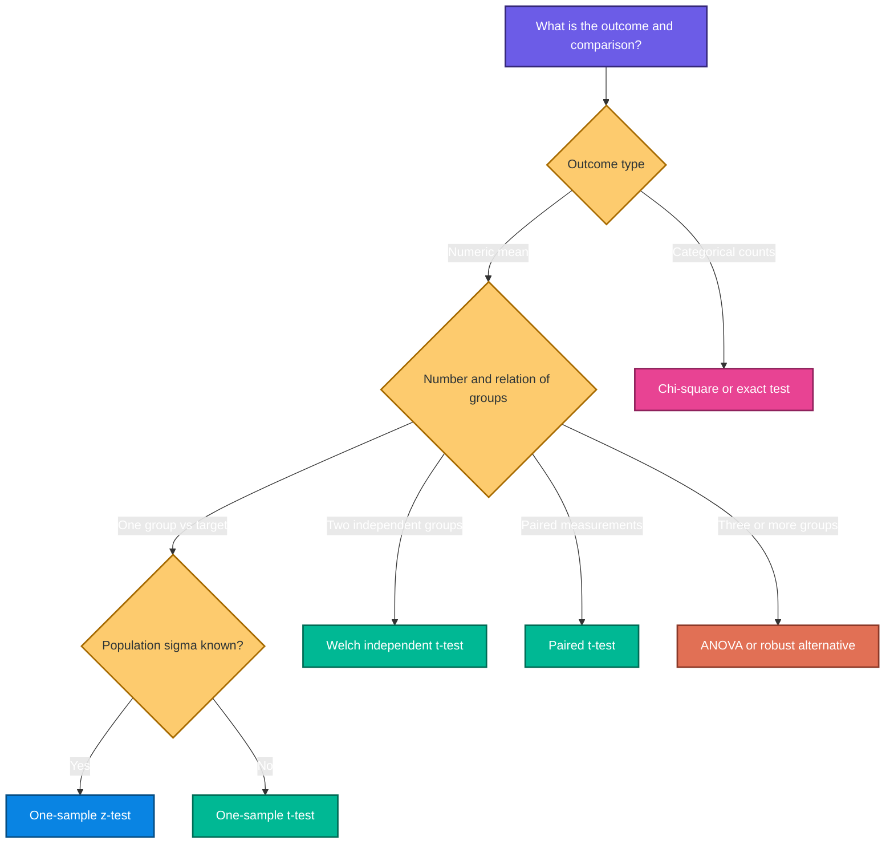
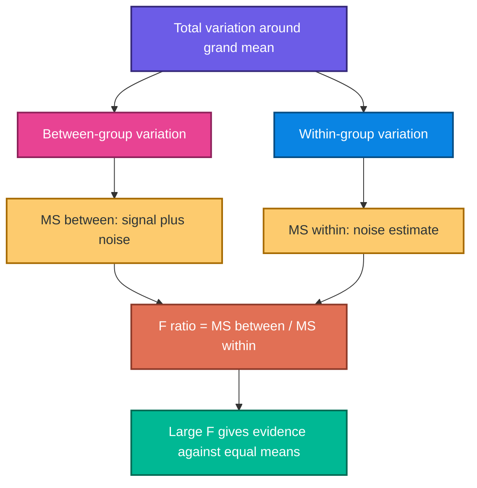

# Statistics and Hypothesis Testing with Python

> Detailed study notes based on the supplied `Statistics.pdf`, `outliers.ipynb`, `Ztest.ipynb`, `t-test.ipynb`, `ChiSquare.ipynb`, and `ANNOVA_test.ipynb` files.

These notes develop the material from intuition to formulas and executable Python. They explain **what** each concept means, **why** it is useful, **how** it works, **when** to use it, its assumptions and limitations, and the exact conclusions supported by the supplied notebook examples.

---

## Table of contents

1. [The big picture](#1-the-big-picture)
2. [Data, tables, and visualization](#2-data-tables-and-visualization)
3. [Measures of central tendency](#3-measures-of-central-tendency)
4. [Measures of spread](#4-measures-of-spread)
5. [Outliers and the five-number summary](#5-outliers-and-the-five-number-summary)
6. [Distributions, density curves, and z-scores](#6-distributions-density-curves-and-z-scores)
7. [Covariance and correlation](#7-covariance-and-correlation)
8. [Probability foundations](#8-probability-foundations)
9. [From descriptive to inferential statistics](#9-from-descriptive-to-inferential-statistics)
10. [Hypothesis-testing framework](#10-hypothesis-testing-framework)
11. [Choosing the correct statistical test](#11-choosing-the-correct-statistical-test)
12. [One-sample z-test](#12-one-sample-z-test)
13. [t-tests](#13-t-tests)
14. [Chi-square test of independence](#14-chi-square-test-of-independence)
15. [One-way ANOVA](#15-one-way-anova)
16. [Assumptions and diagnostics](#16-assumptions-and-diagnostics)
17. [Verified notebook results](#17-verified-notebook-results)
18. [Common mistakes and corrections](#18-common-mistakes-and-corrections)
19. [Practice questions with solutions](#19-practice-questions-with-solutions)
20. [Quick-reference cheat sheet](#20-quick-reference-cheat-sheet)

---

## 1. The big picture

### What is statistics?

Statistics is the discipline of learning from data while accounting for variation and uncertainty. It has two connected branches:

- **Descriptive statistics** organize and summarize the data actually observed.
- **Inferential statistics** use a sample to make uncertainty-aware statements about a larger population.



### Population, sample, parameter, and statistic

| Term | Meaning | Example |
|---|---|---|
| Population | entire group of interest | all students using a study app |
| Sample | observed subset of the population | 30 randomly selected users |
| Parameter | fixed but usually unknown population value | population mean $\mu$ |
| Statistic | value computed from the sample | sample mean $\bar{x}$ |

We observe statistics and use them to learn about parameters.

### Why uncertainty matters

Two random samples from the same population will usually have different means. Inferential statistics does not erase this sampling variation; it quantifies it.

> **Fun fact:** A large dataset can estimate a biased quantity very precisely. Sample size reduces random error, but it does not repair poor sampling, measurement error, confounding, or data leakage.

---

## 2. Data, tables, and visualization

### 2.1 One-way data tables

A data table has:

- **rows:** observations or individuals;
- **columns:** variables or features;
- **cells:** a value for one observation and one variable.

```python
import pandas as pd

# Each dictionary represents one observation.
people = pd.DataFrame(
    {
        "name": ["Aarav", "Sarthak", "Harsh", "Vedant"],
        "age": [22, 23, 24, 25],
        "salary_lakh": [5.0, 6.0, 7.0, 8.0],
        "gender": ["M", "M", "M", "M"],
    }
)

print(people)
```

`age` and `salary_lakh` are quantitative. `name` and `gender` are qualitative/categorical.

### 2.2 Frequency and relative-frequency tables

For category $c$, its frequency is:

$$
f_c=\sum_{i=1}^{n}\mathbf{1}(x_i=c)
$$

Its relative frequency is:

$$
r_c=\frac{f_c}{n}
$$

and its percentage is:

$$
100r_c\%
$$

```python
fruits = pd.Series(
    ["Apple", "Banana", "Apple", "Kiwi", "Mango", "Apple", "Banana"],
    name="fruit",
)

# Absolute counts answer "how many?"
frequency = fruits.value_counts()

# normalize=True divides every count by the total number of rows.
relative_frequency = fruits.value_counts(normalize=True)

summary = pd.DataFrame(
    {
        "frequency": frequency,
        "relative_frequency": relative_frequency,
        "percentage": 100 * relative_frequency,
    }
)

print(summary)
```

Because categories partition the observations:

$$
\sum_c r_c=1
$$

### 2.3 Two-way and joint-frequency tables

A two-way table cross-classifies observations by two categorical variables.

```python
survey = pd.DataFrame(
    {
        "flower": ["Rose", "Rose", "Lily", "Lily", "Rose", "Lily"],
        "color": ["Red", "White", "Red", "White", "Red", "White"],
    }
)

# margins=True adds row and column totals.
counts = pd.crosstab(
    survey["flower"],
    survey["color"],
    margins=True,
)

# Dividing by the grand total creates a joint relative-frequency table.
joint = pd.crosstab(
    survey["flower"],
    survey["color"],
    normalize="all",
)

print(counts)
print(joint)
```

For discrete variables $X$ and $Y$, a joint probability is $P(X=x,Y=y)$. Marginal probabilities are obtained by summing over the other variable:

$$
P(X=x)=\sum_y P(X=x,Y=y)
$$

### 2.4 Choosing a visualization



| Chart | What it shows | When to use | Main warning |
|---|---|---|---|
| Bar chart | category counts or summaries | comparing categories | label the aggregation |
| Pie chart | parts of one whole | very few categories | angles are hard to compare |
| Line chart | movement across ordered x-values | time or another natural order | do not imply order where none exists |
| Histogram | distribution through adjacent bins | one numeric variable | result depends on bin choice |
| Box plot | median, quartiles, spread, outliers | group distribution comparison | hides detailed shape |
| Scatter plot | paired numeric observations | association and clusters | overplotting can hide density |

Histogram bars touch because bins represent adjacent numeric intervals. Ordinary bar-chart categories are separate, so their bars usually have gaps.

---

## 3. Measures of central tendency

### 3.1 Mean

The population mean is:

$$
\mu=\frac{1}{N}\sum_{i=1}^{N}x_i
$$

The sample mean is:

$$
\bar{x}=\frac{1}{n}\sum_{i=1}^{n}x_i
$$

**Why:** it uses every observation and is algebraically convenient.  
**When:** the distribution is reasonably symmetric and extreme values do not dominate.  
**Limitation:** it is sensitive to outliers and skewness.

### 3.2 Median

The median is the middle ordered value. For even $n$, it is the mean of the two middle values.

**Why:** it describes a typical position robustly.  
**When:** data are skewed, ordinal, or contain legitimate extreme values.

### 3.3 Mode

The mode is the most frequent value or category. Data may be unimodal, bimodal, multimodal, or have no unique mode.

**When:** useful for categorical data and for identifying common values.

### Example: an outlier pulls the mean

```python
import numpy as np

data = np.array([1, 2, 4, 7, 9, 10, 101])

mean = np.mean(data)
median = np.median(data)

print(f"Mean: {mean:.2f}")      # 19.14
print(f"Median: {median:.2f}")  # 7.00
```

The large value 101 changes the mean dramatically but barely affects the median. The correct summary depends on the question; the median is not automatically “better.”

---

## 4. Measures of spread

Center alone cannot describe variability. Two datasets may have the same mean but very different dispersion.

### 4.1 Range

$$
\text{Range}=x_{\max}-x_{\min}
$$

It is easy to interpret but depends entirely on two observations.

### 4.2 Interquartile range

$$
IQR=Q_3-Q_1
$$

The IQR describes the width of the middle 50% of ordered observations. It is resistant to extreme tails.

### 4.3 Population variance and standard deviation

Population variance:

$$
\sigma^2=\frac{1}{N}\sum_{i=1}^{N}(x_i-\mu)^2
$$

Population standard deviation:

$$
\sigma=\sqrt{\sigma^2}
$$

### 4.4 Sample variance and standard deviation

Sample variance:

$$
s^2=\frac{1}{n-1}\sum_{i=1}^{n}(x_i-\bar{x})^2
$$

Sample standard deviation:

$$
s=\sqrt{s^2}
$$

The $n-1$ denominator is Bessel's correction. It compensates for estimating the unknown population mean with $\bar{x}$ and makes $s^2$ unbiased for $\sigma^2$ under standard random-sampling assumptions.

### Why square deviations?

Raw deviations sum to zero:

$$
\sum_{i=1}^{n}(x_i-\bar{x})=0
$$

Squaring prevents cancellation and penalizes large deviations strongly. Standard deviation then returns the spread to the original unit.

```python
values = np.array([85, 90, 95, 100, 105])

population_variance = np.var(values, ddof=0)
sample_variance = np.var(values, ddof=1)
population_std = np.std(values, ddof=0)
sample_std = np.std(values, ddof=1)

print(population_variance)  # 50.0
print(sample_variance)      # 62.5
print(population_std)       # approximately 7.071
print(sample_std)           # approximately 7.906
```

The PDF example divides by 5 and therefore treats the five values as the complete population. If the same values are a sample used to estimate a larger population variance, use `ddof=1`.

### Standard error is not standard deviation

For a sample mean:

$$
SE(\bar{x})=\frac{s}{\sqrt{n}}
$$

- $s$ describes variation among individual observations.
- $SE$ describes sampling uncertainty in the estimated mean.

---

## 5. Outliers and the five-number summary

### 5.1 Five-number summary

The five-number summary contains:

1. minimum;
2. first quartile $Q_1$;
3. median $Q_2$;
4. third quartile $Q_3$;
5. maximum.

A box plot turns these summaries into a visual display. Its whiskers commonly extend to the most extreme observations within the IQR fences, not necessarily all the way to the raw minimum and maximum.

### 5.2 IQR outlier rule

$$
LF=Q_1-1.5(IQR)
$$

$$
UF=Q_3+1.5(IQR)
$$

An observation below $LF$ or above $UF$ is flagged as a **potential** outlier.

### Supplied outlier notebook example

```python
import numpy as np

arr = np.array(
    [2, 3, 4, 6, 7, 8, 9, 12, 13, 16, 17, 23, 25, 27, 34, 37, 201]
)

# The method is stated explicitly because sample-quantile conventions differ.
q1, q3 = np.percentile(arr, [25, 75], method="linear")
iqr = q3 - q1

lower_fence = q1 - 1.5 * iqr
upper_fence = q3 + 1.5 * iqr

# Vectorized masks are clearer and faster than manually appending in a loop.
outlier_mask = (arr < lower_fence) | (arr > upper_fence)
outliers = arr[outlier_mask]
retained = arr[~outlier_mask]

print(f"Q1={q1}, Q3={q3}, IQR={iqr}")
print(f"Fences: [{lower_fence}, {upper_fence}]")
print(f"Flagged values: {outliers}")
print(f"Retained values: {retained}")
```

Results:

$$
Q_1=7,\quad Q_3=25,\quad IQR=18
$$

$$
LF=-20,\quad UF=52
$$

Only 201 is flagged.

### 5.3 Never delete an outlier automatically



Possible responses include correcting a known entry error, using median/IQR, applying a justified transformation, fitting a robust model, winsorizing under a predeclared rule, or reporting analyses with and without the value.

> **Fun fact:** For a perfectly normal population, the $1.5(IQR)$ rule corresponds to fences near $\pm2.70\sigma$, so even valid normal observations can occasionally be flagged.

---

## 6. Distributions, density curves, and z-scores

### 6.1 Distribution

A distribution describes which values a variable takes and how often or how plausibly they occur.

- A histogram estimates shape using bins.
- A frequency polygon connects bin-frequency points.
- A density curve is a smooth model whose total area is 1.

For a probability density $f(x)$:

$$
f(x)\geq0
$$

$$
\int_{-\infty}^{\infty}f(x)\,dx=1
$$

For a continuous variable, probability is area over an interval:

$$
P(a\leq X\leq b)=\int_a^b f(x)\,dx
$$

The height of a density curve at one point is not itself a probability.

### 6.2 Shape: symmetric and skewed

| Shape | Typical relation | Better summaries |
|---|---|---|
| Symmetric, unimodal | mean $\approx$ median | mean and standard deviation |
| Right-skewed | mean $>$ median | median and IQR |
| Left-skewed | mean $<$ median | median and IQR |
| Multimodal | one center may conceal groups | stratify or show full distribution |

Skewness is not always caused by outliers; it can be an intrinsic property of the population.

### 6.3 Normal distribution

The normal density is:

$$
f(x)=\frac{1}{\sigma\sqrt{2\pi}}
\exp\left[-\frac{(x-\mu)^2}{2\sigma^2}\right]
$$

It is symmetric about $\mu$, with spread controlled by $\sigma$.

The empirical rule is approximately:

- 68% within $\mu\pm1\sigma$;
- 95% within $\mu\pm2\sigma$;
- 99.7% within $\mu\pm3\sigma$.

These percentages apply to approximately normal distributions, not to arbitrary data.

### 6.4 Individual z-score

$$
z=\frac{x-\mu}{\sigma}
$$

A z-score measures signed distance from the mean in standard-deviation units:

- $z=0$: at the mean;
- $z=2$: two standard deviations above the mean;
- $z=-1.5$: 1.5 standard deviations below the mean.

```python
from scipy import stats
import numpy as np

values = np.array([1, 2, 3, 4, 5, 6, 7, 8, 9], dtype=float)

# ddof=0 standardizes relative to this array as a population.
z_values = stats.zscore(values, ddof=0)
print(z_values)
```

Do not confuse an individual z-score with a one-sample z-test statistic. The latter standardizes a **sample mean** using its standard error.

---

## 7. Covariance and correlation

### 7.1 Covariance

Sample covariance is:

$$
s_{XY}=\frac{1}{n-1}\sum_{i=1}^{n}(x_i-\bar{x})(y_i-\bar{y})
$$

- positive covariance: variables tend to move together;
- negative covariance: one tends to increase as the other decreases;
- near-zero covariance: little linear co-movement.

Its magnitude depends on units, so it is difficult to compare across datasets.

### 7.2 Pearson correlation

$$
r=\frac{s_{XY}}{s_Xs_Y}
$$

Equivalently:

$$
r=\frac{\sum_{i=1}^{n}(x_i-\bar{x})(y_i-\bar{y})}
{\sqrt{\sum_{i=1}^{n}(x_i-\bar{x})^2}
\sqrt{\sum_{i=1}^{n}(y_i-\bar{y})^2}}
$$

Correlation is unitless and satisfies $-1\leq r\leq1$.

```python
import pandas as pd

employees = pd.DataFrame(
    {
        "age": [22, 23, 24, 25, 26],
        "salary": [26, 34, 40, 45, 50],
    }
)

print(employees.cov())
print(employees.corr(method="pearson"))
```

### Limitations

- correlation measures linear association;
- outliers can change it dramatically;
- restricted ranges can weaken it;
- aggregating groups can reverse the apparent relation;
- correlation does not establish causation.

> **Fun fact:** Adding a constant or multiplying a variable by a positive constant changes covariance but not Pearson correlation.

---

## 8. Probability foundations

### 8.1 Sample space and events

The sample space $\Omega$ contains all possible outcomes. An event $A$ is a subset of $\Omega$.

For equally likely outcomes:

$$
P(A)=\frac{|A|}{|\Omega|}
$$

General probability obeys:

$$
0\leq P(A)\leq1
$$

$$
P(\Omega)=1
$$

### 8.2 Complement

$$
P(A^c)=1-P(A)
$$

“At least one” questions are often easiest through the complement.

### 8.3 Addition rule

$$
P(A\cup B)=P(A)+P(B)-P(A\cap B)
$$

The intersection is subtracted because it was counted twice.

If $A$ and $B$ are mutually exclusive, $P(A\cap B)=0$.

### 8.4 Conditional probability

$$
P(A\mid B)=\frac{P(A\cap B)}{P(B)},\qquad P(B)>0
$$

Conditioning changes the reference population from the entire sample space to outcomes inside $B$.

### 8.5 Independence

$A$ and $B$ are independent when:

$$
P(A\cap B)=P(A)P(B)
$$

Equivalently, when probabilities are nonzero:

$$
P(A\mid B)=P(A)
$$

Mutually exclusive events with positive probability are not independent: observing one makes the other impossible.

### 8.6 Bayes' theorem

$$
P(A\mid B)=\frac{P(B\mid A)P(A)}{P(B)}
$$

For mutually exclusive and exhaustive hypotheses $H_1,\ldots,H_k$:

$$
P(H_j\mid E)=
\frac{P(E\mid H_j)P(H_j)}
{\sum_{i=1}^{k}P(E\mid H_i)P(H_i)}
$$

#### Supplied PDF intuition: choose a die, then roll a six

Suppose a fair die and a biased die are equally likely to be selected:

$$
P(F)=P(B)=\frac{1}{2}
$$

The fair die rolls six with probability $1/6$, while the biased die rolls six with probability $1/2$:

$$
P(6\mid F)=\frac{1}{6},\qquad P(6\mid B)=\frac{1}{2}
$$

After observing a six:

$$
P(B\mid6)=
\frac{(1/2)(1/2)}{(1/2)(1/2)+(1/6)(1/2)}
=\frac{3}{4}
$$

The evidence updates the prior probability from 50% to 75%.

---

## 9. From descriptive to inferential statistics

### Descriptive versus inferential

| Feature | Descriptive | Inferential |
|---|---|---|
| Main question | What does this dataset show? | What may be true about the population? |
| Inputs | observed values | sample plus assumptions/design |
| Outputs | tables, charts, means, spreads | estimates, intervals, tests, models |
| Uncertainty | may be summarized | explicitly quantified |

### Sampling distribution

Imagine repeatedly taking samples of size $n$ and calculating $\bar{x}$ each time. The distribution of those means is the sampling distribution of $\bar{X}$.

Under independent sampling with finite population variance:

$$
E(\bar{X})=\mu
$$

$$
SD(\bar{X})=\frac{\sigma}{\sqrt{n}}
$$

The second quantity is the standard error when $\sigma$ is known.

### Central Limit Theorem intuition

Under suitable conditions, the sampling distribution of the mean becomes approximately normal as $n$ grows, even when individual observations are not normally distributed. “$n\geq30$” is only a rough classroom heuristic; the required size depends on skewness, tails, dependence, and outliers.

### Confidence interval

The generic form is:

$$
\text{estimate}\pm\text{critical value}\times\text{standard error}
$$

A 95% confidence procedure has 95% long-run coverage under its assumptions. It does not mean that a fixed parameter has a 95% probability of lying in one already-computed frequentist interval.

---

## 10. Hypothesis-testing framework

### 10.1 Core ideas

- $H_0$: null hypothesis, the reference claim tested.
- $H_a$: alternative hypothesis.
- $\alpha$: chosen Type I error rate.
- test statistic: standardized measure of discrepancy from $H_0$.
- p-value: probability, assuming $H_0$, of a result at least as extreme as the observed result in the direction(s) specified by $H_a$.

### 10.2 Workflow



### 10.3 Decision rule

$$
p<\alpha\quad\Rightarrow\quad\text{reject }H_0
$$

$$
p\geq\alpha\quad\Rightarrow\quad\text{fail to reject }H_0
$$

Failure to reject is not proof that $H_0$ is true. The study may have low power, high noise, a small sample, or a practically small effect.

### 10.4 One-tailed and two-tailed alternatives

| Alternative | Meaning | SciPy argument |
|---|---|---|
| $H_a:\mu\ne\mu_0$ | any difference | `alternative="two-sided"` |
| $H_a:\mu>\mu_0$ | specifically greater | `alternative="greater"` |
| $H_a:\mu<\mu_0$ | specifically less | `alternative="less"` |

Choose the direction before seeing results. A directional claim needs scientific justification; it should not be chosen merely to halve the p-value.

### 10.5 Type I and Type II errors

| Reality / Decision | Fail to reject $H_0$ | Reject $H_0$ |
|---|---|---|
| $H_0$ true | correct decision | Type I error |
| $H_0$ false | Type II error | correct detection |

$$
P(\text{Type I error})=\alpha
$$

$$
P(\text{Type II error})=\beta
$$

$$
\text{Power}=1-\beta
$$

Power generally increases with larger effects, larger samples, lower variability, better measurement, and a larger $\alpha$; however, increasing $\alpha$ also raises Type I error risk.

### 10.6 Statistical versus practical significance

A tiny effect can produce a tiny p-value with enough data. Report:

- the estimated effect;
- a confidence interval;
- an effect-size measure;
- units and real-world relevance;
- sample size and design limitations.

---

## 11. Choosing the correct statistical test



This is a starting guide, not a substitute for study design. Independence, repeated measures, clustering, unequal variances, non-normality, small expected counts, censoring, and covariates can require different methods.

---

## 12. One-sample z-test

### What does it test?

For a population mean with known population standard deviation $\sigma$:

$$
H_0:\mu=\mu_0
$$

The test statistic is:

$$
z=\frac{\bar{x}-\mu_0}{\sigma/\sqrt{n}}
$$

### Why and when?

Use a one-sample z-test when:

- observations are independent;
- the outcome is quantitative;
- the population standard deviation is genuinely known, or a justified large-sample approximation is being used;
- the sampling distribution of $\bar{X}$ is normal or approximately normal.

Sample size alone does not make an estimated sample standard deviation become known population $\sigma$.

### Supplied z-test notebook example

```python
import numpy as np
from scipy.stats import norm

sample = np.array([172, 174, 168, 169, 171, 173, 175, 170, 169, 172])
population_mean = 170
population_std = 3
n = len(sample)

sample_mean = np.mean(sample)
standard_error = population_std / np.sqrt(n)
z_statistic = (sample_mean - population_mean) / standard_error

# sf(x) = 1 - cdf(x), and is numerically stable in the upper tail.
p_value = 2 * norm.sf(abs(z_statistic))

alpha = 0.05
decision = "Reject H0" if p_value < alpha else "Fail to reject H0"

print(f"mean={sample_mean:.3f}")
print(f"z={z_statistic:.4f}")
print(f"p={p_value:.4f}")
print(decision)
```

Results:

$$
\bar{x}=171.3,\quad z=1.3703,\quad p=0.1706
$$

At $\alpha=0.05$, fail to reject $H_0$. The data do not provide sufficient evidence that the population mean differs from 170 under the test assumptions.

### z confidence interval when $\sigma$ is known

$$
\bar{x}\pm z_{1-\alpha/2}\frac{\sigma}{\sqrt{n}}
$$

For 95% confidence, $z_{0.975}\approx1.96$.

---

## 13. t-tests

### 13.1 Why use the t distribution?

When population $\sigma$ is unknown, replacing it with sample $s$ adds uncertainty. The t distribution has heavier tails than the standard normal. As degrees of freedom grow, it approaches the normal distribution.

### 13.2 One-sample t-test

$$
t=\frac{\bar{x}-\mu_0}{s/\sqrt{n}}
$$

$$
df=n-1
$$

#### Supplied t-test notebook example

```python
import numpy as np
from scipy import stats

sample = np.array([172, 174, 168, 169, 171, 173, 175, 170, 169, 172])
population_mean = 170

# SciPy computes the statistic and the two-sided p-value directly.
result = stats.ttest_1samp(
    sample,
    popmean=population_mean,
    alternative="two-sided",
)

# A confidence interval communicates estimation uncertainty.
confidence_interval = result.confidence_interval(confidence_level=0.95)

sample_mean = sample.mean()
sample_std = sample.std(ddof=1)
cohens_d = (sample_mean - population_mean) / sample_std

print(f"mean={sample_mean:.3f}, s={sample_std:.3f}")
print(f"t({len(sample) - 1})={result.statistic:.4f}")
print(f"p={result.pvalue:.4f}")
print(confidence_interval)
print(f"Cohen's d={cohens_d:.3f}")
```

Verified results:

$$
\bar{x}=171.3,\quad s=2.3118,\quad SE=0.7311
$$

$$
t(9)=1.7782,\quad p=0.1091
$$

$$
95\%\ CI=[169.646,172.954]
$$

The interval includes 170, consistent with failing to reject $H_0$ at 5%.

### 13.3 One-sample Cohen's $d$

$$
d=\frac{\bar{x}-\mu_0}{s}
$$

For this sample, $d\approx0.562$. Effect-size labels such as “small” or “medium” are context-dependent; domain consequences matter more than universal cutoffs.

### 13.4 Independent two-sample t-test

For two independent groups, Welch's test is usually a safe default because it does not assume equal population variances:

$$
t=\frac{\bar{x}_1-\bar{x}_2}
{\sqrt{\frac{s_1^2}{n_1}+\frac{s_2^2}{n_2}}}
$$

Welch-Satterthwaite degrees of freedom are:

$$
\nu=\frac{\left(\frac{s_1^2}{n_1}+\frac{s_2^2}{n_2}\right)^2}
{\frac{(s_1^2/n_1)^2}{n_1-1}+\frac{(s_2^2/n_2)^2}{n_2-1}}
$$

```python
group_a = np.array([72, 75, 78, 69, 74, 77], dtype=float)
group_b = np.array([68, 70, 71, 67, 72, 69], dtype=float)

result = stats.ttest_ind(
    group_a,
    group_b,
    equal_var=False,  # Welch's test
    alternative="two-sided",
)

print(result)
```

Use `equal_var=True` only when the pooled-variance model is scientifically justified.

### 13.5 Paired t-test

For before/after or matched observations, analyze within-pair differences $d_i$:

$$
t=\frac{\bar{d}}{s_d/\sqrt{n}}
$$

```python
before = np.array([78, 82, 75, 90, 84], dtype=float)
after = np.array([74, 79, 73, 85, 80], dtype=float)

# The order must align: before[i] and after[i] belong to the same person.
result = stats.ttest_rel(before, after, alternative="two-sided")
print(result)
```

Using an independent test for paired data discards pairing information and usually misstates uncertainty.

---

## 14. Chi-square test of independence

### 14.1 What does it test?

The chi-square test of independence examines whether two categorical variables are associated.

$$
H_0:\text{the variables are independent}
$$

$$
H_a:\text{the variables are associated}
$$

### 14.2 Expected frequencies

For row $i$ and column $j$:

$$
E_{ij}=\frac{(\text{row total}_i)(\text{column total}_j)}{\text{grand total}}
$$

The Pearson chi-square statistic is:

$$
\chi^2=\sum_i\sum_j\frac{(O_{ij}-E_{ij})^2}{E_{ij}}
$$

Degrees of freedom:

$$
df=(r-1)(c-1)
$$

### 14.3 Titanic notebook example

The observed table in the notebook is:

| Sex | Did not survive | Survived | Total |
|---|---:|---:|---:|
| Female | 81 | 233 | 314 |
| Male | 468 | 109 | 577 |
| Total | 549 | 342 | 891 |

```python
import numpy as np
import pandas as pd
from scipy.stats import chi2_contingency

observed = pd.DataFrame(
    [[81, 233], [468, 109]],
    index=["female", "male"],
    columns=["not_survived", "survived"],
)

# correction=True applies Yates' continuity correction for this 2 x 2 table,
# matching the supplied notebook's SciPy default and reported statistic.
chi2, p_value, dof, expected = chi2_contingency(
    observed,
    correction=True,
)

# Cramer's V summarizes association strength.
n = observed.to_numpy().sum()
min_dimension = min(observed.shape[0] - 1, observed.shape[1] - 1)
cramers_v = np.sqrt(chi2 / (n * min_dimension))

expected_table = pd.DataFrame(
    expected,
    index=observed.index,
    columns=observed.columns,
)

print(expected_table)
print(f"chi2={chi2:.4f}, df={dof}, p={p_value:.3e}")
print(f"Cramer's V={cramers_v:.3f}")
```

Verified results:

$$
\chi^2(1)=260.7170,\quad p\approx1.20\times10^{-58}
$$

$$
V=\sqrt{\frac{\chi^2}{n\min(r-1,c-1)}}\approx0.541
$$

At $\alpha=0.05$, reject independence. Sex and recorded survival are associated in this dataset. The test does not identify causality or explain the historical mechanisms.

The direction becomes visible through conditional proportions:

$$
P(\text{survived}\mid\text{female})=\frac{233}{314}\approx74.2\%
$$

$$
P(\text{survived}\mid\text{male})=\frac{109}{577}\approx18.9\%
$$

### 14.4 Assumptions and alternatives

- observations are independent;
- cells contain counts, not percentages;
- categories are mutually exclusive;
- expected counts are sufficiently large for the approximation.

All expected counts in this example exceed 5. For small $2\times2$ tables, consider Fisher's exact test. For paired binary data, use McNemar's test instead of treating pairs as independent.

### What significance does not tell you

A chi-square p-value does not state:

- which cells drive the result;
- the effect direction;
- practical importance;
- causation.

Inspect standardized residuals, conditional percentages, and an effect size.

---

## 15. One-way ANOVA

### 15.1 What and when?

One-way analysis of variance compares the population means of $k\geq2$ independent groups.

$$
H_0:\mu_1=\mu_2=\cdots=\mu_k
$$

$$
H_a:\text{not all population means are equal}
$$

Rejecting $H_0$ means at least one mean differs. It does not say every mean differs or identify the differing pair.

### 15.2 Variance-partition intuition



### 15.3 Sums of squares

Let $\bar{x}_j$ and $n_j$ be the mean and size of group $j$, and let $\bar{x}_{..}$ be the grand mean.

Between-group sum of squares:

$$
SS_B=\sum_{j=1}^{k}n_j(\bar{x}_j-\bar{x}_{..})^2
$$

Within-group sum of squares:

$$
SS_W=\sum_{j=1}^{k}\sum_{i=1}^{n_j}(x_{ij}-\bar{x}_j)^2
$$

Total decomposition:

$$
SS_T=SS_B+SS_W
$$

Mean squares and F statistic:

$$
MS_B=\frac{SS_B}{k-1}
$$

$$
MS_W=\frac{SS_W}{N-k}
$$

$$
F=\frac{MS_B}{MS_W}
$$

### 15.4 Titanic age by passenger class

```python
import seaborn as sns
from scipy import stats

# Seaborn may download this example dataset on first use.
titanic = sns.load_dataset("titanic")

# Keep only complete observations for the two variables being analyzed.
analysis = titanic[["age", "pclass"]].dropna()

groups = [
    group["age"].to_numpy()
    for _, group in analysis.groupby("pclass", observed=True)
]

# Classical one-way ANOVA assumes equal population variances.
anova = stats.f_oneway(*groups, equal_var=True)

# Compute eta-squared directly from sums of squares.
grand_mean = analysis["age"].mean()
ss_between = sum(
    len(group) * (group.mean() - grand_mean) ** 2
    for group in groups
)
ss_total = ((analysis["age"] - grand_mean) ** 2).sum()
eta_squared = ss_between / ss_total

print(analysis.groupby("pclass", observed=True)["age"].agg(["count", "mean", "std"]))
print(f"F={anova.statistic:.4f}, p={anova.pvalue:.3e}")
print(f"eta_squared={eta_squared:.3f}")
```

Supplied-notebook result:

$$
F(2,711)=57.4435,\quad p=7.488\times10^{-24}
$$

Using the F statistic and degrees of freedom:

$$
\eta^2=\frac{Fdf_B}{Fdf_B+df_W}\approx0.139
$$

Reject equal mean ages across passenger classes. Approximately 13.9% of observed age variation is associated with passenger-class group membership in this one-factor decomposition. This is not a causal estimate.

### 15.5 What happens next?

An omnibus ANOVA result does not identify which pairs differ. Use a prespecified contrast or a multiple-comparison method such as Tukey HSD.

```python
# Tukey's HSD controls the family-wise error rate for pairwise comparisons.
tukey = stats.tukey_hsd(*groups)
print(tukey)
```

If equal variances are doubtful, use Welch's ANOVA in recent SciPy:

```python
welch_anova = stats.f_oneway(*groups, equal_var=False)
print(welch_anova)
```

If ordinal data, severe non-normality, or outliers make a mean-based model unsuitable, consider Kruskal-Wallis; however, remember that it answers a different rank/distribution question and still needs post-hoc analysis after rejection.

---

## 16. Assumptions and diagnostics

### 16.1 Independence comes from design

No histogram or normality test can prove observations are independent. Ask:

- Was sampling random or representative?
- Does one person contribute multiple rows?
- Are observations clustered by classroom, hospital, family, or time?
- Were treatment groups randomized?

Ignoring dependence usually makes standard errors too small.

### 16.2 Normality

t-tests and ANOVA concern the sampling distribution of means and model residuals, not whether the raw histogram looks perfectly bell-shaped. Inspect:

- Q-Q plots;
- residuals by group;
- skewness and extreme values;
- sample size and balance;
- subject-matter plausibility.

```python
import matplotlib.pyplot as plt
from scipy import stats

sample = np.array([172, 174, 168, 169, 171, 173, 175, 170, 169, 172])

fig, ax = plt.subplots(figsize=(6, 5))
stats.probplot(sample, dist="norm", plot=ax)
ax.set_title("Normal Q-Q plot")
plt.show()

shapiro = stats.shapiro(sample)
print(shapiro)
```

A non-significant Shapiro-Wilk result does not prove normality, especially in a small sample where the test has low power. A significant result in a huge sample can detect a deviation too small to matter.

### 16.3 Equal variances

```python
# For multiple groups, median-centered Levene is relatively robust.
levene = stats.levene(*groups, center="median")
print(levene)
```

If equal variances are implausible:

- use Welch's independent t-test for two groups;
- use Welch's ANOVA for several groups;
- report group spreads and sample sizes.

### 16.4 Expected counts for chi-square

Inspect the returned `expected` matrix. Very small expected counts undermine the chi-square approximation. Combine categories only when scientifically defensible, not merely to obtain significance.

### 16.5 Multiple testing

If $m$ independent null hypotheses are each tested at level $\alpha$, the chance of at least one false rejection is:

$$
1-(1-\alpha)^m
$$

For $m=20$ and $\alpha=0.05$:

$$
1-0.95^{20}\approx0.642
$$

Use planned hypotheses or corrections such as Bonferroni, Holm, or false-discovery-rate control when many tests address one family of questions.

---

## 17. Verified notebook results

| Source | Test/calculation | Statistic | p-value | Correct conclusion at $\alpha=0.05$ |
|---|---|---:|---:|---|
| `outliers.ipynb` | IQR fences | $LF=-20$, $UF=52$ | not applicable | flag 201; investigate before removal |
| `Ztest.ipynb` | two-sided one-sample z | $z=1.3703$ | 0.1706 | fail to reject $\mu=170$ |
| `t-test.ipynb` | two-sided one-sample t | $t(9)=1.7782$ | 0.1091 | fail to reject $\mu=170$ |
| `ChiSquare.ipynb` | chi-square independence with Yates correction | $\chi^2(1)=260.7170$ | $1.20\times10^{-58}$ | reject independence; association exists |
| `ANNOVA_test.ipynb` | classical one-way ANOVA | $F(2,711)=57.4435$ | $7.49\times10^{-24}$ | at least one class mean age differs |

### Why z and t differ for the same sample

The z-test uses the supplied population standard deviation $\sigma=3$:

$$
SE_z=\frac{3}{\sqrt{10}}\approx0.9487
$$

The t-test estimates spread from the sample, $s\approx2.3118$:

$$
SE_t=\frac{2.3118}{\sqrt{10}}\approx0.7311
$$

It also evaluates the statistic against a $t_9$ distribution with heavier tails. Different standard errors and reference distributions produce different statistics and p-values.

---

## 18. Common mistakes and corrections

### 18.1 “Accept the null hypothesis”

Use **fail to reject $H_0$**. A large p-value means the data are not sufficiently incompatible with $H_0$ under the model; it does not prove $H_0$.

### 18.2 “Use z for $n>30$, t for $n<30$”

The main distinction is whether population $\sigma$ is known and which sampling model is justified. With unknown $\sigma$, a t procedure remains appropriate at large $n$; its distribution simply becomes close to normal.

### 18.3 p-value as the probability $H_0$ is true

The p-value is $P(\text{data at least as extreme}\mid H_0)$, not $P(H_0\mid\text{data})$.

### 18.4 p-value as effect size

The p-value combines effect, noise, sample size, and assumptions. Report an effect estimate and interval.

### 18.5 Removing every box-plot outlier

The IQR rule flags values for investigation. Valid rare cases may contain the most important signal.

### 18.6 Correlation as causation

Correlation alone cannot separate cause, reverse causation, confounding, or selection bias.

### 18.7 ANOVA rejection means every group differs

ANOVA only establishes that not all means are equal. Use post-hoc comparisons or planned contrasts.

### 18.8 Chi-square uses percentages as cells

The test needs observed counts. Percentages can be displayed for interpretation after the count-based test.

### 18.9 Choosing one-tailed after seeing the data

This inflates false-positive risk. Specify the alternative before inspecting results.

### 18.10 Ignoring Yates correction in a $2\times2$ comparison

SciPy's `chi2_contingency` applies a continuity correction by default when degrees of freedom equal 1. State whether `correction=True` or `False`, because the statistic changes.

---

## 19. Practice questions with solutions

### Question 1: mean and median under an outlier

For $[2,3,4,5,100]$, compute the mean and median. Which better represents a typical value?

#### Solution 1

$$
\bar{x}=\frac{2+3+4+5+100}{5}=22.8
$$

The ordered middle value is 4, so the median is 4. The median better describes the center of the four clustered values, while the mean reflects the total magnitude including 100. Report both if the extreme value is substantively meaningful.

### Question 2: IQR outlier rule

For the supplied notebook array, $Q_1=7$ and $Q_3=25$. Is 52 an outlier? Is 53?

#### Solution 2

$$
IQR=25-7=18
$$

$$
UF=25+1.5(18)=52
$$

Under the usual strict rule, values **above** 52 are flagged. Therefore, 52 is not flagged and 53 is.

### Question 3: z-score

A score is 95 in a population with $\mu=80$ and $\sigma=5$. Find its z-score.

#### Solution 3

$$
z=\frac{95-80}{5}=3
$$

The score is three population standard deviations above the mean.

### Question 4: union probability

Suppose $P(A)=0.60$, $P(B)=0.50$, and $P(A\cap B)=0.30$. Find $P(A\cup B)$.

#### Solution 4

$$
P(A\cup B)=0.60+0.50-0.30=0.80
$$

### Question 5: independence

Using the values in Question 4, are $A$ and $B$ independent?

#### Solution 5

$$
P(A)P(B)=0.60(0.50)=0.30=P(A\cap B)
$$

Yes, these probabilities satisfy the independence condition.

### Question 6: Bayes' theorem

In the fair-versus-biased die example, what is the posterior probability of the biased die after rolling a six?

#### Solution 6

$$
P(B\mid6)=
\frac{(1/2)(1/2)}{(1/2)(1/2)+(1/6)(1/2)}
=0.75
$$

### Question 7: interpret the z-test

The supplied z-test yields $p=0.1706$ at $\alpha=0.05$. What should be concluded?

#### Solution 7

Because $0.1706>0.05$, fail to reject $H_0$. The sample does not provide sufficient evidence that the population mean differs from 170. Do not say the population mean has been proven equal to 170.

### Question 8: interpret the t confidence interval

The 95% interval is $[169.646,172.954]$. Is $\mu_0=170$ compatible with the two-sided 5% test?

#### Solution 8

Yes. Because 170 lies inside the 95% interval, the corresponding two-sided test fails to reject $H_0:\mu=170$ at $\alpha=0.05$.

### Question 9: select a t-test

The same 25 patients have blood pressure measured before and after treatment. Which test compares the means?

#### Solution 9

Use a paired t-test because measurements are linked within the same patient. Analyze the 25 within-person differences.

### Question 10: chi-square expected count

In the Titanic table, the female row total is 314, the “survived” column total is 342, and $N=891$. Find the expected female-survived count under independence.

#### Solution 10

$$
E=\frac{314\times342}{891}\approx120.525
$$

The observed count is 233, far above this independence expectation.

### Question 11: chi-square interpretation

Does the Titanic chi-square result prove that sex caused survival?

#### Solution 11

No. It provides strong evidence of association in the recorded dataset. Causal interpretation requires historical and design context, consideration of confounding variables, and a defensible causal framework.

### Question 12: ANOVA interpretation

$F(2,711)=57.44$ with $p<0.001$. Does this prove all three class mean ages differ?

#### Solution 12

No. It rejects the claim that all means are equal. Follow with Tukey HSD or planned contrasts to identify supported pairwise differences.

### Question 13: Type I error

What is a Type I error when testing whether a new study app changes mean scores?

#### Solution 13

A Type I error occurs when the analysis concludes that the app changes the population mean even though, under the defined estimand and model, it truly does not.

### Question 14: multiple testing

Why is testing 20 outcomes separately at $\alpha=0.05$ dangerous?

#### Solution 14

Under independent true nulls, the chance of at least one false rejection is:

$$
1-0.95^{20}\approx64.2\%
$$

Use a prespecified primary outcome or a multiple-testing correction.

### Question 15: test-selection challenge

You compare a categorical preference across three independent regions. Which family of test is appropriate?

#### Solution 15

Construct a region-by-preference contingency table and use a chi-square test of independence if expected counts are adequate. The outcome is categorical, so ANOVA is not appropriate.

---

## 20. Quick-reference cheat sheet

### Descriptive formulas

| Quantity | Formula |
|---|---|
| Mean | $\bar{x}=\frac{1}{n}\sum x_i$ |
| Range | $x_{\max}-x_{\min}$ |
| IQR | $Q_3-Q_1$ |
| Sample variance | $s^2=\frac{1}{n-1}\sum(x_i-\bar{x})^2$ |
| Sample standard deviation | $s=\sqrt{s^2}$ |
| Standard error of mean | $SE=s/\sqrt{n}$ |
| Individual z-score | $z=(x-\mu)/\sigma$ |
| Pearson correlation | $r=s_{XY}/(s_Xs_Y)$ |

### Test comparison

| Test | Outcome | Comparison | Core statistic |
|---|---|---|---|
| One-sample z | numeric | one mean vs target, $\sigma$ known | $z=(\bar{x}-\mu_0)/(\sigma/\sqrt{n})$ |
| One-sample t | numeric | one mean vs target, $\sigma$ unknown | $t=(\bar{x}-\mu_0)/(s/\sqrt{n})$ |
| Welch t | numeric | two independent means | standardized mean difference |
| Paired t | numeric differences | two linked measurements | one-sample t on differences |
| Chi-square independence | counts | two categorical variables | $\sum(O-E)^2/E$ |
| One-way ANOVA | numeric | three or more independent means | $F=MS_B/MS_W$ |

### Python functions

| Goal | Function |
|---|---|
| Mean and standard deviation | `np.mean`, `np.std(ddof=1)` |
| Percentiles | `np.percentile(..., method="linear")` |
| z probability | `scipy.stats.norm.cdf` / `norm.sf` |
| One-sample t | `scipy.stats.ttest_1samp` |
| Independent t | `scipy.stats.ttest_ind(equal_var=False)` |
| Paired t | `scipy.stats.ttest_rel` |
| Chi-square independence | `scipy.stats.chi2_contingency` |
| Classical/Welch ANOVA | `scipy.stats.f_oneway(equal_var=True/False)` |
| Tukey HSD | `scipy.stats.tukey_hsd` |
| Normality check | `scipy.stats.shapiro`, `stats.probplot` |
| Variance check | `scipy.stats.levene` |

### Final reporting checklist

- [ ] State the population, sample, variables, and units.
- [ ] Define $H_0$ and $H_a$ before examining results.
- [ ] Explain why the test matches the design.
- [ ] Check independence and relevant distributional assumptions.
- [ ] Report the statistic, degrees of freedom, and p-value.
- [ ] Report an effect estimate and confidence interval when possible.
- [ ] Include an effect size with contextual interpretation.
- [ ] Say “fail to reject,” not “accept,” when $p\geq\alpha$.
- [ ] Distinguish association from causation.
- [ ] Document exclusions, transformations, and outlier decisions.

---

## Official documentation

- [SciPy statistical functions](https://docs.scipy.org/doc/scipy/reference/stats.html)
- [SciPy one-sample t-test](https://docs.scipy.org/doc/scipy/reference/generated/scipy.stats.ttest_1samp.html)
- [SciPy independent t-test](https://docs.scipy.org/doc/scipy/reference/generated/scipy.stats.ttest_ind.html)
- [SciPy chi-square contingency test](https://docs.scipy.org/doc/scipy/reference/generated/scipy.stats.chi2_contingency.html)
- [SciPy one-way and Welch ANOVA](https://docs.scipy.org/doc/scipy/reference/generated/scipy.stats.f_oneway.html)
- [SciPy Levene test](https://docs.scipy.org/doc/scipy/reference/generated/scipy.stats.levene.html)
- [SciPy Shapiro-Wilk test](https://docs.scipy.org/doc/scipy/reference/generated/scipy.stats.shapiro.html)
- [NumPy percentiles and quantile methods](https://numpy.org/doc/stable/reference/generated/numpy.percentile.html)

---

> **Core intuition:** A statistical test is not a machine that certifies truth. It measures how incompatible the observed data are with a precisely defined null model. Reliable conclusions still depend on the sampling design, assumptions, effect size, uncertainty, and the real question being asked.
