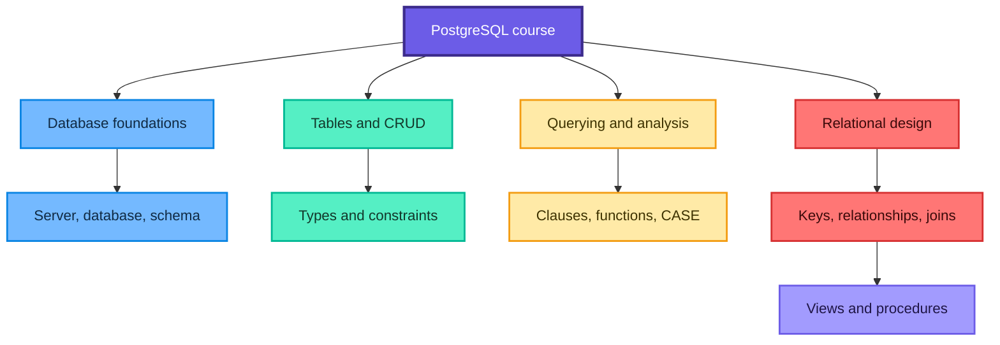
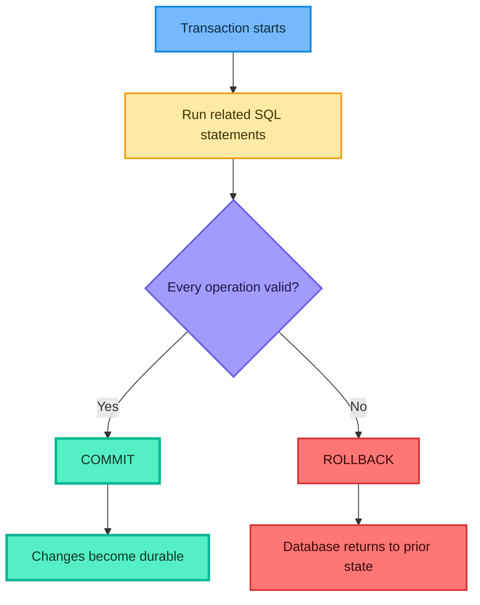
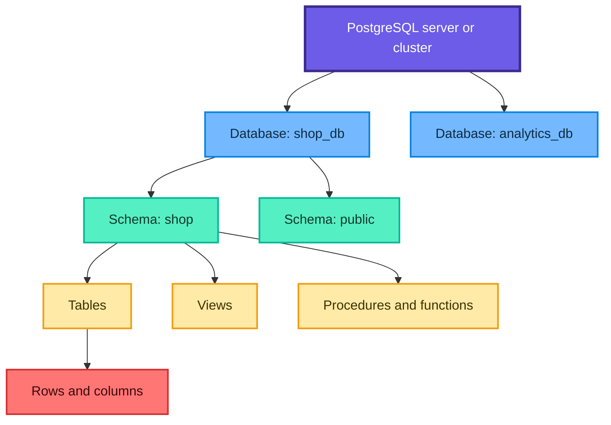
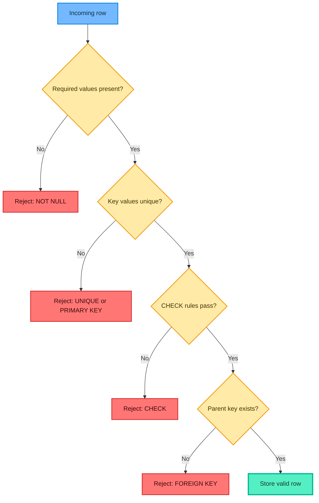
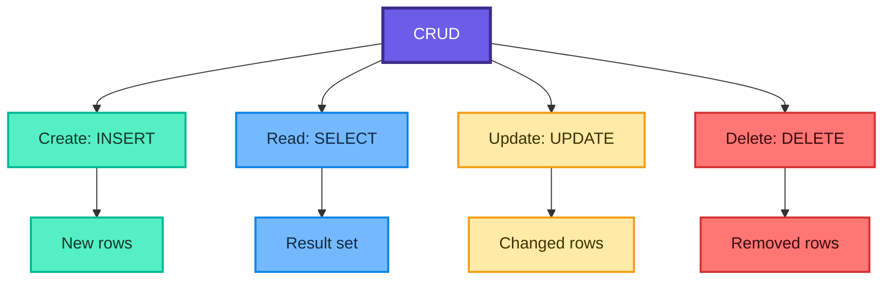
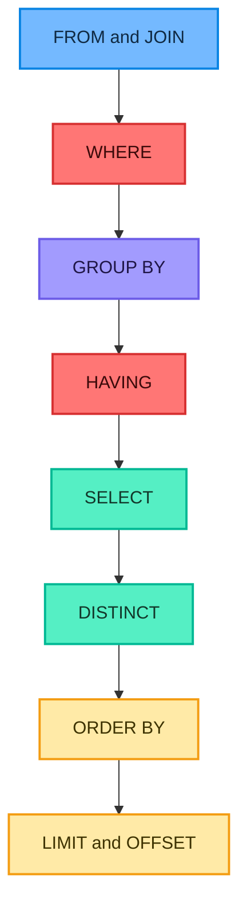
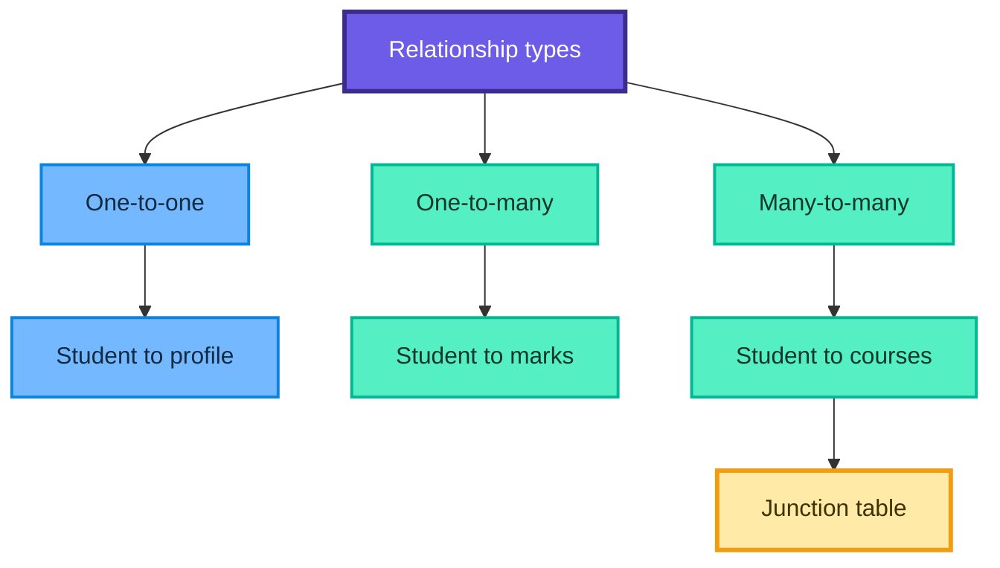
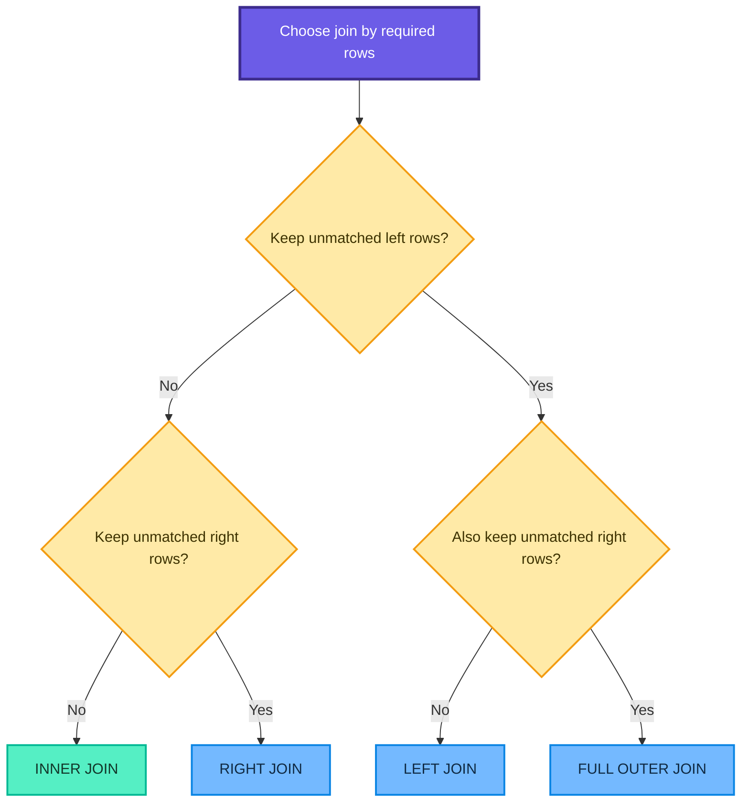
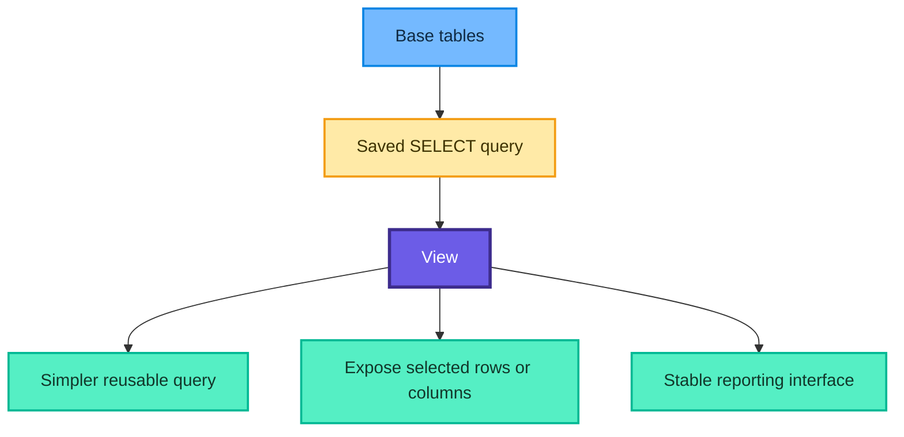

# PostgreSQL and SQL Complete Course Notes

These notes transform the supplied five-hour YouTube transcript, 151-page slide deck, and `sql.md` exercise sheet into a structured PostgreSQL learning guide. The goal is not only to memorize query syntax, but to understand **what** each concept means, **why** it exists, **how** it works, **when** to use it, and what can go wrong.

> Core idea: a database is valuable because it keeps data organized, related, valid, searchable, and safe while many users and applications work with it.

## Learning roadmap



## Contents

1. [Database foundations](#1-database-foundations)
2. [Why PostgreSQL?](#2-why-postgresql)
3. [Installation and tools](#3-installation-and-tools)
4. [PostgreSQL object hierarchy](#4-postgresql-object-hierarchy)
5. [SQL command families](#5-sql-command-families)
6. [Creating the learning database](#6-creating-the-learning-database)
7. [Data types](#7-data-types)
8. [Constraints and data integrity](#8-constraints-and-data-integrity)
9. [CRUD operations](#9-crud-operations)
10. [Clauses and logical query processing](#10-clauses-and-logical-query-processing)
11. [Operators and filtering](#11-operators-and-filtering)
12. [Aggregate functions](#12-aggregate-functions)
13. [String functions](#13-string-functions)
14. [ALTER TABLE](#14-alter-table)
15. [CASE expressions](#15-case-expressions)
16. [Relational design and keys](#16-relational-design-and-keys)
17. [One-to-one, one-to-many, and many-to-many](#17-one-to-one-one-to-many-and-many-to-many)
18. [SQL joins](#18-sql-joins)
19. [Views](#19-views)
20. [Stored procedures](#20-stored-procedures)
21. [CSV import](#21-csv-import)
22. [End-to-end product analysis](#22-end-to-end-product-analysis)
23. [Practice questions with solutions](#23-practice-questions-with-solutions)
24. [Quick revision sheet](#24-quick-revision-sheet)

## 1. Database foundations

### 1.1 What is data?

Data is a recorded fact or observation: a product price, student name, order date, stock quantity, or payment method. Raw values become useful only when they are given structure and meaning.

### 1.2 What is a database?

A **database** is an organized electronic collection of data that can be stored, retrieved, updated, and managed. Think of a carefully organized digital notebook, but with rules, relationships, concurrent access, security, and a query language.

For a student table:

| `student_id` | `student_name` | `age` | `grade` |
|---:|---|---:|---|
| 1 | Akarsh | 20 | A |
| 2 | Anjali | 21 | B |
| 3 | Raj | 22 | A |

- A **row** represents one record, such as one student.
- A **column** represents one attribute, such as age.
- A **table** stores records of one entity type.
- A **schema** organizes tables and other objects.

If a table has $n$ rows and $p$ columns, it contains $n\times p$ logical field positions, although physical storage also includes metadata, indexes, null maps, and internal row information.

### 1.3 What is SQL?

SQL stands for **Structured Query Language**. It is the language used to define, read, insert, update, delete, and control relational data.

SQL is declarative: you state **what** result you want, and the database optimizer chooses an execution plan for **how** to obtain it.

```sql
-- Ask for the names of available products costing less than INR 1,000.
SELECT product_name
FROM products
WHERE is_available = TRUE
  AND price < 1000;
```

### 1.4 What is an RDBMS?

RDBMS means **Relational Database Management System**. It is software that:

- stores data in relations, commonly presented as tables;
- connects tables using keys;
- validates data using constraints;
- processes SQL queries;
- manages transactions, security, concurrency, and recovery.

PostgreSQL, MySQL, SQLite, Oracle Database, and SQL Server are relational database systems. SQL is the language family; PostgreSQL is one system that implements and extends it.

### 1.5 SQL versus NoSQL

"NoSQL" does not mean "SQL is forbidden." It refers to database models that are not primarily traditional relational tables, such as document, key-value, wide-column, and graph systems.

| Concern | Relational SQL system | Document-style NoSQL system |
|---|---|---|
| Main model | Tables and relationships | Documents or objects |
| Structure | Explicit schema and types | Often flexible document shape |
| Relationships | Keys and joins | Embedding or application-managed references |
| Query language | SQL | Product-specific APIs or query languages |
| Strong fit | Transactions, structured data, relational analysis | Flexible nested objects, some distributed workloads |

The choice depends on access patterns, consistency requirements, data shape, scale, team skills, and operational constraints. Neither category is universally superior.

### 1.6 Database versus spreadsheet

| Requirement | Spreadsheet | RDBMS |
|---|---|---|
| Small personal analysis | Excellent | More setup than needed |
| Millions of related records | Difficult | Designed for it |
| Concurrent writers | Fragile | Transaction and locking support |
| Enforced types and relationships | Limited | Constraints and foreign keys |
| Repeatable querying | Formulas and tools | SQL |
| Permissions and auditing | Limited | Roles and privileges |

Use a spreadsheet for lightweight human-scale work. Use a database when integrity, relationships, concurrent access, repeatability, and controlled growth matter.

> Fun fact: a table is not inherently stored in the order shown by a query tool. Without `ORDER BY`, SQL does not promise row order.

## 2. Why PostgreSQL?

PostgreSQL is an open-source object-relational database system. It is a strong learning choice because it supports core relational concepts plus advanced SQL, transactions, JSON, extensibility, custom types, common table expressions, window functions, and many server-side features.

### 2.1 PostgreSQL, MySQL, and SQLite

| Feature | PostgreSQL | MySQL | SQLite |
|---|---|---|---|
| Architecture | Client-server | Client-server | Embedded file database |
| Typical concurrency | Strong multi-user workloads | Strong multi-user workloads | Excellent for local and low-write-concurrency use |
| Complex SQL | Extensive | Extensive, with product differences | Good core support, fewer server features |
| Administration | Server must be managed | Server must be managed | Minimal administration |
| Best learning use | Full relational and server concepts | Web and general relational workloads | Prototypes, mobile, desktop, tests |

SQL dialects differ. A query valid in PostgreSQL may need changes in MySQL or SQLite. Examples in this README target PostgreSQL.

### 2.2 ACID in one view

Transactions aim to provide:

- **Atomicity:** all statements commit or none do.
- **Consistency:** valid constraints hold before and after a transaction.
- **Isolation:** concurrent operations behave according to an isolation level.
- **Durability:** committed changes survive failures within the system's guarantees.



## 3. Installation and tools

Use the official [PostgreSQL download page](https://www.postgresql.org/download/) and choose the package for your operating system. Installers and packages vary by platform, so follow the linked platform instructions rather than copying an old version number.

### 3.1 PostgreSQL, pgAdmin, and `psql`

| Tool | Role |
|---|---|
| PostgreSQL server | Stores data and executes SQL |
| pgAdmin | Graphical administration and query interface |
| `psql` | Command-line PostgreSQL client |

The server is the engine. pgAdmin and `psql` are clients that connect to it.

### 3.2 Connect with `psql`

```bash
# Connect as the postgres role. The client may prompt for a password.
psql -U postgres

# Connect to a specific host, port, database, and user.
psql -h localhost -p 5432 -U postgres -d postgres
```

Useful `psql` meta-commands begin with a backslash and are not ordinary SQL:

| Command | Meaning |
|---|---|
| `\l` | List databases |
| `\c database_name` | Connect to another database |
| `\dn` | List schemas |
| `\dt` | List tables in the current search path |
| `\d table_name` | Describe a table |
| `\q` | Quit `psql` |
| `\?` | Show meta-command help |
| `\h SELECT` | Show SQL help for `SELECT` |

### 3.3 Security note

Do not use weak demonstration passwords in a real environment, expose PostgreSQL directly to the internet, commit credentials to Git, or place secrets in screenshots. Prefer environment variables, secret managers, limited roles, encrypted connections, and narrowly scoped network access.

## 4. PostgreSQL object hierarchy



### 4.1 Database

A database is an isolated logical container. A client connection works inside one database at a time. PostgreSQL joins do not directly cross database boundaries in the same way they cross schemas.

### 4.2 Schema

A schema is a namespace inside a database, similar to a folder for tables, views, sequences, and routines. `shop.products` means table `products` in schema `shop`.

### 4.3 Table, row, and column

- A table models an entity or event type.
- A row is one occurrence.
- A column defines one named attribute and its data type.
- A constraint defines a rule the data must obey.

## 5. SQL command families

| Family | Purpose | Common commands |
|---|---|---|
| DDL | Define database structures | `CREATE`, `ALTER`, `DROP`, `TRUNCATE` |
| DML | Change rows | `INSERT`, `UPDATE`, `DELETE` |
| DQL | Query rows | `SELECT` |
| TCL | Control transactions | `BEGIN`, `COMMIT`, `ROLLBACK`, `SAVEPOINT` |
| DCL | Control privileges | `GRANT`, `REVOKE` |

These labels are learning aids; standards and tools sometimes classify commands differently.

## 6. Creating the learning database

### 6.1 Create and connect

```sql
-- Run while connected to a database such as postgres.
CREATE DATABASE shop_db;
```

Then connect using pgAdmin or `psql`:

```text
\c shop_db
```

### 6.2 Create a dedicated schema

```sql
CREATE SCHEMA shop;

-- Resolve unqualified object names in shop before public for this session.
SET search_path TO shop, public;
```

### 6.3 Create the products table

The source uses `SERIAL`, which remains common in teaching material. Modern PostgreSQL also supports standard identity columns. The following uses an identity column explicitly:

```sql
CREATE TABLE shop.products (
    product_id BIGINT GENERATED ALWAYS AS IDENTITY PRIMARY KEY,
    product_name VARCHAR(100) NOT NULL,
    sku_code VARCHAR(8) NOT NULL UNIQUE,
    price NUMERIC(10, 2) NOT NULL CHECK (price > 0),
    stock_quantity INTEGER NOT NULL DEFAULT 0
        CHECK (stock_quantity >= 0),
    is_available BOOLEAN NOT NULL DEFAULT TRUE,
    category TEXT NOT NULL,
    added_on DATE NOT NULL DEFAULT CURRENT_DATE,
    updated_at TIMESTAMPTZ NOT NULL DEFAULT CURRENT_TIMESTAMP,
    CONSTRAINT sku_exactly_8_chars CHECK (char_length(sku_code) = 8)
);
```

Important: `DEFAULT CURRENT_TIMESTAMP` supplies a value on insertion. It does **not** automatically refresh `updated_at` after later updates; that requires application logic or a trigger.

### 6.4 Insert the sample data

```sql
INSERT INTO shop.products (
    product_name,
    sku_code,
    price,
    stock_quantity,
    is_available,
    category
)
VALUES
    ('Wireless Mouse',     'WM123456',  699.99,  50, TRUE, 'Electronics'),
    ('Bluetooth Speaker',  'BS234567', 1499.00,  30, TRUE, 'Electronics'),
    ('Laptop Stand',       'LS345678',  799.50,  20, TRUE, 'Accessories'),
    ('USB-C Hub',          'UC456789', 1299.99,  15, TRUE, 'Accessories'),
    ('Notebook',           'NB567890',   99.99, 100, TRUE, 'Stationery'),
    ('Pen Set',            'PS678901',  199.00, 200, TRUE, 'Stationery'),
    ('Coffee Mug',         'CM789012',  299.00,  75, TRUE, 'Home & Kitchen'),
    ('LED Desk Lamp',      'DL890123',  899.00,  40, TRUE, 'Home & Kitchen'),
    ('Yoga Mat',           'YM901234',  499.00,  25, TRUE, 'Fitness'),
    ('Water Bottle',       'WB012345',  349.00,  60, TRUE, 'Fitness');
```

The identity column is omitted so PostgreSQL generates it.

## 7. Data types

A data type controls representation, valid operations, storage behavior, and accepted input.

### 7.1 Numeric types

| Type | Use | Example |
|---|---|---|
| `SMALLINT` | Small whole numbers | Age or rating code |
| `INTEGER` | General whole numbers | Quantity |
| `BIGINT` | Very large whole numbers | Event count or generated key |
| `NUMERIC(p,s)` | Exact decimal arithmetic | Currency |
| `REAL` | Approximate 4-byte floating point | Scientific measurement |
| `DOUBLE PRECISION` | Approximate 8-byte floating point | Higher-precision measurement |

For `NUMERIC(p,s)`, $p$ is total precision and $s$ is the number of fractional digits. The number of integer digits is

$$
p-s
$$

For `NUMERIC(10,2)`, up to $8$ digits may appear before the decimal point and $2$ after it. Exact decimal types are usually safer for money than binary floating-point values.

### 7.2 Character types

| Type | Behavior | Guidance |
|---|---|---|
| `CHAR(n)` | Fixed width and blank padded | Rarely needed; useful for truly fixed-width codes |
| `VARCHAR(n)` | Variable width with length limit | Use when the limit is a real rule |
| `TEXT` | Variable width without declared limit | Natural PostgreSQL default for general text |

`CHAR(8)` does not validate meaningful SKU format; it pads shorter values. A `VARCHAR(8)` plus `CHECK (char_length(sku_code)=8)` expresses the rule more clearly.

### 7.3 Boolean type

`BOOLEAN` accepts `TRUE`, `FALSE`, and, unless prohibited, `NULL`. `NULL` is unknown, not false.

### 7.4 Date and time types

| Type | Stores | Example use |
|---|---|---|
| `DATE` | Calendar date | Birthday |
| `TIME` | Time of day without date | Store opening time |
| `TIMESTAMP` | Date and time without timezone semantics | Local wall-clock event |
| `TIMESTAMPTZ` | Instant normalized with timezone handling | Audit and event timestamp |
| `INTERVAL` | Duration | Subscription period |

Use `TIMESTAMPTZ` for real-world instants that cross regions. PostgreSQL stores the instant and displays it in the session timezone.

### 7.5 Choosing a type

Ask:

1. What values are valid?
2. Are exact calculations required?
3. What range is realistic?
4. Does timezone matter?
5. Is a length limit a business rule or merely a guess?
6. Will the column be indexed, joined, or aggregated frequently?

> Fun fact: phone numbers are identifiers, not quantities. Store them as text because leading zeros and `+` matter, while arithmetic does not.

## 8. Constraints and data integrity

Constraints reject invalid database states as close to the data as possible.



### 8.1 Constraint reference

| Constraint | Rule | Example |
|---|---|---|
| `PRIMARY KEY` | Unique and non-null row identity | `product_id` |
| `NOT NULL` | A value is required | `product_name` |
| `UNIQUE` | No duplicate non-null values | `sku_code` |
| `DEFAULT` | Supplies omitted value | `stock_quantity DEFAULT 0` |
| `CHECK` | Boolean condition must not be false | `price > 0` |
| `FOREIGN KEY` | Referenced parent value must exist | `orders.product_id` |

`DEFAULT` is not a validation constraint in the same sense as the others. It supplies a value only when the column is omitted or `DEFAULT` is requested.

### 8.2 Primary key versus unique

- A table has at most one primary key, which may contain multiple columns.
- A table may have many unique constraints.
- A primary-key column is automatically non-null.
- PostgreSQL unique constraints normally allow multiple `NULL` values because unknown values are not equal under ordinary SQL null semantics.

### 8.3 Named constraints

```sql
CREATE TABLE shop.categories (
    category_id INTEGER GENERATED ALWAYS AS IDENTITY,
    category_name TEXT NOT NULL,
    CONSTRAINT categories_pk PRIMARY KEY (category_id),
    CONSTRAINT category_name_uk UNIQUE (category_name),
    CONSTRAINT category_name_not_blank
        CHECK (btrim(category_name) <> '')
);
```

Names make later errors and `ALTER TABLE ... DROP CONSTRAINT` operations easier to understand.

### 8.4 `NULL` and three-valued logic

SQL comparisons with `NULL` produce unknown:

```sql
-- Incorrect: equality cannot determine whether a value is NULL.
SELECT * FROM shop.products WHERE category = NULL;

-- Correct.
SELECT * FROM shop.products WHERE category IS NULL;
SELECT * FROM shop.products WHERE category IS NOT NULL;
```

In a `WHERE` clause, only true rows survive; false and unknown rows are filtered out.

## 9. CRUD operations

CRUD means Create, Read, Update, and Delete.



### 9.1 Create rows with `INSERT`

```sql
INSERT INTO shop.products (
    product_name,
    sku_code,
    price,
    stock_quantity,
    category
)
VALUES ('Keyboard', 'KB112233', 1299.00, 25, 'Electronics')
RETURNING product_id, product_name, added_on;
```

Always list columns in application code. It protects the statement from table-column reordering and makes intent visible.

### 9.2 Read rows with `SELECT`

```sql
SELECT product_id, product_name, price
FROM shop.products
WHERE category = 'Electronics'
ORDER BY price DESC, product_id ASC;
```

Use `SELECT *` for exploration, not as a default production interface. Explicit columns reduce transfer, clarify dependencies, and survive unrelated schema additions.

### 9.3 Update rows safely

```sql
UPDATE shop.products
SET stock_quantity = stock_quantity + 10,
    updated_at = CURRENT_TIMESTAMP
WHERE sku_code = 'KB112233'
RETURNING product_id, product_name, stock_quantity;
```

First preview the target rows with the same `WHERE` condition:

```sql
SELECT product_id, product_name, stock_quantity
FROM shop.products
WHERE sku_code = 'KB112233';
```

An `UPDATE` without `WHERE` changes every row.

### 9.4 Delete rows safely

```sql
BEGIN;

DELETE FROM shop.products
WHERE sku_code = 'KB112233'
RETURNING product_id, product_name;

-- Use COMMIT after verifying the result, or ROLLBACK while practicing.
ROLLBACK;
```

A `DELETE` without `WHERE` removes every row. `DROP TABLE` removes the table object, while `TRUNCATE` quickly removes all rows with different transaction, trigger, and identity considerations.

### 9.5 Parameterized queries

Never build SQL by concatenating untrusted input. Application drivers provide parameters:

```python
# Psycopg-style parameterization. The value is sent separately from SQL text.
cursor.execute(
    "SELECT product_id, product_name FROM shop.products WHERE category = %s",
    (user_selected_category,),
)
```

This reduces SQL-injection risk and avoids quoting mistakes.

## 10. Clauses and logical query processing

### 10.1 Main clauses

| Clause | Purpose |
|---|---|
| `SELECT` | Choose expressions or output columns |
| `FROM` | Choose source tables and joins |
| `WHERE` | Filter individual rows |
| `GROUP BY` | Form groups for aggregation |
| `HAVING` | Filter grouped results |
| `ORDER BY` | Sort final rows |
| `LIMIT` | Keep a maximum number of rows |
| `OFFSET` | Skip rows, often for simple pagination |
| `AS` | Assign an alias |
| `DISTINCT` | Remove duplicate output rows |

### 10.2 Written order versus logical order

Although `SELECT` is written first, it is logically evaluated after the row sources, filtering, and grouping.



The exact physical execution can be optimized differently, but this logical order explains many syntax rules.

### 10.3 Source-aligned clause exercises

```sql
-- Q1. Show product names and prices.
SELECT product_name, price
FROM shop.products;

-- Q2. Show Electronics products.
SELECT product_id, product_name, price
FROM shop.products
WHERE category = 'Electronics';

-- Q3. Show each category once. DISTINCT expresses this intent directly.
SELECT DISTINCT category
FROM shop.products;

-- Q4. Show categories containing more than one product.
SELECT category, COUNT(*) AS product_count
FROM shop.products
GROUP BY category
HAVING COUNT(*) > 1;

-- Q5. Sort products from cheapest to most expensive.
SELECT product_name, price
FROM shop.products
ORDER BY price ASC, product_id ASC;

-- Q6. Return the first three under a deterministic ordering.
SELECT product_id, product_name, price
FROM shop.products
ORDER BY product_id
LIMIT 3;

-- Q7. Give output columns readable aliases.
SELECT product_name AS item_name,
       price AS item_price
FROM shop.products;

-- Q8. Unique categories in descending order.
SELECT DISTINCT category
FROM shop.products
ORDER BY category DESC;
```

`LIMIT 3` without `ORDER BY` means "any three rows the chosen plan happens to return," not necessarily the first three inserted.

### 10.4 `WHERE` versus `HAVING`

```sql
SELECT category,
       COUNT(*) AS product_count,
       AVG(price) AS average_price
FROM shop.products
WHERE is_available = TRUE       -- Filters rows before grouping.
GROUP BY category
HAVING AVG(price) > 500         -- Filters groups after aggregation.
ORDER BY average_price DESC;
```

Use `WHERE` whenever a condition can be applied to rows before grouping. It communicates intent and can reduce work.

## 11. Operators and filtering

### 11.1 Comparison and logical operators

| Operator | Meaning |
|---|---|
| `=`, `<>`, `!=` | Equal, not equal |
| `<`, `>`, `<=`, `>=` | Ordered comparisons |
| `AND` | Both conditions true |
| `OR` | At least one condition true |
| `NOT` | Negates a condition |

`<>` is the standard SQL not-equal operator; PostgreSQL also accepts `!=`.

### 11.2 Ranges and sets

```sql
-- BETWEEN includes both boundaries.
SELECT product_name, price
FROM shop.products
WHERE price BETWEEN 500 AND 1000;

-- IN is concise equality against a value set.
SELECT product_name, category
FROM shop.products
WHERE category IN ('Fitness', 'Home & Kitchen');
```

### 11.3 Pattern matching

```sql
-- LIKE is case-sensitive under ordinary PostgreSQL collations.
SELECT product_name
FROM shop.products
WHERE product_name LIKE 'L%';

-- ILIKE is PostgreSQL's case-insensitive pattern match.
SELECT product_name
FROM shop.products
WHERE product_name ILIKE '%speaker%';
```

`%` matches any sequence of characters; `_` matches one character.

### 11.4 Boolean precedence

`NOT` binds before `AND`, and `AND` before `OR`. Use parentheses whenever business logic could be misunderstood:

```sql
SELECT product_name, category, price
FROM shop.products
WHERE is_available = TRUE
  AND (category = 'Electronics' OR price < 300);
```

## 12. Aggregate functions

Aggregates summarize many rows into one value per group.

| Function | Purpose | Null behavior |
|---|---|---|
| `COUNT(*)` | Counts rows | Counts every row |
| `COUNT(column)` | Counts non-null values | Ignores nulls |
| `SUM(column)` | Adds values | Ignores nulls |
| `AVG(column)` | Arithmetic mean | Ignores nulls |
| `MIN(column)` | Minimum | Ignores nulls |
| `MAX(column)` | Maximum | Ignores nulls |

For non-null values $x_1,\ldots,x_n$, the average is

$$
\bar{x}=\frac{1}{n}\sum_{i=1}^{n}x_i
$$

### 12.1 Basic summaries

```sql
SELECT
    COUNT(*) AS number_of_products,
    SUM(stock_quantity) AS total_units,
    AVG(price) AS average_price,
    MIN(price) AS cheapest_price,
    MAX(price) AS highest_price
FROM shop.products;
```

### 12.2 Grouped summaries

```sql
SELECT category,
       COUNT(*) AS product_count,
       ROUND(AVG(price), 2) AS average_price,
       SUM(stock_quantity) AS available_units
FROM shop.products
GROUP BY category
ORDER BY average_price DESC;
```

Every selected expression must either be aggregated or functionally permitted by the grouping rules.

### 12.3 Test solutions and one important correction

```sql
-- Cheapest product. This returns all ties.
SELECT product_name, price
FROM shop.products
WHERE price = (SELECT MIN(price) FROM shop.products);

-- Average price per requested category.
SELECT category, ROUND(AVG(price), 2) AS average_price
FROM shop.products
WHERE category IN ('Home & Kitchen', 'Fitness')
GROUP BY category;

-- Available products with high stock and a price other than 299.
SELECT product_name, stock_quantity
FROM shop.products
WHERE is_available = TRUE
  AND stock_quantity > 50
  AND price <> 299.00;

-- Unique uppercase categories, descending.
SELECT DISTINCT UPPER(category) AS category_upper
FROM shop.products
ORDER BY category_upper DESC;
```

The original "most expensive product in each category" solution selected only `category` and `MAX(price)`, so it did not return the product name. This corrected PostgreSQL query returns all tied products:

```sql
SELECT p.category, p.product_name, p.price
FROM shop.products AS p
JOIN (
    SELECT category, MAX(price) AS maximum_price
    FROM shop.products
    GROUP BY category
) AS category_max
  ON category_max.category = p.category
 AND category_max.maximum_price = p.price
ORDER BY p.category, p.product_name;
```

> Fun fact: aggregate functions summarize rows, while window functions can calculate group statistics without collapsing the rows. Window functions are an excellent next topic after this course.

## 13. String functions

String functions clean, transform, extract, and combine text.

### 13.1 Function reference

| Function | Purpose | Example result |
|---|---|---|
| `LOWER(text)` | Convert to lowercase | `LOWER('MOUSE')` gives `mouse` |
| `UPPER(text)` | Convert to uppercase | `UPPER('mouse')` gives `MOUSE` |
| `LENGTH(text)` | Count characters | `LENGTH('Laptop')` gives `6` |
| `SUBSTRING(text FROM start FOR count)` | Extract a section | `Note` from `Notebook` |
| `LEFT(text,n)` | First $n$ characters | `Note` from `Notebook` |
| `RIGHT(text,n)` | Last $n$ characters | `book` from `Notebook` |
| `CONCAT(a,b,...)` | Join values | `AkarshVyas` |
| `CONCAT_WS(sep,a,b,...)` | Join with a separator | `Akarsh - Vyas` |
| `TRIM(text)` or `BTRIM(text)` | Remove leading and trailing whitespace | `mouse` from the text "  mouse  " |
| `REPLACE(text,from,to)` | Replace every matching substring | `USB C` from `USB-C` |

Correction to the slides: `TRIM()` does not remove every internal space. It removes leading and trailing whitespace by default.

### 13.2 Product examples

```sql
SELECT
    product_name,
    UPPER(product_name) AS uppercase_name,
    LOWER(sku_code) AS lowercase_sku,
    LENGTH(product_name) AS character_count,
    LEFT(sku_code, 2) AS sku_prefix,
    RIGHT(sku_code, 6) AS sku_number
FROM shop.products;
```

PostgreSQL-style substring syntax is especially readable:

```sql
SELECT product_name,
       SUBSTRING(sku_code FROM 1 FOR 2) AS sku_prefix
FROM shop.products;
```

### 13.3 Concatenation

```sql
SELECT
    CONCAT(product_name, ' [', sku_code, ']') AS product_label,
    CONCAT_WS(' | ', product_name, category, price::TEXT) AS report_line
FROM shop.products;
```

The `||` operator also concatenates text, but ordinary null propagation differs from `CONCAT` behavior. Test null cases before choosing one.

### 13.4 Cleaning versus presentation

Do not repeatedly clean the same bad value only in `SELECT`. Fix the ingestion process, update invalid stored data, and add constraints where a rule can be enforced. Query-time formatting is for presentation; data quality should be designed into storage.

## 14. ALTER TABLE

`ALTER TABLE` changes the structure or constraints of an existing table.

### 14.1 Common operations

```sql
-- 1. Add a column. Existing rows receive the default.
ALTER TABLE shop.products
ADD COLUMN brand TEXT NOT NULL DEFAULT 'Unknown';

-- 2. Rename a column.
ALTER TABLE shop.products
RENAME COLUMN brand TO brand_name;

-- 3. Remove the default for future inserts.
ALTER TABLE shop.products
ALTER COLUMN brand_name DROP DEFAULT;

-- 4. Set another default.
ALTER TABLE shop.products
ALTER COLUMN is_available SET DEFAULT TRUE;

-- 5. Add a named constraint.
ALTER TABLE shop.products
ADD CONSTRAINT product_name_not_blank
CHECK (btrim(product_name) <> '');

-- 6. Drop that constraint.
ALTER TABLE shop.products
DROP CONSTRAINT product_name_not_blank;

-- 7. Rename the table.
ALTER TABLE shop.products RENAME TO store_products;

-- Return to the name used throughout the notes.
ALTER TABLE shop.store_products RENAME TO products;
```

### 14.2 Change a type safely

```sql
ALTER TABLE shop.products
ALTER COLUMN stock_quantity TYPE BIGINT
USING stock_quantity::BIGINT;
```

The `USING` expression states how old values convert to the new type. Some widening conversions need no explicit expression, while incompatible data must be cleaned first.

### 14.3 Adding `NOT NULL` to populated tables

```sql
-- Step 1: add the nullable column.
ALTER TABLE shop.products
ADD COLUMN warehouse_code TEXT;

-- Step 2: backfill existing rows.
UPDATE shop.products
SET warehouse_code = 'MAIN'
WHERE warehouse_code IS NULL;

-- Step 3: enforce the rule for future states.
ALTER TABLE shop.products
ALTER COLUMN warehouse_code SET NOT NULL;
```

### 14.4 Production caution

Schema changes can lock a busy table, rewrite data, or invalidate applications. In production:

- test on realistic data;
- inspect dependencies;
- make backward-compatible changes in stages;
- backfill in controlled batches when necessary;
- monitor locks and runtime;
- keep a rollback strategy.

## 15. CASE expressions

`CASE` is a conditional expression that returns a value. It is SQL's expression-level equivalent of `if/elif/else`.

### 15.1 General syntax

```sql
CASE
    WHEN condition_1 THEN result_1
    WHEN condition_2 THEN result_2
    ELSE default_result
END
```

Conditions are checked from top to bottom. The first true branch wins.

### 15.2 Price labels

```sql
SELECT
    product_name,
    price,
    CASE
        WHEN price > 1000 THEN 'Expensive'
        WHEN price >= 500 THEN 'Moderate'
        ELSE 'Budget'
    END AS price_tag
FROM shop.products
ORDER BY price DESC;
```

The order matters. If `price >= 500` appeared first, prices over 1,000 would never reach the `Expensive` branch.

### 15.3 Boolean label

```sql
SELECT
    product_name,
    CASE
        WHEN is_available THEN 'In Stock'
        ELSE 'Out of Stock'
    END AS availability_status
FROM shop.products;
```

If `is_available` is nullable, add `WHEN is_available IS NULL THEN 'Unknown'` or prohibit nulls with a constraint.

### 15.4 Stock labels

```sql
SELECT
    product_name,
    stock_quantity,
    CASE
        WHEN stock_quantity > 100 THEN 'High Stock'
        WHEN stock_quantity >= 30 THEN 'Medium Stock'
        ELSE 'Low Stock'
    END AS stock_status
FROM shop.products;
```

### 15.5 Conditional aggregation

`CASE` can count categories of rows in a single pass:

```sql
SELECT
    COUNT(*) AS total_products,
    COUNT(*) FILTER (WHERE stock_quantity < 30) AS low_stock_products,
    SUM(CASE WHEN is_available THEN 1 ELSE 0 END) AS available_products
FROM shop.products;
```

PostgreSQL's `FILTER` clause is often clearer for conditional aggregates, while the `CASE` form is widely portable.

### 15.6 Virtual result versus stored column

A `CASE` in `SELECT` creates a result column; it does not change the table. Storing labels such as `price_tag` can create inconsistency because the label duplicates a fact derived from `price`. Prefer calculating it in a query or view unless there is a strong performance or historical reason to store it.

## 16. Relational design and keys

### 16.1 Why split data into related tables?

Imagine storing student name and address again in every marks row. Repetition causes:

- update anomalies: one address is corrected in only some rows;
- insert anomalies: a student cannot exist until a marks row exists;
- delete anomalies: deleting the last mark accidentally deletes all student facts.

Relational design separates entities and connects them with keys.

### 16.2 Key vocabulary

| Key | Meaning |
|---|---|
| Primary key | Chosen unique row identifier |
| Foreign key | Column set referencing a candidate key in another or the same table |
| Composite key | Key containing multiple columns |
| Natural key | Identifier with business meaning, such as a stable SKU |
| Surrogate key | System-generated identifier, such as `product_id` |

### 16.3 Referential actions

```sql
CREATE TABLE shop.orders (
    order_id BIGINT GENERATED ALWAYS AS IDENTITY PRIMARY KEY,
    product_id BIGINT NOT NULL,
    quantity INTEGER NOT NULL CHECK (quantity > 0),
    order_date DATE NOT NULL DEFAULT CURRENT_DATE,
    customer_name TEXT NOT NULL,
    payment_method TEXT NOT NULL,
    CONSTRAINT orders_product_fk
        FOREIGN KEY (product_id)
        REFERENCES shop.products(product_id)
        ON UPDATE RESTRICT
        ON DELETE RESTRICT
);
```

| Action | Meaning |
|---|---|
| `RESTRICT` or `NO ACTION` | Reject parent deletion when referenced, with timing differences |
| `CASCADE` | Propagate parent update or deletion |
| `SET NULL` | Set child foreign key to null |
| `SET DEFAULT` | Set child foreign key to its default |

Do not add `ON DELETE CASCADE` merely for convenience. Use it only when child rows truly have no independent meaning and automatic deletion matches the business rule.

### 16.4 A production modeling note

The course's simplified `orders` table contains one product per order row. A real order often contains many products, so production designs commonly use:

- `orders`: order-level facts such as customer and date;
- `order_items`: one row per product in the order;
- `products`: catalog facts.

That is another many-to-many relationship: orders and products are connected by `order_items`.

## 17. One-to-one, one-to-many, and many-to-many



### 17.1 One-to-one: students and profiles

Each student has at most one profile, and each profile belongs to exactly one student. Making the profile's foreign key also its primary key enforces the one-to-one rule.

```sql
CREATE SCHEMA IF NOT EXISTS school;

CREATE TABLE school.students (
    student_id BIGINT GENERATED ALWAYS AS IDENTITY PRIMARY KEY,
    student_name VARCHAR(100) NOT NULL
);

CREATE TABLE school.student_profiles (
    student_id BIGINT PRIMARY KEY,
    address TEXT,
    age SMALLINT CHECK (age >= 0),
    phone VARCHAR(20),
    CONSTRAINT profile_student_fk
        FOREIGN KEY (student_id)
        REFERENCES school.students(student_id)
        ON DELETE CASCADE
);
```

`student_profiles.student_id` cannot repeat because it is a primary key, so one student cannot receive two profile rows.

```sql
INSERT INTO school.students (student_name)
VALUES ('Akarsh Vyas'), ('Simran Mehta'), ('Rohan Gupta');

-- Resolve generated IDs for this controlled demo instead of assuming 1, 2, and 3.
-- Real systems should use a stable unique student code because names can repeat.
INSERT INTO school.student_profiles (student_id, address, age, phone)
SELECT s.student_id, v.address, v.age, v.phone
FROM (
    VALUES
        ('Akarsh Vyas',  'Delhi, India',     22, '9999999999'),
        ('Simran Mehta', 'Mumbai, India',    21, '8888888888'),
        ('Rohan Gupta',  'Bengaluru, India', 23, '7777777777')
) AS v(student_name, address, age, phone)
JOIN school.students AS s
  ON s.student_name = v.student_name;
```

### 17.2 One-to-many: students and marks

One student can have many marks, while each marks row belongs to one student.

```sql
CREATE TABLE school.marks (
    mark_id BIGINT GENERATED ALWAYS AS IDENTITY PRIMARY KEY,
    student_id BIGINT NOT NULL,
    subject VARCHAR(50) NOT NULL,
    marks SMALLINT NOT NULL CHECK (marks BETWEEN 0 AND 100),
    CONSTRAINT mark_student_fk
        FOREIGN KEY (student_id)
        REFERENCES school.students(student_id),
    CONSTRAINT one_mark_per_subject UNIQUE (student_id, subject)
);
```

If every child foreign key is non-null and valid, joining marks to students on the key returns exactly one parent match for every marks row.

```sql
INSERT INTO school.marks (student_id, subject, marks)
SELECT s.student_id, v.subject, v.marks
FROM (
    VALUES
        ('Akarsh Vyas', 'English', 85),
        ('Akarsh Vyas', 'Math', 89),
        ('Akarsh Vyas', 'Science', 92),
        ('Simran Mehta', 'English', 80),
        ('Simran Mehta', 'Math', 75),
        ('Simran Mehta', 'Science', 78),
        ('Rohan Gupta', 'English', 72),
        ('Rohan Gupta', 'Math', 70),
        ('Rohan Gupta', 'Science', 74)
) AS v(student_name, subject, marks)
JOIN school.students AS s
  ON s.student_name = v.student_name;
```

### 17.3 Many-to-many: students and courses

One student can take many courses, and one course can contain many students. A junction table turns this into two one-to-many relationships.

```sql
CREATE TABLE school.courses (
    course_id BIGINT GENERATED ALWAYS AS IDENTITY PRIMARY KEY,
    course_name VARCHAR(100) NOT NULL UNIQUE
);

CREATE TABLE school.student_courses (
    student_id BIGINT NOT NULL,
    course_id BIGINT NOT NULL,
    enrolled_on DATE NOT NULL DEFAULT CURRENT_DATE,
    PRIMARY KEY (student_id, course_id),
    FOREIGN KEY (student_id)
        REFERENCES school.students(student_id)
        ON DELETE CASCADE,
    FOREIGN KEY (course_id)
        REFERENCES school.courses(course_id)
        ON DELETE CASCADE
);
```

The composite primary key prevents duplicate enrollment of the same student in the same course.

```sql
INSERT INTO school.courses (course_name)
VALUES ('SQL Fundamentals'), ('Data Analytics'), ('Python');

INSERT INTO school.student_courses (student_id, course_id)
SELECT s.student_id, c.course_id
FROM (
    VALUES
        ('Akarsh Vyas', 'SQL Fundamentals'),
        ('Akarsh Vyas', 'Data Analytics'),
        ('Simran Mehta', 'SQL Fundamentals'),
        ('Simran Mehta', 'Python'),
        ('Rohan Gupta', 'Data Analytics')
) AS v(student_name, course_name)
JOIN school.students AS s
  ON s.student_name = v.student_name
JOIN school.courses AS c
  ON c.course_name = v.course_name;
```

> Fun fact: a junction table is a real entity when the relationship has attributes such as enrollment date, role, quantity, grade, or price at purchase.

## 18. SQL joins

Joins combine related rows based on a condition.

### 18.1 Join types

| Join | Returns |
|---|---|
| `INNER JOIN` | Matching rows from both sides |
| `LEFT JOIN` | Every left row plus matching right rows |
| `RIGHT JOIN` | Every right row plus matching left rows |
| `FULL OUTER JOIN` | Every row from both sides, matching when possible |
| `CROSS JOIN` | Every possible pair |
| Self join | A table joined to itself using aliases |



### 18.2 Inner join

```sql
SELECT
    s.student_name,
    m.subject,
    m.marks
FROM school.students AS s
JOIN school.marks AS m
  ON m.student_id = s.student_id
ORDER BY s.student_name, m.subject;
```

### 18.3 Filter one student's marks

```sql
SELECT s.student_name, m.subject, m.marks
FROM school.students AS s
JOIN school.marks AS m
  ON m.student_id = s.student_id
WHERE s.student_name = 'Simran Mehta'
ORDER BY m.subject;
```

### 18.4 Left join and the counting trap

```sql
SELECT
    p.product_id,
    p.product_name,
    COUNT(o.order_id) AS order_count
FROM shop.products AS p
LEFT JOIN shop.orders AS o
  ON o.product_id = p.product_id
GROUP BY p.product_id, p.product_name
ORDER BY order_count DESC, p.product_name;
```

Use `COUNT(o.order_id)`, not `COUNT(*)`. For a product with no orders, a left join still produces one null-extended row, so `COUNT(*)` would incorrectly report one.

### 18.5 Put outer-join filters in the correct place

This preserves every product while matching only recent orders:

```sql
SELECT p.product_name, o.order_id, o.order_date
FROM shop.products AS p
LEFT JOIN shop.orders AS o
  ON o.product_id = p.product_id
 AND o.order_date >= DATE '2026-01-01';
```

Moving the order-date condition to `WHERE` would remove rows with no order and effectively turn the result into an inner-filtered set.

### 18.6 Many-to-many join

```sql
SELECT
    s.student_name,
    c.course_name,
    sc.enrolled_on
FROM school.student_courses AS sc
JOIN school.students AS s
  ON s.student_id = sc.student_id
JOIN school.courses AS c
  ON c.course_id = sc.course_id
ORDER BY s.student_name, c.course_name;
```

### 18.7 Join cardinality intuition

For arbitrary tables $A$ and $B$, a cross join contains

$$
|A\times B|=|A|\cdot|B|
$$

An inner join is a filtered cross product, so its size depends on key uniqueness and match multiplicity. Unexpected row multiplication usually means the join condition is incomplete or the supposed key is not unique.

## 19. Views

### 19.1 What is a view?

A normal view is a named query presented like a table. PostgreSQL does not physically materialize its result; the underlying query runs when the view is referenced.



### 19.2 Available fitness products

```sql
CREATE OR REPLACE VIEW shop.available_fitness_products AS
SELECT product_id,
       product_name,
       price,
       stock_quantity
FROM shop.products
WHERE category = 'Fitness'
  AND is_available = TRUE;
```

Query it like a table:

```sql
SELECT product_name, price
FROM shop.available_fitness_products
ORDER BY price;
```

### 19.3 Low-stock view

```sql
CREATE OR REPLACE VIEW shop.low_stock_products AS
SELECT product_id,
       product_name,
       category,
       stock_quantity
FROM shop.products
WHERE stock_quantity < 30;
```

### 19.4 Replace and drop

```sql
DROP VIEW IF EXISTS shop.low_stock_products;
```

`CREATE OR REPLACE VIEW` has compatibility rules for existing output columns. It is not an unrestricted schema rewrite.

### 19.5 Views are not a complete security boundary

Views can expose selected columns or rows, but secure design also needs roles, privileges, ownership, schema permissions, row-level security where appropriate, and careful function settings. Grant access to the view and avoid granting unnecessary access to base tables.

### 19.6 View versus materialized view

| Object | Stores result rows? | Freshness | Typical use |
|---|---|---|---|
| View | No | Reflects current base data at query time | Reuse, abstraction, access layer |
| Materialized view | Yes | Stale until refreshed | Expensive reporting queries |

## 20. Stored procedures

### 20.1 What is a procedure?

A stored procedure is a named server-side routine invoked with `CALL`. It can contain multiple statements and parameters. Procedures are useful for controlled multi-step operations, privileged interfaces, and transaction-aware workflows.

Do not assume that putting logic in a procedure automatically makes it faster. Performance depends on query plans, data, indexes, routine design, and call patterns.

### 20.2 Add-product procedure

```sql
CREATE OR REPLACE PROCEDURE shop.add_product(
    p_product_name TEXT,
    p_sku_code VARCHAR(8),
    p_price NUMERIC(10, 2),
    p_stock_quantity INTEGER,
    p_category TEXT
)
LANGUAGE plpgsql
AS $$
BEGIN
    INSERT INTO shop.products (
        product_name,
        sku_code,
        price,
        stock_quantity,
        category
    )
    VALUES (
        p_product_name,
        p_sku_code,
        p_price,
        p_stock_quantity,
        p_category
    );

    RAISE NOTICE 'Product % added successfully', p_product_name;
END;
$$;
```

Call it:

```sql
CALL shop.add_product(
    'Mechanical Keyboard',
    'MK445566',
    2499.00,
    18,
    'Electronics'
);
```

The table's constraints still apply. A procedure does not bypass data integrity.

### 20.3 Procedure versus function

| Property | Procedure | Function |
|---|---|---|
| Invocation | `CALL procedure(...)` | Used in expressions or `SELECT`, depending on return type |
| Must return a value | No | Yes, including `void` as a return type |
| Main use | Multi-step operation | Computation or queryable routine |
| Transaction control | Procedures can support it under specific call-context rules | Functions cannot commit or roll back |

### 20.4 When to use procedures

Use procedures when:

- several database steps form one controlled operation;
- many clients must reuse the same database-side workflow;
- privileges should be exposed through a narrow routine;
- moving less data between application and server is beneficial.

Avoid using procedures merely to hide every simple `INSERT` or to move all business logic into the database without a maintainability reason.

## 21. CSV import

### 21.1 `COPY` versus `\copy`

| Command | File is read by | Permission implication |
|---|---|---|
| SQL `COPY` | PostgreSQL server process | Server must reach and be allowed to read the path |
| `psql` `\copy` | Client machine running `psql` | Convenient for local files |

Example in `psql`:

```text
\copy shop.products(product_name, sku_code, price, stock_quantity, is_available, category) FROM '/absolute/path/products.csv' WITH (FORMAT csv, HEADER true)
```

### 21.2 Safer import workflow

1. Inspect encoding, delimiter, header names, and date formats.
2. Import into a staging table with permissive text columns if the file is unreliable.
3. Validate and transform values.
4. Insert valid rows into constrained production tables.
5. Record or reject invalid rows explicitly.
6. Reconcile row counts and key totals.

Do not remove constraints simply to make a dirty CSV load successfully.

## 22. End-to-end product analysis

### 22.1 Add sample orders

```sql
INSERT INTO shop.orders (
    product_id,
    quantity,
    order_date,
    customer_name,
    payment_method
)
SELECT product_id, 2, DATE '2026-07-01', 'Anjali', 'Card'
FROM shop.products
WHERE sku_code = 'WM123456';

INSERT INTO shop.orders (
    product_id,
    quantity,
    order_date,
    customer_name,
    payment_method
)
SELECT product_id, 3, DATE '2026-07-02', 'Simran', 'UPI'
FROM shop.products
WHERE sku_code = 'YM901234';
```

### 22.2 Each order with product information

```sql
SELECT
    o.order_id,
    o.order_date,
    o.customer_name,
    p.product_name,
    o.quantity,
    p.price,
    o.quantity * p.price AS line_revenue
FROM shop.orders AS o
JOIN shop.products AS p
  ON p.product_id = o.product_id
ORDER BY o.order_date, o.order_id;
```

For order line $i$ with quantity $q_i$ and unit price $p_i$:

$$
r_i=q_ip_i
$$

Total revenue across $n$ lines is

$$
R=\sum_{i=1}^{n}q_ip_i
$$

### 22.3 Revenue by product

```sql
SELECT
    p.product_id,
    p.product_name,
    COALESCE(SUM(o.quantity * p.price), 0) AS total_revenue
FROM shop.products AS p
LEFT JOIN shop.orders AS o
  ON o.product_id = p.product_id
GROUP BY p.product_id, p.product_name
ORDER BY total_revenue DESC, p.product_name;
```

`COALESCE` turns a null sum for products with no orders into zero.

### 22.4 Products with revenue above INR 2,000

```sql
SELECT
    p.product_id,
    p.product_name,
    SUM(o.quantity * p.price) AS total_revenue
FROM shop.products AS p
JOIN shop.orders AS o
  ON o.product_id = p.product_id
GROUP BY p.product_id, p.product_name
HAVING SUM(o.quantity * p.price) > 2000
ORDER BY total_revenue DESC;
```

### 22.5 Unique customers buying Fitness products

```sql
SELECT DISTINCT o.customer_name
FROM shop.orders AS o
JOIN shop.products AS p
  ON p.product_id = o.product_id
WHERE p.category = 'Fitness'
ORDER BY o.customer_name;
```

### 22.6 Important historical-price caveat

The course calculates revenue using the current `products.price`. If product prices change, historical revenue changes incorrectly. A production order item should store the agreed `unit_price` at purchase time:

$$
\text{historical line revenue}
=\text{quantity}\times\text{unit price at purchase}
$$

## 23. Practice questions with solutions

### Question 1: Database hierarchy

Place these objects from largest container to smallest data unit: schema, row, server, table, database.

<details>
<summary>Solution</summary>

Server or cluster $\rightarrow$ database $\rightarrow$ schema $\rightarrow$ table $\rightarrow$ row. A column defines an attribute across rows rather than being a nested container beneath one row.

</details>

### Question 2: Choose a data type

Should a phone number be `BIGINT` or `TEXT`?

<details>
<summary>Solution</summary>

Use `TEXT` or a bounded character type. Phone numbers can contain `+`, leading zeros, spaces, and formatting symbols, and arithmetic has no meaning for them.

</details>

### Question 3: Exact currency

Why is `NUMERIC(10,2)` normally preferable to `REAL` for a product price?

<details>
<summary>Solution</summary>

`NUMERIC` stores exact decimal values, while binary floating-point types approximate many decimal fractions. Exact arithmetic avoids surprising currency rounding errors.

</details>

### Question 4: Safe update

Write a query that increases every Fitness product's stock by 5 and returns the changed rows.

<details>
<summary>Solution</summary>

```sql
UPDATE shop.products
SET stock_quantity = stock_quantity + 5,
    updated_at = CURRENT_TIMESTAMP
WHERE category = 'Fitness'
RETURNING product_id, product_name, stock_quantity;
```

Preview the target condition with `SELECT` before running it on important data.

</details>

### Question 5: `NULL`

Why does `WHERE category = NULL` not find null categories?

<details>
<summary>Solution</summary>

`NULL` represents an unknown value. Equality with unknown produces unknown, not true. Use `WHERE category IS NULL`.

</details>

### Question 6: `WHERE` versus `HAVING`

Write a query that considers only available products, groups them by category, and keeps categories whose average price exceeds 600.

<details>
<summary>Solution</summary>

```sql
SELECT category, AVG(price) AS average_price
FROM shop.products
WHERE is_available = TRUE
GROUP BY category
HAVING AVG(price) > 600;
```

`WHERE` removes unavailable rows before grouping; `HAVING` filters the aggregate result.

</details>

### Question 7: Deterministic limit

Why is `SELECT * FROM shop.products LIMIT 3` not guaranteed to return the first three inserted products?

<details>
<summary>Solution</summary>

Tables have no guaranteed presentation order. The optimizer may choose different access plans. Add an explicit `ORDER BY`, such as `ORDER BY product_id LIMIT 3`.

</details>

### Question 8: Average formula

Three product prices are 100, 250, and 400. What is the average?

<details>
<summary>Solution</summary>

$$
\bar{x}=\frac{100+250+400}{3}=250
$$

`AVG(price)` performs this calculation over non-null price values.

</details>

### Question 9: CASE ordering

What is wrong with testing `price >= 500` before `price > 1000`?

<details>
<summary>Solution</summary>

A price of 1,500 satisfies `price >= 500`, so the first branch wins and the later `price > 1000` branch is unreachable for that row. Put the more specific higher threshold first.

</details>

### Question 10: One-to-one enforcement

Why does a foreign key alone not guarantee one-to-one?

<details>
<summary>Solution</summary>

A normal foreign-key column can repeat, allowing many child rows for one parent. Add `UNIQUE` to the foreign key or make it the child's primary key.

</details>

### Question 11: Junction table

Why should `student_courses` use `PRIMARY KEY (student_id, course_id)`?

<details>
<summary>Solution</summary>

The pair uniquely identifies an enrollment and prevents the same student-course relationship from being inserted twice. The table can still have additional relationship attributes such as `enrolled_on`.

</details>

### Question 12: Left-join counting

Why can `COUNT(*)` be misleading after a left join?

<details>
<summary>Solution</summary>

A left row with no match still produces one null-extended output row, so `COUNT(*)` returns at least one. Count a non-null right-side key such as `COUNT(o.order_id)` to count actual matches.

</details>

### Question 13: Join multiplication

Table $A$ has 4 rows and table $B$ has 6 rows. How many rows are in their cross join?

<details>
<summary>Solution</summary>

$$
|A\times B|=4\times6=24
$$

An inner join adds a condition that filters this conceptual set.

</details>

### Question 14: View freshness

Does a normal PostgreSQL view store a frozen copy of its query result?

<details>
<summary>Solution</summary>

No. A normal view stores a query definition and runs it when referenced. A materialized view stores result rows and must be refreshed when updated results are required.

</details>

### Question 15: Revenue

An order contains 3 units at INR 499 each. Calculate line revenue.

<details>
<summary>Solution</summary>

$$
r=3\times499=1497
$$

In SQL, the expression is `quantity * unit_price`.

</details>

### Question 16: Diagnose an unsafe statement

What is dangerous about `DELETE FROM shop.products;`?

<details>
<summary>Solution</summary>

It has no `WHERE` clause and therefore targets every row. Preview the intended condition, use a transaction while practicing, and use `RETURNING` to inspect affected rows.

</details>

### Question 17: Find all ties for category maximum

Why can `ORDER BY price DESC LIMIT 1` not solve "most expensive product in every category"?

<details>
<summary>Solution</summary>

It returns only one row for the entire table. Compute `MAX(price)` per category and join it back to products, as shown in the aggregate section. Joining back also returns every tied product.

</details>

### Question 18: Historical revenue

Why should an order item store the purchase-time unit price instead of always reading the current catalog price?

<details>
<summary>Solution</summary>

Catalog prices change. Historical invoices and revenue must preserve the amount agreed at purchase time. Store that unit price on the order item and calculate revenue from it.

</details>

## 24. Quick revision sheet

### 24.1 Essential syntax

```sql
-- Create
INSERT INTO schema_name.table_name (column_1, column_2)
VALUES (value_1, value_2);

-- Read
SELECT column_1, column_2
FROM schema_name.table_name
WHERE condition
ORDER BY column_1;

-- Update
UPDATE schema_name.table_name
SET column_1 = new_value
WHERE condition;

-- Delete
DELETE FROM schema_name.table_name
WHERE condition;
```

### 24.2 Query skeleton

```sql
SELECT group_expression,
       aggregate_function(value_expression) AS metric
FROM source_table
JOIN another_table
  ON join_condition
WHERE row_condition
GROUP BY group_expression
HAVING aggregate_condition
ORDER BY metric DESC
LIMIT row_count;
```

### 24.3 Memory hooks

- **Database:** organized data container.
- **RDBMS:** software that manages related tables with SQL.
- **Schema:** namespace inside a database.
- **Primary key:** identifies one row.
- **Foreign key:** protects a relationship.
- **Constraint:** rule enforced by the database.
- **WHERE:** filters rows before grouping.
- **HAVING:** filters groups after aggregation.
- **INNER JOIN:** keep matches.
- **LEFT JOIN:** keep every left row.
- **CASE:** return a value conditionally.
- **View:** named query, not normally stored result rows.
- **Procedure:** reusable server-side operation invoked with `CALL`.

### 24.4 Formula recap

Number of integer digits in `NUMERIC(p,s)`:

$$
p-s
$$

Arithmetic mean:

$$
\bar{x}=\frac{1}{n}\sum_{i=1}^{n}x_i
$$

Cross-join cardinality:

$$
|A\times B|=|A||B|
$$

Revenue:

$$
R=\sum_{i=1}^{n}q_ip_i
$$

### 24.5 Final checklist

- [ ] Model one concept per table where practical.
- [ ] Give every table a stable key.
- [ ] Select data types that match meaning and range.
- [ ] Enforce durable rules with constraints.
- [ ] Use explicit columns in application queries.
- [ ] Preview `UPDATE` and `DELETE` targets.
- [ ] Use parameterized application queries.
- [ ] Add `ORDER BY` when order matters.
- [ ] Distinguish `WHERE` from `HAVING`.
- [ ] Check joins for duplicate multiplication.
- [ ] Preserve unmatched rows intentionally with outer joins.
- [ ] Store purchase-time facts needed for history.
- [ ] Test schema changes before production.
- [ ] Grant only required privileges.
- [ ] Practice on HackerRank, LeetCode, StrataScratch, or a personal project.

## Source alignment and corrections

This README is based on the supplied SQL transcript, `Copy of Minimal.pdf`, and `sql.md`. It retains the course's products, students, marks, courses, views, and procedures examples while correcting or clarifying these points:

- modern identity-column syntax is shown alongside the source's `SERIAL` approach;
- `TRIM` is correctly described as removing edge whitespace;
- deterministic `LIMIT` examples include `ORDER BY`;
- the per-category maximum query returns product names and all ties;
- one-to-one relationships are enforced with a unique or primary child key;
- `COUNT(right_table.id)` is used after a left join;
- views are distinguished from materialized views;
- `updated_at DEFAULT CURRENT_TIMESTAMP` is not presented as auto-updating;
- procedures are not claimed to be automatically faster;
- historical revenue uses purchase-time price in a production design;
- destructive statements are demonstrated with transaction-safe habits.

## Official PostgreSQL references

- [PostgreSQL downloads](https://www.postgresql.org/download/)
- [Current PostgreSQL documentation](https://www.postgresql.org/docs/current/)
- [Identity columns](https://www.postgresql.org/docs/current/ddl-identity-columns.html)
- [`CREATE TABLE`](https://www.postgresql.org/docs/current/sql-createtable.html)
- [Table expressions, `WHERE`, `GROUP BY`, and `HAVING`](https://www.postgresql.org/docs/current/queries-table-expressions.html)
- [`ALTER TABLE`](https://www.postgresql.org/docs/current/sql-altertable.html)
- [`CREATE VIEW`](https://www.postgresql.org/docs/current/sql-createview.html)
- [`COPY`](https://www.postgresql.org/docs/current/sql-copy.html)

The result is designed as a reusable study guide rather than a literal transcript copy.
