# 🐍 Object-Oriented Programming (OOP) in Python — Complete Guide

> **Source:** NYC Python Series — Chapter 18 onwards (Object-Oriented Programming)
> **Instructor:** Aakarsh Vyas

---

## 📑 Table of Contents

1. [Introduction to OOP](#1-introduction-to-oop)
2. [Types of Programming Approaches](#2-types-of-programming-approaches)
3. [Classes and Objects](#3-classes-and-objects)
4. [Attributes and Methods](#4-attributes-and-methods)
5. [Constructors (`__init__`)](#5-constructors-__init__)
6. [The `self` Keyword](#6-the-self-keyword)
7. [Types of Attributes](#7-types-of-attributes)
8. [Types of Methods](#8-types-of-methods)
9. [Four Pillars of OOP](#9-four-pillars-of-oop)
10. [Inheritance](#10-inheritance)
11. [Polymorphism](#11-polymorphism)
12. [Encapsulation](#12-encapsulation)
13. [Abstraction](#13-abstraction)
14. [Dunder (Magic) Methods](#14-dunder-magic-methods)
15. [Advanced Python Topics](#15-advanced-python-topics)
16. [Project: Student Management System](#16-project-student-management-system)
17. [Summary & Cheat Sheet](#17-summary--cheat-sheet)

---

## 1. Introduction to OOP

### 📌 What is OOP?

Object-Oriented Programming (OOP) is a programming paradigm that organizes software design around **objects** rather than functions or logic. Objects are instances of **classes**, which act as blueprints.

### 📌 Why OOP?

| Benefit | Explanation |
|---------|-------------|
| **Reusability** | Write once, use multiple times via objects |
| **Scalability** | Easier to manage large programs |
| **Security** | Data can be hidden (encapsulation) |
| **No Code Repetition** | Same object can be reused |
| **Maintainability** | Easier to maintain and extend |

### 📌 When to Use OOP?

- Building large-scale applications
- When you need data security
- When multiple entities share common behavior
- Game development, GUI apps, web frameworks, data science pipelines

### 🎯 Fun Fact

> Python is **not** a purely object-oriented language like Java. However, **everything in Python is an object** — integers, strings, functions, even modules! `type(12)` returns `<class 'int'>`, proving that even numbers are objects of the `int` class.

---

## 2. Types of Programming Approaches

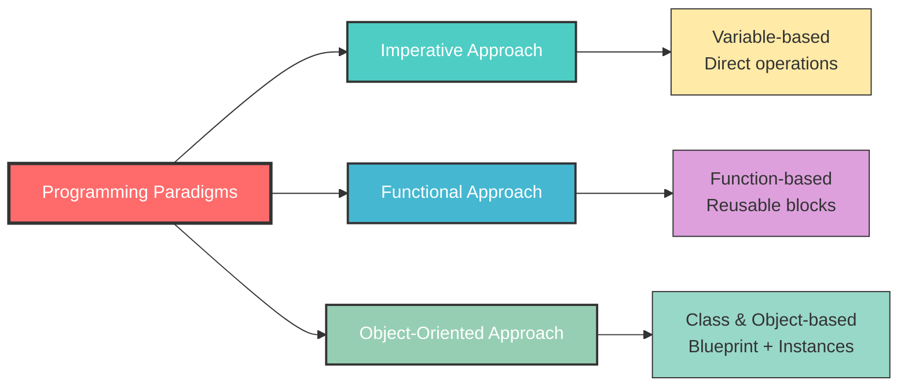

### 2.1 Imperative Approach

**What:** Direct variable manipulation without any abstraction.

**Why:** Simplest form, but leads to code repetition.

**How:**

```python
# Imperative: Adding two numbers
a = 10
b = 20
print(a + b)  # Output: 30

# To add another pair, you need NEW variables
c = 30
d = 40
print(c + d)  # Output: 70
# ❌ Problem: Code repetition for every new pair
```

### 2.2 Functional Approach

**What:** Wrapping logic inside reusable functions.

**Why:** Eliminates repetition; call the same function multiple times.

**How:**

```python
# Functional: Define once, call multiple times
def addition(a, b):
    """Adds two numbers and prints the result."""
    print(a + b)

addition(10, 20)  # Output: 30
addition(30, 40)  # Output: 70
addition(50, 60)  # Output: 110
# ✅ Reusable! No code duplication
```

### 2.3 Object-Oriented Approach

**What:** Using classes (blueprints) and objects (instances) to organize code.

**Why:** Best for large systems, provides security, encapsulation, and inheritance.

**How:**

```python
# OOP: Class as a blueprint
class Calculator:
    """A simple calculator class."""
    
    def __init__(self, a, b):
        # Constructor: initializes object with two numbers
        self.a = a  # Instance attribute
        self.b = b  # Instance attribute
    
    def addition(self):
        # Method: performs addition
        return self.a + self.b

# Creating objects (instances)
calc1 = Calculator(10, 20)  # Object 1
calc2 = Calculator(30, 40)  # Object 2

print(calc1.addition())  # Output: 30
print(calc2.addition())  # Output: 70
```

### 📊 Comparison Table

| Feature | Imperative | Functional | OOP |
|---------|-----------|------------|-----|
| Reusability | ❌ Low | ✅ Medium | ✅ High |
| Security | ❌ None | ❌ None | ✅ Encapsulation |
| Large Scale | ❌ Difficult | ⚠️ Moderate | ✅ Excellent |
| Code Repetition | ❌ High | ✅ Low | ✅ Lowest |
| Data Hiding | ❌ No | ❌ No | ✅ Yes |

---

## 3. Classes and Objects

### 📌 What is a Class?

> **A class is a blueprint/template for creating objects.**

Think of it like:
- A **building blueprint** → defines rooms, windows, doors (but doesn't build the house)
- A **car factory specification** → defines body type, tires, engine (but doesn't produce the car)

### 📌 What is an Object?

> **An object is an instance of a class.** It's the actual "thing" created from the blueprint.

### 🏭 Car Factory Analogy

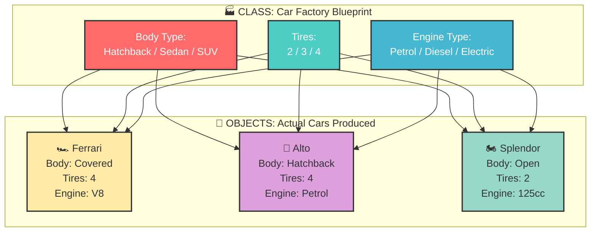

### 📝 Syntax

```python
# Creating a Class (Blueprint)
class Car:
    # Class attribute (shared by all objects)
    wheels = 4
    
    # Method (function inside a class)
    def drive(self):
        print("The car is driving!")

# Creating Objects (Instances)
ferrari = Car()    # Object 1
alto = Car()       # Object 2
splendor = Car()   # Object 3

# Accessing class members via objects
print(ferrari.wheels)  # Output: 4
ferrari.drive()        # Output: The car is driving!
```

### 🔑 Key Rules

1. **Class name** uses `PascalCase` (e.g., `CarFactory`, `StudentManagement`)
2. **No parentheses** after class name during definition (unlike functions)
3. **Indentation** defines the class body
4. A class is **initialized once** when the program first runs
5. Objects are created by **calling the class like a function**: `obj = ClassName()`

### 🎯 Fun Fact

> In Python, you can create a class with just `pass` and it won't throw an error. The class exists but does nothing — like an empty blueprint!

```python
class EmptyClass:
    pass  # Valid! No error

obj = EmptyClass()  # Works fine
print(type(obj))    # <class '__main__.EmptyClass'>
```

---

## 4. Attributes and Methods

### 📌 What are Attributes?

> **Variables defined inside a class are called attributes.**

### 📌 What are Methods?

> **Functions defined inside a class are called methods.**

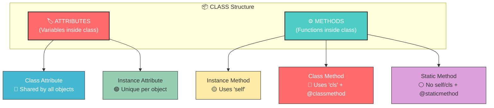

### 📝 Example

```python
class Animal:
    # CLASS ATTRIBUTE: Shared by all instances
    species_type = "Mammal"  # 🏷️ Class attribute
    
    def __init__(self, name):
        # INSTANCE ATTRIBUTE: Unique per object
        self.name = name  # 🏷️ Instance attribute
    
    # INSTANCE METHOD: Uses self
    def speak(self):
        """Instance method - needs object to call"""
        print(f"{self.name} makes a sound")  # ⚙️ Method
    
    # CLASS METHOD: Uses cls
    @classmethod
    def get_species(cls):
        """Class method - can be called on class directly"""
        return cls.species_type  # ⚙️ Method
    
    # STATIC METHOD: No self or cls
    @staticmethod
    def is_animal():
        """Static method - independent utility"""
        return True  # ⚙️ Method

# Creating objects
lion = Animal("Lion")
cat = Animal("Cat")

# Accessing attributes
print(lion.name)           # Output: Lion (instance attribute)
print(Animal.species_type) # Output: Mammal (class attribute)

# Calling methods
lion.speak()               # Output: Lion makes a sound
print(Animal.get_species()) # Output: Mammal
print(Animal.is_animal())   # Output: True
```

### 📌 Accessing Attributes and Methods

```python
# Rule: First access the class/object, then use dot notation
# object.attribute
# object.method()

print(lion.name)      # ✅ Access attribute via object
lion.speak()          # ✅ Call method via object
print(Animal.species_type)  # ✅ Access class attribute via class
```

---

## 5. Constructors (`__init__`)

### 📌 What is a Constructor?

> A constructor is a **special method that runs automatically** when you create an object (call a class). It initializes the object's attributes.

### 📌 Why do we need it?

- Classes can't take parameters directly like functions
- Constructors allow us to **pass input values** when creating objects
- They **target the object's memory location** to store data

### 📌 How does it work?

```python
class BagFactory:
    """Factory that creates bags based on specifications."""
    
    def __init__(self, material, zips, pockets):
        """
        Constructor: Runs automatically when BagFactory() is called.
        
        Parameters:
            self    → References the object being created (its memory location)
            material → Type of material (e.g., 'leather', 'polyester')
            zips    → Number of zips needed
            pockets → Number of pockets needed
        """
        # Store values at the object's specific memory location
        self.material = material  # Save material to THIS object
        self.zips = zips          # Save zips count to THIS object
        self.pockets = pockets    # Save pockets count to THIS object
    
    def details(self):
        """Display bag specifications."""
        print(f"Material: {self.material}")
        print(f"Zips: {self.zips}")
        print(f"Pockets: {self.pockets}")

# Creating objects — constructor runs AUTOMATICALLY
reebok = BagFactory("leather", 3, 2)    # __init__ called automatically
campus = BagFactory("polyester", 2, 4)  # __init__ called automatically

# Each object stores its OWN data
print(reebok.material)  # Output: leather
print(campus.material)  # Output: polyester

# Calling methods
reebok.details()
# Output:
# Material: leather
# Zips: 3
# Pockets: 2
```

### 🔄 Constructor Flow Diagram

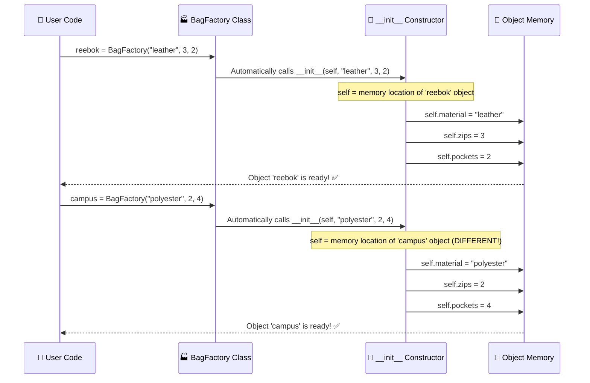

### 🎯 Fun Fact

> The constructor is also called the **initializer** because it "initializes" the object's state. In Python, it's technically `__new__` that creates the object and `__init__` that initializes it, but for practical purposes, `__init__` is what we call the constructor.

---

## 6. The `self` Keyword

### 📌 What is `self`?

> `self` is a reference to the **current object's memory location**. It's how Python knows WHICH object's data to access or modify.

### 📌 Why is `self` needed?

When you create multiple objects from the same class, Python needs to know which object's attributes to work with. `self` provides this context.

### 📌 How does it work internally?

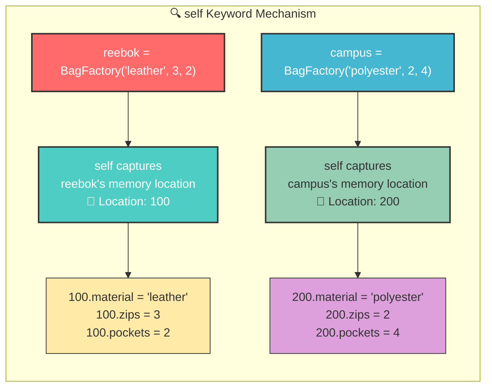

### 📝 Detailed Example

```python
class BagFactory:
    def __init__(self, material, zips, pockets):
        # 'self' = the specific object being created
        # When reebok is created: self → reebok's location (e.g., 100)
        # When campus is created: self → campus's location (e.g., 200)
        
        self.material = material  
        # For reebok: 100.material = "leather"
        # For campus: 200.material = "polyester"
        
        self.zips = zips
        # For reebok: 100.zips = 3
        # For campus: 200.zips = 2
        
        self.pockets = pockets
        # For reebok: 100.pockets = 2
        # For campus: 200.pockets = 4

# Object 1: self points to reebok's memory
reebok = BagFactory("leather", 3, 2)

# Object 2: self points to campus's memory  
campus = BagFactory("polyester", 2, 4)

# Each object has its OWN data at its OWN location
print(reebok.material)  # "leather" (from location 100)
print(campus.material)  # "polyester" (from location 200)
```

### 📌 Key Points about `self`

| Point | Explanation |
|-------|-------------|
| Not a keyword | `self` is just a convention; you could use `this` or `xyz`, but `self` is standard |
| First parameter | Always the first parameter in instance methods |
| Automatic | Python passes the object automatically; you don't pass `self` when calling |
| References object | Points to the specific object that called the method |

### 🎯 Fun Fact

> When you call `reebok.details()`, Python internally converts it to `BagFactory.details(reebok)`. That's why `self` is the first parameter — it receives the object automatically!

---

## 7. Types of Attributes

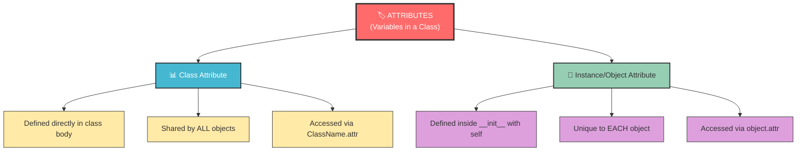

### 📝 Example

```python
class Animal:
    # CLASS ATTRIBUTE: Shared by all instances
    count = 0  # 📊 Same for every object
    
    def __init__(self, name):
        # INSTANCE ATTRIBUTE: Unique per object
        self.name = name  # 🎯 Different for each object
        Animal.count += 1  # Modifying class attribute

# Creating objects
lion = Animal("Lion")
tiger = Animal("Tiger")
cat = Animal("Cat")

# Instance attributes are DIFFERENT
print(lion.name)   # "Lion"
print(tiger.name)  # "Tiger"
print(cat.name)    # "Cat"

# Class attribute is SHARED
print(Animal.count)  # 3 (all objects contributed)

# You can modify instance attributes externally
lion.name = "Simba"  # ✅ Allowed
print(lion.name)     # "Simba"
```

### 📊 Comparison

| Feature | Class Attribute | Instance Attribute |
|---------|----------------|-------------------|
| Definition | Directly in class body | Inside `__init__` with `self` |
| Scope | Shared by all objects | Unique per object |
| Access | `ClassName.attr` or `object.attr` | `object.attr` |
| Memory | One copy for entire class | One copy per object |
| Example | `species = "Mammal"` | `self.name = name` |

---

## 8. Types of Methods

```mermaid
graph TB
    A["⚙️ METHODS<br>(Functions in a Class)"] --> B["🟡 Instance Method"]
    A --> C["🔴 Class Method"]
    A --> D["⚪ Static Method"]
    
    B --> B1["First param: self"]
    B --> B2["Captures OBJECT location"]
    B --> B3["Can access instance + class data"]
    
    C --> C1["First param: cls"]
    C --> C2["Captures CLASS location"]
    C --> C3["@classmethod decorator"]
    C --> C4["Can access class data only"]
    
    D --> D1["No self or cls"]
    D --> D2["Captures NO location"]
    D --> D3["@staticmethod decorator"]
    D --> D4["Independent utility function"]
    
    style A fill:#FF6B6B,stroke:#333,stroke-width:3px,color:#fff
    style B fill:#FFEAA7,stroke:#333,stroke-width:2px
    style C fill:#FF6B6B,stroke:#333,stroke-width:2px,color:#fff
    style D fill:#DDA0DD,stroke:#333,stroke-width:2px
    style B1 fill:#98D8C8,stroke:#333,stroke-width:1px
    style B2 fill:#98D8C8,stroke:#333,stroke-width:1px
    style B3 fill:#98D8C8,stroke:#333,stroke-width:1px
    style C1 fill:#FFEAA7,stroke:#333,stroke-width:1px
    style C2 fill:#FFEAA7,stroke:#333,stroke-width:1px
    style C3 fill:#FFEAA7,stroke:#333,stroke-width:1px
    style C4 fill:#FFEAA7,stroke:#333,stroke-width:1px
    style D1 fill:#96CEB4,stroke:#333,stroke-width:1px
    style D2 fill:#96CEB4,stroke:#333,stroke-width:1px
    style D3 fill:#96CEB4,stroke:#333,stroke-width:1px
    style D4 fill:#96CEB4,stroke:#333,stroke-width:1px
```

### 📝 Complete Example

```python
class Animal:
    # Class attribute
    total_animals = 0
    
    def __init__(self, name):
        self.name = name  # Instance attribute
        Animal.total_animals += 1
    
    # 🟡 INSTANCE METHOD: Captures object location via 'self'
    def hello(self):
        """Can access both instance and class data."""
        print(f"How are you? My name is {self.name}")
        # self.name → accesses THIS object's name
    
    # 🔴 CLASS METHOD: Captures class location via 'cls'
    @classmethod
    def details(cls):
        """Can ONLY access class data, not instance data."""
        print(f"Total animals: {cls.total_animals}")
        # cls.total_animals → accesses class attribute
        # ❌ Cannot access self.name here!
    
    # ⚪ STATIC METHOD: Captures NO location
    @staticmethod
    def speak():
        """Independent function. No access to self or cls."""
        print("I am a static method!")
        # ❌ Cannot access self.name
        # ❌ Cannot access cls.total_animals

# Creating object
obj = Animal("Lion")

# Calling methods
obj.hello()           # Output: How are you? My name is Lion
obj.details()         # Output: Total animals: 1 (works! but targets class)
obj.speak()           # Output: I am a static method!
Animal.details()      # Output: Total animals: 1 (also works via class)
Animal.speak()        # Output: I am a static method!
```

### 📊 Method Comparison Table

| Feature | Instance Method | Class Method | Static Method |
|---------|----------------|--------------|---------------|
| Decorator | None (default) | `@classmethod` | `@staticmethod` |
| First Parameter | `self` | `cls` | None |
| Captures | Object location | Class location | Nothing |
| Access | Instance + Class data | Class data only | No class/object data |
| Called via | Object | Class or Object | Class or Object |
| Use Case | Object-specific behavior | Class-wide operations | Utility functions |

---

## 9. Four Pillars of OOP

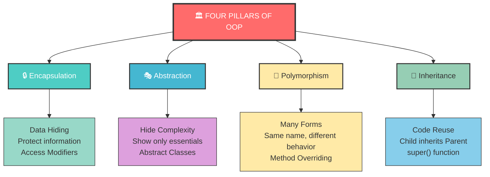

---

## 10. Inheritance

### 📌 What is Inheritance?

> When one class (child) acquires the properties and behaviors (attributes and methods) of another class (parent), it's called **inheritance**.

### 📌 Why use Inheritance?

- **Code Reusability**: Don't rewrite common code
- **Organized Structure**: Logical hierarchy
- **Easy to Maintain & Extend**: Change parent, all children update

### 📌 How does it work?

```python
# PARENT CLASS (Base Class)
class Animal:
    """Parent class with basic animal functionality."""
    
    def __init__(self, name):
        self.name = name  # All animals have a name
    
    def details(self):
        print(f"Hello, my name is {self.name}")

# CHILD CLASS (Derived Class) — inherits from Animal
class Human(Animal):  # 👈 Animal in parentheses = inheritance
    """Child class that inherits from Animal."""
    pass  # Inherits everything from Animal!

# Creating objects
obj1 = Animal("Lion")    # Parent object
obj2 = Human("Harsh")    # Child object — has ALL powers of Animal

obj1.details()  # Output: Hello, my name is Lion
obj2.details()  # Output: Hello, my name is Harsh ✅ Inherited!
```

### 📌 Types of Inheritance

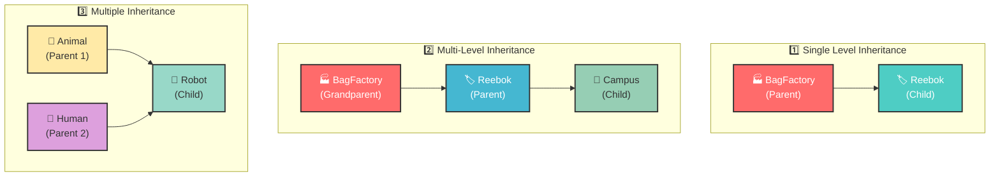

### 📝 Single Level Inheritance

```python
class BagFactory:
    """Parent class: Main factory."""
    
    def __init__(self, material, zips, pockets):
        self.material = material
        self.zips = zips
        self.pockets = pockets
    
    def details(self):
        print(f"Material: {self.material}, Zips: {self.zips}, Pockets: {self.pockets}")

class Reebok(BagFactory):
    """Child class: Inherits from BagFactory."""
    
    def __init__(self, material, zips, pockets, color):
        # super() calls the parent's __init__
        super().__init__(material, zips, pockets)
        # New attribute specific to Reebok
        self.color = color
    
    def details(self):
        super().details()  # Call parent's details
        print(f"Color: {self.color}")  # Add child-specific info

# Creating objects
bag1 = BagFactory("leather", 3, 4)
bag2 = Reebok("polyester", 4, 2, "red")

bag1.details()
# Output: Material: leather, Zips: 3, Pockets: 4

bag2.details()
# Output: Material: polyester, Zips: 4, Pockets: 2
#         Color: red
```

### 📝 Multiple Inheritance

```python
class Animal:
    """First parent."""
    def __init__(self, name):
        self.name = name

class Human:
    """Second parent."""
    def __init__(self, id):
        self.id = id

class Robot(Animal, Human):
    """Child inheriting from BOTH parents."""
    
    def __init__(self, id, name):
        # Must call both parents' constructors explicitly
        Human.__init__(self, id)
        Animal.__init__(self, name)

# Creating object
robo = Robot(12, "Akarsh")
print(robo.id)    # Output: 12
print(robo.name)  # Output: Akarsh
```

### 📌 The `super()` Function

> `super()` returns a proxy object that allows you to refer to the **parent class**. It's used to call parent methods and constructors.

```python
class Child(Parent):
    def __init__(self, ...):
        super().__init__(...)  # Calls Parent's __init__
    
    def method(self):
        super().method()  # Calls Parent's method
```

### 🎯 Fun Fact

> In **multiple inheritance**, Python uses **MRO (Method Resolution Order)** to decide which parent to look at first. You can check it with `ClassName.__mro__`. The order follows the **C3 Linearization Algorithm**!

---

## 11. Polymorphism

### 📌 What is Polymorphism?

> **Poly = Many, Morph = Forms.** Polymorphism means "having many forms." The same method name can behave differently depending on the object calling it.

### 📌 Real-Life Example

> A **phone** is one device but acts as a camera, calculator, music player, and communication tool. One thing, multiple behaviors!

### 📝 Example: Same Method, Different Behavior

```python
class Animal:
    """Animals don't speak like humans."""
    def speak(self):
        print("Animals will not speak")

class Human:
    """Humans can speak."""
    def speak(self):
        print("We are humans, we can speak")

# Creating objects
obj1 = Animal()
obj2 = Human()

# Same method name, DIFFERENT behavior!
obj1.speak()  # Output: Animals will not speak
obj2.speak()  # Output: We are humans, we can speak
```

### 📌 Types of Polymorphism

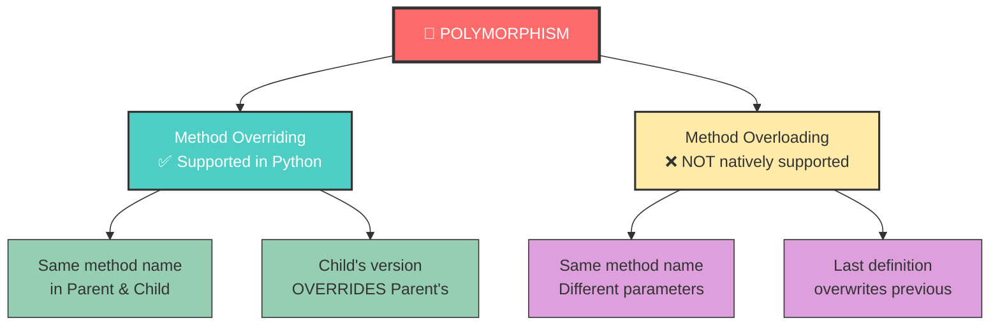

### 📝 Method Overriding

```python
class Animal:
    """Parent class."""
    def __init__(self, name):
        self.name = name
    
    def details(self):
        print(f"Your name is {self.name}")  # Parent's version

class Human(Animal):
    """Child class that OVERRIDES parent's method."""
    
    def details(self):
        # This OVERRIDES Animal.details()
        print(f"Your info is {self.name} and this is all we have")

# Creating object
obj = Human("Harsh")
obj.details()  
# Output: Your info is Harsh and this is all we have
# ✅ Child's version is called, NOT parent's!

# To call parent's version, use super():
class Human2(Animal):
    def details(self):
        super().details()  # Call parent's version
        print(f"Your info is {self.name}")

obj2 = Human2("Harsh")
obj2.details()
# Output: Your name is Harsh
#         Your info is Harsh
```

### 📝 Method Overloading (NOT supported natively)

```python
# ❌ This does NOT work as expected in Python
class Random:
    def speak(self, a):
        print("How are you?")
    
    def speak(self, a, b):  # This OVERWRITES the previous one!
        print("What are you doing?")

obj = Random()
obj.speak(1, 2)   # ✅ Works: "What are you doing?"
# obj.speak(1)    # ❌ Error! The first definition is gone

# ✅ WORKAROUND: Use default arguments
class Random2:
    def speak(self, a, b=None):
        if b is None:
            print(f"Got one arg: {a}")
        else:
            print(f"Got two args: {a}, {b}")
```

### 🎯 Fun Fact

> Python follows **Duck Typing**: *"If it walks like a duck and quacks like a duck, it must be a duck."* Python doesn't care about the object's type — it only cares if the object has the method you're trying to call!

---

## 12. Encapsulation

### 📌 What is Encapsulation?

> Encapsulation is about **keeping data safe** by restricting access to certain attributes and methods. Think of it like a **capsule** — the medicine inside is protected.

### 📌 Why use Encapsulation?

- Prevents accidental data modification
- Provides control over what can be accessed
- Makes code cleaner and easier to maintain
- Essential for security (e.g., bank balance shouldn't be publicly modifiable)

### 📌 Access Modifiers

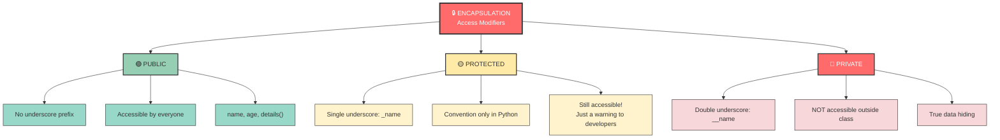

### 📝 Complete Example

```python
class CarFactory:
    """Demonstrating all three access levels."""
    
    # 🟢 PUBLIC class attribute
    name = "Mahindra"
    
    def __init__(self, body_type, tire, color):
        # 🟢 PUBLIC instance attributes
        self.body_type = body_type
        self.tire = tire
        self.color = color
        
        # 🟡 PROTECTED instance attribute (convention only)
        self._age = 12  # Single underscore = "please don't touch"
        
        # 🔴 PRIVATE instance attribute
        self.__secret = "Top Secret Formula"  # Double underscore = hidden!
    
    # 🟢 PUBLIC method
    def details(self):
        """Anyone can call this."""
        print(f"Type: {self.body_type}, Tire: {self.tire}, Color: {self.color}")
    
    # 🔴 PRIVATE method
    def __secret_method(self):
        """Cannot be called from outside."""
        print("This is a secret!")

# Creating object
obj = CarFactory("Sedan", "MRF", "Black")

# 🟢 PUBLIC: Fully accessible
print(obj.name)         # ✅ "Mahindra"
print(obj.body_type)    # ✅ "Sedan"
obj.details()           # ✅ Works!
obj.name = "Maruti"     # ✅ Can modify!
print(obj.name)         # "Maruti" (changed!)

# 🟡 PROTECTED: Still accessible (just a convention)
print(obj._age)         # ✅ 12 (Python doesn't enforce protection)

# 🔴 PRIVATE: NOT accessible from outside
# print(obj.__secret)   # ❌ AttributeError: 'CarFactory' has no attribute '__secret'
# obj.__secret_method() # ❌ AttributeError!

# 🔴 Private CAN be accessed INSIDE the class
class CarFactory2:
    __a = 12
    
    @classmethod
    def info(cls):
        print(cls.__a)  # ✅ Works inside the class!

obj2 = CarFactory2()
obj2.info()  # Output: 12 ✅
```

### 📊 Access Modifier Comparison

| Modifier | Syntax | Accessible Outside? | Accessible in Child? | Python Enforcement |
|----------|--------|--------------------|--------------------|-------------------|
| Public | `name` | ✅ Yes | ✅ Yes | N/A |
| Protected | `_name` | ✅ Yes (convention) | ✅ Yes | ❌ Not enforced |
| Private | `__name` | ❌ No | ❌ No | ✅ Name mangling |

### 🎯 Fun Fact

> Python's "private" attributes use **name mangling**. `__secret` becomes `_CarFactory__secret` internally. You CAN technically access it as `obj._CarFactory__secret`, but you shouldn't! Python trusts developers to respect the convention.

---

## 13. Abstraction

### 📌 What is Abstraction?

> Abstraction means **showing only essential features** while hiding complex implementation details. Like a KFC franchise — you must follow their rules (red board, same menu) without knowing their secret recipe.

### 📌 Why use Abstraction?

- Enforces a common interface across subclasses
- Prevents instantiation of incomplete classes
- Ensures all subclasses implement required methods
- Simplifies complex systems

### 📌 How to implement in Python?

Python doesn't have built-in abstraction, but we use the `abc` (Abstract Base Class) module.

```python
from abc import ABC, abstractmethod

# Creating an ABSTRACT CLASS
class Enforce(ABC):
    """Abstract class that enforces rules on subclasses."""
    
    @abstractmethod
    def engine_start(self):
        """This method MUST be implemented by all subclasses."""
        pass  # No implementation here!

class Bike(Enforce):
    """Must implement engine_start or will get an error."""
    
    def engine_start(self):
        """✅ Implementing the abstract method."""
        print("Bike engine started with kick!")

class Car(Enforce):
    """Must implement engine_start or will get an error."""
    
    def engine_start(self):
        """✅ Implementing the abstract method."""
        print("Car engine started with button!")

class Truck(Enforce):
    """If you forget to implement, you'll get an error."""
    
    def engine_start(self):
        """✅ Implementing the abstract method."""
        print("Truck engine started with key!")

# Creating objects
obj1 = Bike()
obj2 = Car()
obj3 = Truck()

obj1.engine_start()  # Output: Bike engine started with kick!
obj2.engine_start()  # Output: Car engine started with button!
obj3.engine_start()  # Output: Truck engine started with key!

# ❌ This would cause an error:
# class BadClass(Enforce):
#     pass  # Missing engine_start!
# obj = BadClass()  # TypeError: Can't instantiate abstract class!
```

### 🔄 Abstraction Flow

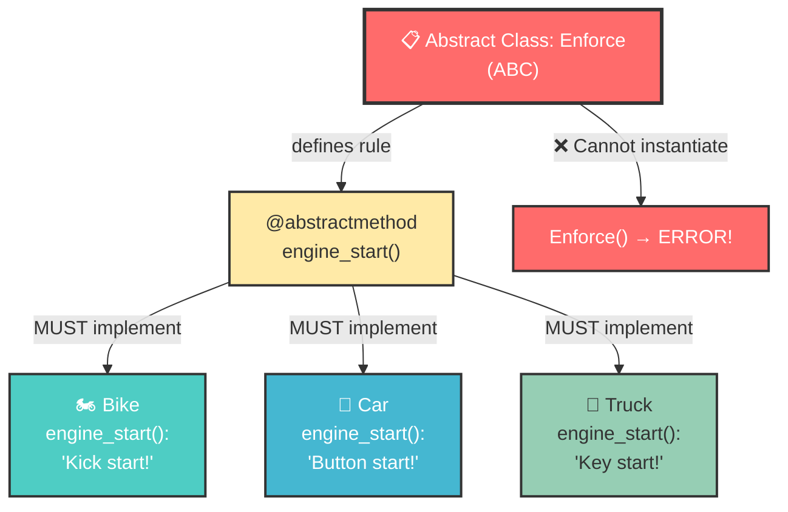

### 📌 Key Points

| Point | Explanation |
|-------|-------------|
| `ABC` | Abstract Base Class — parent for abstract classes |
| `@abstractmethod` | Decorator that marks a method as abstract |
| Cannot instantiate | You can't create objects of abstract classes directly |
| Must implement | All subclasses MUST implement abstract methods |
| Use case | Defining interfaces, enforcing contracts |

---

## 14. Dunder (Magic) Methods

### 📌 What are Dunder Methods?

> **Dunder = Double Underscore.** These are special methods that start and end with `__`. They're also called **magic methods** because they work like magic — automatically called when certain operations are performed.

### 📌 Why are they important?

- They enable operator overloading
- They make objects work with built-in functions
- They're the backbone of Python's OOP system
- **Everything in Python uses dunder methods internally!**

### 📌 Common Dunder Methods

| Dunder Method | Triggered By | Purpose |
|--------------|-------------|---------|
| `__init__` | Object creation | Constructor/Initializer |
| `__str__` | `print(obj)` | String representation |
| `__add__` | `obj1 + obj2` | Addition operator |
| `__eq__` | `obj1 == obj2` | Equality comparison |
| `__len__` | `len(obj)` | Length |
| `__repr__` | Interactive display | Official representation |
| `__del__` | Object deletion | Destructor |

### 📝 Example: `__init__` and `__str__`

```python
class Animal:
    def __init__(self, name):
        """Dunder method: Called automatically when object is created."""
        self.name = name
    
    def __str__(self):
        """Dunder method: Called automatically when object is printed."""
        return f"Hello, my name is {self.name}"

# Creating object → __init__ called automatically
obj = Animal("Lion")

# Printing object → __str__ called automatically
print(obj)  # Output: Hello, my name is Lion
# Without __str__, it would show: <__main__.Animal object at 0x102...>
```

### 📝 Example: `__add__` (Operator Overloading)

```python
class Numbers:
    def __init__(self, num):
        self.num = num
    
    def __add__(self, other):
        """Called when you use + operator between two objects."""
        # self = first object, other = second object
        return self.num + other.num
    
    def __eq__(self, other):
        """Called when you use == operator between two objects."""
        return self.num == other.num

# Creating objects
num1 = Numbers(20)
num2 = Numbers(30)

# Using + operator → __add__ called automatically!
result = num1 + num2
print(result)  # Output: 50

# Using == operator → __eq__ called automatically!
print(num1 == num2)  # Output: False (20 != 30)

num3 = Numbers(30)
print(num2 == num3)  # Output: True (30 == 30)
```

### 📌 The Big Revelation

```python
# EVERYTHING in Python is an object with dunder methods!
a = 12
print(type(a))  # <class 'int'> → 'int' is a CLASS!

# When you write a + b, Python actually calls:
# a.__add__(b)

# When you write a == b, Python actually calls:
# a.__eq__(b)

# Even lists, strings, dictionaries — all are classes!
my_list = [1, 2, 3]
print(type(my_list))  # <class 'list'>
my_list.append(4)     # Calling a method on the list object!
```

### 🎯 Fun Fact

> You can see ALL dunder methods of any type using `dir()`:
> ```python
> print(dir(int))    # All dunder methods of integers
> print(dir(str))    # All dunder methods of strings
> print(dir(list))   # All dunder methods of lists
> ```
> Python's entire ecosystem is built on these magic methods!

---

## 15. Advanced Python Topics

### 15.1 Decorators

#### 📌 What is a Decorator?

> A decorator is a **wrapper function** that adds extra behavior to another function without modifying its code. Think of it as adding cream decoration to a cake — the cake is still the same, but now it looks fancier!

#### 📝 Example

```python
# Creating a decorator
def extra_greeting(func):
    """Decorator that adds greeting messages around any function."""
    
    def wrapper(*args, **kwargs):
        """Wrapper function that adds extra behavior."""
        print("Hello from the NYC team!")  # Before the function
        func(*args, **kwargs)               # Call the original function
        print("Thank you! Visit again!")    # After the function
    
    return wrapper  # Return the wrapper (don't call it!)

# Applying decorator using @ syntax
@extra_greeting
def greetings():
    """Original function."""
    print("Good Morning!")

# Calling the decorated function
greetings()
# Output:
# Hello from the NYC team!
# Good Morning!
# Thank you! Visit again!
```

#### 🔄 Decorator Flow

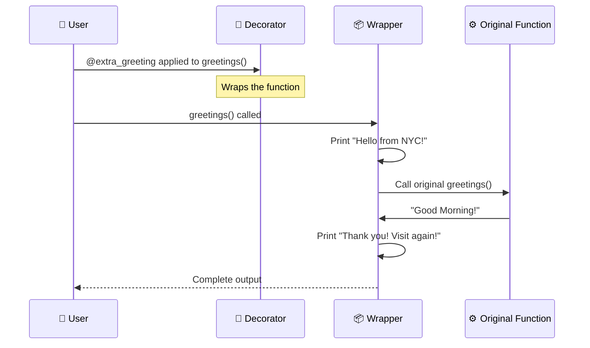

### 15.2 `*args` and `**kwargs`

#### 📌 What are they?

| Syntax | Name | Creates | Use Case |
|--------|------|---------|----------|
| `*args` | Positional arguments | **Tuple** | Unknown number of positional args |
| `**kwargs` | Keyword arguments | **Dictionary** | Unknown number of named args |

#### 📝 Example

```python
# *args: Accepts any number of positional arguments
def addition(*args):
    """Add any number of values."""
    total = 0
    for i in args:  # args is a tuple: (20, 30, 50)
        total += i
    return total

print(addition(20, 30, 50))       # Output: 100
print(addition(1, 2, 3, 4, 5))    # Output: 15

# **kwargs: Accepts any number of keyword arguments
def information(**kwargs):
    """Collect any amount of named information."""
    return kwargs  # Returns a dictionary

result = information(name="Akarsh", age=24, profession="Data Scientist")
print(result)
# Output: {'name': 'Akarsh', 'age': 24, 'profession': 'Data Scientist'}
```

### 15.3 Comprehensions

#### 📌 What are Comprehensions?

> One-liner syntax to create lists, dictionaries, or sets without writing explicit loops.

#### 📌 Formula

```
[expression for item in iterable if condition]
```

#### 📝 Examples

```python
# Traditional approach (4 lines)
a = [1, 2, 3, 4, 5, 6, 7, 8, 9, 10, 11, 12, 13, 14]
b = []
for i in a:
    if i % 2 == 0:
        b.append(i)

# List Comprehension (1 line!) ✅
b = [i for i in a if i % 2 == 0]
print(b)  # Output: [2, 4, 6, 8, 10, 12, 14]

# Dictionary Comprehension
squared = {x: x**2 for x in range(5)}
print(squared)  # {0: 0, 1: 1, 2: 4, 3: 9, 4: 16}

# Set Comprehension
unique_squares = {x**2 for x in [1, 2, 2, 3, 3, 3]}
print(unique_squares)  # {1, 4, 9}
```

### 15.4 Ternary Operator (One-liner if-else)

#### 📌 Formula

```
value_if_true if condition else value_if_false
```

#### 📝 Example

```python
a = 20

# Traditional (4 lines)
if a % 2 == 0:
    print("Even Number")
else:
    print("Odd Number")

# Ternary (1 line!) ✅
print("Even Number") if a % 2 == 0 else print("Odd Number")
```

### 15.5 Lambda Functions

#### 📌 What is a Lambda?

> An anonymous (unnamed) one-liner function. Also called **lambda expressions**.

#### 📌 Formula

```
lambda parameters: expression
```

#### 📝 Examples

```python
# Traditional function
def check(x):
    return "Even" if x % 2 == 0 else "Odd"

# Lambda equivalent ✅
check = lambda x: "Even" if x % 2 == 0 else "Odd"
print(check(12))  # Output: Even

# Lambda for addition
addition = lambda a, b: a + b
print(addition(10, 20))  # Output: 30

# Lambda with *args
add_all = lambda *args: sum(args)
print(add_all(1, 2, 3, 4, 5))  # Output: 15
```

### 15.6 Map, Filter, Zip

#### 📊 Comparison

| Function | Purpose | Returns |
|----------|---------|---------|
| `map(func, iterable)` | Apply function to ALL elements | Map object (convert to list) |
| `filter(func, iterable)` | Keep only elements where func returns True | Filter object |
| `zip(iter1, iter2, ...)` | Combine multiple iterables element-wise | Zip object (tuples) |

#### 📝 Examples

```python
# MAP: Apply function to every element
names = ["Sarthak", "Harsh", "Vedant", "Akarsh"]
lengths = list(map(len, names))  # Apply len() to each name
print(lengths)  # Output: [7, 5, 6, 6]

# MAP with lambda: Celsius to Fahrenheit
temps_celsius = [0, 20, 30, 35]
temps_fahrenheit = list(map(lambda x: (x * 9/5) + 32, temps_celsius))
print(temps_fahrenheit)  # Output: [32.0, 68.0, 86.0, 95.0]

# FILTER: Keep only elements matching condition
marks = [35, 80, 80, 10, 12, 60, 49]
passed = list(filter(lambda x: x >= 40, marks))
print(passed)  # Output: [80, 80, 60, 49]

# ZIP: Combine two lists
names = ["Sarthak", "Akarsh", "Harsh", "Vedant"]
marks = [12, 90, 42, 6]
result = list(zip(names, marks))
print(result)
# Output: [('Sarthak', 12), ('Akarsh', 90), ('Harsh', 42), ('Vedant', 6)]
```

---

## 16. Project: Student Management System

### 📌 Overview

A complete **School Management System** using OOP principles, JSON for data persistence, and abstract classes for enforcing structure.

### 📌 Features

1. ✅ Register Students
2. ✅ Register Teachers
3. ✅ Add Grades to Students
4. ✅ Show Student Details
5. ✅ Show Teacher Details

### 🏗️ Architecture

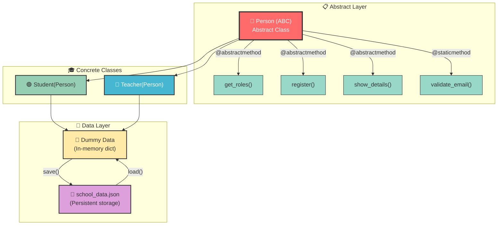

### 📝 Complete Code (Annotated)

```python
import json
from abc import ABC, abstractmethod
from pathlib import Path

# ============================================================
# DATABASE SETUP
# ============================================================

DATABASE = "school_data.json"  # Persistent storage file

# Dummy data: In-memory copy of database
# Structure: {"students": [...], "teachers": [...]}
data = {"students": [], "teachers": []}

# Load existing data from JSON file if it exists
if Path(DATABASE).exists():
    with open(DATABASE, "r") as f:
        content = f.read()
        if content:
            data = json.loads(content)  # Parse JSON into dictionary

# ============================================================
# SAVE FUNCTION
# ============================================================

def save():
    """Save current data to JSON file."""
    with open(DATABASE, "w") as f:
        json.dump(data, f, indent=4)  # Write with formatting

# ============================================================
# ABSTRACT BASE CLASS: Person
# ============================================================

class Person(ABC):
    """
    Abstract class that enforces rules on Student and Teacher.
    All subclasses MUST implement: get_roles, register, show_details
    """
    
    @abstractmethod
    def get_roles(self):
        """Return the role of the person."""
        pass
    
    @abstractmethod
    def register(self):
        """Register the person with their details."""
        pass
    
    @abstractmethod
    def show_details(self):
        """Display the person's details."""
        pass
    
    @staticmethod
    def validate_email(email):
        """
        Static method: Validates email format.
        No self/cls needed — independent utility.
        """
        if "@" in email and "." in email:
            return True
        else:
            return False

# ============================================================
# STUDENT CLASS
# ============================================================

class Student(Person):
    """Student class inheriting from Person."""
    
    def get_roles(self):
        """Returns the role: 'Student'"""
        return "Student"
    
    def register(self):
        """Register a new student."""
        # Collect student information
        name = input("Tell your name: ")
        age = int(input("Tell your age: "))
        email = input("Tell your email: ")
        roll_number = input("Tell your roll number: ")
        
        # Validate email using parent's static method
        if not Person.validate_email(email):
            print("Invalid email!")
            return  # Stop registration
        
        # Check if roll number already exists
        for i in data["students"]:
            if i["roll_number"] == roll_number:
                print("Student already exists!")
                return  # Stop registration
        
        # Add student to data
        data["students"].append({
            "name": name,
            "age": age,
            "email": email,
            "roll_number": roll_number,
            "grades": {}  # Empty dict for subject: marks pairs
        })
        
        # Save to JSON file
        save()
        print(f"Student '{name}' registered successfully!")
    
    def add_grades(self):
        """Add grades/marks for a student."""
        roll_number = input("Tell the roll number: ")
        subject = input("Subject: ")
        marks = float(input("Marks: "))
        
        # Find the student by roll number
        for i in data["students"]:
            if i["roll_number"] == roll_number:
                i["grades"][subject] = marks  # Add/update grade
                save()  # Save changes
                print("Grade added successfully!")
                return
        
        print("Student not found!")
    
    def show_details(self):
        """Display student details with average."""
        roll_number = input("Enter roll number: ")
        
        for s in data["students"]:
            if s["roll_number"] == roll_number:
                # Calculate average using grades
                grades = s["grades"]
                avg = sum(grades.values()) / len(grades) if grades else 0
                
                print(f"\n{'='*40}")
                print(f"Name: {s['name']}")
                print(f"Roll Number: {s['roll_number']}")
                print(f"Age: {s['age']}")
                print(f"Email: {s['email']}")
                print(f"Grades: {s['grades']}")
                print(f"Average: {avg:.2f}")
                print(f"{'='*40}")
                return
        
        print("Student not found!")

# ============================================================
# TEACHER CLASS
# ============================================================

class Teacher(Person):
    """Teacher class inheriting from Person."""
    
    def get_roles(self):
        """Returns the role: 'Teacher'"""
        return "Teacher"
    
    def register(self):
        """Register a new teacher."""
        name = input("Tell your name: ")
        age = int(input("Tell your age: "))
        email = input("Tell your email: ")
        employee_id = input("Tell your employee ID: ")
        subject = input("Subject you teach: ")
        
        # Validate email
        if not Person.validate_email(email):
            print("Invalid email!")
            return
        
        # Check if employee ID already exists
        for i in data["teachers"]:
            if i["employee_id"] == employee_id:
                print("Teacher already exists!")
                return
        
        # Add teacher to data
        data["teachers"].append({
            "name": name,
            "age": age,
            "email": email,
            "employee_id": employee_id,
            "subject": subject
        })
        
        save()
        print(f"Teacher '{name}' registered successfully!")
    
    def show_details(self):
        """Display teacher details."""
        employee_id = input("Enter employee ID: ")
        
        for t in data["teachers"]:
            if t["employee_id"] == employee_id:
                print(f"\n{'='*40}")
                print(f"Name: {t['name']}")
                print(f"Employee ID: {t['employee_id']}")
                print(f"Subject: {t['subject']}")
                print(f"Age: {t['age']}")
                print(f"{'='*40}")
                return
        
        print("Teacher not found!")

# ============================================================
# MAIN APPLICATION LOOP
# ============================================================

# Creating objects
stud = Student()   # Student object
tech = Teacher()   # Teacher object

# Main menu loop
while True:
    print("\n" + "="*50)
    print("📚 SCHOOL MANAGEMENT SYSTEM 📚")
    print("="*50)
    print("Press 1: Register a Student")
    print("Press 2: Register a Teacher")
    print("Press 3: Add Grades")
    print("Press 4: Show Student Details")
    print("Press 5: Show Teacher Details")
    print("Press 6: Exit")
    print("="*50)
    
    choice = input("Please tell your choice: ")
    
    if choice == "1":
        stud.register()       # Polymorphism: same method name, different class
    elif choice == "2":
        tech.register()       # Polymorphism: same method name, different class
    elif choice == "3":
        stud.add_grades()
    elif choice == "4":
        stud.show_details()   # Polymorphism
    elif choice == "5":
        tech.show_details()   # Polymorphism
    elif choice == "6":
        print("Thank you! Goodbye! 👋")
        break
    else:
        print("Invalid choice! Please try again.")
```

### 📊 JSON Data Structure

```json
{
    "students": [
        {
            "name": "Akarsh",
            "age": 24,
            "email": "akarsh@gmail.com",
            "roll_number": "1",
            "grades": {
                "maths": 90
            }
        },
        {
            "name": "Harsh",
            "age": 23,
            "email": "harsh@gmail.com",
            "roll_number": "2",
            "grades": {}
        }
    ],
    "teachers": [
        {
            "name": "Harsh Bhaiya",
            "age": 25,
            "email": "harsh@gmail.com",
            "employee_id": "1",
            "subject": "Maths"
        }
    ]
}
```

### 🔄 Data Flow Diagram

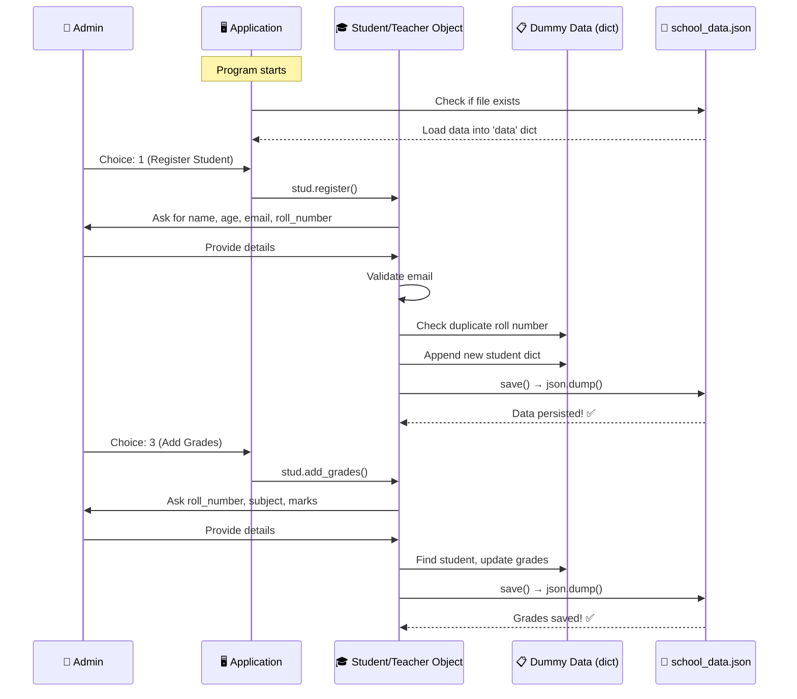

### 🎯 OOP Concepts Used in Project

| Concept | Where Used |
|---------|-----------|
| **Classes & Objects** | `Student`, `Teacher` classes; `stud`, `tech` objects |
| **Inheritance** | Both inherit from `Person` |
| **Abstraction** | `Person` is abstract with `@abstractmethod` |
| **Polymorphism** | `register()` and `show_details()` behave differently |
| **Encapsulation** | `validate_email` is a static utility |
| **Constructors** | Implicit `__init__` in all classes |
| **Static Methods** | `validate_email()` |

---

## 17. Summary & Cheat Sheet

### 📋 Complete OOP Mind Map

```mermaid
mindmap
  root((🐍 Python OOP))
    Classes & Objects
      Class = Blueprint
      Object = Instance
      Syntax: class Name:
      obj = ClassName()
    Attributes
      Class Attribute
      Instance Attribute
      self.attr = value
    Methods
      Instance Method
        self parameter
      Class Method
        @classmethod
        cls parameter
      Static Method
        @staticmethod
        No self/cls
    Constructor
      __init__
      Auto-called
      self targets object
    Four Pillars
      Inheritance
        Single Level
        Multi-Level
        Multiple
        super()
      Polymorphism
        Method Overriding
        Duck Typing
      Encapsulation
        Public
        Protected _
        Private __
      Abstraction
        ABC
        @abstractmethod
    Dunder Methods
      __init__
      __str__
      __add__
      __eq__
    Advanced
      Decorators
      *args **kwargs
      Comprehensions
      Lambda
      Map Filter Zip
```

### 📝 Quick Reference Table

| Concept | Syntax | Purpose |
|---------|--------|---------|
| Class definition | `class Name:` | Create blueprint |
| Object creation | `obj = Name()` | Create instance |
| Constructor | `def __init__(self):` | Initialize object |
| Instance attribute | `self.name = value` | Per-object data |
| Class attribute | `name = value` (in class) | Shared data |
| Instance method | `def method(self):` | Object behavior |
| Class method | `@classmethod` + `cls` | Class behavior |
| Static method | `@staticmethod` | Utility function |
| Inheritance | `class Child(Parent):` | Reuse code |
| Super call | `super().__init__()` | Call parent |
| Private | `__name` | Hide data |
| Protected | `_name` | Convention |
| Abstract | `ABC` + `@abstractmethod` | Enforce rules |
| String repr | `def __str__(self):` | Print format |
| Addition | `def __add__(self, other):` | + operator |
| Equality | `def __eq__(self, other):` | == operator |

### 🎯 Key Takeaways

1. **Everything in Python is an object** — integers, strings, functions, classes themselves
2. **`self` is not a keyword** — it's a convention that references the current object
3. **Constructors run automatically** — you never call `__init__` explicitly
4. **Python doesn't enforce protection** — `_protected` is just a naming convention
5. **Method overloading isn't native** — last definition overwrites previous
6. **Dunder methods power everything** — `a + b` is actually `a.__add__(b)`
7. **Trust the process** — OOP takes time to click; practice and revisit!

### 💡 Pro Tips from the Instructor

> - **Don't fall into Tutorial Hell** — 30-40% comes from tutorials, 60-70% from self-practice
> - **Rewatch sections** you don't understand — OOP concepts build on each other
> - **Use ChatGPT/Claude** to clarify doubts and get project ideas
> - **Write code yourself** — don't just watch; type it out
> - **Create your own notes** — the act of writing reinforces learning
> - **Build projects** — that's where real understanding happens

---

## 📚 Formulas & Patterns Summary

### OOP Design Pattern Formula

```
Class = Attributes (data) + Methods (behavior)
Object = Instance of Class (concrete entity)
Inheritance = Child(Parent) → Child gets Parent's features
Polymorphism = Same interface, different implementations
Encapsulation = Private(__) + Protected(_) + Public
Abstraction = ABC + @abstractmethod → Must implement
```

### Comprehension Formula

```python
# List: [expression for item in iterable if condition]
result = [x**2 for x in range(10) if x % 2 == 0]

# Dict: {key_expr: value_expr for item in iterable if condition}
result = {x: x**2 for x in range(10)}

# Set: {expression for item in iterable if condition}
result = {x**2 for x in range(10)}
```

### Ternary Formula

```python
# value_if_true if condition else value_if_false
result = "Even" if x % 2 == 0 else "Odd"
```

### Lambda Formula

```python
# lambda parameters: expression
square = lambda x: x ** 2
add = lambda a, b: a + b
```

### Decorator Formula

```python
def decorator(func):
    def wrapper(*args, **kwargs):
        # Before
        func(*args, **kwargs)
        # After
    return wrapper

@decorator
def my_function():
    pass
```

---

> 📝 **Note:** This document was created from the YouTube transcript of NYC's Python OOP series. For the complete learning experience, watch the original video and practice coding along!

---

*Happy Coding! 🚀*