# Python Object-Oriented Programming & Advanced Python
## Detailed English Notes from the Shared YouTube Transcript

> **Source scope:** These notes are derived from the shared YouTube transcript. The lecture is mainly about **Object-Oriented Programming (OOP) in Python**, and later moves into advanced Python topics such as decorators, `*args`, `**kwargs`, comprehensions, lambda functions, `map()`, `filter()`, `zip()`, and a school-management OOP project.
>
> **Code note:** Because the source is a spoken transcript rather than a `.py` file, code blocks below are **cleaned reconstructions of the code demonstrated verbally**. Variable names and structure are kept aligned with the lecture, while comments are added to explain every important line.
>
> **Math formatting:** Inline formulas use `$...$`, and display formulas use `$$...$$`.

---

# Table of Contents

1. [Programming Approaches: Imperative, Functional, OOP](#1-programming-approaches-imperative-functional-oop)
2. [Why Object-Oriented Programming?](#2-why-object-oriented-programming)
3. [Class — The Blueprint](#3-class--the-blueprint)
4. [Object — An Instance of a Class](#4-object--an-instance-of-a-class)
5. [Attributes and Methods](#5-attributes-and-methods)
6. [Constructor `__init__`](#6-constructor-__init__)
7. [`self` — Current Object Reference](#7-self--current-object-reference)
8. [Class vs Instance Attributes](#8-class-vs-instance-attributes)
9. [Instance, Class, and Static Methods](#9-instance-class-and-static-methods)
10. [The Four Pillars of OOP](#10-the-four-pillars-of-oop)
11. [Inheritance](#11-inheritance)
12. [`super()`](#12-super)
13. [Types of Inheritance](#13-types-of-inheritance)
14. [Method Resolution Order — MRO](#14-method-resolution-order--mro)
15. [Polymorphism](#15-polymorphism)
16. [Method Overriding](#16-method-overriding)
17. [Method Overloading in Python](#17-method-overloading-in-python)
18. [Duck Typing](#18-duck-typing)
19. [Encapsulation](#19-encapsulation)
20. [Public, Protected, and Private Members](#20-public-protected-and-private-members)
21. [Abstraction](#21-abstraction)
22. [Abstract Base Classes](#22-abstract-base-classes)
23. [Dunder / Magic Methods](#23-dunder--magic-methods)
24. [`__str__`, `__add__`, and `__eq__`](#24-__str__-__add__-and-__eq__)
25. [Python Objects Everywhere](#25-python-objects-everywhere)
26. [Decorators](#26-decorators)
27. [`*args`](#27-args)
28. [`**kwargs`](#28-kwargs)
29. [Decorators with `*args` and `**kwargs`](#29-decorators-with-args-and-kwargs)
30. [Ternary / Conditional Expressions](#30-ternary--conditional-expressions)
31. [List Comprehension](#31-list-comprehension)
32. [Dictionary and Set Comprehension](#32-dictionary-and-set-comprehension)
33. [Lambda Functions](#33-lambda-functions)
34. [`map()`](#34-map)
35. [`filter()`](#35-filter)
36. [`zip()`](#36-zip)
37. [School Management System Project](#37-school-management-system-project)
38. [Project Architecture](#38-project-architecture)
39. [Complete Commented Project Reconstruction](#39-complete-commented-project-reconstruction)
40. [How the Project Demonstrates OOP](#40-how-the-project-demonstrates-oop)
41. [Useful Formula Examples](#41-useful-formula-examples)
42. [Common Mistakes and Interview Traps](#42-common-mistakes-and-interview-traps)
43. [Quick Revision Cheat Sheet](#43-quick-revision-cheat-sheet)
44. [Practice Questions](#44-practice-questions)
45. [Fun Facts](#45-fun-facts)
46. [Transcript Consistency Notes](#46-transcript-consistency-notes)
47. [Final Concept Map](#47-final-concept-map)

---

# 1. Programming Approaches: Imperative, Functional, OOP

The lecture begins by revisiting three broad ways of structuring code.

## 1.1 Imperative / Primitive Approach

In the imperative approach, we directly write instructions using variables.

### Example

```python
# Store the first pair of numbers.
a = 10
b = 20

# Add the first pair.
print(a + b)

# If we need another pair, we create more variables.
c = 30
d = 40

# Repeat the same type of operation.
print(c + d)
```

### What is the problem?

If the same task must be repeated many times, the code itself is repeated.

This can lead to:

- duplication,
- larger files,
- harder maintenance,
- more opportunities for mistakes.

---

## 1.2 Functional Approach

The functional approach puts reusable behavior into a function.

```python
def addition(a, b):
    # Perform the reusable task.
    print(a + b)

# Reuse the same function for different inputs.
addition(10, 20)
addition(30, 40)
addition(100, 200)
```

### Why is this better?

The logic:

```python
a + b
```

is written only once.

The function can be called many times.

---

## 1.3 Object-Oriented Approach

OOP organizes related:

- data,
- properties,
- behaviors,

inside **classes and objects**.

Instead of thinking only:

> "Which function should I call?"

we may think:

> "Which object is responsible for this data and behavior?"

---

## 1.4 Intuition Diagram

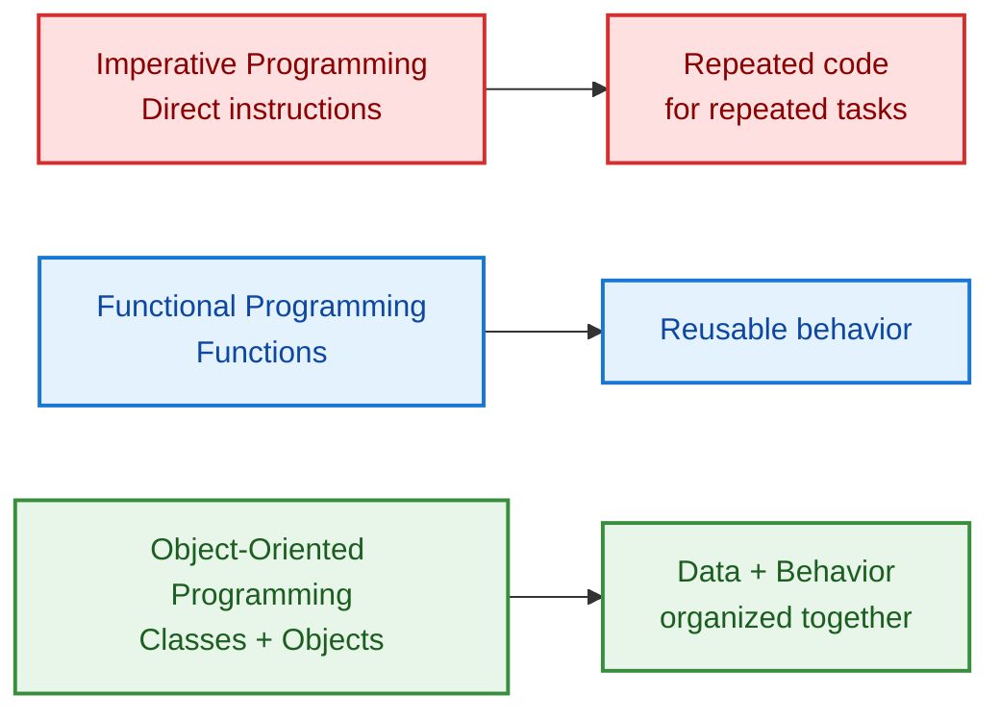

---

# 2. Why Object-Oriented Programming?

The lecture highlights several reasons for using OOP.

## 2.1 Reusability

A class can act as a reusable blueprint.

We create multiple objects from the same class instead of rewriting the same structure repeatedly.

## 2.2 Easier Management of Large Programs

Large systems often contain many kinds of entities.

Examples:

- students,
- teachers,
- customers,
- bank accounts,
- products,
- vehicles.

OOP helps organize these into separate classes.

## 2.3 Less Repetition

Common data and behavior can be placed in:

- parent classes,
- reusable methods,
- shared class structures.

## 2.4 Better Control of Data

The lecture connects OOP with protecting information through **encapsulation**.

## 2.5 Real-World Modeling

Objects can represent real entities:

| Real-world entity | Possible Python object |
|---|---|
| Student | `Student()` |
| Teacher | `Teacher()` |
| Car | `Car()` |
| Bank account | `BankAccount()` |
| Bag | `Bag()` |

---

# 3. Class — The Blueprint

## 3.1 What is a Class?

A class is described in the lecture as a **blueprint for creating objects**.

Think of an architectural blueprint.

A blueprint might specify:

- rooms,
- windows,
- doors,
- dimensions.

But the blueprint itself is not the actual house.

Similarly:

> A class describes what data and behavior its objects should have.

---

## 3.2 Car Factory Analogy

The transcript uses a car-factory-style analogy.

A factory blueprint may ask for:

- body type,
- tyre configuration,
- engine type.

Different inputs can produce different objects.

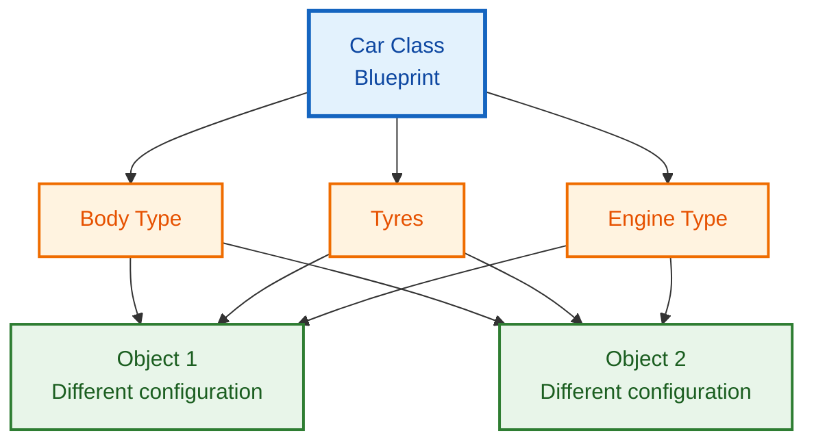

---

## 3.3 Python Class Syntax

```python
class Car:
    # This variable is defined inside the class.
    # It is therefore an attribute of the class.
    category = "Vehicle"

    def hello(self):
        # A function defined inside a class is called a method.
        print("Hello from Car")
```

### Important points

- Use the keyword `class`.
- Follow it with the class name.
- End the class header with `:`.
- Indent everything belonging to the class.

---

# 4. Object — An Instance of a Class

## 4.1 What is an Object?

The lecture defines an object as an **instance of a class**.

If the class is a blueprint, an object is something actually created using the blueprint.

---

## 4.2 Bag Factory Analogy

Suppose a bag factory blueprint requires:

- material,
- number of zips,
- number of pockets.

Different companies can request different combinations.

The class is the factory blueprint.

The produced bags are objects.

---

## 4.3 Creating an Object

```python
class Bags:
    # A class attribute.
    name = "Bag Factory"

# Call the class to create an object.
rebook = Bags()

# Create another independent object.
campus = Bags()
```

Now:

- `rebook` is an object,
- `campus` is another object,
- both are instances of `Bags`.

---

## 4.4 One Class, Many Objects

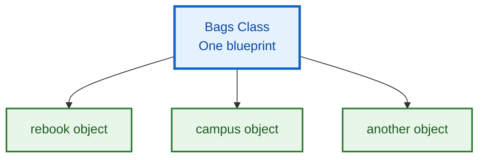

---

# 5. Attributes and Methods

The lecture says two major things are stored in classes:

1. **attributes**
2. **methods**

---

## 5.1 Attribute

An attribute is essentially data associated with a class or object.

```python
class Animal:
    # Because this variable is inside the class,
    # it is an attribute.
    a = 12
```

---

## 5.2 Method

A method is a function defined inside a class.

```python
class Animal:
    def hello(self):
        # This is a method because it belongs to the class.
        print("How are you?")
```

---

## 5.3 Accessing Members

The lecture demonstrates dot notation.

```python
class Car:
    a = 12

    def hello(self):
        print("How are you?")

# Access class attribute using ClassName.attribute
print(Car.a)

# Create an object.
obj = Car()

# Access the method using the object.
obj.hello()
```

### Dot notation pattern

```text
object.attribute
object.method()

ClassName.attribute
```

---

# 6. Constructor `__init__`

## 6.1 Why Do We Need a Constructor?

Suppose the bag class must create objects having their own:

- material,
- zips,
- pockets.

We need a way to send information while creating an object.

The lecture introduces the constructor for this purpose.

---

## 6.2 What is `__init__`?

`__init__` is a special method that runs automatically when an object is created.

```python
class Bags:
    def __init__(self, material, zips, pockets):
        # Save the supplied material in the current object.
        self.material = material

        # Save the zip count in the current object.
        self.zips = zips

        # Save the pocket count in the current object.
        self.pockets = pockets
```

---

## 6.3 Creating Objects with Different Data

```python
# Create one bag object.
rebook = Bags("Leather", 3, 2)

# Create another bag object with different data.
campus = Bags("Polyester", 2, 4)

# Each object stores its own values.
print(rebook.material)   # Leather
print(campus.material)   # Polyester
```

---

## 6.4 Constructor Flow

```mermaid
flowchart LR
    A["Call Bags(...)"] --> B["Python creates new object"]
    B --> C["__init__ runs automatically"]
    C --> D["self refers to current object"]
    D --> E["self.material = material"]
    D --> F["self.zips = zips"]
    D --> G["self.pockets = pockets"]
    E --> H["Configured object ready"]
    F --> H
    G --> H

    classDef call fill:#E3F2FD,stroke:#1565C0,color:#0D47A1,stroke-width:2px;
    classDef init fill:#FFF3E0,stroke:#EF6C00,color:#E65100,stroke-width:2px;
    classDef selfNode fill:#F3E5F5,stroke:#7B1FA2,color:#4A148C,stroke-width:3px;
    classDef data fill:#E8F5E9,stroke:#2E7D32,color:#1B5E20,stroke-width:2px;
    classDef done fill:#FCE4EC,stroke:#C2185B,color:#880E4F,stroke-width:2px;

    class A,B call;
    class C init;
    class D selfNode;
    class E,F,G data;
    class H done;
```

---

# 7. `self` — Current Object Reference

## 7.1 Lecture Intuition

The transcript explains `self` using the idea of targeting the location of the current object.

A more programming-oriented wording consistent with that intuition is:

> `self` is the reference through which an instance method works with the **current object**.

The lecture visualizes different objects as occupying different locations, and `self` lets the class store values on the correct object.

---

## 7.2 Example

```python
class Animal:
    def __init__(self, name):
        # self.name belongs specifically to the object
        # currently being created.
        self.name = name

# First object.
lion = Animal("Lion")

# Second object.
giraffe = Animal("Giraffe")

print(lion.name)      # Lion
print(giraffe.name)   # Giraffe
```

The same constructor creates both objects, but each object preserves its own state.

---

## 7.3 Why Does an Instance Method Need `self`?

Consider:

```python
class Bags:
    def details():
        print("This company creates bags")
```

Calling:

```python
obj = Bags()
obj.details()
```

leads to the kind of positional-argument problem discussed in the transcript, because Python passes the instance when invoking an instance method.

The corrected version is:

```python
class Bags:
    def details(self):
        # self receives the current instance.
        print("This company creates bags")
```

---

# 8. Class vs Instance Attributes

## 8.1 Class Attribute

A variable defined directly in the class body is presented as a **class attribute**.

```python
class Animal:
    # Shared class-level attribute.
    kingdom = "Animalia"
```

Access:

```python
print(Animal.kingdom)
```

---

## 8.2 Instance Attribute

An attribute created using `self` belongs to an individual object.

```python
class Animal:
    def __init__(self, name):
        # Instance-specific attribute.
        self.name = name
```

Create different instances:

```python
lion = Animal("Lion")
tiger = Animal("Tiger")

print(lion.name)
print(tiger.name)
```

---

## 8.3 Comparison

| Feature | Class Attribute | Instance Attribute |
|---|---|---|
| Defined | Directly inside class | Usually through `self` |
| Belongs conceptually to | Class | Individual object |
| Typical access | `ClassName.attr` | `object.attr` |
| Same for all objects initially? | Usually yes | Can differ |

---

# 9. Instance, Class, and Static Methods

The transcript later distinguishes three method styles.

---

## 9.1 Instance Method

Uses `self`.

```python
class Animal:
    def __init__(self, name):
        self.name = name

    def details(self):
        # Uses data stored in this specific object.
        print(f"Animal name: {self.name}")
```

Use when behavior depends on an individual object.

---

## 9.2 Class Method

Uses `@classmethod` and conventionally receives `cls`.

```python
class Animal:
    category = "Living Being"

    @classmethod
    def show_category(cls):
        # cls refers to the class.
        print(cls.category)

Animal.show_category()
```

### When?

Use a class method when behavior logically concerns the class rather than one specific instance.

---

## 9.3 Static Method

Uses `@staticmethod`.

```python
class Animal:
    @staticmethod
    def is_valid_name(name):
        # No instance state or class state is needed.
        return len(name) > 0

print(Animal.is_valid_name("Lion"))
```

### When?

Use a static method when:

- the function belongs conceptually to the class,
- but it does not need `self`,
- and it does not need `cls`.

---

## 9.4 Method Decision Diagram

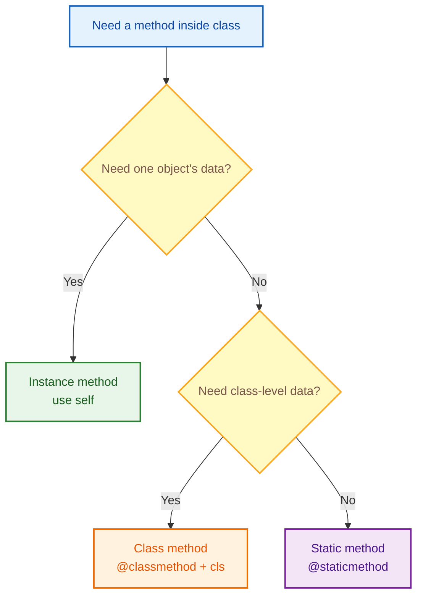

---

# 10. The Four Pillars of OOP

The lecture introduces four central OOP ideas:

1. Encapsulation
2. Abstraction
3. Polymorphism
4. Inheritance

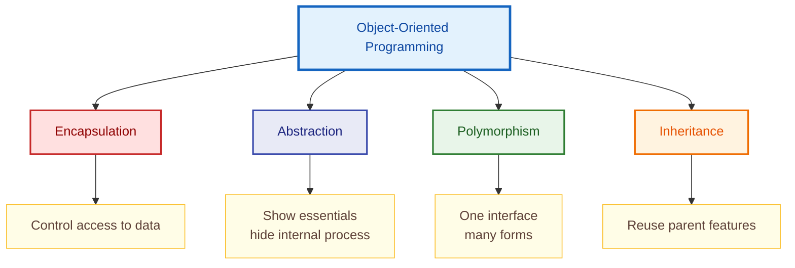

---

# 11. Inheritance

## 11.1 What is Inheritance?

Inheritance allows one class to acquire functionality from another class.

The lecture uses the parent-child analogy:

> A child inherits characteristics from its parent.

In code:

- parent class = base class,
- child class = derived class.

---

## 11.2 Basic Example

```python
class BagFactory:
    def __init__(self, material, zips, pockets):
        # Parent constructor stores common bag information.
        self.material = material
        self.zips = zips
        self.pockets = pockets

    def details(self):
        # Parent method available to child objects.
        print(self.material, self.zips, self.pockets)


class Reebok(BagFactory):
    # No new code is required yet.
    # Reebok inherits from BagFactory.
    pass


# Child object can use parent constructor.
bag = Reebok("Leather", 3, 2)

# Child object can use parent method.
bag.details()
```

---

## 11.3 Why Use Inheritance?

Use inheritance when multiple classes share a meaningful common structure.

For example:

```text
Person
├── Student
└── Teacher
```

Both Student and Teacher may share:

- name,
- age,
- email,
- validation logic.

Their specialized behavior can remain in separate child classes.

---

# 12. `super()`

`super()` is used in the lecture to work with functionality from the parent class.

Suppose the child adds one more property: `color`.

```python
class BagFactory:
    def __init__(self, material, zips, pockets):
        self.material = material
        self.zips = zips
        self.pockets = pockets


class Reebok(BagFactory):
    def __init__(self, material, zips, pockets, color):
        # Initialize the parent portion of the object.
        super().__init__(material, zips, pockets)

        # Add child-specific information.
        self.color = color
```

Create object:

```python
bag = Reebok("Leather", 3, 2, "Black")

print(bag.material)
print(bag.color)
```

---

## 12.1 Why `super()`?

Without calling the parent initialization logic, the child would need to repeat:

```python
self.material = material
self.zips = zips
self.pockets = pockets
```

`super()` encourages reuse.

---

# 13. Types of Inheritance

The transcript discusses several forms.

---

## 13.1 Single-Level Inheritance

One child inherits from one parent.

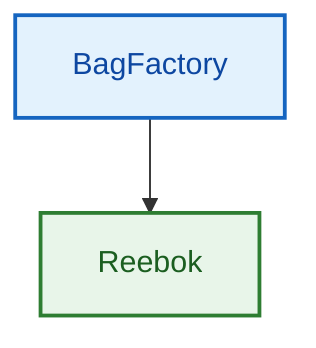

```python
class Parent:
    pass

class Child(Parent):
    pass
```

---

## 13.2 Multilevel Inheritance

A class inherits from a class that itself inherits from another class.

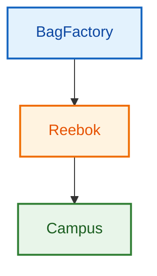

```python
class BagFactory:
    pass

class Reebok(BagFactory):
    pass

class Campus(Reebok):
    pass
```

---

## 13.3 Multiple Inheritance

One child inherits from more than one parent.

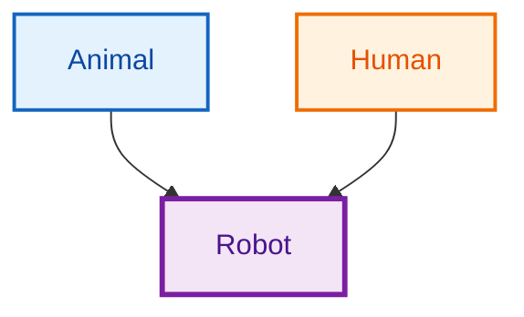

```python
class Animal:
    def animal_feature(self):
        print("Animal feature")


class Human:
    def human_feature(self):
        print("Human feature")


class Robot(Animal, Human):
    pass


robot = Robot()

# Inherited from Animal.
robot.animal_feature()

# Inherited from Human.
robot.human_feature()
```

---

# 14. Method Resolution Order — MRO

When multiple inheritance is used, Python needs an order for searching for attributes and methods.

The transcript introduces this under **MRO — Method Resolution Order**.

Suppose:

```python
class Animal:
    def show(self):
        print("Animal")


class Human:
    def show(self):
        print("Human")


class Robot(Animal, Human):
    pass
```

If:

```python
robot = Robot()
robot.show()
```

both parents contain `show()`.

Python uses its method-resolution order to determine which implementation is selected.

The order of bases in:

```python
class Robot(Animal, Human):
```

is therefore important to the lookup sequence discussed in the lecture.

---

# 15. Polymorphism

## 15.1 What is Polymorphism?

The lecture defines polymorphism as **many forms**.

A single operation or method name may behave differently depending on the object involved.

Real-life analogy from the lecture:

> A phone can serve multiple roles such as camera and calculator.

---

## 15.2 Same Method Name, Different Behavior

```python
class Animal:
    def speak(self):
        print("Animal sound")


class Human:
    def speak(self):
        print("Human speech")


animal = Animal()
human = Human()

animal.speak()  # Animal behavior
human.speak()   # Human behavior
```

The method name is the same:

```python
speak()
```

but the behavior depends on the object.

---

# 16. Method Overriding

Method overriding happens through inheritance.

A child class defines a method with the same name as a parent method.

```python
class Parent:
    def details(self):
        print("Parent details")


class Child(Parent):
    def details(self):
        # This implementation overrides Parent.details()
        print("Child details")


obj = Child()
obj.details()
```

Output:

```text
Child details
```

---

## 16.1 Calling the Parent Version Deliberately

The lecture also demonstrates using `super()`.

```python
class Parent:
    def details(self):
        print("Parent details")


class Child(Parent):
    def details(self):
        # Call parent implementation first.
        super().details()

        # Then add child-specific behavior.
        print("Child details")
```

Now calling:

```python
Child().details()
```

executes both behaviors.

---

# 17. Method Overloading in Python

The transcript contrasts Python with languages such as Java/C++ and explains that traditional same-name, different-signature method overloading does not work in the same way.

If we write:

```python
class Calculator:
    def add(self, a, b):
        return a + b

    def add(self, a, b, c):
        return a + b + c
```

the later definition replaces the earlier one in the class body.

---

## 17.1 Simulating Different Argument Counts

The transcript demonstrates a default-argument style.

```python
class Calculator:
    def add(self, a, b, c=None):
        # If no third value is supplied,
        # add only a and b.
        if c is None:
            return a + b

        # Otherwise add all three.
        return a + b + c


calc = Calculator()

print(calc.add(10, 20))
print(calc.add(10, 20, 30))
```

This gives flexible behavior, although the lecture emphasizes that it is not traditional method overloading.

---

# 18. Duck Typing

The transcript introduces the famous idea:

> If it walks like a duck and quacks like a duck, treat it like a duck.

In Python, a function often cares about what an object **can do**, not necessarily its exact class.

---

## 18.1 Example

```python
class Dog:
    def talk(self):
        print("Bark")


class Human:
    def talk(self):
        print("Hello")


def make_it_talk(obj):
    # We do not check whether obj is Dog or Human.
    # We only expect the object to provide talk().
    obj.talk()


make_it_talk(Dog())
make_it_talk(Human())
```

The same function works with multiple unrelated object types because they share the expected behavior.

---

# 19. Encapsulation

## 19.1 What is Encapsulation?

The lecture frames encapsulation as:

- protecting data,
- hiding information,
- controlling how data is accessed or modified.

A motivating example is a bank balance.

We normally do not want arbitrary outside code freely changing sensitive state.

---

## 19.2 Why Use Encapsulation?

It helps:

- prevent accidental modification,
- protect internal state,
- create cleaner interfaces,
- control interaction with data.

---

## 19.3 Real-Life Analogy

The lecture compares:

- a paid class where only authorized people can enter,
- an open ground where anyone can listen.

The first represents stronger control over access.

---

# 20. Public, Protected, and Private Members

The lecture explains three naming/access styles.

---

## 20.1 Public

No leading underscore.

```python
class User:
    def __init__(self, name):
        # Public attribute.
        self.name = name
```

Access:

```python
u = User("Akarsh")
print(u.name)
u.name = "Updated"
```

---

## 20.2 Protected-Style

Single leading underscore.

```python
class User:
    def __init__(self, name):
        # The lecture presents this as protected-style naming.
        self._name = name
```

The transcript explicitly notes that Python does not enforce protected access in the same strict way; the underscore is used as a convention signalling that developers should treat the member as non-public.

---

## 20.3 Private-Style in the Lecture

Double leading underscore.

```python
class BankAccount:
    def __init__(self, balance):
        # The lecture presents __balance as a private member.
        self.__balance = balance

    def show_balance(self):
        # A method inside the same class can work with it.
        print(self.__balance)
```

Usage:

```python
account = BankAccount(5000)

# Use the controlled public method.
account.show_balance()
```

> **Source-focused note:** The lecture explains the double-underscore form as the private-access style and demonstrates accessing such data through class methods rather than directly from outside.

---

## 20.4 Encapsulation Diagram

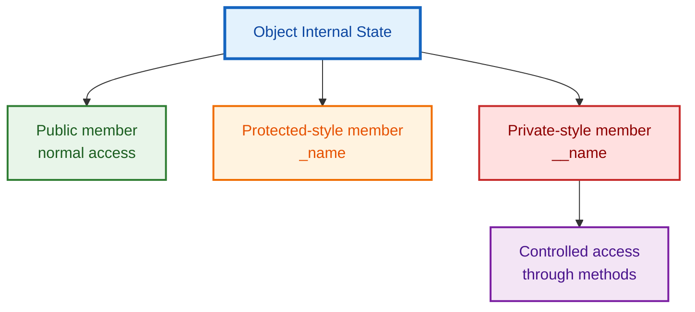

---

# 21. Abstraction

## 21.1 What is Abstraction?

Abstraction means:

> Show the essential interface while hiding unnecessary implementation detail.

The lecture uses examples such as:

- a plug board,
- a shipping box.

You use the interface without needing to know every internal mechanism.

---

## 21.2 Why Use Abstraction?

Suppose every vehicle in a system must provide:

```python
engine_start()
```

We can define a common requirement and force specialized classes to implement it.

This makes the architecture predictable.

---

# 22. Abstract Base Classes

The transcript uses Python's `abc` module.

```python
from abc import ABC, abstractmethod
```

---

## 22.1 Example

```python
from abc import ABC, abstractmethod


class Enforce(ABC):
    @abstractmethod
    def engine_start(self):
        # No concrete behavior is provided here.
        # Child classes must provide it.
        pass


class Bike(Enforce):
    def engine_start(self):
        # Required implementation.
        print("Bike engine started")


class Car(Enforce):
    def engine_start(self):
        # Different implementation of the same contract.
        print("Car engine started")
```

---

## 22.2 What if a Child Does Not Implement the Abstract Method?

The lecture explains that a class inheriting from the abstract class is expected to implement the required abstract method before its object can be used normally.

This is compared to a franchise system:

> A franchise must follow certain compulsory rules.

---

## 22.3 Abstraction Flow

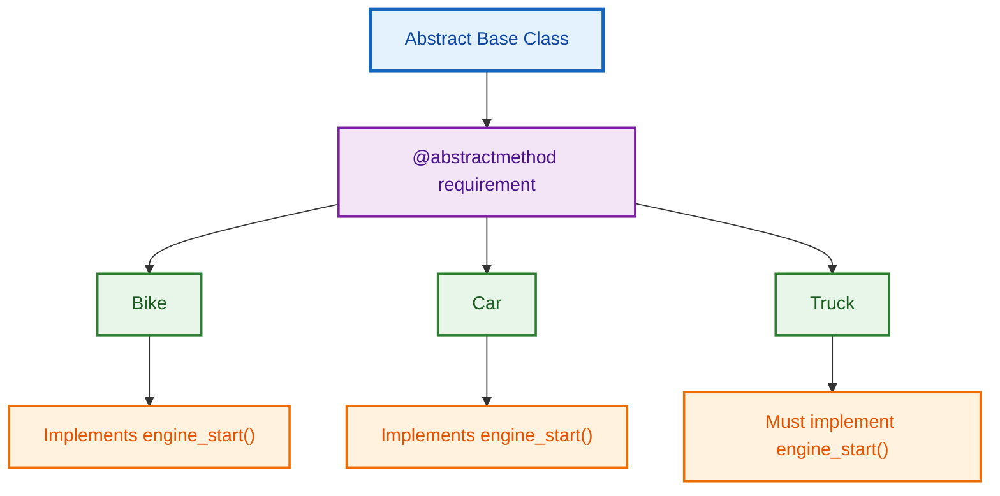

---

# 23. Dunder / Magic Methods

## 23.1 What are Dunder Methods?

"Dunder" means **double underscore**.

Examples:

```python
__init__
__str__
__add__
__eq__
```

The lecture describes them as special methods that Python invokes automatically for certain object operations.

---

## 23.2 Why Are They Important?

They allow user-defined classes to participate in familiar Python operations.

For example:

- printing an object,
- adding objects with `+`,
- comparing objects with `==`.

---

# 24. `__str__`, `__add__`, and `__eq__`

## 24.1 `__str__`

Without custom string behavior, printing an object may show a generic object representation.

```python
class Person:
    def __init__(self, name):
        self.name = name

    def __str__(self):
        # Define what str(object) / print(object) should display.
        return f"Hello, my name is {self.name}"


p = Person("Akarsh")
print(p)
```

---

## 24.2 `__add__`

The lecture builds a class that can add two wrapped numbers.

```python
class Numbers:
    def __init__(self, num):
        # Store the numeric value in the object.
        self.num = num

    def __add__(self, other):
        # Define what self + other should mean.
        return self.num + other.num


num1 = Numbers(10)
num2 = Numbers(20)

print(num1 + num2)  # Calls num1.__add__(num2)
```

---

## 24.3 `__eq__`

```python
class Numbers:
    def __init__(self, num):
        self.num = num

    def __eq__(self, other):
        # Define equality using the internal number.
        return self.num == other.num


a = Numbers(10)
b = Numbers(10)

print(a == b)
```

---

## 24.4 Automatic Dispatch Intuition

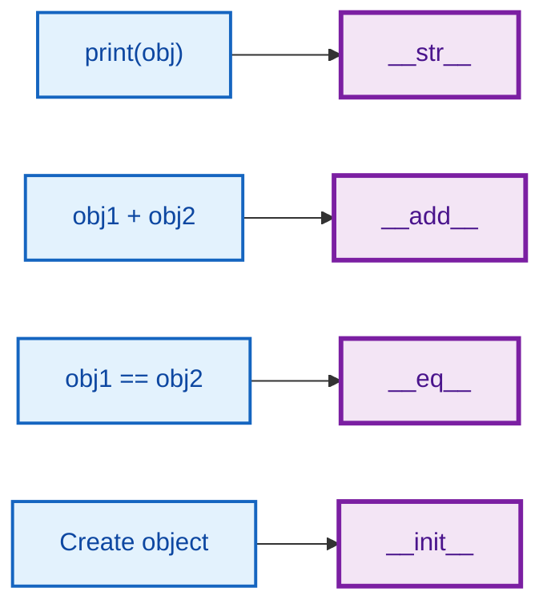

---

# 25. Python Objects Everywhere

A major intuition emphasized in the transcript is that familiar Python types are themselves built around classes and methods.

The lecture mentions types such as:

- integer,
- float,
- string,
- list,
- tuple,
- dictionary.

It also demonstrates inspecting built-in functionality using something like:

```python
# Explore members available on the int type.
print(dir(int))
```

This reveals many special methods.

---

## 25.1 Why Does This Matter?

When you write:

```python
10 + 20
```

Python has operator behavior associated with numeric objects.

When you write:

```python
my_list.append(5)
```

you are invoking a method attached to the list object.

This makes OOP relevant even before learners explicitly write their own classes.

---

# 26. Decorators

## 26.1 What is a Decorator?

The lecture introduces decorators as a way to wrap a function and add behavior without rewriting the function's main logic.

Analogy:

> A decorator is like adding wrapping/frosting around an existing item.

---

## 26.2 Basic Function Before Decoration

```python
def greetings():
    # Original function.
    print("Good Morning")
```

Suppose we want:

- something before it,
- the original behavior,
- something after it.

---

## 26.3 Cleaned Decorator Reconstruction

```python
def extra_greeting(func):
    # The decorator receives the original function.

    def wrapper():
        # Extra behavior before the original function.
        print("Hello!")

        # Execute the original function.
        func()

        # Extra behavior after the original function.
        print("Have a great day!")

    # Return the new wrapped function.
    return wrapper


@extra_greeting
def greetings():
    # Main function remains focused on its own job.
    print("Good Morning")


greetings()
```

---

## 26.4 Decorator Flow

```mermaid
flowchart LR
    A["Original function"] --> B["Decorator"]
    B --> C["Wrapper"]
    C --> D["Before behavior"]
    D --> E["Original function runs"]
    E --> F["After behavior"]

    classDef original fill:#E3F2FD,stroke:#1565C0,color:#0D47A1,stroke-width:2px;
    classDef decorator fill:#F3E5F5,stroke:#7B1FA2,color:#4A148C,stroke-width:3px;
    classDef extra fill:#FFF3E0,stroke:#EF6C00,color:#E65100,stroke-width:2px;
    classDef main fill:#E8F5E9,stroke:#2E7D32,color:#1B5E20,stroke-width:2px;

    class A original;
    class B,C decorator;
    class D,F extra;
    class E main;
```

---

## 26.5 Familiar Decorators from OOP

The lecture has already used:

```python
@classmethod
```

```python
@staticmethod
```

```python
@abstractmethod
```

So the decorator syntax is not entirely new by the time custom decorators appear.

---

# 27. `*args`

## 27.1 Problem

A normal function may expect a fixed number of positional arguments.

```python
def addition(a, b):
    return a + b
```

Calling:

```python
addition(10, 20, 30)
```

would supply more positional arguments than the function expects.

---

## 27.2 Use `*args`

```python
def addition(*args):
    # args collects all positional arguments into a tuple.
    total = 0

    # Visit every supplied value.
    for value in args:
        total += value

    return total


print(addition(10, 20))
print(addition(10, 20, 30, 40))
```

---

## 27.3 Key Idea

Inside the function:

```python
args
```

behaves like a tuple of positional arguments.

---

# 28. `**kwargs`

## 28.1 Why?

Sometimes we do not know in advance how many named pieces of information will be supplied.

The lecture uses a person-information example.

```python
def information(**kwargs):
    # kwargs stores keyword arguments as a dictionary.
    print(kwargs)


information(
    name="Akarsh",
    age=24,
    profession="Data Scientist"
)
```

Conceptually:

```python
{
    "name": "Akarsh",
    "age": 24,
    "profession": "Data Scientist"
}
```

---

## 28.2 `*args` vs `**kwargs`

| Feature | `*args` | `**kwargs` |
|---|---|---|
| Captures | Positional arguments | Keyword arguments |
| Typical internal form | Tuple | Dictionary |
| Example | `f(1,2,3)` | `f(name="A", age=24)` |

---

# 29. Decorators with `*args` and `**kwargs`

A wrapper with no parameters cannot transparently wrap every possible function.

The transcript connects decorators with flexible argument forwarding.

```python
def decorator(func):
    def wrapper(*args, **kwargs):
        # Code before wrapped function.
        print("Before function")

        # Forward all positional and keyword arguments.
        result = func(*args, **kwargs)

        # Code after wrapped function.
        print("After function")

        # Preserve the wrapped function's result.
        return result

    return wrapper


@decorator
def add(a, b):
    # Normal function with parameters.
    return a + b


print(add(10, 20))
```

---

# 30. Ternary / Conditional Expressions

The transcript introduces writing a simple `if/else` condition on one line.

---

## 30.1 Standard Form

```python
value_if_true if condition else value_if_false
```

Example:

```python
a = 10

result = "Even" if a % 2 == 0 else "Odd"

print(result)
```

---

## 30.2 Direct Printing Form

```python
a = 11

print("Even") if a % 2 == 0 else print("Odd")
```

This is concise, although readability should remain the priority.

---

# 31. List Comprehension

## 31.1 Traditional Loop

Suppose we want even numbers from a list.

```python
numbers = [1, 2, 3, 4, 5, 6, 7, 8, 9, 10, 11, 12, 13, 14, 15]

even_numbers = []

for number in numbers:
    # Keep only even values.
    if number % 2 == 0:
        even_numbers.append(number)

print(even_numbers)
```

---

## 31.2 List Comprehension

The same idea can be written compactly:

```python
numbers = [1, 2, 3, 4, 5, 6, 7, 8, 9, 10, 11, 12, 13, 14, 15]

# expression  | loop             | condition
even_numbers = [n for n in numbers if n % 2 == 0]

print(even_numbers)
```

---

## 31.3 General Pattern

```python
[expression for item in iterable if condition]
```

---

## 31.4 Comprehension Flow

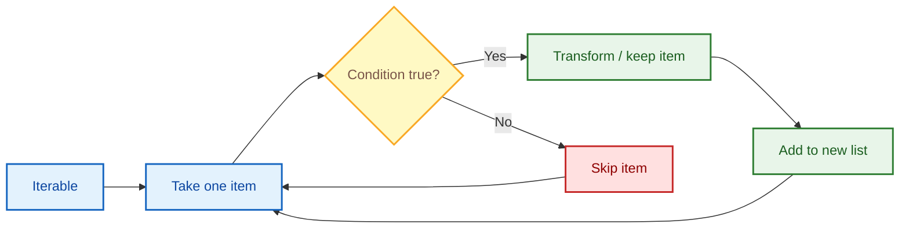

---

# 32. Dictionary and Set Comprehension

## 32.1 Dictionary Comprehension

A dictionary needs key-value pairs.

```python
numbers = [1, 2, 3, 4, 5]

# Key = number
# Value = square of the number
squares = {n: n * n for n in numbers}

print(squares)
```

General pattern:

```python
{key_expression: value_expression for item in iterable}
```

---

## 32.2 Set Comprehension

```python
numbers = [1, 2, 2, 3, 3, 4]

# A set automatically keeps unique values.
unique_squares = {n * n for n in numbers}

print(unique_squares)
```

General pattern:

```python
{expression for item in iterable}
```

---

# 33. Lambda Functions

## 33.1 What is a Lambda?

The lecture introduces lambda as a short anonymous function.

General syntax:

```python
lambda parameters: expression
```

---

## 33.2 Addition

```python
addition = lambda a, b: a + b

print(addition(10, 20))
```

Equivalent normal function:

```python
def addition(a, b):
    return a + b
```

---

## 33.3 Even / Odd Example

```python
check = lambda a: "Even" if a % 2 == 0 else "Odd"

print(check(10))
print(check(11))
```

---

## 33.4 Lambda with Flexible Arguments

Aligned with the transcript's discussion of `*args`:

```python
addition = lambda *args: sum(args)

print(addition(10, 20, 30, 40))
```

---

# 34. `map()`

## 34.1 What Does `map()` Do?

`map()` applies a function to every item of an iterable.

Conceptually:

$$
x_i \longrightarrow f(x_i)
$$

for each element.

---

## 34.2 Example: Length of Names

```python
names = ["Sarthak", "Akarsh", "Harsh", "Vedant"]

# Apply len() to every string.
lengths = map(len, names)

# map returns a map object, so convert it to a list for display.
print(list(lengths))
```

---

## 34.3 Celsius to Fahrenheit

The conversion formula demonstrated in the source is:

$$
F=C\times\frac{9}{5}+32
$$

```python
temperatures_c = [0, 10, 20, 30, 40]

def celsius_to_fahrenheit(c):
    # Apply F = C * 9/5 + 32.
    return c * 9 / 5 + 32

temperatures_f = list(map(celsius_to_fahrenheit, temperatures_c))

print(temperatures_f)
```

With lambda:

```python
temperatures_c = [0, 10, 20, 30, 40]

temperatures_f = list(
    map(
        lambda c: c * 9 / 5 + 32,  # Conversion formula
        temperatures_c
    )
)

print(temperatures_f)
```

---

# 35. `filter()`

## 35.1 What Does `filter()` Do?

`filter()` keeps values for which a function returns a truthy result.

The transcript uses marks and a passing threshold.

```python
marks = [35, 80, 80, 10, 12, 60, 49]

def passed(mark):
    # Keep marks at or above 40.
    return mark >= 40

passed_marks = filter(passed, marks)

# Convert filter object to list.
print(list(passed_marks))
```

Result:

```python
[80, 80, 60, 49]
```

---

## 35.2 With Lambda

```python
marks = [35, 80, 80, 10, 12, 60, 49]

passed_marks = list(
    filter(
        lambda mark: mark >= 40,  # Selection condition
        marks
    )
)

print(passed_marks)
```

---

# 36. `zip()`

## 36.1 What Does `zip()` Do?

`zip()` combines elements from multiple iterables position by position.

```python
names = ["Sarthak", "Akarsh", "Harsh", "Vedant"]
marks = [12, 90, 42, 6]

combined = list(zip(names, marks))

print(combined)
```

Result:

```python
[
    ("Sarthak", 12),
    ("Akarsh", 90),
    ("Harsh", 42),
    ("Vedant", 6)
]
```

---

## 36.2 Important Behavior from the Lecture

If one iterable is longer than another, normal `zip()` stops when the shortest iterable ends.

```python
names = ["A", "B", "C"]
marks = [10, 20, 30, 40]

print(list(zip(names, marks)))
```

Only three pairs are produced.

---

## 36.3 `map`, `filter`, `zip` Comparison

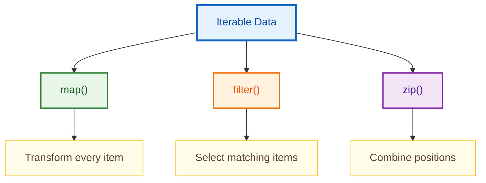

---

# 37. School Management System Project

The final major portion of the transcript applies OOP to a small **School Management System**.

The target features are:

1. Register a student
2. Register a teacher
3. Add grades to a student
4. Show student details
5. Show teacher details

The lecture also stores data in JSON so that it can persist outside the running program.

---

# 38. Project Architecture

## 38.1 Main Components

- JSON file as lightweight persistent storage
- Abstract parent class for shared rules
- `Student` child class
- `Teacher` child class
- Shared email validation
- Registration methods
- Details methods
- Grade management
- Menu-driven interaction

---

## 38.2 OOP Architecture Diagram

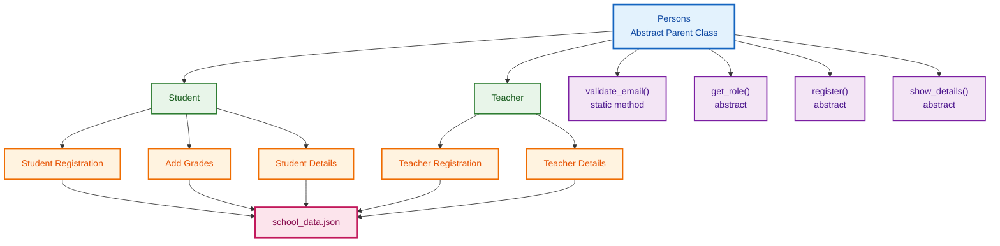

---

## 38.3 Suggested Data Shape from the Transcript

```python
data = {
    "students": [],
    "teachers": []
}
```

A student record can contain:

```python
{
    "name": "Akarsh",
    "age": 20,
    "email": "example@gmail.com",
    "roll_number": "101",
    "grades": {}
}
```

A teacher record can contain:

```python
{
    "name": "Harsh",
    "age": 25,
    "email": "teacher@gmail.com",
    "subject": "Maths",
    "employee_id": "1"
}
```

---

# 39. Complete Commented Project Reconstruction

> The following is a cleaned and commented reconstruction of the school-management program described in the spoken transcript. It stays with the source's feature set: JSON persistence, abstract parent class, student/teacher registration, grade addition, and details lookup.

```python
# Import json so Python dictionaries/lists can be saved
# into and loaded from a JSON file.
import json

# Import ABC and abstractmethod to build an abstract base class.
from abc import ABC, abstractmethod

# Path makes it convenient to check whether a file exists.
from pathlib import Path


# ------------------------------------------------------------
# DATABASE SETUP
# ------------------------------------------------------------

# Name of the local JSON database file.
DATABASE_FILE = Path("school_data.json")

# Default structure used when no saved database exists.
data = {
    "students": [],
    "teachers": []
}


# If the JSON file already exists, load the old data.
if DATABASE_FILE.exists():
    # Open file in read mode.
    with DATABASE_FILE.open("r", encoding="utf-8") as file:
        # Read the file as text.
        content = file.read().strip()

        # Avoid trying to parse an empty file.
        if content:
            # Convert JSON text into Python dictionaries/lists.
            data = json.loads(content)


def save_data():
    """Save the current in-memory data structure to JSON."""

    # Open the database file in write mode.
    with DATABASE_FILE.open("w", encoding="utf-8") as file:
        # json.dump writes Python data directly into the file.
        json.dump(data, file, indent=4)


# ------------------------------------------------------------
# ABSTRACT PARENT CLASS
# ------------------------------------------------------------

class Persons(ABC):
    """Common interface for student and teacher classes."""

    @abstractmethod
    def get_role(self):
        # Every child class must identify its role.
        pass

    @abstractmethod
    def register(self):
        # Every child class must provide registration behavior.
        pass

    @abstractmethod
    def show_details(self):
        # Every child class must provide detail-display behavior.
        pass

    @staticmethod
    def validate_email(email):
        # The transcript uses a simple validation rule:
        # email should contain both '@' and '.'.
        return "@" in email and "." in email


# ------------------------------------------------------------
# STUDENT CLASS
# ------------------------------------------------------------

class Student(Persons):
    """Handle student-specific operations."""

    def get_role(self):
        # Polymorphic implementation for Student.
        return "student"

    def register(self):
        # Collect basic student data.
        name = input("Enter student name: ")
        age = int(input("Enter student age: "))
        email = input("Enter student email: ")
        roll_number = input("Enter student roll number: ")

        # Validate email using the shared static method.
        if not Persons.validate_email(email):
            print("Invalid email.")
            return

        # Check whether this roll number already exists.
        for student in data["students"]:
            if student["roll_number"] == roll_number:
                print("Student with this roll number already exists.")
                return

        # Create a new student dictionary.
        student_record = {
            "name": name,
            "age": age,
            "email": email,
            "roll_number": roll_number,

            # Grades is a nested dictionary because a student
            # can have marks for multiple subjects.
            "grades": {}
        }

        # Add the record to the student list.
        data["students"].append(student_record)

        # Persist the updated database.
        save_data()

        print("Student registered successfully.")

    def add_grades(self):
        # Ask whose grades should be updated.
        roll_number = input("Enter student roll number: ")

        # Find that student.
        for student in data["students"]:
            if student["roll_number"] == roll_number:
                # Collect subject and marks.
                subject = input("Enter subject: ")
                marks = float(input("Enter marks: "))

                # Add or update one subject inside the grades dictionary.
                student["grades"][subject] = marks

                # Save updated data.
                save_data()

                print("Grade added successfully.")
                return

        # This runs if no matching roll number is found.
        print("Student not found.")

    def show_details(self):
        # Ask which student should be displayed.
        roll_number = input("Enter student roll number: ")

        # Search all saved students.
        for student in data["students"]:
            if student["roll_number"] == roll_number:
                grades = student["grades"]

                # If at least one grade exists, calculate the average.
                if grades:
                    average = sum(grades.values()) / len(grades)
                else:
                    # Avoid division by zero when there are no grades.
                    average = 0

                # Display selected information.
                print(f"Name: {student['name']}")
                print(f"Roll Number: {student['roll_number']}")
                print(f"Grades: {student['grades']}")
                print(f"Average: {average}")

                return

        print("Student not found.")


# ------------------------------------------------------------
# TEACHER CLASS
# ------------------------------------------------------------

class Teacher(Persons):
    """Handle teacher-specific operations."""

    def get_role(self):
        # Polymorphic implementation for Teacher.
        return "teacher"

    def register(self):
        # Collect teacher-specific information.
        name = input("Enter teacher name: ")
        age = int(input("Enter teacher age: "))
        email = input("Enter teacher email: ")
        subject = input("Enter subject: ")
        employee_id = input("Enter employee ID: ")

        # Reuse common validation from the parent class.
        if not Persons.validate_email(email):
            print("Invalid email.")
            return

        # Prevent duplicate employee IDs.
        for teacher in data["teachers"]:
            if teacher["employee_id"] == employee_id:
                print("Teacher with this employee ID already exists.")
                return

        # Create teacher record.
        teacher_record = {
            "name": name,
            "age": age,
            "email": email,
            "subject": subject,
            "employee_id": employee_id
        }

        # Add teacher to the database.
        data["teachers"].append(teacher_record)

        # Save the updated structure.
        save_data()

        print("Teacher registered successfully.")

    def show_details(self):
        # Ask which teacher should be displayed.
        employee_id = input("Enter employee ID: ")

        # Search the teacher list.
        for teacher in data["teachers"]:
            if teacher["employee_id"] == employee_id:
                print(f"Name: {teacher['name']}")
                print(f"Subject: {teacher['subject']}")
                print(f"Employee ID: {teacher['employee_id']}")
                return

        print("Teacher not found.")


# ------------------------------------------------------------
# OBJECT CREATION
# ------------------------------------------------------------

# Create one Student service object.
student = Student()

# Create one Teacher service object.
teacher = Teacher()


# ------------------------------------------------------------
# TERMINAL MENU
# ------------------------------------------------------------

print("1. Register Student")
print("2. Register Teacher")
print("3. Add Grades")
print("4. Show Student Details")
print("5. Show Teacher Details")

# Read one menu choice.
choice = int(input("Enter your choice: "))


# Route the selected option to the appropriate object method.
if choice == 1:
    student.register()

elif choice == 2:
    teacher.register()

elif choice == 3:
    student.add_grades()

elif choice == 4:
    student.show_details()

elif choice == 5:
    teacher.show_details()

else:
    print("Invalid choice.")
```

---

# 40. How the Project Demonstrates OOP

## 40.1 Abstraction

`Persons` is an abstract parent class.

It requires child classes to implement:

- `get_role()`,
- `register()`,
- `show_details()`.

---

## 40.2 Inheritance

```python
class Student(Persons):
```

and:

```python
class Teacher(Persons):
```

inherit from the same parent.

---

## 40.3 Polymorphism

Both classes implement:

```python
register()
```

but they do different things.

Student registration collects:

- roll number,
- grades structure.

Teacher registration collects:

- subject,
- employee ID.

Same interface, different behavior.

---

## 40.4 Static Method

Email validation is common to all people.

```python
@staticmethod
def validate_email(email):
    return "@" in email and "." in email
```

It does not depend on a particular `Student` or `Teacher` instance.

---

## 40.5 Data Persistence

The program uses:

```python
json.dump(...)
```

to save data.

The next execution can reload the stored JSON.

---

## 40.6 Project Data Flow

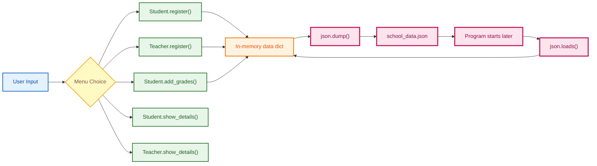

---

# 41. Useful Formula Examples

OOP itself is not formula-heavy, but the transcript contains a few numerical operations.

---

## 41.1 Celsius to Fahrenheit

$$
\boxed{
F=C\times\frac{9}{5}+32
}
$$

Where:

- $C$ = Celsius temperature,
- $F$ = Fahrenheit temperature.

Example for $C=20$:

$$
F=20\times\frac95+32
$$

$$
F=36+32=68
$$

Therefore:

$$
\boxed{20^\circ C=68^\circ F}
$$

---

## 41.2 Average Student Grade

If a student has $n$ grades:

$$
x_1,x_2,\ldots,x_n,
$$

the arithmetic mean is:

$$
\boxed{
\bar{x}
=
\frac{x_1+x_2+\cdots+x_n}{n}
}
$$

or:

$$
\boxed{
\bar{x}
=
\frac{\sum_{i=1}^{n}x_i}{n}
}
$$

In the project:

```python
average = sum(grades.values()) / len(grades)
```

---

# 42. Common Mistakes and Interview Traps

## Mistake 1: Class and Object Are the Same

They are not.

- class = blueprint,
- object = instance created from blueprint.

---

## Mistake 2: Forgetting `self` in Instance Methods

Incorrect:

```python
class User:
    def hello():
        print("Hello")
```

For normal instance usage, write:

```python
class User:
    def hello(self):
        print("Hello")
```

---

## Mistake 3: Confusing Class and Instance Attributes

```python
class Animal:
    category = "Animal"      # Class attribute

    def __init__(self, name):
        self.name = name     # Instance attribute
```

---

## Mistake 4: Assuming `super()` Creates a Parent Object

In the lecture it is used to access/initialize the parent-class portion of the current inheritance chain, not as a replacement for creating a separate parent object.

---

## Mistake 5: Confusing Overriding and Overloading

### Overriding

- inheritance involved,
- child replaces parent method behavior.

### Overloading

- same method name with different parameter signatures,
- transcript explains traditional method overloading is not available in the same way in Python.

---

## Mistake 6: Confusing Encapsulation and Abstraction

### Encapsulation

Focus:

> controlling/protecting internal data.

### Abstraction

Focus:

> exposing essential behavior while hiding implementation details.

---

## Mistake 7: Thinking `@staticmethod` Gets `self`

It does not automatically use instance state.

---

## Mistake 8: Forgetting `return wrapper` in a Decorator

Without returning the wrapper, the decorator does not replace the original function with the wrapped behavior.

---

## Mistake 9: Mixing `*args` and `**kwargs`

Remember:

```python
*args
```

collects positional arguments.

```python
**kwargs
```

collects keyword arguments.

---

## Mistake 10: Forgetting That `map()` and `filter()` Produce Objects

The transcript converts them to lists for visible results:

```python
list(map(...))
list(filter(...))
```

---

## Mistake 11: Assuming `zip()` Preserves Extra Values

Normal `zip()` stops at the shortest iterable.

---

# 43. Quick Revision Cheat Sheet

## Core OOP

| Concept | Meaning | Typical Python syntax |
|---|---|---|
| Class | Blueprint | `class A:` |
| Object | Instance | `obj = A()` |
| Attribute | Data in class/object | `self.name` |
| Method | Function inside class | `def show(self):` |
| Constructor | Runs on initialization | `__init__` |
| Current instance | Object reference | `self` |
| Class method | Works with class | `@classmethod` |
| Static method | Utility tied to class | `@staticmethod` |
| Inheritance | Child reuses parent | `class B(A):` |
| Parent access | Reuse parent implementation | `super()` |
| Polymorphism | Same interface, many forms | same method name |
| Encapsulation | Control data access | naming/access patterns |
| Abstraction | Enforce essential interface | `ABC`, `@abstractmethod` |

---

## Advanced Python

| Topic | Purpose |
|---|---|
| Decorator | Wrap/add behavior to functions |
| `*args` | Variable positional arguments |
| `**kwargs` | Variable keyword arguments |
| Ternary | Compact conditional expression |
| List comprehension | Build list compactly |
| Dict comprehension | Build dict compactly |
| Set comprehension | Build unique set compactly |
| Lambda | Short anonymous function |
| `map()` | Transform each item |
| `filter()` | Select matching items |
| `zip()` | Combine iterables positionally |

---

## Dunder Methods

| Operation | Method |
|---|---|
| Construct object | `__init__` |
| Print/string representation | `__str__` |
| `+` | `__add__` |
| `==` | `__eq__` |

---

# 44. Practice Questions

## Q1. What is the difference between a class and an object?

**Answer:** A class is a blueprint; an object is an actual instance created from that blueprint.

---

## Q2. What does `self` represent?

**Answer:** It refers to the current instance used by an instance method. The transcript visualizes it as targeting the current object's location.

---

## Q3. Why is `__init__` useful?

**Answer:** It runs automatically when an object is created and is used to initialize object-specific attributes.

---

## Q4. What is the difference between an attribute and a method?

**Answer:**

- attribute = data,
- method = behavior/function inside a class.

---

## Q5. What does inheritance solve?

**Answer:** It lets child classes reuse and extend functionality from parent classes.

---

## Q6. What is method overriding?

**Answer:** A child class defines a method with the same name as a parent method and supplies its own behavior.

---

## Q7. What is polymorphism?

**Answer:** One interface or method name can represent different behaviors depending on the object.

---

## Q8. What is duck typing?

**Answer:** Code uses an object based on the methods/behavior it provides rather than requiring one exact concrete type.

---

## Q9. Why use an abstract base class?

**Answer:** To define mandatory methods that derived classes are expected to implement.

---

## Q10. What is the difference between `*args` and `**kwargs`?

**Answer:**

- `*args` collects extra positional arguments,
- `**kwargs` collects extra keyword arguments.

---

## Q11. What does `map()` do?

**Answer:** It applies a function to every item in an iterable.

---

## Q12. What does `filter()` do?

**Answer:** It keeps elements satisfying a condition.

---

## Q13. What happens if iterables passed to `zip()` have different lengths?

**Answer:** Normal `zip()` stops when the shortest iterable is exhausted.

---

## Q14. Why does the project use `grades = {}`?

**Answer:** A student can have multiple subject-grade pairs, making a dictionary suitable for storing subject names as keys and marks as values.

---

## Q15. Where is abstraction used in the project?

**Answer:** The `Persons` abstract class defines required methods such as registration and detail display.

---

# 45. Fun Facts

## Fun Fact 1: OOP Is Already Around You in Python

Even before writing custom classes, you routinely use objects such as:

```python
"hello".upper()
```

```python
[1, 2, 3].append(4)
```

The transcript emphasizes that Python's familiar built-in data types expose methods because they are implemented using object-oriented structures.

---

## Fun Fact 2: Operators Can Trigger Methods

When custom objects support:

```python
a + b
```

Python can route that operation through:

```python
__add__
```

Likewise, equality can involve:

```python
__eq__
```

---

## Fun Fact 3: Decorators Were Already Used Before Being Formally Explained

The lecture uses decorators such as:

```python
@classmethod
```

```python
@staticmethod
```

and:

```python
@abstractmethod
```

before later discussing how custom decorators work.

---

## Fun Fact 4: The Final Project Combines Many Topics at Once

The school-management example brings together:

- OOP,
- abstraction,
- inheritance,
- polymorphism,
- static methods,
- dictionaries,
- lists,
- loops,
- file handling,
- JSON,
- validation.

That is why project-based practice is useful after learning the individual concepts separately.

---

# 46. Transcript Consistency Notes

The spoken transcript contains a few places where speech-to-text or live coding introduces inconsistencies. These notes preserve the lecture's intended concepts instead of silently merging contradictory fragments.

## 46.1 Celsius Formula

The lecture first uses the standard expression:

$$
F=C\times\frac95+32.
$$

Later speech contains a reference resembling `+35`, which conflicts with the earlier formula and demonstrated idea. These notes use the earlier formula presented in the source:

$$
\boxed{F=C\times\frac95+32}.
$$

---

## 46.2 JSON Writing

During the project, the speaker troubleshoots JSON-writing syntax and distinguishes the file-writing form from the string-producing form.

The cleaned project reconstruction uses the corrected file-writing pattern discussed after debugging:

```python
json.dump(data, file)
```

---

## 46.3 Protected / Private Terminology

The notes preserve the source's teaching model:

- `_name` → protected-style member,
- `__name` → private-style member.

The lecture explicitly notes that the single-underscore protected form is based on convention rather than strict enforcement.

---

## 46.4 UI Extension

Near the end, the transcript describes taking the completed Python project and using AI assistance to create a Streamlit-style interface. The focus of the teaching remains the Python/OOP project rather than a detailed Streamlit lesson, so these notes do not invent UI code that is absent from the transcript.

---

## 46.5 Modules and Packages

The transcript says modules/packages will be addressed later in the context of data-science libraries rather than being developed deeply in this lecture.

The later libraries mentioned include:

- NumPy,
- Pandas,
- Matplotlib,
- Seaborn.

---

# 47. Final Concept Map

```mermaid
flowchart TD
    A["Python Programming"] --> B["Imperative"]
    A --> C["Functional"]
    A --> D["Object-Oriented"]

    D --> E["Class"]
    D --> F["Object"]
    E --> G["Attributes"]
    E --> H["Methods"]
    F --> I["Instance State"]
    I --> J["self"]
    J --> K["__init__ Constructor"]

    D --> L["Four OOP Pillars"]
    L --> M["Inheritance"]
    L --> N["Polymorphism"]
    L --> O["Encapsulation"]
    L --> P["Abstraction"]

    M --> Q["super()"]
    M --> R["MRO"]
    N --> S["Overriding"]
    N --> T["Duck Typing"]
    O --> U["Public / Protected / Private"]
    P --> V["ABC + abstractmethod"]

    D --> W["Dunder Methods"]
    W --> W1["__str__"]
    W --> W2["__add__"]
    W --> W3["__eq__"]

    A --> X["Advanced Python"]
    X --> Y["Decorators"]
    X --> Z["*args / **kwargs"]
    X --> AA["Comprehensions"]
    X --> AB["Lambda"]
    X --> AC["map / filter / zip"]

    D --> AD["School Management Project"]
    X --> AD
    AD --> AE["Student"]
    AD --> AF["Teacher"]
    AD --> AG["JSON Persistence"]

    classDef root fill:#E3F2FD,stroke:#1565C0,color:#0D47A1,stroke-width:3px;
    classDef paradigm fill:#FFF3E0,stroke:#EF6C00,color:#E65100,stroke-width:2px;
    classDef oop fill:#E8F5E9,stroke:#2E7D32,color:#1B5E20,stroke-width:2px;
    classDef pillar fill:#F3E5F5,stroke:#7B1FA2,color:#4A148C,stroke-width:2px;
    classDef advanced fill:#FFF9C4,stroke:#F9A825,color:#795548,stroke-width:2px;
    classDef project fill:#FCE4EC,stroke:#C2185B,color:#880E4F,stroke-width:3px;

    class A root;
    class B,C,D paradigm;
    class E,F,G,H,I,J,K oop;
    class L,M,N,O,P,Q,R,S,T,U,V,W,W1,W2,W3 pillar;
    class X,Y,Z,AA,AB,AC advanced;
    class AD,AE,AF,AG project;
```

---

# Final Revision Summary

The central progression of the transcript is:

$$
\boxed{
\text{Class}
\rightarrow
\text{Object}
\rightarrow
\text{Constructor}
\rightarrow
\text{Attributes/Methods}
\rightarrow
\text{OOP Pillars}
\rightarrow
\text{Advanced Python}
\rightarrow
\text{Project}
}
$$

The most important mental models are:

- **Class** = blueprint.
- **Object** = instance created from the blueprint.
- **Attribute** = stored data.
- **Method** = behavior.
- **`self`** = reference to the current instance.
- **`__init__`** = initialize a newly created object.
- **Inheritance** = reuse parent behavior.
- **Polymorphism** = same interface, different forms.
- **Encapsulation** = control access to data.
- **Abstraction** = expose essential behavior and hide unnecessary internal details.
- **Dunder methods** = special hooks used by Python operations.
- **Decorators** = wrap functions with additional behavior.
- **`*args` / `**kwargs`** = flexible argument collection.
- **Comprehensions** = compact collection construction.
- **Lambda** = short anonymous function.
- **`map()`** = transform.
- **`filter()`** = select.
- **`zip()`** = combine positionally.

The final project demonstrates how these ideas can be combined into a small but structured application rather than being learned as isolated syntax.
