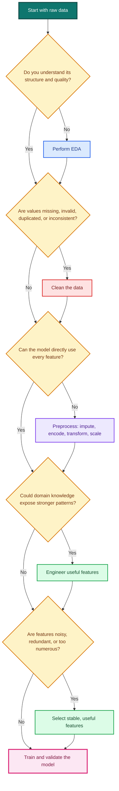
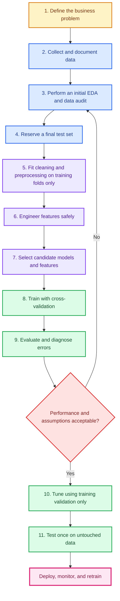
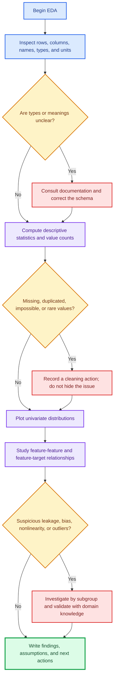
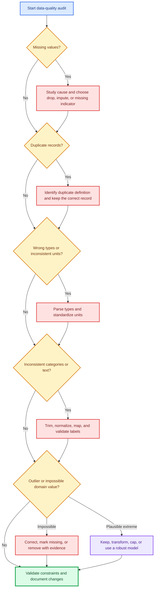
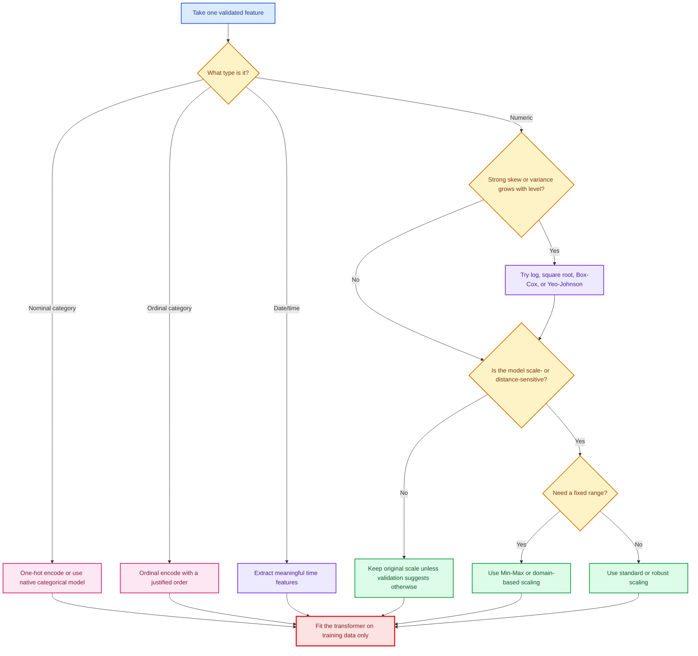
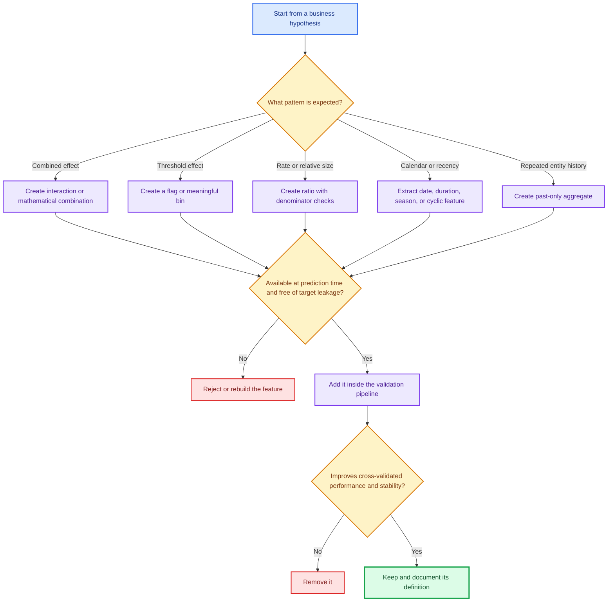
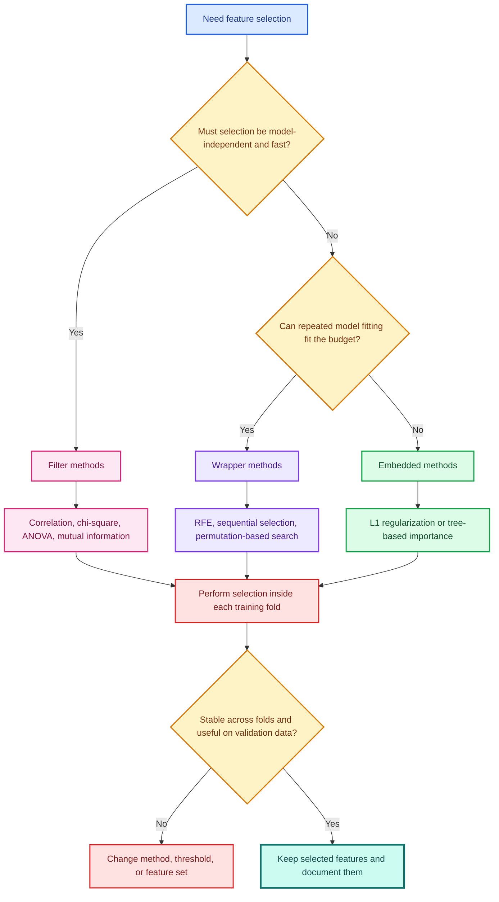

# Exploratory Data Analysis, Data Cleaning, Preprocessing, Feature Engineering, and Feature Selection

Detailed machine learning notes expanded from **Machine Learning (2).pdf**

> **Core idea:** Raw data is not automatically model-ready. First understand it, then repair it, translate it into a form an algorithm can use, create stronger signals, and finally keep only the useful signals.

---

## Learning objectives

After studying these notes, you should be able to:

1. Explain what EDA, data cleaning, preprocessing, feature engineering, and feature selection mean.
2. Decide which step to use for a particular data problem.
3. Calculate and interpret common descriptive statistics.
4. Detect missing values, duplicates, inconsistent categories, invalid types, and outliers.
5. Select appropriate imputation, encoding, transformation, and scaling methods.
6. Engineer useful mathematical, target-based, binned, and time-based features.
7. Compare filter, wrapper, and embedded feature-selection methods.
8. Build a leakage-safe `scikit-learn` pipeline.
9. Explain each important code operation and the reason for using it.

---

## Table of contents

1. [The complete mental model](#1-the-complete-mental-model)
2. [The machine learning workflow](#2-the-machine-learning-workflow)
3. [Exploratory Data Analysis](#3-exploratory-data-analysis)
4. [Data cleaning](#4-data-cleaning)
5. [Data preprocessing](#5-data-preprocessing)
6. [Feature engineering](#6-feature-engineering)
7. [Feature selection](#7-feature-selection)
8. [Complete leakage-safe Python workflow](#8-complete-leakage-safe-python-workflow)
9. [Common mistakes and how to avoid them](#9-common-mistakes-and-how-to-avoid-them)
10. [Quick reference sheets](#10-quick-reference-sheets)
11. [Practice questions with answers](#11-practice-questions-with-answers)
12. [Final checklist](#12-final-checklist)
13. [Source coverage map](#13-source-coverage-map)

---

# 1. The complete mental model

These five ideas are related, but they solve different problems.

| Stage                   | Main question                                                    | Typical actions                                                            | Example                                     |
| ----------------------- | ---------------------------------------------------------------- | -------------------------------------------------------------------------- | ------------------------------------------- |
| **EDA**                 | What is in the data, and what might be wrong or interesting?     | Inspect shape, types, distributions, missingness, relationships, target    | Discover that `charges` is right-skewed     |
| **Cleaning**            | Which values are incorrect, inconsistent, duplicated, or absent? | Correct types, standardize labels, remove duplicates, treat invalid values | Convert `"MALE"` and `"Male"` to `"male"`   |
| **Preprocessing**       | How should valid data be represented for a model?                | Impute, encode, transform, scale                                           | One-hot encode `region`                     |
| **Feature engineering** | Can the existing information be expressed more usefully?         | Create ratios, interactions, flags, bins, and date features                | Create `bmi_smoker = bmi * smoker_flag`     |
| **Feature selection**   | Which features should the model actually keep?                   | Filter, wrapper, or embedded selection                                     | Remove one of two almost identical features |

## 1.1 The simplest distinction

* **EDA tells you what is happening.**
* **Cleaning fixes data quality problems.**
* **Preprocessing makes valid data machine-readable.**
* **Feature engineering creates better signals.**
* **Feature selection removes weak, redundant, or noisy signals.**

## 1.2 Which step should I take?



> **Important:** Real projects are iterative. An unexpected model error may send you back to EDA, cleaning, or feature engineering.

---

# 2. The machine learning workflow

The source deck lists eleven broad steps:

1. Problem definition
2. Data collection
3. Exploratory Data Analysis
4. Data preprocessing and cleaning
5. Feature selection and engineering
6. Split the dataset
7. Model selection
8. Model training
9. Model evaluation
10. Hyperparameter tuning
11. Model testing or validation

That list is a useful conceptual overview. In implementation, however, it needs one critical refinement:

> **Split the data before learning any statistic from it.**

It is safe to inspect the full dataset's schema or apply deterministic domain rules. It is not safe to use the full dataset to calculate imputation values, scaling parameters, category-to-target statistics, selected features, or hyperparameters.

## 2.1 A leakage-safe workflow



## 2.2 Why the order matters

Suppose the full dataset has an average age of 42.3. If you fill missing training ages using 42.3, that number includes information from the test set. The model has indirectly "seen" the future.

The correct procedure is:

1. Split the dataset.
2. Calculate the training mean, for example 41.8.
3. Fill missing training and test ages using **41.8**.
4. Never use the test-set mean during training.

This same rule applies to:

* medians and modes;
* minimum and maximum values;
* means and standard deviations;
* target encodings;
* feature-selection scores;
* outlier thresholds estimated from data;
* principal components;
* hyperparameter choices.

---

# 3. Exploratory Data Analysis

## 3.1 What is EDA?

**Exploratory Data Analysis (EDA)** is the process of analyzing, summarizing, and visualizing data before building a machine learning model.

EDA is like detective work. You do not begin by forcing an answer. You inspect evidence, ask questions, test explanations, and decide what investigation should happen next.

## 3.2 Why is EDA necessary?

EDA helps you:

* understand what each row and column represents;
* identify data types and units;
* discover distributions and patterns;
* measure missingness;
* find anomalies and impossible values;
* identify class imbalance or target skew;
* detect possible leakage;
* reveal relationships between features and the target;
* decide how to clean and preprocess;
* communicate a data story to stakeholders.

You cannot make a sensible cleaning or preprocessing decision about data that you do not understand.

## 3.3 When should EDA be performed?

Perform EDA:

* immediately after receiving a dataset;
* after joining new data sources;
* before selecting a model;
* after discovering surprising model errors;
* after deployment when the input distribution may have drifted.

EDA is not only a one-time phase. It can reappear throughout the project.

## 3.4 Detailed EDA decision flow



## 3.5 Running example

The source slides mention an output such as `charges`, so these notes use an insurance-style dataset.

| Feature       | Type                | Example        | Meaning               |
| ------------- | ------------------- | -------------- | --------------------- |
| `age`         | Numerical           | `35`           | Customer age in years |
| `sex`         | Nominal categorical | `"female"`     | Recorded category     |
| `bmi`         | Numerical           | `28.4`         | Body mass index       |
| `children`    | Discrete numerical  | `2`            | Number of dependents  |
| `smoker`      | Binary categorical  | `"yes"`        | Smoking status        |
| `region`      | Nominal categorical | `"southeast"`  | Residential region    |
| `signup_date` | Date/time           | `"2025-08-15"` | Registration date     |
| `charges`     | Numerical target    | `18472.30`     | Insurance charge      |

```python
# Import numerical and tabular-data libraries.
import numpy as np
import pandas as pd

# Load the CSV file into a pandas DataFrame.
df = pd.read_csv("insurance.csv")

# Store the target name once so it is not repeated as a magic string.
TARGET = "charges"

# Show a small sample without assuming that the physical row order is meaningful.
display(df.sample(n=min(5, len(df)), random_state=42))
```

## 3.6 Step 1: view the data

### What to inspect

* `head()` and `tail()` show the first and last rows.
* `sample()` reduces the risk of judging the dataset from ordered first rows.
* `shape` returns `(number_of_rows, number_of_columns)`.
* `columns` exposes column names.
* `dtypes` shows the stored type of each column.
* `info()` summarizes types, non-null counts, and memory usage.

```python
# Display the first five rows.
display(df.head())

# Display the last five rows.
display(df.tail())

# Print the number of rows and columns.
print(f"Rows: {df.shape[0]:,}")
print(f"Columns: {df.shape[1]:,}")

# Print column names as an ordinary Python list.
print(df.columns.tolist())

# Display data types, non-null counts, and memory usage.
df.info()

# Check whether column names contain leading or trailing spaces.
print([column for column in df.columns if column != column.strip()])
```

### Questions to ask

1. What does one row represent?
2. Is there a unique row identifier?
3. Is the target present?
4. Are numeric values stored as strings?
5. Are dates stored as plain text?
6. Are units consistent?
7. Is the row count plausible?
8. Does a feature exist at prediction time?

The last question is a leakage check. A feature can be statistically powerful but unusable if it is created after the event you want to predict.

## 3.7 Step 2: summary statistics

### Measures of central tendency

#### Arithmetic mean

For observations (x_1, x_2, \ldots, x_n):

$$
\bar{x} = \frac{1}{n}\sum_{i=1}^{n}x_i
$$

Use the mean when values are reasonably symmetric and extreme values are not dominating the result.

#### Median

After sorting the observations:

$$
\operatorname{median}(x)=
\begin{cases}
x_{\left(\frac{n+1}{2}\right)}, & n \text{ is odd}\
\frac{x_{\left(\frac{n}{2}\right)}+x_{\left(\frac{n}{2}+1\right)}}{2}, & n \text{ is even}
\end{cases}
$$

The median is robust to extreme values. It is often better than the mean for skewed variables such as income, house price, or medical charges.

#### Mode

The mode is the value with the highest frequency:

$$
\operatorname{mode}(x)=\arg\max_v \operatorname{count}(x_i=v)
$$

It is useful for categorical variables and discrete values.

### Measures of spread

#### Range

$$
\operatorname{range}(x)=x_{\max}-x_{\min}
$$

The range is easy to understand but highly sensitive to a single extreme value.

#### Sample variance

$$
s^2=\frac{1}{n-1}\sum_{i=1}^{n}(x_i-\bar{x})^2
$$

#### Sample standard deviation

$$
s=\sqrt{s^2}
$$

The standard deviation uses the original measurement unit. A larger value means observations are generally farther from the mean.

#### Quartiles and interquartile range

* (Q_1): 25th percentile
* (Q_2): median or 50th percentile
* (Q_3): 75th percentile

$$
IQR=Q_3-Q_1
$$

The IQR describes the middle 50% of the observations and is resistant to extreme values.

```python
# Summarize numerical columns with count, mean, standard deviation,
# minimum, quartiles, and maximum.
display(df.describe().T)

# Summarize categorical columns, including unique counts and modes.
display(df.describe(include=["object", "category"]).T)

# Calculate robust statistics explicitly for the numerical columns.
numeric_summary = df.select_dtypes(include="number").agg(
    ["count", "mean", "median", "std", "min", "max", "skew"]
).T

# Add the interquartile range to the summary table.
numeric_summary["iqr"] = (
    df.select_dtypes(include="number").quantile(0.75)
    - df.select_dtypes(include="number").quantile(0.25)
)

# Display the finished summary.
display(numeric_summary)
```

### Interpreting mean and median together

| Pattern                          | Likely shape      | Example interpretation                       |
| -------------------------------- | ----------------- | -------------------------------------------- |
| Mean approximately equals median | Roughly symmetric | Adult height may be close to symmetric       |
| Mean is much greater than median | Right-skewed      | A few very high charges pull the mean upward |
| Mean is much less than median    | Left-skewed       | A few very low values pull the mean downward |

> **Fun fact:** The mean is the value that minimizes the sum of squared errors, while the median minimizes the sum of absolute errors. This is one reason squared-error models react more strongly to outliers.

## 3.8 Step 3: value counts and cardinality

**Cardinality** means the number of distinct values in a feature.

* Low cardinality: `smoker` has only `"yes"` and `"no"`.
* Moderate cardinality: `region` may have four values.
* High cardinality: postal codes, customer IDs, and free-text names.

```python
# Select categorical columns based on their stored data type.
categorical_columns = df.select_dtypes(
    include=["object", "category", "bool"]
).columns

# Inspect every categorical feature separately.
for column in categorical_columns:
    # Count distinct non-missing categories.
    unique_count = df[column].nunique(dropna=True)
    print(f"\n{column}: {unique_count} non-missing categories")

    # Include missing values in the frequency table.
    display(df[column].value_counts(dropna=False).to_frame("count"))

    # Convert raw counts into proportions for easier comparison.
    display(
        df[column]
        .value_counts(dropna=False, normalize=True)
        .mul(100)
        .round(2)
        .to_frame("percent")
    )
```

### What value counts can reveal

* spelling variants such as `"Male"`, `"male"`, and `"MALE"`;
* accidental spaces such as `"yes "` and `"yes"`;
* rare categories;
* class imbalance;
* placeholder values such as `"unknown"`, `"?"`, or `"-999"`;
* ID-like columns that may not generalize.

## 3.9 Step 4: missing-value analysis

The missing percentage in feature (j) is:

$$
\operatorname{MissingRate}_j=
\frac{\text{number of missing values in feature }j}
{\text{total number of rows}}\times100
$$

```python
# Count missing values in every column.
missing_count = df.isna().sum()

# Convert missing counts into percentages.
missing_percent = df.isna().mean().mul(100)

# Combine counts and percentages into one audit table.
missing_report = pd.DataFrame(
    {
        "missing_count": missing_count,
        "missing_percent": missing_percent,
    }
)

# Keep only affected columns and sort from most to least missing.
missing_report = (
    missing_report.loc[missing_report["missing_count"].gt(0)]
    .sort_values("missing_percent", ascending=False)
)

# Display the report.
display(missing_report)

# Count how many rows contain at least one missing value.
rows_with_missing = df.isna().any(axis=1).sum()
print(f"Rows with at least one missing value: {rows_with_missing:,}")
```

Do not ask only "how much is missing?" Also ask:

* Is missingness concentrated in one time period?
* Is it associated with the target?
* Does one subgroup have more missing data?
* Are several fields missing together?
* Does "missing" itself carry information?

Missingness mechanisms are covered in the cleaning section.

## 3.10 Step 5: visualizations

Each graph answers a different question.

| Plot                | Best use                         | Main question                                                      |
| ------------------- | -------------------------------- | ------------------------------------------------------------------ |
| Histogram           | One numerical feature            | What is the distribution's shape?                                  |
| Density plot        | Smoothed numerical distribution  | Is the distribution unimodal or multimodal?                        |
| Boxplot             | Spread and possible outliers     | Are there unusually high or low values?                            |
| Bar chart           | Categorical counts or aggregates | Which categories are common or have larger targets?                |
| Scatter plot        | Two numerical variables          | Is the relationship linear, curved, clustered, or heteroscedastic? |
| Correlation heatmap | Many numerical pairs             | Which variables move linearly together?                            |
| Pair plot           | Several numerical features       | What broad pairwise structures exist?                              |

```python
# Import plotting libraries.
import matplotlib.pyplot as plt
import seaborn as sns

# Apply a readable plotting theme.
sns.set_theme(style="whitegrid")

# Create a histogram and density curve for the numerical target.
fig, ax = plt.subplots(figsize=(9, 5))
sns.histplot(data=df, x=TARGET, bins=30, kde=True, ax=ax)
ax.set_title("Distribution of insurance charges")
ax.set_xlabel("Charges")
ax.set_ylabel("Number of customers")
plt.tight_layout()
plt.show()

# Create a boxplot to inspect spread and possible extreme values.
fig, ax = plt.subplots(figsize=(9, 3))
sns.boxplot(data=df, x=TARGET, ax=ax)
ax.set_title("Boxplot of insurance charges")
plt.tight_layout()
plt.show()

# Compare target distributions across smoking categories.
fig, ax = plt.subplots(figsize=(8, 5))
sns.boxplot(data=df, x="smoker", y=TARGET, ax=ax)
ax.set_title("Charges by smoking status")
plt.tight_layout()
plt.show()

# Examine a numerical relationship and color observations by category.
fig, ax = plt.subplots(figsize=(8, 5))
sns.scatterplot(
    data=df,
    x="bmi",
    y=TARGET,
    hue="smoker",
    alpha=0.70,
    ax=ax,
)
ax.set_title("BMI and charges, grouped by smoking status")
plt.tight_layout()
plt.show()
```

### Correlation

The sample covariance between features (X) and (Y) is:

$$
\operatorname{Cov}(X,Y)=
\frac{1}{n-1}\sum_{i=1}^{n}(x_i-\bar{x})(y_i-\bar{y})
$$

Pearson's correlation standardizes covariance:

$$
r_{XY}=
\frac{\operatorname{Cov}(X,Y)}{s_Xs_Y}
$$

Its value lies between (-1) and (1):

* (r) near (1): strong positive linear relationship;
* (r) near (-1): strong negative linear relationship;
* (r) near (0): little linear relationship.

```python
# Select numerical columns because Pearson correlation requires numbers.
numeric_df = df.select_dtypes(include="number")

# Calculate pairwise Pearson correlations.
correlation_matrix = numeric_df.corr(method="pearson")

# Draw an annotated heatmap.
plt.figure(figsize=(9, 7))
sns.heatmap(
    correlation_matrix,
    annot=True,
    fmt=".2f",
    cmap="coolwarm",
    center=0,
    square=True,
)
plt.title("Pearson correlation heatmap")
plt.tight_layout()
plt.show()
```

> **Warning:** Correlation measures association, not causation. It can also miss strong nonlinear relationships. If (Y=X^2) and (X) is symmetric around zero, Pearson correlation may be close to zero even though (Y) is completely determined by (X).

## 3.11 Step 6: target-variable exploration

The target deserves special attention because it defines what the model learns.

### For a regression target

Inspect:

* distribution and skewness;
* impossible or censored values;
* relationship with numerical and categorical predictors;
* unequal error variance;
* rare extreme outcomes;
* whether a transformation such as `log1p` is meaningful.

### For a classification target

Inspect:

* class counts and class proportions;
* minority-class sample size;
* target differences across groups;
* label quality and ambiguity;
* temporal changes in class frequency.

```python
# Determine whether the example target is numerical.
if pd.api.types.is_numeric_dtype(df[TARGET]):
    # Summarize a regression target.
    print(df[TARGET].describe())
    print(f"Target skewness: {df[TARGET].skew():.3f}")
else:
    # Summarize a classification target.
    target_distribution = (
        df[TARGET]
        .value_counts(dropna=False, normalize=True)
        .mul(100)
        .round(2)
    )
    display(target_distribution.to_frame("percent"))
```

## 3.12 A compact automated EDA audit

```python
def basic_eda_report(data: pd.DataFrame, target: str | None = None) -> dict:
    """Return a compact, reusable EDA report without modifying the data."""

    # Build a high-level schema summary.
    overview = {
        "rows": data.shape[0],
        "columns": data.shape[1],
        "duplicate_rows": int(data.duplicated().sum()),
        "total_missing_cells": int(data.isna().sum().sum()),
    }

    # Create a column-level quality table.
    columns = pd.DataFrame(
        {
            "dtype": data.dtypes.astype(str),
            "non_null": data.notna().sum(),
            "missing": data.isna().sum(),
            "missing_percent": data.isna().mean().mul(100).round(2),
            "unique_non_null": data.nunique(dropna=True),
        }
    )

    # Add target information only when the requested target exists.
    target_summary = None
    if target is not None and target in data.columns:
        if pd.api.types.is_numeric_dtype(data[target]):
            target_summary = data[target].describe().to_dict()
        else:
            target_summary = data[target].value_counts(dropna=False).to_dict()

    # Return separate objects so each can be displayed or stored independently.
    return {
        "overview": overview,
        "columns": columns,
        "target_summary": target_summary,
    }


# Run the reusable audit on the current dataset.
eda_report = basic_eda_report(df, target=TARGET)

# Display each component.
print(eda_report["overview"])
display(eda_report["columns"])
print(eda_report["target_summary"])
```

## 3.13 What a good EDA conclusion looks like

A useful conclusion contains decisions, not only plots:

> `charges` is strongly right-skewed and contains plausible high-value observations rather than obvious input errors. `smoker` separates the target distribution substantially. `bmi` has a stronger relationship with charges among smokers, suggesting an interaction. `region` has four nominal categories and should be one-hot encoded. Missing BMI values will be imputed using the training median. Duplicate rows require domain review because two customers could legitimately share the same visible attributes.

> **Fun fact:** The term "Exploratory Data Analysis" was popularized by statistician John Tukey. His philosophy emphasized discovering what the data might reveal before relying only on confirmatory tests.

---

# 4. Data cleaning

## 4.1 What is data cleaning?

Data cleaning repairs data quality problems so that observations are internally consistent, valid, and trustworthy.

Typical problems include:

* missing values;
* exact or logical duplicates;
* wrong data types;
* inconsistent categories;
* unit mismatches;
* impossible values;
* measurement or entry errors;
* outliers that may be erroneous or genuine.

## 4.2 Why clean data?

Poor-quality data can:

* bias estimates;
* cause code to fail;
* create meaningless categories;
* distort distances and averages;
* reduce model performance;
* generate unfair decisions;
* make results impossible to explain.

Cleaning is not simply deleting inconvenient observations. Every cleaning rule should have a reason, an audit trail, and ideally domain support.

## 4.3 Detailed cleaning flow



## 4.4 Handling missing values

### First ask why the value is missing

| Mechanism                                                | Meaning                                                         | Example                                              | Risk                                         |
| -------------------------------------------------------- | --------------------------------------------------------------- | ---------------------------------------------------- | -------------------------------------------- |
| **MCAR**: Missing Completely At Random                   | Missingness is unrelated to observed or unobserved values       | A random sensor transmission fails                   | Mostly reduces sample size                   |
| **MAR**: Missing At Random, conditional on observed data | Missingness depends on known variables                          | Income is more often missing for younger respondents | Can often be modeled using observed features |
| **MNAR**: Missing Not At Random                          | Missingness depends on the missing value or an unobserved cause | Very high earners avoid reporting income             | Simple imputation may create serious bias    |

The names are statistical terms. "At random" does not mean "without any pattern" in ordinary language.

### Strategy 1: drop rows

Use when:

* very few rows are affected;
* the missingness is plausibly harmless;
* removing them will not erase a minority subgroup;
* the dataset remains large enough.

Avoid automatically dropping all incomplete rows. If 20 columns each have 5% missingness, complete-case deletion can remove far more than 5% of rows.

### Strategy 2: drop a column

Consider when:

* the feature is mostly missing;
* it is not important;
* it cannot be recovered;
* missingness makes the measurement unreliable.

There is no universal "drop above 50%" rule. A 90%-missing medical test may still be highly informative if it was ordered only for high-risk patients.

### Strategy 3: simple imputation

| Data type or shape  | Common imputation                            | Reason                                    |
| ------------------- | -------------------------------------------- | ----------------------------------------- |
| Symmetric numerical | Mean                                         | Efficient when extreme values are limited |
| Skewed numerical    | Median                                       | More robust to outliers                   |
| Categorical         | Mode or explicit `"Missing"`                 | Preserves categorical representation      |
| Time series         | Forward fill, interpolation, seasonal method | Respects order, if assumptions are valid  |

### Strategy 4: advanced imputation

* K-nearest neighbors imputation;
* iterative or regression-based imputation;
* multiple imputation;
* domain-specific interpolation.

Advanced does not automatically mean better. The method must be fitted on training data only and validated inside cross-validation.

### Missing indicators

Create an indicator:

$$
M_j=
\begin{cases}
1, & x_j \text{ is missing}\
0, & x_j \text{ is observed}
\end{cases}
$$

This can preserve information when the fact that a value is missing has predictive meaning.

```python
# Import scikit-learn's simple imputer.
from sklearn.impute import SimpleImputer

# Create a median imputer and request an additional missingness indicator.
numeric_imputer = SimpleImputer(
    strategy="median",
    add_indicator=True,
)

# Important: fit this object on training data only.
# numeric_imputer.fit(X_train[numeric_columns])
```

## 4.5 Removing duplicates

### Exact duplicates

```python
# Count rows whose complete values duplicate an earlier row.
exact_duplicate_count = df.duplicated().sum()
print(f"Exact duplicates: {exact_duplicate_count:,}")

# Display all members of duplicate groups for investigation.
duplicate_rows = df.loc[df.duplicated(keep=False)].sort_values(df.columns.tolist())
display(duplicate_rows)

# Remove exact duplicates only after confirming they are accidental.
df_clean = df.drop_duplicates().copy()
```

### Logical duplicates

Two rows may represent the same entity even when timestamps or spelling differ. Define a business key:

```python
# Treat customer ID and policy date as the business key in this example.
business_key = ["customer_id", "policy_date"]

# Show all repeated business keys, keeping every candidate for review.
logical_duplicates = df.loc[
    df.duplicated(subset=business_key, keep=False)
].sort_values(business_key)

display(logical_duplicates)
```

Do not use all feature columns as a duplicate key without thinking. Two different people can legitimately have the same age, BMI, region, and charges.

## 4.6 Fixing data types

```python
# Convert age-like text to numbers.
# Invalid strings become NaN instead of crashing the conversion.
df["age"] = pd.to_numeric(df["age"], errors="coerce")

# Parse dates and convert invalid date strings to missing timestamps.
df["signup_date"] = pd.to_datetime(
    df["signup_date"],
    errors="coerce",
)

# Use pandas' nullable integer type because ordinary int cannot hold NaN.
df["children"] = pd.to_numeric(
    df["children"],
    errors="coerce",
).astype("Int64")

# Convert a low-cardinality text feature into a categorical dtype.
df["region"] = df["region"].astype("category")
```

### Common type traps

* `"1,250"` cannot be directly parsed until commas are removed.
* `"₹500"` or `"$500"` needs currency symbols removed.
* `"12%"` may mean 0.12, not 12.
* `"01/02/2026"` is ambiguous across date conventions.
* ZIP codes should usually be strings, not quantities.
* Boolean values may appear as `"Y"`, `"yes"`, `1`, and `True`.

## 4.7 Handling inconsistent categories

```python
# Normalize spacing and letter case.
df["sex"] = (
    df["sex"]
    .astype("string")
    .str.strip()
    .str.lower()
)

# Map multiple representations to one canonical label.
smoker_mapping = {
    "y": "yes",
    "yes": "yes",
    "true": "yes",
    "1": "yes",
    "n": "no",
    "no": "no",
    "false": "no",
    "0": "no",
}

# Apply the mapping; unmatched values become missing and should be reviewed.
df["smoker"] = (
    df["smoker"]
    .astype("string")
    .str.strip()
    .str.lower()
    .map(smoker_mapping)
)

# Confirm that only approved categories remain.
allowed_smoker_values = {"yes", "no"}
observed_smoker_values = set(df["smoker"].dropna().unique())
assert observed_smoker_values <= allowed_smoker_values
```

Do not blindly lowercase every category. `"US"` could mean a country code while `"us"` is an ordinary word. Cleaning rules need context.

## 4.8 Detecting and handling outliers

An **outlier** is an observation that is unusually far from most observations. It can be:

* a data-entry error;
* a unit error;
* a sensor failure;
* a rare but valid event;
* a member of a different population;
* the most important observation in the dataset.

### IQR rule

$$
IQR=Q_3-Q_1
$$

$$
\text{Lower fence}=Q_1-1.5(IQR)
$$

$$
\text{Upper fence}=Q_3+1.5(IQR)
$$

Values outside the fences are **potential** outliers, not automatically errors.

```python
# Calculate quartiles for BMI.
q1 = df["bmi"].quantile(0.25)
q3 = df["bmi"].quantile(0.75)

# Calculate the interquartile range.
iqr = q3 - q1

# Calculate Tukey's conventional outlier fences.
lower_fence = q1 - 1.5 * iqr
upper_fence = q3 + 1.5 * iqr

# Flag potential outliers without deleting them.
df["bmi_iqr_outlier"] = ~df["bmi"].between(
    lower_fence,
    upper_fence,
    inclusive="both",
)

# Review the flagged observations with related fields.
display(df.loc[df["bmi_iqr_outlier"], ["age", "bmi", "charges"]])
```

### Z-score rule

$$
z_i=\frac{x_i-\bar{x}}{s}
$$

A common heuristic flags (|z_i|>3). It works best for roughly normal data and is sensitive to the very values it tries to detect.

```python
# Calculate the mean and sample standard deviation.
bmi_mean = df["bmi"].mean()
bmi_std = df["bmi"].std(ddof=1)

# Standardize BMI values.
df["bmi_z_score"] = (df["bmi"] - bmi_mean) / bmi_std

# Flag observations more than three standard deviations from the mean.
df["bmi_z_outlier"] = df["bmi_z_score"].abs().gt(3)
```

### Possible treatments

| Treatment                 | Use when                                          | Main caution                   |
| ------------------------- | ------------------------------------------------- | ------------------------------ |
| Correct the value         | Original value is demonstrably wrong              | Requires a trustworthy source  |
| Set to missing and impute | Value is invalid but row is useful                | Imputation adds uncertainty    |
| Remove the row            | Observation is erroneous and unrecoverable        | Can bias the sample            |
| Cap or winsorize          | Extreme values dominate and capping is defensible | Changes real values            |
| Transform                 | Distribution is strongly skewed                   | Interpretation changes         |
| Use robust methods        | Extremes are valid                                | Some models may still struggle |
| Keep unchanged            | Rare values are genuine and meaningful            | Evaluate influence carefully   |

Percentile capping:

```python
# Learn lower and upper limits from training data only in a real pipeline.
lower_limit = df["charges"].quantile(0.01)
upper_limit = df["charges"].quantile(0.99)

# Clip values to the selected percentile limits.
df["charges_capped"] = df["charges"].clip(
    lower=lower_limit,
    upper=upper_limit,
)
```

Never cap the **target** simply to make metrics look better unless the business problem itself defines a capped target.

## 4.9 Fixing logic and domain errors

Examples:

* age is negative;
* BMI is 150 because a decimal point was lost;
* discharge date occurs before admission date;
* child count is 2.5;
* transaction amount and currency disagree;
* start date is after end date.

```python
# Define plausible boundaries with domain input.
valid_age = df["age"].between(0, 120, inclusive="both")
valid_bmi = df["bmi"].between(10, 80, inclusive="both")
valid_children = df["children"].between(0, 20, inclusive="both")

# Replace impossible values with missing values for later imputation.
df.loc[~valid_age, "age"] = np.nan
df.loc[~valid_bmi, "bmi"] = np.nan
df.loc[~valid_children, "children"] = pd.NA

# Check a cross-field chronological constraint.
invalid_date_order = df["policy_end"] < df["policy_start"]
display(df.loc[invalid_date_order, ["policy_start", "policy_end"]])
```

### Why median replacement is not always the answer

If age is `-5`, replacing it with the median is convenient but may hide a systematic pipeline bug. First identify why `-5` appeared. Correct the source process when possible.

> **Fun fact:** The statement "data cleaning is 80% of the work" is a popular rule of thumb rather than a physical law. Its value is the reminder that reliable data work often takes more effort than fitting a model.

---

# 5. Data preprocessing

## 5.1 What is preprocessing?

Data preprocessing transforms **valid** data into a representation that a machine learning algorithm can use effectively.

Cleaning and preprocessing overlap in practice, but their intentions differ:

* cleaning repairs wrong or inconsistent data;
* preprocessing represents acceptable data for a model.

## 5.2 Why preprocess?

Algorithms operate on mathematical representations. Many cannot directly understand:

* category names;
* raw dates;
* missing cells;
* differently scaled measurements;
* heavily skewed values.

The correct preprocessing depends on the feature and model.

## 5.3 Detailed preprocessing decision flow



## 5.4 Encoding categorical variables

### Nominal versus ordinal

* **Nominal:** categories have no meaningful order, such as region or color.
* **Ordinal:** categories have a meaningful order, such as low, medium, and high.

### Label or ordinal encoding

Example:

$$
\text{Low}\mapsto0,\quad
\text{Medium}\mapsto1,\quad
\text{High}\mapsto2
$$

Use this only when the order is real and useful. The numeric gaps also imply distances, so check whether that assumption makes sense.

```python
# Import the ordinal encoder.
from sklearn.preprocessing import OrdinalEncoder

# Define categories in their intended order.
risk_order = [["low", "medium", "high"]]

# Unknown categories receive -1 rather than causing an error.
ordinal_encoder = OrdinalEncoder(
    categories=risk_order,
    handle_unknown="use_encoded_value",
    unknown_value=-1,
)
```

### One-hot encoding

For a feature with (k) nominal categories, one-hot encoding produces binary indicator columns:

$$
x_{ij}=
\begin{cases}
1, & \text{observation } i \text{ belongs to category } j\
0, & \text{otherwise}
\end{cases}
$$

Example:

| Region | `region_north` | `region_south` | `region_east` |
| ------ | -------------: | -------------: | ------------: |
| north  |              1 |              0 |             0 |
| south  |              0 |              1 |             0 |
| east   |              0 |              0 |             1 |

```python
# Import the one-hot encoder.
from sklearn.preprocessing import OneHotEncoder

# Ignore unseen test categories instead of failing at prediction time.
one_hot_encoder = OneHotEncoder(
    handle_unknown="ignore",
    sparse_output=True,
)
```

### Why not assign arbitrary numbers to nominal categories?

Encoding north as 1, south as 2, and east as 3 suggests:

* east is greater than south;
* the distance from north to east is twice the distance from north to south.

Neither statement is meaningful.

### High-cardinality categories

For features with hundreds or thousands of categories, consider:

* frequency or count encoding;
* hashing;
* carefully cross-fitted target encoding;
* grouping rare categories using domain knowledge;
* models with native categorical support.

Target encoding must be calculated out-of-fold. Directly using the full target mean for each category is leakage.

## 5.5 Feature transformation

Transformations can:

* reduce skewness;
* stabilize variance;
* make multiplicative relationships more linear;
* reduce the influence of extreme values;
* improve optimization.

### Log transformation

For nonnegative values:

$$
x'=\log(1+x)
$$

`log1p` is convenient because (x=0) is allowed.

```python
# If charges is the target, create an alternative target vector.
# Never include log_charges as an input feature when predicting charges.
y_log = np.log1p(df["charges"])

# After fitting a model to y_log, convert its predictions back.
# log_predictions represents example predictions produced on the log scale.
charges_predictions = np.expm1(log_predictions)
```

Interpretation: equal changes on the log scale often correspond to proportional changes on the original scale.

### Square-root transformation

$$
x'=\sqrt{x}
$$

It is milder than the log and is often useful for count-like, moderately right-skewed data.

### Box-Cox transformation

For (x>0):

$$
x^{(\lambda)}=
\begin{cases}
\frac{x^\lambda-1}{\lambda}, & \lambda\ne0\
\log(x), & \lambda=0
\end{cases}
$$

Box-Cox estimates (\lambda) to make the distribution more Gaussian-like. It cannot directly accept zero or negative values.

### Yeo-Johnson transformation

Yeo-Johnson serves a similar purpose but can handle zero and negative values.

```python
# Import the power transformer.
from sklearn.preprocessing import PowerTransformer

# Estimate a Yeo-Johnson transformation from training data only.
power_transformer = PowerTransformer(
    method="yeo-johnson",
    standardize=True,
)
```

### Choosing a transformation

| Situation                                         | Candidate      | Notes                                               |
| ------------------------------------------------- | -------------- | --------------------------------------------------- |
| Nonnegative, strongly right-skewed                | `log1p`        | Easy to interpret; compresses large values strongly |
| Nonnegative, moderately right-skewed              | Square root    | Milder compression                                  |
| Strictly positive and flexible power needed       | Box-Cox        | Learns a power; no zero or negative values          |
| Values include zero or negatives                  | Yeo-Johnson    | Flexible and broadly applicable                     |
| Outliers but no meaningful distribution transform | Robust scaling | Uses median and IQR                                 |

Do not transform only because a histogram is not normal. Tree-based models do not require normally distributed predictors.

## 5.6 Feature scaling

Scaling changes numerical units. It does not automatically make a distribution normal.

### Min-Max normalization

To scale into ([0,1]):

$$
x'=\frac{x-x_{\min}}{x_{\max}-x_{\min}}
$$

More generally, to scale into ([a,b]):

$$
x'=a+
\frac{(x-x_{\min})(b-a)}
{x_{\max}-x_{\min}}
$$

**When:** neural networks, bounded inputs, or cases where a fixed range is useful.

**Caution:** One extreme minimum or maximum affects every scaled value. New test values can also fall outside ([0,1]).

### Z-score standardization

$$
z=\frac{x-\mu_{\text{train}}}{\sigma_{\text{train}}}
$$

The transformed training feature has approximately mean 0 and standard deviation 1.

**When:** linear models with regularization, logistic regression, SVM, KNN, PCA, and many neural networks.

### Robust scaling

$$
x'=\frac{x-\operatorname{median}(x)}{IQR(x)}
$$

**When:** scale matters but plausible outliers are present.

### Which algorithms usually need scaling?

| Algorithm                                 | Scaling importance | Why                                          |
| ----------------------------------------- | ------------------ | -------------------------------------------- |
| KNN                                       | High               | Distance is dominated by large-unit features |
| K-means                                   | High               | Uses distances to centroids                  |
| SVM with RBF or polynomial kernel         | High               | Kernel distances depend on scale             |
| PCA                                       | High               | Variance magnitude controls components       |
| Regularized linear or logistic regression | High               | Penalty acts on coefficient sizes            |
| Neural networks                           | Usually high       | Improves optimization                        |
| Decision tree                             | Usually low        | Splits depend on order and thresholds        |
| Random forest                             | Usually low        | Collection of decision trees                 |
| Gradient-boosted trees                    | Usually low        | Tree splits are mostly scale-invariant       |
| Naive Bayes                               | Model-dependent    | Depends on distributional variant            |

## 5.7 A proper preprocessing pipeline

```python
# Import pipeline and column-routing tools.
from sklearn.compose import ColumnTransformer
from sklearn.pipeline import Pipeline
from sklearn.impute import SimpleImputer
from sklearn.preprocessing import OneHotEncoder, StandardScaler

# Define feature groups explicitly.
numeric_features = ["age", "bmi", "children"]
categorical_features = ["sex", "smoker", "region"]

# Build the numerical sequence.
numeric_pipeline = Pipeline(
    steps=[
        # Learn a median from each training feature and add missing indicators.
        ("imputer", SimpleImputer(strategy="median", add_indicator=True)),

        # Learn training means and standard deviations, then standardize.
        ("scaler", StandardScaler()),
    ]
)

# Build the categorical sequence.
categorical_pipeline = Pipeline(
    steps=[
        # Replace missing categories with the most common training category.
        ("imputer", SimpleImputer(strategy="most_frequent")),

        # Create binary columns and tolerate unseen categories at inference.
        ("one_hot", OneHotEncoder(handle_unknown="ignore")),
    ]
)

# Apply the correct sequence to each feature group.
preprocessor = ColumnTransformer(
    transformers=[
        ("numeric", numeric_pipeline, numeric_features),
        ("categorical", categorical_pipeline, categorical_features),
    ],
    remainder="drop",
)
```

The pipeline object has not learned anything yet. It learns medians, category vocabularies, means, and standard deviations only when `.fit()` is called.

> **Fun fact:** Standardization changes a feature's location and scale, but its skewness remains the same. A standardized right-skewed feature is still right-skewed.

---

# 6. Feature engineering

## 6.1 What is feature engineering?

Feature engineering creates new features or transforms existing ones so that useful patterns become easier for a model to learn.

The model sees numbers, not domain logic. If risk increases sharply only when a person both smokes and has high BMI, separate `smoker` and `bmi` features may not express that pattern efficiently for a simple linear model.

## 6.2 Why engineer features?

Good engineered features can:

* expose nonlinearity;
* represent interactions;
* express ratios and rates;
* reduce the gap between domain knowledge and raw columns;
* help simpler models perform well;
* improve interpretability.

Bad engineered features can:

* leak the target;
* duplicate noise;
* create unstable ratios;
* massively increase dimensionality;
* encode historical bias;
* overfit small datasets.

## 6.3 Detailed feature-engineering flow



## 6.4 Mathematical combinations and interactions

### Addition and totals

$$
x_{\text{total}}=x_1+x_2+\cdots+x_k
$$

Example: total household income from several income sources.

### Difference

$$
x_{\text{duration}}=x_{\text{end}}-x_{\text{start}}
$$

Example: length of customer relationship.

### Product or interaction

$$
x_{\text{interaction}}=x_1x_2
$$

For a linear model:

$$
\hat{y}=\beta_0+\beta_1x_1+\beta_2x_2+\beta_3x_1x_2
$$

The marginal effect of (x_1) is:

$$
\frac{\partial\hat{y}}{\partial x_1}
=\beta_1+\beta_3x_2
$$

Therefore, the effect of (x_1) changes with (x_2).

### Ratio

$$
x_{\text{ratio}}=\frac{x_1}{x_2}
$$

Examples:

* debt-to-income ratio;
* clicks per impression;
* price per square meter.

Always handle a zero or tiny denominator.

```python
# Create a binary smoking indicator for arithmetic operations.
df["smoker_flag"] = (
    df["smoker"]
    .eq("yes")
    .fillna(False)
    .astype("int8")
)

# Express a hypothesis that BMI has a different effect for smokers.
df["bmi_smoker_interaction"] = df["bmi"] * df["smoker_flag"]

# Create BMI per year of age while preventing division by zero.
safe_age = df["age"].replace(0, np.nan)
df["bmi_per_age"] = df["bmi"] / safe_age

# Create a family-size feature from the customer and dependents.
df["family_size"] = df["children"] + 1
```

## 6.5 Target-based flags

A flag represents a meaningful condition:

$$
\operatorname{highBMI}=
\begin{cases}
1, & BMI\ge30\
0, & BMI<30
\end{cases}
$$

```python
# Create a threshold flag based on a domain definition.
df["high_bmi_flag"] = df["bmi"].ge(30).astype("int8")

# Combine two business conditions into one risk-related indicator.
df["high_bmi_smoker_flag"] = (
    df["bmi"].ge(30) & df["smoker"].eq("yes")
).astype("int8")
```

"Target-based" must not mean "created by looking directly at the current row's target." A feature such as `charges_above_average`, built from `charges`, would leak the answer when `charges` is the prediction target.

## 6.6 Binning

Binning converts a continuous feature into intervals:

$$
\operatorname{AgeGroup}(x)=
\begin{cases}
\text{young}, & 0\le x<25\
\text{adult}, & 25\le x<45\
\text{middle}, & 45\le x<65\
\text{senior}, & x\ge65
\end{cases}
$$

```python
# Define interpretable bin boundaries.
age_edges = [0, 25, 45, 65, np.inf]
age_labels = ["young", "adult", "middle_age", "senior"]

# Convert continuous age into ordered groups.
df["age_group"] = pd.cut(
    df["age"],
    bins=age_edges,
    labels=age_labels,
    right=False,
)
```

### When binning helps

* known policy or medical thresholds;
* nonlinear threshold effects;
* communication and interpretability;
* robustness to small measurement noise.

### When binning hurts

* arbitrary cutoffs;
* loss of detailed information;
* observations just across a boundary become artificially different;
* trees can already learn threshold splits.

Data-driven quantile bins must be learned from training data only.

## 6.7 Time-based features

A raw timestamp is rarely the best model input. Useful features include:

* year, month, day, weekday, hour;
* weekend or holiday flag;
* time since registration;
* customer tenure;
* season;
* time since previous event;
* rolling past counts or averages.

```python
# Parse the date safely.
df["signup_date"] = pd.to_datetime(df["signup_date"], errors="coerce")

# Extract calendar features.
df["signup_year"] = df["signup_date"].dt.year
df["signup_month"] = df["signup_date"].dt.month
df["signup_weekday"] = df["signup_date"].dt.dayofweek
df["signup_is_weekend"] = df["signup_weekday"].isin([5, 6]).astype("int8")

# Use a fixed prediction date, not the current system clock, for reproducibility.
prediction_date = pd.Timestamp("2026-07-23")

# Calculate completed days since signup.
df["tenure_days"] = (prediction_date - df["signup_date"]).dt.days
```

### Cyclical encoding

December and January are close in time, but numerical month values 12 and 1 look far apart. Encode a periodic feature with sine and cosine:

$$
x_{\sin}=\sin\left(2\pi\frac{x}{P}\right)
$$

$$
x_{\cos}=\cos\left(2\pi\frac{x}{P}\right)
$$

where (P) is the period, such as 12 months or 24 hours.

```python
# Encode month on a circle with period 12.
df["signup_month_sin"] = np.sin(
    2 * np.pi * df["signup_month"] / 12
)
df["signup_month_cos"] = np.cos(
    2 * np.pi * df["signup_month"] / 12
)
```

Both sine and cosine are needed. One coordinate alone cannot uniquely represent every point on the circle.

## 6.8 Polynomial features

A quadratic regression can model curvature:

$$
\hat{y}=\beta_0+\beta_1x+\beta_2x^2
$$

```python
# Import the polynomial feature generator.
from sklearn.preprocessing import PolynomialFeatures

# Create squared terms and pairwise interactions without a duplicate bias column.
polynomial_features = PolynomialFeatures(
    degree=2,
    include_bias=False,
)
```

If there are (p) original features, degree-2 polynomial expansion can create approximately:

$$
\binom{p+2}{2}-1
$$

features. This grows quickly, so use validation and regularization.

## 6.9 Historical aggregate features

Examples:

* customer's transactions in the previous 30 days;
* average prior purchase amount;
* number of previous support contacts;
* product's historical defect rate.

The word **previous** is essential. An aggregate that includes future events leaks information.

For time-dependent problems:

1. sort observations by time;
2. calculate each aggregate using earlier observations only;
3. use time-based validation;
4. ensure production can reproduce the same feature.

## 6.10 A reusable deterministic feature function

```python
def add_insurance_features(data: pd.DataFrame) -> pd.DataFrame:
    """Create deterministic, target-free insurance features."""

    # Copy the input so the caller's DataFrame is not modified unexpectedly.
    result = data.copy()

    # Convert smoking status into a numerical indicator.
    result["smoker_flag"] = (
        result["smoker"]
        .astype("string")
        .str.strip()
        .str.lower()
        .eq("yes")
        .fillna(False)
        .astype("int8")
    )

    # Add a plausible interaction between BMI and smoking.
    result["bmi_smoker_interaction"] = (
        result["bmi"] * result["smoker_flag"]
    )

    # Represent total household size.
    result["family_size"] = result["children"] + 1

    # Add an interpretable BMI threshold feature.
    result["high_bmi_flag"] = result["bmi"].ge(30).astype("int8")

    # Return the expanded feature table.
    return result
```

This function is safe with respect to target leakage because it:

* does not use `charges`;
* does not learn a statistic from other rows;
* can be applied identically at training and inference time.

> **Fun fact:** Deep learning is often described as "automatic feature learning." That does not remove the need for good inputs, correct time boundaries, domain definitions, or leakage prevention.

---

# 7. Feature selection

## 7.1 What is feature selection?

Feature selection keeps the most useful original or engineered features and removes the rest.

It is different from dimensionality reduction:

* feature selection keeps a subset of existing features;
* methods such as PCA create new combinations of features.

## 7.2 Why select features?

Feature selection can:

* reduce noise and overfitting;
* speed up training and prediction;
* reduce memory use;
* simplify deployment;
* improve interpretability;
* reduce instability from redundant predictors.

More features are not automatically better. Every added feature is another opportunity to fit accidental patterns.

## 7.3 The three families

The source deck presents filter and embedded methods. The complete taxonomy also includes wrapper methods.



## 7.4 Filter methods

Filter methods score features using statistical properties before or independently of the final model.

### Correlation filtering

If two predictors are nearly identical, keeping both may:

* increase multicollinearity;
* make linear coefficients unstable;
* add little information;
* inflate computation.

```python
# Calculate absolute correlations among numerical predictors.
absolute_correlation = (
    X_train.select_dtypes(include="number")
    .corr()
    .abs()
)

# Keep only the upper triangle so each pair is considered once.
upper_triangle = absolute_correlation.where(
    np.triu(
        np.ones(absolute_correlation.shape),
        k=1,
    ).astype(bool)
)

# Mark features having a correlation above the chosen threshold.
highly_correlated_features = [
    column
    for column in upper_triangle.columns
    if (upper_triangle[column] > 0.95).any()
]

print(highly_correlated_features)
```

Do not mechanically remove a feature only because correlation is high. Decide which one has:

* better measurement quality;
* fewer missing values;
* clearer interpretation;
* lower collection cost;
* stronger validation performance.

### Chi-square test

Used to test association between two categorical variables, often a categorical feature and categorical target.

For contingency-table cells:

$$
\chi^2=\sum_{r}\sum_{c}
\frac{(O_{rc}-E_{rc})^2}{E_{rc}}
$$

where:

* (O_{rc}) is the observed count;
* (E_{rc}) is the expected count under independence.

Large values indicate stronger evidence against independence.

Expected count:

$$
E_{rc}=
\frac{(\text{row total})(\text{column total})}
{\text{grand total}}
$$

For `sklearn.feature_selection.chi2`, input features must be nonnegative.

### ANOVA F-test

Used for a numerical feature and categorical target. It compares variability between groups with variability within groups:

$$
F=
\frac{\text{variance between class means}}
{\text{variance within classes}}
$$

A large (F) suggests that group means differ relative to within-group noise.

Assumptions for classical inference include independent observations, approximately normal residuals within groups, and similar variances. As a predictive screening score, cross-validated usefulness still matters.

### Mutual information

Mutual information measures dependence beyond only linear relationships:

$$
I(X;Y)=
\sum_x\sum_y
p(x,y)\log
\left(
\frac{p(x,y)}{p(x)p(y)}
\right)
$$

If (X) and (Y) are independent, (I(X;Y)=0). Larger values indicate more shared information.

### Filter-method comparison

| Method               | Feature                          | Target                   | Captures                   |
| -------------------- | -------------------------------- | ------------------------ | -------------------------- |
| Pearson correlation  | Numerical                        | Numerical                | Linear association         |
| Spearman correlation | Ordered or numerical             | Ordered or numerical     | Monotonic association      |
| Chi-square           | Nonnegative categorical encoding | Categorical              | Dependence in counts       |
| ANOVA F-test         | Numerical                        | Categorical              | Differences in group means |
| Mutual information   | Numerical or categorical         | Numerical or categorical | General dependence         |
| Variance threshold   | Numerical or encoded             | Not used                 | Near-constant features     |

## 7.5 Wrapper methods

Wrapper methods repeatedly train a model on different feature subsets.

### Recursive Feature Elimination

RFE:

1. fits the model;
2. ranks feature importance;
3. removes the weakest feature or group;
4. repeats until the desired number remains.

```python
# Import RFE and a linear estimator.
from sklearn.feature_selection import RFE
from sklearn.linear_model import LinearRegression

# Ask RFE to retain five transformed features.
rfe = RFE(
    estimator=LinearRegression(),
    n_features_to_select=5,
    step=1,
)
```

Wrapper methods can capture estimator-specific usefulness, but they are computationally expensive and may be unstable when predictors are correlated.

## 7.6 Embedded methods

Embedded methods perform selection while fitting the model.

### Lasso regression

Lasso adds an L1 penalty:

$$
\hat{\beta}
===========

\arg\min_{\beta}
\left[
\frac{1}{2n}
\sum_{i=1}^{n}
(y_i-\beta_0-x_i^\top\beta)^2
+
\lambda\sum_{j=1}^{p}|\beta_j|
\right]
$$

As (\lambda) increases, some coefficients become exactly zero.

Why scaling matters: without scaling, the penalty does not act comparably across features measured in different units.

```python
# Import Lasso with internal cross-validation.
from sklearn.linear_model import LassoCV

# Let cross-validation choose the L1 regularization strength.
lasso_selector_model = LassoCV(
    cv=5,
    random_state=42,
    max_iter=20_000,
)
```

### Tree-based importance

Decision trees, random forests, and boosting models can report feature importance. Common types include:

* impurity-based importance;
* permutation importance;
* SHAP-based importance.

Impurity importance can favor:

* continuous features;
* high-cardinality features;
* one of several correlated predictors.

Permutation importance measures validation-score reduction after shuffling one feature:

$$
PI_j=
\operatorname{Score}_{\text{baseline}}
--------------------------------------

\operatorname{Score}_{\text{feature }j\text{ shuffled}}
$$

Calculate it on validation data, not training data.

## 7.7 Selection inside a pipeline

```python
# Import univariate selection and regression scoring.
from sklearn.feature_selection import SelectKBest, f_regression
from sklearn.linear_model import Ridge

# Build a pipeline that learns every step from training folds only.
selection_pipeline = Pipeline(
    steps=[
        # Impute, scale, and encode using training-fold statistics.
        ("preprocess", preprocessor),

        # Keep the 10 transformed features with the strongest F-scores.
        ("select", SelectKBest(score_func=f_regression, k=10)),

        # Fit a regularized regression model on the selected features.
        ("model", Ridge(alpha=1.0)),
    ]
)
```

If feature selection is performed once on the complete dataset before cross-validation, validation scores become optimistic. Selection is itself a learned step.

## 7.8 Selection stability

A selected feature is more trustworthy when it appears across:

* multiple cross-validation folds;
* multiple random seeds;
* nearby hyperparameter values;
* reasonable time windows.

A simple stability score is:

$$
\operatorname{Stability}(j)=
\frac{\text{number of resamples selecting feature }j}
{\text{total number of resamples}}
$$

For example, a feature selected in 9 of 10 folds has stability 0.9.

## 7.9 When feature selection may not help

Selection may offer little gain when:

* the dataset already has few well-designed features;
* a strongly regularized model handles redundancy;
* a tree ensemble handles irrelevant variables adequately;
* removed features contain weak but complementary information.

Always compare validated performance, inference cost, and interpretability before and after selection.

> **Fun fact:** Lasso may choose one arbitrary member of a group of highly correlated predictors. Elastic Net combines L1 and L2 penalties and often behaves more stably for correlated groups.

---

# 8. Complete leakage-safe Python workflow

This example combines the main concepts into one reproducible regression workflow.

## 8.1 End-to-end code

```python
# ============================================================
# 1. Imports and reproducibility
# ============================================================

# Import numerical and tabular libraries.
import numpy as np
import pandas as pd

# Import data splitting and evaluation tools.
from sklearn.model_selection import (
    KFold,
    cross_validate,
    train_test_split,
)

# Import pipeline components.
from sklearn.compose import ColumnTransformer
from sklearn.impute import SimpleImputer
from sklearn.pipeline import Pipeline
from sklearn.preprocessing import (
    FunctionTransformer,
    OneHotEncoder,
    StandardScaler,
)

# Import the final regression model.
from sklearn.ensemble import RandomForestRegressor

# Import evaluation metrics for the untouched test set.
from sklearn.metrics import (
    mean_absolute_error,
    mean_squared_error,
    r2_score,
)


# ============================================================
# 2. Load data and define the target
# ============================================================

# Read the source file.
data = pd.read_csv("insurance.csv")

# Store the target column name in one place.
TARGET = "charges"

# Remove rows whose target is missing.
# A supervised model cannot learn from a row with no known answer.
data = data.dropna(subset=[TARGET]).copy()

# Separate predictors from the target.
X = data.drop(columns=[TARGET])
y = data[TARGET]


# ============================================================
# 3. Reserve an untouched test set
# ============================================================

# Split before fitting imputers, encoders, scalers, or selectors.
X_train, X_test, y_train, y_test = train_test_split(
    X,
    y,
    test_size=0.20,
    random_state=42,
)


# ============================================================
# 4. Deterministic cleaning and feature engineering
# ============================================================

def add_domain_features(frame: pd.DataFrame) -> pd.DataFrame:
    """Clean domain values and add target-free deterministic features."""

    # Copy the frame to avoid mutating the caller's object.
    result = frame.copy()

    # Normalize category formatting.
    for column in ["sex", "smoker", "region"]:
        normalized = (
            result[column]
            .astype("string")
            .str.strip()
            .str.lower()
        )

        # Convert pandas' nullable marker to ordinary np.nan.
        # This keeps scikit-learn's default missing-value handling reliable.
        result[column] = (
            normalized
            .astype(object)
            .where(normalized.notna(), np.nan)
        )

    # Convert expected numerical features to numbers.
    # Unparseable values become missing and will be imputed later.
    for column in ["age", "bmi", "children"]:
        result[column] = pd.to_numeric(
            result[column],
            errors="coerce",
        )

    # Replace impossible ages and BMI values with missing values.
    result.loc[~result["age"].between(0, 120), "age"] = np.nan
    result.loc[~result["bmi"].between(10, 80), "bmi"] = np.nan

    # Create a binary smoking indicator.
    result["smoker_flag"] = (
        result["smoker"]
        .eq("yes")
        .fillna(False)
        .astype("int8")
    )

    # Add a domain-motivated interaction.
    result["bmi_smoker_interaction"] = (
        result["bmi"] * result["smoker_flag"]
    )

    # Add total family size.
    result["family_size"] = result["children"] + 1

    # Add an interpretable high-BMI flag.
    result["high_bmi_flag"] = (
        result["bmi"].ge(30).astype("int8")
    )

    # Return the cleaned and expanded predictors.
    return result


# Wrap the function so it becomes part of the fitted prediction pipeline.
domain_transformer = FunctionTransformer(
    add_domain_features,
    validate=False,
)


# ============================================================
# 5. Define transformed feature groups
# ============================================================

# Include original and newly engineered numerical features.
numeric_features = [
    "age",
    "bmi",
    "children",
    "smoker_flag",
    "bmi_smoker_interaction",
    "family_size",
    "high_bmi_flag",
]

# Keep nominal categories separate for one-hot encoding.
categorical_features = [
    "sex",
    "smoker",
    "region",
]


# ============================================================
# 6. Build preprocessing
# ============================================================

# Create the numerical pipeline.
numeric_pipeline = Pipeline(
    steps=[
        # Learn one median per feature using the current training fold.
        ("imputer", SimpleImputer(strategy="median", add_indicator=True)),

        # Standardize using means and standard deviations from that fold.
        # Random forests do not require scaling, but this keeps the
        # preprocessing reusable for scale-sensitive alternative models.
        ("scaler", StandardScaler()),
    ]
)

# Create the categorical pipeline.
categorical_pipeline = Pipeline(
    steps=[
        # Learn the most frequent category from the current training fold.
        ("imputer", SimpleImputer(strategy="most_frequent")),

        # One-hot encode categories and tolerate new inference categories.
        ("one_hot", OneHotEncoder(handle_unknown="ignore")),
    ]
)

# Route each feature group through the appropriate transformations.
preprocessor = ColumnTransformer(
    transformers=[
        ("numeric", numeric_pipeline, numeric_features),
        ("categorical", categorical_pipeline, categorical_features),
    ],
    remainder="drop",
)


# ============================================================
# 7. Define the model and full pipeline
# ============================================================

# Configure a nonlinear ensemble model.
model = RandomForestRegressor(
    n_estimators=500,
    min_samples_leaf=2,
    random_state=42,
    n_jobs=-1,
)

# Chain domain rules, preprocessing, and modeling.
full_pipeline = Pipeline(
    steps=[
        ("domain_features", domain_transformer),
        ("preprocess", preprocessor),
        ("model", model),
    ]
)


# ============================================================
# 8. Cross-validate on training data only
# ============================================================

# Use shuffled K-fold validation for this non-temporal example.
cv = KFold(
    n_splits=5,
    shuffle=True,
    random_state=42,
)

# Request several complementary regression metrics.
scoring = {
    "mae": "neg_mean_absolute_error",
    "rmse": "neg_root_mean_squared_error",
    "r2": "r2",
}

# The entire pipeline is refitted independently inside every fold.
cv_results = cross_validate(
    estimator=full_pipeline,
    X=X_train,
    y=y_train,
    cv=cv,
    scoring=scoring,
    n_jobs=-1,
    return_train_score=False,
)

# Negated error scorers are converted back to positive errors.
mean_cv_mae = -cv_results["test_mae"].mean()
mean_cv_rmse = -cv_results["test_rmse"].mean()
mean_cv_r2 = cv_results["test_r2"].mean()

# Report cross-validated estimates.
print(f"CV MAE:  {mean_cv_mae:,.2f}")
print(f"CV RMSE: {mean_cv_rmse:,.2f}")
print(f"CV R2:   {mean_cv_r2:.4f}")


# ============================================================
# 9. Fit on all training data and test once
# ============================================================

# Learn final training-only preprocessing parameters and model weights.
full_pipeline.fit(X_train, y_train)

# Generate predictions for the untouched test set.
test_predictions = full_pipeline.predict(X_test)

# Calculate test metrics.
test_mae = mean_absolute_error(y_test, test_predictions)
test_rmse = mean_squared_error(
    y_test,
    test_predictions,
) ** 0.5
test_r2 = r2_score(y_test, test_predictions)

# Report final holdout performance.
print(f"Test MAE:  {test_mae:,.2f}")
print(f"Test RMSE: {test_rmse:,.2f}")
print(f"Test R2:   {test_r2:.4f}")


# ============================================================
# 10. Create a prediction audit table
# ============================================================

# Keep actual values, predictions, and residuals together.
prediction_audit = pd.DataFrame(
    {
        "actual": y_test.to_numpy(),
        "predicted": test_predictions,
    },
    index=y_test.index,
)

# Residual equals observed minus predicted value.
prediction_audit["residual"] = (
    prediction_audit["actual"]
    - prediction_audit["predicted"]
)

# Absolute error helps rank the worst individual predictions.
prediction_audit["absolute_error"] = (
    prediction_audit["residual"].abs()
)

# Inspect the ten largest errors.
display(
    prediction_audit.sort_values(
        "absolute_error",
        ascending=False,
    ).head(10)
)
```

## 8.2 Why this workflow is leakage-safe

The pipeline fits the following separately inside every training fold:

* numeric medians;
* categorical modes;
* one-hot category vocabularies;
* means and standard deviations;
* model parameters.

The deterministic domain function uses only the current row's predictors and does not use the target. The final test set is evaluated only after model development.

## 8.3 Metric formulas

### Mean Absolute Error

$$
MAE=\frac{1}{n}\sum_{i=1}^{n}|y_i-\hat{y}_i|
$$

MAE is in the target's original unit and is comparatively robust to very large errors.

### Root Mean Squared Error

$$
RMSE=
\sqrt{
\frac{1}{n}
\sum_{i=1}^{n}
(y_i-\hat{y}_i)^2
}
$$

RMSE penalizes large errors more strongly.

### Coefficient of determination

$$
R^2=
1-
\frac{\sum_{i=1}^{n}(y_i-\hat{y}*i)^2}
{\sum*{i=1}^{n}(y_i-\bar{y})^2}
$$

* (R^2=1): perfect predictions;
* (R^2=0): same squared-error performance as predicting the mean;
* (R^2<0): worse than the mean baseline on that dataset.

## 8.4 If the problem is classification

Change:

* the estimator, for example to logistic regression or random forest classification;
* the splitter, using stratification when appropriate;
* the metrics, for example precision, recall, F1, ROC-AUC, PR-AUC, balanced accuracy, or log loss;
* target exploration, focusing on class proportions and label quality.

For imbalanced classes, plain accuracy can be misleading:

$$
\operatorname{BalancedAccuracy}
===============================

\frac{1}{K}
\sum_{k=1}^{K}
\frac{TP_k}{TP_k+FN_k}
$$

Balanced accuracy gives every class equal weight through average recall.

---

# 9. Common mistakes and how to avoid them

## 9.1 Mistaking EDA for preprocessing

Plotting a skewed distribution is EDA. Applying `log1p` is preprocessing or feature transformation. The plot provides evidence; the transformation is an action.

## 9.2 Fitting preprocessing before splitting

**Wrong:**

```python
# Wrong: the scaler learns from both future training and test rows.
X_scaled = StandardScaler().fit_transform(X)
X_train, X_test = train_test_split(X_scaled, test_size=0.20)
```

**Correct:**

```python
# Correct: reserve the test set first.
X_train, X_test = train_test_split(
    X,
    test_size=0.20,
    random_state=42,
)

# Fit only on training data.
scaler = StandardScaler()
X_train_scaled = scaler.fit_transform(X_train)

# Reuse the training parameters on the test data.
X_test_scaled = scaler.transform(X_test)
```

A `Pipeline` is usually safer than manually managing these calls.

## 9.3 Deleting every outlier

An unusual value is not synonymous with an error. Fraud detection, failure prediction, and rare-disease modeling may care most about unusual cases.

## 9.4 Using mean imputation for every numerical feature

The mean can be poor for strongly skewed features and outliers. Compare median, model-based approaches, and missing indicators through validation.

## 9.5 Label-encoding nominal categories

Arbitrary numbers create false order and distance. Use one-hot encoding or a model with appropriate native category handling.

## 9.6 Treating IDs as ordinary numerical features

An ID may let a flexible model memorize rows without learning a reusable relationship. Determine whether it encodes real structure or is only an identifier.

## 9.7 Applying one-hot encoding to very high-cardinality text

This can create thousands of sparse columns and overfit rare labels. Consider hashing, frequency encoding, careful target encoding, embeddings, grouping, or excluding the field.

## 9.8 Selecting features using the complete dataset

Feature selection learns from data. Put it inside cross-validation.

## 9.9 Using random splitting for time-dependent data

Random splits allow future patterns to influence training. Use chronological validation when prediction moves forward in time.

## 9.10 Believing correlation proves causation

Correlation may result from:

* direct causation;
* reverse causation;
* a common cause;
* selection bias;
* coincidence.

## 9.11 Creating target leakage

Examples:

* predicting loan default using the final collection status;
* predicting hospital readmission using a note written after discharge;
* using the complete-dataset target mean to encode a category;
* calculating a customer's "next 30-day purchases" when predicting today.

Use this test:

> Could this exact value be known at the moment the prediction must be made?

## 9.12 Ignoring deployment consistency

A feature that exists only in a notebook but cannot be created in production is not a usable feature. Keep transformations in reproducible code and test them on inference-like inputs.

---

# 10. Quick reference sheets

## 10.1 What, why, how, and when

| Topic               | What?                                                        | Why?                                      | How?                                                        | When?                                            |
| ------------------- | ------------------------------------------------------------ | ----------------------------------------- | ----------------------------------------------------------- | ------------------------------------------------ |
| EDA                 | Explore structure, quality, distributions, and relationships | Understand evidence before acting         | Summaries, value counts, missingness tables, plots          | At the start and whenever surprises arise        |
| Cleaning            | Repair invalid or inconsistent observations                  | Improve correctness and reliability       | Parse, normalize, validate, deduplicate, correct, or impute | After data audit; rules may live in the pipeline |
| Preprocessing       | Convert valid values into model-ready representations        | Algorithms need suitable numerical inputs | Encode, transform, scale, impute                            | Fit on training folds only                       |
| Feature engineering | Create stronger or more meaningful signals                   | Raw columns may hide domain patterns      | Interactions, ratios, flags, bins, date features            | After a hypothesis; validate safely              |
| Feature selection   | Keep useful and stable signals                               | Reduce noise, cost, and complexity        | Filter, wrapper, embedded methods                           | Inside training validation                       |

## 10.2 Formula sheet

| Quantity            | Formula                                   |               |   |
| ------------------- | ----------------------------------------- | ------------- | - |
| Mean                | (\bar{x}=\frac{1}{n}\sum x_i)             |               |   |
| Sample variance     | (s^2=\frac{1}{n-1}\sum(x_i-\bar{x})^2)    |               |   |
| Standard deviation  | (s=\sqrt{s^2})                            |               |   |
| IQR                 | (Q_3-Q_1)                                 |               |   |
| IQR lower fence     | (Q_1-1.5IQR)                              |               |   |
| IQR upper fence     | (Q_3+1.5IQR)                              |               |   |
| Z-score             | (z=(x-\mu)/\sigma)                        |               |   |
| Min-Max scaling     | (x'=(x-x_{\min})/(x_{\max}-x_{\min}))     |               |   |
| Robust scaling      | (x'=(x-\operatorname{median})/IQR)        |               |   |
| Pearson correlation | (r=\operatorname{Cov}(X,Y)/(s_Xs_Y))      |               |   |
| Chi-square          | (\chi^2=\sum(O-E)^2/E)                    |               |   |
| Log transform       | (x'=\log(1+x))                            |               |   |
| Cyclic sine         | (\sin(2\pi x/P))                          |               |   |
| Cyclic cosine       | (\cos(2\pi x/P))                          |               |   |
| MAE                 | (\frac{1}{n}\sum                          | y_i-\hat{y}_i | ) |
| RMSE                | (\sqrt{\frac{1}{n}\sum(y_i-\hat{y}_i)^2}) |               |   |

## 10.3 Transformation choice

| Data situation                            | First candidate                            | Validate by                           |
| ----------------------------------------- | ------------------------------------------ | ------------------------------------- |
| Missing skewed numeric values             | Median plus optional missing indicator     | Cross-validation and subgroup error   |
| Missing categorical values                | Most frequent or explicit missing category | Validation and meaning of missingness |
| Nominal category                          | One-hot encoding                           | Generalization and dimensionality     |
| Ordered category                          | Ordinal encoding                           | Whether order and spacing make sense  |
| Strongly right-skewed nonnegative feature | `log1p`                                    | Distribution, residuals, validation   |
| Scale-sensitive model                     | Standard or robust scaling                 | Cross-validation                      |
| Plausible extreme values                  | Robust transform or robust model           | Error analysis                        |
| Periodic time value                       | Sine and cosine pair                       | Time-aware validation                 |

## 10.4 Before removing any feature

Ask:

1. Is it available at prediction time?
2. Is it merely an identifier?
3. Is measurement quality acceptable?
4. Is it redundant with a more reliable feature?
5. Does it improve validation performance?
6. Is importance stable across folds?
7. Is it needed for fairness or error auditing?
8. What is its collection and inference cost?

---

# 11. Practice questions with answers

## Question 1

A feature has mean 85 and median 40. What does this suggest?

<details>
<summary>Answer</summary>

The feature is likely right-skewed. A small number of large values pull the mean upward. Inspect a histogram and boxplot, verify whether the extremes are valid, and consider a median summary or transformation when appropriate.

</details>

## Question 2

Why should `StandardScaler` be fitted only on training data?

<details>
<summary>Answer</summary>

The scaler learns means and standard deviations. Fitting it on the complete dataset allows test-set information to influence training, causing leakage and optimistic evaluation.

</details>

## Question 3

Should `"north"`, `"south"`, and `"east"` be encoded as 1, 2, and 3?

<details>
<summary>Answer</summary>

Usually no. They are nominal categories with no inherent order. One-hot encoding or native categorical handling is more appropriate.

</details>

## Question 4

The IQR rule flags a very high insurance charge. Should the row be deleted?

<details>
<summary>Answer</summary>

Not automatically. The value may be a genuine high-cost case. Investigate its source, units, related fields, and domain plausibility. Keep, transform, cap, correct, or remove it only with a defensible reason.

</details>

## Question 5

Which feature-selection family includes Lasso?

<details>
<summary>Answer</summary>

Embedded methods. Lasso performs selection during model fitting by shrinking some coefficients exactly to zero through an L1 penalty.

</details>

## Question 6

Which statistical method is commonly used for a numerical feature and categorical target?

<details>
<summary>Answer</summary>

The ANOVA F-test. It compares variation between class means with variation within classes.

</details>

## Question 7

Why might BMI and smoking status need an interaction feature?

<details>
<summary>Answer</summary>

The relationship between BMI and charges may differ for smokers and non-smokers. An interaction lets the effect of one feature depend on the other, especially in a linear model.

</details>

## Question 8

Why use both sine and cosine to encode month?

<details>
<summary>Answer</summary>

Together they identify a unique location on a circle and preserve periodic closeness. One coordinate alone maps different months to the same value.

</details>

## Question 9

What is the difference between feature selection and PCA?

<details>
<summary>Answer</summary>

Feature selection keeps a subset of existing features. PCA creates new features as linear combinations of the originals.

</details>

## Question 10

A postal code is stored as an integer. Is that necessarily correct?

<details>
<summary>Answer</summary>

No. Postal codes usually act as labels, not quantities. Numerical distance and arithmetic on them may be meaningless, and leading zeros can be lost. They are generally better stored as strings or categorical values.

</details>

## Question 11

What is wrong with calculating category target means using all rows before cross-validation?

<details>
<summary>Answer</summary>

Each validation row influences its own encoded feature through the target mean. This is target leakage. Use out-of-fold target encoding inside the validation process.

</details>

## Question 12

Does standardization make a feature normally distributed?

<details>
<summary>Answer</summary>

No. It changes location and scale, usually to mean 0 and standard deviation 1. The distribution's shape, including skewness, remains.

</details>

---

# 12. Final checklist

## EDA

* [ ] Define what one row represents.
* [ ] Confirm the target and prediction moment.
* [ ] Inspect shape, column names, types, and units.
* [ ] Calculate numerical and categorical summaries.
* [ ] Audit missingness and duplicates.
* [ ] Plot univariate distributions.
* [ ] Study feature-feature and feature-target relationships.
* [ ] Inspect subgroup patterns and possible bias.
* [ ] Record findings and proposed actions.

## Cleaning

* [ ] Investigate why values are missing.
* [ ] Define exact and logical duplicates.
* [ ] Parse numbers and dates explicitly.
* [ ] Normalize categories with approved mappings.
* [ ] Validate domain ranges and cross-field rules.
* [ ] Distinguish erroneous outliers from valid rare cases.
* [ ] Document every destructive change.

## Preprocessing

* [ ] Split before fitting learned transformations.
* [ ] Select imputation based on data and missingness.
* [ ] Use one-hot encoding for nominal categories.
* [ ] Use ordinal encoding only for genuine order.
* [ ] Transform skew only when useful.
* [ ] Scale when the model is scale-sensitive.
* [ ] Handle unseen inference categories.
* [ ] Put learned transformations in a pipeline.

## Feature engineering

* [ ] Begin with a domain or behavioral hypothesis.
* [ ] Check prediction-time availability.
* [ ] Avoid target and future leakage.
* [ ] Protect ratios against zero denominators.
* [ ] Use meaningful thresholds and bins.
* [ ] Encode cyclical time with sine and cosine.
* [ ] Validate each feature through cross-validation.
* [ ] Ensure production can reproduce it.

## Feature selection

* [ ] Choose filter, wrapper, or embedded methods deliberately.
* [ ] Perform selection inside training folds.
* [ ] Check correlated predictors.
* [ ] Scale before L1-based selection.
* [ ] Calculate importance on validation data.
* [ ] Examine selection stability across folds and seeds.
* [ ] Compare performance, speed, and interpretability before and after selection.

---

# 13. Source coverage map

Every concept in the 32-slide source is expanded in this guide.

| Source pages | Source topic                                                                                        | Expanded location            |
| ------------ | --------------------------------------------------------------------------------------------------- | ---------------------------- |
| 1-4          | EDA definition, purpose, and detective-work intuition                                               | Sections 1-3                 |
| 5-10         | Viewing data, summary statistics, value counts, missingness, visualizations, and target exploration | Sections 3.5-3.11            |
| 11           | Importance of EDA                                                                                   | Sections 3.2, 3.12, and 3.13 |
| 12-19        | Missing values, duplicates, types, categories, outliers, domain errors, and cleaning summary        | Section 4                    |
| 20-25        | Preprocessing, categorical encoding, transformations, normalization, and standardization            | Section 5                    |
| 26-28        | Feature engineering purpose and common techniques                                                   | Section 6                    |
| 29-32        | Feature-selection purpose, filter methods, Lasso, and tree importance                               | Section 7                    |

The guide additionally supplies the formulas, worked intuition, leakage rules, wrapper methods, reusable pipelines, practice questions, and commented code needed to turn the slide outline into complete study notes.

---

## Final takeaway

An effective machine learning workflow is not:

> load data, call a model, and report accuracy.

It is:

> understand the data, repair what is invalid, represent what is valid, expose meaningful patterns, keep reliable signals, validate without leakage, and document every decision.

That discipline is what turns a model demonstration into a trustworthy machine learning system.
