# Practical Machine Learning, Lesson 10

## SGD, regularization, sparse text models, and Naive Bayes from first principles

> Detailed study notes based on **Machine Learning 1: Lesson 10**, expanded with derivations, worked examples, current PyTorch/scikit-learn conventions, executable code, and corrections for historical APIs or informal lecture shortcuts.

**Primary source:** [Watch Lesson 10 on YouTube](https://www.youtube.com/watch/37sFIak42Sc)

---

## Learning objectives

By the end of this guide, you should be able to:

1. distinguish manual feature engineering from learned representations;
2. explain semi-supervised learning and the purpose of a denoising autoencoder;
3. implement the essential SGD update safely with current PyTorch;
4. explain why gradients accumulate and when they must be cleared;
5. distinguish a dataset, sampler, DataLoader, iterable, iterator, and generator;
6. explain why deep models usually require several epochs;
7. design and interpret a learning-rate schedule;
8. derive L2 regularization and its relationship to weight decay;
9. compare L1, L2, and decoupled weight decay accurately;
10. count neural-network parameters and diagnose overfitting carefully;
11. convert text into a train-fitted sparse document-term matrix;
12. explain tokenization, vocabularies, unknown terms, and n-grams;
13. derive Multinomial and Bernoulli Naive Bayes with smoothing;
14. use log probabilities to avoid numerical underflow;
15. train regularized logistic regression on sparse text features; and
16. identify dated or overly broad claims in the transcript.

---

## Table of contents

- [1. Lesson map](#1-lesson-map)
- [2. Feature engineering and representation learning](#2-feature-engineering-and-representation-learning)
- [3. Semi-supervised learning and denoising autoencoders](#3-semi-supervised-learning-and-denoising-autoencoders)
- [4. Finishing SGD from scratch](#4-finishing-sgd-from-scratch)
- [5. Safe parameter updates in current PyTorch](#5-safe-parameter-updates-in-current-pytorch)
- [6. Why gradients accumulate and must be cleared](#6-why-gradients-accumulate-and-must-be-cleared)
- [7. Iterables, streaming, and mini-batches](#7-iterables-streaming-and-mini-batches)
- [8. Dataset, sampler, and DataLoader anatomy](#8-dataset-sampler-and-dataloader-anatomy)
- [9. Rebuilding abstractions: optimizer, fit, and Sequential](#9-rebuilding-abstractions-optimizer-fit-and-sequential)
- [10. Deep networks and parameter counting](#10-deep-networks-and-parameter-counting)
- [11. Why training usually needs multiple epochs](#11-why-training-usually-needs-multiple-epochs)
- [12. Learning-rate annealing and schedules](#12-learning-rate-annealing-and-schedules)
- [13. Regularization: what, why, how, and when](#13-regularization-what-why-how-and-when)
- [14. Deriving L2 regularization](#14-deriving-l2-regularization)
- [15. L2 regularization versus weight decay](#15-l2-regularization-versus-weight-decay)
- [16. L1 versus L2](#16-l1-versus-l2)
- [17. Diagnosing overfitting and underfitting](#17-diagnosing-overfitting-and-underfitting)
- [18. Overparameterization: useful idea, careful interpretation](#18-overparameterization-useful-idea-careful-interpretation)
- [19. Model interpretation with perturbations and gradients](#19-model-interpretation-with-perturbations-and-gradients)
- [20. The IMDB sentiment task](#20-the-imdb-sentiment-task)
- [21. Tokenization](#21-tokenization)
- [22. Vocabulary fitting without leakage](#22-vocabulary-fitting-without-leakage)
- [23. Bag-of-words and the document-term matrix](#23-bag-of-words-and-the-document-term-matrix)
- [24. Why sparse matrices matter](#24-why-sparse-matrices-matter)
- [25. Modern CountVectorizer example](#25-modern-countvectorizer-example)
- [26. N-grams recover some local order](#26-n-grams-recover-some-local-order)
- [27. Bayes’ rule for classification](#27-bayes-rule-for-classification)
- [28. The naive conditional-independence assumption](#28-the-naive-conditional-independence-assumption)
- [29. Multinomial Naive Bayes](#29-multinomial-naive-bayes)
- [30. Bernoulli Naive Bayes](#30-bernoulli-naive-bayes)
- [31. Log space, log odds, and stable scores](#31-log-space-log-odds-and-stable-scores)
- [32. Worked Naive Bayes example](#32-worked-naive-bayes-example)
- [33. Logistic regression on sparse text](#33-logistic-regression-on-sparse-text)
- [34. Regularizing high-dimensional text models](#34-regularizing-high-dimensional-text-models)
- [35. Complete executable text-classification pipeline](#35-complete-executable-text-classification-pipeline)
- [36. Transcript claims refined](#36-transcript-claims-refined)
- [37. Formula sheet](#37-formula-sheet)
- [38. Practice exercises](#38-practice-exercises)
- [39. Review questions and answers](#39-review-questions-and-answers)
- [40. Practical checklist](#40-practical-checklist)
- [41. Resources](#41-resources)

---

## Notation

| Symbol | Meaning |
|---|---|
| $N$ | Number of training examples or documents |
| $B$ | Mini-batch size |
| $D$ | Number of numeric input features |
| $V$ | Vocabulary size |
| $C$ | Number of target classes |
| $X\in\mathbb R^{N\times D}$ | Numeric design matrix |
| $X_{\text{text}}\in\mathbb R^{N\times V}$ | Document-term matrix |
| $w,b$ | Model weights and bias |
| $L_{\text{data}}$ | Data-fitting loss |
| $J$ | Regularized training objective |
| $\eta$ | Learning rate |
| $\lambda$ | Regularization strength |
| $\alpha$ | Naive Bayes smoothing strength |
| $x_j$ | Count or presence of text feature $j$ |
| $y\in\{0,1\}$ | Binary class label |

---

## 1. Lesson map

Lesson 10 connects two ideas that may initially look separate:

- **optimization:** how a neural network learns and avoids fitting noise;
- **representation:** how unstructured text becomes a matrix a classifier can learn from.

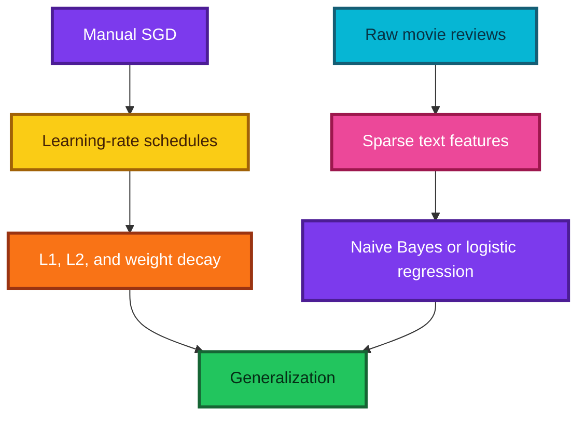

The unifying principle is **controlled capacity**: give a model a useful representation and enough flexibility to learn, then constrain and validate it so that it captures repeatable structure rather than accidents in the training set.

---

## 2. Feature engineering and representation learning

The lecture begins with high-scoring text-normalization solutions based largely on handcrafted rules and regular expressions. It contrasts these with models that learn features automatically.

### What is feature engineering?

Feature engineering converts raw input into measurements designed by a human. For example, a text-normalization system may detect:

- digits followed by `%` as percentages;
- strings matching a phone-number pattern;
- ordinal suffixes such as `1st`, `2nd`, and `3rd`;
- currency symbols and decimal amounts; or
- context that distinguishes a year from a cardinal number.

```python
import re

# Compile a simple percentage rule once so it can be reused efficiently.
percentage_pattern = re.compile(r"^\d+(?:\.\d+)?%$")


def token_type(token):
    """Classify a tiny subset of token forms for illustration."""
    # Match an integer or decimal followed by a percent sign.
    if percentage_pattern.fullmatch(token):
        return "percentage"

    # Recognize a basic ordinal-number pattern such as 1st or 23rd.
    if re.fullmatch(r"\d+(?:st|nd|rd|th)", token.lower()):
        return "ordinal"

    # Return a fallback label when no handcrafted rule applies.
    return "other"


assert token_type("12.5%") == "percentage"
assert token_type("23rd") == "ordinal"
```

### Why handcrafted rules can be excellent

- The domain may have stable conventions.
- Labels may be scarce.
- Rules can provide precise, auditable behavior.
- Rare but important formats may be easy to specify explicitly.
- A good rule system is often a strong baseline or a component of a hybrid model.

### Why learned representations are attractive

Handwritten systems become expensive when there are many interacting cases. A learned model can discover useful combinations from examples, adapt when the domain changes, and use features a designer did not anticipate.

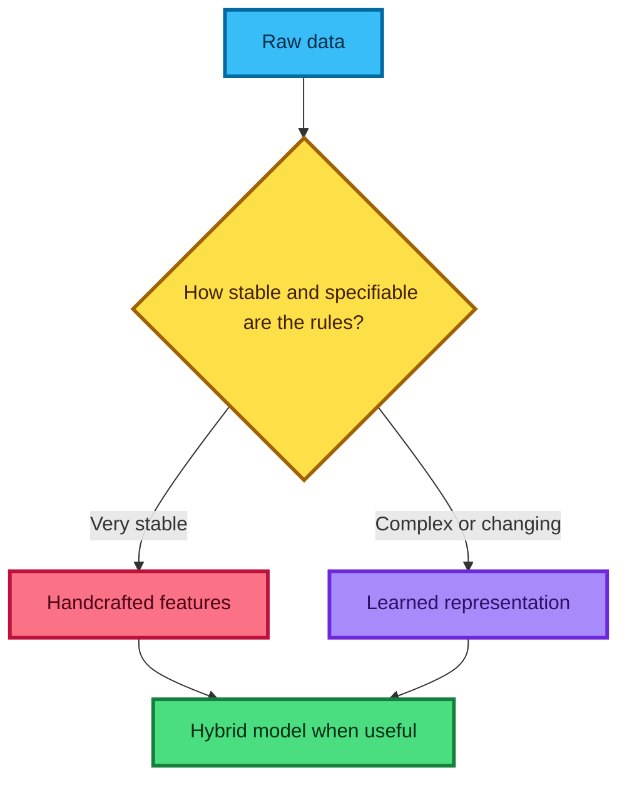

**Modern perspective:** feature engineering has not “gone away.” It has shifted toward data definitions, target design, preprocessing, architecture, prompts, retrieval, augmentation, and evaluation. Learned representations reduce some manual work but do not remove the need for domain judgment.

---

## 3. Semi-supervised learning and denoising autoencoders

### What is semi-supervised learning?

Semi-supervised learning uses both labeled and unlabeled examples:

$$
\mathcal D_L=\{(x_i,y_i)\}_{i=1}^{n_L},
\qquad
\mathcal D_U=\{x_i\}_{i=1}^{n_U}.
$$

This setting is common because raw records are often plentiful while reliable labels require human effort, delayed outcomes, or expensive tests.

### Ordinary and denoising autoencoders

An autoencoder contains an encoder $f_\theta$ and decoder $g_\phi$:

$$
h=f_\theta(x),
\qquad
\hat x=g_\phi(h).
$$

It learns by minimizing reconstruction error, for example

$$
L_{\text{recon}}
=\frac1N\sum_{i=1}^{N}\left\|x_i-g_\phi(f_\theta(x_i))\right\|_2^2.
$$

If the model can simply copy the input, the task may be uninformative. A **bottleneck** restricts $h$ to fewer dimensions, while a **denoising autoencoder** corrupts the input but asks the model to recover the clean target:

$$
\tilde x\sim q(\tilde x\mid x),
\qquad
L_{\text{DAE}}=\left\|x-g_\phi(f_\theta(\tilde x))\right\|^2.
$$


The competition example described replacing about 15% of a row's fields with values from other rows. This creates a tabular denoising task. To reconstruct the original, the network must learn cross-feature relationships instead of memorizing each input position independently.

```python
import numpy as np


def corrupt_rows(X, corruption_rate=0.15, seed=10):
    """Replace random cells with values from other rows in the same column."""
    # Use a local random generator for reproducible experiments.
    rng = np.random.default_rng(seed)
    corrupted = np.array(X, copy=True)

    # Decide independently which cells will be replaced.
    replace_mask = rng.random(X.shape) < corruption_rate

    # Choose one donor row for every cell while preserving column semantics.
    donor_rows = rng.integers(0, X.shape[0], size=X.shape)
    donor_values = X[donor_rows, np.arange(X.shape[1])[None, :]]

    # Copy donor values only into the selected positions.
    corrupted[replace_mask] = donor_values[replace_mask]
    return corrupted, replace_mask


# Corrupt a small table and preserve its shape.
table = np.arange(30).reshape(6, 5)
noisy_table, changed = corrupt_rows(table)
assert noisy_table.shape == table.shape
assert changed.shape == table.shape
```

### When this idea is useful

- unlabeled rows greatly outnumber labeled rows;
- feature correlations are stable and meaningful;
- a learned representation will be reused by a supervised model; or
- robustness to missing/corrupted fields matters.

**Caution:** corruption must respect the data-generating process. Randomly swapping a customer ID, timestamp, or target-derived field may create impossible records or leakage.

> **Fun fact:** denoising autoencoders were influential precursors to modern masked-reconstruction objectives. The broad idea—hide or corrupt part of an example and predict it—still appears across language, vision, and tabular learning.

---

## 4. Finishing SGD from scratch

For mini-batch $B_t$, the model computes predictions, a scalar loss, gradients, and an update:

$$
\hat y=f_\theta(X_{B_t}),
$$

$$
L_{B_t}(\theta)=\frac1{|B_t|}\sum_{i\in B_t}\ell(\hat y_i,y_i),
$$

$$
\theta_{t+1}=\theta_t-\eta\nabla_\theta L_{B_t}(\theta_t).
$$

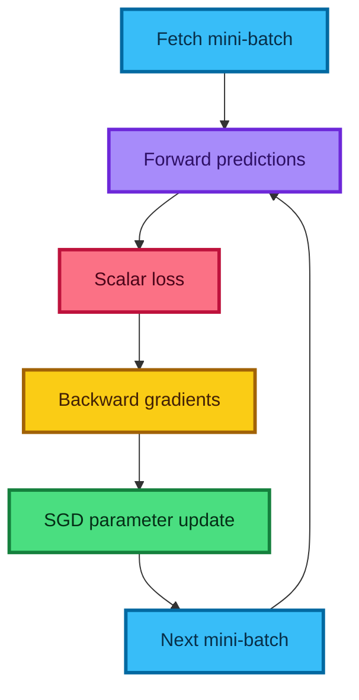

### What autograd does—and does not do

`loss.backward()` computes derivatives through recorded tensor operations. It does **not** choose the learning rate, change parameters, clear old gradients, or decide when training should stop. Those are responsibilities of the optimization loop.

---

## 5. Safe parameter updates in current PyTorch

The lecture uses the historical `Variable` API and mutates `weight.data`. Today, `Tensor` and `Variable` are unified, and direct `.data` mutation should be avoided because it can bypass autograd's safety checks.

Use `torch.no_grad()` for a manual update:

```python
import torch
from torch import nn

# Create a tiny model and one illustrative regression mini-batch.
model = nn.Linear(3, 1)
features = torch.tensor([[1.0, 2.0, 3.0], [2.0, 0.0, 1.0]])
targets = torch.tensor([[1.0], [0.0]])
learning_rate = 0.05

# Clear gradients left by a previous backward call.
model.zero_grad(set_to_none=True)

# Build a computation graph and calculate mean squared error.
predictions = model(features)
loss = ((predictions - targets) ** 2).mean()

# Populate each parameter's .grad field through reverse-mode autodiff.
loss.backward()

# Update leaf parameters without recording the update in a new graph.
with torch.no_grad():
    for parameter in model.parameters():
        parameter -= learning_rate * parameter.grad
```

### Why not update while gradients are enabled?

Parameters are leaf tensors that require gradients. In-place mutation during graph tracking can make the graph inconsistent or trigger an error. `no_grad()` says: “this mutation is an optimizer action, not part of the differentiable model.”

### A minimal educational optimizer

```python
import torch


class ManualSGD:
    """A small educational implementation of plain stochastic gradient descent."""

    def __init__(self, parameters, learning_rate):
        # Materialize the iterator once so parameters can be revisited each step.
        self.parameters = list(parameters)
        self.learning_rate = learning_rate

    def zero_grad(self):
        # Setting gradients to None can avoid unnecessary zero-fill work.
        for parameter in self.parameters:
            parameter.grad = None

    def step(self):
        # Optimizer updates must not become part of the autograd graph.
        with torch.no_grad():
            for parameter in self.parameters:
                # Skip parameters that did not contribute to the current loss.
                if parameter.grad is not None:
                    parameter -= self.learning_rate * parameter.grad
```

This class is intentionally incomplete: production optimizers handle parameter groups, state serialization, mixed precision, momentum, distributed training, and many edge cases.

---

## 6. Why gradients accumulate and must be cleared

Two different kinds of addition are easy to confuse.

### Addition inside one backward pass

If parameter $w$ affects the loss along several paths,

$$
L=L_1(w)+L_2(w),
$$

then calculus requires

$$
\frac{dL}{dw}=\frac{dL_1}{dw}+\frac{dL_2}{dw}.
$$

Autograd must add these path contributions.

### Addition across several backward calls

PyTorch also adds newly computed gradients to the existing `.grad` buffer. This enables deliberate accumulation across micro-batches:

$$
g=\sum_{m=1}^{M}\nabla_\theta L_m.
$$

For ordinary one-update-per-batch training, old gradients must be cleared before the next backward pass.

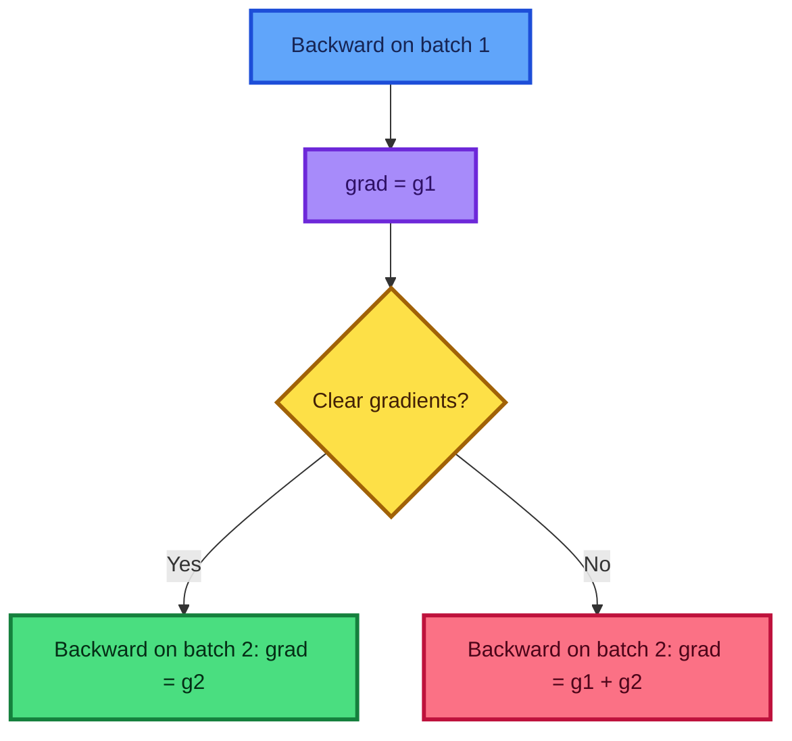

**When is accumulation intentional?** When a desired effective batch is too large for memory. For $M$ equal-sized micro-batches whose loss is a mean, divide each loss by $M$, call backward $M$ times, then call `step()` once. Unequal micro-batches should be weighted by their example counts.

---

## 7. Iterables, streaming, and mini-batches

A streaming interface asks for the **next** item rather than indexing every item in advance.

| Concept | Meaning |
|---|---|
| Iterable | Object that can create an iterator with `iter(obj)` |
| Iterator | Stateful object that returns successive values through `next(obj)` |
| Generator | A convenient kind of iterator, commonly produced with `yield` |
| Mini-batch stream | Iterator yielding a small group of examples at a time |

```python
def chunked(sequence, batch_size):
    """Yield consecutive mini-batches without constructing a list of batches."""
    # Move through the sequence one batch-width at a time.
    for start in range(0, len(sequence), batch_size):
        # Yield pauses execution and resumes here on the next request.
        yield sequence[start : start + batch_size]


# The generator computes one chunk only when it is requested.
batch_iterator = chunked(list(range(10)), batch_size=4)
assert next(batch_iterator) == [0, 1, 2, 3]
assert next(batch_iterator) == [4, 5, 6, 7]
```

### Why streaming is useful

- Only the current batch must be held in working memory.
- Records can be decoded and transformed on demand.
- The same pipeline can read from files, network streams, or generated samples.
- Stages compose naturally: read → decode → augment → collate → train.

An iterator does not magically make the underlying dataset infinite or memory-free. The benefit depends on whether the source and transformations are actually lazy.

---

## 8. Dataset, sampler, and DataLoader anatomy

A current PyTorch map-style input pipeline has distinct responsibilities:

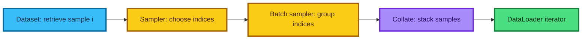

```python
import torch
from torch.utils.data import DataLoader, Dataset


class PairDataset(Dataset):
    """A map-style dataset exposing length and integer indexing."""

    def __init__(self, features, labels):
        # Store tensors that share the same leading sample dimension.
        self.features = features
        self.labels = labels

    def __len__(self):
        # Report how many examples the dataset contains.
        return self.labels.shape[0]

    def __getitem__(self, index):
        # Return one feature-label pair for the requested integer index.
        return self.features[index], self.labels[index]


# Build a loader whose sampler reshuffles indices at each new epoch.
dataset = PairDataset(torch.randn(100, 5), torch.randint(0, 2, (100,)))
loader = DataLoader(dataset, batch_size=16, shuffle=True, num_workers=0)

# A new for-loop creates a new iterator over the loader.
for feature_batch, label_batch in loader:
    # The final batch may contain fewer than 16 examples.
    assert feature_batch.shape[0] == label_batch.shape[0]
```

### Important correction about shuffling

`shuffle=True` does not normally draw independent random integers with replacement for every batch. A sampler typically produces a random permutation so each map-style training example appears once per epoch, unless a different sampler is supplied.

`num_workers>0` lets PyTorch use worker **processes** for loading. Threading, multiprocessing, persistent workers, prefetching, and pinned memory have workload-specific trade-offs; historical implementation comparisons should not be treated as current universal facts.

---

## 9. Rebuilding abstractions: optimizer, fit, and Sequential

The lecture works downward into implementation and then moves back upward into reusable abstractions.

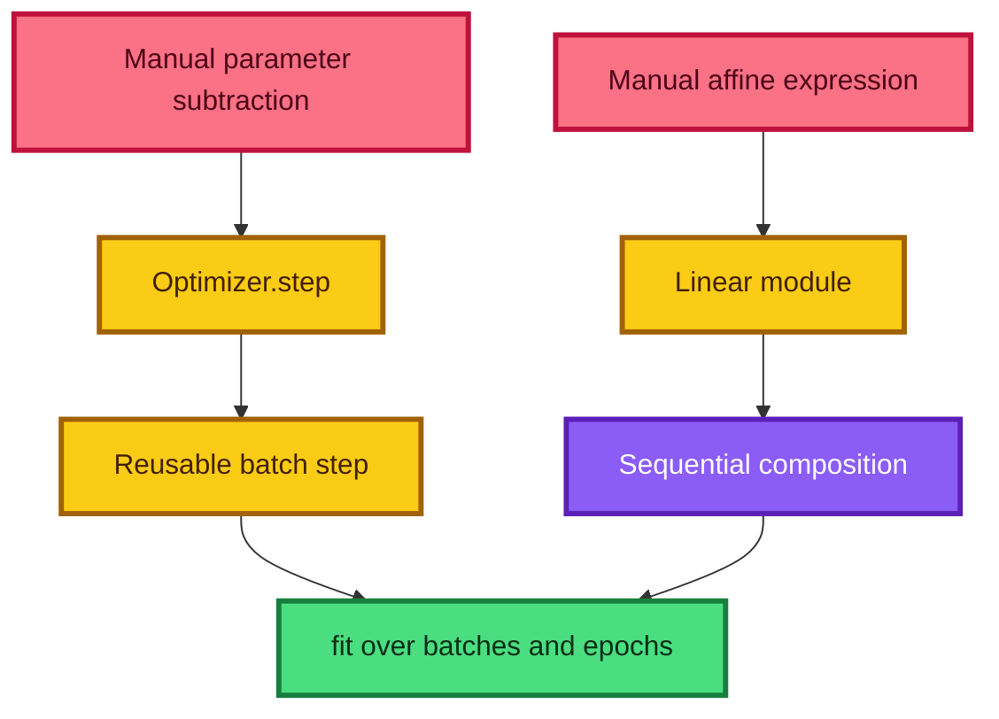

### What `Sequential` means

For modules $f_1,\ldots,f_k$,

$$
\operatorname{Sequential}(x)=f_k(f_{k-1}(\cdots f_1(x))).
$$

It is appropriate for a single straight chain. Networks with skip connections, multiple inputs, branching, or shared modules usually need a custom `forward` method.

### Why abstractions are good after deconstruction

An optimizer prevents repeated unsafe update code. A fit loop standardizes logging and evaluation. A `Linear` layer correctly registers and initializes parameters. Abstraction is not the enemy of understanding; **unexamined abstraction** is. Once the contract is clear, reuse reduces errors.

### A transparent current `fit` implementation

```python
import torch


def fit(model, train_loader, valid_loader, loss_function, optimizer, epochs, device):
    """Train for several epochs and return one metrics dictionary per epoch."""
    # Store compact epoch summaries for later plotting or comparison.
    history = []

    for epoch in range(epochs):
        # Enable training behavior for dropout and normalization layers.
        model.train()
        training_loss_sum = 0.0
        training_examples = 0

        for features, labels in train_loader:
            # Place model inputs and targets on the model's device.
            features = features.to(device)
            labels = labels.to(device)

            # Clear gradients accumulated by the previous optimizer update.
            optimizer.zero_grad(set_to_none=True)

            # Build the graph, compute scalar loss, and differentiate it.
            logits = model(features)
            loss = loss_function(logits, labels)
            loss.backward()

            # Apply the optimizer rule to every registered parameter.
            optimizer.step()

            # Accumulate a sample-weighted loss rather than averaging batch means.
            batch_size = labels.shape[0]
            training_loss_sum += loss.item() * batch_size
            training_examples += batch_size

        # Select evaluation behavior and skip autograd bookkeeping.
        model.eval()
        validation_loss_sum = 0.0
        validation_correct = 0
        validation_examples = 0

        with torch.inference_mode():
            for features, labels in valid_loader:
                # Keep evaluation tensors on the same device as the model.
                features = features.to(device)
                labels = labels.to(device)

                # Evaluate without backward or optimizer updates.
                logits = model(features)
                loss = loss_function(logits, labels)
                predictions = logits.argmax(dim=1)

                # Aggregate metrics over individual examples.
                batch_size = labels.shape[0]
                validation_loss_sum += loss.item() * batch_size
                validation_correct += (predictions == labels).sum().item()
                validation_examples += batch_size

        # Record means after guarding against accidentally empty loaders.
        history.append(
            {
                "epoch": epoch,
                "train_loss": training_loss_sum / max(training_examples, 1),
                "valid_loss": validation_loss_sum / max(validation_examples, 1),
                "valid_accuracy": validation_correct / max(validation_examples, 1),
            }
        )

    return history
```

This version intentionally leaves checkpointing, mixed precision, callbacks, schedulers, and distributed concerns outside the core loop.

---

## 10. Deep networks and parameter counting

The lecture expands a linear digit classifier into

$$
784\rightarrow100\rightarrow100\rightarrow10.
$$

For an affine layer with $n_{\text{in}}$ inputs and $n_{\text{out}}$ outputs,

$$
\#\text{parameters}=n_{\text{in}}n_{\text{out}}+n_{\text{out}}.
$$

Therefore:

| Layer | Weights | Biases | Total |
|---|---:|---:|---:|
| $784\to100$ | 78,400 | 100 | 78,500 |
| $100\to100$ | 10,000 | 100 | 10,100 |
| $100\to10$ | 1,000 | 10 | 1,010 |
| **Network** | **89,400** | **210** | **89,610** |

```python
from torch import nn

# Build the 784 -> 100 -> 100 -> 10 network described in the lecture.
digit_model = nn.Sequential(
    nn.Flatten(),
    nn.Linear(28 * 28, 100),
    nn.ReLU(),
    nn.Linear(100, 100),
    nn.ReLU(),
    nn.Linear(100, 10),  # Return logits for a fused cross-entropy loss.
)

# Count every scalar in every registered parameter tensor.
parameter_count = sum(parameter.numel() for parameter in digit_model.parameters())
assert parameter_count == 89_610
```

`model.parameters()` returns an **iterator**, not a reusable list. Each yielded `Parameter` may be a weight matrix or bias vector. Materialize it with `list(...)` only when repeated traversal is genuinely needed.

### Does a larger parameter count prove overfitting?

No. It signals capacity, not the outcome. Generalization also depends on data diversity, architecture, optimizer, regularization, augmentation, early stopping, implicit bias, label noise, and evaluation design.

---

## 11. Why training usually needs multiple epochs

An **epoch** is one pass through the training dataset. One epoch is rarely enough because each update moves only a limited distance and uses only a mini-batch estimate of the full gradient.

### Four reasons

1. **Finite step size:** a stable learning rate may be too small to reach a useful region in one pass.
2. **Mini-batch noise:** each update sees only part of the data.
3. **Deep composition:** early layers and later layers must co-adapt.
4. **Non-convex geometry:** useful directions and gradient scales change during training.

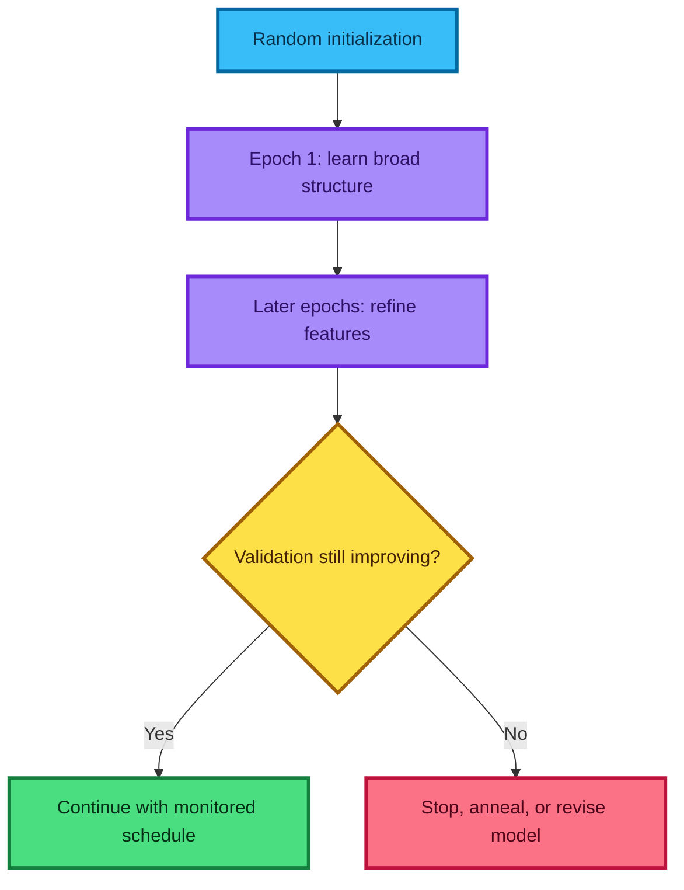

### How many epochs?

There is no universal number. Track a validation metric under a fixed evaluation protocol. Use early stopping or a predetermined compute budget, and save the best checkpoint. Repeatedly choosing based on the test set turns the test set into training feedback and produces optimistic estimates.

---

## 12. Learning-rate annealing and schedules

A large learning rate can move quickly at the beginning but oscillate around a narrow optimum later. **Annealing** reduces the learning rate as training progresses.

### Common schedules

| Schedule | Rule or idea | When useful |
|---|---|---|
| Step decay | Multiply by $\gamma<1$ at selected epochs | Simple controlled experiments |
| Exponential | $\eta_t=\eta_0\gamma^t$ | Smooth multiplicative decay |
| Cosine | Smoothly move from a high to low rate | Common fixed-budget training |
| Reduce on plateau | Lower rate when validation metric stalls | When plateau timing is unknown |
| One-cycle | Increase, then decrease each batch | Often effective for deep networks |

For step decay every $K$ epochs,

$$
\eta_e=\eta_0\gamma^{\lfloor e/K\rfloor}.
$$

```python
import torch
from torch import nn

# Create a model and optimizer with the initial learning rate.
model = nn.Linear(20, 2)
optimizer = torch.optim.SGD(model.parameters(), lr=0.1)

# Reduce the rate tenfold after every five completed epochs.
scheduler = torch.optim.lr_scheduler.StepLR(
    optimizer,
    step_size=5,
    gamma=0.1,
)

for epoch in range(15):
    # Train over every mini-batch before changing this epoch's rate.
    # train_one_epoch(model, train_loader, optimizer)  # Defined by the application.
    current_rate = optimizer.param_groups[0]["lr"]
    print(f"epoch={epoch:02d} learning_rate={current_rate:.4g}")

    # StepLR is conventionally advanced once after the epoch's optimizer steps.
    scheduler.step()
```

**Why not begin with the final tiny rate?** It may take far longer to cross broad flat regions. A schedule separates early exploration and rapid progress from later fine adjustment.

**Caution:** the correct placement of `scheduler.step()` depends on the scheduler. For example, `OneCycleLR` advances after each batch; `ReduceLROnPlateau` consumes a monitored metric.

---

## 13. Regularization: what, why, how, and when

Regularization changes training to prefer solutions expected to generalize better.

### What problem does it address?

An expressive model can fit repeatable signal and sample-specific noise:

$$
y=f_{\text{signal}}(x)+\varepsilon.
$$

Minimizing training loss alone may reward fitting $\varepsilon$. Regularization adds a preference such as smaller weights, sparse weights, stochastic subnetworks, smoother outputs, or earlier stopping.

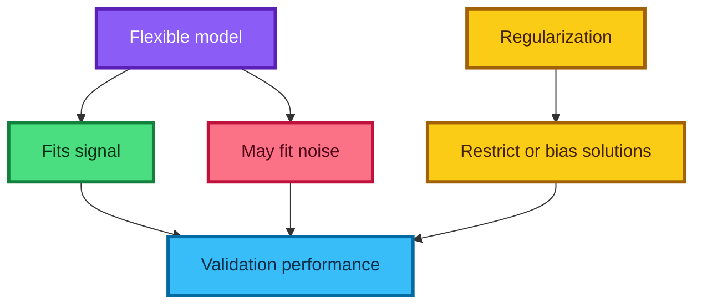

### Common forms

- L2 penalty or weight decay;
- L1 penalty;
- dropout;
- data augmentation;
- early stopping;
- label smoothing;
- architectural constraints; and
- Bayesian priors.

### When should you try it?

When training performance continues improving while validation performance stalls or worsens. Also use standard architecture-specific regularization as a baseline, then tune on validation data.

Regularization cannot repair target leakage, a wrong split, mislabeled outcomes, a distribution mismatch, or an unsuitable metric.

---

## 14. Deriving L2 regularization

Add a squared-weight penalty to the data loss:

$$
J(w)=L_{\text{data}}(w)+\frac{\lambda}{2}\lVert w\rVert_2^2
=L_{\text{data}}(w)+\frac{\lambda}{2}\sum_j w_j^2.
$$

The factor $1/2$ is conventional because it cancels when differentiating:

$$
\nabla_wJ(w)=\nabla_wL_{\text{data}}(w)+\lambda w.
$$

Plain SGD gives

$$
w_{t+1}
=w_t-\eta\left(\nabla L_{\text{data}}(w_t)+\lambda w_t\right)
=(1-\eta\lambda)w_t-\eta\nabla L_{\text{data}}(w_t).
$$

The factor $(1-\eta\lambda)$ shrinks the current weight toward zero before/alongside the data-gradient update.

### A numeric example

Suppose $w=4$, the data gradient is $3$, $\eta=0.1$, and $\lambda=0.2$:

$$
w_{\text{new}}
=4-0.1(3+0.2\cdot4)
=4-0.38
=3.62.
$$

Without L2, the new value would be $4-0.1(3)=3.7$.

```python
import numpy as np

# Define one weight vector and its data-loss gradient.
weights = np.array([4.0, -2.0])
data_gradient = np.array([3.0, 1.0])
learning_rate = 0.1
regularization = 0.2

# Method 1: differentiate the L2-augmented objective.
penalized_gradient = data_gradient + regularization * weights
update_from_penalty = weights - learning_rate * penalized_gradient

# Method 2: expose the equivalent shrinkage form for plain SGD.
update_from_decay = (
    (1.0 - learning_rate * regularization) * weights
    - learning_rate * data_gradient
)

assert np.allclose(update_from_penalty, update_from_decay)
```

### Should biases be penalized?

Often biases and normalization parameters are excluded from weight decay, while large weight matrices are included. The best convention depends on model family and implementation; document parameter groups explicitly.

---

## 15. L2 regularization versus weight decay

The phrases are often used interchangeably, but the equivalence has conditions.

### Coupled L2 penalty

Add $\lambda w$ to the gradient, then let the optimizer transform that combined gradient:

$$
g_t\leftarrow\nabla L_{\text{data}}(w_t)+\lambda w_t.
$$

### Decoupled weight decay

Apply shrinkage directly to the parameters separately from the optimizer's gradient transformation:

$$
w_{t+1}\leftarrow(1-\eta\lambda)w_t
-\eta\,\operatorname{UpdateRule}(\nabla L_{\text{data}}).
$$

| Optimizer setting | L2 penalty and weight decay equivalent? |
|---|---|
| Plain SGD, matching scaling conventions | Yes |
| Momentum/preconditioned/adaptive optimizer | Generally no |
| Adam with L2 added to gradient | Coupled penalty |
| AdamW | Decoupled weight decay |

```python
import torch

# AdamW applies decoupled weight decay to the selected parameters.
model = torch.nn.Linear(10, 2)
optimizer = torch.optim.AdamW(
    model.parameters(),
    lr=1e-3,
    weight_decay=1e-2,
)
```

### Scaling conventions matter

Libraries differ over whether the penalty is $\lambda\lVert w\rVert^2$, $\lambda\lVert w\rVert^2/2$, averaged by sample count, or scaled through a parameter such as inverse strength `C`. Compare update equations, not parameter names alone.

---

## 16. L1 versus L2

L1 regularization uses absolute values:

$$
J_{L1}(w)=L_{\text{data}}(w)+\lambda\sum_j|w_j|.
$$

Away from zero, a subgradient is

$$
\frac{\partial |w_j|}{\partial w_j}=\operatorname{sign}(w_j).
$$

| Property | L1 | L2 |
|---|---|---|
| Penalty | $\sum_j|w_j|$ | $\sum_jw_j^2$ |
| Typical effect | Some exact zeros with suitable solver | Distributed shrinkage |
| Correlated features | May select one unpredictably | Often shares weight across them |
| Geometry | Diamond-like constraint | Circular/spherical constraint |
| Optimization | Non-differentiable at zero | Smooth everywhere |

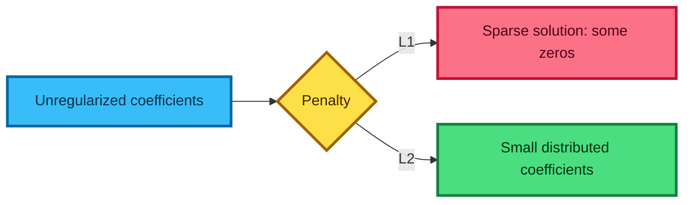

L2 makes weights **smaller**, not generally exactly zero. L1 can yield exact sparsity when paired with an optimizer/solver designed for its non-smooth geometry. Merely applying noisy subgradient steps does not guarantee exact zeros.

### When to choose

- Use L1 when sparse coefficients or feature selection has practical value.
- Use L2 as a strong smooth default for many linear and neural models.
- Use elastic net when both sparsity and correlated feature groups matter.
- Let validation performance and operational constraints decide—not a universal slogan.

---

## 17. Diagnosing overfitting and underfitting

Compare **the same data-only metric** across splits. If the training objective contains a penalty but validation loss does not, the raw numbers are not directly comparable.

| Pattern | Likely interpretation | Possible responses |
|---|---|---|
| Training bad, validation bad | Underfitting, optimization failure, or poor features | More capacity, better features, train longer, tune optimizer |
| Training good, validation worse | Overfitting or split mismatch | Regularize, add data, early stop, inspect split/leakage |
| Training worse than validation | Not automatically underfitting | Check augmentation, dropout, penalty, data difficulty, metric code |
| Both good | Useful current model | Confirm on untouched test data and relevant subgroups |

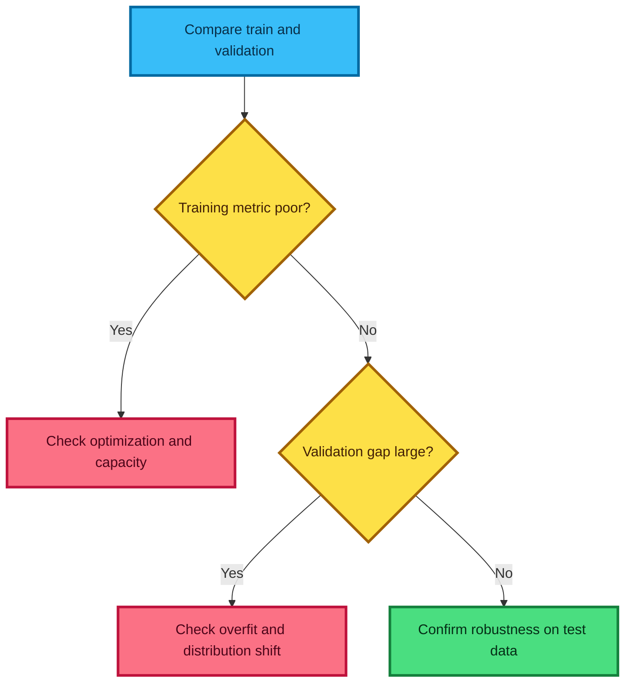

### Why training loss may exceed validation loss

- dropout is active only during training;
- training examples are augmented or noisier;
- the reported training objective includes a penalty;
- validation examples happen to be easier;
- batch normalization behaves differently; or
- losses were aggregated differently.

Therefore, “training loss > validation loss always means underfitting” is false.

---

## 18. Overparameterization: useful idea, careful interpretation

The lecture emphasizes a successful modern pattern: use a highly expressive model, then control it with optimization, data, and regularization.

### Why it can work

- Many parameter settings represent similar functions.
- SGD has implicit preferences among solutions.
- architecture shares structure across examples.
- augmentation expands the effective training distribution.
- explicit regularization discourages some brittle solutions.

### Why it is not a guarantee

An oversized model can memorize leakage, identifiers, artifacts, and label noise. Compute and latency also matter. A smaller model may be easier to deploy, calibrate, audit, or retrain.

> **Fun fact:** classical intuition predicts a simple bias–variance U-shape as capacity grows. Modern overparameterized models can show **double descent**, where test error worsens near interpolation and improves again at larger capacity. This does not eliminate the need for validation.

### Better rule

Choose enough capacity to optimize the task, then measure the complete system:

$$
\text{quality}=f(\text{validation},\text{robustness},\text{latency},\text{memory},\text{cost},\text{risk}).
$$

---

## 19. Model interpretation with perturbations and gradients

The lecture connects permutation importance with gradients. They are related sensitivity ideas, but they answer different questions.

### Local input gradient

For output $f(x)$,

$$
s_j(x)=\frac{\partial f(x)}{\partial x_j}
$$

measures infinitesimal local sensitivity near $x$.

### Permutation importance

If metric $M$ is larger-is-better,

$$
I_j=M(X,y)-M(\operatorname{permute}_j(X),y)
$$

measures performance degradation after destroying feature $j$'s association with the target on a chosen dataset.

| Method | Scope | Main caution |
|---|---|---|
| Input gradient | Local and differential | Saturation, scale sensitivity, noisy directions |
| Permutation | Dataset-level predictive reliance | Unrealistic rows when features are correlated |
| Partial dependence | Average response under intervention grid | Extrapolates into sparse/unrealistic regions |

Gradients do not automatically provide causal importance or human-readable explanations. Interpretation should use multiple methods, domain checks, and sensitivity analysis.

---

## 20. The IMDB sentiment task

The lesson uses the Stanford Large Movie Review Dataset. Its core supervised benchmark contains:

- 25,000 polarized training reviews;
- 25,000 polarized test reviews;
- balanced positive and negative classes; and
- 50,000 additional unlabeled reviews for unsupervised or semi-supervised work.

Reviews are labeled positive only for strongly positive ratings and negative only for strongly negative ratings. Neutral/mid-range ratings are not part of the labeled binary task.

### Mathematical task

Given review text $d$, predict

$$
y=
\begin{cases}
1,&\text{positive},\\
0,&\text{negative}.
\end{cases}
$$

The first baseline deliberately discards most word order and maps $d$ to a feature vector $x\in\mathbb R^V$.


### What the benchmark does not guarantee

A strong score on polarized English movie reviews does not prove performance on neutral opinions, sarcasm, other languages, newer slang, other domains, demographic subgroups, or real deployment costs. Evaluation scope is part of the model specification.

---

## 21. Tokenization

**Tokenization** converts a string into units that the feature extractor can count.

For example, a tokenizer might map

```text
This movie isn't "good".
```

to tokens such as

```text
this | movie | is | n't | " | good | " | .
```

There is no single universally correct split. The right choice depends on language, model, task, and vocabulary policy.

### Difficult cases

- contractions: `isn't`, `can't`, `I'd`;
- punctuation and emoticons;
- hyphens and apostrophes;
- URLs, mentions, hashtags, and numbers;
- languages without whitespace word boundaries;
- emoji and Unicode normalization;
- misspellings and creative spellings; and
- domain-specific symbols.

### CountVectorizer's default behavior

Current scikit-learn `CountVectorizer` lowercases text by default and uses a regular expression that selects tokens containing at least two word characters. Punctuation is generally treated as a separator rather than its own feature. Supplying a custom tokenizer changes this behavior and requires careful handling of preprocessing settings.

```python
from sklearn.feature_extraction.text import CountVectorizer

# Expose the analyzer that performs preprocessing, tokenization, and n-grams.
vectorizer = CountVectorizer()
analyzer = vectorizer.build_analyzer()

# Inspect actual tokens instead of assuming how punctuation is handled.
tokens = analyzer('This movie isn\'t "good".')
assert tokens == ["this", "movie", "isn", "good"]
```

The assertion reflects the current default pattern, not an ideal linguistic analysis. Modern transformer systems commonly use learned subword tokenizers, but word/n-gram tokenization remains an efficient, interpretable baseline for linear models.

---

## 22. Vocabulary fitting without leakage

A vocabulary maps training terms to column indices:

$$
\mathcal V=\{t_1,\ldots,t_V\},
\qquad
\operatorname{id}(t_j)=j.
$$

Fit it on training text only. Then reuse exactly the same mapping for validation, test, and production data.

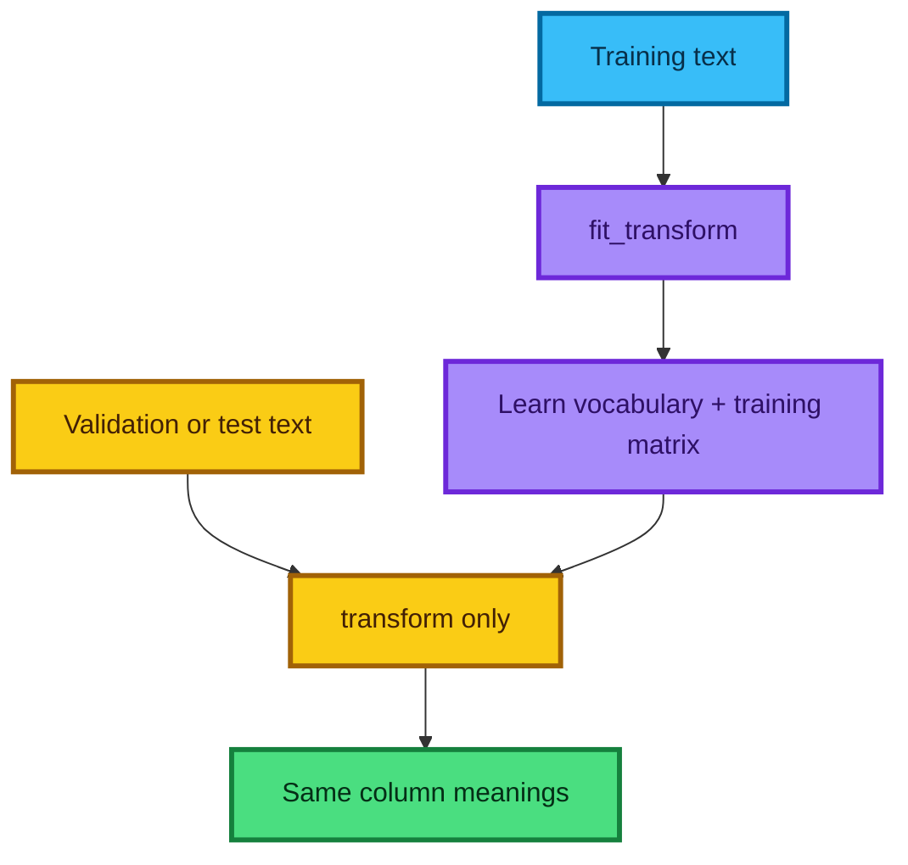

### Why not fit separately?

Column 147 must mean the same term everywhere. Separate fitting can reorder columns, introduce test-derived features, and leak corpus statistics into model selection.

### What happens to unseen words?

The transcript suggests a special unknown column. That is common in neural tokenizers, but scikit-learn `CountVectorizer` does **not** add an `[UNK]` feature by default. Terms absent from the fitted vocabulary are ignored during `transform`.

```python
from sklearn.feature_extraction.text import CountVectorizer

# Learn a vocabulary containing only words from the training documents.
vectorizer = CountVectorizer()
train_matrix = vectorizer.fit_transform(["good movie", "bad ending"])

# The unseen word dazzling contributes no column; known word movie remains.
test_matrix = vectorizer.transform(["dazzling movie"])
feature_names = vectorizer.get_feature_names_out()

assert "dazzling" not in feature_names
assert test_matrix[0, vectorizer.vocabulary_["movie"]] == 1
```

Use a pipeline inside cross-validation so every fold learns preprocessing from that fold's training portion only.

---

## 23. Bag-of-words and the document-term matrix

A **bag-of-words** representation records which terms appear and possibly how often, but discards their global order.

Let document $i$ and vocabulary term $j$ define

$$
X_{ij}=\operatorname{count}(t_j\text{ in document }i).
$$

For four tiny reviews and vocabulary

$$
[\text{this},\text{the},\text{movie},\text{is},\text{good},\text{bad}],
$$

the document-term matrix is:

| Document | this | the | movie | is | good | bad |
|---|---:|---:|---:|---:|---:|---:|
| `this movie is good` | 1 | 0 | 1 | 1 | 1 | 0 |
| `the movie is good` | 0 | 1 | 1 | 1 | 1 | 0 |
| `this movie is bad` | 1 | 0 | 1 | 1 | 0 | 1 |
| `the movie is bad` | 0 | 1 | 1 | 1 | 0 | 1 |

The matrix has shape

$$
(\text{documents},\text{terms})=(4,6).
$$

### Counts, binary presence, and TF-IDF

| Representation | Feature value | Main intuition |
|---|---|---|
| Count | Number of appearances | Repetition may strengthen evidence |
| Binary | $\mathbf1(X_{ij}>0)$ | Presence matters, repetition does not |
| TF-IDF | Term frequency × inverse document frequency | Downweight terms common across documents |

**Why can bag-of-words work?** Sentiment often contains strongly associated terms such as `excellent`, `awful`, or `waste`. A classifier can exploit those associations even without full syntax.

**What does it lose?** Negation scope, long-distance references, compositional meaning, word order, and much sarcasm. `good, not great` and `great, not good` may have identical unigram bags.

---

## 24. Why sparse matrices matter

With 25,000 documents and about 75,000 vocabulary terms, a dense matrix would contain

$$
25{,}000\times75{,}000=1.875\times10^9
$$

entries. At 8 bytes per `float64`, that is about 15 GB before overhead. Most entries are zero because one review uses only a tiny fraction of the vocabulary.

A sparse matrix stores nonzero values and their positions. In compressed sparse row (CSR) form, storage is roughly proportional to

$$
O(\operatorname{nnz}+N+1),
$$

where `nnz` is the number of nonzero entries.

```python
import numpy as np
from scipy import sparse

# Construct a mostly-zero 3 x 6 dense count matrix.
dense = np.array(
    [
        [1, 0, 1, 0, 0, 0],
        [0, 0, 1, 1, 0, 0],
        [0, 1, 0, 0, 0, 1],
    ],
    dtype=np.int64,
)

# CSR stores only nonzero values plus compact index structures.
csr = sparse.csr_matrix(dense)

assert csr.shape == dense.shape
assert csr.nnz == 6
assert np.array_equal(csr.toarray(), dense)
```

### When sparse is not automatically faster

Sparse operations have indexing overhead. Dense arrays can be faster when density is high or matrices are small. Never call `.toarray()` on a huge text matrix merely to use an estimator that lacks sparse support; choose a compatible algorithm.

> **Fun fact:** a sparse document-term matrix can have hundreds of thousands of columns and still train quickly because each row touches only the terms that actually occur.

---

## 25. Modern CountVectorizer example

```python
import numpy as np
from sklearn.feature_extraction.text import CountVectorizer

# Create the four-review corpus used in the worked table.
documents = [
    "this movie is good",
    "the movie is good",
    "this movie is bad",
    "the movie is bad",
]

# Keep one-character words if present and learn unigram count features.
vectorizer = CountVectorizer(token_pattern=r"(?u)\b\w+\b")
document_term = vectorizer.fit_transform(documents)

# Current scikit-learn exposes names through get_feature_names_out.
terms = vectorizer.get_feature_names_out()

# The fitted representation is sparse and has one row per document.
assert document_term.shape == (4, 6)
assert terms.tolist() == ["bad", "good", "is", "movie", "the", "this"]

# Convert only this tiny teaching matrix to dense form for inspection.
small_dense_view = document_term.toarray()
assert np.all(small_dense_view.sum(axis=1) == 4)
```

### Useful controls

- `binary=True`: replace positive counts with 1;
- `ngram_range=(1, 2)`: include unigrams and bigrams;
- `min_df`: discard extremely rare terms;
- `max_df`: discard terms appearing in too many documents;
- `max_features`: retain at most the most frequent features; and
- `dtype`: choose the output count type.

The historical `get_feature_names()` call has been replaced by `get_feature_names_out()` in current scikit-learn.

---

## 26. N-grams recover some local order

An **n-gram** is a consecutive sequence of $n$ tokens:

- unigram: `good`;
- bigram: `not good`;
- trigram: `not very good`.

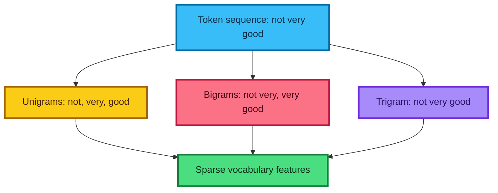

```python
from sklearn.feature_extraction.text import CountVectorizer

# Learn every unigram, bigram, and trigram that appears in this tiny corpus.
vectorizer = CountVectorizer(ngram_range=(1, 3))
matrix = vectorizer.fit_transform(["not very good", "not very bad"])
features = set(vectorizer.get_feature_names_out())

# Confirm that local phrases become their own classifier features.
assert "not very" in features
assert "not very good" in features
assert "not very bad" in features
```

### Why n-grams help

They distinguish `not good` from `good` and capture local phrases, names, and idioms. They can also help with punctuation-aware sarcasm if the tokenizer retains those symbols.

### Why not include every long phrase?

Vocabulary size can explode. Longer n-grams are rarer, consume more memory, and overfit easily. Control them with `min_df`, `max_features`, validation, and appropriate regularization.

N-grams restore **local** order only. They do not understand long-distance syntax or meaning.

---

## 27. Bayes’ rule for classification

Bayes' rule reverses a conditional probability:

$$
P(y=c\mid x)=\frac{P(x\mid y=c)P(y=c)}{P(x)}.
$$

Terms:

- $P(y=c\mid x)$: posterior probability of class $c$ after observing document $x$;
- $P(x\mid y=c)$: likelihood of observing the document within class $c$;
- $P(y=c)$: class prior; and
- $P(x)$: evidence, shared across classes for the same document.

For classification,

$$
\hat y=\arg\max_c P(x\mid y=c)P(y=c),
$$

because $P(x)$ is identical for all candidate classes.

For binary classes, posterior odds are

$$
\frac{P(y=1\mid x)}{P(y=0\mid x)}
=
\frac{P(x\mid y=1)P(y=1)}{P(x\mid y=0)P(y=0)}.
$$

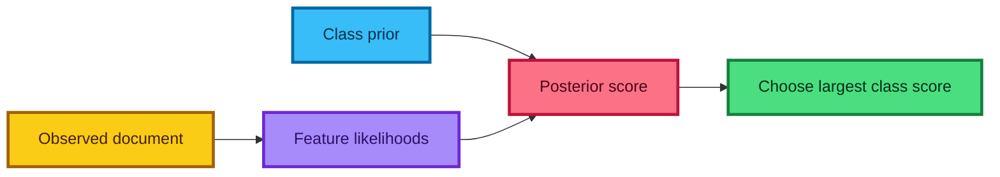

---

## 28. The naive conditional-independence assumption

Let document features be $x_1,\ldots,x_V$. Naive Bayes assumes that features are conditionally independent given the class:

$$
P(x_1,\ldots,x_V\mid y=c)
=\prod_{j=1}^{V}P(x_j\mid y=c).
$$

This is “naive” because words are clearly dependent. `very` and `good`, or `New` and `York`, co-occur for linguistic reasons.

### Why can it still classify well?

- Classification needs the correct ranking, not a perfect generative model.
- Many correlated signals still point toward the same class.
- Parameter estimates are simple and stable with little data.
- Smoothing reduces extreme estimates.
- Sparse multiplication is very fast.

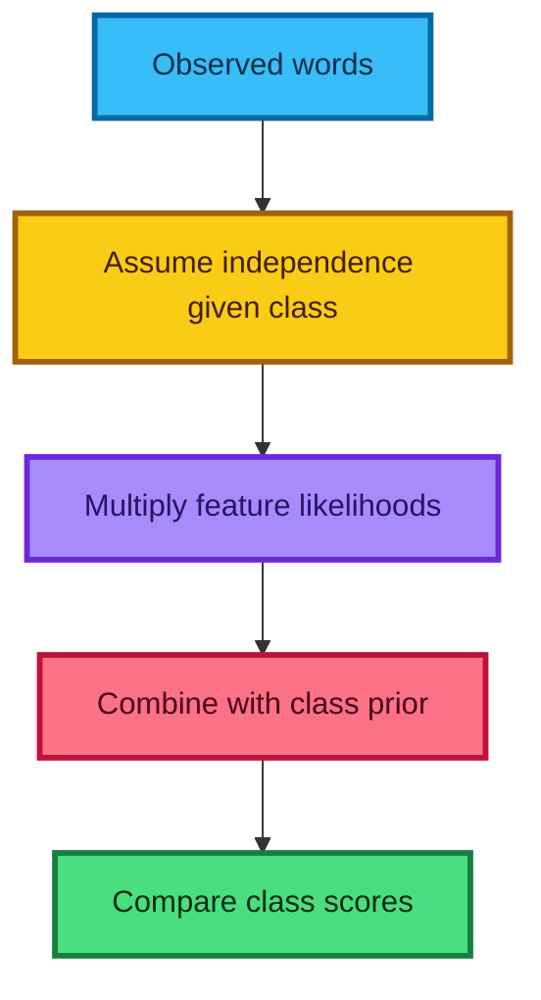

Naive Bayes probability estimates are often poorly calibrated because correlated evidence can be counted repeatedly. Treat high `predict_proba` values cautiously even when classification accuracy is useful.

---

## 29. Multinomial Naive Bayes

Multinomial Naive Bayes models token **counts**. Let

$$
N_{cj}=\sum_{i:y_i=c}X_{ij}
$$

be the total count of term $j$ in class $c$, and let

$$
N_c=\sum_{j=1}^{V}N_{cj}
$$

be the total token count in that class.

With additive smoothing $\alpha$,

$$
\hat\theta_{cj}
=P(t_j\mid y=c)
=\frac{N_{cj}+\alpha}{N_c+\alpha V}.
$$

For document counts $x_j$, the class log score is

$$
s_c(x)=\log P(y=c)+\sum_{j=1}^{V}x_j\log\hat\theta_{cj}.
$$

The prediction is $\arg\max_c s_c(x)$.

### Why smoothing is essential

Without smoothing, an unseen term in one class has probability zero. Multiplying by zero makes the entire document likelihood zero:

$$
P(t_j\mid c)=0\Rightarrow P(x\mid c)=0.
$$

Laplace smoothing uses $\alpha=1$; Lidstone smoothing uses a positive value often below one.

```python
from sklearn.feature_extraction.text import CountVectorizer
from sklearn.naive_bayes import MultinomialNB

# Supply labeled count evidence for a tiny sentiment corpus.
documents = ["good movie", "good fun", "bad movie", "bad boring"]
labels = [1, 1, 0, 0]

# Fit token counts on the training corpus.
vectorizer = CountVectorizer()
counts = vectorizer.fit_transform(documents)

# alpha=1 applies Laplace additive smoothing.
classifier = MultinomialNB(alpha=1.0)
classifier.fit(counts, labels)

# Reuse the fitted vocabulary when classifying new text.
prediction = classifier.predict(vectorizer.transform(["good fun"]))
assert prediction.tolist() == [1]
```

---

## 30. Bernoulli Naive Bayes

Bernoulli Naive Bayes models binary **presence/absence**:

$$
x_j\in\{0,1\}.
$$

Let $N_{cj}$ be the number of class-$c$ documents containing term $j$, and let $N_c$ be the number of documents in class $c$. With smoothing,

$$
\hat\theta_{cj}
=P(x_j=1\mid y=c)
=\frac{N_{cj}+\alpha}{N_c+2\alpha}.
$$

Its log likelihood includes both presence and absence:

$$
\log P(x\mid c)
=\sum_{j=1}^{V}
\left[
x_j\log\theta_{cj}
+(1-x_j)\log(1-\theta_{cj})
\right].
$$

```python
from sklearn.feature_extraction.text import CountVectorizer
from sklearn.naive_bayes import BernoulliNB

# Build binary term features directly in the vectorizer.
documents = ["good good movie", "good fun", "bad bad movie", "bad boring"]
labels = [1, 1, 0, 0]
vectorizer = CountVectorizer(binary=True)
presence = vectorizer.fit_transform(documents)

# BernoulliNB models whether each vocabulary feature appears.
classifier = BernoulliNB(alpha=1.0)
classifier.fit(presence, labels)

# Repeating good does not change a binary feature after vectorization.
once = vectorizer.transform(["good movie"])
repeated = vectorizer.transform(["good good good movie"])
assert (once != repeated).nnz == 0
```

### Which variant should you use?

- Try MultinomialNB for counts or nonnegative TF-IDF-like features.
- Try BernoulliNB when presence matters more than frequency.
- Try ComplementNB for some imbalanced text problems.
- Select hyperparameters and representation on validation data.

The lecture's `.sign()` binarization is conceptually equivalent to setting every positive count to one, but `CountVectorizer(binary=True)` expresses the intent more clearly.

---

## 31. Log space, log odds, and stable scores

Multiplying many probabilities underflows because values below one rapidly approach zero. For example,

$$
0.01^{200}=10^{-400},
$$

which is smaller than ordinary floating-point formats can represent as a positive normal number.

Logarithms convert products into sums:

$$
\log\prod_j p_j=\sum_j\log p_j.
$$

For two classes, the log posterior odds are

$$
\log\frac{P(y=1\mid x)}{P(y=0\mid x)}
=
\log\frac{P(y=1)}{P(y=0)}
+\sum_j x_j\log\frac{\theta_{1j}}{\theta_{0j}}.
$$

Define

$$
r_j=\log\frac{\theta_{1j}}{\theta_{0j}},
\qquad
b=\log\frac{P(y=1)}{P(y=0)}.
$$

Then

$$
s(x)=x^Tr+b.
$$

Predict class 1 when $s(x)>0$, because log odds above zero correspond to odds above one.

```python
import numpy as np

# Demonstrate that a product can underflow while its log remains finite.
probabilities = np.full(200, 0.01, dtype=np.float64)
tiny_product = probabilities.prod()
stable_log_product = np.log(probabilities).sum()

assert tiny_product == 0.0
assert np.isfinite(stable_log_product)
assert np.isclose(stable_log_product, 200 * np.log(0.01))
```

> **Fun fact:** this Naive Bayes log score has the same affine form $x^Tw+b$ as logistic regression. Naive Bayes estimates coefficients from class-conditional counts; logistic regression learns them by minimizing discriminative loss.

---

## 32. Worked Naive Bayes example

Use this training corpus:

| Class | Documents |
|---|---|
| Positive $(1)$ | `good movie`, `good fun` |
| Negative $(0)$ | `bad movie`, `bad boring` |

Vocabulary:

$$
[\text{bad},\text{boring},\text{fun},\text{good},\text{movie}],
\qquad V=5.
$$

Both classes contain four token occurrences. With $\alpha=1$, each MultinomialNB denominator is

$$
N_c+\alpha V=4+5=9.
$$

| Term | Positive count | $P(t\mid1)$ | Negative count | $P(t\mid0)$ |
|---|---:|---:|---:|---:|
| bad | 0 | $1/9$ | 2 | $3/9$ |
| boring | 0 | $1/9$ | 1 | $2/9$ |
| fun | 1 | $2/9$ | 0 | $1/9$ |
| good | 2 | $3/9$ | 0 | $1/9$ |
| movie | 1 | $2/9$ | 1 | $2/9$ |

For `good fun`, equal class priors cancel. The likelihood ratio is

$$
\frac{P(\text{good}\mid1)P(\text{fun}\mid1)}
{P(\text{good}\mid0)P(\text{fun}\mid0)}
=\frac{(3/9)(2/9)}{(1/9)(1/9)}=6.
$$

Since $6>1$, predict positive. In log space:

$$
\log 6=\log 3+\log 2>0.
$$

### What would happen with `not good`?

If `not` never appeared in training, `CountVectorizer` ignores it. The remaining known term `good` pushes the model positive. N-grams help only if the training vocabulary contains examples of `not good`.

---

## 33. Logistic regression on sparse text

Binary logistic regression models

$$
P(y=1\mid x)=\sigma(x^Tw+b),
\qquad
\sigma(z)=\frac{1}{1+e^{-z}}.
$$

It learns $w,b$ by minimizing regularized binary cross-entropy:

$$
J(w,b)=
-\frac1N\sum_{i=1}^{N}
\left[
y_i\log p_i+(1-y_i)\log(1-p_i)
\right]
+\frac{\lambda}{2}\lVert w\rVert_2^2.
$$

```python
from sklearn.feature_extraction.text import CountVectorizer
from sklearn.linear_model import LogisticRegression

# Convert training documents directly into a sparse count matrix.
documents = ["good movie", "good fun", "bad movie", "bad boring"]
labels = [1, 1, 0, 0]
vectorizer = CountVectorizer(binary=True)
features = vectorizer.fit_transform(documents)

# Fit a regularized sparse-compatible binary classifier.
classifier = LogisticRegression(
    C=1.0,
    solver="liblinear",
    random_state=10,
)
classifier.fit(features, labels)

# Score new text using the same fitted columns.
prediction = classifier.predict(vectorizer.transform(["good and fun"]))
assert prediction.tolist() == [1]
```

### Generative versus discriminative

| Naive Bayes | Logistic regression |
|---|---|
| Models $P(x\mid y)$ and $P(y)$ | Models $P(y\mid x)$ directly |
| Coefficients come from smoothed counts | Coefficients are optimized from labeled loss |
| Strong independence assumption | No generative independence assumption |
| Very fast, strong small-data baseline | Often better with enough labeled data and tuning |

Neither is universally superior. Their assumptions and sample-efficiency differ.

---

## 34. Regularizing high-dimensional text models

A unigram matrix can have more columns than rows, and n-grams can create hundreds of thousands of coefficients. Regularization is therefore central.

### Interpreting scikit-learn's `C`

For `LogisticRegression`, smaller `C` means stronger regularization:

$$
C\propto\frac{1}{\lambda}.
$$

| `C` | Relative regularization | Typical risk |
|---:|---|---|
| Very small | Strong | Underfitting |
| Moderate | Moderate | Often useful search region |
| Very large | Weak | Overfitting or unstable coefficients |

```python
from sklearn.linear_model import LogisticRegression
from sklearn.model_selection import GridSearchCV

# Search regularization strengths within cross-validation folds.
search = GridSearchCV(
    estimator=LogisticRegression(solver="liblinear", max_iter=1_000),
    param_grid={"C": [0.01, 0.1, 1.0, 10.0]},
    scoring="accuracy",
    cv=3,
)

# Fit search on a previously created sparse training matrix and labels.
# search.fit(X_train_text, y_train)  # Application data is required here.
```

### Solver compatibility is not a slogan

The historical advice “use `dual=True` whenever features exceed samples” is not a universal current rule. Solver, penalty, binary/multiclass setting, and matrix shape interact. Current scikit-learn supports:

- L1 and L2 with `liblinear`, but dual only for supported L2 settings;
- L2 with `lbfgs`, `newton-cg`, `newton-cholesky`, and `sag`;
- L1, L2, and elastic net with `saga` under supported configurations.

Consult the current solver/penalty table and benchmark on the actual sparse matrix.

### Preprocessing belongs inside the search

To tune n-grams and regularization together without leakage, put `CountVectorizer` and `LogisticRegression` inside one `Pipeline`; then use names such as `vectorizer__ngram_range` and `classifier__C`.

---

## 35. Complete executable text-classification pipeline

This small example uses no external download. Its data are intentionally tiny, so the measured score demonstrates mechanics rather than real-world quality.

```python
from sklearn.feature_extraction.text import CountVectorizer
from sklearn.linear_model import LogisticRegression
from sklearn.metrics import accuracy_score, confusion_matrix
from sklearn.pipeline import Pipeline

# Create a small fixed training corpus with positive and negative phrasing.
train_texts = [
    "an excellent film with wonderful acting",
    "brilliant story and great performances",
    "I loved this moving and beautiful movie",
    "funny charming and surprisingly good",
    "a delightful and enjoyable experience",
    "smart writing with an excellent ending",
    "an awful film with terrible acting",
    "boring story and dreadful performances",
    "I hated this ugly and pointless movie",
    "slow annoying and surprisingly bad",
    "a miserable and disappointing experience",
    "weak writing with a terrible ending",
]
train_labels = [1, 1, 1, 1, 1, 1, 0, 0, 0, 0, 0, 0]

# Keep a separate miniature evaluation set untouched during fitting.
test_texts = [
    "excellent acting and a delightful story",
    "wonderful smart and enjoyable",
    "terrible acting and a boring story",
    "dreadful weak and disappointing",
]
test_labels = [1, 1, 0, 0]

# Package train-fitted preprocessing and the classifier as one estimator.
pipeline = Pipeline(
    steps=[
        (
            "vectorizer",
            CountVectorizer(
                ngram_range=(1, 2),
                binary=True,
                min_df=1,
            ),
        ),
        (
            "classifier",
            LogisticRegression(
                C=1.0,
                solver="liblinear",
                random_state=10,
            ),
        ),
    ]
)

# Fit vocabulary and coefficients using training examples only.
pipeline.fit(train_texts, train_labels)

# Transform and classify test text through the same pipeline.
predictions = pipeline.predict(test_texts)
accuracy = accuracy_score(test_labels, predictions)
matrix = confusion_matrix(test_labels, predictions)

print(f"accuracy={accuracy:.3f}")
print("confusion matrix:")
print(matrix)

# This deterministic teaching corpus is intentionally easy.
assert accuracy == 1.0
assert matrix.tolist() == [[2, 0], [0, 2]]

# Inspect which learned features most strongly favor each class.
feature_names = pipeline.named_steps["vectorizer"].get_feature_names_out()
coefficients = pipeline.named_steps["classifier"].coef_[0]
most_negative = feature_names[coefficients.argsort()[:5]]
most_positive = feature_names[coefficients.argsort()[-5:][::-1]]

print("negative indicators:", most_negative.tolist())
print("positive indicators:", most_positive.tolist())
```

### How to extend this responsibly

1. Replace toy texts with a properly licensed dataset.
2. Keep an untouched test split.
3. Tune `C`, `min_df`, `binary`, and `ngram_range` through cross-validation on training data.
4. Report accuracy plus class-specific errors and confidence behavior.
5. Inspect failures involving negation, sarcasm, names, and domain shift.
6. Compare against MultinomialNB, BernoulliNB, TF-IDF, and a modern pretrained text model under the same split.

---

## 36. Transcript claims refined

The lecture captures valuable foundations, but its APIs and some broad statements reflect its recording period. Use this table as a modernization guide.

| Transcript claim or convention | Refined interpretation |
|---|---|
| fastai has just become pip-installable | Historical release news; follow current fastai installation documentation |
| Feature engineering is going away | Learned representations reduce some manual feature work, but data/target/evaluation engineering remains essential |
| Convert tensors to `Variable` | `Variable` is deprecated; current tensors support autograd directly |
| Update `weights.data` | Avoid `.data`; use an optimizer or mutate inside `torch.no_grad()` |
| Zero gradients by mutating each gradient tensor | Valid historically, but `optimizer.zero_grad(set_to_none=True)` is a common current pattern |
| A DataLoader is a generator | It is an iterable that creates iterators; a generator is one possible iterator implementation |
| `shuffle=True` draws a new set of random integers for each batch | A sampler normally creates a random permutation without replacement for a map-style epoch |
| Multithreading is simply faster than multiprocessing | Workload and implementation determine the trade-off; current PyTorch uses worker processes for `num_workers>0` |
| `model.parameters()` returns a list | It returns an iterator over registered `Parameter` objects |
| Plain SGD does not use momentum or curvature | Correct about momentum, but ordinary momentum is not a full curvature method either |
| Deeper models always need more epochs | Often, not universally; optimization depends on architecture, data, rate, batch size, and schedule |
| Reduce the learning rate by exactly 10× | A practical historical heuristic, not a law; tune or use an appropriate schedule |
| The `784 → 100 → 100 → 10` net has “nearly 100,000” parameters | Exact count including biases is 89,610 |
| L2 tries to make parameters zero | L2 shrinks weights; L1 with a suitable solver more directly induces exact zeros |
| L2 regularization and weight decay are the same | Equivalent for plain SGD under matching conventions; generally different for adaptive/preconditioned optimizers |
| A typical L2 value is always around $10^{-6}$ to $10^{-4}$ | Scale depends on loss normalization, optimizer, learning rate, batch size, parameter groups, and library convention |
| Weight decay makes the loss surface smoother or training faster | It can change optimization behavior, but neither effect is guaranteed |
| Training loss above validation loss always means underfitting | False when penalties, augmentation, dropout, data difficulty, or aggregation differ |
| Massive overparameterization plus regularization is always best | Powerful pattern, not a guarantee; validate quality, robustness, compute, and deployment constraints |
| Small models are not more interpretable | Too broad; simplicity can aid interpretation, but parameter count alone does not determine interpretability |
| Gradients are a better version of permutation importance | They answer different sensitivity questions and have different failure modes |
| Bag-of-words represented most NLP and RNNs were the next step | Historically fair; current NLP commonly uses pretrained transformer/subword models, while sparse baselines remain useful |
| `CountVectorizer` maps unseen validation words to an unknown column | It ignores terms absent from its fitted vocabulary unless a custom design provides such a feature |
| Use `get_feature_names()` | Use current `get_feature_names_out()` |
| Add a row of ones to prevent zero Naive Bayes probabilities | Helpful intuition; the exact smoothed denominator depends on Multinomial versus Bernoulli modeling |
| Naive Bayes probability products should be computed directly | Use log probabilities to prevent underflow |
| Theoretical models are almost never as accurate as learned models | Too broad; mechanistic theory, constraints, priors, and learned components can all be valuable |
| Set `dual=True` whenever features exceed samples | Not universal; use only supported solver/penalty combinations and benchmark them |
| Smaller logistic-regression `C` means stronger regularization | Correct for scikit-learn, but compare library objective scaling before transferring numeric values |
| Elastic net is not useful in deeper models | Task-dependent; the lecture expresses experience, not a theorem |
| N-grams understand phrases or sarcasm | They memorize local sequences; genuine semantic understanding is not guaranteed |
| Reported accuracy is near state of the art | Time-dependent historical context, not a current benchmark claim |

### A durable reading strategy

When revisiting an older lecture, separate:

1. **mathematics:** Bayes' rule, log odds, gradients, and regularization;
2. **modeling pattern:** sparse baselines, train-fitted transforms, schedules, validation; and
3. **API spelling:** `Variable`, `.data`, feature-name methods, solvers, and defaults.

Verify the third layer against current official documentation.

---

## 37. Formula sheet

### SGD

$$
\theta_{t+1}=\theta_t-\eta\nabla_\theta L_{B_t}(\theta_t).
$$

### Step learning-rate schedule

$$
\eta_e=\eta_0\gamma^{\lfloor e/K\rfloor}.
$$

### L2-regularized objective

$$
J(w)=L_{\text{data}}(w)+\frac{\lambda}{2}\lVert w\rVert_2^2.
$$

### L2 gradient

$$
\nabla J(w)=\nabla L_{\text{data}}(w)+\lambda w.
$$

### Plain-SGD shrinkage form

$$
w_{t+1}=(1-\eta\lambda)w_t-\eta\nabla L_{\text{data}}(w_t).
$$

### L1 objective

$$
J_{L1}(w)=L_{\text{data}}(w)+\lambda\sum_j|w_j|.
$$

### Parameter count of an affine layer

$$
n_{\text{in}}n_{\text{out}}+n_{\text{out}}.
$$

### Autoencoder

$$
h=f_\theta(\tilde x),
\qquad
\hat x=g_\phi(h),
\qquad
L=\lVert x-\hat x\rVert^2.
$$

### Document-term count

$$
X_{ij}=\operatorname{count}(t_j\text{ in document }i).
$$

### Bayes' rule

$$
P(y=c\mid x)=\frac{P(x\mid y=c)P(y=c)}{P(x)}.
$$

### Multinomial Naive Bayes smoothing

$$
\hat\theta_{cj}=\frac{N_{cj}+\alpha}{N_c+\alpha V}.
$$

### Multinomial class score

$$
s_c(x)=\log P(y=c)+\sum_jx_j\log\hat\theta_{cj}.
$$

### Bernoulli Naive Bayes smoothing

$$
\hat\theta_{cj}=\frac{N_{cj}+\alpha}{N_c+2\alpha}.
$$

### Binary log odds

$$
\log\frac{P(y=1\mid x)}{P(y=0\mid x)}
=b+x^Tr.
$$

### Logistic regression

$$
P(y=1\mid x)=\sigma(x^Tw+b),
\qquad
\sigma(z)=\frac1{1+e^{-z}}.
$$

### Inverse regularization convention

$$
C\propto\frac1\lambda.
$$

---

## 38. Practice exercises

Use formulas, shape annotations, and a short explanation—not only a final number.

### Optimization and regularization

1. **Manual SGD:** For $w=5$, gradient $g=4$, and $\eta=0.1$, calculate one update.

2. **L2 update:** Repeat Exercise 1 with $\lambda=0.2$ and objective $L+\lambda w^2/2$.

3. **Equivalence:** Algebraically prove the plain-SGD equivalence between an L2 gradient and multiplicative weight decay.

4. **Parameter count:** Count every parameter in `64 → 32 → 16 → 3`, including biases.

5. **Gradient accumulation:** A loss is divided by 4 and backward is called on four micro-batches before one optimizer step. Explain the effective gradient and why zeroing occurs only once.

6. **Schedule:** Starting at $0.2$, apply `gamma=0.1` every three epochs. List the rate for epochs 0 through 9.

7. **Diagnostic:** Training uses dropout and augmentation; validation uses neither. Explain why training loss may be higher without proving underfitting.

8. **L1/L2 geometry:** Explain why L1 tends to create sparse solutions while L2 tends to distribute weight across correlated features.

9. **Leakage:** A team chooses the best `C` based on test accuracy after 30 trials. Explain the problem and redesign the evaluation.

10. **Denoising:** Design a corruption process for a table containing age, country, income, and a customer ID. State which column should not be swapped and why.

### Text representation

11. Build a vocabulary and count matrix for `good film`, `bad film`, and `not good`.

12. Binarize the matrix from Exercise 11 and identify which rows change.

13. List all unigrams, bigrams, and trigrams in `this is not good`.

14. Explain what `CountVectorizer.transform(["unseen movie"])` does when only `movie` occurred during fitting.

15. Estimate dense `float64` storage for a `50,000 × 200,000` matrix. Why is CSR appropriate?

16. Give two reviews with identical unigram bags but different meanings.

17. Explain why fitting a vectorizer separately on validation data creates incompatible column meanings even if both matrices have the same width.

### Naive Bayes and logistic regression

18. Using the Section 32 table, calculate the likelihood ratio for `bad boring`.

19. Calculate the MultinomialNB probability for `movie` in each class when $\alpha=0.5$.

20. Derive the BernoulliNB score contribution of an absent term.

21. Explain why multiplying 1,000 small probabilities is unsafe and show the log-space alternative.

22. Compare what happens to `good good good` under count and binary representations.

23. If `C` changes from 10 to 0.1, does scikit-learn logistic regularization strengthen or weaken? Explain.

24. Build a leakage-safe pipeline that cross-validates `ngram_range`, `binary`, and `C` together.

### Extension challenges

25. Implement MultinomialNB from count matrices using only NumPy/SciPy and compare its predictions with scikit-learn.

26. Evaluate CountVectorizer + logistic regression and TF-IDF + logistic regression on the same fixed split. Report accuracy, F1, confusion matrices, vocabulary sizes, and fit times.

---

## 39. Review questions and answers

<details>
<summary><strong>1. What is the main connection between this lesson's two halves?</strong></summary>

Both control what a model can learn: representation determines available evidence, while optimization and regularization determine which solution is selected.
</details>

<details>
<summary><strong>2. What makes learning semi-supervised?</strong></summary>

The training process uses both labeled examples $(x,y)$ and unlabeled inputs $x$.
</details>

<details>
<summary><strong>3. Why corrupt an autoencoder's input?</strong></summary>

Reconstructing a clean target from corrupted input discourages trivial copying and encourages learning relationships that are stable under noise.
</details>

<details>
<summary><strong>4. What does loss.backward() do?</strong></summary>

It applies reverse-mode automatic differentiation through the recorded graph and accumulates derivatives in reachable leaf tensors requiring gradients.
</details>

<details>
<summary><strong>5. Why avoid parameter.data updates?</strong></summary>

`.data` can bypass autograd's versioning and safety checks. Use a real optimizer or a `torch.no_grad()` block for manual updates.
</details>

<details>
<summary><strong>6. Why do PyTorch gradients accumulate?</strong></summary>

Accumulation supports multiple graph contributions and deliberate micro-batch accumulation. It also means ordinary training must clear old gradients between optimizer updates.
</details>

<details>
<summary><strong>7. Is a DataLoader a list?</strong></summary>

No. It is an iterable that combines data access, sampling, batching, collation, and optional worker loading to yield batches through an iterator.
</details>

<details>
<summary><strong>8. Does shuffle=True normally sample with replacement?</strong></summary>

No. A map-style loader's default random sampler normally produces a permutation without replacement. Custom samplers can implement other behavior.
</details>

<details>
<summary><strong>9. Why can later training benefit from a lower learning rate?</strong></summary>

A lower rate permits smaller adjustments and may reduce oscillation after the model reaches a narrow useful region.
</details>

<details>
<summary><strong>10. What does L2 regularization add to the gradient?</strong></summary>

For penalty $\lambda\lVert w\rVert^2/2$, it adds $\lambda w$.
</details>

<details>
<summary><strong>11. When are L2 and weight decay equivalent?</strong></summary>

For plain SGD under matching scaling conventions. Adaptive or preconditioned optimizers generally break that equivalence; AdamW uses decoupled decay.
</details>

<details>
<summary><strong>12. Which penalty more directly produces exact zero coefficients?</strong></summary>

L1 with an appropriate sparse-aware optimizer or solver. L2 generally shrinks coefficients continuously without setting them exactly to zero.
</details>

<details>
<summary><strong>13. Does more parameters than examples prove overfitting?</strong></summary>

No. It raises a capacity question, but generalization depends on data, architecture, optimization, regularization, and evaluation.
</details>

<details>
<summary><strong>14. What information does bag-of-words discard?</strong></summary>

Global word order, much syntax, long-distance relationships, and compositional meaning.
</details>

<details>
<summary><strong>15. Why fit the vocabulary on training text only?</strong></summary>

To prevent evaluation data from influencing feature definitions and to guarantee that each column has the same meaning across splits.
</details>

<details>
<summary><strong>16. What does CountVectorizer do with an unseen term?</strong></summary>

By default, it ignores the term because no fitted vocabulary column exists for it.
</details>

<details>
<summary><strong>17. Why is the document-term matrix sparse?</strong></summary>

Every document contains only a small fraction of a large vocabulary, so most document-term counts are zero.
</details>

<details>
<summary><strong>18. Why is Naive Bayes called naive?</strong></summary>

It assumes feature independence conditional on the class, even though words and phrases are dependent.
</details>

<details>
<summary><strong>19. What problem does additive smoothing solve?</strong></summary>

It prevents a feature unseen in one class from assigning zero likelihood to every future document containing that feature.
</details>

<details>
<summary><strong>20. What is the difference between MultinomialNB and BernoulliNB?</strong></summary>

MultinomialNB models count evidence. BernoulliNB models presence and absence of binary features.
</details>

<details>
<summary><strong>21. Why calculate Naive Bayes in log space?</strong></summary>

Logs turn products into sums and prevent the underflow caused by multiplying many small probabilities.
</details>

<details>
<summary><strong>22. Why can Naive Bayes and logistic regression have similar-looking scores?</strong></summary>

Binary Naive Bayes log odds reduce to an affine score $x^Tr+b$. Logistic regression has the same functional form but learns coefficients discriminatively.
</details>

<details>
<summary><strong>23. What does smaller C mean in scikit-learn LogisticRegression?</strong></summary>

Stronger regularization. `C` is an inverse-strength convention.
</details>

<details>
<summary><strong>24. Do n-grams fully restore language order?</strong></summary>

No. They capture only local sequences up to the selected $n$ and can still miss long-range context, structure, and meaning.
</details>

---

## 40. Practical checklist

### Optimization

- [ ] Clear gradients at the intended accumulation boundary.
- [ ] Use an optimizer or `torch.no_grad()` for parameter mutations.
- [ ] Log data loss separately from penalty terms when comparing splits.
- [ ] Record optimizer, learning rate, schedule, batch size, and epochs.
- [ ] Save the best validation checkpoint rather than the final checkpoint blindly.

### Regularization

- [ ] Distinguish L2 penalty from decoupled weight decay.
- [ ] Document which parameter groups receive decay.
- [ ] Tune regularization using training/validation data only.
- [ ] Check whether apparent overfitting is actually distribution shift or leakage.
- [ ] Compare predictive quality together with latency, memory, and robustness.

### Text preprocessing

- [ ] Inspect actual tokenizer output on contractions, punctuation, and domain terms.
- [ ] Fit the vocabulary on training text only.
- [ ] Keep sparse matrices sparse.
- [ ] Use `get_feature_names_out()` with current scikit-learn.
- [ ] Decide explicitly between counts, binary presence, and TF-IDF.
- [ ] Tune n-grams, `min_df`, and `max_features` inside a pipeline.

### Evaluation

- [ ] Keep the test set untouched until final evaluation.
- [ ] Report class-specific errors, not accuracy alone.
- [ ] Inspect negation, sarcasm, rare terms, and out-of-domain examples.
- [ ] Treat Naive Bayes probabilities as potentially uncalibrated.
- [ ] Compare baselines under the exact same split and metric.
- [ ] Record software versions and random seeds.

---

## 41. Resources

### Primary lesson and dataset

- [Machine Learning 1: Lesson 10 — YouTube](https://www.youtube.com/watch/37sFIak42Sc)
- [Stanford Large Movie Review Dataset](https://ai.stanford.edu/~amaas/data/sentiment/)

### Current PyTorch references

- [PyTorch data loading and `DataLoader`](https://docs.pytorch.org/docs/stable/data.html)
- [`torch.nn.Module`](https://docs.pytorch.org/docs/stable/generated/torch.nn.Module.html)
- [`torch.no_grad`](https://docs.pytorch.org/docs/stable/generated/torch.no_grad.html)
- [Autograd mechanics](https://docs.pytorch.org/docs/stable/notes/autograd.html)
- [Optimizer documentation](https://docs.pytorch.org/docs/stable/optim.html)
- [`torch.optim.AdamW`](https://docs.pytorch.org/docs/stable/generated/torch.optim.AdamW.html)
- [`StepLR`](https://docs.pytorch.org/docs/stable/generated/torch.optim.lr_scheduler.StepLR.html), [`ReduceLROnPlateau`](https://docs.pytorch.org/docs/stable/generated/torch.optim.lr_scheduler.ReduceLROnPlateau.html), and [`OneCycleLR`](https://docs.pytorch.org/docs/stable/generated/torch.optim.lr_scheduler.OneCycleLR.html)
- [Deprecated `Variable` note and current autograd API](https://docs.pytorch.org/docs/stable/autograd.html)

### Current scikit-learn references

- [`CountVectorizer`](https://scikit-learn.org/stable/modules/generated/sklearn.feature_extraction.text.CountVectorizer.html)
- [Text feature extraction guide](https://scikit-learn.org/stable/modules/feature_extraction.html)
- [Naive Bayes guide](https://scikit-learn.org/stable/modules/naive_bayes.html)
- [`MultinomialNB`](https://scikit-learn.org/stable/modules/generated/sklearn.naive_bayes.MultinomialNB.html)
- [`BernoulliNB`](https://scikit-learn.org/stable/modules/generated/sklearn.naive_bayes.BernoulliNB.html)
- [`LogisticRegression`](https://scikit-learn.org/stable/modules/generated/sklearn.linear_model.LogisticRegression.html)
- [`TfidfVectorizer`](https://scikit-learn.org/stable/modules/generated/sklearn.feature_extraction.text.TfidfVectorizer.html)
- [`Pipeline`](https://scikit-learn.org/stable/modules/generated/sklearn.pipeline.Pipeline.html)

### Further reading

- [fastai documentation](https://docs.fast.ai/)
- [Vincent et al., *Extracting and Composing Robust Features with Denoising Autoencoders*](https://www.cs.toronto.edu/~larocheh/publications/icml-2008-denoising-autoencoders.pdf)
- [Manning, Raghavan, and Schütze, *Naive Bayes Text Classification*](https://nlp.stanford.edu/IR-book/html/htmledition/naive-bayes-text-classification-1.html)

---

## Final takeaway

Lesson 10 shows that strong machine-learning systems are built by combining simple, testable ideas:

$$
\boxed{
\text{useful representation}
+\text{optimized loss}
+\text{controlled capacity}
+\text{honest validation}
}
$$

A document-term matrix turns language into sparse algebra. Naive Bayes turns counts into smoothed evidence. Logistic regression learns discriminative coefficients. SGD turns gradients into parameter updates. Regularization and validation prevent flexibility from becoming blind memorization. Understanding each piece makes the abstractions easier to trust—and much easier to debug.
