# Practical Machine Learning — Lesson 11

## NB-SVM, prior-centred regularisation, embeddings, and mixed tabular models

> Detailed study notes reconstructed from the YouTube transcript for **Machine Learning 1: Lesson 11**. The lesson is preserved, but ambiguous claims and older APIs are clarified with modern mathematical notation and current Python/PyTorch practice.

**Original lesson:** [Machine Learning 1: Lesson 11](https://www.youtube.com/watch/XJ_waZlJU8g)

---

## Learning objectives

By the end of these notes, you should be able to:

1. view a neural network as one composite function and differentiate it with the chain rule;
2. choose and interpret binary cross-entropy, multiclass cross-entropy, MAE, MSE, and RMSE;
3. derive the Naive Bayes log-count ratio used by **NB-SVM**;
4. explain why rescaling features changes a regularised linear model;
5. understand an embedding lookup as a one-hot matrix multiplication;
6. combine categorical embeddings and continuous variables in a tabular neural network;
7. engineer dates and external tables without silently introducing leakage or broken joins; and
8. reproduce research ideas through small, testable experiments.

## Contents

1. **Part I:** composite functions, the chain rule, Jacobians, and autodiff
2. **Part II:** classification/regression losses and regularisation
3. **Part III:** sparse n-grams, Naive Bayes ratios, and NB-SVM
4. **Part IV:** one-hot vectors, embedding lookups, pooling, and gradients
5. **Part V:** entity embeddings and mixed categorical/continuous networks
6. **Part VI:** external data, time-aware validation, safe joins, and dates
7. **Part VII:** research reproduction and clarified historical claims
8. **Part VIII:** compact formula sheet
9. **Part IX:** worked checks, 25 practice questions, and answers
10. **Part X:** implementation and debugging checklists

## Lesson map

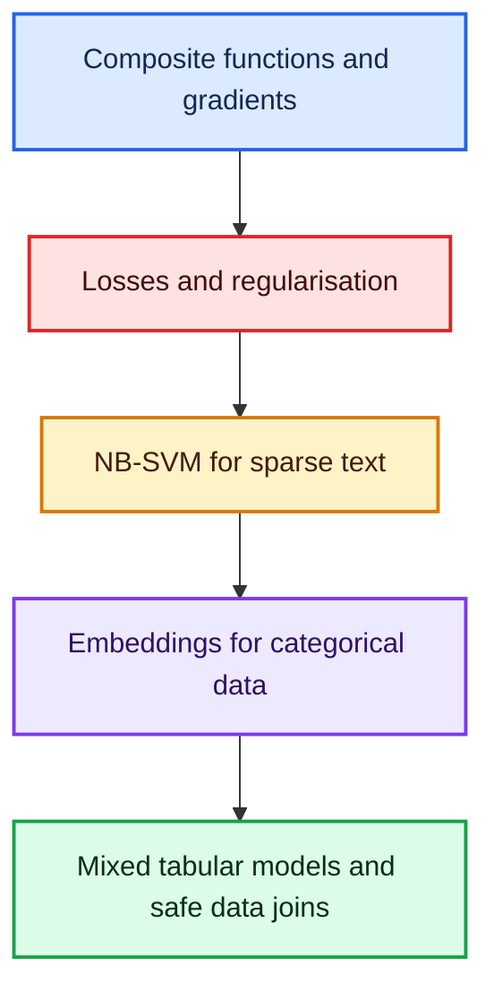

## What, why, how, and when—in one view

| Concept | What? | Why? | How? | When? |
|---|---|---|---|---|
| Chain rule | derivative of a composition | train every layer from one scalar loss | propagate local derivatives backwards | any differentiable multi-operation model |
| Cross-entropy | negative log-probability of the observed class | reward calibrated probability on the correct class | pass raw logits to a stable fused loss | probabilistic classification |
| NB-SVM | NB log-ratio features plus a linear classifier | inject class-count evidence into sparse text learning | scale binary n-grams by $r$, then regularise | strong, interpretable text baseline |
| Embedding | trainable row lookup for a category | avoid huge one-hot inputs and learn dense relationships | index a $K\times d$ table | repeated categorical values or tokens |
| Entity embedding model | embeddings plus continuous inputs and an MLP | learn nonlinear interactions in tabular data | concatenate field embeddings and scaled numbers | mixed structured datasets |
| Safe feature pipeline | availability-aware transforms, splits, and joins | prevent false validation success | fit on past training data and audit invariants | every production or competition model |

---

# Part I — Composite functions and gradients

## 1. A model is a composition of functions

Suppose an input matrix $X$ is transformed by a linear layer, an activation, and a loss:

$$
Z=XW+b,\qquad P=g(Z),\qquad L=\ell(P,Y).
$$

This is not three unrelated calculations. It is one composite function:

$$
L(W,b)=\ell\!\left(g(XW+b),Y\right).
$$

- **What?** A composition feeds the output of one function into the next.
- **Why?** Training requires the derivative of the final scalar loss with respect to every parameter.
- **How?** Apply the chain rule backwards from the loss.
- **When?** Every time a differentiable model has multiple operations—even if it has no hidden layer.

For scalar functions $u=f(x)$, $v=g(u)$, and $L=h(v)$,

$$
\frac{dL}{dx}
=\frac{dL}{dv}\frac{dv}{du}\frac{du}{dx}
=h'(v)g'(u)f'(x).
$$

For vectors and matrices, the same idea holds, but the intermediate derivatives are **Jacobians**. In practice, reverse-mode automatic differentiation propagates **vector–Jacobian products** instead of constructing enormous Jacobian matrices.

```mermaid
%% Forward arrows compute values; backward arrows carry local gradient information.
flowchart LR
    X["Input X"] --> Z["Linear z = XW + b"]
    Z --> P["Activation or probabilities"]
    P --> L["Scalar loss L"]
    L -. "backpropagate" .-> P
    P -. "chain rule" .-> Z
    Z -. "gradient for W,b" .-> X

    classDef input fill:#cffafe,stroke:#0891b2,color:#164e63,stroke-width:2px
    classDef linear fill:#dbeafe,stroke:#2563eb,color:#172554,stroke-width:2px
    classDef activation fill:#ede9fe,stroke:#7c3aed,color:#2e1065,stroke-width:2px
    classDef loss fill:#fee2e2,stroke:#dc2626,color:#450a0a,stroke-width:2px
    class X input
    class Z linear
    class P activation
    class L loss
```

### Example: a complete scalar derivative

Let

$$
z=wx,\qquad p=\sigma(z)=\frac{1}{1+e^{-z}},\qquad
L=-\left[y\log p+(1-y)\log(1-p)\right].
$$

The two useful derivatives are

$$
\frac{dp}{dz}=p(1-p),
\qquad
\frac{dL}{dp}=-\frac{y}{p}+\frac{1-y}{1-p}.
$$

After multiplying and simplifying,

$$
\boxed{\frac{dL}{dw}=(p-y)x.}
$$

This compact result says:

- $p-y$ is the signed prediction error on the probability scale;
- $x$ determines how strongly the parameter $w$ participated in that prediction; and
- if $p=y$, this example contributes zero gradient.

## 2. Parameters and gradients have matching shapes

If $W\in\mathbb{R}^{d\times c}$ and the loss $L$ is scalar, then

$$
\nabla_W L\in\mathbb{R}^{d\times c}.
$$

Conceptually, every parameter tensor can be flattened into one long vector $\theta$. Its gradient $\nabla_\theta L$ has one partial derivative per parameter. Frameworks preserve the original tensor shapes because that is more convenient and efficient.

### Commented automatic-differentiation experiment

```python
import torch

# x is data, so this example does not need a gradient for x.
x = torch.tensor(2.0)

# w is a learnable scalar parameter.
w = torch.tensor(0.5, requires_grad=True)

# Compose a linear operation, sigmoid, and a simple squared loss.
p = torch.sigmoid(w * x)
target = torch.tensor(1.0)
loss = (p - target) ** 2

# Traverse the recorded computation graph backwards and populate w.grad.
loss.backward()

print(f"prediction = {p.item():.6f}")
print(f"loss       = {loss.item():.6f}")
print(f"dL/dw      = {w.grad.item():.6f}")
```

### Why `.backward()` usually starts from a scalar

For a scalar loss, there is a single direction to propagate: $dL/dL=1$. If the output is a vector, a gradient vector must be supplied, which requests a vector–Jacobian product. That is why training code normally reduces per-example losses with a mean or sum.

> **Precision note.** Saying that vector calculus introduces “nothing new” is useful intuition but incomplete. The chain-rule idea is unchanged; tensor shapes, Jacobian orientation, broadcasting, and reduction conventions still matter.

### Fun fact

Backpropagation is not a different derivative rule. It is an efficient scheduling of the ordinary chain rule that reuses intermediate results.

---

# Part II — Outputs, losses, and regularisation

## 3. Keep logits, probabilities, and losses distinct

A **logit** is an unrestricted model score. A probability is a constrained transformation of that score.

| Task | Model output | Probability transformation | Typical training loss |
|---|---:|---:|---:|
| Binary classification | one logit $z$ | $\sigma(z)$ | binary cross-entropy |
| $C$-class classification | logits $z_1,\ldots,z_C$ | softmax | cross-entropy |
| Regression | prediction $\hat y\in\mathbb R$ | usually none | MAE, MSE, or related loss |

Current PyTorch practice is to pass **raw logits** to `BCEWithLogitsLoss` or `CrossEntropyLoss`. These combine transformations with the loss using numerically stable calculations.

## 4. Binary cross-entropy (BCE)

For a label $y\in\{0,1\}$ and predicted probability $p=P(y=1\mid x)$,

$$
\boxed{
\operatorname{BCE}(y,p)
=-\left[y\log p+(1-y)\log(1-p)\right]
}
$$

The formula is simply a compact if-statement:

$$
\operatorname{BCE}(y,p)=
\begin{cases}
-\log p, & y=1,\\
-\log(1-p), & y=0.
\end{cases}
$$

### Why use logarithms?

- A confident correct prediction receives a small loss.
- A confident wrong prediction receives a very large loss.
- Products of probabilities become sums of log-probabilities.
- Minimising BCE is equivalent to maximum-likelihood estimation for a Bernoulli model.

| True label | Predicted $p$ | BCE | Interpretation |
|---:|---:|---:|---|
| 1 | 0.99 | $-\log(0.99)\approx0.010$ | confidently correct |
| 1 | 0.50 | $-\log(0.50)\approx0.693$ | uncertain |
| 1 | 0.01 | $-\log(0.01)\approx4.605$ | confidently wrong |

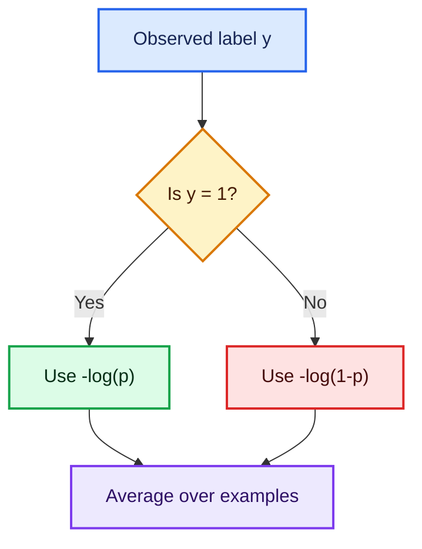

```python
import torch
from torch import nn

# Raw scores are logits; do not apply sigmoid before this loss.
logits = torch.tensor([2.0, -1.0, 0.25])
targets = torch.tensor([1.0, 0.0, 1.0])

# This fused operation is more stable than sigmoid followed by log manually.
criterion = nn.BCEWithLogitsLoss()
loss = criterion(logits, targets)

# Sigmoid is useful after training when probabilities are needed for reporting.
probabilities = torch.sigmoid(logits)
print(probabilities, loss.item())
```

## 5. Multiclass cross-entropy

For mutually exclusive classes $1,\ldots,C$, softmax converts logits to probabilities:

$$
p_k=\frac{e^{z_k}}{\sum_{j=1}^{C}e^{z_j}}.
$$

If the correct class is $t$, the per-example loss is

$$
\boxed{L=-\log p_t.}
$$

With a one-hot target vector $y$ this can also be written

$$
L=-\sum_{k=1}^{C}y_k\log p_k.
$$

```python
import torch
from torch import nn

# Shape: three examples by four possible classes.
logits = torch.tensor([
    [2.0, 0.1, -1.0, 0.3],
    [0.2, 1.8, 0.0, -0.5],
    [-0.1, 0.4, 2.2, 0.0],
])

# Each integer is the index of the correct class for one example.
targets = torch.tensor([0, 1, 2])

# CrossEntropyLoss performs log-softmax plus negative log-likelihood internally.
loss = nn.CrossEntropyLoss()(logits, targets)
print(loss.item())
```

## 6. Regression losses: MAE, MSE, and RMSE

For residuals $e_i=y_i-\hat y_i$:

$$
\operatorname{MAE}=\frac1n\sum_{i=1}^{n}|e_i|,
$$

$$
\operatorname{MSE}=\frac1n\sum_{i=1}^{n}e_i^2,
\qquad
\operatorname{RMSE}=\sqrt{\frac1n\sum_{i=1}^{n}e_i^2}.
$$

| Loss | What it emphasises | Why use it? | Caution |
|---|---|---|---|
| MAE | errors linearly | robust to large outliers; targets conditional median | nondifferentiable exactly at zero, though subgradients work |
| MSE | large errors quadratically | smooth; convenient optimisation; Gaussian-noise likelihood | very sensitive to outliers |
| RMSE | same ranking as MSE for a fixed dataset | expressed in the target’s original units | square root changes gradient scale |

**When should the training loss equal the evaluation metric?** Often, but not blindly. A competition or business metric may be discontinuous, non-differentiable, poorly behaved, or misaligned with real costs. Use it for model selection, and use a differentiable surrogate for training when necessary.

## 7. Regularisation revisited

Regularisation discourages parameters from fitting noise.

### L2 penalty

$$
J(\theta)=L_{\text{data}}(\theta)+\lambda\sum_j\theta_j^2.
$$

Its gradient is

$$
\nabla_\theta J=\nabla_\theta L_{\text{data}}+2\lambda\theta.
$$

### L1 penalty

$$
J(\theta)=L_{\text{data}}(\theta)+\lambda\sum_j|\theta_j|.
$$

L1 often drives some coefficients exactly to zero and can therefore create sparse models. L2 usually shrinks coefficients smoothly.

> **Important nuance.** “L2 regularisation equals weight decay” is exactly true for ordinary SGD under matching coefficient conventions. Adaptive optimisers motivated **decoupled weight decay** (for example AdamW), which is not always identical to adding an L2 term to the loss.

---

# Part III — Sparse text and NB-SVM

## 8. N-grams create high-dimensional sparse data

A unigram model treats individual tokens as features; a bigram model also includes adjacent pairs.

For “not very good”:

- unigrams: `not`, `very`, `good`;
- bigrams: `not very`, `very good`;
- trigram: `not very good`.

N-grams help a linear model represent local order. A unigram model may consider “good” positive, while the bigram “not good” can learn a negative coefficient.

If the vocabulary has $V$ entries, the design matrix has $V$ columns, but each document activates only a small fraction. Sparse storage records nonzero positions and values instead of a dense matrix full of zeros.


```python
from sklearn.feature_extraction.text import CountVectorizer

documents = ["not very good", "very good", "not bad"]

# binary=True records presence rather than the number of repetitions.
# ngram_range=(1, 2) includes both unigrams and bigrams.
vectorizer = CountVectorizer(binary=True, ngram_range=(1, 2))
X = vectorizer.fit_transform(documents)

# The matrix stays sparse; avoid X.toarray() on a real, large corpus.
print(X.shape)
print(vectorizer.get_feature_names_out())
```

High dimensionality is not automatically harmless: memory, optimisation time, rare-feature variance, and leakage can still grow. Sparsity and regularisation make the representation practical, not cost-free.

## 9. Naive Bayes log-count ratios

For feature $j$, estimate its smoothed probability in positive and negative documents:

$$
p_j=\frac{N_{j,+}+\alpha}{\sum_k(N_{k,+}+\alpha)},
\qquad
q_j=\frac{N_{j,-}+\alpha}{\sum_k(N_{k,-}+\alpha)}.
$$

Then define the log-count ratio

$$
\boxed{r_j=\log\frac{p_j}{q_j}=\log p_j-\log q_j.}
$$

- $r_j>0$: feature $j$ is relatively more associated with the positive class.
- $r_j<0$: it is relatively more associated with the negative class.
- $r_j\approx0$: its class frequencies are similar.
- $\alpha>0$: additive smoothing prevents zero probabilities and infinite logarithms.

### Worked micro-example

Suppose “excellent” has smoothed probabilities $p=0.08$ and $q=0.01$:

$$
r_{\text{excellent}}=\log(8)\approx2.079.
$$

Suppose “awful” has $p=0.005$ and $q=0.05$:

$$
r_{\text{awful}}=\log(0.1)\approx-2.303.
$$

The sign expresses direction; the magnitude expresses the strength of the class imbalance on a log scale.

## 10. NB-SVM construction

The classic method from Wang and Manning (2012) combines a Naive-Bayes-derived representation with a discriminative linear classifier.

1. Build a binary document–feature matrix $X$.
2. Compute the vector of log-count ratios $r$ from the training labels only.
3. Rescale each column:

   $$
   X_{\text{NB}}=X\odot r,
   $$

   where broadcasting multiplies column $j$ by $r_j$.
4. Fit a regularised linear SVM or logistic-regression classifier on $X_{\text{NB}}$.

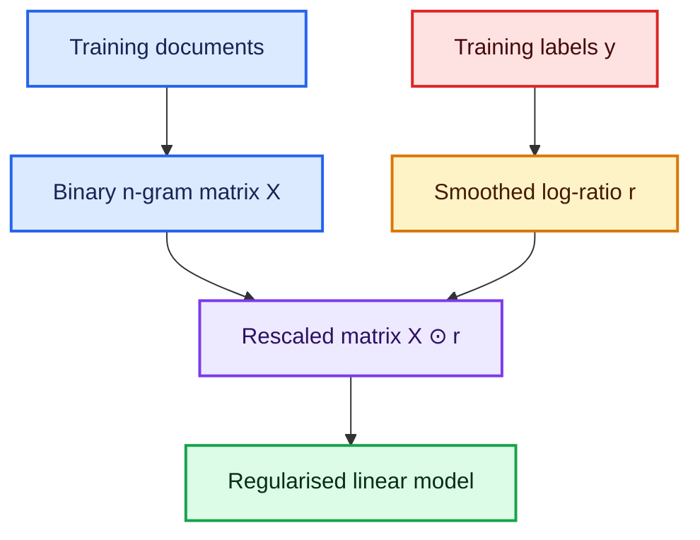

### The leakage rule

Because $r$ uses labels, it must be fitted inside each training fold. Computing it once on the entire dataset before cross-validation leaks validation labels into the representation.

## 11. Why rescaling matters under L2 regularisation

At first glance, scaling features should not add expressive power. Let $z=x\odot r$ and fit a coefficient vector $\beta$:

$$
z^\top\beta=(x\odot r)^\top\beta=x^\top(r\odot\beta).
$$

Define the effective coefficient on the original feature as

$$
\theta=r\odot\beta.
$$

If every $r_j\neq0$, any original linear score can be represented by choosing $\beta_j=\theta_j/r_j$. So why can performance change? Because regularisation is applied in the **parameterisation being optimised**:

$$
\|\beta\|_2^2
=\sum_j\beta_j^2
=\sum_j\frac{\theta_j^2}{r_j^2}.
$$

Therefore NB scaling creates an **anisotropic penalty** in the original feature space:

- a large $|r_j|$ makes a given effective coefficient $\theta_j$ cheaper;
- a small $|r_j|$ makes it more expensive;
- the model is biased toward features whose class counts already look discriminative.

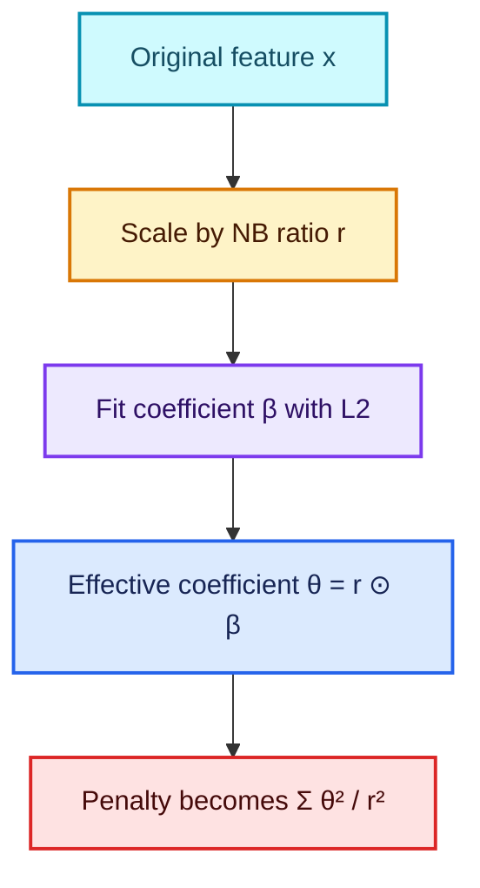

This is the precise mathematical version of the lecture’s “prior” intuition: the representation and penalty encode a preference before the discriminative model sees enough evidence to move far from it.

## 12. A prior-centred NB parameterisation

The lecture explores a variant that can be written schematically as

$$
\theta_j=\frac{(u_j+a)r_j}{s},
$$

where:

- $u_j$ is trainable;
- $r_j$ is the fixed NB log-count ratio;
- $a$ is an offset such as the historical empirical value $0.4$ discussed in the lesson; and
- $s$ is an optional scale.

If L2 is applied to $u$, then in terms of the effective coefficient $\theta$,

$$
u_j=\frac{s\theta_j}{r_j}-a,
$$

so the penalty becomes

$$
\boxed{
\sum_j u_j^2
=\sum_j\left(\frac{s\theta_j}{r_j}-a\right)^2.
}
$$

The model is now regularised toward

$$
\theta_j=\frac{a r_j}{s},
$$

rather than toward zero.

| Trainable value | Effective meaning |
|---:|---|
| $u_j=0$ | start at the NB-informed coefficient $ar_j/s$ |
| $u_j=-a$ | cancel that feature: $\theta_j=0$ |
| $u_j>0$ | reinforce the NB direction when $r_j>0$ |

The offset $a=0.4$ is not a mathematical constant. It was an empirical choice in this historical workflow and should be validated or tuned.

### Numerical identity check

```python
import numpy as np

# Fixed NB ratios learned from the training set.
r = np.array([2.0, -1.5, 0.5])

# Trainable residual parameters and chosen hyperparameters.
u = np.array([0.1, -0.2, 0.3])
a, scale = 0.4, 10.0

# Map residual parameters to coefficients on the original features.
theta = (u + a) * r / scale

# Both expressions must describe the same L2 penalty.
penalty_in_u = np.sum(u**2)
penalty_in_theta = np.sum((scale * theta / r - a) ** 2)

assert np.allclose(penalty_in_u, penalty_in_theta)
print(theta, penalty_in_u)
```

## 13. SVM versus logistic regression

Both are linear classifiers in this setting:

$$
s(x)=w^\top x+b.
$$

They are not identical.

| Property | Logistic regression | Linear SVM |
|---|---|---|
| Common loss | logistic/log loss | hinge loss |
| Main intuition | likelihood and probabilities | maximise classification margin |
| Native calibrated probability | yes, subject to model calibration | no; requires extra calibration |
| Decision boundary | $w^\top x+b=0$ | $w^\top x+b=0$ |

Their decision functions can look similar on sparse text, which is why “NB-SVM” is sometimes used loosely even when the final estimator is logistic regression. The name is historical, not a guarantee that an SVM is present.

## 14. Complete, commented NB-logistic classifier

```python
import numpy as np
from sklearn.base import BaseEstimator, ClassifierMixin
from sklearn.feature_extraction.text import CountVectorizer
from sklearn.linear_model import LogisticRegression
from sklearn.pipeline import Pipeline


class NBSVMClassifier(ClassifierMixin, BaseEstimator):
    """Binary NB-scaled logistic regression for sparse feature matrices."""

    def __init__(self, C=1.0, alpha=1.0, max_iter=1000):
        # Store constructor arguments unchanged so sklearn can clone the model.
        self.C = C
        self.alpha = alpha
        self.max_iter = max_iter

    def fit(self, X, y):
        # Convert labels to an array so boolean masks behave predictably.
        y = np.asarray(y)
        X = X.tocsr()

        # Additive smoothing prevents zero probabilities and infinite ratios.
        positive_counts = np.asarray(X[y == 1].sum(axis=0)).ravel() + self.alpha
        negative_counts = np.asarray(X[y == 0].sum(axis=0)).ravel() + self.alpha

        # Normalise within each class, then take the log probability ratio.
        positive_prob = positive_counts / positive_counts.sum()
        negative_prob = negative_counts / negative_counts.sum()
        self.r_ = np.log(positive_prob) - np.log(negative_prob)

        # Sparse elementwise multiplication scales feature column j by r_j.
        X_nb = X.multiply(self.r_)

        # liblinear is convenient for a small binary sparse example.
        self.model_ = LogisticRegression(
            C=self.C,
            solver="liblinear",
            max_iter=self.max_iter,
            random_state=0,
        )
        self.model_.fit(X_nb, y)

        # sklearn-compatible fitted attributes.
        self.classes_ = self.model_.classes_
        self.n_features_in_ = X.shape[1]
        return self

    def predict(self, X):
        # Use the training-set ratio unchanged at inference time.
        return self.model_.predict(X.tocsr().multiply(self.r_))

    def predict_proba(self, X):
        # Logistic regression can return class probabilities.
        return self.model_.predict_proba(X.tocsr().multiply(self.r_))


pipeline = Pipeline([
    # Bigrams capture short phrases; binary values match the NB-SVM recipe.
    ("ngrams", CountVectorizer(binary=True, ngram_range=(1, 2))),
    # Keeping this in a Pipeline ensures ratios are refitted inside CV folds.
    ("classifier", NBSVMClassifier(C=4.0, alpha=1.0)),
])

train_text = [
    "excellent acting and story",
    "wonderful and moving",
    "not bad at all",
    "awful acting and story",
    "boring and slow",
    "not good at all",
]
train_y = np.array([1, 1, 1, 0, 0, 0])

pipeline.fit(train_text, train_y)
print(pipeline.predict(["not good", "wonderful story"]))
```

### What this code deliberately protects

- The n-gram vocabulary and $r$ are learned from training data only.
- Sparse matrices stay sparse.
- Additive smoothing avoids infinities.
- The exact same fitted $r$ transforms later data.
- Comments explain the purpose of each non-obvious operation.

> **Current perspective.** NB-SVM remains an excellent interpretable baseline for smaller labelled text datasets. It is not a universal state-of-the-art replacement for pretrained language models, especially when contextual meaning and transfer learning matter.

---

# Part IV — Embeddings

## 15. An embedding lookup is a one-hot matrix multiplication

Let a categorical variable have $K$ possible values and let

$$
E\in\mathbb{R}^{K\times d}
$$

be an embedding matrix. Category $k$ can be represented by a one-hot row vector $e_k^\top$. Then

$$
\boxed{e_k^\top E=E_{k,:}.}
$$

Multiplying a one-hot vector by $E$ selects exactly one row. An embedding layer performs this row lookup directly, avoiding the construction of a mostly-zero one-hot vector.

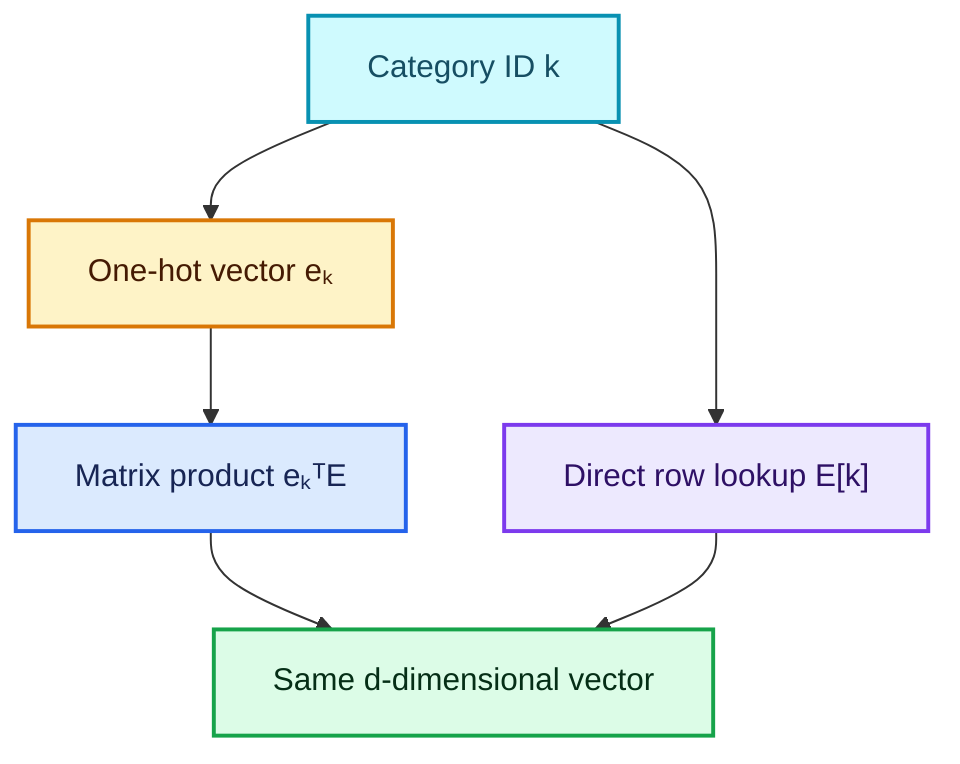

### Numerical proof

```python
import numpy as np

# Four categories, each represented by a three-dimensional embedding.
E = np.array([
    [0.2, 0.1, -0.4],
    [1.0, 0.3, 0.5],
    [-0.7, 0.8, 0.2],
    [0.4, -0.6, 0.9],
])

category_id = 2

# Construct a one-hot representation only to demonstrate the identity.
one_hot = np.zeros(4)
one_hot[category_id] = 1.0

via_matrix_multiplication = one_hot @ E
via_lookup = E[category_id]

assert np.allclose(via_matrix_multiplication, via_lookup)
print(via_lookup)
```

## 16. One-hot, multi-hot, and count vectors

The row-lookup identity is exact for one active category. Text documents often activate many tokens.

For a general feature vector $x\in\mathbb{R}^{K}$,

$$
x^\top E=\sum_{j=1}^{K}x_jE_{j,:}.
$$

- one-hot: select one row;
- multi-hot binary vector: sum the rows for every present feature;
- count vector: sum the rows, weighted by token counts;
- normalised bag: take a weighted mean or other pooled representation.

This is why embedding bags and pooled token embeddings are natural extensions of a simple lookup.

## 17. What an embedding learns

An embedding is not merely a speed trick. Its rows are trainable vectors, learned to make the downstream objective small. Values that play similar predictive roles may become close in the learned space.

For example, a store-type embedding might use latent directions resembling:

- typical customer volume;
- promotion sensitivity;
- urban versus rural behaviour; or
- assortment breadth.

The axes are not guaranteed to have human-readable meanings, and rotations of the space can represent the same model. Interpret neighbourhoods and downstream behaviour cautiously.

### Parameter count

One categorical field with cardinality $K$ and dimension $d$ adds

$$
K\times d
$$

trainable parameters. Ten thousand product IDs with $d=32$ require $320{,}000$ embedding weights.

### Fun fact

Embedding geometry is not unique. If a later linear layer is transformed by the inverse of an invertible change of basis, predictions can stay the same even though the coordinates of every embedding change.

## 18. Embeddings in current PyTorch

```python
import torch
from torch import nn

# Reserve index 0 for padding; its row is not updated during ordinary training.
embedding = nn.Embedding(
    num_embeddings=6,
    embedding_dim=3,
    padding_idx=0,
)

# Integer IDs have shape: batch by sequence length.
token_ids = torch.tensor([
    [1, 2, 0],
    [4, 3, 5],
])

# Output shape is: batch by sequence length by embedding dimension.
vectors = embedding(token_ids)
print(vectors.shape)  # torch.Size([2, 3, 3])

# Ignore padding positions when mean-pooling a sequence.
mask = (token_ids != 0).unsqueeze(-1)
summed = (vectors * mask).sum(dim=1)
lengths = mask.sum(dim=1).clamp_min(1)
pooled = summed / lengths
print(pooled.shape)  # torch.Size([2, 3])
```

### Gradient nuance

Only selected rows receive nonzero contributions in a lookup. However, `nn.Embedding` uses a dense gradient tensor by default. Setting `sparse=True` requests sparse gradients, but only a limited set of optimisers supports them. “Embedding lookup means sparse gradients” is therefore not automatically true at the framework level.

### Picking an embedding dimension

There is no universal formula. A practical process is:

1. start with a modest dimension;
2. increase it for high-cardinality fields with rich repeated signal;
3. regularise with weight decay/dropout where appropriate;
4. compare validation performance, training speed, and parameter count.

Too small may underfit; too large may memorise rare categories.

---

# Part V — Entity embeddings for tabular data

## 19. From one categorical field to a mixed-input network

Structured datasets usually contain two broad families:

- **categorical fields** such as store ID, state, store type, or promotion type;
- **continuous fields** such as distance, temperature, or elapsed months.

Create one embedding table per categorical field, normalise the continuous values, concatenate everything, and feed the result to a multilayer perceptron (MLP).

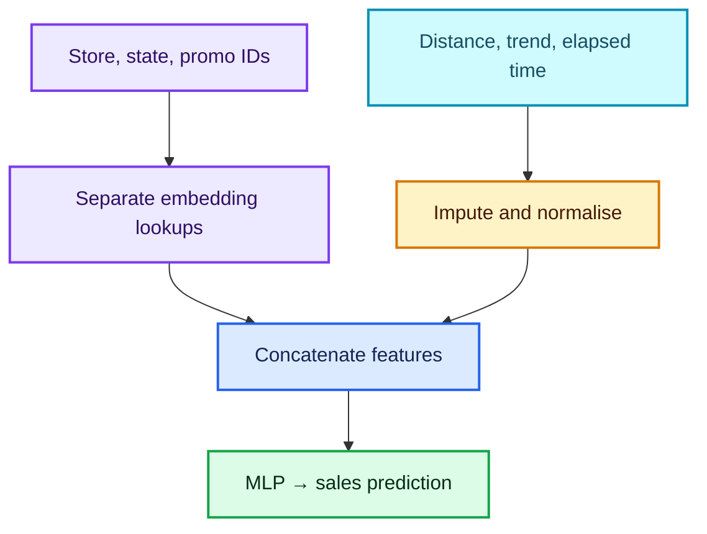

The lesson discusses the Rossmann sales forecasting competition. Typical inputs included repeated store identities, dates, promotions, competition information, store metadata, and external information such as weather or search trends. This is a natural setting for **entity embeddings**: the category representations are learned jointly with the forecasting task.

## 20. Categorical or continuous?

The correct choice depends on what relationships the model should be allowed to learn.

| Treat as categorical when… | Treat as continuous when… |
|---|---|
| codes have no numerical distance | numerical distance is meaningful |
| each repeated level may have an arbitrary effect | interpolation or extrapolation is useful |
| examples include store ID, state, product family | examples include temperature, price, distance |
| enough examples exist for important levels | ordering and scale carry real information |

An integer category code such as `state=7` does **not** mean “seven units of state.” Conversely, turning a genuinely ordered duration into unrelated categories throws away closeness: months 11 and 12 become no more related than months 1 and 12 unless the model relearns it.

### IDs are not all alike

- Repeated entity ID such as `store_id` can be highly informative because the same store appears many times.
- A unique row ID occurs once and usually invites memorisation without generalisation.
- A user or product ID may be useful only if it repeats enough and future IDs are handled.

## 21. Bucketisation: useful compromise, real trade-off

The lecture describes capping “months since competition opened” at 24 and then treating it as categorical:

$$
b(m)=\min(\max(m,0),24).
$$

This gives distinct categories for months $0$ through $23$ and a shared “24 or more” category.

- **Why?** Effects may be nonlinear: a new competitor may matter most in early months.
- **Benefit:** arbitrary effects within each bucket.
- **Cost:** order and within-bucket precision are lost.
- **Alternative:** retain the continuous value and add splines, monotonic constraints, or both raw and bucketed versions.

```python
import pandas as pd

# Example months may contain negatives caused by dates before opening.
months = pd.Series([-3, 0, 1, 12, 24, 60])

# Clip to the meaningful range; 24 represents "24 months or more".
competition_bucket = months.clip(lower=0, upper=24).astype("int64")
print(competition_bucket.tolist())
```

“Use categorical variables wherever possible” is a hypothesis, not a law. Compare sensible representations on a leakage-safe validation set.

## 22. A commented mixed-input PyTorch model

```python
import torch
from torch import nn


class TabularEmbeddingModel(nn.Module):
    """Combine one embedding per categorical column with continuous inputs."""

    def __init__(self, cardinalities, embedding_dims, n_continuous):
        super().__init__()

        # Validate configuration early so shape errors are easier to diagnose.
        if len(cardinalities) != len(embedding_dims):
            raise ValueError("Each categorical field needs one embedding dimension")

        # ModuleList registers every embedding table as part of the model.
        self.embeddings = nn.ModuleList([
            nn.Embedding(cardinality, dimension)
            for cardinality, dimension in zip(cardinalities, embedding_dims)
        ])

        # BatchNorm stabilises the scale of already-imputed continuous features.
        self.continuous_norm = nn.BatchNorm1d(n_continuous)

        # The MLP input width equals all embedding widths plus continuous columns.
        input_width = sum(embedding_dims) + n_continuous
        self.mlp = nn.Sequential(
            nn.Linear(input_width, 128),
            nn.ReLU(),
            nn.Dropout(0.10),
            nn.Linear(128, 64),
            nn.ReLU(),
            nn.Linear(64, 1),
        )

    def forward(self, x_categorical, x_continuous):
        # x_categorical has shape [batch, number_of_categorical_fields].
        # Column i indexes the embedding table created for field i.
        embedded_fields = [
            table(x_categorical[:, i])
            for i, table in enumerate(self.embeddings)
        ]

        # Normalise continuous data using training-time batch statistics.
        normalised_continuous = self.continuous_norm(x_continuous)

        # Concatenate along the feature dimension, never the batch dimension.
        combined = torch.cat(
            [*embedded_fields, normalised_continuous],
            dim=1,
        )

        # Squeeze only the final singleton output dimension.
        return self.mlp(combined).squeeze(1)


# Example: store ID, state, and promotion type.
model = TabularEmbeddingModel(
    cardinalities=[1200, 16, 5],
    embedding_dims=[32, 6, 3],
    n_continuous=4,
)

# Two rows containing integer category IDs.
x_cat = torch.tensor([[4, 2, 1], [981, 7, 0]], dtype=torch.long)

# Two rows containing already-imputed numerical features.
x_cont = torch.tensor([
    [3.2, 0.4, 18.0, 12.0],
    [1.1, -0.2, 7.0, 25.0],
], dtype=torch.float32)

prediction = model(x_cat, x_cont)
print(prediction.shape)  # torch.Size([2])
```

### Preprocessing rules that the model code does not replace

1. Fit category vocabularies on the training partition.
2. Reserve an unknown-category ID for unseen validation/test levels.
3. Fit imputation and continuous normalisation on training data only.
4. Store the mappings with the model so inference applies exactly the same transformations.
5. Decide whether the target needs a transformation such as $\log(1+y)$, then invert it for evaluation.

---

# Part VI — External data, joins, dates, and leakage

## 23. The availability test for every feature

External data can improve a model only if it is available in the real prediction setting.

Ask of every feature:

> **At the exact time this prediction is made, would the value already be known, and would it be produced by the same process?**

Weather illustrates the issue:

- predicting yesterday’s sales may use observed weather legitimately;
- predicting next week’s sales cannot use next week’s observed weather;
- a weather **forecast** available today may be valid, but its distribution differs from final observations.

The same applies to revised economic series, future search trends, post-event status flags, and tables updated after the target occurs.

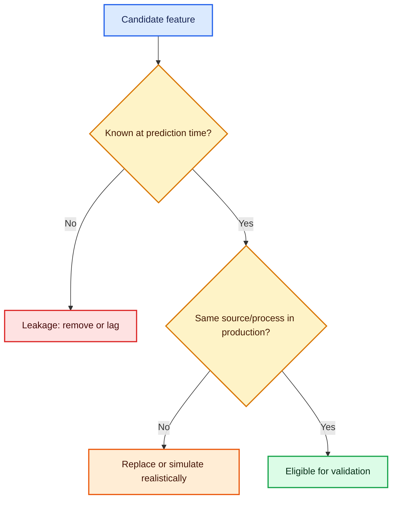

## 24. Time-aware validation

Random splits leak future patterns into training when deployment predicts later dates. A simple chronological split is:

$$
\underbrace{t_1,\ldots,t_k}_{\text{train}}
\quad\longrightarrow\quad
\underbrace{t_{k+1},\ldots,t_m}_{\text{validation}}.
$$

For repeated evaluation, use rolling or expanding windows.

```python
import pandas as pd

# Parse once, sort chronologically, and preserve the original row-level data.
df = pd.DataFrame({
    "date": ["2026-01-03", "2026-01-01", "2026-01-02", "2026-01-04"],
    "sales": [140, 100, 115, 155],
})
df["date"] = pd.to_datetime(df["date"], errors="raise")
df = df.sort_values("date").reset_index(drop=True)

# In a real project, choose the cutoff to resemble the deployment horizon.
cutoff = pd.Timestamp("2026-01-03")
train = df.loc[df["date"] < cutoff].copy()
validation = df.loc[df["date"] >= cutoff].copy()

# This assertion guards against accidental temporal overlap.
assert train["date"].max() < validation["date"].min()
```

## 25. Left joins and their invariants

A left join keeps every row from the primary table and attaches matching columns from a lookup table.

If `sales` is the modelling table and `stores` has one row per store, the intended relationship is **many sales rows to one store row**.

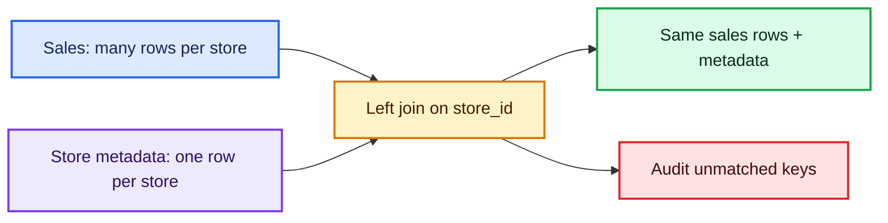

### What can go wrong?

- Duplicate keys on the right duplicate left rows.
- Misspelled or type-mismatched keys create missing matches.
- Null keys can behave differently from SQL; current pandas matches null keys to each other.
- Overlapping columns gain suffixes and may hide conflicting values.
- Joining future-updated data can leak even if the join itself is technically correct.

## 26. A robust, commented pandas merge

```python
import pandas as pd


def safe_many_to_one_left_join(left, right, keys):
    """Left-join a lookup table while checking key modelling invariants."""

    # Normalise a single key string to a list for uniform handling.
    keys = [keys] if isinstance(keys, str) else list(keys)

    # A many-to-one lookup must have at most one row for each right-side key.
    duplicates = right.duplicated(keys, keep=False)
    if duplicates.any():
        examples = right.loc[duplicates, keys].head().to_dict("records")
        raise ValueError(f"Right-side keys are not unique; examples: {examples}")

    before = len(left)

    # validate checks cardinality; indicator records whether each row matched.
    merged = left.merge(
        right,
        how="left",
        on=keys,
        validate="many_to_one",
        indicator="_join_status",
        suffixes=("", "_lookup"),
    )

    # A valid many-to-one left join must preserve row count.
    if len(merged) != before:
        raise AssertionError("The left join changed the number of modelling rows")

    # Report unmatched rows explicitly instead of silently accepting NaNs.
    match_rate = merged["_join_status"].eq("both").mean()
    print(f"join match rate = {match_rate:.2%}")

    # The audit column has served its purpose and need not become a feature.
    return merged.drop(columns="_join_status")


sales = pd.DataFrame({
    "store_id": [1, 1, 2, 3],
    "sales": [100, 110, 80, 125],
})
stores = pd.DataFrame({
    "store_id": [1, 2, 3],
    "state": ["NSW", "VIC", "QLD"],
})

joined = safe_many_to_one_left_join(sales, stores, "store_id")
print(joined)
```

Do not mechanically delete every `_lookup` column. First compare overlapping values, decide which source is authoritative, and document the reconciliation rule.

## 27. Date features and missing dates

Dates are structured objects, not arbitrary strings. Useful derived features include:

- year, month, day, day of week;
- weekend, month-end, quarter;
- elapsed time since an event;
- time until a known future event;
- cyclic encodings such as $\sin(2\pi m/12)$ and $\cos(2\pi m/12)$ for month $m$.

### Elapsed months

For event date $d_e$ and observation date $d_o$, a simple calendar approximation is

$$
m=12(\operatorname{year}(d_o)-\operatorname{year}(d_e))
+\operatorname{month}(d_o)-\operatorname{month}(d_e).
$$

```python
import numpy as np
import pandas as pd


def add_date_features(frame, date_col, event_date_col):
    """Create calendar and elapsed-time features without fake ancient dates."""

    result = frame.copy()

    # Invalid strings become missing values so they can be audited explicitly.
    result[date_col] = pd.to_datetime(result[date_col], errors="coerce")
    result[event_date_col] = pd.to_datetime(result[event_date_col], errors="coerce")

    # Record missingness because "event date unknown" may itself be informative.
    result[f"{event_date_col}_missing"] = result[event_date_col].isna().astype("int8")

    # Vectorised calendar features are faster and safer than row-wise string slicing.
    result["year"] = result[date_col].dt.year
    result["month"] = result[date_col].dt.month
    result["day_of_week"] = result[date_col].dt.dayofweek
    result["is_weekend"] = result["day_of_week"].ge(5).astype("int8")

    # Calculate calendar-month difference only when both dates are known.
    month_delta = (
        12 * (result[date_col].dt.year - result[event_date_col].dt.year)
        + result[date_col].dt.month
        - result[event_date_col].dt.month
    )
    result["months_since_event"] = month_delta.where(result[event_date_col].notna())

    # Cyclic encoding places December near January on the unit circle.
    result["month_sin"] = np.sin(2 * np.pi * result["month"] / 12)
    result["month_cos"] = np.cos(2 * np.pi * result["month"] / 12)
    return result
```

Filling an unknown event date with the year 1900, as older pipelines sometimes did, creates enormous artificial durations. Prefer a missing indicator plus an imputation strategy fitted on training data, or represent “unknown” as its own category.

---

# Part VII — Research and implementation habits

## 28. Read papers as executable hypotheses

The lesson emphasises research tenacity: important implementation details may be terse, missing, or encoded in released code. A reliable workflow is:

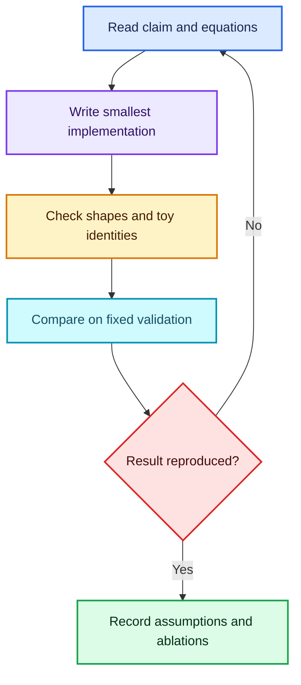

1. Restate the method using explicit shapes and equations.
2. Test identities on tiny arrays.
3. Reproduce the simplest baseline before adding refinements.
4. Change one component at a time.
5. Keep preprocessing and split logic fixed during comparisons.
6. Inspect released code, but do not assume every line is necessary or correct.
7. Record seeds, library versions, metrics, and failed attempts.

Code is evidence of what one implementation did, not proof that each choice was theoretically required or exhaustively tested.

## 29. Claims from the transcript—refined

| Lecture intuition | Precise interpretation |
|---|---|
| A deep model is just a composed function. | Correct; vector derivatives require attention to Jacobian/VJP shapes. |
| Cross-entropy selects the probability of the true class. | Correct; the loss is the **negative log** of that probability. |
| Rescaling by $r$ should not matter to a linear model. | Expressive scores may be equivalent, but regularisation and optimisation are not invariant to rescaling. |
| NB-SVM adds a prior. | Precisely, feature scaling induces a weighted penalty; an offset parameterisation can centre the penalty on an NB-informed coefficient. |
| SVM and logistic regression are basically the same. | Both can learn linear boundaries, but losses, margins, and probability semantics differ. |
| An embedding is a fast one-hot matrix product. | True, and it is also a learnable dense representation with potentially meaningful neighbourhoods. |
| An embedding makes gradients sparse. | Selected rows receive updates, but the stored gradient is dense unless sparse gradients are requested. |
| Make variables categorical whenever possible. | Sometimes powerful for arbitrary repeated effects; continuous/ordinal structure can be valuable and should be validated. |
| External data improves competition models. | Only if availability is reproduced at inference and validation respects time. |
| A left merge safely adds metadata. | Only after cardinality, row count, unmatched keys, duplicate keys, and overlapping columns are audited. |
| Learned methods beat hand-crafted theory. | Often productive, but domain constraints, causal availability, physics, monotonicity, and safety requirements can remain essential. |

---

# Part VIII — Formula sheet

## 30. Core formulas at a glance

### Chain rule

$$
\frac{d}{dx}h(g(f(x)))=h'(g(f(x)))g'(f(x))f'(x).
$$

### Sigmoid

$$
\sigma(z)=\frac1{1+e^{-z}},\qquad \sigma'(z)=\sigma(z)(1-\sigma(z)).
$$

### Binary cross-entropy

$$
\operatorname{BCE}(y,p)=-[y\log p+(1-y)\log(1-p)].
$$

### Softmax and multiclass cross-entropy

$$
p_k=\frac{e^{z_k}}{\sum_j e^{z_j}},\qquad L=-\log p_t.
$$

### Regression metrics

$$
\operatorname{MAE}=\frac1n\sum_i|y_i-\hat y_i|,
$$

$$
\operatorname{RMSE}=\sqrt{\frac1n\sum_i(y_i-\hat y_i)^2}.
$$

### NB log-count ratio

$$
r_j=\log\frac{P(j\mid y=1)}{P(j\mid y=0)}.
$$

### NB-scaled features

$$
X_{\text{NB}}=X\odot r.
$$

### Scaling-induced L2 penalty

$$
\theta=r\odot\beta
\quad\Longrightarrow\quad
\|\beta\|_2^2=\sum_j\frac{\theta_j^2}{r_j^2}.
$$

### Prior-centred parameterisation

$$
\theta_j=\frac{(u_j+a)r_j}{s}
\quad\Longrightarrow\quad
\|u\|_2^2=\sum_j\left(\frac{s\theta_j}{r_j}-a\right)^2.
$$

### Embedding identity

$$
e_k^\top E=E_{k,:},
\qquad
x^\top E=\sum_jx_jE_{j,:}.
$$

---

# Part IX — Worked checks and practice

## 31. Worked check: BCE

A model predicts $p=0.8$.

- If $y=1$, $L=-\log(0.8)\approx0.223$.
- If $y=0$, $L=-\log(0.2)\approx1.609$.

The second loss is much larger because the model assigned 80% probability to the wrong class.

## 32. Worked check: why NB scaling changes the penalty

Take $r_1=4$ and $r_2=0.5$. Suppose we want equal effective coefficients $\theta_1=\theta_2=1$.

$$
\beta_1=\frac{1}{4}=0.25,
\qquad
\beta_2=\frac{1}{0.5}=2.
$$

Their L2 contributions are

$$
\beta_1^2=0.0625,
\qquad
\beta_2^2=4.
$$

The same effective coefficient is 64 times more expensive for the feature with smaller $|r|$. This is why representation scaling changes a regularised model even when its set of possible linear scores is unchanged.

## 33. Worked check: embedding shapes

Suppose:

- batch size $B=64$;
- four categorical fields with embedding dimensions $[8,5,3,12]$;
- six continuous features.

The concatenated width is

$$
8+5+3+12+6=34.
$$

The MLP input tensor therefore has shape $64\times34$.

## 34. Practice questions

1. Derive $\partial L/\partial b$ for binary logistic regression and explain why it lacks the factor $x$.
2. Why is applying sigmoid before `BCEWithLogitsLoss` mathematically wrong?
3. Calculate BCE when $y=0$ and $p=0.15$.
4. Compare the influence of a residual of 10 under MAE and MSE.
5. What phrase feature can distinguish “good” from “not good”?
6. Why must smoothing be added before taking a Naive Bayes log ratio?
7. If $r_j=0$, what happens to feature $j$ after NB scaling? How could an implementation handle this?
8. Derive the effective L2 penalty when $z_j=c_jx_j$.
9. In the offset model, what value of $u_j$ cancels the NB contribution?
10. Why does the value $0.4$ require validation?
11. Explain one important difference between logistic regression and a linear SVM.
12. Prove that `one_hot @ E` equals `E[k]`.
13. How does the result change for a count vector with count 3 at token $k$?
14. What is the parameter count for $K=50{,}000$, $d=64$?
15. Why might a very large embedding dimension overfit rare categories?
16. Why can a repeated store ID help while a unique row ID usually cannot?
17. Give one variable that should remain continuous and explain why.
18. What information is lost when elapsed months are bucketed?
19. Why is observed weather for next week invalid for a forecast made today?
20. Design a time split for predicting the next 28 days.
21. What does `validate="many_to_one"` check in a pandas merge?
22. How can a duplicate lookup key change row count?
23. Why should merge suffix columns be compared rather than blindly deleted?
24. Why is a fake event date of 1900 dangerous?
25. List three checks required before declaring a paper result reproduced.

## 35. Short answers

1. $\partial L/\partial b=p-y$ because $\partial(wx+b)/\partial b=1$.
2. The fused loss expects logits and applies the stable transformation internally; pre-sigmoid values are misinterpreted as logits.
3. $-\log(0.85)\approx0.163$.
4. MAE contributes 10; squared error contributes 100 before averaging.
5. A bigram such as `not good`.
6. Without smoothing, a zero class count produces $\log0$ or division by zero.
7. The scaled column vanishes; clipping, smoothing, or dropping near-zero-ratio features are possible design choices.
8. If $\theta_j=c_j\beta_j$, L2 on $\beta$ becomes $\sum_j\theta_j^2/c_j^2$.
9. $u_j=-a$.
10. It is an empirical hyperparameter, not a universal consequence of the derivation.
11. Logistic regression minimises log loss and supplies probability estimates; SVM commonly minimises hinge loss and focuses on margin.
12. Every one-hot term is zero except the $k$th, leaving row $E_k$.
13. It contributes $3E_k$ to the weighted sum.
14. $3{,}200{,}000$ weights.
15. It adds flexible parameters that infrequent categories cannot estimate reliably.
16. Repetition lets the model learn an entity effect and reuse it; a unique ID has no repeated evidence.
17. Distance: nearby values have a meaningful order and scale.
18. Fine numerical distance, ordering assumptions, and within-bucket differences.
19. It was not known at prediction time and therefore leaks future information.
20. Train only on dates earlier than the 28-day validation horizon and evaluate on that final contiguous block.
21. Right-side merge keys must be unique; many left rows may share a key.
22. Each matching duplicate produces another output row, silently duplicating training examples.
23. The values may conflict, and deleting one source without an audit can hide a data-quality error.
24. It creates a false, extremely large elapsed duration.
25. Fixed data/split, matched metric/preprocessing, and controlled ablations with reproducible seeds and versions.

---

# Part X — Practical checklist

## 36. Before training a text model

- [ ] Fit the vocabulary on training data only.
- [ ] Keep sparse matrices sparse.
- [ ] Compute NB ratios from training labels only.
- [ ] Use smoothing.
- [ ] Put all learned transforms inside cross-validation folds.
- [ ] Compare unigram and n-gram baselines.
- [ ] Tune regularisation on validation data.
- [ ] Inspect errors, not only aggregate accuracy.

## 37. Before training a tabular embedding model

- [ ] Define the prediction timestamp and horizon.
- [ ] Verify availability of every feature at that timestamp.
- [ ] Use a time-aware validation split where appropriate.
- [ ] Audit join cardinality, row counts, unmatched keys, and duplicates.
- [ ] Reserve unknown categorical IDs.
- [ ] Fit imputation and scaling on training data only.
- [ ] Check category cardinality and rare levels.
- [ ] Compare categorical, continuous, and bucketed representations.
- [ ] Save the preprocessing mappings with the model.

## 38. Debugging shape checklist

- [ ] Binary logits and targets have compatible shapes.
- [ ] Multiclass logits have shape `[batch, classes]`.
- [ ] Category tensors use integer (`long`) dtype.
- [ ] Category IDs are within each embedding table’s range.
- [ ] Continuous tensors are floating-point.
- [ ] Concatenation occurs along the feature dimension.
- [ ] The first linear layer’s input width equals summed embedding widths plus continuous width.

---

# Resources and further reading

## Original resource preserved

- [Machine Learning 1: Lesson 11 — YouTube](https://www.youtube.com/watch/XJ_waZlJU8g)

## Papers

- Sida Wang and Christopher Manning, [Baselines and Bigrams: Simple, Good Sentiment and Topic Classification](https://aclanthology.org/P12-2018/) (ACL, 2012).
- Cheng Guo and Felix Berkhahn, [Entity Embeddings of Categorical Variables](https://arxiv.org/abs/1604.06737) (2016).

## Current official documentation

- [PyTorch automatic differentiation](https://docs.pytorch.org/docs/stable/autograd.html)
- [PyTorch `torch.func`: JVPs, VJPs, and Jacobians](https://docs.pytorch.org/docs/stable/func.whirlwind_tour.html)
- [PyTorch `BCEWithLogitsLoss`](https://docs.pytorch.org/docs/stable/generated/torch.nn.BCEWithLogitsLoss.html)
- [PyTorch `CrossEntropyLoss`](https://docs.pytorch.org/docs/stable/generated/torch.nn.CrossEntropyLoss.html)
- [PyTorch `Embedding`](https://docs.pytorch.org/docs/stable/generated/torch.nn.Embedding.html)
- [pandas `merge`](https://pandas.pydata.org/docs/reference/api/pandas.merge.html)
- [pandas `merge_asof` for nearest-key time joins](https://pandas.pydata.org/docs/reference/api/pandas.merge_asof.html)

---

## Final mental model

The lesson’s topics are connected by one idea: **representation changes learning even when it does not obviously change expressive power**.

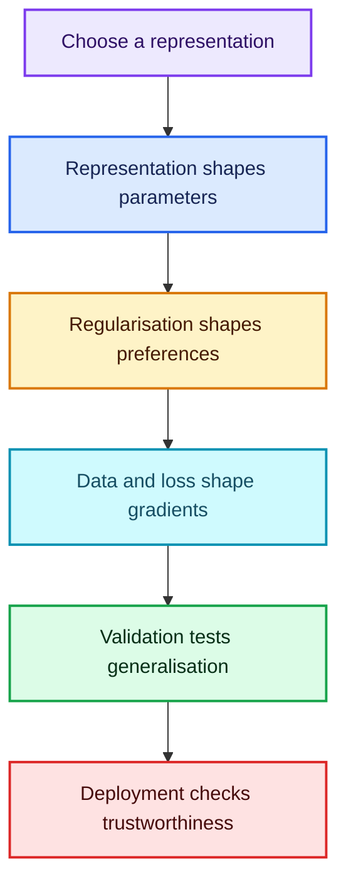

- NB-SVM uses class-count evidence to reshape a sparse linear model’s regularisation geometry.
- An embedding replaces a one-hot basis with a learned dense coordinate system.
- A tabular network combines those categorical coordinates with measured continuous quantities.
- Safe joins and time-aware validation ensure that the model learns from information it could actually possess.

The mathematics, code, and data pipeline are therefore not separate concerns. Together they determine what the model can learn, what it prefers to learn, and whether its apparent success will survive outside the notebook.
