# Practical Machine Learning — Lesson 12

## Time-series features, model choice, validation, and responsible machine learning

> Detailed study notes reconstructed from the YouTube transcript for **Machine Learning 1: Lesson 12**. Historical examples and APIs are preserved as teaching context; modern implementation guidance and careful qualifications are added where the field has changed.

**Original lesson:** [Machine Learning 1: Lesson 12](https://www.youtube.com/watch/5_xFdhfUnvQ)

---

## Learning objectives

By the end of these notes, you should be able to:

1. create leakage-safe “days since” and “days until” event features for grouped time series;
2. build lagged rolling-window features without accidentally using the target row or future rows;
3. preprocess categorical and continuous columns consistently across training, validation, and test data;
4. explain standardisation, log-target regression, chronological validation, and final retraining;
5. compare ordinal encoding, one-hot encoding, embeddings, tree models, and SGD-trained neural networks;
6. distinguish permutation importance, gradients, and partial dependence;
7. separate statistical significance from practical importance while quantifying uncertainty;
8. distinguish prediction from causal influence and business lift;
9. audit subgroup error rates and recognise feedback loops; and
10. design an ML product around human consequences, monitoring, recourse, and accountability.

## Contents

1. **Part I:** grouped event and rolling-window features
2. **Part II:** preprocessing, metrics, and time-aware validation
3. **Part III:** entity embeddings and tabular neural networks
4. **Part IV:** trees versus SGD and categorical representations
5. **Part V:** interpretation, effect size, and uncertainty
6. **Part VI:** objectives, feedback loops, bias, and fairness
7. **Part VII:** responsible-ML workflow and professional action
8. **Part VIII:** formula sheet, exercises, answers, and checklists

## Lesson map

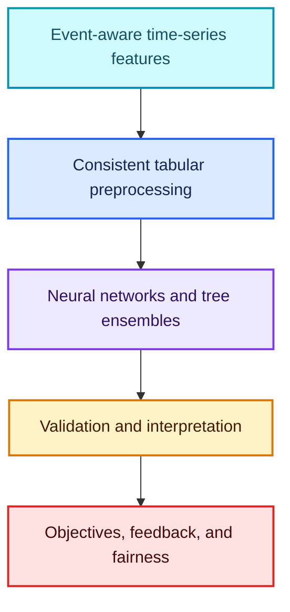

## What, why, how, and when—in one view

| Concept | What? | Why? | How? | When? |
|---|---|---|---|---|
| Event distance | time since/remaining until an event | behaviour often changes around events | grouped forward/backward event-date propagation | promotions, holidays, alarms, maintenance |
| Rolling feature | aggregation over a local history window | summarises recent level and volatility | group, shift, then roll | ordered observations with repeated entities |
| Standardisation | mean zero and unit variance transform | improves conditioning for gradient optimisation | fit $\mu,\sigma$ on training data | continuous inputs to many SGD/distance models |
| Embedding | learned vector for a category | permits rich category interactions efficiently | index a trainable matrix | repeated categorical fields in neural networks |
| Chronological validation | later block held out from earlier training | imitates forecasting deployment | split by time before fitting transforms | any evolving or temporal system |
| Fairness audit | compare outcomes and errors across groups | aggregate accuracy can hide concentrated harm | compute subgroup metrics with uncertainty | consequential predictions and decisions |
| Feedback-loop analysis | trace how model actions create new data | deployment can amplify its own assumptions | map prediction → action → observation → retraining | recommenders, policing, credit, hiring |

---

# Part I — Event-aware time-series features

## 1. Why events matter

A time series is often shaped by more than its recent numerical values. Promotions, public holidays, machine alarms, policy changes, product launches, and maintenance events can influence behaviour before, during, and after they occur.

For an observation at time $t$ and a sequence of event times $\mathcal E$:

$$
d_{\text{since}}(t)=t-\max\{e\in\mathcal E:e\le t\},
$$

$$
d_{\text{until}}(t)=\min\{e\in\mathcal E:e\ge t\}-t.
$$

- **What?** Two features measure distance from the nearest previous and next event.
- **Why?** Grocery demand may rise before a holiday, fall during it, and rebound afterwards.
- **How?** Sort inside each entity, propagate event dates, and subtract dates.
- **When?** Whenever an event schedule or event history is available at prediction time.


### The critical availability condition

“Days until next event” is safe only if the next event is known when the prediction is made. A published holiday or scheduled promotion may be known. The date of the next equipment failure, customer complaint, or emergency alarm is not.

> **Leakage test:** replace “event” with its real-world source and ask, “Could an operator have looked up this future date at the prediction timestamp?” If not, omit the future-distance feature.

## 2. Grouping prevents events from crossing entities

Suppose store 1 has a promotion on Monday and store 2 does not. Store 1’s promotion must not reset store 2’s event clock. All elapsed calculations must be grouped by the appropriate entity keys:

$$
d_{\text{since}}(i,t)
=t-\max\{e\in\mathcal E_i:e\le t\},
$$

where $i$ identifies the store, machine, customer, or other entity.

### A modern vectorised implementation

```python
import pandas as pd


def add_event_distances(
    frame,
    *,
    group_columns,
    date_column,
    event_column,
    future_event_is_known,
):
    """Add grouped days-since and optionally days-until event features."""

    # Work on a copy so the caller's original frame is not silently reordered.
    result = frame.copy()
    result[date_column] = pd.to_datetime(result[date_column], errors='raise')

    # Stable sorting is essential before forward/backward propagation.
    sort_columns = [*group_columns, date_column]
    result = result.sort_values(sort_columns, kind='stable').reset_index(drop=True)

    # Keep a date only on rows where the event is active.
    event_dates = result[date_column].where(result[event_column].astype(bool))

    # Build grouping arrays once; each entity gets its own event history.
    groupers = [result[column] for column in group_columns]

    # Forward-fill the most recently observed event date within each entity.
    previous_event = event_dates.groupby(groupers, sort=False).ffill()
    result[f'days_since_{event_column}'] = (
        result[date_column] - previous_event
    ).dt.days

    if future_event_is_known:
        # Backward-fill finds the next scheduled event within each entity.
        next_event = event_dates.groupby(groupers, sort=False).bfill()
        result[f'days_until_{event_column}'] = (
            next_event - result[date_column]
        ).dt.days

    return result


example = pd.DataFrame({
    'store_id': [1, 1, 1, 2, 2, 2],
    'date': pd.to_datetime([
        '2026-01-01', '2026-01-02', '2026-01-03',
        '2026-01-01', '2026-01-02', '2026-01-03',
    ]),
    'promotion': [0, 1, 0, 0, 0, 1],
})

features = add_event_distances(
    example,
    group_columns=['store_id'],
    date_column='date',
    event_column='promotion',
    # This is safe only when the promotion calendar was already published.
    future_event_is_known=True,
)
print(features)
```

The missing values before an entity’s first observed event are meaningful: there is no known previous event. Preserve this fact with missingness indicators and training-fitted imputation. Do not replace it with an extreme timestamp and assume a neural network will always “cut it off.” Extreme sentinels can distort scaling, interactions, and out-of-distribution behaviour.

## 3. `lambda`, `apply`, `zip`, and vectorisation

A lambda is an unnamed one-expression function:

```python
# Both functions implement the same transformation.
def square_named(value):
    return value**2


square_lambda = lambda value: value**2  # Useful for a short, local callback.

assert square_named(4) == square_lambda(4) == 16
```

`zip` walks through multiple iterables together:

```python
stores = [1, 1, 2]
events = [False, True, False]
dates = ['2026-01-01', '2026-01-02', '2026-01-01']

# zip yields aligned triples, not every possible combination.
for store_id, has_event, date in zip(stores, events, dates):
    print(store_id, has_event, date)
```

### Performance hierarchy

1. Prefer a built-in vectorised pandas/NumPy operation.
2. Prefer `groupby`, `shift`, `rolling`, joins, or cumulative operations.
3. If a loop is unavoidable, `itertuples()` or NumPy arrays usually have less overhead than `iterrows()`.
4. Use row-wise `DataFrame.apply(axis=1)` only when the logic genuinely resists a clearer vectorised expression.

“Vectorised” does not automatically mean “correct.” First establish the grouping, ordering, missingness, and availability semantics; then optimise.

### Fun fact

In current pandas, `Series.to_numpy()` expresses intent more clearly than the older `.values` pattern shown in many historical notebooks.

## 4. Rolling windows

For a series $x_t$, the trailing $w$-step mean is

$$
\operatorname{MA}_w(t)=\frac{1}{m_t}
\sum_{k=1}^{m_t}x_{t-k},
\qquad m_t=\min(w,t-1),
$$

where this forecasting version excludes the current row and all future rows.

Other useful rolling statistics include:

$$
\operatorname{sum}_w(t),\quad
\operatorname{std}_w(t),\quad
\min_w(t),\quad
\max_w(t),\quad
\operatorname{count}_w(t).
$$

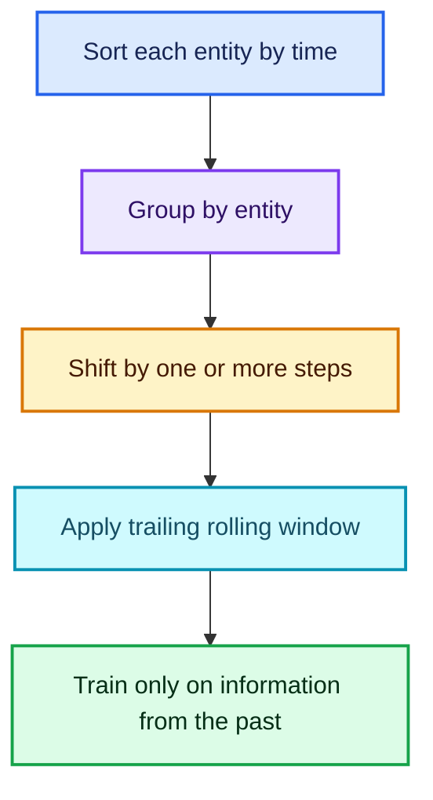

### Commented grouped rolling features

```python
import pandas as pd


def add_lagged_rolling_sales(frame):
    """Create past-only rolling features separately for every store."""

    result = frame.copy()
    result['date'] = pd.to_datetime(result['date'], errors='raise')
    result = result.sort_values(['store_id', 'date'], kind='stable')

    # transform returns a Series aligned with the original rows.
    # shift(1) is the crucial leakage barrier: today's sales are excluded.
    result['sales_mean_7'] = result.groupby('store_id')['sales'].transform(
        lambda values: values.shift(1).rolling(window=7, min_periods=1).mean()
    )

    # Recent volatility can contain signal beyond the recent average.
    result['sales_std_7'] = result.groupby('store_id')['sales'].transform(
        lambda values: values.shift(1).rolling(window=7, min_periods=2).std()
    )

    # A seven-step lag captures a weekly pattern in daily regular data.
    result['sales_lag_7'] = result.groupby('store_id')['sales'].shift(7)
    return result
```

### Observation windows versus clock-time windows

- `rolling(window=7)` means the previous seven **rows**.
- `rolling(window='7D')` means observations inside the previous seven **calendar days**, provided a datetime index or `on=` column is used.

They differ when timestamps are missing or irregular.

### Centred windows

A centred window includes values on both sides of $t$. It is appropriate for smoothing a completed historical chart, but usually leaks the future in a forecasting feature. The label placement option `center=True` does not grant permission to use future data.

## 5. A feature-availability matrix

Before computing any feature, write down when it becomes knowable.

| Feature | Known for tomorrow? | Safe forecasting use |
|---|---:|---|
| calendar day of week | yes | direct |
| published holiday date | yes | direct and days-until |
| scheduled promotion | usually, verify process | direct if schedule is frozen |
| tomorrow’s observed sales | no | never |
| seven-day mean through today | yes after today closes | lag appropriately for forecast time |
| next equipment failure date | no | cannot use |
| weather observation for next week | no | use forecast available today instead |

---

# Part II — Consistent preprocessing, metrics, and validation

## 6. Categorical versus continuous columns

### Continuous variable

A numerical distance is meaningful. Examples include temperature, price, physical distance, or elapsed time.

### Categorical variable

Values represent identities or levels, not magnitude. Examples include store ID, region, day of week, and promotion type.

An integer code such as `Saturday = 6` does not mean Saturday is twice Wednesday. It is an address into a category vocabulary.

| Question | Likely representation |
|---|---|
| Is numerical distance meaningful? | continuous |
| Should nearby values share behaviour? | continuous or ordered basis |
| Can every repeated level have an arbitrary effect? | categorical |
| Is the value a unique row identifier? | usually drop |
| Is the value a repeated entity identifier? | categorical may be useful |

## 7. Fit vocabularies on training data only

Training, validation, and test data must use the same mapping:

$$
\text{Saturday}\mapsto6
$$

everywhere. Refitting categories separately can silently map the same integer to different meanings.

```python
import pandas as pd


def fit_category_vocabulary(train_series):
    """Return an ordered list of categories observed in training data."""

    # Sorting makes the mapping deterministic across repeated runs.
    return sorted(train_series.dropna().astype(str).unique().tolist())


def encode_with_vocabulary(series, vocabulary):
    """Encode known categories from 1; reserve 0 for missing/unseen values."""

    # category -> positive integer ID; zero remains the unknown bucket.
    mapping = {category: index + 1 for index, category in enumerate(vocabulary)}
    encoded = series.astype('string').map(mapping).fillna(0).astype('int64')
    return encoded


train = pd.Series(['Mon', 'Sat', 'Tue', 'Mon'])
test = pd.Series(['Sat', 'Sun', None])

vocabulary = fit_category_vocabulary(train)
train_ids = encode_with_vocabulary(train, vocabulary)
test_ids = encode_with_vocabulary(test, vocabulary)

# 'Sun' and missing are both routed to the reserved unknown ID 0.
print(vocabulary, train_ids.tolist(), test_ids.tolist())
```

In mature systems, keep “missing” and “unseen” separate if they have different operational meanings.

## 8. Why standardisation helps SGD

For feature $j$, standardisation is

$$
z_{ij}=\frac{x_{ij}-\mu_j}{\sigma_j}.
$$

If one feature is around $10^{-3}$ and another around $10^6$, their gradient contributions can differ enormously. Standardisation often improves the conditioning of the optimisation problem, so one learning rate can make useful progress in many parameter directions.

```mermaid
%% Standardisation balances numerical scales; it does not change information by itself.
flowchart LR
    A["Raw continuous columns"] --> B["Fit μ and σ on training data"]
    B --> C["Transform train, validation, and test"]
    C --> D["Better-conditioned gradients"]
    D --> E["More stable SGD"]

    classDef raw fill:#fee2e2,stroke:#dc2626,color:#450a0a,stroke-width:2px
    classDef fit fill:#fef3c7,stroke:#d97706,color:#451a03,stroke-width:2px
    classDef transform fill:#dbeafe,stroke:#2563eb,color:#172554,stroke-width:2px
    classDef gradient fill:#cffafe,stroke:#0891b2,color:#164e63,stroke-width:2px
    classDef result fill:#dcfce7,stroke:#16a34a,color:#052e16,stroke-width:2px
    class A raw
    class B fit
    class C transform
    class D gradient
    class E result
```

```python
import numpy as np
from sklearn.preprocessing import StandardScaler

# Rows are observations; columns might be distance and temperature.
X_train = np.array([[100.0, 12.0], [500.0, 20.0], [900.0, 28.0]])
X_validation = np.array([[700.0, 24.0]])

# Fit statistics only on training rows.
scaler = StandardScaler().fit(X_train)

# Apply the unchanged transformation to every later partition.
X_train_scaled = scaler.transform(X_train)
X_validation_scaled = scaler.transform(X_validation)

print(X_train_scaled.mean(axis=0).round(10))
print(X_train_scaled.std(axis=0).round(10))
```

Tree splits are mostly insensitive to monotonic rescaling, so random forests usually do not require standardisation. Neural networks, linear models trained with SGD, k-nearest neighbours, and kernel methods often benefit.

## 9. Log targets, RMSLE, and RMSPE

For nonnegative targets, a common transform is

$$
z=\log(1+y).
$$

Train the model to predict $\hat z$, then invert with

$$
\hat y=\exp(\hat z)-1.
$$

### RMSLE

$$
\operatorname{RMSLE}
=\sqrt{\frac1n\sum_{i=1}^{n}
\left[\log(1+\hat y_i)-\log(1+y_i)\right]^2}.
$$

### RMSPE

$$
\operatorname{RMSPE}
=\sqrt{\frac1n\sum_{i=1}^{n}
\left(\frac{y_i-\hat y_i}{y_i}\right)^2}.
$$

The transcript’s intuition that “a difference of logs is a ratio” should be stated precisely:

$$
\log y-\log\hat y=\log\left(\frac{y}{\hat y}\right).
$$

Log error is **not exactly percentage error**. For a small relative error $\varepsilon$,

$$
\log(1+\varepsilon)\approx\varepsilon,
$$

so they are locally related. RMSLE also handles scale differently and `log1p` permits zero targets.

```python
import numpy as np


def rmsle(y_true, y_pred):
    """Root mean squared logarithmic error for nonnegative values."""

    # Clipping prevents invalid log1p values from negative model predictions.
    safe_pred = np.clip(np.asarray(y_pred, dtype=float), 0, None)
    safe_true = np.asarray(y_true, dtype=float)

    # RMSLE is undefined for true targets below zero.
    if np.any(safe_true < 0):
        raise ValueError('RMSLE requires nonnegative true targets')

    return np.sqrt(np.mean((np.log1p(safe_pred) - np.log1p(safe_true)) ** 2))


y_true = np.array([10.0, 100.0, 1000.0])
y_pred = np.array([12.0, 120.0, 1200.0])
print(rmsle(y_true, y_pred))
```

Use a log target when multiplicative error is meaningful and large values should not dominate solely because of their absolute scale. Do not use it mechanically when negative targets exist or absolute error is the real cost.

## 10. Chronological validation

For forecasting, validation should reproduce the direction of time:

$$
\underbrace{t_1,\ldots,t_k}_{\text{training}}
\quad\longrightarrow\quad
\underbrace{t_{k+1},\ldots,t_m}_{\text{validation}}.
$$

```mermaid
%% The held-out block follows training in time and precedes any untouched test period.
flowchart LR
    A["Older training period"] --> B["Recent validation period"]
    B --> C["Freeze choices"]
    C --> D["Optional train + validation retraining"]
    D --> E["Untouched future test/deployment"]

    classDef train fill:#dbeafe,stroke:#2563eb,color:#172554,stroke-width:2px
    classDef valid fill:#fef3c7,stroke:#d97706,color:#451a03,stroke-width:2px
    classDef freeze fill:#ede9fe,stroke:#7c3aed,color:#2e1065,stroke-width:2px
    classDef retrain fill:#cffafe,stroke:#0891b2,color:#164e63,stroke-width:2px
    classDef test fill:#dcfce7,stroke:#16a34a,color:#052e16,stroke-width:2px
    class A train
    class B valid
    class C freeze
    class D retrain
    class E test
```

### Why random splitting can mislead

- the model sees later seasonal patterns while training on “past” rows;
- the same entity appears on both sides with nearly adjacent observations;
- feature engineering may accidentally aggregate across the split;
- distribution shift between historical and future periods is hidden.

### Final retraining protocol

1. Use training/validation splits to select features, architecture, regularisation, epochs, and decision thresholds.
2. Freeze those choices.
3. Optionally retrain once on training plus validation data.
4. Evaluate once on an untouched test set or deploy.

A one-row fake validation set, as used to satisfy an old API in the lecture, is not an evaluation set. Modern code should separate fitting from evaluation explicitly.

## 11. Public leaderboards are not validation sets

A public leaderboard is another finite sample. Repeatedly choosing submissions based on it overfits that sample:

$$
\text{many adaptive submissions}
\quad\Rightarrow\quad
\text{selection bias on public score}.
$$

A robust local validation design should reflect the hidden test distribution. If leaderboard and validation rankings disagree, investigate split construction, distribution shift, leakage, and sampling—not merely which number is more flattering.

---

# Part III — Entity embeddings and tabular neural networks

## 12. Embedding geometry and parameter count

For a field with $K$ categories and embedding dimension $d$:

$$
E\in\mathbb R^{K\times d},
\qquad
\text{parameters}=Kd.
$$

Category $k$ retrieves row $E_{k,:}$. One field can use several latent dimensions, allowing the downstream network to model multiple kinds of similarity.

### Choosing $d$

The historical lesson used the rule

$$
d=\min\left(50,\left\lfloor\frac{K+1}{2}\right\rfloor\right).
$$

Treat this as a starting heuristic, not a law. The claim that natural-language embeddings “need 600 dimensions” reflects a particular era and set of experiments; current optimal dimensions depend on model family, pretraining objective, data size, tokenisation, compute budget, and task.

Practical selection:

1. start modestly;
2. track total parameters $Kd$ and examples per category;
3. compare smaller and larger dimensions on a frozen validation design;
4. regularise and use unknown/rare-category handling; and
5. stop increasing $d$ when validation benefit disappears.

## 13. Capacity and regularisation work together

The lecture contrasts reducing parameter count with using weight decay/dropout. A precise modern view is:

$$
\text{generalisation}
=f(\text{capacity},\text{data},\text{optimisation},
\text{regularisation},\text{augmentation},\text{early stopping}).
$$

More parameters are not automatically harmful, but neither are they free. Large embeddings for rare categories can memorise. Regularisation helps, while sensible capacity, pooling rare categories, hierarchical structure, and more data may also be necessary.

### Common regularisers

- L2/weight decay;
- dropout;
- early stopping;
- smaller embedding dimensions;
- rare-level grouping;
- noise/augmentation where semantically valid.

## 14. Mixed tabular network

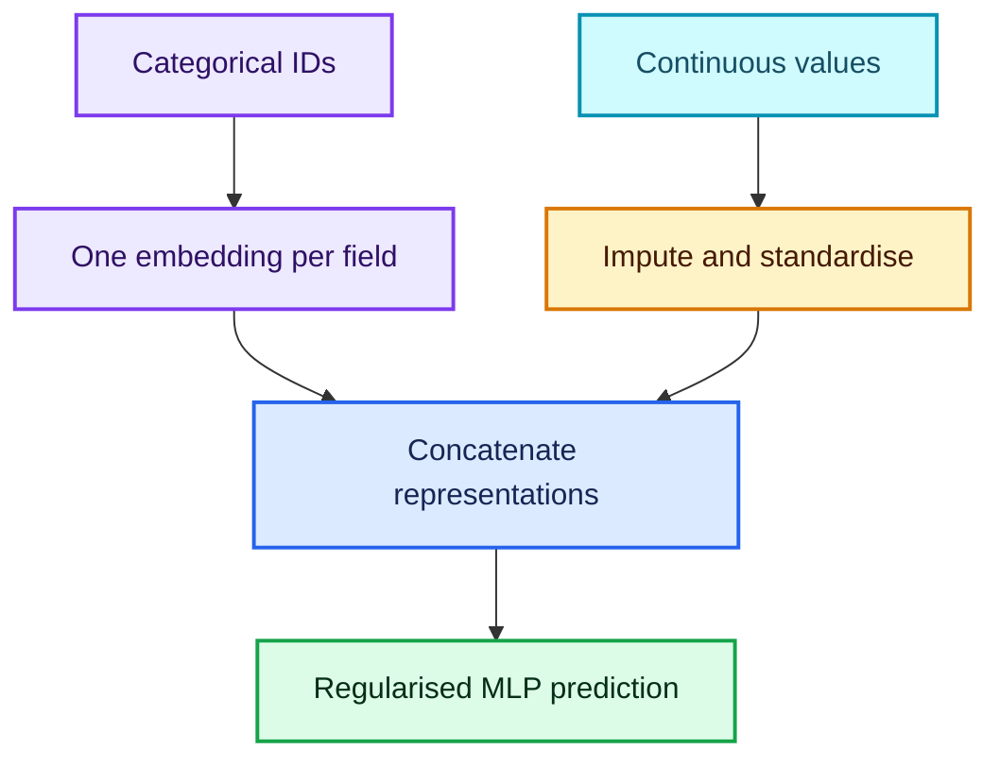

```python
import torch
from torch import nn


class TabularRegressor(nn.Module):
    """Regress from categorical embeddings plus scaled continuous features."""

    def __init__(self, cardinalities, dimensions, n_continuous):
        super().__init__()

        # Fail early if the field metadata is inconsistent.
        if len(cardinalities) != len(dimensions):
            raise ValueError('Each categorical field needs one embedding size')

        # Each categorical column gets an independent lookup table.
        self.embeddings = nn.ModuleList([
            nn.Embedding(cardinality, dimension, padding_idx=0)
            for cardinality, dimension in zip(cardinalities, dimensions)
        ])

        # Input width equals every embedding width plus continuous columns.
        input_width = sum(dimensions) + n_continuous
        self.network = nn.Sequential(
            nn.Linear(input_width, 128),
            nn.ReLU(),
            nn.Dropout(0.10),
            nn.Linear(128, 64),
            nn.ReLU(),
            nn.Linear(64, 1),
        )

    def forward(self, categorical, continuous):
        # categorical shape: [batch, number_of_categorical_fields].
        embedded = [
            table(categorical[:, field_index])
            for field_index, table in enumerate(self.embeddings)
        ]

        # continuous is assumed to be imputed/scaled using training statistics.
        combined = torch.cat([*embedded, continuous], dim=1)
        return self.network(combined).squeeze(1)


# Example fields: store ID, day of week, and promotion type.
model = TabularRegressor(
    cardinalities=[1201, 8, 5],  # Includes reserved unknown ID 0.
    dimensions=[32, 4, 3],
    n_continuous=6,
)
```

> **Historical API note.** The transcript’s `ColumnarModelData`, `proc_df`, and old fastai learner calls document an earlier library. The durable pattern is the fitted preprocessing contract, not those particular class names.

---

# Part IV — Trees, SGD, and categorical representations

## 15. Two broad training strategies

The course reviews two powerful families:

### Gradient-based function fitting

A linear or neural model has parameters $\theta$ and minimises a differentiable objective:

$$
\theta_{t+1}=\theta_t-\eta\nabla_\theta L(\theta_t).
$$

### Greedy tree building

A regression tree chooses a feature and threshold that reduce node impurity. For squared error, a candidate split $s$ can be scored by

$$
I(s)=
\sum_{i\in L_s}(y_i-\bar y_{L_s})^2
+\sum_{i\in R_s}(y_i-\bar y_{R_s})^2.
$$

The best split has the smallest $I(s)$ among candidates.

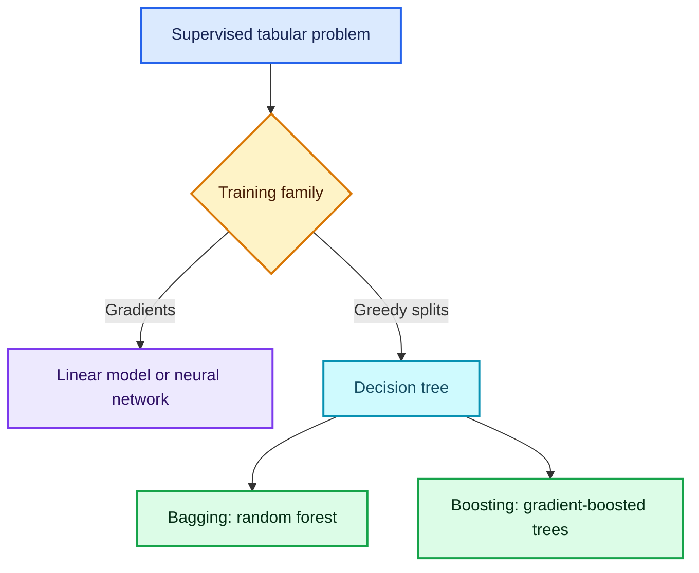

| Property | Neural/linear SGD model | Tree ensemble |
|---|---|---|
| Scaling continuous inputs | usually important | usually unnecessary |
| Category handling | one-hot, embeddings, specialised layers | ordinal, one-hot, or native categorical method |
| Smooth extrapolation | architecture-dependent | generally weak outside training range |
| Interactions | learned through layers | naturally created by split paths |
| Missing values | explicit strategy/layer | some implementations handle natively |
| Interpretation | gradients, permutation, PDP/ICE, attribution | permutation, PDP/ICE, path methods, SHAP variants |

## 16. Ordinal codes, one-hot vectors, and embeddings

Suppose four cities are assigned IDs:

$$
\text{Mumbai}=0,\quad
\text{New York}=1,\quad
\text{San Francisco}=2,\quad
\text{Sydney}=3.
$$

### Raw ordinal code

A linear model sees a single numerical slope:

$$
\hat y=b+w\,\text{city\_id},
$$

which imposes an artificial ordering and equal spacing.

### One-hot encoding

For city $k$, use basis vector $e_k$. A linear layer gives

$$
e_k^\top w=w_k,
$$

so every city receives its own coefficient.

### Embedding

With $E\in\mathbb R^{K\times d}$,

$$
e_k^\top E=E_{k,:}.
$$

This is the same row lookup, now returning $d$ learned features rather than one coefficient.

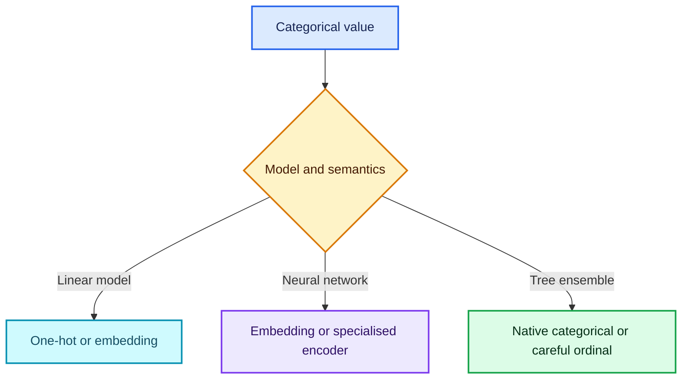

### A modern qualification about trees

An arbitrary ordinal code can work with a deep ensemble because repeated thresholds isolate ranges, but it may require many splits and makes the invented order influential. Modern tree libraries may support native categorical splits; one-hot, target encoding, ordered target statistics, and native handling should be compared without leakage.

## 17. High-cardinality one-hot features in trees

One-hot encoding $K$ levels creates $K$ sparse indicator columns. For trees this can:

- fragment split search across many rare indicators;
- increase memory and training time;
- make individual level importances noisy; and
- obscure useful groupings of levels.

It is not true that one-hot always makes a random forest “very bad.” The outcome depends on sample size, level frequencies, ensemble settings, and signal. For high cardinality, compare ordinal/native categorical approaches and use leakage-safe encoders.

## 18. Exact collinearity and optimisation

If all $K$ one-hot columns and an intercept are included, then

$$
1=x_{i1}+x_{i2}+\cdots+x_{iK},
$$

so the design matrix is rank deficient. Ordinary least-squares coefficients are not uniquely identifiable even though predictions may be.

SGD does not make non-identifiability disappear. It can still find a predictive solution, but flat directions can affect conditioning, convergence, reproducibility, and coefficient interpretation.

Adding L2 regularisation,

$$
J(w)=\|y-Xw\|_2^2+\lambda\|w\|_2^2,
$$

with $\lambda>0$ selects a unique minimum in the usual ridge setting and improves conditioning. Another solution is to drop one reference category when interpretable coefficients are required.

### Fun fact

Two models can make identical predictions while assigning very different coefficients to redundant one-hot columns. Prediction equivalence does not imply parameter identifiability.

---

# Part V — Interpretation, practical importance, and uncertainty

## 19. Permutation importance is model reliance

For fitted model $f$, validation metric $M$, and feature $j$:

$$
I_j=M(f,X_{\text{permuted }j},y)-M(f,X,y)
$$

for a loss metric where larger is worse.

- **What?** Shuffle one column and measure performance degradation.
- **Why?** Breaking a useful feature’s relationship with the target should hurt the model.
- **When?** On held-out data after verifying the model has useful predictive performance.
- **Caution:** correlated features can substitute for one another, making each appear less important.

## 20. Permutation, gradients, and partial dependence are different

| Method | Question answered | Scope | Main caution |
|---|---|---|---|
| Permutation importance | How much does the fitted model rely on this column under this perturbation? | global | correlation and unrealistic permutations |
| Input gradient $\partial f/\partial x_j$ | How sensitive is this prediction to a tiny local change? | local | scale, saturation, discontinuities, non-causality |
| PDP | What is average prediction if a feature is forced to a grid value? | global average | may construct impossible combinations |
| ICE | How does each row’s prediction change across that grid? | per row | same dependence/causal cautions |

The transcript suggests permutation is another way to measure a derivative. Both concern sensitivity, but they are not mathematically identical. Permutation is a finite, distribution-altering intervention; a gradient is an infinitesimal local derivative.

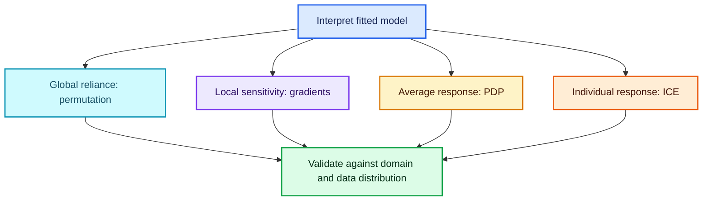

### Commented model-agnostic example

```python
import numpy as np
import pandas as pd
from sklearn.ensemble import RandomForestRegressor
from sklearn.inspection import permutation_importance

# Build deterministic synthetic data with one strong and one noise feature.
rng = np.random.default_rng(42)
n_rows = 500
X = pd.DataFrame({
    'signal': rng.normal(size=n_rows),
    'noise': rng.normal(size=n_rows),
})
y = 4 * X['signal'] + rng.normal(scale=0.3, size=n_rows)

# Use the first block for fitting and the later block for inspection.
X_train, X_valid = X.iloc[:400], X.iloc[400:]
y_train, y_valid = y.iloc[:400], y.iloc[400:]

model = RandomForestRegressor(n_estimators=100, random_state=0)
model.fit(X_train, y_train)

# Repeated shuffles expose Monte Carlo variation in the importance estimate.
result = permutation_importance(
    model,
    X_valid,
    y_valid,
    scoring='neg_root_mean_squared_error',
    n_repeats=10,
    random_state=0,
)

importance = pd.Series(result.importances_mean, index=X.columns)
print(importance.sort_values(ascending=False))
```

## 21. Statistical significance versus practical importance

A small $p$-value asks whether an observed pattern would be unusual under a specified null model and assumptions. It does not tell you whether the effect is large, useful, fair, causal, or worth acting on.

Report at least:

- effect size in domain units;
- uncertainty interval;
- validation or experimental design;
- sample size and assumptions; and
- operational consequence.

Large datasets can make tiny effects statistically detectable. Small or rare-disease datasets make uncertainty especially important. The right response is not to ignore significance; it is to combine uncertainty with practical meaning.

## 22. Bootstrap uncertainty

For independent observations $D=\{z_1,\ldots,z_n\}$:

1. draw $n$ observations with replacement;
2. recompute the statistic or refit the model;
3. repeat $B$ times; and
4. use the empirical distribution for uncertainty summaries.

```python
import numpy as np


def bootstrap_mean_interval(values, n_bootstrap=2000, confidence=0.95, seed=0):
    """Percentile bootstrap interval for an IID sample mean."""

    values = np.asarray(values, dtype=float)
    rng = np.random.default_rng(seed)

    # Each row is one with-replacement bootstrap resample.
    indices = rng.integers(0, len(values), size=(n_bootstrap, len(values)))
    bootstrap_means = values[indices].mean(axis=1)

    # Keep equal tail probability outside the requested interval.
    tail = (1 - confidence) / 2
    lower, upper = np.quantile(bootstrap_means, [tail, 1 - tail])
    return float(lower), float(upper)


observed_lifts = np.array([1.2, 0.7, 1.0, 1.4, 0.9, 1.1, 0.6, 1.3])
print(bootstrap_mean_interval(observed_lifts))
```

> **Important qualification.** Naive row bootstrap assumes an appropriate form of independence. Time series, clusters, repeated users, spatial data, and complex sampling require block, cluster, hierarchical, or otherwise design-aware resampling. Bootstrapping does not automatically make every confidence interval valid.

The lecture mentions the **Bag of Little Bootstraps**, a scalable method combining subsampling and bootstrap-style weighting for large datasets.

---

# Part VI — Objectives, feedback loops, bias, and fairness

## 23. Prediction is not the same as useful intervention

A recommender that predicts what a customer already plans to buy can have excellent accuracy and zero incremental value.

Let $Y(1)$ be the outcome if an action is taken and $Y(0)$ if it is not. Individual treatment effect is

$$
\tau(x)=\mathbb E[Y(1)-Y(0)\mid X=x].
$$

A predictive model estimates something like $P(Y=1\mid X=x)$. An uplift/causal model asks whether the action **changes** $Y$.

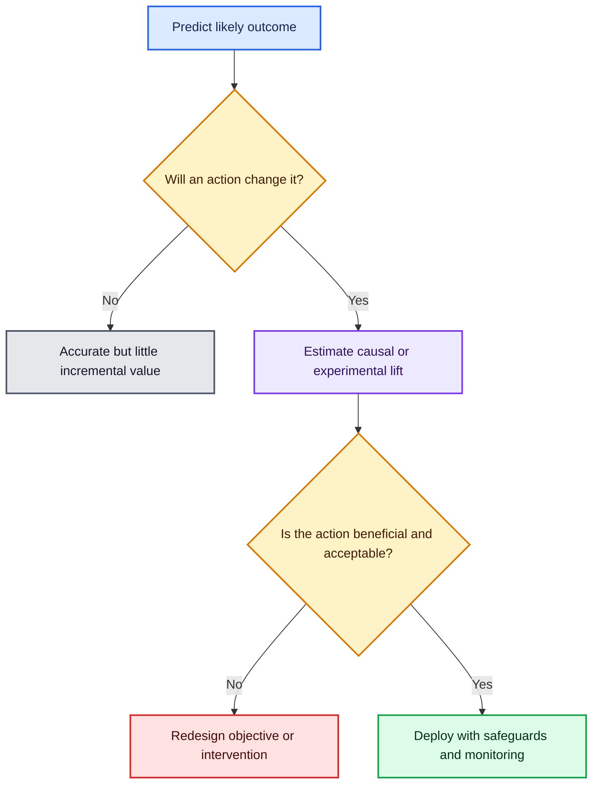

### When to use experiments

Randomised controlled experiments, where ethical and feasible, estimate incremental effects more directly than observational predictive accuracy. Quasi-experimental and causal-inference methods require stronger assumptions that must be stated and stress-tested.

## 24. Metrics are proxy objectives

An organisation rarely optimises its true mission directly. It chooses a measurable proxy:

$$
\text{mission}
\rightarrow\text{business objective}
\rightarrow\text{metric}
\rightarrow\text{model loss}.
$$

Every arrow can introduce misalignment.

Examples:

- engagement is not wellbeing;
- arrests are not crime incidence;
- historical hiring decisions are not employee potential;
- repayment is not necessarily fair access to credit;
- click probability is not incremental value;
- aggregate accuracy is not equitable service quality.

Goodhart’s-law intuition: once a proxy becomes a target, people and systems adapt to it, weakening its relationship with the underlying goal.

## 25. The feedback-loop mechanism

Let $D_t$ be data at time $t$, $M_t$ a model, $A_t$ its influenced action, and $D_{t+1}$ newly observed data:

$$
M_t=\operatorname{Train}(D_t),
\quad
A_t=\pi(M_t),
\quad
D_{t+1}\sim P(\cdot\mid A_t).
$$

The action changes what is observed. Retraining then treats that selective observation as if it were neutral evidence.

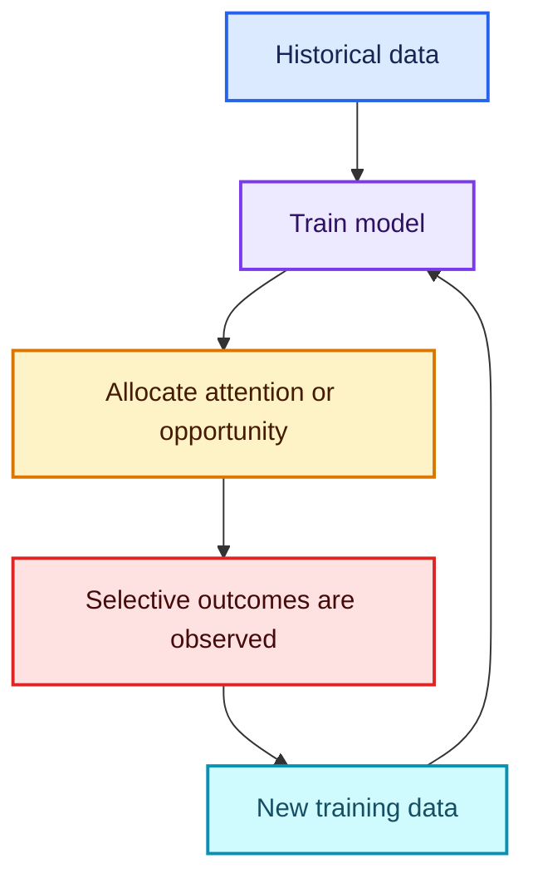

The predictive-policing paper discussed in the lecture formalises how directing officers toward one area increases discovered incidents there, which can send still more officers there even without a corresponding difference in underlying incident rates.

### Mitigation ideas

- distinguish **reported** outcomes from **discovered after model action** outcomes;
- record exposure: who had an opportunity to generate a label;
- reserve random exploration where safe and lawful;
- evaluate counterfactual or causal effects;
- monitor distribution and subgroup changes over time;
- use constraints and human review; and
- stop/revert when leading harm indicators cross limits.

## 26. Sources of bias

“Biased model” can describe several different mechanisms.

| Source | Example | Diagnostic question |
|---|---|---|
| Historical bias | past decisions reflect unequal institutions | Would reproducing history reproduce injustice? |
| Representation bias | some groups are under-sampled | Who is absent or rare? |
| Measurement bias | label/proxy quality differs by group | Does the same measurement mean the same thing? |
| Aggregation bias | one model hides group-specific relationships | Is a shared mapping appropriate? |
| Evaluation bias | benchmark does not match users | Who is missing from the test set? |
| Deployment bias | system is used outside intended context | How will people actually act on the score? |
| Feedback bias | model decisions alter later data | Which labels exist only because of earlier decisions? |

## 27. Historical cases in the lecture

These are presented as case studies from the lecture’s 2017 context. The durable lesson is the mechanism, not an assumption that every detail remains unchanged.

| Case | Mechanism to study | Engineering lesson |
|---|---|---|
| automotive emissions software | harmful requirements encoded as technical logic | “I followed orders” does not remove professional responsibility |
| social-feed engagement | proxy optimisation and amplification | evaluate downstream behaviour, not only clicks |
| discriminatory advertising | automated segmentation interacting with protected traits | test delivery and outcomes, not merely targeting inputs |
| image classification failures | representation gaps and unequal errors | curate representative data and audit subgroups before launch |
| stereotyped word embeddings | cultural patterns encoded in representation geometry | measure application harms; debiasing a vector alone may be insufficient |
| predictive policing | selective observation and runaway feedback | separate discovered from underlying incidence |
| recidivism scoring | unequal error rates and contested fairness definitions | publish group metrics, uncertainty, use limits, and recourse |

The lecture contains disturbing descriptions and forceful claims. Treat them as prompts for source-based investigation. For consequential systems, trace every factual claim to primary documents, affected communities, independent audits, and current law/policy.

## 28. Subgroup classification metrics

For protected or operational group $A=a$:

### Selection rate

$$
\operatorname{SR}_a=P(\hat Y=1\mid A=a).
$$

### True-positive rate (recall)

$$
\operatorname{TPR}_a
=P(\hat Y=1\mid Y=1,A=a)
=\frac{TP_a}{TP_a+FN_a}.
$$

### False-positive rate

$$
\operatorname{FPR}_a
=P(\hat Y=1\mid Y=0,A=a)
=\frac{FP_a}{FP_a+TN_a}.
$$

### Positive predictive value (precision)

$$
\operatorname{PPV}_a
=P(Y=1\mid\hat Y=1,A=a)
=\frac{TP_a}{TP_a+FP_a}.
$$

### Calibration

A score $S$ is calibrated within groups when, approximately,

$$
P(Y=1\mid S=s,A=a)=s.
$$

No single metric defines fairness. Legal, ethical, causal, procedural, and domain contexts determine which harms and constraints matter. Some desirable criteria cannot all be satisfied simultaneously when base rates differ and predictions are imperfect.

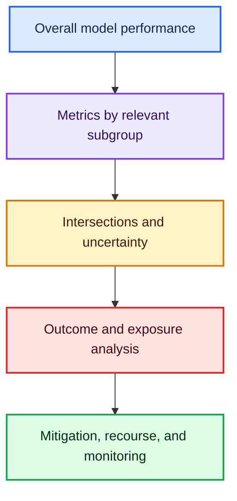

## 29. A commented subgroup audit

```python
import numpy as np
import pandas as pd


def safe_divide(numerator, denominator):
    """Return NaN when a subgroup metric has no valid denominator."""

    return numerator / denominator if denominator else np.nan


def binary_metrics_by_group(y_true, y_pred, group):
    """Compute confusion-matrix rates for every observed group."""

    audit = pd.DataFrame({
        'y_true': np.asarray(y_true, dtype=int),
        'y_pred': np.asarray(y_pred, dtype=int),
        'group': np.asarray(group),
    })

    rows = []
    for group_name, subset in audit.groupby('group', dropna=False):
        # Count each cell of the binary confusion matrix.
        tp = int(((subset.y_true == 1) & (subset.y_pred == 1)).sum())
        fp = int(((subset.y_true == 0) & (subset.y_pred == 1)).sum())
        tn = int(((subset.y_true == 0) & (subset.y_pred == 0)).sum())
        fn = int(((subset.y_true == 1) & (subset.y_pred == 0)).sum())

        rows.append({
            'group': group_name,
            'n': len(subset),
            'selection_rate': (subset.y_pred == 1).mean(),
            'accuracy': (subset.y_true == subset.y_pred).mean(),
            'true_positive_rate': safe_divide(tp, tp + fn),
            'false_positive_rate': safe_divide(fp, fp + tn),
            'precision': safe_divide(tp, tp + fp),
            'tp': tp,
            'fp': fp,
            'tn': tn,
            'fn': fn,
        })

    # Counts remain visible so tiny, unstable subgroups are not overlooked.
    return pd.DataFrame(rows).set_index('group')


y_true = [1, 1, 0, 0, 1, 0, 1, 0]
y_pred = [1, 0, 1, 0, 1, 0, 0, 0]
groups = ['A', 'A', 'A', 'A', 'B', 'B', 'B', 'B']

print(binary_metrics_by_group(y_true, y_pred, groups))
```

### Audit cautions

- include confidence intervals or resampling uncertainty;
- inspect intersections, not only one attribute at a time;
- ensure group labels are lawful and responsibly governed;
- investigate label validity and exposure differences;
- compare thresholds and calibration where scores drive decisions;
- measure real outcomes after deployment; and
- avoid treating metric parity as proof that the entire system is fair.

## 30. Human oversight must be actionable

“A human is in the loop” provides little protection if the human:

- lacks time or information to disagree;
- is punished for overriding;
- treats the model as authoritative;
- cannot see uncertainty or limitations;
- has no alternative process; or
- cannot correct the record.

Effective oversight includes authority, training, understandable evidence, logged overrides, escalation, independent review, and meaningful appeal/recourse for affected people.

---

# Part VII — A responsible-ML workflow

## 31. Responsibility starts before modelling

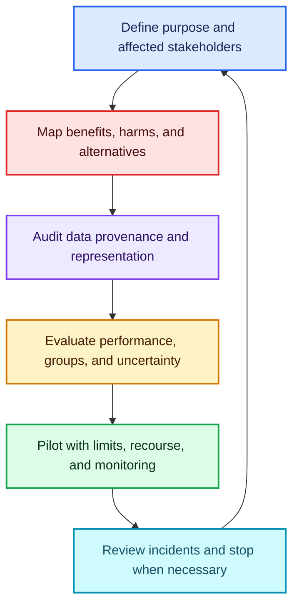

## 32. Questions to ask before launch

### Purpose and alternatives

- What decision will the model influence?
- Is prediction actually needed?
- Would a simple rule be safer, equally useful, or easier to contest?
- Is the intended objective a proxy for something else?

### Stakeholders and harm

- Who benefits, who bears errors, and who has no choice?
- What are the consequences of false positives and false negatives?
- Can harm accumulate through repeated decisions?
- Could the system be repurposed for surveillance, exclusion, or manipulation?

### Data

- How were examples, labels, and group attributes produced?
- Which populations or environments are missing?
- Does deployment change future labels?
- Are sensitive proxies present even if protected fields were removed?

### Evaluation

- Does validation simulate time, geography, institutions, and user behaviour?
- Are metrics reported by relevant and intersectional groups?
- Are intervals wide because a group is small?
- Have red teams tested misuse and distribution shift?

### Operations

- Who can stop deployment?
- What is logged and independently audited?
- How can a person appeal, correct data, or obtain an explanation?
- What happens after a harmful incident?

## 33. A pre-mortem for an uncomfortable meeting

The lecture’s professional point is practical: decide how you will respond **before** pressure arrives.

1. Name the concern in concrete outcome language.
2. Ask what evidence supports the claimed benefit.
3. Request subgroup/error/availability analysis.
4. Propose a safer alternative, limited pilot, or kill criterion.
5. Document decisions and unresolved risks through appropriate channels.
6. Consult domain, legal, safety, ethics, security, and affected-community expertise.
7. Use formal escalation or whistleblowing routes where appropriate.
8. Protect yourself and others; employment and legal contexts differ, so obtain qualified advice.

Professional responsibility is not solitary heroism. Build processes that make dissent, documentation, audit, and stopping normal organisational capabilities.

## 34. Diverse teams are necessary, not sufficient

Broader lived experience and disciplines can reveal assumptions a homogeneous team misses. Include domain experts, social scientists, legal/safety specialists, operators, accessibility experts, and people affected by the system.

But representation alone does not guarantee power. Participants need authority, compensation, information, time, and protection from retaliation. Combine inclusive teams with technical audits, governance, documentation, and accountable leadership.

## 35. Current risk-management framing

The NIST AI Risk Management Framework organises voluntary risk work around four functions:

- **Govern:** establish policies, roles, culture, and accountability;
- **Map:** understand context, impacts, stakeholders, and risks;
- **Measure:** analyse, test, and track trustworthy characteristics;
- **Manage:** prioritise, respond to, and monitor risks.

This complements the lecture’s central message: model quality is not only predictive accuracy. It includes validity, reliability, safety, security, transparency, privacy, fairness, and accountability across the lifecycle.

---

# Part VIII — Formula sheet, exercises, and checklists

## 36. Formula sheet

### Event distances

$$
d_{\text{since}}(i,t)=t-\max\{e\in\mathcal E_i:e\le t\},
$$

$$
d_{\text{until}}(i,t)=\min\{e\in\mathcal E_i:e\ge t\}-t.
$$

### Standardisation

$$
z_{ij}=\frac{x_{ij}-\mu_j}{\sigma_j}.
$$

### RMSLE

$$
\operatorname{RMSLE}
=\sqrt{\frac1n\sum_i[\log(1+\hat y_i)-\log(1+y_i)]^2}.
$$

### RMSPE

$$
\operatorname{RMSPE}
=\sqrt{\frac1n\sum_i\left(\frac{y_i-\hat y_i}{y_i}\right)^2}.
$$

### Embedding parameter count

$$
E\in\mathbb R^{K\times d},\qquad \#\text{parameters}=Kd.
$$

### SGD update

$$
\theta_{t+1}=\theta_t-\eta\nabla_\theta L(\theta_t).
$$

### Ridge objective

$$
J(w)=\|y-Xw\|_2^2+\lambda\|w\|_2^2.
$$

### Conditional treatment effect

$$
\tau(x)=\mathbb E[Y(1)-Y(0)\mid X=x].
$$

### Group rates

$$
\operatorname{TPR}_a=\frac{TP_a}{TP_a+FN_a},
\qquad
\operatorname{FPR}_a=\frac{FP_a}{FP_a+TN_a}.
$$

## 37. Claims from the transcript—refined

| Lecture intuition | More precise interpretation |
|---|---|
| Row-wise `apply` is slow. | Often true; prefer vectorised/grouped operations, but correctness and clarity come first. |
| Extreme missing-event dates are fine because ReLU can cut them off. | They may work accidentally; explicit missingness and fitted imputation are safer. |
| A centred rolling average can describe each point. | Fine for retrospective smoothing; predictive features must exclude unavailable future values. |
| Log differences are ratios. | A difference of logs is the **log of a ratio**; RMSLE and RMSPE are related locally, not identical. |
| Time problems need recent validation. | Usually; reproduce the true forecast horizon, update cadence, entities, and information availability. |
| Use 600 dimensions for language. | Historical empirical observation, not a universal modern rule. |
| Control complexity with regularisation rather than fewer parameters. | Both capacity and regularisation matter, along with data, optimisation, and deployment distribution. |
| Ordinal categories are fine for trees. | Often workable, but arbitrary order may be inefficient; native categorical methods can be better. |
| SGD removes the collinearity problem. | It may optimise despite rank deficiency, but non-identifiability and conditioning remain. |
| Permutation importance is like a derivative. | Both measure sensitivity; permutation and local gradients answer different questions. |
| Statistical significance does not matter with big data. | Tiny effects can be significant; report effect size, uncertainty, assumptions, and practical consequence. |
| Bootstrapping gives confidence intervals for any model. | Powerful but only valid with an appropriate resampling design and regularity conditions. |
| Better prediction improves the product. | Only if the prediction changes decisions in a beneficial, causal, and acceptable way. |
| Removing a protected field removes bias. | Proxies, historical labels, measurement, deployment, and feedback can preserve disparities. |
| A human in the loop makes deployment safe. | Only if that human has authority, information, time, alternatives, and accountability. |

## 38. Practice questions

1. Why must event-distance features be grouped by entity?
2. When is “days until next event” leakage?
3. Why is an unknown previous event better represented as missing than as “minus one billion days”?
4. What does `zip(a, b, c)` yield?
5. Why should `shift(1)` usually precede a rolling target aggregation?
6. What is the difference between `rolling(7)` and `rolling('7D')`?
7. Why can a centred window be invalid for forecasting?
8. Why must category mappings be fitted once on training data?
9. What should happen to an unseen category at inference?
10. Explain how standardisation changes gradient conditioning.
11. Why do most tree ensembles not need feature scaling?
12. Prove that a difference of logs is the log of a ratio.
13. Why are RMSLE and RMSPE not identical?
14. Design a validation set for forecasting the next four weeks.
15. When may validation data be folded into final training?
16. Why can repeated leaderboard submissions overfit?
17. Calculate embedding parameters for $K=1{,}000$ and $d=32$.
18. Why is the lecture’s embedding-size rule only a starting point?
19. Why does raw ordinal encoding impose a problematic assumption in a linear model?
20. What is the one-hot/embedding lookup identity?
21. Does SGD make exact collinearity disappear? Explain.
22. How does L2 regularisation change a rank-deficient least-squares problem?
23. Contrast permutation importance with an input gradient.
24. Why can correlated features have deceptively low permutation importance?
25. What extra caution is required when bootstrapping time-series observations?
26. Give an example of an accurate prediction with no incremental business value.
27. What is the difference between $P(Y=1\mid X)$ and $\tau(x)$?
28. Write the model-action-observation feedback cycle.
29. Why are arrests an imperfect proxy for underlying crime?
30. Define TPR and FPR for one subgroup.
31. Why can aggregate accuracy conceal harm?
32. Why is metric parity not sufficient proof of fairness?
33. What makes human oversight meaningful?
34. Name four stages of the NIST AI RMF.
35. What should you prepare before entering a high-pressure ethical discussion?

## 39. Short answers

1. Otherwise one entity’s event resets another entity’s clock.
2. When the next occurrence was not knowable at the prediction timestamp.
3. Missingness states uncertainty honestly; extreme sentinels distort scale and learned interactions.
4. Aligned tuples `(a[i], b[i], c[i])`, stopping at the shortest iterable.
5. To exclude the current target row from its own feature.
6. Seven observations versus a seven-calendar-day interval.
7. It includes later observations that deployment would not know.
8. Separate fitting may assign the same integer to different meanings and leak test information.
9. Route it to a reserved unknown ID or a documented rare/unknown strategy.
10. It puts continuous columns on comparable numerical scales, reducing extreme curvature/gradient imbalance.
11. Threshold ordering is unchanged by most monotonic rescalings.
12. $\log a-\log b=\log(a/b)$.
13. RMSLE squares log-ratio-like errors, whereas RMSPE squares direct relative errors and has division-by-zero issues.
14. Train on earlier dates and hold out the final contiguous four-week block, reproducing forecast availability.
15. After all choices are frozen and an untouched final evaluation/deployment target remains.
16. Submission choices adapt to public-sample noise.
17. $1{,}000\times32=32{,}000$ weights.
18. Useful dimension depends on task, data, cardinality, repetition, regularisation, and model family.
19. It assumes a single linear order and equal numerical spacing between arbitrary levels.
20. $e_k^\top E=E_{k,:}$.
21. No; optimisation may proceed, but parameters remain non-identifiable and flat directions can remain.
22. It penalises large norms and, in the usual ridge setting, selects a unique, better-conditioned solution.
23. Permutation is a finite global perturbation; a gradient is infinitesimal local sensitivity.
24. The model may use a correlated substitute when one feature is shuffled.
25. Use block/design-aware resampling rather than treating rows as IID.
26. Recommending a product the customer was already certain to buy.
27. The first predicts outcome level; the second estimates change caused by an action.
28. Data → model → action → selectively observed outcomes → new data.
29. Arrests depend on patrol allocation, enforcement, reporting, and institutional practices.
30. $TPR=TP/(TP+FN)$ and $FPR=FP/(FP+TN)$ within that group.
31. Errors can be concentrated in a smaller group while the majority dominates the average.
32. Labels, access, procedures, causal effects, deployment, and recourse can still be unjust.
33. Authority, time, understandable evidence, alternatives, logged overrides, and escalation/appeal.
34. Govern, Map, Measure, Manage.
35. Concrete harms, evidence requests, safer alternatives, escalation routes, documentation, and personal support/advice.

## 40. Time-series implementation checklist

- [ ] Define the prediction timestamp and horizon.
- [ ] Sort by entity and time before lags, cumulative features, or rolling windows.
- [ ] Shift target-derived features so the current/future target is excluded.
- [ ] Verify every next-event date was knowable.
- [ ] Distinguish row-count windows from clock-time windows.
- [ ] Preserve missingness rather than using extreme arbitrary dates.
- [ ] Fit category vocabularies, imputers, and scalers on training data only.
- [ ] Reserve unknown category IDs.
- [ ] Use chronological validation that matches deployment.
- [ ] Keep an untouched final test or real prospective evaluation.

## 41. Model-selection checklist

- [ ] Establish simple seasonal/naive and tree baselines.
- [ ] Compare category representations appropriate to each model.
- [ ] Track embedding parameter counts and rare-category support.
- [ ] Tune capacity and regularisation together.
- [ ] Compare validation metrics in business-relevant units.
- [ ] Inspect residuals over time, entities, and important subgroups.
- [ ] Treat leaderboards as external diagnostics, not training objectives.
- [ ] Freeze choices before final retraining.

## 42. Responsible-ML checklist

- [ ] State the decision, intervention, and affected stakeholders.
- [ ] Distinguish prediction accuracy from causal lift and social value.
- [ ] Map incentives and proxy objectives.
- [ ] Document data provenance, label construction, and missing groups.
- [ ] Test overall, subgroup, intersectional, and uncertainty metrics.
- [ ] Analyse selective labels and feedback loops.
- [ ] Compare a simple, interpretable rule and the option not to automate.
- [ ] Give reviewers real authority and affected people meaningful recourse.
- [ ] Define monitoring, incident response, rollback, and stop criteria.
- [ ] Revisit the risk analysis when data, users, policy, or context changes.

---

# Resources and further reading

## Original resource preserved

- [Machine Learning 1: Lesson 12 — YouTube](https://www.youtube.com/watch/5_xFdhfUnvQ)

## Time series and model inspection

- [pandas rolling-window API](https://pandas.pydata.org/docs/reference/api/pandas.DataFrame.rolling.html)
- [pandas grouped rolling windows](https://pandas.pydata.org/docs/reference/api/pandas.core.groupby.SeriesGroupBy.rolling.html)
- [scikit-learn `StandardScaler`](https://scikit-learn.org/stable/modules/generated/sklearn.preprocessing.StandardScaler.html)
- [scikit-learn permutation importance](https://scikit-learn.org/stable/modules/permutation_importance.html)
- [scikit-learn partial dependence and ICE](https://scikit-learn.org/stable/modules/partial_dependence.html)
- Ariel Kleiner et al., [A Scalable Bootstrap for Massive Data](https://arxiv.org/abs/1112.5016) — Bag of Little Bootstraps.

## Feedback, bias, fairness, and risk

- Danielle Ensign et al., [Runaway Feedback Loops in Predictive Policing](https://proceedings.mlr.press/v81/ensign18a.html).
- Tolga Bolukbasi et al., [Man is to Computer Programmer as Woman is to Homemaker? Debiasing Word Embeddings](https://papers.nips.cc/paper/6228-man-is-to-computer-programmer-as-woman-is-to-homemaker-debiasing-word-embeddings).
- [Fairlearn: common fairness metrics](https://fairlearn.org/main/user_guide/assessment/common_fairness_metrics.html)
- [Fairlearn `MetricFrame`](https://fairlearn.org/main/api_reference/generated/fairlearn.metrics.MetricFrame.html)
- [NIST AI Risk Management Framework](https://www.nist.gov/itl/ai-risk-management-framework)
- [UN Independent International Fact-Finding Mission on Myanmar](https://www.ohchr.org/en/hr-bodies/hrc/myanmar-ffm/index)
- Cathy O’Neil, [Weapons of Math Destruction](https://www.penguinrandomhouse.com/books/241363/weapons-of-math-destruction-by-cathy-oneil/) — the book recommended near the end of the transcript.

> Historical cases should be read with primary documents, affected-community accounts, and current evidence. A link here is a starting point, not a substitute for a context-specific legal, human-rights, or safety review.

---

## Final mental model

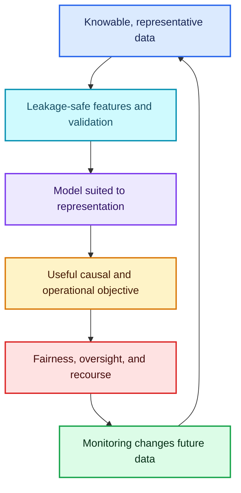

A trustworthy ML system is not merely an accurate function. It is a chain of choices about what is knowable, how data were produced, which representation a model receives, what objective is optimised, who experiences each error, how deployment changes future observations, and who can challenge or stop the system.

That is why Lesson 12’s time-series engineering and responsible-ML discussion belong together: both demand that we respect the difference between the data visible in a notebook and the information, incentives, people, and consequences present in the real world.
