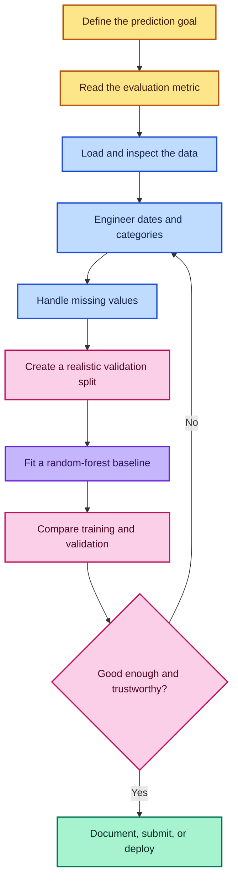
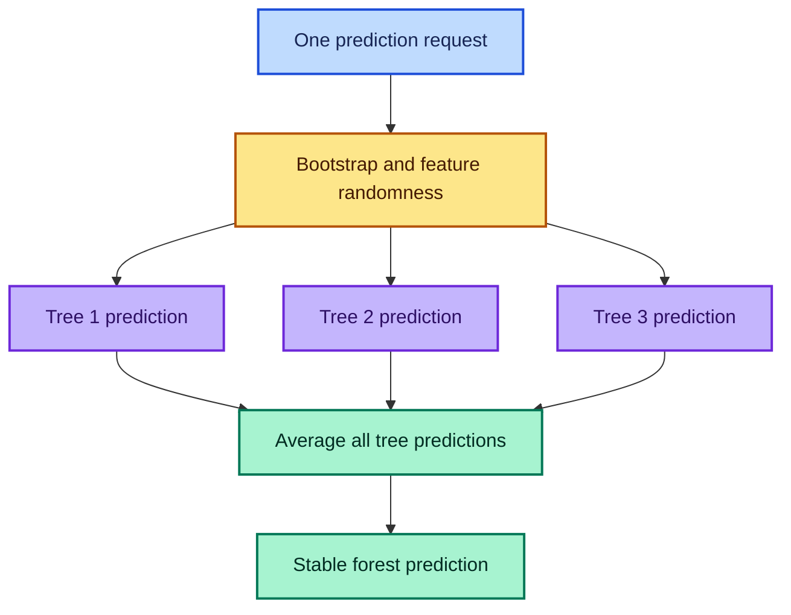
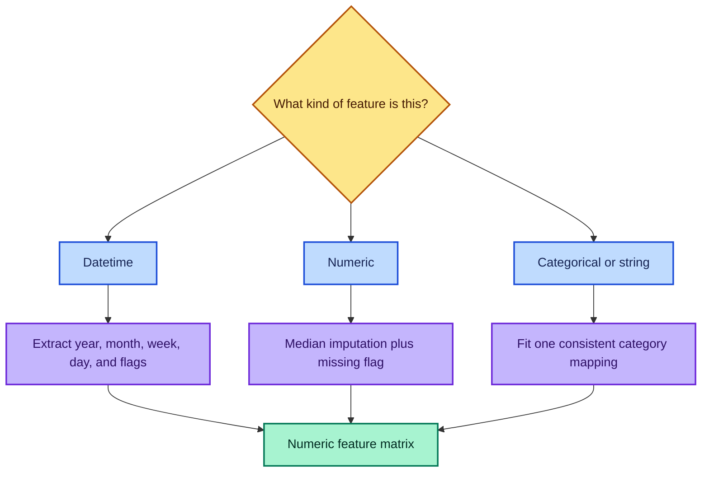

# Intro to Machine Learning — Lesson 1

## Random-Forest Baselines for Structured Data

> Detailed study notes derived from **“Intro to Machine Learning: Lesson 1”**, with the Blue Book for Bulldozers regression problem as the running example.

**Lecture source:** [YouTube — Intro to Machine Learning: Lesson 1](https://www.youtube.com/watch/CzdWqFTmn0Y)

---

## Important Compatibility Note

The lecture demonstrates an early version of fast.ai and mentions historical notebook services. Its **ideas remain valuable**, but helpers such as `add_datepart`, `train_cats`, `apply_cats`, and `proc_df` came from the older `fastai.structured` API.

These notes therefore provide two views:

1. **Lesson-faithful intuition** — what the lecturer did and why.
2. **Modern implementation** — the same workflow using current pandas and scikit-learn pipelines.

The modern version follows scikit-learn’s supported composition pattern: different transformations are applied to different column types with `ColumnTransformer` and then joined to the model in a `Pipeline`. See the official [mixed-type columns example](https://scikit-learn.org/stable/auto_examples/compose/plot_column_transformer_mixed_types.html), [`ColumnTransformer` documentation](https://scikit-learn.org/stable/modules/generated/sklearn.compose.ColumnTransformer.html), and [`Pipeline` documentation](https://scikit-learn.org/stable/modules/generated/sklearn.pipeline.Pipeline.html).

---

## Table of Contents

1. [Learning Outcomes](#learning-outcomes)
2. [The Lesson in One Picture](#the-lesson-in-one-picture)
3. [A Practical-First Learning Philosophy](#1-a-practical-first-learning-philosophy)
4. [Jupyter as an Experimental Laboratory](#2-jupyter-as-an-experimental-laboratory)
5. [Define the Problem Before the Model](#3-define-the-problem-before-the-model)
6. [Structured Data and pandas](#4-structured-data-and-pandas)
7. [RMSLE and the Logarithmic Target](#5-rmsle-and-the-logarithmic-target)
8. [Random Forests](#6-random-forests)
9. [Preparing Dates, Categories, and Missing Values](#7-preparing-dates-categories-and-missing-values)
10. [Chronological Validation](#8-chronological-validation)
11. [RMSE and R²](#9-evaluation-with-rmse-and-r)
12. [Complete Modern Implementation](#10-complete-modern-implementation)
13. [Transcript-Era to Modern API Map](#11-transcript-era-to-modern-api-map)
14. [Common Mistakes](#12-common-mistakes-and-how-to-debug-them)
15. [Practice Exercises](#13-practice-exercises)
16. [Quick Reference](#14-quick-reference)
17. [Fun Facts](#15-fun-facts)
18. [Resources](#resources)

---

## Learning Outcomes

After studying these notes, you should be able to:

- frame a tabular prediction problem as supervised regression;
- choose a metric that reflects the real objective;
- explain why a log transform makes relative errors more important than absolute errors;
- describe how a decision tree and a random forest make predictions;
- distinguish regression from classification;
- load and inspect structured data with pandas;
- convert dates into useful numeric features;
- encode categorical variables consistently across training and validation data;
- handle missing numeric values using median imputation and missingness indicators;
- build a chronological validation set without future-to-past leakage;
- interpret RMSE, RMSLE, and `R²`;
- train a reproducible random-forest pipeline with commented modern Python code.

---

## The Lesson in One Picture

The lecture’s central message is that a useful baseline comes from a **repeatable workflow**, not from prematurely searching for a sophisticated algorithm.



---

## 1. A Practical-First Learning Philosophy

### What?

The lesson starts with code and a real dataset, then introduces theory exactly when the theory helps answer a practical question.

The learning cycle is:

> **Build → observe → break → inspect → explain → improve**

### Why?

Machine learning contains many abstractions. Reading about them without seeing their effect can create the illusion of understanding. A working baseline gives every later idea a purpose:

- Why do we need validation? Because the training score is misleading.
- Why encode categories? Because the estimator requires numeric inputs.
- Why extract date parts? Because a raw timestamp hides several useful patterns.
- Why take logarithms? Because the competition cares about proportional error.

### How?

Use short experimental loops:

1. make one change;
2. rerun the smallest relevant cell;
3. measure the result;
4. inspect the error or metric;
5. record what changed and why.

### When?

This approach is particularly effective when:

- learning a new library;
- establishing a baseline on an unfamiliar dataset;
- checking whether the data contains usable signal;
- investigating why a model fails.

It is less appropriate when exploratory code is already becoming a shared production system. At that point, explicit imports, tests, versioning, validation, and modular design become essential.

---

## 2. Jupyter as an Experimental Laboratory

### Notebook Setup

The lecture uses IPython “magic” commands to keep the notebook interactive:

```python
# Load IPython's extension that can automatically reload imported modules.
%load_ext autoreload

# Reload changed modules before each cell runs.
# This is convenient when editing helper functions outside the notebook.
%autoreload 2

# Render matplotlib figures directly beneath the cell that creates them.
%matplotlib inline
```

These commands are **not ordinary Python**, so they work in IPython/Jupyter but not in a normal `.py` script.

### Fast Introspection

Jupyter can answer questions about unfamiliar code without leaving the notebook:

```python
# Display the function's signature and documentation.
display?

# Display documentation and, when available, the function's source code.
display??

# Type part of a name and press Tab to discover available objects.
# Press Shift+Tab while inside a function call to inspect its parameters.
```

#### Why this matters

Library fluency is not the ability to memorize every function. It is the ability to **discover behavior safely and quickly**.

### Python Values Inside Strings and Shell Commands

The lesson introduces two similar-looking uses of braces.

An f-string is ordinary Python string interpolation:

```python
# Store values as normal Python objects.
name = "Jeremy"
age = 43

# The leading f evaluates expressions inside braces.
message = f"Hello {name.upper()}; age = {age}"
print(message)
```

Jupyter can also interpolate a Python variable into a shell command:

```python
from pathlib import Path

# This is a Python object.
data_dir = Path("data/bulldozers")

# The leading exclamation mark sends the command to the system shell.
# Jupyter substitutes the Python value inside braces before doing so.
!ls {data_dir}
```

The braces look alike, but the contexts differ:

- `f"...{expression}..."` is Python syntax;
- `!command {python_name}` is IPython/Jupyter syntax.

### Wildcard Imports: Useful Prototype, Risky Product

The transcript uses imports such as:

```python
# Historical lesson style: convenient in a controlled teaching notebook,
# but it hides where names came from and can create name collisions.
from fastai.imports import *
```

For reusable code, prefer:

```python
# Explicit imports make dependencies visible and improve readability.
import numpy as np
import pandas as pd
from sklearn.ensemble import RandomForestRegressor
```

| Context | Recommended Style | Reason |
|---------|-------------------|--------|
| Small personal experiment | Broad imports may be tolerable | Optimizes speed of exploration |
| Shared notebook | Mostly explicit imports | Readers can trace each name |
| Package or production service | Explicit imports only | Prevents collisions and improves maintenance |

---

## 3. Define the Problem Before the Model

### The Business Question

The Blue Book for Bulldozers task asks:

> Given information about a piece of heavy equipment and its sale, can we predict its auction sale price?

This is **supervised learning** because historical examples contain both:

- an input vector `\mathbf{x}_i` containing features such as model, usage, date, and equipment attributes;
- a known target `y_i`, the sale price.

The dataset can be written as:

$$
\mathcal{D}=\left\{(\mathbf{x}_i,y_i)\right\}_{i=1}^{n}
$$

The model learns a function:

$$
\hat{y}_i=f(\mathbf{x}_i)
$$

where `\hat{y}_i` is the predicted sale price.

### Regression or Classification?

| Task | Target | Example | Typical Estimator |
|------|--------|---------|-------------------|
| **Regression** | Continuous numeric value | Sale price: `\$42{,}500` | `RandomForestRegressor` |
| **Classification** | Discrete class | Equipment condition: good/bad | `RandomForestClassifier` |

> **Important:** “Regression” does not mean “linear regression.” It means that the target is continuous. A random forest, neural network, or nearest-neighbor model can all perform regression.

### Why Study an Unfamiliar Domain?

An unfamiliar domain reduces the temptation to force personal assumptions onto the data. The model becomes a tool for both:

1. **prediction** — estimating future sale prices;
2. **discovery** — identifying which variables appear useful.

Domain knowledge still matters, but it should be tested against evidence rather than substituted for evidence.

---

## 4. Structured Data and pandas

### What Is Structured Data?

In this lesson, **structured data** means a table whose columns have different meanings and data types:

| Column | Possible Type | Meaning |
|--------|---------------|---------|
| `SalePrice` | Float | Monetary target |
| `saledate` | Datetime | Time of auction |
| `UsageBand` | Category | Low, medium, or high usage |
| `ModelID` | Identifier | Equipment model |
| `MachineHoursCurrentMeter` | Float | Usage amount |

This differs from an image, where most input positions are homogeneous pixel intensities, or raw text, where the original representation is a sequence of tokens.

### Data Acquisition and Credential Safety

The transcript demonstrates downloading an authenticated file by copying a browser request as `curl`. That technique can be useful for understanding HTTP, but copied commands may contain session cookies or authorization headers.

```bash
# Create a dedicated data directory without failing if it already exists.
mkdir -p data/bulldozers

# Historical pattern only: the real URL may contain private authentication.
# Always save binary output to a file instead of printing it in the terminal.
curl "<authenticated-download-url>" -o data/bulldozers/bulldozers.zip

# Extract the downloaded archive into the project data directory.
unzip data/bulldozers/bulldozers.zip -d data/bulldozers
```

Use the competition’s current approved download method whenever possible. Never commit copied cookies, access tokens, private URLs, or downloaded competition data to a public repository.

### Loading the CSV

```python
from pathlib import Path
import pandas as pd

# Keep data paths in one variable so the notebook is easy to move.
DATA_DIR = Path("data/bulldozers")

# Parse 'saledate' immediately so pandas exposes datetime operations.
# low_memory=False asks pandas to infer column types using the full file
# rather than potentially mixing types across small chunks.
df_raw = pd.read_csv(
    DATA_DIR / "Train.csv",
    parse_dates=["saledate"],
    low_memory=False,
)
```

### DataFrame Versus Series

- A **DataFrame** is a two-dimensional labeled table.
- A **Series** is one labeled column.

```python
# Select one column; the result is a pandas Series.
prices = df_raw["SalePrice"]

# Select several columns; the result remains a DataFrame.
small_table = df_raw[["SalePrice", "saledate"]]

# Show the final five records.
print(df_raw.tail())

# Transpose a small sample so many columns can be read vertically.
print(df_raw.tail().T)
```

### Inspect Enough—But Do Not Invent a Story

At the beginning, inspection should answer basic validity questions:

- Did the file load?
- Are the expected columns present?
- Was the date parsed as a datetime?
- Is the target numeric and positive?
- How many rows and columns exist?
- Which columns contain missing values?

```python
# Confirm the table dimensions: (number of rows, number of columns).
print(df_raw.shape)

# Inspect inferred data types.
print(df_raw.dtypes)

# Count missing values in each column and show the largest counts first.
print(df_raw.isna().sum().sort_values(ascending=False).head(15))
```

The lesson favors **model-driven exploration**: build a baseline early, then let validation errors and feature behavior guide deeper investigation.

---

## 5. RMSLE and the Logarithmic Target

### What Is RMSLE?

The competition evaluates predictions with **Root Mean Squared Logarithmic Error**:

$$
\operatorname{RMSLE}
=
\sqrt{
\frac{1}{n}
\sum_{i=1}^{n}
\left[
\ln(1+\hat{y}_i)-\ln(1+y_i)
\right]^2
}
$$

where:

- `y_i` is the actual non-negative price;
- `\hat{y}_i` is the predicted non-negative price;
- `n` is the number of examples;
- `\ln` is the natural logarithm.

### Why Use Logs for Prices?

Absolute error can be misleading across different price scales.

| Actual | Prediction | Absolute Error | Relative Error |
|--------|------------|----------------|----------------|
| `\$10,000` | `\$11,000` | `\$1,000` | 10% |
| `\$1,000,000` | `\$1,100,000` | `\$100,000` | 10% |

The absolute errors differ by a factor of 100, but the proportional mistakes are identical.

Ignoring the small `+1` adjustment:

$$
\ln(\hat{y})-\ln(y)
=
\ln\left(\frac{\hat{y}}{y}\right)
$$

Both examples therefore have approximately:

$$
\ln(1.1)\approx 0.0953
$$

### Why Square and Then Take the Root?

1. Logarithms convert ratios into differences.
2. Squaring prevents positive and negative errors from cancelling.
3. Squaring penalizes large mistakes more strongly.
4. The square root returns the metric to log units.

### Training on a Logarithmic Target

The transcript transforms the target before training:

```python
import numpy as np

# Historical lesson behavior: prices are positive, so log is defined.
df_raw["SalePrice"] = np.log(df_raw["SalePrice"])
```

A more defensive modern version is:

```python
# log1p(y) computes log(1 + y), matching the usual RMSLE definition.
# It is also defined when y equals zero.
y_log = np.log1p(df_raw["SalePrice"].astype(float))

# Convert predictions from log space back to price space.
predicted_price = np.expm1(predicted_log_price)
```

If we train a model to minimize RMSE on `z_i=\ln(1+y_i)`, then:

$$
\operatorname{RMSE}(z,\hat{z})
=
\sqrt{
\frac{1}{n}
\sum_{i=1}^{n}(z_i-\hat{z}_i)^2
}
$$

is numerically the same quantity as RMSLE after predictions are transformed consistently.

> **Caution:** A model trained on log prices estimates behavior in log space. Simply exponentiating its output does not automatically produce the conditional mean price in the original space. For leaderboard prediction this may be acceptable, but for financial forecasting the transformation bias deserves explicit study.

#### Fun intuition

Predicting twice the actual price and predicting half the actual price have equal-magnitude log-ratio errors:

$$
\ln(2)=0.6931,
\qquad
\ln(1/2)=-0.6931
$$

---

## 6. Random Forests

### What Is a Decision Tree?

A regression tree repeatedly asks threshold questions such as:

- Is `saleYear < 2010`?
- Is `MachineHours < 2{,}000`?
- Is `UsageBandCode \le 1`?

Each answer sends the example down one branch. The final leaf predicts a constant, usually the mean training target in that leaf:

$$
\hat{y}_{\text{leaf}}
=
\frac{1}{|L|}
\sum_{i\in L}y_i
$$

### How Does a Tree Choose a Split?

For squared-error regression, a candidate split partitions a node into left and right sets. A simplified split objective is:

$$
\operatorname{SSE}_{\text{split}}
=
\sum_{i\in L}(y_i-\bar{y}_L)^2
+
\sum_{i\in R}(y_i-\bar{y}_R)^2
$$

The tree prefers a split that produces the greatest reduction in error relative to the unsplit node.

#### Mini-example

Suppose a node contains log prices:

$$
[9.2,\ 9.3,\ 9.4,\ 11.0,\ 11.2]
$$

A split that separates the first three from the final two creates two internally consistent groups, so its total within-group squared error is much lower than keeping all five together.

### What Is a Random Forest?

A random forest builds many diverse trees and averages their predictions:

$$
\hat{y}_{\text{forest}}(\mathbf{x})
=
\frac{1}{B}
\sum_{b=1}^{B}T_b(\mathbf{x})
$$

where:

- `B` is the number of trees;
- `T_b(\mathbf{x})` is tree `b`’s prediction.

Diversity comes mainly from:

1. training trees on different bootstrap samples;
2. considering random subsets of features at splits.



### Why Averaging Helps

A deep tree often has low bias but high variance: a small data change can produce a different tree. If the trees make partly independent errors, averaging cancels some of that noise.

An intuition for variance reduction is:

$$
\operatorname{Var}\left(\frac{1}{B}\sum_{b=1}^{B}T_b\right)
\approx
\rho\sigma^2
+
\frac{1-\rho}{B}\sigma^2
$$

where `\sigma^2` is a tree’s variance and `\rho` is average correlation between trees. More trees reduce the second term, while feature and row randomness try to reduce `\rho`.

### Why Random Forests Make Strong Baselines

- capture nonlinear relationships;
- discover interactions automatically;
- require no feature scaling;
- work with mixed numeric features after encoding;
- are robust enough to expose whether the pipeline contains useful signal;
- support parallel tree construction;
- offer out-of-bag evaluation and feature importance tools.

The official scikit-learn [ensemble guide](https://scikit-learn.org/stable/modules/ensemble.html) confirms that `n_jobs=-1` uses all available cores, while also warning that communication overhead means speedup is not perfectly linear.

### The Standard scikit-learn Interface

```python
from sklearn.ensemble import RandomForestRegressor

# Construct an unfitted estimator and record its configuration.
model = RandomForestRegressor(
    n_estimators=300,  # Grow 300 trees and average their predictions.
    n_jobs=-1,        # Use all available CPU cores.
    random_state=42,  # Make the random sampling reproducible.
)

# Learn patterns from the feature matrix X_train and target y_train.
model.fit(X_train, y_train)

# Generate predictions for previously unseen validation rows.
predictions = model.predict(X_valid)
```

### Curse of Dimensionality: A Nuanced View

The transcript argues against treating the “curse of dimensionality” as a reason to avoid useful columns. The practical lesson is sound: **do not delete a plausible feature merely because the table is wide**.

However, the careful conclusion is:

- distance-based methods can suffer as irrelevant dimensions accumulate;
- tree ensembles do not rely on one global distance measure;
- useful added features can help;
- noisy, duplicated, leaked, or extremely high-cardinality features can still harm accuracy, memory use, and interpretability;
- validation—not a slogan—should decide whether a feature helps.

### Out-of-Bag Fun Fact

A bootstrap sample draws `n` rows with replacement from `n` available rows. The probability that a particular row is never chosen is:

$$
\left(1-\frac{1}{n}\right)^n
\longrightarrow
e^{-1}
\approx 0.368
$$

So each tree leaves out roughly **36.8%** of the original rows. Those out-of-bag rows can estimate generalization without creating a separate random holdout, although a time-based validation set is still preferable when predicting the future.

---

## 7. Preparing Dates, Categories, and Missing Values

Most estimators expect a numeric matrix. The preprocessing question is therefore:



### 7.1 Date Feature Engineering

#### What?

A raw timestamp is one value, but it contains several potentially predictive components:

- year;
- quarter;
- month;
- ISO week;
- day of month;
- day of week;
- month-start/month-end flags;
- elapsed time;
- domain events such as holidays, weather, or sports events.

#### Why?

A tree can easily learn a rule such as “sales after 2010 behave differently” if `saleYear` exists. It cannot infer “month” directly from an opaque datetime representation unless that relationship is exposed numerically.

#### How?

```python
import pandas as pd

def add_date_features(frame: pd.DataFrame, column: str) -> pd.DataFrame:
    """Return a copy with useful calendar features and without the raw date."""

    # Copy the input so the function does not unexpectedly mutate its caller.
    result = frame.copy()

    # Convert invalid strings to NaT rather than raising an exception.
    dates = pd.to_datetime(result[column], errors="coerce")

    # Turn 'saledate' into the readable prefix 'sale'.
    prefix = column[:-4] if column.lower().endswith("date") else column

    # Extract calendar components through pandas' datetime accessor.
    result[f"{prefix}Year"] = dates.dt.year
    result[f"{prefix}Quarter"] = dates.dt.quarter
    result[f"{prefix}Month"] = dates.dt.month
    result[f"{prefix}Week"] = dates.dt.isocalendar().week.astype("float64")
    result[f"{prefix}Day"] = dates.dt.day
    result[f"{prefix}DayOfWeek"] = dates.dt.dayofweek
    result[f"{prefix}DayOfYear"] = dates.dt.dayofyear

    # Boolean calendar properties are converted to 0/1 numeric indicators.
    result[f"{prefix}IsMonthEnd"] = dates.dt.is_month_end.astype("int8")
    result[f"{prefix}IsMonthStart"] = dates.dt.is_month_start.astype("int8")
    result[f"{prefix}IsQuarterEnd"] = dates.dt.is_quarter_end.astype("int8")
    result[f"{prefix}IsQuarterStart"] = dates.dt.is_quarter_start.astype("int8")
    result[f"{prefix}IsYearEnd"] = dates.dt.is_year_end.astype("int8")
    result[f"{prefix}IsYearStart"] = dates.dt.is_year_start.astype("int8")

    # Drop the raw datetime after its information has been exposed numerically.
    return result.drop(columns=[column])
```

#### When should you add external calendar features?

Add holidays, weather, promotions, or events only if they would have been known at prediction time. Otherwise, they may create leakage.

### 7.2 Categorical Variables

#### What?

A categorical variable represents membership in a finite set:

- nominal: `{"red", "green", "blue"}`, with no natural order;
- ordinal: `{"low", "medium", "high"}`, with a meaningful order.

#### Integer encoding

An encoder learns a mapping:

$$
c:\mathcal{C}\rightarrow\{0,1,\ldots,K-1\}
$$

For an ordinal feature:

$$
\text{low}\mapsto0,\qquad
\text{medium}\mapsto1,\qquad
\text{high}\mapsto2
$$

A tree can isolate low usage with a single split such as:

$$
\text{UsageBandCode}<0.5
$$

#### Why must the mapping be fitted once?

Suppose training uses:

$$
\text{High}\mapsto0,\quad
\text{Low}\mapsto1,\quad
\text{Medium}\mapsto2
$$

but validation independently creates:

$$
\text{High}\mapsto2,\quad
\text{Low}\mapsto0,\quad
\text{Medium}\mapsto1
$$

The same number now means different things. The model receives corrupted inputs even though the code runs without an exception.

> **Rule:** Fit category mappings on training data; use that fitted mapping to transform validation, test, and production data.

#### Ordinal encoding versus one-hot encoding

| Method | Representation | Best Use |
|--------|----------------|----------|
| Ordinal/integer encoding | One integer column | Ordered categories or compact tree baselines |
| One-hot encoding | One binary column per category | Low-cardinality nominal categories |
| Learned embeddings | Dense vectors | High-cardinality neural models |

For a modern pandas ordered category, assign the returned categorical because current `set_categories` is not an in-place operation:

```python
# Convert strings to pandas' categorical dtype.
df_raw["UsageBand"] = df_raw["UsageBand"].astype("category")

# Reorder categories and explicitly mark the relationship as ordered.
df_raw["UsageBand"] = df_raw["UsageBand"].cat.set_categories(
    ["Low", "Medium", "High"],
    ordered=True,
)

# Inspect the integer codes; missing categories use -1 in pandas.
usage_codes = df_raw["UsageBand"].cat.codes
```

See the current pandas [`set_categories` documentation](https://pandas.pydata.org/docs/reference/api/pandas.Series.cat.set_categories.html).

### 7.3 Missing Numeric Values

#### The transcript’s strategy

For a numeric feature `x_j`:

1. create a missingness indicator;
2. replace missing values with the training median.

Formally:

$$
m_{ij}=
\begin{cases}
1,&x_{ij}\text{ is missing}\\
0,&\text{otherwise}
\end{cases}
$$

and:

$$
x'_{ij}=
\begin{cases}
\operatorname{median}(x_{\cdot j}^{\text{train}}),&x_{ij}\text{ is missing}\\
x_{ij},&\text{otherwise}
\end{cases}
$$

#### Why use the median?

The median is resistant to extreme values. If machine hours are:

$$
[100,\ 120,\ 130,\ 150,\ 20{,}000]
$$

the mean is heavily pulled upward, while the median remains `130`.

#### Why keep a missingness flag?

Missingness can itself contain information. An absent machine-hours reading might indicate older equipment, a different seller process, or a particular data source. Median filling preserves a usable number; the flag lets the model distinguish “observed median” from “missing and filled with median.”

#### Leakage warning

The median must be computed from **training data only**. If validation data contributes to the median, preprocessing has leaked information across the split. A fitted scikit-learn pipeline prevents this when it is fitted only on `X_train`.

### 7.4 Saving an Intermediate Checkpoint with Feather

After expensive parsing and feature creation, the lecture saves a fast checkpoint:

```python
from pathlib import Path

# Create the checkpoint directory if it does not already exist.
Path("tmp").mkdir(parents=True, exist_ok=True)

# Persist the DataFrame in a fast columnar format.
df_raw.reset_index(drop=True).to_feather("tmp/bulldozers_raw.feather")

# Restore it later without rereading and reparsing the CSV.
df_restored = pd.read_feather("tmp/bulldozers_raw.feather")
```

Feather is a binary columnar format designed for efficient DataFrame serialization. Current pandas documentation notes that it preserves categorical and datetime dtypes, but a non-default index must be reset or stored separately. See the official [pandas Feather guide](https://pandas.pydata.org/docs/user_guide/io.html#feather).

---
## 8. Chronological Validation

### What Is a Validation Set?

| Split | Used For | May Influence Model Fitting? |
|-------|----------|------------------------------|
| **Training** | Learn preprocessing statistics and model parameters | Yes |
| **Validation** | Choose features, model settings, and stopping decisions | No direct fitting |
| **Test** | Final, nearly untouched estimate of performance | No |

The training score answers:

> How well can the model describe data it has already seen?

The validation score answers:

> How well does the complete fitted workflow behave on relevant unseen data?

### Why Not Use a Random Split Here?

The rows are ordered by sale date, and the real task is to predict later auction prices from earlier history. A random split would let the model train on future market conditions while being evaluated on older sales.

A more realistic split is:

$$
\mathcal{D}_{\text{train}}
=
\{(\mathbf{x}_i,y_i):t_i\le T\}
$$

$$
\mathcal{D}_{\text{valid}}
=
\{(\mathbf{x}_i,y_i):T<t_i\le T'\}
$$


### Transcript-Style Split

```python
def split_values(values, split_index):
    """Split a pandas object without mutating either returned part."""

    # Everything before the boundary becomes training data.
    left = values.iloc[:split_index].copy()

    # Everything from the boundary onward becomes validation data.
    right = values.iloc[split_index:].copy()

    return left, right

# Reserve the most recent 12,000 observations for validation.
n_valid = 12_000
n_train = len(X) - n_valid

# Preserve chronology by slicing rather than randomly shuffling.
X_train, X_valid = split_values(X, n_train)
y_train, y_valid = split_values(y_log, n_train)
```

### Data Leakage Checklist

Leakage occurs when training uses information that would not be available at prediction time. Check that:

- target `SalePrice` is removed from `X`;
- future rows do not affect training;
- medians and category mappings are fitted on training rows only;
- features do not contain post-sale information;
- repeated machines, sellers, or auctions are handled consistently;
- leaderboard or test results are not repeatedly used as a validation set.

---

## 9. Evaluation with RMSE and R²

### RMSE

Root Mean Squared Error is:

$$
\operatorname{RMSE}
=
\sqrt{
\frac{1}{n}
\sum_{i=1}^{n}
(y_i-\hat{y}_i)^2
}
$$

In this lesson, `y` is the log-transformed price, so the reported RMSE is an error in log space.

#### Interpretation

- lower is better;
- zero is perfect;
- large errors receive extra weight because of squaring;
- training RMSE much lower than validation RMSE suggests overfitting or distribution shift.

### Coefficient of Determination, `R²`

$$
R^2
=
1-
\frac{
\sum_{i=1}^{n}(y_i-\hat{y}_i)^2
}{
\sum_{i=1}^{n}(y_i-\bar{y})^2
}
$$

The numerator is the model’s residual sum of squares. The denominator is the error from predicting the target mean for every row.

| `R²` | Interpretation |
|------|----------------|
| `1` | Perfect prediction |
| `0` | No better than always predicting the mean |
| `<0` | Worse than the mean baseline |

#### Worked example

Let:

$$
y=[2,4,6],\qquad
\hat{y}=[3,4,5],\qquad
\bar{y}=4
$$

Then:

$$
\operatorname{SSE}
=(2-3)^2+(4-4)^2+(6-5)^2=2
$$

$$
\operatorname{SST}
=(2-4)^2+(4-4)^2+(6-4)^2=8
$$

so:

$$
R^2=1-\frac{2}{8}=0.75
$$

The official [`RandomForestRegressor` documentation](https://scikit-learn.org/stable/modules/generated/sklearn.ensemble.RandomForestRegressor.html) states that `model.score(X, y)` returns `R²` for regression. The [`r2_score` documentation](https://scikit-learn.org/stable/modules/generated/sklearn.metrics.r2_score.html) also emphasizes that `R²` can be negative.

### Reading the Lecture’s Reported Scores

The lesson reports approximately:

| Metric | Training | Validation |
|--------|----------|------------|
| `R²` | 0.98 | 0.89 |
| Log RMSE | 0.09 | 0.25 |

The model clearly learned useful signal, but the validation gap shows that the training score is optimistic. The important result is not “0.98”; it is that a simple, repeatable baseline reaches a competitive unseen-data score quickly.

> Never compare training and validation metrics computed on different target transformations.

---

## 10. Complete Modern Implementation

This implementation preserves the lecture’s workflow while using a reproducible preprocessing pipeline.

### 10.1 Install the Required Libraries

```bash
# Install the table, numerical, machine-learning, and Feather dependencies.
python -m pip install pandas numpy scikit-learn pyarrow
```

### 10.2 Imports, Data Loading, and Date Features

```python
from pathlib import Path

import numpy as np
import pandas as pd
from sklearn.compose import ColumnTransformer
from sklearn.ensemble import RandomForestRegressor
from sklearn.impute import SimpleImputer
from sklearn.metrics import r2_score
from sklearn.pipeline import Pipeline
from sklearn.preprocessing import OrdinalEncoder


# Store the dataset location once so paths remain easy to change.
DATA_DIR = Path("data/bulldozers")
TRAIN_FILE = DATA_DIR / "Train.csv"


def add_date_features(frame: pd.DataFrame, column: str) -> pd.DataFrame:
    """Expand one datetime column into tree-friendly numeric features."""

    # Work on a copy so the caller's DataFrame remains unchanged.
    result = frame.copy()

    # Coerce invalid values to NaT; later numeric imputation can handle them.
    dates = pd.to_datetime(result[column], errors="coerce")

    # Use 'sale' as the prefix when the input column is 'saledate'.
    prefix = column[:-4] if column.lower().endswith("date") else column

    # Extract calendar components that a tree can split on directly.
    result[f"{prefix}Year"] = dates.dt.year
    result[f"{prefix}Quarter"] = dates.dt.quarter
    result[f"{prefix}Month"] = dates.dt.month
    result[f"{prefix}Week"] = dates.dt.isocalendar().week.astype("float64")
    result[f"{prefix}Day"] = dates.dt.day
    result[f"{prefix}DayOfWeek"] = dates.dt.dayofweek
    result[f"{prefix}DayOfYear"] = dates.dt.dayofyear

    # Convert calendar boundary flags into compact integer columns.
    result[f"{prefix}IsMonthEnd"] = dates.dt.is_month_end.astype("int8")
    result[f"{prefix}IsMonthStart"] = dates.dt.is_month_start.astype("int8")
    result[f"{prefix}IsQuarterEnd"] = dates.dt.is_quarter_end.astype("int8")
    result[f"{prefix}IsQuarterStart"] = dates.dt.is_quarter_start.astype("int8")
    result[f"{prefix}IsYearEnd"] = dates.dt.is_year_end.astype("int8")
    result[f"{prefix}IsYearStart"] = dates.dt.is_year_start.astype("int8")

    # The original datetime is no longer required after expansion.
    return result.drop(columns=[column])


# Load the sale date as a real datetime instead of an ordinary string.
raw = pd.read_csv(
    TRAIN_FILE,
    parse_dates=["saledate"],
    low_memory=False,
)

# Sort before splitting so the validation set represents later auctions.
raw = raw.sort_values("saledate").reset_index(drop=True)

# Remove the target from the feature table and transform it into log space.
# log1p is aligned with the common RMSLE definition and permits zero values.
y_log = np.log1p(raw.pop("SalePrice").astype("float64"))

# Convert the raw datetime into explicit numeric calendar features.
X = add_date_features(raw, "saledate")
```

### 10.3 Create the Chronological Split

```python
# Match the lecture by reserving the final 12,000 chronological rows.
n_valid = 12_000

# Fail loudly if a smaller practice dataset cannot support that holdout.
if len(X) <= n_valid:
    raise ValueError("The dataset must contain more than 12,000 rows.")

# Calculate the boundary between earlier training rows and recent validation rows.
split_index = len(X) - n_valid

# Copy slices so later transformations cannot mutate the source table.
X_train = X.iloc[:split_index].copy()
X_valid = X.iloc[split_index:].copy()
y_train = y_log.iloc[:split_index].copy()
y_valid = y_log.iloc[split_index:].copy()

# Verify that feature and target row counts agree.
print("Training shapes:", X_train.shape, y_train.shape)
print("Validation shapes:", X_valid.shape, y_valid.shape)
```

### 10.4 Build the Preprocessing Pipeline

```python
# Identify numeric columns from training data only.
numeric_columns = X_train.select_dtypes(
    include=["number", "bool"]
).columns.tolist()

# Treat every remaining column as categorical.
categorical_columns = [
    column for column in X_train.columns
    if column not in numeric_columns
]


# Replace missing numeric values with training medians.
# add_indicator=True also creates a flag for columns that were missing at fit time.
numeric_pipeline = Pipeline(
    steps=[
        (
            "imputer",
            SimpleImputer(strategy="median", add_indicator=True),
        ),
    ]
)


# Fit category mappings on training data and reuse them everywhere else.
categorical_pipeline = Pipeline(
    steps=[
        (
            "imputer",
            SimpleImputer(strategy="most_frequent"),
        ),
        (
            "encoder",
            OrdinalEncoder(
                # A category first seen during validation receives -1.
                handle_unknown="use_encoded_value",
                unknown_value=-1,
            ),
        ),
    ]
)


# Apply the correct transformation to each column family.
preprocessor = ColumnTransformer(
    transformers=[
        ("numeric", numeric_pipeline, numeric_columns),
        ("categorical", categorical_pipeline, categorical_columns),
    ],
    # Any unlisted column is deliberately excluded.
    remainder="drop",
    # Keep generated names readable for later feature inspection.
    verbose_feature_names_out=False,
)


# Configure a strong, reproducible baseline forest.
forest = RandomForestRegressor(
    n_estimators=300,     # Average 300 independently randomized trees.
    criterion="squared_error",
    n_jobs=-1,            # Use all available CPU cores.
    random_state=42,      # Reproduce bootstrap and feature randomness.
)


# Join preprocessing and prediction into one fitted object.
# Calling fit on this pipeline learns medians, category mappings, and trees
# from the training rows only.
model = Pipeline(
    steps=[
        ("preprocess", preprocessor),
        ("forest", forest),
    ]
)
```

### 10.5 Fit and Evaluate

```python
def rmse(actual: np.ndarray, predicted: np.ndarray) -> float:
    """Calculate root mean squared error."""

    # Convert to arrays so subtraction is positional and explicit.
    actual = np.asarray(actual, dtype="float64")
    predicted = np.asarray(predicted, dtype="float64")

    # Square errors, average them, and restore scale with a square root.
    return float(np.sqrt(np.mean((actual - predicted) ** 2)))


def rmsle(actual_price: np.ndarray, predicted_price: np.ndarray) -> float:
    """Calculate RMSLE after protecting its non-negative domain."""

    # RMSLE is defined for non-negative targets and predictions.
    actual_price = np.clip(np.asarray(actual_price), 0, None)
    predicted_price = np.clip(np.asarray(predicted_price), 0, None)

    # Compare log1p-transformed values.
    return rmse(
        np.log1p(actual_price),
        np.log1p(predicted_price),
    )


# Fit every preprocessing step and every tree using training rows only.
model.fit(X_train, y_train)

# Predict in the same log space used for training.
train_pred_log = model.predict(X_train)
valid_pred_log = model.predict(X_valid)

# Return validation predictions to ordinary price space.
valid_actual_price = np.expm1(y_valid.to_numpy())
valid_pred_price = np.clip(np.expm1(valid_pred_log), 0, None)

# Print training and validation metrics side by side.
print(f"Train log RMSE: {rmse(y_train, train_pred_log):.4f}")
print(f"Valid log RMSE: {rmse(y_valid, valid_pred_log):.4f}")
print(f"Train log R²:   {r2_score(y_train, train_pred_log):.4f}")
print(f"Valid log R²:   {r2_score(y_valid, valid_pred_log):.4f}")
print(f"Valid RMSLE:    {rmsle(valid_actual_price, valid_pred_price):.4f}")
```

### 10.6 Inspect Feature Importance Carefully

```python
# Recover the feature names created by the fitted preprocessor.
feature_names = model.named_steps["preprocess"].get_feature_names_out()

# Read impurity-based importance values from the fitted forest.
importance_values = model.named_steps["forest"].feature_importances_

# Pair names with importance and show the 15 largest values.
importance = pd.Series(
    importance_values,
    index=feature_names,
    name="importance",
).sort_values(ascending=False)

print(importance.head(15))
```

Feature importance can guide investigation, but it is not proof of causality. Scikit-learn’s [ensemble guide](https://scikit-learn.org/stable/modules/ensemble.html#feature-importance-evaluation) warns that impurity-based importance can favor high-cardinality features and can describe training behavior rather than held-out usefulness. Validate important claims with permutation importance, ablation tests, and domain knowledge.

### 10.7 Optional Checkpoint

```python
# Cache the already parsed and date-expanded table for faster restarts.
checkpoint = X.copy()

# Feather requires a default RangeIndex, so reset it before writing.
checkpoint.reset_index(drop=True).to_feather(
    "tmp/bulldozers_features.feather"
)
```

---

## 11. Transcript-Era to Modern API Map

| Transcript-Era Pattern | Modern Equivalent | Why Change? |
|------------------------|-------------------|-------------|
| `from fastai.imports import *` | Explicit imports | Clear provenance and fewer name collisions |
| `add_datepart(df, "saledate")` | A documented date-feature function | Makes feature behavior visible and testable |
| `train_cats(df)` | `OrdinalEncoder` fitted inside a pipeline | Guarantees one training-derived mapping |
| `apply_cats(valid, train)` | `pipeline.predict(valid)` after fitting the pipeline | Reuses fitted transformations automatically |
| `proc_df(df, "SalePrice")` | `ColumnTransformer` + `SimpleImputer` + `OrdinalEncoder` | Explicit, composable preprocessing |
| `cat.set_categories(..., inplace=True)` | Assign `series.cat.set_categories(...)` | Current pandas returns the changed categorical |
| `np.log(SalePrice)` | `np.log1p(SalePrice)` for RMSLE | Handles zero and matches the `+1` definition |
| `RandomForestRegressor(n_jobs=-1)` | Still supported | All available cores can build/predict trees in parallel |
| `model.score(X, y)` | Still returns `R²` for a regressor | Interpret alongside an error metric |
| Manual medians before splitting | `SimpleImputer` inside `Pipeline` | Prevents validation leakage |

### Historical fast.ai flow

The lesson’s original logic can be summarized as:

```python
# Legacy illustration only: these helpers belong to an older fast.ai API.
add_datepart(df_raw, "saledate")     # Expand the date into numeric parts.
train_cats(df_raw)                   # Convert strings to fitted categories.
df, y, nas = proc_df(                # Extract y, encode categories,
    df_raw,                           # impute numbers, and add NA flags.
    "SalePrice",
)

# Fit the forest after every model input has become numeric.
legacy_model = RandomForestRegressor(n_jobs=-1)
legacy_model.fit(df, y)
```

The modern pipeline performs the same conceptual stages while preserving fitted preprocessing state in one reusable object.

---

## 12. Common Mistakes and How to Debug Them

| Mistake | Symptom | Why It Happens | Fix |
|---------|---------|----------------|-----|
| Target remains in `X` | Suspiciously perfect validation score | Direct target leakage | Pop/drop `SalePrice` before feature processing |
| Categories encoded separately | Validation collapses unpredictably | Integer meanings differ | Fit one encoder on training data |
| Median computed on all rows | Slightly optimistic validation | Validation influenced preprocessing | Put imputation inside the fitted pipeline |
| Random split for future prediction | Excellent offline, weak deployment | Future conditions leak into training | Split chronologically |
| Evaluate only training data | High score that does not generalize | The model memorized patterns | Always report held-out performance |
| Raw strings passed to forest | “Could not convert string to float” | Estimator expects numeric inputs | Encode categories |
| Raw datetime passed through | Type conversion error or opaque values | Timestamp not engineered | Extract calendar features |
| Forget inverse transform | “Prices” look like values around 9–12 | Output is still log-price | Use `np.expm1` |
| Different metric spaces | Numbers cannot be compared | One metric uses price, another log-price | Name metrics explicitly |
| Trust feature importance as causality | Misleading business conclusion | Association is not intervention | Use validation, ablation, and domain review |
| Copy authenticated `curl` command publicly | Session/token exposure | Headers may contain credentials | Use approved download tooling; never publish secrets |
| Add every ID without testing | High memory or brittle splits | IDs can proxy entities or time | Check cardinality, leakage, and validation impact |

### How to Read a Python Stack Trace

The transcript recommends starting at the bottom:

1. read the final exception type and message;
2. identify the first line belonging to your notebook or code;
3. inspect the value and dtype at that line;
4. reproduce the failure with the smallest possible example;
5. use `?`, `??`, and official documentation.

For example, “could not convert string to float: 'Conventional'” immediately suggests that at least one categorical string reached a numeric estimator.

---

## 13. Practice Exercises

### Exercise 1 — Metric Intuition

Compare these two predictions:

- actual `\$20{,}000`, predicted `\$22{,}000`;
- actual `\$200{,}000`, predicted `\$220{,}000`.

1. Compute both absolute errors.
2. Compute `\ln(\hat y/y)` for each.
3. Explain why RMSLE treats them similarly.

<details>
<summary>Expected intuition</summary>

The absolute errors are `\$2{,}000` and `\$20{,}000`, but both are 10% overestimates and both have log-ratio error `\ln(1.1)`.

</details>

### Exercise 2 — Category Consistency

Training categories are `["High", "Low", "Medium"]`. Validation contains `["Medium", "High", "Unknown"]`.

1. Fit an `OrdinalEncoder` on training data.
2. Transform validation using the fitted encoder.
3. Configure `Unknown` to receive `-1`.
4. Explain why fitting a second validation encoder is wrong.

### Exercise 3 — Missingness

For:

$$
x=[10,\ 12,\ \text{NA},\ 18,\ \text{NA}]
$$

1. find the observed median;
2. create the imputed column;
3. create the missingness indicator;
4. explain what information the indicator preserves.

<details>
<summary>Answer</summary>

The observed values are `[10,12,18]`, whose median is `12`.

$$
x'=[10,12,12,18,12]
$$

$$
m=[0,0,1,0,1]
$$

</details>

### Exercise 4 — Validation Design

You have monthly sales from January 2018 through December 2025 and want to predict 2026.

1. Propose a training interval.
2. Propose a validation interval.
3. Explain why a random split is less realistic.
4. Identify one feature that could accidentally leak future information.

### Exercise 5 — Baseline Extension

Starting from the complete implementation:

1. try `min_samples_leaf` values `[1, 3, 5, 10]`;
2. compare training and validation log RMSE;
3. enable `oob_score=True` and compare OOB `R²` with chronological validation `R²`;
4. remove date features and measure the change;
5. write a short conclusion based on evidence.

### Exercise 6 — Generalize to Another Dataset

Choose a regression dataset and reproduce the entire loop:

- state the target;
- state the metric;
- identify the time or group leakage risk;
- build the preprocessing pipeline;
- establish a forest baseline;
- compare train and validation;
- document one failure and how you debugged it.

---

## 14. Quick Reference

### Core Vocabulary

| Term | Meaning |
|------|---------|
| Feature / independent variable | Input used to make a prediction |
| Target / dependent variable | Quantity the model should predict |
| Regression | Prediction of a continuous value |
| Classification | Prediction of a discrete class |
| Training set | Data used to fit transformations and model parameters |
| Validation set | Unseen data used to guide modeling decisions |
| Feature engineering | Turning raw values into useful model inputs |
| Imputation | Replacing missing data using a defined rule |
| Overfitting | Learning training-specific patterns that do not generalize |
| Data leakage | Using information unavailable at real prediction time |
| Baseline | First credible model against which improvements are measured |

### Formula Sheet

#### Forest regression

$$
\hat{y}(\mathbf{x})
=
\frac{1}{B}\sum_{b=1}^{B}T_b(\mathbf{x})
$$

#### RMSE

$$
\operatorname{RMSE}
=
\sqrt{\frac{1}{n}\sum_{i=1}^{n}(y_i-\hat{y}_i)^2}
$$

#### RMSLE

$$
\operatorname{RMSLE}
=
\sqrt{
\frac{1}{n}
\sum_{i=1}^{n}
\left[\ln(1+y_i)-\ln(1+\hat{y}_i)\right]^2
}
$$

#### `R²`

$$
R^2
=
1-
\frac{\sum_i(y_i-\hat{y}_i)^2}
{\sum_i(y_i-\bar{y})^2}
$$

#### Missing indicator

$$
m_{ij}=\mathbb{1}[x_{ij}\text{ is missing}]
$$

### Notebook Commands

| Command | Purpose |
|---------|---------|
| `name?` | Documentation and signature |
| `name??` | Documentation and source when available |
| Tab | Name completion |
| Shift+Tab | Function-call help |
| `!command` | Run a shell command from Jupyter |
| `{python_name}` inside `!` command | Interpolate a Python value into the shell command |

### Modeling Checklist

- [ ] Write down the target and unit of prediction.
- [ ] Read the exact metric definition.
- [ ] Identify whether the task is regression or classification.
- [ ] Parse dates before feature engineering.
- [ ] Remove the target from the feature table.
- [ ] Split data using deployment-realistic logic.
- [ ] Fit preprocessing only on training rows.
- [ ] Preserve one category mapping.
- [ ] Add missingness indicators when useful.
- [ ] Train a reproducible baseline.
- [ ] Report training and validation metrics in the same space.
- [ ] Inspect errors before tuning hyperparameters.
- [ ] Save code, environment details, and conclusions.

---

## 15. Fun Facts

1. **About 36.8% of rows are out-of-bag for one bootstrap tree.** This follows from the limit `(1-1/n)^n\to e^{-1}`.
2. **`R²` is not literally a squared number in every use.** It can be negative when a model is worse than predicting the mean.
3. **Logarithms turn multiplication into addition.** That is why percentage-like errors become ordinary differences in log space.
4. **A category code is a representation, not a measurement.** Code `2` is not “twice” category `1` unless the domain genuinely supports that interpretation.
5. **A missing value can be predictive.** The act of not recording a measurement may reflect a real process.
6. **More trees mainly reduce variance, not bias.** Once the forest is large enough, adding trees usually stabilizes performance rather than changing the underlying feature limitations.
7. **Feather belongs to the Apache Arrow ecosystem.** Its columnar representation is designed for fast interchange between analytical tools and languages.
8. **The fastest baseline is often a diagnostic instrument.** A model that fails immediately can reveal bad types, leakage, broken targets, or weak signal before expensive tuning begins.

---

## Resources

### Original Lesson

- [YouTube — Intro to Machine Learning: Lesson 1](https://www.youtube.com/watch/CzdWqFTmn0Y)
- [fast.ai course website](https://course.fast.ai/)
- [Kaggle — Blue Book for Bulldozers](https://www.kaggle.com/c/bluebook-for-bulldozers)

### Official Documentation

- [scikit-learn — RandomForestRegressor](https://scikit-learn.org/stable/modules/generated/sklearn.ensemble.RandomForestRegressor.html)
- [scikit-learn — Ensemble methods and random forests](https://scikit-learn.org/stable/modules/ensemble.html)
- [scikit-learn — ColumnTransformer with mixed types](https://scikit-learn.org/stable/auto_examples/compose/plot_column_transformer_mixed_types.html)
- [scikit-learn — Pipeline](https://scikit-learn.org/stable/modules/generated/sklearn.pipeline.Pipeline.html)
- [scikit-learn — R² score](https://scikit-learn.org/stable/modules/generated/sklearn.metrics.r2_score.html)
- [pandas — Categorical set_categories](https://pandas.pydata.org/docs/reference/api/pandas.Series.cat.set_categories.html)
- [pandas — Feather I/O](https://pandas.pydata.org/docs/user_guide/io.html#feather)

---

## Final Takeaway

The most important lesson is not a particular function call. It is a disciplined way to begin:

> **Understand the objective, match the metric, make the data numerically usable, validate as the system will be used, fit a strong baseline, and let evidence determine the next experiment.**

A simple random forest with trustworthy preprocessing and realistic validation is more valuable than a sophisticated model evaluated on leaked or irrelevant data.
