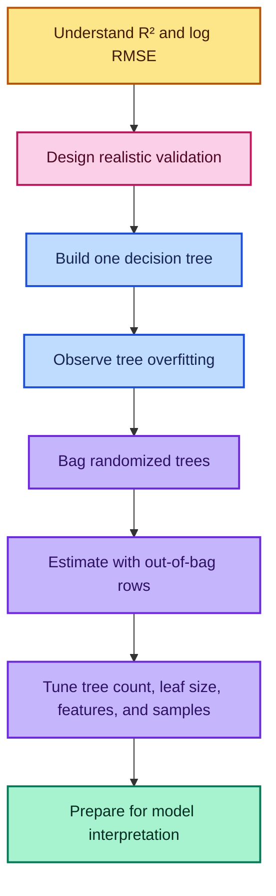
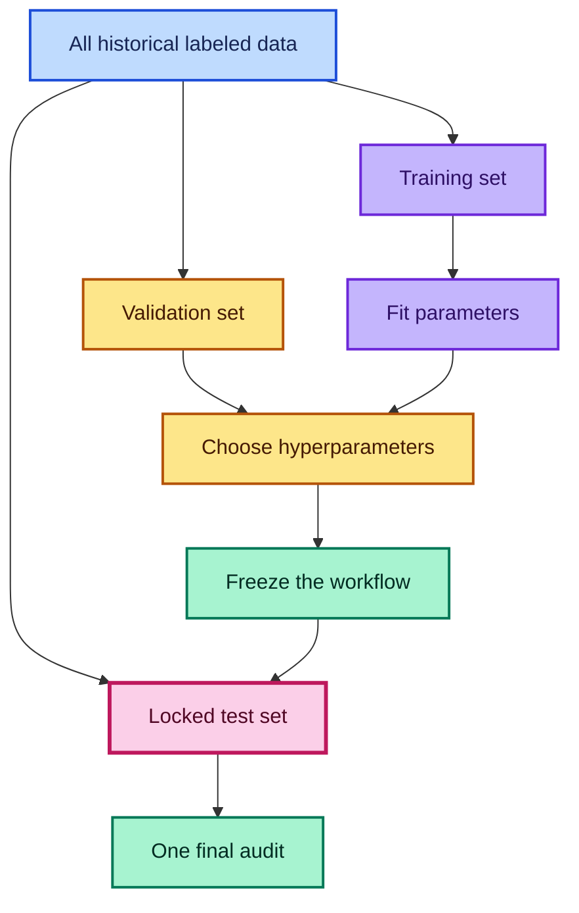
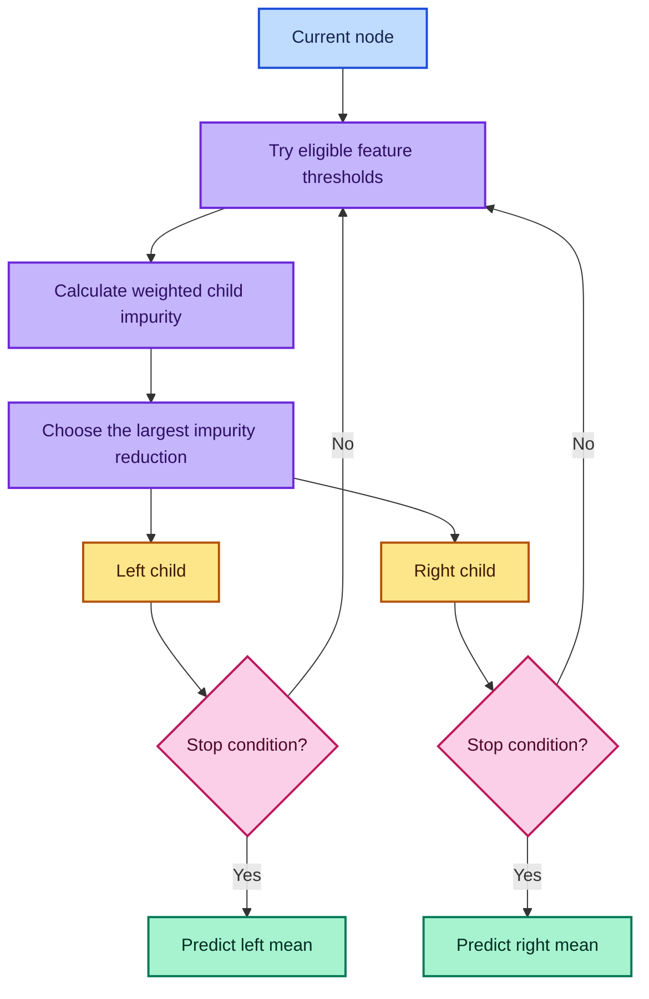
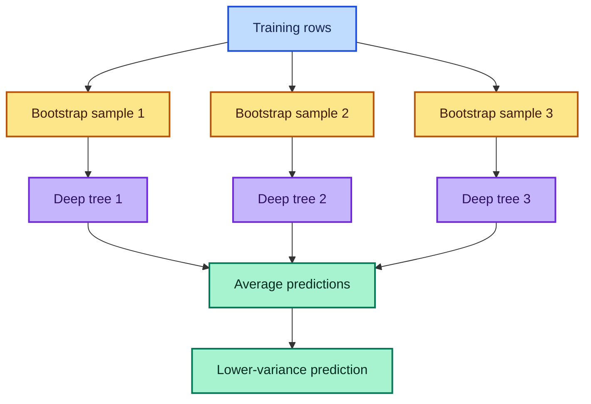
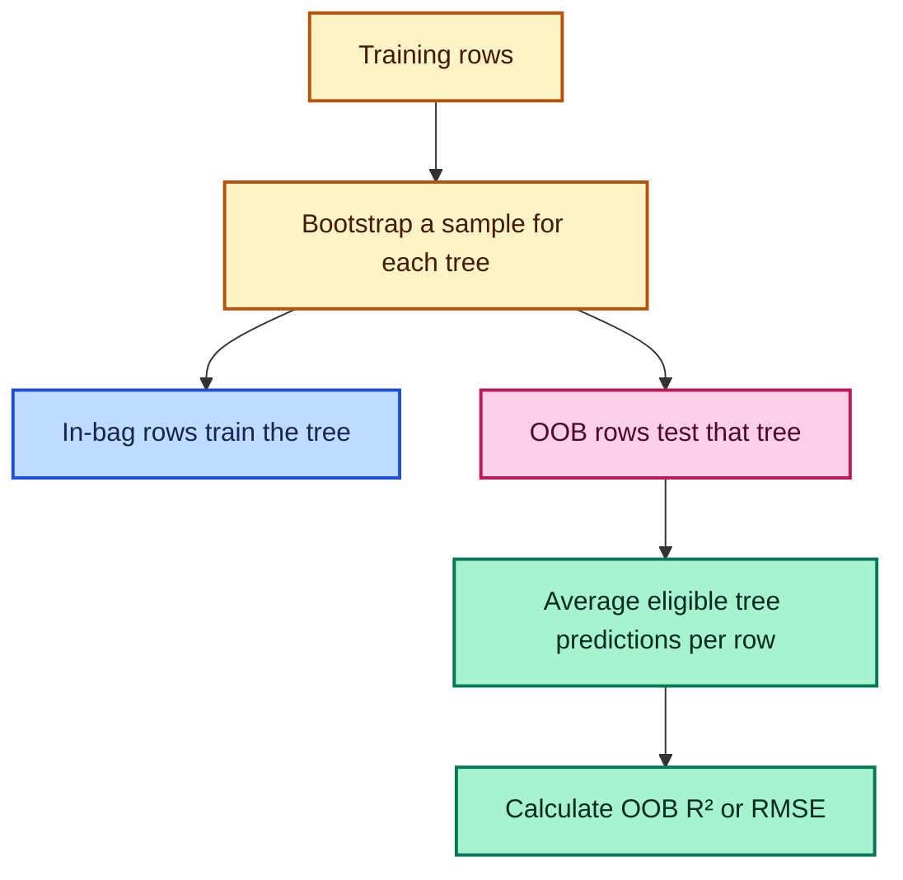
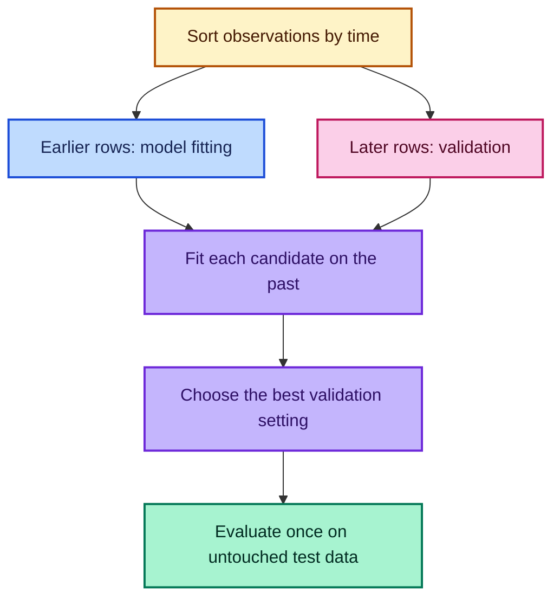

# Intro to Machine Learning — Lesson 2

## Random Forests from First Principles

> Detailed notes derived from **“Intro to Machine Learning: Lesson 2”**: validation design, decision-tree construction, bagging, bootstrap samples, out-of-bag evaluation, and random-forest hyperparameters.

**Lecture source:** [YouTube — Intro to Machine Learning: Lesson 2](https://www.youtube.com/watch/blyXCk4sgEg)

---

## Compatibility Note

The lecture uses an early fast.ai/scikit-learn environment. The mathematical ideas remain useful, but some code has changed:

- the historical default of 10 forest trees is now 100;
- `criterion="mse"` is now `criterion="squared_error"`;
- the old fast.ai `set_rf_samples(...)` patch is replaced by the supported `max_samples` parameter;
- the current forest API exposes `oob_score_` and `oob_prediction_` when out-of-bag scoring is enabled.

The modern examples below follow the current official [`RandomForestRegressor` documentation](https://scikit-learn.org/stable/modules/generated/sklearn.ensemble.RandomForestRegressor.html) and [`DecisionTreeRegressor` documentation](https://scikit-learn.org/stable/modules/generated/sklearn.tree.DecisionTreeRegressor.html).

---

## Table of Contents

1. [Learning Outcomes](#learning-outcomes)
2. [Lesson Map](#lesson-map)
3. [Pipeline Recap](#1-pipeline-recap)
4. [Understanding R²](#2-understanding-r)
5. [Validation, Test Sets, and Adaptive Overfitting](#3-validation-test-sets-and-adaptive-overfitting)
6. [Parameters and Hyperparameters](#4-parameters-and-hyperparameters)
7. [Fast Experimental Loops](#5-fast-experimental-loops)
8. [How a Regression Tree Is Built](#6-how-a-regression-tree-is-built)
9. [Tree Depth and Overfitting](#7-tree-depth-and-overfitting)
10. [Bagging and Random Forests](#8-bagging-and-random-forests)
11. [Out-of-Bag Evaluation](#9-out-of-bag-evaluation)
12. [Important Forest Hyperparameters](#10-important-forest-hyperparameters)
13. [Extra Trees](#11-extra-trees)
14. [Categorical Codes in Trees](#12-categorical-codes-in-trees)
15. [Hyperparameter Search](#13-hyperparameter-search-with-time-aware-validation)
16. [Complete Modern Experiment](#14-complete-modern-experiment)
17. [Common Mistakes](#15-common-mistakes)
18. [Exercises](#16-practice-exercises)
19. [Quick Reference](#17-quick-reference)
20. [Fun Facts](#18-fun-facts)
21. [Resources](#resources)

---

## Learning Outcomes

After studying these notes, you should be able to:

- derive and interpret the coefficient of determination, `R²`;
- explain why `R²` can be negative;
- design training, validation, and test sets that resemble deployment;
- distinguish learned parameters from chosen hyperparameters;
- construct the greedy split rule of a regression tree;
- calculate node MSE, weighted child MSE, and impurity reduction;
- explain why an unrestricted tree can memorize training data;
- derive why a bootstrap sample contains about 63.2% unique rows;
- explain how bagging reduces variance;
- manually reproduce a forest prediction by averaging tree predictions;
- use and interpret out-of-bag predictions;
- reason about `n_estimators`, `min_samples_leaf`, `max_features`, and `max_samples`;
- compare random forests with extremely randomized trees;
- run time-aware hyperparameter experiments without leaking the future.

---

## Lesson Map



---

## 1. Pipeline Recap

Lesson 2 begins with the working baseline from Lesson 1:

1. load the Blue Book for Bulldozers data;
2. parse `saledate` as a datetime;
3. transform `SalePrice` into log space;
4. expand the date into numeric parts;
5. convert strings into categorical codes;
6. fill missing numeric values with medians and add missingness flags;
7. preserve the most recent 12,000 rows as validation;
8. fit `RandomForestRegressor`;
9. compare training and validation metrics.

The competition’s metric is Root Mean Squared Logarithmic Error:

$$
\operatorname{RMSLE}
=
\sqrt{
\frac{1}{n}
\sum_{i=1}^{n}
\left[
\ln(1+y_i)-\ln(1+\hat y_i)
\right]^2
}
$$

If the target is transformed to `z_i=\ln(1+y_i)`, ordinary RMSE in `z`-space matches RMSLE after consistent inverse transformation.

```python
import numpy as np

# Move the positive price target into log1p space.
y_log = np.log1p(df["SalePrice"].astype("float64"))

# Convert a predicted log price back to ordinary currency units.
predicted_price = np.expm1(predicted_log_price)
```

> The lesson’s main question is no longer “Can we fit a forest?” It is “Why does it work, how can it fail, and which controls change its behavior?”

---

## 2. Understanding `R²`

### What Is `R²`?

The coefficient of determination compares the model with a simple baseline that predicts the target mean for every row:

$$
R^2
=
1-
\frac{\operatorname{SS}_{\text{res}}}
{\operatorname{SS}_{\text{tot}}}
$$

where:

$$
\operatorname{SS}_{\text{res}}
=
\sum_{i=1}^{n}(y_i-\hat y_i)^2
$$

and:

$$
\operatorname{SS}_{\text{tot}}
=
\sum_{i=1}^{n}(y_i-\bar y)^2
$$

### Why This Formula?

- `SS_res` measures the fitted model’s squared error.
- `SS_tot` measures the mean-only baseline’s squared error.
- Their ratio asks, “What fraction of baseline error remains?”
- Subtracting from one converts remaining error into improvement over the baseline.

### Interpreting the Range

| Value | Meaning |
|-------|---------|
| `R²=1` | Perfect predictions |
| `R²=0` | Same squared error as predicting the mean |
| `0<R²<1` | Better than the mean baseline |
| `R²<0` | Worse than the mean baseline |

There is no finite lower bound. A model can make arbitrarily bad predictions, so:

$$
R^2\in(-\infty,1]
$$

### Worked Example

Let:

$$
y=[3,2,4,1],
\qquad
\bar y=2.5,
\qquad
\hat y=[2.5,2.5,3.5,1.5]
$$

Then:

$$
\operatorname{SS}_{\text{res}}
=
0.25+0.25+0.25+0.25
=1
$$

and:

$$
\operatorname{SS}_{\text{tot}}
=
0.25+0.25+2.25+2.25
=5
$$

Therefore:

$$
R^2=1-\frac{1}{5}=0.8
$$

### How to Implement It

```python
import numpy as np

def r_squared(actual, predicted):
    """Calculate R² directly from its definition."""

    # Convert inputs to floating-point arrays.
    actual = np.asarray(actual, dtype="float64")
    predicted = np.asarray(predicted, dtype="float64")

    # Calculate the model's residual squared error.
    ss_res = np.sum((actual - predicted) ** 2)

    # Calculate the mean-baseline squared error.
    ss_tot = np.sum((actual - actual.mean()) ** 2)

    # Report improvement relative to the mean baseline.
    return 1.0 - ss_res / ss_tot
```

### When Is `R²` Useful?

Use it to build intuition across regression datasets because it is scale-free. Do not assume it is the business objective. For the bulldozer competition, log RMSE/RMSLE is the primary metric; `R²` is a helpful diagnostic.

---

## 3. Validation, Test Sets, and Adaptive Overfitting

### What Is Each Split For?

| Dataset | Purpose | Frequency of Inspection |
|---------|---------|-------------------------|
| Training | Fit preprocessing and model parameters | Constantly |
| Validation | Choose features and hyperparameters | Repeatedly |
| Test | Final unbiased audit | Ideally once |
| Public leaderboard | Competition feedback | Limited |
| Private leaderboard | Final competition ranking | Hidden until the end |

### Why Can Validation Be Overfit?

Every decision based on validation results transfers information from that set into the modeling process. If you try thousands of configurations, one may look good by chance.

This is **adaptive overfitting**:

1. evaluate a configuration;
2. observe validation error;
3. change the model using that information;
4. repeat until validation becomes part of the training loop.

The test set exists to measure the entire adaptive process after choices are finished.



### Why Split by Time?

The intended deployment predicts **future** auction prices. Therefore, validation must also represent later time:

$$
\mathcal D_{\text{train}}
=
\{(\mathbf x_i,y_i):t_i\le T\}
$$

$$
\mathcal D_{\text{valid}}
=
\{(\mathbf x_i,y_i):T<t_i\le T'\}
$$

A random split is easier because the training set contains observations from the same periods as validation. That estimate may fail when markets, products, customers, or policies drift.

```python
# Sort first; slicing is chronological only when the rows are ordered by time.
ordered = df.sort_values("saledate").reset_index(drop=True)

# Match the competition's future holdout size.
n_valid = 12_000
split_at = len(ordered) - n_valid

# Earlier rows train the model; later rows simulate future deployment.
train_frame = ordered.iloc[:split_at].copy()
valid_frame = ordered.iloc[split_at:].copy()
```

### P-Hacking Connection

The transcript connects test-set discipline with the replication crisis: repeatedly trying analyses until one appears significant is analogous to tuning repeatedly on one holdout. The broader lesson is:

> A result is trustworthy only when the evaluation process was protected from the decisions that created the result.

---

## 4. Parameters and Hyperparameters

### Parameters

Parameters are learned from data during `fit`:

- tree split features;
- split thresholds;
- leaf predictions;
- category mappings and medians in a fitted preprocessing pipeline.

We can write them abstractly as `\theta`:

$$
\hat\theta
=
\arg\min_{\theta}\mathcal L(\theta;\mathcal D_{\text{train}})
$$

### Hyperparameters

Hyperparameters control how learning occurs and are chosen outside the fitting algorithm:

- `n_estimators`;
- `max_depth`;
- `min_samples_leaf`;
- `max_features`;
- `max_samples`;
- `bootstrap`.

| Question | Parameter or Hyperparameter? |
|----------|------------------------------|
| “Which feature is used at the root?” | Learned parameter |
| “How many trees should be built?” | Hyperparameter |
| “What value should a leaf predict?” | Learned parameter |
| “What is the minimum leaf size?” | Hyperparameter |

### Why the Distinction Matters

Parameters are learned using training data. Hyperparameters are selected using validation data or an appropriate cross-validation scheme. The final test set should influence neither.

---

## 5. Fast Experimental Loops

### What?

Train small, approximate models while exploring, then rerun the chosen configuration at full scale.

### Why?

Interactive analysis depends on rapid feedback. A ten-minute experiment discourages curiosity; a two-second experiment makes ten careful checks practical.

### How?

Subsample only the **training** portion while keeping validation fixed:

```python
# Draw a reproducible training sample for rapid experiments.
quick_train = train_frame.sample(
    n=min(30_000, len(train_frame)),
    random_state=42,
)

# Do not resample validation between experiments.
# A fixed validation set makes model scores comparable.
quick_valid = valid_frame
```

Modern scikit-learn can also draw a new bootstrap subsample for each tree with `max_samples`. This directly replaces the transcript’s historical `set_rf_samples` helper:

```python
from sklearn.ensemble import RandomForestRegressor

# Each tree draws at most 20,000 training rows with replacement.
quick_forest = RandomForestRegressor(
    n_estimators=40,
    max_samples=min(20_000, len(X_train)),
    bootstrap=True,
    n_jobs=-1,
    random_state=42,
)
```

### When?

Use approximate runs for:

- understanding tree behavior;
- debugging preprocessing;
- comparing promising hyperparameters;
- feature-importance and error-analysis experiments.

Run full data and larger forests for:

- final validation estimates;
- test evaluation;
- submission or deployment artifacts.

> Approximation is useful only when it preserves the evaluation design. Never make the validation set easier merely to gain speed.

---

## 6. How a Regression Tree Is Built

### 6.1 The Zero-Split Tree

With no splits, the squared-error-optimal constant prediction is the node mean:

$$
\hat y_N
=
\bar y_N
=
\frac{1}{n_N}\sum_{i\in N}y_i
$$

Its impurity is node MSE:

$$
I(N)
=
\frac{1}{n_N}
\sum_{i\in N}(y_i-\bar y_N)^2
$$

### 6.2 A Candidate Binary Split

For feature `j` and threshold `s`:

$$
L(j,s)=\{i:x_{ij}\le s\}
$$

$$
R(j,s)=\{i:x_{ij}>s\}
$$

The weighted child impurity is:

$$
I_{\text{children}}(j,s)
=
\frac{n_L}{n_N}I(L)
+
\frac{n_R}{n_N}I(R)
$$

The impurity reduction, or gain, is:

$$
\Delta I(j,s)
=
I(N)-I_{\text{children}}(j,s)
$$

The greedy tree chooses the feature and threshold with the largest gain.

### Worked Split Example

Suppose the targets at one node are:

$$
y=[2,3,10,11]
$$

The root mean is `6.5`, and:

$$
I(N)=16.25
$$

A split producing `L=[2,3]` and `R=[10,11]` gives:

$$
I(L)=I(R)=0.25
$$

Therefore:

$$
I_{\text{children}}
=
\frac{2}{4}(0.25)+\frac{2}{4}(0.25)
=0.25
$$

and:

$$
\Delta I=16.25-0.25=16
$$

That split is extremely useful because it turns one heterogeneous group into two internally consistent groups.

### Why Weight the Children?

Without weighting, a split that isolates one unusual row could appear impressive. Weighting ensures that an improvement affecting one row does not automatically dominate a modest improvement affecting thousands.

### 6.3 Greedy Split Algorithm

```python
import numpy as np

def node_mse(target):
    """Return mean squared deviation from a node's mean."""

    # Empty nodes are invalid candidate children.
    if len(target) == 0:
        return np.inf

    # A regression leaf predicts its target mean.
    leaf_value = np.mean(target)

    # Impurity is the average squared error around that prediction.
    return np.mean((target - leaf_value) ** 2)


def best_split_one_feature(feature, target):
    """Find the best threshold for one numeric feature."""

    # Convert inputs to arrays for positional indexing.
    feature = np.asarray(feature)
    target = np.asarray(target)

    # Candidate thresholds sit between sorted unique feature values.
    values = np.unique(feature)
    thresholds = (values[:-1] + values[1:]) / 2

    best_threshold = None
    best_score = np.inf

    for threshold in thresholds:
        # Send values at or below the threshold left.
        left = feature <= threshold

        # Send all remaining rows right.
        right = ~left

        # Weight each child by its fraction of node rows.
        weighted_mse = (
            left.mean() * node_mse(target[left])
            + right.mean() * node_mse(target[right])
        )

        # Keep the threshold with the lowest child impurity.
        if weighted_mse < best_score:
            best_score = weighted_mse
            best_threshold = threshold

    return best_threshold, best_score
```

A real tree repeats this search across every eligible feature, selects the best feature-threshold pair, and recursively repeats the process in both child nodes.



### Why Binary Splits Are Sufficient

A three-way partition can be represented by two binary splits. Binary trees keep the algorithm simple without preventing complex partitions.

### Stopping Conditions

A tree stops when one or more rules apply:

- `max_depth` is reached;
- too few samples remain to split;
- a split would violate `min_samples_leaf`;
- no split yields sufficient impurity decrease;
- every leaf is effectively pure.

---

## 7. Tree Depth and Overfitting

An unrestricted regression tree can often create leaves containing one training row. It then predicts every training target exactly:

$$
\operatorname{RMSE}_{\text{train}}=0,
\qquad
R^2_{\text{train}}=1
$$

This does not imply perfect generalization. The model may have learned noise and sample-specific boundaries.

| Tree | Bias | Variance | Typical Behavior |
|------|------|----------|------------------|
| Very shallow | High | Low | Underfits |
| Moderate depth | Moderate | Moderate | May generalize well |
| Fully grown | Low | High | Memorizes training rows |

### Build and Display a Small Tree

```python
import matplotlib.pyplot as plt
from sklearn.tree import DecisionTreeRegressor, plot_tree

# Restrict depth so the full tree remains readable.
small_tree = DecisionTreeRegressor(
    max_depth=3,
    random_state=42,
)

# Fit the interpretable tree on the quick training sample.
small_tree.fit(X_quick, y_quick)

# Draw split rules, sample counts, and leaf values.
plt.figure(figsize=(22, 10))
plot_tree(
    small_tree,
    feature_names=X_quick.columns,
    filled=True,
    rounded=True,
)
plt.show()
```

Use a shallow tree to understand mechanics, not as evidence that the shallow model is the best predictor.

---

## 8. Bagging and Random Forests

### What Is Bagging?

**Bagging** means bootstrap aggregating:

1. sample training rows with replacement;
2. fit one high-variance model on that sample;
3. repeat independently;
4. aggregate predictions.

For regression, aggregation is the mean:

$$
\hat y_{\text{forest}}(\mathbf x)
=
\frac{1}{B}
\sum_{b=1}^{B}T_b(\mathbf x)
$$

### Bootstrap Sampling

A bootstrap sample draws `n` times with replacement from `n` rows. Some rows appear repeatedly and some are absent.

The probability a specific row is absent is:

$$
\left(1-\frac{1}{n}\right)^n
\longrightarrow
e^{-1}
\approx0.368
$$

Therefore, the expected fraction represented at least once is:

$$
1-e^{-1}\approx0.632
$$

or about **63.2% unique rows**.

### Why Averaging Works

Deep trees can be individually noisy. Bagging is effective when:

- each tree contains genuine predictive signal;
- their errors are not perfectly correlated.

For trees with variance `\sigma^2` and average pairwise correlation `\rho`:

$$
\operatorname{Var}(\bar T)
\approx
\rho\sigma^2
+
\frac{1-\rho}{B}\sigma^2
$$

Increasing `B` reduces the second term. Random rows and random feature subsets try to reduce `\rho`.



### Inspect the Individual Trees

```python
import numpy as np

# Component trees are fitted internally on NumPy arrays, so convert once.
X_valid_array = np.asarray(X_valid)

# Ask every fitted tree for its validation predictions.
tree_predictions = np.stack([
    tree.predict(X_valid_array)
    for tree in forest.estimators_
])

# Shape is: (number of trees, number of validation rows).
print(tree_predictions.shape)

# Recreate the forest prediction by averaging down the tree axis.
manual_forest_prediction = tree_predictions.mean(axis=0)

# Confirm that manual averaging matches the forest's predict method.
np.testing.assert_allclose(
    manual_forest_prediction,
    forest.predict(X_valid),
)
```

### Plot Improvement as Trees Are Added

```python
from sklearn.metrics import r2_score

# Measure the ensemble formed by the first 1, 2, ..., B trees.
progressive_r2 = [
    r2_score(
        y_valid,
        tree_predictions[:count].mean(axis=0),
    )
    for count in range(1, len(tree_predictions) + 1)
]

# Plot diminishing returns from additional trees.
plt.plot(
    range(1, len(progressive_r2) + 1),
    progressive_r2,
)
plt.xlabel("Number of trees averaged")
plt.ylabel("Validation R²")
plt.title("Forest performance versus tree count")
plt.show()
```

Performance usually improves quickly and then plateaus. More trees rarely cause classical overfitting, but they consume training time, prediction time, and memory.

---

## 9. Out-of-Bag Evaluation

### What Is an Out-of-Bag Row?

Every bootstrap tree is trained on a sample drawn **with replacement**. Consequently, some training rows are absent from that tree's sample. Those absent observations are the tree's **out-of-bag**, or **OOB**, rows.

For training row $i$, define the set of trees that did not use it as

$$
\mathcal{B}_i
=
\left\{b : i \notin S_b\right\},
$$

where $S_b$ is the bootstrap sample used to train tree $b$. Its OOB prediction is

$$
\hat y_i^{\text{OOB}}
=
\frac{1}{|\mathcal{B}_i|}
\sum_{b\in\mathcal{B}_i} T_b(x_i).
$$

The crucial point is that row $i$ is evaluated only by trees that **did not train on it**. This creates an internal validation-like prediction without holding out one fixed random block.



### Why Is OOB Evaluation Useful?

- It reuses nearly all training rows for fitting across the forest.
- It offers a quick diagnostic while models are being developed.
- It can be valuable when data is limited and a large random holdout would be expensive.
- It produces a prediction for each training row from models for which that row was unseen.

### How to Calculate It in scikit-learn

```python
import numpy as np
from sklearn.ensemble import RandomForestRegressor
from sklearn.metrics import mean_squared_error

# OOB scoring requires bootstrap sampling because a tree needs omitted rows.
oob_forest = RandomForestRegressor(
    n_estimators=300,       # Use enough trees so most rows receive many OOB votes.
    bootstrap=True,         # Sample rows with replacement for each tree.
    oob_score=True,         # Ask scikit-learn to retain OOB metrics and predictions.
    max_samples=0.75,       # Draw 75% as many rows as the training-set size per tree.
    min_samples_leaf=3,     # Smooth each tree by averaging at least three observations.
    max_features=0.5,       # Test a random half of the features at each split.
    n_jobs=-1,              # Use all available CPU cores.
    random_state=42,        # Make the random experiment reproducible.
)

# Fit only on the training period, never on the final test set.
oob_forest.fit(X_train, y_train)

# This is R² computed from the OOB predictions by default.
print(f"OOB R²: {oob_forest.oob_score_:.4f}")

# Retrieve one aggregated OOB prediction per training row.
oob_predictions = oob_forest.oob_prediction_

# A very small forest can leave a row without a reliable OOB estimate;
# this finite-value check makes the RMSE calculation robust.
valid_oob = np.isfinite(oob_predictions)
oob_rmse = mean_squared_error(
    y_train[valid_oob],
    oob_predictions[valid_oob],
) ** 0.5

print(f"OOB RMSE: {oob_rmse:.4f}")
```

The current forest API documents both [`oob_score_` and `oob_prediction_`](https://scikit-learn.org/stable/modules/generated/sklearn.ensemble.RandomForestRegressor.html). A callable can also be supplied to `oob_score` in current versions when a metric other than the default $R^2$ is desired.

### When OOB Is Not Enough

OOB evaluation randomly omits observations **within the training period**. It does not recreate every deployment shift.

For a forecasting problem, use the later time block as the primary validation set because it tests the real question: “Can a model trained on the past predict the future?” Treat OOB as a supporting diagnostic, not as permission to discard a realistic temporal validation design.

> **Rule of thumb:** if OOB and time-based validation disagree, trust the split that best resembles deployment and investigate distribution drift.

---

## 10. Important Forest Hyperparameters

Hyperparameters control the forest's size, the complexity of each tree, and the amount of randomness among trees.

| Hyperparameter | What it controls | Why it matters | Useful experiment |
|---|---|---|---|
| `n_estimators` | Number of trees | More averaging usually lowers Monte Carlo noise | Plot validation score against tree count |
| `min_samples_leaf` | Minimum rows in a leaf | Larger leaves smooth predictions and lower variance | Try `1, 3, 5, 10, 25` |
| `max_features` | Candidate-feature fraction per split | Smaller values decorrelate trees but may weaken each tree | Try `1.0, 0.5, "sqrt"` |
| `max_samples` | Bootstrap draw size per tree | Smaller samples add row-level diversity and speed training | Try `0.5, 0.75, 1.0` |
| `max_depth` | Longest root-to-leaf path | A direct limit on tree complexity | Use mainly for deliberately small or constrained trees |
| `bootstrap` | Whether rows are sampled with replacement | Enables classical bagging and OOB evaluation | Usually `True` for random forests |
| `random_state` | Pseudorandom sequence | Makes comparisons repeatable | Keep fixed while comparing settings |
| `n_jobs` | Parallel workers | Changes speed, not the mathematical model | Use `-1` for all available cores |

### 10.1 `n_estimators`: How Many Trees?

With $B$ trees, prediction is

$$
\hat f_B(x)=\frac{1}{B}\sum_{b=1}^{B}T_b(x).
$$

Increasing $B$ stabilizes this average. The first few additional trees often help greatly; later additions offer diminishing returns. Once validation score and predictions are stable, more trees mainly cost memory and computation.

**When to increase it:** validation score is still improving, OOB estimates are noisy, or repeated seeds produce noticeably different predictions.

**When to stop:** the metric has plateaued and run time or model size matters.

### 10.2 `min_samples_leaf`: Smoother Predictions

A regression leaf predicts its target mean. If leaf $L$ contains $n_L$ rows, then

$$
\hat y_L=\frac{1}{n_L}\sum_{i\in L}y_i.
$$

With `min_samples_leaf=1`, a deep tree may create one-row leaves and memorize the training set. Requiring at least 3, 5, or 10 rows forces every prediction to average nearby examples.

- **Larger leaf:** lower variance, higher bias, shallower tree, faster prediction.
- **Smaller leaf:** lower bias on training data, higher variance, more detailed partitions.

This is a bias–variance control, not a universally increasing “quality” knob. Select it with realistic validation.

### 10.3 `max_features`: Decorrelating the Trees

At each split, a forest may consider only a random subset of the $p$ columns. For a fractional value $q$,

$$
m=\max\left(1,\lfloor qp\rfloor\right)
$$

features are candidates for that split.

This does **not** mean a tree permanently loses the other features. A new random subset is selected at every node, and the same feature may be used repeatedly along one path.

Why it helps: if one dominant feature wins the root split in every tree, the trees become similar. Restricting candidates sometimes forces alternative, nearly-as-useful predictors to lead. Individual trees can become slightly weaker, yet their errors become less correlated, improving the average.

### 10.4 `max_samples`: Row-Level Diversity

The transcript uses the historical fast.ai helper `set_rf_samples(20_000)`. Its purpose was to train every tree on a different 20,000-row bootstrap draw. Modern scikit-learn provides the public `max_samples` parameter:

```python
from sklearn.ensemble import RandomForestRegressor

# Modern replacement for the lecture's historical set_rf_samples(20_000).
sampled_forest = RandomForestRegressor(
    n_estimators=300,   # Average many independently randomized trees.
    bootstrap=True,     # Required when max_samples controls bootstrap size.
    max_samples=20_000, # Draw 20,000 rows, with replacement, for every tree.
    n_jobs=-1,          # Train independent trees in parallel.
    random_state=42,    # Reproduce the same bootstrap draws.
)

# Fit against the full training matrix; sampling happens inside every tree.
sampled_forest.fit(X_train, y_train)
```

If the training set contains fewer than 20,000 rows, use `min(20_000, len(X_train))` or a fraction such as `0.75`. According to the current [random-forest API](https://scikit-learn.org/stable/modules/generated/sklearn.ensemble.RandomForestRegressor.html), `max_samples=None` draws the full training-set size when bootstrapping.

### 10.5 A Sensible Comparison

```python
from sklearn.ensemble import RandomForestRegressor

# Start with a transparent baseline before changing multiple controls.
baseline_forest = RandomForestRegressor(
    n_estimators=100,   # Current default-sized ensemble.
    n_jobs=-1,          # Parallelize tree construction.
    random_state=42,    # Hold randomness constant for a fair comparison.
)

# Build a more randomized, smoother forest suggested by the lesson.
tuned_forest = RandomForestRegressor(
    n_estimators=300,       # Reduce noise in the ensemble average.
    min_samples_leaf=3,     # Prevent one-row leaves.
    max_features=0.5,       # Consider half the columns at each node.
    bootstrap=True,         # Draw rows with replacement.
    max_samples=0.75,       # Give each tree a different 75% bootstrap draw.
    oob_score=True,         # Keep an internal OOB diagnostic.
    n_jobs=-1,              # Use all CPU cores.
    random_state=42,        # Make the experiment repeatable.
)

# Compare both models on the same unchanged training and validation sets.
for name, model in {
    "baseline": baseline_forest,
    "tuned": tuned_forest,
}.items():
    model.fit(X_train, y_train)
    print(name, score(model))
```

Do not infer that the “tuned” version must win. It encodes plausible hypotheses—more averaging, smoother leaves, and less-correlated trees—that validation must confirm.

### Historical Names and Current Equivalents

| Transcript-era expression | Current expression | Meaning |
|---|---|---|
| default `n_estimators=10` | default `n_estimators=100` | Number of trees |
| `criterion="mse"` | `criterion="squared_error"` | Minimize squared-error impurity |
| `set_rf_samples(n)` | `max_samples=n` with `bootstrap=True` | Bootstrap draw size per tree |
| manual tree loop | `estimators_` | Access fitted component trees |

The defaults are conveniences, not universal optima. Record explicit values in important experiments so a future library change cannot silently alter the model.

---

## 11. Extra Trees

An **Extremely Randomized Trees** ensemble adds more randomness to ordinary tree construction. Instead of searching every possible threshold for each candidate feature, it samples random thresholds and chooses among them.

### Random Forest Versus Extra Trees

| Property | Random forest | Extra Trees |
|---|---|---|
| Row sampling | Bootstrap by default | Full sample by default |
| Split threshold | Searches for the best candidate threshold | Draws random thresholds, then picks the best sampled choice |
| Individual tree strength | Often stronger | Often slightly weaker |
| Tree correlation | Reduced | Usually reduced further |
| Training speed | Fast | Often faster |
| Final performance | Dataset-dependent | Dataset-dependent—validate both |

The official [`ExtraTreesRegressor` documentation](https://scikit-learn.org/stable/modules/generated/sklearn.ensemble.ExtraTreesRegressor.html) describes its use of random thresholds. The central ensemble intuition is familiar:

$$
\text{useful ensemble}
=
\text{reasonably accurate trees}
+
\text{diverse errors}.
$$

```python
from sklearn.ensemble import ExtraTreesRegressor, RandomForestRegressor

# Define two ensembles with comparable sizes and leaf smoothing.
models = {
    "random_forest": RandomForestRegressor(
        n_estimators=300,       # Average 300 optimized-split trees.
        min_samples_leaf=3,     # Apply the same smoothing to both models.
        max_features=0.5,       # Randomize feature candidates at every split.
        bootstrap=True,         # Use bootstrap row samples.
        max_samples=0.75,       # Give each tree a 75% draw.
        n_jobs=-1,              # Train trees in parallel.
        random_state=42,        # Reproduce the experiment.
    ),
    "extra_trees": ExtraTreesRegressor(
        n_estimators=300,       # Average 300 random-threshold trees.
        min_samples_leaf=3,     # Keep the leaf-size comparison fair.
        max_features=0.5,       # Randomize feature candidates.
        bootstrap=False,        # Extra Trees uses all rows by default.
        n_jobs=-1,              # Train trees in parallel.
        random_state=42,        # Reproduce random thresholds.
    ),
}

# Fit and score both on exactly the same temporal validation block.
for name, model in models.items():
    model.fit(X_train, y_train)
    print(name, score(model))
```

OOB scoring is unavailable when `bootstrap=False` because no observations are intentionally left out of a tree's training data. It can be enabled for Extra Trees only when bootstrapping is also enabled.

---

## 12. Categorical Codes in Trees

The lecture preprocessing converts a categorical feature into integer codes. For example:

| Color | Code |
|---|---:|
| blue | 0 |
| green | 1 |
| orange | 2 |
| red | 3 |

A numeric split such as `color_code <= 1.5` groups blue and green against orange and red.

### Ordered Categories

For a genuinely ordered feature such as machine condition,

$$
\text{poor}<\text{fair}<\text{good}<\text{excellent},
$$

ordinal codes preserve useful structure. A threshold can naturally separate lower from higher condition.

### Unordered Categories

For a nominal variable, the numeric order is arbitrary. Suppose category `F` has code 6 among codes 0 through 8. A tree can isolate it using two splits:

$$
x>5.5
\quad\text{and then}\quad
x\le 6.5.
$$

Thus repeated binary thresholds can express complex category groups. However, the imposed order may make some groupings inefficient and may require deeper trees.

```python
# Convert text to a pandas categorical column.
df["ProductGroup"] = df["ProductGroup"].astype("category")

# Store category codes for a tree model; missing values receive code -1.
df["ProductGroup_code"] = df["ProductGroup"].cat.codes

# Preserve the mapping so a code can be interpreted later.
code_to_label = dict(
    enumerate(df["ProductGroup"].cat.categories)
)

# Inspect the exact, potentially arbitrary, code assignment.
print(code_to_label)
```

**When to use codes:** tree-based baselines, genuinely ordered categories, or high-cardinality variables where one-hot matrices become very wide.

**When to be cautious:** nominal categories with no meaningful order, unseen categories at inference, or when preprocessing is not fitted and reused consistently. Compare ordinal codes with alternatives such as one-hot encoding using the same validation design.

> A category code is an identifier, not a measured distance. Code 8 is not “twice as much” as code 4.

---

## 13. Hyperparameter Search with Time-Aware Validation

### Grid Search

Grid search evaluates every listed combination. If hyperparameter $k$ has $m_k$ choices, the number of configurations is

$$
N_{\text{configurations}}
=
\prod_{k=1}^{K}m_k.
$$

Four parameters with five values each already produce $5^4=625$ configurations. With several validation folds and hundreds of trees, this becomes expensive.

[`GridSearchCV`](https://scikit-learn.org/stable/modules/generated/sklearn.model_selection.GridSearchCV.html) exhaustively searches its supplied grid. [`RandomizedSearchCV`](https://scikit-learn.org/stable/modules/generated/sklearn.model_selection.RandomizedSearchCV.html) instead evaluates a fixed number, `n_iter`, of sampled configurations and is often a more practical first pass.

### The Time-Series Trap

Default random cross-validation can leak future market conditions into training. Hyperparameter search must use the same temporal logic as manual validation.



### Search While Preserving One Fixed Time Split

```python
import numpy as np
from sklearn.ensemble import RandomForestRegressor
from sklearn.model_selection import PredefinedSplit, RandomizedSearchCV

# X_search and y_search must contain only training plus validation rows,
# sorted from oldest to newest; never append the final test set here.
n_validation = 12_000

# A value of -1 means "always train"; 0 means "use in validation fold 0."
fold_assignment = np.full(len(X_search), -1, dtype=int)
fold_assignment[-n_validation:] = 0
time_cv = PredefinedSplit(test_fold=fold_assignment)

# Keep the base estimator reproducible and parallelize at the search level.
base_forest = RandomForestRegressor(
    n_jobs=1,          # Avoid nested parallelism inside each search job.
    random_state=42,   # Make every candidate comparison repeatable.
)

# Describe plausible settings; RandomizedSearchCV samples from these lists.
parameter_space = {
    "n_estimators": [100, 200, 400],
    "min_samples_leaf": [1, 3, 5, 10],
    "max_features": [1.0, 0.5, "sqrt"],
    "max_samples": [None, 0.5, 0.75],
}

# Evaluate 16 sampled configurations on the fixed future validation block.
search = RandomizedSearchCV(
    estimator=base_forest,
    param_distributions=parameter_space,
    n_iter=16,                          # Bound the total experiment cost.
    scoring="neg_root_mean_squared_error", # Larger is better, so RMSE is negated.
    cv=time_cv,                         # Preserve chronological validation.
    n_jobs=-1,                          # Evaluate independent candidates in parallel.
    random_state=42,                    # Reproduce sampled configurations.
    refit=True,                         # Refit the best setting after selection.
    return_train_score=True,            # Retain train scores for overfit diagnosis.
)

# Run search without exposing the untouched final test data.
search.fit(X_search, y_search)

# Negate the stored score to display ordinary positive RMSE.
print("Best validation RMSE:", -search.best_score_)
print("Best settings:", search.best_params_)
```

One subtlety: with `refit=True`, the selected estimator is refitted on all rows passed to `fit`, including the predefined validation block. This is appropriate **after** selection when the final test remains untouched. If you still need to compare further ideas on that validation block, refit manually on only the earlier rows instead.

---

## 14. Complete Modern Experiment

This compact workflow combines the lesson's major practices. It assumes:

- `X` is a numeric pandas DataFrame produced by a consistent preprocessing pipeline;
- `y_log` is the log-transformed target;
- both are ordered chronologically from oldest to newest;
- the final competition or deployment test set remains elsewhere.

```python
import numpy as np
from sklearn.ensemble import ExtraTreesRegressor, RandomForestRegressor
from sklearn.metrics import mean_squared_error, r2_score


def rmse(actual, predicted):
    """Return root mean squared error in the target's current scale."""
    # Convert MSE back to the target's units by taking its square root.
    return mean_squared_error(actual, predicted) ** 0.5


def split_last_n(X, y, n_valid):
    """Reserve the newest n_valid rows as a temporal validation set."""
    # Positional slicing is safe because X and y are already time-ordered.
    X_train = X.iloc[:-n_valid].copy()
    X_valid = X.iloc[-n_valid:].copy()
    y_train = y.iloc[:-n_valid].copy()
    y_valid = y.iloc[-n_valid:].copy()
    return X_train, X_valid, y_train, y_valid


def evaluate(name, model, X_train, y_train, X_valid, y_valid):
    """Fit one model and report train/validation RMSE and R²."""
    # Learn only from the earlier training period.
    model.fit(X_train, y_train)

    # Generate predictions for both diagnosis and honest validation.
    train_prediction = model.predict(X_train)
    valid_prediction = model.predict(X_valid)

    # Keep metrics together so competing models are easy to compare.
    result = {
        "model": name,
        "train_rmse": rmse(y_train, train_prediction),
        "valid_rmse": rmse(y_valid, valid_prediction),
        "train_r2": r2_score(y_train, train_prediction),
        "valid_r2": r2_score(y_valid, valid_prediction),
    }

    # Add OOB R² only for estimators configured to calculate it.
    if hasattr(model, "oob_score_"):
        result["oob_r2"] = model.oob_score_

    return result


# Preserve the latest 12,000 observations as a deployment-like validation set.
X_train, X_valid, y_train, y_valid = split_last_n(
    X,
    y_log,
    n_valid=12_000,
)

# Ensure an integer sample limit never exceeds the number of training rows.
tree_sample_size = min(20_000, len(X_train))

# Define hypotheses before looking at validation results.
models = {
    "baseline_forest": RandomForestRegressor(
        n_estimators=100,       # Establish a conventional reference model.
        n_jobs=-1,              # Parallelize independent trees.
        random_state=42,        # Fix randomness for a fair comparison.
    ),
    "smoothed_forest": RandomForestRegressor(
        n_estimators=300,       # Stabilize the ensemble average.
        min_samples_leaf=3,     # Smooth leaves with at least three examples.
        max_features=0.5,       # Decorrelate trees at each split.
        bootstrap=True,         # Use row sampling with replacement.
        max_samples=tree_sample_size, # Use a fresh bounded sample per tree.
        oob_score=True,         # Retain an internal OOB diagnostic.
        n_jobs=-1,              # Use all processor cores.
        random_state=42,        # Reproduce bootstrap and feature sampling.
    ),
    "extra_trees": ExtraTreesRegressor(
        n_estimators=300,       # Average many random-threshold trees.
        min_samples_leaf=3,     # Match the smoothed forest's leaf size.
        max_features=0.5,       # Randomize candidate features.
        n_jobs=-1,              # Train independent trees in parallel.
        random_state=42,        # Reproduce threshold sampling.
    ),
}

# Fit every candidate against the same immutable split.
results = [
    evaluate(
        name,
        model,
        X_train,
        y_train,
        X_valid,
        y_valid,
    )
    for name, model in models.items()
]

# Display comparable dictionaries; a DataFrame can format them as a table.
for result in results:
    print(result)

# Inspect disagreement among the fitted smoothed forest's component trees.
selected_forest = models["smoothed_forest"]

# Component estimators are fitted internally without pandas feature names.
X_valid_array = np.asarray(X_valid)
per_tree_validation = np.stack([
    tree.predict(X_valid_array)
    for tree in selected_forest.estimators_
])

# The mean recreates the forest prediction; the standard deviation measures
# tree disagreement, which is a useful heuristic but not a calibrated interval.
forest_mean = per_tree_validation.mean(axis=0)
forest_disagreement = per_tree_validation.std(axis=0)

# Verify the manual ensemble mean against scikit-learn's prediction.
np.testing.assert_allclose(
    forest_mean,
    selected_forest.predict(X_valid),
)

print("Mean tree disagreement:", forest_disagreement.mean())
```

### Reading the Results

| Pattern | Likely interpretation | Next experiment |
|---|---|---|
| Excellent train, weak validation | High variance or distribution shift | Increase `min_samples_leaf`; inspect time drift |
| Train and validation both weak | Underfitting or weak features | Add useful features; reduce constraints |
| OOB good, temporal validation weak | Time shift not represented by OOB | Diagnose changing categories, prices, or processes |
| Score unstable across seeds | Too few trees or a small/noisy dataset | Increase `n_estimators`; report variation |
| Extra Trees beats forest | Extra decorrelation outweighs weaker splits | Tune it independently and confirm repeatedly |

---

## 15. Common Mistakes

| Mistake | Why it fails | Better practice |
|---|---|---|
| Reporting only training $R^2$ | A deep tree can memorize its training rows | Report immutable validation metrics |
| Randomly splitting a future-prediction problem | Future information leaks into model development | Use chronological validation |
| Repeatedly tuning on the test set | The test set becomes another validation set | Reveal test performance once at the end |
| Changing the validation rows every experiment | Metric changes mix model effects with split effects | Freeze the split while comparing ideas |
| Assuming negative $R^2$ is a software bug | It means the model is worse than predicting the validation mean | Verify scale/alignment, then improve the model |
| Treating OOB as a replacement for temporal validation | OOB omissions are random within the training period | Use OOB as a secondary diagnostic |
| Using very few trees for OOB scoring | Some rows receive too few independent OOB votes | Use a sufficiently large ensemble |
| Assuming more trees cure all overfitting | Averaging lowers variance but cannot repair leakage or poor validation | Fix data design first; tune leaf/feature controls |
| Assuming `max_features=0.5` removes half the columns forever | The subset is redrawn at each node | Think “candidate set per split” |
| Treating category codes as measured quantities | Arbitrary numeric order can distort nominal groups | Validate encoding alternatives |
| Running random CV inside a temporal search | Hyperparameters are selected with future leakage | Supply a time-aware or predefined split |
| Changing many hyperparameters without a baseline | The reason for improvement becomes unclear | Change one coherent hypothesis at a time |
| Copying old code without checking APIs | Defaults and accepted parameter names evolve | Pin versions and consult current docs |

---

## 16. Practice Exercises

### Exercise 1 — Calculate $R^2$ by Hand

Let

$$
y=[2,4,6],\qquad \hat y=[3,4,5].
$$

1. Compute $\bar y$.
2. Compute $SS_{\text{res}}$ and $SS_{\text{tot}}$.
3. Calculate $R^2$.

<details>
<summary>Solution</summary>

$$
\bar y=4,
$$

$$
SS_{\text{res}}=(2-3)^2+(4-4)^2+(6-5)^2=2,
$$

$$
SS_{\text{tot}}=(2-4)^2+(4-4)^2+(6-4)^2=8.
$$

Therefore,

$$
R^2=1-\frac{2}{8}=0.75.
$$

The model explains 75% of the target variation relative to the mean baseline on these observations.

</details>

### Exercise 2 — Choose a Regression Split

For ordered feature values $x=[1,2,3,4]$ and targets $y=[2,3,10,11]$:

1. test thresholds $1.5$, $2.5$, and $3.5$;
2. compute the weighted child MSE for each;
3. identify the best split.

<details>
<summary>Solution</summary>

- At $1.5$: left MSE is 0; the right targets have MSE $38/3\approx12.67$; weighted MSE is $9.5$.
- At $2.5$: left targets $[2,3]$ and right targets $[10,11]$ each have MSE $0.25$; weighted MSE is $0.25$.
- At $3.5$: symmetry gives weighted MSE $9.5$.

The best threshold is $2.5$ because it minimizes weighted child impurity.

</details>

### Exercise 3 — Verify the 63.2% Bootstrap Fact

```python
import numpy as np

# Make the simulation deterministic.
rng = np.random.default_rng(42)
n_rows = 10_000

# Draw n_rows indices with replacement, exactly as one bootstrap sample does.
draw = rng.integers(0, n_rows, size=n_rows)

# Count how many original rows appear at least once.
unique_fraction = np.unique(draw).size / n_rows

# The answer should be close to 1 - exp(-1), or 0.632.
print("Unique fraction:", unique_fraction)
print("Theoretical limit:", 1 - np.exp(-1))
```

Explain why the remaining fraction is useful for OOB evaluation.

### Exercise 4 — Reconstruct a Forest Prediction

Fit a 50-tree forest, collect all predictions from `estimators_`, and show with `np.testing.assert_allclose` that their mean equals `forest.predict(X_valid)`.

### Exercise 5 — Bias–Variance Experiment

Keep the validation set fixed and test `min_samples_leaf` in `[1, 3, 5, 10, 25]`. Record train RMSE, validation RMSE, fit time, and the average number of leaves. Explain where increasing bias begins to outweigh variance reduction.

### Exercise 6 — OOB Versus Time Validation

For each setting of `max_samples` in `[0.5, 0.75, None]`, compare OOB $R^2$ with later-period validation $R^2$. If their rankings differ, propose a time-drift explanation.

### Exercise 7 — Random Forest Versus Extra Trees

Match `n_estimators`, `min_samples_leaf`, and `max_features`, then compare fit time and validation RMSE. Repeat across three random seeds before drawing a conclusion.

### Exercise 8 — Category Isolation

Sketch the two thresholds needed to isolate code 6 from integer category codes 0 through 8. Then explain why isolating the unordered set `{1, 6, 8}` may require several branches.

---

## 17. Quick Reference

### Core Formulas

| Concept | Formula | Meaning |
|---|---|---|
| RMSE | $\sqrt{\frac{1}{n}\sum_i(y_i-\hat y_i)^2}$ | Typical squared-error magnitude |
| RMSLE | $\sqrt{\frac{1}{n}\sum_i[\ln(1+y_i)-\ln(1+\hat y_i)]^2}$ | Relative-style error across target scales |
| $R^2$ | $1-\frac{SS_{\text{res}}}{SS_{\text{tot}}}$ | Improvement over predicting the target mean |
| Leaf value | $\hat y_L=\frac{1}{n_L}\sum_{i\in L}y_i$ | Regression prediction inside one leaf |
| Node MSE | $\frac{1}{n}\sum_i(y_i-\bar y)^2$ | Impurity before a split |
| Split impurity | $\frac{n_L}{n}I_L+\frac{n_R}{n}I_R$ | Size-weighted child error |
| Split gain | $I_P-I_{\text{split}}$ | Error removed by a split |
| Forest prediction | $\frac{1}{B}\sum_b T_b(x)$ | Average of component trees |
| OOB prediction | $\frac{1}{\lvert\mathcal B_i\rvert}\sum_{b\in\mathcal B_i}T_b(x_i)$ | Average from trees that omitted row $i$ |
| Unique bootstrap fraction | $1-e^{-1}\approx0.632$ | Rows represented at least once in a large full-size draw |

### Symptom-to-Action Guide

| Observation | Try first |
|---|---|
| Forest score changes when trees are added | Increase `n_estimators` |
| Large train–validation gap | Increase `min_samples_leaf`; lower `max_features` |
| Training is too slow | Lower `max_samples`; use all cores; prototype on fewer rows |
| Trees are highly similar | Lower `max_features` or try Extra Trees |
| Both scores are poor | Improve features or loosen excessive constraints |
| OOB score is noisy | Increase `n_estimators` |
| Temporal score is much worse than OOB | Investigate drift and validation realism |

### Experiment Checklist

- [ ] Sort or split data according to deployment reality.
- [ ] Keep validation rows unchanged across comparisons.
- [ ] Keep final test data untouched.
- [ ] Establish a simple baseline.
- [ ] Record explicit hyperparameters and `random_state`.
- [ ] Compare both train and validation metrics.
- [ ] Use OOB only as supporting evidence.
- [ ] Change one interpretable hypothesis at a time.
- [ ] Stop adding trees after performance stabilizes.
- [ ] Refit on all allowed pre-test data only after selection.

---

## 18. Fun Facts

1. **A full-size bootstrap sample is not 100% unique.** It contains only about $63.2\%$ unique rows; roughly $36.8\%$ are OOB for that tree.
2. **Negative $R^2$ has no finite lower bound.** Predictions can be arbitrarily worse than the mean baseline.
3. **Binary splits are expressive.** A many-way partition can be assembled from repeated yes/no decisions.
4. **A regression leaf is a local average.** A forest is therefore an average of many local averages.
5. **A feature can split more than once on one path.** Trees can create an interval such as $5.5<x\le6.5$ using two thresholds on the same column.
6. **More randomness can improve an ensemble.** Extra Trees may weaken individual trees but improve their collective diversity.
7. **Tree disagreement is informative but not a confidence interval.** The standard deviation across tree predictions reveals instability, yet correlated trees and data noise prevent automatic probabilistic interpretation.
8. **Defaults have a history.** scikit-learn changed the random-forest default from 10 to 100 trees in version 0.22, so old notebooks may behave differently when parameters are implicit.

---

## Resources

- [Original lecture — Intro to Machine Learning: Lesson 2](https://www.youtube.com/watch/blyXCk4sgEg)
- [scikit-learn: `RandomForestRegressor`](https://scikit-learn.org/stable/modules/generated/sklearn.ensemble.RandomForestRegressor.html)
- [scikit-learn: `DecisionTreeRegressor`](https://scikit-learn.org/stable/modules/generated/sklearn.tree.DecisionTreeRegressor.html)
- [scikit-learn: `ExtraTreesRegressor`](https://scikit-learn.org/stable/modules/generated/sklearn.ensemble.ExtraTreesRegressor.html)
- [scikit-learn: Ensemble methods user guide](https://scikit-learn.org/stable/modules/ensemble.html)
- [scikit-learn: `GridSearchCV`](https://scikit-learn.org/stable/modules/generated/sklearn.model_selection.GridSearchCV.html)
- [scikit-learn: `RandomizedSearchCV`](https://scikit-learn.org/stable/modules/generated/sklearn.model_selection.RandomizedSearchCV.html)

---

## Final Takeaway

A random forest is not mysterious: build many high-variance decision trees on deliberately varied rows and features, then average their predictions. Its success depends just as much on **honest validation** as on tree mechanics. A trustworthy workflow therefore combines deployment-like splitting, fast controlled experiments, explicit metrics, enough diverse trees, sensible leaf smoothing, and an untouched final test set.
