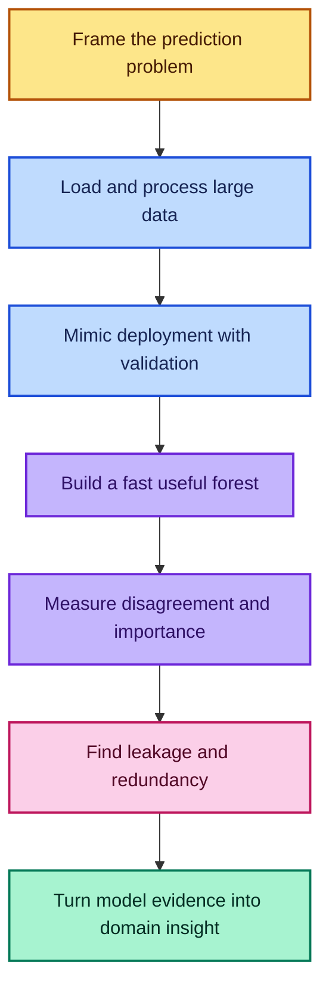
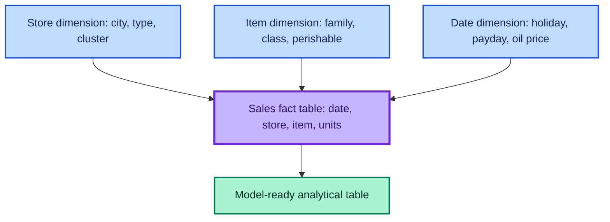
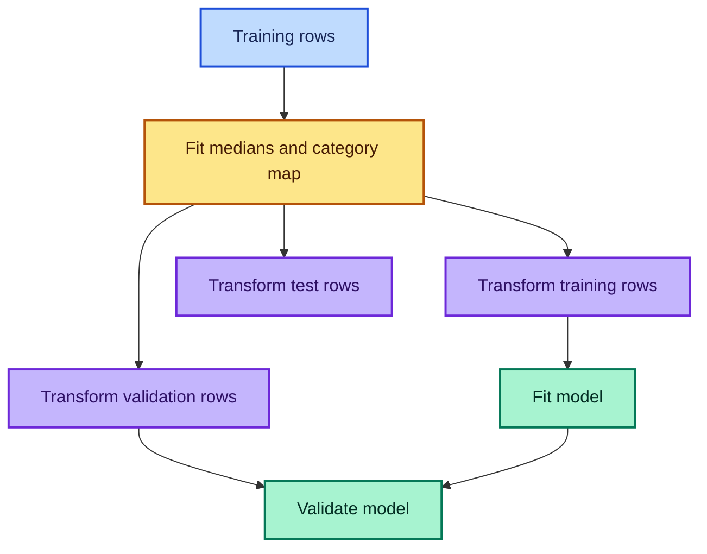
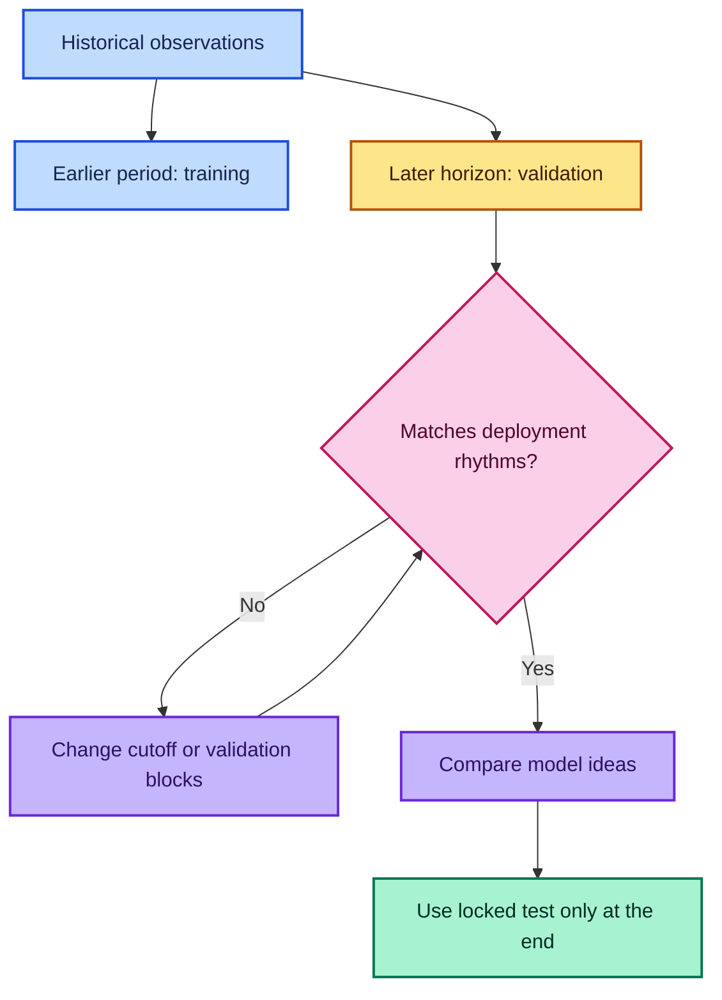
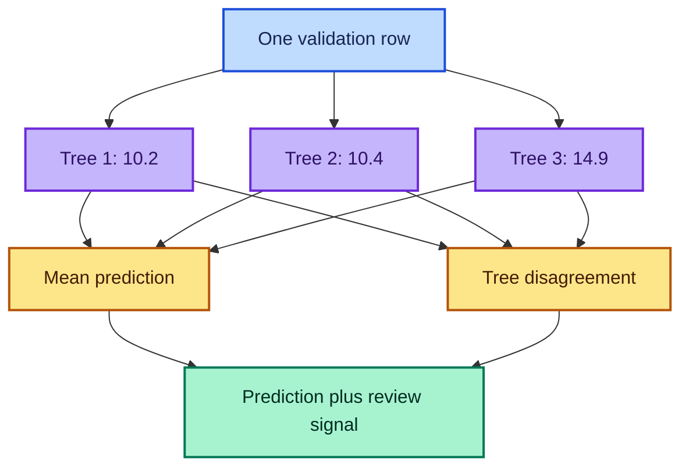
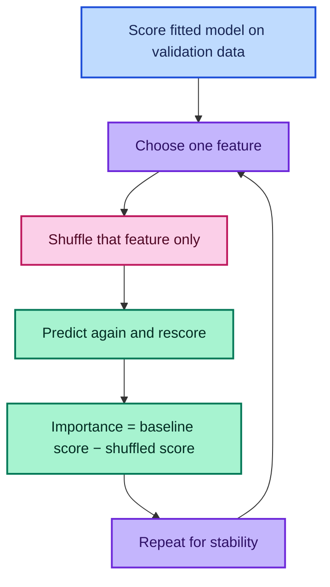
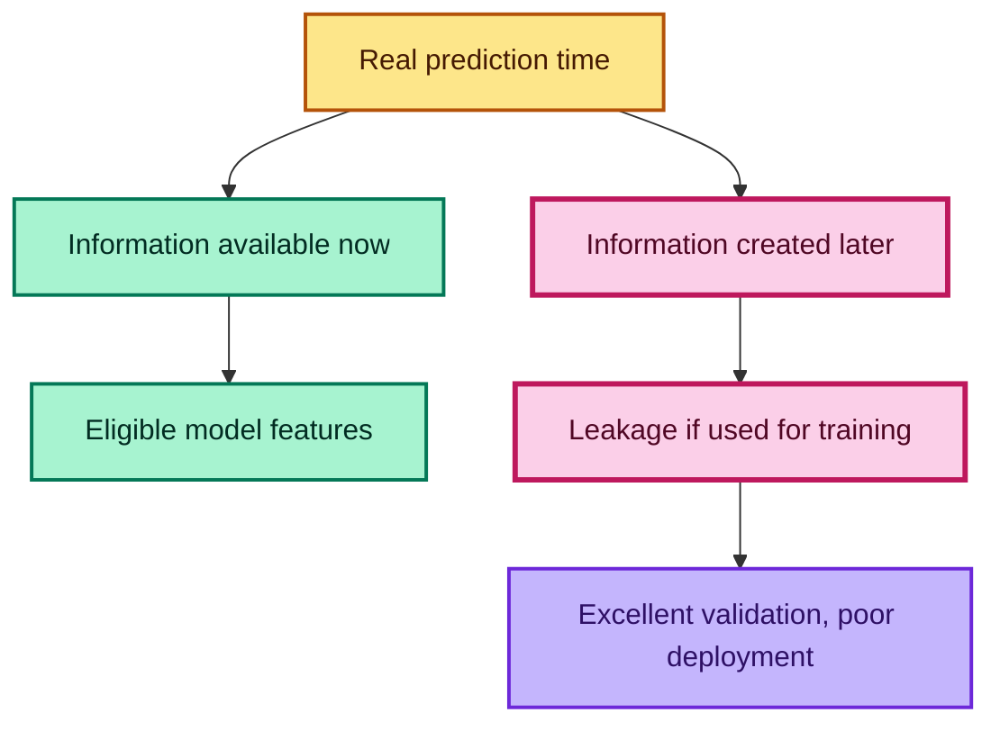

# Intro to Machine Learning — Lesson 3

## Scaling Tabular Machine Learning and Interpreting Random Forests

> Detailed study notes derived from **“Intro to Machine Learning: Lesson 3”**. The lesson connects large-scale tabular engineering, realistic forecasting validation, prediction disagreement, feature importance, data leakage, collinearity, and model-guided data exploration.

**Lecture source:** [YouTube — Intro to Machine Learning: Lesson 3](https://www.youtube.com/watch/YSFG_W8JxBo)

---

## Compatibility and Accuracy Note

The lecture was recorded with an early fast.ai/scikit-learn stack. The principles remain valuable, but these notes use current public APIs:

- historical `set_rf_samples(n)` becomes `RandomForestRegressor(max_samples=n, bootstrap=True)`;
- tree-level predictions are available through `estimators_`;
- pandas now exposes `read_feather` and `DataFrame.to_feather` directly;
- the lecture's “shuffle one column and rescore” procedure is **permutation importance**;
- scikit-learn's `feature_importances_` is a different quantity: normalized mean decrease in impurity, or **MDI**;
- tree-to-tree prediction standard deviation is a useful disagreement diagnostic, but it is **not automatically a calibrated confidence interval**.

Current references: [`RandomForestRegressor`](https://scikit-learn.org/stable/modules/generated/sklearn.ensemble.RandomForestRegressor.html), [`permutation_importance`](https://scikit-learn.org/stable/modules/generated/sklearn.inspection.permutation_importance.html), [forest feature-importance comparison](https://scikit-learn.org/stable/auto_examples/ensemble/plot_forest_importances.html), and [`pandas.read_csv`](https://pandas.pydata.org/docs/reference/api/pandas.read_csv.html).

---

## Table of Contents

1. [Learning Outcomes](#learning-outcomes)
2. [Lesson Map](#lesson-map)
3. [The Two Big Ideas](#1-the-two-big-ideas)
4. [Choosing a Model Family](#2-choosing-a-model-family)
5. [Frame the Prediction Problem](#3-frame-the-prediction-problem)
6. [Relational Data and Star Schemas](#4-relational-data-and-star-schemas)
7. [Reading Very Large Tabular Data](#5-reading-very-large-tabular-data)
8. [Consistent Train/Validation Preprocessing](#6-consistent-trainvalidation-preprocessing)
9. [Time-Aware Validation](#7-time-aware-validation)
10. [Target Transformation and RMSLE](#8-target-transformation-and-rmsle)
11. [Scaling Random Forest Experiments](#9-scaling-random-forest-experiments)
12. [Profiling Before Optimizing](#10-profiling-before-optimizing)
13. [When a Simple Baseline Beats a Complex Model](#11-when-a-simple-baseline-beats-a-complex-model)
14. [Prediction Disagreement Across Trees](#12-prediction-disagreement-across-trees)
15. [Group-Level Reliability Analysis](#13-group-level-reliability-analysis)
16. [Feature Importance](#14-feature-importance-two-different-methods)
17. [Data Leakage](#15-data-leakage)
18. [Collinearity and Redundant Features](#16-collinearity-and-redundant-features)
19. [Feature Selection as an Experiment](#17-feature-selection-as-an-experiment)
20. [Model-Guided Data Investigation](#18-model-guided-data-investigation)
21. [Complete Modern Workflow](#19-complete-modern-workflow)
22. [Common Mistakes](#20-common-mistakes)
23. [Practice Exercises](#21-practice-exercises)
24. [Quick Reference](#22-quick-reference)
25. [Fun Facts](#23-fun-facts)
26. [Resources](#resources)

---

## Learning Outcomes

After studying these notes, you should be able to:

- explain when a random forest is a sensible baseline and when other model families deserve attention;
- identify independent variables, a dependent variable, prediction time, and the scoring rule;
- recognize fact and dimension tables in a star schema;
- estimate tabular memory use and select safe numeric data types;
- read a large CSV with explicit schemas, selected columns, or chunks;
- reuse training-derived preprocessing statistics on validation and test data;
- design validation that matches the future period being predicted;
- transform non-negative targets consistently for RMSLE;
- scale forest cost using tree count and per-tree sample size;
- use a profiler to find actual bottlenecks rather than guessing;
- calculate mean and standard deviation across component-tree predictions;
- distinguish disagreement from calibrated predictive uncertainty;
- compare MDI and permutation importance correctly;
- identify leakage, correlated predictors, and high-cardinality traps;
- remove low-value features through controlled validation experiments;
- use model findings to guide domain questions and feature engineering.

---

## Lesson Map



---

## 1. The Two Big Ideas

Lesson 3 has two major goals.

### Goal A — Work Efficiently with Large Tabular Data

The grocery-sales example contains roughly 125 million transaction rows. The lesson shows that “large” does not immediately require exotic distributed infrastructure. Careful data types, sampling, fast file formats, profiling, and per-tree subsampling can extend ordinary pandas and scikit-learn surprisingly far.

### Goal B — Use a Model to Understand the Data

Predictive accuracy is not the finish line. A fitted random forest can help answer:

- Which rows or groups produce unstable predictions?
- Which columns does the model rely on?
- Are suspiciously predictive fields leaking the answer?
- Are several columns carrying the same information?
- Which domain concepts deserve deeper investigation?

This reverses the “random forests are only black boxes” story. The forest becomes an instrument for deciding **where to look next**.

### The Iterative Loop


The model does not replace domain expertise. It makes domain investigation more focused.

---

## 2. Choosing a Model Family

### What Is a Random Forest Good For?

A random forest is an excellent first model for many structured, row-and-column datasets because it:

- captures nonlinear relationships;
- learns interactions without specifying them manually;
- requires little feature scaling;
- handles mixed numeric and encoded categorical inputs;
- gives a strong baseline with modest tuning;
- supports several useful inspection techniques.

### When Should You Also Try Something Else?

| Data or task | Strong alternatives to investigate | Why |
|---|---|---|
| Images, audio, raw text | Deep neural networks | Nearby pixels, samples, or tokens have rich shared structure |
| User–item preference matrices | Collaborative filtering, matrix factorization, embeddings | The central signal is interaction between two high-cardinality entities |
| Long time series | Lag models, boosted trees, statistical forecasting, sequence models | Temporal order and repeated seasonal patterns need explicit treatment |
| Very large tabular data | Histogram gradient boosting, distributed systems, out-of-core methods | Full exact tree searches may be expensive |
| Strongly extrapolative problem | Linear, parametric, or domain models | Trees generally predict from learned partitions rather than extrapolating trends smoothly |

### A Practical Decision Rule

Use a random forest early on structured data unless a known constraint makes it unsuitable. Its role may be:

1. a competitive final model;
2. a sanity-check baseline;
3. an exploratory tool that reveals important variables and data problems.

> “Try a random forest” is not the same as “only try a random forest.”

---

## 3. Frame the Prediction Problem

Before writing model code, explain the task in ordinary language.

### Four Questions

1. **What is one prediction row?**  
   In the grocery example: one store–item–date combination.

2. **What is the dependent variable?**  
   The number of units sold for that item in that store on that date.

3. **What information is available at prediction time?**  
   Historical sales, store attributes, product metadata, promotion status, holidays, and external signals that are legally and operationally available.

4. **What future period and metric matter?**  
   The next 16 days, scored using a logarithmic squared-error metric.

### Mathematical Framing

Let one row be

$$
x_{s,i,t}
=
\text{features known for store }s,
\text{ item }i,
\text{ and date }t.
$$

The target is

$$
y_{s,i,t}
=
\text{units sold for store }s,
\text{ item }i,
\text{ on date }t.
$$

The model learns

$$
\hat y_{s,i,t}=f(x_{s,i,t}).
$$

Every candidate input must pass a point-in-time question:

> Would this value have been known when the prediction had to be made?

If not, it is future leakage even if it exists in a completed historical table.

### Why Problem Explanation Matters

If you cannot explain the prediction unit, target, horizon, and available inputs, you cannot reliably:

- join tables correctly;
- construct lag features;
- choose a validation period;
- recognize leakage;
- interpret the final score.

---

## 4. Relational Data and Star Schemas

### What Is a Star Schema?

A **fact table** stores repeated measurable events. **Dimension tables** store descriptive information about the entities referenced by those events.

In grocery forecasting:

- the fact table contains date, store ID, item ID, promotion status, and units sold;
- the store dimension contains city, state, store type, and cluster;
- the item dimension contains family, class, and perishability;
- date-related dimensions can contain holidays, events, oil price, or pay-cycle information.



### Why Use Separate Tables?

Repeating a store's city and type on millions of transaction rows wastes storage and makes updates harder. Normalized dimensions store the description once. Modeling code later joins the relevant attributes onto each fact row.

### How to Join Safely

```python
import pandas as pd

# Require one metadata record per store ID before performing the join.
assert stores["store_nbr"].is_unique

# Require one metadata record per item ID as well.
assert items["item_nbr"].is_unique

# Add store attributes; validate prevents accidental many-to-many row growth.
model_frame = sales.merge(
    stores,
    on="store_nbr",
    how="left",
    validate="many_to_one",
)

# Add item attributes using the same defensive relationship check.
model_frame = model_frame.merge(
    items,
    on="item_nbr",
    how="left",
    validate="many_to_one",
)

# Confirm that neither dimension join duplicated transaction rows.
assert len(model_frame) == len(sales)

# Count failed matches instead of silently accepting missing metadata.
print(model_frame[["city", "family"]].isna().sum())
```

### Star Versus Snowflake

| Schema | Shape | Example |
|---|---|---|
| Star | Dimensions join directly to the fact table | `sales → stores` |
| Snowflake | A dimension links to another dimension | `sales → stores → states` |

The modeling goal is usually a denormalized analytical table, but the join process must preserve the meaning and number of fact rows.

---

## 5. Reading Very Large Tabular Data

### Why Explicit Data Types Matter

For $n$ rows and a fixed-width field using $b$ bytes per value, approximate raw column memory is

$$
M\approx n\times b.
$$

For 125 million rows:

| Data type | Bytes/value | Approximate raw column memory |
|---|---:|---:|
| `int8` / `bool` | 1 | 125 MB |
| `int16` | 2 | 250 MB |
| `int32` / `float32` | 4 | 500 MB |
| `int64` / `float64` | 8 | 1 GB |

Using `int64` for a store ID that fits in `int16` spends four times the raw value memory. Real DataFrame memory also includes indexes, masks, Python objects, and container overhead.

### Choose the Smallest Safe Type

For a signed $k$-bit integer,

$$
-2^{k-1}\le x\le2^{k-1}-1.
$$

For an unsigned integer,

$$
0\le x\le2^k-1.
$$

Do not downcast by guesswork: check the observed and possible production ranges first.

### Modern Schema-Aware CSV Loading

```python
from pathlib import Path

import pandas as pd

# Point to the large transaction file without loading it yet.
csv_path = Path("data/train.csv")

# Describe compact types that safely cover each column's valid range.
dtype_map = {
    "id": "int64",             # A large unique row identifier needs wide range.
    "store_nbr": "int16",      # Store IDs fit comfortably in 16 signed bits.
    "item_nbr": "int32",       # Item IDs exceed the int16 range.
    "unit_sales": "float32",   # Sales include fractional or negative values.
    "onpromotion": "boolean",  # Nullable BooleanDtype preserves missing values.
}

# Parse only the required columns and convert the date during ingestion.
sales = pd.read_csv(
    csv_path,
    usecols=["date", *dtype_map],
    dtype=dtype_map,
    parse_dates=["date"],
)

# Inspect actual deep memory usage rather than relying only on intuition.
memory_mb = sales.memory_usage(deep=True).sum() / 1024**2
print(f"DataFrame memory: {memory_mb:,.1f} MiB")
```

Current pandas documentation notes that `low_memory=True` parses internally in chunks but still returns one DataFrame; use `chunksize` or `iterator` to receive chunks. Supplying `dtype` avoids mixed-type inference and makes the intended schema explicit.

### When the Whole File Does Not Fit

```python
import pandas as pd

# Stream one million rows at a time instead of materializing the full CSV.
chunks = pd.read_csv(
    "data/train.csv",
    dtype=dtype_map,
    parse_dates=["date"],
    chunksize=1_000_000,
)

daily_totals = []

for chunk in chunks:
    # Aggregate inside each chunk so the retained result is much smaller.
    chunk_total = (
        chunk.groupby("date", as_index=False)["unit_sales"]
        .sum()
    )

    # Keep only the compact aggregate, not the original million rows.
    daily_totals.append(chunk_total)

# Combine partial totals, then aggregate again because dates span chunks.
daily_sales = (
    pd.concat(daily_totals, ignore_index=True)
    .groupby("date", as_index=False)["unit_sales"]
    .sum()
)
```

Chunking is useful for aggregation, validation checks, conversion, and incremental algorithms. A conventional random forest still expects its final fitting matrix in memory.

### Why Avoid Generic `object` Columns?

An `object` column may hold references to arbitrary Python objects. That flexibility costs memory, prevents compact vectorized representation, and often slows operations. Prefer:

- numeric fixed-width types for measurements and IDs;
- `boolean` for nullable truth values;
- `category` for repeated strings;
- datetime types for timestamps;
- Arrow-backed strings where suitable.

### Fast Intermediate Storage with Feather

CSV is portable but must repeatedly parse text. Feather stores a binary columnar representation and preserves schema.

```python
import pandas as pd

# Feather requires a default index, so remove any custom row index first.
sales.reset_index(drop=True).to_feather(
    "data/train_processed.feather"
)

# Reload the typed table without reparsing the original CSV text.
sales = pd.read_feather(
    "data/train_processed.feather"
)
```

The current pandas [`read_feather`](https://pandas.pydata.org/docs/reference/api/pandas.read_feather.html) and [`to_feather`](https://pandas.pydata.org/docs/reference/api/pandas.DataFrame.to_feather.html) documentation emphasizes efficient serialization and schema preservation. Use Parquet when custom indexes, partitioning, or broader analytical interoperability are needed.

### Sample First, Scale Second

Before running a 125-million-row pipeline:

1. test logic on a tiny deterministic slice;
2. test data types and joins on a representative sample;
3. assert row counts, ranges, missingness, and uniqueness;
4. profile the slow version;
5. scale only after correctness is visible.

For a forecasting task, a purely random sample may omit important temporal behavior. Keep recent periods and important seasonal windows in the development sample.

---

## 6. Consistent Train/Validation Preprocessing

### The Problem

Suppose training column `age` has missing values and training median 42, while validation median is 51. Filling each split with its own median gives the same missing symbol two different meanings.

Worse, if a missingness indicator is created only in splits that happen to contain missing data, the feature columns will not match.

### The Rule

Learn preprocessing state on training data only:

$$
\theta_{\text{prep}}
=
g(X_{\text{train}}).
$$

Then transform every split with the same state:

$$
X'_{\text{train}}=h(X_{\text{train}};\theta_{\text{prep}}),
$$

$$
X'_{\text{valid}}=h(X_{\text{valid}};\theta_{\text{prep}}),
$$

$$
X'_{\text{test}}=h(X_{\text{test}};\theta_{\text{prep}}).
$$

### Why a Pipeline Helps



```python
from sklearn.compose import ColumnTransformer
from sklearn.impute import SimpleImputer
from sklearn.pipeline import Pipeline
from sklearn.preprocessing import OrdinalEncoder

# Separate column roles so each receives an appropriate transformation.
numeric_columns = ["YearMade", "MachineHoursCurrentMeter"]
categorical_columns = ["ProductGroup", "Enclosure"]

# Learn numeric medians only from the fitting rows and add missing flags.
numeric_pipeline = Pipeline([
    (
        "imputer",
        SimpleImputer(
            strategy="median",
            add_indicator=True,
        ),
    ),
])

# Learn the training category vocabulary and reserve -1 for unseen values.
categorical_pipeline = Pipeline([
    (
        "encoder",
        OrdinalEncoder(
            handle_unknown="use_encoded_value",
            unknown_value=-1,
            encoded_missing_value=-1,
        ),
    ),
])

# Combine the transformations while discarding unused columns explicitly.
preprocessor = ColumnTransformer(
    transformers=[
        ("numeric", numeric_pipeline, numeric_columns),
        ("categorical", categorical_pipeline, categorical_columns),
    ],
    remainder="drop",
)

# Fit preprocessing state on training data and apply it there.
X_train_ready = preprocessor.fit_transform(X_train)

# Reuse exactly the same medians and category mappings on validation data.
X_valid_ready = preprocessor.transform(X_valid)
```

Modern tree implementations have evolved, including native missing-value support in current random forests, but consistent point-in-time preprocessing remains essential for category mappings, derived features, and reproducibility.

---

## 7. Time-Aware Validation

### What Should Validation Simulate?

Training covers earlier dates; the competition test covers the immediately following future dates. Validation should recreate that relationship.

If the prediction horizon is $h$ days and cutoff is $T$:

$$
\mathcal D_{\text{train}}
=
\{(x_i,y_i):t_i\le T\},
$$

$$
\mathcal D_{\text{valid}}
=
\{(x_i,y_i):T<t_i\le T+h\}.
$$

### Why a Random Split Can Mislead

A random split lets the model train on dates after some validation rows. It can also place almost identical neighboring store–item observations in both sets. This tests interpolation within the observed period, not genuine future prediction.

### Match More Than the Duration

Two 16-day blocks may behave differently. Check whether validation resembles the test horizon in:

- day-of-week composition;
- number and timing of paydays;
- holidays and promotions;
- seasonal phase;
- store and item coverage;
- missingness and new categories;
- target distribution.



### Chronological Split Code

```python
import pandas as pd

# Sort before slicing; row order must represent time order.
ordered = frame.sort_values("date").reset_index(drop=True)

# Choose a cutoff that leaves one deployment-length validation horizon.
validation_start = pd.Timestamp("2017-08-01")

# Earlier observations are the only rows allowed to teach the model.
train_frame = ordered.loc[
    ordered["date"] < validation_start
].copy()

# The later block simulates predictions made after the cutoff.
valid_frame = ordered.loc[
    ordered["date"] >= validation_start
].copy()

# Verify that the two periods cannot overlap.
assert train_frame["date"].max() < valid_frame["date"].min()
```

### Calibrating a Validation Design

The lecture compares several model variants on both validation and the competition leaderboard. A useful validation design should rank model changes similarly.

For model variants $m=1,\ldots,M$, compare

$$
\{S_{\text{valid}}^{(m)}\}_{m=1}^M
\quad\text{with}\quad
\{S_{\text{future}}^{(m)}\}_{m=1}^M.
$$

A high rank correlation is often more important than exact equality of the scores. Formally, one can inspect Spearman correlation:

$$
\rho_s
=
\operatorname{corr}
\left(
\operatorname{rank}(S_{\text{valid}}),
\operatorname{rank}(S_{\text{future}})
\right).
$$

This is a **limited validation-design audit**, not permission to tune continually on the test set. Repeated test submissions adapt the workflow to hidden data and destroy its independence.

---

## 8. Target Transformation and RMSLE

### The Metric

Root Mean Squared Logarithmic Error is

$$
\operatorname{RMSLE}
=
\sqrt{
\frac{1}{n}
\sum_{i=1}^{n}
\left[
\ln(1+y_i)-\ln(1+\hat y_i)
\right]^2
}.
$$

The logarithm emphasizes proportional differences. Predicting 20 instead of 10 is penalized more like predicting 200 instead of 100 than like making a fixed 10-unit error at every scale.

### Why `log1p`?

`log(0)` is undefined, but

$$
\log(1+0)=0.
$$

`np.log1p(x)` is also numerically accurate for small $x$.

### What About Returns or Negative Sales?

In the competition description discussed in the lecture, negative sales represent returns and must be treated as zero for scoring. Therefore,

$$
y_i^{+}=\max(y_i,0),
$$

$$
z_i=\ln(1+y_i^{+}).
$$

This clipping is **task-specific**, not a universal rule. In another business problem, returns may be essential information and should be modeled separately.

```python
import numpy as np

# Follow this competition's stated convention by clipping returns to zero.
nonnegative_sales = sales["unit_sales"].clip(lower=0)

# Fit the model in log1p space so ordinary RMSE matches the RMSLE objective.
y_log = np.log1p(nonnegative_sales)

# Convert predicted log sales back to units after inference.
predicted_units = np.expm1(predicted_log_sales)

# Numerical noise or model behavior can create negatives after inversion.
predicted_units = np.clip(predicted_units, a_min=0, a_max=None)
```

### A Worked Example

If actual sales are 9 and predicted sales are 19, the log error is

$$
\ln(1+19)-\ln(1+9)
=
\ln 20-\ln 10
=
\ln 2.
$$

If actual sales are 99 and predicted sales are 199, the error is also

$$
\ln 200-\ln 100=\ln 2.
$$

The two predictions have the same multiplicative error.

---

## 9. Scaling Random Forest Experiments

### The Main Cost Controls

A rough experimental cost model is

$$
\text{work}
\propto
B\times m\times C(p,d),
$$

where:

- $B$ is `n_estimators`;
- $m$ is the number of rows sampled per tree;
- $C(p,d)$ represents split-search cost involving feature count $p$ and tree depth $d$.

The full source table can contain 125 million rows while each tree trains on a manageable fresh sample.

### Modern Replacement for `set_rf_samples`

```python
from sklearn.ensemble import RandomForestRegressor

# Never request more sampled rows than exist in the training set.
rows_per_tree = min(1_000_000, len(X_train_ready))

# Train each tree on a separate bootstrap draw of bounded size.
forest = RandomForestRegressor(
    n_estimators=200,        # Average many randomized trees.
    min_samples_leaf=3,      # Smooth leaves and limit tree size.
    max_features=0.5,        # Consider half the features at each split.
    bootstrap=True,          # Enable row sampling with replacement.
    max_samples=rows_per_tree, # Modern equivalent of the old sampling helper.
    n_jobs=-1,               # Use available CPU cores.
    random_state=42,         # Reproduce the same experiment.
)

# Fit on the transformed training matrix only.
forest.fit(X_train_ready, y_train)
```

The current [`RandomForestRegressor` documentation](https://scikit-learn.org/stable/modules/generated/sklearn.ensemble.RandomForestRegressor.html) defines `max_samples` as the per-tree subsample size when `bootstrap=True`.

### Why Not Always Use Every Core?

`n_jobs=-1` asks for all processors, but a machine with many cores can become limited by memory bandwidth, scheduling, and worker overhead. Benchmark a few worker counts on the actual workload. Parallelism changes wall-clock time, not the fitted-model objective.

### A Fast-to-Slow Experimental Ladder

| Stage | Rows/tree | Trees | Purpose |
|---|---:|---:|---|
| Syntax check | 1,000 | 5 | Catch code and shape errors |
| Fast iteration | 20,000–50,000 | 20–40 | Compare ideas and inspect features |
| Stable validation | 100,000–1,000,000 | 100–300 | Reduce score noise |
| Final fit | As validated and affordable | Enough for a plateau | Produce final predictions |

The exact numbers depend on data complexity and hardware. Increase size until conclusions become stable, not merely because a larger number sounds impressive.

---

## 10. Profiling Before Optimizing

### What Is Profiling?

A profiler measures where a program spends its time. It answers questions such as:

- Is time spent parsing, converting, fitting, or predicting?
- Is one hidden conversion repeated for every experiment?
- Is code CPU-bound, memory-bound, or waiting on storage?

### Why Profile?

Human guesses about bottlenecks are often wrong. In the lecture, a repeated DataFrame-to-array conversion consumed a substantial portion of fitting time. Moving that conversion outside the model-comparison loop avoided repeated work.

If one conversion costs $t_c$, model fitting costs $t_f$, and $K$ settings are tested, repeated conversion costs

$$
T_{\text{repeated}}
=
K(t_c+t_f).
$$

Converting once costs

$$
T_{\text{once}}
=
t_c+Kt_f.
$$

The saving is

$$
(K-1)t_c.
$$

### Notebook Profiling

```ipython
# In Jupyter, profile the complete statement and its internal function calls.
%prun forest.fit(X_train_ready, y_train)
```

`%time` reports elapsed time; `%timeit` repeats a short operation; `%prun` shows where time is spent. Use the tool that answers the actual question.

### Profile Ordinary Python Code

```python
import cProfile
import pstats

# Collect function-level timings for one representative model fit.
profiler = cProfile.Profile()
profiler.enable()

# Run the expensive operation exactly as it appears in the real workflow.
forest.fit(X_train_ready, y_train)

# Stop measurement before printing or unrelated analysis begins.
profiler.disable()

# Sort by cumulative time to find expensive call chains.
statistics = pstats.Stats(profiler).sort_stats("cumulative")

# Display only the twenty most expensive entries.
statistics.print_stats(20)
```

### Convert Once When Reusing the Matrix

```python
import numpy as np

# Convert the transformed training data once, outside the experiment loop.
X_train_array = np.asarray(X_train_ready, dtype=np.float32)

# Convert validation data using the same numeric representation.
X_valid_array = np.asarray(X_valid_ready, dtype=np.float32)

# Reuse the arrays for each model instead of rebuilding them repeatedly.
for model in candidate_forests:
    model.fit(X_train_array, y_train)
    validation_prediction = model.predict(X_valid_array)
```

Do not optimize away DataFrame labels until you have preserved feature names separately. Interpretation needs a reliable mapping from array column positions back to domain fields.

### When to Optimize

Optimize code that is:

1. correct;
2. repeated frequently;
3. measured to be expensive;
4. important to the iteration loop.

Saving 30 seconds from a command run 100 times matters more than saving 5 minutes from a one-off final export.

---

## 11. When a Simple Baseline Beats a Complex Model

The lecture's initial grocery random forest underperformed a simple recent-average submission. This is not paradoxical.

### Why the Forest Struggled

Raw fields such as store ID and item ID are arbitrary identifiers. A binary tree can split on conditions such as

$$
\text{item\_id}\le 1275,
$$

but neighboring codes need not represent related products. The model must reconstruct store–item behavior through many partitions.

Meanwhile, the recent mean directly encodes a powerful domain assumption:

$$
\hat y_{s,i,t}
=
\frac{1}{|W|}
\sum_{\tau\in W}y_{s,i,\tau},
$$

where $W$ is a recent historical window.

### Build the Baseline Correctly

```python
import pandas as pd

# Define the date at which future information becomes unavailable.
cutoff = pd.Timestamp("2017-08-01")

# Use only records strictly before the prediction cutoff.
history = sales.loc[sales["date"] < cutoff].copy()

# Retain a recent window that is likely relevant to the forecast horizon.
recent_start = cutoff - pd.Timedelta(days=14)
recent = history.loc[history["date"] >= recent_start]

# Calculate one recent average for every store-item combination.
store_item_mean = (
    recent.groupby(["store_nbr", "item_nbr"])["unit_sales"]
    .mean()
    .rename("recent_mean_sales")
)

# Attach baseline predictions to rows in the future validation block.
validation = validation.join(
    store_item_mean,
    on=["store_nbr", "item_nbr"],
)

# Fall back to zero for combinations unseen in the recent window.
validation["recent_mean_sales"] = (
    validation["recent_mean_sales"].fillna(0)
)
```

The fallback itself should be validated. Possible alternatives include item-family means, store means, or a hierarchy of increasingly broad aggregates.

### Improve the Baseline with Time Features

Useful historical features can include:

- recent 7-, 14-, and 28-day means;
- same weekday averages;
- days since promotion;
- seasonal month or holiday aggregates;
- recent trend or percentage change;
- store–item and item-family encodings.

Every rolling feature must use a lag:

```python
# Sort within each entity before constructing lags.
sales = sales.sort_values(
    ["store_nbr", "item_nbr", "date"]
).copy()

# Shift by one day so today's target never appears in today's input.
past_sales = sales.groupby(
    ["store_nbr", "item_nbr"]
)["unit_sales"].shift(1)

# Average only previously observed values in a seven-row window.
sales["sales_mean_7"] = (
    past_sales.groupby(
        [sales["store_nbr"], sales["item_nbr"]]
    )
    .rolling(7, min_periods=1)
    .mean()
    .reset_index(level=[0, 1], drop=True)
)
```

Without `shift(1)`, a rolling mean may contain the target it is supposed to predict—a subtle and devastating leak.

### A Debugging Habit: Compare Predictions

When a new model should be a modest improvement over a known baseline, plot one against the other. Wild disagreement can reveal misaligned rows, reversed transformations, or broken joins.

```python
import matplotlib.pyplot as plt

# Compare predictions row-for-row; both arrays must share identical ordering.
plt.scatter(
    baseline_prediction,
    model_prediction,
    alpha=0.15,
    s=8,
)

# Add a diagonal reference showing exact agreement.
lower = min(baseline_prediction.min(), model_prediction.min())
upper = max(baseline_prediction.max(), model_prediction.max())
plt.plot([lower, upper], [lower, upper], "r--")
plt.xlabel("Baseline prediction")
plt.ylabel("New model prediction")
plt.title("Prediction sanity check")
plt.show()
```

Disagreement is not automatically an error—the new model may genuinely be better—but it is a reason to inspect examples.

---

## 12. Prediction Disagreement Across Trees

### What Does a Forest Predict?

For a regression forest containing $B$ trees,

$$
\hat y(x)
=
\bar T(x)
=
\frac{1}{B}
\sum_{b=1}^{B}T_b(x).
$$

The component predictions contain more information than their mean. Their sample standard deviation is

$$
s_T(x)
=
\sqrt{
\frac{1}{B-1}
\sum_{b=1}^{B}
\left[T_b(x)-\bar T(x)\right]^2
}.
$$

### Intuition

If similar training examples appear often, many trees may learn compatible partitions and predictions. An unusual row can fall into very different leaves across randomized trees, producing higher disagreement.



### Calculate Per-Row Mean and Disagreement

```python
import numpy as np

# Component trees are fitted internally on arrays, so normalize the input form.
X_valid_array = np.asarray(X_valid_ready)

# Shape: number of trees × number of validation rows.
tree_predictions = np.stack([
    tree.predict(X_valid_array)
    for tree in forest.estimators_
])

# Average down the tree axis to recreate the forest prediction.
prediction_mean = tree_predictions.mean(axis=0)

# Measure tree-to-tree spread for every validation row.
prediction_std = tree_predictions.std(axis=0, ddof=1)

# Confirm that the manual average matches the public forest prediction.
np.testing.assert_allclose(
    prediction_mean,
    forest.predict(X_valid_array),
)
```

### Parallelize Custom Tree-Level Work

The forest's own `predict` uses `n_jobs`, but constructing a full per-tree matrix is a custom task.

```python
import numpy as np
from joblib import Parallel, delayed


def predict_one_tree(tree, matrix):
    """Return predictions from one already-fitted component tree."""
    # Keep the worker function small so it is easy to test independently.
    return tree.predict(matrix)


# Dispatch independent tree predictions across available workers.
parallel_predictions = Parallel(n_jobs=-1)(
    delayed(predict_one_tree)(tree, X_valid_array)
    for tree in forest.estimators_
)

# Stack the returned one-dimensional arrays into one 2D matrix.
tree_predictions = np.stack(parallel_predictions)
```

Parallelization has overhead. Measure it; for small validation matrices, a simple loop may be faster.

### Relative Disagreement

Predictions with larger means often have larger absolute spread. A scale-adjusted heuristic is

$$
r(x)
=
\frac{s_T(x)}{|\bar T(x)|+\varepsilon},
$$

where $\varepsilon$ prevents division by zero.

```python
# Use a small denominator floor for predictions near zero.
epsilon = 1e-8

# Compute a coefficient-of-variation-style review signal.
relative_disagreement = (
    prediction_std / (np.abs(prediction_mean) + epsilon)
)
```

### Is This a Confidence Interval?

Not by itself. The interval

$$
\bar T(x)\pm1.96s_T(x)
$$

is generally **not** a valid 95% predictive interval because:

- trees are correlated;
- their spread reflects model instability, not all outcome noise;
- the distribution need not be normal;
- bootstrap and feature randomization are not posterior sampling;
- distribution shift is invisible when all trees share the same blind spot.

Call it **tree disagreement**, **ensemble spread**, or a **relative uncertainty heuristic** unless coverage is calibrated on held-out data.

### When Is It Useful?

- flagging unusual rows for human review;
- comparing reliability across groups;
- deciding when to request more information;
- finding regions that need more training examples;
- triaging high-stakes predictions.

For a lending example, high predicted risk and high disagreement might justify a manual assessment rather than automatic rejection or approval.

---

## 13. Group-Level Reliability Analysis

Per-row disagreement becomes more interpretable when summarized by meaningful groups.

### Attach Diagnostics to Validation Rows

```python
# Copy the validation records so original data remains unchanged.
diagnostics = valid_frame.copy()

# Store the observed log target for comparison with predictions.
diagnostics["actual"] = np.asarray(y_valid)

# Attach the forest mean and component-tree disagreement.
diagnostics["prediction"] = prediction_mean
diagnostics["tree_std"] = prediction_std

# Add a scale-adjusted version for comparisons across target magnitude.
diagnostics["relative_std"] = relative_disagreement
```

### Summarize by Category

```python
# Compare group size, calibration, and disagreement by enclosure category.
enclosure_summary = (
    diagnostics.groupby("Enclosure", observed=True)
    .agg(
        rows=("actual", "size"),
        actual_mean=("actual", "mean"),
        prediction_mean=("prediction", "mean"),
        tree_std_mean=("tree_std", "mean"),
        relative_std_mean=("relative_std", "mean"),
    )
    .sort_values("relative_std_mean", ascending=False)
)

# Display groups that deserve closer investigation.
print(enclosure_summary.head(10))
```

### Plot Error Bars Without Overclaiming

```python
import matplotlib.pyplot as plt

# Choose sufficiently common groups so tiny samples do not dominate the chart.
common = enclosure_summary.loc[
    enclosure_summary["rows"] >= 30
].copy()

# Plot mean predictions with average tree spread as a diagnostic error bar.
plt.errorbar(
    x=common.index.astype(str),
    y=common["prediction_mean"],
    yerr=common["tree_std_mean"],
    fmt="o",
    capsize=4,
    label="Prediction ± average tree disagreement",
)

# Overlay observed group means for a rough calibration comparison.
plt.scatter(
    common.index.astype(str),
    common["actual_mean"],
    marker="x",
    s=70,
    label="Observed mean",
)

plt.xticks(rotation=45, ha="right")
plt.ylabel("Log sale price")
plt.title("Group prediction and model disagreement")
plt.legend()
plt.tight_layout()
plt.show()
```

### How to Read the Table

| Pattern | Possible explanation | Follow-up |
|---|---|---|
| Small group, high spread | Too few similar examples | Gather data or pool categories |
| Large group, high spread | Missing interaction or heterogeneous group | Add subgroup features |
| Low spread, high error | Shared systematic bias | Inspect drift, leakage, or omitted variables |
| High spread, low average error | Opposing tree errors cancel on average | Review individual high-stakes rows |

Tree agreement can be confidently wrong. Always compare disagreement with observed validation error.

---

## 14. Feature Importance: Two Different Methods

Feature importance answers:

> Which inputs did this fitted model rely on to make useful predictions?

It does **not** automatically answer:

- Which variable causes the outcome?
- Which feature is intrinsically important in nature?
- Which feature should be changed by policy?

### 14.1 Mean Decrease in Impurity — MDI

This is what scikit-learn stores in `forest.feature_importances_`.

For node $t$, let:

- $p(t)$ be the fraction of training observations reaching it;
- $I(t)$ be its impurity;
- $t_L,t_R$ be its children.

The weighted decrease created by the split is

$$
\Delta I(t)
=
p(t)I(t)
-
p(t_L)I(t_L)
-
p(t_R)I(t_R).
$$

For feature $j$, accumulate decreases over nodes that split on $j$ and average across trees:

$$
\operatorname{MDI}_j
\propto
\frac{1}{B}
\sum_{b=1}^{B}
\sum_{t:v(t)=j}
\Delta I_b(t).
$$

The values are normalized to sum to one.

```python
import pandas as pd

# Recover transformed feature names in their exact model-matrix order.
feature_names = preprocessor.get_feature_names_out()

# Pair every name with the forest's normalized impurity importance.
mdi_importance = pd.Series(
    forest.feature_importances_,
    index=feature_names,
    name="mdi_importance",
).sort_values(ascending=False)

# Inspect the fields that removed the most training impurity.
print(mdi_importance.head(20))
```

#### Advantages

- extremely fast after training;
- directly describes the splits used by the forest;
- useful as an initial prioritization tool.

#### Limitations

- measured from training splits rather than held-out predictive degradation;
- can favor continuous or high-cardinality features with many candidate splits;
- divides credit among correlated alternatives in model-dependent ways;
- can look important because of leakage.

The official scikit-learn [forest-importance example](https://scikit-learn.org/stable/auto_examples/ensemble/plot_forest_importances.html) explicitly warns that impurity importance can mislead for high-cardinality features.

### 14.2 Permutation Importance

Permutation importance implements the lecture's shuffle intuition.

1. Calculate baseline score $S$ on a chosen dataset.
2. Randomly permute column $j$, breaking its row-wise relationship with the target and other fields.
3. Recalculate score $S_{j,k}^{\pi}$ for repeat $k$.
4. Measure the score decrease.

For a larger-is-better score:

$$
PI_j
=
\frac{1}{K}
\sum_{k=1}^{K}
\left(S-S_{j,k}^{\pi}\right).
$$

A large positive value means the model performed worse when that feature's useful alignment was destroyed.



### Calculate Permutation Importance on Validation Data

```python
import pandas as pd
from sklearn.inspection import permutation_importance

# Measure reliance where generalization matters, not only on training rows.
permutation_result = permutation_importance(
    estimator=forest,
    X=X_valid_ready,
    y=y_valid,
    scoring="neg_root_mean_squared_error", # Higher negative RMSE is better.
    n_repeats=10,                          # Repeat shuffles to estimate variability.
    n_jobs=-1,                             # Parallelize feature evaluations.
    random_state=42,                       # Reproduce each permutation.
)

# Store the mean score drop and its repeat-to-repeat variability.
permutation_table = pd.DataFrame({
    "feature": feature_names,
    "importance_mean": permutation_result.importances_mean,
    "importance_std": permutation_result.importances_std,
}).sort_values("importance_mean", ascending=False)

# Positive importance means shuffling worsened validation RMSE.
print(permutation_table.head(20))
```

The current scikit-learn [`permutation_importance` documentation](https://scikit-learn.org/stable/modules/generated/sklearn.inspection.permutation_importance.html) defines importance as the difference between baseline and permuted score.

### MDI Versus Permutation Importance

| Question | MDI | Permutation importance |
|---|---|---|
| What is measured? | Training impurity reduction inside trees | Drop in a selected predictive score after shuffling |
| Where is it measured? | Fitted training tree structure | Training, validation, or test-like data chosen by analyst |
| Model-specific? | Yes, tree-specific | Model-agnostic for fitted predictors |
| Computation | Very fast | Requires repeated predictions per feature |
| High-cardinality bias | Can be strong | Less direct cardinality bias |
| Correlated-feature problem | Credit may be split | One feature may look unimportant because a surrogate remains |

Use both as evidence, not as unquestionable truth.

### Why Shuffling Is Faster Than Drop-and-Retrain

For $p$ features and $K$ repeats, permutation importance needs roughly $1+pK$ scoring passes. Drop-column importance instead fits $p$ new models, which is usually much more expensive.

However, drop-column importance asks a different question: “How well can the learning algorithm adapt without this feature?” Permutation asks: “How much does this already-fitted model rely on the feature in this dataset?”

---

## 15. Data Leakage

### What Is Leakage?

Leakage occurs when a training feature contains information unavailable at the real prediction moment.



### The Missingness Example

The lecture describes a grant-prediction dataset where fields were often completed administratively only **after** a grant was accepted. Missingness was highly predictive, but that signal would not exist when applications were initially ranked.

The model found a real pattern in the recorded table and still produced an invalid operational solution.

### Common Leakage Routes

| Leakage source | Example | Prevention |
|---|---|---|
| Future outcome processing | “Completed paperwork” added after approval | Reconstruct point-in-time snapshots |
| Target in aggregate | Mean sales computed using validation dates | Shift and cut all histories at prediction time |
| Preprocessing before split | Median or encoding learned from full data | Fit transformations on training only |
| Entity duplication | Same customer event in train and validation | Split by entity or time as deployment requires |
| Post-event status | Final cancellation code used to predict cancellation | Audit field creation timestamps |
| Test-driven iteration | Repeated leaderboard feedback guides every choice | Lock a local validation design |

### Leakage Audit Questions

For each highly important feature, ask:

1. Who creates it?
2. At what timestamp is it first available?
3. Can it be corrected later?
4. Is it derived from the target or downstream workflow?
5. Would a production prediction service actually receive it?

Feature importance is a leakage detector because suspiciously strong fields rise to the top quickly.

---

## 16. Collinearity and Redundant Features

### What Is Collinearity?

Two features are strongly collinear when they carry similar information. For example:

- `machine_age` and `year_made` given a fixed sale year;
- a category flag and a missingness pattern that identifies the same product class;
- Celsius and Fahrenheit temperature.

Random forests can remain predictive with correlated columns, but interpretation changes.

### How Importance Gets Diluted

Suppose features $X_1$ and $X_2$ encode almost the same signal.

- In MDI, different trees or nodes may split on different surrogates, sharing importance between them.
- In permutation importance, shuffling $X_1$ may cause little damage because $X_2$ still provides the signal.

This is why “near-zero individual importance” does not always mean “the information is useless.”

The official scikit-learn [multicollinear permutation example](https://scikit-learn.org/stable/auto_examples/inspection/plot_permutation_importance_multicollinear.html) demonstrates a high-performing forest in which individual permutation importances appear small because correlated alternatives remain.

### Find Correlated Numeric Groups

```python
import numpy as np

# Use Spearman correlation because it captures monotonic nonlinear relationships.
correlation = numeric_frame.corr(method="spearman")

# Ignore self-correlation and duplicate lower-triangle pairs.
upper_triangle = correlation.where(
    np.triu(
        np.ones(correlation.shape, dtype=bool),
        k=1,
    )
)

# List strongly related feature pairs for domain review.
strong_pairs = (
    upper_triangle.stack()
    .rename("spearman_correlation")
    .loc[lambda values: values.abs() >= 0.90]
    .sort_values(key=np.abs, ascending=False)
)

print(strong_pairs.head(20))
```

Correlation is not redundancy by itself. Two highly correlated variables can behave differently in rare but important regions.

### Grouped Permutation

If several columns represent one concept, shuffle them together to test their joint value.

```python
import numpy as np
from sklearn.metrics import r2_score


def grouped_permutation_drop(
    model,
    X,
    y,
    columns,
    repeats=10,
    random_state=42,
):
    """Measure R² loss when a feature group is jointly permuted."""
    # Work with a DataFrame copy so named columns remain easy to select.
    X = X.copy()

    # Calculate the unmodified validation score once.
    baseline = r2_score(y, model.predict(X))

    # Use a local generator for reproducible independent permutations.
    rng = np.random.default_rng(random_state)
    drops = []

    for _ in range(repeats):
        # Copy again so each repeat starts from untouched validation data.
        permuted = X.copy()

        # Use one shared row order to preserve relationships within the group.
        order = rng.permutation(len(permuted))
        permuted.loc[:, columns] = (
            permuted.loc[:, columns].to_numpy()[order]
        )

        # Positive values mean the grouped shuffle damaged performance.
        shuffled_score = r2_score(y, model.predict(permuted))
        drops.append(baseline - shuffled_score)

    # Return both average reliance and repeat-to-repeat instability.
    return float(np.mean(drops)), float(np.std(drops, ddof=1))
```

Using the same permutation for all group columns preserves their internal relationships while severing their alignment with each target row.

---

## 17. Feature Selection as an Experiment

The lecture keeps only features above an importance threshold, refits the forest, and checks whether validation performance changes.

### Why Remove Weak Features?

- faster fitting and prediction;
- smaller models;
- simpler importance plots;
- fewer opportunities for noisy splits;
- easier conversations with domain experts;
- reduced dilution from redundant variables.

### Why Importance Thresholds Are Not Proof

A feature can appear weak because:

- a correlated surrogate steals its credit;
- its value appears only through an interaction;
- the validation sample is small;
- the model did not learn how to use it;
- importance is noisy across seeds.

Therefore, removal is a controlled predictive experiment.

### Refitting with Selected Features

```python
from sklearn.base import clone
from sklearn.metrics import mean_squared_error

# Keep features above a stated MDI threshold for this experiment.
selected_features = mdi_importance.loc[
    mdi_importance > 0.005
].index.tolist()

# Select the same columns, in the same order, for both splits.
selected_positions = [
    list(feature_names).index(name)
    for name in selected_features
]
X_train_selected = X_train_ready[:, selected_positions]
X_valid_selected = X_valid_ready[:, selected_positions]

# Clone the estimator so the original fitted forest remains untouched.
reduced_forest = clone(forest)

# Learn a new model using only the proposed subset.
reduced_forest.fit(X_train_selected, y_train)

# Evaluate on the unchanged future validation rows.
reduced_prediction = reduced_forest.predict(X_valid_selected)
reduced_rmse = mean_squared_error(
    y_valid,
    reduced_prediction,
) ** 0.5

print("Selected feature count:", len(selected_features))
print("Reduced validation RMSE:", reduced_rmse)
```

Some preprocessors return sparse matrices, and not every matrix supports identical slicing behavior. Inspect the actual transformed type and use `ColumnTransformer` feature selection earlier in the pipeline for production code.

### Decision Table

| Validation result after removal | Interpretation | Action |
|---|---|---|
| Same within noise | Removed features were unnecessary for this model | Prefer simpler set; confirm across seeds/time blocks |
| Better | Noise or competing split opportunities may have hurt | Retain reduction and investigate why |
| Worse | At least one removed feature carried useful information | Lower threshold or restore groups |

Do not select features on the final test set.

---

## 18. Model-Guided Data Investigation

The most valuable output of an importance ranking is a shorter research agenda.

### What to Ask About a Top Feature

For each of the top 5–10 fields:

1. What does it mean operationally?
2. Who records it and when?
3. What are its units and valid range?
4. How much is missing, and is missingness meaningful?
5. Is it high-cardinality?
6. Is the code ordinal, nominal, or hierarchical?
7. Does it contain strange sentinel values such as 0 or 9999?
8. Has its definition changed over time?
9. Is it correlated with another field?
10. How does the target behave across its values?

### A Compact Exploration Function

```python
import matplotlib.pyplot as plt


def inspect_feature(frame, feature, target):
    """Print basic diagnostics and plot one feature against the target."""
    # Report type, missingness, and distribution statistics.
    print(frame[feature].describe(include="all"))
    print("Missing fraction:", frame[feature].isna().mean())
    print("Unique values:", frame[feature].nunique(dropna=False))

    # Use a histogram for numeric marginal structure.
    if pd.api.types.is_numeric_dtype(frame[feature]):
        frame[feature].plot.hist(bins=50, alpha=0.75)
        plt.title(f"Distribution of {feature}")
        plt.xlabel(feature)
        plt.show()

        # Scatter a sample to keep plotting cost bounded on large data.
        sample = frame[[feature, target]].dropna().sample(
            n=min(5_000, frame[[feature, target]].dropna().shape[0]),
            random_state=42,
        )
        sample.plot.scatter(
            x=feature,
            y=target,
            alpha=0.15,
        )
        plt.title(f"{target} versus {feature}")
        plt.show()
    else:
        # Compare common categorical levels by count and target mean.
        summary = (
            frame.groupby(feature, observed=True)[target]
            .agg(["size", "mean"])
            .sort_values("size", ascending=False)
            .head(20)
        )
        print(summary)
```

### High-Cardinality Categorical Features

A product model identifier may contain thousands of levels. Investigate whether its string has structure:

- manufacturer prefix;
- product family;
- size suffix;
- generation or year;
- hierarchical segments.

Splitting one opaque label into stable domain components can improve generalization to rare or unseen models.

### What “Unexpected Importance” Means

If a client says a top feature “makes no sense,” consider four hypotheses:

1. the model found a real relationship unknown to the client;
2. the feature is a proxy for another domain concept;
3. the data contains leakage;
4. the field or join is wrong.

Unexpected importance is the start of an audit, not the end of the analysis.

---

## 19. Complete Modern Workflow

This example combines the lesson's interpretation workflow for the bulldozer-style regression problem. It assumes `frame` contains:

- one row per auction;
- a chronological `saledate` column;
- a positive `SalePrice` target;
- numeric and categorical predictor columns.

```python
import numpy as np
import pandas as pd
from sklearn.compose import ColumnTransformer
from sklearn.ensemble import RandomForestRegressor
from sklearn.impute import SimpleImputer
from sklearn.inspection import permutation_importance
from sklearn.metrics import mean_squared_error, r2_score
from sklearn.pipeline import Pipeline
from sklearn.preprocessing import OrdinalEncoder


def rmse(actual, predicted):
    """Return root mean squared error in the supplied target scale."""
    # Square root converts mean squared error back to target units.
    return mean_squared_error(actual, predicted) ** 0.5


# Sort once so positional slicing represents chronological order.
frame = frame.sort_values("saledate").reset_index(drop=True)

# Transform the positive monetary target into log1p space.
y = np.log1p(frame["SalePrice"].astype("float64"))

# Remove the target and raw timestamp after deriving useful date fields.
X = frame.drop(columns=["SalePrice"]).copy()
X["sale_year"] = X["saledate"].dt.year
X["sale_month"] = X["saledate"].dt.month
X["sale_dayofweek"] = X["saledate"].dt.dayofweek
X = X.drop(columns=["saledate"])

# Reserve the newest 12,000 records as deployment-like validation.
n_valid = 12_000
X_train = X.iloc[:-n_valid].copy()
X_valid = X.iloc[-n_valid:].copy()
y_train = y.iloc[:-n_valid].copy()
y_valid = y.iloc[-n_valid:].copy()

# Infer broad column roles after all date features have been created.
numeric_columns = X_train.select_dtypes(
    include=["number", "bool"]
).columns.tolist()
categorical_columns = X_train.select_dtypes(
    exclude=["number", "bool"]
).columns.tolist()

# Learn medians on training rows and append missingness indicators.
numeric_pipeline = Pipeline([
    (
        "impute",
        SimpleImputer(
            strategy="median",
            add_indicator=True,
        ),
    ),
])

# Learn training category codes and map new validation levels to -1.
categorical_pipeline = Pipeline([
    (
        "encode",
        OrdinalEncoder(
            handle_unknown="use_encoded_value",
            unknown_value=-1,
            encoded_missing_value=-1,
        ),
    ),
])

# Apply each transformation only to its declared column group.
preprocessor = ColumnTransformer(
    transformers=[
        ("numeric", numeric_pipeline, numeric_columns),
        ("categorical", categorical_pipeline, categorical_columns),
    ],
    remainder="drop",
)

# Bound each tree's row sample for fast, stable interpretation work.
rows_per_tree = min(50_000, len(X_train))
forest = RandomForestRegressor(
    n_estimators=200,          # Use enough trees for stable averages.
    min_samples_leaf=3,        # Smooth individual tree predictions.
    max_features=0.5,          # Reduce correlation between trees.
    bootstrap=True,            # Draw rows with replacement.
    max_samples=rows_per_tree, # Train each tree on a fresh bounded sample.
    n_jobs=-1,                 # Parallelize independent trees.
    random_state=42,           # Reproduce sampling and split choices.
)

# Package preprocessing and modeling to prevent split-specific transformations.
model = Pipeline([
    ("prepare", preprocessor),
    ("forest", forest),
])

# Learn all preprocessing and model parameters from earlier rows only.
model.fit(X_train, y_train)

# Evaluate on the untouched later validation period.
train_prediction = model.predict(X_train)
valid_prediction = model.predict(X_valid)
print("Train RMSE:", rmse(y_train, train_prediction))
print("Valid RMSE:", rmse(y_valid, valid_prediction))
print("Train R²:", r2_score(y_train, train_prediction))
print("Valid R²:", r2_score(y_valid, valid_prediction))

# Retrieve the fitted steps for lower-level interpretation.
fitted_preprocessor = model.named_steps["prepare"]
fitted_forest = model.named_steps["forest"]

# Transform validation once before asking every component tree to predict.
X_valid_ready = fitted_preprocessor.transform(X_valid)
X_valid_array = np.asarray(X_valid_ready)

# Collect a trees-by-rows matrix of individual predictions.
tree_predictions = np.stack([
    tree.predict(X_valid_array)
    for tree in fitted_forest.estimators_
])

# Calculate ensemble mean and an uncalibrated disagreement diagnostic.
tree_mean = tree_predictions.mean(axis=0)
tree_std = tree_predictions.std(axis=0, ddof=1)

# Ensure the manual tree average reconstructs the pipeline prediction.
np.testing.assert_allclose(tree_mean, valid_prediction)

# Name transformed features before pairing them with MDI values.
transformed_names = fitted_preprocessor.get_feature_names_out()
mdi_table = (
    pd.Series(
        fitted_forest.feature_importances_,
        index=transformed_names,
        name="mdi",
    )
    .sort_values(ascending=False)
    .to_frame()
)
print(mdi_table.head(20))

# Shuffle original validation columns through the complete pipeline.
permutation = permutation_importance(
    model,
    X_valid,
    y_valid,
    scoring="neg_root_mean_squared_error",
    n_repeats=10,
    n_jobs=-1,
    random_state=42,
)

# Original-column permutation importance is easier to discuss with experts.
permutation_table = pd.DataFrame({
    "feature": X_valid.columns,
    "importance_mean": permutation.importances_mean,
    "importance_std": permutation.importances_std,
}).sort_values("importance_mean", ascending=False)
print(permutation_table.head(20))

# Attach disagreement to original rows for group or record-level review.
validation_diagnostics = X_valid.copy()
validation_diagnostics["actual_log_price"] = np.asarray(y_valid)
validation_diagnostics["predicted_log_price"] = valid_prediction
validation_diagnostics["tree_disagreement"] = tree_std

# Rank rows whose component trees disagree most strongly.
review_queue = validation_diagnostics.nlargest(
    20,
    "tree_disagreement",
)
print(review_queue)
```

### Why the Workflow Is Structured This Way

1. **Sort and split first:** validation reflects later deployment.
2. **Fit preprocessing only on training:** medians and category maps cannot leak.
3. **Use a bounded tree sample:** interpretation stays fast.
4. **Evaluate before interpreting:** explanations of a useless model are not valuable.
5. **Inspect both MDI and permutation importance:** each has different failure modes.
6. **Treat tree spread as triage:** it is not labeled a confidence interval.
7. **Return to original columns and rows:** findings must be understandable to people.

---

## 20. Common Mistakes

| Mistake | Why it is dangerous | Better practice |
|---|---|---|
| Loading all columns as default `int64`, `float64`, or `object` | Wastes RAM and increases I/O | Declare verified compact types and `usecols` |
| Assuming `low_memory=False` makes a huge file fit | It changes inference behavior, not fundamental DataFrame size | Supply `dtype` or stream with `chunksize` |
| Optimizing before profiling | Effort targets guessed bottlenecks | Measure cumulative time first |
| Developing only on the full dataset | Every mistake becomes slow and costly | Use a representative, deterministic sample |
| Randomly splitting a forecasting task | Future-like rows leak into fitting | Use a later validation horizon |
| Matching validation only by row count | Paydays, weekdays, holidays, and coverage may differ | Match deployment rhythms and entities |
| Learning medians separately in validation | The same missing value receives different semantics | Fit preprocessing on training and reuse it |
| Creating rolling features without a shift | The target leaks into its own input | Shift before rolling or expanding calculations |
| Assuming a complex model must beat a mean | Simple baselines encode powerful domain priors | Establish and diagnose strong baselines |
| Calling tree standard deviation a 95% interval | Tree draws are correlated and not a calibrated posterior | Call it disagreement; calibrate coverage separately |
| Treating importance as causality | Predictive reliance can reflect proxies or leakage | Use importance to form audit questions |
| Equating `feature_importances_` with permutation | MDI and shuffling are different algorithms | Name and explain the method explicitly |
| Computing permutation importance only on training | It may reward overfit reliance | Prefer deployment-like validation data |
| Ignoring correlated predictors | Importance can be split or masked | Inspect groups and try grouped permutation |
| Dropping features without refitting | The model cannot adapt to their absence | Retrain and rescore on the same validation set |
| Ignoring join cardinality | A many-to-many merge silently duplicates facts | Use `validate=` and row-count assertions |
| Trusting a surprisingly strong feature immediately | It may encode future workflow | Audit who creates it and when |
| Repeatedly using leaderboard/test feedback | The hidden set becomes part of tuning | Lock local validation and limit final checks |

---

## 21. Practice Exercises

### Exercise 1 — Memory Arithmetic

A table contains 125 million rows. Estimate raw memory for one `int64` column and one `int16` column. How much is saved by downcasting if the values safely fit?

<details>
<summary>Solution</summary>

Using decimal units:

$$
125{,}000{,}000\times8
=
1{,}000{,}000{,}000\text{ bytes}
\approx1\text{ GB}.
$$

For `int16`:

$$
125{,}000{,}000\times2
=
250{,}000{,}000\text{ bytes}
\approx250\text{ MB}.
$$

Approximate raw saving: 750 MB for one column, before container overhead.

</details>

### Exercise 2 — Verify an RMSLE Intuition

Show that predicting 19 when the target is 9 has the same single-row logarithmic error magnitude as predicting 199 when the target is 99.

<details>
<summary>Solution</summary>

$$
\ln(1+19)-\ln(1+9)
=
\ln20-\ln10
=
\ln2.
$$

Similarly,

$$
\ln(1+199)-\ln(1+99)
=
\ln200-\ln100
=
\ln2.
$$

Both predictions are twice the corresponding `target + 1` value.

</details>

### Exercise 3 — Tree Disagreement by Hand

Three trees predict `[10, 12, 14]` for one row.

1. Calculate the forest mean.
2. Calculate sample standard deviation with denominator $B-1$.
3. Calculate relative disagreement $s/|\bar T|$.

<details>
<summary>Solution</summary>

The mean is

$$
\bar T=\frac{10+12+14}{3}=12.
$$

The sample standard deviation is

$$
s
=
\sqrt{\frac{(10-12)^2+(12-12)^2+(14-12)^2}{2}}
=
\sqrt{\frac{8}{2}}
=
2.
$$

Relative disagreement is

$$
\frac{2}{12}=\frac{1}{6}\approx0.167.
$$

</details>

### Exercise 4 — Permutation Importance

A model's validation $R^2$ is 0.89. After shuffling `YearMade`, repeated scores average 0.80. After shuffling `Enclosure`, scores average 0.84. Calculate both importances and rank the features.

<details>
<summary>Solution</summary>

$$
PI_{\text{YearMade}}=0.89-0.80=0.09,
$$

$$
PI_{\text{Enclosure}}=0.89-0.84=0.05.
$$

The fitted model relies more heavily on `YearMade` under this validation distribution. This is predictive reliance, not proof that changing year made causes a price change.

</details>

### Exercise 5 — Detect a Leaking Rolling Mean

Compare these two feature definitions:

```python
# Incorrect: the current target can enter its own rolling feature.
bad_mean = group["sales"].rolling(7).mean()

# Correct: shift first so only previously observed sales are included.
good_mean = group["sales"].shift(1).rolling(7).mean()
```

Explain exactly which timestamp is illegally available in `bad_mean`.

### Exercise 6 — Design a Validation Horizon

The test period contains 16 days beginning immediately after payday and ending on the next payday. Design a validation block with comparable length, weekday mix, and pay-cycle placement. Explain why “the last 16 random days” is not equivalent.

### Exercise 7 — Compare Importance Methods

On one fixed validation set:

1. compute MDI;
2. compute 10-repeat permutation importance;
3. identify features whose rankings differ substantially;
4. check their cardinality and correlations;
5. write a hypothesis explaining each difference.

### Exercise 8 — Controlled Feature Removal

Choose an importance threshold using training-derived MDI, refit on the reduced features, and compare validation RMSE across three seeds. Report mean, standard deviation, feature count, fit time, and model size.

### Exercise 9 — Audit a Suspicious Feature

Pick the strongest unexpected predictor and document:

- creation process;
- first-available timestamp;
- missingness mechanism;
- relationship to the target workflow;
- whether production will have it;
- a safe replacement if it leaks.

---

## 22. Quick Reference

### Formula Sheet

| Concept | Formula | Interpretation |
|---|---|---|
| Raw column memory | $M\approx n\times b$ | Rows times bytes per value |
| RMSLE | $\sqrt{\frac{1}{n}\sum_i[\ln(1+y_i)-\ln(1+\hat y_i)]^2}$ | Logarithmic squared prediction error |
| Forest mean | $\bar T(x)=\frac{1}{B}\sum_bT_b(x)$ | Ensemble prediction |
| Tree disagreement | $s_T(x)=\sqrt{\frac{1}{B-1}\sum_b[T_b(x)-\bar T(x)]^2}$ | Spread across component trees |
| Relative disagreement | $s_T(x)/(\lvert\bar T(x)\rvert+\varepsilon)$ | Scale-adjusted spread heuristic |
| Node impurity decrease | $p(t)I(t)-p(t_L)I(t_L)-p(t_R)I(t_R)$ | Training error removed by one split |
| Permutation importance | $\frac{1}{K}\sum_k(S-S_{j,k}^{\pi})$ | Score loss after shuffling feature $j$ |
| Rank calibration | $\rho_s=\operatorname{corr}(\operatorname{rank}S_v,\operatorname{rank}S_f)$ | Agreement between validation and future rankings |

### Interpretation Decision Guide

| Question | Technique | Main caveat |
|---|---|---|
| Which rows are unstable across trees? | Tree prediction standard deviation | Not a calibrated interval |
| Which groups are less reliable? | Group mean error and disagreement | Small groups are noisy |
| Which splits reduce training impurity? | MDI / `feature_importances_` | High-cardinality and correlation bias |
| Which validation columns does the model rely on? | Permutation importance | Correlated substitutes can mask importance |
| Can weak features be removed? | Refit reduced model | Must validate across seeds or time blocks |
| Is a top feature suspicious? | Point-in-time leakage audit | Requires process and domain knowledge |
| Do features duplicate information? | Correlations and grouped permutation | Correlation is not complete redundancy |

### Large-Data Checklist

- [ ] Define one row, target, prediction horizon, and metric.
- [ ] List data available at prediction time.
- [ ] Inspect ranges before choosing compact data types.
- [ ] Use explicit `dtype`, `usecols`, and `parse_dates`.
- [ ] Stream with `chunksize` when the full file cannot fit.
- [ ] Assert join cardinality and retained row counts.
- [ ] Save stable intermediate tables in a binary format.
- [ ] Prototype on a representative sample.
- [ ] Profile slow steps before rewriting them.
- [ ] Bound per-tree samples with `max_samples` when appropriate.

### Interpretation Checklist

- [ ] Confirm the model beats a meaningful baseline.
- [ ] Measure performance on deployment-like validation.
- [ ] Keep feature names aligned with transformed columns.
- [ ] Examine tree disagreement alongside actual error.
- [ ] Compare MDI and permutation importance.
- [ ] Audit top features for point-in-time availability.
- [ ] Check cardinality and correlated alternatives.
- [ ] Remove features only through refit-and-validate experiments.
- [ ] Discuss top variables with domain experts.
- [ ] Turn findings into new validation, data-cleaning, or feature hypotheses.

---

## 23. Fun Facts

1. **A billion bytes can hide in one column.** At 125 million rows, one `int64` field alone occupies about 1 GB of raw value storage.
2. **Binary formats skip text parsing.** Feather can reload typed columns without rediscovering every value from CSV text.
3. **Python data science is often fast because the hot loop is elsewhere.** NumPy, pandas, and scikit-learn delegate substantial work to compiled C, Cython, C++, or vectorized libraries.
4. **A simple recent average can encode enormous domain knowledge.** It assumes local continuity at the exact store–item level.
5. **The forest mean discards disagreement information.** The full tree-prediction matrix exposes regions where randomized models disagree.
6. **Agreement is not certainty.** Every tree can share the same missing feature, leakage, or distribution-shift blind spot.
7. **There is more than one “feature importance.”** MDI, permutation, drop-column, SHAP, and other methods answer different questions.
8. **A feature can be useful and receive small permutation importance.** A correlated surrogate may take over when it is shuffled.
9. **Missingness can describe a business process.** Whether a field is filled in may reveal who handled a record and when.
10. **High-cardinality identifiers tempt trees.** Many candidate split points can inflate impurity-based importance without guaranteeing generalization.
11. **Removing features can clarify interpretation without reducing accuracy.** Redundant predictors often spread credit across several names.
12. **The best next feature may come from a conversation.** Model interpretation is often a tool for asking a domain expert a sharper question.

---

## Resources

- [Original lecture — Intro to Machine Learning: Lesson 3](https://www.youtube.com/watch/YSFG_W8JxBo)
- [scikit-learn: `RandomForestRegressor`](https://scikit-learn.org/stable/modules/generated/sklearn.ensemble.RandomForestRegressor.html)
- [scikit-learn: permutation importance user guide](https://scikit-learn.org/stable/modules/permutation_importance.html)
- [scikit-learn: `permutation_importance` API](https://scikit-learn.org/stable/modules/generated/sklearn.inspection.permutation_importance.html)
- [scikit-learn: forest feature importances—MDI versus permutation](https://scikit-learn.org/stable/auto_examples/ensemble/plot_forest_importances.html)
- [scikit-learn: permutation importance with multicollinear features](https://scikit-learn.org/stable/auto_examples/inspection/plot_permutation_importance_multicollinear.html)
- [pandas: `read_csv`](https://pandas.pydata.org/docs/reference/api/pandas.read_csv.html)
- [pandas: `read_feather`](https://pandas.pydata.org/docs/reference/api/pandas.read_feather.html)
- [pandas: `DataFrame.to_feather`](https://pandas.pydata.org/docs/reference/api/pandas.DataFrame.to_feather.html)

---

## Final Takeaway

Lesson 3's central habit is to treat machine learning as an investigative loop. Build a model that is accurate enough to be credible, validate it in a way that resembles the future, and then use disagreement and importance to decide which rows, groups, features, and data processes deserve attention. Scale comes from deliberate schemas, sampling, storage, and profiling; understanding comes from connecting model behavior back to time, data collection, and domain meaning.
