# Intro to Machine Learning — Lesson 4

## Random-Forest Tuning, Correlated Features, Partial Dependence, and Local Explanations

> Detailed study notes derived from **“Intro to Machine Learning: Lesson 4”**. The lecture develops a practical interpretation workflow: control forest complexity, identify important and redundant variables, understand categorical encodings, visualize model response with PDP/ICE, and explain an individual prediction through tree-path contributions.

**Lecture source:** [YouTube — Intro to Machine Learning: Lesson 4](https://www.youtube.com/watch/0v93qHDqq_g)

---

## Compatibility and Accuracy Note

The lecture uses an early fast.ai/scikit-learn environment. These notes preserve its intuitions while using current public APIs and clarifying several subtleties:

- historical `set_rf_samples(n)` becomes `RandomForestRegressor(max_samples=n, bootstrap=True)`;
- `oob_score=True` requests an additional diagnostic and does not itself change how trees train;
- `max_features` selects candidate features **at each split**, not once for the whole tree;
- smaller per-tree samples generally increase row-level diversity and tend to **reduce**, not increase, correlation among trees, at the cost of weaker individual trees;
- scikit-learn's `feature_importances_` is mean decrease in impurity (MDI), while “shuffle a column and rescore” is permutation importance;
- partial dependence and ICE describe a fitted model's behavior and are not automatically causal;
- the transcript's external PDP and tree-interpreter helpers are replaced with current scikit-learn inspection tools and a transparent path-contribution implementation.

Current references: [`RandomForestRegressor`](https://scikit-learn.org/stable/modules/generated/sklearn.ensemble.RandomForestRegressor.html), [`OneHotEncoder`](https://scikit-learn.org/stable/modules/generated/sklearn.preprocessing.OneHotEncoder.html), [PDP and ICE user guide](https://scikit-learn.org/stable/modules/partial_dependence.html), and [`PartialDependenceDisplay`](https://scikit-learn.org/stable/modules/generated/sklearn.inspection.PartialDependenceDisplay.html).

---

## Table of Contents

1. [Learning Outcomes](#learning-outcomes)
2. [Lesson Map](#lesson-map)
3. [Notebook Version-Control Hygiene](#1-notebook-version-control-hygiene)
4. [The Ensemble Design Objective](#2-the-ensemble-design-objective)
5. [Per-Tree Sample Size](#3-per-tree-sample-size-max_samples)
6. [Minimum Leaf Size](#4-minimum-leaf-size-min_samples_leaf)
7. [Features Considered at Each Split](#5-features-considered-at-each-split-max_features)
8. [Tree Count, Parallelism, and OOB](#6-tree-count-parallelism-and-oob)
9. [Hyperparameter Experiment Strategy](#7-hyperparameter-experiment-strategy)
10. [Feature Importance and Interactions](#8-feature-importance-and-interactions)
11. [Diagnosing Weak Temporal Validation](#9-diagnosing-weak-temporal-validation)
12. [Linear Coefficients Versus Model-Agnostic Importance](#10-linear-coefficients-versus-model-agnostic-importance)
13. [Categorical Encoding](#11-categorical-encoding-ordinal-codes-versus-one-hot)
14. [Cardinality and Encoding Thresholds](#12-cardinality-and-encoding-thresholds)
15. [Finding Redundant Features](#13-finding-redundant-features-with-spearman-clustering)
16. [Removing Redundancy Safely](#14-removing-redundancy-safely)
17. [Why Univariate Plots Mislead](#15-why-univariate-plots-can-mislead)
18. [Partial Dependence](#16-partial-dependence-plots)
19. [ICE and Heterogeneous Effects](#17-individual-conditional-expectation-ice)
20. [Two-Feature PDPs](#18-two-feature-partial-dependence)
21. [Categorical PDPs](#19-categorical-partial-dependence)
22. [PDP Limitations](#20-partial-dependence-limitations-and-responsible-use)
23. [Feature Engineering from Interpretation](#21-feature-engineering-from-interpretation)
24. [Local Tree-Path Contributions](#22-local-tree-path-contributions)
25. [Complete Modern Workflow](#23-complete-modern-workflow)
26. [Common Mistakes](#24-common-mistakes)
27. [Practice Exercises](#25-practice-exercises)
28. [Quick Reference](#26-quick-reference)
29. [Fun Facts](#27-fun-facts)
30. [Resources](#resources)

---

## Learning Outcomes

After studying these notes, you should be able to:

- explain why notebook files often produce noisy Git conflicts;
- connect forest accuracy to individual-tree strength and error correlation;
- approximate balanced tree depth from sample size and minimum leaf size;
- predict how `max_samples`, `min_samples_leaf`, and `max_features` affect bias, variance, diversity, and speed;
- explain why OOB scoring measures rather than changes model training;
- distinguish temporal distribution shift from ordinary overfitting;
- explain why one-feature-at-a-time models miss interactions;
- compare MDI, permutation importance, and linear-model coefficients carefully;
- choose between ordinal encoding and one-hot encoding for categorical variables;
- define cardinality and anticipate high-cardinality memory costs;
- calculate Spearman rank correlation and construct a feature dendrogram;
- test removal of one redundant feature per correlated group;
- distinguish a marginal univariate curve from partial dependence;
- derive PDP and ICE mathematically and calculate them manually;
- recognize PDP extrapolation, correlation, and causal-interpretation hazards;
- inspect two-feature and categorical partial dependence;
- decompose a forest prediction into a baseline plus per-feature path contributions.

---

## Lesson Map

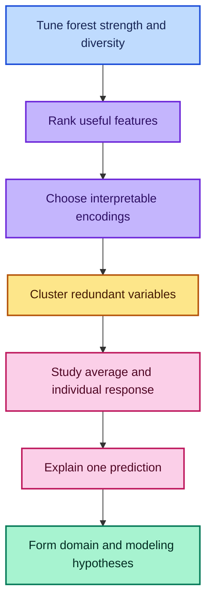

---

## 1. Notebook Version-Control Hygiene

### Why Notebooks Conflict So Easily

A Jupyter notebook is a JSON document containing:

- cell source;
- outputs;
- execution counters;
- metadata;
- widget or display state.

Running a cell without editing its source can still change the execution count or output. Git therefore sees a modified JSON file, and line-based merges can be difficult to understand.

### A Simple Course Workflow

The lecture recommends:

1. keep the instructor's notebook unchanged;
2. make a personal copy before experimenting;
3. give the copy a name ignored by Git;
4. pull upstream updates into the untouched original;
5. compare or manually transfer desired changes.

```gitignore
# Ignore temporary personal notebook experiments.
tmp*.ipynb

# Ignore common Jupyter checkpoint directories.
.ipynb_checkpoints/
```

### When to Keep Outputs

| Choice | Advantage | Cost |
|---|---|---|
| Commit outputs | Readers see plots and tables on Git hosting | Larger, noisier diffs |
| Clear outputs | Cleaner reviews and fewer merge conflicts | Notebook is less informative when viewed statically |
| Personal ignored copy | Safe experimentation without upstream conflicts | Manual comparison may be required |

The correct policy depends on whether the repository treats notebooks as executable source, published reports, or both.

---

## 2. The Ensemble Design Objective

### Strong Trees and Diverse Errors

A regression forest averages $B$ tree predictions:

$$
\hat f_B(x)
=
\frac{1}{B}
\sum_{b=1}^{B}T_b(x).
$$

Suppose every tree's error has variance $\sigma^2$ and the average pairwise error correlation is $\rho$. Then approximately

$$
\operatorname{Var}(\bar T)
=
\rho\sigma^2
+
\frac{1-\rho}{B}\sigma^2.
$$

This formula explains the random-forest design goal:

1. keep each tree useful, so $\sigma^2$ is not accompanied by enormous bias;
2. keep tree errors different, so $\rho$ is small;
3. average enough trees to shrink the uncorrelated part.

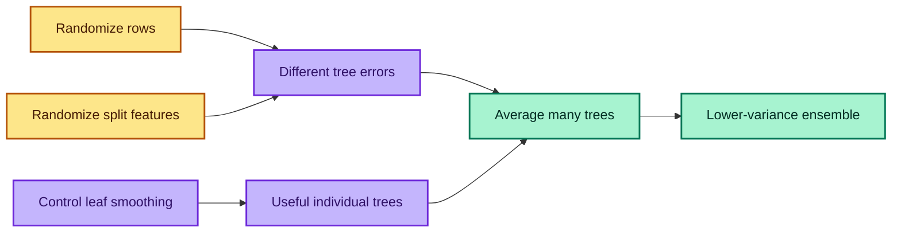

### Why Every Hyperparameter Is a Trade-Off

A restriction can:

- weaken each component tree;
- reduce variance;
- increase diversity;
- speed training;
- change memory and prediction cost.

No single direction is always better. The deployment-like validation set decides whether the combined trade-off helps.

---

## 3. Per-Tree Sample Size: `max_samples`

### What It Controls

With bootstrapping enabled, each tree draws `max_samples` rows with replacement from the $n$ training observations.

```python
from sklearn.ensemble import RandomForestRegressor

# Never request an integer sample larger than the training set.
rows_per_tree = min(20_000, len(X_train))

# Modern replacement for the lecture's set_rf_samples(20_000).
forest = RandomForestRegressor(
    n_estimators=200,         # Build enough trees for a stable mean.
    bootstrap=True,           # Draw rows with replacement for each tree.
    max_samples=rows_per_tree, # Bound the per-tree training sample.
    n_jobs=-1,                # Fit independent trees in parallel.
    random_state=42,          # Reproduce the sampling sequence.
)

# Fit against the full training matrix; sampling occurs inside each tree.
forest.fit(X_train, y_train)
```

### Approximate Depth and Leaf Count

If a balanced binary tree is grown until every leaf contains about $\ell$ observations, and the per-tree sample has $m$ rows, then

$$
L\lesssim\frac{m}{\ell}
$$

leaves are possible, and approximate depth is

$$
D\approx
\left\lceil
\log_2\left(\frac{m}{\ell}\right)
\right\rceil.
$$

For $m=20{,}000$ and $\ell=1$:

$$
D\approx\lceil\log_2(20{,}000)\rceil=15.
$$

The tree can have as many as roughly 20,000 one-row leaves. Real trees are unbalanced and may stop earlier because no split improves impurity or identical predictors cannot separate observations.

### Omitted-Row Probability

For one training row, the probability of being absent from $m$ draws is

$$
P(\text{omitted})
=
\left(1-\frac{1}{n}\right)^m
\approx
e^{-m/n}.
$$

When $m=n$, this approaches $e^{-1}\approx0.368$. When $m<n$, a larger fraction of original rows is omitted from each tree.

### Effect of Reducing `max_samples`

| Effect | Typical direction |
|---|---|
| Individual tree strength | Decreases |
| Diversity between trees | Increases |
| Tree error correlation | Often decreases |
| Training time per tree | Decreases |
| Maximum leaf count | Decreases |
| Final validation score | Data-dependent |

Use smaller samples for fast iteration and large datasets. Increase them until interpretations and validation conclusions stabilize.

---

## 4. Minimum Leaf Size: `min_samples_leaf`

### What It Controls

Every terminal leaf must contain at least the configured number of training observations. A regression leaf predicts its mean:

$$
\hat y_L
=
\frac{1}{n_L}
\sum_{i\in L}y_i.
$$

Larger leaves average more observations and therefore smooth predictions.

### Balanced-Tree Intuition

With sample size $m=20{,}000$:

| `min_samples_leaf` | Approximate maximum leaves | Approximate balanced depth |
|---:|---:|---:|
| 1 | 20,000 | 15 |
| 2 | 10,000 | 14 |
| 4 | 5,000 | 13 |
| 8 | 2,500 | 12 |

Doubling minimum leaf size removes about one balanced layer because

$$
\log_2\left(\frac{m}{2\ell}\right)
=
\log_2\left(\frac{m}{\ell}\right)-1.
$$

This is an approximation, not a guarantee that every leaf contains exactly $\ell$ rows.

### Bias–Variance Effect

- **Small leaf:** flexible, low training bias, potentially noisy.
- **Large leaf:** smoother, higher bias, lower variance, fewer leaves.

Increasing leaf size can improve validation when one-row leaves chase accidental detail. It can hurt when rare, genuine subgroups need fine partitions.

```python
from sklearn.ensemble import RandomForestRegressor
from sklearn.metrics import mean_squared_error

# Keep all other choices fixed to isolate the leaf-size effect.
for leaf_size in [1, 3, 5, 10, 25, 100]:
    model = RandomForestRegressor(
        n_estimators=200,          # Stabilize comparisons across settings.
        min_samples_leaf=leaf_size, # Change only the smoothing control.
        max_features=0.5,          # Hold feature randomness constant.
        max_samples=rows_per_tree, # Hold row sampling constant.
        n_jobs=-1,                 # Parallelize tree fitting.
        random_state=42,           # Use comparable random draws.
    )

    # Fit on unchanged training data.
    model.fit(X_train, y_train)

    # Measure future-like validation error.
    prediction = model.predict(X_valid)
    validation_rmse = mean_squared_error(
        y_valid,
        prediction,
    ) ** 0.5

    print(leaf_size, validation_rmse)
```

Stop exploring much larger values once validation clearly deteriorates.

---

## 5. Features Considered at Each Split: `max_features`

### What It Actually Means

If the matrix has $p$ columns and `max_features=q` is a fraction, each split considers approximately

$$
k=\max(1,\lfloor qp\rfloor)
$$

randomly chosen candidate features.

The subset is redrawn **for every node**. All columns remain available elsewhere in the same tree.

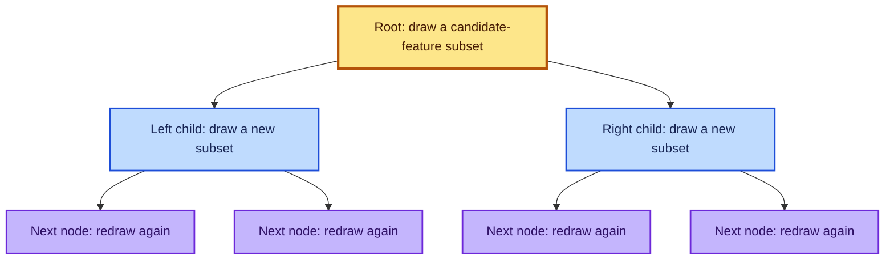

### Why It Helps

If one feature is overwhelmingly strong, every unrestricted tree may use it at the root. Their early structure becomes similar. With `max_features=0.5`, that field is unavailable at about half the split searches, forcing alternative interactions to appear.

### Trade-Off

| Lower `max_features` | Higher `max_features` |
|---|---|
| More diversity | Stronger greedy split candidates |
| Lower tree correlation | More similar trees |
| Weaker individual trees | Stronger individual trees |
| More trees may be needed | Good results can appear with fewer trees |

Common experiments for regression are `1.0`, `0.5`, `"sqrt"`, and `"log2"`. Current scikit-learn uses `1.0` as the regression-forest default, meaning all features are considered at each split.

---

## 6. Tree Count, Parallelism, and OOB

### `n_estimators`

Increasing tree count improves the Monte Carlo average until performance plateaus. It usually does not fix systematic bias, leakage, or distribution shift.

The correlated-error variance formula shows the limit:

$$
\lim_{B\to\infty}
\operatorname{Var}(\bar T)
=
\rho\sigma^2.
$$

More trees cannot average away the shared correlated component.

### `n_jobs`

This controls parallel execution, not the mathematical estimator. `n_jobs=-1` uses available processors, but memory bandwidth and scheduling cause diminishing returns. Benchmark rather than assuming every extra worker helps.

### `oob_score`

For row $i$, let $\mathcal B_i$ contain trees whose bootstrap samples omitted it. Its OOB prediction is

$$
\hat y_i^{\text{OOB}}
=
\frac{1}{|\mathcal B_i|}
\sum_{b\in\mathcal B_i}T_b(x_i).
$$

Enabling OOB:

- does not reserve one fixed third of data globally;
- does not change the bootstrap samples used for training;
- aggregates eligible predictions separately for every row;
- provides `oob_score_` and `oob_prediction_` after fitting.

```python
from sklearn.ensemble import RandomForestRegressor

# OOB estimation requires bootstrapping so every tree omits some rows.
oob_forest = RandomForestRegressor(
    n_estimators=300,       # Supply enough OOB votes per training row.
    bootstrap=True,         # Draw rows with replacement.
    max_samples=0.75,       # Use a different 75%-sized draw for each tree.
    oob_score=True,         # Calculate the extra OOB diagnostic.
    min_samples_leaf=3,     # Smooth individual leaves.
    max_features=0.5,       # Decorrelate split choices.
    n_jobs=-1,              # Parallelize independent trees.
    random_state=42,        # Reproduce the experiment.
)

# Learn only from the designated training period.
oob_forest.fit(X_train, y_train)

# The default OOB score for regression is R².
print("OOB R²:", oob_forest.oob_score_)
```

OOB is a random-within-training diagnostic. It cannot replace a later-period validation set when deployment involves time shift.

---

## 7. Hyperparameter Experiment Strategy

### What to Vary

| Hyperparameter | Suggested initial values | Main question |
|---|---|---|
| `max_samples` | `0.25, 0.5, 0.75, None` | How much row diversity and speed are useful? |
| `min_samples_leaf` | `1, 3, 5, 10, 25, 100` | How much smoothing helps? |
| `max_features` | `1.0, 0.5, "sqrt", "log2"` | How much feature diversity helps? |
| `n_estimators` | `50, 100, 200, 400` | Has ensemble averaging stabilized? |

### Keep the Comparison Fair

- freeze the training and validation rows;
- keep `random_state` fixed during first comparisons;
- change one interpretable hypothesis at a time;
- record train, OOB, and temporal validation metrics;
- repeat finalists across seeds;
- include fit and prediction time.

### A Compact Experiment Function

```python
import time

from sklearn.metrics import mean_squared_error, r2_score


def evaluate_forest(model, X_train, y_train, X_valid, y_valid):
    """Fit one forest and return comparable diagnostics."""
    # Measure wall-clock fitting time around only the training call.
    start = time.perf_counter()
    model.fit(X_train, y_train)
    fit_seconds = time.perf_counter() - start

    # Generate both training and deployment-like validation predictions.
    train_prediction = model.predict(X_train)
    valid_prediction = model.predict(X_valid)

    # Collect metrics in one record suitable for a results DataFrame.
    result = {
        "fit_seconds": fit_seconds,
        "train_rmse": mean_squared_error(
            y_train,
            train_prediction,
        ) ** 0.5,
        "valid_rmse": mean_squared_error(
            y_valid,
            valid_prediction,
        ) ** 0.5,
        "train_r2": r2_score(y_train, train_prediction),
        "valid_r2": r2_score(y_valid, valid_prediction),
    }

    # Add OOB R² only when the model was configured to calculate it.
    if hasattr(model, "oob_score_"):
        result["oob_r2"] = model.oob_score_

    return result
```

Interpretation models need not be the most expensive final models. They need to be accurate enough and stable enough that repeated inspection leads to the same conclusions.

---

## 8. Feature Importance and Interactions

### Why One-Feature Models Are Misleading

Suppose auction price depends strongly on machine age:

$$
\text{AgeAtSale}
=
\text{SaleYear}
-
\text{YearMade}.
$$

A model trained only on `YearMade` cannot know whether a machine was two years old or twenty years old when sold. A separate model trained only on `SaleYear` has the same problem. Their interaction contains the useful meaning.

### Trees Discover Interactions Automatically

A path can split first on `SaleYear`, then on `YearMade`. The second decision is conditional on the first, creating an interaction without manually constructing every product or difference.

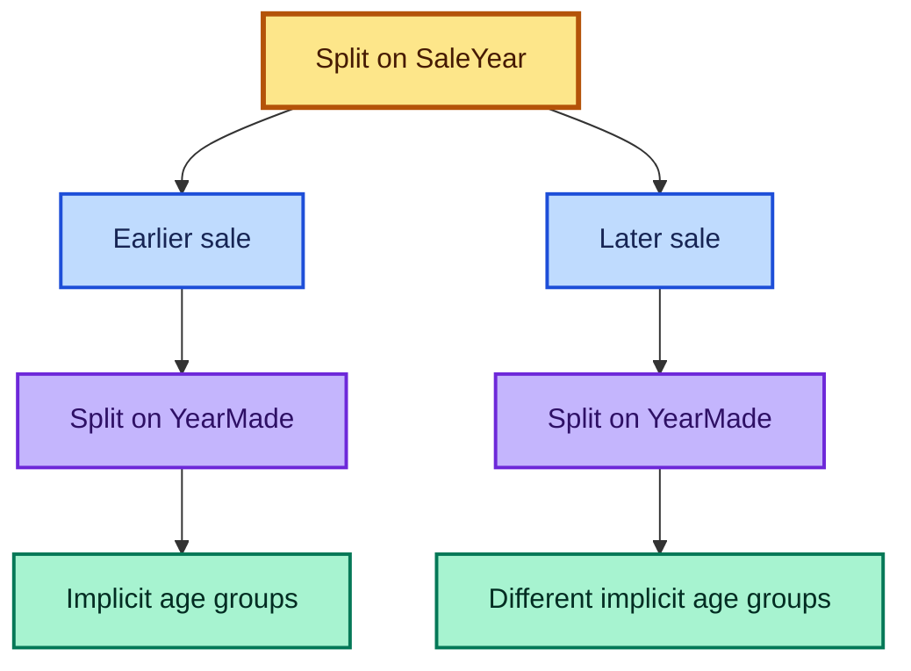

### Permutation Importance Preserves the Fitted Interaction Structure

After a flexible model has learned interactions, permutation importance shuffles one validation column and measures the score drop:

$$
PI_j
=
\frac{1}{K}
\sum_{k=1}^{K}
\left(S-S_{j,k}^{\pi}\right).
$$

It asks how much the **already-fitted complete model** relies on feature $j$. It does not retrain one model per individual feature.

```python
import pandas as pd
from sklearn.inspection import permutation_importance

# Measure feature reliance on the later validation period.
result = permutation_importance(
    forest,
    X_valid,
    y_valid,
    scoring="neg_root_mean_squared_error", # Use the project metric direction.
    n_repeats=10,                          # Repeat to estimate shuffle noise.
    n_jobs=-1,                             # Parallelize independent evaluations.
    random_state=42,                       # Reproduce permutations.
)

# Pair each validation feature with mean score loss and variability.
importance = pd.DataFrame({
    "feature": X_valid.columns,
    "importance_mean": result.importances_mean,
    "importance_std": result.importances_std,
}).sort_values("importance_mean", ascending=False)

print(importance.head(20))
```

### Correlated Surrogates Share or Hide Credit

If two columns are copies or near-copies:

- MDI can split credit across them;
- permutation of one may do little because the other remains;
- fitting them individually can make both look independently strong.

Importance ranks **model reliance under the available feature set**, not unique causal information.

---

## 9. Diagnosing Weak Temporal Validation

Suppose a new engineered feature improves training and OOB scores but worsens the future-period validation score. Two broad explanations matter.

### Case A — Ordinary Overfitting

| Metric | Expected pattern |
|---|---|
| Training | Improves strongly |
| OOB or random holdout | Worsens |
| Temporal validation | Worsens |

The feature helps memorize the training sample but not unseen rows drawn from a similar distribution.

### Case B — Distribution Shift

| Metric | Expected pattern |
|---|---|
| Training | Improves |
| OOB or random holdout | Stable or improves |
| Temporal validation | Worsens |

The relationship is valid within the historical training distribution but changes in the later period. Examples include:

- identifiers whose ranges change over time;
- a category that means something different later;
- promotions or policies introduced near the cutoff;
- a preprocessing bug that affects only later rows;
- seasonality not represented in random OOB samples.

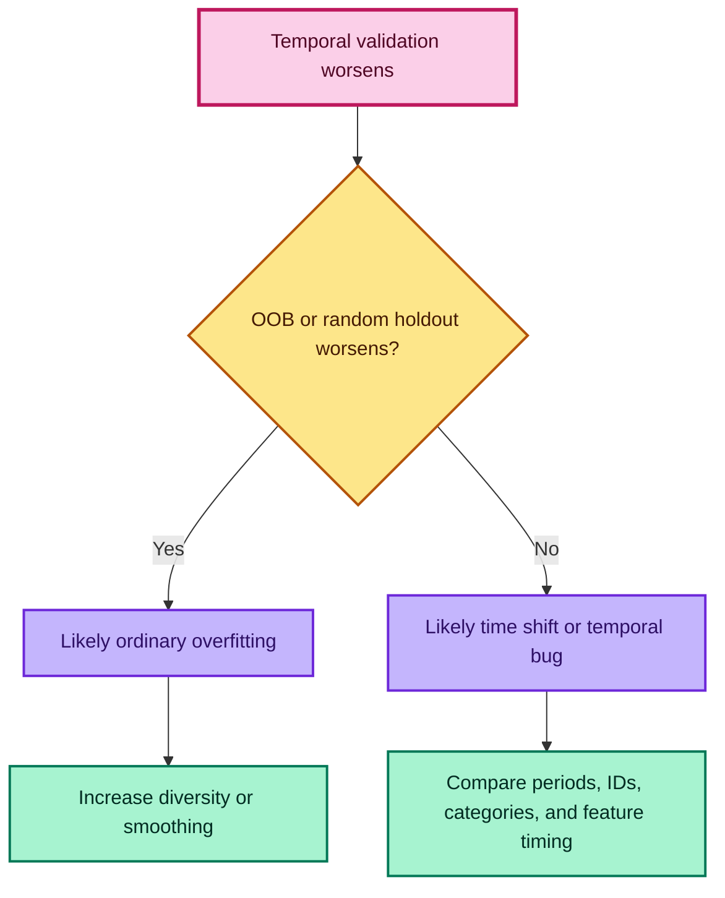

This diagnostic only works if the temporal validation set genuinely represents deployment.

---

## 10. Linear Coefficients Versus Model-Agnostic Importance

### The Linear Model

A standardized linear regression has form

$$
\hat y
=
\beta_0
+
\sum_{j=1}^{p}\beta_jz_j,
$$

where $z_j$ are standardized features. A coefficient describes the expected change in prediction for a one-standard-deviation increase in $z_j$, holding the other modeled terms fixed.

### When Coefficients Are Useful

- the functional form is appropriate;
- interactions and transformations are specified correctly;
- feature scaling and units are understood;
- collinearity is controlled or explicitly modeled;
- regularization is accounted for;
- the goal is association within the fitted model, not unsupported causation.

### Why Coefficient Magnitude Can Mislead

| Problem | Consequence |
|---|---|
| Missing interaction | Main effects absorb an incomplete relationship |
| Missing nonlinear transformation | One slope averages incompatible regions |
| Different feature units | Raw magnitudes are incomparable |
| Collinearity | Coefficients become unstable or share credit |
| One-hot reference category | Every coefficient is relative to a chosen baseline |
| Regularization | Coefficients are intentionally shrunk |
| Post-outcome feature | A precise coefficient can still describe leakage |

The lecture strongly favors flexible tree models for exploratory importance. A balanced modern conclusion is:

> Linear coefficients can be informative under a defensible design; permutation importance evaluates predictive reliance with fewer functional-form assumptions. Neither method establishes causality by itself.

---

## 11. Categorical Encoding: Ordinal Codes Versus One-Hot

### What Is a Categorical Feature?

A categorical feature takes values from a finite set, such as:

$$
\{\text{low},\text{medium},\text{high}\}.
$$

The set may be:

- **ordinal:** a meaningful order exists;
- **nominal:** labels differ, but no natural order exists.

### Ordinal Encoding

An ordered usage band can be mapped as

$$
\text{low}\mapsto0,
\quad
\text{medium}\mapsto1,
\quad
\text{high}\mapsto2.
$$

A tree can then use `usage_band <= 0.5` or `usage_band <= 1.5`. This efficiently preserves ordered thresholds.

```python
from sklearn.preprocessing import OrdinalEncoder

# Declare the semantic order instead of accepting alphabetical ordering.
ordered_encoder = OrdinalEncoder(
    categories=[["low", "medium", "high"]],
    handle_unknown="use_encoded_value",
    unknown_value=-1,
    encoded_missing_value=-1,
)

# Learn and apply the declared mapping on training rows.
usage_train = ordered_encoder.fit_transform(
    X_train[["UsageBand"]]
)

# Reuse the identical ordering for validation and unseen categories.
usage_valid = ordered_encoder.transform(
    X_valid[["UsageBand"]]
)
```

### Nominal Integer Codes

If arbitrary labels are mapped to 0, 1, 2, 3, the model sees an artificial order. A tree can isolate code 2 using two thresholds, but a group such as `{0, 3}` may require several branches.

Integer codes can still work well as a tree baseline, especially for high-cardinality fields, but validate their imposed structure.

### One-Hot Encoding

For categories `low`, `medium`, and `high`, one-hot encoding creates:

| Category | is_low | is_medium | is_high |
|---|---:|---:|---:|
| low | 1 | 0 | 0 |
| medium | 0 | 1 | 0 |
| high | 0 | 0 | 1 |

A tree can isolate `is_medium=1` in one split, regardless of the original code order.

```python
from sklearn.preprocessing import OneHotEncoder

# Create one binary column per observed training category.
one_hot = OneHotEncoder(
    handle_unknown="ignore", # Map unseen validation levels to all-zero output.
    sparse_output=True,      # Avoid materializing a large dense matrix.
    drop=None,               # Keep every category for tree-based models.
    min_frequency=10,        # Optionally group very rare levels.
)

# Learn the training vocabulary and create a sparse indicator matrix.
category_train = one_hot.fit_transform(
    X_train[["Enclosure"]]
)

# Apply the same output schema to validation rows.
category_valid = one_hot.transform(
    X_valid[["Enclosure"]]
)

# Recover readable names such as Enclosure_EROPS.
print(one_hot.get_feature_names_out(["Enclosure"]))
```

Current [`OneHotEncoder` documentation](https://scikit-learn.org/stable/modules/generated/sklearn.preprocessing.OneHotEncoder.html) describes sparse output, unknown-category handling, and grouping via `min_frequency` or `max_categories`.

### Should One Dummy Be Dropped?

For an unregularized linear model with an intercept, all $K$ dummies sum to one and cause perfect collinearity. Dropping one creates a reference category.

A random forest does not invert a design matrix, so keeping all $K$ indicators is normally acceptable and lets any category be isolated directly. The best choice remains model- and pipeline-dependent.

### When One-Hot Helps Interpretation

An original `Enclosure` importance becomes separate importances such as:

- `Enclosure_EROPS`;
- `Enclosure_EROPS_AC`;
- `Enclosure_OROPS`.

Even if predictive accuracy does not improve, level-specific importance can reveal that air-conditioned enclosed cabins are the meaningful group.

---

## 12. Cardinality and Encoding Thresholds

### Definition

The **cardinality** of categorical feature $C$ is the number of distinct levels:

$$
\operatorname{cardinality}(C)
=
|\{c:c\in C\}|.
$$

Examples:

| Feature | Example cardinality | Likely encoding experiment |
|---|---:|---|
| Binary flag | 2 | One-hot or Boolean |
| Usage band | 3–7 | Ordered codes if truly ordinal; otherwise one-hot |
| Product family | 20–100 | One-hot, grouped levels, or native categorical model |
| ZIP code | Thousands | Avoid naive dense one-hot; consider hierarchy or native methods |
| Unique row ID | Nearly number of rows | Usually exclude unless its structure is meaningful |

### Memory Cost

Dense one-hot encoding of $n$ rows and $K$ levels needs roughly

$$
M\approx nK\times b
$$

bytes for a $b$-byte numeric type, even though each row has only one nonzero entry for that feature. Sparse storage is therefore important for large $K$.

### A Training-Derived Encoding Policy

```python
from sklearn.compose import ColumnTransformer
from sklearn.preprocessing import OneHotEncoder, OrdinalEncoder

# Preserve genuine order for features whose levels have semantic ranking.
ordinal_columns = ["UsageBand"]
ordinal_categories = [["low", "medium", "high"]]

# One-hot encode low-cardinality nominal variables.
one_hot_columns = ["Enclosure", "ProductGroup"]

# Use integer codes for selected high-cardinality nominal fields.
high_cardinality_columns = ["fiModelDesc"]

# Apply different encoders based on feature meaning and cardinality.
categorical_transformer = ColumnTransformer(
    transformers=[
        (
            "ordinal",
            OrdinalEncoder(
                categories=ordinal_categories,
                handle_unknown="use_encoded_value",
                unknown_value=-1,
                encoded_missing_value=-1,
            ),
            ordinal_columns,
        ),
        (
            "one_hot",
            OneHotEncoder(
                handle_unknown="ignore",
                sparse_output=True,
                min_frequency=10,
            ),
            one_hot_columns,
        ),
        (
            "high_cardinality",
            OrdinalEncoder(
                handle_unknown="use_encoded_value",
                unknown_value=-1,
                encoded_missing_value=-1,
            ),
            high_cardinality_columns,
        ),
    ],
    remainder="passthrough",
)
```

### When to Choose Manually

Use domain meaning rather than one global threshold when:

- an ordinal order must be preserved;
- a single level is operationally important;
- rare levels need pooling;
- a code contains hierarchical components;
- the final model supports categories natively.

Encoding is a hypothesis. Compare alternatives using the same validation design.

---

## 13. Finding Redundant Features with Spearman Clustering

### Why Cluster Columns?

Closely related predictors can:

- split importance credit;
- lengthen training;
- make interpretation plots noisy;
- preserve the same information under several names.

The lecture clusters **columns**, not rows, to identify groups of similar predictors.

### Pearson Versus Spearman Correlation

Pearson correlation measures linear association. Spearman correlation computes Pearson correlation after replacing values by ranks:

$$
\rho_s(X,Y)
=
\operatorname{corr}(\operatorname{rank}(X),
\operatorname{rank}(Y)).
$$

Without tied ranks, it can also be written

$$
\rho_s
=
1-
\frac{6\sum_{i=1}^{n}d_i^2}
{n(n^2-1)},
$$

where $d_i$ is the difference between paired ranks.

Spearman detects monotonic relationships such as $Y=\log X$ even when the relationship is not linear. It does not detect every nonlinear dependence: a U-shaped relationship is not monotonic.

### From Correlation to Distance

To group both positively and negatively related features, define

$$
d_{jk}=1-|\rho_{s,jk}|.
$$

- $d=0$: perfect increasing or decreasing rank relation;
- $d=1$: zero Spearman correlation.

If inverse relationships should not be treated as redundant, use $1-\rho_s$ instead.

### Agglomerative Clustering Intuition

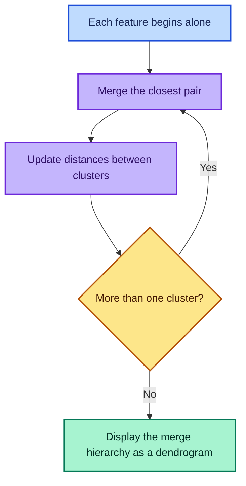

### Build a Feature Dendrogram

```python
import matplotlib.pyplot as plt
import numpy as np
from scipy.cluster import hierarchy
from scipy.spatial.distance import squareform

# Calculate pairwise Spearman correlations among numeric feature columns.
spearman = feature_frame.corr(method="spearman")

# Convert correlation magnitude into a symmetric dissimilarity matrix.
distance = 1 - spearman.abs()

# Remove tiny floating-point asymmetries and set an exact zero diagonal.
distance = (distance + distance.T) / 2
np.fill_diagonal(distance.values, 0)

# Convert the square matrix into SciPy's condensed-distance representation.
condensed = squareform(
    distance.to_numpy(),
    checks=True,
)

# Average linkage merges clusters using average pairwise dissimilarity.
linkage_matrix = hierarchy.linkage(
    condensed,
    method="average",
)

# Plot close feature groups joining near the leaves.
plt.figure(figsize=(12, 8))
hierarchy.dendrogram(
    linkage_matrix,
    labels=feature_frame.columns,
    orientation="left",
    leaf_font_size=9,
)
plt.xlabel("Distance = 1 − |Spearman ρ|")
plt.title("Hierarchical clustering of model features")
plt.tight_layout()
plt.show()
```

SciPy documents [`spearmanr`](https://docs.scipy.org/doc/scipy/reference/generated/scipy.stats.spearmanr.html) for rank correlation and [`linkage`](https://docs.scipy.org/doc/scipy/reference/generated/scipy.cluster.hierarchy.linkage.html) for hierarchical clustering.

### How to Read the Dendrogram

- features joining at small distance are strongly rank-related;
- a horizontal cut creates clusters at a chosen similarity threshold;
- two columns in the same cluster are candidates for redundancy testing;
- the diagram is exploratory, not proof that a feature can be deleted.

For example, sale year and elapsed sale time may be nearly identical representations of chronology.

---

## 14. Removing Redundancy Safely

### Do Not Delete an Entire Correlated Group

If `fiModelDesc` and `fiBaseModel` carry similar information, removing either one may be safe. Removing both may discard the shared signal.

### One-at-a-Time Drop Experiment

```python
from sklearn.base import clone
from sklearn.metrics import r2_score


def validation_score_without(
    fitted_template,
    X_train,
    y_train,
    X_valid,
    y_valid,
    column,
):
    """Refit after dropping one candidate feature and return validation R²."""
    # Remove exactly the same named column from both split matrices.
    reduced_train = X_train.drop(columns=[column])
    reduced_valid = X_valid.drop(columns=[column])

    # Clone configuration without reusing fitted state.
    candidate = clone(fitted_template)

    # Train from scratch so the forest adapts to the feature's absence.
    candidate.fit(reduced_train, y_train)

    # Score on the unchanged deployment-like validation rows.
    prediction = candidate.predict(reduced_valid)
    return r2_score(y_valid, prediction)


# Test one representative at a time, not every member simultaneously.
for column in redundancy_candidates:
    score = validation_score_without(
        forest,
        X_train,
        y_train,
        X_valid,
        y_valid,
        column,
    )
    print(column, score)
```

### Why OOB Can Help During Fast Screening

OOB offers a quick random-within-training score while testing many candidates. However, final deletion must also preserve performance on the temporal validation block. A feature redundant historically may be important under future shift.

### Multi-Feature Confirmation

After selecting one column to remove from each correlated group:

1. drop all chosen candidates together;
2. refit the full pipeline;
3. compare temporal RMSE and $R^2$;
4. repeat across seeds;
5. compare fit time and model size;
6. regenerate feature-importance and PDP plots.

“Score changed from 0.890 to 0.888” may be meaningless without repeated-run variability. Prefer the simpler set only when the difference is practically negligible and stable.

---

## 15. Why Univariate Plots Can Mislead

### The Marginal Relationship

A scatter plot or smoother of `SalePrice` against `YearMade` estimates something like

$$
\mathbb E[Y\mid X_j=x],
$$

the average target among rows that naturally have feature value $x$.

Those rows also differ in sale date, product type, buyer, condition, geography, and every other correlated feature.

### Example of Confounding

Suppose machines made during 1992–1997 sell for less on average. Possible explanations include:

- those years produced smaller equipment;
- many were sold during a recession;
- the sample contains different product families;
- the missing-value process changed;
- the machines were older when auctioned.

The marginal plot is descriptively correct but does not isolate the model's learned response to `YearMade`.

### Sample for Visualization

Millions of overlapping points do not create millions of visible pixels.

```python
import matplotlib.pyplot as plt
import seaborn as sns

# Sample reproducibly so plotting remains fast and legible.
plot_frame = analysis_frame.sample(
    n=min(5_000, len(analysis_frame)),
    random_state=42,
)

# Display raw observations faintly and add a flexible local smoother.
sns.regplot(
    data=plot_frame,
    x="YearMade",
    y="log_sale_price",
    lowess=True,
    scatter_kws={"alpha": 0.12, "s": 10},
    line_kws={"color": "#be185d", "linewidth": 2},
)
plt.title("Marginal relationship: YearMade versus log sale price")
plt.show()
```

This is an exploratory plot, not an “all else equal” effect.

---

## 16. Partial Dependence Plots

### What Question Does PDP Ask?

For fitted model $f$, feature of interest $X_S$, and all remaining features $X_C$, partial dependence is

$$
PD_S(x_S)
=
\mathbb E_{X_C}
\left[f(x_S,X_C)\right].
$$

The empirical brute-force estimate is

$$
\widehat{PD}_S(x_S)
=
\frac{1}{n}
\sum_{i=1}^{n}
f(x_S,x_C^{(i)}).
$$

In words:

1. choose a value such as `YearMade=1990`;
2. replace that feature with 1990 for every sampled row;
3. leave all other columns unchanged;
4. predict every modified row;
5. average the predictions;
6. repeat across a grid of years.

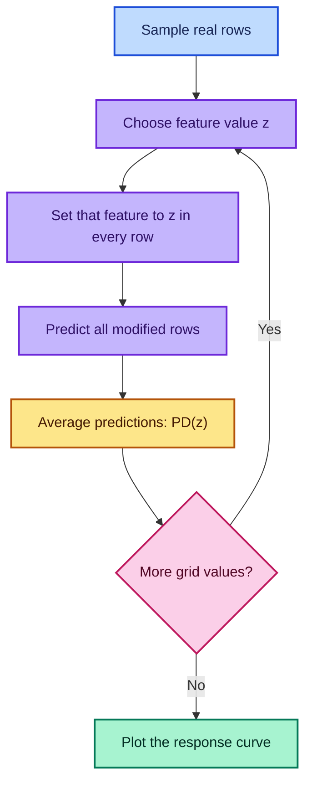

### Manual PDP Calculation

```python
import numpy as np
import pandas as pd


def manual_partial_dependence(model, X, feature, grid):
    """Return ICE predictions and their mean over a feature grid."""
    # Retain one column per tested grid value.
    ice_columns = []

    for value in grid:
        # Start from real rows so complement features keep their distribution.
        modified = X.copy()

        # Intervene on the model input by setting one feature to a constant.
        modified.loc[:, feature] = value

        # Store one prediction for every original row at this grid value.
        ice_columns.append(model.predict(modified))

    # Shape: number of rows × number of grid values.
    ice = np.column_stack(ice_columns)

    # The PDP is the pointwise mean across individual ICE rows.
    pdp = ice.mean(axis=0)

    return pd.DataFrame({
        "feature_value": grid,
        "partial_dependence": pdp,
    }), ice
```

### Current scikit-learn API

```python
import matplotlib.pyplot as plt
from sklearn.inspection import PartialDependenceDisplay

# Use a representative sample to keep brute-force interpretation affordable.
X_pdp = X_valid.sample(
    n=min(2_000, len(X_valid)),
    random_state=42,
)

# Plot the average PDP together with individual conditional curves.
PartialDependenceDisplay.from_estimator(
    estimator=model,
    X=X_pdp,
    features=["YearMade"],
    kind="both",       # Overlay the average PDP and individual ICE lines.
    centered=True,     # Emphasize changes relative to each row's starting point.
    subsample=300,     # Limit visible ICE curves for readability.
    random_state=42,   # Reproduce the displayed ICE subset.
    method="brute",   # Required for ICE and works with general pipelines.
)
plt.tight_layout()
plt.show()
```

The current [scikit-learn PDP/ICE guide](https://scikit-learn.org/stable/modules/partial_dependence.html) defines PDP as an expectation over complement features and documents the brute-force sample average.

---

## 17. Individual Conditional Expectation (ICE)

### What is ICE?

A PDP averages the model response over many rows. An **Individual Conditional Expectation** curve keeps the rows separate.

For observation \(i\), feature \(j\), and proposed feature value \(z\):

$$
\operatorname{ICE}_{i,j}(z)
=
\hat f\!\left(z,\mathbf{x}_{-j}^{(i)}\right)
$$

The PDP is simply the pointwise average of the ICE curves:

$$
\widehat{PD}_j(z)
=
\frac{1}{n}\sum_{i=1}^{n}\operatorname{ICE}_{i,j}(z)
$$

### Why keep the curves separate?

An average can hide important subgroups. Suppose changing `YearMade` increases the prediction for newer excavators but has almost no effect for small tractors. The average PDP may show a modest rise, even though that shape describes neither group well.

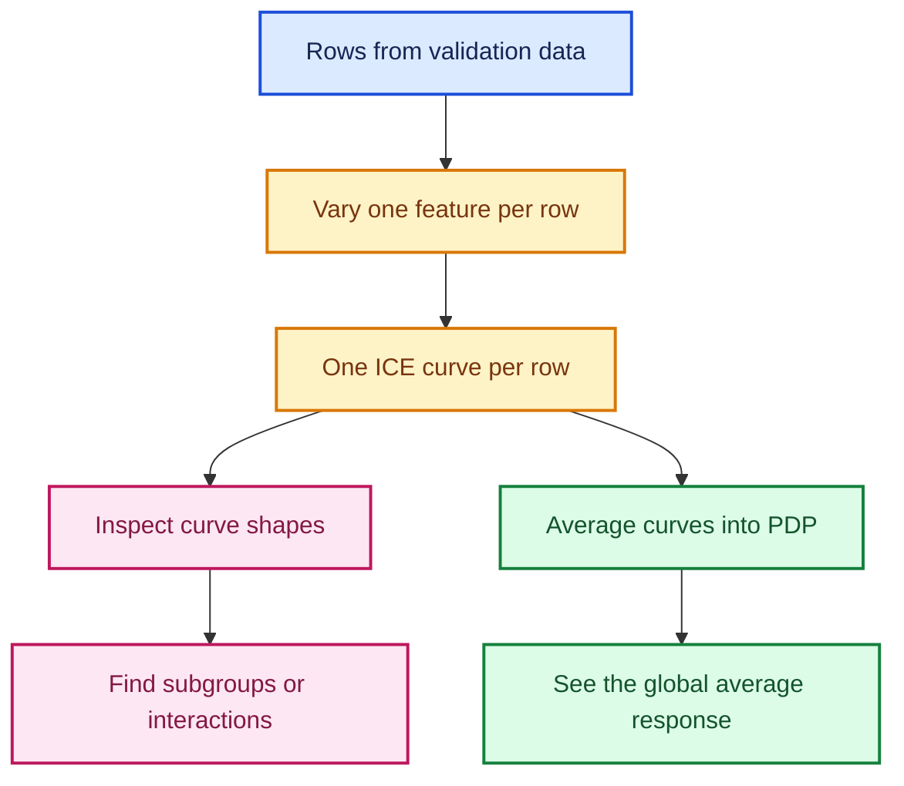

### Centered ICE (cICE)

Raw ICE curves may start at very different prediction levels. Centering each curve at a reference grid value \(z_0\) reveals its *change* instead:

$$
\operatorname{cICE}_{i,j}(z)
=
\operatorname{ICE}_{i,j}(z)
-
\operatorname{ICE}_{i,j}(z_0)
$$

Use cICE when the shape and slope matter more than the absolute prediction. In current scikit-learn, `centered=True` asks the display to center ICE and PDP lines.

### Grouping similar ICE shapes

The transcript proposes clustering curves so that hundreds of lines become a few representative shapes. A practical version is:

```python
import matplotlib.pyplot as plt
import numpy as np
from sklearn.cluster import KMeans

# `ice` is shaped (number_of_rows, number_of_grid_points), as returned by
# `manual_partial_dependence` in the previous section.
centered_ice = ice - ice[:, [0]]  # Subtract each row's first grid prediction.

# Group rows according to the *shape* of their centered response curves.
kmeans = KMeans(
    n_clusters=5,       # Five summaries are easier to inspect than 300 lines.
    n_init="auto",     # Use the current automatic initialization strategy.
    random_state=42,    # Make the grouping reproducible.
)
cluster_id = kmeans.fit_predict(centered_ice)

for cluster in range(kmeans.n_clusters):
    members = centered_ice[cluster_id == cluster]
    if len(members) == 0:
        continue  # Defensive guard in case a cluster receives no rows.

    # Draw the mean centered curve for this subgroup.
    plt.plot(
        grid,
        members.mean(axis=0),
        linewidth=2,
        label=f"Cluster {cluster + 1} (n={len(members)})",
    )

plt.axhline(0, color="black", linewidth=1, linestyle="--")
plt.xlabel("YearMade")
plt.ylabel("Change in predicted log price")
plt.legend()
plt.tight_layout()
plt.show()
```

Clustering does **not** prove that the groups are real market segments. It is a discovery tool: inspect which original row attributes distinguish the clusters, and then validate the pattern on held-out data.

---

## 18. Two-feature partial dependence

### What question does it answer?

A one-feature PDP asks, “What does the model predict as this feature changes on average?” A two-feature PDP asks how the prediction surface changes when **two** features vary together.

For features \(j\) and \(k\):

$$
\widehat{PD}_{j,k}(a,b)
=
\frac{1}{n}
\sum_{i=1}^{n}
\hat f\!\left(a,b,\mathbf{x}_{-(j,k)}^{(i)}\right)
$$

This is especially useful when the first feature's effect appears to depend on the second feature.

### Example: manufacture year and sale date

An older-looking `YearMade` may mean something different in 1990 than in 2010. Their relationship is naturally summarized by machine age:

$$
\text{MachineAgeAtSale}
=
\text{SaleYear}-\text{YearMade}
$$

If a two-feature surface changes primarily along diagonals of constant age, that is a clue that the model learned an age-like interaction.

```python
import matplotlib.pyplot as plt
from sklearn.inspection import PartialDependenceDisplay

# A tuple requests joint partial dependence for the two named features.
PartialDependenceDisplay.from_estimator(
    estimator=model,
    X=X_pdp,
    features=[("YearMade", "saleElapsed")],
    kind="average",   # Two-way displays show the average response surface.
    method="brute",   # Re-predict explicitly for each point on the 2-D grid.
    grid_resolution=30,
)
plt.tight_layout()
plt.show()
```

### How to read the surface

- **Nearly vertical contours:** the horizontal-axis feature dominates.
- **Nearly horizontal contours:** the vertical-axis feature dominates.
- **Bent or diagonal contours:** the two features interact.
- **Flat regions:** the fitted model changes little there, or the trees have few relevant splits there.

Always compare the surface with the observed joint distribution. A visually dramatic corner containing almost no real rows should not drive a business conclusion.

---

## 19. Categorical partial dependence

### Definition

For a category \(c\), categorical partial dependence is:

$$
\widehat{PD}_j(c)
=
\frac{1}{n}
\sum_{i=1}^{n}
\hat f\!\left(c,\mathbf{x}_{-j}^{(i)}\right)
$$

It answers: “If every sampled row were assigned category \(c\), while its other recorded properties stayed fixed, what would the model predict on average?”

### Safe approach: intervene on the original category

```python
import matplotlib.pyplot as plt
from sklearn.inspection import PartialDependenceDisplay

# `model` is a fitted pipeline that accepts the original DataFrame and performs
# its own categorical preprocessing internally.
PartialDependenceDisplay.from_estimator(
    estimator=model,
    X=X_pdp,
    features=["Enclosure"],
    categorical_features=["Enclosure"],  # Render category effects as bars.
    kind="average",
    method="brute",
)
plt.tight_layout()
plt.show()
```

For example, `EROPS AC` commonly denotes an **enclosed rollover protective structure with air conditioning**. A positive PDP difference may reflect buyer preferences, operator comfort, machine type, or correlated equipment specifications—it is not automatically the price caused by adding air conditioning.

### One-hot warning

If a category was expanded to columns such as:

- `Enclosure_EROPS`
- `Enclosure_EROPS_AC`
- `Enclosure_OROPS`

then changing just one dummy can create invalid rows with zero active categories or several active categories. Prefer intervening on the original categorical column through a fitted pipeline. If that is impossible, change the entire one-hot group together so every synthetic row remains valid.

> **Interpretation rule:** category PDP bars compare the model's average predictions under synthetic category assignments; they are not adjusted causal treatment effects.

---

## 20. Partial-dependence limitations and responsible use

PDP is powerful because it interrogates the fitted predictor directly. The same design creates its main limitation: it may ask the model to score feature combinations that were rare or impossible in the training data.

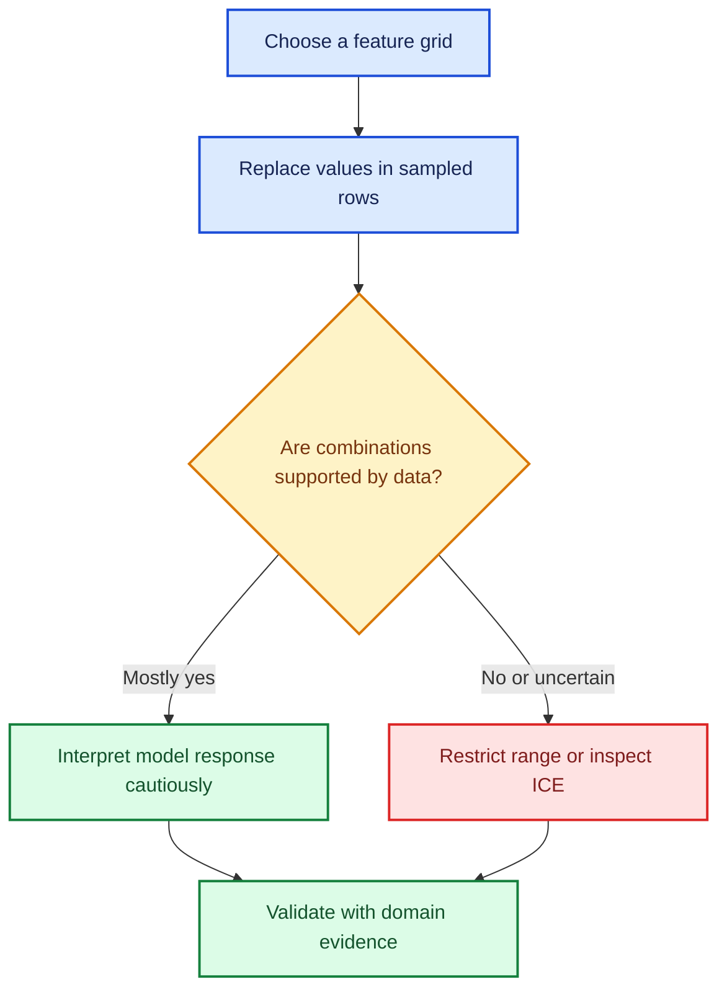

### Six limitations to remember

| Limitation | Why it matters | Practical response |
|---|---|---|
| Correlated inputs | Replacing one feature while freezing another can form unrealistic combinations | Inspect joint plots; use restricted grids or conditional methods |
| Extrapolation | Trees may show flat, arbitrary behavior outside observed support | Use central quantiles and display data density |
| Averaging | Opposing subgroups can cancel | Examine ICE or clustered cICE curves |
| Interaction blindness | A 1-D PDP can hide dependence on a second feature | Add a targeted 2-D PDP |
| Encoding artifacts | One-hot interventions may form invalid states | Intervene on the raw categorical feature |
| Association, not causation | The model learned observational patterns and confounding | Use experiments or causal designs for causal questions |

The [scikit-learn inspection guide](https://scikit-learn.org/stable/modules/partial_dependence.html) explicitly warns that PDP and ICE assume the feature of interest is independent of its complement; correlated features can therefore generate absurd synthetic points.

### Stay near observed support

```python
import numpy as np

# Use robust central quantiles instead of extreme minimum and maximum values.
low, high = X_valid["YearMade"].quantile([0.02, 0.98])
grid = np.linspace(low, high, 40)

# Count observations near each grid point. Sparse areas deserve less confidence.
half_window = (high - low) / 80
support_count = np.array([
    X_valid["YearMade"].between(value - half_window, value + half_window).sum()
    for value in grid
])
```

### Remember the target scale

If the model predicts \(\log(1+y)\), the PDP's vertical axis is also on that scale. A change of \(\Delta\) log units corresponds approximately to a multiplicative change:

$$
\text{relative change}=e^{\Delta}-1
$$

For example, \(\Delta=0.10\) corresponds to \(e^{0.10}-1\approx10.5\%\), not ten currency units. This percentage reading is an isolated mathematical translation of the log difference, not a causal effect.

### Choosing the right plot

| Question | Best first tool |
|---|---|
| What is present in the raw data? | Univariate or joint data plot |
| What does the model predict on average as one input varies? | 1-D PDP |
| Does the response differ among observations? | ICE or cICE |
| Do two inputs interact in the model? | 2-D PDP plus data-density check |
| Why did one row receive its prediction? | Local contribution method |

---

## 21. Feature engineering from interpretation

Interpretation can suggest a feature with clearer domain meaning. The transcript's example is machine age at sale.

### Clean invalid years before subtracting

The dataset may use sentinel values such as `1000` for an unknown manufacture year. Blind subtraction would make such a machine appear about one thousand years old.

```python
import numpy as np
import pandas as pd

def add_machine_age(frame: pd.DataFrame) -> pd.DataFrame:
    """Return a copy with cleaned manufacture year and age-at-sale features."""
    result = frame.copy()  # Avoid changing the caller's DataFrame in place.

    # Convert the sale timestamp to a calendar year.
    sale_year = pd.to_datetime(result["saledate"]).dt.year

    # A plausible manufacture year must be modern and cannot follow the sale.
    is_known_year = result["YearMade"].between(1900, sale_year)

    # Preserve missingness explicitly; it may itself carry predictive signal.
    result["YearMade_missing"] = ~is_known_year
    result["YearMade_clean"] = result["YearMade"].where(is_known_year, np.nan)

    # Age has a direct domain interpretation and combines the two raw dates.
    result["MachineAgeAtSale"] = sale_year - result["YearMade_clean"]
    return result
```

### Why the engineered feature may not improve accuracy

A sufficiently flexible tree ensemble can already learn age-like behavior by splitting on both `YearMade` and sale time. Adding `MachineAgeAtSale` can therefore:

- improve interpretability;
- concentrate importance in a meaningful feature;
- leave validation error unchanged; or
- even worsen validation error slightly because of extra redundancy or noise.

The decision must come from held-out performance, stability, and interpretability—not from importance alone.

```python
from sklearn.base import clone

# Build the candidate feature consistently in both temporal partitions.
X_train_age = add_machine_age(X_train)
X_valid_age = add_machine_age(X_valid)

# Clone the full pipeline so the baseline model remains untouched.
age_model = clone(model)
age_model.fit(X_train_age, y_train)

# Compare on exactly the same untouched validation rows and metric.
baseline_score = rmse(y_valid, model.predict(X_valid))
age_score = rmse(y_valid, age_model.predict(X_valid_age))
print({"baseline_rmse": baseline_score, "age_feature_rmse": age_score})
```

> A useful feature can be valuable because it simplifies reasoning, even if it does not win on a single error number. But an apparent improvement should still be confirmed across appropriate time splits or repeated validation periods.

---

## 22. Local tree-path contributions

Global importance tells us what matters across a dataset. A local explanation asks:

> Why did the model make **this particular prediction**?

### Exact accounting for one decision tree

Let \(v(n)\) be the prediction stored at tree node \(n\). Following one row from the root to its leaf gives:

$$
T(\mathbf{x})
=
v(\text{root})
+
\sum_{(p\rightarrow c)\in\operatorname{path}(\mathbf{x})}
\left[v(c)-v(p)\right]
$$

Assign each parent-to-child change to the feature used at the parent split. Grouping changes by feature produces an additive decomposition:

$$
T(\mathbf{x})=\phi_0+\sum_{j=1}^{p}\phi_j(\mathbf{x})
$$

where \(\phi_0=v(\text{root})\). The increments telescope: intermediate node values cancel, leaving the leaf prediction.

For a forest of \(B\) trees, average the baselines and feature contributions:

$$
\hat f(\mathbf{x})
=
\underbrace{\frac{1}{B}\sum_{b=1}^{B}\phi_{0b}}_{\text{forest baseline}}
+
\sum_{j=1}^{p}
\underbrace{\frac{1}{B}\sum_{b=1}^{B}\phi_{jb}(\mathbf{x})}_{\text{feature }j\text{ contribution}}
$$

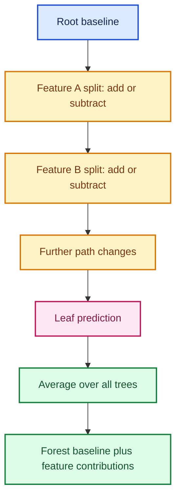

### Commented implementation

The following code explains a forest fitted directly to a numeric matrix. If the estimator lives inside a preprocessing pipeline, first transform the row and retrieve the transformed feature names.

```python
import numpy as np
import pandas as pd

def tree_path_contributions(tree, X_numeric):
    """Return predictions, root baselines, and per-feature path changes."""
    X_array = np.asarray(X_numeric)
    structure = tree.tree_

    # For a single-output regressor, each node stores one mean target value.
    node_value = structure.value[:, 0, 0]
    n_rows, n_features = X_array.shape

    predictions = np.empty(n_rows)
    baselines = np.full(n_rows, node_value[0])  # Same tree root for every row.
    contributions = np.zeros((n_rows, n_features))

    for row_index, row in enumerate(X_array):
        node = 0  # Every decision path begins at the root node.

        # A leaf has identical left and right child markers (both are -1).
        while structure.children_left[node] != structure.children_right[node]:
            feature_index = structure.feature[node]
            threshold = structure.threshold[node]

            feature_value = row[feature_index]

            # Reproduce native missing-value routing in current scikit-learn.
            if np.isnan(feature_value) and hasattr(structure, "missing_go_to_left"):
                child = (
                    structure.children_left[node]
                    if structure.missing_go_to_left[node]
                    else structure.children_right[node]
                )
            elif feature_value <= threshold:
                child = structure.children_left[node]
            else:
                child = structure.children_right[node]

            # Credit this node-to-child prediction change to the split feature.
            contributions[row_index, feature_index] += (
                node_value[child] - node_value[node]
            )
            node = child

        predictions[row_index] = node_value[node]  # The reached leaf value.

    # The path changes must reconstruct every tree prediction exactly.
    np.testing.assert_allclose(
        predictions,
        baselines + contributions.sum(axis=1),
        rtol=1e-10,
        atol=1e-10,
    )
    return predictions, baselines, contributions


def forest_path_contributions(forest, X_numeric):
    """Average exact path decompositions over all trees in a random forest."""
    tree_results = [
        tree_path_contributions(tree, X_numeric)
        for tree in forest.estimators_
    ]

    # Stack outputs by tree, then average because a forest averages its trees.
    predictions = np.mean([result[0] for result in tree_results], axis=0)
    baselines = np.mean([result[1] for result in tree_results], axis=0)
    contributions = np.mean([result[2] for result in tree_results], axis=0)

    # Check both the additive identity and agreement with the fitted forest.
    np.testing.assert_allclose(
        predictions,
        baselines + contributions.sum(axis=1),
        rtol=1e-10,
        atol=1e-10,
    )
    np.testing.assert_allclose(
        predictions,
        forest.predict(X_numeric),
        rtol=1e-10,
        atol=1e-10,
    )
    return predictions, baselines, contributions
```

### Build a readable explanation for one row

```python
# Explain the first validation row. The forest must match the matrix's columns.
X_one = X_valid_numeric.iloc[[0]]
prediction, baseline, contribution = forest_path_contributions(
    forest,
    X_one,
)

# Keep names, values, and contributions in the same table before sorting.
local_explanation = pd.DataFrame({
    "feature": X_valid_numeric.columns,
    "observed_value": X_one.iloc[0].to_numpy(),
    "contribution": contribution[0],
})

# Sort whole rows by absolute contribution; never sort each array separately.
local_explanation = local_explanation.sort_values(
    "contribution",
    key=np.abs,
    ascending=False,
)

print(f"baseline:   {baseline[0]:.4f}")
print(f"prediction: {prediction[0]:.4f}")
print(local_explanation.head(10))
```

### How to interpret the signs

- A positive contribution moved the row's prediction above the forest baseline.
- A negative contribution moved it below the baseline.
- A near-zero contribution means that feature caused little net movement along these particular paths.
- The contributions explain the **fitted computation**, not the physical or causal effect of changing a feature.

This path method is an exact additive accounting of a fitted tree ensemble, but it is not the same as TreeSHAP. With correlated features, multiple valid attribution conventions can distribute credit differently.

If the target is `log1p(price)`, contributions add in log space:

$$
\widehat{\log(1+\text{price})}
=
\phi_0+\sum_j\phi_j
$$

Convert the **complete** prediction back with `np.expm1(prediction)`. Although \(e^{\phi_j}-1\) describes an isolated multiplicative factor, feature contributions should not be presented as independent causal percentage changes.

---

## 23. Complete modern workflow

This section joins the lesson into one repeatable process. It assumes that `X` is a time-ordered pandas DataFrame, `y` is the aligned regression target, and the feature table has already been converted to a numeric matrix. Use the categorical pipeline from Sections 11–12 when raw strings are present.

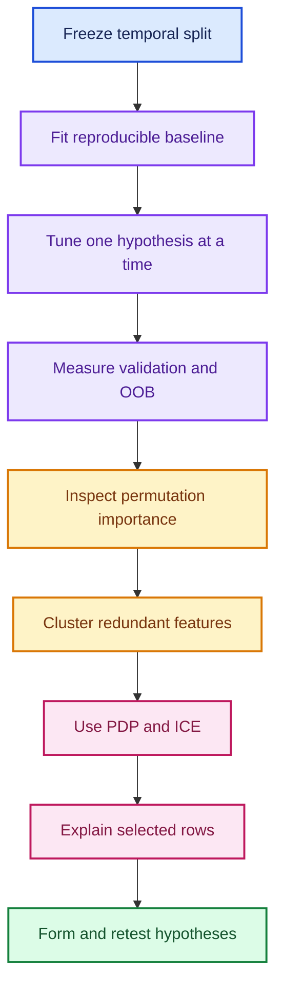

### A compact, commented template

```python
import numpy as np
import pandas as pd
from sklearn.ensemble import RandomForestRegressor
from sklearn.inspection import PartialDependenceDisplay, permutation_importance
from sklearn.metrics import mean_squared_error

# ---------------------------------------------------------------------------
# 1. Freeze a chronological split before inspecting validation performance.
# ---------------------------------------------------------------------------
cut = int(len(X) * 0.80)
X_train, X_valid = X.iloc[:cut].copy(), X.iloc[cut:].copy()
y_train, y_valid = y.iloc[:cut].copy(), y.iloc[cut:].copy()

# ---------------------------------------------------------------------------
# 2. Fit a strong-but-regularized, reproducible random-forest baseline.
# ---------------------------------------------------------------------------
forest = RandomForestRegressor(
    n_estimators=300,     # Enough trees for a reasonably stable average.
    max_samples=0.75,     # Give trees different row samples.
    min_samples_leaf=5,   # Smooth very small, noisy leaves.
    max_features=0.7,     # Decorrelate trees through feature subsampling.
    bootstrap=True,       # Required for max_samples and OOB estimation.
    oob_score=True,       # Calculate a within-training diagnostic.
    n_jobs=-1,            # Train independent trees in parallel.
    random_state=42,      # Reproduce sampling and feature choices.
)
forest.fit(X_train, y_train)

# ---------------------------------------------------------------------------
# 3. Compare the training, OOB, and later-period validation diagnostics.
# ---------------------------------------------------------------------------
train_prediction = forest.predict(X_train)
valid_prediction = forest.predict(X_valid)

def rmse(actual, predicted):
    """Return root mean squared error in the model's target units."""
    return mean_squared_error(actual, predicted) ** 0.5

diagnostics = {
    "train_rmse": rmse(y_train, train_prediction),
    "valid_rmse": rmse(y_valid, valid_prediction),
    "oob_r2": forest.oob_score_,
}
print(diagnostics)

# ---------------------------------------------------------------------------
# 4. Rank columns by the validation harm caused by shuffling each one.
# ---------------------------------------------------------------------------
permutation = permutation_importance(
    forest,
    X_valid,
    y_valid,
    scoring="neg_root_mean_squared_error",
    n_repeats=10,         # Repeated shuffles reveal variability.
    random_state=42,
    n_jobs=-1,
)

importance = pd.DataFrame({
    "feature": X_valid.columns,
    "mean_importance": permutation.importances_mean,
    "importance_std": permutation.importances_std,
}).sort_values("mean_importance", ascending=False)
print(importance.head(15))

# ---------------------------------------------------------------------------
# 5. Plot the model's average and row-level response for a chosen feature.
# ---------------------------------------------------------------------------
feature_to_explain = importance.iloc[0]["feature"]
X_pdp = X_valid.sample(n=min(2_000, len(X_valid)), random_state=42)

PartialDependenceDisplay.from_estimator(
    estimator=forest,
    X=X_pdp,
    features=[feature_to_explain],
    kind="both",         # Draw PDP plus ICE curves.
    centered=True,       # Compare changes rather than starting levels.
    subsample=300,       # Limit individual curves for readability.
    random_state=42,
    method="brute",
)

# ---------------------------------------------------------------------------
# 6. Use Section 22's function to explain selected rows exactly.
# ---------------------------------------------------------------------------
row = X_valid.iloc[[0]]
prediction, baseline, contribution = forest_path_contributions(forest, row)

local = pd.DataFrame({
    "feature": row.columns,
    "value": row.iloc[0].to_numpy(),
    "contribution": contribution[0],
}).sort_values("contribution", key=np.abs, ascending=False)

print("baseline:", baseline[0])
print("prediction:", prediction[0])
print(local.head(10))
```

### Reproducible experiment record

For every serious run, store at least:

| Item | Why record it? |
|---|---|
| Data range and split date | Prevent accidental changes to the evaluation problem |
| Feature list and transforms | Explain exactly what information reached the model |
| Hyperparameters and random seed | Make the run reproducible |
| Train, OOB, and validation metrics | Separate fit, internal diagnostics, and deployment-like performance |
| Runtime and hardware | Compare computational cost fairly |
| Importance uncertainty | Avoid overreading one random shuffle |
| Notes about suspicious PDP regions | Preserve data-support and correlation warnings |

---

## 24. Common mistakes

| Mistake | Why it is wrong or risky | Better practice |
|---|---|---|
| Treating `max_samples` as one fixed subset shared by all trees | Each tree draws its own bootstrap sample | Think “sample size per tree,” not “global data reduction” |
| Saying smaller per-tree samples make trees more correlated | Less overlap usually tends to reduce error correlation | Discuss both reduced strength and increased diversity |
| Assuming `max_features` removes columns from the entire tree | A new subset is considered at each split | Explain it at node level |
| Expecting OOB to regularize the forest | OOB measures held-out bootstrap rows; it does not change splits | Tune explicit complexity parameters |
| Replacing a temporal validation set with OOB | OOB does not reproduce future distribution shift | Keep the chronological holdout |
| Ranking raw linear coefficients without scaling | Units determine coefficient magnitude | Standardize numeric variables and inspect uncertainty |
| Reading integer category codes as meaningful distances | Arbitrary codes create artificial order | Use one-hot or a model with suitable categorical handling |
| One-hot encoding every identifier | Width and overfitting can explode | Pool rare levels or choose another encoding/model |
| Deleting every feature in a correlated cluster | The whole signal may disappear | Retain and test at least one representative |
| Dropping columns in place during an experiment | Later trials no longer use the same data | Create explicit candidate column lists |
| Treating impurity importance as permutation importance | They use different calculations and have different biases | Name the method precisely |
| Interpreting a univariate data plot as model behavior | Marginal associations mix correlated variables | Use PDP/ICE for the fitted response |
| Treating PDP as causal | PDP changes inputs synthetically in an observational predictor | Phrase conclusions as “the model predicts” |
| Ignoring data density on a 2-D PDP | Sparse regions can look authoritative | Overlay support or restrict ranges |
| Changing only one column of a one-hot group | The synthetic row may be invalid | Change the raw category or the full dummy group |
| Sorting feature names and contributions independently | Names become paired with the wrong values | Sort complete table rows |
| Converting each log contribution into a standalone causal percentage | Contributions are additive accounting in model space | Back-transform the full prediction and label local accounting carefully |
| Assuming an engineered feature must improve accuracy | Trees may already learn the interaction | Validate it on the same untouched holdout |

---

## 25. Practice exercises

Try each problem before opening its worked answer.

### Exercise 1 — Approximate balanced depth

A tree receives \(m=20{,}000\) rows and uses `min_samples_leaf=4`. Estimate the balanced maximum depth.

<details>
<summary>Worked answer</summary>

The approximate maximum number of leaves is:

$$
L_{\max}\approx\frac{m}{\ell}
=\frac{20{,}000}{4}=5{,}000
$$

A balanced binary tree of depth \(d\) has about \(2^d\) leaves, so:

$$
d\approx\left\lceil\log_2(5{,}000)\right\rceil
=\lceil12.29\rceil=13
$$

Real trees are unbalanced and can stop early, so 13 is intuition, not an exact promise.

</details>

### Exercise 2 — Omitted-row probability

There are \(n\) training rows, and each tree draws \(m=0.5n\) bootstrap observations. Approximately what fraction of rows is omitted from a given tree?

<details>
<summary>Worked answer</summary>

For a particular row:

$$
P(\text{omitted})
=
\left(1-\frac{1}{n}\right)^m
\approx e^{-m/n}
=e^{-0.5}
\approx0.6065
$$

About **60.7%** of unique training rows are OOB for that tree. Sampling half as many observations does not mean exactly half the unique rows are selected, because bootstrap sampling includes replacements.

</details>

### Exercise 3 — Diversity in an ensemble

Suppose each tree error has variance \(\sigma^2=4\), pairwise correlation \(\rho=0.20\), and the forest contains \(B=100\) trees. Estimate the ensemble error variance using the common-correlation approximation.

<details>
<summary>Worked answer</summary>

$$
\operatorname{Var}(\bar\varepsilon)
\approx
\rho\sigma^2+
\frac{1-\rho}{B}\sigma^2
$$

Substitute the values:

$$
(0.20)(4)+\frac{0.80}{100}(4)
=0.8+0.032=0.832
$$

The correlation term dominates. Adding even more trees shrinks the second term, but does little to the \(0.8\) correlation floor. This is why diversity matters.

</details>

### Exercise 4 — Spearman rank correlation

Calculate Spearman's \(\rho_s\) for:

$$
X=[1,2,3,4],\qquad Y=[10,30,20,40]
$$

<details>
<summary>Worked answer</summary>

The ranks of \(X\) are \([1,2,3,4]\). The ranks of \(Y\) are \([1,3,2,4]\). Rank differences are \([0,-1,1,0]\), so \(\sum d_i^2=2\).

With no tied ranks:

$$
\rho_s
=1-\frac{6\sum d_i^2}{n(n^2-1)}
=1-\frac{6(2)}{4(16-1)}
=1-\frac{12}{60}
=0.8
$$

The variables have a strong monotonic association, though the middle ordering is not perfect.

</details>

### Exercise 5 — PDP versus ICE

At one grid value, three ICE predictions are \(8.0\), \(10.0\), and \(15.0\). What is the PDP value? What important information does that number omit?

<details>
<summary>Worked answer</summary>

$$
\widehat{PD}=rac{8+10+15}{3}=11
$$

The average omits heterogeneity: individual rows sit three units below, one below, and four above the mean. Across several grid values, their curve slopes could even point in different directions.

</details>

### Exercise 6 — Local additive prediction

A local explanation has baseline \(10.2\) and feature contributions \(+0.1,-0.4,+0.3\). Reconstruct the prediction.

<details>
<summary>Worked answer</summary>

$$
\hat y=10.2+0.1-0.4+0.3=10.2
$$

The positive and negative movements cancel. A zero *net* movement does not mean the individual features were unused.

</details>

### Exercise 7 — Diagnose the validation gap

Training and random OOB scores are strong, but performance collapses on the newest year's records. Increasing `min_samples_leaf` changes almost nothing. What is the leading diagnosis, and what should be checked next?

<details>
<summary>Worked answer</summary>

The leading diagnosis is **temporal distribution shift**, not merely excessive tree depth. Compare feature ranges, missingness, category frequencies, target distribution, and residuals by time. Also inspect whether important variables act as time proxies and whether new categories appear only in the later period.

</details>

### Exercise 8 — Safe categorical intervention

An `Enclosure` category is represented by three one-hot columns. Why is forcing only `Enclosure_EROPS_AC=1` unsafe, and what is the better approach?

<details>
<summary>Worked answer</summary>

Another enclosure dummy may already be 1, producing an impossible row with two enclosure states. Intervene on the original `Enclosure` column through the preprocessing pipeline. If only the encoded matrix exists, set the whole dummy group so exactly the intended state is active.

</details>

---

## 26. Quick reference

### Core formulas

| Concept | Formula | Meaning |
|---|---|---|
| Balanced depth | \(d\approx\lceil\log_2(m/\ell)\rceil\) | Rows per tree \(m\), minimum leaf size \(\ell\) |
| Bootstrap omission | \((1-1/n)^m\approx e^{-m/n}\) | Probability a row is OOB for one tree |
| Ensemble error variance | \(\rho\sigma^2+(1-\rho)\sigma^2/B\) | Strength–correlation trade-off under a simplifying assumption |
| Spearman without ties | \(1-6\sum d_i^2/[n(n^2-1)]\) | Correlation of ranks |
| Correlation distance | \(d_{ij}=1-|\rho_{ij}|\) | Groups positive and negative monotonic redundancy |
| PDP | \(n^{-1}\sum_i\hat f(z,\mathbf{x}_{-j}^{(i)})\) | Average synthetic model response |
| ICE | \(\hat f(z,\mathbf{x}_{-j}^{(i)})\) | One row's synthetic response |
| cICE | \(ICE_i(z)-ICE_i(z_0)\) | Response change from a reference |
| Two-way PDP | \(n^{-1}\sum_i\hat f(a,b,\mathbf{x}_{-(j,k)}^{(i)})\) | Average joint response surface |
| Tree path accounting | \(T(x)=v(root)+\sum[v(child)-v(parent)]\) | Exact local tree prediction decomposition |
| Log-scale change | \(e^{\Delta}-1\) | Multiplicative translation of a log difference |

### Hyperparameter intuition

| Change | Typical effect on one tree | Typical effect on forest diversity | Typical cost effect |
|---|---|---|---|
| Lower `max_samples` | Weaker, trained on fewer observations | Higher | Faster and smaller |
| Higher `min_samples_leaf` | Smoother, less variable | Can reduce unnecessary instability | Faster prediction; often smaller trees |
| Lower `max_features` | Splits may be weaker | Higher | Often faster split search |
| Higher `n_estimators` | No change to an individual tree | More stable average | Slower and larger |

“Typical” is deliberate: data geometry and implementation details can reverse a small effect. Validation decides.

### Interpretation checklist

- Name the importance method precisely.
- Show uncertainty across shuffles, seeds, or time windows.
- Inspect correlated substitutes before dropping a feature.
- State the target scale on every response plot.
- Display or check data support around PDP regions.
- Use ICE when an average could conceal subgroups.
- Keep categorical interventions valid.
- Say “the model predicts,” not “the feature causes.”
- Verify that local contributions sum to the prediction.

---

## 27. Fun facts

1. **Why about 36.8% OOB?** A full-size bootstrap sample makes \(n\) draws with replacement. The omission probability tends to \((1-1/n)^n\rightarrow e^{-1}\approx0.368\). The constant \(e\) appears naturally from repeated tiny probabilities.

2. **Random forests randomize twice.** Bootstrap sampling randomizes rows; `max_features` randomizes candidate columns at each split. These are different sources of diversity.

3. **Tree-path sums telescope.** Adding every child-minus-parent change cancels all internal node values. Only the leaf minus the root remains—exactly like adjacent differences in a sequence.

4. **Rank correlation recognizes nonlinear monotonicity.** If \(Y=X^3\) over an increasing range, Pearson correlation may be below 1, but Spearman correlation is exactly 1 when there are no ties.

5. **A flat PDP does not prove irrelevance.** Strong positive effects for one subgroup and negative effects for another can average to nearly zero. ICE can uncover the cancellation.

6. **Redundant features can make importance look democratic.** Two near-duplicates may share predictive credit; removing one can make the survivor appear suddenly important even when model accuracy barely changes.

7. **Feature engineering can improve language before accuracy.** `MachineAgeAtSale` may not beat a forest already using sale time and manufacture year, yet it can make plots and domain discussions substantially clearer.

---

## Resources

### Original lesson

- [YouTube — Intro to Machine Learning, Lesson 4](https://www.youtube.com/watch/0v93qHDqq_g) — the transcript source used to build these notes.

### Current reference documentation

- [scikit-learn — `RandomForestRegressor`](https://scikit-learn.org/stable/modules/generated/sklearn.ensemble.RandomForestRegressor.html)
- [scikit-learn — `OneHotEncoder`](https://scikit-learn.org/stable/modules/generated/sklearn.preprocessing.OneHotEncoder.html)
- [scikit-learn — permutation feature importance](https://scikit-learn.org/stable/modules/permutation_importance.html)
- [scikit-learn — partial dependence and ICE](https://scikit-learn.org/stable/modules/partial_dependence.html)
- [scikit-learn — `PartialDependenceDisplay`](https://scikit-learn.org/stable/modules/generated/sklearn.inspection.PartialDependenceDisplay.html)
- [SciPy — `spearmanr`](https://docs.scipy.org/doc/scipy/reference/generated/scipy.stats.spearmanr.html)
- [SciPy — hierarchical `linkage`](https://docs.scipy.org/doc/scipy/reference/generated/scipy.cluster.hierarchy.linkage.html)

---

## Final takeaway

The lesson is not merely a list of plotting functions or forest settings. It presents a disciplined loop:

1. build diverse trees that are individually useful;
2. evaluate them on the distribution that resembles deployment;
3. identify signal without confusing importance methods;
4. simplify redundant representations carefully;
5. inspect average behavior, heterogeneous behavior, and individual predictions;
6. convert observations into hypotheses; and
7. retest every modeling change on untouched data.

Interpretability is most valuable when it improves the next modeling or domain question—not when a colorful plot is treated as proof.
