# Intro to Machine Learning — Lesson 5

## Generalization, Time-Aware Validation, Tree Explanations, Distribution Shift, and a Random-Forest Skeleton

> Detailed study notes developed from the supplied YouTube transcript. The explanations modernize version-sensitive APIs and distinguish the transcript's teaching intuition from claims that require extra care in production.

**Original lesson:** [YouTube — Intro to Machine Learning, Lesson 5](https://www.youtube.com/watch/3jl2h9hSRvc)

---

## Compatibility and accuracy notes

The lesson's central ideas remain valuable, but several points deserve modern clarification:

1. **Time-aware cross-validation exists.** Randomly shuffled K-fold validation is usually inappropriate when deployment predicts the future, but expanding-window and rolling-window schemes are valid forms of cross-validation. Current scikit-learn provides [`TimeSeriesSplit`](https://scikit-learn.org/stable/modules/generated/sklearn.model_selection.TimeSeriesSplit.html).
2. **A final test set should remain sealed.** Repeatedly checking candidate models on a supposed test set and redesigning validation from the results turns that test set into another validation set. Use historical backtests, a second development holdout, or deployment replays to design validation; evaluate the final test once.
3. **Kaggle leaderboard proportions are competition-specific.** The transcript's public/private split percentages are an illustration, not a universal rule.
4. **OOB is not guaranteed to score worse than validation.** An OOB prediction normally averages fewer eligible trees and can therefore be noisier, but dataset shift, split design, and randomness can make either metric higher.
5. **Adversarial validation is normally classification.** Label training rows `0`, validation/test rows `1`, fit a classifier, and measure ROC-AUC. An AUC near \(0.5\) means the classifier cannot rank the groups; a high AUC signals detectable distribution shift.
6. **Standard regression trees do not trend beyond observed data.** Their leaf predictions are averages of training targets, so ordinary random forests are weak extrapolators.
7. **The modern NumPy random API uses generators.** Prefer `np.random.default_rng(seed)` over changing legacy global state with `np.random.seed(seed)`.
8. **`__init__` initializes an instance.** It is commonly called the constructor, although Python technically creates the object in `__new__` and initializes it in `__init__`.
9. **The partial custom ensemble in the transcript samples rows without replacement.** That differs from scikit-learn's default bootstrap sampling. Until random features are also considered at each split, it is more precisely a subsampled or bagged tree ensemble.

---

## Table of contents

1. [Learning outcomes](#learning-outcomes)
2. [Lesson map](#lesson-map)
3. [Generalization is the goal](#1-generalization-is-the-goal)
4. [Training, validation, and test sets](#2-training-validation-and-test-sets)
5. [How validation becomes overfit](#3-how-validation-becomes-overfit)
6. [Design the split around deployment](#4-design-the-split-around-deployment)
7. [Time-aware validation](#5-time-aware-validation)
8. [Recency versus amount of training data](#6-recency-versus-amount-of-training-data)
9. [Retraining after model selection](#7-retraining-after-model-selection)
10. [Out-of-bag evaluation](#8-out-of-bag-evaluation)
11. [OOB versus temporal validation](#9-oob-versus-temporal-validation)
12. [Cross-validation](#10-cross-validation)
13. [Choosing the right splitter](#11-choosing-the-right-splitter)
14. [Does validation rank models correctly?](#12-does-validation-rank-models-correctly)
15. [Public and private leaderboards](#13-public-and-private-leaderboards)
16. [Tree-path contributions](#14-tree-path-contributions)
17. [Waterfall charts](#15-waterfall-charts)
18. [The extrapolation problem](#16-the-extrapolation-problem)
19. [Adversarial validation](#17-adversarial-validation)
20. [Reading shift-feature importance](#18-reading-shift-feature-importance)
21. [Removing time proxies safely](#19-removing-time-proxies-safely)
22. [A production evaluation workflow](#20-a-production-evaluation-workflow)
23. [Top-down programming](#21-top-down-programming)
24. [Testing a custom ML implementation](#22-testing-a-custom-ml-implementation)
25. [Pseudorandom numbers and seeds](#23-pseudorandom-numbers-and-seeds)
26. [Random-forest mathematics](#24-random-forest-mathematics)
27. [Python OOP primer](#25-python-oop-primer)
28. [Building the ensemble layer](#26-building-the-ensemble-layer)
29. [Representing a decision-tree node](#27-representing-a-decision-tree-node)
30. [Working educational implementation](#28-working-educational-implementation)
31. [Common mistakes](#29-common-mistakes)
32. [Practice exercises](#30-practice-exercises)
33. [Quick reference](#31-quick-reference)
34. [Fun facts](#32-fun-facts)
35. [Resources](#resources)

---

## Learning outcomes

After studying these notes, you should be able to:

- distinguish generalization from computational scaling;
- explain the different permissions attached to training, validation, and test sets;
- quantify why trying many models can overfit a reusable validation set;
- build chronological, grouped, stratified, and rolling validation schemes;
- derive the approximately \(36.8\%\) OOB omission probability of full bootstrap samples;
- explain why each row's OOB prediction normally uses only a subset of trees;
- compare holdout validation, OOB evaluation, K-fold CV, and time-series CV;
- determine whether a validation design preserves model rankings likely to matter in deployment;
- decompose a tree prediction into a baseline plus path contributions;
- create and interpret a waterfall chart;
- prove why an ordinary regression forest cannot extrapolate beyond its training-target range;
- use adversarial validation to identify train–validation or train–test shift;
- test removal of time proxies without discarding useful features blindly;
- explain seeds, pseudorandom generators, and the difference between reproducibility and security;
- describe class, object, method, attribute, `self`, and `__init__` in Python;
- implement the ensemble layer of a forest with readable, top-down code; and
- test educational ML code against a trusted reference implementation.

---

## Lesson map

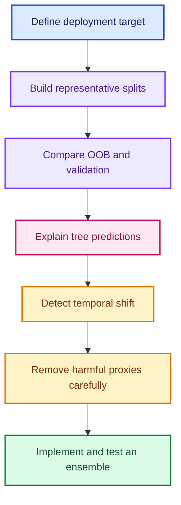

---

## 1. Generalization is the goal

### What is generalization?

Generalization is the ability of a learned function to perform well on **new observations drawn from the environment in which it will actually be used**.

Let \(P_{\text{deploy}}(X,Y)\) be the future deployment distribution, \(L\) a loss function, and \(\hat f\) the fitted model. The quantity we truly care about is the deployment risk:

$$
R_{\text{deploy}}(\hat f)
=
\mathbb{E}_{(X,Y)\sim P_{\text{deploy}}}
\left[L\!\left(Y,\hat f(X)\right)\right]
$$

We cannot usually evaluate this expectation directly because future examples have not arrived. A well-designed validation or test set is a finite simulation of it:

$$
\widehat R_{\text{holdout}}(\hat f)
=
\frac{1}{m}\sum_{i=1}^{m}
L\!\left(y_i,\hat f(x_i)\right)
$$

### Generalization is not scaling

| Question | Generalization | Computational scaling |
|---|---|---|
| Main concern | Does the learned pattern work on new cases? | Can the system process the required volume quickly and cheaply? |
| Failure example | Memorizes five cats and fails on five new cats | Predicts correctly but takes 30 seconds per request |
| Common measures | RMSE, accuracy, log loss, AUC on representative holdouts | Latency, throughput, memory, CPU/GPU cost |
| Remedy | Better splits, regularization, data coverage, features | Faster algorithms, batching, caching, hardware, distributed systems |

A model can scale beautifully and generalize terribly. For example, a grocery predictor may handle ten thousand requests per second while predicting only last month's buying habits in one region.

### Why training accuracy is insufficient

The empirical training risk is:

$$
\widehat R_{\text{train}}(\hat f)
=
\frac{1}{n}\sum_{i=1}^{n}
L\!\left(y_i,\hat f(x_i)\right)
$$

But \(\hat f\) was chosen using these same examples. A flexible learner can encode noise, identifiers, leakage, or quirks that will not repeat. Training performance answers, “How well can the fitted model reproduce examples it already used?” Generalization asks a different and more valuable question.

> **Intuition:** the training set is the textbook the model studied. A validation set is a mock exam. A test set is the sealed final exam. Deployment is the job.

---

## 2. Training, validation, and test sets

### Their different jobs

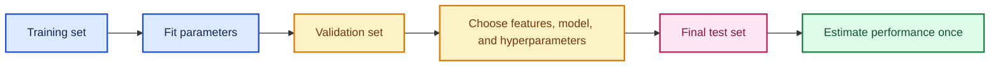

| Split | May fit model parameters? | May influence model choices? | Primary purpose |
|---|---:|---:|---|
| Training | Yes | Yes | Learn patterns and fit candidate models |
| Validation | No for the candidate being scored | Yes | Compare candidates and tune decisions |
| Test | No | No | Obtain one final, approximately unbiased estimate |

The important distinction is not the filename. It is **how information from the split is allowed to affect decisions**. If you inspect “test” results repeatedly and change the model, the data is functioning as validation data.

### No universal split percentage

An 80/10/10 or 70/15/15 split can be a starting point, but the correct sizes depend on:

- how much data is available;
- how noisy the metric is;
- rare classes or groups;
- how many model decisions will be compared;
- seasonality and deployment horizon;
- whether a later time period must remain untouched.

For a holdout mean loss with sample standard deviation \(s\), the approximate standard error is:

$$
SE(\bar L)\approx\frac{s}{\sqrt{m}}
$$

Doubling holdout size does not halve uncertainty; roughly four times as many examples are needed to halve the standard error.

### A chronological three-way split

```python
import pandas as pd


def chronological_split(frame, date_column, valid_start, test_start):
    """Split a DataFrame into older training, later validation, and newest test rows."""
    ordered = frame.sort_values(date_column).copy()  # Preserve temporal order.
    dates = pd.to_datetime(ordered[date_column])     # Normalize the comparison type.

    # Training contains only observations earlier than the validation period.
    train = ordered.loc[dates < pd.Timestamp(valid_start)].copy()

    # Validation imitates the first future period used during model development.
    valid = ordered.loc[
        (dates >= pd.Timestamp(valid_start))
        & (dates < pd.Timestamp(test_start))
    ].copy()

    # Test is the newest period and must remain sealed until the final evaluation.
    test = ordered.loc[dates >= pd.Timestamp(test_start)].copy()
    return train, valid, test
```

---

## 3. How validation becomes overfit

### Repeated feedback is information

Suppose every candidate has no real advantage, but a noisy validation comparison has probability \(\alpha\) of looking impressive by chance. If \(M\) independent candidates are tried, the probability of at least one false success is:

$$
P(\text{at least one false success})
=1-(1-\alpha)^M
$$

For \(\alpha=0.05\) and \(M=50\):

$$
1-0.95^{50}\approx0.923
$$

The independence assumption is simplified—candidate models are often correlated—but the lesson is robust: **searching over noisy scores selects both signal and luck**.

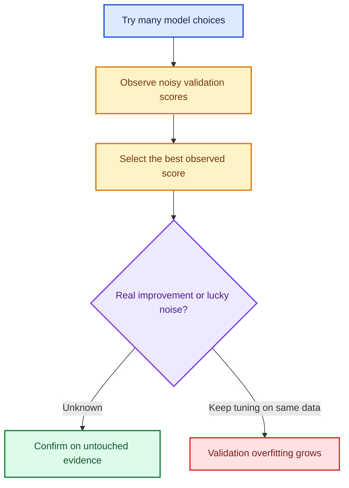

### Practical defenses

- Predeclare the primary metric and split.
- Track how many experiments were tried, not just the winner.
- Prefer changes supported by domain reasoning and multiple diagnostics.
- Repeat close comparisons across seeds or historical backtest windows.
- Use confidence intervals or score dispersion.
- Keep a final test set unavailable to the everyday modeling loop.
- After a test failure, acknowledge that the test is no longer pristine; obtain new future evidence if a fresh final estimate is required.

---

## 4. Design the split around deployment

Random splitting estimates performance only when future examples are sufficiently exchangeable with past examples. Many real systems violate that assumption.

### Start from the prediction event

Ask these questions before calling a split function:

1. **What is one prediction unit?** Customer, machine, hospital visit, store-day, image, or document?
2. **When is the prediction made?** Which information exists at that moment?
3. **What arrives later?** The label, new behavior, new products, or new sites?
4. **What must never cross splits?** A person, household, machine, patient, document source, or future-derived feature?
5. **How far ahead must the model work?** Hours, weeks, or years?
6. **How often will it be retrained?** The answer changes how old the training distribution will be at deployment.

### Common deployment-aligned split designs

| Deployment condition | Suitable split idea |
|---|---|
| Future rows after a training cutoff | Chronological holdout |
| New patients but several visits per patient | Group holdout by patient |
| New geographic regions | Group holdout by region |
| Rare classes under an IID assumption | Stratified random holdout |
| Multiple future retraining cycles | Rolling-origin backtest |
| New products and later dates | Purged group-and-time split |

### Leakage occurs when evaluation knows the future

Examples include:

- calculating preprocessing statistics on train plus holdout data;
- randomly splitting repeated records of the same customer;
- using a feature created after the prediction time;
- tuning against a leaderboard until its score improves;
- selecting a time window after repeatedly checking the sealed test.

The holdout must simulate both the **information boundary** and the **distribution boundary** of deployment.

---

## 5. Time-aware validation

### Why a random holdout can be badly optimistic

If four years of records are randomly split, training and validation both contain examples from all four years. The validation set asks whether the model can interpolate among familiar periods. Deployment may instead ask it to predict year five after prices, categories, behavior, or processes have shifted.

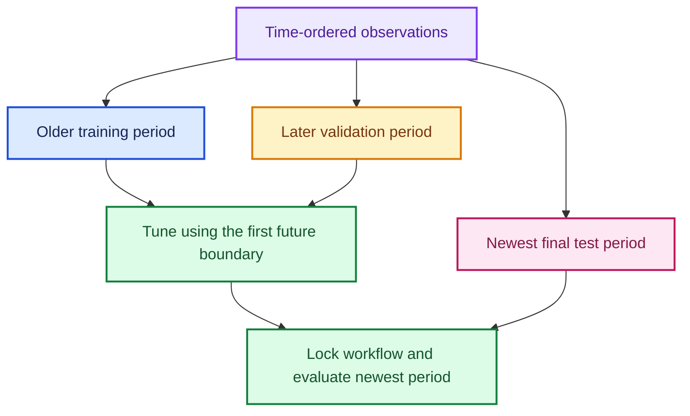

### Single chronological holdout

Use it when one recent period closely matches the deployment horizon and data volume is sufficient. For example, if production predicts the next 14 days, a preceding 14-day validation window is often more informative than a random 20% sample.

### Rolling-origin evaluation

One time-aware fold uses:

$$
\text{train}_k=\{t:t\le c_k\},
\qquad
\text{valid}_k=\{t:c_k<t\le c_k+h\}
$$

where \(c_k\) is the fold cutoff and \(h\) is the deployment horizon. Repeating across several cutoffs measures stability across time.

```python
from sklearn.model_selection import TimeSeriesSplit, cross_validate

# TimeSeriesSplit keeps every validation fold later than its training fold.
splitter = TimeSeriesSplit(
    n_splits=5,
    test_size=14,  # Example: evaluate the next 14 equally spaced observations.
    gap=2,         # Leave a two-step buffer to reduce boundary leakage.
)

# Evaluate the complete preprocessing-and-model pipeline in every fold.
scores = cross_validate(
    estimator=model_pipeline,
    X=X_ordered,
    y=y_ordered,
    cv=splitter,
    scoring="neg_root_mean_squared_error",
    return_train_score=True,
    n_jobs=-1,
)

# Scikit-learn negates loss scorers so that larger is always considered better.
valid_rmse = -scores["test_score"]
print("fold RMSE:", valid_rmse)
print("mean RMSE:", valid_rmse.mean())
print("RMSE standard deviation:", valid_rmse.std(ddof=1))
```

Current [`TimeSeriesSplit`](https://scikit-learn.org/stable/modules/generated/sklearn.model_selection.TimeSeriesSplit.html) uses expanding training windows. Equally spaced observations are important when fold metrics are meant to cover comparable durations.

### Rolling versus expanding windows

| Scheme | Training data in later folds | Use when |
|---|---|---|
| Expanding | All history up to the cutoff | Old patterns remain useful |
| Rolling | Only the most recent fixed window | Old regimes become harmful |
| Weighted history | All or much history, but newer rows receive more weight | Relevance decays gradually |

---

## 6. Recency versus amount of training data

Older data offers sample size; recent data offers distributional relevance. Let \(w_i\) be a nonnegative row weight. Weighted empirical risk is:

$$
\widehat R_w(f)
=
\frac{\sum_i w_i L(y_i,f(x_i))}{\sum_i w_i}
$$

An exponential recency weight can be written as:

$$
w_i=\exp(-\lambda a_i)
$$

where \(a_i\) is the row's age and \(\lambda\) controls decay. A half-life \(H\) corresponds to \(\lambda=\ln 2/H\).

### Compare windows rather than guessing

```python
import pandas as pd
from sklearn.base import clone
from sklearn.metrics import mean_squared_error


def compare_training_windows(model, X, y, dates, valid_start, windows):
    """Fit several historical windows and score the same future validation period."""
    dates = pd.to_datetime(dates)
    valid_start = pd.Timestamp(valid_start)
    valid_mask = dates >= valid_start  # Keep one fixed deployment-like holdout.
    records = []

    for days in windows:
        # `None` means use every row before the validation boundary.
        if days is None:
            train_mask = dates < valid_start
            label = "all_history"
        else:
            lower = valid_start - pd.Timedelta(days=days)
            train_mask = (dates >= lower) & (dates < valid_start)
            label = f"last_{days}_days"

        candidate = clone(model)  # Ensure every trial starts unfitted.
        candidate.fit(X.loc[train_mask], y.loc[train_mask])
        prediction = candidate.predict(X.loc[valid_mask])

        records.append({
            "window": label,
            "training_rows": int(train_mask.sum()),
            "valid_rmse": mean_squared_error(
                y.loc[valid_mask],
                prediction,
            ) ** 0.5,
        })

    return pd.DataFrame(records).sort_values("valid_rmse")
```

Use several historical cutoffs if possible. A short window that wins once may merely match one unusual validation period.

---

## 7. Retraining after model selection

Once the architecture, features, preprocessing, hyperparameters, and training-window rule are frozen, it is common to refit on training plus validation data before predicting the final test or production period.

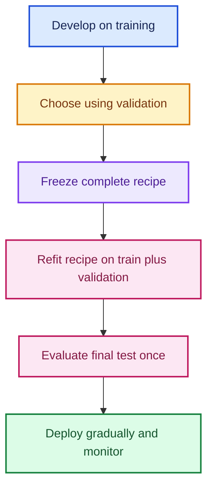

### Why refit?

- The model gains the most recent labeled period.
- More examples can reduce estimation variance.
- The distribution is closer to the final test or launch date.

### Why a reproducible recipe is essential

After combining train and validation, the old validation metric is no longer available as an independent check. Refit through one fixed function or pipeline, record versions and seeds, and prevent manual notebook steps from diverging.

```python
from sklearn.base import clone
import pandas as pd

# Concatenate only after all development decisions have been frozen.
X_development = pd.concat([X_train, X_valid], axis=0)
y_development = pd.concat([y_train, y_valid], axis=0)

# Clone preserves the chosen configuration but discards learned parameters.
final_model = clone(selected_pipeline)
final_model.fit(X_development, y_development)

# This prediction is evaluated once against the sealed test labels.
test_prediction = final_model.predict(X_test)
```

---

## 8. Out-of-bag evaluation

### Bootstrap mechanics

In a conventional random forest, a tree makes \(n\) draws with replacement from \(n\) training rows. For a particular row, the probability of being omitted is:

$$
P(\text{OOB})
=
\left(1-\frac{1}{n}\right)^n
\longrightarrow e^{-1}
\approx0.3679
$$

Thus a full-size bootstrap sample contains about \(1-e^{-1}\approx63.2\%\) unique rows and omits about \(36.8\%\).

### Per-row OOB prediction

Let \(S_i\) be the set of trees that did **not** train on row \(i\). Its OOB prediction is:

$$
\hat y_i^{\text{OOB}}
=
\frac{1}{|S_i|}
\sum_{b\in S_i}T_b(x_i)
$$

With \(B\) full-bootstrap trees:

$$
\mathbb{E}[|S_i|]\approx0.368B
$$

For 100 trees, one row is therefore predicted by about 37 OOB trees on average, whereas a separate validation row is predicted by all 100 trees.

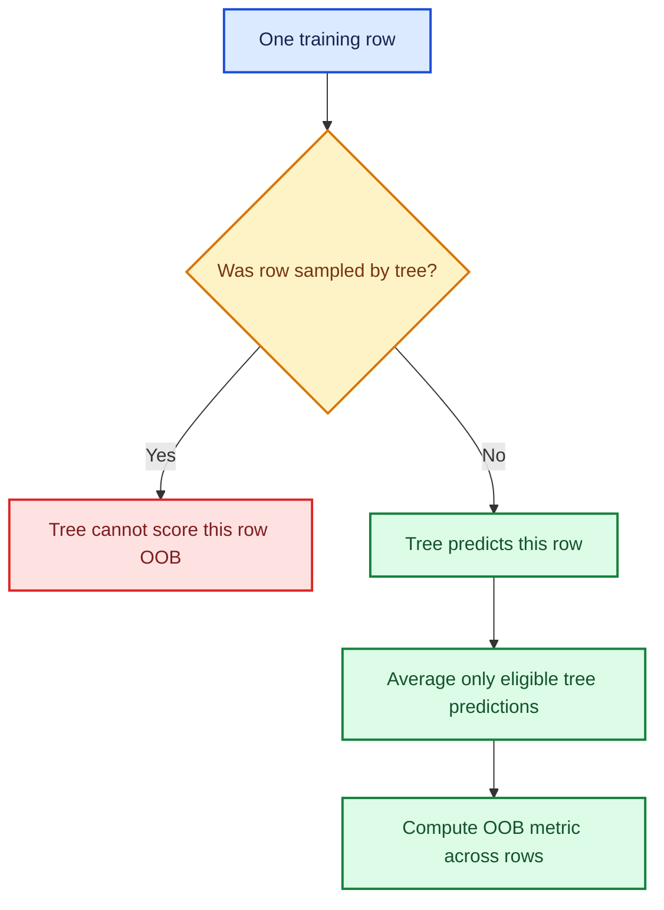

### Current scikit-learn example

```python
from sklearn.ensemble import RandomForestRegressor
from sklearn.metrics import mean_squared_error, r2_score

forest = RandomForestRegressor(
    n_estimators=300,   # More trees stabilize both forest and OOB averages.
    bootstrap=True,    # OOB evaluation requires rows to be omitted from trees.
    oob_score=True,    # Store OOB predictions and the default OOB R².
    max_samples=None,  # Draw n observations with replacement for every tree.
    min_samples_leaf=5,
    n_jobs=-1,
    random_state=42,
)
forest.fit(X_train, y_train)

# `oob_prediction_` contains one OOB estimate for each training observation.
oob_prediction = forest.oob_prediction_
print("OOB R²:", r2_score(y_train, oob_prediction))
print("OOB RMSE:", mean_squared_error(y_train, oob_prediction) ** 0.5)
print("stored oob_score_:", forest.oob_score_)
```

Current [`RandomForestRegressor`](https://scikit-learn.org/stable/modules/generated/sklearn.ensemble.RandomForestRegressor.html) exposes both `oob_score_` and `oob_prediction_` when `oob_score=True`.

---

## 9. OOB versus temporal validation

OOB and a future holdout answer different questions.

| Diagnostic | Held-out unit | Main question |
|---|---|---|
| Training metric | None | Can the fitted model represent the training observations? |
| OOB metric | Randomly omitted training rows | Does it generalize to exchangeable rows from the training-era mixture? |
| Temporal validation | Later period | Does it generalize across the deployment-like time boundary? |
| Final test | Newest sealed period | Does the locked workflow still work on untouched evidence? |

### Interpreting gaps

| Pattern | Leading hypothesis | Next check |
|---|---|---|
| Train strong, OOB weak, validation weak | Statistical overfitting or insufficient signal | Regularize, add data, inspect leakage and noise |
| Train strong, OOB strong, temporal validation weak | Temporal or population shift | Adversarial validation, drift plots, recent windows |
| OOB slightly weaker than validation | Fewer OOB trees per row or an easier validation period | Increase tree count; inspect uncertainty |
| Validation strong, final test weak | Validation mismatch or validation overfitting | Audit split construction and decision history |

OOB is “free” in the sense that no separate rows must be removed from forest training. It is not free computationally, universally unbiased, or a substitute for the deployment boundary.

---

## 10. Cross-validation

### K-fold definition

Partition the observations into \(K\) folds \(F_1,\ldots,F_K\). For fold \(k\), fit on all rows outside \(F_k\), score on \(F_k\), and average:

$$
\widehat R_{CV}
=
\frac{1}{K}\sum_{k=1}^{K}
\frac{1}{|F_k|}
\sum_{i\in F_k}
L\!\left(y_i,\hat f^{(-k)}(x_i)\right)
$$

### Why use it?

- Every row contributes to one held-out score.
- It is useful when labels are costly and one holdout would waste too much training data.
- Fold dispersion shows sensitivity to which observations are held out.
- The fold models can sometimes be ensembled.

### Costs and limitations

- Training cost is approximately multiplied by \(K\).
- Random K-fold repeats the assumptions of a random holdout.
- Related samples can leak across folds.
- A single average can hide terrible performance in one group or period.
- Hyperparameter search across CV scores can itself overfit the cross-validation procedure.

### Time-aware CV corrects the transcript's overstatement

It is inaccurate to say time-based data has “no way to do cross-validation.” The key is that **training must precede validation in every fold**. Expanding-window, rolling-window, blocked, and purged time splits are all cross-validation designs. Randomly shuffled K-fold is the problematic version.

---

## 11. Choosing the right splitter

The splitter encodes the claim you want the metric to support.

| Data structure | Splitter idea | What it protects against |
|---|---|---|
| Independent rows with balanced classes | Random holdout or K-fold | Ordinary sampling variation |
| Rare classification outcomes | Stratified holdout/K-fold | Folds missing important classes |
| Repeated rows per entity | Group holdout or `GroupKFold` | Identity leakage between related records |
| Ordered deployment | Chronological holdout or `TimeSeriesSplit` | Training on the future |
| Nearby labels overlap in time | Purged time split plus gap/embargo | Label-window leakage |
| New sites, future dates | Group-and-time design | Both site memorization and temporal leakage |

### Example: grouped validation

If multiple auctions belong to the same machine, random splitting may place one machine in training and validation. The model can recognize the machine rather than generalize to a new one.

```python
from sklearn.model_selection import GroupKFold, cross_validate

# Every observation from the same machine stays together in one fold.
groups = auction_frame["MachineID"]
splitter = GroupKFold(n_splits=5)

scores = cross_validate(
    estimator=model_pipeline,
    X=X,
    y=y,
    groups=groups,       # The splitter uses this array to isolate machines.
    cv=splitter,
    scoring="neg_root_mean_squared_error",
    n_jobs=-1,
)

# Convert scikit-learn's negative loss convention back to positive RMSE.
group_rmse = -scores["test_score"]
print(group_rmse)
```

### Stratification is not a cure for dependence

Stratification preserves class proportions. It does not prevent the same patient, customer, or product from appearing in both splits. When both class balance and group isolation matter, use a group-aware strategy and then audit class counts per fold.

### Questions to audit after splitting

```python
import pandas as pd


def summarize_split(name, frame, date_column, target_column=None, group_column=None):
    """Return basic evidence that a split matches its intended design."""
    dates = pd.to_datetime(frame[date_column])
    summary = {
        "split": name,
        "rows": len(frame),
        "date_min": dates.min(),
        "date_max": dates.max(),
    }

    if target_column is not None:
        # Numeric mean or positive-class rate provides a quick target-shift clue.
        summary["target_mean"] = frame[target_column].mean()

    if group_column is not None:
        # Count unique entities to catch unexpected repetition or tiny coverage.
        summary["unique_groups"] = frame[group_column].nunique()

    return pd.Series(summary)
```

Also check missingness, new categories, feature ranges, label delay, duplicate rows, and overlap of group identifiers across splits.

---

## 12. Does validation rank models correctly?

Absolute validation and production metrics may differ because the periods differ. During model development, a crucial property is often **ranking fidelity**:

> When model A improves over model B on validation, does it also tend to improve on later, deployment-like evidence?

### Rank agreement

For \(M\) candidate models without tied ranks, Spearman correlation is:

$$
\rho_s
=
1-
\frac{6\sum_{i=1}^{M}d_i^2}{M(M^2-1)}
$$

where \(d_i\) is the difference between model \(i\)'s validation and later-period ranks.

- \(\rho_s\approx1\): validation preserves the ordering well.
- \(\rho_s\approx0\): little monotonic ranking agreement.
- \(\rho_s<0\): improvements on validation tend to reverse later.

### Safe validation-design study

The transcript suggests comparing several models on validation and test, then changing validation until the points line up. That demonstrates the idea, but repeatedly consulting a true final test contaminates it. A safer design uses multiple **historical deployment replays**:

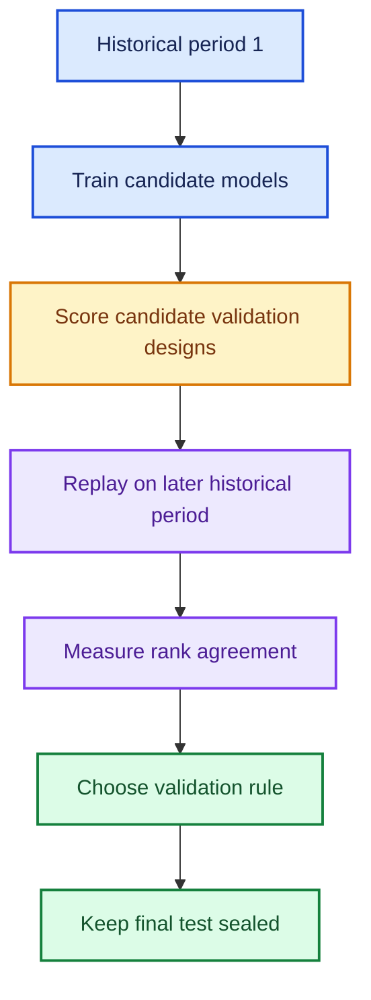

```python
import pandas as pd
from scipy.stats import spearmanr

# Each row represents one candidate model evaluated on two historical periods.
comparison = pd.DataFrame({
    "model": ["mean", "recent_mean", "small_forest", "large_forest"],
    "validation_rmse": [0.42, 0.35, 0.31, 0.29],
    "later_replay_rmse": [0.46, 0.36, 0.34, 0.30],
})

# Lower RMSE is better in both columns, so ordinary rank correlation is valid.
agreement = spearmanr(
    comparison["validation_rmse"],
    comparison["later_replay_rmse"],
).statistic

print("model-ranking agreement:", agreement)
```

Do this across several historical boundaries if possible. One set of four or five points is useful intuition, not strong statistical evidence.

---

## 13. Public and private leaderboards

Competition leaderboards illustrate why repeated feedback can be overfit.

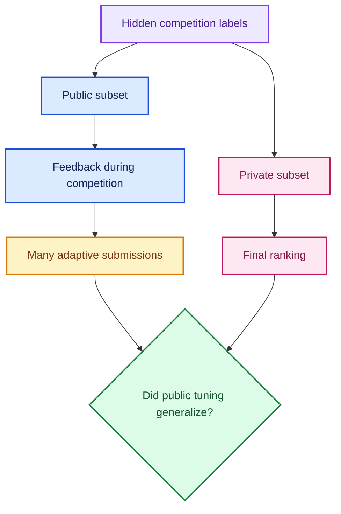

The public leaderboard behaves like a reusable validation set. The private leaderboard behaves more like the sealed final test. A large final rank drop is evidence that public feedback, the local validation design, or both failed to generalize.

### Practical competition discipline

- Build a local validation scheme from the likely test-generation process.
- Do not select submissions solely by tiny public-score differences.
- Track experiment rationale and local metrics.
- Average or ensemble diverse models only when local evidence supports it.
- Treat the final private result as evaluation, not another tuning signal.

The exact public/private proportions and scoring rules vary by competition; always read that competition's rules.

---

## 14. Tree-path contributions

### What does a local contribution explain?

Feature importance summarizes a dataset. A local path explanation accounts for **one row's fitted prediction**.

For a regression tree, let \(v(n)\) be the target mean stored at node \(n\). A row follows a path from root \(n_0\) through nodes \(n_1,\ldots,n_L\). Then:

$$
T(x)
=
v(n_0)
+
\sum_{r=1}^{L}\left[v(n_r)-v(n_{r-1})\right]
$$

The sum telescopes:

$$
v(n_0)+[v(n_1)-v(n_0)]+\cdots+[v(n_L)-v(n_{L-1})]
=v(n_L)
$$

Assign each node-to-child change to the feature used for that split. If the same feature appears several times, add its changes.

For \(B\) trees:

$$
\hat f(x)=
\underbrace{\frac{1}{B}\sum_{b=1}^{B}v_b(\text{root})}_{\text{bias}}
+
\sum_{j=1}^{p}
\underbrace{\frac{1}{B}\sum_{b=1}^{B}\phi_{bj}(x)}_{\text{feature contribution}}
$$

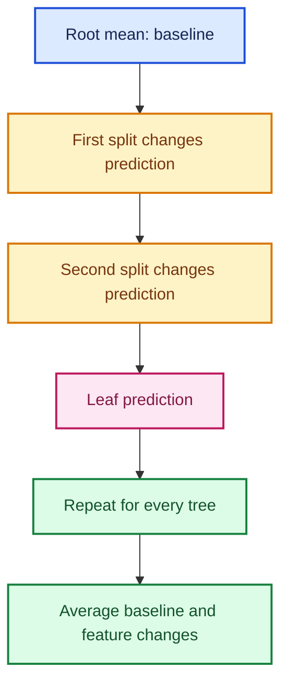

### Exact implementation for a fitted scikit-learn forest

This implementation supports one-output regression and numeric model inputs. If preprocessing lives in a pipeline, explain the transformed row and use transformed feature names.

```python
import numpy as np
import pandas as pd


def tree_path_contributions(tree, X_numeric):
    """Return exact baseline and feature path changes for one regression tree."""
    X_array = np.asarray(X_numeric)
    structure = tree.tree_
    node_value = structure.value[:, 0, 0]  # One output, one value per node.

    n_rows, n_features = X_array.shape
    baseline = np.full(n_rows, node_value[0])
    contribution = np.zeros((n_rows, n_features))
    prediction = np.empty(n_rows)

    for row_index, row in enumerate(X_array):
        node = 0  # Start at the root.

        # Leaves have both child indices set to the same marker (-1).
        while structure.children_left[node] != structure.children_right[node]:
            feature_index = structure.feature[node]
            feature_value = row[feature_index]
            threshold = structure.threshold[node]

            # Reproduce scikit-learn's learned routing for native missing values.
            if np.isnan(feature_value) and hasattr(structure, "missing_go_to_left"):
                child = (
                    structure.children_left[node]
                    if structure.missing_go_to_left[node]
                    else structure.children_right[node]
                )
            elif feature_value <= threshold:
                child = structure.children_left[node]
            else:
                child = structure.children_right[node]

            # Credit the node-to-child change to the feature used at this node.
            contribution[row_index, feature_index] += (
                node_value[child] - node_value[node]
            )
            node = child

        prediction[row_index] = node_value[node]

    # The additive decomposition should reconstruct every tree prediction.
    np.testing.assert_allclose(
        prediction,
        baseline + contribution.sum(axis=1),
        rtol=1e-10,
        atol=1e-10,
    )
    return prediction, baseline, contribution


def forest_path_contributions(forest, X_numeric):
    """Average exact tree-path decompositions across a fitted random forest."""
    pieces = [
        tree_path_contributions(tree, X_numeric)
        for tree in forest.estimators_
    ]

    prediction = np.mean([piece[0] for piece in pieces], axis=0)
    baseline = np.mean([piece[1] for piece in pieces], axis=0)
    contribution = np.mean([piece[2] for piece in pieces], axis=0)

    # Check both identities: additive accounting and agreement with the forest.
    np.testing.assert_allclose(
        prediction,
        baseline + contribution.sum(axis=1),
        rtol=1e-10,
        atol=1e-10,
    )
    np.testing.assert_allclose(
        prediction,
        forest.predict(X_numeric),
        rtol=1e-10,
        atol=1e-10,
    )
    return prediction, baseline, contribution
```

### Sort the explanation without breaking alignment

The transcript revisits a sorting mistake from the previous lesson. Sort feature, observed value, and contribution **as complete rows**:

```python
# Select one numeric row in exactly the column order used to fit the forest.
row = X_valid_numeric.iloc[[0]]
prediction, baseline, contribution = forest_path_contributions(forest, row)

explanation = pd.DataFrame({
    "feature": row.columns,
    "observed_value": row.iloc[0].to_numpy(),
    "contribution": contribution[0],
})

# Sorting the whole DataFrame preserves every feature–value–contribution tuple.
explanation = explanation.sort_values(
    "contribution",
    key=np.abs,
    ascending=False,
)

print(f"baseline: {baseline[0]:.4f}")
print(f"prediction: {prediction[0]:.4f}")
print(explanation.head(10))
```

These contributions explain the fitted path computation. They are not causal effects, and their credit allocation is not identical to TreeSHAP.

---

## 15. Waterfall charts

A waterfall chart visualizes a starting value, signed changes, and a final value.

For baseline \(b\) and contributions \(c_1,\ldots,c_p\):

$$
s_0=b,
\qquad
s_k=b+\sum_{j=1}^{k}c_j,
\qquad
\hat y=s_p
$$

Positive bars rise from \(s_{k-1}\); negative bars fall to \(s_k\).

```python
import matplotlib.pyplot as plt
import numpy as np


def plot_waterfall(baseline, labels, contributions, max_features=10):
    """Plot the largest local contributions and aggregate the remainder."""
    labels = np.asarray(labels, dtype=object)
    contributions = np.asarray(contributions, dtype=float)

    # Keep the largest absolute effects while preserving their paired labels.
    order = np.argsort(np.abs(contributions))[::-1]
    shown = order[:max_features]
    hidden = order[max_features:]

    shown_labels = labels[shown].tolist()
    shown_values = contributions[shown].tolist()

    if len(hidden):
        shown_labels.append("other features")
        shown_values.append(contributions[hidden].sum())

    running = baseline + np.r_[0.0, np.cumsum(shown_values)]
    starts = running[:-1]
    colors = ["#2563EB" if value >= 0 else "#DC2626" for value in shown_values]

    fig, ax = plt.subplots(figsize=(11, 5))
    ax.bar(
        range(len(shown_values)),
        shown_values,
        bottom=starts,
        color=colors,
        edgecolor="white",
    )

    # Dashed connectors make the cumulative movement easy to follow.
    for index in range(len(shown_values) - 1):
        ax.plot(
            [index + 0.4, index + 1 - 0.4],
            [running[index + 1], running[index + 1]],
            color="#6B7280",
            linestyle="--",
            linewidth=1,
        )

    prediction = baseline + np.sum(contributions)
    ax.axhline(baseline, color="#7C3AED", linestyle=":", label="baseline")
    ax.axhline(prediction, color="#15803D", linestyle="-", label="prediction")
    ax.set_xticks(range(len(shown_labels)), shown_labels, rotation=45, ha="right")
    ax.set_ylabel("Model-output units")
    ax.set_title("Local prediction waterfall")
    ax.legend()
    fig.tight_layout()
    return fig, ax
```

### When waterfall charts are useful

- explaining one insurance quote or auction estimate;
- reconciling a forecast with a baseline;
- showing revenue changes from one period to another;
- auditing surprising model decisions with domain experts.

Always label the model-output scale. If the target is `log1p(price)`, the bars add in log space and the full prediction is back-transformed using `np.expm1`.

---

## 16. The extrapolation problem

### Why ordinary regression trees flatten

A regression-tree leaf predicts the mean of training targets inside that leaf:

$$
T(x)=\frac{1}{|I_{\ell(x)}|}\sum_{i\in I_{\ell(x)}}y_i
$$

This is a convex combination of observed targets. Therefore:

$$
\min_i y_i\le T(x)\le\max_i y_i
$$

A random forest averages tree predictions, another convex combination, so:

$$
\min_i y_i\le\hat f_{RF}(x)\le\max_i y_i
$$

When a new time value exceeds every training split threshold, it follows an existing extreme branch and receives an existing leaf average. The prediction can step or flatten, but it cannot continue a learned linear trend beyond the observed target range.

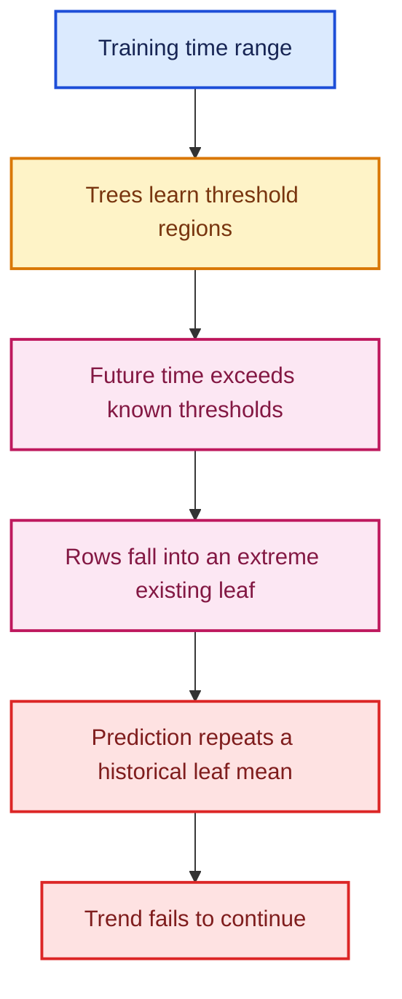

### Demonstration

```python
import matplotlib.pyplot as plt
import numpy as np
from sklearn.ensemble import RandomForestRegressor
from sklearn.linear_model import LinearRegression

# Training contains an increasing trend only from time 0 through time 10.
X_train_demo = np.arange(0, 11, dtype=float).reshape(-1, 1)
y_train_demo = 2.0 * X_train_demo.ravel() + 5.0

# Evaluation extends beyond the largest observed training time.
X_future_demo = np.linspace(0, 16, 161).reshape(-1, 1)

forest_demo = RandomForestRegressor(
    n_estimators=300,
    random_state=42,
).fit(X_train_demo, y_train_demo)

linear_demo = LinearRegression().fit(X_train_demo, y_train_demo)

plt.plot(X_future_demo, forest_demo.predict(X_future_demo), label="random forest")
plt.plot(X_future_demo, linear_demo.predict(X_future_demo), label="linear model")
plt.scatter(X_train_demo, y_train_demo, color="black", label="training data")
plt.axvline(10, color="#DC2626", linestyle="--", label="training boundary")
plt.xlabel("time")
plt.ylabel("prediction")
plt.legend()
plt.tight_layout()
plt.show()
```

### Responses to extrapolation risk

- validate on genuinely later periods;
- add features whose relationship is stable across time rather than relying on sequential IDs;
- model trend separately and let trees model residual structure;
- use linear, spline, state-space, or other trend-capable components where appropriate;
- retrain frequently;
- use recent or weighted history;
- monitor when features move outside their training ranges.

Do not automatically remove every date variable. Calendar features can capture real seasonality, and elapsed time can remain useful inside the observed operating range. Test the complete model on future-like data.

---

## 17. Adversarial validation

### Core idea

To learn how training differs from validation or test:

1. combine both feature tables;
2. label source membership;
3. train a classifier to predict the source;
4. evaluate it on source-held-out rows; and
5. inspect which features make the groups distinguishable.

Let:

$$
d_i=
\begin{cases}
0,&x_i\text{ came from training}\\
1,&x_i\text{ came from validation/test}
\end{cases}
$$

Fit \(g(x)\approx P(d=1\mid x)\). ROC-AUC has a useful ranking interpretation:

$$
AUC=P\!\left(g(X_{d=1})>g(X_{d=0})\right)
$$

- AUC near \(0.5\): source membership is hard to predict.
- AUC substantially above \(0.5\): detectable covariate shift.
- AUC near \(1\): the groups are easily separable.

High AUC is a **diagnostic**, not proof the predictive model will fail. A desired chronological split should be distinguishable in time; the goal is to learn which differences matter for the target task.

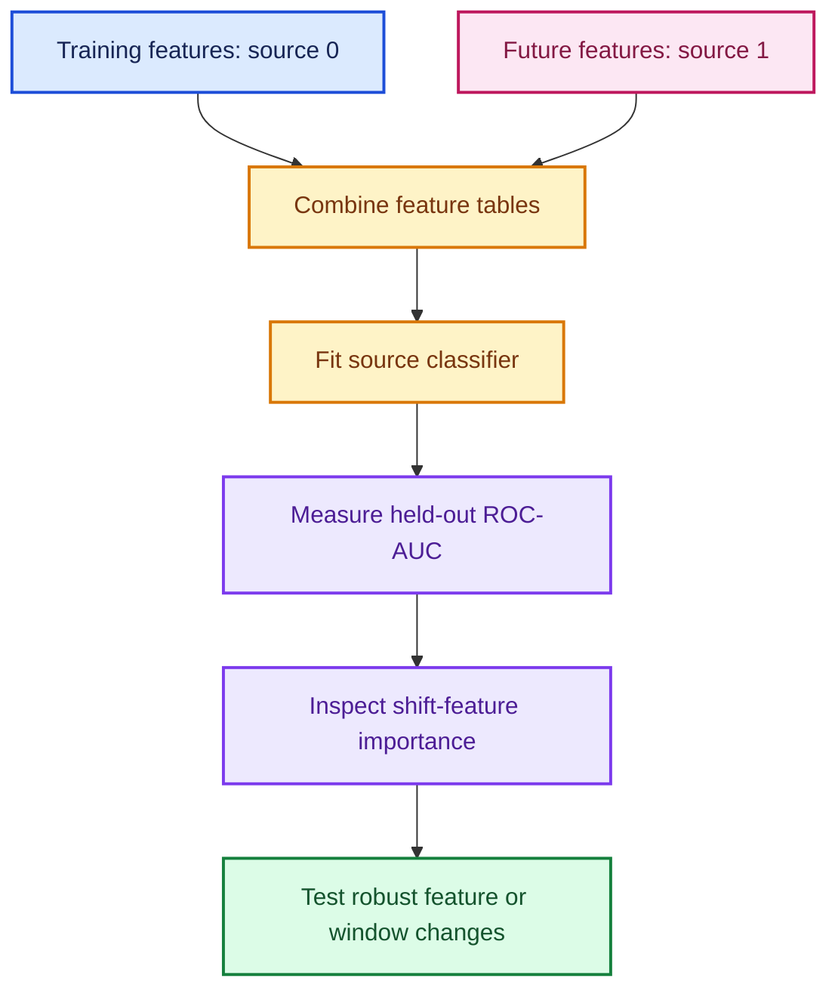

### Commented implementation

This example assumes both tables already have the same numeric columns. Apply the identical training-derived preprocessing to both when raw categories are present.

```python
import numpy as np
import pandas as pd
from sklearn.ensemble import RandomForestClassifier
from sklearn.inspection import permutation_importance
from sklearn.metrics import roc_auc_score
from sklearn.model_selection import train_test_split


def adversarial_validation(X_train, X_future, random_state=42):
    """Classify row source and return held-out AUC plus permutation importance."""
    train_features = X_train.copy()
    future_features = X_future.copy()

    # Create the source label: 0 for training-era, 1 for future-era rows.
    train_features["__source__"] = 0
    future_features["__source__"] = 1
    combined = pd.concat([train_features, future_features], ignore_index=True)

    source = combined.pop("__source__")

    # Hold out source-classification rows so AUC is not measured in-sample.
    X_fit, X_audit, source_fit, source_audit = train_test_split(
        combined,
        source,
        test_size=0.30,
        stratify=source,      # Preserve both source classes in each partition.
        random_state=random_state,
    )

    classifier = RandomForestClassifier(
        n_estimators=300,
        min_samples_leaf=10,
        class_weight="balanced",  # Avoid dominance when split sizes differ.
        n_jobs=-1,
        random_state=random_state,
    )
    classifier.fit(X_fit, source_fit)

    # Probability of source 1 is the score used to rank rows for ROC-AUC.
    source_probability = classifier.predict_proba(X_audit)[:, 1]
    auc = roc_auc_score(source_audit, source_probability)

    # Shuffle audit columns to see which ones the fitted source model relies on.
    shuffled = permutation_importance(
        classifier,
        X_audit,
        source_audit,
        scoring="roc_auc",
        n_repeats=10,
        random_state=random_state,
        n_jobs=-1,
    )

    importance = pd.DataFrame({
        "feature": X_audit.columns,
        "auc_drop_mean": shuffled.importances_mean,
        "auc_drop_std": shuffled.importances_std,
    }).sort_values("auc_drop_mean", ascending=False)

    return auc, importance, classifier
```

### Important controls

- Remove the target and anything derived from it.
- Ensure both tables receive identical preprocessing.
- Hold out rows when evaluating the source classifier.
- Use group-aware or time-aware auditing if duplicated entities exist.
- Compare missingness explicitly; a missing-value pipeline difference can dominate AUC.
- Treat IDs as clues about data construction, not automatic deletion commands.

---

## 18. Reading shift-feature importance

Suppose the source classifier ranks `SalesID`, `saleElapsed`, and `MachineID` far above every other feature. A plausible inference is that these identifiers or elapsed-time fields encode collection order.

### Confirm the difference directly

```python
import pandas as pd


def compare_feature_distributions(X_train, X_future, features):
    """Summarize location, spread, missingness, and range in two periods."""
    records = []

    # Calculate the same statistics for every feature–source combination.
    for feature in features:
        for source_name, frame in [("train", X_train), ("future", X_future)]:
            values = frame[feature]
            records.append({
                "feature": feature,
                "source": source_name,
                "mean": values.mean(),
                "median": values.median(),
                "minimum": values.min(),
                "maximum": values.max(),
                "missing_rate": values.isna().mean(),
                "unique_values": values.nunique(dropna=False),
            })

    return pd.DataFrame(records)
```

Look at both **importance magnitude** and rank. A dominant first feature followed by near-zero values is a different story from ten similarly important drift features.

### Four possible interpretations

| Shift feature | Possible meaning | Action to investigate |
|---|---|---|
| Sequential ID | Proxy for collection time | Plot ID against date; test removal |
| Category | New products, regions, or coding system | Compare frequencies and unknown-category handling |
| Missingness | Data pipeline changed | Audit extraction and imputation |
| Real numeric variable | Population or market changed | Examine business cause and target relationship |

Adversarial importance says a column distinguishes periods. It does not say the column helps or harms the target predictor.

---

## 19. Removing time proxies safely

### Why not drop every drifting feature?

A time-dependent feature can still carry stable predictive information. `YearMade`, for example, changes across periods but may remain essential for machinery price. Removal is justified only when an alternative model performs better or more robustly on deployment-like validation.

### One-at-a-time ablation

```python
import pandas as pd
from sklearn.base import clone
from sklearn.metrics import mean_squared_error


def ablate_features(model, X_train, y_train, X_valid, y_valid, candidates):
    """Remove one suspected shift feature at a time using one fixed validation set."""
    rows = []

    # The baseline makes every drop comparison explicit.
    baseline = clone(model)
    baseline.fit(X_train, y_train)
    baseline_rmse = mean_squared_error(
        y_valid,
        baseline.predict(X_valid),
    ) ** 0.5
    rows.append({"removed": "none", "valid_rmse": baseline_rmse})

    for feature in candidates:
        kept_columns = [column for column in X_train.columns if column != feature]
        candidate = clone(model)
        candidate.fit(X_train[kept_columns], y_train)

        prediction = candidate.predict(X_valid[kept_columns])
        rows.append({
            "removed": feature,
            "valid_rmse": mean_squared_error(y_valid, prediction) ** 0.5,
        })

    return pd.DataFrame(rows).sort_values("valid_rmse")
```

### Interpret OOB and future validation together

Removing a sequential ID may worsen OOB performance while improving future validation. That is coherent:

- within the mixed historical training distribution, the ID contains genuine statistical information;
- across time, the relationship does not extrapolate or changes meaning;
- the future holdout correctly rewards the more stable alternative.

Confirm the selected combination jointly because individual feature effects are not additive. Keep the split, seed, metric, row sample, and all unrelated hyperparameters fixed during the comparison.

---

## 20. A production evaluation workflow

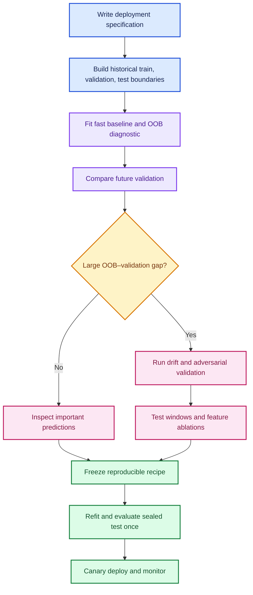

### Minimum experiment record

| Record | Why it matters |
|---|---|
| Prediction time and label horizon | Defines leakage and deployment boundaries |
| Split dates, groups, and exclusions | Makes evaluation reproducible |
| Feature creation timestamp | Shows whether information existed at prediction time |
| Training window and sample weights | Captures recency assumptions |
| Preprocessing fitted only on training | Prevents holdout leakage |
| Model parameters and random seeds | Reproduces stochastic choices |
| Train, OOB, validation, and fold metrics | Separates different generalization questions |
| Per-period and per-group metrics | Prevents averages from hiding failures |
| Drift and adversarial results | Documents distribution differences |
| Local explanations for selected cases | Supports sanity checking with domain experts |

The purpose of evaluation is not to produce a flattering number. It is to fail safely before production does.

---

## 21. Top-down programming

The transcript begins a forest implementation using **top-down design**:

1. write the interface you wish already existed;
2. express the high-level operation in plain terms;
3. leave lower-level details behind named methods;
4. implement the next missing layer; and
5. test each layer as soon as it becomes executable.

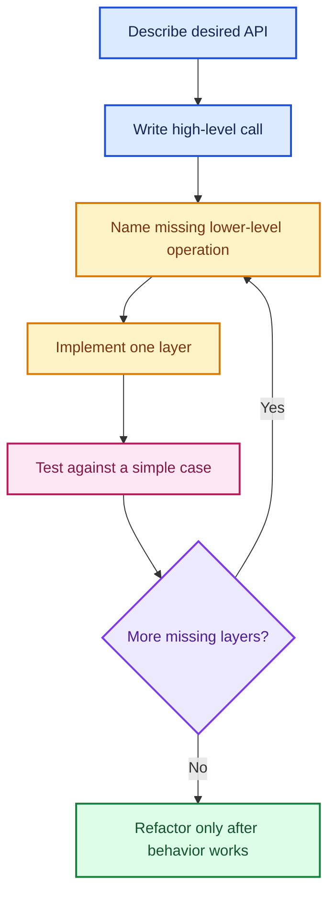

### Why this works well for ML algorithms

The mathematical description of an ensemble is already high-level:

> Create several diverse trees, ask each tree for a prediction, then average.

That sentence can become readable code before the details of tree construction exist:

```python
class TreeEnsembleSketch:
    """An intentionally incomplete sketch showing top-down API design."""

    def __init__(self, n_trees):
        # Pretend `create_tree` already exists; implement its details afterward.
        self.trees = [self.create_tree() for _ in range(n_trees)]

    def create_tree(self):
        # This placeholder marks the next layer that must be designed.
        raise NotImplementedError("tree construction is the next task")

    def predict(self, X):
        # The ensemble rule remains readable even while tree internals are absent.
        tree_predictions = [tree.predict(X) for tree in self.trees]
        return np.mean(tree_predictions, axis=0)
```

This is not an excuse to leave behavior untested. Top-down design and continuous testing belong together.

---

## 22. Testing a custom ML implementation

Machine-learning bugs often produce plausible but slightly worse results rather than exceptions. A strong strategy is **differential testing**: compare a new implementation against a trusted implementation on controlled data.

### Test from small invariants upward

| Level | Example invariant |
|---|---|
| Utility | A sampled index is in range and has the requested size |
| Node | Node value equals the mean target of its indices |
| Split | Children are disjoint and cover the parent rows |
| Tree | Training prediction is constant when no split is possible |
| Ensemble | Prediction equals the mean of individual tree predictions |
| Reference | Error is reasonably close to a trusted library on synthetic data |

### Exact ensemble-mean test

```python
import numpy as np

# `ensemble.trees` is a list of fitted tree objects.
individual = np.vstack([
    tree.predict(X_check)
    for tree in ensemble.trees
])

# The ensemble API must match the mathematical averaging rule exactly.
expected = individual.mean(axis=0)
actual = ensemble.predict(X_check)
np.testing.assert_allclose(actual, expected, rtol=1e-12, atol=1e-12)
```

### What reference agreement can and cannot prove

Two implementations can differ because of sampling, tie breaking, stopping conditions, feature subsampling, or missing-value behavior. Do not demand identical predictions unless every algorithmic choice is matched. Instead:

- test exact algebraic invariants where possible;
- use deterministic tiny datasets whose expected split can be calculated by hand;
- compare broad performance on a larger synthetic dataset;
- test edge cases: constant columns, tied targets, minimum row counts, and unseen values;
- add a failing example to the test suite for every bug discovered.

---

## 23. Pseudorandom numbers and seeds

### Deterministic state evolution

A pseudorandom number generator maintains a state \(s_t\) and updates it deterministically:

$$
s_{t+1}=F(s_t),
\qquad
u_t=G(s_t)
$$

The seed determines \(s_0\). The sequence *looks* random for statistical use, but the same generator, seed, software behavior, and call order reproduce the same sequence.

### Modern NumPy generator

```python
import numpy as np

# A local generator avoids silently changing randomness in unrelated code.
rng = np.random.default_rng(seed=42)

# Sample 1,000 distinct row positions without replacement.
sample_size = min(1_000, len(X_train))
row_indices = rng.choice(
    len(X_train),
    size=sample_size,
    replace=False,
)

# A permutation is another way to obtain all row positions in random order.
permuted_indices = rng.permutation(len(X_train))
first_sample = permuted_indices[:sample_size]
```

NumPy documents [`default_rng`](https://numpy.org/doc/stable/reference/random/generator.html) as the recommended constructor for `Generator`. It also notes that exact bit streams are not promised to remain identical across all future NumPy versions, so record important software versions.

### Reproducibility is not security

A fixed seed is useful for debugging and fair model comparisons. It is inappropriate for passwords, tokens, encryption keys, or lotteries. Python's `secrets` module or a vetted cryptographic library should be used for security-sensitive randomness.

```python
import secrets

# Cryptographic token generation intentionally does not use a reproducible seed.
session_token = secrets.token_urlsafe(32)
```

### Fun distinction: entropy and a seed

Entropy is unpredictable input collected from the operating system or hardware. A seed is the value used to initialize a generator. The current time alone can be guessable and is not sufficient protection for cryptographic keys.

---

## 24. Random-forest mathematics

### The ensemble prediction

For regression trees \(T_1,\ldots,T_B\):

$$
\hat f_B(x)=\frac{1}{B}\sum_{b=1}^{B}T_b(x)
$$

For classification, trees may vote for a class or their class probabilities may be averaged, depending on the implementation.

### Why average trees?

If each tree error has variance \(\sigma^2\) and every pair has correlation \(\rho\), a simplifying common-correlation calculation gives:

$$
\operatorname{Var}(\bar\varepsilon)
\approx
\rho\sigma^2+
\frac{1-\rho}{B}\sigma^2
$$

Increasing \(B\) shrinks the second term. Random row samples and random candidate features aim to reduce \(\rho\), the correlation floor.

### Bootstrap versus subsampling

| Scheme | Replacement? | Possible duplicate row inside a tree? | Typical unique-row fraction |
|---|---:|---:|---:|
| Full bootstrap of \(n\) draws | Yes | Yes | \(\approx63.2\%\) |
| Subsample of \(m<n\) rows | No | No | exactly \(m/n\) |

For sampling \(m\) distinct rows without replacement from \(n\), the number of possible subsets is:

$$
\binom{n}{m}=\frac{n!}{m!(n-m)!}
$$

The probability a particular row is omitted is exactly:

$$
P(\text{omitted})=1-\frac{m}{n}
$$

This is different from bootstrap omission, \((1-1/n)^m\), because bootstrap draws may repeat rows.

### Regression-tree node and split objective

For node indices \(I\), the stored prediction is:

$$
\bar y_I=\frac{1}{|I|}\sum_{i\in I}y_i
$$

Its sum of squared errors is:

$$
SSE(I)=\sum_{i\in I}(y_i-\bar y_I)^2
$$

A candidate split divides \(I\) into left and right subsets. Its improvement is:

$$
\Delta SSE
=
SSE(I)-SSE(I_L)-SSE(I_R)
$$

Choose the valid split with the largest positive \(\Delta SSE\), subject to minimum leaf size.

---

## 25. Python OOP primer

### Vocabulary

| Term | Meaning | Example |
|---|---|---|
| Class | Blueprint defining data and behavior | `TreeEnsemble` |
| Instance/object | One concrete object made from a class | `ensemble = TreeEnsemble(...)` |
| Attribute | Data stored on an object | `ensemble.trees` |
| Method | Function accessed through an object | `ensemble.predict(X)` |
| Initialization | Setting up a new instance's state | `__init__` |
| `self` | Conventional name for the current instance | `self.min_leaf` |

### Why `self` appears

Calling:

```python
# Bound-method syntax automatically supplies `ensemble` as the first argument.
prediction = ensemble.predict(X_valid)  # Normal bound-method syntax.
```

is conceptually equivalent to:

```python
# The equivalent class call supplies the instance explicitly.
prediction = TreeEnsemble.predict(ensemble, X_valid)  # Instance passed explicitly.
```

The official [Python classes tutorial](https://docs.python.org/3/tutorial/classes.html) explains that the instance is inserted as the first method argument. The name `self` is a strong convention, not a reserved keyword.

### Attributes persist on the instance

```python
class MeanRegressor:
    """Minimal estimator showing initialization, attributes, and a method."""

    def __init__(self):
        # Define the attribute early so the object's state is easy to inspect.
        self.mean_ = None

    def fit(self, y):
        # Assignment to `self` persists after this method returns.
        self.mean_ = float(np.mean(y))
        return self  # Returning self follows the common estimator convention.

    def predict(self, n_rows):
        # Fail clearly if the user calls predict before fit.
        if self.mean_ is None:
            raise RuntimeError("fit must be called before predict")

        # Repeat the learned mean once for every requested row.
        return np.full(n_rows, self.mean_)
```

### Common beginner mistakes

- forgetting `self` in a method signature;
- assigning `x = x` instead of `self.x = x` when the object must remember it;
- calling an attribute with parentheses or reading a method without calling it;
- using a mutable class variable when each instance needs its own list;
- calling `predict` before the object has learned or constructed required state.

Python is dynamic: a missing method referenced inside another method may not fail until that execution path is reached. This supports incremental top-down work, but tests and clear errors become essential.

---

## 26. Building the ensemble layer

The transcript's ensemble accepts training features, targets, tree count, per-tree sample size, and minimum leaf size. The following version is fully executable because it delegates individual tree fitting to scikit-learn while implementing the ensemble logic explicitly.

```python
import numpy as np
from sklearn.tree import DecisionTreeRegressor


class SubsampledTreeEnsemble:
    """Educational ensemble of regression trees sampled without replacement."""

    def __init__(
        self,
        X,
        y,
        n_trees,
        sample_size,
        min_leaf=5,
        random_state=42,
    ):
        # Convert once so positional sampling behaves consistently.
        self.X = np.asarray(X, dtype=float)
        self.y = np.asarray(y, dtype=float)
        self.n_trees = int(n_trees)
        self.sample_size = int(sample_size)
        self.min_leaf = int(min_leaf)
        self.random_state = random_state

        if self.X.ndim != 2:
            raise ValueError("X must be a two-dimensional numeric matrix")
        if len(self.X) != len(self.y):
            raise ValueError("X and y must contain the same number of rows")
        if not 1 <= self.sample_size <= len(self.y):
            raise ValueError("sample_size must be between 1 and the row count")

        # Keep randomness local to this object and reproducible.
        self.rng = np.random.default_rng(self.random_state)

        # Top-down step: the ensemble owns a list of independently sampled trees.
        self.trees = [self._create_tree() for _ in range(self.n_trees)]

    def _create_tree(self):
        """Fit one ordinary tree on a distinct random row subset."""
        row_indices = self.rng.choice(
            len(self.y),
            size=self.sample_size,
            replace=False,  # Match the transcript's subsampling choice.
        )

        # Give tie-breaking inside each tree a reproducible but different seed.
        tree_seed = int(self.rng.integers(0, np.iinfo(np.int32).max))
        tree = DecisionTreeRegressor(
            min_samples_leaf=self.min_leaf,
            random_state=tree_seed,
        )
        tree.fit(self.X[row_indices], self.y[row_indices])
        return tree

    def predict(self, X):
        """Average every tree's prediction for each supplied row."""
        X_array = np.asarray(X, dtype=float)

        # Shape is (number_of_trees, number_of_rows).
        tree_predictions = np.vstack([
            tree.predict(X_array)
            for tree in self.trees
        ])
        return tree_predictions.mean(axis=0)
```

### Example use

```python
# Constructing the object immediately samples rows and fits all requested trees.
ensemble = SubsampledTreeEnsemble(
    X=X_train_numeric,
    y=y_train,
    n_trees=50,
    sample_size=min(20_000, len(y_train)),
    min_leaf=5,
    random_state=42,
)

# Every tree scores the validation rows, and the ensemble averages its outputs.
validation_prediction = ensemble.predict(X_valid_numeric)
```

This class randomizes rows but not candidate features at each split, so it is closer to **subsample aggregation** than a complete Breiman-style random forest.

---

## 27. Representing a decision-tree node

As a tree grows recursively, each node needs to remember:

- the full feature and target arrays or references to them;
- which row indices have reached this node;
- the minimum allowed leaf size;
- row and column counts;
- the node prediction;
- the chosen split feature and threshold; and
- left and right child nodes.

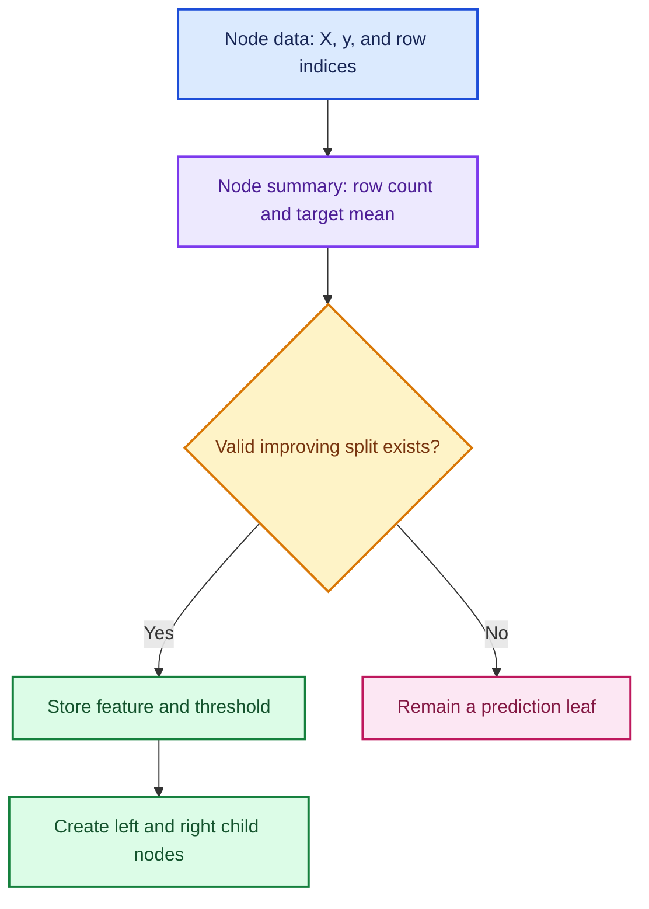

```python
class DecisionTreeNodeState:
    """State container matching the node information introduced in the lesson."""

    def __init__(self, X, y, indices, min_leaf=5):
        self.X = np.asarray(X, dtype=float)
        self.y = np.asarray(y, dtype=float)
        self.indices = np.asarray(indices, dtype=int)
        self.min_leaf = int(min_leaf)

        # These convenient counts are used repeatedly during split search.
        self.n_rows = len(self.indices)
        self.n_features = self.X.shape[1]

        # If growth stops here, the node predicts its rows' mean target.
        self.value = float(self.y[self.indices].mean())

        # `None` marks an unsplit node or leaf until a valid split is found.
        self.feature_index = None
        self.threshold = None
        self.left = None
        self.right = None


# The root initially contains every row in the sampled tree-training matrix.
root = DecisionTreeNodeState(
    X=X_sample,
    y=y_sample,
    indices=np.arange(len(y_sample)),
    min_leaf=5,
)
```

The row sample belongs to the ensemble layer. Once one tree receives its sampled matrix, the decision-tree algorithm simply partitions that matrix recursively.

---

## 28. Working educational implementation

The transcript stops after establishing the ensemble API and node state. This section deliberately continues that skeleton into a small working CART-style regressor so the formulas can be connected to code. It is designed for learning, not speed or production use.

### Scratch regression tree

```python
import numpy as np


def _sse_from_totals(count, total, total_squared):
    """Compute SSE from count, sum(y), and sum(y²) without rescanning rows."""
    if count == 0:
        return 0.0
    return float(total_squared - (total * total) / count)


class _RegressionNode:
    """One recursively grown node of a simple squared-error regression tree."""

    def __init__(self, X, y, indices, min_leaf):
        self.X = X
        self.y = y
        self.indices = np.asarray(indices, dtype=int)
        self.min_leaf = int(min_leaf)
        self.value = float(y[self.indices].mean())

        self.feature_index = None
        self.threshold = None
        self.left = None
        self.right = None

        # Grow immediately; if no improving split exists, this node stays a leaf.
        self._grow()

    @property
    def is_leaf(self):
        """A leaf has no selected split feature."""
        return self.feature_index is None

    def _grow(self):
        """Find the best valid split, then recursively create both children."""
        n_rows = len(self.indices)

        # Two valid children require at least twice the minimum leaf size.
        if n_rows < 2 * self.min_leaf:
            return

        parent_targets = self.y[self.indices]
        parent_total = parent_targets.sum()
        parent_squared = np.square(parent_targets).sum()
        parent_sse = _sse_from_totals(n_rows, parent_total, parent_squared)

        best_child_sse = parent_sse
        best_feature = None
        best_threshold = None

        for feature_index in range(self.X.shape[1]):
            feature_values = self.X[self.indices, feature_index]

            # Stable sorting keeps tied values deterministic for easier testing.
            order = np.argsort(feature_values, kind="mergesort")
            sorted_values = feature_values[order]
            sorted_targets = parent_targets[order]

            cumulative_y = np.cumsum(sorted_targets)
            cumulative_y2 = np.cumsum(np.square(sorted_targets))

            # `split_position` is the number of rows assigned to the left child.
            for split_position in range(
                self.min_leaf,
                n_rows - self.min_leaf + 1,
            ):
                # Equal adjacent values cannot be separated by a threshold.
                if sorted_values[split_position - 1] == sorted_values[split_position]:
                    continue

                left_count = split_position
                right_count = n_rows - split_position

                left_total = cumulative_y[split_position - 1]
                left_squared = cumulative_y2[split_position - 1]
                right_total = parent_total - left_total
                right_squared = parent_squared - left_squared

                child_sse = (
                    _sse_from_totals(left_count, left_total, left_squared)
                    + _sse_from_totals(right_count, right_total, right_squared)
                )

                if child_sse < best_child_sse - 1e-12:
                    best_child_sse = child_sse
                    best_feature = feature_index
                    best_threshold = (
                        sorted_values[split_position - 1]
                        + sorted_values[split_position]
                    ) / 2.0

        # No valid split reduced SSE, so the node remains a leaf.
        if best_feature is None:
            return

        self.feature_index = best_feature
        self.threshold = float(best_threshold)

        values = self.X[self.indices, self.feature_index]
        left_mask = values <= self.threshold
        left_indices = self.indices[left_mask]
        right_indices = self.indices[~left_mask]

        # Recursive construction partitions this node's rows into two children.
        self.left = _RegressionNode(
            self.X,
            self.y,
            left_indices,
            self.min_leaf,
        )
        self.right = _RegressionNode(
            self.X,
            self.y,
            right_indices,
            self.min_leaf,
        )

    def predict_one(self, row):
        """Follow one row through thresholds until a leaf value is reached."""
        node = self
        while not node.is_leaf:
            if row[node.feature_index] <= node.threshold:
                node = node.left
            else:
                node = node.right
        return node.value


class ScratchDecisionTreeRegressor:
    """Tiny educational regression tree using exhaustive numeric split search."""

    def __init__(self, min_samples_leaf=5):
        self.min_samples_leaf = int(min_samples_leaf)
        self.root_ = None

    def fit(self, X, y):
        """Validate finite numeric inputs and grow the root recursively."""
        X_array = np.asarray(X, dtype=float)
        y_array = np.asarray(y, dtype=float)

        if X_array.ndim != 2:
            raise ValueError("X must be two-dimensional")
        if len(X_array) != len(y_array):
            raise ValueError("X and y must have matching row counts")
        if len(y_array) == 0:
            raise ValueError("at least one training row is required")
        if not np.isfinite(X_array).all() or not np.isfinite(y_array).all():
            raise ValueError("this educational tree requires finite values")

        self.root_ = _RegressionNode(
            X=X_array,
            y=y_array,
            indices=np.arange(len(y_array)),
            min_leaf=self.min_samples_leaf,
        )
        return self

    def predict(self, X):
        """Predict each row by traversing the fitted tree."""
        if self.root_ is None:
            raise RuntimeError("fit must be called before predict")

        X_array = np.asarray(X, dtype=float)
        return np.array([
            self.root_.predict_one(row)
            for row in X_array
        ])
```

### Scratch subsampled ensemble

```python
class ScratchSubsampledForestRegressor:
    """Forest-like ensemble using the scratch trees and row subsampling."""

    def __init__(
        self,
        n_estimators=20,
        max_samples=0.7,
        min_samples_leaf=5,
        random_state=42,
    ):
        # Store configuration now; learned trees are created later by `fit`.
        self.n_estimators = int(n_estimators)
        self.max_samples = max_samples
        self.min_samples_leaf = int(min_samples_leaf)
        self.random_state = random_state
        self.estimators_ = []

    def fit(self, X, y):
        """Fit each scratch tree on a distinct sample without replacement."""
        X_array = np.asarray(X, dtype=float)
        y_array = np.asarray(y, dtype=float)
        n_rows = len(y_array)

        # Fractions specify a proportion; integers specify an exact row count.
        if isinstance(self.max_samples, float):
            sample_size = max(1, int(self.max_samples * n_rows))
        else:
            sample_size = int(self.max_samples)

        if not 1 <= sample_size <= n_rows:
            raise ValueError("max_samples requests an invalid number of rows")

        rng = np.random.default_rng(self.random_state)
        self.estimators_ = []

        for _ in range(self.n_estimators):
            # Match the transcript by selecting distinct rows for each tree.
            indices = rng.choice(n_rows, size=sample_size, replace=False)
            tree = ScratchDecisionTreeRegressor(
                min_samples_leaf=self.min_samples_leaf,
            )
            tree.fit(X_array[indices], y_array[indices])
            self.estimators_.append(tree)

        return self

    def predict(self, X):
        """Average predictions from all fitted scratch trees."""
        if not self.estimators_:
            raise RuntimeError("fit must be called before predict")

        # Stack one prediction vector per tree, then average down the tree axis.
        predictions = np.vstack([
            tree.predict(X)
            for tree in self.estimators_
        ])
        return predictions.mean(axis=0)
```

### Reference comparison

```python
from sklearn.datasets import make_regression
from sklearn.metrics import mean_squared_error
from sklearn.model_selection import train_test_split
from sklearn.tree import DecisionTreeRegressor

# Use a small numeric dataset because the scratch split search is not optimized.
X_demo, y_demo = make_regression(
    n_samples=400,
    n_features=4,
    noise=8.0,
    random_state=42,
)
X_fit, X_check, y_fit, y_check = train_test_split(
    X_demo,
    y_demo,
    test_size=0.25,
    random_state=42,
)

scratch_tree = ScratchDecisionTreeRegressor(min_samples_leaf=5).fit(X_fit, y_fit)
reference_tree = DecisionTreeRegressor(
    min_samples_leaf=5,
    random_state=42,
).fit(X_fit, y_fit)

scratch_rmse = mean_squared_error(
    y_check,
    scratch_tree.predict(X_check),
) ** 0.5
reference_rmse = mean_squared_error(
    y_check,
    reference_tree.predict(X_check),
) ** 0.5

print({"scratch_tree_rmse": scratch_rmse, "reference_tree_rmse": reference_rmse})
```

Do not expect identical trees: scikit-learn uses highly optimized implementation details and may break ties differently. The comparison is a debugging signal, not a proof of equivalence.

---

## 29. Common mistakes

| Mistake | Why it is risky | Better practice |
|---|---|---|
| Confusing generalization with scaling | Fast wrong predictions are still wrong | Evaluate new-case accuracy and system performance separately |
| Reporting training accuracy as model quality | The fitted model already saw those examples | Use a representative holdout |
| Randomly splitting every dataset | Random exchangeability often fails for time, groups, or repeated entities | Start from the deployment event |
| Computing preprocessing on all rows before splitting | Holdout information leaks into training | Fit transformations within a pipeline on training only |
| Reusing the final test during development | Model choices adapt to the test | Seal it and use historical backtests for validation design |
| Assuming 80/20 is universally correct | Size does not determine representativeness | Choose boundaries and size from deployment and metric precision |
| Assuming OOB is a future-period estimate | It holds out random rows from the training-era distribution | Retain temporal validation |
| Saying OOB must always score worse | Fewer eligible trees increase variance, but other effects can reverse the comparison | Treat the difference diagnostically |
| Thinking 63.2% refers to bootstrap draws | A full bootstrap has \(n\) draws but only about 63.2% unique rows | Distinguish draw count from unique count |
| Using random K-fold for a forecasting boundary | Some folds train on future regimes relative to validation | Use expanding or rolling time folds |
| Saying time series cannot use CV | Only ordinary shuffled CV is unsuitable | Use time-aware cross-validation |
| Averaging fold scores without looking at folds | A catastrophic period can hide inside a good mean | Report dispersion and per-period metrics |
| Optimizing tiny public-leaderboard changes | Public feedback is noisy and reusable | Trust a sound local split and track rationale |
| Sorting feature names separately from local contributions | Values become attached to the wrong features | Sort complete table rows |
| Treating path contribution as causation | It explains the fitted route, not an intervention in reality | Say “moved the model prediction” |
| Assuming a random forest continues a time trend | Leaf means cannot extend beyond observed targets | Add a trend-capable component or retrain frequently |
| Dropping every feature that detects time | Some drifting features remain predictively stable | Ablate one at a time on future-like validation |
| Reading adversarial AUC in-sample | A flexible source model can memorize | Audit source classification on held-out rows |
| Concluding AUC \(>0.5\) means failure | A deliberate temporal split should differ | Identify the differences and test target-model robustness |
| Using `np.random.seed` throughout a library | Global state creates hidden coupling | Pass local `Generator` objects or explicit seeds |
| Using a fixed seed for security | Reproducibility makes the sequence guessable | Use `secrets` or cryptographic randomness |
| Forgetting `self` in a method | Python inserts the instance as the first argument | Include `self` by convention |
| Assigning constructor inputs only to local variables | The instance forgets them after initialization | Store needed state on `self` |
| Calling an unfinished method and trusting construction success | Dynamic lookup may delay failure until runtime | Add tests for every public method |
| Calling row-subsampled bagging a complete random forest | A classic random forest also samples candidate features at splits | State precisely which randomness is implemented |
| Changing several experiment settings together | Score differences cannot be attributed | Change one hypothesis or use a recorded factorial design |

---

## 30. Practice exercises

Try each problem before opening the worked answer.

### Exercise 1 — Goal or infrastructure?

A classifier obtains 98% accuracy on new representative cases but processes only two requests per second. Is this primarily a generalization failure or a scaling failure?

<details>
<summary>Worked answer</summary>

It is primarily a **scaling failure**. The evidence says the learned relationship generalizes well, but throughput is insufficient. The engineering remedy may involve batching, optimized serving, a smaller model, caching, or more suitable hardware. You would still verify that the 98% metric represents the production distribution.

</details>

### Exercise 2 — Validation search risk

If each of 20 useless experiments has an independent 5% chance of looking successful by chance, what is the probability that at least one looks successful?

<details>
<summary>Worked answer</summary>

$$
P(\text{at least one})
=1-(1-0.05)^{20}
=1-0.95^{20}
\approx0.6415
$$

There is about a **64.2%** chance of at least one false-looking success under the simplified independence assumption.

</details>

### Exercise 3 — Expected OOB tree count

A forest has 500 full-bootstrap trees. Approximately how many trees contribute to one row's OOB prediction?

<details>
<summary>Worked answer</summary>

Each tree omits the row with probability approximately \(e^{-1}\approx0.3679\). Therefore:

$$
\mathbb{E}[|S_i|]\approx500(0.3679)=183.95
$$

About **184 trees** contribute on average. The exact count varies by row.

</details>

### Exercise 4 — Bootstrap versus subsample omission

Compare the approximate omission probability when each tree uses \(m=0.6n\) observations under:

1. sampling without replacement; and
2. bootstrap sampling with replacement.

<details>
<summary>Worked answer</summary>

Without replacement, exactly \(60\%\) of rows are selected, so:

$$
P(\text{omitted})=1-0.6=0.4
$$

With replacement:

$$
P(\text{omitted})
=\left(1-\frac{1}{n}\right)^{0.6n}
\approx e^{-0.6}
\approx0.5488
$$

Bootstrap sampling omits about **54.9%** because duplicate draws reduce the number of unique selected rows.

</details>

### Exercise 5 — Choose a split

A hospital dataset contains ten visits per patient. Deployment will predict outcomes for entirely new patients. Which is more suitable: stratified random row splitting or group splitting by patient?

<details>
<summary>Worked answer</summary>

Use **group splitting by patient** so all visits from one patient remain in one split. A row-level split lets the model learn patient-specific information from training and appear to generalize on another visit from the same patient. After grouping, audit whether class proportions remain usable in every fold.

</details>

### Exercise 6 — Time-aware fold

A model predicts the next seven days of demand and is retrained weekly. Describe one appropriate fold.

<details>
<summary>Worked answer</summary>

Choose a cutoff \(c\). Train only on observations available at or before \(c\), then validate on \(c+1\) through \(c+7\). If labels or rolling features overlap the boundary, add an appropriate gap. Repeat for several earlier cutoffs to estimate stability.

</details>

### Exercise 7 — Model-ranking agreement

Four models have validation ranks \([1,2,3,4]\) and later-period ranks \([1,3,2,4]\). Calculate Spearman correlation.

<details>
<summary>Worked answer</summary>

Rank differences are \([0,-1,1,0]\), so \(\sum d_i^2=2\). Therefore:

$$
\rho_s
=1-\frac{6(2)}{4(4^2-1)}
=1-\frac{12}{60}
=0.8
$$

The validation design preserves the ordering fairly well, with one middle reversal. Four models are too few for a confident general conclusion, so repeat across historical boundaries.

</details>

### Exercise 8 — Tree-path accounting

A tree root value is \(10.189\). Its path changes are \(+0.156\), \(-0.395\), and \(+0.276\). What is the leaf prediction?

<details>
<summary>Worked answer</summary>

$$
10.189+0.156-0.395+0.276=10.226
$$

The leaf prediction is **10.226**. The path increments telescope to the difference between the leaf and root values.

</details>

### Exercise 9 — Why the forest cannot exceed the target range

Training targets lie between 5 and 25. Can an ordinary `RandomForestRegressor` predict 30? Explain.

<details>
<summary>Worked answer</summary>

Not under the standard leaf-mean prediction rule. Each leaf is an average of some training targets, so it lies between 5 and 25. The forest is an average of those leaf predictions and also lies between 5 and 25. Target transformations or unusual custom estimators can change the statement, but an ordinary regression forest cannot output 30 here.

</details>

### Exercise 10 — Adversarial AUC

A held-out source classifier obtains ROC-AUC \(0.97\). What can and cannot be concluded?

<details>
<summary>Worked answer</summary>

You can conclude that the feature distributions make source membership highly rankable: training and future rows are detectably different. You cannot conclude that the target model fails, that every shifted feature should be removed, or that the shift is undesirable. Inspect source-feature importance and then test target-task changes on future-like validation.

</details>

### Exercise 11 — Node SSE

A node contains targets \([2,4,6]\). Calculate its mean prediction and SSE.

<details>
<summary>Worked answer</summary>

The mean is:

$$
\bar y=\frac{2+4+6}{3}=4
$$

The SSE is:

$$
(2-4)^2+(4-4)^2+(6-4)^2=4+0+4=8
$$

The node predicts 4 and has SSE 8.

</details>

### Exercise 12 — `self` and persistent state

Why does this code fail to preserve `min_leaf`?

```python
# This class is intentionally broken: no attribute is written to `self`.
class BrokenTree:
    def __init__(self, min_leaf):
        min_leaf = min_leaf  # Only reassigns the local parameter name.
```

<details>
<summary>Worked answer</summary>

The assignment changes no instance attribute. The parameter is local to `__init__` and disappears after the call. Store it on the current instance:

```python
# The corrected version stores the parameter on each new instance.
class Tree:
    def __init__(self, min_leaf):
        self.min_leaf = min_leaf  # Persists as part of this object.
```

</details>

---

## 31. Quick reference

### Evaluation formulas

| Concept | Formula | Meaning |
|---|---|---|
| Deployment risk | \(\mathbb{E}_{P_{deploy}}[L(Y,f(X))]\) | True future objective |
| Holdout risk | \(m^{-1}\sum_i L(y_i,f(x_i))\) | Finite estimate of deployment risk |
| Standard error of mean loss | \(s/\sqrt m\) | Approximate metric uncertainty |
| At least one false success | \(1-(1-\alpha)^M\) | Search over noisy validation results |
| K-fold risk | \(K^{-1}\sum_k R_k\) | Average held-out fold loss |
| Spearman without ties | \(1-6\sum d_i^2/[M(M^2-1)]\) | Model-ranking agreement |

### Forest formulas

| Concept | Formula | Meaning |
|---|---|---|
| Full-bootstrap OOB probability | \((1-1/n)^n\to e^{-1}\) | About 36.8% omitted per tree |
| OOB row prediction | \(|S_i|^{-1}\sum_{b\in S_i}T_b(x_i)\) | Average trees that did not see row \(i\) |
| Forest prediction | \(B^{-1}\sum_b T_b(x)\) | Average all tree predictions |
| Common-correlation variance | \(\rho\sigma^2+(1-\rho)\sigma^2/B\) | Why strength and diversity matter |
| Node value | \(|I|^{-1}\sum_{i\in I}y_i\) | Regression leaf prediction |
| Split gain | \(SSE(I)-SSE(I_L)-SSE(I_R)\) | Error reduction from a split |
| Path accounting | \(v(root)+\sum[v(child)-v(parent)]\) | Exact tree prediction decomposition |

### Diagnostic decision table

| Observation | First interpretation | Useful next step |
|---|---|---|
| Train good, OOB bad | Statistical overfit | Regularize and inspect leakage |
| OOB good, future validation bad | Distribution shift | Adversarial validation and time-window tests |
| Source AUC near 0.5 | Covariates hard to distinguish | Still check target and concept drift |
| Source AUC high | Covariate shift exists | Inspect features; do not drop blindly |
| Public leaderboard rises, local metric falls | Public overfitting risk | Trust deployment-aligned local validation |
| Local contribution looks implausible | Model or data sanity issue | Inspect row, preprocessing, leakage, and peers |

### OOP mini-reference

```python
# This tiny class summarizes persistent attributes and instance methods.
class Example:
    def __init__(self, value=5):
        self.value = value  # Attribute stored on this instance.

    def double(self):
        return 2 * self.value  # Method reads instance state through self.


item = Example(value=7)  # Instantiate the class and initialize one object.
answer = item.double()   # Python passes `item` as the method's `self`.
```

---

## 32. Fun facts

1. **The number \(e\) appears in bagging.** The famous 36.8% OOB rate is \(e^{-1}\), arising from many small chances of not drawing a row.
2. **A test set is defined by behavior, not its name.** The moment it guides a decision, it becomes validation data in an information-theoretic sense.
3. **A public leaderboard is an adaptive data-analysis interface.** Each score reveals a small amount of information about hidden labels; enough adaptive queries can overfit that feedback.
4. **Tree extrapolation has a short proof.** Leaf means and forest averages are convex combinations, so their outputs remain inside the observed target range.
5. **Tree paths telescope.** All internal node values cancel when child-minus-parent changes are summed, leaving only leaf minus root.
6. **Adversarial validation has no adversary.** The name refers to deliberately asking a model to discriminate datasets; it is closely related to two-sample testing and domain classification.
7. **A fixed random seed makes debugging fairer.** It converts a moving stochastic target into a reproducible one, but it does not make one experiment representative of all seeds.
8. **`self` is conventional, not magical syntax.** Python would accept another name, but readers and tools expect `self`.
9. **Construction and initialization are technically different in Python.** `__new__` creates the instance; `__init__` configures the instance already created.
10. **Bagging predates today's “big data” habits.** Sampling smaller row sets can improve iteration speed and diversity even when all data fits on one machine.

---

## Resources

### Original lesson

- [YouTube — Intro to Machine Learning, Lesson 5](https://www.youtube.com/watch/3jl2h9hSRvc) — source of the supplied transcript.

### Current reference documentation

- [scikit-learn — cross-validation user guide](https://scikit-learn.org/stable/modules/cross_validation.html)
- [scikit-learn — `TimeSeriesSplit`](https://scikit-learn.org/stable/modules/generated/sklearn.model_selection.TimeSeriesSplit.html)
- [scikit-learn — `GroupKFold`](https://scikit-learn.org/stable/modules/generated/sklearn.model_selection.GroupKFold.html)
- [scikit-learn — `RandomForestRegressor`](https://scikit-learn.org/stable/modules/generated/sklearn.ensemble.RandomForestRegressor.html)
- [scikit-learn — permutation importance](https://scikit-learn.org/stable/modules/permutation_importance.html)
- [NumPy — `Generator` and `default_rng`](https://numpy.org/doc/stable/reference/random/generator.html)
- [Python — classes tutorial](https://docs.python.org/3/tutorial/classes.html)
- [Python — `secrets`](https://docs.python.org/3/library/secrets.html)

---

## Final takeaway

The deepest Lesson 5 idea is that evaluation design determines what “good” means. OOB can test random within-era generalization; a chronological holdout can test movement into the future; adversarial validation can reveal how those eras differ; and local path contributions can show how one forest prediction was assembled.

Only after those questions are trustworthy does implementation detail become valuable. Top-down programming, explicit object state, local random generators, mathematical invariants, and reference comparisons turn a forest from a black-box API into an understandable and testable program.

The practical loop is:

1. specify deployment;
2. simulate it with representative splits;
3. compare multiple notions of generalization;
4. diagnose shift rather than guessing;
5. explain surprising individual predictions;
6. freeze and reproduce the winning recipe;
7. evaluate the final test once; and
8. deploy gradually with monitoring.
