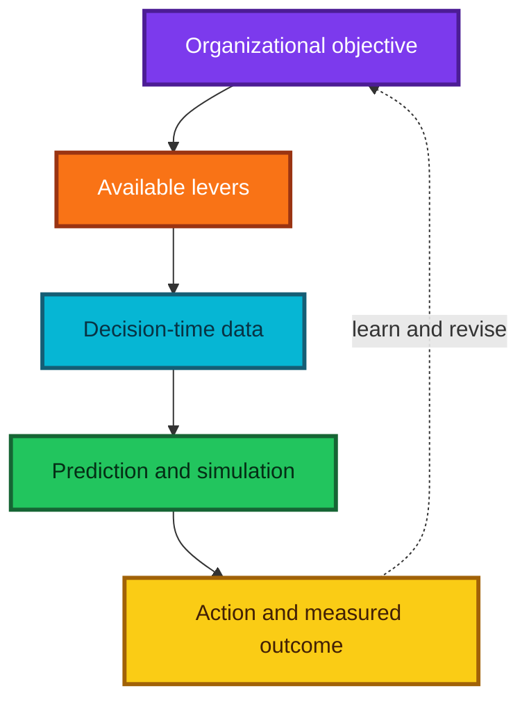
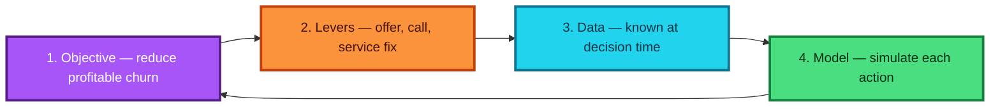
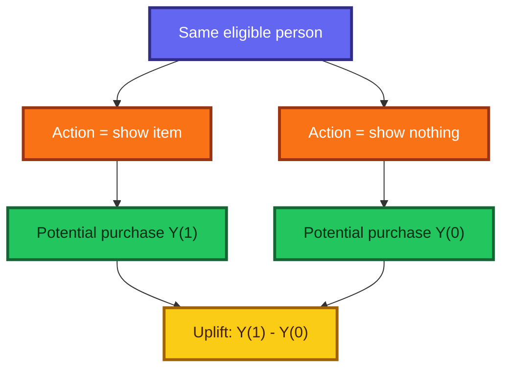
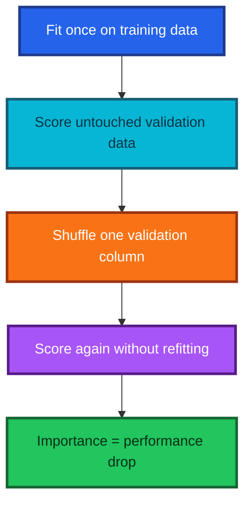
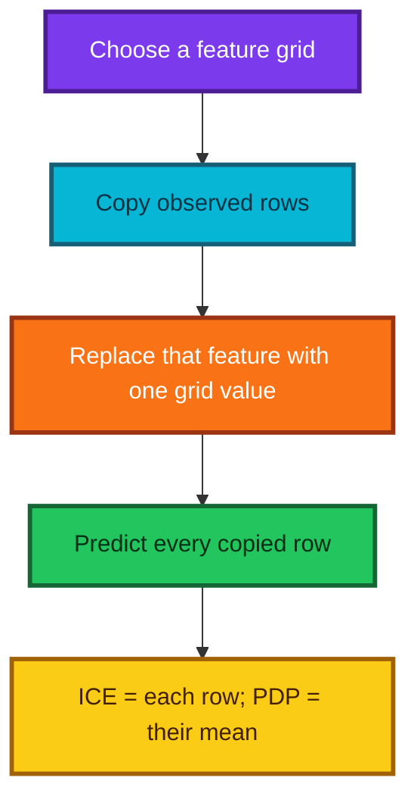
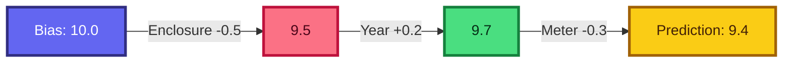
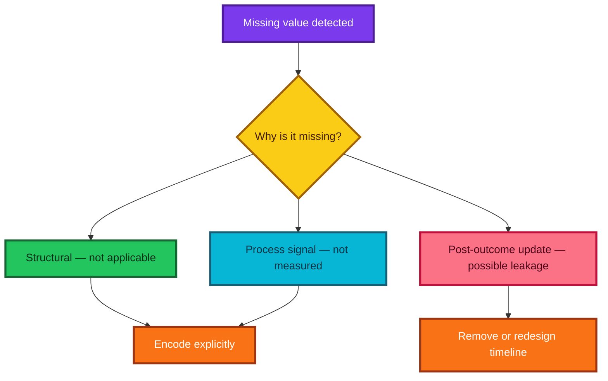
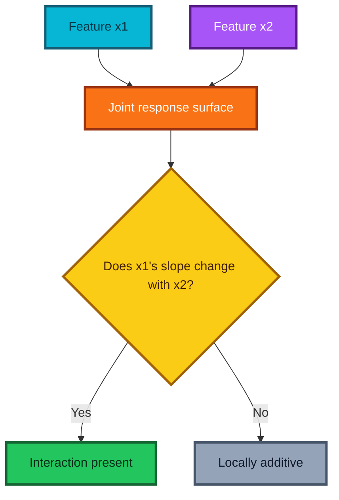
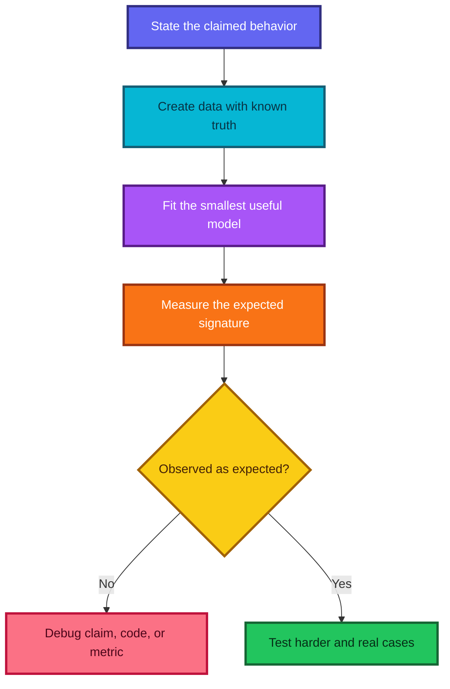
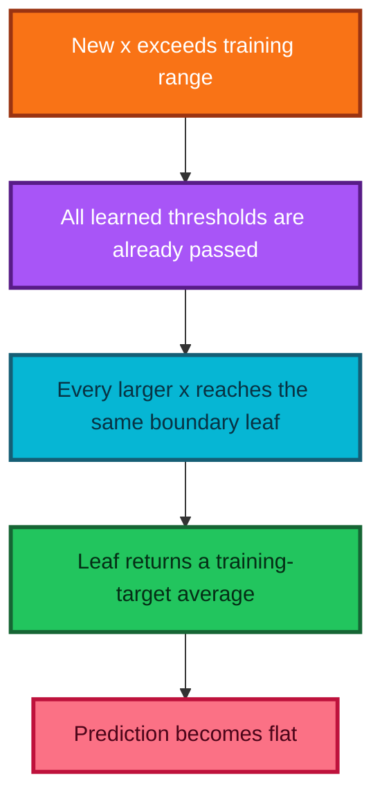

# Practical Machine Learning, Lesson 6

## From predictions to decisions, explanations, interactions, and extrapolation

> Detailed study notes based on **Intro to Machine Learning: Lesson 6**, expanded with mathematical intuition, worked examples, modern `scikit-learn` code, and corrections where the lecture is exploratory or reflects an older software ecosystem.

**Primary source:** [Watch the Lesson 6 video on YouTube](https://www.youtube.com/watch/BFIYUvBRTpE)

---

## Learning goals

By the end of this guide, you should be able to:

1. distinguish a **prediction** from a **decision** and an organizational **objective**;
2. frame a machine-learning project with the **drivetrain approach**;
3. explain why a high AUC or low RMSE may not produce business value;
4. compute and interpret tree-prediction dispersion, permutation importance, PDPs, ICE curves, and local path contributions;
5. recognize data leakage, especially leakage carried by missingness;
6. define a feature interaction and test the idea with synthetic data;
7. explain mathematically why ordinary regression forests cannot extrapolate a trend; and
8. choose safer remedies for time trends and out-of-range prediction.

---

## Table of contents

- [1. The lesson in one picture](#1-the-lesson-in-one-picture)
- [2. Prediction is not the objective](#2-prediction-is-not-the-objective)
- [3. The drivetrain approach](#3-the-drivetrain-approach)
- [4. Prediction, intervention, and counterfactuals](#4-prediction-intervention-and-counterfactuals)
- [5. Where machine learning fits in an organization](#5-where-machine-learning-fits-in-an-organization)
- [6. Interpretation toolkit at a glance](#6-interpretation-toolkit-at-a-glance)
- [7. Tree-prediction dispersion](#7-tree-prediction-dispersion)
- [8. Permutation feature importance](#8-permutation-feature-importance)
- [9. Partial dependence and ICE](#9-partial-dependence-and-ice)
- [10. Local tree-path contributions](#10-local-tree-path-contributions)
- [11. Missing values: signal, semantics, or leakage](#11-missing-values-signal-semantics-or-leakage)
- [12. Feature interactions](#12-feature-interactions)
- [13. Synthetic data as an executable thought experiment](#13-synthetic-data-as-an-executable-thought-experiment)
- [14. Why random forests fail to extrapolate](#14-why-random-forests-fail-to-extrapolate)
- [15. Better strategies for trend and extrapolation](#15-better-strategies-for-trend-and-extrapolation)
- [16. Communicating and contributing](#16-communicating-and-contributing)
- [17. Transcript claims refined](#17-transcript-claims-refined)
- [18. Review questions and answers](#18-review-questions-and-answers)
- [19. Practical checklist](#19-practical-checklist)
- [20. Resources](#20-resources)

---

## Notation used in this guide

| Symbol | Meaning |
|---|---|
| $X$ | Feature matrix; one row per observation and one column per feature |
| $x$ | One observation or feature vector |
| $Y$ | Random outcome or target |
| $y_i$ | Observed target for row $i$ |
| $\hat f(x)$ | A fitted model's prediction at $x$ |
| $a$ | An action, treatment, or lever setting |
| $U(Y,a)$ | Utility obtained from outcome $Y$ after choosing action $a$ |
| $B$ | Number of trees in a forest |
| $L$ | A loss such as RMSE; smaller is better |
| $S$ | A score such as accuracy or $R^2$; larger is better |

---

## 1. The lesson in one picture

The central idea is that a model is valuable only when it improves a real decision. Model interpretation connects the prediction layer to the decision layer, while validation checks whether that connection survives reality.



### The five questions to keep asking

| Question | Why it matters |
|---|---|
| **What do we want?** | Defines success in the language of the organization, patient, user, or community. |
| **What can we change?** | Identifies actual decisions; a model itself is not a lever. |
| **What do we know at that moment?** | Prevents data leakage and impossible production requirements. |
| **What will happen under each action?** | Moves from prediction toward simulation and causal reasoning. |
| **How will we learn after deployment?** | Makes monitoring and experiments part of the product rather than an afterthought. |

---

## 2. Prediction is not the objective

### What is a prediction?

A supervised model estimates an outcome from features:

$$
\hat y=\hat f(x).
$$

Examples include:

- the probability that a customer leaves next month;
- the expected sale price of a machine;
- the probability of hospital readmission; or
- the expected loss on an insurance policy.

These answers describe what the model expects. They do **not** yet tell anyone what to do.

### What is a decision?

A decision compares available actions using expected utility:

$$
a^*(x)=\arg\max_{a\in\mathcal A}
\mathbb E\!\left[U(Y,a)\mid X=x\right].
$$

The action set $\mathcal A$ might contain:

- call or do not call a customer;
- offer no discount, 5%, or 10%;
- discharge a patient, order another test, or continue observation;
- show recommendation A, B, or nothing; or
- approve, refer, or decline an application.

The utility function translates outcomes into what the organization truly values. It may combine revenue, cost, safety, waiting time, fairness, and customer experience.

### Why model metrics are not organizational objectives

Suppose churn model A has AUC $0.91$ and model B has AUC $0.88$. Model A is statistically better at ranking churn risk. Yet model B can still create more value if it more accurately identifies customers whose behavior can be changed at reasonable cost.

For a retention action, a simplified per-customer expected net value is

$$
\operatorname{ENV}(x,a)
=P(\text{retained because of }a\mid x)\times V(x)-C(a,x),
$$

where $V(x)$ is the value of retaining the customer and $C(a,x)$ is the intervention cost.

**Key intuition:** predicting *who will leave* is not the same as predicting *whose leaving can be prevented*.

### When is a pure prediction sufficient?

A direct prediction can be close to the final product when the action follows naturally and costs are simple—for example, flagging a likely fraudulent transaction for manual review. Even then, the threshold should reflect false-positive cost, review capacity, latency, and data available at transaction time.

> **Fun fact:** a model can improve after its $R^2$ falls. If an unrealistically high $R^2$ was caused by target leakage, removing the leaked feature makes the score lower but the scientific result more honest.

---

## 3. The drivetrain approach

The lecture presents the drivetrain approach as four connected components: **objective, levers, data, and models**.



### 3.1 Objective — what outcome should change?

An objective belongs to the organization or people it serves:

- increase long-term profit, not merely next-click probability;
- reduce avoidable readmissions, not merely classify patients;
- detect cancer earlier, not merely maximize image accuracy;
- reduce customer loss without creating excessive discounts or unwanted calls.

#### How to make an objective usable

Specify:

1. **population** — which customers, patients, machines, or transactions;
2. **outcome** — what will be measured;
3. **time horizon** — tomorrow, 30 days, or lifetime;
4. **constraints** — budget, safety, capacity, law, and fairness; and
5. **measurement plan** — how the effect will be observed.

An example is: “Reduce voluntary churn in the next 90 days by at least 8%, with a retention budget below $30 per contacted customer and no increase in complaint rate.”

### 3.2 Levers — what can actually be changed?

A lever is an available action, not a model output.

| Not a lever | Possible lever |
|---|---|
| Predicted churn probability | Call, send an offer, repair service, or do nothing |
| Feature importance for salary | Change pay, role, workload, or manager support |
| Predicted readmission risk | Order a test, arrange follow-up, delay discharge |
| Predicted purchase probability | Change which item, message, price, or placement is shown |

Levers may be indirect. A company cannot change a customer's postcode, but it can change where it markets, where it opens a store, or which delivery service it offers.

### 3.3 Data — what is known when the action is chosen?

The correct question is not “What columns exist in the warehouse?” It is:

> Which features can be obtained legally, reliably, and quickly at the precise decision time?

Let $t_d$ be the decision time. A valid feature must be available no later than $t_d$:

$$
t_{\text{feature}}\le t_d.
$$

If a fraud model uses a field recorded a month after a customer leaves the shop, its validation result may be excellent while its production value is zero.

### 3.4 Model — how do actions become outcomes?

Here “model” is broader than one estimator. A decision model can combine:

- predictive models;
- causal or uplift models;
- accounting identities;
- capacity and policy constraints;
- uncertainty assumptions; and
- an optimizer that chooses the best feasible action.

For an insurance quote with premium $p$, a simple expected-profit model might be

$$
\mathbb E[\Pi(p)\mid x]
=P(\text{accept}\mid p,x)
\left[p-\mathbb E(\text{claim}\mid x)-c_{\text{service}}\right]
-c_{\text{acquisition}}.
$$

A richer simulator would include renewal probabilities, claim frequency, claim severity, inflation, and multiple years. An optimizer could evaluate possible premiums and choose the best one subject to regulation and fairness constraints.

### Worked churn framing

| Drivetrain part | Example answer |
|---|---|
| Objective | Maximize 12-month contribution margin while reducing avoidable churn. |
| Levers | No contact, service call, plan change, 5% offer, or 10% offer. |
| Decision-time data | Tenure, recent usage, complaints, plan, payment history, and service quality known today. |
| Models | Baseline churn, incremental response to each action, retention value, contact cost, and capacity. |
| Decision rule | Choose the action with greatest positive expected net value; otherwise do nothing. |

---

## 4. Prediction, intervention, and counterfactuals

### Observational prediction

A churn classifier estimates

$$
P(Y=1\mid X=x),
$$

where $Y=1$ means that the customer leaves. This is useful for forecasting, but it does not identify the effect of an action.

### Potential outcomes and uplift

Let:

- $Y(1)$ be the outcome if the person receives an intervention; and
- $Y(0)$ be the outcome if the person does not.

The conditional average treatment effect, often called **uplift**, is

$$
\tau(x)=\mathbb E[Y(1)-Y(0)\mid X=x].
$$

Only one potential outcome can be observed for a person. The other is a **counterfactual**. This is why causal estimation needs randomized experiments or defensible causal assumptions—not only a powerful predictor.



### Recommendation example

Suppose a customer has:

$$
P(\text{buy}\mid \text{show A},x)=0.80,
\qquad
P(\text{buy}\mid \text{do not show A},x)=0.78.
$$

The incremental effect is only $0.02$. A second product has probabilities $0.30$ and $0.08$, giving uplift $0.22$. Although product A has the higher purchase probability, product B is the better use of scarce recommendation space if margins and side effects are similar.

### The causal warning

Feature importance and partial dependence describe a **fitted model's behavior**. They do not, by themselves, show that changing a feature will change the real-world outcome. Common causes, selection bias, reverse causality, and correlated features can all create misleading associations.

Use an A/B test when a safe randomization is possible. Otherwise, define a causal graph and justify assumptions before interpreting an estimated contrast as an intervention effect.

---

## 5. Where machine learning fits in an organization

### Horizontal and vertical applications

The lecture separates applications into two broad groups.

| Type | Meaning | Examples |
|---|---|---|
| **Horizontal** | Repeated across many industries | Marketing, churn, sales leads, fraud, human resources, pricing |
| **Vertical** | Specialized to a domain or workflow | Hospital readmission, aircraft gates, retail assortment, manufacturing failures, insurance claims |

### Prediction often supports a human

Most deployed models do not fully automate a process. They place useful information in front of a human decision-maker.


Examples:

- an insurance agent sees the major contributors to a renewal-price change;
- a clinician sees readmission risk plus missing tests that may reduce uncertainty;
- an airport controller sees delay probability and downstream gate conflicts;
- a fraud analyst sees a risk score, uncertainty, and the events that raised it.

Interpretations should be designed for the user's task. A technically exact explanation that arrives too late, uses unfamiliar units, or suggests impossible actions is not operationally useful.

---

## 6. Interpretation toolkit at a glance

| Tool | Main question | Scope | Strong use | Major caution |
|---|---|---|---|---|
| Tree-prediction dispersion | Do randomized trees disagree here? | One row or group | Flag unstable regions | Not a calibrated confidence interval |
| Permutation importance | Which columns does this fitted model rely on? | Global or subgroup | Rank reliance; detect leakage | Correlated features can mask each other |
| PDP | What is the model's average response as one or two features vary? | Global | Summarize shape | May evaluate implausible combinations |
| ICE | Does that response differ across rows? | Local curves | Reveal heterogeneity | Many lines can be hard to read |
| Path contributions | Why did this tree ensemble predict this row? | Local | Case-level explanation | Attribution is not causation |
| Interaction analysis | Does one feature's effect depend on another? | Global or local | Find conditional structure | Tree path co-occurrence is not proof |
| Synthetic experiment | Does a method behave as claimed when truth is known? | Method-level | Debug intuition and code | A toy result may not transfer unchanged |

---

## 7. Tree-prediction dispersion

### What is it?

A random forest prediction is an average over $B$ trees:

$$
\bar f(x)=\frac{1}{B}\sum_{b=1}^{B}f_b(x).
$$

The sample standard deviation of the tree predictions is

$$
s_{\text{trees}}(x)
=\sqrt{\frac{1}{B-1}\sum_{b=1}^{B}\left(f_b(x)-\bar f(x)\right)^2}.
$$

A large value means that the randomized trees reach meaningfully different estimates for that row. This can happen in sparse regions, near unstable splits, or when the row resembles different training subgroups.

### Why is it useful?

It is a practical **disagreement diagnostic**:

- compare uncertainty-like behavior across customer groups;
- send high-disagreement cases for manual review;
- investigate sparse or shifted input regions; and
- avoid acting aggressively on a fragile point estimate.

### Important statistical correction

The interval $\bar f(x)\pm2s_{\text{trees}}(x)$ is **not automatically a 95% prediction interval**. Trees are correlated, their variation reflects the forest-building procedure, and it does not capture all observation noise. Treat a score such as $\bar f(x)-ks_{\text{trees}}(x)$ as an operational risk heuristic unless it has been calibrated on held-out data.

### Commented code: compute per-tree dispersion

```python
import numpy as np
import pandas as pd
from sklearn.ensemble import RandomForestRegressor

# X_train is a 2D array or DataFrame; y_train is a 1D target array.
forest = RandomForestRegressor(
    n_estimators=300,      # Use many randomized trees for a stable ensemble average.
    min_samples_leaf=5,   # Regularize leaves so each prediction uses several examples.
    random_state=42,      # Make the demonstration reproducible.
    n_jobs=-1,            # Use all available CPU cores while fitting.
)
forest.fit(X_train, y_train)

# Select rows whose prediction stability we want to inspect.
X_case = X_valid.iloc[:10] if hasattr(X_valid, "iloc") else X_valid[:10]

# Each column below contains the predictions made by one tree.
tree_predictions = np.column_stack(
    [tree.predict(X_case) for tree in forest.estimators_]
)

# The forest prediction is the mean of its individual-tree predictions.
prediction_mean = tree_predictions.mean(axis=1)

# ddof=1 computes the sample standard deviation across trees.
tree_disagreement = tree_predictions.std(axis=1, ddof=1)

# A lower confidence score is a heuristic, not a calibrated interval endpoint.
review_score = prediction_mean - 2.0 * tree_disagreement

# Put the results into a readable table for inspection or a decision interface.
diagnostics = pd.DataFrame(
    {
        "prediction": prediction_mean,
        "tree_disagreement": tree_disagreement,
        "heuristic_lower_score": review_score,
    }
)
print(diagnostics)
```

### A calibrated alternative: split conformal intervals

If rows are exchangeable and a separate calibration set represents deployment, split conformal prediction can produce a finite-sample **marginal** coverage guarantee. For a desired miscoverage rate $\alpha$, calculate calibration residuals

$$
r_i=\left|y_i-\hat f(x_i)\right|
$$

and let $q$ be the appropriate upper empirical quantile. Then report

$$
[\hat f(x)-q,\ \hat f(x)+q].
$$

```python
import numpy as np

# Fit the model only on the proper training split.
forest.fit(X_proper_train, y_proper_train)

# Measure absolute errors on a separate calibration split.
calibration_prediction = forest.predict(X_calibration)
calibration_residual = np.abs(y_calibration - calibration_prediction)

# Choose a finite-sample corrected quantile for 90% marginal coverage.
alpha = 0.10
n_cal = len(calibration_residual)
quantile_level = min(1.0, np.ceil((n_cal + 1) * (1 - alpha)) / n_cal)
q = np.quantile(calibration_residual, quantile_level, method="higher")

# Apply the same calibrated radius to new point predictions.
new_prediction = forest.predict(X_new)
lower = new_prediction - q
upper = new_prediction + q
```

This basic interval has constant width. More advanced methods can adapt width to $x$, but they also require careful validation under distribution shift.

---

## 8. Permutation feature importance

### What is it?

Permutation importance asks:

> How much does this fitted model's validation performance deteriorate when one feature's values are randomly reassigned to rows?

Shuffling feature $j$ preserves its marginal distribution but breaks its row-wise relationship with the target and other columns.



### Formula and units

For a loss $L$ where smaller is better,

$$
I_j^{(r)}=L\!\left(y,\hat f(X_{\pi_j}^{(r)})\right)-L\!\left(y,\hat f(X)\right),
$$

where $X_{\pi_j}^{(r)}$ is the validation matrix with column $j$ shuffled in repeat $r$.

For a score $S$ where larger is better,

$$
I_j^{(r)}=S\!\left(y,\hat f(X)\right)-S\!\left(y,\hat f(X_{\pi_j}^{(r)})\right).
$$

The units are the units of the chosen loss or score. If RMSE increases from $2.0$ to $3.0$, importance is $1.0$ target units. Importances do **not** need to sum to one.

### How to calculate it correctly

1. Fit the model on training data.
2. Verify that it performs meaningfully on held-out data.
3. Record the baseline validation score.
4. Shuffle one validation column without retraining.
5. rescore the model and calculate the degradation.
6. Repeat several times to measure Monte Carlo variation.
7. Restore the column before moving to the next feature.

The official [`scikit-learn` permutation-importance guide](https://scikit-learn.org/stable/modules/permutation_importance.html) emphasizes that the result is importance to a **particular fitted model**, not an intrinsic property of the feature.

### Commented code with a modern API

```python
import pandas as pd
from sklearn.inspection import permutation_importance

# Compute importance on held-out rows, not on the same data used for fitting.
result = permutation_importance(
    forest,
    X_valid,
    y_valid,
    scoring="neg_root_mean_squared_error",  # Larger is better after negation.
    n_repeats=20,                            # Repeat shuffles to estimate variability.
    random_state=42,                         # Make each permutation reproducible.
    n_jobs=-1,                               # Parallelize feature permutations.
)

# Recover readable feature names whether X_valid is a DataFrame or an array.
feature_names = (
    list(X_valid.columns)
    if hasattr(X_valid, "columns")
    else [f"feature_{j}" for j in range(X_valid.shape[1])]
)

# A positive value means shuffling reduced the score on average.
importance_table = pd.DataFrame(
    {
        "feature": feature_names,
        "importance_mean": result.importances_mean,
        "importance_sd": result.importances_std,
    }
).sort_values("importance_mean", ascending=False)

print(importance_table)
```

### How to interpret the result

- **Large positive importance:** the model relies strongly on that column for this evaluation set.
- **Near zero:** the fitted model gains little from the column, or another correlated column substitutes for it.
- **Negative:** shuffling helped on average; the feature may contribute noise, instability, or overfitting.

### Common pitfalls

#### 1. A weak model makes weak importance uninformative

If the model has no held-out predictive skill, “nothing is important” says little. Establish baseline performance first.

#### 2. Correlated features share or hide importance

If `age_years` and `birth_year` carry nearly the same information, shuffling either one may have little effect because the other remains. Consider grouping correlated features, conditional permutation, or removing redundancies and refitting.

#### 3. Shuffling can create impossible rows

Randomly pairing a feature with unrelated values may create combinations absent from reality. The measured degradation includes sensitivity to these artificial combinations.

#### 4. Importance is not causality

A feature can be predictive because it is a proxy, consequence, or leaked encoding of the target. The model's reliance does not show that changing the feature changes the outcome.

#### 5. Decision-time availability matters

A dominant feature is often a prompt to ask, “When is this recorded?” A near-copy of the label or a post-outcome field can make a model look miraculous.

> **Fun fact:** identifiers are not automatically useless. An ID may accidentally encode time, geography, batch, or target leakage. Keep it long enough to investigate, then decide whether the encoded structure is legitimate at deployment.

---

## 9. Partial dependence and ICE

Permutation importance tells us **whether** a model relies on a feature. Partial dependence and ICE show **how the model's prediction changes** as that feature changes.

### 9.1 Individual conditional expectation

Let $S$ be the feature or small feature set being varied, and $C$ its complement. For row $i$, the ICE curve is

$$
\operatorname{ICE}_i(x_S)=\hat f(x_S,x_C^{(i)}).
$$

We keep the row's other feature values and sweep $x_S$ over a grid. One ICE line therefore answers:

> What would this fitted model predict for this row if the selected input were replaced by each grid value?

### 9.2 Partial dependence

The standard empirical PDP is the **mean** of the ICE predictions:

$$
\widehat{\operatorname{PD}}_S(x_S)
=\frac{1}{n}\sum_{i=1}^{n}\hat f(x_S,x_C^{(i)}).
$$

The transcript discusses a median summary. A median ICE curve can be a useful robust alternative, but the standard definition and `scikit-learn` implementation use the mean. The [official PDP/ICE guide](https://scikit-learn.org/stable/modules/partial_dependence.html) gives both the expectation and its empirical average.



### Why both views are needed

Suppose the PDP is nearly flat. That could mean:

1. the feature has little effect anywhere; or
2. half the ICE curves rise and half fall, so opposite effects cancel in the mean.

ICE reveals heterogeneity and possible interactions that a single average can hide.

### Commented code: PDP and ICE together

```python
import matplotlib.pyplot as plt
from sklearn.inspection import PartialDependenceDisplay

# Plot individual ICE curves and their mean PDP for one feature.
display = PartialDependenceDisplay.from_estimator(
    forest,
    X_valid,
    features=["year_made"],  # Use [0] instead when X_valid has no column names.
    kind="both",             # Overlay ICE lines and the mean partial dependence.
    subsample=100,           # Draw only 100 ICE lines to keep the figure readable.
    grid_resolution=50,      # Evaluate 50 feature values across the displayed range.
    random_state=42,         # Reproduce the same ICE subsample.
)

# Add a clear title outside the estimator call.
display.figure_.suptitle("Year made: model response and row-level variation")
display.figure_.tight_layout()
plt.show()
```

### Two-feature PDP for an interaction

```python
import matplotlib.pyplot as plt
from sklearn.inspection import PartialDependenceDisplay

# A two-dimensional PDP shows the model response over a joint feature grid.
display = PartialDependenceDisplay.from_estimator(
    forest,
    X_valid,
    features=[("year_made", "meter_hours")],
    grid_resolution=30,
)

# A nonparallel or curved surface suggests that one feature's effect depends on the other.
display.figure_.suptitle("Joint partial dependence: year and usage")
display.figure_.tight_layout()
plt.show()
```

### The log-target connection

Suppose the model predicts $z=\log y$ and the PDP is approximately linear:

$$
\widehat{\operatorname{PD}}(x)=a+bx.
$$

On the original target scale,

$$
\hat y=\exp(a+bx)=e^a(e^b)^x.
$$

Each one-unit increase in $x$ therefore multiplies the predicted target by $e^b$. If $b=0.05$, the factor is $e^{0.05}\approx1.051$, or about a 5.1% increase per unit.

### When should PDP/ICE be used?

Use them after:

1. checking held-out predictive performance;
2. identifying a small set of statistically and operationally relevant features; and
3. writing down the shape you expect **before** seeing the plot.

Pre-registering your intuition reduces hindsight bias. Unexpected shapes can reveal leakage, feature-engineering errors, unrepresented subgroups, interactions, or genuine domain discoveries.

### Essential cautions

- PDP/ICE replace feature values inside observed rows; correlated inputs can produce implausible combinations.
- “All other inputs held at their observed values” is not the same as a real intervention.
- A feature outside its observed support should not be swept casually.
- The plot explains the fitted model, which may itself be wrong.
- For causal decisions, validate with experiments or explicit causal methods.

---


## 10. Local tree-path contributions

Global importance answers, “What does the model rely on overall?” A local decomposition asks, “Why did the model make **this** prediction?”

### What is the path decomposition?

For one decision tree and one row, start with the root prediction. Every split moves the row to a child node with a possibly different mean target. Assign the change from parent to child to the feature used at the parent split.

If the visited nodes are $n_0,n_1,\ldots,n_K$ and feature $j_k$ is used at node $n_k$, then

$$
c_{j_k}=v(n_{k+1})-v(n_k),
$$

where $v(n)$ is the prediction stored at node $n$. Repeated uses of the same feature are added.

The final tree prediction telescopes:

$$
\hat f_{\text{tree}}(x)=v(n_0)+\sum_j c_j(x).
$$

For a random forest, average the bias and contributions across trees:

$$
\hat f_{\text{forest}}(x)
=\frac{1}{B}\sum_{b=1}^{B}v_b(n_{0,b})
+\sum_j\frac{1}{B}\sum_{b=1}^{B}c_{b,j}(x).
$$

### Worked example

Suppose a tree follows this path:

| Step | Split feature | Parent value | Child value | Contribution |
|---:|---|---:|---:|---:|
| Start | Root bias | — | 10.0 | 10.0 |
| 1 | Enclosure | 10.0 | 9.5 | $-0.5$ |
| 2 | Year made | 9.5 | 9.7 | $+0.2$ |
| 3 | Meter hours | 9.7 | 9.4 | $-0.3$ |

Therefore,

$$
10.0-0.5+0.2-0.3=9.4.
$$



### Commented code: decompose a fitted scikit-learn forest

```python
from collections import defaultdict

import numpy as np
import pandas as pd


def tree_path_contributions(tree_model, row, feature_names):
    """Return an exact parent-to-child decomposition for one regression tree."""

    # Convert a one-row Series or list into a flat numeric NumPy array.
    row = np.asarray(row, dtype=float).reshape(-1)

    # Access the fitted low-level tree structure.
    structure = tree_model.tree_

    # The root value is the tree's baseline prediction before following splits.
    root_value = float(structure.value[0].reshape(-1)[0])

    # Accumulate repeated splits on the same feature into one contribution.
    contribution = defaultdict(float)

    # Every fitted tree starts at node index zero.
    node = 0

    # A negative feature index marks a leaf, so continue only through split nodes.
    while structure.feature[node] >= 0:
        feature_index = structure.feature[node]
        feature_value = row[feature_index]

        # Modern scikit-learn trees may learn a routing direction for NaN values.
        if np.isnan(feature_value):
            go_left = bool(structure.missing_go_to_left[node])
        else:
            # Ordinary numeric values go left when they satisfy the threshold.
            go_left = feature_value <= structure.threshold[node]

        # Follow the child selected for this observation.
        child = (
            structure.children_left[node]
            if go_left
            else structure.children_right[node]
        )

        # Attribute the change in node prediction to the feature used at this split.
        parent_value = float(structure.value[node].reshape(-1)[0])
        child_value = float(structure.value[child].reshape(-1)[0])
        feature_name = feature_names[feature_index]
        contribution[feature_name] += child_value - parent_value

        # Continue walking from the selected child.
        node = child

    # The final node value is the exact prediction made by this tree.
    tree_prediction = float(structure.value[node].reshape(-1)[0])
    return root_value, dict(contribution), tree_prediction


def forest_path_contributions(forest_model, row, feature_names):
    """Average local path contributions over every tree in a fitted forest."""

    # Decompose the same row independently in every tree.
    decompositions = [
        tree_path_contributions(tree, row, feature_names)
        for tree in forest_model.estimators_
    ]

    # Average the per-tree root predictions to obtain the forest bias.
    bias = np.mean([item[0] for item in decompositions])

    # Average each feature's contribution, treating absent path features as zero.
    mean_contribution = {
        name: np.mean([item[1].get(name, 0.0) for item in decompositions])
        for name in feature_names
    }

    # Sort by absolute magnitude while preserving each contribution's sign.
    table = pd.DataFrame(
        {
            "feature": list(mean_contribution),
            "contribution": list(mean_contribution.values()),
        }
    )
    table["absolute_contribution"] = table["contribution"].abs()
    table = table.sort_values("absolute_contribution", ascending=False)

    # The additive reconstruction should equal the forest's prediction.
    reconstructed_prediction = bias + table["contribution"].sum()
    return bias, table, reconstructed_prediction


# Keep row values aligned with the model's feature order.
feature_names = list(X_valid.columns)
row = X_valid.iloc[0].to_numpy()

# Calculate the local explanation for this validation observation.
bias, local_table, reconstructed = forest_path_contributions(
    forest,
    row,
    feature_names,
)

# Verify the decomposition against the estimator's public prediction method.
direct_prediction = forest.predict(X_valid.iloc[[0]])[0]
assert np.isclose(reconstructed, direct_prediction)

print(f"Bias: {bias:.3f}")
print(local_table.head(10))
print(f"Prediction: {direct_prediction:.3f}")
```

### Why paired sorting matters

Never sort feature names independently from contribution values. Keep them in the same rows, then sort the table by absolute contribution. Otherwise, the explanation can attach the correct number to the wrong feature—a subtle but serious reporting error.

### How should a local contribution be interpreted?

Correct wording:

> “Following the model's learned paths, this feature moved the prediction upward by 0.20 relative to the previous node values.”

Incorrect wording:

> “This feature caused the outcome to increase by 0.20.”

Path attribution is exact for the fitted tree under this decomposition rule. It is not a causal effect, and correlated features can receive different credit depending on which one a tree chooses first.

---

## 11. Missing values: signal, semantics, or leakage

### What can missingness mean?

A missing value is not always random noise. It can mean:

- the attribute does not apply;
- a test was not ordered;
- a customer declined to answer;
- a legacy system did not capture the field;
- a sensor failed under particular operating conditions; or
- the field is filled only after the outcome occurs.

The last case is leakage. Missingness can be strongly predictive for the wrong reason.



### Historical versus modern handling

The lecture's older pipeline encoded a missing categorical value with a reserved integer category. That remains a legitimate strategy when done explicitly. Modern `scikit-learn` also gives `RandomForestRegressor` [native NaN routing](https://scikit-learn.org/stable/modules/generated/sklearn.ensemble.RandomForestRegressor.html): the tree learner decides at each split whether NaNs go left or right.

However:

- not every estimator or preprocessing transformer accepts NaN;
- categorical strings still need deliberate encoding;
- native support does not determine whether missingness is causal, fair, or leaked; and
- a production pipeline should behave consistently at fit and predict time.

### Commented code: explicit preprocessing and missing indicators

```python
from sklearn.compose import ColumnTransformer
from sklearn.ensemble import RandomForestRegressor
from sklearn.impute import SimpleImputer
from sklearn.pipeline import Pipeline
from sklearn.preprocessing import OneHotEncoder

# Separate columns by the transformations they require.
numeric_features = ["age", "meter_hours", "year_made"]
categorical_features = ["enclosure", "product_group"]

# Median imputation is robust to extreme numeric values.
# add_indicator=True also records which original values were missing.
numeric_pipeline = Pipeline(
    steps=[
        (
            "impute",
            SimpleImputer(strategy="median", add_indicator=True),
        )
    ]
)

# Give missing categorical values their own explicit label, then one-hot encode.
categorical_pipeline = Pipeline(
    steps=[
        (
            "impute",
            SimpleImputer(strategy="constant", fill_value="__MISSING__"),
        ),
        (
            "encode",
            OneHotEncoder(handle_unknown="ignore"),
        ),
    ]
)

# Apply the correct preprocessing branch to each column family.
preprocess = ColumnTransformer(
    transformers=[
        ("numeric", numeric_pipeline, numeric_features),
        ("categorical", categorical_pipeline, categorical_features),
    ]
)

# Keep preprocessing and prediction in one object to prevent train/serve mismatch.
model = Pipeline(
    steps=[
        ("preprocess", preprocess),
        (
            "forest",
            RandomForestRegressor(
                n_estimators=300,
                min_samples_leaf=5,
                random_state=42,
                n_jobs=-1,
            ),
        ),
    ]
)

# Fit every learned transformation using training data only.
model.fit(X_train, y_train)

# The identical transformations are automatically applied during prediction.
prediction = model.predict(X_valid)
```

### Missingness audit

For every important missing indicator, ask:

1. When is the original field populated?
2. Does the population process differ between training and deployment?
3. Could the target or a downstream decision influence whether it is present?
4. Does relying on missingness create an unfair proxy?
5. What happens if the upstream data-entry process changes?

> **Fun fact:** sometimes “not measured” is more predictive than the measurement. That can reveal a useful workflow signal—or a devastating leak. The timeline decides which.

---

## 12. Feature interactions

### What is an interaction?

Features interact when the effect of one feature depends on the value of another.

An additive function has no interaction:

$$
f(x_1,x_2)=g(x_1)+h(x_2).
$$

A familiar interaction model is

$$
f(x_1,x_2)=\beta_0+\beta_1x_1+\beta_2x_2+\beta_3x_1x_2.
$$

Its slope with respect to $x_1$ is

$$
\frac{\partial f}{\partial x_1}=\beta_1+\beta_3x_2.
$$

When $\beta_3\ne0$, changing $x_2$ changes the effect of $x_1$.

### A model-agnostic discrete check

For two values $a,b$ of $x_1$ and $c,d$ of $x_2$, define the cross-difference

$$
\Delta=f(a,c)-f(a,d)-f(b,c)+f(b,d).
$$

If $f$ is additive, $\Delta=0$. A nonzero result reveals nonadditivity at those four points.



### Commented synthetic example

```python
import numpy as np
import pandas as pd
from sklearn.ensemble import RandomForestRegressor
from sklearn.inspection import PartialDependenceDisplay

# Use an independent random generator for reproducible synthetic data.
rng = np.random.default_rng(42)

# Draw two independent features over a symmetric range.
n = 2_000
x1 = rng.uniform(-1.0, 1.0, size=n)
x2 = rng.uniform(-1.0, 1.0, size=n)

# Construct a known data-generating process with a strong x1*x2 interaction.
noise = rng.normal(0.0, 0.15, size=n)
y = x1 + x2 + 3.0 * x1 * x2 + noise

# Store named columns so inspection plots have meaningful labels.
X = pd.DataFrame({"x1": x1, "x2": x2})

# Fit a flexible model that can learn nonlinear conditional structure.
interaction_forest = RandomForestRegressor(
    n_estimators=300,
    min_samples_leaf=8,
    random_state=42,
    n_jobs=-1,
)
interaction_forest.fit(X, y)

# Plot both one-feature effects and the joint two-feature response surface.
PartialDependenceDisplay.from_estimator(
    interaction_forest,
    X,
    features=["x1", "x2", ("x1", "x2")],
    grid_resolution=30,
)
```

The $x_1$ slope should be negative when $x_2$ is sufficiently negative and strongly positive when $x_2$ is positive. That change in slope is the interaction.

### Friedman-style interaction strength

Let $PD_{12}$ be a centered two-feature partial dependence and $PD_1,PD_2$ be centered one-feature partial dependences evaluated at compatible points. A commonly used summary is

$$
H^2_{12}
=\frac{\sum_i\left[PD_{12}(x_{i1},x_{i2})-PD_1(x_{i1})-PD_2(x_{i2})\right]^2}
{\sum_iPD_{12}^2(x_{i1},x_{i2})}.
$$

A value near zero suggests that the joint effect is mostly additive. A larger value suggests nonadditivity. It is a model diagnostic, not a causal interaction estimate, and correlated features can make the underlying partial dependences unreliable.

### Does sharing a tree path prove interaction?

No. If a tree splits on `enclosure` and later on `year_made`, those variables jointly define the leaf. Their co-occurrence is a useful **candidate signal**, but it is not a unique or settled allocation of interaction credit.

They may appear on the same path because:

- the true response is interactive;
- correlated variables substitute for each other;
- the tree needs both additive splits to approximate a smooth function;
- earlier greedy choices make a later split useful; or
- the path is an artifact of sampling and finite data.

More principled options include two-dimensional PDP/ICE analysis, Friedman $H$, joint performance tests with careful baselines, and SHAP interaction values for compatible tree explainers.

### Why brute-force pairs grow quickly

With $p$ features, there are

$$
\binom p2=\frac{p(p-1)}2
$$

unordered pairs. For $p=100$, that is $4{,}950$ pairs. Repeating multiple permutations for each pair can therefore be expensive.

> **Fun fact:** in statistical formulas, `x1 * x2` often denotes an interaction term. In R formula syntax, `x1 * x2` expands to the two main effects plus their interaction.

---

## 13. Synthetic data as an executable thought experiment

### What is synthetic data?

Synthetic data is generated from a rule chosen by the analyst. Because the data-generating process is known, it becomes an experiment for an algorithm or interpretation method.

### Why use it?

Real data rarely reveals whether a surprising result comes from:

- the algorithm;
- the implementation;
- noise;
- sampling;
- confounding;
- preprocessing; or
- the real phenomenon.

Synthetic data removes some of those unknowns.

### A disciplined workflow



### Example hypotheses

| Claim to test | Synthetic data | Expected result |
|---|---|---|
| An interaction measure finds $x_1x_2$ | $y=x_1+x_2+3x_1x_2+\varepsilon$ | High interaction for $(x_1,x_2)$ |
| Permutation importance ignores noise | Add an independent random feature | Near-zero held-out importance for noise |
| Missingness is predictive | Make missing probability depend on $y$ | Missing indicator becomes important |
| A forest extrapolates a trend | Train on early $x$ and validate on later $x$ | Prediction flattens beyond train range |

Synthetic experiments do not prove real-world validity. They establish that the implementation can recover a pattern under controlled assumptions.

---

## 14. Why random forests fail to extrapolate

### Interpolation versus extrapolation

- **Interpolation:** predict among feature values and patterns represented in training.
- **Extrapolation:** predict beyond the observed feature range or into a structurally new region.

Trees partition the input space with thresholds. Beyond the largest training value of a one-dimensional feature, every new point follows the same final “greater than” branches and lands in a boundary leaf.



### Mathematical reason

For ordinary squared-error regression, a tree leaf $L_b(x)$ predicts a mean of training targets in that leaf:

$$
h_b(x)=\frac{1}{|L_b(x)|}\sum_{i\in L_b(x)}y_i.
$$

The forest averages these leaf means:

$$
\hat f(x)=\frac1B\sum_{b=1}^B h_b(x).
$$

Each leaf mean lies in the interval $[\min_i y_i,\max_i y_i]$, and an average of values in this interval also lies inside it. Therefore a standard regression forest cannot predict outside the range of its training targets.

That bounded-output fact is related to, but distinct from, the feature-range problem. Even within the target range, a future trend can be wrong because the tree's piecewise-constant function has no rule saying “continue this slope.”

### Commented experiment from the lesson

```python
import matplotlib.pyplot as plt
import numpy as np
from sklearn.ensemble import RandomForestRegressor
from sklearn.linear_model import LinearRegression
from sklearn.metrics import root_mean_squared_error

# Generate evenly spaced feature values that act like time.
rng = np.random.default_rng(42)
x = np.linspace(0.0, 1.0, num=80)

# Add small random noise to a known linear trend.
y = 1.0 + 2.5 * x + rng.uniform(-0.15, 0.15, size=x.shape)

# Estimators expect a 2D feature matrix: 80 rows by 1 feature.
X = x[..., None]

# Use an honest chronological split: early points train, later points validate.
split = 60
X_train, X_valid = X[:split], X[split:]
y_train, y_valid = y[:split], y[split:]

# Fit a random forest that interpolates the training region well.
forest = RandomForestRegressor(
    n_estimators=300,
    min_samples_leaf=2,
    random_state=42,
    n_jobs=-1,
)
forest.fit(X_train, y_train)

# Fit a linear model whose structural assumption is a continuing straight line.
linear = LinearRegression()
linear.fit(X_train, y_train)

# Compare both models in the future validation region.
forest_valid_prediction = forest.predict(X_valid)
linear_valid_prediction = linear.predict(X_valid)

print(
    "Forest validation RMSE:",
    root_mean_squared_error(y_valid, forest_valid_prediction),
)
print(
    "Linear validation RMSE:",
    root_mean_squared_error(y_valid, linear_valid_prediction),
)

# Draw observed points and predictions across both time regions.
plt.scatter(x[:split], y_train, label="train", color="#2563EB")
plt.scatter(x[split:], y_valid, label="future validation", color="#111827")
plt.plot(x, forest.predict(X), label="random forest", color="#F97316")
plt.plot(x, linear.predict(X), label="linear model", color="#22C55E")
plt.axvline(x[split], color="#A855F7", linestyle="--", label="split")
plt.xlabel("x (time-like feature)")
plt.ylabel("y")
plt.legend()
plt.show()
```

The forest usually tracks the training data, then flattens near a boundary prediction. The linear model is much better here because the true data-generating rule is linear.

### Array-shape intuition

`x.shape == (80,)` is a one-dimensional array. Most scikit-learn estimators require `X.shape == (n_samples, n_features)`, so

```python
# Add a unit axis at the end: shape changes from (80,) to (80, 1).
X = x[..., None]
```

`x[None, ...]` would instead create shape `(1, 80)`: one row with 80 features, which is the wrong orientation for this experiment.

> **Terminology note:** `array.ndim` counts axes. In machine-learning conversation, people may call an n-dimensional array a rank-n tensor. In linear algebra and physics, “rank” and “tensor” have more specific meanings, so context matters.

### Validation is the detector

A random train/test split mixes early and late times. It can hide extrapolation failure because validation points remain surrounded by training points. When deployment predicts the future, validation should respect time:

$$
\max(t_{\text{train}})<\min(t_{\text{validation}}).
$$

Use multiple rolling or expanding windows when enough history is available.

---

## 15. Better strategies for trend and extrapolation

No algorithm extrapolates correctly without assumptions. The goal is to choose an inductive bias that matches the process and validate it outside the training range.

### 15.1 Use a trend model when the trend is the main structure

Possible choices include:

- linear or polynomial regression;
- splines with carefully controlled boundary behavior;
- exponential or log-linear models;
- state-space or classical time-series models;
- mechanistic models based on domain knowledge; and
- models with monotonic or shape constraints.

Choose the form because it is defensible, not because it happens to extend smoothly on one graph.

### 15.2 Detrend, then model residual structure

Write

$$
y=g(t)+r,
$$

where $g(t)$ is a trend model and a forest predicts the residual $r$ from other features $z$:

$$
\hat y=\hat g(t)+\hat h(z).
$$

This lets the trend component extrapolate while the forest learns nonlinear deviations represented in training.

### Commented hybrid example

```python
import numpy as np
from sklearn.ensemble import RandomForestRegressor
from sklearn.linear_model import LinearRegression

# t_train and t_valid must be 2D arrays with one time column.
# Z_train and Z_valid contain non-time features available at prediction time.
trend_model = LinearRegression()
trend_model.fit(t_train, y_train)

# Remove the fitted training trend from the target.
train_trend = trend_model.predict(t_train)
train_residual = y_train - train_trend

# Learn reproducible nonlinear deviations from the trend.
residual_model = RandomForestRegressor(
    n_estimators=300,
    min_samples_leaf=5,
    random_state=42,
    n_jobs=-1,
)
residual_model.fit(Z_train, train_residual)

# Add the extrapolating trend and the learned residual correction.
valid_prediction = (
    trend_model.predict(t_valid)
    + residual_model.predict(Z_valid)
)
```

The residual model can still fail if future residual patterns shift. Validate the complete pipeline chronologically.

### 15.3 Understand what gradient boosting fixes—and what it does not

For squared error, gradient boosting builds an additive sequence:

$$
F_m(x)=F_{m-1}(x)+\eta h_m(x),
$$

where $h_m$ is fitted to current residuals and $\eta$ is the learning rate.

This can separate a dominant structure from smaller residual patterns more conveniently than a bagged forest. However, when each $h_m$ is a standard regression tree, predictions remain piecewise constant outside learned split regions. Tree-based gradient boosting does **not** automatically continue a future trend. See the current [`scikit-learn` ensemble guide](https://scikit-learn.org/stable/modules/ensemble.html#gradient-boosting) for the additive formulation.

### 15.4 Neural networks are not an automatic solution

A neural network can represent functions that continue beyond the training range, but nothing guarantees that it will continue the **correct** function. Its activation functions, architecture, regularization, feature scaling, and training data determine its out-of-range behavior.

Validate every candidate in the actual extrapolation regime.

| Model family | Natural strength | Extrapolation caution |
|---|---|---|
| Random forest | Flexible interpolation and interactions | Boundary leaves become flat |
| Tree gradient boosting | Powerful residual fitting | Tree components still do not extend slopes |
| Linear/log-linear model | Clear, stable functional continuation | Wrong if the functional form changes |
| Spline/polynomial | Flexible smooth shape | Boundary behavior can become unstable |
| Neural network | Rich learned functions | Outside-range behavior is unconstrained unless designed |
| Mechanistic/time-series model | Encodes domain or temporal structure | Assumptions must remain valid in the future |
| Trend + residual hybrid | Separates extrapolation from nonlinear correction | Both components and their combination need testing |

### A safer model-selection procedure

1. Draw the training and deployment ranges for each important feature.
2. Choose chronological or group-aware validation that mimics deployment.
3. Compare against simple structural baselines.
4. Examine predictions beyond the observed range, not just an average metric.
5. Stress-test plausible trend changes and covariate shifts.
6. Quantify uncertainty and define an abstention or fallback policy.
7. Monitor whether new observations leave the validated support.

---

## 16. Communicating and contributing

### Effective technical explanation

The lecture highlights two communication techniques:

1. start with a **specific example**; and
2. connect the new idea to a familiar analogy.

Instead of “local attribution assigns features to observations,” say:

> “Global importance tells a hospital what the model relies on across all patients. A local path explanation tells a clinician which inputs moved this patient's readmission prediction.”

The concrete version gives the abstraction a job, user, and consequence.

### Waterfall charts

A waterfall chart is a natural display for

$$
\text{bias}+\text{signed contributions}=\text{prediction}.
$$

Use a fixed color convention, show original feature values, preserve units, group tiny contributions, and place the final prediction beside a relevant decision threshold. The diagram should support a decision, not merely decorate a model.

### Modern pull-request workflow

The transcript demonstrates the older `hub` utility. Today, GitHub documents the official `gh` commands [`gh repo fork`](https://docs.github.com/en/pull-requests/collaborating-with-pull-requests/working-with-forks/fork-a-repo) and [`gh pr create`](https://docs.github.com/en/pull-requests/collaborating-with-pull-requests/proposing-changes-to-your-work-with-pull-requests/creating-a-pull-request).

```bash
# Fork the upstream project and clone your fork locally.
gh repo fork OWNER/REPOSITORY --clone=true

# Enter the cloned repository.
cd REPOSITORY

# Create a focused branch whose name describes the change.
git switch -c improve-waterfall-labels

# Edit code and tests, then run the project's documented test command.
# Replace this example with the repository's actual test instructions.
python -m pytest

# Stage only the files that belong to this change.
git add path/to/changed_file.py path/to/test_file.py

# Record a concise commit explaining the completed change.
git commit -m "Improve waterfall contribution labels"

# Publish the branch to your fork.
git push --set-upstream origin improve-waterfall-labels

# Open a pull request and fill in its title and description interactively.
gh pr create
```

A good contribution includes a focused problem, readable implementation, tests, documentation, and respectful discussion. An accepted pull request is evidence that you can collaborate within someone else's engineering constraints.

---

## 17. Transcript claims refined

The lecture contains strong intuitions and openly explores some unresolved ideas. The following refinements preserve the useful intuition while separating it from stronger claims that the method cannot justify.

| Lecture idea | Precise modern interpretation |
|---|---|
| “Feature importance finds drivers.” | It finds features the fitted model relies on for a specific dataset and metric. A predictive driver need not be causal. |
| “Partial dependence shows what happens if we change a lever.” | PDP shows the model's marginal response to substituted input values. A real intervention requires causal identification and plausible feature combinations. |
| “The median of ICE lines is partial dependence.” | Standard PDP is the **mean** of ICE predictions. A median curve is an optional robust summary with a different definition. |
| “Tree variance gives confidence.” | Dispersion across randomized tree predictions is a useful stability heuristic, not automatically a calibrated confidence or prediction interval. |
| “A pair of variables on one path is an interaction.” | Path co-occurrence defines a joint region and can suggest an interaction, but it is not proof or a unique attribution rule. |
| “There was no Python waterfall library.” | That was historical context. Waterfall support now exists in several plotting ecosystems, and a custom chart is straightforward. |
| “Use `hub` to fork and open a pull request.” | The current official GitHub CLI workflow uses `gh repo fork` and `gh pr create`. |
| “Pandas missing category $-1$, then add one.” | That describes one older preprocessing pipeline. Today you can encode missing categories explicitly, impute with indicators, or use supported native NaN routing. |
| “A GBM handles time-dependent data.” | Sequential residual fitting can isolate dominant structure, but ordinary tree boosting still does not reliably extrapolate a trend. |
| “The real extrapolation solution is a neural network.” | Neural networks can represent continuing functions, but correct out-of-range behavior is not guaranteed. Choose and validate an appropriate structural assumption. |
| “Convert the 2D array into a 1D array.” | The live-coding context requires the reverse: reshape feature `x` from `(n,)` into the 2D design matrix `(n, 1)`. |

### Compact formula sheet

| Concept | Formula | Meaning |
|---|---|---|
| Optimal action | $a^*(x)=\arg\max_a\mathbb E[U(Y,a)\mid X=x]$ | Choose the feasible action with greatest expected utility. |
| Uplift | $\tau(x)=\mathbb E[Y(1)-Y(0)\mid X=x]$ | Expected incremental outcome caused by treatment under causal assumptions. |
| Forest prediction | $\bar f(x)=B^{-1}\sum_b f_b(x)$ | Average individual-tree prediction. |
| Tree dispersion | $s(x)=\sqrt{\sum_b(f_b-\bar f)^2/(B-1)}$ | Disagreement among randomized trees for one row. |
| Permutation importance for loss | $I_j=L_{\text{perm},j}-L_{\text{base}}$ | Loss increase after breaking feature $j$'s row alignment. |
| ICE | $ICE_i(x_S)=\hat f(x_S,x_C^{(i)})$ | Model response for one observed row as selected inputs vary. |
| PDP | $PD_S(x_S)=n^{-1}\sum_iICE_i(x_S)$ | Mean model response over observed complement features. |
| Local decomposition | $\hat f(x)=\text{bias}+\sum_jc_j(x)$ | Exact additive path accounting under a chosen attribution rule. |
| Interaction cross-difference | $\Delta=f(a,c)-f(a,d)-f(b,c)+f(b,d)$ | Zero for an additive two-feature function at those points. |
| Regression-tree leaf | $h(x)=|L|^{-1}\sum_{i\in L}y_i$ | Average training target among rows in the reached leaf. |
| Gradient boosting | $F_m=F_{m-1}+\eta h_m$ | Add a small learner fitted to the current loss gradient or residual. |
| Trend-residual hybrid | $\hat y=\hat g(t)+\hat h(z)$ | Let a structural model extend the trend and ML model residual patterns. |

---

## 18. Review questions and answers

### Q1. Why can the highest-risk churn customer be a poor intervention target?

They may already be committed to leaving, making the intervention ineffective or too expensive. The decision should depend on incremental retention effect and value:

$$
\operatorname{ENV}(x,a)=\tau_a(x)V(x)-C(a,x),
$$

not only on baseline churn probability.

### Q2. What is the difference between an objective and a model metric?

An objective measures the real outcome the organization values, such as avoidable readmissions or long-term profit. A model metric measures statistical behavior, such as RMSE or AUC. The metric is useful only insofar as it predicts decision quality under realistic constraints.

### Q3. Why must features be audited against decision time?

Information recorded after the decision cannot be used to make that decision. Including it during validation creates leakage and an impossible deployment contract. Draw the timeline for every dominant feature.

### Q4. Does a high permutation importance prove that a feature causes the target?

No. It proves that the fitted model's score depends on the column in the evaluated data. The feature may be a proxy, a consequence, a confounded correlate, or a leaked encoding.

### Q5. Why do permutation importances not add to one?

Each value is a change in the selected score or loss after a separate perturbation. Overlapping information and interactions mean the individual changes are not disjoint pieces of one total.

### Q6. What does a negative permutation importance mean?

On average, the chosen score improved after shuffling that feature. This may be sampling noise, overfitting, harmful model reliance, or instability. Inspect the repeat distribution before drawing a conclusion.

### Q7. Why can a flat PDP hide important behavior?

Different ICE curves may have opposite slopes that cancel in the average. Inspect ICE or centered ICE to see row-level heterogeneity.

### Q8. Why is PDP not automatically causal?

PDP changes an input to the model while averaging over observed values of other inputs. It does not guarantee that the modified row is physically possible, that confounding is controlled, or that a real intervention would leave everything else unchanged.

### Q9. What does a local tree contribution actually explain?

It explains how the fitted tree's stored node predictions changed along this observation's path. It is a model accounting identity under a particular allocation convention, not a statement about real-world cause.

### Q10. Why can missingness be more important than the recorded value?

The act of measuring or recording can reflect workflow, applicability, urgency, eligibility, or post-outcome processing. That makes missingness informative—but possibly leaked or unfair.

### Q11. How can you recognize an interaction intuitively?

Ask whether the effect or slope of one feature changes when another feature changes. Parallel response curves suggest additivity; diverging, crossing, or differently curved response lines suggest interaction.

### Q12. Why does a regression forest flatten beyond the training range?

No learned threshold describes what should happen after the boundary. All sufficiently large values reach the same boundary leaf, whose prediction is an average of training targets.

### Q13. Does gradient boosting solve tree extrapolation?

Not generally. Boosting is excellent at sequentially fitting residual structure, but ordinary tree base learners remain piecewise constant outside learned regions.

### Q14. Why might a linear model beat a forest in the synthetic time experiment?

The true relationship is linear and validation lies beyond the training feature range. The linear model's inductive bias matches the data-generating process; the forest's local averaging does not continue the slope.

### Q15. What makes a synthetic test scientifically useful?

The expected behavior is known before fitting. If a proposed interaction score cannot recover a deliberately inserted interaction, the implementation or claim needs revision before it is trusted on opaque real data.

---

## 19. Practical checklist

### Before modeling

- [ ] Write the real objective, time horizon, population, and constraints.
- [ ] List the actions that can actually be taken.
- [ ] Draw the decision-time data boundary.
- [ ] Define intervention cost, outcome value, and operational capacity.
- [ ] Choose a validation split that mimics deployment.
- [ ] Record a simple baseline.

### After fitting a baseline model

- [ ] Verify held-out performance before interpreting feature importance.
- [ ] Inspect permutation importance for leakage and dominant variables.
- [ ] Ask whether important features are available and legitimate at decision time.
- [ ] Plot PDP and ICE only over plausible support.
- [ ] Compare model explanations with prior domain hypotheses.
- [ ] Examine local contributions for representative, risky, and failed cases.
- [ ] Audit important missing indicators and their data-generation timelines.
- [ ] Test suspected interactions on controlled synthetic data.
- [ ] Separate predictive association from causal claims.

### Before deployment

- [ ] Translate model outputs into an explicit action policy.
- [ ] Evaluate business or clinical utility, not only predictive accuracy.
- [ ] Calibrate probabilities or intervals when decisions depend on them.
- [ ] Define abstention and human-review rules.
- [ ] Stress-test shifted, sparse, and out-of-range inputs.
- [ ] Validate time trends with future-like splits.
- [ ] Monitor data availability, drift, action rates, outcomes, and harms.
- [ ] Use experiments or a causal design to estimate intervention effects.

---

## 20. Resources

### Primary lesson

- [Intro to Machine Learning: Lesson 6 — YouTube](https://www.youtube.com/watch/BFIYUvBRTpE)

### Decision-system framing

- [Designing great data products: the drivetrain approach — O'Reilly Radar](https://www.oreilly.com/radar/drivetrain-approach-data-products/)

### Model inspection and missing values

- [`scikit-learn`: permutation feature importance](https://scikit-learn.org/stable/modules/permutation_importance.html)
- [`scikit-learn`: partial dependence and ICE](https://scikit-learn.org/stable/modules/partial_dependence.html)
- [`scikit-learn`: RandomForestRegressor and native NaN routing](https://scikit-learn.org/stable/modules/generated/sklearn.ensemble.RandomForestRegressor.html)
- [`scikit-learn`: imputation of missing values](https://scikit-learn.org/stable/modules/impute.html)
- [`scikit-learn`: ensemble methods and gradient boosting](https://scikit-learn.org/stable/modules/ensemble.html)

### Open-source contribution workflow

- [GitHub Docs: fork a repository](https://docs.github.com/en/pull-requests/collaborating-with-pull-requests/working-with-forks/fork-a-repo)
- [GitHub Docs: create a pull request](https://docs.github.com/en/pull-requests/collaborating-with-pull-requests/proposing-changes-to-your-work-with-pull-requests/creating-a-pull-request)

---

## Final takeaway

A prediction is only one component of a useful machine-learning system. Start with the outcome that matters, identify the levers, respect the decision-time data boundary, and model what each action is expected to change. Use interpretation tools to understand the fitted model—but never confuse model behavior with causality. Finally, test the model where it will actually operate, especially across time and beyond the training range.

> **The practical question is not merely “What will happen?” It is “What can we do, what will that action change, and how will we know?”**
