# Practical Machine Learning, Lesson 7

## Validation statistics and a random forest built from first principles

> Detailed study notes based on **Intro to Machine Learning: Lesson 7**, expanded with derivations, worked examples, current Python, and careful corrections where the lecture uses a historical rule of thumb or exploratory claim.

**Primary source:** [Watch Lesson 7 on YouTube](https://www.youtube.com/watch/O5F9vR2CNYI)

---

## Learning objectives

By the end of this guide, you should be able to:

1. choose a validation-set size from the precision required by a decision;
2. derive the sampling uncertainty of an accuracy or error-rate estimate;
3. explain why rare-class event counts matter more than total row count;
4. distinguish sampling uncertainty, training randomness, and validation overfitting;
5. handle class imbalance without distorting validation or test data;
6. explain bagging, feature subsampling, tree growth, and forest aggregation;
7. derive the squared-error split criterion;
8. reduce a naive split search from quadratic work to a sort plus linear scan;
9. implement and test a regression forest from scratch;
10. use recursion, properties, representations, profiling, and Cython appropriately; and
11. explain where forests, linear models, SVMs, and neural networks each fit.

---

## Table of contents

- [1. Lesson map](#1-lesson-map)
- [2. Where random forests fit](#2-where-random-forests-fit)
- [3. Validation size begins with the decision](#3-validation-size-begins-with-the-decision)
- [4. Binomial uncertainty for accuracy](#4-binomial-uncertainty-for-accuracy)
- [5. Comparing models correctly](#5-comparing-models-correctly)
- [6. Rare events and class imbalance](#6-rare-events-and-class-imbalance)
- [7. Random-forest anatomy](#7-random-forest-anatomy)
- [8. One regression tree from first principles](#8-one-regression-tree-from-first-principles)
- [9. The correct squared-error split criterion](#9-the-correct-squared-error-split-criterion)
- [10. From quadratic split search to a prefix scan](#10-from-quadratic-split-search-to-a-prefix-scan)
- [11. Recursion, stopping, and memory](#11-recursion-stopping-and-memory)
- [12. Prediction and aggregation](#12-prediction-and-aggregation)
- [13. Complete commented implementation](#13-complete-commented-implementation)
- [14. Verification against scikit-learn](#14-verification-against-scikit-learn)
- [15. Performance engineering and Cython](#15-performance-engineering-and-cython)
- [16. Interpretation exercises](#16-interpretation-exercises)
- [17. Asking for technical help effectively](#17-asking-for-technical-help-effectively)
- [18. From forests to neural networks](#18-from-forests-to-neural-networks)
- [19. Transcript claims refined](#19-transcript-claims-refined)
- [20. Formula sheet](#20-formula-sheet)
- [21. Review questions and answers](#21-review-questions-and-answers)
- [22. Practical checklist](#22-practical-checklist)
- [23. Resources](#23-resources)

---

## Notation

| Symbol | Meaning |
|---|---|
| $n$ | Number of observations in the relevant sample |
| $p$ | True probability of a correct prediction or event |
| $\hat p$ | Observed proportion, such as validation accuracy |
| $K$ | Number of observed successes; $K\sim\operatorname{Binomial}(n,p)$ |
| $X\in\mathbb R^{n\times d}$ | Feature matrix with $n$ rows and $d$ features |
| $y_i$ | Regression target for observation $i$ |
| $L,R$ | Left and right child index sets created by a split |
| $B$ | Number of trees in a forest |
| $f_b(x)$ | Prediction of tree $b$ for row $x$ |

---

## 1. Lesson map

Lesson 7 connects statistical evaluation, algorithm design, and software engineering. The same discipline appears throughout: define what must be measured, implement the simplest correct version, compare it with a trusted reference, then optimize the actual bottleneck.

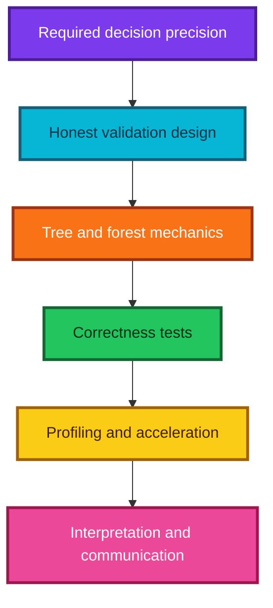

### The repeated engineering loop

1. State the behavior the code should have.
2. Write a small, readable implementation.
3. Test a tiny case whose answer can be calculated by hand.
4. Compare with an established implementation where appropriate.
5. Profile before optimizing.
6. Improve the algorithm before adding hardware.

---

## 2. Where random forests fit

### Decision-tree ensembles

A decision-tree ensemble combines many tree predictors. Important families include:

| Family | How trees differ | How predictions combine | Typical character |
|---|---|---|---|
| Bagged trees | Different resampled rows | Average or vote | Reduces variance |
| Random forest | Resampled rows plus random feature candidates | Average probabilities or regression outputs | Decorrelates trees further |
| Extra Trees | Random features and randomized thresholds | Average | More random; often faster |
| Gradient-boosted trees | Each tree corrects the current loss | Add sequential updates | Often very strong on tabular data |

The current [`scikit-learn` ensemble guide](https://scikit-learn.org/stable/modules/ensemble.html#forest) describes forests as **perturb-and-combine** methods: inject randomness to create diverse trees, then average their predictions so some errors cancel.

### Why forests are a strong baseline

- They learn nonlinear thresholds and interactions.
- Numeric scaling is usually unnecessary.
- They work well with mixed tabular signals after suitable encoding.
- They expose feature and path structure for inspection.
- Trees can be trained independently and parallelized.
- Their useful hyperparameters are relatively understandable.

### Important limitations

- Standard regression leaves average training targets, so trend extrapolation is poor.
- Deep forests can consume substantial memory.
- High-cardinality categoricals need deliberate handling.
- Probability estimates may need calibration.
- Smooth functions are represented by stepwise partitions.
- A forest can interpolate a spurious pattern just as confidently as a real one.

### Do two model families solve nearly everything?

Forests and neural networks are broad, powerful toolkits, but model choice should not become dogma.

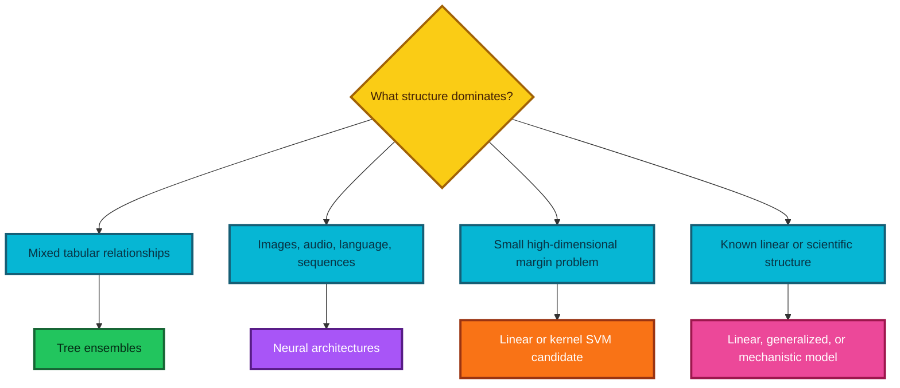

The lecture dismisses SVMs as obsolete. That claim is too broad. The current [`scikit-learn` SVM guide](https://scikit-learn.org/stable/modules/svm.html) still identifies useful regimes: high-dimensional spaces, more features than samples, and problems where a kernel or maximum-margin boundary is appropriate. Kernel SVM training scales poorly to large $n$, so the right conclusion is **benchmark selectively**, not “never use.”

Likewise, a linear or logistic model can be represented by a neural-network layer, but it is clearer to treat these as distinct statistical model families with their own assumptions, solvers, and inferential uses.

---

## 3. Validation size begins with the decision

### The wrong opening question

> “Should the validation set contain 1,000 or 10,000 rows?”

There is no context-free answer. First ask:

> “How precisely must the metric be known for the next decision?”

### What determines the required size?

1. the metric being estimated;
2. the expected event or error rate;
3. the smallest important improvement;
4. the desired confidence level;
5. subgroup and rare-class counts;
6. dependence between observations;
7. the number of models and decisions tried against the validation set; and
8. how closely validation resembles deployment.

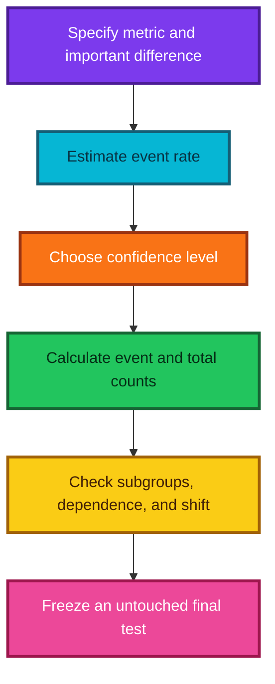

### Accuracy can hide the meaningful scale

If accuracy improves from 97% to 98%, the absolute gain is one percentage point. Error falls from 3% to 2%, so the relative error reduction is

$$
\frac{0.03-0.02}{0.03}=\frac13\approx33.3\%.
$$

Calling the older model “50% less accurate” would be incorrect. Its **error rate is 50% larger** than the newer error rate because $0.03/0.02=1.5$. State the denominator explicitly.

In fraud, disease, or defect detection, one percentage point can represent large cost or harm. Statistical detectability and operational importance are different questions; both must be answered.

### Why “at least 22” is not a general statistical law

The transcript gives 22 observations as a stability rule based on the $t$ distribution becoming approximately normal. There is no universal threshold where a $t$ distribution suddenly becomes normal or every metric becomes reliable.

- A count of 22 positive cases may still give a wide recall interval.
- Heavy tails, dependence, subgroup analysis, and multiple comparisons can require far more data.
- Some exact or simulation-based methods work with smaller samples but honestly return wide uncertainty.
- A million easy negatives do not compensate for ten positive cases when estimating sensitivity.

Use precision calculations and problem-specific event counts instead of a magic number.

---

## 4. Binomial uncertainty for accuracy

### The binomial model

If validation outcomes are independent and identically distributed Bernoulli trials with probability $p$ of being correct, then the number correct is

$$
K\sim\operatorname{Binomial}(n,p).
$$

Its mean and variance are

$$
\mathbb E[K]=np,
\qquad
\operatorname{Var}(K)=np(1-p),
$$

so its standard deviation is

$$
\operatorname{SD}(K)=\sqrt{np(1-p)}.
$$

Accuracy is the proportion $\hat p=K/n$. Therefore,

$$
\mathbb E[\hat p]=p,
\qquad
\operatorname{Var}(\hat p)=\frac{p(1-p)}{n},
$$

and the standard error is

$$
\operatorname{SE}(\hat p)=\sqrt{\frac{p(1-p)}{n}}.
$$

> **Critical correction:** $p(1-p)$ is a variance component, not the standard deviation. The square root is essential.

### Worked example: 99.4% accuracy on 2,000 rows

The observed number of errors is

$$
2{,}000(1-0.994)=12.
$$

The plug-in standard error of accuracy is

$$
\sqrt{\frac{0.994(0.006)}{2{,}000}}
\approx0.001727.
$$

That is about 0.173 percentage points. A rough normal 95% margin is

$$
1.96(0.001727)\approx0.00338,
$$

or 0.338 percentage points. Near a boundary and with only 12 errors, a Wilson interval is safer than the simple Wald interval.

### Approximate sample-size formula

For a desired two-sided margin of error $\varepsilon$ at confidence level associated with critical value $z$, the normal approximation gives

$$
n\approx\frac{z^2p(1-p)}{\varepsilon^2}.
$$

If $p$ is unknown, $p=0.5$ is conservative because it maximizes $p(1-p)$.

#### Example

To estimate 90% accuracy within $\pm1$ percentage point at approximately 95% confidence:

$$
n\approx\frac{1.96^2(0.9)(0.1)}{0.01^2}
\approx3{,}458.
$$

This is only a planning approximation. Inflate it for clustering, repeated measurements, distribution shift, subgroup reporting, and validation reuse.

### Commented code: standard error, Wilson interval, and sample size

```python
from math import ceil, sqrt


def accuracy_standard_error(correct, total):
    """Return the plug-in standard error of a validation accuracy."""

    # Validate the count inputs before using the binomial approximation.
    if total <= 0 or not 0 <= correct <= total:
        raise ValueError("Require 0 <= correct <= total and total > 0")

    # Convert the count of correct predictions into an observed proportion.
    p_hat = correct / total

    # The standard error of a Bernoulli sample proportion includes a square root.
    return sqrt(p_hat * (1.0 - p_hat) / total)


def wilson_interval(correct, total, z=1.96):
    """Return a two-sided Wilson score interval for a binomial proportion."""

    # Reject impossible counts rather than silently returning a misleading interval.
    if total <= 0 or not 0 <= correct <= total:
        raise ValueError("Require 0 <= correct <= total and total > 0")

    # Calculate the observed success proportion.
    p_hat = correct / total

    # Wilson's center adjusts the raw proportion toward one half for finite samples.
    denominator = 1.0 + (z * z) / total
    center = (p_hat + (z * z) / (2.0 * total)) / denominator

    # Wilson's radius remains well behaved near proportions zero and one.
    radius = (
        z
        * sqrt(
            p_hat * (1.0 - p_hat) / total
            + (z * z) / (4.0 * total * total)
        )
        / denominator
    )

    # Clamp endpoints to the valid probability range.
    return max(0.0, center - radius), min(1.0, center + radius)


def approximate_validation_size(expected_accuracy, margin, z=1.96):
    """Plan a binomial validation size using the normal approximation."""

    # Check that the probability and desired half-width are meaningful.
    if not 0.0 < expected_accuracy < 1.0:
        raise ValueError("expected_accuracy must lie strictly between 0 and 1")
    if margin <= 0.0:
        raise ValueError("margin must be positive")

    # Rearrange z * sqrt(p * (1 - p) / n) <= margin to solve for n.
    required = (
        z
        * z
        * expected_accuracy
        * (1.0 - expected_accuracy)
        / (margin * margin)
    )

    # Round upward because a fraction of a validation observation is impossible.
    return ceil(required)


# Twelve errors among 2,000 rows means 1,988 correct predictions.
correct, total = 1_988, 2_000
se = accuracy_standard_error(correct, total)
lower, upper = wilson_interval(correct, total)

print(f"Accuracy: {correct / total:.3%}")
print(f"Standard error: {se:.3%}")
print(f"Approximate 95% Wilson interval: [{lower:.3%}, {upper:.3%}]")
print(
    "Rows for ±1 percentage point near 90% accuracy:",
    approximate_validation_size(0.90, 0.01),
)
```

### When the binomial model is too optimistic

The formula assumes independent, identically distributed rows. It understates uncertainty when:

- multiple rows come from the same patient, customer, machine, or video;
- labels are serially correlated in time;
- near-duplicate examples cross the split;
- the validation distribution differs from deployment; or
- a model is chosen after many adaptive trials on the same validation set.

Use grouped splits, time-aware splits, cluster bootstrap methods, or an untouched final test as the situation requires.

---

## 5. Comparing models correctly

### Three different sources of variation

| Source | What changes? | Suitable diagnostic |
|---|---|---|
| Validation sampling | Which population examples enter evaluation | Confidence interval, bootstrap, or cross-validation |
| Training randomness | Initialization, bootstrap rows, feature samples, minibatch order | Refit with multiple seeds |
| Validation adaptation | Analyst repeatedly chooses what works on one validation set | Untouched test set or nested evaluation |

Training the same model five times measures training-seed sensitivity. It does **not** by itself measure how the score would change if a new validation sample were drawn.

### Paired comparison matters

Two models evaluated on the same rows produce paired outcomes. Let:

- $n_{01}$ be rows model A gets wrong and model B gets right; and
- $n_{10}$ be rows model A gets right and model B gets wrong.

Only the disagreements tell us which model wins on paired examples. McNemar's large-sample statistic is

$$
\chi^2=\frac{(n_{01}-n_{10})^2}{n_{01}+n_{10}},
$$

with an optional continuity correction. For small disagreement counts, use an exact binomial version. A paired bootstrap of rows is another flexible option for differences in accuracy, loss, or business utility.

### Why six versus eight errors is inconclusive

Suppose model A makes six errors and B makes eight. The totals do not reveal the paired table:

- If B's eight errors include all six of A's plus two additional errors, A consistently dominates.
- If the two models fail on mostly different cases, the apparent two-error difference is far less decisive.

Always retain row-level predictions, not only one aggregate score.

### Cross-validation: when and why

Use cross-validation when data is limited and the split structure can mimic deployment. The [`scikit-learn` cross-validation guide](https://scikit-learn.org/stable/modules/cross_validation.html) provides standard tools, but the splitter must match the data:

- `StratifiedKFold` preserves class proportions approximately;
- `GroupKFold` keeps entities from leaking across folds;
- time-series or chronological splits respect forecasting direction; and
- nested cross-validation separates hyperparameter selection from performance estimation.

Cross-validation is not a remedy for distribution shift or an inappropriate splitting unit.

---

## 6. Rare events and class imbalance

### Validation and test sets should represent use

Do not oversample the rare class in the final validation or test set merely to make the counts equal. Those sets should represent the intended deployment population, unless a deliberately reweighted study design is accompanied by appropriate corrections.

For a rare positive class:

- recall uncertainty depends primarily on the number of actual positives;
- false-positive-rate uncertainty depends on the number of actual negatives; and
- precision depends strongly on prevalence.

### Accuracy can be useless

If fraud prevalence is 0.2%, a classifier that predicts “not fraud” for every transaction has

$$
\operatorname{Accuracy}=99.8\%,
$$

but recall is zero. Useful metrics include precision, recall, area under the precision-recall curve, expected cost, and capacity-constrained utility. The [`scikit-learn` precision-recall example](https://scikit-learn.org/stable/auto_examples/model_selection/plot_precision_recall.html) specifically highlights precision-recall analysis for highly imbalanced classes.

### Should the training set always be balanced 50:50?

No. Equal oversampling is one candidate, not a universal optimum.

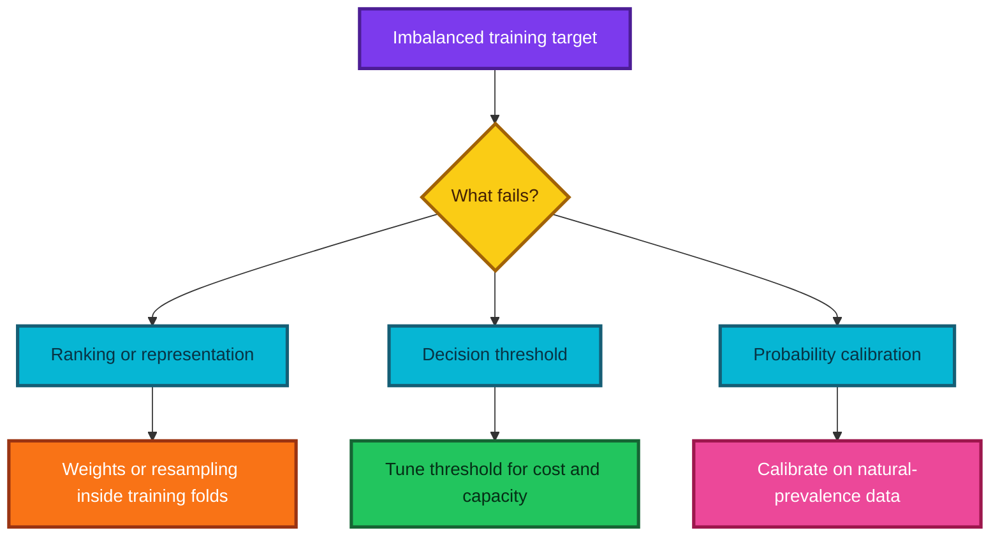

Options include:

1. stratified minibatches or oversampling **within each training fold**;
2. undersampling abundant negatives;
3. class or sample weights;
4. models and losses designed for imbalance;
5. threshold tuning against real cost; and
6. collecting more informative positive cases.

`RandomForestClassifier(class_weight="balanced")` uses inverse-frequency weights. Current `scikit-learn` documents the class-$k$ weight as

$$
w_k=\frac{n}{K n_k},
$$

where $K$ is the number of classes and $n_k$ is the count of class $k$.

### Why duplicated oversampling can hurt

- Exact copies do not add new information.
- A flexible learner may memorize the duplicated minority examples.
- Artificial priors can distort raw probability estimates.
- Leakage occurs if resampling is performed before cross-validation splitting.
- Equal class counts may not match the cost-optimal decision rule.

### Thresholds are decisions, not model parameters alone

A classifier estimates a score or probability, while a threshold chooses the action. The current [`scikit-learn` threshold guide](https://scikit-learn.org/stable/modules/classification_threshold.html) supports cross-validated threshold tuning for a chosen metric or cost.

```python
from sklearn.ensemble import RandomForestClassifier
from sklearn.metrics import average_precision_score
from sklearn.model_selection import TunedThresholdClassifierCV

# Weight classes inversely to their frequency during model fitting.
base_classifier = RandomForestClassifier(
    n_estimators=500,
    class_weight="balanced",
    min_samples_leaf=3,
    random_state=42,
    n_jobs=-1,
)

# Tune the classification threshold inside cross-validation using a chosen metric.
# Replace "recall" with a custom scorer when business costs are known.
tuned_classifier = TunedThresholdClassifierCV(
    base_classifier,
    scoring="recall",
    cv=5,
)
tuned_classifier.fit(X_train, y_train)

# Evaluate probabilities and final decisions only on untouched natural-prevalence data.
positive_probability = tuned_classifier.predict_proba(X_test)[:, 1]
final_decision = tuned_classifier.predict(X_test)

# Average precision summarizes ranking quality over possible thresholds.
print("Test average precision:", average_precision_score(y_test, positive_probability))
```

For honest probability claims, assess calibration on data with deployment prevalence. Resampling and class weighting can change the relationship between raw scores and real event probabilities.

### One-shot and zero-shot learning

- **One-shot learning:** learn to recognize a new category or identity from one example, usually by leveraging a representation learned from many related examples.
- **Zero-shot learning:** recognize a new category from side information such as attributes or language, without labeled training examples for that category.

Putting an unseen class only in validation does not magically test ordinary supervised recognition; it changes the problem definition to open-set, one-shot, or zero-shot learning.

---

## 7. Random-forest anatomy

### The two sources of randomness

A standard random forest typically uses:

1. **row bootstrapping** — draw training rows with replacement for each tree; and
2. **feature subsampling** — consider a random subset of features at each split.

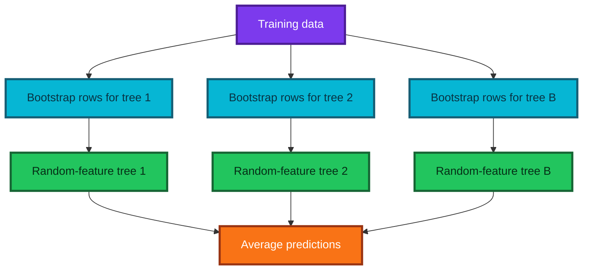

For a bootstrap sample of size $n$ drawn from $n$ training rows, a particular row is omitted with probability

$$
\left(1-\frac1n\right)^n\longrightarrow e^{-1}\approx0.368.
$$

Thus about 36.8% of rows are out-of-bag for a given tree, and about 63.2% of distinct rows appear at least once.

### Bagging versus the lecture's subsampling

The lecture's teaching implementation draws fewer rows **without replacement**. That is randomized subsampling, not classical bootstrap bagging. Both can create diverse trees, but they are not identical.

| Sampling scheme | Replacement? | Typical sample size | Consequence |
|---|---:|---:|---|
| Bootstrap | Yes | $n$ or `max_samples` | Duplicates plus natural OOB rows |
| Subsampling | No | Less than $n$ | No duplicates; omitted fraction set directly |

### Regression aggregation

For tree predictions $f_1(x),\ldots,f_B(x)$,

$$
\hat f_{RF}(x)=\frac1B\sum_{b=1}^{B}f_b(x).
$$

### Classification aggregation

Modern forest classifiers generally average each tree's class-probability vector:

$$
\hat P(Y=k\mid x)=\frac1B\sum_{b=1}^{B}\hat P_b(Y=k\mid x),
$$

then choose the largest probability or apply a decision policy. This is not necessarily the same as a hard majority vote of tree labels.

### Why averaging works

If individual trees have variance $\sigma^2$ and pairwise error correlation $\rho$, an idealized variance of their mean is

$$
\operatorname{Var}(\bar f)
=\sigma^2\left(\rho+\frac{1-\rho}{B}\right).
$$

Adding trees reduces the independent part $(1-\rho)/B$, but not the correlated part $\rho$. Feature subsampling aims to reduce that correlation.

---

## 8. One regression tree from first principles

### What does a node store?

A minimal regression node needs:

- the training-row indices reaching it;
- its prediction, usually the mean target;
- the selected feature and threshold, if it splits;
- references to left and right children; and
- optional impurity, gain, depth, and sample count for diagnostics.

For node index set $I$, its prediction is

$$
\bar y_I=\frac1{|I|}\sum_{i\in I}y_i.
$$

### What is a leaf?

A leaf has no child split. A clean implementation represents this explicitly, for example with `feature_index is None`, instead of using infinity as a sentinel score. Explicit state is easier to read and less likely to be confused with the root.

### Useful Python methods

```python
from dataclasses import dataclass


@dataclass
class TeachingNode:
    """A tiny node used only to demonstrate Python properties and repr."""

    # Every node stores the prediction it would make if growth stopped here.
    prediction: float

    # A missing feature index marks a leaf; a nonmissing index marks a split.
    feature_index: int | None = None

    # Internal nodes store the numeric threshold selected during training.
    threshold: float | None = None

    @property
    def is_leaf(self):
        """Expose leaf status like an attribute while computing it on demand."""

        # No parentheses are needed when a caller writes node.is_leaf.
        return self.feature_index is None

    def __repr__(self):
        """Return a concise representation useful during interactive debugging."""

        # Show the prediction alone when no split has been attached.
        if self.is_leaf:
            return f"TeachingNode(leaf=True, prediction={self.prediction:.4f})"

        # Show split metadata for an internal decision node.
        return (
            "TeachingNode("
            f"feature={self.feature_index}, "
            f"threshold={self.threshold:.4f}, "
            f"prediction={self.prediction:.4f})"
        )


# Construct a leaf and inspect its calculated property and readable representation.
node = TeachingNode(prediction=10.08)
print(node.is_leaf)
print(node)
```

### Grow-tree logic

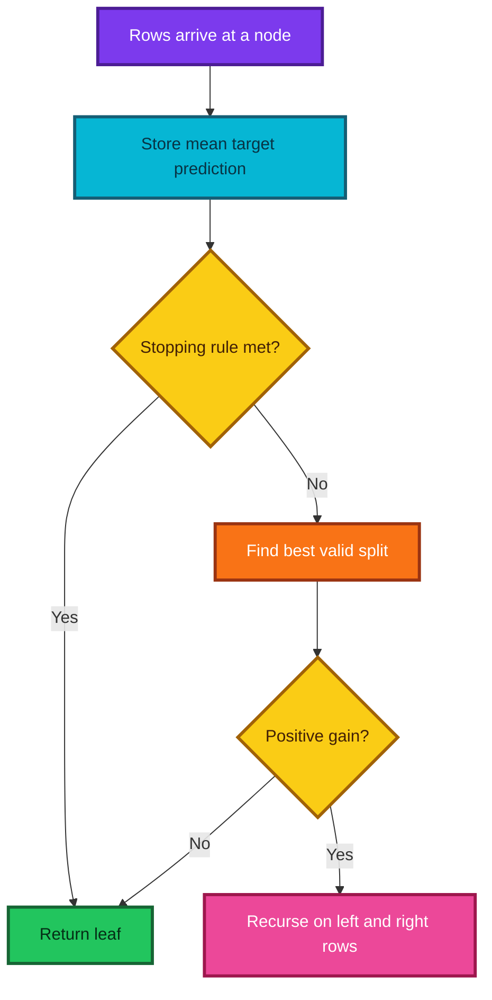

The recursive definition is short because a child is itself a complete tree on a smaller row set.

---


## 9. The correct squared-error split criterion

### What is the objective?

For a candidate split producing left set $L$ and right set $R$, the best constant prediction in each child is its target mean. The total residual sum of squares is

$$
\operatorname{SSE}_{children}
=\sum_{i\in L}(y_i-\bar y_L)^2
+\sum_{i\in R}(y_i-\bar y_R)^2.
$$

Choose the valid feature and threshold minimizing this quantity.

The parent SSE is

$$
\operatorname{SSE}_{parent}
=\sum_{i\in I}(y_i-\bar y_I)^2,
$$

so impurity decrease, or gain, is

$$
\operatorname{Gain}
=\operatorname{SSE}_{parent}-\operatorname{SSE}_{children}.
$$

A split is useful when its gain is positive and large enough to justify added complexity.

### Connection to MSE and RMSE

For the $n=|L|+|R|$ rows in the node,

$$
\operatorname{MSE}_{children}
=\frac{\operatorname{SSE}_{children}}{n},
\qquad
\operatorname{RMSE}_{children}
=\sqrt{\frac{\operatorname{SSE}_{children}}{n}}.
$$

For a fixed node, $n$ is constant and the square root is monotonic. Therefore minimizing SSE, MSE, or RMSE chooses the same split.

### Important correction: weighted standard deviation is different

The lecture minimizes a weighted sum of child standard deviations:

$$
\frac{n_L}{n}\sigma_L+\frac{n_R}{n}\sigma_R.
$$

Squared-error CART instead minimizes

$$
\frac{n_L}{n}\sigma_L^2+\frac{n_R}{n}\sigma_R^2,
$$

or its square root. These are **not generally equivalent**, because averaging standard deviations is not the same as taking the square root of an average of variances. The two rules may agree on a particular dataset but can select different splits.

### Fast SSE identity

Expand the squared deviations:

$$
\sum_{i=1}^{m}(y_i-\bar y)^2
=\sum_{i=1}^{m}y_i^2-\frac{\left(\sum_{i=1}^{m}y_i\right)^2}{m}.
$$

Thus a group needs only three sufficient statistics:

1. count $m$;
2. sum $S=\sum_i y_i$; and
3. squared sum $Q=\sum_i y_i^2$.

Then

$$
\operatorname{SSE}=Q-\frac{S^2}{m}.
$$

### Example by hand

Let targets be $[1,2,8,9]$ and split them into $L=[1,2]$, $R=[8,9]$.

$$
\bar y_L=1.5,\qquad \bar y_R=8.5.
$$

Therefore,

$$
\operatorname{SSE}_{children}
=(1-1.5)^2+(2-1.5)^2+(8-8.5)^2+(9-8.5)^2=1.
$$

The unsplit mean is 5, giving

$$
\operatorname{SSE}_{parent}
=(1-5)^2+(2-5)^2+(8-5)^2+(9-5)^2=50.
$$

The gain is $50-1=49$, so the split creates much more homogeneous children.

### Thresholds live between distinct values

After sorting feature values $x_{(1)}\le\cdots\le x_{(n)}$, a meaningful boundary after position $k$ requires

$$
x_{(k)}<x_{(k+1)}.
$$

A convenient threshold is the midpoint

$$
t=x_{(k)}+\frac{x_{(k+1)}-x_{(k)}}2.
$$

The second form avoids overflow better than $(x_{(k)}+x_{(k+1)})/2$ for very large same-sign values.

### Classification criteria

Classification trees usually minimize Gini impurity, entropy, or log loss rather than regression SSE.

For class probabilities $p_1,\ldots,p_K$,

$$
G=1-\sum_{k=1}^{K}p_k^2,
\qquad
H=-\sum_{k=1}^{K}p_k\log p_k.
$$

For binary labels encoded as 0 and 1, target variance is $p(1-p)$ and Gini is $2p(1-p)$, so they differ by a constant factor. That special relationship does not make a regression implementation a complete multiclass classifier.

---

## 10. From quadratic split search to a prefix scan

### Naive search

At a node containing $n$ rows, consider each row's feature value as a candidate threshold. If each candidate:

1. builds an $O(n)$ Boolean mask; and
2. rescans targets to calculate child statistics,

then one feature costs $O(n^2)$ at that node.

### Optimized search

1. Sort the rows by one feature: $O(n\log n)$.
2. Build cumulative sums and squared sums: $O(n)$.
3. Move the boundary once from left to right: $O(n)$.
4. Read both child SSE values in constant time per candidate.

Including sorting, the per-feature node cost is $O(n\log n)$; the **scan after sorting** is $O(n)$. If sorted orders or histograms are reused, optimized libraries can reduce repeated sorting work further. The current [`scikit-learn` tree complexity guide](https://scikit-learn.org/stable/modules/tree.html#complexity) discusses sorting, linear candidate scans, and caching across nodes.

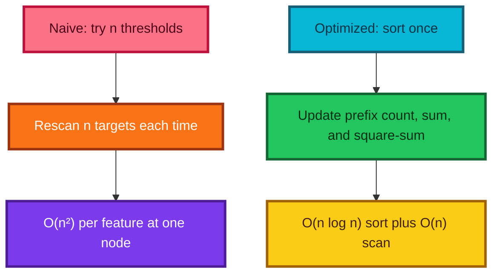

### Prefix statistics

For sorted targets $y_{(1)},\ldots,y_{(n)}$, define

$$
S_k=\sum_{i=1}^{k}y_{(i)},
\qquad
Q_k=\sum_{i=1}^{k}y_{(i)}^2.
$$

At boundary $k$:

$$
\operatorname{SSE}_L(k)=Q_k-\frac{S_k^2}{k},
$$

and with totals $S_n,Q_n$,

$$
\operatorname{SSE}_R(k)
=(Q_n-Q_k)-\frac{(S_n-S_k)^2}{n-k}.
$$

Every candidate score is now constant-time after the prefix arrays exist.

### Duplicate feature values

Do not split between equal adjacent values. A rule such as $x\le t$ cannot send equal values to different children. Skipping duplicate boundaries also avoids redundant work.

### Minimum leaf size

If `min_samples_leaf = m`, only boundaries satisfying

$$
k\ge m
\quad\text{and}\quad
n-k\ge m
$$

are valid.

### Numerical stability

The identity $Q-S^2/m$ can suffer cancellation when targets are extremely large but have tiny variance. Production libraries use careful numeric implementations. Welford's online algorithm is a robust alternative for streaming variance. In teaching code, clip tiny negative round-off values to zero, but do not use clipping to conceal large errors.

### Why algorithms beat extra hardware

Reducing work from $O(n^2)$ to $O(n\log n)$ changes how runtime grows. If $n$ increases tenfold:

- quadratic work grows roughly 100 times; while
- $n\log n$ work grows only a little more than tenfold.

More cores can reduce a constant factor. A better algorithm changes the scaling law.

---

## 11. Recursion, stopping, and memory

### Recursive tree construction

A tree can be defined recursively:

1. compute the current node prediction;
2. if a stopping rule holds, return a leaf;
3. otherwise find the best valid split;
4. create a left tree from left indices; and
5. create a right tree from right indices.

The recursion terminates because every accepted split sends fewer rows to each child and the stopping rules prevent endless growth.

### Essential stopping rules

- too few rows to make two legal children;
- maximum depth reached;
- target impurity is already zero or negligible;
- no feature has two distinct usable values;
- best impurity decrease is below a threshold; or
- a maximum leaf count or other resource limit is reached.

### Why `score = infinity` works—but explicit state is clearer

Initializing “best score so far” to $+\infty$ makes the first finite candidate better. But “node is a leaf” should ideally be determined by whether a split exists, not by whether a numeric score still equals a sentinel. Explicit fields such as `feature_index=None` separate structural state from optimization state.

### Memory behavior

If every one of $O(n)$ leaves stored a full Boolean mask of length $n$, memory could reach $O(n^2)$. Storing only the row indices reaching a node is better.

Even index arrays deserve care:

- in a balanced tree, retaining every ancestor's row array can sum to roughly $O(n\log n)$ index entries;
- in a highly skewed tree, it can be worse; and
- efficient libraries partition shared index buffers in place or release temporary arrays.

### Dynamic method patching

The lecture defines functions in notebook cells and attaches them to a class dynamically:

```python
# Attach a standalone function to a class under a chosen method name.
DecisionTree.find_best_split = experimental_find_best_split
```

This demonstrates that Python classes and namespaces are dynamic. It is useful for exploration, but a final reusable implementation should place methods in the class definition, add tests, and avoid notebook execution-order surprises.

### Namespaces intuition

`DecisionTree.find_best_split` and a global function named `find_best_split` are different names in different namespaces. Assignment connects them; identical spelling alone does not.

---

## 12. Prediction and aggregation

### One row through one tree

At an internal node with feature $j$ and threshold $t$:

$$
\operatorname{next}(x)=
\begin{cases}
\text{left child},&x_j\le t,\\
\text{right child},&x_j>t.
\end{cases}
$$

Repeat until a leaf and return its stored prediction.

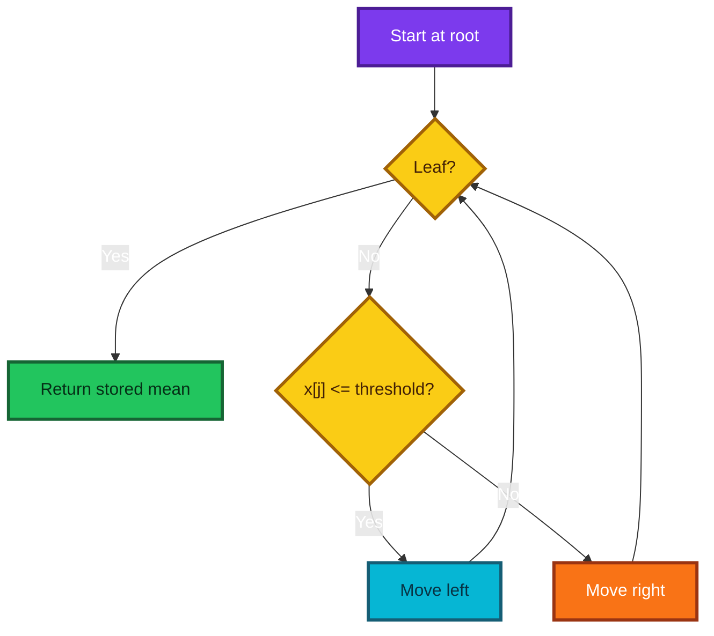

### Recursive versus iterative prediction

Recursive code mirrors the mathematical tree definition. An iterative loop avoids function-call overhead and Python recursion limits. The complete implementation below grows recursively for clarity and predicts iteratively for efficiency.

### Ternary expression

Python's conditional expression returns a value:

```python
# Choose one child object and store it; this expression does not itself branch the tree.
child = node.left if row[node.feature_index] <= node.threshold else node.right
```

Use it when the expression stays short. A multi-step branch is clearer as an ordinary `if` statement.

### Many rows and many trees

For a feature matrix, predict each row with every tree, then average along the tree axis. If the per-tree prediction matrix has shape `(n_rows, B)`, the forest prediction has shape `(n_rows,)`.

---

## 13. Complete commented implementation

The following implementation is designed for learning and testing. It supports numeric, finite features and squared-error regression. It deliberately omits missing-value routing, sample weights, categorical splits, pruning, parallelism, and production-level memory optimization.

```python
from __future__ import annotations

from dataclasses import dataclass
from math import ceil, log2, sqrt

import numpy as np


@dataclass
class _RegressionNode:
    """One node in a teaching regression tree."""

    # Store the prediction made if traversal stops at this node.
    prediction: float

    # Record how many fitting rows reached the node for diagnostics.
    n_samples: int

    # Store the node's residual sum of squares before any child split.
    impurity: float

    # A missing feature index marks a leaf; an integer marks an internal split.
    feature_index: int | None = None

    # Internal nodes compare the selected feature with this threshold.
    threshold: float | None = None

    # Child references remain missing for a leaf.
    left: _RegressionNode | None = None
    right: _RegressionNode | None = None

    # Gain records how much the accepted split reduced total SSE.
    gain: float = 0.0

    @property
    def is_leaf(self) -> bool:
        """Return True when the node has no selected split feature."""

        return self.feature_index is None


class ScratchDecisionTreeRegressor:
    """A small CART-style regression tree using exact numeric split search."""

    def __init__(
        self,
        *,
        min_samples_leaf=5,
        max_depth=None,
        max_features=None,
        min_impurity_decrease=0.0,
        random_state=None,
    ):
        # Require at least one row in every leaf.
        if min_samples_leaf < 1:
            raise ValueError("min_samples_leaf must be at least 1")

        # Store hyperparameters without fitting any data yet.
        self.min_samples_leaf = int(min_samples_leaf)
        self.max_depth = max_depth
        self.max_features = max_features
        self.min_impurity_decrease = float(min_impurity_decrease)
        self.random_state = random_state

    @staticmethod
    def _sse(count, target_sum, target_square_sum):
        """Calculate SSE from count, sum, and squared sum."""

        # Empty groups cannot define a legal regression leaf.
        if count <= 0:
            return np.inf

        # Use the algebraic identity sum(y²) - sum(y)² / count.
        value = target_square_sum - (target_sum * target_sum) / count

        # Remove only tiny negative values caused by floating-point round-off.
        return max(0.0, float(value))

    def _resolved_max_features(self):
        """Convert max_features into an integer number of candidate columns."""

        # Use every feature when the user supplies no subsampling rule.
        if self.max_features is None:
            return self.n_features_in_

        # Support two familiar string rules.
        if self.max_features == "sqrt":
            return max(1, int(sqrt(self.n_features_in_)))
        if self.max_features == "log2":
            return max(1, int(log2(self.n_features_in_)))

        # Interpret a float in (0, 1] as a proportion of all columns.
        if isinstance(self.max_features, float):
            if not 0.0 < self.max_features <= 1.0:
                raise ValueError("Float max_features must lie in (0, 1]")
            return max(1, ceil(self.max_features * self.n_features_in_))

        # Interpret a positive integer as an exact feature count.
        feature_count = int(self.max_features)
        if not 1 <= feature_count <= self.n_features_in_:
            raise ValueError("Integer max_features is outside the valid range")
        return feature_count

    def fit(self, X, y):
        """Fit a regression tree and return the estimator."""

        # Convert inputs into predictable dense floating-point arrays.
        X = np.asarray(X, dtype=float)
        y = np.asarray(y, dtype=float)

        # Enforce the standard design-matrix and target-vector shapes.
        if X.ndim != 2 or y.ndim != 1 or len(X) != len(y):
            raise ValueError("Require X shape (n_rows, n_features) and y shape (n_rows,)")
        if len(X) == 0 or X.shape[1] == 0:
            raise ValueError("Training data must contain rows and features")

        # Keep this teaching implementation focused on finite numeric inputs.
        if not np.isfinite(X).all() or not np.isfinite(y).all():
            raise ValueError("This teaching tree requires finite X and y values")

        # Save the fitting arrays for recursive split construction.
        self.X_ = X
        self.y_ = y
        self.n_features_in_ = X.shape[1]

        # Create one reproducible generator for random feature selection.
        self._rng = np.random.default_rng(self.random_state)

        # Grow the complete tree from all local fitting-row indices.
        all_indices = np.arange(len(y), dtype=int)
        self.root_ = self._grow(all_indices, depth=0)
        return self

    def _grow(self, indices, depth):
        """Recursively build one node from the supplied local row indices."""

        # Calculate the prediction and impurity available before any split.
        targets = self.y_[indices]
        prediction = float(targets.mean())
        target_sum = float(targets.sum())
        target_square_sum = float(np.dot(targets, targets))
        parent_sse = self._sse(len(indices), target_sum, target_square_sum)

        # Create a leaf-shaped node first; attach children only after a valid split.
        node = _RegressionNode(
            prediction=prediction,
            n_samples=len(indices),
            impurity=parent_sse,
        )

        # Stop if two legal children cannot both satisfy min_samples_leaf.
        if len(indices) < 2 * self.min_samples_leaf:
            return node

        # Stop when the configured maximum depth has been reached.
        if self.max_depth is not None and depth >= self.max_depth:
            return node

        # Stop when all targets in the node are already effectively identical.
        if parent_sse <= np.finfo(float).eps:
            return node

        # Search a random feature subset for the lowest child SSE.
        split = self._best_split(indices, parent_sse)
        if split is None:
            return node

        feature_index, threshold, left_indices, right_indices, gain = split

        # Compare normalized gain so the threshold has per-row SSE units.
        if gain / len(indices) < self.min_impurity_decrease:
            return node

        # Convert the provisional leaf into an internal decision node.
        node.feature_index = feature_index
        node.threshold = threshold
        node.gain = gain

        # Recursively grow complete child trees on disjoint local row sets.
        node.left = self._grow(left_indices, depth + 1)
        node.right = self._grow(right_indices, depth + 1)
        return node

    def _best_split(self, indices, parent_sse):
        """Return the best exact numeric split among sampled features."""

        # Draw feature candidates without replacement for this specific node.
        candidate_count = self._resolved_max_features()
        features = self._rng.choice(
            self.n_features_in_,
            size=candidate_count,
            replace=False,
        )

        # Initialize the incumbent as no valid split.
        best = None
        best_child_sse = np.inf
        n_node = len(indices)

        # Evaluate each sampled feature independently.
        for feature_index in features:
            # Sort local rows by this feature using a stable order.
            local_values = self.X_[indices, feature_index]
            order = np.argsort(local_values, kind="mergesort")
            sorted_indices = indices[order]
            sorted_values = local_values[order]
            sorted_targets = self.y_[sorted_indices]

            # Build cumulative target sums and squared sums once.
            prefix_sum = np.cumsum(sorted_targets, dtype=float)
            prefix_square_sum = np.cumsum(sorted_targets * sorted_targets, dtype=float)
            total_sum = float(prefix_sum[-1])
            total_square_sum = float(prefix_square_sum[-1])

            # k is the number of sorted rows assigned to the left child.
            k = np.arange(
                self.min_samples_leaf,
                n_node - self.min_samples_leaf + 1,
                dtype=int,
            )
            if len(k) == 0:
                continue

            # Equal adjacent values cannot be separated by a numeric threshold.
            distinct_boundary = sorted_values[k - 1] < sorted_values[k]
            k = k[distinct_boundary]
            if len(k) == 0:
                continue

            # Read left sufficient statistics at every legal boundary.
            left_count = k.astype(float)
            left_sum = prefix_sum[k - 1]
            left_square_sum = prefix_square_sum[k - 1]

            # Derive right statistics by subtracting each left prefix from totals.
            right_count = (n_node - k).astype(float)
            right_sum = total_sum - left_sum
            right_square_sum = total_square_sum - left_square_sum

            # Vectorize all child-SSE calculations for this feature.
            left_sse = left_square_sum - (left_sum * left_sum) / left_count
            right_sse = right_square_sum - (right_sum * right_sum) / right_count
            child_sse = np.maximum(left_sse, 0.0) + np.maximum(right_sse, 0.0)

            # Locate the best boundary for this feature.
            local_best_position = int(np.argmin(child_sse))
            local_best_sse = float(child_sse[local_best_position])

            # Update the global incumbent only when this feature is strictly better.
            if local_best_sse < best_child_sse:
                split_count = int(k[local_best_position])
                lower_value = float(sorted_values[split_count - 1])
                upper_value = float(sorted_values[split_count])

                # Choose a safe midpoint between distinct adjacent feature values.
                threshold = lower_value + (upper_value - lower_value) / 2.0

                # Sorted slices give disjoint row sets without building full masks.
                left_indices = sorted_indices[:split_count]
                right_indices = sorted_indices[split_count:]
                gain = parent_sse - local_best_sse

                best_child_sse = local_best_sse
                best = (
                    int(feature_index),
                    threshold,
                    left_indices,
                    right_indices,
                    float(gain),
                )

        # Reject a numerically non-improving split even if a boundary existed.
        if best is None or best[-1] <= np.finfo(float).eps:
            return None
        return best

    def _predict_row(self, row):
        """Traverse one row iteratively until a leaf is reached."""

        # Begin every prediction at the fitted root node.
        node = self.root_

        # Follow learned feature thresholds until no split remains.
        while not node.is_leaf:
            if row[node.feature_index] <= node.threshold:
                node = node.left
            else:
                node = node.right

        # Return the average fitting target stored in the reached leaf.
        return node.prediction

    def predict(self, X):
        """Predict a target value for every row in X."""

        # Fail clearly when prediction is requested before fitting.
        if not hasattr(self, "root_"):
            raise RuntimeError("Call fit before predict")

        # Accept one row or a full 2D design matrix.
        X = np.asarray(X, dtype=float)
        if X.ndim == 1:
            X = X.reshape(1, -1)
        if X.ndim != 2 or X.shape[1] != self.n_features_in_:
            raise ValueError("Prediction data has the wrong number of features")
        if not np.isfinite(X).all():
            raise ValueError("This teaching tree requires finite feature values")

        # Traverse the fitted tree independently for each requested row.
        return np.array([self._predict_row(row) for row in X], dtype=float)


class ScratchRandomForestRegressor:
    """A teaching random forest that averages scratch regression trees."""

    def __init__(
        self,
        *,
        n_estimators=100,
        min_samples_leaf=5,
        max_depth=None,
        max_features=1.0,
        max_samples=None,
        bootstrap=True,
        random_state=None,
    ):
        # A forest needs at least one component tree.
        if n_estimators < 1:
            raise ValueError("n_estimators must be at least 1")

        # Store forest and tree-growth settings for the later fit call.
        self.n_estimators = int(n_estimators)
        self.min_samples_leaf = int(min_samples_leaf)
        self.max_depth = max_depth
        self.max_features = max_features
        self.max_samples = max_samples
        self.bootstrap = bool(bootstrap)
        self.random_state = random_state

    def _sample_size(self, n_rows):
        """Resolve max_samples into a legal integer row count."""

        # The classical default draws n_rows observations for every bootstrap.
        if self.max_samples is None:
            return n_rows

        # A float requests a fraction of all fitting rows.
        if isinstance(self.max_samples, float):
            if not 0.0 < self.max_samples <= 1.0:
                raise ValueError("Float max_samples must lie in (0, 1]")
            return max(1, ceil(self.max_samples * n_rows))

        # An integer requests an exact number of draws.
        sample_size = int(self.max_samples)
        if sample_size < 1:
            raise ValueError("Integer max_samples must be positive")
        if not self.bootstrap and sample_size > n_rows:
            raise ValueError("Sampling without replacement cannot exceed n_rows")
        return sample_size

    def fit(self, X, y):
        """Fit independently randomized trees and return the forest."""

        # Convert once before taking per-tree bootstrap or subsample slices.
        X = np.asarray(X, dtype=float)
        y = np.asarray(y, dtype=float)
        if X.ndim != 2 or y.ndim != 1 or len(X) != len(y):
            raise ValueError("Require aligned 2D X and 1D y")

        # Resolve how many row draws each tree receives.
        n_rows = len(X)
        sample_size = self._sample_size(n_rows)

        # Use a master generator to create reproducible independent tree seeds.
        master_rng = np.random.default_rng(self.random_state)
        self.estimators_ = []

        # Fit each tree on its own randomized row sample.
        for _ in range(self.n_estimators):
            tree_seed = int(master_rng.integers(0, np.iinfo(np.int32).max))
            tree_rng = np.random.default_rng(tree_seed)

            # Bootstrap uses replacement; subsampling does not.
            if self.bootstrap:
                sample_indices = tree_rng.integers(0, n_rows, size=sample_size)
            else:
                sample_indices = tree_rng.choice(
                    n_rows,
                    size=sample_size,
                    replace=False,
                )

            # Give every tree the same structural settings but an independent seed.
            tree = ScratchDecisionTreeRegressor(
                min_samples_leaf=self.min_samples_leaf,
                max_depth=self.max_depth,
                max_features=self.max_features,
                random_state=tree_seed,
            )
            tree.fit(X[sample_indices], y[sample_indices])
            self.estimators_.append(tree)

        # Match the common estimator convention of returning self from fit.
        self.n_features_in_ = X.shape[1]
        return self

    def predict_individual_trees(self, X):
        """Return a matrix with one prediction column per fitted tree."""

        # Fail clearly when the forest has not yet created its estimators.
        if not hasattr(self, "estimators_"):
            raise RuntimeError("Call fit before predict")

        # Stack tree outputs so rows align with observations and columns with trees.
        return np.column_stack([tree.predict(X) for tree in self.estimators_])

    def predict(self, X):
        """Average individual-tree predictions for every requested row."""

        # Regression-forest aggregation is a mean over the tree axis.
        return self.predict_individual_trees(X).mean(axis=1)
```

### What the code intentionally teaches

- explicit estimator state;
- bootstrap versus subsampling;
- random features at each node;
- cumulative split statistics;
- recursive construction;
- iterative traversal;
- exact additive forest averaging; and
- reproducible random-number ownership.

### What production code still needs

- efficient shared buffers and cached feature orders;
- missing-value and categorical routing;
- sample weights and more loss functions;
- out-of-bag bookkeeping;
- classification probability structures;
- parallel tree construction and prediction;
- serialization compatibility;
- extensive numeric and adversarial tests; and
- a stable public estimator API.

---

## 14. Verification against scikit-learn

### What should be compared?

Do not expect two forests to make identical predictions merely because they share visible hyperparameters. Implementations can differ in random-number streams, tie-breaking, threshold precision, stopping details, bootstrap generation, and feature sampling.

Use layers of verification:

1. hand-calculated tiny cases;
2. invariants that must always hold;
3. agreement of a deterministic stump or shallow tree;
4. similar held-out performance on synthetic data; and
5. explicit tests for edge cases.

### Useful invariants

- every internal node has two nonempty children;
- every leaf has at least `min_samples_leaf` rows;
- a node prediction equals the mean target of its fitting rows;
- child SSE does not exceed parent SSE for an accepted split;
- forest prediction equals the mean of its tree predictions;
- fitting twice with the same seed gives identical results; and
- no prediction is NaN for finite supported inputs.

### Commented end-to-end comparison

```python
import matplotlib.pyplot as plt
import numpy as np
from sklearn.datasets import make_regression
from sklearn.ensemble import RandomForestRegressor
from sklearn.metrics import r2_score, root_mean_squared_error
from sklearn.model_selection import train_test_split

# Generate data locally so the verification has no download dependency.
X, y = make_regression(
    n_samples=1_200,
    n_features=8,
    n_informative=6,
    noise=12.0,
    random_state=42,
)

# Reserve untouched rows for a fair performance comparison.
X_train, X_valid, y_train, y_valid = train_test_split(
    X,
    y,
    test_size=0.25,
    random_state=42,
)

# Fit the transparent teaching implementation defined in the previous section.
scratch = ScratchRandomForestRegressor(
    n_estimators=60,
    min_samples_leaf=4,
    max_features=0.75,
    random_state=42,
)
scratch.fit(X_train, y_train)

# Fit a production estimator with comparable, though not identical, settings.
reference = RandomForestRegressor(
    n_estimators=60,
    min_samples_leaf=4,
    max_features=0.75,
    bootstrap=True,
    random_state=42,
    n_jobs=-1,
)
reference.fit(X_train, y_train)

# Calculate predictions once so every metric uses the same arrays.
scratch_prediction = scratch.predict(X_valid)
reference_prediction = reference.predict(X_valid)

# Verify the defining forest aggregation identity exactly.
scratch_tree_prediction = scratch.predict_individual_trees(X_valid)
assert np.allclose(
    scratch_prediction,
    scratch_tree_prediction.mean(axis=1),
)

# Report accuracy and error in interpretable target units.
print("Scratch R²:", r2_score(y_valid, scratch_prediction))
print("Reference R²:", r2_score(y_valid, reference_prediction))
print(
    "Scratch RMSE:",
    root_mean_squared_error(y_valid, scratch_prediction),
)
print(
    "Reference RMSE:",
    root_mean_squared_error(y_valid, reference_prediction),
)

# Compare the broad prediction pattern without requiring bit-for-bit equality.
prediction_correlation = np.corrcoef(
    scratch_prediction,
    reference_prediction,
)[0, 1]
print("Prediction correlation:", prediction_correlation)

# Transparency reveals dense regions when plotted points overlap.
plt.scatter(
    y_valid,
    scratch_prediction,
    alpha=0.25,
    color="#2563EB",
    label="scratch forest",
)
plt.xlabel("Observed target")
plt.ylabel("Predicted target")
plt.legend()
plt.show()
```

### Why `alpha` helps a scatter plot

An opacity below one makes overlapping points darker. A dense band becomes visible instead of appearing as one ordinary dot.

> **Fun fact:** in computer graphics, alpha is commonly the opacity channel alongside red, green, and blue. It is unrelated to a statistical significance level that also happens to use the symbol $\alpha$.

### Tests before speed

A faster implementation that selects the wrong split is not an optimization. Preserve a slow, obviously correct reference for tiny arrays and compare every optimized version against it using randomized property tests.

---

## 15. Performance engineering and Cython

### Why pure Python slows near the leaves

Vectorized NumPy operations are efficient on large arrays because one Python call triggers a large compiled loop. Near the bottom of a deep tree, thousands of nodes may contain only a few rows. Repeated Python function calls and tiny array allocations then dominate the useful arithmetic.

### The optimization ladder

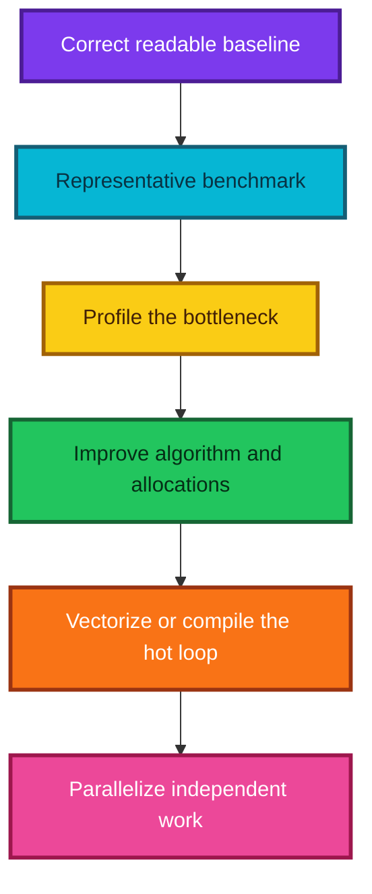

### Notebook timing and profiling

```ipython
# Time many calls and report a distribution rather than one noisy duration.
%timeit scratch.predict(X_valid)

# Profile one representative call to identify where cumulative time is spent.
%prun scratch.fit(X_train, y_train)
```

These are IPython magics, so they belong in notebook cells rather than normal `.py` files. Measure realistic input sizes and warm caches. Separate one-time compilation or loading cost from steady-state runtime when that matches deployment.

### What Cython does

Cython is not “siphon.” It is a Python-like compiled language and extension-building tool. The [Cython tutorial](https://cython.readthedocs.io/en/latest/src/tutorial/cython_tutorial.html) summarizes it as Python with C data types. Ordinary Python syntax is often accepted, while explicit types can remove dynamic dispatch and produce much faster C-level loops.

The [Cython build guide](https://cython.readthedocs.io/en/latest/src/quickstart/build.html) identifies Jupyter as an easy way to start and `setuptools` as a common route for distributed extensions.

### Commented Cython notebook cell

First load the notebook extension in a Python cell:

```ipython
# Register the Cython cell magic in the current IPython kernel.
%load_ext cython
```

Then compile a separate Cython cell:

```cython
%%cython

# Expose a callable function while using C types inside its hot loop.
cpdef double sum_of_squares(double[:] values):
    # Py_ssize_t is the platform-sized integer type used for array indices.
    cdef Py_ssize_t i

    # Keep the accumulator as an unboxed C double.
    cdef double total = 0.0

    # This loop can compile to direct typed memory-view access.
    for i in range(values.shape[0]):
        total += values[i] * values[i]

    # Convert the final C double back into a Python-visible result.
    return total
```

Typing only a function signature is not guaranteed to speed every workload. Inspect the generated annotation, benchmark the real bottleneck, and minimize Python-object operations inside the compiled loop.

### Other performance routes

- improve data structures and reuse sorted orders;
- use histogram-based split finding;
- compile numeric kernels with Cython or Numba;
- call optimized libraries written in C, C++, Rust, or another systems language;
- distribute independent trees across cores; and
- use vectorized or batched inference.

The current `scikit-learn` ensemble documentation notes that parts of its histogram gradient boosting implementation use OpenMP through Cython. Production speed comes from algorithms, compiled kernels, careful memory layout, and parallelism working together.

### Performance truths to remember

- Big-O describes growth, not exact seconds.
- Vectorization has setup overhead and is not always best for tiny arrays.
- Parallel speedup is limited by serialization, coordination, bandwidth, and sequential work.
- Optimize end-to-end latency or throughput, not a microbenchmark disconnected from use.

---

## 16. Interpretation exercises

The lecture's assignment is to implement earlier forest-interpretation methods on the scratch model. These extensions are valuable because the model's internal objects are directly accessible.

### 16.1 Per-tree prediction dispersion

For one row $x$,

$$
s_{trees}(x)
=\sqrt{\frac{1}{B-1}\sum_{b=1}^{B}
\left(f_b(x)-\bar f(x)\right)^2}.
$$

```python
import numpy as np

# Obtain one prediction column for every fitted scratch tree.
per_tree = scratch.predict_individual_trees(X_valid)

# Average across tree columns to recover the forest prediction.
prediction_mean = per_tree.mean(axis=1)

# Measure disagreement across randomized trees for every validation row.
tree_disagreement = per_tree.std(axis=1, ddof=1)
```

This is a stability diagnostic, not automatically a calibrated prediction interval.

### 16.2 Permutation importance

For a loss $L$ where smaller is better,

$$
I_j=L(y,\hat f(X_{\pi_j}))-L(y,\hat f(X)).
$$

```python
import numpy as np
from sklearn.metrics import root_mean_squared_error


def scratch_permutation_importance(model, X, y, repeats=10, random_state=42):
    """Measure held-out RMSE increase after shuffling each feature."""

    # Copy inputs so the caller's evaluation data is never modified in place.
    X = np.asarray(X, dtype=float)
    y = np.asarray(y, dtype=float)
    rng = np.random.default_rng(random_state)

    # Score the untouched evaluation matrix once.
    baseline = root_mean_squared_error(y, model.predict(X))
    importance = np.empty((X.shape[1], repeats), dtype=float)

    # Perturb one feature at a time while leaving every other column unchanged.
    for feature_index in range(X.shape[1]):
        for repeat in range(repeats):
            X_permuted = X.copy()

            # Break row alignment while preserving this column's values.
            X_permuted[:, feature_index] = rng.permutation(
                X_permuted[:, feature_index]
            )

            # Positive importance means the shuffled data produced larger RMSE.
            permuted_loss = root_mean_squared_error(
                y,
                model.predict(X_permuted),
            )
            importance[feature_index, repeat] = permuted_loss - baseline

    # Return the baseline and full repeat distribution, not only an average.
    return baseline, importance
```

Use held-out rows. Correlated features can substitute for each other, and importance is not causality.

### 16.3 Partial dependence

For selected feature $j$ and grid value $z$,

$$
PD_j(z)=\frac1n\sum_{i=1}^{n}\hat f(z,x_{i,-j}).
$$

```python
import numpy as np


def scratch_partial_dependence(model, X, feature_index, grid):
    """Calculate mean model response while replacing one feature."""

    # Preserve the original evaluation rows for every grid calculation.
    X = np.asarray(X, dtype=float)
    grid = np.asarray(grid, dtype=float)
    response = np.empty(len(grid), dtype=float)

    # Replace the selected feature with one constant grid value at a time.
    for position, value in enumerate(grid):
        X_modified = X.copy()
        X_modified[:, feature_index] = value

        # Standard partial dependence is the mean prediction over modified rows.
        response[position] = model.predict(X_modified).mean()

    return grid, response
```

Restrict the grid to plausible support and do not interpret the curve as causal without a causal design.

### 16.4 Local path contributions

For one tree, assign the parent-to-child prediction change to the feature that selected the child:

$$
f_b(x)=v_{root,b}+\sum_jc_{b,j}(x).
$$

```python
from collections import defaultdict

import numpy as np


def scratch_tree_contributions(tree, row):
    """Decompose one scratch-tree prediction along one row's path."""

    # Start with the root prediction as the local bias.
    row = np.asarray(row, dtype=float)
    node = tree.root_
    bias = node.prediction
    contribution = defaultdict(float)

    # Attribute every parent-to-child change to the split feature.
    while not node.is_leaf:
        feature_index = node.feature_index
        if row[feature_index] <= node.threshold:
            child = node.left
        else:
            child = node.right

        contribution[feature_index] += child.prediction - node.prediction
        node = child

    # The telescoping sum must exactly reconstruct this tree prediction.
    reconstructed = bias + sum(contribution.values())
    assert np.isclose(reconstructed, node.prediction)
    return bias, dict(contribution), node.prediction
```

Average each feature's contribution and the bias across trees for a forest explanation. This explains the model under a path-decomposition convention; it does not prove real-world cause.

### Suggested tests for the assignment

- shuffle a pure-noise feature and expect near-zero held-out importance;
- create $y=3x_1+\varepsilon$ and expect $x_1$ to dominate;
- verify that PDP equals the mean of manually generated row-level curves;
- assert `bias + sum(contributions) == prediction` for every tested tree;
- add correlated duplicates and observe how importance is shared; and
- compare every result with a trusted library implementation where definitions match.

---

## 17. Asking for technical help effectively

The fastest route to help is a reproducible question that makes the failure easy for someone else to observe.

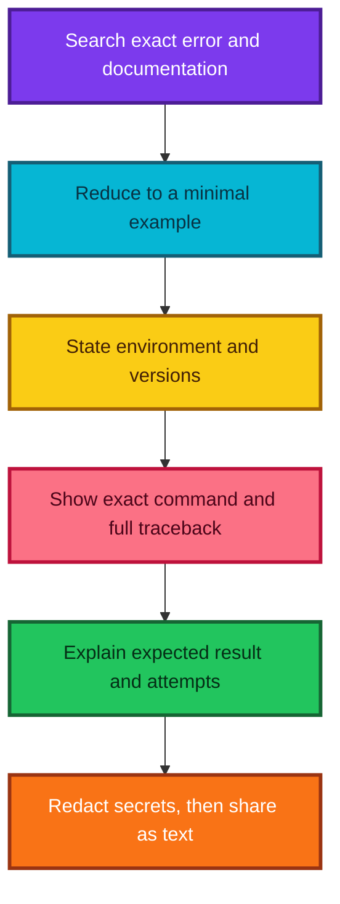

### A strong question contains

- one-sentence goal;
- minimal executable code;
- small synthetic data when possible;
- exact command or notebook cell;
- complete traceback as searchable text;
- actual result and expected result;
- operating system, Python, and package versions;
- what has already been tried; and
- a precise question.

### Prefer text for text

Screenshots are useful for visual layout, plots, or UI state. Code and tracebacks are better as fenced text because helpers can copy, search, quote, diff, and run them.

### Sharing with a Gist

The current GitHub CLI supports `gh gist create`:

```bash
# Create a non-publicly-listed gist containing a minimal script and traceback.
gh gist create reproduce.py traceback.txt -d "Minimal tree split failure"

# Add --public only when intentionally making the gist searchable and listed.
gh gist create --public reproduce.py -d "Public reproducible example"
```

GitHub warns that a “secret” gist is **not private**: anyone who discovers its URL can read it. Use a private repository or approved internal tool for confidential code, and never publish credentials, customer data, health data, proprietary datasets, or tokens. See [GitHub's Gist visibility guidance](https://docs.github.com/en/get-started/writing-on-github/editing-and-sharing-content-with-gists/creating-gists).

### Minimal bug-report template

````text
Goal:
I am trying to ...

Environment:
OS ..., Python ..., NumPy ..., scikit-learn ...

Minimal code:
```python
# Paste the smallest executable example here.
```

Actual result:
Paste the full traceback as text.

Expected result:
I expected ... because ...

Attempts:
I checked ..., tried ..., and observed ...

Question:
Why does ..., and what assumption am I violating?
````

The nested code fence above is illustrative. In an actual forum post, use a longer outer fence or separate sections so Markdown renders correctly.

---

## 18. From forests to neural networks

### Structured and unstructured data

| Data type | Typical organization | Examples |
|---|---|---|
| Structured | Semantically different named columns | Revenue, age, postcode, product type |
| Unstructured | Large homogeneous or locally related arrays/tokens | Images, audio waveforms, text, video |

The boundary is practical, not absolute. Text can become a structured bag-of-words matrix; tabular data can contain embeddings, images, and sequences.

### Is a forest a nearest-neighbor method?

A regression forest is best described as **adaptive partitioning and local averaging**. For a query $x$, each tree selects a leaf and averages training targets in that region. That resembles neighbor methods, but the neighborhood is learned through tree partitions rather than a fixed distance metric and fixed $k$.

### Why images motivate neural architectures

A forest can classify flattened image pixels, especially when the dataset is simple. However, an ordinary forest does not naturally encode:

- nearby pixels forming local patterns;
- translation of a pattern across the image;
- hierarchical composition from edges to shapes; or
- shared feature detectors across locations.

Convolutional and attention-based architectures introduce more suitable inductive biases.

### Linear models and one-layer networks

Linear regression computes

$$
\hat y=w^Tx+b.
$$

Binary logistic regression computes

$$
P(Y=1\mid x)=\sigma(w^Tx+b),
\qquad
\sigma(z)=\frac{1}{1+e^{-z}}.
$$

These can be drawn as single-layer neural computations, but standard practice still names them linear and generalized linear models. Lasso, ridge, and elastic net refer to regularized objectives, not merely “types of neural nets”:

$$
\min_w L(w)
+\lambda_1\|w\|_1
+\lambda_2\|w\|_2^2.
$$

### Do neural networks extrapolate?

They can produce values outside the training target range, unlike an ordinary regression forest, but that does not guarantee correct extrapolation. Outside observed support, behavior depends on architecture, activation functions, learned parameters, and domain assumptions.

### A fair transition

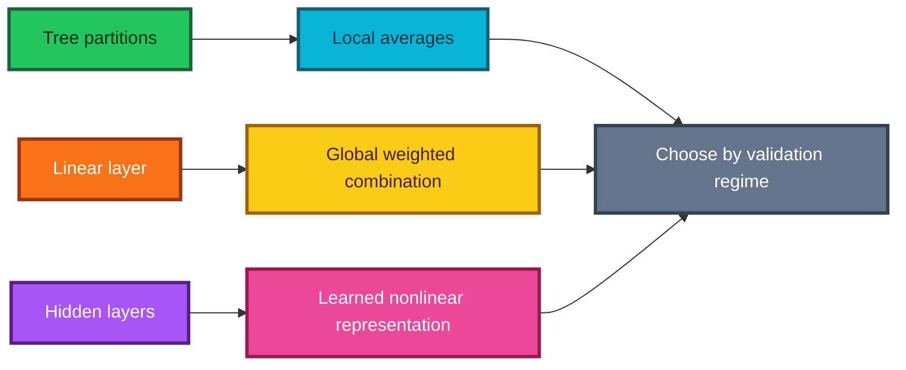

Model families express different assumptions. Compare them using a split that represents the actual interpolation, grouping, time, or extrapolation problem.

---

## 19. Transcript claims refined

The lecture was recorded in a particular historical and teaching context. Its central intuitions remain valuable, but several statements are best understood as motivating simplifications rather than universal rules.

| Transcript idea | More precise interpretation | Why the distinction matters |
|---|---|---|
| Random forests and neural networks are nearly all one needs | Both are broad and powerful, but linear models, generalized linear models, boosted trees, SVMs, probabilistic models, and mechanistic models remain useful | The best inductive bias depends on the data, sample size, objective, and deployment constraints |
| SVMs no longer have a place | Kernel SVMs can be expensive at large $n$, while linear or kernel SVMs can still excel in small-to-medium, sparse, or high-dimensional problems | A measured benchmark is better than eliminating a family by slogan |
| Linear regression, logistic regression, ridge, and lasso are neural networks | Their computations can be represented as simple network layers; ridge and lasso additionally define regularized objectives | Representation does not erase differences in interpretation, optimization, uncertainty analysis, or terminology |
| About 22 cases is a magic validation threshold | There is no universal threshold; the relevant $n$ follows from event frequency and the precision needed for the decision | Rare outcomes may require thousands of rows even when total accuracy looks stable |
| $p(1-p)$ is the binomial standard deviation | $p(1-p)$ is the variance of one Bernoulli trial; the standard error of a sample proportion is $\sqrt{p(1-p)/n}$ | Confusing variance and standard error gives the wrong uncertainty and units |
| Train five models to learn whether validation is large enough | Repeated fits estimate instability caused by training randomness; they do not measure how the score would vary under a newly sampled validation set | Different sources of randomness require different diagnostics |
| Make the training classes exactly equal | Equalizing classes is one possible intervention, not a universal optimum | Class weights, under-sampling, over-sampling, threshold tuning, and cost-sensitive learning have different trade-offs |
| Always oversample the minority class to equality | Compare interventions inside training folds and select them against the real objective | The optimal ratio depends on signal, learner, costs, and calibration needs |
| Sampling rows without replacement is bootstrap sampling | Classical bootstrap samples $n$ rows **with replacement**; drawing a subset without replacement is subagging or subsampling | Inclusion probabilities, duplicate rows, and out-of-bag behavior differ |
| Weighted child standard deviation is equivalent to RMSE/SSE | Weighted child **variances**, or equivalently child SSEs, give the squared-error objective; averaging standard deviations is generally different | The wrong split criterion can choose a different tree |
| The optimized split search is $O(n)$ | Once a feature is sorted, scanning its candidates is $O(n)$; sorting is usually $O(n\log n)$ at that node | Complexity claims should state whether preprocessing or cached orders are included |
| A node is a leaf exactly when its best score is infinity | Infinity is a convenient sentinel in the teaching code; an explicit `is_leaf` field or missing-child check is easier to maintain | State should express meaning directly in production systems |
| Boolean masks necessarily make the whole tree $O(n^2)$ | Repeated full-array masks can create quadratic work and memory pressure on unbalanced trees; index slices and cached orders help | The actual cost depends on tree shape and data representation |
| Cython automatically makes Python fast | Cython compiles Python-like code, but major speedups usually require typed hot loops, efficient memory access, and measurement | Compilation alone does not remove Python-object overhead |
| A secret Gist is private | A secret Gist is merely unlisted; anyone with the URL can read it | Confidential data and credentials need a genuinely private system |
| A random forest is a nearest-neighbor method | A forest performs adaptive partitioning and local averaging, which has a neighbor-like interpretation | Forest neighborhoods are learned regions, not fixed-distance $k$-nearest sets |
| Neural networks solve the forest's extrapolation limitation | Some neural networks can output beyond the observed target range, but correct extrapolation is never automatic | Extrapolation needs domain structure, not merely a different model family |

The habit worth keeping is broader than any one correction: translate an appealing sentence into a testable definition, equation, or experiment.

---

## 20. Formula sheet

### Validation and classification statistics

| Quantity | Formula | Interpretation |
|---|---|---|
| Binomial model | $K\sim\operatorname{Binomial}(n,p)$ | Number of successes in $n$ independent Bernoulli trials |
| Expected count | $E[K]=np$ | Long-run average number of successes |
| Count variance | $\operatorname{Var}(K)=np(1-p)$ | Spread of the success count |
| Sample proportion | $\hat p=K/n$ | Observed accuracy, recall, or event rate |
| Proportion standard error | $SE(\hat p)\approx\sqrt{\hat p(1-\hat p)/n}$ | Typical sampling fluctuation of the estimated proportion |
| Approximate margin | $m\approx z_{1-\alpha/2}\sqrt{p(1-p)/n}$ | Half-width of a normal confidence interval |
| Approximate required size | $n\approx z_{1-\alpha/2}^2p(1-p)/m^2$ | Planning estimate for a desired margin $m$ |
| Rare-event expectation | $E[K_{\text{rare}}]=nq$ | Expected rare-class cases when prevalence is $q$ |
| Relative error reduction | $(e_{\text{old}}-e_{\text{new}})/e_{\text{old}}$ | Improvement relative to the errors previously made |

For a 95% planning interval, $z_{0.975}\approx1.96$. If no trustworthy value of $p$ is available, $p=0.5$ gives the largest variance and therefore a conservative binary-proportion sample size.

#### Wilson interval

The ordinary normal interval can behave poorly near 0 or 1 or with small $n$. A better default for a binomial proportion is the Wilson interval. With $\hat p=k/n$ and normal critical value $z$,

$$
\text{center}
=
\frac{\hat p+z^2/(2n)}{1+z^2/n},
$$

$$
\text{half-width}
=
\frac{z}{1+z^2/n}
\sqrt{\frac{\hat p(1-\hat p)}{n}+\frac{z^2}{4n^2}}.
$$

The interval is `center ± half-width`. It remains inside $[0,1]$ and has more reliable coverage than the simple Wald interval in many finite samples.

#### Paired error comparison

When two classifiers predict the **same** validation rows, focus on the disagreements:

| | Model B correct | Model B wrong |
|---|---:|---:|
| Model A correct | both correct | $b$ |
| Model A wrong | $c$ | both wrong |

The large-sample McNemar statistic is

$$
\chi^2=\frac{(b-c)^2}{b+c},
$$

or, with a continuity correction,

$$
\chi^2_{\text{cc}}=\frac{(|b-c|-1)^2}{b+c}.
$$

For small $b+c$, use the exact binomial version. This paired calculation is more informative than pretending two accuracies measured on the same rows are independent.

### Class imbalance

For the common “balanced” class-weight heuristic,

$$
w_c=\frac{n}{C\,n_c},
$$

where $C$ is the number of classes and $n_c$ is the count in class $c$. The formula increases the loss contribution of rare classes. It does **not** decide the final probability threshold or business action by itself.

Useful classification metrics include

$$
\operatorname{precision}=\frac{TP}{TP+FP},
\qquad
\operatorname{recall}=\frac{TP}{TP+FN},
$$

$$
F_1=2\frac{\operatorname{precision}\cdot\operatorname{recall}}
{\operatorname{precision}+\operatorname{recall}}.
$$

Choose a metric from the cost of false positives and false negatives, not from class balance alone.

### Bootstrap and forest aggregation

In a classical bootstrap sample of size $n$, a particular row is omitted with probability

$$
\left(1-\frac1n\right)^n\longrightarrow e^{-1}\approx0.368.
$$

So roughly 36.8% of rows are out-of-bag for one large bootstrap sample, while roughly 63.2% appear at least once. These are asymptotic expectations, not exact guarantees for every tree.

For $B$ regression trees,

$$
\hat f_{\text{forest}}(x)=\frac1B\sum_{b=1}^{B}f_b(x).
$$

If individual tree errors have variance $\sigma^2$ and pairwise correlation $\rho$, the variance of their mean is approximately

$$
\operatorname{Var}(\bar e)
=
\sigma^2\left(\rho+\frac{1-\rho}{B}\right).
$$

Adding trees shrinks the independent component $(1-\rho)/B$, but the correlated component $\rho$ remains. This is why feature randomness is useful: it tries to decorrelate the trees.

For classification, average class probabilities and then choose the largest:

$$
\hat P(Y=c\mid x)=\frac1B\sum_{b=1}^{B}\hat P_b(Y=c\mid x),
\qquad
\hat y=\arg\max_c\hat P(Y=c\mid x).
$$

### Regression-tree splitting

For a node containing index set $S$, the squared-error-optimal constant prediction is its mean:

$$
\bar y_S=\frac1{|S|}\sum_{i\in S}y_i.
$$

Its sum of squared errors is

$$
\operatorname{SSE}(S)=\sum_{i\in S}(y_i-\bar y_S)^2.
$$

The computational identity

$$
\operatorname{SSE}(S)=\sum_{i\in S}y_i^2-
\frac{\left(\sum_{i\in S}y_i\right)^2}{|S|}
$$

allows a prefix scan to evaluate a candidate after constant-time updates to counts, sums, and squared sums.

For a candidate split $S=L\cup R$,

$$
\operatorname{cost}=\operatorname{SSE}(L)+\operatorname{SSE}(R),
$$

$$
\operatorname{gain}=operatorname{SSE}(S)-
\operatorname{SSE}(L)-
\operatorname{SSE}(R).
$$

Minimizing child cost and maximizing gain choose the same split because parent SSE is fixed while comparing candidates at one node.

The related measures are

$$
\operatorname{MSE}(S)=\frac{\operatorname{SSE}(S)}{|S|},
\qquad
\operatorname{RMSE}(S)=\sqrt{\operatorname{MSE}(S)}.
$$

For classification, two common node impurities are

$$
G(S)=1-\sum_{c=1}^C p_c^2
\qquad\text{and}\qquad
H(S)=-\sum_{c=1}^C p_c\log p_c,
$$

where $p_c$ is the class fraction inside the node and terms with $p_c=0$ contribute zero.

### Regularized linear objectives

Ridge regression solves

$$
\min_{w,b}\sum_i\bigl(y_i-(w^Tx_i+b)\bigr)^2
+\lambda\|w\|_2^2,
$$

while lasso replaces the squared $L_2$ penalty with

$$
\lambda\|w\|_1.
$$

Ridge smoothly shrinks coefficients; lasso can set some coefficients exactly to zero. Both are linear prediction rules, even though the same affine operation can be drawn as a one-layer network.

---

## 21. Review questions and answers

### 1. Why is “How large should validation be?” incomplete?

Because size depends on the metric, expected event rate, dependence structure, groups or time order, and the smallest difference that would change a decision. A fixed percentage or magic count cannot encode all of these.

### 2. A classifier gets 994 of 1,000 cases correct. Is its true accuracy exactly 99.4%?

No. $99.4\%$ is the observed proportion. Under an independent binomial approximation, its estimated standard error is

$$
\sqrt{0.994(0.006)/1000}\approx0.00244,
$$

or about 0.244 percentage points. The assumptions and a suitable interval still need checking.

### 3. Why can a very accurate model be operationally poor?

If the positive event is rare, predicting the majority class every time can have high accuracy while finding no important cases. Inspect the confusion matrix, precision, recall, probability calibration, and costs.

### 4. Why keep natural class prevalence in validation and test data?

Those sets should estimate performance under deployment conditions. Artificial balancing changes the base rate, distorts accuracy and predictive values, and can hide probability-calibration problems.

### 5. Why does duplicated oversampling not create new information?

It changes how heavily existing rows influence the loss but does not add independent measurements. Flexible learners may memorize duplicated minority rows; synthetic methods also need validation because their assumptions may be wrong.

### 6. What makes a collection of trees a random forest rather than one large tree?

Each tree sees a perturbed training sample and typically a random subset of features at each split. Averaging diverse trees reduces variance; randomness is useful only because the final aggregation stabilizes it.

### 7. Why sample features at every split?

If one dominant feature always wins, independently bootstrapped trees may remain strongly correlated. Restricting candidate features lets alternatives shape some trees, reducing error correlation.

### 8. What is the best value stored by a regression leaf under squared loss?

The mean of its training targets. Differentiating $\sum_i(y_i-c)^2$ with respect to $c$ gives $-2\sum_i(y_i-c)=0$, hence $c=\bar y$.

### 9. Why is weighted child standard deviation the wrong squared-error criterion?

Squared loss is additive in squared deviations, so child SSEs—or size-weighted child variances—must be added. Taking square roots before averaging changes the ordering in general.

### 10. Why sort a feature before testing thresholds?

Every useful left/right partition occurs between adjacent distinct sorted values. Sorting exposes those candidates, and prefix sums update the left and right sufficient statistics without rebuilding masks.

### 11. What is the time cost for one optimized feature at one node?

Usually $O(n\log n)$ to sort the node's $n$ values and $O(n)$ to scan candidates. If sorted orders are safely reused, the scan can dominate, but that optimization adds complexity.

### 12. Why require a minimum leaf size?

It regularizes the tree, prevents extremely noisy tiny regions, reduces depth and memory, and makes split evaluation and prediction cheaper. Its best value is data-dependent.

### 13. Why does a standard regression forest struggle to extrapolate?

Every leaf prediction is an average of training targets, and the forest averages those leaf values again. Thus its predictions remain within the range of observed leaf means and do not continue a learned numeric trend beyond training support.

### 14. Why compare a scratch implementation with scikit-learn if the numbers will differ?

The two implementations can use different seeds, sampling, stopping, and feature-selection details. The goal is to check invariants, sensible predictive behavior, and broad agreement—not identical floating-point output.

### 15. What should be optimized first: Python syntax, Cython, or the algorithm?

Correctness first, then measurement, then algorithmic complexity. Replacing repeated $O(n)$ masks inside an $O(n)$ candidate loop with prefix statistics is usually more valuable than compiling the original quadratic design.

### 16. What does variation across five fitted forests tell us?

It measures sensitivity to training randomness and possibly data resampling, depending on the experiment. It does not, by itself, quantify the sampling uncertainty of one fixed validation set.

### 17. When is a screenshot the right way to ask for help?

Use it for a plot, visual layout, or UI state. Share code and tracebacks as text so another person can copy, search, diff, and execute them.

### 18. What is the safest assumption about a secret Gist?

Treat it as public to anyone who obtains the URL. Remove secrets and sensitive data, or use an approved genuinely private channel.

---

## 22. Practical checklist

### Before training

- [ ] State the target, unit of analysis, prediction horizon, and real decision.
- [ ] Identify groups, repeated measurements, geography, and time ordering.
- [ ] Choose an honest validation scheme before feature engineering.
- [ ] Estimate whether enough rare events—not merely rows—will appear.
- [ ] Define the cost or metric that determines model selection.
- [ ] Preserve an untouched final test set when the stakes justify one.

### While handling imbalance

- [ ] Keep validation and test prevalence representative of use.
- [ ] Establish a naive majority and simple linear baseline.
- [ ] Inspect precision-recall behavior and the confusion matrix.
- [ ] Compare weights and resampling only inside training folds.
- [ ] Tune the decision threshold separately from probability estimation.
- [ ] Recheck calibration after resampling or weighting.

### While implementing a tree

- [ ] Test leaf mean and SSE on a hand-computable vector.
- [ ] Skip thresholds between equal adjacent feature values.
- [ ] Enforce minimum leaf counts on both sides.
- [ ] Check that every split reduces SSE by more than the tolerance.
- [ ] Verify child row counts sum to the parent row count.
- [ ] Verify all predictions are finite.
- [ ] Confirm forest prediction equals the mean of tree predictions.

### While optimizing

- [ ] Save a correctness test before changing code.
- [ ] Profile to find the real bottleneck.
- [ ] Improve the algorithm before changing language or hardware.
- [ ] Time repeated calls, including representative data sizes.
- [ ] Move only stable, hot loops into compiled or vectorized code.
- [ ] Repeat the same correctness and accuracy checks afterward.

### While reporting results

- [ ] Report counts and uncertainty, not only rounded percentages.
- [ ] Separate training variability from validation-sampling uncertainty.
- [ ] Compare predictions on the same rows with paired methods.
- [ ] Document preprocessing, seeds, versions, and split logic.
- [ ] Show failure cases and subgroup behavior.
- [ ] State what the experiment does **not** establish.

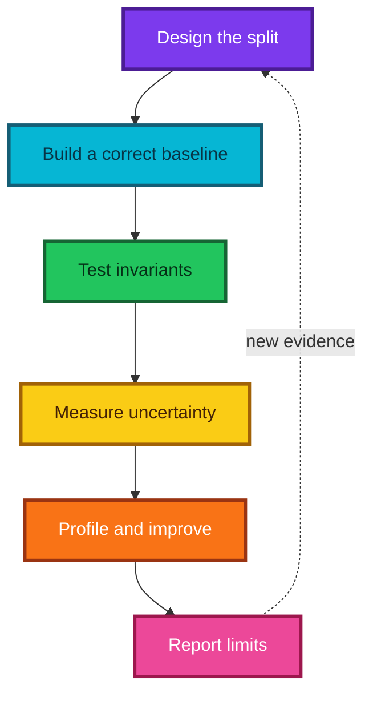

---

## 23. Resources

### Primary lesson

- [Intro to Machine Learning: Lesson 7 — YouTube](https://www.youtube.com/watch/O5F9vR2CNYI)

### Model families and evaluation

- [scikit-learn: Forests of randomized trees](https://scikit-learn.org/stable/modules/ensemble.html#forest) — bagging, random forests, Extra Trees, and aggregation behavior.
- [scikit-learn: Decision trees](https://scikit-learn.org/stable/modules/tree.html) — splitting, complexity, tips, and implementation notes.
- [scikit-learn: Support vector machines](https://scikit-learn.org/stable/modules/svm.html) — current strengths, limitations, and scaling cautions.
- [scikit-learn: Cross-validation](https://scikit-learn.org/stable/modules/cross_validation.html) — resampling strategies and common pitfalls.
- [scikit-learn: Precision-recall example](https://scikit-learn.org/stable/auto_examples/model_selection/plot_precision_recall.html) — evaluation under class imbalance.
- [scikit-learn: Tuning the decision threshold](https://scikit-learn.org/stable/modules/classification_threshold.html) — separating probability learning from action selection.

### Python performance

- [Cython tutorial](https://cython.readthedocs.io/en/latest/src/tutorial/cython_tutorial.html) — compiling Python-like code and adding types.
- [Building Cython code](https://cython.readthedocs.io/en/latest/src/quickstart/build.html) — notebook, command-line, and extension build workflows.

### Reproducible help

- [GitHub: Creating Gists](https://docs.github.com/en/get-started/writing-on-github/editing-and-sharing-content-with-gists/creating-gists) — creation and visibility warning.
- [GitHub CLI: `gh gist create`](https://cli.github.com/manual/gh_gist_create) — command reference.

### Suggested study order

1. Work through Sections 3–5 and calculate one confidence interval by hand.
2. Manually evaluate every split in the tiny example from Section 9.
3. Read the complete implementation once without running it.
4. Run its unit-sized examples and the scikit-learn comparison.
5. Change one design choice—such as `min_leaf`, `max_features`, or bootstrap sampling—and explain the observed effect.
6. Complete one interpretation exercise before attempting acceleration.

---

## Final takeaway

A random forest is not mysterious: each tree repeatedly chooses a partition that reduces impurity, each leaf makes a local estimate, and the forest averages many deliberately varied trees. The deeper lesson is methodological. Validation precision must be designed, implementation claims must be expressed mathematically, optimized code must preserve tested behavior, and model choice must follow the structure of the actual problem.

> **Build the smallest correct explanation, test it on the smallest revealing example, and only then make it faster or more elaborate.**
