# Practical Machine Learning, Lesson 8

## From image tensors to a neural-network classifier

> Detailed study notes based on **Machine Learning 1: Lesson 8**, expanded with mathematical derivations, modern PyTorch patterns, executable NumPy examples, implementation details, and corrections where historical APIs or teaching simplifications need refinement.

**Primary source:** [Watch Lesson 8 on YouTube](https://www.youtube.com/watch/DzE0eSdy5Hk)

---

## Learning objectives

By the end of this guide, you should be able to:

1. explain why images and high-cardinality time-series problems motivate neural networks;
2. describe MNIST as tensors and track every axis through flattening and batching;
3. reshape, slice, transpose, and inspect arrays without losing semantic meaning;
4. normalize training, validation, and test data without leakage;
5. derive an affine layer, ReLU, softmax, binary cross-entropy, and multiclass cross-entropy;
6. explain why a stack of affine maps needs nonlinear activations;
7. distinguish logits, probabilities, predicted classes, loss, and accuracy;
8. explain gradient descent, backpropagation, and automatic differentiation intuitively;
9. build logistic regression both with NumPy and current PyTorch conventions;
10. implement a custom `nn.Module` with correctly registered parameters;
11. select CPU, CUDA, or Apple MPS without hard-coding one accelerator; and
12. recognize which claims in the historical lecture require modern qualification.

---

## Table of contents

- [1. Lesson map](#1-lesson-map)
- [2. Why move beyond random forests?](#2-why-move-beyond-random-forests)
- [3. MNIST as numbers](#3-mnist-as-numbers)
- [4. Loading and serializing data safely](#4-loading-and-serializing-data-safely)
- [5. Destructuring and first inspection](#5-destructuring-and-first-inspection)
- [6. Tensors, rank, shape, axes, and dimensions](#6-tensors-rank-shape-axes-and-dimensions)
- [7. Reshaping, slicing, and moving axes](#7-reshaping-slicing-and-moving-axes)
- [8. Visual inspection is part of modeling](#8-visual-inspection-is-part-of-modeling)
- [9. Normalization without leakage](#9-normalization-without-leakage)
- [10. What is a neural network?](#10-what-is-a-neural-network)
- [11. Universal approximation—power and limits](#11-universal-approximationpower-and-limits)
- [12. Affine layers and shape algebra](#12-affine-layers-and-shape-algebra)
- [13. Why nonlinear activations matter](#13-why-nonlinear-activations-matter)
- [14. From loss to learning](#14-from-loss-to-learning)
- [15. Logits, softmax, and numerical stability](#15-logits-softmax-and-numerical-stability)
- [16. Binary cross-entropy](#16-binary-cross-entropy)
- [17. Multiclass cross-entropy](#17-multiclass-cross-entropy)
- [18. One-hot vectors, class indices, and argmax](#18-one-hot-vectors-class-indices-and-argmax)
- [19. A classifier from scratch with NumPy](#19-a-classifier-from-scratch-with-numpy)
- [20. A modern PyTorch data pipeline](#20-a-modern-pytorch-data-pipeline)
- [21. A modern PyTorch model and training loop](#21-a-modern-pytorch-model-and-training-loop)
- [22. Writing a custom PyTorch module](#22-writing-a-custom-pytorch-module)
- [23. Initialization and stable signal scale](#23-initialization-and-stable-signal-scale)
- [24. Devices, accelerators, and performance](#24-devices-accelerators-and-performance)
- [25. Prediction, accuracy, and error analysis](#25-prediction-accuracy-and-error-analysis)
- [26. Technical writing as a learning tool](#26-technical-writing-as-a-learning-tool)
- [27. Transcript claims refined](#27-transcript-claims-refined)
- [28. Formula sheet](#28-formula-sheet)
- [29. Practice exercises](#29-practice-exercises)
- [30. Review questions and answers](#30-review-questions-and-answers)
- [31. Practical checklist](#31-practical-checklist)
- [32. Resources](#32-resources)

---

## Notation

| Symbol | Meaning |
|---|---|
| $N$ | Number of examples |
| $D$ | Number of input features |
| $C$ | Number of classes |
| $B$ | Mini-batch size |
| $X\in\mathbb R^{B\times D}$ | One batch of input rows |
| $W\in\mathbb R^{D\times C}$ | Weight matrix for a linear classifier |
| $b\in\mathbb R^C$ | Bias vector |
| $z\in\mathbb R^C$ | Logits: unconstrained class scores |
| $p\in[0,1]^C$ | Class probabilities, with $\sum_c p_c=1$ |
| $y$ | True class index or target |
| $\theta$ | All trainable model parameters |
| $L(\theta)$ | Scalar training loss |
| $\eta$ | Learning rate |

---

## 1. Lesson map

Lesson 8 follows a top-down learning strategy: first use a high-level classifier, then open each abstraction until the matrix multiplication, probability transformation, loss, and parameter update are visible.

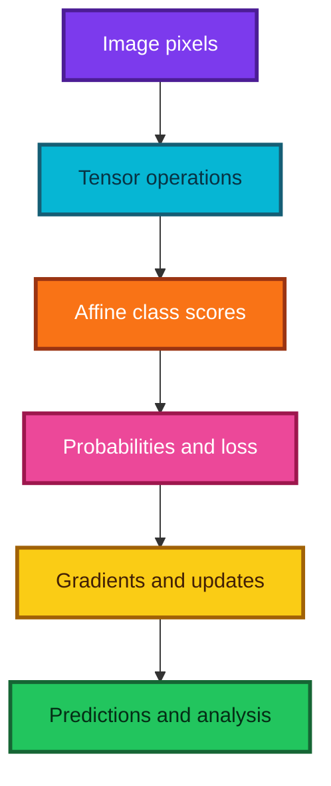

### The repeated learning pattern

For every abstraction, ask five questions:

1. **What** mathematical object goes in and comes out?
2. **Why** is the operation needed?
3. **How** does it change shape and values?
4. **When** is it appropriate—or inappropriate?
5. **How can it fail**, and what small check would reveal that failure?

---

## 2. Why move beyond random forests?

### What a regression forest produces

A standard regression-tree leaf predicts the average of training targets in its region:

$$
\hat f_{tree}(x)=\frac{1}{|L(x)|}\sum_{i\in L(x)}y_i,
$$

where $L(x)$ is the set of training rows sharing the query's leaf. A forest averages those tree predictions:

$$
\hat f_{forest}(x)=\frac1T\sum_{t=1}^T\hat f_t(x).
$$

This is **adaptive partitioning and local averaging**. It has a neighbor-like interpretation, but the neighborhood comes from learned rectangular regions rather than a fixed distance and a fixed $k$.

### Why extrapolation is difficult

Because each leaf prediction is an average of observed targets, an ordinary regression forest does not naturally continue a trend beyond the training range. For example, if every historical price is between ₹100 and ₹500, the forest cannot infer a smooth demand law at ₹800 merely from the fact that price is larger.

Neural networks can output values outside the training target range because they compose parameterized functions. That makes extrapolation **possible**, not automatically correct. Reliable extrapolation still needs appropriate features, architecture, loss, and domain assumptions.

### Why image structure is difficult for a plain forest

Flattening a $28\times28$ image produces 784 separate columns. A standard tree does not inherently know that:

- neighboring pixels form local edges;
- the same edge can appear in different locations;
- edges combine into strokes and shapes; or
- a small translation should not change the digit identity.

Modern convolutional and attention-based neural architectures encode more useful structure for images, audio, language, and sequences.

### Unordered categories in a numeric tree

If categories are arbitrarily encoded as $\{1,2,3,4\}$, a numeric threshold such as $x\le2.5$ imposes an artificial order. A deep enough tree may isolate the useful groups through several splits, but this can be inefficient. Depending on the model, consider:

- native categorical splits;
- one-hot encoding;
- target or impact encoding performed within folds;
- learned embeddings; or
- hashing for extremely large vocabularies.

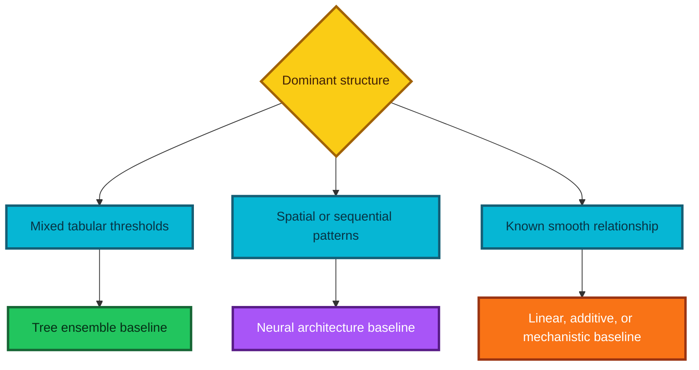

The right conclusion is not “forests or neural networks solve everything.” It is “start with models whose inductive biases match the problem, and compare them under an honest validation design.”

---

## 3. MNIST as numbers

MNIST contains grayscale handwritten digits from 0 through 9. Each image has:

- height $H=28$ pixels;
- width $W=28$ pixels;
- one grayscale channel; and
- one class label in $\{0,1,\ldots,9\}$.

The number of scalar pixel features is

$$
D=H\times W=28\times28=784.
$$

### Common representations

| Representation | Shape for one image | Shape for a batch of $B$ images |
|---|---:|---:|
| Grayscale image | $(28,28)$ | $(B,28,28)$ |
| PyTorch channel-first image | $(1,28,28)$ | $(B,1,28,28)$ |
| Flattened features | $(784,)$ | $(B,784)$ |
| Ten class scores | $(10,)$ | $(B,10)$ |

For current TorchVision code, images are commonly converted to floating-point tensors in $[0,1]$. The raw MNIST byte files use values from 0 to 255. Convention matters: in the usual MNIST data, background is near 0 and ink is near 255, although plotting color maps can visually invert black and white.

### Flattening keeps values but loses explicit geometry

Flattening changes the indexing scheme, not the underlying pixels:

$$
x_{r,c}\longmapsto x_j,
\qquad
j=rW+c.
$$

The inverse mapping for zero-based row-major storage is

$$
r=\left\lfloor\frac{j}{W}\right\rfloor,
\qquad
c=j\bmod W.
$$

The values are still present, but the model no longer receives height and width as separate axes.

> **Fun fact:** MNIST became a machine-learning “hello world” because it is small, standardized, and visual. A good benchmark for learning APIs is not necessarily a strong benchmark for modern research.

---

## 4. Loading and serializing data safely

### What serialization means

Serialization converts an in-memory object into bytes that can be stored or transmitted. Deserialization reconstructs the object later.

The lecture loads a gzip-compressed Python pickle. Pickle is convenient for Python object graphs, but it is Python-specific and can depend on importable class definitions. Most importantly, the official Python documentation warns that unpickling malicious data can execute arbitrary code. **Only unpickle a file whose source and integrity you trust.**

### Historical Python 2 compatibility

Some older NumPy pickles created under Python 2 require `encoding="latin1"` when loaded under Python 3. That is a compatibility flag, not a security feature.

```python
import gzip
import pickle
from pathlib import Path


def load_trusted_legacy_pickle(path):
    """Load a trusted gzip-compressed Python 2-era pickle."""

    # Resolve the path once so error messages show a clear location.
    path = Path(path)

    # Never call this function on an untrusted or tampered file:
    # pickle deserialization is capable of executing arbitrary code.
    with gzip.open(path, "rb") as compressed_file:
        # latin1 preserves byte values used by many old NumPy Python 2 pickles.
        return pickle.load(compressed_file, encoding="latin1")
```

### When to use another format

| Need | Better candidates |
|---|---|
| Language-neutral tabular exchange | CSV, Parquet, Arrow |
| Large typed arrays | NumPy `.npy`/`.npz`, Zarr, HDF5 |
| Human-readable configuration | JSON, TOML, YAML with safe loader |
| Framework model weights | Framework-recommended state dictionary or safe tensor format |
| Arbitrary trusted Python object graph | Pickle, with version and integrity controls |

The [Python pickle documentation](https://docs.python.org/3/library/pickle.html) explains both its flexibility and its security limitation.

---

## 5. Destructuring and first inspection

### Tuple unpacking

If a loader returns training, validation, and test pairs, Python can unpack the nested structure directly:

```python
# Create a tiny nested structure that behaves like a dataset loader's result.
loaded = (("X_train", "y_train"), ("X_valid", "y_valid"), ("X_test", "y_test"))

# Destructure both the outer tuple and each feature/label pair.
(X_train, y_train), (X_valid, y_valid), (X_test, y_test) = loaded

# Use an underscore by convention when a returned value is intentionally ignored.
(training_pair, validation_pair, _) = loaded
```

`_` is an ordinary valid variable in Python. It means “ignored” only by convention, and interactive environments may assign it additional meanings.

### Inspect before modeling

For a newly loaded array, check at least:

```python
import numpy as np

# Build a tiny batch with the same axis pattern as flattened image data.
X = np.arange(3 * 28 * 28, dtype=np.float32).reshape(3, 28 * 28)
y = np.array([8, 1, 4], dtype=np.int64)

# Verify container type, shape, element type, numeric range, and label values.
print("type:", type(X))
print("shape:", X.shape)
print("dtype:", X.dtype)
print("range:", (X.min(), X.max()))
print("labels:", np.unique(y))

# Check for non-finite values before sending data into a model.
assert np.isfinite(X).all()

# Confirm that features and labels contain the same number of examples.
assert len(X) == len(y)
```

Also inspect class counts, duplicates, missingness, train/validation provenance, and a few examples in their human-interpretable form.

---

## 6. Tensors, rank, shape, axes, and dimensions

### Definitions

A tensor in machine-learning software is a multidimensional numeric array.

| Rank | Example shape | Common name | Example |
|---:|---|---|---|
| 0 | `()` | Scalar | One loss value |
| 1 | `(784,)` | Vector | One flattened image |
| 2 | `(B, 784)` | Matrix | Batch of flattened images |
| 3 | `(B, 28, 28)` | Rank-3 tensor | Batch of grayscale images without channel axis |
| 4 | `(B, 1, 28, 28)` | Rank-4 tensor | PyTorch image batch: batch, channel, height, width |

Important distinctions:

- **rank** or `ndim` is the number of axes;
- **shape** lists the length of every axis;
- **size** is the total number of scalar elements; and
- **axis** identifies a direction by zero-based position.

For shape $(B,C,H,W)$,

$$
\operatorname{rank}=4,
\qquad
\operatorname{size}=BCHW.
$$

### Names vary across fields

“Dimension” can mean an axis count, an axis length, or a vector-space dimension. Avoid ambiguity by saying exactly what you mean: “rank 4,” “axis 1,” or “784 features.” Physicists use “tensor” more narrowly than array libraries do; in this guide, tensor means the software object.

### Axis semantics are part of the data

The shapes $(B,H,W,C)$ and $(B,C,H,W)$ contain the same number of values but assign different meanings to each location. A silent axis error can train a model on nonsense while all array sizes still look legal.

### Dense tensors versus jagged collections

A dense tensor has one rectangular shape: every row has the same length. A collection such as `[[1, 2], [3, 4, 5]]` is jagged because its inner sequences differ in length. Text, audio, and event sequences often begin jagged and must be padded, packed, truncated, or represented with offsets before efficient batching. Writing `x[i, j]` expresses multidimensional indexing into one rectangular array; chained list indexing `x[i][j]` first retrieves one Python object and then indexes that object.

---

## 7. Reshaping, slicing, and moving axes

### Reshape preserves element count

A reshape from shape $s$ to $t$ is valid only if

$$
\prod_i s_i=\prod_j t_j.
$$

`-1` asks the library to infer exactly one axis:

$$
\text{inferred length}
=
\frac{\text{total elements}}
{\text{product of specified lengths}}.
$$

```python
import numpy as np

# Construct two synthetic flattened images with 784 values each.
flat_images = np.arange(2 * 784).reshape(2, 784)

# Recover batch, height, and width; -1 infers the batch size of two.
image_batch = flat_images.reshape(-1, 28, 28)
assert image_batch.shape == (2, 28, 28)

# Flatten every image independently while retaining the batch axis.
round_trip = image_batch.reshape(image_batch.shape[0], -1)
assert np.array_equal(round_trip, flat_images)

# Select the first image; indexing with an integer removes axis zero.
first_image = image_batch[0]
assert first_image.shape == (28, 28)

# Select rows 10 through 14 and columns 10 through 14.
# Python's stop index is exclusive, so 10:15 contains five positions.
center_patch = first_image[10:15, 10:15]
assert center_patch.shape == (5, 5)
```

The transcript says “10 through 14 inclusive,” correctly corresponding to slice `10:15`.

### Slicing and rank

| Expression on `x.shape == (B,C,H,W)` | Result shape | Meaning |
|---|---|---|
| `x[0]` | $(C,H,W)$ | Remove batch axis by selecting one image |
| `x[0:1]` | $(1,C,H,W)$ | Keep a one-image batch |
| `x[:, 0]` | $(B,H,W)$ | Select the first channel |
| `x[:, :, 10:15, 10:15]` | $(B,C,5,5)$ | Crop every image |
| `x[..., ::-1]` in NumPy | same rank | Reverse the final axis |

### Moving color channels

```python
import numpy as np

# Simulate four images stored as batch, height, width, channels (NHWC).
images_nhwc = np.zeros((4, 32, 32, 3), dtype=np.float32)

# Reorder axes for PyTorch-style batch, channels, height, width (NCHW).
images_nchw = np.transpose(images_nhwc, (0, 3, 1, 2))
assert images_nchw.shape == (4, 3, 32, 32)

# Reverse BGR into RGB while retaining all other axes.
images_rgb = images_nhwc[..., ::-1]
assert images_rgb.shape == images_nhwc.shape
```

NumPy `reshape` returns a view where possible and a copy otherwise. Transposition changes strides and can make an array non-contiguous, so code should not assume every reshape is free. See the [NumPy copies and views guide](https://numpy.org/doc/stable/user/basics.copies.html).

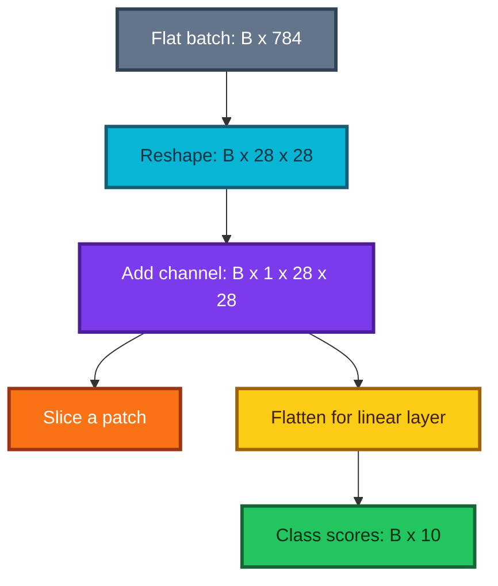

---

## 8. Visual inspection is part of modeling

Images are numbers, but humans detect many errors faster from an image than from 784 printed values. Use both representations.

```python
import matplotlib.pyplot as plt
import numpy as np


def show_digit_grid(images, labels, predictions=None, count=8):
    """Display a small labeled sample and optionally mark prediction errors."""

    # Convert to an array and cap the requested count at available rows.
    images = np.asarray(images)
    count = min(count, len(images))

    # Create a compact two-row layout with enough columns for the sample.
    columns = min(4, count)
    rows = int(np.ceil(count / columns))
    figure, axes = plt.subplots(rows, columns, figsize=(2.2 * columns, 2.2 * rows))

    # Flatten the axes container so the loop works for one or many rows.
    axes = np.atleast_1d(axes).ravel()

    for index in range(count):
        # Recover 28 x 28 geometry if a sample arrived flattened.
        image = images[index].reshape(28, 28)
        axes[index].imshow(image, cmap="gray")

        # Include both truth and prediction when predictions were supplied.
        title = f"true={labels[index]}"
        if predictions is not None:
            title += f", pred={predictions[index]}"

            # Color incorrect prediction titles red for rapid scanning.
            title_color = "#DC2626" if predictions[index] != labels[index] else "#166534"
        else:
            title_color = "#111827"

        axes[index].set_title(title, color=title_color)
        axes[index].axis("off")

    # Hide unused subplot cells instead of leaving blank axes visible.
    for index in range(count, len(axes)):
        axes[index].axis("off")

    figure.tight_layout()
    return figure
```

### A productive debugging loop

1. Inspect `shape`, `dtype`, minimum, maximum, mean, and standard deviation.
2. Assert all values are finite.
3. Visualize random examples with labels.
4. Visualize transformations after applying them.
5. Inspect confident errors, not only random predictions.
6. Look for flipped axes, inverted colors, wrong labels, duplicates, and leakage.

> **Fun fact:** A model can achieve apparently sensible loss while training on transposed or wrongly normalized images. Numerical validity is not semantic validity.

---

## 9. Normalization without leakage

### Standardization

For feature $j$, compute training statistics

$$
\mu_j=\frac1{N_{train}}\sum_{i=1}^{N_{train}}x_{ij},
$$

$$
\sigma_j=\sqrt{\frac1{N_{train}}\sum_{i=1}^{N_{train}}(x_{ij}-\mu_j)^2},
$$

then transform every split with the **same** values:

$$
x'_{ij}=\frac{x_{ij}-\mu_j}{\sigma_j}.
$$

If a feature has zero training variance, use a safe scale such as 1 so its transformed value is zero.

### Why training statistics must be reused

Fitting a different transformation to validation data changes the meaning of its inputs. It also allows validation-distribution information to influence evaluation. Preprocessing is part of the fitted model.

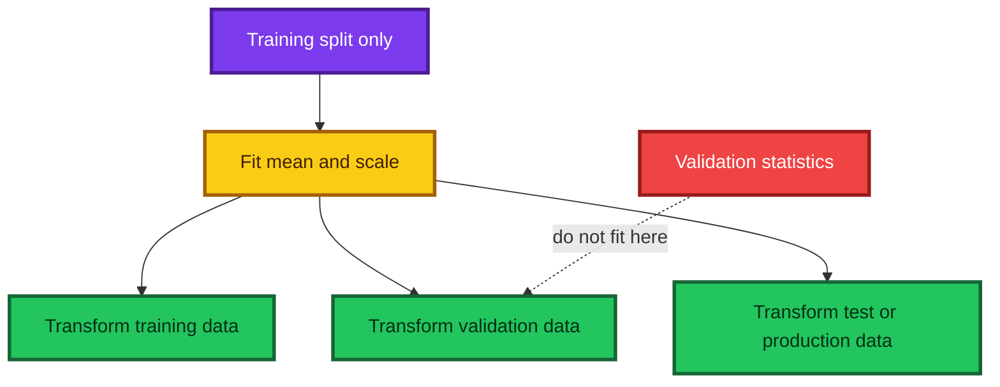

### Commented reusable transformer

```python
import numpy as np


class Standardizer:
    """Fit featurewise training statistics and reuse them on later splits."""

    def fit(self, X):
        # Convert once to a predictable floating-point representation.
        X = np.asarray(X, dtype=np.float64)

        # Estimate every feature's center and population standard deviation.
        self.mean_ = X.mean(axis=0)
        raw_scale = X.std(axis=0)

        # Prevent division by zero for constant training features.
        self.scale_ = np.where(raw_scale > 0.0, raw_scale, 1.0)
        return self

    def transform(self, X):
        # Require fitting so accidental validation-only normalization fails loudly.
        if not hasattr(self, "mean_"):
            raise RuntimeError("Call fit on training data before transform")

        # Apply the stored training transformation without recomputing statistics.
        X = np.asarray(X, dtype=np.float64)
        return (X - self.mean_) / self.scale_

    def fit_transform(self, X):
        # Fit only on the supplied training rows, then transform those same rows.
        return self.fit(X).transform(X)


# Fit once on training data and reuse the same learned meaning everywhere.
standardizer = Standardizer()
X_train_scaled = standardizer.fit_transform(X_train_raw)
X_valid_scaled = standardizer.transform(X_valid_raw)
X_test_scaled = standardizer.transform(X_test_raw)
```

### Global, per-feature, or per-channel?

| Data | Common normalization unit | Reason |
|---|---|---|
| Tabular | Each numeric feature | Income and age have different units |
| RGB images | Each channel | Red, green, and blue distributions differ |
| Simple grayscale MNIST | One grayscale channel | All pixels share one channel type |
| Pretrained vision model | The model's documented channel statistics | Input meaning must match pretraining |

### Why tree models usually do not need scaling

Exact numeric tree splits depend primarily on order. A strictly increasing transform $g$ preserves order:

$$
x_i<x_j\iff g(x_i)<g(x_j).
$$

Therefore standardization usually preserves the candidate partitions of an exact tree. However, “trees are immune to outliers” is too strong: target outliers can dominate squared-error splits, feature outliers can affect histogram binning or numerical precision, and arbitrary categorical codes can still be inefficient.

Neural optimization uses weighted sums and gradients, so severely mismatched scales can make the loss landscape poorly conditioned and parameter updates inefficient.

### Order-based quantities versus distance-based quantities

The useful question is not merely whether a method is “parametric.” Ask which numerical relationships the computation uses:

| Method or metric | Sensitive to positive affine rescaling? | Main dependence |
|---|---:|---|
| Exact univariate tree split | Usually no | Sorted order and candidate partitions |
| Spearman correlation | No under strictly monotone transforms | Ranks |
| ROC AUC | No under strictly monotone score transforms | Ranking of positive versus negative scores |
| Euclidean $k$-nearest neighbors | Yes | Numeric distances |
| Gradient-trained affine layer | Yes in optimization behavior | Weighted magnitudes and loss geometry |

This is why $k$-nearest neighbors can require scaling even though it is nonparametric, while an exact decision tree often does not.

---

## 10. What is a neural network?

A feed-forward neural network is a composition of parameterized affine transformations and nonlinear activation functions. For $L$ layers,

$$
h_0=x,
$$

$$
z_\ell=W_\ell h_{\ell-1}+b_\ell,
$$

$$
h_\ell=\phi_\ell(z_\ell),
\qquad \ell=1,\ldots,L.
$$

Depending on whether examples are represented as column or row vectors, code may use $W h$ or $XW$. The concept is the same; write shapes explicitly to avoid silently transposing the mathematics.

### The four essential pieces

| Piece | Role | Example |
|---|---|---|
| Architecture | Defines the function family | Linear layer, multilayer perceptron, CNN |
| Parameters | Values learned from data | Weights and biases |
| Loss | Measures how undesirable predictions are | Cross-entropy |
| Optimizer | Updates parameters to reduce loss | SGD, AdamW |


### Logistic regression is a one-affine-layer classifier

For $C$ mutually exclusive classes,

$$
z=xW+b,
\qquad
p=\operatorname{softmax}(z).
$$

There is only one learned affine transformation. It can be expressed with neural-network primitives, but it remains a linear decision model. Calling it “deep” would be misleading.

### What makes a network deep?

Depth comes from multiple learned transformations, for example

$$
h=\operatorname{ReLU}(xW_1+b_1),
$$

$$
z=hW_2+b_2.
$$

The hidden representation $h$ lets the model learn nonlinear combinations of pixels before producing class scores.

---

## 11. Universal approximation—power and limits

Informally, universal-approximation results show that certain neural networks with a suitable non-polynomial activation can approximate any continuous function on a compact domain arbitrarily well, given enough capacity.

The claim needs its qualifiers:

- it is an **existence** result, not a guarantee that gradient descent finds the parameters;
- it may require impractically many units;
- finite data do not identify an arbitrary function outside observed support;
- approximation ability does not guarantee generalization;
- the theorem does not choose an architecture, loss, or regularizer; and
- it does not imply that a network can compute every function exactly with finite resources.

### Intuition: build a complicated shape from simple pieces

ReLU networks create piecewise-linear functions. More hidden units add breakpoints, allowing the network to assemble increasingly detailed approximations.

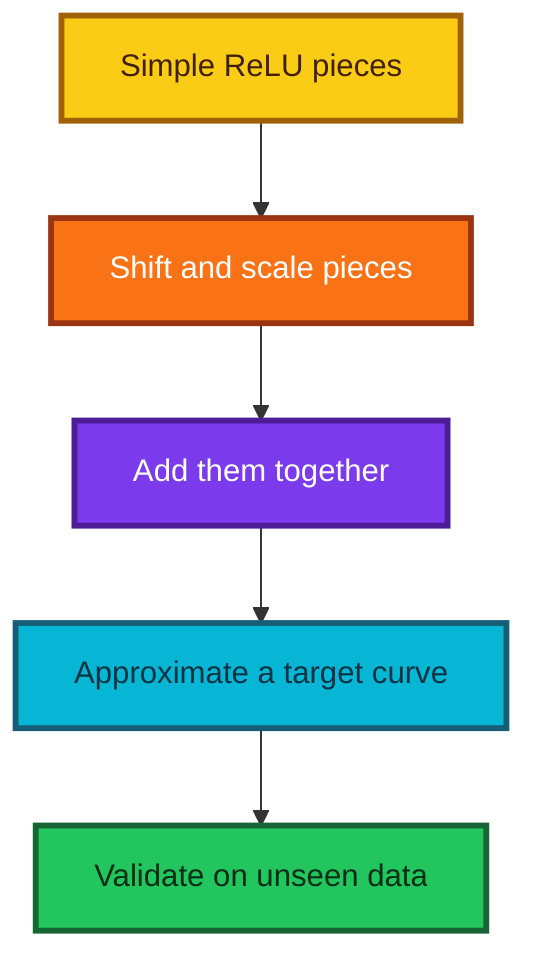

For a visual walkthrough, see Michael Nielsen's [visual proof of universality](https://neuralnetworksanddeeplearning.com/chap4.html), the resource referenced in the lecture.

> **Fun fact:** “Can represent” and “can learn efficiently” are different mathematical questions. Much of deep-learning research concerns the second one.

---

## 12. Affine layers and shape algebra

### Why “linear layer” is technically affine

Libraries commonly call

$$
f(x)=xW+b
$$

a linear layer. Strictly, it is affine when $b\ne0$ because a linear map must satisfy $f(0)=0$. The bias lets the decision boundary move away from the origin.

### Batch shape calculation

For a batch of flattened MNIST images,

$$
X\in\mathbb R^{B\times784},
\qquad
W\in\mathbb R^{784\times10},
\qquad
b\in\mathbb R^{10}.
$$

Then

$$
Z=XW+b\in\mathbb R^{B\times10}.
$$

The inner matrix dimensions must match:

$$
(B\times\color{#DC2626}{784})
(\color{#DC2626}{784}\times10)
\longrightarrow B\times10.
$$

The bias is broadcast across the $B$ rows:

$$
Z_{ic}=\sum_{j=1}^{784}X_{ij}W_{jc}+b_c.
$$

Each column $W_{:,c}$ is a learned pixel-weight template for class $c$.

### Commented NumPy example

```python
import numpy as np

# Fix the random seed so the shape demonstration is reproducible.
rng = np.random.default_rng(42)

# Simulate a batch of 32 flattened MNIST images.
X_batch = rng.normal(size=(32, 784))

# Create one learnable weight vector and one bias for each of ten classes.
weights = rng.normal(scale=0.01, size=(784, 10))
bias = np.zeros(10)

# Matrix multiplication produces ten unconstrained class scores per image.
logits = X_batch @ weights + bias
assert logits.shape == (32, 10)

# Broadcasting is equivalent to explicitly repeating the bias for every row.
explicit_bias = np.tile(bias, (len(X_batch), 1))
assert np.allclose(logits, X_batch @ weights + explicit_bias)
```

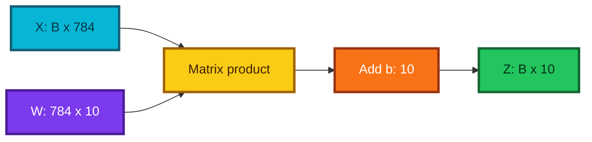

---

## 13. Why nonlinear activations matter

### Affine maps collapse into one affine map

Suppose there are no nonlinearities:

$$
h=xW_1+b_1,
$$

$$
z=hW_2+b_2.
$$

Substituting $h$ gives

$$
z=x(W_1W_2)+(b_1W_2+b_2).
$$

This is another affine map. A hundred affine layers without nonlinear activations still express only one affine transformation.

### ReLU

The rectified linear unit is

$$
\operatorname{ReLU}(z)=\max(0,z).
$$

Applied elementwise,

$$
h_j=\max(0,z_j).
$$

Its derivative away from zero is

$$
\frac{d}{dz}\operatorname{ReLU}(z)=
\begin{cases}
0,&z<0,\\
1,&z>0.
\end{cases}
$$

At zero it is not differentiable, and software adopts a conventional subgradient, commonly zero. That single point rarely prevents gradient-based training.

### “Throwing away negatives” is only half the intuition

ReLU sets negative **activations** to zero, but the information-processing effect is conditional gating: a hidden unit is active in one region of input space and inactive in another. Different gates create different local affine behaviors.

```python
import numpy as np


def relu(values):
    """Apply the rectified linear unit elementwise."""

    # Retain positive values and replace negative values with zero.
    return np.maximum(values, 0.0)


# Demonstrate the piecewise behavior on both sides of zero.
inputs = np.array([-2.0, -0.1, 0.0, 0.5, 3.0])
outputs = relu(inputs)
assert np.array_equal(outputs, np.array([0.0, 0.0, 0.0, 0.5, 3.0]))
```

### When ReLU is useful

ReLU remains a strong default for multilayer perceptrons and convolutional networks. Other activations—GELU, SiLU, sigmoid, tanh—may be chosen for smoother gradients, bounded states, gates, or established architecture conventions.

---

## 14. From loss to learning

### Loss turns model quality into one differentiable number

A loss function answers: “How undesirable are the current predictions?” Training seeks

$$
\theta^*=\arg\min_\theta L(\theta).
$$

For classification, the training loss and reported metric need not be the same:

- cross-entropy is smooth enough to optimize and uses confidence information;
- accuracy is easy to interpret but is piecewise constant with respect to small parameter changes.

### A derivative is local sensitivity

For one parameter $\theta_j$,

$$
\frac{\partial L}{\partial\theta_j}
$$

describes how the loss changes for a small increase in that parameter. The gradient collects all partial derivatives:

$$
\nabla_\theta L=
\left[
\frac{\partial L}{\partial\theta_1},
\ldots,
\frac{\partial L}{\partial\theta_m}
\right].
$$

### Gradient-descent update

Move against the direction of increasing loss:

$$
\theta\leftarrow\theta-\eta\nabla_\theta L.
$$

- If $\eta$ is too small, learning is slow.
- If $\eta$ is too large, loss can oscillate or diverge.
- Adaptive optimizers change the effective update using gradient history.

### Chain rule and backpropagation

For a composition $L(f(g(x)))$,

$$
\frac{dL}{dx}
=
\frac{dL}{df}
\frac{df}{dg}
\frac{dg}{dx}.
$$

Backpropagation is an efficient dynamic-programming application of the chain rule through the computational graph. Automatic differentiation records operations and evaluates these derivatives; it does not remove the need to understand what a gradient means or to detect detached graphs, exploding values, or the wrong objective.

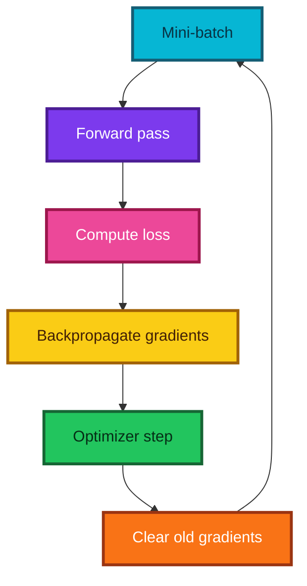

### Epoch, batch, and step

| Term | Meaning |
|---|---|
| Batch | Examples used for one gradient estimate |
| Step or iteration | One optimizer update |
| Epoch | One pass through the training dataset |

If $N$ examples are divided into batches of size $B$, an epoch has approximately

$$
\left\lceil\frac NB\right\rceil
$$

optimizer steps.

### Autograd example in current PyTorch

```python
import torch

# Create a scalar parameter and ask PyTorch to track operations involving it.
theta = torch.tensor(3.0, requires_grad=True)

# Define a simple loss whose analytic derivative is 2 * (theta - 5).
loss = (theta - 5.0) ** 2

# Apply reverse-mode automatic differentiation to populate theta.grad.
loss.backward()

# At theta=3, the expected derivative is 2 * (3 - 5) = -4.
assert torch.allclose(theta.grad, torch.tensor(-4.0))
```

---

## 15. Logits, softmax, and numerical stability

### Logits

Logits are unrestricted real-valued class scores:

$$
z=(z_1,\ldots,z_C)\in\mathbb R^C.
$$

They are not probabilities and need not sum to one.

### Softmax

Softmax maps logits to a probability vector:

$$
p_c=\frac{e^{z_c}}{\sum_{k=1}^{C}e^{z_k}}.
$$

Mathematically,

$$
0<p_c<1,
\qquad
\sum_{c=1}^Cp_c=1.
$$

Softmax preserves ordering, so

$$
\arg\max_c z_c=\arg\max_c p_c.
$$

Therefore probability conversion is unnecessary merely to choose the predicted class.

### Invariance to a shared shift

For any scalar $a$,

$$
\operatorname{softmax}(z)=\operatorname{softmax}(z-a).
$$

Choose $a=\max_c z_c$ to prevent exponential overflow:

```python
import numpy as np


def stable_softmax(logits, axis=-1):
    """Convert logits to probabilities using a stable shared shift."""

    # Subtract the row maximum; softmax is unchanged by this shared shift.
    shifted = logits - np.max(logits, axis=axis, keepdims=True)

    # The largest exponent is now exp(0)=1, avoiding overflow for large logits.
    exponentials = np.exp(shifted)

    # Normalize along the class axis so every row sums to one.
    return exponentials / exponentials.sum(axis=axis, keepdims=True)


# A naive exp(10000) would overflow, while the stable implementation remains finite.
example_logits = np.array([[10_000.0, 9_999.0, 9_998.0]])
example_probabilities = stable_softmax(example_logits)
assert np.isfinite(example_probabilities).all()
assert np.allclose(example_probabilities.sum(axis=1), 1.0)
```

### Softmax does not guarantee calibrated confidence

The output has the algebraic form of probabilities, but a model can be overconfident. Calibration is an empirical property checked on representative held-out data.

---

## 16. Binary cross-entropy

For binary label $y\in\{0,1\}$ and predicted probability $p=P(Y=1\mid x)$,

$$
\ell_{BCE}(y,p)
=-left[y\log p+(1-y)\log(1-p)\right].
$$

Because $y$ is either zero or one,

$$
\ell_{BCE}(y,p)=
\begin{cases}
-\log p,&y=1,\\
-\log(1-p),&y=0.
\end{cases}
$$

### Why the logarithm?

- A correct confident prediction has loss near zero.
- A wrong confident prediction receives a very large penalty.
- Independent likelihoods multiply, while log-likelihoods add.
- Minimizing negative log-likelihood is equivalent to maximizing likelihood.

| True label | Predicted $P(Y=1)$ | Loss | Interpretation |
|---:|---:|---:|---|
| 1 | 0.99 | $-\log(0.99)\approx0.010$ | Correct and confident |
| 1 | 0.50 | $-\log(0.50)\approx0.693$ | Uncertain |
| 1 | 0.01 | $-\log(0.01)\approx4.605$ | Confidently wrong |
| 0 | 0.01 | $-\log(0.99)\approx0.010$ | Correct and confident |

### Commented probability-based implementation

```python
import numpy as np


def binary_cross_entropy(probability, target, epsilon=1e-12):
    """Return mean binary cross-entropy for probability predictions."""

    # Convert inputs to floating-point arrays with compatible shapes.
    probability = np.asarray(probability, dtype=np.float64)
    target = np.asarray(target, dtype=np.float64)

    # Reject targets outside the mathematical binary-label range.
    if np.any((target != 0.0) & (target != 1.0)):
        raise ValueError("Binary targets must contain only 0 and 1")

    # Avoid log(0) in this educational probability-based implementation.
    probability = np.clip(probability, epsilon, 1.0 - epsilon)

    # Select the correct-class log probability algebraically for every row.
    per_example = -(
        target * np.log(probability)
        + (1.0 - target) * np.log(1.0 - probability)
    )
    return per_example.mean()


# Cat=1 and dog=0; every prediction assigns 80% or 90% to the correct class.
targets = np.array([1, 0, 0, 1])
probability_of_cat = np.array([0.9, 0.1, 0.2, 0.8])
print("binary cross-entropy:", binary_cross_entropy(probability_of_cat, targets))
```

In PyTorch, prefer `BCEWithLogitsLoss` for binary or independent multi-label outputs. It combines sigmoid and BCE more stably than applying sigmoid yourself.

---

## 17. Multiclass cross-entropy

For one-hot target $y\in\{0,1\}^C$ and probability vector $p$,

$$
\ell_{CE}(y,p)=-\sum_{c=1}^Cy_c\log p_c.
$$

Exactly one $y_c$ is one, so if the true class index is $t$,

$$
\ell_{CE}(t,p)=-\log p_t.
$$

For a batch of $B$ examples,

$$
L=-\frac1B\sum_{i=1}^{B}\log p_{i,y_i}.
$$

### Directly from logits

Substituting softmax gives

$$
\ell(z,t)
=-z_t+\log\sum_{c=1}^{C}e^{z_c}.
$$

This log-sum-exp form is evaluated with a stable maximum shift in production libraries.

```python
import numpy as np


def multiclass_cross_entropy_from_logits(logits, targets):
    """Return stable mean cross-entropy from logits and class indices."""

    # Validate the standard batch-by-class and one-label-per-row representation.
    logits = np.asarray(logits, dtype=np.float64)
    targets = np.asarray(targets, dtype=np.int64)
    if logits.ndim != 2 or targets.shape != (len(logits),):
        raise ValueError("Require logits (batch, classes) and targets (batch,)")
    if np.any((targets < 0) | (targets >= logits.shape[1])):
        raise ValueError("A target index lies outside the class range")

    # Subtracting each row's maximum keeps exponentials finite.
    row_maximum = logits.max(axis=1, keepdims=True)
    shifted = logits - row_maximum

    # log(sum(exp(z))) is now safe because every shifted logit is nonpositive.
    log_sum_exp = np.log(np.exp(shifted).sum(axis=1))

    # Gather the shifted score at each row's true class.
    true_score = shifted[np.arange(len(logits)), targets]

    # Negative true score plus log-sum-exp is exactly softmax cross-entropy.
    return np.mean(-true_score + log_sum_exp)


# Two examples, each with three raw class scores.
logits = np.array([[3.0, 1.0, -1.0], [0.2, 1.8, 0.1]])
targets = np.array([0, 1])
print("multiclass cross-entropy:", multiclass_cross_entropy_from_logits(logits, targets))
```

### Crucial PyTorch convention

Current `torch.nn.CrossEntropyLoss` expects **raw logits** and usually integer class indices. It internally combines `LogSoftmax` with `NLLLoss`. Do not apply softmax first.

Two correct patterns are:

```python
import torch.nn as nn

# Pattern 1: preferred concise form—raw logits enter CrossEntropyLoss.
model = nn.Linear(784, 10)
loss_function = nn.CrossEntropyLoss()

# Pattern 2: explicit equivalent—log-probabilities enter NLLLoss.
explicit_model = nn.Sequential(nn.Linear(784, 10), nn.LogSoftmax(dim=1))
explicit_loss_function = nn.NLLLoss()
```

Do **not** pair `nn.Softmax` with `nn.CrossEntropyLoss`; doing so duplicates a transformation and loses numerical stability.

### BCE and multiclass CE are related, not literally identical

- Binary BCE models one Bernoulli event.
- Multiclass CE models one categorical choice among mutually exclusive classes.
- Multi-label classification uses one binary loss per independently possible label.
- A two-class softmax model can be reparameterized as logistic regression, but summing binary BCE over all one-hot columns is not the general definition of single-label categorical CE.

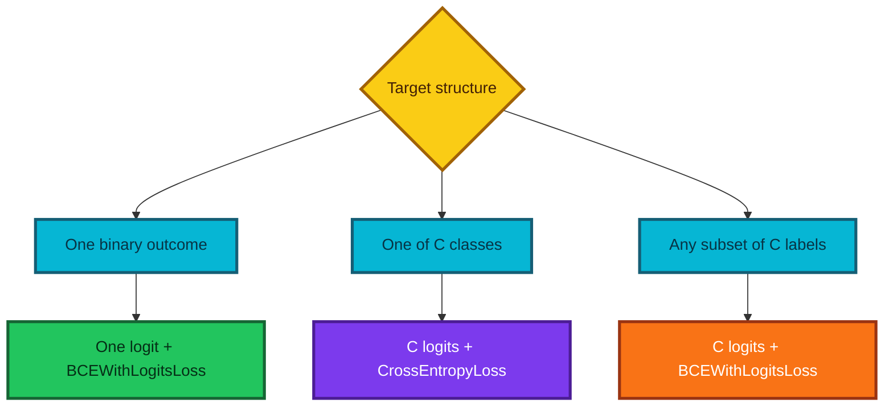

See the current [PyTorch `CrossEntropyLoss` documentation](https://docs.pytorch.org/docs/stable/generated/torch.nn.CrossEntropyLoss.html) for supported input and target forms.

---

## 18. One-hot vectors, class indices, and argmax

### Why class labels are not numeric distances

For digit recognition, class 9 is not “three times class 3,” and predicting 5 instead of 3 is not inherently better than predicting 9. The values 0–9 are identifiers for nominal categories.

A one-hot encoding of class 3 among ten classes is

$$
[0,0,0,1,0,0,0,0,0,0].
$$

### Storage versus mathematical interpretation

Many loss functions accept class index `3` and internally gather the fourth log-probability. This is more memory-efficient than materializing a ten-element one-hot vector for every row. The mathematics is still equivalent to selecting the one-hot target's active class.

### `max` versus `argmax`

For scores $z$,

$$
\max_c z_c
$$

returns the largest **value**, while

$$
\arg\max_c z_c
$$

returns the **index** where that value occurs.

```python
import numpy as np

# Store one probability row for each of three examples.
probabilities = np.array(
    [
        [0.05, 0.80, 0.15],
        [0.60, 0.30, 0.10],
        [0.10, 0.20, 0.70],
    ]
)

# axis=1 means choose across class columns independently for each row.
predicted_class = probabilities.argmax(axis=1)
predicted_confidence = probabilities.max(axis=1)

assert np.array_equal(predicted_class, np.array([1, 0, 2]))
assert np.allclose(predicted_confidence, np.array([0.8, 0.6, 0.7]))
```

### Accuracy

For predictions $\hat y_i$,

$$
\operatorname{accuracy}
=
\frac1N\sum_{i=1}^{N}\mathbf1(\hat y_i=y_i).
$$

In NumPy or PyTorch, booleans can be averaged after conversion to a numeric type. Accuracy ignores confidence and class-specific costs, which is why cross-entropy remains useful even when accuracy is the reported headline metric.

---

## 19. A classifier from scratch with NumPy

This complete example trains ten-class logistic regression using only NumPy for the model and gradients. It uses scikit-learn's small built-in $8\times8$ handwritten-digits dataset so the example runs without downloading MNIST.

The model is

$$
Z=XW+b,
$$

and for mean multiclass cross-entropy its gradients are

$$
\frac{\partial L}{\partial Z}
=
\frac{P-Y}{N},
$$

$$
\frac{\partial L}{\partial W}
=
X^T\frac{\partial L}{\partial Z},
\qquad
\frac{\partial L}{\partial b}
=
\sum_{i=1}^{N}\frac{\partial L}{\partial Z_i}.
$$

```python
import numpy as np
from sklearn.datasets import load_digits
from sklearn.model_selection import train_test_split


def softmax_rows(logits):
    """Return stable class probabilities for a batch of logits."""

    # Shift each row independently so its largest logit becomes zero.
    shifted = logits - logits.max(axis=1, keepdims=True)

    # Exponentiate only nonpositive numbers, preventing overflow.
    exponentials = np.exp(shifted)

    # Normalize over classes to obtain one probability distribution per row.
    return exponentials / exponentials.sum(axis=1, keepdims=True)


def mean_cross_entropy(probabilities, targets, epsilon=1e-12):
    """Return mean negative log-probability of the true classes."""

    # Gather one correct-class probability from every prediction row.
    true_probability = probabilities[np.arange(len(targets)), targets]

    # Clip away from zero so log remains finite in this educational code.
    true_probability = np.clip(true_probability, epsilon, 1.0)
    return -np.log(true_probability).mean()


def classification_accuracy(logits, targets):
    """Return the fraction of rows whose largest logit has the true index."""

    # Softmax is unnecessary because it preserves the ordering of logits.
    predictions = logits.argmax(axis=1)
    return np.mean(predictions == targets)


# Load 1,797 labeled 8 x 8 images bundled with scikit-learn.
digits = load_digits()
X = digits.data.astype(np.float64)
y = digits.target.astype(np.int64)

# Reserve a stratified validation set so every digit remains represented.
X_train, X_valid, y_train, y_valid = train_test_split(
    X,
    y,
    test_size=0.25,
    random_state=42,
    stratify=y,
)

# Fit preprocessing statistics on training rows only.
mean = X_train.mean(axis=0)
raw_scale = X_train.std(axis=0)
scale = np.where(raw_scale > 0.0, raw_scale, 1.0)

# Apply the identical training transformation to both splits.
X_train = (X_train - mean) / scale
X_valid = (X_valid - mean) / scale

# Read dimensions from data instead of scattering magic numbers through code.
number_of_examples, number_of_features = X_train.shape
number_of_classes = len(np.unique(y_train))

# Initialize a reproducible affine classifier with a small Xavier-like scale.
rng = np.random.default_rng(42)
initial_scale = np.sqrt(2.0 / (number_of_features + number_of_classes))
weights = rng.normal(
    loc=0.0,
    scale=initial_scale,
    size=(number_of_features, number_of_classes),
)
bias = np.zeros(number_of_classes)

# Full-batch gradient descent is simple for this small educational dataset.
learning_rate = 0.4
epochs = 400

for epoch in range(epochs):
    # Forward pass: produce one raw score for each class and example.
    train_logits = X_train @ weights + bias
    train_probabilities = softmax_rows(train_logits)

    # Cross-entropy's logit gradient is probability minus one-hot target.
    gradient_logits = train_probabilities.copy()
    gradient_logits[np.arange(number_of_examples), y_train] -= 1.0
    gradient_logits /= number_of_examples

    # Chain the logit gradient backward through X @ W + b.
    gradient_weights = X_train.T @ gradient_logits
    gradient_bias = gradient_logits.sum(axis=0)

    # Move parameters opposite their loss gradients.
    weights -= learning_rate * gradient_weights
    bias -= learning_rate * gradient_bias

    # Report occasional progress without flooding notebook output.
    if epoch % 100 == 0 or epoch == epochs - 1:
        # Recompute both splits after the update so every reported metric uses
        # the same parameter values.
        report_train_logits = X_train @ weights + bias
        report_train_probabilities = softmax_rows(report_train_logits)
        train_loss = mean_cross_entropy(report_train_probabilities, y_train)
        valid_logits = X_valid @ weights + bias
        print(
            f"epoch={epoch:03d}",
            f"loss={train_loss:.4f}",
            f"train_accuracy={classification_accuracy(report_train_logits, y_train):.3%}",
            f"valid_accuracy={classification_accuracy(valid_logits, y_valid):.3%}",
        )

# Preserve final predictions for confusion matrices and error inspection.
valid_logits = X_valid @ weights + bias
valid_predictions = valid_logits.argmax(axis=1)
assert valid_predictions.shape == y_valid.shape
```

### What this code teaches

- The model has only $D\times C+C$ learned scalars.
- The forward pass is one matrix multiply plus a broadcast bias.
- The derivative of softmax cross-entropy simplifies to $P-Y$.
- The class prediction comes from `argmax` over logits.
- Training and validation accuracy can differ even in a simple linear model.

### What production code still needs

- mini-batching for large data;
- regularization and hyperparameter selection;
- repeatable experiment logging;
- numerical and gradient tests;
- early stopping based on a defined validation policy;
- class-specific metrics and calibration when required; and
- a model that exploits image geometry when linear pixel templates are insufficient.

---

## 20. A modern PyTorch data pipeline

The lecture uses an older fastai wrapper and a historical pickle. Current PyTorch usually represents data through `Dataset` and `DataLoader`; TorchVision provides an MNIST dataset class. The official [PyTorch data tutorial](https://docs.pytorch.org/tutorials/beginner/basics/data_tutorial.html) distinguishes their roles:

- `Dataset` stores or retrieves individual samples and labels;
- `DataLoader` groups samples into batches and can shuffle or parallelize loading.

### Commented MNIST loaders

```python
from pathlib import Path

import torch
from torch.utils.data import DataLoader, random_split
from torchvision import datasets
from torchvision.transforms import v2

# Keep downloaded bytes outside source code while using a reproducible path.
data_root = Path("data")

# These widely used MNIST values were calculated from the training distribution.
# Reusing them gives training, validation, and test pixels one consistent meaning.
mnist_mean = (0.1307,)
mnist_standard_deviation = (0.3081,)

# Convert PIL images to float tensors in [0, 1], then standardize the gray channel.
transform = v2.Compose(
    [
        v2.ToImage(),
        v2.ToDtype(torch.float32, scale=True),
        v2.Normalize(mnist_mean, mnist_standard_deviation),
    ]
)

# Download the official training and test partitions when not already cached.
full_training_data = datasets.MNIST(
    root=data_root,
    train=True,
    transform=transform,
    download=True,
)
test_data = datasets.MNIST(
    root=data_root,
    train=False,
    transform=transform,
    download=True,
)

# Create a reproducible internal validation split from the training partition.
split_generator = torch.Generator().manual_seed(42)
training_data, validation_data = random_split(
    full_training_data,
    lengths=[55_000, 5_000],
    generator=split_generator,
)

# Shuffle training order but retain deterministic evaluation order.
train_loader = DataLoader(
    training_data,
    batch_size=128,
    shuffle=True,
    num_workers=2,
    pin_memory=torch.cuda.is_available(),
)
validation_loader = DataLoader(
    validation_data,
    batch_size=256,
    shuffle=False,
    num_workers=2,
    pin_memory=torch.cuda.is_available(),
)
test_loader = DataLoader(
    test_data,
    batch_size=256,
    shuffle=False,
    num_workers=2,
    pin_memory=torch.cuda.is_available(),
)

# Inspect one batch before constructing a model.
images, labels = next(iter(train_loader))
assert images.shape[1:] == (1, 28, 28)
assert labels.ndim == 1
```

The current [TorchVision MNIST documentation](https://docs.pytorch.org/vision/stable/generated/torchvision.datasets.MNIST.html) describes the `root`, `train`, `transform`, and `download` arguments.

### Data-loader cautions

- On some notebook or Windows environments, start with `num_workers=0` if worker processes fail.
- Shuffling belongs in training, not deterministic evaluation.
- Data augmentation should usually be training-only.
- A validation split must respect people, groups, geography, and time when rows are dependent.
- Known MNIST statistics are convenient here; for a new dataset, estimate them from training data only.

---

## 21. A modern PyTorch model and training loop

### Device selection

The historical `.cuda()` call hard-codes NVIDIA CUDA. A portable script chooses an available device and moves both model and batches to it.

```python
import torch
from torch import nn


def choose_device():
    """Choose CUDA, Apple MPS, or CPU in that preference order."""

    # CUDA covers supported NVIDIA accelerators.
    if torch.cuda.is_available():
        return torch.device("cuda")

    # MPS uses Apple's Metal backend when PyTorch and hardware support it.
    if torch.backends.mps.is_available():
        return torch.device("mps")

    # CPU remains correct and is often sufficient for small teaching models.
    return torch.device("cpu")


device = choose_device()

# Flatten each image, then produce ten raw logits with one affine layer.
model = nn.Sequential(
    nn.Flatten(),
    nn.Linear(28 * 28, 10),
).to(device)

# CrossEntropyLoss combines stable log-softmax and negative log-likelihood.
loss_function = nn.CrossEntropyLoss()

# Stochastic gradient descent will update every registered model parameter.
optimizer = torch.optim.SGD(model.parameters(), lr=0.1)
```

### One training epoch

```python
def train_one_epoch(model, data_loader, loss_function, optimizer, device):
    """Train for one pass through a data loader and return mean loss."""

    # Enable training-time behavior for modules such as dropout and batch norm.
    model.train()
    total_loss = 0.0
    total_examples = 0

    for images, targets in data_loader:
        # Model parameters and input tensors must reside on the same device.
        images = images.to(device, non_blocking=True)
        targets = targets.to(device, non_blocking=True)

        # Clear gradients from the previous step; PyTorch accumulates by default.
        optimizer.zero_grad(set_to_none=True)

        # Forward pass returns raw logits, not precomputed probabilities.
        logits = model(images)
        loss = loss_function(logits, targets)

        # Backpropagation fills each trainable parameter's gradient buffer.
        loss.backward()

        # The optimizer updates parameters using the newly calculated gradients.
        optimizer.step()

        # Accumulate a sample-weighted loss for a correct epoch average.
        batch_size = len(targets)
        total_loss += loss.item() * batch_size
        total_examples += batch_size

    return total_loss / total_examples
```

### Evaluation without gradient tracking

```python
def evaluate(model, data_loader, loss_function, device):
    """Return mean loss and accuracy without updating the model."""

    # Disable training-time stochastic behavior.
    model.eval()
    total_loss = 0.0
    total_correct = 0
    total_examples = 0

    # Inference mode removes autograd bookkeeping and prevents accidental updates.
    with torch.inference_mode():
        for images, targets in data_loader:
            images = images.to(device, non_blocking=True)
            targets = targets.to(device, non_blocking=True)

            # Keep logits for the loss and use their ordering for argmax classes.
            logits = model(images)
            loss = loss_function(logits, targets)
            predictions = logits.argmax(dim=1)

            batch_size = len(targets)
            total_loss += loss.item() * batch_size
            total_correct += (predictions == targets).sum().item()
            total_examples += batch_size

    return total_loss / total_examples, total_correct / total_examples
```

### Orchestrating epochs

```python
# Repeat complete training passes and measure validation behavior after each one.
for epoch in range(5):
    train_loss = train_one_epoch(
        model,
        train_loader,
        loss_function,
        optimizer,
        device,
    )
    validation_loss, validation_accuracy = evaluate(
        model,
        validation_loader,
        loss_function,
        device,
    )
    print(
        f"epoch={epoch + 1}",
        f"train_loss={train_loss:.4f}",
        f"validation_loss={validation_loss:.4f}",
        f"validation_accuracy={validation_accuracy:.3%}",
    )

# Evaluate the untouched test split only after the modeling process is fixed.
test_loss, test_accuracy = evaluate(model, test_loader, loss_function, device)
print(f"test_loss={test_loss:.4f}, test_accuracy={test_accuracy:.3%}")
```

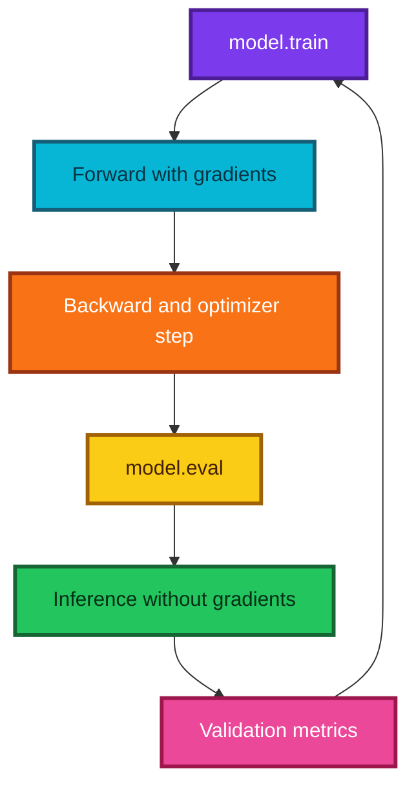

---

## 22. Writing a custom PyTorch module

A PyTorch `nn.Module` can represent a whole network or a reusable component. Subclassing provides parameter registration, recursive device movement, training/evaluation state, serialization support, and module composition.

### Using an existing linear layer inside a custom module

```python
import torch
from torch import nn


class MNISTLogisticRegression(nn.Module):
    """One affine classification layer for 28 x 28 grayscale images."""

    def __init__(self):
        # Initialize nn.Module before assigning child modules or parameters.
        super().__init__()

        # Register an affine map from 784 pixels to ten class logits.
        self.classifier = nn.Linear(28 * 28, 10)

    def forward(self, images):
        # Preserve the batch axis and flatten every remaining image axis.
        flattened = images.flatten(start_dim=1)

        # Return raw logits so CrossEntropyLoss can apply stable log-softmax.
        return self.classifier(flattened)
```

Calling `model(images)` invokes module hooks and then `forward`; call the module rather than invoking `forward` directly.

### Registering the matrix and bias manually

```python
class ManualMNISTLogisticRegression(nn.Module):
    """Expose the affine matrix and broadcast bias explicitly."""

    def __init__(self):
        # Construct the base module so parameter registration is available.
        super().__init__()

        # Wrap tensors in nn.Parameter so optimizers discover them automatically.
        self.weight = nn.Parameter(torch.empty(28 * 28, 10))
        self.bias = nn.Parameter(torch.zeros(10))

        # Xavier initialization is suitable for this simple affine baseline.
        nn.init.xavier_uniform_(self.weight)

    def forward(self, images):
        # Convert B x 1 x 28 x 28 into B x 784.
        flattened = images.flatten(start_dim=1)

        # Multiply by the shared weight matrix and broadcast the class bias.
        return flattened @ self.weight + self.bias
```

### Why `nn.Parameter` matters

An ordinary tensor attribute is not automatically returned by `model.parameters()`. An `nn.Parameter` tells the module that the tensor belongs to the trainable state. Child modules such as `nn.Linear` register their own parameters recursively.

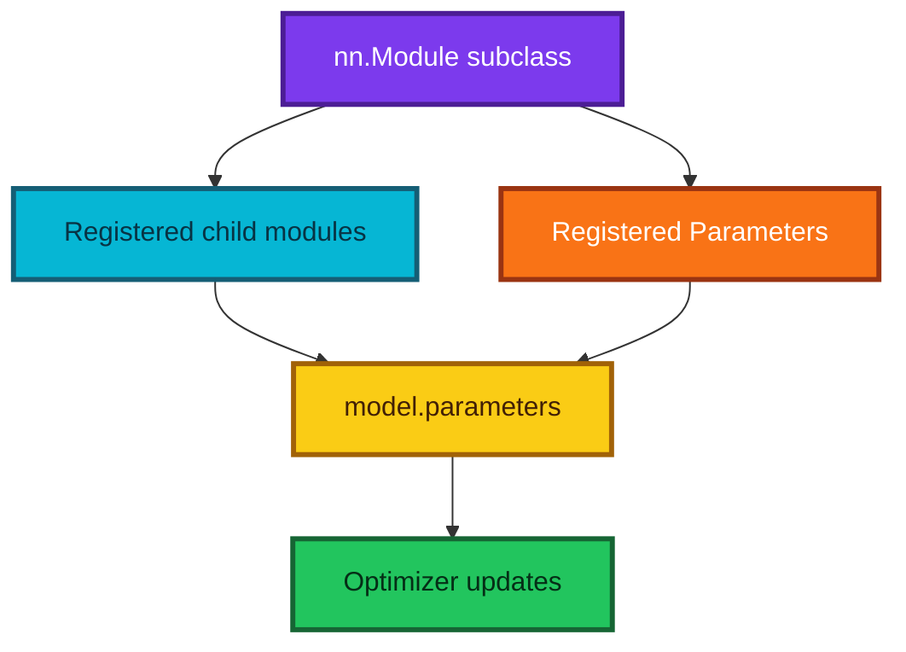

### When to write `forward` yourself

Use a custom module when the computation has:

- branches or skip connections;
- multiple inputs or outputs;
- parameter sharing;
- nontrivial reshaping;
- recurrent state; or
- logic that is clearer in ordinary Python than in `nn.Sequential`.

Use `nn.Sequential` for a simple single-path stack.

---

## 23. Initialization and stable signal scale

### Why initialization matters

In a deep network, each layer transforms activations and gradients. If their variance grows slightly at every layer, values can explode; if it shrinks, values can vanish.

For independent zero-mean inputs and weights,

$$
\operatorname{Var}(z)
\approx
fan_{in}\operatorname{Var}(w)\operatorname{Var}(x).
$$

Choosing weight variance inversely proportional to `fan_in` helps keep scales stable.

### Xavier and Kaiming rules

For Xavier normal initialization,

$$
\operatorname{Std}(w)
=
\sqrt{\frac{2}{fan_{in}+fan_{out}}}.
$$

For Kaiming/He normal initialization with ReLU,

$$
\operatorname{Std}(w)
=
\sqrt{\frac{2}{fan_{in}}}.
$$

The ReLU rule compensates for roughly half of symmetric pre-activations becoming zero.

### Important transcript refinement

The lecture describes dividing random weights by the number of rows. The scale-preserving idea is correct, but the common rule involves a **square root**, and the precise constant depends on the activation and fan convention. Prefer `nn.init.xavier_*` or `nn.init.kaiming_*` rather than reproducing a remembered formula.

### Symmetry breaking

Initializing every hidden unit with identical weights would give identical gradients, causing the units to remain copies. Random initialization breaks that symmetry. Biases can often begin at zero because different random incoming weights already distinguish units.

### Initialization is not normalization

- normalization controls the scale of data or intermediate activations;
- initialization controls the starting distribution of parameters;
- an optimizer controls how parameters move afterward.

They cooperate but solve different problems.

---

## 24. Devices, accelerators, and performance

### Current device landscape

| Backend | Typical hardware | PyTorch device |
|---|---|---|
| CPU | Intel, AMD, Apple | `cpu` |
| CUDA | Supported NVIDIA GPU | `cuda` |
| MPS | Supported Apple silicon or AMD GPU through Metal | `mps` |
| Other accelerators | Platform-dependent | Consult the current PyTorch build documentation |

The transcript's statement that a Mac cannot provide a usable GPU was historically specific. Current PyTorch includes an [MPS backend for macOS](https://docs.pytorch.org/docs/stable/notes/mps.html). CUDA still requires a compatible NVIDIA setup, but portable code should not assume CUDA is the only accelerator.

### GPU speed is workload-dependent

A GPU excels at large, parallel numeric workloads. It may be slower for a tiny model because of:

- device-transfer overhead;
- kernel-launch overhead;
- insufficient parallel work;
- input-pipeline bottlenecks; or
- frequent synchronization.

A $784\times10$ MNIST logistic-regression model is small enough that a CPU is perfectly reasonable for learning and testing.

### Correct device behavior

1. Move the model once with `.to(device)`.
2. Move each batch to the same device.
3. Keep targets on the device expected by the loss.
4. Move tensors back to CPU before NumPy conversion.
5. Synchronize an asynchronous accelerator before trustworthy timing.

```python
# Move predictions to ordinary CPU memory before calling NumPy.
probabilities_numpy = probabilities.detach().cpu().numpy()
```

### Cloud advice ages quickly

Instance names, prices, quotas, prebuilt images, and student-credit programs in the lecture are historical. Check current provider documentation, set a budget alert, shut down idle resources, and avoid embedding cloud credentials in notebooks.

> **Fun fact:** Accelerators are fast partly because they trade general-purpose flexibility for massive parallel arithmetic and specialized memory systems. “Faster hardware” never rescues an incorrect shape or data leak.

---

## 25. Prediction, accuracy, and error analysis

### From logits to labels

For mutually exclusive classes,

$$
\hat y_i=\arg\max_c z_{ic}.
$$

Softmax is needed when probabilities themselves are required, but not for `argmax`.

### Inspect errors, not only the score

A 92% accuracy means 8% of examples are wrong; it does not explain which digits fail or why. Useful diagnostics include:

- confusion matrix;
- per-class recall and precision;
- examples with highest loss;
- confident mistakes;
- uncertain correct predictions;
- accuracy by acquisition source or writer; and
- calibration of reported probabilities.

### Commented confusion-matrix example

```python
import numpy as np
from sklearn.metrics import confusion_matrix


def normalized_confusion_matrix(targets, predictions, number_of_classes):
    """Return counts and row-normalized class-confusion rates."""

    # Place true classes on rows and predicted classes on columns.
    counts = confusion_matrix(
        targets,
        predictions,
        labels=np.arange(number_of_classes),
    )

    # Divide every row by its true-class count while handling absent classes.
    row_total = counts.sum(axis=1, keepdims=True)
    rates = np.divide(
        counts,
        row_total,
        out=np.zeros_like(counts, dtype=float),
        where=row_total != 0,
    )
    return counts, rates


# Analyze the predictions retained by the complete NumPy example.
confusion_counts, confusion_rates = normalized_confusion_matrix(
    y_valid,
    valid_predictions,
    number_of_classes=10,
)
assert confusion_counts.sum() == len(y_valid)
```

### Find the most costly mistakes

```python
# Convert final validation logits to probabilities once.
valid_probabilities = softmax_rows(valid_logits)

# Cross-entropy for each row is negative log probability of its true class.
true_probability = valid_probabilities[np.arange(len(y_valid)), y_valid]
per_example_loss = -np.log(np.clip(true_probability, 1e-12, 1.0))

# Sort from largest to smallest loss so confident mistakes appear first.
worst_indices = np.argsort(per_example_loss)[::-1][:12]

# These images can be passed to a plotting helper with truth and prediction.
worst_images = X_valid[worst_indices]
worst_truth = y_valid[worst_indices]
worst_predictions = valid_predictions[worst_indices]
```

Because the NumPy example standardized its pixels, use the original unscaled image rows—or invert the transform—before displaying them.

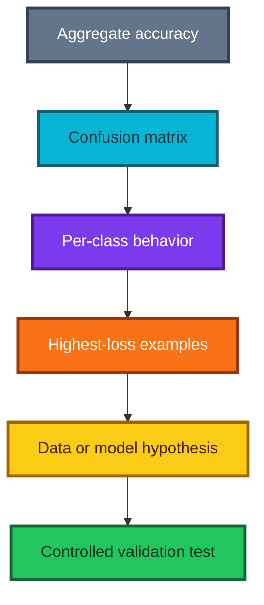

---

## 26. Technical writing as a learning tool

The lecture encourages students to publish technical explanations. Writing is not separate from technical work; it exposes vague reasoning that can remain hidden while code appears to run.

### Why write?

- Explaining a formula reveals which terms you do not yet understand.
- A reproducible example tests whether your knowledge survives outside one notebook.
- Clear writing creates a searchable memory for your future self.
- A public body of work demonstrates communication and judgment, not only syntax.
- Reader questions reveal assumptions and edge cases you missed.

### A useful first-post structure

1. **Problem:** What were you trying to predict or understand?
2. **Data:** What does one row mean, and how was the split designed?
3. **Baseline:** What simple model or rule did you compare against?
4. **Method:** What transformations, architecture, and loss did you use?
5. **Verification:** Which shape checks, tests, and metrics support correctness?
6. **Failures:** Which examples were wrong, and what did they teach you?
7. **Limitations:** What does the experiment not establish?
8. **Reproduction:** Which versions, seeds, and commands are required?

### Protect confidential information

Do not publish employer, patient, customer, student, or partner data merely because names were removed. Small groups, rare combinations, timestamps, and free text can re-identify people. Safer options include:

- ask the data owner and follow the applicable policy;
- reproduce the method with a genuinely open dataset;
- create synthetic examples that contain no real records;
- omit credentials, paths, internal hostnames, and proprietary feature names; and
- have the final draft reviewed when obligations are unclear.

Changing column names is not a complete anonymization strategy.

### A compact article idea from this lesson

“Why `CrossEntropyLoss` wants logits” is enough for a useful post:

- define logits and softmax;
- derive $-z_y+\log\sum_c e^{z_c}$;
- show overflow from naive exponentiation;
- implement the maximum shift;
- compare the result with a library; and
- end with the practical rule: logits into cross-entropy, probabilities only when needed for interpretation.

---

## 27. Transcript claims refined

The transcript captures the intuition and APIs of its recording period. The following refinements separate durable ideas from historical setup details and intentionally simplified statements.

| Transcript idea | More precise modern interpretation | Why it matters |
|---|---|---|
| A random forest is basically nearest neighbors | A forest performs adaptive partitioning and local averaging; it can be interpreted as a learned neighborhood method | The “neighborhood” is defined by tree leaves, not a fixed metric and $k$ |
| Neural networks and forests cover nearly all problems | They are broad families, but linear, boosted, probabilistic, kernel, causal, and mechanistic models remain important | Model choice follows assumptions and constraints, not a universal ranking |
| Arbitrarily numbered categories will eventually be handled | Repeated thresholds can isolate categories, but an artificial order may be inefficient or unstable | Native categorical handling, one-hot features, or embeddings may be better |
| Trees are immune to outliers | Exact splits are invariant to strictly increasing feature transforms, but target outliers, histogram binning, precision, and sparse regions can still matter | “No scaling required” is narrower than “outliers never matter” |
| Images use values 0–255, with dark pixels near 255 | Raw byte values are often 0–255, but visual darkness depends on the dataset and plotting color map; standard MNIST has background near 0 and ink near 255 | Always inspect actual values and a rendered sample |
| Pickle can save nearly any Python object | Pickle is flexible and Python-specific, but unpickling untrusted bytes can execute code | Data loading is a security boundary |
| `-1` in reshape means any size | Exactly one `-1` asks the library to infer the only compatible axis length | Two inferred axes would be ambiguous |
| PyTorch `view` simply means reshape | `view` requires compatible strides; `reshape` may return a view or copy and is safer after non-contiguous operations | A transpose can make `view` fail |
| Validation should use training normalization | Correct—and test and production inputs must reuse the same learned transform | Preprocessing is part of the fitted model |
| Random forests care only about order | This is broadly true for exact univariate numeric split candidates under strictly monotone transforms | Approximate algorithms and data semantics add qualifications |
| Universal approximation means a network can do anything | Suitable networks can approximate broad function classes under stated conditions | It does not guarantee finite-data generalization, efficient size, or successful optimization |
| A linear layer plus softmax is a two-layer neural net | It contains one learned affine layer plus an output transformation; it is multiclass logistic regression | Counting learnable transformations makes model capacity clearer |
| Every linear layer needs a nonlinearity after it | Hidden affine layers generally need nonlinearities; the final layer often intentionally emits raw logits | `CrossEntropyLoss` expects those raw logits |
| Softmax makes probabilities because exponentials are between zero and one | Exponentials are positive but can exceed one; division by their sum produces values in $(0,1)$ | The denominator, not exponentiation alone, normalizes the scores |
| Softmax always returns values strictly between zero and one | That is true mathematically for finite logits; floating-point underflow can produce an exact zero | Stable fused loss functions avoid fragile probability calculations |
| Binary and categorical cross-entropy are literally the same | They are related negative-log-likelihood losses for different target structures; two-class softmax is reparameterizable as logistic regression | Single-label, binary, and multi-label tasks need the right output/loss pairing |
| NLL loss and cross-entropy are the same | `CrossEntropyLoss(logits, target)` is equivalent to `NLLLoss(LogSoftmax(logits), target)` under the corresponding settings | NLLLoss alone expects log-probabilities, not raw scores |
| Divide random weights by the number of input rows | Common variance-preserving rules scale by a square root and depend on activation and fan convention | Wrong scale can cause vanishing or exploding activations |
| Automatic differentiation means calculus is unnecessary | Libraries perform derivative arithmetic, but practitioners still need gradients, chain rule, graph, and optimization intuition | Autograd can faithfully differentiate the wrong computation |
| `.cuda()` is how a model uses a GPU | `.to(device)` is portable across CPU, CUDA, MPS, and other supported backends | Hard-coding CUDA excludes valid environments |
| Macs have no usable GPU for PyTorch | Current PyTorch supports Apple's Metal Performance Shaders backend on compatible systems | Historical hardware advice should not become current policy |
| GPUs are always 10–100 times faster | Speedup depends on model size, batch size, precision, memory traffic, input pipeline, and transfer overhead | Benchmark the actual workload end to end |
| Historical cloud instance, image, quota, and price instructions remain valid | Cloud catalogs and prices change continuously | Use current documentation, budgets, and security controls |
| Similar validation accuracy proves the implementation is equivalent | Accuracy can hide different predictions and calibration | Compare losses, confusion matrices, invariants, and example-level outputs |

---

## 28. Formula sheet

### Tensors and transformations

| Concept | Formula | Use |
|---|---|---|
| Element count | $\operatorname{size}(X)=\prod_k s_k$ | Check reshape compatibility |
| Flattened pixel index | $j=rW+c$ | Map row and column to row-major position |
| Inverse row | $r=\lfloor j/W\rfloor$ | Recover image row |
| Inverse column | $c=j\bmod W$ | Recover image column |
| Standardization | $x'=(x-\mu_{train})/\sigma_{train}$ | Align scale with fitted training transform |
| Matrix product shape | $(B\times D)(D\times C)=B\times C$ | Verify affine-layer dimensions |

### Neural-network forward pass

| Concept | Formula | Meaning |
|---|---|---|
| Affine layer | $Z=XW+b$ | Weighted sums plus broadcast offset |
| ReLU | $\max(0,z)$ | Elementwise nonlinear gate |
| Two-layer MLP | $Z_2=\phi(XW_1+b_1)W_2+b_2$ | Nonlinear learned representation |
| Sigmoid | $\sigma(z)=1/(1+e^{-z})$ | One Bernoulli probability from one logit |
| Softmax | $p_c=e^{z_c}/\sum_k e^{z_k}$ | Categorical probabilities |
| Stable softmax | $p_c=e^{z_c-m}/\sum_k e^{z_k-m}$, $m=\max_kz_k$ | Avoid exponential overflow |

### Losses

| Target structure | Loss |
|---|---|
| Binary | $-[y\log p+(1-y)\log(1-p)]$ |
| Multiclass one-hot | $-\sum_c y_c\log p_c$ |
| Multiclass class index $t$ | $-\log p_t$ |
| Multiclass from logits | $-z_t+\log\sum_c e^{z_c}$ |
| Mean batch CE | $-B^{-1}\sum_i\log p_{i,y_i}$ |

For a one-hot target, the multiclass expression collapses because every term except the true class is multiplied by zero.

### Gradients and optimization

| Concept | Formula |
|---|---|
| Gradient | $\nabla_\theta L=[\partial L/\partial\theta_j]_j$ |
| Gradient-descent update | $\theta\leftarrow\theta-\eta\nabla_\theta L$ |
| Softmax-CE logit gradient | $\partial L/\partial Z=(P-Y)/B$ |
| Affine weight gradient | $\partial L/\partial W=X^T(\partial L/\partial Z)$ |
| Affine bias gradient | $\partial L/\partial b=\sum_i\partial L/\partial Z_i$ |
| Steps per epoch | $\lceil N/B\rceil$ |

### Initialization

| Rule | Typical standard deviation |
|---|---|
| Xavier normal | $\sqrt{2/(fan_{in}+fan_{out})}$ |
| Kaiming normal for ReLU | $\sqrt{2/fan_{in}}$ |

### Parameter counts

A $D\to C$ affine classifier has

$$
DC+C
$$

trainable parameters. For MNIST logistic regression,

$$
784(10)+10=7{,}850.
$$

A $D\to H\to C$ multilayer perceptron has

$$
(DH+H)+(HC+C)
$$

parameters when both affine layers use biases.

### Metrics

$$
\operatorname{accuracy}
=
\frac1N\sum_i\mathbf1(\arg\max_cz_{ic}=y_i).
$$

For class $c$,

$$
\operatorname{recall}_c=\frac{TP_c}{TP_c+FN_c},
\qquad
\operatorname{precision}_c=\frac{TP_c}{TP_c+FP_c}.
$$

---

## 29. Practice exercises

### Tensor fluency

1. Create `np.arange(2 * 3 * 4).reshape(2, 3, 4)`. Predict the shapes of `x[0]`, `x[0:1]`, `x[:, 1]`, `x[..., 2:]`, and `x.transpose(0, 2, 1)` before running them.
2. Convert a synthetic batch from NHWC to NCHW and back. Assert exact equality after the round trip.
3. Flatten a $(7,1,28,28)$ tensor to $(7,784)$ without hard-coding the batch size.
4. Explain why two `-1` values in one reshape would be ambiguous.

### Normalization

5. Create training values with mean 10 and validation values with mean 20. Show that fitting separate means makes both splits appear centered, then explain why that destroys comparability.
6. Add a constant feature to a matrix and make your standardizer handle it without NaN or infinity.
7. Compare a decision tree's partitions before and after a strictly increasing feature transform.

### Probabilities and losses

8. Rewrite BCE with an explicit `if y == 1` branch and verify equality with the vectorized formula.
9. Calculate the loss for a correct-class probability of 0.9, 0.5, 0.1, and 0.001. Plot probability against loss.
10. Implement naive softmax and demonstrate overflow on logits near 10,000. Fix it with the maximum shift.
11. Verify numerically that `argmax(logits) == argmax(softmax(logits))` for random finite rows.
12. Show that adding 100 to every logit in a row does not change softmax.

### Modeling

13. Add an $L_2$ penalty $\lambda\|W\|_2^2$ to the NumPy classifier and derive its weight gradient.
14. Replace full-batch updates with shuffled mini-batches.
15. Add a hidden layer and ReLU to the NumPy model. Derive the additional gradients or use an automatic-differentiation library.
16. Compare the linear model with a tree, nearest-neighbor classifier, and small multilayer perceptron under the same split.

### Interpretation and communication

17. Plot the ten weight columns as $8\times8$ images for the scikit-learn digits example. Describe what each template emphasizes.
18. Find the five most confident mistakes and propose one data hypothesis and one model hypothesis.
19. Write a one-page explanation of why validation preprocessing must be fitted on training data.
20. Reproduce the method on an open dataset and document every shape through the pipeline.

---

## 30. Review questions and answers

### 1. Why can a regression forest not naturally extend a linear target trend?

Its leaves predict averages of observed targets, and the forest averages those values again. It creates piecewise-constant local estimates rather than a numeric continuation rule.

### 2. Does flattening delete image pixels?

No. It preserves values and element count while replacing the explicit height/width axes with one feature axis. Geometry can be recovered if the original order and shape are known.

### 3. What does shape `(128, 1, 28, 28)` mean in a common PyTorch vision pipeline?

There are 128 images, one grayscale channel per image, 28 rows, and 28 columns.

### 4. Why is `x[0]` different from `x[0:1]`?

Integer indexing removes the selected axis; the slice retains it with length one. This matters when a model expects a batch axis.

### 5. Why use `-1` when flattening a batch?

It lets the library infer a changing batch length from the fixed total element count. Code then works for the final smaller batch and for different sampling sizes.

### 6. Why is unpickling an unknown download dangerous?

Pickle can encode instructions that invoke Python objects during deserialization, including malicious code. Use trusted, integrity-checked sources or safer formats.

### 7. Why fit normalization only on training data?

Validation is meant to simulate unseen data. Using its statistics leaks distribution information and gives the same numeric value a different meaning across splits.

### 8. Why do exact decision trees usually not need standardization?

Their candidate numeric partitions depend on sorted order, which a strictly increasing standardization preserves. This does not make all tree implementations or all kinds of outliers irrelevant.

### 9. What is the difference between a weight and a bias?

A weight scales or mixes an input component; a bias adds an offset independent of the current input value. Together they define an affine map.

### 10. Why can several affine layers without activation be replaced by one?

Composition distributes algebraically: the product of their matrices is another matrix, and their transformed biases combine into one bias.

### 11. What does ReLU add?

It creates input-dependent gates and piecewise-linear regions, preventing the entire stack from collapsing to one affine transformation.

### 12. What does universal approximation not promise?

It does not promise that training will find the approximating parameters, that the network is small, that finite data suffice, or that predictions generalize or extrapolate correctly.

### 13. What is a logit?

It is an unconstrained score before conversion to a probability. Logits can be negative, exceed one, and need not sum to anything.

### 14. Why subtract the largest logit before exponentiation?

Softmax is invariant to a shared shift. Making the largest shifted logit zero keeps all exponentials at most one and prevents overflow.

### 15. Why does cross-entropy punish confident errors strongly?

The true-class term is $-\log p_t$, which tends to infinity as the assigned true-class probability tends to zero.

### 16. What inputs should `CrossEntropyLoss` receive?

Usually a `(batch, classes)` tensor of raw logits and a `(batch,)` tensor of integer class indices. Do not softmax logits first.

### 17. When should `BCEWithLogitsLoss` be used instead?

Use it for one binary output or multiple independent labels. Mutually exclusive multiclass classification normally uses `CrossEntropyLoss`.

### 18. What is the difference between `max` and `argmax`?

`max` returns the largest score; `argmax` returns its index, which becomes the predicted class identifier.

### 19. Why clear gradients before each optimizer step?

PyTorch accumulates parameter gradients by default. Without clearing them, later steps unintentionally add new gradients to old ones.

### 20. Why call `model.eval()` during validation?

It switches modules such as dropout and batch normalization into evaluation behavior. Disabling gradient tracking separately reduces memory and prevents accidental backward computations.

### 21. What does `nn.Parameter` do?

It registers a tensor as part of a module's trainable state, allowing device movement, serialization, and optimizers to discover it.

### 22. Why is a GPU not guaranteed to be faster?

Small work may not saturate it, and transfers, kernel launches, input loading, or synchronization can exceed the computation saved.

### 23. Why inspect the confusion matrix after accuracy?

The same overall accuracy can hide very different class failures. The matrix reveals systematic substitutions and classes with poor recall.

### 24. Why can technical writing improve a model?

Writing forces assumptions, shapes, data provenance, and limitations into explicit statements. That often exposes errors before a more complex experiment does.

---

## 31. Practical checklist

### Data and shapes

- [ ] Define what one example and one label mean.
- [ ] Print split sizes, shapes, dtypes, ranges, and class counts.
- [ ] Confirm batch, channel, height, and width order.
- [ ] Visualize raw and transformed examples.
- [ ] Assert feature/label lengths match and values are finite.
- [ ] Treat any pickle or model file as a security-sensitive input.

### Preprocessing

- [ ] Fit normalization, imputation, vocabularies, and encoders on training data only.
- [ ] Reuse the same fitted transformation for validation, test, and production.
- [ ] Handle zero-variance features explicitly.
- [ ] Put transformations inside cross-validation folds when comparing models.
- [ ] Use the documented preprocessing for pretrained models.

### Model and loss

- [ ] Write every intermediate shape before coding.
- [ ] Verify the final output width equals the number of classes.
- [ ] Match binary, multiclass, or multi-label targets to the correct loss.
- [ ] Feed raw logits to `CrossEntropyLoss` or `BCEWithLogitsLoss`.
- [ ] Use nonlinear activations between hidden affine layers.
- [ ] Start with a simple baseline before adding depth.

### Training

- [ ] Move model, inputs, and targets to compatible devices.
- [ ] Call `model.train()` for training and `model.eval()` for evaluation.
- [ ] Clear gradients, run forward, calculate loss, backpropagate, and step—in that order.
- [ ] Track training and validation loss as well as the headline metric.
- [ ] Seed experiments while documenting that exact reproducibility can depend on platform.
- [ ] Save the configuration and preprocessing state with the model.

### Evaluation

- [ ] Keep final test data untouched until modeling decisions are fixed.
- [ ] Compare against a naive baseline and a linear baseline.
- [ ] Inspect confusion matrices and per-class metrics.
- [ ] Visualize highest-loss and most confident mistakes.
- [ ] Check probability calibration when decisions use confidence.
- [ ] Report uncertainty, failure groups, and distribution-shift risks.

### Performance and communication

- [ ] Profile the end-to-end workload before renting or buying hardware.
- [ ] Keep cloud budgets, shutdown rules, and credentials under control.
- [ ] Make examples reproducible with versions and seeds.
- [ ] Use open or synthetic data for public explanations unless publication is approved.
- [ ] State what the experiment does not prove.

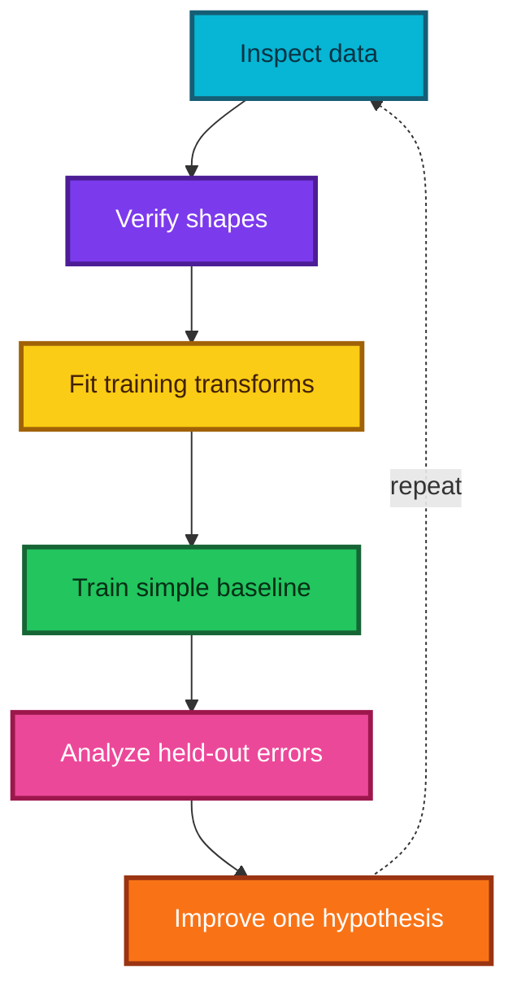

---

## 32. Resources

### Primary lesson

- [Machine Learning 1: Lesson 8 — YouTube](https://www.youtube.com/watch/DzE0eSdy5Hk)

### PyTorch and TorchVision

- [PyTorch quickstart](https://docs.pytorch.org/tutorials/beginner/basics/quickstart_tutorial.html) — current end-to-end beginner workflow.
- [Datasets and DataLoaders](https://docs.pytorch.org/tutorials/beginner/basics/data_tutorial.html) — data abstractions and batching.
- [Building neural-network models](https://docs.pytorch.org/tutorials/beginner/basics/buildmodel_tutorial.html) — modules, parameters, and forward computations.
- [Automatic differentiation](https://docs.pytorch.org/tutorials/beginner/basics/autogradqs_tutorial.html) — computational graphs and gradients.
- [Optimization loop](https://docs.pytorch.org/tutorials/beginner/basics/optimization_tutorial.html) — epochs, batches, losses, and optimizer steps.
- [`CrossEntropyLoss`](https://docs.pytorch.org/docs/stable/generated/torch.nn.CrossEntropyLoss.html) — raw-logit and target conventions.
- [`BCEWithLogitsLoss`](https://docs.pytorch.org/docs/stable/generated/torch.nn.BCEWithLogitsLoss.html) — stable sigmoid plus binary cross-entropy.
- [MNIST dataset class](https://docs.pytorch.org/vision/stable/generated/torchvision.datasets.MNIST.html) — current TorchVision loader.
- [MPS backend](https://docs.pytorch.org/docs/stable/notes/mps.html) — accelerator support on compatible macOS systems.
- [PyTorch reproducibility notes](https://docs.pytorch.org/docs/stable/notes/randomness.html) — seeds and nondeterministic operations.
- [Current fastai documentation](https://docs.fast.ai/) — modern high-level library documentation.

### Arrays and serialization

- [NumPy array-manipulation routines](https://numpy.org/doc/stable/reference/routines.array-manipulation.html) — reshape, transpose, and axis operations.
- [NumPy indexing guide](https://numpy.org/doc/stable/user/basics.indexing.html) — slices and multidimensional selection.
- [NumPy copies and views](https://numpy.org/doc/stable/user/basics.copies.html) — when transformations share or copy memory.
- [Python pickle documentation](https://docs.python.org/3/library/pickle.html) — compatibility, supported objects, and the untrusted-data warning.

### Mathematical intuition

- [Neural Networks and Deep Learning](https://neuralnetworksanddeeplearning.com/) by Michael Nielsen.
- [A visual proof that neural networks can compute any function](https://neuralnetworksanddeeplearning.com/chap4.html) — universality intuition referenced in the lecture.

### Suggested study order

1. Predict the result of every shape operation in Sections 6–7 before running it.
2. Derive softmax cross-entropy from logits on paper.
3. Run and modify the complete NumPy classifier.
4. Recreate the same affine model as a custom PyTorch module.
5. Add one hidden ReLU layer and compare held-out errors.
6. Write a short explanation of the most surprising failure case.

---

## Final takeaway

A digit classifier begins with ordinary numbers. Shape gives those numbers meaning; normalization gives them a consistent scale; an affine map produces class evidence; a nonlinear network can learn richer representations; cross-entropy turns evidence into a trainable objective; and gradients update the parameters. The essential habit is to keep every transition visible and testable.

> **Know the shape, know the target structure, keep logits and probabilities distinct, and let validation—not architectural enthusiasm—decide whether added complexity helps.**
