# Practical Machine Learning, Lesson 9

## Broadcasting, neural-network composition, SGD, and backpropagation from first principles

> Detailed study notes based on **Machine Learning 1: Lesson 9**, expanded with derivations, worked examples, current PyTorch conventions, executable NumPy implementations, and corrections for historical APIs or transcript slips.

**Primary source:** [Watch Lesson 9 on YouTube](https://www.youtube.com/watch/PGC0UxakTvM)

---

## Learning objectives

By the end of this guide, you should be able to:

1. explain how visualization can reveal a model more effectively than raw numbers;
2. describe the top-down strategy of removing one machine-learning abstraction at a time;
3. track MNIST shapes from a mini-batch through a logistic-regression classifier;
4. build a current custom PyTorch `nn.Module` and register its parameters;
5. distinguish parameters, gradients, activations, logits, probabilities, and predictions;
6. explain Python iterables, iterators, generators, and PyTorch `DataLoader` objects;
7. add a hidden layer and prove why a nonlinear activation is necessary;
8. choose sensible hidden and output activations for different target structures;
9. replace scalar Python loops with elementwise vectorized operations;
10. apply NumPy/PyTorch broadcasting rules to high-rank tensors;
11. construct outer operations, grids, matrix-vector products, and matrix products using broadcasting;
12. write the essential training loop: zero gradients, forward, loss, backward, and update;
13. derive stochastic gradient descent and understand the learning-rate trade-off; and
14. explain backpropagation as reverse-mode chain-rule evaluation on a computation graph.

---

## Table of contents

- [1. Lesson map](#1-lesson-map)
- [2. Learning through visualization and publication](#2-learning-through-visualization-and-publication)
- [3. The top-down deconstruction strategy](#3-the-top-down-deconstruction-strategy)
- [4. MNIST shape audit: 784, not 768](#4-mnist-shape-audit-784-not-768)
- [5. Logistic regression as the baseline network](#5-logistic-regression-as-the-baseline-network)
- [6. Building a custom `nn.Module`](#6-building-a-custom-nnmodule)
- [7. Parameters, activations, logits, and gradients](#7-parameters-activations-logits-and-gradients)
- [8. DataLoader, iterable, iterator, and generator](#8-dataloader-iterable-iterator-and-generator)
- [9. Current autograd: tensors replace `Variable`](#9-current-autograd-tensors-replace-variable)
- [10. Modules behave like composable functions](#10-modules-behave-like-composable-functions)
- [11. Adding a hidden layer](#11-adding-a-hidden-layer)
- [12. Why the nonlinearity is essential](#12-why-the-nonlinearity-is-essential)
- [13. Hidden activation functions](#13-hidden-activation-functions)
- [14. Match the output layer to the target and loss](#14-match-the-output-layer-to-the-target-and-loss)
- [15. `argmax`, probabilities, and accuracy](#15-argmax-probabilities-and-accuracy)
- [16. Elementwise operations and vectorization](#16-elementwise-operations-and-vectorization)
- [17. Where vectorized speed comes from](#17-where-vectorized-speed-comes-from)
- [18. Broadcasting intuition: virtual expansion](#18-broadcasting-intuition-virtual-expansion)
- [19. Formal broadcasting rules](#19-formal-broadcasting-rules)
- [20. Unit axes: choosing rows versus columns](#20-unit-axes-choosing-rows-versus-columns)
- [21. Per-channel statistics and layout awareness](#21-per-channel-statistics-and-layout-awareness)
- [22. Outer operations and coordinate grids](#22-outer-operations-and-coordinate-grids)
- [23. Deriving matrix-vector multiplication from primitives](#23-deriving-matrix-vector-multiplication-from-primitives)
- [24. Deriving matrix-matrix multiplication](#24-deriving-matrix-matrix-multiplication)
- [25. A tested NumPy matrix-multiplication function](#25-a-tested-numpy-matrix-multiplication-function)
- [26. Anatomy of one modern PyTorch training step](#26-anatomy-of-one-modern-pytorch-training-step)
- [27. Stochastic gradient descent and the learning rate](#27-stochastic-gradient-descent-and-the-learning-rate)
- [28. A complete train-and-evaluate loop](#28-a-complete-train-and-evaluate-loop)
- [29. Backpropagation and the chain rule](#29-backpropagation-and-the-chain-rule)
- [30. From-scratch one-hidden-layer classifier](#30-from-scratch-one-hidden-layer-classifier)
- [31. Transcript claims refined](#31-transcript-claims-refined)
- [32. Formula sheet](#32-formula-sheet)
- [33. Practice exercises](#33-practice-exercises)
- [34. Review questions and answers](#34-review-questions-and-answers)
- [35. Practical checklist](#35-practical-checklist)
- [36. Resources](#36-resources)

---

## Notation

| Symbol | Meaning |
|---|---|
| $B$ | Mini-batch size |
| $D$ | Number of input features; $D=28\cdot28=784$ for flattened MNIST |
| $H$ | Number of hidden units |
| $C$ | Number of output classes; $C=10$ for digits |
| $X\in\mathbb R^{B\times D}$ | Input mini-batch |
| $W_1\in\mathbb R^{D\times H}$ | First-layer weights |
| $b_1\in\mathbb R^H$ | First-layer bias |
| $W_2\in\mathbb R^{H\times C}$ | Output-layer weights |
| $b_2\in\mathbb R^C$ | Output bias |
| $z$ | Pre-activation or output logits, depending on context |
| $h$ | Hidden activations |
| $L$ | Scalar loss |
| $\theta$ | All trainable parameters |
| $\eta$ | Learning rate |

---

## 1. Lesson map

Lesson 9 connects mathematical notation, array programming, and neural-network training. The lecture first reveals the model's objects, then reveals the tensor operations, and finally reveals the optimizer loop.

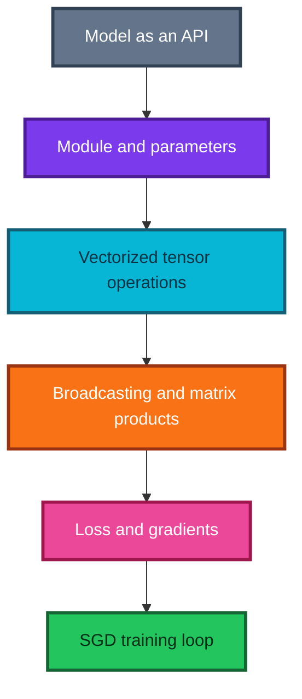

### The central habit

When code feels magical, do not remove all abstraction at once. Replace one component, preserve a reference result, test equivalence, and only then open the next component.

---

## 2. Learning through visualization and publication

The lesson begins by showcasing student work. These examples are not a digression: they demonstrate how understanding becomes deeper when a learner visualizes, implements, combines, packages, and explains an idea.

### Visualizing a decision tree and bagging

A regression tree partitions a two-dimensional feature plane into regions $R_1,\ldots,R_K$. Inside region $R_k$, it predicts the mean target:

$$
\hat f(x)=\bar y_k
=
\frac{1}{|R_k|}\sum_{i:x_i\in R_k}y_i.
$$

Coloring each region by $\bar y_k$ turns an abstract piecewise-constant function into a visible surface. If $T$ resampled trees produce surfaces $\hat f_1,\ldots,\hat f_T$, bagging is simply the pixelwise/modelwise average

$$
\hat f_{bag}(x)=\frac1T\sum_{t=1}^{T}\hat f_t(x).
$$

The individual hard boundaries become a smoother-looking average because different resamples place boundaries in slightly different locations.

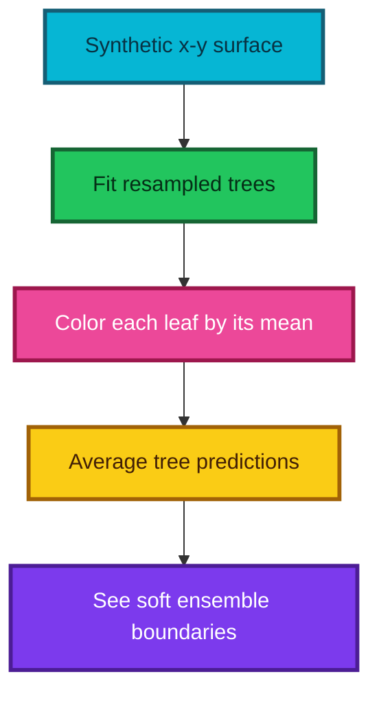

### Why color can beat printed numbers

Human vision is good at detecting spatial boundaries and color differences. A table of predictions can be numerically exact yet perceptually opaque. Good visual encodings turn comparison into a pre-attentive task: the viewer sees a pattern before consciously calculating it.

Use color responsibly:

- choose a perceptually uniform sequential map for ordered magnitudes;
- use a diverging map only around a meaningful midpoint;
- avoid rainbow maps that create artificial boundaries;
- include a legend and numeric range; and
- check color-vision accessibility and grayscale legibility.

### Combining and packaging ideas

The showcased projects combined hyperparameter search, validation design, SGD classifiers, permutation importance, tree contributions, waterfall charts, domain-specific radar visualization, and neural networks. The general workflow is:

1. solve one real inconvenience;
2. make the smallest reliable API;
3. add examples, tests, documentation, and a README;
4. compare with a trusted reference; and
5. publish only data and code you are allowed to share.

### Technical writing strengthens technical thinking

A useful first article can be small: explain one difficult concept, reproduce one bug fix, visualize one algorithm, or summarize one lesson. Writing forces unstated assumptions into sentences. Public approval is pleasant, but the deeper benefit is discovering whether the explanation survives another person's questions.

---

## 3. The top-down deconstruction strategy

The notebook begins with high-level fastai/PyTorch components and gradually replaces them:

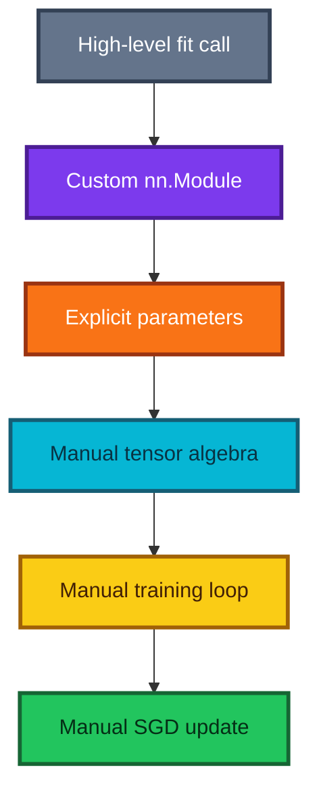

Two valuable services remain delegated to PyTorch:

- efficient tensor kernels on supported hardware; and
- automatic differentiation through recorded tensor operations.

This is a sound learning boundary. Reimplementing a matrix product teaches broadcasting; reimplementing a mature reverse-mode autodiff engine or GPU kernel runtime is a different course.

### Equivalence ladder

At each stage, verify:

- output shape;
- parameter count;
- loss on a fixed mini-batch;
- gradients on a tiny numerical example;
- prediction agreement or expected tolerance; and
- held-out accuracy under the same split.

---

## 4. MNIST shape audit: 784, not 768

An MNIST image has $28\times28$ pixels:

$$
28\cdot28=784.
$$

The transcript repeatedly says `768` during the whiteboard explanation. That is a spoken/transcription error. Every linear layer for flattened MNIST must use 784 input features unless preprocessing has intentionally changed the image.

For a mini-batch of 64 images:

$$
X\in\mathbb R^{64\times784}.
$$

For ten digit classes:

$$
W\in\mathbb R^{784\times10},
\qquad
b\in\mathbb R^{10}.
$$

Therefore

$$
XW+b\in\mathbb R^{64\times10}.
$$

### Shape assertions prevent quiet conceptual errors

```python
import numpy as np

# Simulate a normalized mini-batch of 64 flattened 28 x 28 images.
X_batch = np.zeros((64, 28 * 28), dtype=np.float32)

# Create one weight column and one bias value for each digit class.
weights = np.zeros((28 * 28, 10), dtype=np.float32)
bias = np.zeros(10, dtype=np.float32)

# The inner dimensions 784 and 784 match; bias broadcasts across rows.
logits = X_batch @ weights + bias
assert X_batch.shape == (64, 784)
assert weights.shape == (784, 10)
assert logits.shape == (64, 10)
```

> **Fun fact:** Shape annotations act like lightweight types for numerical programs. Many “math errors” are really unexpressed shape assumptions.

---

## 5. Logistic regression as the baseline network

Multiclass logistic regression computes raw class scores

$$
Z=XW+b,
$$

then conceptually maps each row to categorical probabilities

$$
p_{ic}=\frac{e^{z_{ic}}}{\sum_{k=1}^{C}e^{z_{ik}}}.
$$

During current PyTorch training, the model usually returns **raw logits** and `CrossEntropyLoss` performs stable log-softmax plus negative log-likelihood internally. Applying softmax inside the model is useful for explanation or inference probabilities, but not before `CrossEntropyLoss`.

### Parameter count

The baseline has

$$
784\cdot10+10=7{,}850
$$

trainable scalars.

### What it can learn

Each class column of $W$ is a global pixel template. The difference between two class scores is linear in the pixels, so every pairwise decision boundary is a hyperplane. It cannot first learn reusable stroke features; that motivates a hidden layer.

### Current concise PyTorch form

```python
from torch import nn

# Flatten each image and emit ten raw scores with one learned affine map.
logistic_model = nn.Sequential(
    nn.Flatten(),
    nn.Linear(28 * 28, 10),
)

# This fused loss expects logits and integer class indices.
loss_function = nn.CrossEntropyLoss()
```

---

## 6. Building a custom `nn.Module`

`nn.Module` is the base class for PyTorch models and reusable layers. It manages child modules, registered parameters, device movement, training/evaluation state, hooks, and serialization.

```python
import torch
from torch import nn


class ManualLogisticRegression(nn.Module):
    """A transparent 784-to-10 affine classifier."""

    def __init__(self):
        # Initialize nn.Module before assigning parameters or child modules.
        super().__init__()

        # Allocate the affine matrix and bias as trainable registered state.
        self.weight = nn.Parameter(torch.empty(28 * 28, 10))
        self.bias = nn.Parameter(torch.zeros(10))

        # Use a maintained initialization routine instead of an ad hoc scale.
        nn.init.xavier_uniform_(self.weight)

    def forward(self, images):
        # Accept either flattened rows or image tensors with a batch axis.
        flattened = images.flatten(start_dim=1)

        # Return logits; the loss will apply the stable probability transform.
        return flattened @ self.weight + self.bias


# Instantiate the module; call model(inputs), not model.forward(inputs), in use.
model = ManualLogisticRegression()
```

### Why call `model(x)` instead of `model.forward(x)`?

`nn.Module.__call__` coordinates hooks and framework behavior before and after invoking `forward`. Calling `forward` directly bypasses that machinery.

### Shape and registration tests

```python
# A tiny batch should yield one row of ten logits per image.
example_images = torch.zeros(4, 1, 28, 28)
example_logits = model(example_images)
assert example_logits.shape == (4, 10)

# Both manually created tensors must be visible to the optimizer.
registered = dict(model.named_parameters())
assert set(registered) == {"weight", "bias"}
assert registered["weight"].requires_grad
```

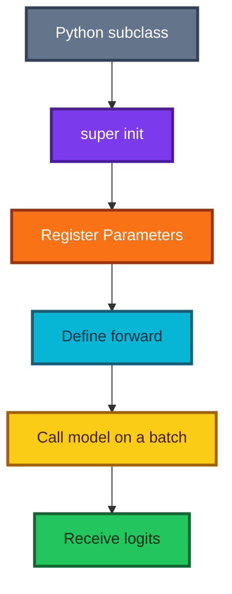

---

## 7. Parameters, activations, logits, and gradients

These words describe different objects:

| Object | What it is | Example shape | Changes how? |
|---|---|---:|---|
| Parameter | Persistent trainable state | $W:(784,10)$ | Optimizer updates it |
| Bias parameter | Trainable offset | $b:(10,)$ | Optimizer updates it |
| Activation | Value calculated during a forward pass | $h:(B,H)$ | Recomputed for every batch |
| Logit | Unconstrained final class score | $z:(B,10)$ | Recomputed for every batch |
| Probability | Normalized output interpretation | $p:(B,10)$ | Derived from logits |
| Gradient | Loss sensitivity for a parameter | same shape as parameter | Backward computes/accumulates it |

For one hidden layer,

$$
z_1=XW_1+b_1,
\qquad
h=\operatorname{ReLU}(z_1),
\qquad
z_2=hW_2+b_2.
$$

Here $W_1,b_1,W_2,b_2$ are parameters; $z_1,h,z_2$ are activations; $z_2$ is also specifically the logit matrix.

### Parameters default to gradient tracking

An `nn.Parameter` is a tensor registered as trainable module state and normally has `requires_grad=True`. An ordinary tensor assigned as an attribute is not automatically a parameter.

---

## 8. DataLoader, iterable, iterator, and generator

The transcript uses these terms informally. Their precise relationship is useful:

- an **iterable** can create an iterator with `iter(obj)`;
- an **iterator** has state and returns the next value with `next(iterator)`;
- a **generator** is one kind of iterator, usually created by a function containing `yield` or a generator expression;
- a PyTorch **DataLoader** is an iterable that creates an iterator yielding mini-batches.

```python
# A generator function pauses at each yield and resumes on the next request.
def squares(limit):
    """Yield one square at a time without building a complete list."""

    for value in range(limit):
        yield value * value


# The generator object is already an iterator.
square_iterator = squares(4)
assert next(square_iterator) == 0
assert next(square_iterator) == 1

# A for loop repeatedly requests next values until iteration ends.
remaining = list(square_iterator)
assert remaining == [4, 9]
```

### Mini-batch iteration

```python
# DataLoader is iterable; calling iter creates one pass with its own state.
batch_iterator = iter(train_loader)

# next returns one feature batch and its corresponding label batch.
images, labels = next(batch_iterator)
print(images.shape, labels.shape)

# The usual readable form asks Python to handle iteration automatically.
for images, labels in train_loader:
    # Training code consumes one mini-batch here.
    pass
```

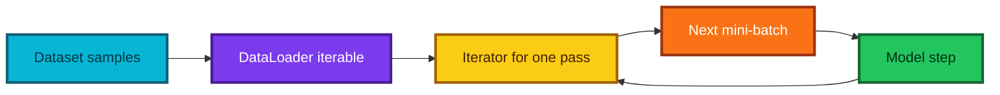

One iterator is exhausted after one pass. A new `for` loop over the `DataLoader` creates a fresh iterator for the next epoch.

---

## 9. Current autograd: tensors replace `Variable`

The historical lecture wraps tensors in `Variable`. Current PyTorch has merged `Variable` into `Tensor`; the official autograd documentation states that the old `Variable` API is deprecated.

Use a tensor's `requires_grad` flag:

```python
import torch

# Request gradient tracking for a leaf tensor whose sensitivity we want.
x = torch.tensor(3.0, requires_grad=True)

# Autograd records supported operations that connect x to this scalar loss.
loss = (x - 5.0) ** 2

# Reverse-mode differentiation stores d(loss)/d(x) in x.grad.
loss.backward()
assert torch.allclose(x.grad, torch.tensor(-4.0))
```

### Inputs and labels usually do not require gradients

To train a model, its parameters require gradients. Input images generally do **not**, because we are not optimizing the pixels. Integer class labels cannot meaningfully require gradients. Autograd still computes parameter gradients because the logits depend on the parameters.

Set `requires_grad=True` on inputs only for a reason such as saliency, adversarial perturbations, or differentiating through an upstream learnable computation.

### What the graph stores

Autograd records the operations and saved intermediate values needed for the backward pass. This costs memory. During evaluation, use `torch.inference_mode()` so the framework can skip gradient bookkeeping.

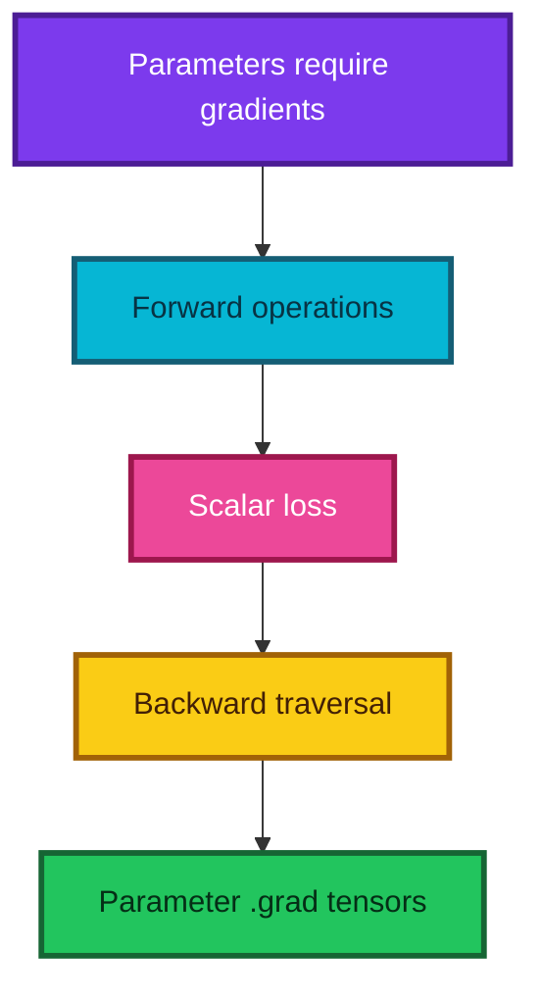

---

## 10. Modules behave like composable functions

A layer, a loss, and a complete model are Python callable objects. This common interface makes complex architectures composable:

$$
f(x)=f_L(f_{L-1}(\cdots f_2(f_1(x))\cdots)).
$$

`nn.Sequential` represents exactly such a single-path composition.

### Why this design is powerful

- A small custom layer can be inserted into a larger network.
- A complete trained network can become one component of another system.
- The same module interface supports device movement, parameter discovery, and train/eval state recursively.
- Hooks and wrappers work because callers use `module(x)` consistently.

Composition does not mean every Python function is automatically an `nn.Module`; only registered modules and parameters become part of module state. Plain functions can still appear inside a custom `forward` calculation.

---

## 11. Adding a hidden layer

Logistic regression sends the 784 input measurements directly to 10 output scores. A hidden layer first learns 100 intermediate features:

$$
X_{B\times784}
\xrightarrow{W_1,b_1}
Z_{B\times100}
\xrightarrow{\operatorname{ReLU}}
H_{B\times100}
\xrightarrow{W_2,b_2}
S_{B\times10}.
$$

Here, $B$ is the batch size, $H$ contains hidden activations, and $S$ contains logits. The number 100 is a **hyperparameter**, not a mathematical requirement.


### Parameter count

For `Linear(n_in, n_out)`, there are

$$
n_{\text{in}}n_{\text{out}}+n_{\text{out}}
$$

trainable scalars: one weight for every input-output connection and one bias per output. Therefore:

$$
(784\cdot100+100)+(100\cdot10+10)=79{,}510.
$$

The logistic baseline has only $784\cdot10+10=7{,}850$ parameters. The hidden model has more capacity, but capacity alone does not guarantee better generalization.

```python
from torch import nn

# Flatten each 28 x 28 image before applying fully connected layers.
hidden_model = nn.Sequential(
    nn.Flatten(),
    nn.Linear(28 * 28, 100),
    nn.ReLU(),
    nn.Linear(100, 10),  # Return raw class logits; CrossEntropyLoss applies log-softmax.
)
```

**When is this useful?** A small multilayer perceptron is a strong educational baseline and can work well for tabular data or already-extracted features. For natural images, convolutional or vision-transformer architectures usually exploit spatial structure more effectively.

---

## 12. Why the nonlinearity is essential

Suppose we stack two affine layers with nothing nonlinear between them:

$$
H=XW_1+b_1,
\qquad
Y=HW_2+b_2.
$$

Substituting the first equation into the second gives

$$
Y=(XW_1+b_1)W_2+b_2
 =X(W_1W_2)+(b_1W_2+b_2).
$$

Let $W'=W_1W_2$ and $b'=b_1W_2+b_2$. Then $Y=XW'+b'$—just one affine layer. Depth has added parameters but no new kind of decision boundary.

A nonlinear activation $\phi$ prevents this collapse:

$$
Y=\phi(XW_1+b_1)W_2+b_2.
$$

With ReLU, different hidden units switch on in different regions. The network builds a **piecewise-linear** function made from many affine pieces.

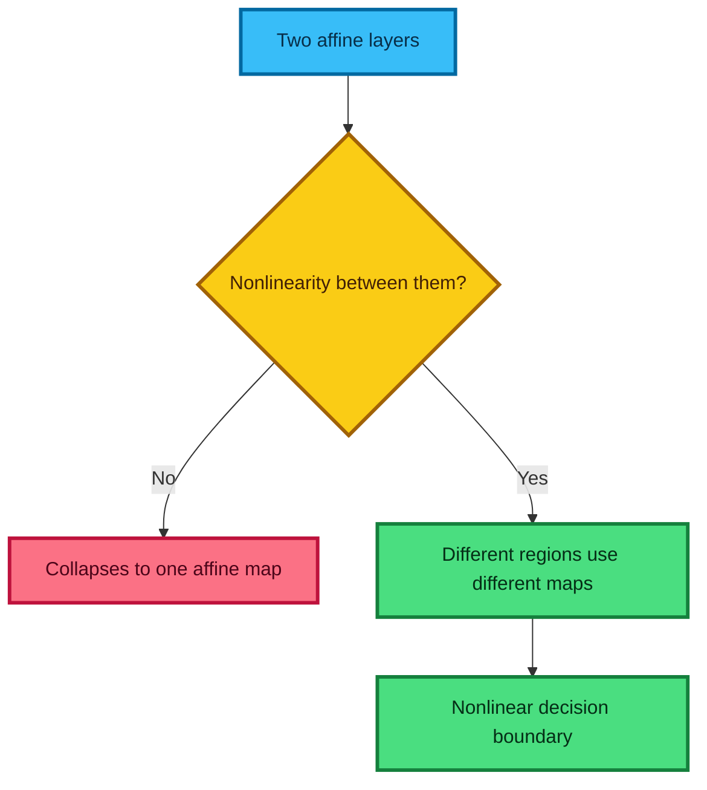

### Intuition: folding the feature space

Each affine layer rotates, stretches, shifts, and projects the representation. An activation can gate or bend that representation. Repeating the pair lets later layers solve a simpler problem in the transformed space.

> **Fun fact:** although a ReLU network is nonlinear as a whole, it is exactly affine inside each fixed activation pattern. That is why its output often looks like connected flat planes or line segments.

---

## 13. Hidden activation functions

An **activation function** is the rule; an **activation** is often the value produced by that rule. The terminology is commonly blurred, so check the context.

| Function | Formula | Why use it? | Main caution |
|---|---|---|---|
| ReLU | $\max(0,x)$ | Simple, fast, and preserves positive gradients | Negative inputs have zero gradient; units can become inactive |
| Leaky ReLU | $\max(x,\alpha x)$, usually small $\alpha>0$ | Keeps a small negative-side gradient | The slope $\alpha$ is another design choice |
| ELU | $x$ if $x>0$, else $\alpha(e^x-1)$ | Smooth negative saturation and negative outputs | More expensive than ReLU |
| GELU | $x\Phi(x)$ | Smooth gating; common in transformers | Uses a more involved computation or approximation |
| SiLU/Swish | $x\sigma(x)$ | Smooth and non-monotonic near zero; common in modern networks | More expensive than ReLU |

Here $\Phi$ is the standard-normal cumulative distribution function and $\sigma(x)=1/(1+e^{-x})$.

### How to choose

- Start with the convention of a strong architecture for the task.
- ReLU remains a sensible baseline for a small multilayer perceptron.
- GELU is common in transformer-style models; SiLU is common in several modern convolutional models.
- If many ReLU units remain exactly zero, inspect initialization, learning rate, and data scaling before changing activation blindly.
- Treat claims that one activation is universally “best” as historical snapshots, not laws.

```python
import torch
from torch import nn

# Evaluate several activations on the same illustrative input values.
x = torch.tensor([-2.0, -0.5, 0.0, 0.5, 2.0])
outputs = {
    "relu": nn.ReLU()(x),
    "leaky_relu": nn.LeakyReLU(negative_slope=0.1)(x),
    "gelu": nn.GELU()(x),
    "silu": nn.SiLU()(x),
}
```

---

## 14. Match the output layer to the target and loss

The last layer answers a different question from a hidden activation. Hidden activations shape representations; the output and loss encode what a valid prediction means.

| Task | Model output | Recommended training loss | Prediction interpretation |
|---|---|---|---|
| One of $C$ classes | $C$ raw logits | `CrossEntropyLoss` | `argmax(logits)`; softmax for probabilities |
| Binary classification | One raw logit | `BCEWithLogitsLoss` | sigmoid probability; threshold when needed |
| Multi-label classification | $C$ raw logits | `BCEWithLogitsLoss` | independent sigmoid probability per label |
| Unbounded regression | One or more raw values | MSE, MAE, Huber, or a task-specific loss | direct numeric prediction |
| Bounded regression | Task-dependent transformed output | Task-dependent | use a transformation only when the bound is real |

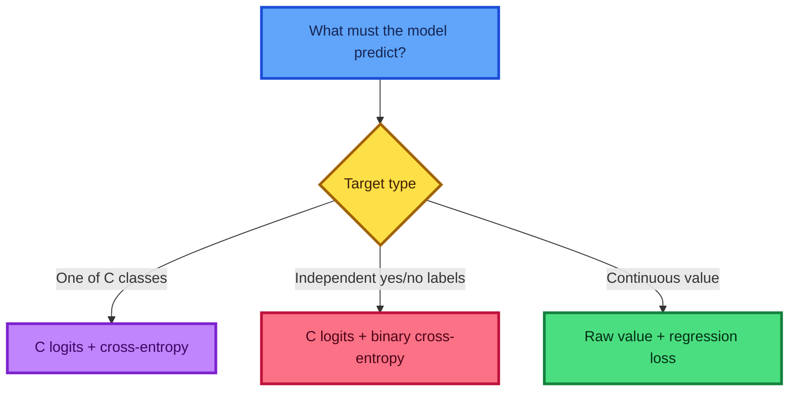

### Softmax is coupled across a vector

For logits $z_1,\ldots,z_C$,

$$
\operatorname{softmax}(z)_i=\frac{e^{z_i}}{\sum_{j=1}^{C}e^{z_j}}.
$$

Changing one logit changes every probability because every output shares the denominator. Softmax is therefore **not** an independent scalar-to-scalar activation. In current PyTorch, pass logits directly to `CrossEntropyLoss`; it combines log-softmax with negative log-likelihood in a numerically stable way.

---

## 15. `argmax`, probabilities, and accuracy

Softmax preserves ordering: the largest logit also has the largest softmax probability. Therefore classification does not require softmax:

$$
\arg\max_i z_i=\arg\max_i\operatorname{softmax}(z)_i.
$$

Current PyTorch provides `torch.argmax`. `torch.max(..., dim=...)` is still useful when both the maximum values and their positions are needed.

```python
import torch

# Each row contains three raw class scores for one sample.
logits = torch.tensor([[1.2, -0.5, 3.1], [2.0, 2.5, 0.1]])
labels = torch.tensor([2, 0])

# Select the class index with the largest score in each row.
predictions = torch.argmax(logits, dim=1)

# Accuracy is the mean of a Boolean correct/incorrect indicator.
accuracy = (predictions == labels).float().mean()
assert torch.isclose(accuracy, torch.tensor(0.5))

# Compute probabilities only when calibrated confidence values are required.
probabilities = torch.softmax(logits, dim=1)
```

For $N$ labeled examples,

$$
\operatorname{accuracy}=\frac{1}{N}\sum_{i=1}^{N}\mathbf{1}(\hat y_i=y_i).
$$

**Caution:** accuracy can be misleading for imbalanced data, unequal mistake costs, or confidence-sensitive applications. Consider precision/recall, a confusion matrix, calibration, and a task-specific cost.

---

## 16. Elementwise operations and vectorization

An elementwise operation applies the same rule independently at corresponding positions:

$$
(A+B)_{ij}=A_{ij}+B_{ij},
\qquad
(A\odot B)_{ij}=A_{ij}B_{ij}.
$$

The symbol $\odot$ denotes elementwise multiplication, whereas $AB$ usually denotes matrix multiplication.

**Vectorization** means expressing a collection of operations through array primitives instead of writing a Python loop for each scalar. The arrays need not be mathematical vectors; the term also covers matrices and higher-rank tensors.

```python
import numpy as np

# Build a small matrix for elementwise examples.
a = np.array([[1.0, -2.0, 3.0], [4.0, 0.0, -6.0]])

# Apply scalar arithmetic independently to every element.
shifted = a + 10.0
squared = a**2

# Comparisons also operate elementwise and return a Boolean array.
positive_mask = a > 0

# Boolean means are useful because True behaves like 1 and False like 0.
positive_fraction = positive_mask.mean()
assert np.isclose(positive_fraction, 0.5)

# Boolean indexing selects all positive values without a scalar Python loop.
positive_values = a[positive_mask]
```

### Why it matters

- Array expressions often state the mathematics more directly.
- Optimized numeric libraries execute inner loops in compiled code.
- Fewer Python-level operations usually reduce interpreter overhead.
- The same expression can often run on CPU or accelerator tensors.

Vectorization is a tool, not a commandment. A clear loop may be best for irregular control flow, and a vectorized expression that creates a huge temporary can exhaust memory.

---

## 17. Where vectorized speed comes from

The transcript gives dramatic fixed speed ratios. Those numbers are useful motivation, but real speedup depends on shapes, data types, hardware, memory traffic, library kernels, and transfer overhead.

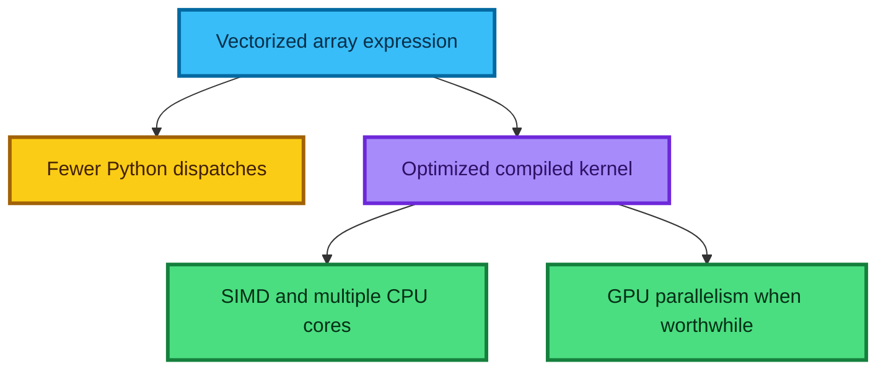

### A fair microbenchmark

```python
import timeit
import numpy as np

# Fix the data before timing so allocation does not distort one method only.
x = np.arange(100_000, dtype=np.float64)

# Define equivalent Python-loop and NumPy operations.
def python_square(values):
    # Convert each NumPy scalar to its square through a Python comprehension.
    return [value * value for value in values]


def numpy_square(values):
    # Dispatch one elementwise square operation to NumPy's compiled loop.
    return values * values


# Repeat each method and compare results on the same machine.
python_time = timeit.timeit(lambda: python_square(x), number=20)
numpy_time = timeit.timeit(lambda: numpy_square(x), number=20)
speedup = python_time / numpy_time
```

Report the machine, array size, warm-up, number of repeats, and whether data transfers are included. A GPU can be slower for tiny operations because kernel launch and device-transfer overhead dominate.

---

## 18. Broadcasting intuition: virtual expansion

Elementwise operations normally need matching shapes. **Broadcasting** extends them to compatible shapes by treating an axis of length 1 as repeatable.

Consider a matrix and a length-3 vector:

$$
A=
\begin{bmatrix}
1&2&3\\
4&5&6
\end{bmatrix},
\qquad
v=\begin{bmatrix}10&20&30\end{bmatrix}.
$$

Then

$$
A+v=
\begin{bmatrix}
1+10&2+20&3+30\\
4+10&5+20&6+30
\end{bmatrix}.
$$

The vector acts as though it were repeated down the rows. A scalar is the simplest broadcastable object: it can be paired with every element.

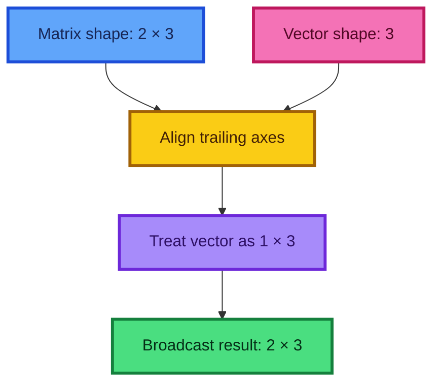

### Conceptual repetition versus physical copying

“Repeat the vector” is an excellent mental model, but NumPy and PyTorch commonly implement broadcasting with **views and strides**, without storing all repeated values. NumPy's `broadcast_to` explicitly returns a read-only view in which multiple visible positions may refer to one memory location.

The operation's result still needs storage unless it can be fused or represented as a view. Broadcasting saves the storage of the repeated **input**; it does not make every later computation free.

**When to use it:** per-feature normalization, adding one bias per neuron, applying one scale per channel, pairwise comparisons, and constructing matrix operations.

---

## 19. Formal broadcasting rules

To determine whether two shapes broadcast:

1. Align their dimensions from the **right** (the trailing axis).
2. For each aligned position, dimensions are compatible when they are equal or at least one is 1.
3. A missing leading dimension behaves as if it were 1.
4. The result uses the larger size at each position.
5. If any aligned dimensions conflict, the operation fails.

| Shape A | Shape B | Result | Why |
|---|---|---|---|
| `(2, 3)` | `(3,)` | `(2, 3)` | Treat `(3,)` as `(1, 3)` |
| `(3, 1)` | `(1, 4)` | `(3, 4)` | Each length-1 axis expands |
| `(8, 1, 6, 1)` | `(7, 1, 5)` | `(8, 7, 6, 5)` | Right-aligned pairs are compatible |
| `(5, 4)` | `(1,)` | `(5, 4)` | A single scalar-like element expands |
| `(2, 3)` | `(3, 2)` | incompatible | Both aligned axes conflict |

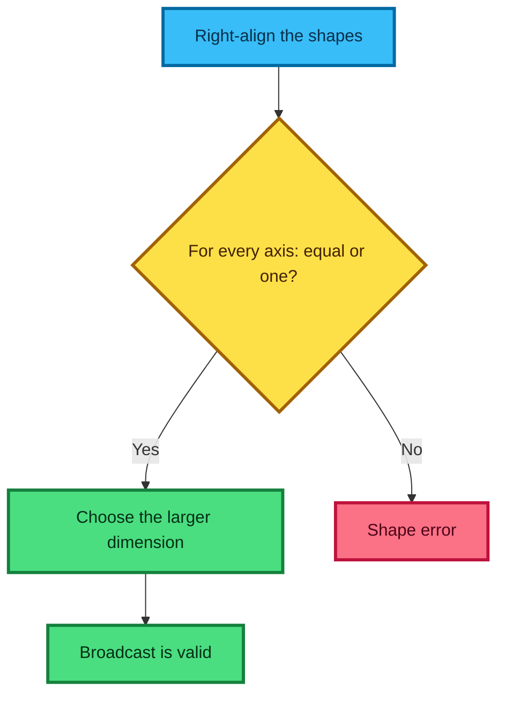

### A shape-checking implementation

```python
def broadcast_shape(*shapes):
    """Return the common broadcast shape or raise ValueError."""
    # The longest shape determines how many aligned axes must be checked.
    maximum_rank = max((len(shape) for shape in shapes), default=0)
    result_reversed = []

    # Work from the trailing axis toward the leading axis.
    for offset in range(1, maximum_rank + 1):
        # A missing leading axis behaves like an axis of length one.
        dimensions = [shape[-offset] if offset <= len(shape) else 1 for shape in shapes]
        non_unit = {dimension for dimension in dimensions if dimension != 1}

        # More than one non-unit size means the axis cannot broadcast.
        if len(non_unit) > 1:
            raise ValueError(f"incompatible dimensions: {dimensions}")

        # Use the one non-unit size, or one if all dimensions are one.
        result_reversed.append(non_unit.pop() if non_unit else 1)

    # Restore normal leading-to-trailing axis order.
    return tuple(reversed(result_reversed))


assert broadcast_shape((2, 3), (3,)) == (2, 3)
assert broadcast_shape((3, 1), (1, 4)) == (3, 4)
assert broadcast_shape((8, 1, 6, 1), (7, 1, 5)) == (8, 7, 6, 5)
```

> **Debugging habit:** write shapes beside every intermediate expression. Broadcasting errors become much easier when dimensions have names such as `(batch, channel, height, width)` instead of being anonymous numbers.

> **Terminology fun fact:** in array programming, “rank” often means the number of axes, also called tensor order. In linear algebra, matrix rank means the dimension of a matrix's independent row/column space. These are different ideas.

---

## 20. Unit axes: choosing rows versus columns

A one-dimensional array of shape `(3,)` has no intrinsic row or column orientation. Add a unit axis to make the intention explicit:

- `v[None, :]` has shape `(1, 3)`: one row.
- `v[:, None]` has shape `(3, 1)`: one column.

```python
import numpy as np

# Start with a one-dimensional vector.
v = np.array([10, 20, 30])

# Insert a leading unit axis to form a row.
row = v[None, :]

# Insert a trailing unit axis to form a column.
column = v[:, None]

assert row.shape == (1, 3)
assert column.shape == (3, 1)

# Broadcasting a column and a row creates every pairwise sum.
pairwise_sum = column + row
assert pairwise_sum.shape == (3, 3)
```

Equivalent spellings include `np.expand_dims(v, axis=0)` and `np.newaxis`, which is an alias for `None`. In PyTorch, use `v.unsqueeze(0)` for a row or `v.unsqueeze(1)` for a column.

### Why unit axes are powerful

They do not add new data; they add **meaning to a shape**. A unit axis tells the broadcasting system which other axis may vary. This is the foundation of per-channel normalization and outer operations.

---

## 21. Per-channel statistics and layout awareness

Suppose an image batch uses channels-last layout:

$$
X\in\mathbb{R}^{B\times H\times W\times C}.
$$

A channel mean of shape `(C,)` aligns with the trailing channel axis, so `X - mean` works directly. PyTorch images more often use channels-first layout `(B, C, H, W)`. A `(C,)` vector aligns with width—not channel—so reshape it to `(1, C, 1, 1)`.

```python
import torch

# Create a channels-first image batch: batch, channel, height, width.
images = torch.randn(32, 3, 28, 28)

# Compute one mean and standard deviation for each channel.
channel_mean = images.mean(dim=(0, 2, 3))
channel_std = images.std(dim=(0, 2, 3), unbiased=False)

# Add unit axes so channel statistics align with the C axis.
mean_view = channel_mean.view(1, 3, 1, 1)
std_view = channel_std.view(1, 3, 1, 1)

# Normalize every pixel using statistics from its own channel.
normalized = (images - mean_view) / std_view.clamp_min(1e-6)
assert normalized.shape == images.shape
```

### When to compute statistics

Compute preprocessing statistics from the **training set only**. Using validation or test examples leaks information from the evaluation data. In a production system, store those training statistics and reuse them at inference time.

---

## 22. Outer operations and coordinate grids

An **outer operation** combines every element of one vector with every element of another. For $a\in\mathbb{R}^{m}$ and $b\in\mathbb{R}^{n}$:

$$
(a\otimes b)_{ij}=a_i b_j.
$$

Broadcast a column `(m, 1)` against a row `(1, n)`:

```python
import numpy as np

# Define vectors whose every possible pair will be combined.
a = np.array([1, 2, 3])
b = np.array([10, 20, 30, 40])

# Form outer multiplication, addition, and comparison tables.
outer_product = a[:, None] * b[None, :]
outer_sum = a[:, None] + b[None, :]
outer_less = a[:, None] < b[None, :]

assert outer_product.shape == (3, 4)
assert np.array_equal(outer_product, np.outer(a, b))
```

Outer operations can generate a grid without nested Python loops:

```python
import numpy as np

# Create sparse coordinate arrays with broadcast-friendly shapes.
y, x = np.ogrid[-2.0:2.0:5j, -3.0:3.0:7j]

# Broadcasting evaluates the radius at every grid coordinate.
radius_squared = x**2 + y**2

# Select points inside a circle of radius two.
inside_circle = radius_squared <= 2.0**2
assert inside_circle.shape == (5, 7)
```

**When useful:** pairwise distances, lookup tables, kernel matrices, grid evaluation, and attention-like score construction. For very large collections, the full pairwise matrix may be too large; use blocks or a specialized routine.

> **Fun fact:** APL and J made whole-array and outer-product notation central to programming. Kenneth Iverson's essay *Notation as a Tool of Thought* argues that good notation does more than abbreviate—it helps people discover and reason about structure.

---

## 23. Deriving matrix-vector multiplication from primitives

For $A\in\mathbb{R}^{m\times n}$ and $x\in\mathbb{R}^{n}$,

$$
y_i=\sum_{j=1}^{n}A_{ij}x_j.
$$

This definition says:

1. multiply every row of $A$ elementwise by $x$;
2. sum across the columns.

```python
import numpy as np

# Create a 2 x 3 matrix and a compatible length-3 vector.
A = np.array([[1.0, 2.0, 3.0], [4.0, 5.0, 6.0]])
x = np.array([10.0, 20.0, 30.0])

# Broadcast x across the rows, then sum each row of products.
manual = (A * x[None, :]).sum(axis=1)

# Verify the primitive construction against matrix-vector multiplication.
expected = A @ x
assert np.allclose(manual, expected)
```

Shape reasoning:

$$
(m,n)\odot(1,n)\longrightarrow(m,n)
\xrightarrow{\sum\text{ over }n}(m).
$$

This is the same dot product applied once per row.

---

## 24. Deriving matrix-matrix multiplication

Let $A$ have shape $(m,k)$ and $B$ have shape $(k,n)$. Matrix multiplication is

$$
C_{ij}=\sum_{r=1}^{k}A_{ir}B_{rj},
\qquad C\in\mathbb{R}^{m\times n}.
$$

Use unit axes so all combinations of row $i$, shared index $r$, and column $j$ coexist:

$$
A[:,:,\text{None}]\text{ has shape }(m,k,1),
$$

$$
B[\text{None},:,:]\text{ has shape }(1,k,n).
$$

Their elementwise product broadcasts to $(m,k,n)$. Summing over the shared $k$ axis leaves $(m,n)$.

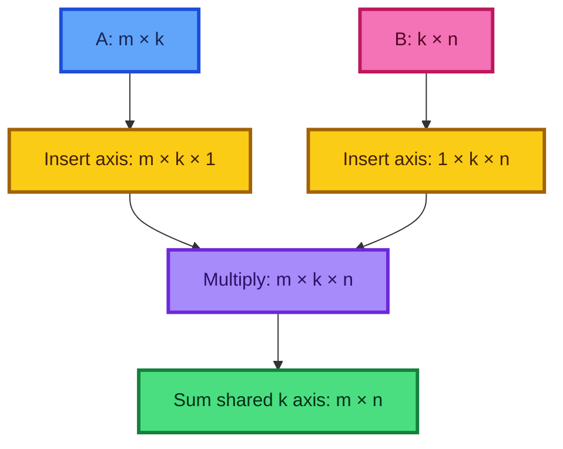

```python
import numpy as np

# Use compatible matrices with shared inner dimension three.
A = np.array([[1.0, 2.0, 3.0], [4.0, 5.0, 6.0]])
B = np.array([[1.0, 2.0], [3.0, 4.0], [5.0, 6.0]])

# Expose row, shared, and column axes, then reduce the shared axis.
manual = (A[:, :, None] * B[None, :, :]).sum(axis=1)

# Confirm that the construction matches NumPy's optimized operator.
assert manual.shape == (2, 2)
assert np.allclose(manual, A @ B)

# Einstein notation expresses the same contraction without naming unit axes.
einsum_result = np.einsum("ik,kj->ij", A, B)
assert np.allclose(einsum_result, A @ B)
```

The shared dimension must agree because every output is a dot product between a length-$k$ row and a length-$k$ column.

---

## 25. A tested NumPy matrix-multiplication function

The broadcast construction is ideal for understanding, but it forms an $(m,k,n)$ temporary. That can require far more memory than the $(m,n)$ result. Production code should normally use `A @ B`, which dispatches an optimized linear-algebra kernel.

```python
import numpy as np

def educational_matmul(left, right):
    """Multiply two 2-D arrays through broadcasting and reduction."""
    # Convert compatible array-like inputs without forcing an unnecessary copy.
    left = np.asarray(left)
    right = np.asarray(right)

    # Keep the contract small and explicit for this educational function.
    if left.ndim != 2 or right.ndim != 2:
        raise ValueError("both inputs must be two-dimensional")

    # Matrix multiplication requires matching inner dimensions.
    if left.shape[1] != right.shape[0]:
        raise ValueError(
            f"inner dimensions differ: {left.shape[1]} != {right.shape[0]}"
        )

    # Create every scalar product and sum over the shared inner dimension.
    return (left[:, :, None] * right[None, :, :]).sum(axis=1)


# Compare many random shapes against NumPy's trusted implementation.
rng = np.random.default_rng(seed=9)
for m, k, n in [(1, 1, 1), (2, 3, 4), (5, 2, 7), (8, 8, 3)]:
    left = rng.normal(size=(m, k))
    right = rng.normal(size=(k, n))
    assert np.allclose(educational_matmul(left, right), left @ right)
```

### Cost

- Arithmetic: $\Theta(mkn)$ multiply-add work for the conventional algorithm.
- Result storage: $\Theta(mn)$.
- Educational temporary above: $\Theta(mkn)$—potentially the dominant cost.

PyTorch's `torch.matmul` also handles vectors, matrices, and batches of matrices, with broadcasting over batch dimensions. `torch.mm` is specifically two-dimensional and does not broadcast.

---

## 26. Anatomy of one modern PyTorch training step

A training step has four essential state transitions:

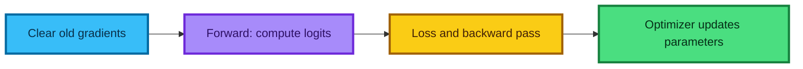

```python
import torch
from torch import nn

# Select an accelerator when available while preserving a CPU fallback.
device = torch.device("cuda" if torch.cuda.is_available() else "cpu")

# Move the registered parameters and buffers to the selected device.
model = nn.Sequential(nn.Flatten(), nn.Linear(28 * 28, 10)).to(device)
loss_function = nn.CrossEntropyLoss()
optimizer = torch.optim.SGD(model.parameters(), lr=0.1)

# Assume images and labels came from one DataLoader iteration.
images = torch.randn(64, 1, 28, 28, device=device)
labels = torch.randint(0, 10, (64,), device=device)

# Gradients accumulate by default, so clear values left by the prior step.
optimizer.zero_grad(set_to_none=True)

# Compute raw class scores through the model's forward graph.
logits = model(images)

# Compare logits with integer class labels to obtain one scalar objective.
loss = loss_function(logits, labels)

# Apply reverse-mode automatic differentiation to populate parameter .grad fields.
loss.backward()

# Update each registered parameter using its gradient and optimizer rule.
optimizer.step()
```

### Why this exact order?

- Clearing gradients first prevents unintended addition from previous batches.
- The forward pass creates the current computation graph.
- `backward()` differentiates the scalar loss through that graph.
- `step()` reads the resulting gradients and changes the parameters.

The older `.cuda()` style assumes a CUDA device. `.to(device)` makes the placement choice explicit and portable. The old `Variable` wrapper is unnecessary.

---

## 27. Stochastic gradient descent and the learning rate

For parameters $\theta$ and mini-batch loss $L_B(\theta)$, plain SGD performs

$$
\theta_{t+1}=\theta_t-\eta\nabla_\theta L_B(\theta_t),
$$

where $\eta>0$ is the **learning rate**.

### What each part means

- $\nabla_\theta L_B$ points toward the steepest local increase in loss.
- The minus sign aims in the locally decreasing direction.
- $\eta$ controls step size.
- The subscript $B$ reminds us that a mini-batch gradient is a noisy estimate of the full-dataset gradient.

| Learning-rate behavior | Typical symptom | Response |
|---|---|---|
| Much too small | Loss decreases extremely slowly | Increase it or use a scheduler/stronger optimizer |
| Reasonable | Loss trends downward with manageable noise | Continue and monitor validation metrics |
| Much too large | Loss oscillates, diverges, or becomes non-finite | Reduce it; inspect scaling and gradients |

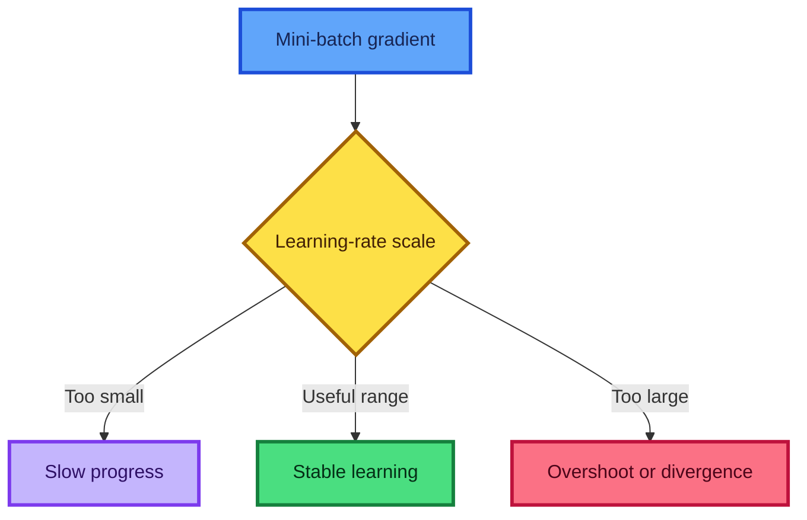

One mini-batch update is **not guaranteed** to lower either the next mini-batch loss or the full-dataset loss. The gradient is local, the landscape is curved, and the batch estimate is noisy. Judge training by trends, validation performance, and diagnostics—not a single step.

The lecture later uses Adam, which adapts updates using running gradient statistics. It is still an optimizer, and its learning rate still matters.

---

## 28. A complete train-and-evaluate loop

An **epoch** is one traversal of the training loader. `model.train()` enables training behavior such as dropout and batch-normalization updates; `model.eval()` selects evaluation behavior. Neither call turns gradients on or off by itself.

```python
import torch

def train_one_epoch(model, loader, loss_function, optimizer, device):
    """Run one training pass and return mean sample-weighted loss."""
    # Enable training-specific module behavior.
    model.train()
    total_loss = 0.0
    total_examples = 0

    # A DataLoader yields a fresh mini-batch on every iteration.
    for images, labels in loader:
        # Keep inputs, labels, and model parameters on the same device.
        images = images.to(device)
        labels = labels.to(device)

        # Prevent gradients from different batches accumulating accidentally.
        optimizer.zero_grad(set_to_none=True)

        # Build the graph, compute the objective, and differentiate it.
        logits = model(images)
        loss = loss_function(logits, labels)
        loss.backward()

        # Mutate model parameters only after all gradients are available.
        optimizer.step()

        # Multiply the mean batch loss by batch size for a true epoch mean.
        batch_size = labels.shape[0]
        total_loss += loss.item() * batch_size
        total_examples += batch_size

    # Guard against an accidentally empty loader.
    return total_loss / max(total_examples, 1)


def evaluate(model, loader, loss_function, device):
    """Return mean loss and accuracy without building gradient graphs."""
    # Switch dropout and normalization layers to evaluation behavior.
    model.eval()
    total_loss = 0.0
    total_correct = 0
    total_examples = 0

    # Inference mode skips autograd bookkeeping and parameter version tracking.
    with torch.inference_mode():
        for images, labels in loader:
            # Use the same device as the model.
            images = images.to(device)
            labels = labels.to(device)

            # Compute evaluation outputs without calling backward or step.
            logits = model(images)
            loss = loss_function(logits, labels)
            predictions = logits.argmax(dim=1)

            # Accumulate sample-weighted loss and the number of correct labels.
            batch_size = labels.shape[0]
            total_loss += loss.item() * batch_size
            total_correct += (predictions == labels).sum().item()
            total_examples += batch_size

    # Report metrics over all examples, not an unweighted mean of batches.
    denominator = max(total_examples, 1)
    return total_loss / denominator, total_correct / denominator
```

### Common mistakes

- Calling `optimizer.step()` during validation.
- Forgetting `model.eval()` when the model contains dropout or batch normalization.
- Averaging already-averaged batch losses without weighting the smaller final batch.
- Moving the model but not the batch to the same device.
- Applying softmax before `CrossEntropyLoss`.

---

## 29. Backpropagation and the chain rule

Backpropagation is an efficient organization of the chain rule. For a scalar chain

$$
x\xrightarrow{f}u\xrightarrow{g}v\xrightarrow{h}L,
$$

the derivative is

$$
\frac{dL}{dx}
=\frac{dL}{dv}\frac{dv}{du}\frac{du}{dx}.
$$

Reverse-mode differentiation starts from $dL/dL=1$ and propagates sensitivities backward, reusing intermediate results instead of re-deriving every parameter derivative independently.

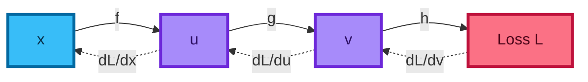

For vector-valued operations, the underlying objects are Jacobians. Frameworks usually avoid constructing giant Jacobian matrices; they compute efficient **vector–Jacobian products** during the reverse pass.

### ReLU's local derivative

Away from zero,

$$
\frac{d}{dx}\operatorname{ReLU}(x)=
\begin{cases}
0,&x<0,\\
1,&x>0.
\end{cases}
$$

At $x=0$ the mathematical derivative is undefined, so a framework chooses a conventional subgradient; PyTorch uses zero there. This local derivative gates whether a gradient flows through that unit.

### Why gradients accumulate

A parameter may influence the loss along several graph paths. The multivariable chain rule **adds** contributions from those paths. PyTorch also accumulates repeated calls into `.grad`, which enables intentional gradient accumulation across micro-batches but requires an explicit clearing step for ordinary training.

---

## 30. From-scratch one-hidden-layer classifier

The following complete NumPy example implements the lesson's mathematics without autograd. It uses scikit-learn's built-in 8×8 handwritten-digit dataset, so it requires no network download.

```python
import numpy as np
from sklearn.datasets import load_digits
from sklearn.model_selection import train_test_split

# Load 1,797 labeled 8 x 8 digit images as 64 numeric input features.
features, labels = load_digits(return_X_y=True)

# Reserve a stratified test set so all classes keep similar proportions.
X_train, X_test, y_train, y_test = train_test_split(
    features,
    labels,
    test_size=0.2,
    random_state=9,
    stratify=labels,
)

# Calculate scaling statistics from training examples only to avoid leakage.
mean = X_train.mean(axis=0, keepdims=True)
standard_deviation = X_train.std(axis=0, keepdims=True)
X_train = (X_train - mean) / (standard_deviation + 1e-6)
X_test = (X_test - mean) / (standard_deviation + 1e-6)

# Create reproducible parameters for a 64 -> 100 -> 10 network.
rng = np.random.default_rng(seed=9)
input_width = X_train.shape[1]
hidden_width = 100
class_count = 10

# He-style scaling helps preserve variance through a ReLU layer.
W1 = rng.normal(0.0, np.sqrt(2.0 / input_width), (input_width, hidden_width))
b1 = np.zeros((1, hidden_width))

# Initialize the output layer with a smaller fan-in-scaled standard deviation.
W2 = rng.normal(0.0, np.sqrt(1.0 / hidden_width), (hidden_width, class_count))
b2 = np.zeros((1, class_count))


def forward(X):
    """Return intermediate values required by forward and backward passes."""
    # Apply the first affine transformation.
    hidden_pre_activation = X @ W1 + b1

    # ReLU keeps positive values and replaces negative values with zero.
    hidden = np.maximum(hidden_pre_activation, 0.0)

    # Produce one raw, unnormalized score for each class.
    logits = hidden @ W2 + b2
    return hidden_pre_activation, hidden, logits


def cross_entropy_with_probabilities(logits, targets):
    """Return stable mean cross-entropy and its softmax probabilities."""
    # Subtract each row maximum; softmax is unchanged but overflow is avoided.
    shifted = logits - logits.max(axis=1, keepdims=True)

    # Exponentiate and normalize every row into a probability distribution.
    exponentials = np.exp(shifted)
    probabilities = exponentials / exponentials.sum(axis=1, keepdims=True)

    # Select each example's correct-class probability and average negative logs.
    row_indices = np.arange(targets.size)
    correct_probabilities = probabilities[row_indices, targets]
    loss = -np.log(correct_probabilities + 1e-12).mean()
    return loss, probabilities


# Full-batch gradient descent keeps this educational example compact.
learning_rate = 0.15
for epoch in range(500):
    # Run a forward pass and keep values needed by the chain rule.
    hidden_pre_activation, hidden, logits = forward(X_train)
    loss, probabilities = cross_entropy_with_probabilities(logits, y_train)

    # For softmax cross-entropy, dL/dlogits equals probabilities minus one-hot labels.
    gradient_logits = probabilities.copy()
    gradient_logits[np.arange(y_train.size), y_train] -= 1.0
    gradient_logits /= y_train.size

    # Differentiate the second affine layer.
    gradient_W2 = hidden.T @ gradient_logits
    gradient_b2 = gradient_logits.sum(axis=0, keepdims=True)

    # Send gradients through W2 and through the ReLU gate.
    gradient_hidden = gradient_logits @ W2.T
    gradient_hidden_pre_activation = gradient_hidden * (hidden_pre_activation > 0.0)

    # Differentiate the first affine layer.
    gradient_W1 = X_train.T @ gradient_hidden_pre_activation
    gradient_b1 = gradient_hidden_pre_activation.sum(axis=0, keepdims=True)

    # Apply simultaneous gradient-descent updates to all four parameters.
    W1 -= learning_rate * gradient_W1
    b1 -= learning_rate * gradient_b1
    W2 -= learning_rate * gradient_W2
    b2 -= learning_rate * gradient_b2

    # Print occasional progress without flooding the output.
    if epoch % 100 == 0:
        print(f"epoch={epoch:3d} loss={loss:.4f}")

# Evaluate unseen examples using the largest logit as the predicted class.
test_logits = forward(X_test)[2]
test_predictions = test_logits.argmax(axis=1)
test_accuracy = (test_predictions == y_test).mean()
print(f"test accuracy={test_accuracy:.3f}")
```

With the stated seed and common NumPy/scikit-learn versions, this reaches about **97.8% test accuracy**. Exact floating-point details can vary. The purpose is not the headline score; it is seeing every mathematical object that a framework manages automatically.

### Gradient shape audit

| Quantity | Shape | Matching parameter |
|---|---:|---:|
| `gradient_logits` | $(N,10)$ | model output |
| `gradient_W2` | $(100,10)$ | `W2` |
| `gradient_b2` | $(1,10)$ | `b2` |
| `gradient_W1` | $(64,100)$ | `W1` |
| `gradient_b1` | $(1,100)$ | `b1` |

Every parameter gradient must have exactly the parameter's shape. That invariant catches many from-scratch backpropagation bugs.

---

## 31. Transcript claims refined

The lesson was recorded against an older software ecosystem and occasionally uses an informal simplification. The ideas remain valuable; this table separates the durable intuition from details that should not be copied literally today.

| Transcript claim or convention | Refined interpretation |
|---|---|
| A flattened MNIST image has 768 values | It has $28\times28=784$ values; 768 is a spoken slip |
| Wrap data and labels in `Variable` | `Variable` is deprecated; tensors provide autograd directly |
| Inputs and labels must be variables to train | Parameters need gradients; ordinary inputs and integer labels usually do not |
| Call `.cuda()` | Prefer `.to(device)` with an explicit CPU/accelerator choice |
| Put `LogSoftmax` in the model, then use `NLLLoss` | Valid, but raw logits plus `CrossEntropyLoss` are the usual current pairing |
| PyTorch lacks `argmax`, so use `max` | Current PyTorch has `torch.argmax`; `max` can return values and indices |
| Softmax is an ordinary scalar-to-scalar activation | Softmax couples every component through a shared denominator |
| ReLU is nearly always the hidden activation | ReLU is a strong baseline, but GELU, SiLU, and architecture-specific choices are also common |
| A lower-rank tensor is a smaller tensor | Rank is the number of axes; total size is the product of axis lengths |
| Broadcasting copies the smaller array | Repetition is conceptual; libraries often use stride-based views, though results and later temporaries still consume memory |
| Vectorization is always 1,000× or 10,000× faster | Speedup is workload- and hardware-dependent; measure it fairly |
| A GPU automatically makes an expression fast | Kernel launch, transfer, synchronization, memory, and operation size all matter |
| A DataLoader is a generator | More precisely, it is an iterable whose iterator yields batches; implementation details may involve generators |
| Any function and module are interchangeable | Both may be callable, but only registered modules/parameters participate automatically in module state |
| The optimizer scans arbitrary Python variables | It updates the parameters explicitly passed to it, usually `model.parameters()` |
| Biases should be randomized | Random biases can work; zero initialization is common because random weights already break symmetry |
| Negative log-likelihood is “like RMSE” | Both are losses, but their probabilistic meanings, units, and gradients differ |
| Gradient steps simply shrink until training stops | Step size follows the optimizer rule and schedule; the loss landscape and gradient norms also change |
| Every gradient step reduces loss | Not guaranteed for finite learning rates or noisy mini-batch gradients |
| Materializing the $(m,k,n)$ product is how matrix multiplication should run | It is a teaching derivation; optimized `@` avoids such a giant explicit temporary |
| Activation trends are permanent recommendations | They are time- and architecture-dependent conventions, not mathematical laws |
| The publishing workflow shown is timeless | The principle—share reproducible work—is durable; hosting tools, APIs, and security practices change |

### A useful reading principle

Separate three layers whenever you study an older technical lecture:

1. **Mathematics:** identities such as the chain rule and broadcasting compatibility.
2. **Design patterns:** modules, parameter registration, mini-batches, and optimizer steps.
3. **API spelling:** `Variable`, `.cuda()`, method names, and defaults that may age quickly.

The first layer is usually the most stable; verify the third against current documentation.

---

## 32. Formula sheet

### Shapes and parameter counts

$$
28\times28=784,
\qquad
\operatorname{Linear}(D,H): DH+H\text{ parameters}.
$$

### Affine and hidden layers

$$
Z=XW+b,
\qquad
H=\phi(Z),
\qquad
S=HW_2+b_2.
$$

### ReLU and sigmoid

$$
\operatorname{ReLU}(x)=\max(0,x),
\qquad
\sigma(x)=\frac{1}{1+e^{-x}}.
$$

### Softmax

$$
p_{ic}=\frac{e^{s_{ic}}}{\sum_{j=1}^{C}e^{s_{ij}}}.
$$

Numerically stable softmax subtracts the row maximum:

$$
\operatorname{softmax}(s)=\operatorname{softmax}(s-\max_j s_j).
$$

### Multiclass cross-entropy

$$
L=-\frac1B\sum_{i=1}^{B}\log p_{i,y_i}.
$$

### Accuracy

$$
\operatorname{accuracy}=\frac1N\sum_{i=1}^{N}\mathbf1(\hat y_i=y_i).
$$

### Matrix products

$$
(Ax)_i=\sum_{j=1}^{n}A_{ij}x_j,
$$

$$
(AB)_{ij}=\sum_{r=1}^{k}A_{ir}B_{rj}.
$$

### Outer product

$$
(a\otimes b)_{ij}=a_i b_j.
$$

### SGD

$$
\theta_{t+1}=\theta_t-\eta\nabla_\theta L_B(\theta_t).
$$

### Scalar chain rule

$$
\frac{dL}{dx}=\frac{dL}{dv}\frac{dv}{du}\frac{du}{dx}.
$$

### Softmax cross-entropy gradient

For mean loss and one-hot labels $Y$:

$$
\frac{\partial L}{\partial S}=\frac{P-Y}{B}.
$$

---

## 33. Practice exercises

Try these before reading the hints. Use shape annotations as part of every solution.

### Foundations

1. **Shape audit:** A batch contains 128 grayscale 28×28 images. Give its shape before and after flattening, then give the output shape of `Linear(784, 10)`.
   - *Hint:* flatten each example, not the entire batch.

2. **Parameter count:** Count the parameters in `784 → 50 → 10`, including biases.
   - *Hint:* calculate each affine layer separately.

3. **Affine collapse:** Algebraically collapse three affine layers with no activation into one affine map.
   - *Hint:* substitute one equation at a time.

4. **Prediction:** For logits `[2.0, 3.5, -1.0]`, determine the predicted class without computing softmax.
   - *Hint:* softmax preserves order.

### Broadcasting

5. **Compatibility:** Determine the result shape or explain the error for:
   - `(4, 1, 7)` with `(3, 7)`;
   - `(2, 5)` with `(5,)`;
   - `(2, 5)` with `(2,)`.

6. **Row versus column:** Starting with `v.shape == (6,)`, write NumPy expressions that produce shapes `(1, 6)` and `(6, 1)`.

7. **Channel normalization:** Reshape a channel standard deviation of shape `(16,)` to normalize an activation tensor of shape `(32, 16, 14, 14)`.

8. **Pairwise difference:** Given `a.shape == (m,)` and `b.shape == (n,)`, construct an `(m, n)` array with entries $a_i-b_j$.

9. **Distance matrix:** Use broadcasting to compute squared Euclidean distances between `X.shape == (m, d)` and `Y.shape == (n, d)`.
   - *Hint:* create `(m, 1, d)` and `(1, n, d)`, then reduce the feature axis.

### Matrix operations

10. **Matrix-vector derivation:** Explain why `(A * x).sum(axis=1)` represents `A @ x` when `A` is `(m, n)` and `x` is `(n,)`.

11. **Matrix multiplication:** Implement `B @ A` from broadcasting and reduction. Carefully identify its shared axis.

12. **Memory reasoning:** For $m=k=n=1{,}000$ and `float64`, estimate the temporary storage used by the educational broadcast matrix multiplication.
    - *Hint:* $10^9$ elements at 8 bytes each is about 8 GB.

13. **Einstein notation:** Express batch matrix multiplication `(b, m, k) @ (b, k, n)` using `np.einsum`.

### Training and backpropagation

14. **Manual gradient:** For $L=(wx-y)^2$, derive $dL/dw$ and perform one SGD step for $w=1$, $x=2$, $y=5$, and $\eta=0.1$.

15. **Gradient accumulation:** Predict what happens if `zero_grad()` is omitted for five batches. When might that behavior be intentional?

16. **ReLU backward:** Given pre-activations `[-2, 0.5, 3]` and incoming gradient `[4, 4, 4]`, compute the gradient after ReLU.

17. **Output/loss match:** Choose an output shape and loss for (a) one cat breed, (b) any number of visible objects, and (c) house price.

18. **Experiment:** Change the hidden width, learning rate, and epoch count in the from-scratch classifier. Record both training and test accuracy. Explain any overfitting or instability.

### Extension challenges

19. Replace full-batch training with shuffled mini-batches while preserving correct gradient averaging.

20. Use finite differences to gradient-check one randomly selected entry of `W1`:

$$
\frac{\partial L}{\partial w}\approx\frac{L(w+\varepsilon)-L(w-\varepsilon)}{2\varepsilon}.
$$

Choose a small $\varepsilon$, compare the numerical and analytic gradients, and discuss floating-point error.

---

## 34. Review questions and answers

<details>
<summary><strong>1. Why is the MNIST input width 784?</strong></summary>

Each image has $28\times28=784$ pixels. Flattening changes the shape, not the number of values.
</details>

<details>
<summary><strong>2. What does a hidden unit learn?</strong></summary>

It learns an affine combination of the previous representation followed by an activation. It is better understood as one coordinate in a learned feature representation than as a guaranteed human-named concept.
</details>

<details>
<summary><strong>3. Why can two affine layers collapse into one?</strong></summary>

Affine functions are closed under composition: substituting one into the other produces another matrix multiplication plus bias.
</details>

<details>
<summary><strong>4. Why does ReLU prevent that collapse?</strong></summary>

ReLU conditionally sets negative values to zero, so the overall mapping uses different affine rules in different input regions.
</details>

<details>
<summary><strong>5. What is a logit?</strong></summary>

A raw, unnormalized model score produced before softmax or sigmoid. Its absolute value is less important than its relation to the other relevant logits.
</details>

<details>
<summary><strong>6. Why pass logits to cross-entropy?</strong></summary>

Combining log-softmax and negative log-likelihood in one loss is numerically stable and avoids accidentally applying softmax twice.
</details>

<details>
<summary><strong>7. Why is softmax not elementwise?</strong></summary>

Every output probability uses the sum of exponentials of all logits, so changing one component affects all outputs.
</details>

<details>
<summary><strong>8. What makes a tensor a parameter in PyTorch?</strong></summary>

Assigning an `nn.Parameter` as a module attribute, or using a registered submodule such as `nn.Linear`, places it in module state and exposes it through `model.parameters()`.
</details>

<details>
<summary><strong>9. Why call the module rather than `forward` directly?</strong></summary>

`module(x)` preserves PyTorch's normal call machinery, including hooks and wrappers, before delegating to `forward`.
</details>

<details>
<summary><strong>10. What is the difference between an iterable and an iterator?</strong></summary>

An iterable can create an iterator. An iterator stores traversal state and returns successive items until it raises `StopIteration`.
</details>

<details>
<summary><strong>11. Why do gradients accumulate?</strong></summary>

Adding path contributions is part of the chain rule, and PyTorch also adds each backward call into existing `.grad` tensors to support deliberate accumulation.
</details>

<details>
<summary><strong>12. What does broadcasting align first?</strong></summary>

Trailing axes. Missing leading axes behave as length one.
</details>

<details>
<summary><strong>13. Does broadcasting physically duplicate data?</strong></summary>

Usually not for the broadcasted input; libraries often use a stride-based view. The resulting operation may still allocate output or temporary storage.
</details>

<details>
<summary><strong>14. What does `v[:, None]` mean?</strong></summary>

It inserts a trailing unit axis, converting shape `(n,)` into column-like shape `(n, 1)`.
</details>

<details>
<summary><strong>15. What is the difference between an outer product and a dot product?</strong></summary>

A dot product reduces two length-$n$ vectors to one scalar. An outer product combines every pair from length-$m$ and length-$n$ vectors to produce an $(m,n)$ matrix.
</details>

<details>
<summary><strong>16. Why is the inner matrix dimension shared and summed?</strong></summary>

Every output entry is a dot product between a row of the left matrix and a column of the right matrix; both must have the same length.
</details>

<details>
<summary><strong>17. What does `loss.backward()` do?</strong></summary>

It applies reverse-mode automatic differentiation from the scalar loss through the recorded graph and accumulates gradients into reachable leaf tensors that require them.
</details>

<details>
<summary><strong>18. What does `optimizer.step()` do?</strong></summary>

It changes the parameters passed to the optimizer according to their gradients and the optimizer's update rule. It does not compute those gradients.
</details>

<details>
<summary><strong>19. Why can a very large learning rate diverge?</strong></summary>

The local gradient direction is reliable only nearby. A large step can overshoot a useful region or amplify curvature and mini-batch noise.
</details>

<details>
<summary><strong>20. Why keep a high-level reference implementation?</strong></summary>

It acts as an oracle while one abstraction is replaced. Matching outputs, shapes, losses, and gradients isolates bugs before the next layer is opened.
</details>

---

## 35. Practical checklist

### Before implementing

- [ ] Write the input, intermediate, output, and target shapes.
- [ ] Match the output representation to the task and loss.
- [ ] Keep a trusted high-level baseline for equivalence checks.
- [ ] Fix random seeds when reproducibility matters.

### During implementation

- [ ] Register trainable tensors as parameters or submodules.
- [ ] Return logits when using fused classification losses.
- [ ] Add comments that explain intent and shapes, not merely syntax.
- [ ] Right-align shapes before relying on broadcasting.
- [ ] Use `@` for production matrix multiplication.
- [ ] Clear gradients, run forward, compute loss, backpropagate, then update.
- [ ] Keep model and batches on the same device.

### During validation

- [ ] Test each replacement against the reference before proceeding.
- [ ] Compare numeric arrays with a tolerance such as `allclose`.
- [ ] Verify every gradient shape matches its parameter.
- [ ] Use `model.eval()` and `torch.inference_mode()` for evaluation.
- [ ] Weight batch losses by batch size when computing an epoch mean.
- [ ] Monitor validation metrics, not training loss alone.
- [ ] Benchmark performance claims on the actual workload.

### Before publishing

- [ ] Remove secrets, private paths, and sensitive data.
- [ ] Pin or record dependency versions.
- [ ] Explain data provenance, split strategy, and metric definitions.
- [ ] Include a small reproducible example and expected result.
- [ ] State historical APIs and corrections explicitly.

---

## 36. Resources

### Primary lesson

- [Machine Learning 1: Lesson 9 — YouTube](https://www.youtube.com/watch/PGC0UxakTvM)

### Current PyTorch references

- [`torch.nn.Module`](https://docs.pytorch.org/docs/stable/generated/torch.nn.Module.html)
- [`torch.nn.CrossEntropyLoss`](https://docs.pytorch.org/docs/stable/generated/torch.nn.CrossEntropyLoss.html)
- [Automatic differentiation tutorial](https://docs.pytorch.org/tutorials/beginner/blitz/autograd_tutorial.html)
- [Autograd mechanics](https://docs.pytorch.org/docs/stable/notes/autograd.html)
- [Zeroing out gradients](https://docs.pytorch.org/tutorials/recipes/recipes/zeroing_out_gradients.html)
- [Optimization loop tutorial](https://docs.pytorch.org/tutorials/beginner/basics/optimization_tutorial.html)
- [`torch.argmax`](https://docs.pytorch.org/docs/stable/generated/torch.argmax.html)
- [`torch.matmul`](https://docs.pytorch.org/docs/stable/generated/torch.matmul.html) and [`torch.mm`](https://docs.pytorch.org/docs/stable/generated/torch.mm.html)
- [`torch.einsum`](https://docs.pytorch.org/docs/stable/generated/torch.einsum.html)
- [Deprecated `Variable` note and current autograd API](https://docs.pytorch.org/docs/stable/autograd.html)
- [ReLU](https://docs.pytorch.org/docs/stable/generated/torch.nn.ReLU.html), [Leaky ReLU](https://docs.pytorch.org/docs/stable/generated/torch.nn.LeakyReLU.html), [GELU](https://docs.pytorch.org/docs/stable/generated/torch.nn.GELU.html), and [SiLU](https://docs.pytorch.org/docs/stable/generated/torch.nn.SiLU.html)

### Array programming and mathematical intuition

- [NumPy broadcasting guide](https://numpy.org/doc/stable/user/basics.broadcasting.html)
- [`numpy.broadcast_to`](https://numpy.org/doc/stable/reference/generated/numpy.broadcast_to.html)
- [Interactive matrix-multiplication visualization](https://matrixmultiplication.xyz/)
- [Source repository for the matrix-multiplication visualization](https://github.com/staltz/matrixmultiplication.xyz)
- [Kenneth Iverson, *Notation as a Tool of Thought*](https://www.jsoftware.com/papers/tot.htm)
- [TensorLy documentation](https://tensorly.org/)

### Projects and sharing practices mentioned in the lecture

- [Parfit repository](https://github.com/jmcarpenter2/parfit) — a historical hyperparameter-fitting project shown in the lesson; check current maintenance and compatibility before adopting it.
- [GitHub documentation](https://docs.github.com/) — repositories, rendered Markdown, and Pages-related workflows evolve, so follow the current instructions.
- [Medium](https://medium.com/) — one venue mentioned for explanatory project write-ups.

---

## Final takeaway

The lesson's deepest idea is not a particular activation or API. It is a method for learning technical systems:

$$
\boxed{\text{use the whole system}\;\rightarrow\;\text{open one layer}\;\rightarrow\;\text{rebuild it}\;\rightarrow\;\text{test equivalence}}
$$

Following that method reveals that a neural network is built from ordinary, inspectable pieces: affine transformations, nonlinearities, broadcasted elementwise operations, reductions, a scalar loss, chain-rule gradients, and parameter updates. Abstractions become useful conveniences after you can explain what they hide.
