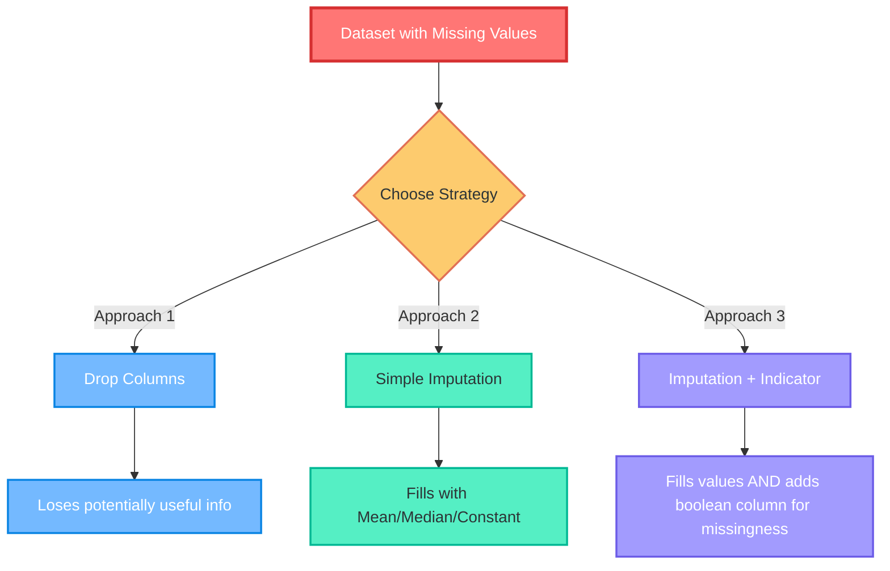
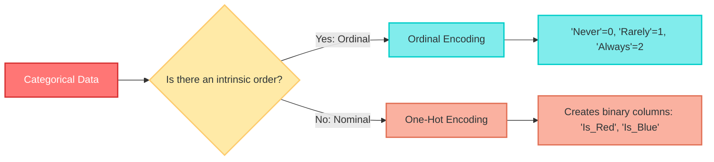
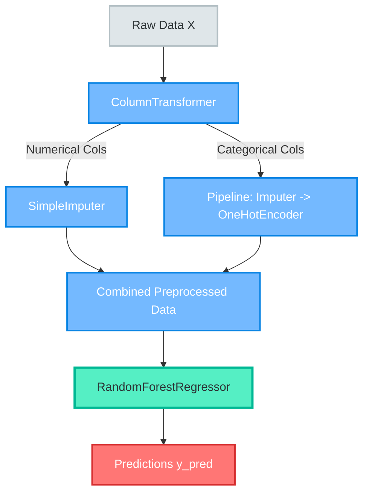
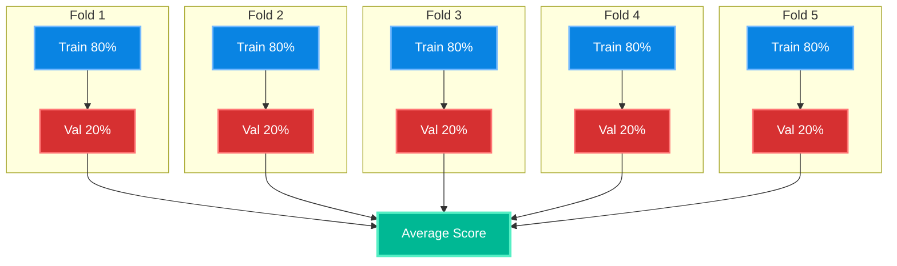
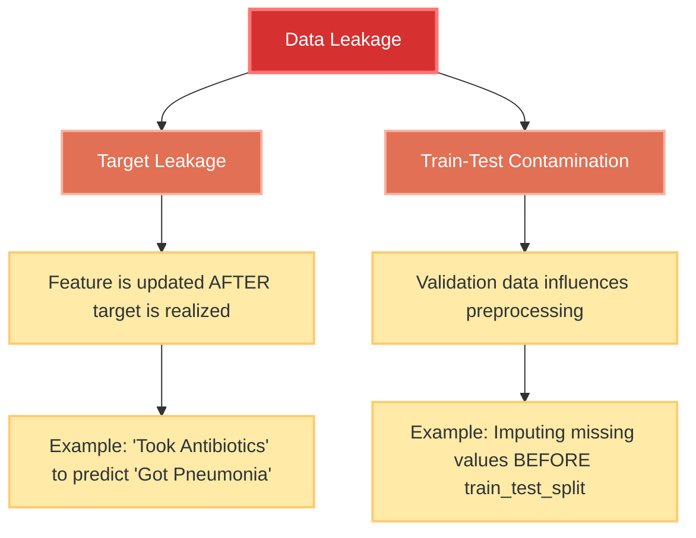

# 🚀 [Kaggle Intermediate Machine Learning](https://www.kaggle.com/learn/intermediate-machine-learning)


---

## 📑 Table of Contents
1. [Introduction & Prerequisites](#1-introduction--prerequisites)
2. [Missing Values](#2-missing-values)
3. [Categorical Variables](#3-categorical-variables)
4. [Pipelines](#4-pipelines)
5. [Cross-Validation](#5-cross-validation)
6. [XGBoost (Gradient Boosting)](#6-xgboost-gradient-boosting)
7. [Data Leakage](#7-data-leakage)

---

## 1. Introduction & Prerequisites

### 📖 What is this course about?
This course bridges the gap between basic machine learning (like simple Random Forests) and production-ready, competition-winning data science. You will learn to handle real-world messy data, optimize model validation, and use advanced algorithms.

### 🎯 Prerequisites
* Basic understanding of Python and Pandas.
* Familiarity with basic ML concepts: Model validation, underfitting/overfitting, and Random Forests.
* *If you are a complete beginner, start with the "Intro to Machine Learning" course first!*

### 🏆 The Playground
Throughout the exercises, we use the **Housing Prices Competition for Kaggle Learn Users**. You'll use 79 explanatory variables (roof type, bedrooms, etc.) to predict home prices.

---

## 2. Missing Values

Missing values (`NaN`) happen in almost every real-world dataset. Most ML libraries (like scikit-learn) will throw an error if you try to train a model with them.

### 🔍 What, Why, How, When?
* **What**: Data points that are absent in a column.
* **Why**: E.g., A 2-bedroom house has no value for a 3rd bedroom; a survey respondent skipped a question.
* **How**: We use three main strategies (Drop, Impute, Impute + Indicator).
* **When**: Always address missing values *before* feeding data into a model.

### 🎨 Concept Diagram: The 3 Approaches



### 🧮 Formulas
* **Mean Imputation**: $x_{imputed} = \frac{1}{N} \sum_{i=1}^{N} x_i$ (where $N$ is the number of non-missing values).

### 💻 Code Examples

```python
import pandas as pd
from sklearn.impute import SimpleImputer
from sklearn.ensemble import RandomForestRegressor
from sklearn.metrics import mean_absolute_error

# Assume X_train, X_valid, y_train, y_valid are already loaded

# Helper function to evaluate models
def score_dataset(X_train, X_valid, y_train, y_valid):
    model = RandomForestRegressor(n_estimators=10, random_state=0)
    model.fit(X_train, y_train)
    preds = model.predict(X_valid)
    return mean_absolute_error(y_valid, preds)

# --- APPROACH 1: Drop Columns ---
# Find columns with missing values
cols_with_missing = [col for col in X_train.columns if X_train[col].isnull().any()]
# Drop them from both train and valid sets
reduced_X_train = X_train.drop(cols_with_missing, axis=1)
reduced_X_valid = X_valid.drop(cols_with_missing, axis=1)
# print("MAE Approach 1:", score_dataset(reduced_X_train, reduced_X_valid, y_train, y_valid))

# --- APPROACH 2: Simple Imputation ---
my_imputer = SimpleImputer() # Defaults to mean imputation
# Fit on train, transform both
imputed_X_train = pd.DataFrame(my_imputer.fit_transform(X_train))
imputed_X_valid = pd.DataFrame(my_imputer.transform(X_valid))
# Imputation removes column names, so we put them back!
imputed_X_train.columns = X_train.columns
imputed_X_valid.columns = X_valid.columns
# print("MAE Approach 2:", score_dataset(imputed_X_train, imputed_X_valid, y_train, y_valid))

# --- APPROACH 3: Imputation + Indicator ---
X_train_plus = X_train.copy()
X_valid_plus = X_valid.copy()
# Create boolean columns indicating if a value was missing
for col in cols_with_missing:
    X_train_plus[col + '_was_missing'] = X_train_plus[col].isnull()
    X_valid_plus[col + '_was_missing'] = X_valid_plus[col].isnull()
# Now impute
my_imputer_3 = SimpleImputer()
imputed_X_train_plus = pd.DataFrame(my_imputer_3.fit_transform(X_train_plus))
imputed_X_valid_plus = pd.DataFrame(my_imputer_3.transform(X_valid_plus))
imputed_X_train_plus.columns = X_train_plus.columns
imputed_X_valid_plus.columns = X_valid_plus.columns
# print("MAE Approach 3:", score_dataset(imputed_X_train_plus, imputed_X_valid_plus, y_train, y_valid))
```

> 💡 **Fun Fact**: Approach 3 (adding an indicator column) doesn't *always* improve performance. It depends on whether the *fact that data is missing* carries predictive power (e.g., people who refuse to state their income might have a different spending behavior than those who do).

---

## 3. Categorical Variables

Categorical variables take on a limited number of distinct values (e.g., "Red", "Blue", "Green" or "Never", "Rarely", "Always"). ML models require numerical inputs.

### 🔍 What, Why, How, When?
* **What**: Non-numeric data representing categories.
* **Why**: Algorithms rely on mathematical distance/calculations; text strings break these math operations.
* **How**: Drop, Ordinal Encoding, or One-Hot Encoding.
* **When**: Always encode categorical variables before training.

### 🎨 Concept Diagram: Encoding Strategies



### 🧮 Formulas & Concepts
* **Cardinality**: The number of unique values in a categorical column. 
* **Rule of Thumb**: If cardinality > 15, avoid One-Hot Encoding (it causes the *Curse of Dimensionality*). Use Ordinal Encoding or drop it instead.

### 💻 Code Examples

```python
from sklearn.preprocessing import OrdinalEncoder, OneHotEncoder

# Get list of categorical variables (dtype == 'object')
object_cols = [col for col in X_train.columns if X_train[col].dtype == 'object']

# --- APPROACH 2: Ordinal Encoding ---
ordinal_encoder = OrdinalEncoder()
label_X_train = X_train.copy()
label_X_valid = X_valid.copy()
# Fit on train, transform both
label_X_train[object_cols] = ordinal_encoder.fit_transform(X_train[object_cols])
label_X_valid[object_cols] = ordinal_encoder.transform(X_valid[object_cols])

# --- APPROACH 3: One-Hot Encoding ---
# handle_unknown='ignore' prevents errors if validation data has new categories
# sparse=False returns a standard numpy array instead of a sparse matrix
OH_encoder = OneHotEncoder(handle_unknown='ignore', sparse_output=False) 

# Fit and transform
OH_cols_train = pd.DataFrame(OH_encoder.fit_transform(X_train[object_cols]))
OH_cols_valid = pd.DataFrame(OH_encoder.transform(X_valid[object_cols]))

# One-hot encoding removes the index, so we must put it back!
OH_cols_train.index = X_train.index
OH_cols_valid.index = X_valid.index

# Drop original categorical columns and concatenate the new OH columns
num_X_train = X_train.drop(object_cols, axis=1)
num_X_valid = X_valid.drop(object_cols, axis=1)

OH_X_train = pd.concat([num_X_train, OH_cols_train], axis=1)
OH_X_valid = pd.concat([num_X_valid, OH_cols_valid], axis=1)

# Ensure all column names are strings (required by some ML models)
OH_X_train.columns = OH_X_train.columns.astype(str)
OH_X_valid.columns = OH_X_valid.columns.astype(str)
```

---

## 4. Pipelines

Pipelines bundle preprocessing steps and modeling steps into a single, clean object.

### 🔍 What, Why, How, When?
* **What**: A scikit-learn tool that chains data transformations and a final estimator.
* **Why**: 
  1. **Cleaner Code**: No more juggling 10 different transformed DataFrames.
  2. **Fewer Bugs**: Prevents accidental data leakage.
  3. **Production Ready**: Easy to save and deploy as a single unit.
* **How**: Using `Pipeline` and `ColumnTransformer`.
* **When**: Always! Especially when you have mixed data types (numeric + categorical) and missing values.

### 🎨 Concept Diagram: The Pipeline Flow



### 💻 Code Examples

```python
from sklearn.compose import ColumnTransformer
from sklearn.pipeline import Pipeline
from sklearn.impute import SimpleImputer
from sklearn.preprocessing import OneHotEncoder
from sklearn.ensemble import RandomForestRegressor

# Define columns
numerical_cols = [cols with numbers]
categorical_cols = [cols with text]

# Step 1: Define Preprocessing Steps
# Numerical: Fill missing with a constant (e.g., 0)
numerical_transformer = SimpleImputer(strategy='constant')

# Categorical: Fill missing with most frequent, then One-Hot Encode
categorical_transformer = Pipeline(steps=[
    ('imputer', SimpleImputer(strategy='most_frequent')),
    ('onehot', OneHotEncoder(handle_unknown='ignore'))
])

# Bundle them together using ColumnTransformer
preprocessor = ColumnTransformer(
    transformers=[
        ('num', numerical_transformer, numerical_cols),
        ('cat', categorical_transformer, categorical_cols)
    ])

# Step 2: Define the Model
model = RandomForestRegressor(n_estimators=100, random_state=0)

# Step 3: Create the Pipeline
my_pipeline = Pipeline(steps=[
    ('preprocessor', preprocessor),
    ('model', model)
])

# Fit and predict in just TWO lines! No manual train/val splitting of transformations!
my_pipeline.fit(X_train, y_train)
preds = my_pipeline.predict(X_valid)
```

---

## 5. Cross-Validation

Cross-validation (CV) is a robust method for evaluating model performance by rotating the validation set.

### 🔍 What, Why, How, When?
* **What**: Splitting data into $K$ "folds", training on $K-1$ folds, and validating on the remaining fold, repeating $K$ times.
* **Why**: A single train/test split might be lucky or unlucky. CV gives a statistically reliable estimate of model performance.
* **How**: Using `cross_val_score` in scikit-learn.
* **When**: Use for **small datasets** (e.g., < 10,000 rows). For large datasets, a single validation set is sufficient and faster.

### 🎨 Concept Diagram: 5-Fold Cross-Validation



### 🧮 Formulas
* **Cross-Validation Score**: $CV_{score} = \frac{1}{K} \sum_{i=1}^{K} \text{Metric}_i$
* *Note on Scikit-Learn*: Scikit-learn uses **negative** MAE for scoring because its internal logic assumes *higher is better*. We multiply by `-1` to get the actual MAE.

### 💻 Code Examples

```python
from sklearn.model_selection import cross_val_score
from sklearn.pipeline import Pipeline
from sklearn.impute import SimpleImputer
from sklearn.ensemble import RandomForestRegressor

# Define pipeline (CV works best with pipelines!)
my_pipeline = Pipeline(steps=[
    ('preprocessor', SimpleImputer()),
    ('model', RandomForestRegressor(n_estimators=50, random_state=0))
])

# Calculate cross-validation scores
# cv=5 means 5 folds. scoring='neg_mean_absolute_error'
scores = -1 * cross_val_score(my_pipeline, X, y, cv=5, scoring='neg_mean_absolute_error')

print("MAE scores for each fold:\n", scores)
print("Average MAE score:", scores.mean())
```

---

## 6. XGBoost (Gradient Boosting)

XGBoost (eXtreme Gradient Boosting) is an advanced ensemble method that dominates tabular data competitions.

### 🔍 What, Why, How, When?
* **What**: An implementation of gradient boosting, which builds trees sequentially to correct the errors of previous trees.
* **Why**: It achieves state-of-the-art results on structured/tabular data. It handles non-linear relationships, missing values, and regularization beautifully.
* **How**: By minimizing a loss function using gradient descent.
* **When**: When you need maximum predictive power on tabular data (Pandas DataFrames).

### 🎨 Concept Diagram: How Gradient Boosting Works

```mermaid
graph LR
    A[Initial Naive Prediction] --> B[Predict & Calculate Residuals]
    B --> C[Train New Tree on Residuals]
    C --> D[Add New Tree to Ensemble]
    D --> E{Reached N estimators?}
    E -->|No| B
    E -->|Yes| F[Final Prediction]
    
    classDef step fill:#a29bfe,stroke:#6c5ce7,stroke-width:2px,color:#fff;
    classDef loop fill:#fdcb6e,stroke:#e17055,stroke-width:2px,color:#2d3436;
    classDef end fill:#55efc4,stroke:#00b894,stroke-width:3px,color:#2d3436;
    
    class A,B,C,D step;
    class E loop;
    class F end;
```

### 🧮 Formulas
The prediction of the ensemble at step $m$ is:
$$ F_m(x) = F_{m-1}(x) + \gamma \cdot h_m(x) $$
Where:
* $F_{m-1}(x)$ is the prediction from the previous ensemble.
* $\gamma$ is the **learning rate** (shrinkage).
* $h_m(x)$ is the newly trained tree (fitted to the residuals/gradient).

### ⚙️ Crucial Parameters
1. **`n_estimators`**: Number of trees. (Too low = underfit, Too high = overfit). Usually 100 - 1000.
2. **`early_stopping_rounds`**: Stops training when validation score stops improving. Saves time and prevents overfitting.
3. **`learning_rate`**: Shrinks the contribution of each tree. Smaller rate (e.g., 0.05) + higher `n_estimators` = better accuracy but slower training.
4. **`n_jobs`**: Parallel processing. Set to CPU cores for faster training on large datasets.

### 💻 Code Examples

```python
from xgboost import XGBRegressor
from sklearn.metrics import mean_absolute_error

# --- Basic Model ---
my_model = XGBRegressor(random_state=0)
my_model.fit(X_train, y_train)
predictions = my_model.predict(X_valid)
print("Basic MAE:", mean_absolute_error(predictions, y_valid))

# --- Advanced Model with Tuning ---
# High n_estimators, but we use early stopping to find the optimal number
my_model_advanced = XGBRegressor(
    n_estimators=1000,       # Start with a high number
    learning_rate=0.05,      # Small learning rate for better accuracy
    n_jobs=4,                # Use 4 CPU cores for parallel processing
    early_stopping_rounds=5  # Stop if val score doesn't improve for 5 rounds
)

# Note: When using early_stopping, we must provide an eval_set!
my_model_advanced.fit(
    X_train, y_train, 
    eval_set=[(X_valid, y_valid)], # Validation set to monitor
    verbose=False                  # Suppress output
)

# Get predictions
predictions_adv = my_model_advanced.predict(X_valid)
print("Advanced MAE:", mean_absolute_error(predictions_adv, y_valid))
```

---

## 7. Data Leakage

Data leakage is the silent killer of machine learning models. It causes your model to look like a genius during training, but a fool in production.

### 🔍 What, Why, How, When?
* **What**: When your training data contains information about the target that will **not be available** at the time of prediction.
* **Why it's dangerous**: The model "cheats" by using future information. It will score 99% in CV but fail miserably in the real world.
* **How to prevent**: Strict chronological separation of data, and using Pipelines to prevent train-test contamination.
* **When to check**: *Always* during feature engineering and data exploration.

### 🎨 Concept Diagram: Types of Leakage



### 💻 Code Example: Detecting Leakage

```python
# Imagine we are predicting if a credit card application was accepted (y)
# X contains features like 'expenditure'

# Let's check the data distribution!
expenditures_cardholders = X.expenditure[y == 1] # Accepted
expenditures_noncardholders = X.expenditure[y == 0] # Rejected

print('Fraction of rejected with 0 expenditure:', (expenditures_noncardholders == 0).mean())
# Output: 1.00 (Makes sense, they didn't get the card)

print('Fraction of accepted with 0 expenditure:', (expenditures_cardholders == 0).mean())
# Output: 0.02 

# WAIT! If 'expenditure' means "spending on THIS card", 
# then of course rejected people have 0 expenditure! 
# This feature is calculated AFTER the decision is made. TARGET LEAKAGE!

# FIX: Drop the leaky features
potential_leaks = ['expenditure', 'share', 'active', 'majorcards']
X_clean = X.drop(potential_leaks, axis=1)

# Now retrain and cross-validate
cv_scores = cross_val_score(my_pipeline, X_clean, y, cv=5, scoring='accuracy')
print("Clean CV accuracy:", cv_scores.mean()) # Drops from 98% to ~83%, but this is the REAL performance!
```

> 🚨 **Golden Rule to prevent Train-Test Contamination**: **ALWAYS** do your preprocessing (like `SimpleImputer` or `OneHotEncoder`) *inside* a scikit-learn `Pipeline`, and fit the pipeline *after* splitting the data (or use `cross_val_score`). Never fit transformers on the entire dataset before splitting!

---

## 🏁 Conclusion & Next Steps

You've now mastered the core pillars of intermediate machine learning:
1. **Cleaning**: Handling missing values and categorical variables.
2. **Engineering**: Building robust, leak-free Pipelines.
3. **Validating**: Using Cross-Validation for honest metrics.
4. **Modeling**: Leveraging the power of XGBoost.
5. **Sanity Checking**: Avoiding the multi-million dollar mistake of Data Leakage.

**Next Steps**: 
Take these skills to the [Kaggle Competitions](https://www.kaggle.com/competitions) page! Start with the *Housing Prices Competition*, apply Pipelines + XGBoost, and watch your leaderboard rank climb! 🚀📈