# 📊 [Kaggle: Intro to Machine Learning](https://www.kaggle.com/learn/certification/beinganujchaudhary/intro-to-machine-learning)


## A Comprehensive Guide to Building Predictive Models

---

## 📑 Table of Contents

1. [How Models Work](#1-how-models-work)
2. [Basic Data Exploration](#2-basic-data-exploration)
3. [Your First Machine Learning Model](#3-your-first-machine-learning-model)
4. [Model Validation](#4-model-validation)
5. [Underfitting and Overfitting](#5-underfitting-and-overfitting)
6. [Random Forests](#6-random-forests)
7. [Machine Learning Competitions](#7-machine-learning-competitions)

---

## 1. How Models Work

### What is a Machine Learning Model?

A machine learning model is a mathematical framework that learns patterns from data to make predictions. Think of it as a student learning from examples - the more good examples it sees, the better it becomes at making predictions.

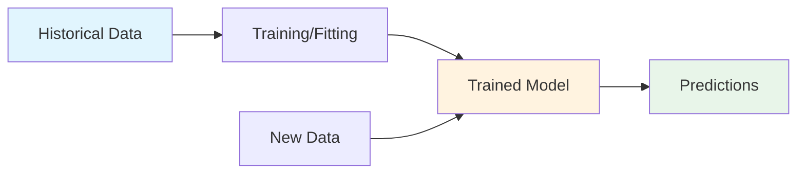

### 🏠 The Real Estate Analogy

Imagine your cousin has made millions in real estate using "intuition." When questioned, you discover his intuition is actually:

1. **Pattern Recognition**: He's observed price patterns from houses he's seen in the past
2. **Pattern Application**: He uses those patterns to predict prices for new houses

This is exactly how machine learning works!

### Why Decision Trees?

Decision trees are:
- ✅ Easy to understand and interpret
- ✅ Building blocks for more sophisticated models (like Random Forests)
- ✅ Great for capturing non-linear relationships
- ✅ Visual by nature - you can actually "see" the decision process

### How Decision Trees Work

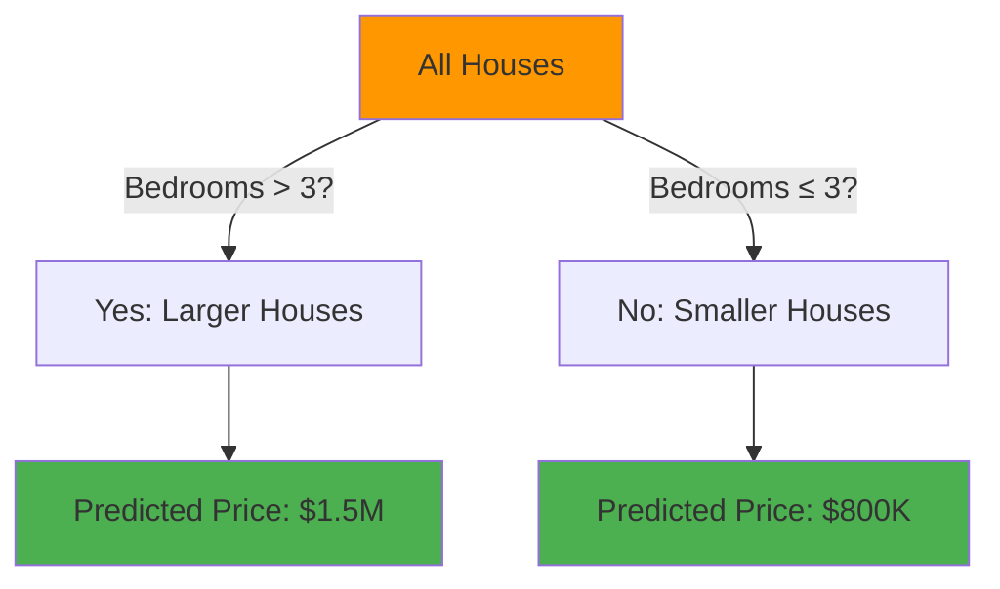

**Key Components:**
- **Root Node**: The starting point (all houses)
- **Splits**: Decision points that divide the data
- **Leaves**: Final prediction points
- **Depth**: Number of splits from root to leaf

### 🌳 Improving Decision Trees

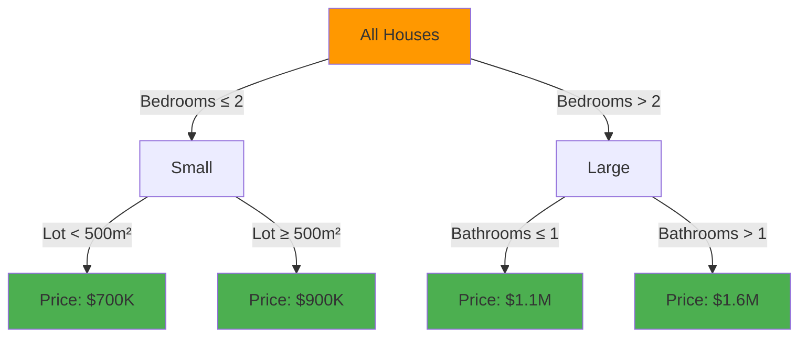

**Fun Fact:** 🤔 A decision tree with depth 10 can create up to 2¹⁰ = 1,024 leaf nodes! That's like having 1,024 different categories of houses.

### When to Use Decision Trees?

- When interpretability is important
- When you need to understand why a prediction was made
- As a baseline model before trying more complex algorithms
- When features have non-linear relationships with the target

---

## 2. Basic Data Exploration

### What is Pandas?

Pandas is the Swiss Army knife of data manipulation in Python. It provides DataFrames - think of them as supercharged Excel spreadsheets that you can program.

```python
# Import the pandas library (standard alias is 'pd')
import pandas as pd

# What is a DataFrame?
# A DataFrame is like a table with rows and columns
# Similar to:
# - Excel spreadsheet
# - SQL table
# - R data.frame
```

### Why Explore Data First?

**The Golden Rule of Data Science:** "Look at your data before you do anything with it!"

Common surprises you might find:
- Missing values
- Outliers (like a house with 50 bedrooms)
- Incorrect data types
- Unexpected value ranges

### How to Explore Data

```python
# Step 1: Load the data
file_path = 'path/to/your/data.csv'
data = pd.read_csv(file_path)

# Step 2: Get a statistical summary
print(data.describe())
```

#### Understanding `describe()` Output

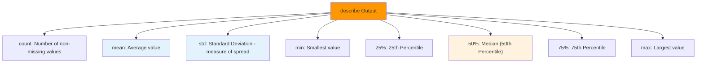

**Interpreting Percentiles:**
- **25th percentile**: 25% of values are below this number
- **50th percentile (median)**: Half the values are below, half above
- **75th percentile**: 75% of values are below this number

```python
# Example: If Rooms 25% = 2, 50% = 3, 75% = 3
# Interpretation:
# - 25% of houses have ≤ 2 rooms
# - 50% of houses have ≤ 3 rooms  
# - 75% of houses have ≤ 3 rooms
# This means most houses have 2-3 rooms!
```

### 🔍 Missing Values: The Silent Data Killer

```python
# Why do missing values occur?
# - 1-bedroom house won't have "2nd bedroom size"
# - Old houses might not have "year built" recorded
# - Some features might not apply to all properties

# Simple approach: Remove rows with missing values
data_clean = data.dropna(axis=0)
# axis=0 means drop rows (axis=1 would drop columns)
```

**Fun Fact:** 📊 Data scientists spend about 60-80% of their time cleaning and exploring data, not building models!

---

## 3. Your First Machine Learning Model

### What Are Features and Targets?

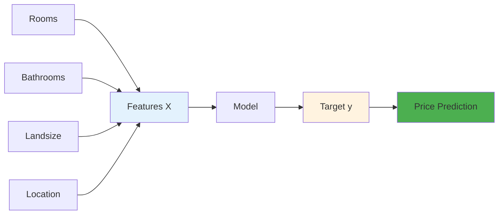

- **Features (X)**: Input variables used to make predictions
- **Target (y)**: What you're trying to predict
- **Training**: Process of learning the mapping from X to y

### Why Proper Data Selection Matters

Selecting the right features is crucial because:
- **Garbage in, garbage out**: Irrelevant features can confuse the model
- **Curse of dimensionality**: Too many features can make models slow and overfit
- **Domain knowledge**: Some features are causally related to what you're predicting

### How to Build Your First Model

```python
# Step 1: Import necessary libraries
import pandas as pd
from sklearn.tree import DecisionTreeRegressor

# Step 2: Load and prepare data
melbourne_file_path = 'melb_data.csv'
melbourne_data = pd.read_csv(melbourne_file_path)

# Step 3: Handle missing values
melbourne_data = melbourne_data.dropna(axis=0)

# Step 4: Select prediction target
y = melbourne_data.Price  # What we want to predict

# Step 5: Select features
melbourne_features = ['Rooms', 'Bathroom', 'Landsize', 'Lattitude', 'Longtitude']
X = melbourne_data[melbourne_features]  # What we use to predict

# Step 6: Examine features before modeling
print("Features summary:")
print(X.describe())
print("\nFirst few rows:")
print(X.head())

# Step 7: Define and train the model
melbourne_model = DecisionTreeRegressor(random_state=1)
melbourne_model.fit(X, y)  # This is where learning happens!

# Step 8: Make predictions
predictions = melbourne_model.predict(X.head())
print("Predictions for first 5 houses:", predictions)
```

### The `random_state` Parameter

```python
# Why use random_state?
# Some algorithms have random elements
# Setting random_state ensures reproducibility
# Any number works - it's just a seed for the random number generator
# 
# Example: random_state=1 vs random_state=42
# Both are fine, but using the same number each time
# ensures you get the same results
```

### 🎯 The Model Building Process

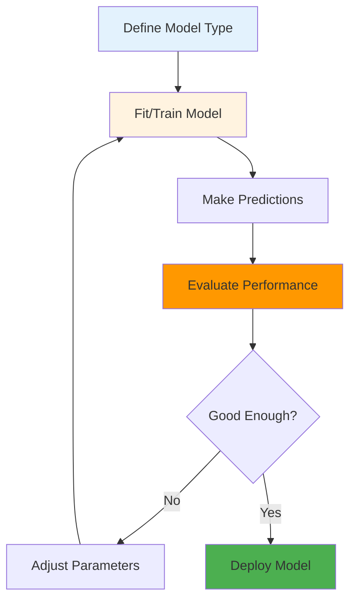

**Fun Fact:** 🎲 The `random_state` parameter is like setting a seed in Minecraft - same seed, same world. Different seed, different (but equally valid) world!

---

## 4. Model Validation

### What is Model Validation?

Model validation is the process of measuring how well your model performs on new, unseen data. It answers the question: "Will my model work in the real world?"

### Why Validation is Critical

**The Danger of "In-Sample" Validation:**

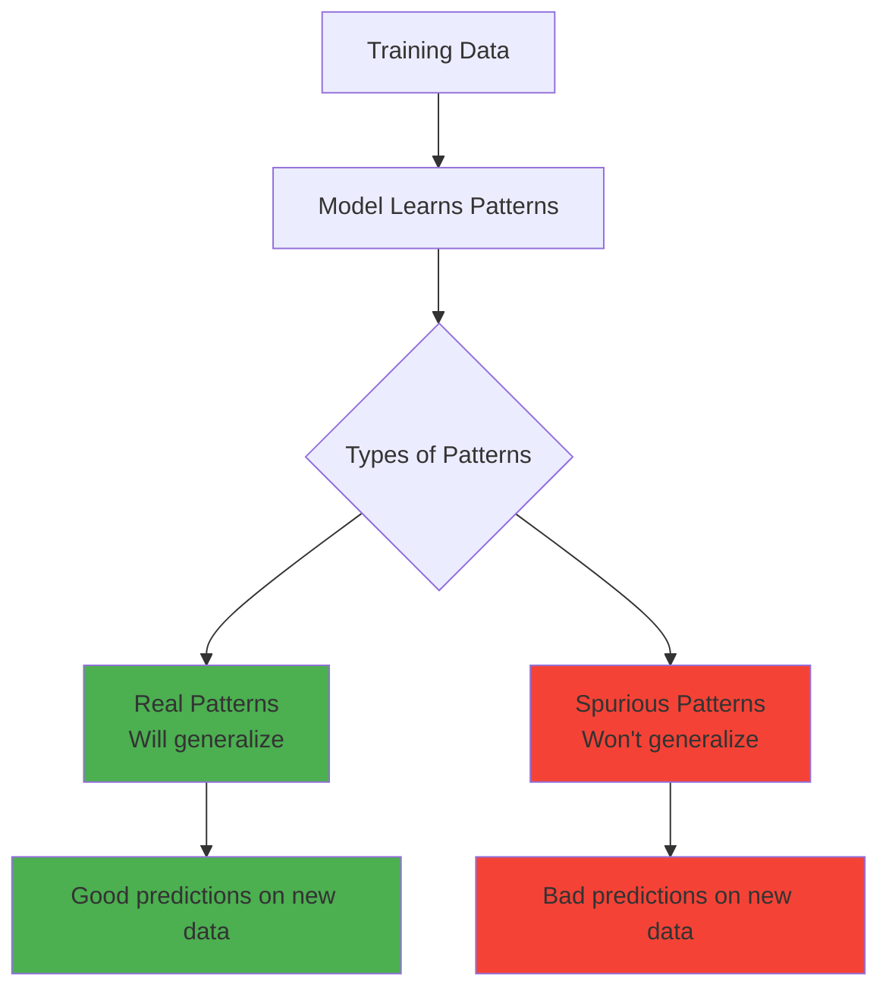

**Real-world example of spurious patterns:**
- In training data: All green-doored houses are expensive
- In reality: Door color has nothing to do with price
- Result: Model makes terrible predictions on new data

### How to Validate Models

#### Mean Absolute Error (MAE)

```python
# MAE Formula:
# error = |actual_price - predicted_price|
# MAE = average of all errors

from sklearn.metrics import mean_absolute_error

# Calculate prediction error
predicted_prices = model.predict(X)
mae = mean_absolute_error(y, predicted_prices)

# Interpretation: "On average, our predictions are off by $X"
```

#### Train-Test Split

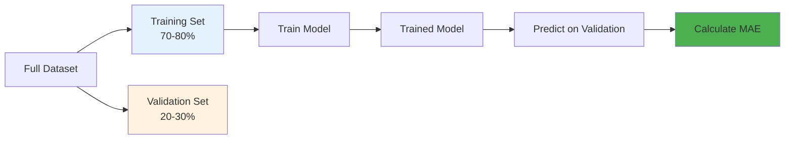

```python
from sklearn.model_selection import train_test_split

# Split the data (80% train, 20% validation)
train_X, val_X, train_y, val_y = train_test_split(
    X, y, 
    random_state=0,  # For reproducibility
    test_size=0.2    # Optional: specify validation size
)

# Train on training data
model = DecisionTreeRegressor(random_state=1)
model.fit(train_X, train_y)

# Validate on validation data
val_predictions = model.predict(val_X)
val_mae = mean_absolute_error(val_y, val_predictions)

print(f"Validation MAE: ${val_mae:,.2f}")
```

### The "In-Sample" vs "Out-of-Sample" Shock

```python
# Typical results you might see:
# In-sample MAE: $500 (looks amazing!)
# Out-of-sample MAE: $250,000 (actually terrible!)

# Why such a big difference?
# The model "memorized" the training data
# instead of learning general patterns
```

**Fun Fact:** 💡 The difference between in-sample and out-of-sample performance is like the difference between recognizing your friends' faces and recognizing faces in general. You're great at the first but might struggle with the second!

---

## 5. Underfitting and Overfitting

### What Are Underfitting and Overfitting?

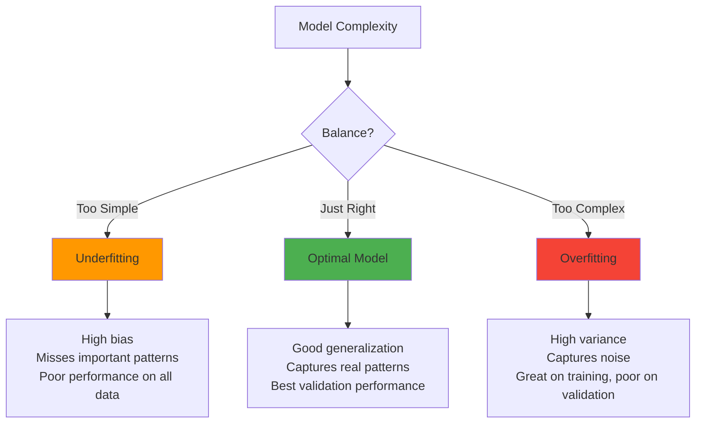

### Why Finding the Balance Matters

**Underfitting Example:**
- A tree that only splits on "Number of Bedrooms"
- Can't capture nuances like location, size, condition
- Even performs poorly on training data

**Overfitting Example:**
- A tree with 1,000 leaves
- Each leaf has only 2-3 houses
- Perfect on training data, but predictions for new houses are based on too few examples

### How to Find the Sweet Spot

```python
from sklearn.metrics import mean_absolute_error
from sklearn.tree import DecisionTreeRegressor

def get_mae(max_leaf_nodes, train_X, val_X, train_y, val_y):
    """
    Calculate MAE for a decision tree with specific max_leaf_nodes
    
    Parameters:
    - max_leaf_nodes: Controls tree complexity
      - Low values → Simple tree (risk of underfitting)
      - High values → Complex tree (risk of overfitting)
    """
    model = DecisionTreeRegressor(
        max_leaf_nodes=max_leaf_nodes, 
        random_state=0
    )
    model.fit(train_X, train_y)
    predictions = model.predict(val_X)
    mae = mean_absolute_error(val_y, predictions)
    return mae

# Test different tree complexities
for max_leaf_nodes in [5, 50, 500, 5000]:
    mae = get_mae(max_leaf_nodes, train_X, val_X, train_y, val_y)
    print(f"Max leaf nodes: {max_leaf_nodes:4d}  MAE: ${mae:,.0f}")

# Example output:
# Max leaf nodes:    5  MAE: $347,380  (Underfitting)
# Max leaf nodes:   50  MAE: $258,171  (Better)
# Max leaf nodes:  500  MAE: $243,495  (Best!)
# Max leaf nodes: 5000  MAE: $254,983  (Starting to overfit)
```

### Visualizing the Bias-Variance Tradeoff

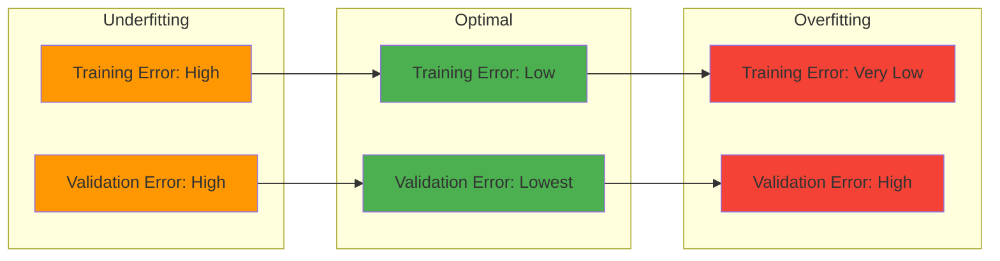

### Signs to Watch For

| Condition | Training Performance | Validation Performance | What to Do |
|-----------|---------------------|----------------------|------------|
| Underfitting | Poor | Poor | Increase model complexity |
| Overfitting | Excellent | Poor | Decrease model complexity, get more data |
| Just Right | Good | Good | Deploy model! |

**Fun Fact:** 🎯 Finding the right model complexity is like Goldilocks finding the right porridge - not too hot (complex), not too cold (simple), but just right!

---

## 6. Random Forests

### What is a Random Forest?

A Random Forest is an ensemble of decision trees that work together to make better predictions than any single tree could alone.

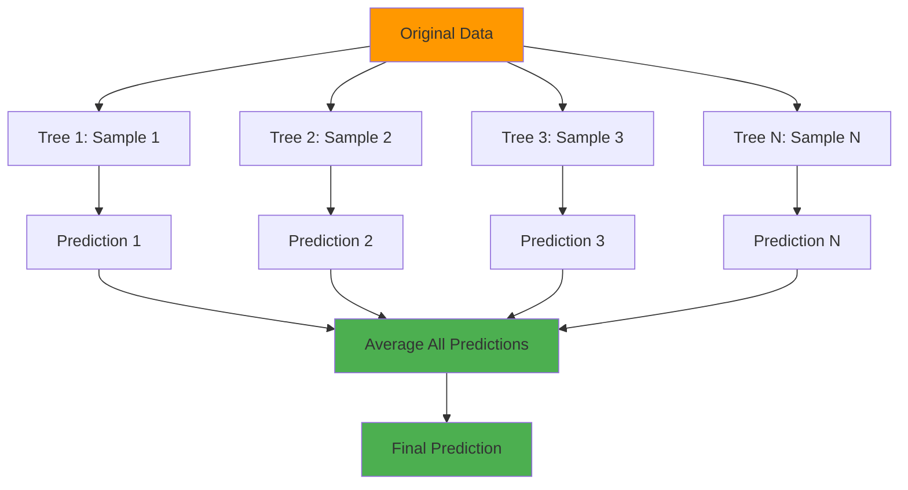

### Why Random Forests Work Better

**The Wisdom of Crowds Principle:**

1. **Diversity**: Each tree sees a random subset of data and features
2. **Error Cancellation**: Individual tree errors tend to cancel out
3. **Robustness**: Less sensitive to noise and outliers
4. **Reduced Overfitting**: Averaging smooths out extreme predictions

### How Random Forests Combat Overfitting

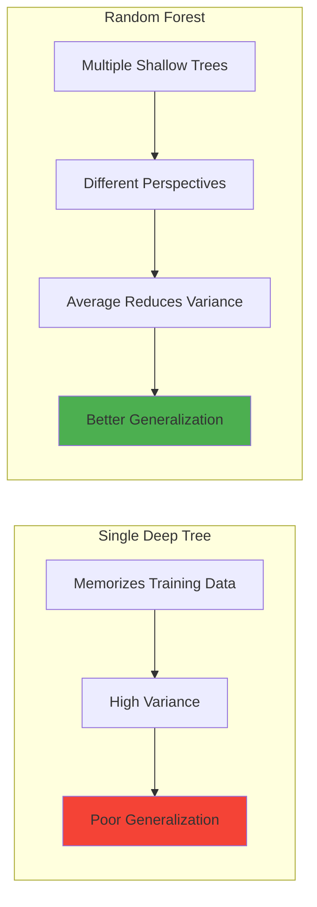

### Implementation

```python
from sklearn.ensemble import RandomForestRegressor
from sklearn.metrics import mean_absolute_error

# Create and train Random Forest
forest_model = RandomForestRegressor(
    random_state=1,        # For reproducibility
    n_estimators=100       # Number of trees (default)
)
forest_model.fit(train_X, train_y)

# Make predictions
predictions = forest_model.predict(val_X)

# Evaluate
mae = mean_absolute_error(val_y, predictions)
print(f"Random Forest MAE: ${mae:,.0f}")

# Compare with Decision Tree
tree_model = DecisionTreeRegressor(random_state=1)
tree_model.fit(train_X, train_y)
tree_predictions = tree_model.predict(val_X)
tree_mae = mean_absolute_error(val_y, tree_predictions)

print(f"Decision Tree MAE: ${tree_mae:,.0f}")
print(f"Improvement: ${tree_mae - mae:,.0f}")
```

### Key Parameters to Tune

```python
# Advanced Random Forest with tuning
from sklearn.ensemble import RandomForestRegressor

forest_model = RandomForestRegressor(
    n_estimators=100,      # Number of trees (more = better but slower)
    max_depth=None,        # Maximum depth of trees
    min_samples_split=2,   # Minimum samples to split a node
    min_samples_leaf=1,    # Minimum samples in a leaf
    max_features='auto',   # Features to consider for splits
    random_state=1
)
```

**Fun Fact:** 🌲 Random Forests are like having a committee of experts instead of a single dictator. Each expert (tree) might be wrong sometimes, but together they usually make better decisions!

---

## 7. Machine Learning Competitions

### What are ML Competitions?

Machine learning competitions are platforms where data scientists compete to build the best models for real-world problems. Kaggle is the most popular platform.

### Why Participate?

1. **Real-world Experience**: Work with actual business problems
2. **Learning Opportunity**: See how top performers approach problems
3. **Portfolio Building**: Demonstrate your skills to employers
4. **Community**: Learn from discussions and shared solutions

### How to Approach a Competition

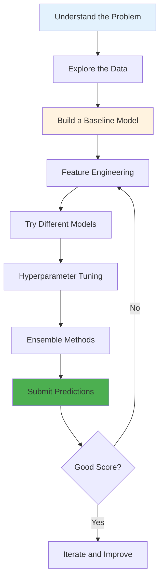

### Competition Workflow Example

```python
# Step 1: Load competition data
train_data = pd.read_csv('train.csv')
test_data = pd.read_csv('test.csv')

# Step 2: Prepare features and target
y = train_data.SalePrice
features = ['LotArea', 'YearBuilt', '1stFlrSF', '2ndFlrSF', 
            'FullBath', 'BedroomAbvGr', 'TotRmsAbvGrd']
X = train_data[features]

# Step 3: Split training data for validation
train_X, val_X, train_y, val_y = train_test_split(X, y, random_state=1)

# Step 4: Train model (Random Forest usually a good start)
model = RandomForestRegressor(n_estimators=100, random_state=1)
model.fit(train_X, train_y)

# Step 5: Validate
val_predictions = model.predict(val_X)
val_mae = mean_absolute_error(val_y, val_predictions)
print(f"Validation MAE: ${val_mae:,.0f}")

# Step 6: Predict on test data
test_X = test_data[features]
test_predictions = model.predict(test_X)

# Step 7: Create submission file
output = pd.DataFrame({
    'Id': test_data.Id,
    'SalePrice': test_predictions
})
output.to_csv('submission.csv', index=False)
print("Submission saved!")
```

### Tips for Competition Success

| Tip | Description |
|-----|-------------|
| **Start Simple** | Begin with a basic model, then iterate |
| **Feature Engineering** | Create new features from existing ones |
| **Cross-Validation** | Use multiple validation splits for robustness |
| **Ensemble** | Combine multiple models for better predictions |
| **Learn from Others** | Read competition forums and kernels |

**Fun Fact:** 🏆 The Netflix Prize competition offered $1 million to anyone who could improve their recommendation algorithm by 10%. It took 3 years for someone to win!

---

## 🎓 Putting It All Together

### The Complete ML Workflow

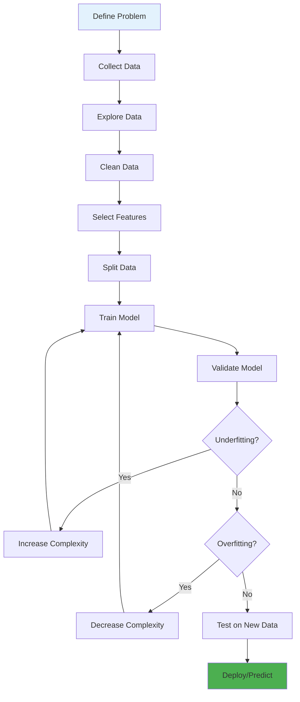

### Key Takeaways

1. **Decision Trees** are intuitive models that split data based on feature values
2. **Data Exploration** is crucial - always look at your data first!
3. **Train-Test Split** prevents the illusion of good performance
4. **Underfitting/Overfitting** is the central challenge in ML
5. **Random Forests** combine multiple trees for better, more robust predictions
6. **Validation** should always be on unseen data

### Quick Reference: Model Selection Guide

| Situation | Recommended Model |
|-----------|------------------|
| Need interpretability | Decision Tree |
| Best accuracy, structured data | Random Forest |
| Quick baseline | Decision Tree (shallow) |
| Competition/Production | Random Forest (tuned) |

### Final Code Template

```python
# Complete ML Pipeline
import pandas as pd
from sklearn.model_selection import train_test_split
from sklearn.ensemble import RandomForestRegressor
from sklearn.metrics import mean_absolute_error

# 1. Load data
data = pd.read_csv('data.csv')

# 2. Define features and target
y = data.Price
features = ['feature1', 'feature2', 'feature3']
X = data[features]

# 3. Split data
train_X, val_X, train_y, val_y = train_test_split(
    X, y, random_state=1
)

# 4. Define and train model
model = RandomForestRegressor(random_state=1)
model.fit(train_X, train_y)

# 5. Validate
predictions = model.predict(val_X)
mae = mean_absolute_error(val_y, predictions)
print(f"Model MAE: ${mae:,.2f}")

# 6. Make predictions on new data
new_predictions = model.predict(new_X)
```

---

**Happy Modeling!** 🚀 Remember: The best way to learn is by doing. Try these concepts with different datasets and see how they work in practice!# 📊 Machine Learning with Decision Trees and Random Forests

## A Comprehensive Guide to Building Predictive Models

---

## 📑 Table of Contents

1. [How Models Work](#1-how-models-work)
2. [Basic Data Exploration](#2-basic-data-exploration)
3. [Your First Machine Learning Model](#3-your-first-machine-learning-model)
4. [Model Validation](#4-model-validation)
5. [Underfitting and Overfitting](#5-underfitting-and-overfitting)
6. [Random Forests](#6-random-forests)
7. [Machine Learning Competitions](#7-machine-learning-competitions)

---

## 1. How Models Work

### What is a Machine Learning Model?

A machine learning model is a mathematical framework that learns patterns from data to make predictions. Think of it as a student learning from examples - the more good examples it sees, the better it becomes at making predictions.


### 🏠 The Real Estate Analogy

Imagine your cousin has made millions in real estate using "intuition." When questioned, you discover his intuition is actually:

1. **Pattern Recognition**: He's observed price patterns from houses he's seen in the past
2. **Pattern Application**: He uses those patterns to predict prices for new houses

This is exactly how machine learning works!

### Why Decision Trees?

Decision trees are:
- ✅ Easy to understand and interpret
- ✅ Building blocks for more sophisticated models (like Random Forests)
- ✅ Great for capturing non-linear relationships
- ✅ Visual by nature - you can actually "see" the decision process

### How Decision Trees Work


**Key Components:**
- **Root Node**: The starting point (all houses)
- **Splits**: Decision points that divide the data
- **Leaves**: Final prediction points
- **Depth**: Number of splits from root to leaf

### 🌳 Improving Decision Trees


**Fun Fact:** 🤔 A decision tree with depth 10 can create up to 2¹⁰ = 1,024 leaf nodes! That's like having 1,024 different categories of houses.

### When to Use Decision Trees?

- When interpretability is important
- When you need to understand why a prediction was made
- As a baseline model before trying more complex algorithms
- When features have non-linear relationships with the target

---

## 2. Basic Data Exploration

### What is Pandas?

Pandas is the Swiss Army knife of data manipulation in Python. It provides DataFrames - think of them as supercharged Excel spreadsheets that you can program.

```python
# Import the pandas library (standard alias is 'pd')
import pandas as pd

# What is a DataFrame?
# A DataFrame is like a table with rows and columns
# Similar to:
# - Excel spreadsheet
# - SQL table
# - R data.frame
```

### Why Explore Data First?

**The Golden Rule of Data Science:** "Look at your data before you do anything with it!"

Common surprises you might find:
- Missing values
- Outliers (like a house with 50 bedrooms)
- Incorrect data types
- Unexpected value ranges

### How to Explore Data

```python
# Step 1: Load the data
file_path = 'path/to/your/data.csv'
data = pd.read_csv(file_path)

# Step 2: Get a statistical summary
print(data.describe())
```

#### Understanding `describe()` Output


**Interpreting Percentiles:**
- **25th percentile**: 25% of values are below this number
- **50th percentile (median)**: Half the values are below, half above
- **75th percentile**: 75% of values are below this number

```python
# Example: If Rooms 25% = 2, 50% = 3, 75% = 3
# Interpretation:
# - 25% of houses have ≤ 2 rooms
# - 50% of houses have ≤ 3 rooms  
# - 75% of houses have ≤ 3 rooms
# This means most houses have 2-3 rooms!
```

### 🔍 Missing Values: The Silent Data Killer

```python
# Why do missing values occur?
# - 1-bedroom house won't have "2nd bedroom size"
# - Old houses might not have "year built" recorded
# - Some features might not apply to all properties

# Simple approach: Remove rows with missing values
data_clean = data.dropna(axis=0)
# axis=0 means drop rows (axis=1 would drop columns)
```

**Fun Fact:** 📊 Data scientists spend about 60-80% of their time cleaning and exploring data, not building models!

---

## 3. Your First Machine Learning Model

### What Are Features and Targets?


- **Features (X)**: Input variables used to make predictions
- **Target (y)**: What you're trying to predict
- **Training**: Process of learning the mapping from X to y

### Why Proper Data Selection Matters

Selecting the right features is crucial because:
- **Garbage in, garbage out**: Irrelevant features can confuse the model
- **Curse of dimensionality**: Too many features can make models slow and overfit
- **Domain knowledge**: Some features are causally related to what you're predicting

### How to Build Your First Model

```python
# Step 1: Import necessary libraries
import pandas as pd
from sklearn.tree import DecisionTreeRegressor

# Step 2: Load and prepare data
melbourne_file_path = 'melb_data.csv'
melbourne_data = pd.read_csv(melbourne_file_path)

# Step 3: Handle missing values
melbourne_data = melbourne_data.dropna(axis=0)

# Step 4: Select prediction target
y = melbourne_data.Price  # What we want to predict

# Step 5: Select features
melbourne_features = ['Rooms', 'Bathroom', 'Landsize', 'Lattitude', 'Longtitude']
X = melbourne_data[melbourne_features]  # What we use to predict

# Step 6: Examine features before modeling
print("Features summary:")
print(X.describe())
print("\nFirst few rows:")
print(X.head())

# Step 7: Define and train the model
melbourne_model = DecisionTreeRegressor(random_state=1)
melbourne_model.fit(X, y)  # This is where learning happens!

# Step 8: Make predictions
predictions = melbourne_model.predict(X.head())
print("Predictions for first 5 houses:", predictions)
```

### The `random_state` Parameter

```python
# Why use random_state?
# Some algorithms have random elements
# Setting random_state ensures reproducibility
# Any number works - it's just a seed for the random number generator
# 
# Example: random_state=1 vs random_state=42
# Both are fine, but using the same number each time
# ensures you get the same results
```

### 🎯 The Model Building Process


**Fun Fact:** 🎲 The `random_state` parameter is like setting a seed in Minecraft - same seed, same world. Different seed, different (but equally valid) world!

---

## 4. Model Validation

### What is Model Validation?

Model validation is the process of measuring how well your model performs on new, unseen data. It answers the question: "Will my model work in the real world?"

### Why Validation is Critical

**The Danger of "In-Sample" Validation:**

```mermaid
graph TD
    A[Training Data] --> B[Model Learns Patterns]
    B --> C{Types of Patterns}
    C --> D[Real Patterns<br/>Will generalize]
    C --> E[Spurious Patterns<br/>Won't generalize]
    
    D --> F[Good predictions on new data]
    E --> G[Bad predictions on new data]
    
    style D fill:#4caf50
    style E fill:#f44336
    style F fill:#4caf50
    style G fill:#f44336
```

**Real-world example of spurious patterns:**
- In training data: All green-doored houses are expensive
- In reality: Door color has nothing to do with price
- Result: Model makes terrible predictions on new data

### How to Validate Models

#### Mean Absolute Error (MAE)

```python
# MAE Formula:
# error = |actual_price - predicted_price|
# MAE = average of all errors

from sklearn.metrics import mean_absolute_error

# Calculate prediction error
predicted_prices = model.predict(X)
mae = mean_absolute_error(y, predicted_prices)

# Interpretation: "On average, our predictions are off by $X"
```

#### Train-Test Split

```mermaid
graph LR
    A[Full Dataset] --> B[Training Set<br/>70-80%]
    A --> C[Validation Set<br/>20-30%]
    
    B --> D[Train Model]
    D --> E[Trained Model]
    E --> F[Predict on Validation]
    F --> G[Calculate MAE]
    
    style B fill:#e3f2fd
    style C fill:#fff3e0
    style G fill:#4caf50
```

```python
from sklearn.model_selection import train_test_split

# Split the data (80% train, 20% validation)
train_X, val_X, train_y, val_y = train_test_split(
    X, y, 
    random_state=0,  # For reproducibility
    test_size=0.2    # Optional: specify validation size
)

# Train on training data
model = DecisionTreeRegressor(random_state=1)
model.fit(train_X, train_y)

# Validate on validation data
val_predictions = model.predict(val_X)
val_mae = mean_absolute_error(val_y, val_predictions)

print(f"Validation MAE: ${val_mae:,.2f}")
```

### The "In-Sample" vs "Out-of-Sample" Shock

```python
# Typical results you might see:
# In-sample MAE: $500 (looks amazing!)
# Out-of-sample MAE: $250,000 (actually terrible!)

# Why such a big difference?
# The model "memorized" the training data
# instead of learning general patterns
```

**Fun Fact:** 💡 The difference between in-sample and out-of-sample performance is like the difference between recognizing your friends' faces and recognizing faces in general. You're great at the first but might struggle with the second!

---

## 5. Underfitting and Overfitting

### What Are Underfitting and Overfitting?

```mermaid
graph TD
    A[Model Complexity] --> B{Balance?}
    
    B -->|Too Simple| C[Underfitting]
    B -->|Just Right| D[Optimal Model]
    B -->|Too Complex| E[Overfitting]
    
    C --> F["High bias<br/>Misses important patterns<br/>Poor performance on all data"]
    D --> G["Good generalization<br/>Captures real patterns<br/>Best validation performance"]
    E --> H["High variance<br/>Captures noise<br/>Great on training, poor on validation"]
    
    style C fill:#ff9800
    style D fill:#4caf50
    style E fill:#f44336
```

### Why Finding the Balance Matters

**Underfitting Example:**
- A tree that only splits on "Number of Bedrooms"
- Can't capture nuances like location, size, condition
- Even performs poorly on training data

**Overfitting Example:**
- A tree with 1,000 leaves
- Each leaf has only 2-3 houses
- Perfect on training data, but predictions for new houses are based on too few examples

### How to Find the Sweet Spot

```python
from sklearn.metrics import mean_absolute_error
from sklearn.tree import DecisionTreeRegressor

def get_mae(max_leaf_nodes, train_X, val_X, train_y, val_y):
    """
    Calculate MAE for a decision tree with specific max_leaf_nodes
    
    Parameters:
    - max_leaf_nodes: Controls tree complexity
      - Low values → Simple tree (risk of underfitting)
      - High values → Complex tree (risk of overfitting)
    """
    model = DecisionTreeRegressor(
        max_leaf_nodes=max_leaf_nodes, 
        random_state=0
    )
    model.fit(train_X, train_y)
    predictions = model.predict(val_X)
    mae = mean_absolute_error(val_y, predictions)
    return mae

# Test different tree complexities
for max_leaf_nodes in [5, 50, 500, 5000]:
    mae = get_mae(max_leaf_nodes, train_X, val_X, train_y, val_y)
    print(f"Max leaf nodes: {max_leaf_nodes:4d}  MAE: ${mae:,.0f}")

# Example output:
# Max leaf nodes:    5  MAE: $347,380  (Underfitting)
# Max leaf nodes:   50  MAE: $258,171  (Better)
# Max leaf nodes:  500  MAE: $243,495  (Best!)
# Max leaf nodes: 5000  MAE: $254,983  (Starting to overfit)
```

### Visualizing the Bias-Variance Tradeoff

```mermaid
graph LR
    subgraph Underfitting
    A[Training Error: High] 
    B[Validation Error: High]
    end
    
    subgraph Optimal
    C[Training Error: Low]
    D[Validation Error: Lowest]
    end
    
    subgraph Overfitting
    E[Training Error: Very Low]
    F[Validation Error: High]
    end
    
    A --> C --> E
    B --> D --> F
    
    style A fill:#ff9800
    style B fill:#ff9800
    style C fill:#4caf50
    style D fill:#4caf50
    style E fill:#f44336
    style F fill:#f44336
```

### Signs to Watch For

| Condition | Training Performance | Validation Performance | What to Do |
|-----------|---------------------|----------------------|------------|
| Underfitting | Poor | Poor | Increase model complexity |
| Overfitting | Excellent | Poor | Decrease model complexity, get more data |
| Just Right | Good | Good | Deploy model! |

**Fun Fact:** 🎯 Finding the right model complexity is like Goldilocks finding the right porridge - not too hot (complex), not too cold (simple), but just right!

---

## 6. Random Forests

### What is a Random Forest?

A Random Forest is an ensemble of decision trees that work together to make better predictions than any single tree could alone.

```mermaid
graph TD
    A[Original Data] --> B[Tree 1: Sample 1]
    A --> C[Tree 2: Sample 2]
    A --> D[Tree 3: Sample 3]
    A --> E[Tree N: Sample N]
    
    B --> F[Prediction 1]
    C --> G[Prediction 2]
    D --> H[Prediction 3]
    E --> I[Prediction N]
    
    F --> J[Average All Predictions]
    G --> J
    H --> J
    I --> J
    
    J --> K[Final Prediction]
    
    style A fill:#ff9800
    style J fill:#4caf50
    style K fill:#4caf50
```

### Why Random Forests Work Better

**The Wisdom of Crowds Principle:**

1. **Diversity**: Each tree sees a random subset of data and features
2. **Error Cancellation**: Individual tree errors tend to cancel out
3. **Robustness**: Less sensitive to noise and outliers
4. **Reduced Overfitting**: Averaging smooths out extreme predictions

### How Random Forests Combat Overfitting

```mermaid
graph LR
    subgraph "Single Deep Tree"
    A[Memorizes Training Data] --> B[High Variance]
    B --> C[Poor Generalization]
    end
    
    subgraph "Random Forest"
    D[Multiple Shallow Trees] --> E[Different Perspectives]
    E --> F[Average Reduces Variance]
    F --> G[Better Generalization]
    end
    
    style C fill:#f44336
    style G fill:#4caf50
```

### Implementation

```python
from sklearn.ensemble import RandomForestRegressor
from sklearn.metrics import mean_absolute_error

# Create and train Random Forest
forest_model = RandomForestRegressor(
    random_state=1,        # For reproducibility
    n_estimators=100       # Number of trees (default)
)
forest_model.fit(train_X, train_y)

# Make predictions
predictions = forest_model.predict(val_X)

# Evaluate
mae = mean_absolute_error(val_y, predictions)
print(f"Random Forest MAE: ${mae:,.0f}")

# Compare with Decision Tree
tree_model = DecisionTreeRegressor(random_state=1)
tree_model.fit(train_X, train_y)
tree_predictions = tree_model.predict(val_X)
tree_mae = mean_absolute_error(val_y, tree_predictions)

print(f"Decision Tree MAE: ${tree_mae:,.0f}")
print(f"Improvement: ${tree_mae - mae:,.0f}")
```

### Key Parameters to Tune

```python
# Advanced Random Forest with tuning
from sklearn.ensemble import RandomForestRegressor

forest_model = RandomForestRegressor(
    n_estimators=100,      # Number of trees (more = better but slower)
    max_depth=None,        # Maximum depth of trees
    min_samples_split=2,   # Minimum samples to split a node
    min_samples_leaf=1,    # Minimum samples in a leaf
    max_features='auto',   # Features to consider for splits
    random_state=1
)
```

**Fun Fact:** 🌲 Random Forests are like having a committee of experts instead of a single dictator. Each expert (tree) might be wrong sometimes, but together they usually make better decisions!

---

## 7. Machine Learning Competitions

### What are ML Competitions?

Machine learning competitions are platforms where data scientists compete to build the best models for real-world problems. Kaggle is the most popular platform.

### Why Participate?

1. **Real-world Experience**: Work with actual business problems
2. **Learning Opportunity**: See how top performers approach problems
3. **Portfolio Building**: Demonstrate your skills to employers
4. **Community**: Learn from discussions and shared solutions

### How to Approach a Competition

```mermaid
graph TD
    A[Understand the Problem] --> B[Explore the Data]
    B --> C[Build a Baseline Model]
    C --> D[Feature Engineering]
    D --> E[Try Different Models]
    E --> F[Hyperparameter Tuning]
    F --> G[Ensemble Methods]
    G --> H[Submit Predictions]
    
    H --> I{Good Score?}
    I -->|No| D
    I -->|Yes| J[Iterate and Improve]
    
    style A fill:#e3f2fd
    style C fill:#fff3e0
    style H fill:#4caf50
```

### Competition Workflow Example

```python
# Step 1: Load competition data
train_data = pd.read_csv('train.csv')
test_data = pd.read_csv('test.csv')

# Step 2: Prepare features and target
y = train_data.SalePrice
features = ['LotArea', 'YearBuilt', '1stFlrSF', '2ndFlrSF', 
            'FullBath', 'BedroomAbvGr', 'TotRmsAbvGrd']
X = train_data[features]

# Step 3: Split training data for validation
train_X, val_X, train_y, val_y = train_test_split(X, y, random_state=1)

# Step 4: Train model (Random Forest usually a good start)
model = RandomForestRegressor(n_estimators=100, random_state=1)
model.fit(train_X, train_y)

# Step 5: Validate
val_predictions = model.predict(val_X)
val_mae = mean_absolute_error(val_y, val_predictions)
print(f"Validation MAE: ${val_mae:,.0f}")

# Step 6: Predict on test data
test_X = test_data[features]
test_predictions = model.predict(test_X)

# Step 7: Create submission file
output = pd.DataFrame({
    'Id': test_data.Id,
    'SalePrice': test_predictions
})
output.to_csv('submission.csv', index=False)
print("Submission saved!")
```

### Tips for Competition Success

| Tip | Description |
|-----|-------------|
| **Start Simple** | Begin with a basic model, then iterate |
| **Feature Engineering** | Create new features from existing ones |
| **Cross-Validation** | Use multiple validation splits for robustness |
| **Ensemble** | Combine multiple models for better predictions |
| **Learn from Others** | Read competition forums and kernels |

**Fun Fact:** 🏆 The Netflix Prize competition offered $1 million to anyone who could improve their recommendation algorithm by 10%. It took 3 years for someone to win!

---

## 🎓 Putting It All Together

### The Complete ML Workflow

```mermaid
graph TD
    A[Define Problem] --> B[Collect Data]
    B --> C[Explore Data]
    C --> D[Clean Data]
    D --> E[Select Features]
    E --> F[Split Data]
    F --> G[Train Model]
    G --> H[Validate Model]
    H --> I{Underfitting?}
    I -->|Yes| J[Increase Complexity]
    I -->|No| K{Overfitting?}
    K -->|Yes| L[Decrease Complexity]
    K -->|No| M[Test on New Data]
    J --> G
    L --> G
    M --> N[Deploy/Predict]
    
    style A fill:#e3f2fd
    style N fill:#4caf50
```

### Key Takeaways

1. **Decision Trees** are intuitive models that split data based on feature values
2. **Data Exploration** is crucial - always look at your data first!
3. **Train-Test Split** prevents the illusion of good performance
4. **Underfitting/Overfitting** is the central challenge in ML
5. **Random Forests** combine multiple trees for better, more robust predictions
6. **Validation** should always be on unseen data

### Quick Reference: Model Selection Guide

| Situation | Recommended Model |
|-----------|------------------|
| Need interpretability | Decision Tree |
| Best accuracy, structured data | Random Forest |
| Quick baseline | Decision Tree (shallow) |
| Competition/Production | Random Forest (tuned) |

### Final Code Template

```python
# Complete ML Pipeline
import pandas as pd
from sklearn.model_selection import train_test_split
from sklearn.ensemble import RandomForestRegressor
from sklearn.metrics import mean_absolute_error

# 1. Load data
data = pd.read_csv('data.csv')

# 2. Define features and target
y = data.Price
features = ['feature1', 'feature2', 'feature3']
X = data[features]

# 3. Split data
train_X, val_X, train_y, val_y = train_test_split(
    X, y, random_state=1
)

# 4. Define and train model
model = RandomForestRegressor(random_state=1)
model.fit(train_X, train_y)

# 5. Validate
predictions = model.predict(val_X)
mae = mean_absolute_error(val_y, predictions)
print(f"Model MAE: ${mae:,.2f}")

# 6. Make predictions on new data
new_predictions = model.predict(new_X)
```

---

**Happy Modeling!** 🚀 Remember: The best way to learn is by doing. Try these concepts with different datasets and see how they work in practice!