# 📊 [Kaggle: Intro to Machine Learning](https://www.kaggle.com/learn/certification/beinganujchaudhary/intro-to-machine-learning)


## Table of Contents

1. [How Machine Learning Models Work](#how-machine-learning-models-work)
2. [Basic Data Exploration](#basic-data-exploration)
3. [Your First Machine Learning Model](#your-first-machine-learning-model)
4. [Model Validation](#model-validation)
5. [Underfitting and Overfitting](#underfitting-and-overfitting)
6. [Random Forests](#random-forests)
7. [Machine Learning Competitions](#machine-learning-competitions)

---

## How Machine Learning Models Work

### The "Intuition" Analogy

Imagine you're a real estate agent (or a savvy investor). When you look at a new house, you instinctively guess its value based on past experiences. You might think, "This house is similar to that one on Elm Street that sold for $300,000, but it has a smaller yard, so maybe $280,000."

**Machine learning models work the exact same way. A machine learning model is a mathematical framework that learns patterns from data to make predictions.** They learn patterns from historical data and use those patterns to make predictions on new data. Think of it as a student learning from examples - the more good examples it sees, the better it becomes at making predictions.

When questioned, you discover his intuition is actually:

1. **Pattern Recognition**: you observed price patterns from your houses seen in the past

2. **Pattern Application:** You use those patterns to predict prices for new houses

This is exactly how machine learning works!

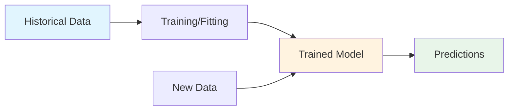

### The Decision Tree: A Simple Starting Point

The **Decision Tree** is one of the simplest and most intuitive machine learning models. It works by asking a series of "if-then-else" questions to split the data into smaller and smaller groups until it reaches a prediction.

**A Simple Decision Tree:**

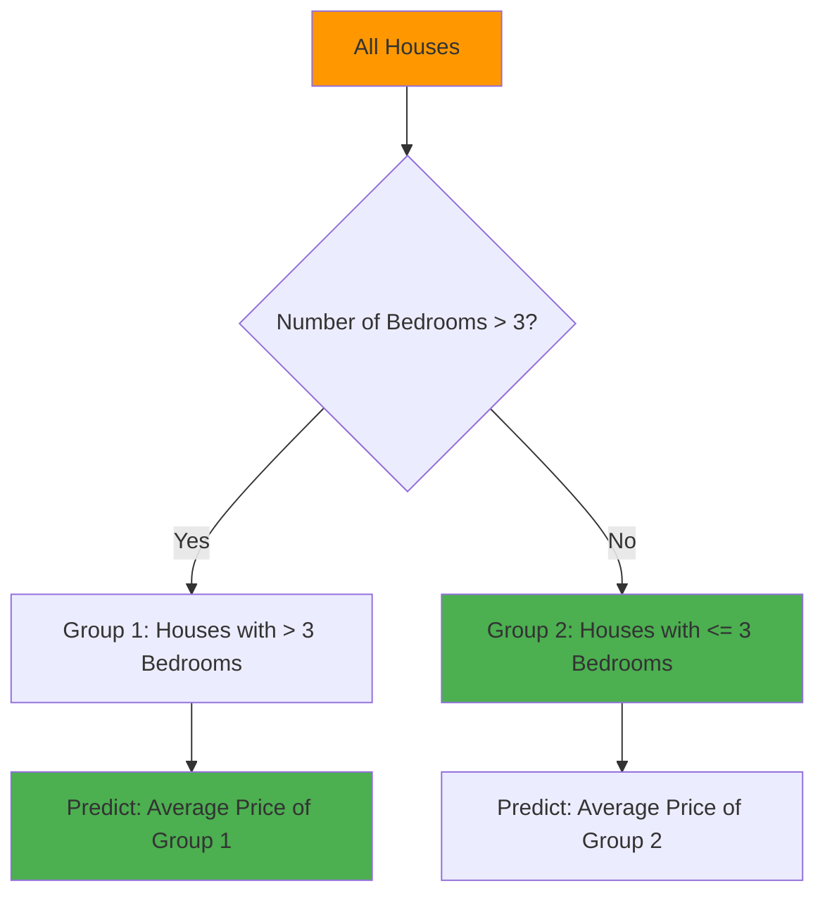

This is a tree with only one "split." The model's prediction is simply the average price of the houses in that group. This is called a **leaf** of the tree.

A "deeper" tree is more complex and can capture more factors (e.g., lot size, location).

**Why Decision Trees?**
Decision trees are:
- ✅ Easy to understand and interpret
- ✅ Building blocks for more sophisticated models (like Random Forests)
- ✅ Great for capturing non-linear relationships
- ✅ Visual by nature - you can actually "see" the decision process

**When to Use Decision Trees?**
1. When interpretability is important
2. When you need to understand why a prediction was made
3. As a baseline model before trying more complex algorithms
4. When features have non-linear relationships with the target

**Key Components:**
1. **Root Node**: The starting point (all houses)
1. **Splits**: Decision points that divide the data
3. **Leaves**: Final prediction points
4. **Depth**: Number of splits from root to leaf

**Important Terms:**
- **Fit or Train:** The process of the model learning the patterns and deciding where to make the "splits" is called **fitting** or **training**.
- **Training Data:** The data used to fit the model.
- **Features:** The inputs to the model (e.g., `BedroomCount`, `LotArea`).
- **Target:** The value we are trying to predict (e.g., `SalePrice`).

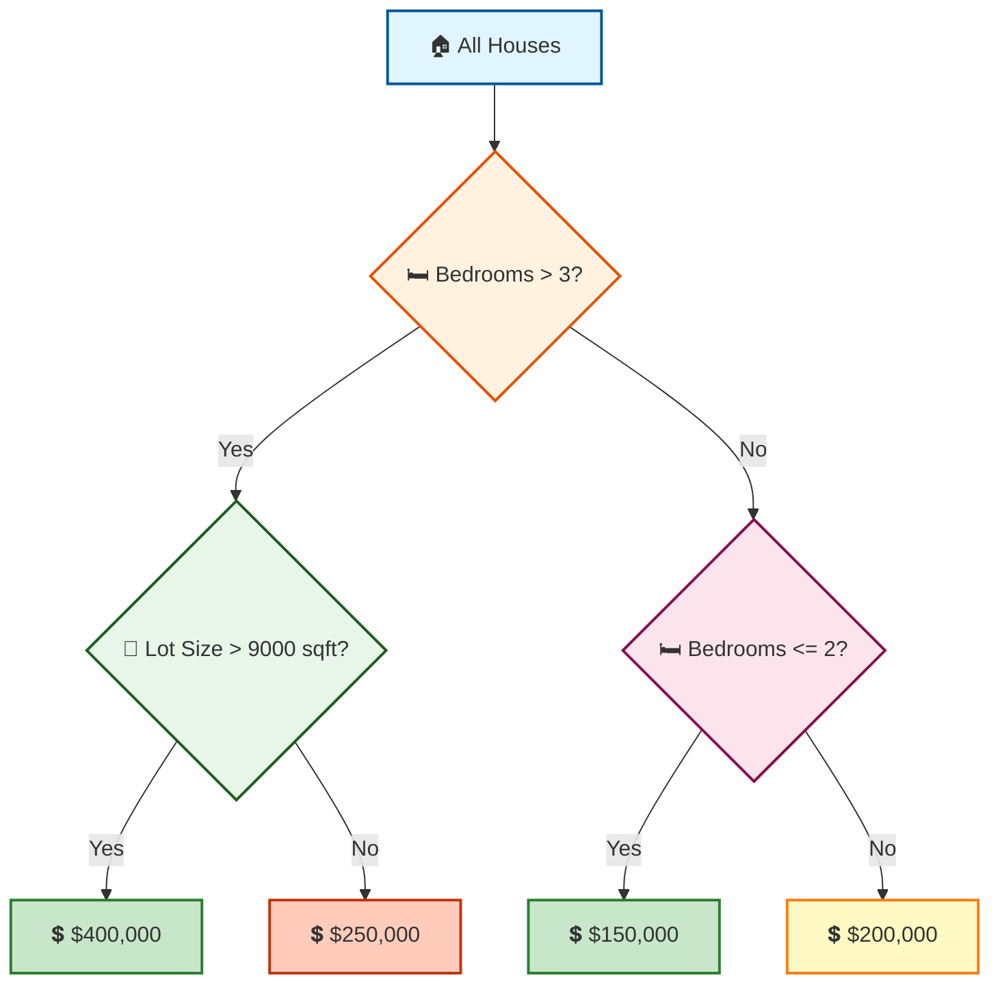


### Fun Fact

The first decision tree algorithm, the "ID3 algorithm," was invented by Ross Quinlan in 1986. This was a foundational moment in the field of machine learning, making complex pattern recognition much more accessible.

---

## Basic Data Exploration

### Why Explore the Data?

Before building any model, you need to understand your data. What kind of information is available? Are there any missing values? What are the typical values for each feature? **Data exploration** is the most crucial first step in any data science project.

**The Golden Rule of Data Science:** "Look at your data before you do anything with it!"
- Common surprises you might find:
- Missing values
- Outliers (like a house with 50 bedrooms)
- Incorrect data types
- Unexpected value ranges

**Why do missing values occur?**
```python
# - 1-bedroom house won't have "2nd bedroom size"
# - Old houses might not have "year built" recorded
# - Some features might not apply to all properties

# Simple approach: Remove rows with missing values
data_clean = data.dropna(axis=0)
# axis=0 means drop rows (axis=1 would drop columns)
```

### The Pandas Library

Pandas is the go-to tool for data manipulation and analysis in Python. The primary data structure is the **DataFrame**, which is like a spreadsheet or SQL table.

#### Code Example

```python
# Import the pandas library (standard alias is 'pd')
import pandas as pd

# What is a DataFrame?
# A DataFrame is like a table with rows and columns
# Similar to:
# - Excel spreadsheet
# - SQL table
# - R data.frame

# 1. Load the data
# The file path is the location where your data is stored.
iowa_file_path = '../input/home-data-for-ml-course/train.csv'
home_data = pd.read_csv(iowa_file_path)

# 2. Get a quick statistical summary of the dataset
home_data.describe()
```

#### Understanding the Output of `describe()`

The `describe()` method provides a statistical summary of all numerical columns:

- **count**: The number of non-missing values. If this is less than the total rows, your data has missing values.
- **mean**: The average value for that column.
- **std**: The standard deviation. A large number indicates a wide spread of values.
- **min**: The minimum value.
- **25%, 50%, 75%**: The 25th, 50th (median), and 75th percentiles.
- **max**: The maximum value.

**In a Nutshell:** When you see the output of `describe()`, you are getting a high-level snapshot of all your data.

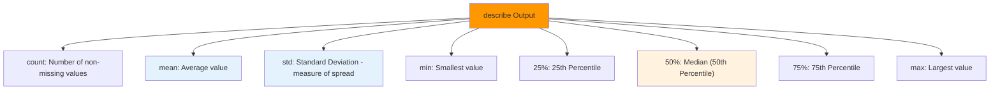

#### **Data Dictionary: A Roadmap for Understanding Your Data**
**Why It Matters:** A data dictionary is like a user manual for your dataset. Without it, trying to understand what each column means is like navigating a city without a map — you might find your way eventually, but it will be confusing and inefficient.

**What It Contains:**
- **Column Name:** The exact name of the variable as it appears in the dataset.
- **Description:** A clear and concise explanation of what the variable represents.
- **Data Type:** The type of data in the column (e.g., numerical, categorical, text).
- **Allowed Values:** A list of possible values or a description of the value range.
- **Source:** Where the data came from.

**In a Nutshell:** A data dictionary gives you a clear understanding of what each column in your dataset represents, its data type, allowed values, and source, making it easier to identify missing values, outliers, incorrect data types, and unexpected value ranges.

---

## Your First Machine Learning Model

### Selecting Data

Your dataset likely has too many variables to use all of them effectively. A common practice is to select a subset of features to start building your first model. You'll often use the `columns` attribute to see what's available.

```python
home_data.columns
```

- **Prediction Target (y):** This is the value you are trying to predict. For our housing data, this is `SalePrice`.

    ```python
    y = home_data.SalePrice
    ```

- **Features (X):** These are the input variables used to make the prediction. We'll create a list of feature names and select them from the DataFrame.

    ```python
    feature_names = ["LotArea", "YearBuilt", "1stFlrSF", "2ndFlrSF", "FullBath", "BedroomAbvGr", "TotRmsAbvGrd"]
    X = home_data[feature_names]
    ```

**Why Proper Data Selection Matters?**
Selecting the right features is crucial because:
1. **Garbage in, garbage out**: Irrelevant features can confuse the model
2. **Curse of dimensionality**: Too many features can make models slow and overfit
3. **Domain knowledge**: Some features are causally related to what you're predicting

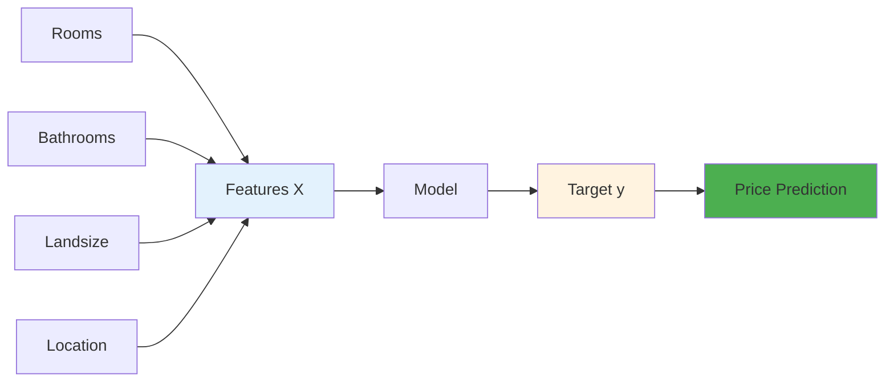

### Building the Model with Scikit-Learn

The **Scikit-Learn (sklearn)** library is the gold standard for building machine learning models in Python.

**The Process:**

1.  **Define:** Choose the type of model. We'll start with a `DecisionTreeRegressor`.
    ```python
    from sklearn.tree import DecisionTreeRegressor
    iowa_model = DecisionTreeRegressor(random_state=1)
    ```
    The `random_state` parameter ensures that your results are reproducible.

2.  **Fit:** Train the model using the features (`X`) and the target (`y`).
    ```python
    iowa_model.fit(X, y)
    ```

3.  **Predict:** Use the trained model to make predictions on new data. Here, we are predicting the prices for the same training data we just used.
    ```python
    predictions = iowa_model.predict(X)
    print(predictions)
    ```

---
**The Model Building Process**
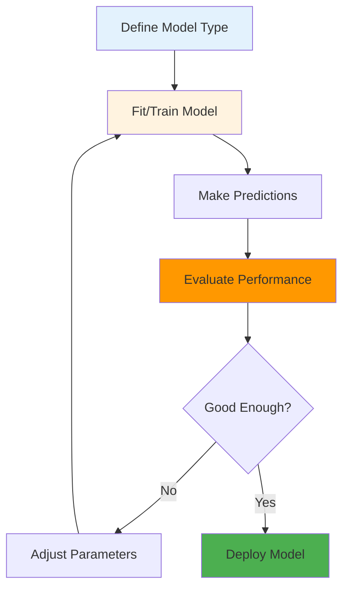

```python
# Complete code
# Step 1: Import necessary libraries
import pandas as pd
from sklearn.tree import DecisionTreeRegressor

# Step 2: Load and prepare data
melbourne_file_path = 'melb_data.csv'
melbourne_data = pd.read_csv(melbourne_file_path)

# Step 3: Handle missing values
melbourne_data = melbourne_data.dropna(axis=0)

# Step 4: Select prediction target
y = melbourne_data.Price  # What we want to predict

# Step 5: Select features
melbourne_features = ['Rooms', 'Bathroom', 'Landsize', 'Lattitude', 'Longtitude']
X = melbourne_data[melbourne_features]  # What we use to predict

# Step 6: Examine features before modeling
print("Features summary:")
print(X.describe())
print("\nFirst few rows:")
print(X.head())

# Step 7: Define and train the model
melbourne_model = DecisionTreeRegressor(random_state=1)
melbourne_model.fit(X, y)  # This is where learning happens!

# Step 8: Make predictions
predictions = melbourne_model.predict(X.head())
print("Predictions for first 5 houses:", predictions)
```
## Model Validation

### The Danger of "In-Sample" Scores

If you evaluate your model on the same data you used to train it, you are using an **"in-sample"** score. This is a huge mistake.

**Why is it bad?** The model might have learned patterns in the training data that are just random noise. It won't generalize well to new, unseen data.

**Example:** Imagine the model learns that all houses with green doors are expensive in the training data. This is just a random correlation, not a real pattern. The model will appear to be very accurate on the training data, but it will be inaccurate on new data.

### The Solution: Validation Data

To get a true measure of model performance, you must test it on data it hasn't seen before. We do this by holding out a portion of the data as **validation data**. Model validation is the process of measuring how well your model performs on new, unseen data. It answers the question: "Will my model work in the real world?"

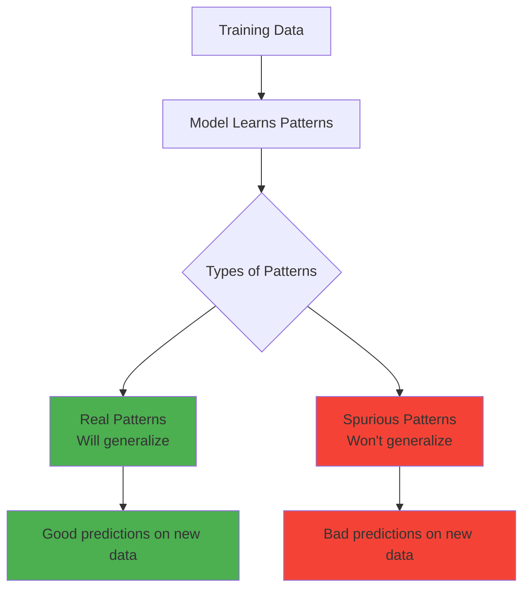

**Code Example with `train_test_split`:**

```python
from sklearn.model_selection import train_test_split

# Split the data.
# The split is based on a random number generator. Supplying a numeric value to
# the random_state argument guarantees we get the same split every time we run this script.
train_X, val_X, train_y, val_y = train_test_split(X, y, random_state=1)

# Define and fit the model ONLY on the training data.
iowa_model = DecisionTreeRegressor(random_state=1)
iowa_model.fit(train_X, train_y)

# Predict on the validation data.
val_predictions = iowa_model.predict(val_X)

# Calculate the Mean Absolute Error (MAE) on the validation data.
from sklearn.metrics import mean_absolute_error
val_mae = mean_absolute_error(val_y, val_predictions)
print(val_mae)
```

### Mean Absolute Error (MAE)

**MAE** is a metric for summarizing model quality. It's the average of the absolute differences between the actual and predicted values.

$$MAE = \frac{1}{n} \sum_{i=1}^{n} |y_i - \hat{y}_i|$$

- **In plain English:** "On average, our predictions are off by about X dollars."

**Key Insight:** The MAE on the validation data is the true measure of your model's performance. It is almost always much worse than an in-sample MAE.

---

## Underfitting and Overfitting

### The Balancing Act

The complexity of your model is a critical factor. Decision trees have a key parameter: **depth**.

- **Underfitting** (model is too simple): The model fails to capture important patterns in the data. It performs poorly on both the training and validation data.
    - **Example:** A tree that only asks "Does the house have more than 3 bedrooms?" and doesn't consider other factors like square footage.

- **Overfitting** (model is too complex): The model captures random noise and spurious patterns in the training data. It performs wonderfully on the training data but poorly on validation data.
    - **Example:** A tree that goes so deep that each leaf contains only one house. It will perfectly predict the training data but fail completely on new data.

### Finding the Sweet Spot

The goal is to find the model complexity that lies between underfitting and overfitting. This is the point where the validation error is minimized.

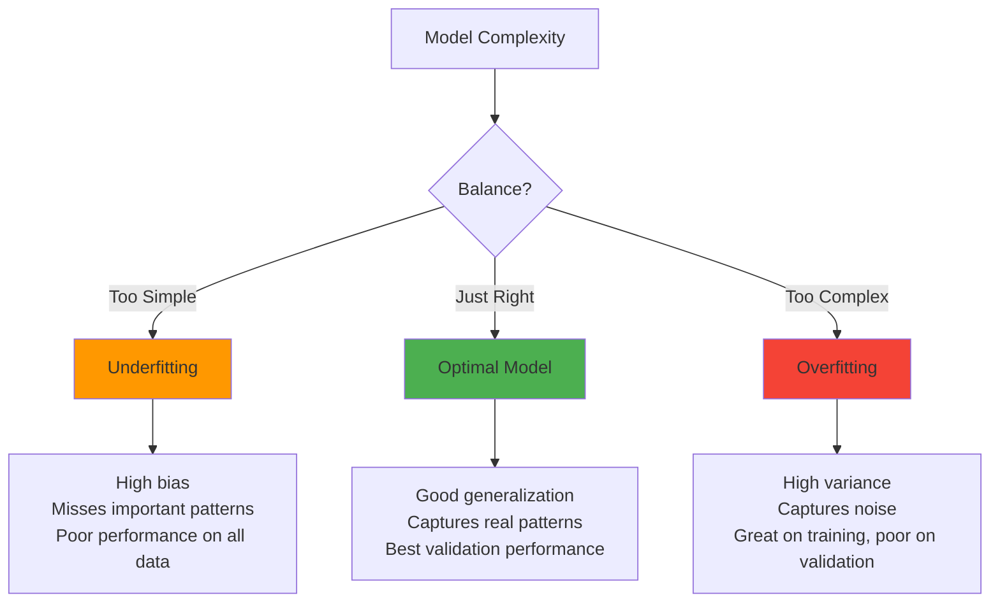

### The `max_leaf_nodes` Parameter

Scikit-learn's `DecisionTreeRegressor` has a practical parameter called `max_leaf_nodes` to control overfitting. A smaller number of leaves leads to a shallower tree (less overfitting), while a larger number of leaves leads to a deeper tree (more overfitting).

**Code to Find the Optimal Number of Leaves:**

```python
from sklearn.metrics import mean_absolute_error
from sklearn.tree import DecisionTreeRegressor

def get_mae(max_leaf_nodes, train_X, val_X, train_y, val_y):
    """
    Calculate MAE for a decision tree with specific max_leaf_nodes
    
    Parameters:
    - max_leaf_nodes: Controls tree complexity
      - Low values → Simple tree (risk of underfitting)
      - High values → Complex tree (risk of overfitting)
    """
    model = DecisionTreeRegressor(
        max_leaf_nodes=max_leaf_nodes, 
        random_state=0
    )
    model.fit(train_X, train_y)
    predictions = model.predict(val_X)
    mae = mean_absolute_error(val_y, predictions)
    return mae

# Test different tree complexities
for max_leaf_nodes in [5, 50, 500, 5000]:
    mae = get_mae(max_leaf_nodes, train_X, val_X, train_y, val_y)
    print(f"Max leaf nodes: {max_leaf_nodes:4d}  MAE: ${mae:,.0f}")

# Example output:
# Max leaf nodes:    5  MAE: $347,380  (Underfitting)
# Max leaf nodes:   50  MAE: $258,171  (Better)
# Max leaf nodes:  500  MAE: $243,495  (Best!)
# Max leaf nodes: 5000  MAE: $254,983  (Starting to overfit)
```

---

## Random Forests

### The Power of the Crowd

The Random Forest model is an **ensemble** method. It combines the predictions of many different decision trees to produce a single, more accurate prediction. It works by:

1.  Creating many decision trees, each on a random subset of the data and using a random subset of the features.
2.  Averaging the predictions from all the trees.

### Why Random Forests are Better

- **Reduces Overfitting:** By averaging predictions from many trees, the random forest smooths out the errors and noise that a single tree might learn.
- **More Robust:** It is less sensitive to the specific parameters than a single decision tree, making it a great "out-of-the-box" model.
- **Better Accuracy:** Generally provides much higher predictive accuracy than a single decision tree.

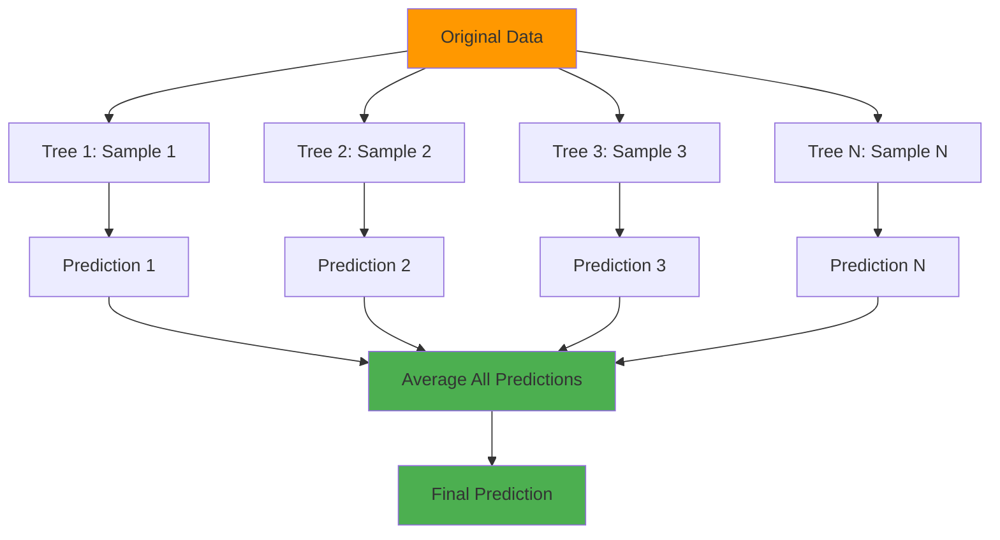
**Scikit-Learn Code Example:**

```python
from sklearn.ensemble import RandomForestRegressor
from sklearn.metrics import mean_absolute_error

# Create and train Random Forest
forest_model = RandomForestRegressor(
    random_state=1,        # For reproducibility
    n_estimators=100       # Number of trees (default)
)
forest_model.fit(train_X, train_y)

# Make predictions
predictions = forest_model.predict(val_X)

# Evaluate
mae = mean_absolute_error(val_y, predictions)
print(f"Random Forest MAE: ${mae:,.0f}")

# Compare with Decision Tree
tree_model = DecisionTreeRegressor(random_state=1)
tree_model.fit(train_X, train_y)
tree_predictions = tree_model.predict(val_X)
tree_mae = mean_absolute_error(val_y, tree_predictions)

print(f"Decision Tree MAE: ${tree_mae:,.0f}")
print(f"Improvement: ${tree_mae - mae:,.0f}")
```
**Key Parameters to Tune**
```python
# Advanced Random Forest with tuning
from sklearn.ensemble import RandomForestRegressor

forest_model = RandomForestRegressor(
    n_estimators=100,      # Number of trees (more = better but slower)
    max_depth=None,        # Maximum depth of trees
    min_samples_split=2,   # Minimum samples to split a node
    min_samples_leaf=1,    # Minimum samples in a leaf
    max_features='auto',   # Features to consider for splits
    random_state=1
)
```
**Big Improvement:** The Random Forest model often provides a MAE that is tens of thousands of dollars lower than a single Decision Tree.

---

## Machine Learning Competitions

Kaggle competitions are the ultimate test of your data science skills. They provide real-world datasets and a leaderboard to compare your model with others.

**The Final Challenge: The "House Prices" Competition**

Our course's final exercise uses the "House Prices: Advanced Regression Techniques" dataset on Kaggle.

**Steps to Submit:**

1.  **Train Your Model:** Use the `train.csv` data to build your best Random Forest model. You can (and should!) experiment by adding more features, as shown in the example below.
2.  **Predict on Test Data:** Load the `test.csv` file. Use your trained model to predict the `SalePrice` for these houses.
3.  **Create a Submission File:** Kaggle requires a specific format. You must create a `.csv` file with only two columns: `Id` and `SalePrice`.

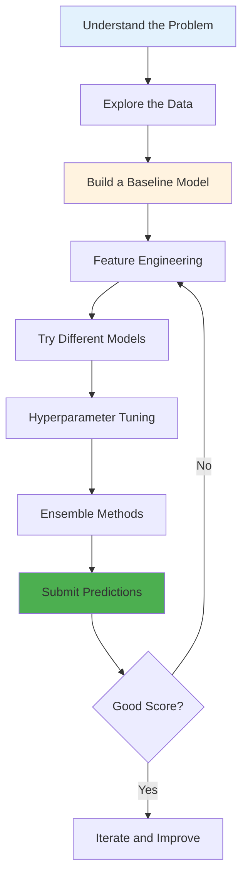
### Fun Fact

Kaggle competitions are not just for learning. They are a primary way for data scientists to gain recognition and secure jobs in the industry. Top performers often earn prizes, badges, and valuable networking opportunities.

## Conclusion

This guide has taken you through a complete machine learning workflow, from the foundational "How Model Works" to making your final submissions on Kaggle. The key takeaway is the **iterative process**:

**Explore -> Model -> Validate -> Improve**

Now, you are ready to apply these skills to your own projects and continue your journey in data science!
1.  **Fit or Train:** The process of the model learning the patterns and deciding where to make the "splits" is called **fitting** or **training**.
2.  **Training Data:** The data used to fit the model.
3.  **Features:** The inputs to the model (e.g., `BedroomCount`, `LotArea`).
4.  **Target:** The value we are trying to predict (e.g., `SalePrice`).

### Tips for Competition Success

| Tip | Description |
|-----|-------------|
| **Start Simple** | Begin with a basic model, then iterate |
| **Feature Engineering** | Create new features from existing ones |
| **Cross-Validation** | Use multiple validation splits for robustness |
| **Ensemble** | Combine multiple models for better predictions |
| **Learn from Others** | Read competition forums and kernels |

**Fun Fact:** 🏆 The Netflix Prize competition offered $1 million to anyone who could improve their recommendation algorithm by 10%. It took 3 years for someone to win!

The first decision tree algorithm, the "ID3 algorithm," was invented by Ross Quinlan in 1986. This was a foundational moment in the field of machine learning, making complex pattern recognition much more accessible.

---

## 🎓 Putting It All Together

### The Complete ML Workflow

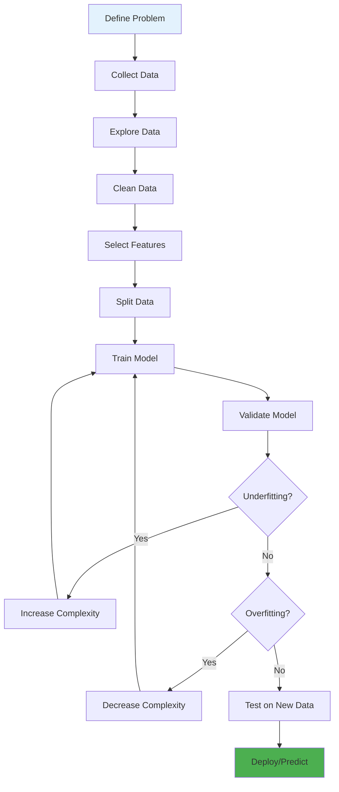

### Key Takeaways

1. **Decision Trees** are intuitive models that split data based on feature values
2. **Data Exploration** is crucial - always look at your data first!
3. **Train-Test Split** prevents the illusion of good performance
4. **Underfitting/Overfitting** is the central challenge in ML
5. **Random Forests** combine multiple trees for better, more robust predictions
6. **Validation** should always be on unseen data

### Quick Reference: Model Selection Guide

| Situation | Recommended Model |
|-----------|------------------|
| Need interpretability | Decision Tree |
| Best accuracy, structured data | Random Forest |
| Quick baseline | Decision Tree (shallow) |
| Competition/Production | Random Forest (tuned) |

### Final Code Template

```python
# Complete ML Pipeline
import pandas as pd
from sklearn.model_selection import train_test_split
from sklearn.ensemble import RandomForestRegressor
from sklearn.metrics import mean_absolute_error

# 1. Load data
data = pd.read_csv('data.csv')

# 2. Define features and target
y = data.Price
features = ['feature1', 'feature2', 'feature3']
X = data[features]

# 3. Split data
train_X, val_X, train_y, val_y = train_test_split(
    X, y, random_state=1
)

# 4. Define and train model
model = RandomForestRegressor(random_state=1)
model.fit(train_X, train_y)

# 5. Validate
predictions = model.predict(val_X)
mae = mean_absolute_error(val_y, predictions)
print(f"Model MAE: ${mae:,.2f}")

# 6. Make predictions on new data
new_predictions = model.predict(new_X)
```

---

**Happy Modeling!** 🚀 Remember: The best way to learn is by doing. Try these concepts with different datasets and see how they work in practice!