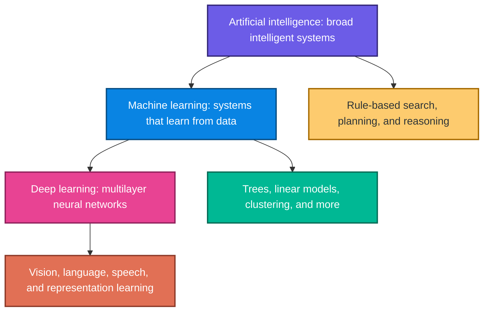
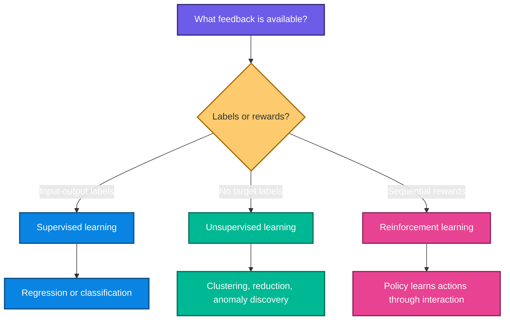
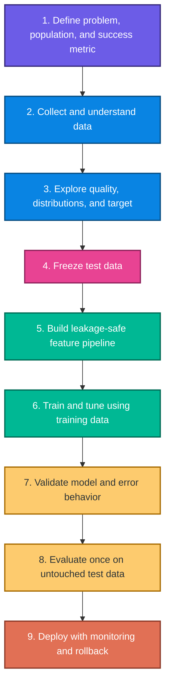
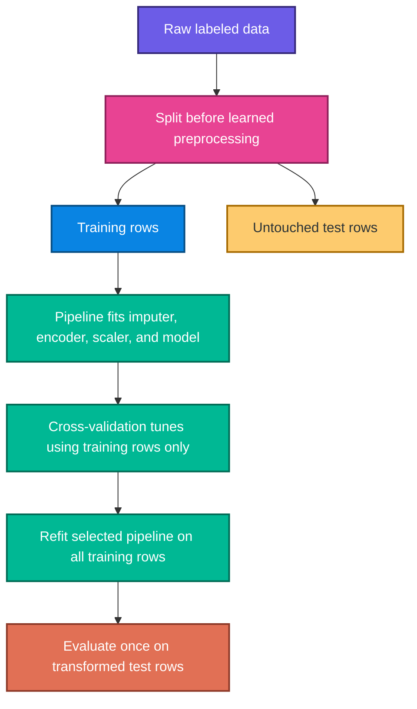
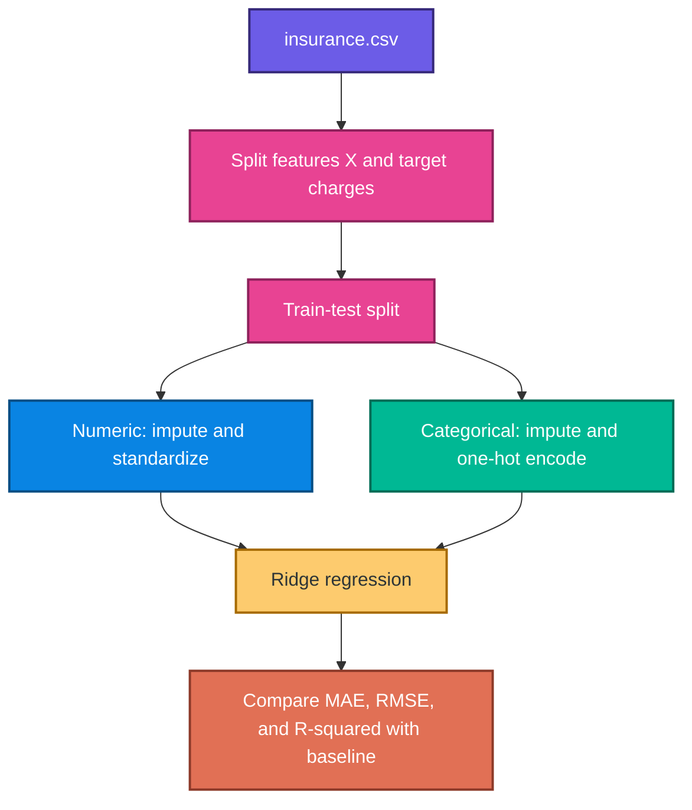
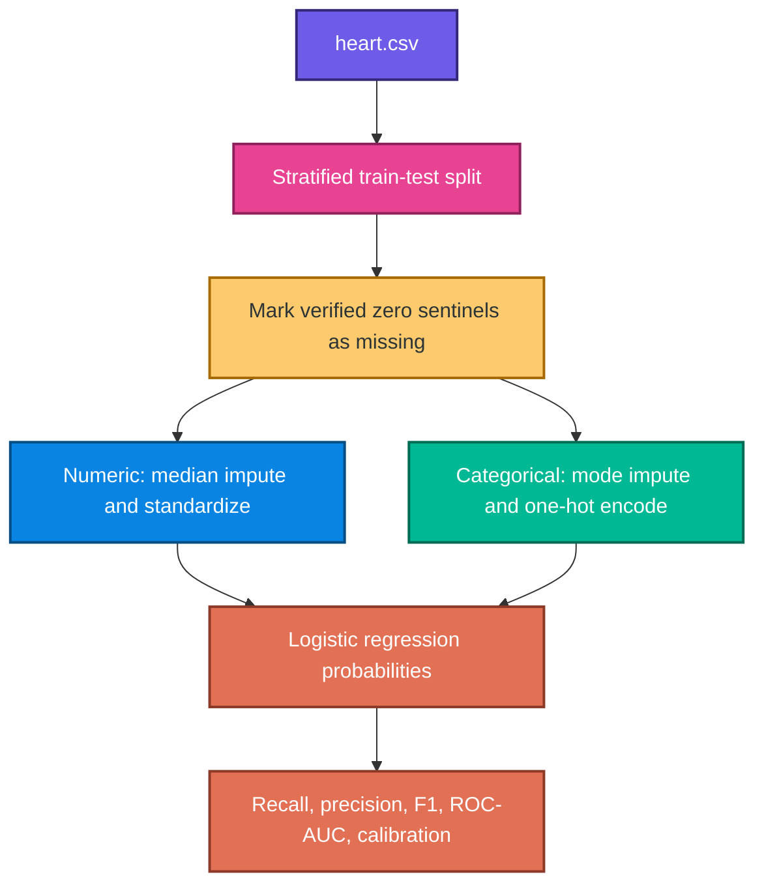

# Machine Learning Foundations: EDA, Preprocessing, Feature Engineering, Regression, and Classification

> Detailed study notes built from the supplied `Machine Learning.pdf`, `insurance.ipynb`, `insurance.csv`, and `Heart.ipynb` files.

These notes explain **what**, **why**, **how**, and **when** for every major concept, connect the formulas to intuition, provide thoroughly commented Python examples, and correct several leakage and data-type problems in the source notebooks.

> **Important:** The heart example is educational, not a clinical diagnostic system. A real medical model requires representative data, external validation, calibration, subgroup analysis, appropriate thresholds, human oversight, and governance.

---

## Table of contents

1. [What is machine learning?](#1-what-is-machine-learning)
2. [AI versus ML versus deep learning](#2-ai-versus-ml-versus-deep-learning)
3. [Major types of machine learning](#3-major-types-of-machine-learning)
4. [The end-to-end ML workflow](#4-the-end-to-end-ml-workflow)
5. [Problem framing](#5-problem-framing)
6. [Exploratory data analysis](#6-exploratory-data-analysis)
7. [Data cleaning](#7-data-cleaning)
8. [Preprocessing and scaling](#8-preprocessing-and-scaling)
9. [Feature engineering](#9-feature-engineering)
10. [Feature selection](#10-feature-selection)
11. [Train, validation, test, and leakage](#11-train-validation-test-and-leakage)
12. [Insurance-charge regression case study](#12-insurance-charge-regression-case-study)
13. [Heart-disease classification case study](#13-heart-disease-classification-case-study)
14. [Regression mathematics and metrics](#14-regression-mathematics-and-metrics)
15. [Classification mathematics and metrics](#15-classification-mathematics-and-metrics)
16. [Corrections to the supplied notebooks](#16-corrections-to-the-supplied-notebooks)
17. [Practice questions with solutions](#17-practice-questions-with-solutions)
18. [Quick-reference cheat sheet](#18-quick-reference-cheat-sheet)

---

## 1. What is machine learning?

Machine learning teaches a computer to discover useful patterns from examples instead of explicitly programming every rule.

In traditional programming:

$$
\text{data}+\text{hand-written rules}\longrightarrow\text{answers}
$$

In supervised machine learning:

$$
\text{data}+\text{known answers}\longrightarrow\text{learned model}
$$

At prediction time:

$$
\text{new data}+\text{learned model}\longrightarrow\text{predicted answer}
$$

### Formal view

A supervised training set is:

$$
\mathcal{D}=\{(\mathbf{x}_i,y_i)\}_{i=1}^{n}
$$

where $\mathbf{x}_i$ contains the features for observation $i$ and $y_i$ is its target.

The algorithm selects a function $f_{\theta}$ with parameters $\theta$ that minimizes empirical loss:

$$
\hat{\theta}=\arg\min_{\theta}
\frac{1}{n}\sum_{i=1}^{n}L\left(y_i,f_{\theta}(\mathbf{x}_i)\right)
$$

The real goal is not merely low training loss. It is low **generalization error** on new observations drawn from the intended deployment population.

### Why use ML?

ML is helpful when:

- rules are too complex to write manually;
- patterns can be learned from representative examples;
- the task repeats often enough to justify a model;
- prediction or ranking has measurable value;
- performance can be monitored after deployment.

ML is not automatically appropriate when a simple business rule is sufficient, labels are unreliable, the future differs radically from training data, or mistakes carry unacceptable unmitigated risk.

> **Fun fact:** A model can memorize every training row and still be useless. Learning means capturing patterns that transfer beyond the examples already seen.

---

## 2. AI versus ML versus deep learning



| Concept | Scope | Example |
|---|---|---|
| Artificial intelligence | broad goal of machine intelligence | planning, reasoning, learning |
| Machine learning | AI systems that improve from data | spam detection, recommendations |
| Deep learning | ML using deep neural networks | image recognition, large language models |

Not every AI system learns, not every ML model is a neural network, and not every problem needs deep learning.

---

## 3. Major types of machine learning



### 3.1 Supervised learning

The training data includes a target.

- **Regression:** predict a numeric value, such as insurance charges.
- **Classification:** predict a class or class probability, such as heart-disease label 0 or 1.

### 3.2 Unsupervised learning

There is no provided target. The aim is to discover structure, compress data, or identify unusual observations.

Examples include k-means clustering, principal component analysis, and anomaly detection. An unsupervised pattern is not automatically meaningful; it still needs domain interpretation and validation.

### 3.3 Reinforcement learning

An agent observes a state, takes an action, receives a reward, and learns a policy for sequential decisions.

The discounted return from time $t$ is:

$$
G_t=\sum_{k=0}^{\infty}\gamma^kR_{t+k+1}
$$

where $0\leq\gamma<1$ discounts distant rewards.

---

## 4. The end-to-end ML workflow



The workflow is iterative. Discoveries during EDA may change the target, sampling plan, features, or metric. The untouched test set should not become part of that iteration.

---

## 5. Problem framing

Before touching code, answer:

1. Who or what is one observation?
2. What exactly is the target?
3. At what time is the prediction made?
4. Which features are genuinely available at that time?
5. What population will receive predictions?
6. What decision follows the prediction?
7. Which error is more costly?
8. What baseline must the model beat?

### Insurance case

- Observation: one recorded insurance customer.
- Target: `charges`, a continuous numeric value.
- Task: regression.
- Inputs: age, sex, BMI, children, smoker status, and region.

### Heart case

- Observation: one recorded patient row.
- Target: `HeartDisease`, encoded as 0 or 1.
- Task: binary classification.
- Inputs: demographic, symptom, electrocardiographic, and exercise-related variables recorded in the notebook.

Prediction is not causation. A model may learn association useful for prediction without estimating what would happen under an intervention.

---

## 6. Exploratory data analysis

### What is EDA?

Exploratory data analysis is the structured investigation of data quality, variable meanings, distributions, relationships, and target behavior before modeling.

### Why EDA matters

EDA can reveal:

- missing-value sentinels disguised as valid numbers;
- impossible values and unit errors;
- duplicate or repeated entities;
- skewed targets and influential outliers;
- class imbalance;
- leakage-prone columns;
- subgroup differences;
- mismatches between the question and the available data.

### A reproducible audit

```python
from pathlib import Path
import pandas as pd

DATA_PATH = Path("insurance.csv")
insurance = pd.read_csv(DATA_PATH)

print("Shape:", insurance.shape)
print("Columns:", insurance.columns.tolist())
print("\nData types:\n", insurance.dtypes)
print("\nMissing values:\n", insurance.isna().sum())
print("\nExact duplicate rows:", insurance.duplicated().sum())
print("\nNumeric summary:\n", insurance.describe())

for column in insurance.select_dtypes(exclude="number"):
    print(f"\n{column} counts:\n{insurance[column].value_counts(dropna=False)}")
```

### Verified insurance audit

| Property | Result |
|---|---:|
| Rows | 1,338 |
| Columns | 7 |
| Missing values | 0 |
| Exact duplicate rows | 1 |
| Mean age | 39.207 |
| Mean BMI | 30.663 |
| Median charges | 9,382.033 |
| Mean charges | 13,270.422 |
| Maximum charges | 63,770.428 |
| Smokers | 274 |
| Non-smokers | 1,064 |

Mean charges exceed median charges because the target is right-skewed. The measured skewness after removing the one exact duplicate is about 1.515.

### Verified heart audit from notebook output

The heart CSV itself was not attached, so these notes use the notebook's recorded outputs:

| Property | Recorded result |
|---|---:|
| Rows | 918 |
| Columns | 12 |
| Missing values reported by `isnull` | 0 |
| Exact duplicate rows | 0 |
| Positive `HeartDisease=1` rows | 508 |
| Negative `HeartDisease=0` rows | 410 |
| Zero cholesterol records | 172 |

The zero values require domain verification. A zero can be a sentinel for unavailable measurement even though pandas does not classify it as `NaN`.

### Target exploration

```python
import matplotlib.pyplot as plt
import seaborn as sns

fig, axes = plt.subplots(1, 2, figsize=(12, 4))

sns.histplot(
    data=insurance,
    x="charges",
    bins=30,
    kde=True,
    color="#0984E3",
    ax=axes[0],
)
axes[0].set_title("Insurance charges are right-skewed")

sns.boxplot(
    data=insurance,
    x="smoker",
    y="charges",
    hue="smoker",
    legend=False,
    palette="Set2",
    ax=axes[1],
)
axes[1].set_title("Charges by recorded smoker status")

fig.tight_layout()
plt.show()
```

This is descriptive association. It does not establish that changing smoker status would cause the entire observed charge difference.

---

## 7. Data cleaning

### 7.1 Missing values

Choose a strategy based on the missingness process and model:

- correct known extraction errors;
- impute numeric values with median or a fitted model;
- impute categorical values with a frequent or explicit “missing” category;
- add a missingness indicator when missingness itself may carry information;
- drop rows or columns only with a justified impact assessment.

Imputation parameters must be learned from training data only.

### 7.2 Exact duplicates

The insurance file contains one exact duplicate. Do not automatically assume it is an erroneous duplicate; two different people can share identical recorded features when no unique identifier exists.

```python
duplicate_rows = insurance.loc[insurance.duplicated(keep=False)]
print(duplicate_rows)

# Use this only after confirming that repeated rows are duplicate records.
insurance_clean = insurance.drop_duplicates().reset_index(drop=True)
```

### 7.3 Data types

Correct types intentionally:

- numeric measurement: `float` or `int` as appropriate;
- nominal category: pandas `category` or text;
- ordered category: explicit ordered categorical type;
- date/time: datetime;
- binary flag: boolean or 0/1.

Never convert an entire mixed dataframe to integer merely to turn dummy booleans into 0 and 1. That operation also truncates continuous variables.

### 7.4 Inconsistent categories

Normalize spelling, case, and whitespace only after checking the true domain.

```python
insurance_clean["sex"] = insurance_clean["sex"].str.strip().str.lower()
insurance_clean["smoker"] = insurance_clean["smoker"].str.strip().str.lower()
insurance_clean["region"] = insurance_clean["region"].str.strip().str.lower()
```

### 7.5 Impossible or sentinel values

In the heart notebook, `RestingBP=0` and many `Cholesterol=0` values are treated as missing. That interpretation must be verified against the dataset documentation.

```python
import numpy as np

def mark_heart_zero_sentinels(frame):
    """Replace verified zero sentinels without learning dataset statistics."""
    frame = frame.copy()
    for column in ["RestingBP", "Cholesterol"]:
        frame.loc[frame[column].eq(0), column] = np.nan
    return frame
```

The replacement with `NaN` is stateless. Median values used to fill those missing entries must still be fitted on training data inside a pipeline.

### 7.6 Outliers

Outlier handling is an investigation, not an automatic deletion rule:

1. verify entry and units;
2. determine whether the row belongs to the target population;
3. compare robust and ordinary summaries;
4. consider transformations or robust models;
5. report sensitivity to the decision.

---

## 8. Preprocessing and scaling

### 8.1 One-hot encoding

Nominal categories such as region have no natural numeric order. One-hot encoding creates indicator columns:

$$
x_{ic}=\mathbf{1}(\text{observation }i\text{ belongs to category }c)
$$

`region=2` must not imply that one region is numerically twice another.

### 8.2 Label and ordinal encoding

Integer encoding is suitable only when numbers represent a real order and the model is allowed to use that order. Even then, equal numeric spacing may imply a stronger assumption than intended.

### 8.3 Standardization

$$
z_{ij}=\frac{x_{ij}-\mu_j}{\sigma_j}
$$

In practice, `StandardScaler` estimates the feature mean and scale from training rows, then applies those learned values to validation and test rows.

Standardization is especially useful for:

- linear and logistic models with regularization;
- support-vector machines;
- k-nearest neighbors;
- principal component analysis;
- gradient-based optimization.

Tree splits depend on order, so ordinary decision trees and random forests usually do not require scaling.

### 8.4 Min-max normalization

$$
x'_{ij}=\frac{x_{ij}-x_{j,\min}}{x_{j,\max}-x_{j,\min}}
$$

This maps training values to $[0,1]$. Future values can lie outside that interval. It is sensitive to extreme minimum and maximum values.

### 8.5 Log transformation

For a non-negative, right-skewed variable:

$$
x'=\log(1+x)
$$

`np.log1p` handles zero safely and compresses large values. It changes interpretation, so evaluate errors in the original units as well.

### 8.6 Why a `ColumnTransformer`?

Numeric and categorical variables need different operations. A `ColumnTransformer` applies each transformation only to its assigned columns and combines the results.

```python
from sklearn.compose import ColumnTransformer
from sklearn.impute import SimpleImputer
from sklearn.pipeline import Pipeline
from sklearn.preprocessing import OneHotEncoder, StandardScaler

numeric_features = ["age", "bmi", "children"]
categorical_features = ["sex", "smoker", "region"]

numeric_pipeline = Pipeline(
    steps=[
        ("imputer", SimpleImputer(strategy="median")),
        ("scaler", StandardScaler()),
    ]
)

categorical_pipeline = Pipeline(
    steps=[
        ("imputer", SimpleImputer(strategy="most_frequent")),
        ("onehot", OneHotEncoder(handle_unknown="ignore")),
    ]
)

preprocessor = ColumnTransformer(
    transformers=[
        ("numeric", numeric_pipeline, numeric_features),
        ("categorical", categorical_pipeline, categorical_features),
    ]
)
```

`handle_unknown="ignore"` prevents a new category in validation or production from crashing transformation. It does not remove the need to monitor category drift.

---

## 9. Feature engineering

Feature engineering creates representations that make useful structure easier for a model to learn.

### Common techniques

- interactions, such as BMI times smoker indicator;
- nonlinear terms, such as $age^2$;
- fixed domain bins;
- ratios with safe denominators;
- time-derived features;
- target-available-at-prediction flags;
- log or power transforms.

### Insurance examples

```python
import numpy as np
import pandas as pd

def add_insurance_features(frame):
    """Create deterministic features without learning from the dataset."""
    frame = frame.copy()

    # A quadratic term lets a linear model represent a curved age effect.
    frame["age_squared"] = frame["age"] ** 2

    # An interaction lets the BMI slope differ for recorded smokers.
    smoker_indicator = frame["smoker"].eq("yes").astype(int)
    frame["smoker_bmi_interaction"] = smoker_indicator * frame["bmi"]

    # These fixed bins reproduce the notebook's intended category concept
    # without truncating the original continuous BMI feature.
    frame["bmi_category"] = pd.cut(
        frame["bmi"],
        bins=[0, 18.5, 24.9, 29.9, np.inf],
        labels=["Underweight", "Normal", "Overweight", "Obese"],
        include_lowest=True,
    )

    return frame
```

The original `bmi` should usually remain available. Binning loses within-category information and creates sharp boundaries; it may help interpretation but does not automatically improve predictions.

### Target-based versus target-free engineering

- Fixed mathematical transforms can be applied consistently without observing $y$.
- Target encoding, supervised binning, and target-based selection must be learned inside each training fold.

> **Fun fact:** Feature engineering injects an inductive bias: it tells the model which patterns may be easier or more plausible to learn.

---

## 10. Feature selection

Feature selection keeps a subset of existing features. It differs from feature engineering, which creates or transforms features.

### 10.1 Filter methods

Filter methods score features before fitting the final model:

- Pearson or Spearman association;
- chi-square for categorical count relationships;
- ANOVA F tests for numeric features across categorical targets;
- mutual information.

Pearson correlation is:

$$
r_{XY}=\frac{\sum_i(x_i-\bar{x})(y_i-\bar{y})}
{\sqrt{\sum_i(x_i-\bar{x})^2}\sqrt{\sum_i(y_i-\bar{y})^2}}
$$

Correlation can miss nonlinear relationships and interaction-only features.

### 10.2 Wrapper methods

Wrapper methods repeatedly fit models to compare feature subsets, such as recursive feature elimination. They can capture model-specific value but are computationally expensive and easy to overfit without nested validation.

### 10.3 Embedded methods

Selection occurs during model fitting:

- L1 regularization can shrink some coefficients to zero;
- tree ensembles assign split-based importances;
- boosting selects useful splits iteratively.

### 10.4 Permutation importance

On unseen validation data, permute one feature and measure performance loss:

$$
I_j=\text{score}_{original}-\text{score}_{permuted\ j}
$$

Correlated features can share importance, making each appear less important alone.

### Why the notebook chi-square selection is unsafe

The insurance notebook:

1. bins continuous `charges` into quartiles;
2. tests each categorical feature against that binned target;
3. uses all rows before any split;
4. labels non-significant features “drop.”

Problems:

- full-data selection leaks target information into evaluation;
- binning discards the magnitude of charges;
- multiple tests inflate false positives;
- failure to reject is not proof of no predictive value;
- a feature may matter through interactions;
- univariate association does not equal incremental model value.

Perform selection inside cross-validation and compare validated model performance.

---

## 11. Train, validation, test, and leakage

### 11.1 Roles of each subset

| Subset | Purpose | May influence model choices? |
|---|---|---|
| Training | fit parameters and preprocessing | yes |
| Validation/CV folds | choose features and hyperparameters | yes |
| Test | final unbiased estimate | no |

### 11.2 What is data leakage?

Leakage occurs when training uses information unavailable at genuine prediction time or information from rows meant to simulate the future/test population.

Examples:

- scaling before the split;
- imputing with the full-data median;
- selecting features using all target values;
- duplicates crossing train and test;
- using a post-outcome variable;
- repeatedly tuning after inspecting test performance.

### 11.3 Leakage-safe architecture



### 11.4 Cross-validation

In $K$-fold cross-validation, each fold acts as validation once. The mean validation score is:

$$
\bar{s}_{CV}=\frac{1}{K}\sum_{k=1}^{K}s_k
$$

Report fold variability, not only the mean. Use grouped or time-aware splitting when observations are not exchangeable.

---

## 12. Insurance-charge regression case study

### 12.1 Dataset schema

| Column | Type | Role |
|---|---|---|
| `age` | integer | numeric feature |
| `sex` | category | nominal feature |
| `bmi` | float | continuous feature |
| `children` | integer | count feature |
| `smoker` | category | binary nominal feature |
| `region` | category | nominal feature |
| `charges` | float | regression target |

### 12.2 Raw associations

Using the untruncated continuous variables after removing the one exact duplicate:

| Feature | Pearson correlation with charges |
|---|---:|
| `is_smoker` | 0.7872 |
| `age` | 0.2983 |
| `bmi` | 0.1984 |
| `children` | 0.0674 |
| `is_female` | -0.0580 |

Smoker status is strongly associated with recorded charges, but correlation does not measure causation and does not capture all nonlinear or interaction structure.

Mean recorded charges are about 32,050.23 for smokers and 8,440.66 for non-smokers in the cleaned file. These are descriptive group means, not adjusted causal effects.

### 12.3 Baseline and Ridge pipeline



```python
from pathlib import Path

import pandas as pd
from sklearn.compose import ColumnTransformer
from sklearn.dummy import DummyRegressor
from sklearn.impute import SimpleImputer
from sklearn.linear_model import Ridge
from sklearn.metrics import (
    mean_absolute_error,
    r2_score,
    root_mean_squared_error,
)
from sklearn.model_selection import train_test_split
from sklearn.pipeline import Pipeline
from sklearn.preprocessing import OneHotEncoder, StandardScaler

# ---------- Load and verify ----------
insurance = pd.read_csv(Path("insurance.csv"))

expected_columns = {
    "age", "sex", "bmi", "children", "smoker", "region", "charges"
}
if set(insurance.columns) != expected_columns:
    raise ValueError("Unexpected insurance schema")

# Drop only after deciding that the exact repeated row is a duplicate record.
insurance = insurance.drop_duplicates().reset_index(drop=True)

# ---------- Separate target before preprocessing ----------
X = insurance.drop(columns="charges")
y = insurance["charges"]

X_train, X_test, y_train, y_test = train_test_split(
    X,
    y,
    test_size=0.20,
    random_state=42,
)

numeric_features = ["age", "bmi", "children"]
categorical_features = ["sex", "smoker", "region"]

numeric_pipeline = Pipeline(
    [
        ("imputer", SimpleImputer(strategy="median")),
        ("scaler", StandardScaler()),
    ]
)

categorical_pipeline = Pipeline(
    [
        ("imputer", SimpleImputer(strategy="most_frequent")),
        ("onehot", OneHotEncoder(handle_unknown="ignore")),
    ]
)

preprocessor = ColumnTransformer(
    [
        ("numeric", numeric_pipeline, numeric_features),
        ("categorical", categorical_pipeline, categorical_features),
    ]
)

# Ridge minimizes squared error plus an L2 coefficient penalty.
ridge_pipeline = Pipeline(
    [
        ("preprocessor", preprocessor),
        ("model", Ridge(alpha=1.0)),
    ]
)

# A baseline shows whether ML adds value over a simple constant prediction.
baseline = DummyRegressor(strategy="median")
baseline.fit(X_train, y_train)
baseline_predictions = baseline.predict(X_test)

ridge_pipeline.fit(X_train, y_train)
predictions = ridge_pipeline.predict(X_test)

for name, prediction in {
    "Median baseline": baseline_predictions,
    "Ridge": predictions,
}.items():
    print(name)
    print("  MAE :", mean_absolute_error(y_test, prediction))
    print("  RMSE:", root_mean_squared_error(y_test, prediction))
    print("  R2  :", r2_score(y_test, prediction))
```

With the fixed split above, the verified Ridge illustration gives approximately:

| Model | MAE | RMSE | $R^2$ |
|---|---:|---:|---:|
| Median baseline | 9,293.84 | 14,442.13 | -0.135 |
| Ridge | 4,185.41 | 5,964.28 | 0.806 |

These are teaching results from one split, not a production performance claim.

### 12.4 Cross-validation

```python
from sklearn.model_selection import KFold, cross_validate

cv = KFold(n_splits=5, shuffle=True, random_state=42)

scores = cross_validate(
    ridge_pipeline,
    X,
    y,
    cv=cv,
    scoring={
        "mae": "neg_mean_absolute_error",
        "rmse": "neg_root_mean_squared_error",
        "r2": "r2",
    },
    n_jobs=-1,
)

print("Mean CV MAE:", -scores["test_mae"].mean())
print("Mean CV RMSE:", -scores["test_rmse"].mean())
print("Mean CV R2:", scores["test_r2"].mean())
print("R2 fold standard deviation:", scores["test_r2"].std())
```

Verified five-fold results are approximately MAE 4,214.33, RMSE 6,105.09, and mean $R^2=0.739$ with fold standard deviation 0.044. The difference from the single holdout demonstrates why one split can be optimistic or pessimistic.

### 12.5 Optional log-target model

Because charges are right-skewed, a log target may stabilize relative errors:

```python
from sklearn.compose import TransformedTargetRegressor
import numpy as np

log_target_model = TransformedTargetRegressor(
    regressor=ridge_pipeline,
    func=np.log1p,
    inverse_func=np.expm1,
)

log_target_model.fit(X_train, y_train)
log_predictions = log_target_model.predict(X_test)

# Always evaluate the back-transformed predictions in charge units.
print(mean_absolute_error(y_test, log_predictions))
```

This changes the optimization emphasis toward relative differences. Compare residuals and business costs, not only one metric.

---

## 13. Heart-disease classification case study

### 13.1 Recorded schema

The notebook uses:

| Feature | Type in notebook |
|---|---|
| `Age` | numeric |
| `Sex` | categorical |
| `ChestPainType` | categorical |
| `RestingBP` | numeric with zero sentinel concern |
| `Cholesterol` | numeric with 172 zeros |
| `FastingBS` | binary categorical/numeric |
| `RestingECG` | categorical |
| `MaxHR` | numeric |
| `ExerciseAngina` | categorical |
| `Oldpeak` | continuous numeric |
| `ST_Slope` | categorical |
| `HeartDisease` | binary target |

### 13.2 Leakage-safe classification template

This code requires the missing `heart.csv` file and therefore is presented as a corrected template rather than a reproduced model score.



```python
from pathlib import Path

import numpy as np
import pandas as pd
from sklearn.compose import ColumnTransformer
from sklearn.impute import SimpleImputer
from sklearn.linear_model import LogisticRegression
from sklearn.metrics import (
    balanced_accuracy_score,
    classification_report,
    confusion_matrix,
    roc_auc_score,
)
from sklearn.model_selection import train_test_split
from sklearn.pipeline import Pipeline
from sklearn.preprocessing import FunctionTransformer, OneHotEncoder, StandardScaler

heart = pd.read_csv(Path("heart.csv"))

X = heart.drop(columns="HeartDisease")
y = heart["HeartDisease"]

X_train, X_test, y_train, y_test = train_test_split(
    X,
    y,
    test_size=0.20,
    random_state=42,
    stratify=y,  # Preserve class proportions in both subsets.
)

numeric_features = ["Age", "RestingBP", "Cholesterol", "MaxHR", "Oldpeak"]
categorical_features = [
    "Sex",
    "ChestPainType",
    "FastingBS",
    "RestingECG",
    "ExerciseAngina",
    "ST_Slope",
]

numeric_pipeline = Pipeline(
    [
        ("imputer", SimpleImputer(strategy="median", add_indicator=True)),
        ("scaler", StandardScaler()),
    ]
)

categorical_pipeline = Pipeline(
    [
        ("imputer", SimpleImputer(strategy="most_frequent")),
        ("onehot", OneHotEncoder(handle_unknown="ignore")),
    ]
)

preprocessor = ColumnTransformer(
    [
        ("numeric", numeric_pipeline, numeric_features),
        ("categorical", categorical_pipeline, categorical_features),
    ]
)

heart_pipeline = Pipeline(
    [
        (
            "zero_sentinels",
            FunctionTransformer(mark_heart_zero_sentinels, validate=False),
        ),
        ("preprocessor", preprocessor),
        ("model", LogisticRegression(max_iter=2_000, random_state=42)),
    ]
)

heart_pipeline.fit(X_train, y_train)

predicted_class = heart_pipeline.predict(X_test)
predicted_probability = heart_pipeline.predict_proba(X_test)[:, 1]

print(confusion_matrix(y_test, predicted_class))
print(classification_report(y_test, predicted_class, digits=3))
print("Balanced accuracy:", balanced_accuracy_score(y_test, predicted_class))
print("ROC-AUC:", roc_auc_score(y_test, predicted_probability))
```

The function `mark_heart_zero_sentinels` must be defined from Section 7.5. It changes verified sentinel values to missing but does not compute full-data means. Imputation and scaling are fitted only after the split.

### 13.3 Why accuracy is insufficient

The target distribution recorded in the notebook is 508 positives and 410 negatives. An always-positive classifier would obtain:

$$
\text{Accuracy}=\frac{508}{918}\approx55.3\%
$$

but its specificity would be 0. Use metrics aligned with the real consequences of false negatives and false positives.

### 13.4 Thresholds and calibration

The default 0.5 probability threshold is not a clinical law. Threshold selection belongs to a validation process based on costs, capacity, safety, prevalence, and intended use. Do not tune it on the final test set.

---

## 14. Regression mathematics and metrics

### 14.1 Linear regression

$$
\hat{y}_i=\beta_0+\sum_{j=1}^{p}\beta_jx_{ij}
$$

Ordinary least squares minimizes:

$$
SSE=\sum_{i=1}^{n}(y_i-\hat{y}_i)^2
$$

### 14.2 Ridge regression

Ridge adds an L2 penalty:

$$
\hat{\boldsymbol{\beta}}=
\arg\min_{\boldsymbol{\beta}}
\left[
\sum_{i=1}^{n}(y_i-\hat{y}_i)^2+
\lambda\sum_{j=1}^{p}\beta_j^2
\right]
$$

Larger $\lambda$ shrinks coefficients more strongly, reducing variance but increasing bias. Scaling matters because the penalty acts on coefficient magnitudes.

### 14.3 Mean absolute error

$$
MAE=\frac{1}{n}\sum_{i=1}^{n}|y_i-\hat{y}_i|
$$

MAE is in target units and weights every absolute error linearly.

### 14.4 Root mean squared error

$$
RMSE=\sqrt{\frac{1}{n}\sum_{i=1}^{n}(y_i-\hat{y}_i)^2}
$$

RMSE penalizes large errors more strongly than MAE.

### 14.5 Coefficient of determination

$$
R^2=1-
\frac{\sum_{i=1}^{n}(y_i-\hat{y}_i)^2}
{\sum_{i=1}^{n}(y_i-\bar{y})^2}
$$

$R^2=1$ is perfect on the evaluated sample. $R^2=0$ matches predicting the sample mean under squared error. It can be negative when the model is worse than that baseline.

### Residual diagnostics

Residuals are:

$$
e_i=y_i-\hat{y}_i
$$

Inspect residuals against predictions and important features. Look for curves, unequal spread, subgroup bias, large errors, and temporal drift.

---

## 15. Classification mathematics and metrics

### 15.1 Logistic regression

The linear score is:

$$
z=\beta_0+\sum_{j=1}^{p}\beta_jx_j
$$

The sigmoid maps it to a probability:

$$
P(Y=1\mid\mathbf{x})=\sigma(z)=\frac{1}{1+e^{-z}}
$$

The log-odds are linear:

$$
\log\left(\frac{p}{1-p}\right)=
\beta_0+\sum_{j=1}^{p}\beta_jx_j
$$

Binary log loss is:

$$
L=-\frac{1}{n}\sum_{i=1}^{n}
\left[y_i\log(p_i)+(1-y_i)\log(1-p_i)\right]
$$

It penalizes confident wrong probabilities heavily.

### 15.2 Confusion matrix

| Actual / Predicted | Negative | Positive |
|---|---:|---:|
| Negative | TN | FP |
| Positive | FN | TP |

### 15.3 Accuracy

$$
\text{Accuracy}=\frac{TP+TN}{TP+TN+FP+FN}
$$

### 15.4 Precision

$$
\text{Precision}=\frac{TP}{TP+FP}
$$

Of predicted positives, how many were actually positive?

### 15.5 Recall or sensitivity

$$
\text{Recall}=\frac{TP}{TP+FN}
$$

Of actual positives, how many were found?

### 15.6 Specificity

$$
\text{Specificity}=\frac{TN}{TN+FP}
$$

### 15.7 F1 score

$$
F_1=2\frac{\text{Precision}\times\text{Recall}}
{\text{Precision}+\text{Recall}}
$$

### 15.8 Balanced accuracy

For binary classification:

$$
\text{Balanced Accuracy}=
\frac{\text{Sensitivity}+\text{Specificity}}{2}
$$

### 15.9 ROC-AUC

ROC-AUC measures ranking performance across thresholds. It can be interpreted as the probability that a randomly selected positive receives a higher score than a randomly selected negative, under standard tie handling. It does not guarantee calibrated probabilities or usefulness at a chosen operating threshold.

### 15.10 Calibration

If predictions near 0.8 are well calibrated, roughly 80% of comparable cases should be positive. Calibration and discrimination are different properties.

---

## 16. Corrections to the supplied notebooks

### 16.1 Split before learned preprocessing

Both notebooks fit transformations on the full dataframe. Split first and place imputation, encoding, scaling, and target-based selection inside a pipeline.

### 16.2 Do not use whole-data `astype(int)`

In `insurance.ipynb`, this truncates:

- `bmi`, such as 27.9 to 27;
- `charges`, such as 16884.924 to 16884.

In `Heart.ipynb`, it truncates:

- continuous `Oldpeak` values;
- imputed mean values;
- any other float column.

Convert only the dummy columns if integer output is required:

```python
dummy_columns = encoded.select_dtypes(include="bool").columns
encoded[dummy_columns] = encoded[dummy_columns].astype("int8")
```

### 16.3 Do not impute sentinels with full-data means

The heart notebook computes cholesterol and resting-BP means before splitting. It also uses a mean, which can be sensitive to skew and source-study differences. Use a pipeline imputer fitted on training rows and validate the sentinel interpretation.

### 16.4 Do not suppress all warnings

`warnings.filterwarnings("ignore")` can conceal deprecated APIs, convergence failures, invalid casts, and statistical warnings. Fix expected warnings or filter a specific documented warning narrowly.

### 16.5 Feature selection is not a list of p-values

The insurance notebook's chi-square feature removal:

- changes regression into an artificial four-bin classification problem;
- uses the full target;
- makes several unadjusted tests;
- ignores interactions and conditional value.

Compare feature sets inside cross-validation instead.

### 16.6 “Accept null and drop feature” is incorrect

A non-significant result means fail to reject under that test. It does not prove the feature has no relationship or predictive value.

### 16.7 Preserve continuous BMI before creating categories

The notebook casts BMI to integer before creating categories, changing boundary assignments and losing precision. Bin the original float if a fixed category is needed.

### 16.8 Dropping duplicate rows requires identity context

One exact insurance row is repeated. Without a unique entity or transaction identifier, it is uncertain whether this is a duplicated record or two people with equal recorded values.

### 16.9 Pearson correlation is not a complete selection method

Pearson correlation measures one linear marginal relation. It can miss curves, thresholds, and features that matter only through interactions.

### 16.10 `sheryanalysis` is optional

The Heart notebook installs a third-party convenience package for a basic report. The same audit can be written transparently with pandas, which makes the logic easier to inspect and reproduce.

---

## 17. Practice questions with solutions

### Question 1: task type

Predicting insurance charges is regression or classification?

#### Solution 1

Regression, because `charges` is a continuous numeric target.

### Question 2: task type

Predicting `HeartDisease` as 0 or 1 is which task?

#### Solution 2

Binary classification. A useful system should usually output a probability as well as a thresholded label.

### Question 3: data leakage

Why is `scaler.fit_transform(X)` before `train_test_split` leakage?

#### Solution 3

The scaler learns means and scales using future test rows. Those test statistics influence the representation used during training, making evaluation optimistic. Fit the scaler inside a pipeline on training rows only.

### Question 4: standardization

A feature has training mean 50 and standard deviation 10. What is the standardized value of 65?

#### Solution 4

$$
z=\frac{65-50}{10}=1.5
$$

### Question 5: one-hot encoding

Why should region not be encoded as northeast=1, northwest=2, southeast=3, southwest=4 for a linear model?

#### Solution 5

The numbers create a false order and equal spacing. One-hot encoding represents membership without claiming that southwest is numerically four times northeast.

### Question 6: integer casting

What happens when BMI 27.9 is converted using `astype(int)`?

#### Solution 6

It becomes 27 by truncation, not rounding. Precision is permanently lost, and fixed BMI-category boundaries may change.

### Question 7: regression metric

Which metric, MAE or RMSE, penalizes a few very large errors more strongly?

#### Solution 7

RMSE, because errors are squared before averaging.

### Question 8: negative $R^2$

Can test $R^2$ be negative?

#### Solution 8

Yes. It means the model's squared error exceeds the error from predicting the test target mean for every case.

### Question 9: confusion matrix

Suppose $TP=80$, $FN=20$, $FP=10$, and $TN=90$. Compute recall.

#### Solution 9

$$
\text{Recall}=\frac{80}{80+20}=0.80
$$

### Question 10: precision

Using the same counts, compute precision.

#### Solution 10

$$
\text{Precision}=\frac{80}{80+10}\approx0.889
$$

### Question 11: accuracy trap

Why is 55.3% accuracy not impressive on the heart target recorded in the notebook?

#### Solution 11

Because 55.3% of rows are positive. An always-positive classifier reaches roughly the same accuracy while completely failing to identify negative cases.

### Question 12: correlation

Does smoker correlation 0.787 with charges prove smoking causes the recorded charge difference?

#### Solution 12

No. It is an unadjusted association in observational data. Confounding, selection, measurement, and policy rules may contribute.

### Question 13: feature selection

Why can a feature with near-zero Pearson correlation still improve a model?

#### Solution 13

It may have a nonlinear relationship, matter only within a subgroup, or interact with another feature. Pearson correlation measures only marginal linear association.

### Question 14: cross-validation

Why should the complete preprocessing pipeline be cross-validated rather than preprocessing once and cross-validating only the model?

#### Solution 14

Each validation fold must remain unseen when imputers, scalers, encoders, and selectors are fitted. Cross-validating the full pipeline reproduces that separation.

### Question 15: duplicate rows

Why might deleting an exact duplicate be wrong when no entity ID exists?

#### Solution 15

Two legitimate people can share identical recorded features. Without an ID or source audit, identical rows do not prove duplicate collection.

### Question 16: threshold choice

Should a medical classifier's threshold be chosen on the test set?

#### Solution 16

No. Choose it using training/validation data and decision costs, then estimate final performance once on the untouched test set.

---

## 18. Quick-reference cheat sheet

### Core transformations

| Goal | Formula or method |
|---|---|
| Standardization | $z=(x-\mu)/\sigma$ |
| Min-max scaling | $x'=(x-x_{min})/(x_{max}-x_{min})$ |
| Log transform | $x'=\log(1+x)$ |
| One-hot encoding | one indicator per nominal category |
| Numeric imputation | training median or fitted method |
| Category imputation | training mode or explicit missing category |

### Task and metric map

| Task | Start with | Useful metrics |
|---|---|---|
| Numeric prediction | Ridge and dummy baseline | MAE, RMSE, $R^2$ |
| Binary classification | Logistic and majority baseline | recall, precision, F1, balanced accuracy, ROC-AUC, log loss |
| Unsupervised grouping | clustering baseline | stability, separation, domain utility |

### Scikit-learn tools

| Need | Tool |
|---|---|
| Mixed-column transforms | `ColumnTransformer` |
| Safe sequential workflow | `Pipeline` |
| Numeric missing values | `SimpleImputer` |
| Feature scaling | `StandardScaler` |
| Nominal categories | `OneHotEncoder` |
| Holdout split | `train_test_split` |
| Cross-validation | `cross_validate` |
| Regression baseline | `DummyRegressor` |
| Classification baseline | `DummyClassifier` |
| Linear regularized regression | `Ridge` |
| Binary probability model | `LogisticRegression` |

### Final checklist

- [ ] Define the prediction time, population, target, and action.
- [ ] Verify whether repeated rows are duplicate records or real observations.
- [ ] Identify missing-value sentinels and domain-invalid values.
- [ ] Split before fitting imputation, encoding, scaling, or selection.
- [ ] Keep all learned preprocessing inside the pipeline.
- [ ] Establish a simple baseline.
- [ ] Cross-validate the full pipeline.
- [ ] Report multiple metrics and fold variability.
- [ ] Inspect errors across important subgroups.
- [ ] Tune thresholds without touching the final test set.
- [ ] Distinguish prediction from causation.
- [ ] Document assumptions, limitations, and intended use.

---

## Official documentation

- [Scikit-learn common pitfalls and data leakage](https://scikit-learn.org/stable/common_pitfalls.html)
- [Scikit-learn pipelines and composite estimators](https://scikit-learn.org/stable/modules/compose.html)
- [Scikit-learn `ColumnTransformer`](https://scikit-learn.org/stable/modules/generated/sklearn.compose.ColumnTransformer.html)
- [Scikit-learn preprocessing guide](https://scikit-learn.org/stable/modules/preprocessing.html)
- [Scikit-learn cross-validation guide](https://scikit-learn.org/stable/modules/cross_validation.html)
- [Scikit-learn model-evaluation guide](https://scikit-learn.org/stable/modules/model_evaluation.html)
- [Scikit-learn permutation importance](https://scikit-learn.org/stable/modules/permutation_importance.html)

---

> **Core intuition:** A good ML workflow creates an honest simulation of future prediction. Split first, fit every learned transformation only on training data, compare against a baseline, and judge the complete pipeline on observations it did not use to make decisions.
