# Linear Regression: Mathematical Intuition, Evaluation, and Leakage-Safe Projects

> Detailed English study notes created from the supplied YouTube transcript, `Linear Regression.pdf`, `Insurance(1).ipynb`, and `ford_car_price_prediction.ipynb`.

These notes explain **what**, **why**, **how**, and **when** behind linear regression. They include mathematical intuition, worked examples, colourful Mermaid diagrams, commented Python code, source corrections, two project case studies, and practice questions with solutions.

> **Source limitation:** `insurance.csv` was available and its calculations were independently reproduced. The Ford notebook refers to `/kaggle/input/ford-car-price-prediction/ford.csv`, but that CSV was not supplied. Ford row counts and scores are therefore clearly labeled as recorded notebook results rather than independently reproduced results.

---

## Table of contents

1. [Learning objectives](#1-learning-objectives)
2. [Regression versus classification](#2-regression-versus-classification)
3. [What is linear regression?](#3-what-is-linear-regression)
4. [Simple linear regression](#4-simple-linear-regression)
5. [Residuals and the best-fit line](#5-residuals-and-the-best-fit-line)
6. [Least squares and the cost function](#6-least-squares-and-the-cost-function)
7. [Gradient descent](#7-gradient-descent)
8. [Closed-form ordinary least squares](#8-closed-form-ordinary-least-squares)
9. [Multiple linear regression](#9-multiple-linear-regression)
10. [Assumptions and diagnostics](#10-assumptions-and-diagnostics)
11. [Preprocessing and categorical variables](#11-preprocessing-and-categorical-variables)
12. [Train, validation, test, and leakage](#12-train-validation-test-and-leakage)
13. [Regression evaluation metrics](#13-regression-evaluation-metrics)
14. [Underfitting, overfitting, and bias-variance](#14-underfitting-overfitting-and-bias-variance)
15. [Ridge, Lasso, and Elastic Net](#15-ridge-lasso-and-elastic-net)
16. [Insurance-charge project](#16-insurance-charge-project)
17. [Ford car-price project](#17-ford-car-price-project)
18. [Interpreting coefficients](#18-interpreting-coefficients)
19. [A practical diagnostic workflow](#19-a-practical-diagnostic-workflow)
20. [Corrections and clarifications](#20-corrections-and-clarifications)
21. [Practice questions with solutions](#21-practice-questions-with-solutions)
22. [Quick-reference cheat sheet](#22-quick-reference-cheat-sheet)

---

## 1. Learning objectives

After studying these notes, you should be able to:

- distinguish regression from classification;
- explain slope, intercept, prediction, residual, and best-fit line;
- derive and interpret the least-squares objective;
- explain how gradient descent changes model parameters;
- distinguish simple from multiple linear regression;
- calculate MAE, MSE, RMSE, $R^2$, and adjusted $R^2$;
- recognize underfitting, overfitting, and data leakage;
- explain when scaling is and is not necessary;
- compare one-hot encoding with label encoding;
- use Ridge and Lasso appropriately;
- build an end-to-end scikit-learn pipeline;
- diagnose common problems using residuals and validation results.

---

## 2. Regression versus classification

Both are supervised-learning tasks because the training examples contain known targets.

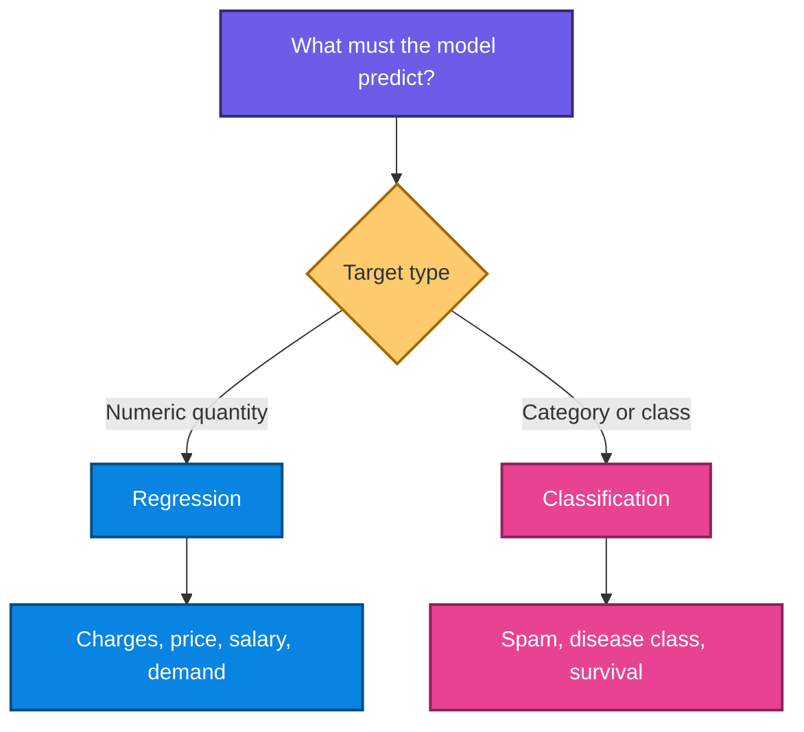

| Question | Target | Task |
|---|---|---|
| What will the insurance charge be? | continuous amount | regression |
| What is the expected used-car price? | continuous price | regression |
| Will a passenger survive? | yes/no class | classification |
| Which product category applies? | one of several classes | classification |

### When should regression be used?

Use regression when the outcome is a meaningful numeric quantity and the distance between predictions matters. A prediction of 20,000 versus 20,100 is a different type of error from predicting the wrong category.

> **Fun fact:** A numeric label is not automatically a regression target. Postal codes and category IDs contain numbers, but arithmetic distance between them is not meaningful.

---

## 3. What is linear regression?

Linear regression models the expected target as a linear combination of input features.

For one input feature:

$$
\hat{y}=\beta_0+\beta_1x
$$

For $p$ input features:

$$
\hat{y}=\beta_0+\beta_1x_1+\beta_2x_2+\cdots+\beta_px_p
$$

where:

- $\hat{y}$ is the predicted target;
- $\beta_0$ is the intercept;
- $\beta_j$ is the coefficient of feature $x_j$;
- $x_j$ is an observed feature value.

The data-generating model is often written as:

$$
y_i=\beta_0+\sum_{j=1}^{p}\beta_jx_{ij}+\varepsilon_i
$$

The random term $\varepsilon_i$ represents unmeasured influences, noise, and model mismatch.

### Intuition

Suppose hotter days tend to produce more lemonade sales. Temperature is the input $x$, glasses sold is the target $y$, and the fitted line summarizes the average trend. The line does not claim every day will lie exactly on it because weather, foot traffic, promotions, and chance also matter.

### Why is it called linear?

The model is linear in its coefficients. It can still contain transformed features:

$$
\hat{y}=\beta_0+\beta_1x+\beta_2x^2
$$

This is polynomial in $x$ but linear in $\beta_0,\beta_1,\beta_2$. It can therefore be fitted with linear-regression machinery after creating $x^2$.

### When is linear regression a strong starting point?

- a transparent baseline is needed;
- relationships are roughly additive and linear;
- coefficient interpretation matters;
- the dataset is not extremely high-dimensional;
- a fast model is useful for comparison;
- residual diagnostics can guide later improvements.

---

## 4. Simple linear regression

Simple linear regression has one predictor:

$$
\hat{y}=\beta_0+\beta_1x
$$

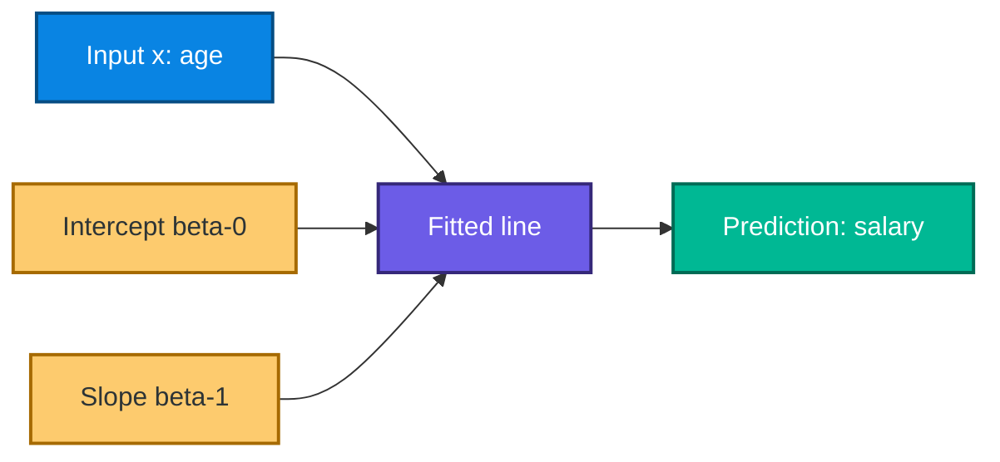

### 4.1 Intercept

$\beta_0$ is the predicted value when $x=0$:

$$
\hat{y}(0)=\beta_0
$$

It may be mathematically necessary but not practically meaningful. For example, the predicted salary at age zero is outside the employment population.

### 4.2 Slope

$\beta_1$ is the expected change in prediction for a one-unit increase in $x$:

$$
\Delta\hat{y}=\beta_1\Delta x
$$

If $\beta_1=1{,}500$, each additional year of age is associated with an average predicted salary increase of 1,500 units within the modeled population.

This is an association unless the study design supports a causal interpretation.

### 4.3 Worked prediction

Assume:

$$
\hat{y}=10{,}000+1{,}500x
$$

For $x=29$:

$$
\hat{y}=10{,}000+1{,}500(29)=53{,}500
$$

The prediction is 53,500 units. It is not a guarantee for a particular person.

### 4.4 Interpolation versus extrapolation

- **Interpolation:** predicting inside the observed feature range.
- **Extrapolation:** predicting outside the observed feature range.

Extrapolation assumes the same pattern continues beyond observed evidence. A line fitted to ages 22 through 46 should not be trusted automatically for age 5 or age 100.

---

## 5. Residuals and the best-fit line

For observation $i$, the residual is:

$$
e_i=y_i-\hat{y}_i
$$

- $e_i>0$: the model underpredicted;
- $e_i<0$: the model overpredicted;
- $e_i=0$: the prediction matched the observed target.

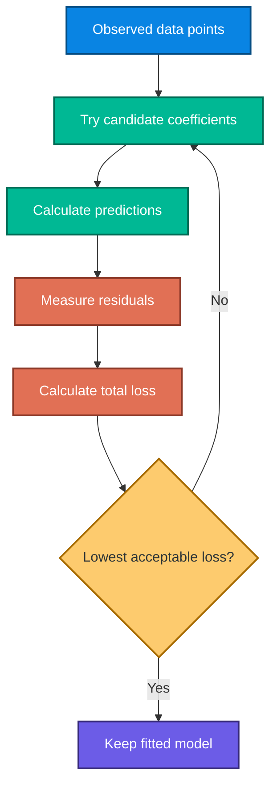

Why not simply add the residuals? Positive and negative residuals can cancel. Least squares avoids cancellation by squaring them.

> **Fun fact:** In ordinary least squares with an intercept, the training residuals sum to approximately zero, subject to numerical precision.

---

## 6. Least squares and the cost function

### 6.1 Sum of squared errors

$$
SSE=\sum_{i=1}^{m}(y_i-\hat{y}_i)^2
$$

Ordinary least squares chooses coefficients that minimize this quantity:

$$
\hat{\boldsymbol{\beta}}=
\arg\min_{\boldsymbol{\beta}}
\sum_{i=1}^{m}
\left(y_i-\beta_0-\sum_{j=1}^{p}\beta_jx_{ij}\right)^2
$$

### 6.2 Mean squared error

$$
MSE=\frac{1}{m}\sum_{i=1}^{m}(y_i-\hat{y}_i)^2
$$

The transcript and PDF use a convenient optimization form:

$$
J(\boldsymbol{\theta})=
\frac{1}{2m}\sum_{i=1}^{m}
\left(h_{\boldsymbol{\theta}}(\mathbf{x}^{(i)})-y^{(i)}\right)^2
$$

The factor $1/2$ does not change the minimizing coefficients. It cancels the factor $2$ produced when differentiating a square.

### Why squared loss?

- positive and negative errors cannot cancel;
- large errors receive more weight;
- the objective is smooth and convex for linear regression;
- under Gaussian-error assumptions, least squares is also maximum likelihood.

### When can squared loss be problematic?

Large outliers can dominate because an error of 100 contributes $100^2=10{,}000$. If unusual rows are valid, compare robust alternatives such as Huber regression and evaluate MAE as well.

---

## 7. Gradient descent

Gradient descent is an iterative optimization algorithm. It moves parameters in the direction that decreases the cost.

For each coefficient $\theta_j$:

$$
\frac{\partial J}{\partial\theta_j}=
\frac{1}{m}\sum_{i=1}^{m}
\left(h_{\boldsymbol{\theta}}(\mathbf{x}^{(i)})-y^{(i)}\right)x_j^{(i)}
$$

Update all coefficients simultaneously:

$$
\theta_j\leftarrow
\theta_j-\alpha\frac{\partial J}{\partial\theta_j}
$$

where $\alpha>0$ is the learning rate.

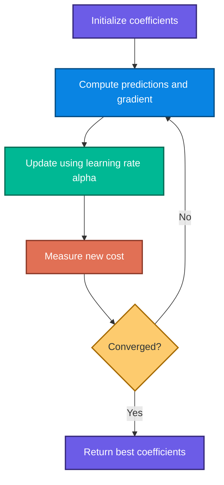

### Learning-rate intuition

| Learning rate | Likely behavior |
|---|---|
| too small | stable but slow progress |
| suitable | cost falls steadily |
| too large | overshooting, oscillation, or divergence |

### Important correction

The U-shaped plot is the **cost function as a function of parameters**. Gradient descent is the algorithm that travels across that surface. The surface itself is not the gradient-descent algorithm.

### From-scratch example

```python
import numpy as np

# One feature per row. Float type prevents accidental integer truncation.
x = np.array([1.0, 2.0, 3.0, 4.0])
y = np.array([3.0, 5.0, 7.0, 9.0])

beta_0 = 0.0  # Intercept
beta_1 = 0.0  # Slope
learning_rate = 0.05
n_iterations = 2_000
m = len(x)

for _ in range(n_iterations):
    # Current predictions from the line.
    y_hat = beta_0 + beta_1 * x

    # Prediction minus observation is used in the derivative.
    error = y_hat - y

    # Partial derivatives of mean squared loss.
    gradient_0 = error.mean()
    gradient_1 = (error * x).mean()

    # Move against the gradient to reduce the cost.
    beta_0 -= learning_rate * gradient_0
    beta_1 -= learning_rate * gradient_1

print(beta_0, beta_1)  # Approximately 1 and 2
```

For ordinary least squares, libraries often use direct linear-algebra solvers rather than basic gradient descent. Gradient methods become especially important in large-scale and more complex models.

---

## 8. Closed-form ordinary least squares

### 8.1 Simple-regression solution

For one feature:

$$
\hat{\beta}_1=
\frac{\sum_{i=1}^{m}(x_i-\bar{x})(y_i-\bar{y})}
{\sum_{i=1}^{m}(x_i-\bar{x})^2}
$$

$$
\hat{\beta}_0=\bar{y}-\hat{\beta}_1\bar{x}
$$

This shows that the line passes through $(\bar{x},\bar{y})$.

### 8.2 Matrix form

Write the model as:

$$
\mathbf{y}=\mathbf{X}\boldsymbol{\beta}+\boldsymbol{\varepsilon}
$$

When $\mathbf{X}^{T}\mathbf{X}$ is invertible:

$$
\hat{\boldsymbol{\beta}}=
(\mathbf{X}^{T}\mathbf{X})^{-1}\mathbf{X}^{T}\mathbf{y}
$$

Production software generally avoids explicitly computing the matrix inverse because numerically stable decompositions are safer.

### Fun relationships for simple regression

With one predictor and an intercept:

$$
R^2=r_{XY}^{,2}
$$

and the slope has the same sign as the Pearson correlation $r_{XY}$.

---

## 9. Multiple linear regression

Multiple linear regression uses several predictors:

$$
\hat{y}_i=\beta_0+\beta_1x_{i1}+\beta_2x_{i2}+\cdots+\beta_px_{ip}
$$

For insurance charges, a model might use age, BMI, children, smoker status, sex, and region. In two input dimensions, the fitted object is a plane; in more dimensions, it is a hyperplane.

### Coefficient interpretation

$\beta_j$ is the change in predicted target for a one-unit increase in $x_j$, **holding all included features constant**.

That phrase matters. If age and mileage are related in a car-price model, the mileage coefficient describes a comparison at the same modeled year, model, fuel type, and other included features.

### Interactions

An additive model assumes the effect of one feature does not depend on another. An interaction relaxes that assumption:

$$
\hat{y}=\beta_0+\beta_1BMI+\beta_2Smoker+
\beta_3(BMI\times Smoker)
$$

For non-smokers, the BMI slope is $\beta_1$. For smokers, it is $\beta_1+\beta_3$.

### Nonlinear features

Curvature can be represented with engineered terms:

$$
\hat{y}=\beta_0+\beta_1Age+\beta_2Age^2
$$

Do not extrapolate polynomial curves far outside the observed range.

---

## 10. Assumptions and diagnostics

Linear regression has different requirements depending on the goal.

- For **prediction**, honest validation and stable future behavior are central.
- For **statistical inference**, assumptions about errors are needed for standard errors, confidence intervals, and p-values.

| Assumption or condition | Why it matters | How to inspect |
|---|---|---|
| linearity in conditional mean | avoids systematic curves in errors | residual plots, partial residual plots |
| independent observations/errors | ordinary uncertainty formulas assume independence | study design, grouped/time plots |
| constant error variance | supports ordinary standard errors and stable error spread | residuals versus fitted values |
| no perfect multicollinearity | coefficients must be identifiable | rank checks, VIF, redundant columns |
| errors centered near zero | model should not systematically over/underpredict | residual mean and calibration plot |
| approximate residual normality | useful mainly for small-sample inference | Q-Q plot, histogram |
| representative training data | supports generalization | sampling audit, subgroup comparison |
| no severe influential errors | a few rows should not determine the line | leverage and Cook's distance |

### Important nuance

The raw target and predictors do not need to be normally distributed for ordinary least squares prediction. Normality concerns the conditional errors when exact small-sample inference is desired.

### Multicollinearity

High correlation among predictors can make individual coefficients unstable even when predictions remain reasonable. Ridge regularization can stabilize coefficients, but interpretation still needs care.

---

## 11. Preprocessing and categorical variables

### 11.1 One-hot encoding

Nominal categories have no natural order. One-hot encoding creates indicators:

$$
x_{ic}=\mathbf{1}(\text{row }i\text{ belongs to category }c)
$$

For fuel type, numbers such as Petrol=4 and Diesel=0 would impose an artificial numeric distance. One-hot encoding avoids that claim.

### 11.2 Why `drop="first"` may be used

With an intercept, including every level of one category creates exact linear dependence because the indicators sum to one. Dropping one reference level gives identifiable coefficients. Regularized models and some solvers can also handle a full set, but reference coding remains useful for interpretation.

### 11.3 Scaling

Standardization is:

$$
z_{ij}=\frac{x_{ij}-\mu_j}{\sigma_j}
$$

`StandardScaler` produces training-centered variables with training standard deviation near one. It does **not** guarantee every value lies between $-3$ and $3$.

#### When scaling matters

- Ridge, Lasso, and Elastic Net penalties;
- distance-based models;
- gradient-based optimization;
- numerical conditioning when feature magnitudes differ greatly.

#### When scaling is optional

Unregularized ordinary least squares with an intercept produces equivalent fitted predictions after an invertible rescaling, apart from numerical effects. Scaling changes coefficient units, not the underlying linear span.

### 11.4 Never cast a mixed dataframe to integer

This operation is unsafe:

```python
# Do not do this to an entire mixed dataframe.
encoded = encoded.astype(int)
```

It changes continuous values such as 27.9 to 27, 57.7 to 57, and 1.5 to 1. Convert only Boolean dummy columns when integer storage is actually needed.

---

## 12. Train, validation, test, and leakage

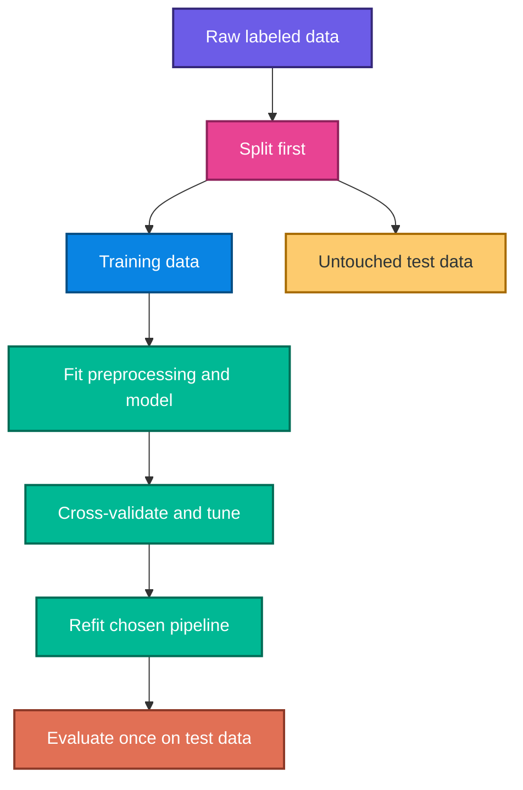

### Roles

| Subset | Purpose |
|---|---|
| training | fit coefficients and preprocessing parameters |
| validation or CV folds | choose features, transformations, and hyperparameters |
| test | estimate final generalization after choices are frozen |

### Data leakage examples

- fitting `StandardScaler` before the split;
- calculating an imputation median from all rows;
- selecting features using the full target;
- cleaning categories differently in train and test;
- repeatedly tuning after reading test scores;
- allowing duplicate entities into both train and test;
- using information generated after the prediction time.

### Why a pipeline works

A scikit-learn `Pipeline` fits every learned transformation only on the training portion provided to that fit call. During cross-validation, each fold receives its own fitted preprocessing parameters.

### Splitting is not always random

- use `GroupKFold` when multiple rows belong to one person, customer, or car;
- use time-aware splitting when predicting the future;
- stratification is useful for classification, not ordinary continuous regression;
- use repeated or nested validation when model selection is extensive.

---

## 13. Regression evaluation metrics

Regression models predict a continuous target value, so their errors are also continuous.  
Before defining the common metrics, define the **residual** for each observation:

Let $e_i=y_i-\hat{y}_i$.

Where:

- $y_i$ is the actual target value.
- $\hat{y}_i$ is the predicted target value.
- $e_i$ is the prediction error, also called the residual.
- $n$ is the number of observations.

A good regression model should make the residuals $e_i$ as small and as stable as possible across the dataset.

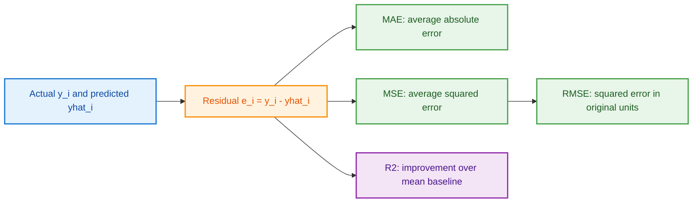

---

### 13.1 Mean absolute error

$$
MAE=\frac{1}{n}\sum_{i=1}^{n}|e_i|
$$

MAE is measured in target units and treats each unit of absolute error equally.

**What it means:**  
MAE tells you the average size of the prediction error, ignoring whether the prediction was too high or too low.

**Why it is useful:**  
MAE is easy to interpret because it is in the same unit as the target variable. For example, if you are predicting house prices in dollars, MAE is also in dollars.

**How to interpret it:**  
Lower MAE means better predictions. If MAE is $10{,}000$ for a house-price model, the model’s predictions are off by $10{,}000$ on average.

**When to use it:**  
Use MAE when every unit of error matters equally. It is especially useful when you want a simple, robust, business-friendly error measure.

**Example:**

Suppose:

$$
y = [100, 200, 300]
$$

and

$$
\hat{y} = [110, 190, 330]
$$

Then residuals are:

$$
e = [-10, 10, -30]
$$

Absolute residuals are:

$$
|e| = [10, 10, 30]
$$

So:

$$
MAE = \frac{10 + 10 + 30}{3}
$$

$$
MAE = \frac{50}{3} \approx 16.67
$$

**Limitation:**  
MAE is less sensitive to rare large misses. If one prediction is extremely wrong, MAE will not react as strongly as MSE or RMSE.

**Extra intuition:**  
MAE behaves like an average “distance” between predictions and actual values. It is robust compared to squared-error metrics, but it does not emphasize catastrophic errors.

---

### 13.2 Mean squared error

$$
MSE=\frac{1}{n}\sum_{i=1}^{n}e_i^2
$$

MSE strongly penalizes large errors and is measured in squared target units.

**What it means:**  
MSE measures the average squared prediction error. Since errors are squared, larger errors contribute disproportionately more to the final value.

**Why it is useful:**  
MSE is widely used in optimization and statistics because it is smooth, differentiable, and strongly punishes large mistakes.

This makes it especially useful during model training because gradients from squared error are easy to compute.

**How to interpret it:**  
Lower MSE is better. However, because MSE is in squared units, it is less directly interpretable than MAE. If the target is dollars, MSE is in dollars squared.

**When to use it:**  
Use MSE when large errors are especially undesirable. For example, in safety-critical forecasting, financial risk modeling, or systems where occasional huge mistakes are costly.

**Example:**

Using the same residuals:

$$
e = [-10, 10, -30]
$$

Squared residuals are:

$$
e^2 = [100, 100, 900]
$$

So:

$$
MSE = \frac{100 + 100 + 900}{3}
$$

$$
MSE = \frac{1100}{3} \approx 366.67
$$

**Limitation:**  
MSE can be dominated by outliers. A few very large errors can make MSE look much worse even if most predictions are good.

---

### 13.3 Root mean squared error

$$
RMSE=\sqrt{\frac{1}{n}\sum_{i=1}^{n}e_i^2}
$$

RMSE returns to the original target units while retaining the large-error penalty.

**What it means:**  
RMSE is the square root of MSE. It preserves MSE’s sensitivity to large errors but converts the value back into the original target units.

**Why it is useful:**  
RMSE is often preferred over MSE for reporting because it is easier to interpret. If the target is in dollars, RMSE is also in dollars.

**How to interpret it:**  
Lower RMSE means better predictions. Since RMSE penalizes large errors more than MAE, RMSE is always greater than or equal to MAE:

$$
RMSE \ge MAE
$$

This follows from the fact that squaring emphasizes larger deviations.

**When to use it:**  
Use RMSE when you want to emphasize large errors but still want an interpretable error value in the original target unit.

**Example:**

Using the previous MSE:

$$
MSE \approx 366.67
$$

Then:

$$
RMSE = \sqrt{366.67}
$$

$$
RMSE \approx 19.15
$$

So the model has an average squared-error magnitude of about $19.15$ in the original target units.

**Limitation:**  
Like MSE, RMSE can be heavily affected by outliers.

---

### 13.4 Coefficient of determination

$$
R^2=1-
\frac{\sum_{i=1}^{n}(y_i-\hat{y}_i)^2}
{\sum_{i=1}^{n}(y_i-\bar{y})^2}
$$

Interpretation on the evaluated sample:

- $R^2=1$: perfect predictions;
- $R^2=0$: same squared-error performance as predicting the sample mean;
- $R^2<0$: worse than that mean baseline.

$R^2$ is not classification accuracy and should not be described as “83% accurate.”

---

#### What $R^2$ means

$R^2$, also called the coefficient of determination, measures how much of the total variation in the actual target is explained by the model.

It compares the model’s squared error to the squared error of a simple baseline model that always predicts the mean:

$$
\hat{y}_i = \bar{y}
$$

Where:

$$
\bar{y} = \frac{1}{n}\sum_{i=1}^{n} y_i
$$

So $R^2$ answers this question:

> Is my model better than simply predicting the average target value every time?

---

#### Total Sum of Squares, $TSS$

The denominator in the $R^2$ formula is called **Total Sum of Squares**, usually written as $TSS$.

$$
TSS = \sum_{i=1}^{n}(y_i-\bar{y})^2
$$

Where:

- $y_i$ is the actual value of the target for observation $i$.
- $\bar{y}$ is the mean of all actual target values.
- $n$ is the total number of observations.

The mean is:

$$
\bar{y} = \frac{1}{n}\sum_{i=1}^{n}y_i
$$

**What does $TSS$ mean?**

$TSS$ measures the **total variation present in the actual target variable** before making any predictions.

In simple words:

> $TSS$ tells us how spread out the actual target values are around their average value.

If the actual target values are very spread out, $TSS$ will be large.  
If the actual target values are close to the mean, $TSS$ will be small.

---

#### Why $TSS$ is important in $R^2$

$R^2$ compares our model with a very simple baseline model.

The baseline model always predicts the mean:

$$
\hat{y}_i = \bar{y}
$$

If we use this baseline model, the error for each observation is:

$$
y_i - \bar{y}
$$

The squared error of this baseline model is:

$$
\sum_{i=1}^{n}(y_i-\bar{y})^2
$$

This is exactly $TSS$.

So $TSS$ represents the total squared error of the simplest mean-based baseline model.

Our regression model tries to do better than this baseline. Its squared error is:

$$
RSS = \sum_{i=1}^{n}(y_i-\hat{y}_i)^2
$$

Where $RSS$ is the **Residual Sum of Squares**.

Therefore:

$$
R^2 = 1 - \frac{RSS}{TSS}
$$

This means:

> $R^2$ measures how much of the total target variation, $TSS$, is reduced by the model.

---

#### Relationship between $TSS$, $RSS$, and $ESS$

There are three important sums of squares:

1. **Total Sum of Squares**, $TSS$
2. **Residual Sum of Squares**, $RSS$
3. **Explained Sum of Squares**, $ESS$

They are defined as:

$$
TSS = \sum_{i=1}^{n}(y_i-\bar{y})^2
$$

$$
RSS = \sum_{i=1}^{n}(y_i-\hat{y}_i)^2
$$

$$
ESS = \sum_{i=1}^{n}(\hat{y}_i-\bar{y})^2
$$

For ordinary least squares regression with an intercept:

$$
TSS = ESS + RSS
$$

So:

- $TSS$ is the total variation in the target.
- $ESS$ is the variation explained by the model.
- $RSS$ is the variation left unexplained by the model.

Therefore:

$$
R^2 = \frac{ESS}{TSS}
$$

and also:

$$
R^2 = 1 - \frac{RSS}{TSS}
$$

Both forms are equivalent when the model includes an intercept and the predictions come from ordinary least squares.

For arbitrary predictions, the formula

$$
R^2 = 1 - \frac{RSS}{TSS}
$$

is still commonly used as a sample evaluation metric, but the exact decomposition

$$
TSS = ESS + RSS
$$

may not hold unless the model satisfies the OLS assumptions.

---

#### Intuition behind $TSS$

Think of $TSS$ as the total uncertainty in the target variable before using any features.

If you know nothing about the data, the best simple guess is usually the mean, $\bar{y}$.

The error of that simple guess is measured by $TSS$.

A regression model tries to reduce this error.

So:

$$
\text{Model performance} = \text{How much of } TSS \text{ is reduced}
$$

If the model reduces almost all of $TSS$, then $RSS$ becomes very small and $R^2$ becomes close to $1$.

If the model does not reduce $TSS$, then $RSS$ remains close to $TSS$, and $R^2$ becomes close to $0$.

If the model is worse than the mean baseline, then:

$$
RSS > TSS
$$

and $R^2$ becomes negative.

---

#### Colorful $TSS$ intuition diagram

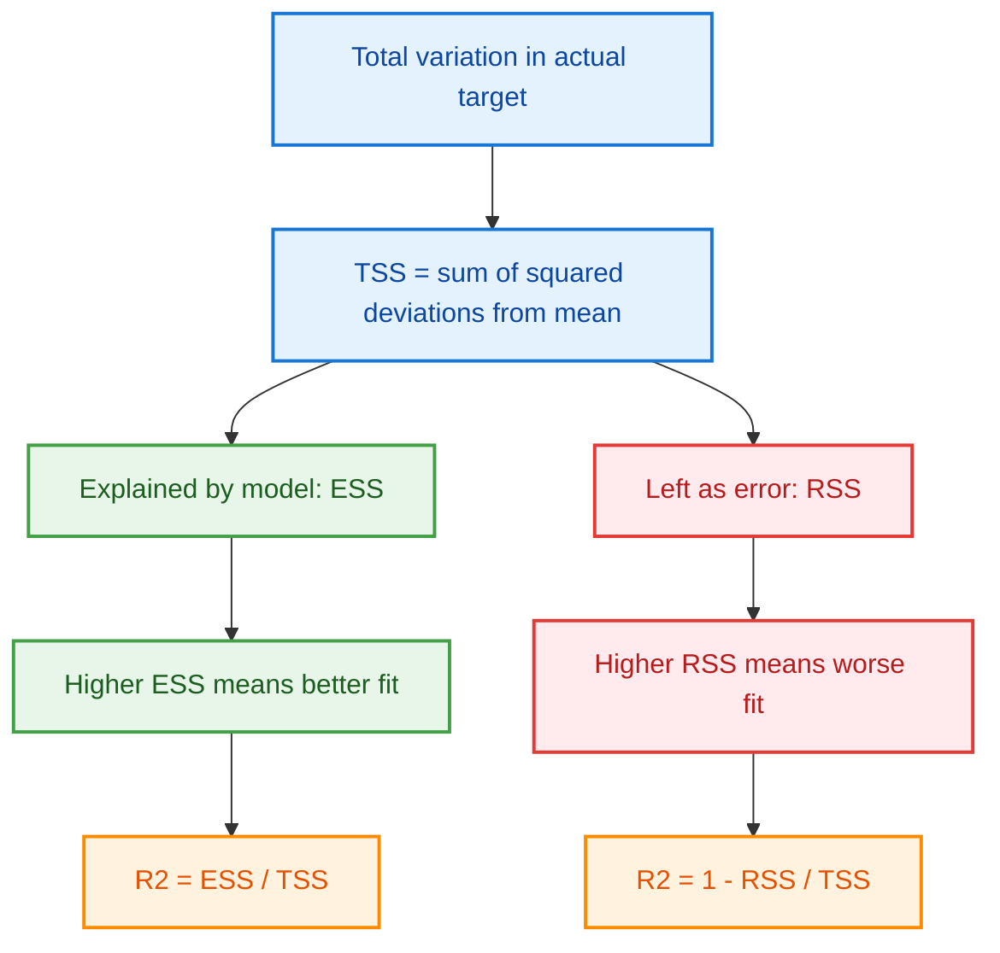

---

#### Numerical example for $TSS$

Suppose:

$$
y = [1, 2, 3, 4, 5]
$$

First calculate the mean:

$$
\bar{y} = \frac{1+2+3+4+5}{5}
$$

$$
\bar{y} = \frac{15}{5} = 3
$$

Now calculate each squared deviation:

| $y_i$ | $\bar{y}$ | $y_i-\bar{y}$ | $(y_i-\bar{y})^2$ |
|---:|---:|---:|---:|
| 1 | 3 | -2 | 4 |
| 2 | 3 | -1 | 1 |
| 3 | 3 | 0 | 0 |
| 4 | 3 | 1 | 1 |
| 5 | 3 | 2 | 4 |

Therefore:

$$
TSS = 4 + 1 + 0 + 1 + 4
$$

$$
TSS = 10
$$

This means the total variation in the target variable is $10$.

---

#### Connecting $TSS$ with $R^2$

Suppose the model predictions are:

$$
\hat{y} = [1.1, 1.9, 3.2, 3.8, 5.0]
$$

The residual sum of squares is:

$$
RSS = \sum_{i=1}^{n}(y_i-\hat{y}_i)^2
$$

Calculate each residual:

| $y_i$ | $\hat{y}_i$ | $y_i-\hat{y}_i$ | $(y_i-\hat{y}_i)^2$ |
|---:|---:|---:|---:|
| 1 | 1.1 | -0.1 | 0.01 |
| 2 | 1.9 | 0.1 | 0.01 |
| 3 | 3.2 | -0.2 | 0.04 |
| 4 | 3.8 | 0.2 | 0.04 |
| 5 | 5.0 | 0.0 | 0.00 |

So:

$$
RSS = 0.01 + 0.01 + 0.04 + 0.04 + 0.00
$$

$$
RSS = 0.10
$$

We already calculated:

$$
TSS = 10
$$

Therefore:

$$
R^2 = 1 - \frac{RSS}{TSS}
$$

$$
R^2 = 1 - \frac{0.10}{10}
$$

$$
R^2 = 1 - 0.01
$$

$$
R^2 = 0.99
$$

So the model explains $99\%$ of the total variation in this sample.

---

#### Important note about $TSS = 0$

If all actual target values are the same, then:

$$
y_i = \bar{y}
$$

for every observation.

In that case:

$$
TSS = 0
$$

For example:

$$
y = [5, 5, 5, 5]
$$

Then:

$$
\bar{y} = 5
$$

and:

$$
TSS = 0
$$

If $TSS = 0$, the target has no variation. In this situation, $R^2$ is not meaningful because the denominator becomes zero.

Many libraries handle this as a special case.

---

#### Python example focused on $TSS$, $RSS$, and $R^2$

```python
# Import NumPy for numerical operations
import numpy as np

# Actual target values
y_true = np.array([1, 2, 3, 4, 5])

# Predicted target values
y_pred = np.array([1.1, 1.9, 3.2, 3.8, 5.0])

# Step 1: Calculate the mean of actual target values
y_mean = np.mean(y_true)

# Step 2: Calculate Total Sum of Squares, TSS
# TSS measures total variation of actual values around the mean
tss = np.sum((y_true - y_mean) ** 2)

# Step 3: Calculate Residual Sum of Squares, RSS
# RSS measures unexplained error after model predictions
rss = np.sum((y_true - y_pred) ** 2)

# Step 4: Calculate R²
# R² tells how much of total variation is explained by the model
r2 = 1 - (rss / tss)

print("TSS:", tss)
print("RSS:", rss)
print("R²:", r2)
```

Expected output:

```text
TSS: 10.0
RSS: 0.10000000000000009
R²: 0.99
```

---

#### Summary of $TSS$, $RSS$, and $ESS$

| Term | Formula | Meaning |
|---|---:|---|
| $TSS$ | $\sum_{i=1}^{n}(y_i-\bar{y})^2$ | Total variation in actual target |
| $RSS$ | $\sum_{i=1}^{n}(y_i-\hat{y}_i)^2$ | Unexplained variation or prediction error |
| $ESS$ | $\sum_{i=1}^{n}(\hat{y}_i-\bar{y})^2$ | Variation explained by the model |

The key idea is:

$$
R^2 = 1 - \frac{\text{Error of model}}{\text{Error of mean baseline}}
$$

or:

$$
R^2 = 1 - \frac{RSS}{TSS}
$$

So $TSS$ is the baseline total error against which the model is compared.

---

#### Important cautions about $R^2$

1. **High $R^2$ does not guarantee a good model.**  
   A model can overfit the training data and still have a very high training $R^2$.

2. **Low $R^2$ does not always mean a bad model.**  
   Some domains, such as finance or human behavior, are naturally noisy.

3. **$R^2$ is not accuracy.**  
   Saying “$R^2 = 0.83$, so the model is 83% accurate” is misleading. It means the model explains $83\%$ of variance, not that $83\%$ of predictions are exactly correct.

4. **$R^2$ can be negative.**  
   This can happen on test data, with a poorly specified model, or when a model is worse than predicting the mean.

5. **$R^2$ does not prove causation.**  
   A high $R^2$ only indicates explanatory power on the evaluated data. It does not mean the predictors cause the target.

---

### 13.5 Adjusted $R^2$

$$
\bar{R}^2=
1-(1-R^2)\frac{n-1}{n-p-1}
$$

where:

- $n$ is the number of evaluated observations;
- $p$ is the number of fitted predictor columns, excluding the intercept.

Adjusted $R^2$ penalizes adding predictors that provide insufficient improvement. It is useful for comparing nested linear models fitted to the same rows and target, but cross-validation is usually stronger for predictive model selection.

---

#### What adjusted $R^2$ means

Adjusted $R^2$ modifies ordinary $R^2$ to account for the number of predictors in the model. It rewards useful predictors but penalizes unnecessary complexity.

In simple words:

> Adjusted $R^2$ asks whether the extra predictors improve the model enough to justify their addition.

---

#### Why adjusted $R^2$ is needed

Regular $R^2$ has a major limitation: it usually increases when you add more features, even if those features are not meaningful.

This happens because a model with more predictors has more flexibility to fit the training data.

For ordinary unregularized least squares, training $R^2$ cannot decrease when a new feature is added, because the model can always assign the new coefficient a value of zero.

Adjusted $R^2$ answers a more careful question:

> Did the new predictor improve the model enough to justify its addition?

---

#### How adjusted $R^2$ works

The adjustment factor is:

$$
\frac{n-1}{n-p-1}
$$

Since $p$ is usually greater than $0$:

$$
n-p-1 < n-1
$$

Therefore:

$$
\frac{n-1}{n-p-1} > 1
$$

This makes the unexplained part of $R^2$ larger, which usually lowers the score.

The formula can also be written as:

$$
\bar{R}^2 =
1 -
\frac{RSS/(n-p-1)}
{TSS/(n-1)}
$$

This version shows that adjusted $R^2$ compares residual variance with total variance using degrees of freedom.

If $k$ is the total number of fitted parameters including the intercept, then:

$$
k = p + 1
$$

and the formula can also be written as:

$$
\bar{R}^2 =
1-(1-R^2)\frac{n-1}{n-k}
$$

---

#### When to use adjusted $R^2$

Use adjusted $R^2$ when comparing linear regression models with different numbers of predictors, especially when the models are fitted on the same data and target.

It is especially helpful for:

1. Feature selection.
2. Comparing nested models.
3. Detecting whether added variables improve explanatory power.
4. Avoiding overly complex models.

---

#### Example

Suppose:

$$
n = 100
$$

Model A:

$$
p = 1
$$

$$
R^2 = 0.80
$$

Adjusted $R^2$:

$$
\bar{R}^2 = 1 - (1 - 0.80)\frac{100 - 1}{100 - 1 - 1}
$$

$$
\bar{R}^2 = 1 - 0.20 \cdot \frac{99}{98}
$$

$$
\bar{R}^2 \approx 0.798
$$

Model B:

$$
p = 10
$$

$$
R^2 = 0.81
$$

Adjusted $R^2$:

$$
\bar{R}^2 = 1 - (1 - 0.81)\frac{100 - 1}{100 - 10 - 1}
$$

$$
\bar{R}^2 = 1 - 0.19 \cdot \frac{99}{89}
$$

$$
\bar{R}^2 \approx 0.789
$$

Even though Model B has a higher $R^2$, Model A has a higher adjusted $R^2$. This suggests that Model B’s extra predictors may not be worth the added complexity.

---

#### When adjusted $R^2$ increases

Adjusted $R^2$ increases only if the new predictor improves $R^2$ enough to overcome the penalty for adding another parameter.

For example, when comparing an old model with $p_{\text{old}}$ predictors and a new model with $p_{\text{new}}$ predictors, adjusted $R^2$ improves only if the increase in $R^2$ is large enough relative to the loss in degrees of freedom.

---

#### Important cautions about adjusted $R^2$

1. Adjusted $R^2$ can be negative.
2. It is still an in-sample or sample-based metric.
3. It should not replace test-set evaluation or cross-validation for predictive modeling.
4. It is most meaningful for linear models with an intercept.
5. It can still favor overly complex models if the sample is small or noisy, so it should be used carefully.

---

### 13.6 Why use several metrics?

| Metric | Best for | Main limitation |
|---|---|---|
| MAE | typical absolute error in target units | less sensitive to rare large misses |
| RMSE | emphasizing large errors | can be dominated by outliers |
| $R^2$ | improvement over mean baseline | scale-free but not a cost measure |
| adjusted $R^2$ | in-sample nested linear comparison | not a substitute for test/CV performance |

No single metric gives the full story. Different metrics emphasize different aspects of model performance.

---

#### Why multiple metrics matter

- MAE tells you the average absolute mistake.
- MSE and RMSE tell you how severe large mistakes are.
- $R^2$ tells you how much better the model is than predicting the mean.
- Adjusted $R^2$ tells you whether added predictors are justified.

A model can have a good $R^2$ but still make costly large errors.  
A model can have a low MAE but hide one or two disastrous predictions.  
A model can have high training $R^2$ but perform poorly on unseen data.

Therefore, it is usually better to evaluate regression models using a combination of:

1. Training metrics.
2. Validation or test metrics.
3. Cross-validation.
4. Residual plots.
5. Domain-specific cost considerations.

---

#### Practical decision guide

| Situation | Prefer |
|---|---|
| You want a simple error in original units | MAE |
| Large errors are especially costly | RMSE or MSE |
| You want to compare against a mean baseline | $R^2$ |
| You are comparing linear models with different feature counts | adjusted $R^2$ |
| You want reliable predictive performance | test error or cross-validation |

---

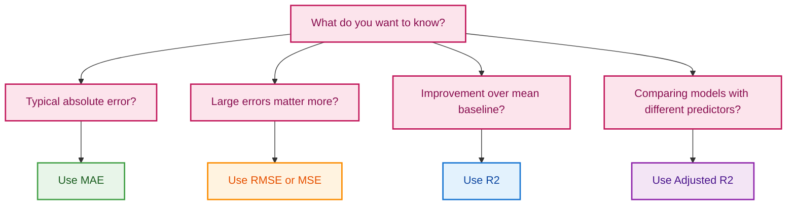

---

#### Complete Python example with comments

```python
# Import NumPy for numerical calculations
import numpy as np

# Define a function to compute common regression metrics
def regression_metrics(y_true, y_pred, n_predictors=0):
    """
    Calculates MAE, MSE, RMSE, TSS, RSS, R², and Adjusted R².

    Parameters:
        y_true: actual target values
        y_pred: predicted target values
        n_predictors: number of predictor variables, excluding intercept

    Returns:
        dictionary containing metric values
    """

    # Convert inputs to NumPy arrays with float values
    y_true = np.asarray(y_true, dtype=float)
    y_pred = np.asarray(y_pred, dtype=float)

    # Ensure both arrays have the same shape
    if y_true.shape != y_pred.shape:
        raise ValueError("y_true and y_pred must have the same shape.")

    # Number of observations
    n = y_true.size

    # Residuals: actual minus predicted
    residuals = y_true - y_pred

    # Mean Absolute Error: average absolute residual
    mae = float(np.mean(np.abs(residuals)))

    # Mean Squared Error: average squared residual
    mse = float(np.mean(residuals ** 2))

    # Root Mean Squared Error: MSE in original target units
    rmse = float(np.sqrt(mse))

    # Mean of actual target values
    y_mean = float(np.mean(y_true))

    # Total Sum of Squares: total variance in actual target
    tss = float(np.sum((y_true - y_mean) ** 2))

    # Residual Sum of Squares: unexplained variance
    rss = float(np.sum(residuals ** 2))

    # If TSS is zero, R² is undefined because the target has no variation
    if np.isclose(tss, 0.0):
        r2 = np.nan
        adjusted_r2 = np.nan
    else:
        # R² score: improvement over predicting the mean
        r2 = float(1 - (rss / tss))

        # Adjusted R² denominator
        denominator = n - n_predictors - 1

        # Adjusted R² is undefined if denominator is not positive
        if denominator <= 0:
            adjusted_r2 = np.nan
        else:
            # Adjusted R² formula
            adjusted_r2 = float(1 - (1 - r2) * (n - 1) / denominator)

    # Return all metrics in a dictionary
    return {
        "MAE": mae,
        "MSE": mse,
        "RMSE": rmse,
        "TSS": tss,
        "RSS": rss,
        "R2": r2,
        "Adjusted_R2": adjusted_r2
    }


# Example actual values
y_true = [1, 2, 3, 4, 5]

# Example predicted values
y_pred = [1.1, 1.9, 3.2, 3.8, 5.0]

# Compute metrics assuming one predictor variable
metrics = regression_metrics(y_true, y_pred, n_predictors=1)

# Print results
for name, value in metrics.items():
    print(f"{name}: {value:.6f}")
```

Expected output:

```text
MAE: 0.120000
MSE: 0.020000
RMSE: 0.141421
TSS: 10.000000
RSS: 0.100000
R2: 0.990000
Adjusted_R2: 0.986667
```

---

#### Optional scikit-learn version

```python
# Import required functions from scikit-learn
from sklearn.metrics import mean_absolute_error, mean_squared_error, r2_score

# Import NumPy for square root
import numpy as np

# Actual and predicted values
y_true = [1, 2, 3, 4, 5]
y_pred = [1.1, 1.9, 3.2, 3.8, 5.0]

# Calculate MAE
mae = mean_absolute_error(y_true, y_pred)

# Calculate MSE
mse = mean_squared_error(y_true, y_pred)

# Calculate RMSE from MSE
rmse = np.sqrt(mse)

# Calculate R²
r2 = r2_score(y_true, y_pred)

# Print results
print("MAE:", mae)
print("MSE:", mse)
print("RMSE:", rmse)
print("R²:", r2)
```

---

> **Fun fact:** Training $R^2$ cannot decrease when an additional feature is added to ordinary unregularized least squares. The model can always assign the new coefficient zero. Test $R^2$ can absolutely decrease.

**Additional fun facts:**

1. Adjusted $R^2$ can be negative if the model is very poor or has too many predictors.
2. In simple linear regression with one predictor and an intercept, $R^2$ equals the square of the Pearson correlation coefficient between $x$ and $y$.
3. RMSE is always greater than or equal to MAE because squaring amplifies larger errors.
4. A perfect $R^2 = 1$ on training data can be a warning sign of overfitting or data leakage.
5. $TSS = 0$ means the target has no variability, so $R^2$ is not meaningful.
---

## 14. Underfitting, overfitting, and bias-variance

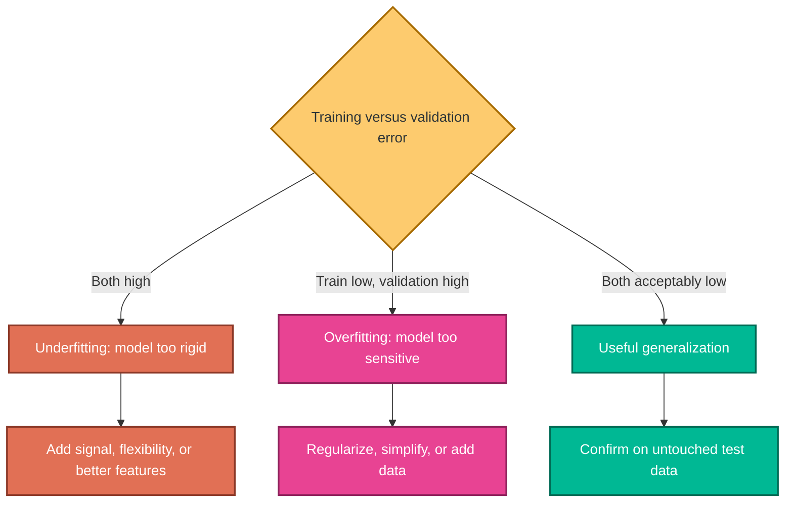

### Underfitting

Symptoms:

- high training error;
- high validation error;
- systematic residual patterns;
- model is unable to capture available signal.

Underfitting is usually associated with **high bias and relatively low variance**, not high variance.

Possible actions:

- add justified nonlinear terms or interactions;
- improve feature representation;
- reduce excessive regularization;
- use a more flexible model;
- correct target or data-quality problems.

### Overfitting

Symptoms:

- very low training error;
- substantially worse validation/test error;
- unstable performance across folds;
- coefficients or predictions change greatly with small data changes.

Overfitting is usually associated with low training bias and high variance.

Possible actions:

- use Ridge, Lasso, or Elastic Net;
- simplify feature engineering;
- collect more representative data;
- remove leakage;
- choose hyperparameters with cross-validation;
- group or time-split the data correctly.

### Bias-variance decomposition

For squared prediction error at a point:

$$
\mathbb{E}\left[(Y-\hat{f}(X))^2\right]
=Bias^2+Variance+Irreducible\ Noise
$$

No model can eliminate irreducible noise. The practical goal is not a zero training error; it is low expected error on future data.

---

## 15. Ridge, Lasso, and Elastic Net

Regularization discourages excessively large coefficients.

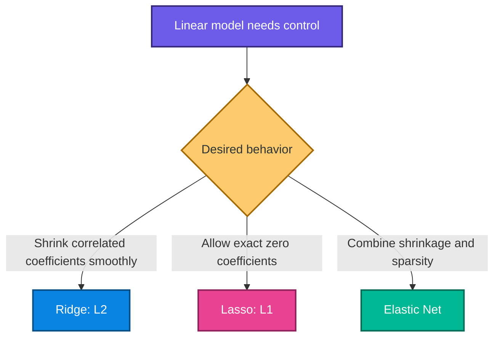

### 15.1 Ridge regression

$$
J_{Ridge}(\boldsymbol{\beta})=
\frac{1}{2m}\sum_{i=1}^{m}(y_i-\hat{y}_i)^2+
\lambda\sum_{j=1}^{p}\beta_j^2
$$

Ridge shrinks coefficients toward zero but usually not exactly to zero.

### 15.2 Lasso regression

$$
J_{Lasso}(\boldsymbol{\beta})=
\frac{1}{2m}\sum_{i=1}^{m}(y_i-\hat{y}_i)^2+
\lambda\sum_{j=1}^{p}|\beta_j|
$$

Lasso can set coefficients exactly to zero, producing a sparse model. With strongly correlated features, the selected feature can be unstable.

### 15.3 Elastic Net

$$
J_{EN}(\boldsymbol{\beta})=
\frac{1}{2m}\sum_{i=1}^{m}(y_i-\hat{y}_i)^2+
\lambda\left[
\rho\sum_{j=1}^{p}|\beta_j|+
(1-\rho)\sum_{j=1}^{p}\beta_j^2
\right]
$$

### Practical rules

- do not penalize the intercept in the ordinary formulation;
- standardize numeric features before coefficient penalties;
- choose $\lambda$ using cross-validation;
- larger $\lambda$ means stronger shrinkage;
- excessive regularization causes underfitting;
- regularization mainly addresses variance/overfitting, not every model problem.

---

## 16. Insurance-charge project

### 16.1 Verified data audit

The attached insurance data contains:

| Property | Verified value |
|---|---:|
| rows | 1,338 |
| columns | 7 |
| missing cells | 0 |
| exact repeated rows | 1 |
| rows after notebook-style deduplication | 1,337 |
| smokers after deduplication | 274 |
| non-smokers after deduplication | 1,063 |

The target is `charges`; the predictors are age, sex, BMI, number of children, smoker status, and region.

> An exact repeated row is not automatically a duplicate person when no entity identifier exists. Confirm record identity before deleting it in a real project.

### 16.2 Project flow

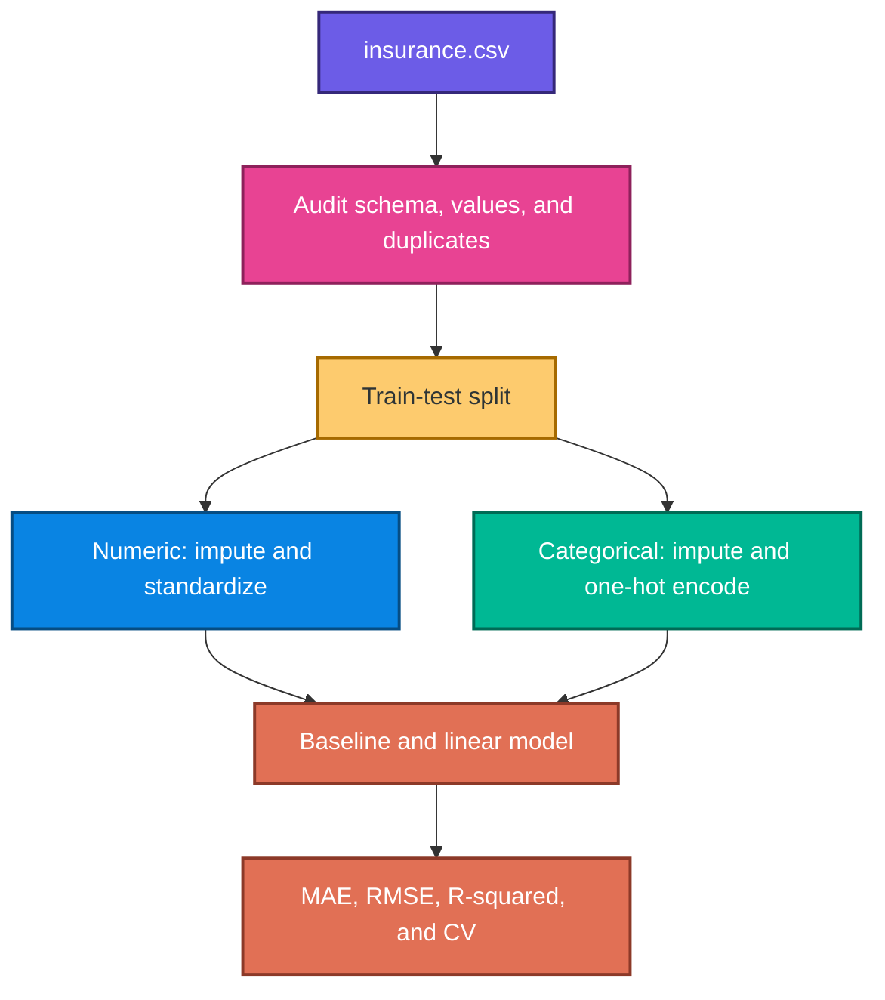

### 16.3 Leakage-safe implementation

Place `insurance.csv` beside the README or update `DATA_PATH`.

```python
from pathlib import Path

import numpy as np
import pandas as pd
from sklearn.compose import ColumnTransformer
from sklearn.dummy import DummyRegressor
from sklearn.impute import SimpleImputer
from sklearn.linear_model import LinearRegression
from sklearn.metrics import mean_absolute_error, mean_squared_error, r2_score
from sklearn.model_selection import KFold, cross_validate, train_test_split
from sklearn.pipeline import Pipeline
from sklearn.preprocessing import OneHotEncoder, StandardScaler

# ---------- Load and validate ----------
DATA_PATH = Path("insurance.csv")
insurance = pd.read_csv(DATA_PATH)

expected_columns = {
    "age", "sex", "bmi", "children", "smoker", "region", "charges"
}
if set(insurance.columns) != expected_columns:
    raise ValueError("The insurance file has an unexpected schema")

# The source notebook drops one exact repeated row. In production, first
# confirm that it is a duplicated record rather than a distinct person.
insurance = insurance.drop_duplicates().reset_index(drop=True)

X = insurance.drop(columns="charges")
y = insurance["charges"]

# Split before fitting any learned preprocessing step.
X_train, X_test, y_train, y_test = train_test_split(
    X,
    y,
    test_size=0.20,
    random_state=42,
)

numeric_features = ["age", "bmi", "children"]
categorical_features = ["sex", "smoker", "region"]

numeric_pipeline = Pipeline(
    steps=[
        ("imputer", SimpleImputer(strategy="median")),
        ("scaler", StandardScaler()),
    ]
)

categorical_pipeline = Pipeline(
    steps=[
        ("imputer", SimpleImputer(strategy="most_frequent")),
        (
            "onehot",
            OneHotEncoder(drop="first", handle_unknown="ignore"),
        ),
    ]
)

preprocessor = ColumnTransformer(
    transformers=[
        ("numeric", numeric_pipeline, numeric_features),
        ("categorical", categorical_pipeline, categorical_features),
    ]
)

linear_pipeline = Pipeline(
    steps=[
        ("preprocessor", preprocessor),
        ("model", LinearRegression()),
    ]
)

# A constant baseline reveals whether the model adds predictive value.
baseline = DummyRegressor(strategy="median")
baseline.fit(X_train, y_train)

linear_pipeline.fit(X_train, y_train)

predictions = {
    "Median baseline": baseline.predict(X_test),
    "Linear regression": linear_pipeline.predict(X_test),
}

for name, prediction in predictions.items():
    mae = mean_absolute_error(y_test, prediction)
    rmse = np.sqrt(mean_squared_error(y_test, prediction))
    r2 = r2_score(y_test, prediction)
    print(f"{name}: MAE={mae:.2f}, RMSE={rmse:.2f}, R2={r2:.3f}")
```

### 16.4 Verified holdout results

Using the exact split above:

| Model | MAE | RMSE | $R^2$ |
|---|---:|---:|---:|
| median baseline | 9,293.84 | 14,442.13 | -0.135 |
| linear regression | 4,177.05 | 5,956.34 | 0.807 |

With eight encoded predictor columns, the linear model's holdout adjusted $R^2$ is approximately 0.801.

These are teaching results from one fixed split, not a deployment claim.

### 16.5 Cross-validation

```python
cv = KFold(n_splits=5, shuffle=True, random_state=42)

scores = cross_validate(
    linear_pipeline,
    X,
    y,
    cv=cv,
    scoring={
        "mae": "neg_mean_absolute_error",
        "mse": "neg_mean_squared_error",
        "r2": "r2",
    },
)

fold_mae = -scores["test_mae"]
fold_rmse = np.sqrt(-scores["test_mse"])

print("Mean CV MAE:", fold_mae.mean())
print("Mean CV RMSE:", fold_rmse.mean())
print("Mean CV R2:", scores["test_r2"].mean())
print("R2 fold standard deviation:", scores["test_r2"].std())
```

Verified five-fold averages are approximately:

- MAE: 4,209.91;
- RMSE: 6,105.19;
- mean $R^2$: 0.739;
- $R^2$ fold standard deviation: 0.044.

The holdout $R^2$ is higher than the CV mean, showing why one split can look optimistic.

### 16.6 What the original notebook reported

Reproducing the notebook's exact sequence gives:

| Measure | Reproduced value |
|---|---:|
| MAE | 4,296.48 |
| RMSE | 6,001.13 |
| $R^2$ | 0.8040 |
| adjusted $R^2$ | 0.7980 |

The last value matches the displayed notebook result. However, the workflow scales before splitting and truncates continuous values, so it is not the preferred evaluation.

### 16.7 Insurance notebook issues

- `df_cleaned.astype(int)` truncates BMI and charges.
- BMI categories are created after BMI has already been truncated.
- `StandardScaler` is fitted on all rows before splitting.
- target-based Pearson and chi-square selection use the full dataset.
- charges are binned into quartiles, discarding regression magnitude.
- “Accept Null” is incorrect wording; use “fail to reject the null.”
- a feature can help through interactions even if a univariate p-value is large.
- `region_northwest` is retained in `final_df` even though the notebook's chi-square table labels it for dropping.
- adjusted $R^2$ is printed, while the preceding plain $R^2$ expression is not displayed.

---

## 17. Ford car-price project

### 17.1 Recorded notebook audit

The Ford notebook records:

| Property | Recorded value |
|---|---:|
| rows | 17,966 |
| columns | 9 |
| missing cells | 0 |
| minimum year | 1996 |
| maximum year | 2060 |
| minimum price | 495 |
| maximum price | 54,995 |

The features are model, year, transmission, mileage, fuel type, tax, MPG, and engine size. The target is price.

### 17.2 Data-quality warnings

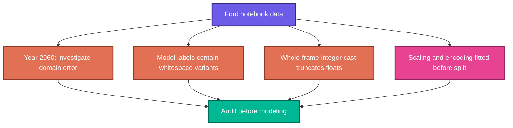

Specific observations from saved outputs:

- year 2060 appears alongside years no later than 2020 in the plot labels;
- model labels include both `' Focus'` and `'Focus'`, indicating whitespace inconsistency;
- whole-data integer casting changes MPG 57.7 to 57 and engine size 1.5 to 1;
- label encoding assigns arbitrary order to nominal car models and fuel types;
- the scaler and encoders are fitted before the train-test split;
- only $R^2$ is used even though MAE and MSE are imported;
- an $R^2$ value alone is called deployment-ready without cross-validation, diagnostics, or business checks.

### 17.3 Recorded model comparison

| Encoding | Recorded $R^2$ | Recorded adjusted $R^2$ |
|---|---:|---:|
| one-hot encoding | 0.8397 | 0.8387 |
| label encoding | 0.7310 | not displayed |

One-hot encoding performs better because it does not impose a fake numeric order. The Ford CSV was not attached, so these figures were not independently reproduced.

### 17.4 Corrected Ford template

This code requires `ford.csv`.

```python
from pathlib import Path

import numpy as np
import pandas as pd
from sklearn.compose import ColumnTransformer
from sklearn.dummy import DummyRegressor
from sklearn.impute import SimpleImputer
from sklearn.linear_model import Ridge
from sklearn.metrics import mean_absolute_error, mean_squared_error, r2_score
from sklearn.model_selection import GridSearchCV, train_test_split
from sklearn.pipeline import Pipeline
from sklearn.preprocessing import OneHotEncoder, StandardScaler

FORD_PATH = Path("ford.csv")
ford = pd.read_csv(FORD_PATH)

# Normalize category spelling before splitting. This operation is deterministic
# and learns no aggregate statistics from the dataset.
categorical_features = ["model", "transmission", "fuelType"]
for column in categorical_features:
    ford[column] = ford[column].astype("string").str.strip()

# Investigate impossible years instead of silently guessing a replacement.
suspect_years = ford.loc[~ford["year"].between(1996, 2020)]
if not suspect_years.empty:
    print("Rows requiring year verification:")
    print(suspect_years)

X = ford.drop(columns="price")
y = ford["price"]

X_train, X_test, y_train, y_test = train_test_split(
    X,
    y,
    test_size=0.20,
    random_state=42,
)

numeric_features = ["year", "mileage", "tax", "mpg", "engineSize"]

numeric_pipeline = Pipeline(
    steps=[
        ("imputer", SimpleImputer(strategy="median")),
        ("scaler", StandardScaler()),
    ]
)

categorical_pipeline = Pipeline(
    steps=[
        ("imputer", SimpleImputer(strategy="most_frequent")),
        ("onehot", OneHotEncoder(handle_unknown="ignore")),
    ]
)

preprocessor = ColumnTransformer(
    transformers=[
        ("numeric", numeric_pipeline, numeric_features),
        ("categorical", categorical_pipeline, categorical_features),
    ]
)

# GridSearchCV receives the complete pipeline, so preprocessing is refitted
# separately inside every tuning fold.
ridge_pipeline = Pipeline(
    steps=[
        ("preprocessor", preprocessor),
        ("regressor", Ridge()),
    ]
)

model = GridSearchCV(
    estimator=ridge_pipeline,
    param_grid={"regressor__alpha": np.logspace(-3, 3, 25)},
    scoring="neg_mean_absolute_error",
    cv=5,
    n_jobs=-1,
)

baseline = DummyRegressor(strategy="median").fit(X_train, y_train)
model.fit(X_train, y_train)

for name, prediction in {
    "Median baseline": baseline.predict(X_test),
    "Tuned Ridge": model.predict(X_test),
}.items():
    print(name)
    print("  MAE :", mean_absolute_error(y_test, prediction))
    print("  RMSE:", np.sqrt(mean_squared_error(y_test, prediction)))
    print("  R2  :", r2_score(y_test, prediction))
```

### Why 34 one-hot columns do not require 34 user questions

The user interface collects original fields such as model, year, transmission, and mileage. The saved pipeline converts those fields into encoded columns internally. PCA is not required merely to reduce the number of form inputs.

---

## 18. Interpreting coefficients

### 18.1 Numeric coefficient

If the unscaled mileage coefficient is $-0.08$, then one additional mileage unit is associated with a predicted price decrease of 0.08 price units, holding other included features constant.

### 18.2 Dummy coefficient

With `drop="first"`, one category becomes the reference. A positive `smoker_yes` coefficient means higher predicted charges than the reference `smoker_no` group at equal included feature values. It does not prove a causal effect.

### 18.3 Standardized coefficient

After standardization, a one-unit change means one training standard deviation. This can aid magnitude comparison, but correlated features still complicate importance interpretation.

### 18.4 Confidence intervals for inference

Under the classical assumptions:

$$
\widehat{Var}(\hat{\boldsymbol{\beta}})=
\hat{\sigma}^2(\mathbf{X}^{T}\mathbf{X})^{-1}
$$

where:

$$
\hat{\sigma}^2=\frac{SSE}{n-p-1}
$$

An approximate coefficient interval is:

$$
\hat{\beta}_j\pm
t_{1-\alpha/2,\,n-p-1}\,SE(\hat{\beta}_j)
$$

Scikit-learn focuses on prediction. Libraries such as `statsmodels` are often used for inferential summaries, but valid interpretation still depends on design and assumptions.

---

## 19. A practical diagnostic workflow

### 19.1 Residual plots

```python
import matplotlib.pyplot as plt
import seaborn as sns

# Use predictions from a held-out set, not training predictions alone.
test_prediction = linear_pipeline.predict(X_test)
residual = y_test - test_prediction

fig, axes = plt.subplots(1, 2, figsize=(12, 4))

sns.scatterplot(
    x=test_prediction,
    y=residual,
    color="#0984E3",
    alpha=0.7,
    ax=axes[0],
)
axes[0].axhline(0, color="#E84393", linestyle="--")
axes[0].set_xlabel("Predicted charges")
axes[0].set_ylabel("Residual")
axes[0].set_title("Residuals versus predictions")

sns.histplot(residual, bins=30, kde=True, color="#00B894", ax=axes[1])
axes[1].set_title("Held-out residual distribution")

fig.tight_layout()
plt.show()
```

Look for:

- curves, suggesting missing nonlinear structure;
- a funnel shape, suggesting changing variance;
- isolated large residuals;
- different error distributions across subgroups;
- systematic overprediction or underprediction;
- performance changes over time.

### 19.2 Model improvement order

1. verify target meaning and prediction time;
2. fix schema, units, duplicates, and category spelling;
3. build a leakage-safe baseline;
4. inspect residuals and validation-fold variability;
5. add justified transformations or interactions;
6. compare regularization strengths in cross-validation;
7. evaluate the frozen choice on untouched test data;
8. document limitations, monitoring, and rollback conditions.

Avoid repeatedly adding and removing features based only on the final test score. That turns the test set into a hidden training set.

---

## 20. Corrections and clarifications

| Source statement or practice | Correct interpretation |
|---|---|
| $R^2=0.83$ means 83% accuracy | $R^2$ is a variance-relative goodness-of-fit score, not classification accuracy |
| $R^2$ is always positive | test $R^2$ can be negative |
| StandardScaler puts all values between $-3$ and $3$ | values are centered and scaled but remain unbounded |
| underfitting means high bias and high variance | underfitting is typically high bias and relatively low variance |
| Ridge and Lasso solve underfitting | stronger regularization can worsen underfitting; they mainly control variance |
| the U-shaped surface is a gradient-descent curve | it is the cost surface; gradient descent moves over it |
| unregularized linear regression always requires scaling | scaling is optional for fitted OLS predictions but important for penalties and conditioning |
| label encoding is fine for unordered car models | it creates an artificial numeric order; one-hot encoding is safer |
| `astype(int)` is a harmless dummy conversion | it also truncates continuous features and targets |
| similar $R^2$ and adjusted $R^2$ prove the model is good | they do not test leakage, residual assumptions, stability, fairness, or future drift |
| an $R^2$ near 0.84 means ready for deployment | deployment also requires validation, baselines, diagnostics, monitoring, and business acceptance |
| every one-hot column becomes a form question | the interface asks for raw fields and the pipeline performs encoding |

---

## 21. Practice questions with solutions

### Question 1: task selection

Predicting insurance charges is regression or classification?

#### Solution 1

Regression, because charges are a numeric quantity and error magnitude matters.

### Question 2: prediction

Given $\hat{y}=5+3x$, calculate the prediction for $x=4$.

#### Solution 2

$$
\hat{y}=5+3(4)=17
$$

### Question 3: residual sign

The observed value is 20 and the prediction is 17. Find the residual.

#### Solution 3

$$
e=y-\hat{y}=20-17=3
$$

The positive residual means the model underpredicted by 3.

### Question 4: squared error

What is the squared error for the previous observation?

#### Solution 4

$$
e^2=3^2=9
$$

### Question 5: slope meaning

In $\hat{price}=30{,}000-0.10\,mileage$, interpret the slope.

#### Solution 5

Holding all other modeled features constant, one additional mileage unit is associated with a predicted price reduction of 0.10 price units.

### Question 6: gradient direction

Why is the gradient subtracted in gradient descent?

#### Solution 6

The gradient points in the direction of fastest local increase. Moving in its negative direction decreases the cost for a sufficiently small learning rate.

### Question 7: learning rate

What can happen if $\alpha$ is too large?

#### Solution 7

Updates can overshoot the minimum, oscillate, or diverge. A very small $\alpha$ may converge safely but slowly.

### Question 8: cost-factor one-half

Why is $1/(2m)$ sometimes used instead of $1/m$?

#### Solution 8

The $1/2$ cancels the derivative's factor 2. It simplifies algebra without changing the minimizing coefficients.

### Question 9: one-hot encoding

Why should Ford models not be encoded as Fiesta=1, Focus=2, Mustang=3 for ordinary linear regression?

#### Solution 9

The numbers impose false ordering and equal distance. One-hot encoding represents category membership without those assumptions.

### Question 10: leakage

Why is scaling before `train_test_split` problematic?

#### Solution 10

The scaler learns means and standard deviations from test rows. Test information then influences training representation, making evaluation less honest.

### Question 11: integer truncation

What happens to MPG 57.7 and engine size 1.5 after whole-frame `astype(int)`?

#### Solution 11

They become 57 and 1. This is truncation, not rounding, and destroys useful information.

### Question 12: MAE

For errors $[-2,1,4]$, calculate MAE.

#### Solution 12

$$
MAE=\frac{|-2|+|1|+|4|}{3}=\frac{7}{3}\approx2.33
$$

### Question 13: RMSE

For the same errors, calculate RMSE.

#### Solution 13

$$
RMSE=\sqrt{\frac{(-2)^2+1^2+4^2}{3}}
=\sqrt{7}\approx2.65
$$

RMSE exceeds MAE because the large error receives more weight.

### Question 14: negative $R^2$

Can test $R^2$ be negative?

#### Solution 14

Yes. It means the model's squared-error total exceeds the total obtained by predicting the evaluated target mean for every row.

### Question 15: adjusted $R^2$

Why can adjusted $R^2$ decrease after adding a feature?

#### Solution 15

The feature-count penalty increases. If the feature provides too little additional fit, the penalty is larger than the $R^2$ improvement.

### Question 16: underfitting

A model has poor training and validation performance. What is the likely problem?

#### Solution 16

Underfitting. The model or its feature representation cannot capture the available signal. Check data quality and consider justified flexibility.

### Question 17: overfitting

Training RMSE is 500 and validation RMSE is 4,000. What does this suggest?

#### Solution 17

A large generalization gap suggests overfitting, leakage in the training estimate, or a train-validation distribution mismatch. Investigate before selecting a remedy.

### Question 18: Ridge versus Lasso

Which method is more likely to set a coefficient exactly to zero?

#### Solution 18

Lasso, because its L1 penalty can produce sparse solutions. Ridge usually shrinks coefficients without making them exactly zero.

### Question 19: stronger regularization

Does increasing $\lambda$ always improve test performance?

#### Solution 19

No. It initially may reduce variance, but excessive shrinkage increases bias and causes underfitting. Choose $\lambda$ using validation or cross-validation.

### Question 20: suspicious Ford year

Why should a year value of 2060 not simply be replaced automatically?

#### Solution 20

It could be a typo, unit issue, synthetic row, or legitimate value under a different definition. Check source documentation or the original record before deciding the correction.

### Question 21: insurance baseline

The verified linear model has holdout MAE 4,177.05, while the median baseline has MAE 9,293.84. What does this show?

#### Solution 21

On that fixed holdout, the feature-based linear model substantially improves typical absolute error over the constant median predictor. It does not prove future production performance.

### Question 22: holdout versus CV

The insurance holdout $R^2$ is 0.807, but mean five-fold $R^2$ is 0.739. Which should be reported?

#### Solution 22

Report both with context. The holdout describes one partition; cross-validation shows average performance and variability across partitions. Keep an untouched final test set when extensive model selection is performed.

### Question 23: correlation and causation

If smoker status is highly correlated with charges, does that prove smoking causes the entire charge difference?

#### Solution 23

No. Observational association can reflect confounding, selection, measurement, and pricing policy. Predictive coefficients are not automatically causal effects.

### Question 24: scaling

Does standardizing a feature guarantee every transformed value lies in $[-3,3]$?

#### Solution 24

No. Standardization centers and scales using the training mean and standard deviation. Extreme observations can have any finite z-score.

---

## 22. Quick-reference cheat sheet

### Core formulas

| Concept | Formula |
|---|---|
| simple prediction | $\hat{y}=\beta_0+\beta_1x$ |
| multiple prediction | $\hat{y}=\beta_0+\sum_{j=1}^{p}\beta_jx_j$ |
| residual | $e_i=y_i-\hat{y}_i$ |
| MSE | $\frac{1}{n}\sum e_i^2$ |
| RMSE | $\sqrt{\frac{1}{n}\sum e_i^2}$ |
| MAE | $\frac{1}{n}\sum \lvert e_i\rvert$ |
| $R^2$ | $1-SSE/SST$ |
| adjusted $R^2$ | $1-(1-R^2)(n-1)/(n-p-1)$ |
| gradient update | $\theta_j\leftarrow\theta_j-\alpha\partial J/\partial\theta_j$ |
| Ridge penalty | $\lambda\sum\beta_j^2$ |
| Lasso penalty | $\lambda\sum\lvert\beta_j\rvert$ |

### Decision guide

| Situation | First response |
|---|---|
| numeric target | start with regression and a dummy baseline |
| unordered category | one-hot encode inside the pipeline |
| scaling needed | fit scaler on training data only |
| train and validation errors high | investigate underfitting and data quality |
| train error low, validation error high | investigate overfitting and leakage |
| many correlated features | compare Ridge with cross-validation |
| sparse linear model desired | compare Lasso or Elastic Net |
| curved residual pattern | add justified nonlinear terms or change model |
| funnel-shaped residuals | investigate variance structure or target transform |
| future prediction | use time-aware validation |
| repeated entities | use group-aware validation |

### Final project checklist

- [ ] Define the target, prediction time, population, and decision.
- [ ] Audit units, ranges, missing values, categories, and repeated entities.
- [ ] Freeze test data before learned preprocessing.
- [ ] Keep imputation, encoding, scaling, and selection inside a pipeline.
- [ ] Preserve continuous values; never cast the whole dataframe to integer.
- [ ] Compare with a simple baseline.
- [ ] Use MAE, RMSE, $R^2$, and business-relevant error analysis.
- [ ] Cross-validate the entire pipeline.
- [ ] Inspect residuals and subgroup errors.
- [ ] Tune regularization without touching the final test set.
- [ ] Distinguish predictive association from causal effect.
- [ ] Document assumptions and deployment limitations.

---

> **Core intuition:** Linear regression selects coefficients that make predictions close to observed targets under a chosen loss. The mathematics is only half the job. Honest splitting, leakage-safe preprocessing, baselines, residual analysis, and careful interpretation determine whether the result is trustworthy.
